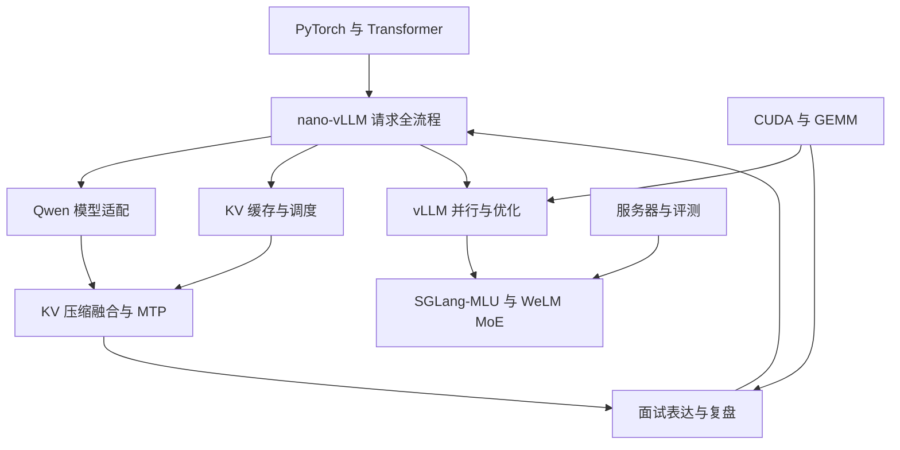

# AI Infra 项目总览

这里把课程、源码解析、项目扩展、面试复盘与实习文档连接成同一个知识入口。整理日期：2026-09-14。

## 建议学习顺序

PyTorch／Transformer 基础 → nano-vLLM 请求与模型执行 → Qwen 适配、KV 压缩与 MTP → vLLM 并行及优化 → SGLang-MLU／WeLM 实习。GEMM 算子作为并行学习线，面试复盘用于发现和补足薄弱环节。

## 按问题进入

- [[outputs/项目整理/专题-01-请求从输入到输出|专题-01-请求从输入到输出]]：先看模型结构，再看框架如何把请求组织成模型输入，最后练习完整口述。
- [[outputs/项目整理/专题-02-KV缓存与调度|专题-02-KV缓存与调度]]：把分页管理、前缀复用、分块预填充和压缩放在一起对照；这些机制处理的问题不同。
- [[outputs/项目整理/专题-03-Qwen模型适配与MTP|专题-03-Qwen模型适配与MTP]]：从原版模型执行走向 Hybrid 状态管理、多模态和投机解码；按每篇记录的代码版本理解。
- [[outputs/项目整理/专题-04-并行推理与MoE实习|专题-04-并行推理与MoE实习]]：先区分张量并行与专家并行，再进入 WeLM 结构和 MLU 适配。
- [[outputs/项目整理/专题-05-GEMM与推理性能|专题-05-GEMM与推理性能]]：把算子存储层次、框架开销和服务性能指标分层理解。
- [[outputs/项目整理/专题-06-服务部署评测与协作|专题-06-服务部署评测与协作]]：按环境准备、服务运行、评测分析、开发协作的工作顺序阅读。
- [[outputs/项目整理/专题-07-面试复盘闭环|专题-07-面试复盘闭环]]：从面试暴露的问题，回到原理和实现，最后形成可口述的项目介绍。

## 全部模块

| 模块 | 文档数 | 用途 |
| --- | --- | --- |
| [[outputs/项目整理/模块-面试准备|面试准备]] | 26 | 从请求完整链路出发，复习 Qwen、KV 压缩、MTP、MoE 与项目问答。 |
| [[outputs/项目整理/模块-面试记录|面试记录]] | 10 | 从真实问题回到知识点与项目实现，形成复习闭环。 |
| [[outputs/项目整理/模块-实习代码与资源|实习代码与资源]] | 4 | 本地源码和附带文档的入口。这里只建立文件索引，具体调用关系参见源码阅读指南。 |
| [[outputs/项目整理/模块-实习日记|实习日记]] | 3 | 保留每日问题，从问题跳转到 MoE 或服务评测相关文档。 |
| [[outputs/项目整理/模块-实习工程能力|实习工程能力]] | 6 | 沿服务器操作、容器、服务启动、评测与代码协作流程查阅。 |
| [[outputs/项目整理/模块-实习项目能力|实习项目能力]] | 5 | 连接 SGLang-MLU 插件结构、WeLM 模型、MoE 开发和运行环境。 |
| [[outputs/项目整理/模块-AI infra学习路线|AI infra学习路线]] | 22 | 规划入口：明确学习目标，再把课程、推理项目和算子项目放进同一条能力路线。 |
| [[outputs/项目整理/模块-gemm算子|gemm算子]] | 32 | 从 CUDA 线程与存储层次进入 GEMM 分块计算，连接源码分析、性能测试与面试表达。 |
| [[outputs/项目整理/模块-kvllm-qwen3.6融合|kvllm-qwen3.6融合]] | 2 | 连接 Qwen 适配与 KV 压缩两条项目线，阅读融合策略及任务书。 |
| [[outputs/项目整理/模块-leetcode|leetcode]] | 13 | 按 Python 语法与题型复习算法，为手写题准备。 |
| [[outputs/项目整理/模块-nano-kvllm|nano-kvllm]] | 15 | 理解 KV Cache 压缩方案，以及它对缓存管理和 Attention 执行的影响。 |
| [[outputs/项目整理/模块-nano-vllm-qwen3.6|nano-vllm-qwen3.6]] | 41 | 围绕模型适配的增量阅读；笔记同时涉及 Qwen3.5 和 Qwen3.6，具体版本以各篇正文为准。 |
| [[outputs/项目整理/模块-nano_vllm|nano_vllm]] | 33 | 先读整体调用关系，再沿请求入口、调度、缓存管理、模型执行、采样逐文件阅读。 |
| [[outputs/项目整理/模块-nanovllm项目面试准备|nanovllm项目面试准备]] | 25 | 把实现细节转化为原理解释、实验依据和面试回答。 |
| [[outputs/项目整理/模块-pytorch学习|pytorch学习]] | 4 | 理解数据、张量、模型训练与推理，为模型结构和推理框架打基础。 |
| [[outputs/项目整理/模块-transformer|transformer]] | 4 | 理解模型内部的数据流，再与 nano-vLLM 的模型执行流程对照。 |
| [[outputs/项目整理/模块-vllm|vllm]] | 24 | 从生产推理框架的引擎、Worker、显存管理走向并行、编译、量化与性能优化。 |
| [[outputs/项目整理/模块-提示词|提示词]] | 11 | 可复用的笔记生成与源码阅读方法；作为工作模板使用。 |

## 资源与维护

- [[outputs/项目整理/附件与源码资源索引|附件与源码资源索引]]：查找代码、PDF、字幕、图片与压缩包。
- [[outputs/项目整理/整理说明与校验报告|整理说明与校验报告]]：查看覆盖范围、重复文件和整理规则。

新增笔记时，在所属模块导航中加一条链接，并在笔记末尾链接回模块；有明确前置或应用关系时，再补入对应专题。阅读路线表达知识联系，具体技术结论和实现状态以原文记录的版本与验证范围为准。
