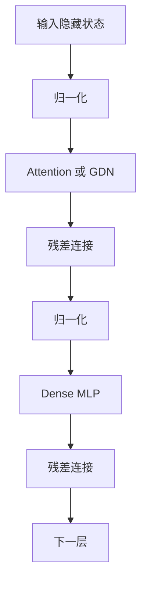
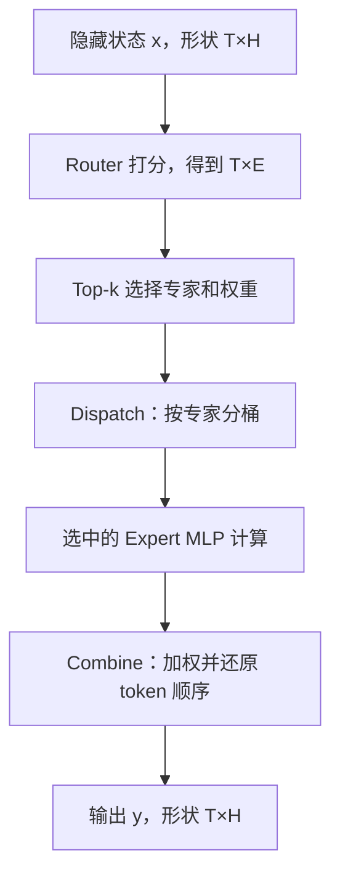
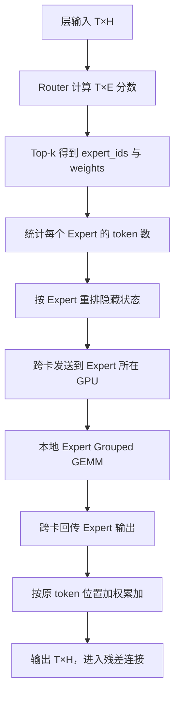
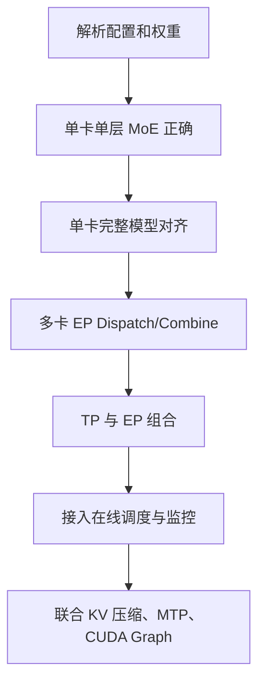

# MoE 模型完整学习指南：从 Dense 到混合专家推理系统

> 适合读者：已经学过普通稠密 Transformer、Attention、MLP，但没有系统学过 MoE 的初学者。
>
> 显示说明：本文不使用依赖插件的 LaTeX 数学语法。所有公式都写成普通文本和代码块，因此在 GitHub、VS Code、Typora、Obsidian 以及普通 Markdown 阅读器中都能直接显示。

---

## 0. 先用一句话理解 MoE

MoE（Mixture of Experts，混合专家）通常不是把整个 Transformer 推倒重做，而是把每层原来的一个 Dense MLP，换成：

```text
Router（路由器） + 多个 Expert MLP（专家） + Top-k 选择与结果合并
```

Dense 模型中，所有 token 都经过同一套 MLP；MoE 模型中，每个 token 先由 Router 选择少数几个专家，只执行这些专家，再把结果合并。

最重要的结论是：

```text
MoE 用“稀疏激活”把模型的总参数容量做得很大，
但一个 token 每次只使用其中一小部分参数。
```

这里必须区分三件事：

- **总参数量**：模型文件中一共存了多少权重；
- **激活参数量**：一个 token 在一次前向计算中真正用到多少权重；
- **计算量**：这些被激活权重实际执行了多少矩阵运算。

MoE 可以让“总参数量很大、激活参数量较小”同时成立，但所有专家的权重通常仍要装入多张 GPU，所以它并不等于“小显存模型”。

---

## 1. 从你熟悉的 Dense Transformer 开始

一个常见的 Decoder Layer 可以抽象为：



Attention 主要负责 token 之间的信息交流，MLP 主要对每个 token 自己的隐藏向量做非线性变换。大多数 MoE 模型替换的是 MLP，不是 Attention。

### 1.1 Dense MLP 是什么

以 Qwen 常见的 SwiGLU MLP 为例，设：

```text
T = 本轮进入这一层的 token 总数
H = hidden_size，隐藏维度
I = intermediate_size，MLP 中间维度
x = 输入隐藏状态，形状 [T, H]
```

计算可以写成：

```text
gate = x × W_gate
up   = x × W_up
mid  = SiLU(gate) × up          # 这里是逐元素相乘
y    = mid × W_down
```

形状变化为：

```text
x:       [T, H]
gate:    [T, H] × [H, I] -> [T, I]
up:      [T, H] × [H, I] -> [T, I]
mid:     [T, I]
y:       [T, I] × [I, H] -> [T, H]
```

为了便于理解，可以假设 `T=4、H=4096、I=11008`。这一层有 4 个 token，每个 token 都完整执行同一套 `W_gate、W_up、W_down`。

这就是“Dense”的含义：不管 token 表示中文、英文、代码还是标点，它们在这一层都使用同一套 MLP 参数，而且整套参数都会参与计算。

### 1.2 Dense MLP 的参数量怎么估算

忽略 bias，三块权重的参数量近似为：

```text
gate_proj 参数 = H × I
up_proj 参数   = H × I
down_proj 参数 = I × H

Dense MLP 总参数约 = 3 × H × I
```

例如 `H=4096、I=11008`：

```text
总参数约 = 3 × 4096 × 11008
         = 135,266,304
         ≈ 1.35 亿参数/层
```

Dense 模型的总参数量与每 token 激活参数量基本一致：这一层存了这一套 MLP，一个 token 也会完整使用这一套 MLP。

---

## 2. 为什么需要 MoE

扩大 Dense 模型通常有三种直接方法：增加层数、增大隐藏维度、增大 MLP 中间维度。但 Dense 模型一旦变大，每个 token 都必须执行变大的全部权重，训练和推理计算量都会同步增加。

MoE 提出另一条路线：不要只放一个越来越宽的 MLP，而是放很多个相对独立的 MLP 专家；每个 token 只调用其中少数专家。

这样可以把两个原本绑定的量拆开：

- 增加专家总数 `E`，主要增加总参数容量；
- 控制每 token 激活专家数 `k`，主要控制单 token 计算量；
- 当 `k` 远小于 `E` 时，模型可以拥有大量参数，但不必每次全算。

例如一层有 64 个专家，每个 token 只选择 2 个：模型存着 64 套专家知识，但当前 token 只使用其中 2 套。

注意，这不表示 MoE 一定比同名 Dense 模型快。真实速度还取决于专家宽度、路由开销、token 分桶、多卡通信、batch 大小和 GPU 利用率。

---

## 3. MoE 层的整体结构

一个典型 MoE 前馈层包括五部分：

1. Router：为每个 token 计算各专家得分；
2. Top-k：选出得分最高的少数专家；
3. Dispatch：按专家重新排列和分发 token；
4. Expert MLP：各专家计算自己收到的 token；
5. Combine：按路由权重把专家结果合回原 token。



假设 `T=3、H=4096、E=8、k=2`，Router 可能得到：

| token | Top-1 专家 | 权重 | Top-2 专家 | 权重 |
|---|---:|---:|---:|---:|
| token 0 | Expert 1 | 0.65 | Expert 6 | 0.35 |
| token 1 | Expert 2 | 0.55 | Expert 6 | 0.45 |
| token 2 | Expert 1 | 0.72 | Expert 4 | 0.28 |

系统再按专家整理：

| Expert | 本轮收到的 token |
|---|---|
| Expert 1 | token 0、token 2 |
| Expert 2 | token 1 |
| Expert 4 | token 2 |
| Expert 6 | token 0、token 1 |
| 其他 Expert | 无 |

最终结果为：

```text
y0 = 0.65 × Expert1(x0) + 0.35 × Expert6(x0)
y1 = 0.55 × Expert2(x1) + 0.45 × Expert6(x1)
y2 = 0.72 × Expert1(x2) + 0.28 × Expert4(x2)
```

同一个 token 选择两个专家时，并不是把隐藏向量一半给专家 1、一半给专家 6。两个专家通常都收到完整的 `x0: [H]`，各自输出一个 `[H]` 向量，然后按权重加起来。

---

## 4. Expert：专家内部到底是什么

“专家”这个名字听起来神秘，其实大多数 Expert 就是一套独立的 SwiGLU MLP。第 `e` 个专家仍然计算：

```text
gate_e = x × W_gate_e
up_e   = x × W_up_e
mid_e  = SiLU(gate_e) × up_e
out_e  = mid_e × W_down_e
```

MoE 与 Dense 的主要区别不在单个 MLP 内部，而在 MLP 外面多了：

```text
Router + Top-k + token 分桶/分发 + 结果加权合并
```

可以把 Dense 看成一个极端特例：

```text
Dense = 只有一个 Expert，而且所有 token 永远选择它。
```

### 4.1 专家是否真的分别负责中文、代码、数学

可能形成一定专业化，但不能机械理解成固定标签。训练时没有人手工规定“Expert 3 只学代码、Expert 7 只学中文”。Router 和专家共同根据语言模型损失学习。

一些专家可能更常处理某类语言、符号、语法结构或语义模式，但这种分工通常是统计性的，不是绝对规则。因此推理时必须对每个 token 实时计算 Router，不能根据文本类型手动指定专家。

---

## 5. Router：MoE 的交通指挥系统

Router 又叫 Gate 或 Gating Network。它通常比 Expert 小得多，常见形式是一层线性变换。

```text
x             = [T, H]
W_router      = [H, E]
router_logits = x × W_router = [T, E]
```

`router_logits[t, e]` 表示第 `t` 个 token 对第 `e` 个专家的原始偏好分数。

### 5.1 一个 Router 例子

假设一个 token 对 4 个专家的原始分数是：

```text
Expert 0:  1.2
Expert 1: -0.4
Expert 2:  2.1
Expert 3:  0.8
```

若 `Top-k=2`，则选中 Expert 2 和 Expert 0。再经过模型规定的归一化后，可能得到 0.71 和 0.29。

Router 本身只负责生成分数；选择、排序、归一化和分发通常由后续路由逻辑完成。

### 5.2 Softmax 与 Sigmoid 路由

不同模型对 Router 分数的处理可能不同。

**Softmax 路由：**所有专家共同竞争，一个专家概率升高会压低其他专家概率。

```text
prob = softmax(router_logits)
```

**Sigmoid 路由：**每个专家先独立得到一个 0 到 1 的分数，再选 Top-k。

```text
score = sigmoid(router_logits)
```

选择后还可能只对选中的 Top-k 权重重新归一化、乘固定缩放系数、加 Router bias，或使用分组 Top-k。这些都是模型定义的一部分。做推理适配时必须完全按照模型配置和参考实现，不能随意替换。

### 5.3 Top-1、Top-2、Top-k

| 选择方式 | 优点 | 代价 |
|---|---|---|
| Top-1 | 计算与通信最少 | 路由选择更激进，冗余少 |
| Top-2 | 两个专家组合，通常更稳定 | 专家计算与通信增加 |
| 更大的 k | 组合能力更强 | 激活参数、分发量和合并成本更高 |

不能只看 `k` 判断模型快慢。若某模型的专家很窄，即使 `k` 更大，实际计算量也可能仍然合理。

### 5.4 Router 是按请求选，还是按 token 选

通常是**逐 token、逐 MoE 层**选择。同一个请求中的不同 token 可以走不同专家；同一个 token 到下一层时隐藏状态已经变化，也可能改走另外的专家。

---

## 6. Dispatch：为什么必须把 token 按专家重排

Router 的输出按 token 排列：

```text
token 0 -> Expert 7
token 1 -> Expert 2
token 2 -> Expert 7
token 3 -> Expert 1
```

如果系统为每个 token 单独启动一次 Expert MLP，会产生大量极小矩阵运算，GPU 利用率很低。因此运行时会按 expert id 排序或计数分桶：

```text
Expert 1 -> token 3
Expert 2 -> token 1
Expert 7 -> token 0、token 2
```

随后每个专家一次处理一个子批。

Dispatch 阶段通常要维护：

| 信息 | 作用 |
|---|---|
| `expert_ids [T, k]` | 每个 token 选择了哪些专家 |
| `routing_weights [T, k]` | 每条专家路径的合并权重 |
| `token_indices` | token 原始位置 |
| `expert_offsets` | 各专家在连续 buffer 中的起止位置 |
| `permutation` | 原顺序到专家分桶顺序的映射 |
| `inverse_permutation` | 把专家输出还原到 token 顺序 |

### 6.1 为什么一个 token 会有 k 条路径

当 `k=2` 时，一个 token 同时送到两个专家。因此：

```text
路由条目数 = T × k
```

例如 `T=1000、k=2`，会产生约 2000 条 token-expert 路径。这不是生成了 2000 个新文本 token，而是同一批隐藏状态按路由关系被送到不同专家。

### 6.2 Dispatch 为什么耗性能

它可能需要统计专家 token 数、计算前缀和、排序或桶化、搬运隐藏状态、跨卡发送，并保存还原元数据。计算量不一定大，但显存读写和 kernel 启动很多，Decode 小 batch 时尤其明显。

---

## 7. Expert 计算：从一个规则 GEMM 变成多个不规则 GEMM

Dense MLP 的矩阵计算形状规则：

```text
[T, H] × [H, I]
```

MoE 分桶后，第 `e` 个专家收到 `N_e` 个 token：

```text
Expert e 输入: [N_e, H]
Expert e 权重: [H, I_e]
Expert e 输出: [N_e, H]
```

不同专家的 `N_e` 可能完全不同：

```text
N_0 = 120
N_1 = 15
N_2 = 0
N_3 = 67
```

这会产生许多大小不一的矩阵乘法。高性能实现通常使用 Grouped GEMM 或 Fused MoE kernel，把多个专家计算组织到一次或少数几次 kernel 中。

如果某个专家没有收到 token，就不执行它的 MLP；这正是稀疏计算节省算力的来源。

---

## 8. Combine：把专家结果合回原 token

Expert 输出按专家分桶排列，而下一步需要原 token 顺序的 `[T, H]`。Combine 要：

1. 找到每条专家输出属于哪个原 token；
2. 乘对应 routing weight；
3. 将同一个 token 的 k 条结果相加；
4. 还原为 `[T, H]`。

伪代码：

```python
y = zeros([T, H])
for route in all_token_expert_routes:
    token_id = route.original_token_id
    y[token_id] += route.routing_weight * route.expert_output
```

实际实现会使用融合 kernel、scatter-add 或专门的 combine kernel。一个常见错误是输出形状正确，却没有按原 token 位置和权重正确累加，导致语义完全错误。

---

## 9. 参数量、激活参数量和计算量的正确算法

设：

```text
H   = 隐藏维度
I   = Dense MLP 中间维度
I_e = 单个 Expert 的中间维度
E   = 总专家数
k   = 每 token 激活专家数
```

### 9.1 Dense MLP

```text
Dense 总参数约        = 3 × H × I
Dense 每 token 激活约 = 3 × H × I
```

### 9.2 MoE MLP

```text
所有 Expert 总参数约 = E × 3 × H × I_e
Router 参数约         = H × E
MoE 每 token 激活约   = k × 3 × H × I_e
```

Router 参数相对所有 Expert 通常很小，但 Router 和分发的运行时间不能忽略。

### 9.3 完整数值例子

假设 Dense MLP：

```text
H = 4096
I = 11008
Dense 参数约 = 3 × 4096 × 11008 ≈ 1.35 亿
```

假设一个 MoE 层：

```text
E   = 64
k   = 2
I_e = 2048
```

则：

```text
单个 Expert 参数约 = 3 × 4096 × 2048 ≈ 2517 万
64 个 Expert 总参数约 = 64 × 2517 万 ≈ 16.1 亿
每 token 激活 2 个 Expert 参数约 = 2 × 2517 万 ≈ 5033 万
```

这个假设例子中，MoE 层总参数远大于 Dense，但每 token 激活的 Expert 参数反而更少。不过它还要付出 Router、分桶、通信和小 GEMM 代价。

因此绝不能看到“64 个专家、Top-2”就说计算量是 Dense 的 2 倍。必须同时比较专家宽度 `I_e` 与 Dense 宽度 `I`。

---

## 10. 稀疏 MoE、共享专家和细粒度专家

### 10.1 Sparse MoE

每 token 只激活 Top-k，且 `k < E`。现代大语言模型讨论的 MoE 通常指这种稀疏 MoE。

### 10.2 Dense MoE

每 token 执行全部专家，再加权求和。它仍是专家混合，但没有省掉专家计算。

### 10.3 Routed Experts

由 Router 竞争选择的 Top-k 专家。

### 10.4 Shared Experts

共享专家通常由所有 token 固定执行，不参加普通 Top-k 竞争。可以理解为共享专家学习通用能力，路由专家学习更有差异的能力，输出再按模型规定融合。

若每 token 固定执行 1 个共享专家，再选择 2 个路由专家，那么实际执行 3 条专家路径。计算激活量时不能漏掉共享专家。

### 10.5 Fine-grained Experts

细粒度专家把少数宽专家拆成更多窄专家，再让 token 选择多个。它能提供更丰富的组合，但会让路由、分桶、通信和小矩阵计算更复杂。

---

## 11. 训练 MoE：Router 和 Expert 怎样学会分工

MoE 的主目标仍是根据前文预测下一个 token。Router 与所有 Expert 端到端训练：

1. token 隐藏状态进入 Router；
2. Router 选中少数专家；
3. 专家产生输出；
4. 模型计算预测损失；
5. 梯度更新被选中的 Expert 和 Router；
6. 长期训练后形成某种专家分工。

### 11.1 Top-k 不连续，怎么训练 Router

Top-k 的离散选择本身不平滑，但被选中路径的路由权重仍可参与梯度传播。不同方案还会使用辅助损失、噪声路由或其他技术稳定训练。推理系统不重新训练 Router，只严格执行 checkpoint 学到的路由规则。

### 11.2 专家塌缩

若 Router 总把 token 送到少数专家，会出现热门专家极忙、冷门专家学不到东西、多卡严重不均。这叫 Expert Collapse 或 Routing Collapse。

### 11.3 负载均衡辅助损失

训练时通常增加：

```text
总损失 = 语言模型主损失 + 系数 × 负载均衡损失
```

平衡损失关注每个专家被选中的 token 比例、Router 概率总量，以及是否少数专家占据绝大多数流量。它不是要求永远完全平均，而是防止极端拥堵。

### 11.4 Router Z-loss

Router logits 过大时，分布会过度尖锐，Softmax 也可能不稳定。一些训练方案加入 Z-loss 一类正则，限制 Router 分数尺度。

### 11.5 Expert Capacity

理想平均负载为：

```text
平均每专家路由条目数 = T × k ÷ E
```

容量近似为：

```text
Expert capacity = capacity_factor × T × k ÷ E
```

例如 `T=4096、k=2、E=64、capacity_factor=1.25`：

```text
平均条目数 = 4096 × 2 ÷ 64 = 128
容量       = 1.25 × 128 = 160
```

当某专家超过 160 条路径时，训练实现可能丢弃溢出路径、改派备用专家或采用无丢弃策略。

Token dropping 通常不是删掉整个文本 token，而是可能丢弃它超出容量的某条专家路径。推理阶段不能擅自丢弃正确路由，但仍要处理专家热点延迟。

---

## 12. 一层 MoE 推理的完整执行流程



形状总结：

```text
hidden_states:        [T, H]
router_logits:        [T, E]
topk_expert_ids:      [T, k]
topk_weights:         [T, k]
dispatch 路由条目:    约 T × k
Expert e 输入:        [N_e, H]
Expert e 输出:        [N_e, H]
combine 输出:         [T, H]
```

无特殊丢弃时：

```text
所有专家收到的路由条目数之和 = T × k
```

若存在共享专家、容量丢弃或特殊路由，需要按具体模型调整。

---

## 13. 多卡中的 TP、EP、DP

### 13.1 TP：张量并行

Dense 模型常用 Tensor Parallelism。TP=4 时，`gate/up` 通常按输出维度切成四份，`down` 接收对应分片，最后通过 All-Reduce 合并局部结果。

```text
TP = 四张卡共同计算同一个 MLP，每张卡保存和计算它的一部分。
```

### 13.2 EP：专家并行

Expert Parallelism 把不同专家放在不同 GPU。例如 64 个专家、EP=4：

| GPU | 本地 Expert |
|---|---|
| GPU 0 | 0～15 |
| GPU 1 | 16～31 |
| GPU 2 | 32～47 |
| GPU 3 | 48～63 |

若 token 选择 Expert 42，它的隐藏状态要发送到 GPU 2；计算后结果还要回传。

### 13.3 All-to-All 为什么出现

每张卡的 token 可能选择任意卡上的专家，因此每卡都可能给其他卡发数据并接收数据：

```text
本卡 token 按目标专家分组
-> All-to-All 发送 hidden states
-> 各卡计算本地 Experts
-> All-to-All 回传 expert outputs
-> 原位置加权合并
```

Dense TP 常见通信是规律的 All-Reduce；MoE EP 的 All-to-All 数据量随路由变化，更不规则，也更易负载不均。

### 13.4 DP：数据并行

Data Parallelism 让不同模型副本处理不同请求。MoE 中还可能采用 Expert Data Parallel、专家复制等更复杂组合。

### 13.5 TP 与 EP 如何组合

不能把 4 张卡随口同时当成完整 TP=4 和独立 EP=4 而不说明并行拓扑。

| 配置 | 含义 | 主要特点 |
|---|---|---|
| TP=4，EP=1 | 四卡共同切每个专家 | 无专家跨组分布，但 Expert 有 TP 同步 |
| TP=1，EP=4 | 每卡放一部分完整专家 | All-to-All 明显，单专家本地计算 |
| TP=2，EP=2 | 两卡切专家，两个专家组 | 兼顾显存与通信，实现更复杂 |

实际选择取决于模型权重、单专家大小、GPU 互联、batch 大小和延迟目标。在 4×RTX 3090 的 PCIe 环境里，All-to-All 可能成为明显瓶颈，不能只看理论 FLOPs。

---

## 14. Prefill 与 Decode 为什么表现不同

### 14.1 Prefill

Prefill 一次处理大量 prompt token，`T` 较大。路由后，每个热门 Expert 往往能收到较多 token，Expert GEMM 更大、更容易跑满 GPU。

但 Prefill 还有长序列 Attention、KV Cache 写入等开销，所以 Expert MLP 高效不代表端到端 Prefill 一定同比加速。

### 14.2 Decode

Decode 每个活跃请求每轮通常只处理一个新 token。若有 `B` 个活跃请求，本轮 Router 输入大致是 `[B, H]`。

当 `B` 较小时：

- 每个 Expert 可能只收到 0、1、2 个 token；
- GEMM 过小，GPU 利用率差；
- Router、排序、Dispatch、Combine 固定开销占比上升；
- All-to-All 延迟可能超过 Expert 计算；
- 热门 Expert 会拉高 TPOT 和 P99。

这就是在线 MoE 推理比离线大 batch 更难优化的原因。

### 14.3 Continuous Batching

连续批处理把不同请求当前轮的 token 合并，可增大 `T`，让每个 Expert 获得更大的子批，并摊薄通信与 kernel 启动开销。但 batch 变大也可能增加排队时间，系统仍要平衡吞吐、TTFT、TPOT 和 P99。

---

## 15. MoE 的优势与真实代价

### 优势

- 总参数容量大；
- 每 token 只激活少数专家；
- 不同 token 可以走不同计算路径；
- 相比让所有 token 都执行更宽 Dense MLP，扩展更灵活。

### 代价

- 所有 Expert 权重仍需分布式加载，权重显存很大；
- Router、Top-k、分桶和合并不是免费；
- EP 带来 All-to-All 通信；
- 热门专家可能成为慢点；
- Decode 小 batch 的 Expert GEMM 很碎；
- 权重加载、量化、并行组和 CUDA Graph 更复杂；
- 性能强烈依赖真实并发和硬件互联。

### 15.1 MoE 不会自动减少 KV Cache

KV Cache 主要来自 Attention 的历史 K/V，近似受以下因素影响：

```text
活跃请求数 × 上下文长度 × KV 层数 × KV head 数 × head_dim × 数据字节数
```

MoE 主要替换 MLP，所以不会自动减少 KV Cache。MoE 优化主要解决权重容量、MLP 计算和专家通信；KV 压缩主要解决长上下文缓存占用。二者可以同时存在，但不能混为一谈。

---

## 16. 常见 MoE 性能优化

### 16.1 Fused Router + Top-k

融合打分、激活、Top-k 和归一化，减少中间张量与 kernel 启动。

### 16.2 高效 Dispatch / Combine

使用计数、前缀和、桶化与融合搬运，减少完整排序和多次显存读写；Combine 时避免低效原子冲突。

### 16.3 Grouped GEMM / Fused MoE

把多个专家的不规则小 GEMM 组织到统一 kernel，提升占用率并减少逐专家启动开销。

### 16.4 通信与计算重叠

token 分块发送，已到达的 Expert 输入先计算，同时继续传输其他块。必须正确管理 stream、event、buffer 生命周期和回传顺序。

### 16.5 专家负载均衡与复制

根据历史热点复制热门专家、重新映射专家位置，或优化专家放置，减少某张卡长期过热。

### 16.6 量化与权重布局

FP8、INT8、INT4 可减轻巨大的 Expert 权重显存和带宽压力。但 Router、Expert 权重、激活和累加精度未必相同，必须匹配 checkpoint。

### 16.7 CUDA Graph

MoE 每轮各 Expert token 数动态变化，形状和通信量不固定。通常需要 padding、容量桶、固定 buffer 或支持动态路由的特殊方案，才能稳定使用 CUDA Graph。

---

## 17. MoE 与你当前 Qwen3.x 项目的关系

对上传仓库源码的核对结果：

- `nanovllm/models/qwen3.py` 的 `Qwen3MLP` 使用一套 `gate_up_proj + down_proj`；
- `nanovllm/models/qwen3_5.py` 的 `Qwen3_5MLP` 也是一套 `gate_up_proj + down_proj`；
- 每个 Decoder Layer 只有一个 `self.mlp`；
- 当前代码没有完整的 Router、Top-k、Expert 列表、Dispatch/Combine 或 EP All-to-All 链路。

因此当前项目里的两种“混合”要区分。

### 17.1 Qwen3.5 Hybrid 的混合

```text
部分层走 Full Attention
部分层走 Gated DeltaNet（GDN）
```

### 17.2 MoE 的混合

```text
Router 在多个 Expert MLP 中为每个 token 选择 Top-k
```

二者是独立维度：

| 序列建模模块 | 前馈模块 | 架构含义 |
|---|---|---|
| Full Attention | Dense MLP | 普通 Dense Transformer |
| Full Attention | MoE MLP | 常见 MoE Transformer |
| Full Attention + GDN | Dense MLP | 当前 Qwen3.5 Hybrid 路径 |
| Full Attention + GDN | MoE MLP | Hybrid MoE，两种混合同时存在 |

所以 Qwen3.5 Hybrid 不能直接等同于 MoE；适配 Hybrid MoE 时，需要同时支持序列模块选择和前馈模块选择。

---

## 18. 从 Dense 运行时升级为 Dense/MoE 混合运行时

建议把一层拆成两个正交选择：

```text
DecoderLayer
  1. sequence mixer: FullAttention 或 GDN
  2. feed forward:   DenseMLP 或 MoE
```

### 18.1 可以复用

- Tokenizer、Sequence、Scheduler、ModelRunner；
- Embedding、RMSNorm、RoPE、LM Head、Sampler；
- Attention、Paged KV Cache、Prefix Cache、KV 压缩；
- Prefill、Decode、抢占和重算生命周期；
- 现有 TP 通信基础设施。

### 18.2 必须新增

1. 配置解析：专家数、Top-k、专家宽度、共享专家、路由函数和缩放；
2. MoE 模块：Router、Expert 权重、Dispatch、Expert 计算、Combine；
3. 权重加载：专家编号、分片和量化格式；
4. 单卡数值对齐：先对齐参考模型 logits 与逐层输出；
5. EP 通信：专家归属、All-to-All、回传与顺序恢复；
6. TP/EP 组管理；
7. 在线调度：结合专家负载和通信成本；
8. 可观测性：每层每 Expert token 数、通信字节、GEMM 时间和 P99；
9. 兼容测试：连续批处理、抢占、CUDA Graph、Prefix Cache、KV 压缩、MTP。

### 18.3 推荐顺序



先做数值正确性，再做性能。否则输出错误时，很难判断问题来自路由公式、权重加载、token 重排还是多卡通信。

---

## 19. MoE 与 SLO 感知调度

Dense 在线调度通常考虑 Prefill/Decode token budget、TTFT、TPOT、P99、KV 空间和抢占代价。MoE 还增加：

- 本轮 token 路由到哪些 Expert；
- 各 GPU 的 Expert 负载是否均衡；
- All-to-All 发送多少数据；
- 长 Prefill 是否让热门 Expert 挤压 Decode；
- token 数相同的 batch，专家分布是否更分散。

MoE SLO 调度可进一步使用：

```text
token 预算 + KV 预算 + 等待时间 + Expert 负载预测 + 通信代价预测
```

完整 Router forward 前通常无法精确知道路由结果，工程上可使用历史统计、模型层热点或轻量预测估计，并通过真实负载验证。

---

## 20. 正确性与性能怎么测试

### 20.1 数值正确性

- 固定随机种子和输入；
- 对齐 Router logits；
- 对齐 Top-k expert ids 与 weights；
- 检查每个 Expert 输入的 token 与原始位置；
- 对齐 Expert 输出和 Combine 输出；
- 比较最终 logits、生成 token 与困惑度；
- 覆盖 Prefill、Decode、batch 变化和多卡路径。

### 20.2 路由不变量

无特殊丢弃时：

```text
每个 token 恰好有 k 条 routed-expert 路径
所有 Expert 的 token 条目总数 = T × k
Top-k 权重和符合模型定义
Combine 后 token 顺序与进入 MoE 前一致
EP 前后的 token id、expert id、source rank 能闭环对应
```

### 20.3 性能指标

- Router + Top-k 时间；
- Dispatch 与 Combine 时间；
- 两次 All-to-All 时间和字节数；
- 每个 Expert 的 `N_e` 分布；
- Grouped GEMM 时间与利用率；
- Prefill/Decode 吞吐；
- TTFT、TPOT、P50/P95/P99；
- 不同并发、上下文和 TP/EP 配置；
- 权重、KV Cache 与 Dispatch 临时 buffer 峰值显存。

只测平均 token/s 不足以判断在线 MoE 系统。平均吞吐提高但 P99 TPOT 恶化，仍可能不满足 SLO。

---

## 21. 初学者最容易混淆的 15 个问题

### 1. MoE 是不是每个请求只选一个专家？

不是。通常每个 token、每个 MoE 层都会重新选 Top-k。

### 2. 选两个专家，是不是把向量切成两半？

不是。两个专家通常都收到完整隐藏向量，再加权合并完整输出。

### 3. 没被选中的专家是否不用加载？

通常仍要把所有专家权重分布到 GPU，只是本轮不执行未命中专家。

### 4. MoE 参数大，计算量是否一定同样大？

不一定。总参数主要随 `E` 增长，激活计算主要随 `k × I_e` 增长。

### 5. Top-2 是否一定是 Dense 两倍计算？

不是，还要比较 Expert 与 Dense MLP 的宽度，并计入路由和通信。

### 6. MoE 是否降低 KV Cache？

不会自动降低。KV Cache 主要属于 Attention 路径。

### 7. Router 是否是人工规则？

通常不是。Router 在训练中学习，推理时根据隐藏状态实时打分。

### 8. 专家是否固定对应中文、代码、数学？

不一定。可能统计性专业化，但通常没有可靠的固定标签。

### 9. MoE 是否一定比 Dense 快？

不一定。小 batch、PCIe 多卡和负载不均时可能被通信与分桶拖慢。

### 10. EP 与 TP 是否一回事？

不是。TP 切一个矩阵，EP 把不同专家放到不同设备。

### 11. 为什么 EP 常用 All-to-All？

因为每张卡上的 token 可能选择任意卡上的专家，需要多对多交换。

### 12. 为什么 Prefill 更容易发挥 MoE 性能？

Prefill token 多，每个专家子批更大；Decode 小 batch 的 Expert GEMM 很碎。

### 13. Qwen3.5 Hybrid 是否就是 MoE？

不是。你当前项目的 Hybrid 指 Full Attention 与 GDN 混合，MLP 仍是 Dense。

### 14. Shared Expert 是否也算激活参数？

算。每 token 固定执行它，就必须计入参数和计算。

### 15. 推理时还需要负载均衡损失吗？

不计算训练损失，但真实路由仍可能不均衡，运行时仍要监控热点。

---

## 22. 面试时的完整回答

> MoE 可以理解为把 Transformer 每层原来唯一的一套 Dense MLP，替换成多个 Expert MLP 和一个 Router。普通 Dense 模型中所有 token 都执行同一套 MLP，而 MoE 会根据每个 token 当前的隐藏状态，计算它对各个专家的得分，只选 Top-k 个专家执行，再按照路由权重把结果合起来。这样模型可以通过增加专家数量扩大总参数容量，但单 token 的主要 Expert 计算只和激活专家数以及专家宽度有关。不过 MoE 只是节省了激活计算，并不意味着所有专家权重都不用加载，所以模型权重显存仍然很大。多卡推理时一般还需要 Expert Parallel，把不同专家分到不同 GPU，并通过 All-to-All 分发 token 和回传结果。真正的工程难点是 Router、token 分桶、Grouped GEMM、专家负载均衡以及通信开销，特别是在 Decode 小 batch 下，每个专家拿到的 token 很少，容易出现小矩阵效率低和尾延迟上升。对我当前的 nano-vLLM 项目来说，Qwen3.5 的 Hybrid 指 Full Attention 和 GDN 的混合，不等于 MoE；要支持 Dense/MoE 混合模型，还需要新增完整的 Router、Top-k、Dispatch、Expert 计算、Combine 和 EP 通信链路。

---

## 23. 最后的知识框架

1. Dense 与 MoE 的主要差异发生在 Transformer 的前馈 MLP；
2. Expert 内部通常仍是一套熟悉的 SwiGLU MLP；
3. Router 为每个 token、每个 MoE 层选择 Top-k 专家；
4. 总参数量更多由专家总数决定，激活计算量更多由 Top-k 和专家宽度决定；
5. Dispatch 按专家分桶，Combine 按原位置和权重合回；
6. EP 用 All-to-All 解决“token 在这里、专家在另一张卡”的问题；
7. 系统难点主要是权重显存、负载不均、通信和 Decode 小 GEMM，而不是 Expert MLP 公式本身。

只要能结合一轮下面的形状变化讲清这七点，就已经建立了完整的 MoE 基础框架：

```text
[T, H] -> [T, E] -> [T, k] -> [N_e, H] -> [T, H]
```


%% 项目关联导航：开始 %%
## 项目关联导航

- 所属模块：[[outputs/项目整理/模块-面试准备|模块-面试准备]]
- 关联阅读：[[outputs/项目整理/专题-04-并行推理与MoE实习|专题-04-并行推理与MoE实习]]

%% 项目关联导航：结束 %%
