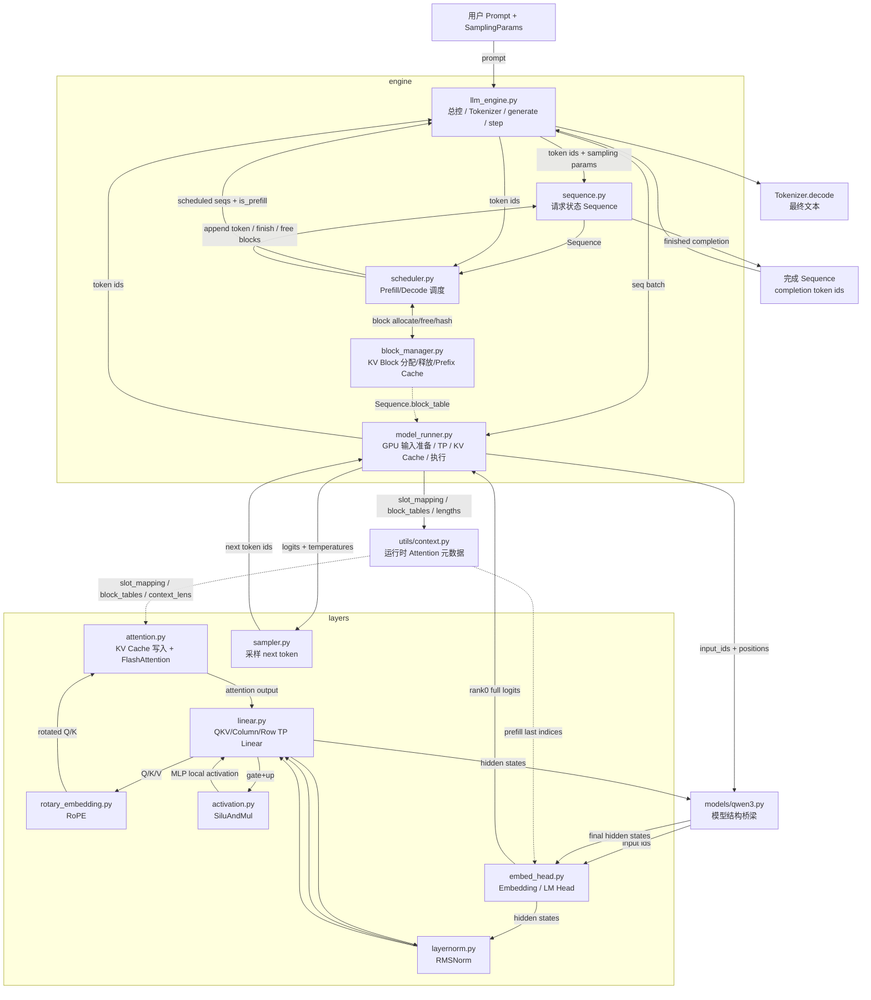

# nano-vLLM `engine` 与 `layers` 源码结构及完整调用链

> 基于你本次上传的 `nano-vllm.7z` 实际源码整理。本文只把源码解释到“文件 → 类 → 方法 → 模块调用关系”这一层，不做逐行语法讲解。
>
> 本次压缩包中 `nanovllm/engine` 共 5 个核心 Python 文件，`nanovllm/layers` 共 7 个核心 Python 文件。两者之间通过 `nanovllm/models/qwen3.py` 连接；另外 `nanovllm/utils/context.py` 是运行时元数据从 Engine 传到 Attention / LM Head 的关键桥梁。

---

## 1. 先建立整体心智模型

可以先把 nano-vLLM 分成四层：

```text
用户/API 层
    ↓
Engine 控制层
    ↓
Model 结构层（qwen3.py）
    ↓
Layers 算子层
```

其中：

- **`engine` 决定“什么时候算、算哪些请求、KV Cache 放哪里、这一轮是 Prefill 还是 Decode”。**
- **`models/qwen3.py` 决定“模型按照什么结构执行”。**
- **`layers` 决定“Embedding、Linear、RoPE、Attention、RMSNorm、激活、LM Head、采样具体怎么做”。**
- **`utils/context.py` 把 Engine 准备好的 `slot_mapping`、`block_tables`、序列长度等信息传给 Attention 和 LM Head。**

最关键的边界是：

1. `Scheduler` 不真正执行模型，它只做调度决策。
2. `BlockManager` 不保存 K/V 张量，它管理的是 **KV Block 的逻辑编号、分配、释放和复用关系**。
3. 真正的 KV Cache 大张量由 `ModelRunner.allocate_kv_cache()` 在 GPU 上创建。
4. 真正读写 KV Cache 的地方是 `layers/attention.py`。
5. `engine` 与绝大多数 `layers` 不直接调用，而是通过 `models/qwen3.py` 串起来。

---

## 2. 文件级总览

### 2.1 `engine` 五个文件

| 文件 | 核心职责 | 主要输入 | 主要输出/状态 |
|---|---|---|---|
| `engine/llm_engine.py` | 最外层推理控制器 | prompt、SamplingParams、Config | 最终文本/token；驱动 Scheduler 和 ModelRunner |
| `engine/sequence.py` | 单条请求的状态对象 | token ids、采样参数 | Sequence 状态、block table、完成 token |
| `engine/block_manager.py` | KV Block 生命周期与前缀缓存管理 | Sequence、Block ID、token block | block_table、缓存命中数、空闲/占用 Block 状态 |
| `engine/scheduler.py` | Prefill/Decode 调度、抢占、完成回收 | waiting/running Sequence | 本轮要执行的 Sequence 列表、`is_prefill` |
| `engine/model_runner.py` | GPU 执行、TP 多进程、输入准备、KV Cache、CUDA Graph、采样 | Sequence batch、`is_prefill` | 新 token ids |

### 2.2 `layers` 七个文件

| 文件 | 核心职责 | 主要输入 | 主要输出 |
|---|---|---|---|
| `layers/embed_head.py` | TP 词表 Embedding 与 LM Head | token ids / hidden states | hidden states / logits |
| `layers/linear.py` | TP 下各种 Linear 切分 | hidden states、权重 | 局部或 All-Reduce 后的 hidden states |
| `layers/layernorm.py` | RMSNorm 与残差融合 | hidden states、residual | normalized states、residual |
| `layers/rotary_embedding.py` | RoPE 位置编码 | positions、Q、K | 旋转后的 Q、K |
| `layers/attention.py` | KV Cache 写入 + Prefill/Decode Attention | Q/K/V、Context、KV Cache | Attention 输出 |
| `layers/activation.py` | SwiGLU 中的 SiLU×Gate/Up 融合 | gate/up 拼接结果 | 激活后的 MLP 中间值 |
| `layers/sampler.py` | temperature sampling | logits、temperature | 下一个 token id |

---

# 第一部分：逐文件理解 `engine`

---

## 3. `engine/sequence.py` —— 单条请求的“状态档案”

### 3.1 文件整体作用

`Sequence` 是 nano-vLLM 中单条请求在整个生命周期里的核心状态对象。

从请求进入直到结束，Scheduler、BlockManager、ModelRunner 都围绕同一个 `Sequence` 工作。它同时保存：

- prompt token；
- 已生成 token；
- 当前状态 WAITING/RUNNING/FINISHED；
- 已经有多少 token 对应 KV Cache；
- 本轮计划计算多少 token；
- 逻辑序列到物理 KV Block 的映射；
- temperature、最大输出长度、是否忽略 EOS。

### 3.2 输入与输出

**主要输入：**

- `token_ids: list[int]`
- `SamplingParams`

**主要输出：**

它本身不是一次性函数输出，而是一个不断变化的状态对象。最重要的对外状态包括：

- `token_ids`
- `last_token`
- `num_cached_tokens`
- `num_scheduled_tokens`
- `block_table`
- `completion_token_ids`
- `status`

### 3.3 `SequenceStatus`

```python
WAITING
RUNNING
FINISHED
```

职责非常直接：标记请求处于等待、执行还是完成状态。

### 3.4 `Sequence`

#### `__init__(token_ids, sampling_params)`

初始化一条请求。

重要字段可以分成四类：

| 类别 | 字段 | 含义 |
|---|---|---|
| Token 状态 | `token_ids`, `last_token`, `num_tokens`, `num_prompt_tokens` | 当前完整 token 序列 |
| 调度状态 | `status`, `is_prefill`, `num_scheduled_tokens` | 当前处于什么阶段、本轮算多少 token |
| KV 状态 | `num_cached_tokens`, `block_table` | 已经缓存多少 token、逻辑 block 映射到哪些物理 block |
| 采样状态 | `temperature`, `max_tokens`, `ignore_eos` | 生成控制参数 |

#### `__len__()`

返回当前 sequence 的 token 总数。

#### `__getitem__(key)`

让 `Sequence` 可以像列表一样被切片，例如 ModelRunner 中：

```python
seq[start:end]
```

用于取本轮 Prefill 真正需要计算的 token。

#### `is_finished`

判断状态是否为 `FINISHED`。

#### `num_completion_tokens`

返回：

```text
当前总 token 数 - prompt token 数
```

用于判断是否达到 `max_tokens`。

#### `prompt_token_ids`

返回原始 prompt 部分。

#### `completion_token_ids`

返回模型新生成的部分。

#### `num_blocks`

根据 `Sequence.block_size` 计算当前序列需要多少个 KV Block。

#### `last_block_num_tokens`

计算最后一个逻辑 Block 当前已经装了多少 token。

Decode 时 ModelRunner 用它定位“新 token 的 KV 应写到最后一个 Block 的哪个槽位”。

#### `block(i)`

返回第 `i` 个逻辑 token block 对应的 token ids。

主要供 `BlockManager` 做 hash 和 prefix cache 匹配。

#### `append_token(token_id)`

将新生成 token 追加到序列，并更新：

- `token_ids`
- `last_token`
- `num_tokens`

#### `__getstate__()` / `__setstate__()`

这是多进程传输优化。

rank 0 的 ModelRunner 会通过共享内存把 `Sequence` 序列化给其他 TP worker：

- **Prefill**：需要完整 prompt，因此传 `token_ids`；
- **Decode**：worker 只需要最后一个 token、长度、block table 等信息，因此不再传完整历史 token 列表。

这降低了每个 decode step 的 CPU 进程间通信量。

### 3.5 它和谁交互

```text
LLMEngine
   ↓ 创建
Sequence
   ↓
Scheduler ←→ BlockManager
   ↓
ModelRunner
```

`Sequence` 本身不做调度和计算，它是所有 Engine 模块共享的“请求状态载体”。

---

## 4. `engine/block_manager.py` —— KV Cache 的逻辑 Block 管理器

### 4.1 文件整体作用

这个文件解决的是：

> GPU 上的 KV Cache 已经提前切成固定大小的物理 Block，那么每条请求应该占哪些 Block？什么时候分配？什么时候释放？已有前缀能不能复用？

注意：这里**不直接存 K/V Tensor**。

它管理的是：

```text
Sequence 逻辑 token block
        ↓
物理 KV block_id
```

真正的 GPU KV Tensor 在 `ModelRunner` 中创建，在 `Attention` 中读写。

### 4.2 `Block`

代表一个物理 KV Block 的 CPU 侧元数据。

字段：

- `block_id`：物理 Block 编号；
- `ref_count`：有多少 Sequence 正在引用；
- `hash`：前缀缓存 hash；
- `token_ids`：这个完整 Block 对应的 token ids。

#### `update(hash, token_ids)`

某个 Block 的 token 已经完整可缓存后，记录：

- hash；
- token ids。

#### `reset()`

Block 被重新分配时重置使用状态：

- `ref_count = 1`
- hash 暂时设为无效；
- token ids 清空。

### 4.3 `BlockManager`

#### `__init__(num_blocks, block_size)`

初始化整个 Block 池。

核心结构：

```text
blocks               所有 Block 元数据
free_block_ids       当前空闲 Block
used_block_ids       当前正在使用 Block
hash_to_block_id     prefix hash → 物理 Block ID
```

#### `compute_hash(token_ids, prefix=-1)`

计算 Block 的链式 hash。

它不仅 hash 当前 Block token，还会把前一个 Block 的 hash 作为 prefix 加进去，因此：

```text
Block0 hash
   ↓
Block1 hash = hash(Block0 hash + Block1 tokens)
   ↓
Block2 hash = hash(Block1 hash + Block2 tokens)
```

这样相同 token block 只有在**前缀上下文也相同**时才会命中。

#### `_allocate_block()`

从 `free_block_ids` 中拿一个物理 Block。

主要动作：

1. 取空闲 ID；
2. 如果这个 Block 之前保存过旧 hash，必要时移除旧映射；
3. `reset()`；
4. 加到 `used_block_ids`；
5. 返回 `block_id`。

#### `_deallocate_block(block_id)`

当引用计数已经降到 0 后，把 Block 从 used 集合移回 free 队列。

#### `can_allocate(seq)`

Prefill 之前调用。

它同时回答两个问题：

1. 这个请求前面有多少完整 Block 可以从 prefix cache 复用？
2. 剩余空闲 Block 是否足够？

输出：

- `-1`：当前无法给请求分配足够 Block；
- `>= 0`：可复用的 cached block 数量。

源码只尝试匹配 `seq.num_blocks - 1` 之前的 Block，也就是把最后一个 Block 留给当前请求继续追加。

#### `allocate(seq, num_cached_blocks)`

真正建立：

```text
seq.block_table = [physical_block_0, physical_block_1, ...]
```

前半部分使用命中的 prefix cache Block；后半部分分配新 Block。

最后：

```python
seq.num_cached_tokens = num_cached_blocks * block_size
```

表示前缀中这些 token 不需要重新算。

#### `deallocate(seq)`

请求结束或被抢占时释放它引用的物理 Block。

对每个 Block：

1. `ref_count -= 1`
2. 如果降到 0，则回收到 free pool

同时清空：

- `seq.num_cached_tokens`
- `seq.block_table`

#### `can_append(seq)`

Decode 前判断：如果新 token 将进入一个新 Block，目前是否还有空闲 Block。

#### `may_append(seq)`

如果当前 token 恰好需要开启新 Block，就给 Sequence 增加一个物理 Block。

#### `hash_blocks(seq)`

把本轮刚刚真正计算完成的**完整 Block**登记为可复用 prefix cache。

它根据：

- `num_cached_tokens`
- `num_scheduled_tokens`

确定本轮哪些 Block 已经完整，然后计算链式 hash，写入：

```text
Block.hash
Block.token_ids
hash_to_block_id
```

### 4.4 最核心的数据关系

```text
Sequence.block_table
       │
       │ 逻辑 block i → 物理 block_id
       ↓
BlockManager
       │
       │ block_id
       ↓
ModelRunner / Attention 中的真实 KV Cache Tensor
```

---

## 5. `engine/scheduler.py` —— 每个 step 的调度决策中心

### 5.1 文件整体作用

Scheduler 决定：

- 哪些请求这一轮能运行；
- 这一轮执行 Prefill 还是 Decode；
- Prefill 一次计算多少 token；
- KV Cache 不够时抢占谁；
- 什么时候把请求从 waiting 移到 running；
- 新 token 生成后如何更新状态并结束请求。

它维护两个队列：

```text
waiting：尚未完成 Prefill / 被抢占后等待重算
running：已经进入正常生成阶段
```

### 5.2 输入与输出

`Scheduler.schedule()` 的输出是整个 Engine 最重要的接口之一：

```python
(seqs, is_prefill)
```

其中：

- `seqs`：本轮 GPU 真正要跑的请求；
- `is_prefill=True`：这一轮按 Prefill 准备数据；
- `is_prefill=False`：这一轮按 Decode 准备数据。

### 5.3 `Scheduler`

#### `__init__(config)`

保存 batch 限制和 EOS，并创建：

- `BlockManager`
- `waiting`
- `running`

#### `is_finished()`

当 waiting 和 running 都为空时，整批任务结束。

#### `add(seq)`

新请求加入 waiting 队列。

#### `schedule()`

这是整个调度器最核心的方法。

它分两段：

### A. Prefill 调度

只要 waiting 不为空，就优先尝试调度 waiting 请求。

主要步骤：

1. 看当前 batch 还剩多少 token budget；
2. 如果 Sequence 还没有 `block_table`：
   - 调 `BlockManager.can_allocate()`；
   - 检查 prefix cache；
   - 检查 Block 是否够；
   - 调 `allocate()`；
3. 计算还需要 Prefill 的 token 数；
4. 设置 `seq.num_scheduled_tokens`；
5. 如果本次 Prefill 已覆盖到当前序列末尾：
   - 状态改成 RUNNING；
   - waiting → running；
6. 返回这些请求并标记 `is_prefill=True`。

#### Chunked Prefill

当一个请求剩余 Prefill token 超过当前 `max_num_batched_tokens` 时，可以只调度其中一部分。

当前实现只允许**本批第一个请求**做 chunked prefill；如果 batch 中已经安排了其他 Prefill 请求，后面的请求无法再被切一个 chunk 塞进去。

### B. Decode 调度

只有这一轮没有任何 Prefill 请求被安排时，才进入 Decode。

每条 running Sequence：

1. 检查追加一个 token 是否需要新 KV Block；
2. 如果 Block 不够，触发抢占；
3. Block 足够：
   - `num_scheduled_tokens = 1`
   - `is_prefill = False`
   - 必要时增加新 Block
4. 加入本轮 `scheduled_seqs`。

最终返回：

```python
scheduled_seqs, False
```

#### `preempt(seq)`

当 Decode 阶段没有足够 KV Block 时：

1. Sequence 改回 WAITING；
2. `is_prefill=True`；
3. 释放当前 Block；
4. 插回 waiting 队首。

以后它会重新走 Prefill 调度；如果完整 Block 的 prefix cache 仍然可命中，则可以复用部分缓存，否则重算。

#### `postprocess(seqs, token_ids, is_prefill)`

GPU 运行结束之后统一更新 Sequence。

每条请求依次：

1. `BlockManager.hash_blocks(seq)`：登记新完成的完整 KV Block；
2. `num_cached_tokens += num_scheduled_tokens`；
3. 清零 `num_scheduled_tokens`；
4. 如果是 chunked Prefill 且 prompt 还没处理完：直接等待下一轮，不接受本轮采样 token；
5. 否则 `append_token(token_id)`；
6. 判断：
   - token 是否为 EOS；
   - 是否达到 `max_tokens`；
7. 若结束：
   - `FINISHED`
   - 释放 Block
   - 从 running 删除。

### 5.4 Scheduler 的本质

一句话记忆：

> Scheduler 管“请求级时间调度”，BlockManager 管“KV 空间调度”。

---

## 6. `engine/model_runner.py` —— 从 Sequence 到 GPU 模型执行

### 6.1 文件整体作用

`ModelRunner` 是 Engine 和模型之间最重要的执行桥梁。

它负责：

- 初始化 NCCL Tensor Parallel；
- 每张 GPU 创建一份 TP shard 模型；
- 加载对应分片权重；
- 模型 warmup；
- 根据剩余显存分配 KV Cache；
- 将 `Sequence` 转为 GPU `input_ids`、`positions`、`slot_mapping`、`block_tables`；
- 设置运行时 Context；
- 执行 Qwen3 forward；
- 计算 logits；
- rank 0 采样下一个 token；
- 可选 CUDA Graph decode；
- rank 0 通过共享内存驱动其他 TP worker。

### 6.2 `__init__(config, rank, event)`

初始化顺序非常关键：

```text
初始化 NCCL process group
      ↓
绑定当前 CUDA device
      ↓
创建 Qwen3ForCausalLM
      ↓
load_model() 加载 TP 权重
      ↓
创建 Sampler
      ↓
warmup_model()
      ↓
allocate_kv_cache()
      ↓
可选 capture_cudagraph()
      ↓
TP worker 进入 loop()
```

#### TP 多进程结构

如果 `tensor_parallel_size > 1`：

- rank 0 由主进程直接持有；
- rank 1...N-1 是子进程；
- rank 0 用共享内存写入 `method_name + args`；
- Event 唤醒其他 worker；
- 各 rank 同时执行同一个 `run()`。

### 6.3 多进程控制方法

#### `exit()`

释放共享内存、CUDA Graph，NCCL barrier 后销毁 process group。

#### `loop()`

worker rank 的事件循环：

```text
等待共享内存命令
→ call(method)
→ exit 时退出
```

#### `read_shm()`

worker 等待 Event，从 SharedMemory 读取 pickled 命令。

#### `write_shm(method_name, *args)`

rank 0 将命令序列化到共享内存并唤醒其他 worker。

#### `call(method_name, *args)`

统一 RPC 风格入口。

rank 0：

```text
先广播给其他 rank
再本地 getattr(self, method_name)(*args)
```

因此 `LLMEngine` 只需要调用 rank 0 的：

```python
model_runner.call("run", ...)
```

就能驱动所有 GPU。

### 6.4 `warmup_model()`

构造最大规模附近的假 Sequence，先跑一次 Prefill。

目的：

- 触发模型内核初始化；
- 统计模型执行时峰值显存；
- 为后续估算还能分多少 KV Cache Block 做准备。

### 6.5 `allocate_kv_cache()`

这是 GPU KV Cache 的真实创建位置。

先读取：

- GPU 总显存；
- 当前显存；
- warmup 峰值；
- `gpu_memory_utilization`。

然后估算单个 KV Block 的字节数：

```text
K/V 两份
× hidden layers
× block_size
× 每 rank KV heads
× head_dim
× dtype bytes
```

得到：

```python
config.num_kvcache_blocks
```

最终创建：

```text
kv_cache.shape =
[2,
 num_hidden_layers,
 num_kvcache_blocks,
 block_size,
 num_kv_heads_per_rank,
 head_dim]
```

第 0 维：

- 0 = K Cache
- 1 = V Cache

随后遍历模型中的 `Attention` 模块，将每层：

```python
module.k_cache
module.v_cache
```

指向总 KV Cache 中对应 layer 的切片。

因此：

> `BlockManager` 提供 block_id；`Attention` 根据 block_id 对真正的 `k_cache/v_cache` 进行读写。

### 6.6 `prepare_block_tables(seqs)`

将多个 Sequence 长度不一的 Python `block_table` padding 成矩阵：

```text
[batch_size, max_num_blocks]
```

空位置填 `-1`，转为 CUDA int32 Tensor。

供 FlashAttention 的 paged KV 访问使用。

### 6.7 `prepare_prefill(seqs)`

输入：本轮 Prefill 的 Sequence 列表。

输出：

```python
input_ids, positions
```

同时通过 `set_context()` 写入：

- `is_prefill=True`
- `cu_seqlens_q`
- `cu_seqlens_k`
- `max_seqlen_q`
- `max_seqlen_k`
- `slot_mapping`
- 可选 `block_tables`

#### 它做的核心转换

对每条 Sequence：

```text
start = num_cached_tokens
end   = start + num_scheduled_tokens
```

只把本轮真正需要算的 token 放进 `input_ids`。

所以 prefix cache 命中的 token 不会再次进入模型计算。

#### `slot_mapping`

把本轮每个新 token 映射到物理 KV Cache 的一维槽位：

```text
本轮 token i
     ↓
physical_block_id * block_size + offset
```

`Attention.store_kvcache()` 会依靠它把 K/V 写到正确位置。

#### `cu_seqlens_q / cu_seqlens_k`

用于 variable-length FlashAttention 描述 batch 内多条不同长度序列的边界。

如果存在 prefix cache：

```text
总 K 长度 > 本轮新 Q 长度
```

此时会同时准备 `block_tables`，让 Attention 从历史 paged KV Cache 读取旧 K/V。

### 6.8 `prepare_decode(seqs)`

Decode 每条 Sequence 本轮只处理一个 token。

准备：

- `input_ids = seq.last_token`
- `positions = len(seq) - 1`
- `context_lens = len(seq)`
- `slot_mapping = 新 token KV 的物理位置`
- `block_tables`

随后：

```python
set_context(False, ...)
```

Attention 看到 `is_prefill=False` 后走 Decode 路径。

### 6.9 `prepare_sample(seqs)`

收集每条请求自己的 temperature，变成 CUDA Tensor。

仅 rank 0 真正用于 Sampler。

### 6.10 `run_model(input_ids, positions, is_prefill)`

负责真正执行：

```text
Qwen3ForCausalLM.forward()
        ↓
Qwen3ForCausalLM.compute_logits()
```

两种路径：

#### Eager 路径

以下任一情况直接正常 forward：

- Prefill；
- `enforce_eager=True`；
- batch size > 512。

#### CUDA Graph Decode 路径

普通 Decode 且满足条件时：

1. 根据当前 batch size 选一个已捕获 graph；
2. 把本轮输入复制到预分配 graph buffer；
3. `graph.replay()`；
4. 再调用 LM Head 得到 logits。

### 6.11 `run(seqs, is_prefill)`

这是 LLMEngine 真正调用的执行入口。

完整过程：

```text
prepare_prefill / prepare_decode
        ↓
prepare_sample(rank0)
        ↓
run_model
        ↓
Sampler(rank0)
        ↓
reset_context
        ↓
返回 token_ids
```

只有 rank 0 返回最终 token ids。

### 6.12 `capture_cudagraph()`

提前针对一系列 batch size 捕获 Decode graph：

```text
1, 2, 4, 8, 16, 32, ...
```

预先创建固定地址的：

- input_ids
- positions
- slot_mapping
- context_lens
- block_tables
- outputs

之后 Decode 只更新这些 buffer 并 replay，减少 Python / kernel launch 开销。

---

## 7. `engine/llm_engine.py` —— 最外层总控

### 7.1 文件整体作用

`LLMEngine` 是用户 API 与内部 Engine 的总入口。

它负责把：

```text
字符串 prompt
```

一路变成：

```text
completion token ids → 文本
```

### 7.2 `LLMEngine`

#### `__init__(model, **kwargs)`

主要初始化：

1. `Config`
2. 设置 `Sequence.block_size`
3. 启动 TP worker
4. 创建 rank 0 `ModelRunner`
5. 创建 tokenizer
6. 设置 EOS token id
7. 创建 Scheduler
8. 注册退出清理函数

#### `exit()`

向所有 ModelRunner 发 `exit`，回收子进程。

#### `add_request(prompt, sampling_params)`

输入：

- 字符串 prompt 或 token id list；
- SamplingParams。

流程：

```text
str prompt
   ↓ tokenizer.encode
prompt token ids
   ↓ Sequence(...)
Sequence
   ↓ scheduler.add
waiting queue
```

#### `step()`

单步推理的总控制函数。

```text
Scheduler.schedule()
        ↓
ModelRunner.call("run")
        ↓
Scheduler.postprocess()
        ↓
收集 FINISHED Sequence
```

输出：

```python
outputs, num_tokens
```

其中 `num_tokens`：

- Prefill：本轮处理 token 数，为正；
- Decode：用 `-len(seqs)` 表示本轮生成 token 数，为负。

这主要用于 `generate()` 统计吞吐。

#### `is_finished()`

直接查询 Scheduler 是否还有请求。

#### `generate(prompts, sampling_params, use_tqdm=True)`

用户最常用的高级接口。

步骤：

1. 将所有 prompt 调 `add_request()`；
2. `while not is_finished()`；
3. 每轮调用 `step()`；
4. 统计 Prefill / Decode 吞吐；
5. 收集已结束 Sequence；
6. 按 `seq_id` 恢复输入顺序；
7. tokenizer.decode；
8. 返回：

```python
[
  {
    "text": ...,
    "token_ids": ...
  }
]
```

### 7.3 它和其他 Engine 文件的关系

```text
LLMEngine
 ├── 创建 Sequence
 ├── 调 Scheduler.schedule/postprocess
 └── 调 ModelRunner.run

Scheduler
 └── 调 BlockManager

ModelRunner
 └── 真正进入 model/layers
```

---

# 第二部分：逐文件理解 `layers`

---

## 8. `layers/embed_head.py` —— 输入 Embedding 与输出 LM Head

这个文件位于模型的最前端和最末端。

```text
input token ids
   ↓
VocabParallelEmbedding
   ↓
Transformer hidden states
   ↓
ParallelLMHead
   ↓
logits
```

## 8.1 `VocabParallelEmbedding`

### 作用

把大词表按 vocabulary 维度切到不同 TP rank。

例如：

```text
vocab_size = 120000
TP = 4

rank0: token 0~29999
rank1: token 30000~59999
rank2: token 60000~89999
rank3: token 90000~119999
```

### `__init__()`

计算当前 rank 的：

- `vocab_start_idx`
- `vocab_end_idx`
- 本地 Embedding 权重大小。

### `weight_loader()`

从完整 checkpoint 中沿词表维切出当前 rank 对应的权重 shard。

### `forward(x)`

每个 rank：

1. 找出属于自己 vocab partition 的 token；
2. 其他 token 先 mask；
3. 本地 `F.embedding()`；
4. 非本 rank token 对应 hidden 清零；
5. `dist.all_reduce(y)`。

因为每个 token 只会在一个 rank 得到非零 Embedding，所以 All-Reduce 后所有 rank 获得相同完整 hidden states。

## 8.2 `ParallelLMHead`

继承 `VocabParallelEmbedding`，复用同一种 vocab shard 权重布局。

### `forward(x)`

#### Prefill

如果是 Prefill：

```python
last_indices = context.cu_seqlens_q[1:] - 1
```

只取每条 Sequence 本轮最后一个 token 的 hidden state 计算 logits。

原因：自回归生成此时只需要“下一个 token”的概率，不需要把 prompt 中每个位置的 logits 都保留下来。

#### Decode

每条 Sequence 本来就只有一个 token hidden state，直接做 Linear。

#### TP 汇总

每个 rank 只计算自己词表分片的 logits：

```text
rank0 logits_part0
rank1 logits_part1
...
```

然后：

```python
dist.gather(..., dst=0)
```

只在 rank 0 拼成完整 vocabulary logits。

这也是为什么最终 Sampler 只需要在 rank 0 执行。

---

## 9. `layers/linear.py` —— Tensor Parallel 的核心线性层

这是整个 `layers` 中最重要的多卡并行文件之一。

它定义了四种核心 Linear：

```text
ReplicatedLinear
ColumnParallelLinear
MergedColumnParallelLinear
QKVParallelLinear
RowParallelLinear
```

### 9.1 `divide(numerator, denominator)`

确保维度可以被 TP size 整除并返回商。

### 9.2 `LinearBase`

所有 Linear 的基础类。

保存：

- `tp_rank`
- `tp_size`
- `tp_dim`
- `weight`
- 可选 `bias`

`forward()` 由子类实现。

权重参数上额外挂 `weight_loader`，让统一 loader 能根据层类型选择正确的 TP 切分方式。

### 9.3 `ReplicatedLinear`

权重不切分，每个 rank 保存完整副本。

#### `weight_loader()`

直接复制完整权重。

#### `forward()`

普通 `F.linear()`。

当前 Qwen3 主路径没有使用它，但它提供通用能力。

### 9.4 `ColumnParallelLinear`

沿**输出维度**切权重。

原始：

```text
W: [output_size, input_size]
```

TP 后每张卡：

```text
W_rank: [output_size / TP, input_size]
```

输入 `x` 每个 rank 都有完整副本，各自输出一部分 channel。

#### `weight_loader()`

从 checkpoint 沿第 0 维切出当前 rank shard。

#### `forward()`

只做本地 `F.linear()`，**不需要立即通信**。

### 9.5 `MergedColumnParallelLinear`

用于把多个逻辑 Linear 合并为一个物理 Linear。

Qwen3 MLP 中：

```text
gate_proj
up_proj
```

被合并成：

```text
gate_up_proj
```

这样一次 GEMM 同时得到 gate 和 up 两部分结果。

#### `weight_loader(param, loaded_weight, loaded_shard_id)`

根据 `loaded_shard_id` 把原 checkpoint 中 gate/up 权重放到合并参数的正确位置，同时做 TP shard。

前向直接继承 `ColumnParallelLinear.forward()`。

### 9.6 `QKVParallelLinear`

Attention 的 Q/K/V 专用合并列并行层。

一个权重同时承载：

```text
Q projection
K projection
V projection
```

每个 rank 只保存自己负责的 Q heads 和 KV heads。

#### `__init__()`

计算：

- 当前 rank 的 `num_heads`
- 当前 rank 的 `num_kv_heads`
- Q/K/V 在本地输出 Tensor 中的大小。

#### `weight_loader(..., loaded_shard_id)`

根据：

```text
"q" / "k" / "v"
```

把对应 checkpoint 权重切到当前 rank，再放入合并 QKV 权重的正确区间。

前向同样使用 Column Parallel 的本地 Linear，不产生 All-Reduce。

### 9.7 `RowParallelLinear`

沿**输入维度**切权重。

原始：

```text
W: [output_size, input_size]
```

每个 rank：

```text
W_rank: [output_size, input_size / TP]
```

输入也正好是上一个 Column Parallel 产生的局部 feature。

#### `weight_loader()`

沿第 1 维加载当前 rank 对应 shard。

#### `forward(x)`

每张卡先得到 partial output：

```text
Y_rank = X_rank × W_rank^T
```

然后：

```python
dist.all_reduce(y)
```

将各 rank 的部分和相加，恢复完整 hidden states。

### 9.8 Qwen3 中实际如何配对

Attention：

```text
hidden states
   ↓
QKVParallelLinear        ← Column Parallel，不通信
   ↓
每卡自己的 Q/K/V heads
   ↓
Attention local heads
   ↓
RowParallelLinear(o_proj)
   ↓ All-Reduce
完整 hidden states
```

MLP：

```text
hidden states
   ↓
MergedColumnParallelLinear(gate+up)  ← 不通信
   ↓
SiluAndMul                           ← 本地
   ↓
RowParallelLinear(down_proj)
   ↓ All-Reduce
完整 hidden states
```

这就是标准的 Tensor Parallel “列切 → 本地计算 → 行切 → All-Reduce”结构。

---

## 10. `layers/layernorm.py` —— RMSNorm 与残差融合

### 10.1 `RMSNorm`

保存：

- `weight`
- `eps`

### `rms_forward(x)`

普通 RMSNorm：

```text
x
↓ 转 float
RMS 统计
↓ rsqrt
归一化
↓ 乘 weight
输出
```

### `add_rms_forward(x, residual)`

同时完成：

```text
x + residual
      ↓
保存新的 residual
      ↓
RMSNorm
```

输出：

```python
normalized_x, residual
```

Qwen3DecoderLayer 利用它把 residual add 和 normalization 合到一个函数中，减少中间操作。

### `forward(x, residual=None)`

统一入口：

- `residual is None` → `rms_forward()`
- 否则 → `add_rms_forward()`

---

## 11. `layers/rotary_embedding.py` —— RoPE

### 11.1 `apply_rotary_emb(x, cos, sin)`

把最后一维切为两半，再执行二维旋转：

```text
x1, x2
  ↓
[x1*cos - x2*sin,
 x2*cos + x1*sin]
```

最终拼回原维度。

### 11.2 `RotaryEmbedding`

#### `__init__()`

提前根据：

- `rotary_dim`
- `max_position_embeddings`
- `base`

构造所有位置对应的 cos/sin cache，并注册为非持久 buffer。

#### `forward(positions, query, key)`

1. 按 positions 查 cos/sin；
2. 对 Query 做 RoPE；
3. 对 Key 做 RoPE；
4. 返回旋转后的 `(query, key)`。

Value 不做 RoPE。

### 11.3 `get_rope(...)`

使用 `@lru_cache(1)` 缓存 RotaryEmbedding 对象，避免相同配置重复创建。

---

## 12. `layers/attention.py` —— KV Cache 与 Attention 真正汇合的位置

这是 Engine 的 Block 信息真正作用到模型计算的地方。

### 12.1 `store_kvcache_kernel`

Triton kernel。

每个 program 对应本轮一个 token，根据：

```text
slot_mapping[token_index]
```

确定这个 token 的 K/V 应写入 KV Cache 哪个物理槽位。

然后把当前 token 所有 KV heads × head_dim 一次写入：

```text
k_cache[slot]
v_cache[slot]
```

`slot == -1` 时跳过，主要用于 CUDA Graph padding。

### 12.2 `store_kvcache(...)`

Python wrapper：

1. 校验 Tensor layout；
2. 计算每个 token 的 KV 向量总维度 `D`；
3. 启动 Triton kernel。

### 12.3 `Attention`

#### `__init__()`

保存：

- `num_heads`
- `head_dim`
- `scale`
- `num_kv_heads`

初始化时 `k_cache/v_cache` 为空。

之后 `ModelRunner.allocate_kv_cache()` 会把它们替换为当前 layer 对应的真实 GPU KV Cache view。

#### `forward(q, k, v)`

第一步：

```python
context = get_context()
```

这一步把 Engine 准备的信息带进 Attention。

然后如果已经分配 KV Cache：

```python
store_kvcache(k, v, ..., context.slot_mapping)
```

也就是**先把当前新 token 的 K/V 写入 Paged KV Cache**。

### Prefill 路径

```python
if context.is_prefill:
```

#### 没有 prefix cache

K/V 直接使用本轮新计算出来的 `k, v`。

调用：

```python
flash_attn_varlen_func(...)
```

支持 batch 内不同长度请求。

#### 有 prefix cache

此时：

```python
k, v = k_cache, v_cache
```

并向 FlashAttention 传入 `block_table`。

含义是：

> Q 只包含本轮未缓存的新 token，但 K/V 可以通过 block table 从完整 Paged KV Cache 中读取“历史 prefix + 本轮新写入 KV”。

### Decode 路径

调用：

```python
flash_attn_with_kvcache(...)
```

输入当前一个 Q token，同时使用：

- `k_cache/v_cache`
- `context_lens`
- `block_tables`

读取每条请求完整历史 KV。

输出当前 token 的 Attention result。

### 12.4 Attention 与 Engine 的关键接口

```text
Scheduler / BlockManager
      ↓ 产生 block_table
ModelRunner.prepare_*
      ↓ 产生 slot_mapping / context_lens
utils.context
      ↓
Attention.forward
      ↓
store_kvcache + FlashAttention
```

---

## 13. `layers/activation.py` —— MLP 激活

### `SiluAndMul`

只有一个核心方法 `forward(x)`。

输入是 `gate_up_proj` 一次 GEMM 输出的拼接 Tensor：

```text
[gate_part | up_part]
```

先：

```python
x, y = x.chunk(2, -1)
```

再：

```python
silu(x) * y
```

对应 Qwen3 MLP 的 SwiGLU 风格门控激活。

---

## 14. `layers/sampler.py` —— 从 logits 选下一个 token

### `Sampler.forward(logits, temperatures)`

输入：

- 完整词表 logits；
- 每条请求的 temperature。

流程：

1. `logits / temperature`
2. `softmax`
3. 使用指数随机变量实现等价 categorical sampling
4. `argmax` 得到采样 token id

输出：

```text
[batch_size]
```

即每条 Sequence 一个新 token。

由于完整 vocab logits 只 gather 到 rank 0，因此 Sampler 也只在 rank 0 真正调用。

---

# 第三部分：`engine` 与 `layers` 是如何真正串起来的

---

## 15. 中间桥梁：`models/qwen3.py`

虽然你的重点是 `engine` 和 `layers`，但如果不看 `qwen3.py`，两边的调用链会断开。

它主要负责把各个 layer 组合成 Qwen3 模型。

### 15.1 `Qwen3Attention`

调用顺序：

```text
hidden_states
   ↓
QKVParallelLinear          linear.py
   ↓
拆 Q / K / V
   ↓
Q/K RMSNorm                layernorm.py
   ↓
RotaryEmbedding            rotary_embedding.py
   ↓
Attention                  attention.py
   ↓
RowParallelLinear o_proj   linear.py
   ↓
output
```

### 15.2 `Qwen3MLP`

```text
hidden_states
   ↓
MergedColumnParallelLinear gate_up
   ↓
SiluAndMul
   ↓
RowParallelLinear down_proj
   ↓
output
```

### 15.3 `Qwen3DecoderLayer`

```text
RMSNorm + residual
   ↓
Self Attention
   ↓
RMSNorm + residual
   ↓
MLP
```

### 15.4 `Qwen3Model`

```text
VocabParallelEmbedding
   ↓
DecoderLayer × N
   ↓
Final RMSNorm
```

### 15.5 `Qwen3ForCausalLM`

```text
Qwen3Model.forward
   ↓ hidden_states
ParallelLMHead
   ↓
logits
```

因此 `ModelRunner.run_model()` 调一次模型，实际上会把 `layers` 中除 `sampler.py` 外的核心计算模块全部串起来。

---

## 16. 另一个关键桥梁：`utils/context.py`

Engine 无法把 `slot_mapping` 作为普通参数一路穿过每个 DecoderLayer，因此 nano-vLLM 使用一个进程内全局 `Context`。

核心字段：

```text
is_prefill
cu_seqlens_q
cu_seqlens_k
max_seqlen_q
max_seqlen_k
slot_mapping
context_lens
block_tables
```

### 数据流

```text
ModelRunner.prepare_prefill/decode
            ↓ set_context()
      全局 Context
        ↙         ↘
Attention       ParallelLMHead
```

Attention 用它决定：

- 当前是 Prefill 还是 Decode；
- K/V 写到哪里；
- 历史 KV 从哪些 Block 读取；
- 每条请求上下文长度是多少。

LM Head 用它在 Prefill 时只选择每条请求最后一个 query 位置计算 logits。

每轮结束后：

```python
reset_context()
```

避免下一轮使用旧状态。

---

# 第四部分：完整模块调用流程图

## 17. 一次请求从输入到 Token 输出的完整文件级调用图

下面把每个**文件当作一个模块**，不展开文件内部实现细节：



### 如何读这张图

主控制链：

```text
llm_engine.py
→ sequence.py
→ scheduler.py
↔ block_manager.py
→ model_runner.py
→ qwen3.py
→ layers/*
→ sampler.py
→ scheduler.postprocess()
→ 下一轮或结束
```

其中两条“旁路元数据”同样关键：

1. `BlockManager → Sequence.block_table → ModelRunner → Attention`
2. `ModelRunner → Context → Attention / LM Head`

---

# 第五部分：按照真实时间顺序走一遍请求

---

## 18. 初始化阶段

用户：

```python
llm = LLM(model_path, tensor_parallel_size=...)
```

实际进入 `LLMEngine.__init__()`。

时间顺序：

```text
Config
  ↓
启动 TP worker
  ↓
每个 rank 创建 ModelRunner
  ↓
初始化 NCCL
  ↓
创建 Qwen3 模型 + TP shard
  ↓
加载权重
  ↓
Warmup
  ↓
估算剩余显存
  ↓
创建真实 KV Cache
  ↓
把每层 Attention.k_cache/v_cache 指向对应切片
  ↓
可选 CUDA Graph
  ↓
创建 tokenizer
  ↓
创建 Scheduler + BlockManager
```

---

## 19. 请求进入

```python
llm.generate([prompt], sampling_params)
```

`LLMEngine.add_request()`：

```text
Prompt string
   ↓ tokenizer.encode
Token IDs
   ↓
Sequence
   ↓
Scheduler.waiting
```

此时还没有执行模型。

---

## 20. 第一次 Prefill 调度

`LLMEngine.step()`：

```python
seqs, is_prefill = scheduler.schedule()
```

Scheduler 发现 waiting 不为空：

1. `BlockManager.can_allocate(seq)`；
2. 尝试 prefix cache；
3. 检查空闲 Block；
4. `allocate()` 建 `seq.block_table`；
5. 设置本轮 `num_scheduled_tokens`；
6. 返回 `is_prefill=True`。

---

## 21. Prefill 数据准备

`ModelRunner.run()` → `prepare_prefill()`。

生成：

```text
input_ids
positions
cu_seqlens_q
cu_seqlens_k
slot_mapping
可选 block_tables
```

然后 `set_context()`。

如果 prefix cache 命中：

```text
input_ids 只包含未缓存 token
```

但 Attention 可以通过 `block_tables` 访问完整历史 KV。

---

## 22. Prefill 模型执行

`ModelRunner.run_model()`：

```text
Qwen3Model
  ↓
VocabParallelEmbedding
  ↓ All-Reduce
DecoderLayer × N
  ↓
Final RMSNorm
  ↓
ParallelLMHead
  ↓ Gather 到 rank0
logits
```

每层 DecoderLayer 内部：

```text
RMSNorm
  ↓
QKV Column Parallel
  ↓
Q/K Norm
  ↓
RoPE
  ↓
Attention
  ├── 当前 K/V → slot_mapping → KV Cache
  └── FlashAttention 读取当前/历史 KV
  ↓
o_proj Row Parallel
  ↓ All-Reduce
RMSNorm + Residual
  ↓
gate/up Column Parallel
  ↓
SiluAndMul
  ↓
down Row Parallel
  ↓ All-Reduce
```

Prefill 的 LM Head 只取每条 Sequence 本轮最后一个位置算 logits。

---

## 23. Prefill 采样与后处理

rank 0：

```text
logits
  ↓ Sampler
next token id
```

然后：

```python
scheduler.postprocess(...)
```

如果只是 Chunked Prefill 中间块：

- 更新已缓存 token；
- 不接受这个采样结果；
- 下一轮继续 Prefill。

如果 Prompt 已完整 Prefill：

- 把采样出的第一个 completion token 追加到 Sequence；
- Sequence 进入正常 Decode。

---

## 24. Decode 调度

下一轮 Scheduler 没有待处理 Prefill 时进入 Decode。

对每个 running Sequence：

1. 检查新 token 是否需要新 Block；
2. 如果 Block 不够，抢占部分请求；
3. 否则：
   - `num_scheduled_tokens=1`
   - `is_prefill=False`
   - 返回给 ModelRunner。

---

## 25. Decode 数据准备

`prepare_decode()` 对每条请求只准备：

```text
input_ids = 上一轮刚生成的 last_token
position = 当前最后位置
context_len = 当前完整长度
slot_mapping = 这个 token 的 KV 写入位置
block_table = 历史所有 KV Block
```

所以 Decode 不会把整段历史 token 再送进模型。

历史上下文已经存在 KV Cache 中。

---

## 26. Decode Attention

当前 token 经过：

```text
Embedding
→ Q/K/V
→ RoPE
→ Attention
```

Attention：

1. 先把当前 token K/V 写进新槽位；
2. `flash_attn_with_kvcache()` 根据 block table 读取整段历史 KV；
3. 得到当前 token attention 输出。

之后继续 MLP、LM Head、Sampler，再生成下一个 token。

---

## 27. Decode 后处理与结束

`Scheduler.postprocess()`：

```text
append_token(new_token)
   ↓
是否 EOS？
或 completion 数是否达到 max_tokens？
```

如果否：继续留在 running，下一轮 Decode。

如果是：

```text
status = FINISHED
   ↓
BlockManager.deallocate()
   ↓
从 running 移除
   ↓
LLMEngine 收集 completion_token_ids
   ↓
tokenizer.decode
   ↓
最终文本
```

---

# 第六部分：Prefill 与 Decode 两条路径对照

## 28. Engine 侧对照

| 项目 | Prefill | Decode |
|---|---|---|
| Scheduler 来源 | `waiting` | `running` |
| 每条请求本轮 token 数 | 1～多个，可 Chunk | 固定 1 |
| `ModelRunner.prepare_*` | `prepare_prefill()` | `prepare_decode()` |
| `input_ids` | 未缓存的 prompt chunk | 上一个新生成 token |
| `positions` | 一段连续位置 | 单个当前位置 |
| 关键 Context | `cu_seqlens_q/k`、slot_mapping | context_lens、slot_mapping、block_tables |
| Attention API | `flash_attn_varlen_func` | `flash_attn_with_kvcache` |
| 历史 KV | 首次可能没有；prefix cache 时读取 | 一定通过 paged KV Cache 读取 |
| LM Head | 每条 seq 只取最后 query | 每条 seq 本身只有一个 query |

---

# 第七部分：四卡 Tensor Parallel 时的数据流

## 29. 以 TP=4 为例

### Embedding

```text
词表按 4 卡切分
每卡仅查自己的词表 shard
      ↓
All-Reduce
      ↓
4 卡都得到完整 hidden states
```

### Attention

```text
完整 hidden states
      ↓
QKVParallelLinear
      ↓
Q/K/V heads 按 4 卡切分
      ↓
每卡只算自己的 Attention heads
      ↓
o_proj RowParallelLinear
      ↓
All-Reduce
      ↓
4 卡恢复完整 hidden states
```

KV Cache 同样按 KV heads 分到各卡，因此每卡只保存自己负责的 KV head 数据。

### MLP

```text
完整 hidden states
      ↓
gate_up Column Parallel
      ↓
每卡 intermediate shard
      ↓
SiluAndMul 本地计算
      ↓
down Row Parallel
      ↓
All-Reduce
      ↓
完整 hidden states
```

### LM Head

```text
每卡只算自己 vocab shard logits
      ↓
Gather 到 rank0
      ↓
完整 logits
      ↓
rank0 Sampler
```

### TP 通信发生位置总结

| 模块 | 通信 |
|---|---|
| VocabParallelEmbedding | All-Reduce |
| QKVParallelLinear | 无通信 |
| Attention 核心 | 各 rank 本地计算自己的 heads |
| Attention o_proj / RowParallelLinear | All-Reduce |
| MLP gate_up | 无通信 |
| MLP down_proj / RowParallelLinear | All-Reduce |
| ParallelLMHead | Gather 到 rank0 |
| Sampler | 仅 rank0 |

---

# 第八部分：模块之间的输入 / 输出 / 上下游关系表

## 30. Engine

| 文件 | 上游 | 输入 | 输出 | 下游 |
|---|---|---|---|---|
| `llm_engine.py` | 用户/API | prompt、SamplingParams | Sequence / batch / 最终输出 | sequence、scheduler、model_runner |
| `sequence.py` | llm_engine | token ids、sampling config | 请求状态对象 | scheduler、block_manager、model_runner |
| `scheduler.py` | llm_engine + Sequence | waiting/running、资源状态 | `seqs, is_prefill` | block_manager、model_runner |
| `block_manager.py` | scheduler | Sequence、token blocks | block_table、缓存命中、Block 状态 | scheduler；通过 Sequence 间接到 model_runner |
| `model_runner.py` | llm_engine | `seqs, is_prefill` | token ids | qwen3、context、sampler |

## 31. Layers

| 文件 | 上游 | 输入 | 输出 | 下游 |
|---|---|---|---|---|
| `embed_head.py` Embedding | qwen3 | token ids | hidden states | decoder layers |
| `layernorm.py` | qwen3 decoder | hidden/residual | normalized hidden | Attention / MLP |
| `linear.py` QKV | Qwen3Attention | hidden | local QKV | RoPE / Attention |
| `rotary_embedding.py` | QKV | positions、Q/K | rotated Q/K | Attention |
| `attention.py` | Qwen3Attention + Context | Q/K/V、KV cache metadata | attention output | o_proj |
| `linear.py` o_proj | Attention | local head outputs | all-reduced hidden | residual path |
| `linear.py` gate_up | Qwen3MLP | hidden | gate/up shard | activation |
| `activation.py` | gate_up | gate/up tensor | activated intermediate | down_proj |
| `linear.py` down_proj | activation | intermediate shard | all-reduced hidden | next layer |
| `embed_head.py` LM Head | Qwen3ForCausalLM | final hidden | logits | ModelRunner |
| `sampler.py` | ModelRunner | rank0 logits、temperature | token id | Scheduler.postprocess |

---

# 第九部分：每个类和主要方法速查表

## 32. `engine/sequence.py`

| 类 | 方法/属性 | 作用 |
|---|---|---|
| `SequenceStatus` | WAITING/RUNNING/FINISHED | 请求生命周期状态 |
| `Sequence` | `__init__` | 初始化请求状态 |
| `Sequence` | `__len__` | 当前 token 总数 |
| `Sequence` | `__getitem__` | 支持 token 切片 |
| `Sequence` | `is_finished` | 是否完成 |
| `Sequence` | `num_completion_tokens` | 已生成 token 数 |
| `Sequence` | `prompt_token_ids` | prompt 部分 |
| `Sequence` | `completion_token_ids` | completion 部分 |
| `Sequence` | `num_blocks` | 所需 KV Block 数 |
| `Sequence` | `last_block_num_tokens` | 最后 Block 已用槽位数 |
| `Sequence` | `block(i)` | 第 i 个 token block |
| `Sequence` | `append_token` | 追加新 token |
| `Sequence` | `__getstate__/__setstate__` | TP 进程间轻量序列化 |

## 33. `engine/block_manager.py`

| 类 | 方法 | 作用 |
|---|---|---|
| `Block` | `update` | 登记 hash/token ids |
| `Block` | `reset` | Block 重新分配时初始化 |
| `BlockManager` | `compute_hash` | 链式 prefix hash |
| `BlockManager` | `_allocate_block` | 取一个物理 Block |
| `BlockManager` | `_deallocate_block` | 回收物理 Block |
| `BlockManager` | `can_allocate` | Prefix 命中 + 空间可分配检查 |
| `BlockManager` | `allocate` | 建 Sequence block table |
| `BlockManager` | `deallocate` | 释放 Sequence KV Block |
| `BlockManager` | `can_append` | Decode 是否能再追加 token |
| `BlockManager` | `may_append` | 必要时新增 Block |
| `BlockManager` | `hash_blocks` | 把新完整 Block 登记为 prefix cache |

## 34. `engine/scheduler.py`

| 类 | 方法 | 作用 |
|---|---|---|
| `Scheduler` | `__init__` | 初始化队列与 BlockManager |
| `Scheduler` | `is_finished` | 所有请求是否结束 |
| `Scheduler` | `add` | 新请求进 waiting |
| `Scheduler` | `schedule` | 选择 Prefill/Decode batch |
| `Scheduler` | `preempt` | KV 不足时抢占并回 waiting |
| `Scheduler` | `postprocess` | 更新 cache/token/完成状态 |

## 35. `engine/model_runner.py`

| 类 | 方法 | 作用 |
|---|---|---|
| `ModelRunner` | `__init__` | NCCL、模型、权重、warmup、KV、Graph、worker 初始化 |
| `ModelRunner` | `exit` | 清理 TP / CUDA 资源 |
| `ModelRunner` | `loop` | worker RPC 循环 |
| `ModelRunner` | `read_shm` | worker 读共享内存 |
| `ModelRunner` | `write_shm` | rank0 广播调用 |
| `ModelRunner` | `call` | 统一远程/本地调用入口 |
| `ModelRunner` | `warmup_model` | 预热并测峰值显存 |
| `ModelRunner` | `allocate_kv_cache` | 估算并创建 GPU KV Cache |
| `ModelRunner` | `prepare_block_tables` | block table → CUDA 矩阵 |
| `ModelRunner` | `prepare_prefill` | 准备 Prefill Tensor/Context |
| `ModelRunner` | `prepare_decode` | 准备 Decode Tensor/Context |
| `ModelRunner` | `prepare_sample` | temperature → CUDA Tensor |
| `ModelRunner` | `run_model` | Eager/CUDA Graph 模型执行 |
| `ModelRunner` | `run` | 单轮完整 GPU 执行和采样 |
| `ModelRunner` | `capture_cudagraph` | 捕获 Decode CUDA Graph |

## 36. `engine/llm_engine.py`

| 类 | 方法 | 作用 |
|---|---|---|
| `LLMEngine` | `__init__` | 建立整个推理引擎 |
| `LLMEngine` | `exit` | 关闭 ModelRunner |
| `LLMEngine` | `add_request` | prompt → Sequence → waiting |
| `LLMEngine` | `step` | schedule → run → postprocess |
| `LLMEngine` | `is_finished` | 查询所有请求状态 |
| `LLMEngine` | `generate` | 完整生成循环与 decode 文本 |

## 37. `layers` 类/方法

| 文件 | 类/函数 | 作用 |
|---|---|---|
| activation | `SiluAndMul.forward` | SiLU(gate) × up |
| attention | `store_kvcache_kernel` | Triton KV 写入 |
| attention | `store_kvcache` | KV kernel wrapper |
| attention | `Attention.forward` | Prefill/Decode FlashAttention |
| embed_head | `VocabParallelEmbedding.weight_loader` | 加载 vocab shard |
| embed_head | `VocabParallelEmbedding.forward` | 分片 Embedding + All-Reduce |
| embed_head | `ParallelLMHead.forward` | 分片 logits + Gather |
| layernorm | `RMSNorm.rms_forward` | 普通 RMSNorm |
| layernorm | `RMSNorm.add_rms_forward` | Residual Add + RMSNorm |
| layernorm | `RMSNorm.forward` | 两种路径统一入口 |
| linear | `LinearBase` | TP Linear 基类 |
| linear | `ReplicatedLinear` | 完整复制 Linear |
| linear | `ColumnParallelLinear` | 输出维切分 Linear |
| linear | `MergedColumnParallelLinear` | 合并 gate/up Column Linear |
| linear | `QKVParallelLinear` | 合并 Q/K/V Column Linear |
| linear | `RowParallelLinear` | 输入维切分 + All-Reduce |
| rotary | `apply_rotary_emb` | 实际旋转操作 |
| rotary | `RotaryEmbedding.forward` | 查 cos/sin 并旋转 Q/K |
| rotary | `get_rope` | 缓存 RoPE 模块 |
| sampler | `Sampler.forward` | temperature categorical sampling |

---

# 第十部分：最容易混淆的 10 个问题

## 38. `BlockManager` 和 `KV Cache` 是一个东西吗？

不是。

```text
BlockManager = CPU 侧“地址管理器”
KV Cache Tensor = GPU 侧真实 K/V 数据
```

## 39. 谁决定本轮是 Prefill 还是 Decode？

`Scheduler.schedule()`。

`ModelRunner` 只是根据 `is_prefill` 执行对应准备和模型路径。

## 40. 谁真正把 K/V 写入 Cache？

`layers/attention.py` 的 `store_kvcache()` / Triton kernel。

## 41. `block_table` 是谁生成的？

逻辑关系由 `BlockManager.allocate()` 写进 `Sequence.block_table`。

ModelRunner 再把 Python list 变成 GPU Tensor。

## 42. `slot_mapping` 是谁生成的？

`ModelRunner.prepare_prefill()` / `prepare_decode()`。

它把“本轮新 token”定位到具体物理 KV slot。

## 43. 历史 token 为什么 Decode 不重新输入模型？

因为历史 token 的 K/V 已经存在 KV Cache。

Decode 只输入最新 token，Attention 直接访问历史 KV。

## 44. 为什么 Prefill 的 LM Head 只取最后一个位置？

因为推理阶段只需要得到“下一个 token”的概率；prompt 其他位置的 logits 没有必要输出。

## 45. TP 下 Attention 为什么 QKV 后不立刻 All-Reduce？

因为每个 rank 可以独立计算自己负责的 attention heads。

只有 o_proj Row Parallel 后才需要把各 rank 的部分结果求和。

## 46. 为什么 MLP 也是 Column → Row？

Column Parallel 让中间维度天然按卡拆开，激活可以本地完成；Row Parallel 再把局部结果合成为完整 hidden states，通信次数少。

## 47. `Sequence.num_cached_tokens` 为什么重要？

它告诉 Scheduler / ModelRunner：

> 这条 Sequence 前多少 token 已经有有效 KV，不需要再 Prefill。

它同时是 prefix cache、chunked prefill 和正常推进之间的关键进度量。

---

# 结论：用一句话记住每个文件

```text
llm_engine.py      —— 总控：把整个推理循环跑起来
sequence.py        —— 请求：保存一条请求从开始到结束的所有状态
scheduler.py       —— 时间：决定这一轮哪些请求运行、Prefill 还是 Decode
block_manager.py   —— 空间：决定 KV Cache Block 怎么分、怎么回收、怎么复用
model_runner.py    —— 执行：把调度结果变成 GPU Tensor 并真正跑模型

embed_head.py      —— 两端：token→hidden，hidden→logits
linear.py          —— 并行：QKV/MLP 的 TP 权重切分和通信
layernorm.py       —— 归一化：RMSNorm + residual
rotary_embedding.py—— 位置：给 Q/K 注入 RoPE
attention.py       —— 记忆：写 KV Cache，并用历史 KV 做 Attention
activation.py      —— MLP：SiluAndMul 门控激活
sampler.py         —— 决策：从 logits 采出下一个 token
```

最终完整链路可以压缩为：

```text
Prompt
→ LLMEngine
→ Sequence
→ Scheduler
→ BlockManager
→ ModelRunner
→ Qwen3 Model
→ Embedding
→ [RMSNorm → QKV → RoPE → Attention/KV → o_proj → RMSNorm → MLP] × N
→ LM Head
→ Sampler
→ Scheduler.postprocess
→ append token
→ 重复 Decode
→ EOS / max_tokens
→ 释放 KV Blocks
→ tokenizer.decode
→ 文本输出
```

如果你从工程角度复习这份仓库，建议始终沿着两条主线理解：

1. **控制流：`LLMEngine → Scheduler → ModelRunner`**
2. **数据流：`Sequence.block_table / Context → Qwen3 → Layers → KV Cache / logits`**

掌握这两条线以后，nano-vLLM 的主体结构就基本串起来了。


%% 项目关联导航：开始 %%
## 项目关联导航

- 所属模块：[[outputs/项目整理/模块-面试准备|模块-面试准备]]

%% 项目关联导航：结束 %%
