# nano-vLLM / Qwen3.5：一条请求从 Prompt 到结束的完整代码调用链

## 第一部分：文字说明

如果面试官让我从代码调用链把一条文本请求从进入系统一直讲到结束，我会这样回答：在我的项目里，我一般从 `examples/qwen3_5.py` 这个入口开始看。用户首先准备好原始提示词，先通过 Hugging Face 的 `tokenizer.apply_chat_template()` 把它包装成 Qwen3.5 训练时使用的对话格式，这一步因为设置了 `tokenize=False`，所以出来的仍然是字符串；然后调用 `llm.generate(prompts, sampling_params)`，这里的 `LLM` 定义在 `nanovllm/llm.py`，它自己没有重新实现逻辑，而是直接继承 `LLMEngine`，所以实际进入的是 `nanovllm/engine/llm_engine.py` 里的 `LLMEngine.generate()`。`generate()` 会遍历每一个 prompt，调用 `add_request(prompt, sampling_params)`；对于文本请求，`add_request()` 先通过 `self.tokenizer.encode(prompt)` 真正把字符串转换成一串 Token ID，然后调用 `Sequence(token_ids, sampling_params)`，也就是进入 `engine/sequence.py`，把这条请求封装成一个 `Sequence` 对象。这个对象里会保存完整的 `token_ids`、提示词长度、最后一个 token、temperature、最大生成长度、KV Cache 对应的 `block_table`、Qwen3.5 的 GDN 状态槽编号等信息，而且刚创建时状态是 `WAITING`。接下来 `add_request()` 调用 `Scheduler.add()`，把这个 Sequence 放进 `Scheduler` 的 `waiting` 队列。之后 `generate()` 会进入一个循环，只要还有请求没结束，就不断调用 `LLMEngine.step()`；`step()` 第一件事就是调用 `engine/scheduler.py` 里的 `Scheduler.schedule()`。第一次调度时这条请求在 waiting 队列，所以走 Prefill 路径，Scheduler 会先检查本轮允许调度多少 Token、KV Cache 还有没有空间，然后调用 `BlockManager.can_allocate()` 和 `BlockManager.allocate()` 给这条请求分配物理 KV Block，如果开启 Prefix Cache 还会先检查有没有能够复用的前缀；因为我的 Qwen3.5 是 Hybrid 架构，还会通过 `StateSlotManager` 给 GDN 分配 recurrent state 和 convolution state 对应的状态槽。调度结束后返回 `seqs` 和 `is_prefill=True`，也就是说 Scheduler 实际告诉后面的执行器两件事情：这一轮具体执行哪些请求，以及这一轮是 Prefill 还是 Decode。然后 `LLMEngine.step()` 调用 `self.model_runner.call("run", seqs, is_prefill)`，进入 `engine/model_runner.py`。我的项目如果是 TP=4，这里 rank0 不只是自己执行，它还会通过共享内存把 `"run"`、`seqs`、`is_prefill` 这些控制信息写给另外 3 个进程，通过 Event 把它们唤醒，所以四个 GPU 进程都会进入 `ModelRunner.run()`；真正模型内部的大张量通信再通过 NCCL 完成。对于第一次 Prefill，`run()` 先调用 `prepare_prefill()`，这个函数把 Sequence 这种偏调度层的数据结构整理成 GPU 真正需要的张量，比如 `input_ids`、`positions`、不同请求的长度边界 `cu_seqlens`、KV 要写到哪个物理位置的 `slot_mapping`、Prefix Cache 使用的 `block_tables`，以及 Qwen3.5 GDN 使用的 `state_indices`，然后把这些信息写进这一轮 forward 的 context。准备完成后调用 `run_model(input_ids, positions, is_prefill)`，在我现在这个 eager 配置下会真正执行 `self.model(input_ids, positions)`。模型本身是在 `models/qwen3_5.py` 里的 `Qwen3_5ForCausalLM`，所以首先进入它的 `forward()`，再进入 `Qwen3_5Model.forward()`；第一步 `VocabParallelEmbedding` 根据 Token ID 查 Embedding，把离散的整数 ID 变成 hidden states，TP=4 时词表 Embedding 本身也是分到四张卡上的，各卡找到自己的部分以后通过通信得到正确的 Embedding 结果。之后 hidden states 依次经过每一个 `Qwen3_5DecoderLayer`。这里 Qwen3.5 和普通 Qwen3 一个很重要的区别就是每层会根据 `layer_type` 走两条路径：如果这一层是 `full_attention`，进入 `Qwen3_5Attention.forward()`，先做 Q、K、V 投影，Q/K 做归一化和 MRoPE，然后进入 `layers/attention.py` 的 `Attention.forward()`；这里会先根据前面 ModelRunner 准备好的 `slot_mapping`，把当前 Token 产生的 K、V 写进预先分配好的 Paged KV Cache，Prefill 阶段再调用 `flash_attn_varlen_func()` 做整段 Prompt 的注意力计算。如果这一层是 GDN 层，则进入 `layers/gated_delta_net.py` 的 `GatedDeltaNet.forward()`，它不维护完整历史 KV，而是读取和更新前面给这个 Sequence 分配的 recurrent state 和 convolution state。Attention 或 GDN 结束后还会经过 MLP，这里面列并行层在各卡分别计算自己的部分，行并行层最终通过 `all_reduce` 把四张卡的部分结果加起来，所以一层一层直到所有 Decoder Layer 计算结束，再经过最终 RMSNorm，得到 hidden states。然后回到 `Qwen3_5ForCausalLM.compute_logits()`，也就是通过 `ParallelLMHead` 把 hidden states 投影到词表空间；Prefill 时实际上只需要每条请求最后一个有效位置的 hidden state，因为我们只关心它预测的下一个 Token。得到 logits 后回到 `ModelRunner.run()`，调用 `sample()`，底层是 `layers/sampler.py` 的 `Sampler`，根据 temperature 从 logits 中选择下一个 Token ID；TP=4 时每张卡只持有一部分词表，所以各卡先在自己的词表分片里得到候选 token 和分数，然后通过 `all_gather` 收集到一起，rank0 再选出全局真正的下一个 Token ID。这个 Token ID 会一路返回给 `LLMEngine.step()`，然后调用 `Scheduler.postprocess()` 更新请求状态：Prefill 已经真正计算出的 KV 数量会记录下来，BlockManager 会把已经计算完成的 Block 更新好；如果完整 Prompt 已经 Prefill 完成，就调用 `Sequence.append_token()` 把刚采样出的第一个生成 Token 接到原来的 Token 序列后面。到这里第一轮结束。`generate()` 不会退出，而是再次调用 `step()`；此时 Sequence 已经在 `running` 队列里，所以 `Scheduler.schedule()` 会进入 Decode 路径，每条正在运行的请求本轮只调度一个 Token，先通过 `BlockManager.can_append()` 检查 KV Cache 是否还能继续写，如果需要新 Block 就通过 `may_append()` 分配；如果显存不足，则可能抢占其他 Sequence，释放它的 KV Block，之后再重新 Prefill。然后再次进入 `ModelRunner.run()`，但这次 `is_prefill=False`，所以走 `prepare_decode()`。Decode 和 Prefill 最大的数据差别是，这一轮不需要把整个 Prompt 再送进模型，而是只取当前 Sequence 的 `last_token` 作为 `input_ids`，同时准备它的当前位置、已有 KV 长度 `context_lens`、物理 KV Block 表、当前 Token 应该写入的 `slot_mapping` 和 GDN 状态槽。模型再做一次 forward；到了 Full Attention 层，`Attention.forward()` 会先把当前新 Token 的 K/V 写入 KV Cache，然后调用 `flash_attn_with_kvcache()`，让当前一个 Query 直接读取前面保存好的历史 KV，而不需要重新计算所有旧 Token；GDN 层则直接读取上一次保留下来的状态并继续更新。最终再次得到 logits、采样出新的 Token ID，再回到 `Scheduler.postprocess()`，这里调用 `commit_kv_tokens(1)` 确认这一轮新 KV 已经真正写入，然后 `append_token()` 把新生成 Token 加到 Sequence 里。这样 `schedule → ModelRunner.run → model forward → sample → postprocess` 就构成一次 Decode 循环，每循环一次通常生成一个新 Token。如果我的 KV Cache 压缩功能开启，Scheduler 还会在 Decode 的指定周期生成压缩请求，在 Attention 层实际完成重要 KV 的选择和重排，forward 结束后再把压缩事件返回 Scheduler，由 BlockManager 释放已经不需要的物理 Block，但这不会改变整个主链路。最终如果某次生成出来的 Token 等于 EOS，或者 `num_completion_tokens` 达到 `sampling_params.max_tokens`，`Scheduler.postprocess()` 就会把这个 Sequence 状态改成 `FINISHED`，调用 `BlockManager.deallocate()` 把它占用的 KV Block 释放掉，同时释放 Qwen3.5 对应的 GDN state slot，并从 `running` 队列删除。当 waiting 和 running 两个队列都空以后，`Scheduler.is_finished()` 返回 True，`generate()` 的循环结束。最后 `LLMEngine.generate()` 会按照 `seq_id` 整理每条请求的 `completion_token_ids`，再调用 `self.tokenizer.decode(token_ids)` 把模型生成的一串整数 Token ID 解码回我们最终看到的字符串，并返回类似 `{"text": "...", "token_ids": [...]}` 的结果。所以如果我把整个项目最核心的数据变化压缩成一条线，就是：**原始字符串 → Chat Template 字符串 → `LLMEngine.add_request()` 转成 Token ID → `Sequence` 请求对象 → Scheduler waiting/running 调度 → BlockManager 分配 KV Block 和 GDN 状态 → ModelRunner 整理成 GPU 张量 → Qwen3.5 Embedding → 多层 Full Attention/GDN + MLP → LM Head 得到 logits → Sampler 得到一个新 Token ID → Scheduler 写回 Sequence → 不断 Decode → EOS 或达到最大长度 → 回收 KV/GDN 状态 → Token ID decode 成最终文本。**

---

## 第二部分：从上到下的完整流程图

```mermaid
flowchart TD
    A["examples/qwen3_5.py<br/>原始 prompts"] --> B["tokenizer.apply_chat_template()<br/>tokenize=False<br/>得到 Chat Template 字符串"]
    B --> C["llm.generate(prompts, sampling_params)"]
    C --> D["nanovllm/llm.py<br/>LLM 继承 LLMEngine"]
    D --> E["engine/llm_engine.py<br/>LLMEngine.generate()"]
    E --> F["LLMEngine.add_request(prompt, sampling_params)"]
    F --> G["self.tokenizer.encode(prompt)<br/>字符串 → Token IDs"]
    G --> H["engine/sequence.py<br/>Sequence(token_ids, sampling_params)<br/>状态 = WAITING"]
    H --> I["Scheduler.add()<br/>进入 waiting 队列"]

    I --> J["LLMEngine.step()"]
    J --> K["engine/scheduler.py<br/>Scheduler.schedule()"]

    K --> L{"当前请求阶段？"}

    L -->|"Prefill"| M["检查 token budget / KV 空间"]
    M --> N["BlockManager.can_allocate()<br/>BlockManager.allocate()<br/>分配物理 KV Block"]
    N --> O["StateSlotManager<br/>分配 GDN recurrent / conv state slot"]
    O --> P["返回 seqs + is_prefill=True"]

    L -->|"Decode"| Q["BlockManager.can_append()<br/>必要时 may_append()<br/>显存不足时可能抢占"]
    Q --> R["返回 seqs + is_prefill=False"]

    P --> S["LLMEngine.step()<br/>self.model_runner.call('run', seqs, is_prefill)"]
    R --> S

    S --> T["engine/model_runner.py<br/>TP=4: rank0 下发控制信息<br/>4 个 GPU 进程进入 ModelRunner.run()"]

    T --> U{"is_prefill ?"}

    U -->|"True"| V["prepare_prefill()<br/>准备 input_ids / positions / cu_seqlens<br/>slot_mapping / block_tables / state_indices"]
    U -->|"False"| W["prepare_decode()<br/>只取 last_token<br/>准备 positions / context_lens<br/>slot_mapping / block_tables / state slot"]

    V --> X["run_model(input_ids, positions, is_prefill)"]
    W --> X

    X --> Y["models/qwen3_5.py<br/>Qwen3_5ForCausalLM.forward()"]
    Y --> Z["Qwen3_5Model.forward()"]
    Z --> AA["VocabParallelEmbedding<br/>Token ID → hidden states"]

    AA --> AB["逐层 Qwen3_5DecoderLayer"]
    AB --> AC{"layer_type"}

    AC -->|"full_attention"| AD["Qwen3_5Attention.forward()<br/>Q/K/V 投影 + Q/K Norm + MRoPE"]
    AD --> AE["layers/attention.py<br/>Attention.forward()"]
    AE --> AF["根据 slot_mapping 写 K/V 到 Paged KV Cache"]
    AF --> AG{"Prefill / Decode"}
    AG -->|"Prefill"| AH["flash_attn_varlen_func()<br/>整段 Prompt Attention"]
    AG -->|"Decode"| AI["flash_attn_with_kvcache()<br/>当前 Query 读取历史 KV"]

    AC -->|"GDN"| AJ["layers/gated_delta_net.py<br/>GatedDeltaNet.forward()<br/>读取并更新 recurrent / convolution state"]

    AH --> AK["MLP<br/>TP 列并行 + 行并行<br/>all_reduce"]
    AI --> AK
    AJ --> AK

    AK --> AL{"还有 Decoder Layer？"}
    AL -->|"有"| AB
    AL -->|"没有"| AM["最终 RMSNorm"]

    AM --> AN["Qwen3_5ForCausalLM.compute_logits()<br/>ParallelLMHead"]
    AN --> AO["logits"]
    AO --> AP["ModelRunner.sample()<br/>layers/sampler.py / Sampler"]
    AP --> AQ["TP=4: 各卡局部候选<br/>all_gather → rank0 选全局 Token ID"]

    AQ --> AR["返回 LLMEngine.step()"]
    AR --> AS["Scheduler.postprocess()"]

    AS --> AT{"是否结束？"}

    AT -->|"否：Prefill 完成"| AU["Sequence.append_token()<br/>加入首个生成 Token"]
    AT -->|"否：Decode"| AV["commit_kv_tokens(1)<br/>Sequence.append_token()"]

    AU --> J
    AV --> J

    AT -->|"EOS 或达到 max_tokens"| AW["Sequence 状态 → FINISHED"]
    AW --> AX["BlockManager.deallocate()<br/>释放 KV Block"]
    AX --> AY["释放 GDN state slot<br/>从 running 队列移除"]
    AY --> AZ{"waiting / running 都为空？"}

    AZ -->|"否"| J
    AZ -->|"是"| BA["Scheduler.is_finished() = True<br/>generate 循环结束"]
    BA --> BB["LLMEngine.generate()<br/>整理 completion_token_ids"]
    BB --> BC["self.tokenizer.decode(token_ids)<br/>Token IDs → 最终文本"]
    BC --> BD["返回 {'text': ..., 'token_ids': [...]}"]
```

%% 项目关联导航：开始 %%
## 项目关联导航

- 所属模块：[[outputs/项目整理/模块-面试准备|模块-面试准备]]
- 关联阅读：[[outputs/项目整理/专题-01-请求从输入到输出|专题-01-请求从输入到输出]]

%% 项目关联导航：结束 %%
