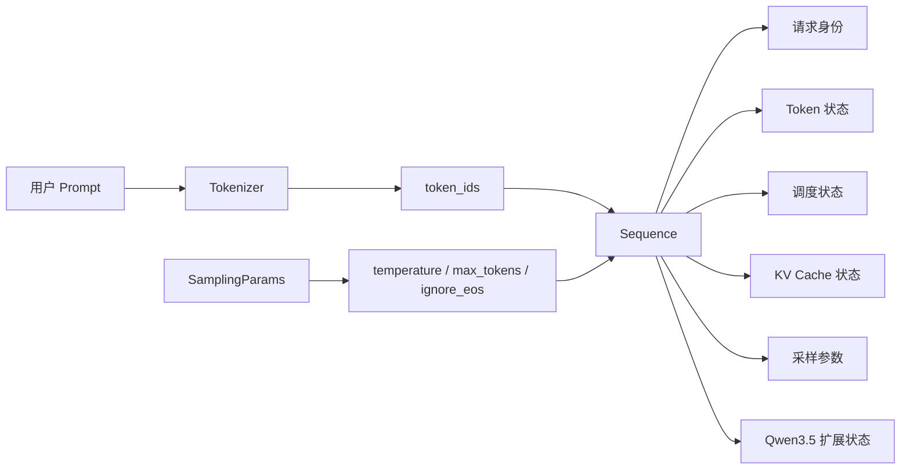
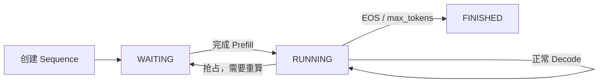

# nano-vLLM 中 Sequence：一个请求被包装后到底保存了什么？

> **学习目标**
>
> 这份文档只解决一个问题：
>
> **用户的一个请求进入 nano-vLLM 后，被包装成 `Sequence` 对象。这个 `Sequence` 里面到底保存了哪些参数？每个参数分别代表什么？后续 Scheduler、BlockManager、ModelRunner 又会怎么使用它们？**
>
> 你可以先把 `Sequence` 理解成：
>
> > **一个请求在推理框架内部的“档案袋”。**
>
> 用户输入的 token、请求当前处于什么状态、已经缓存了多少 KV、这一轮要计算多少 token、KV Cache 放在哪些 Block、采样参数是什么，以及 Qwen3.5 后续新增的 GDN state、多模态图片数据等，都围绕这个对象进行管理。

---

# 1. 一个请求是怎么变成 Sequence 的？

用户最开始提供的是：

```text
Prompt / messages
        ↓
Tokenizer
        ↓
token_ids
```

同时用户还会给一些生成参数，例如：

```text
temperature
max_tokens
ignore_eos
```

这些参数被包装在：

```text
SamplingParams
```

里面。

然后框架创建：

```python
Sequence(token_ids, sampling_params)
```

所以最开始真正传给 `Sequence` 构造函数的核心输入只有两类：

```text
① token_ids
② sampling_params
```

随后 `Sequence.__init__()` 会根据这两项输入，创建出一整套后续推理所需要的内部状态。

整个关系可以先看成：



---

# 2. Sequence 里面的参数先总体分成几类

为了方便理解，不要把所有变量平铺着背。

可以把它们分成六组：

```text
Sequence
│
├── ① 请求身份
│     └── seq_id
│
├── ② 请求当前状态
│     └── status
│
├── ③ Token 数据
│     ├── token_ids
│     ├── last_token
│     ├── num_tokens
│     └── num_prompt_tokens
│
├── ④ 调度 / KV Cache 状态
│     ├── num_cached_tokens
│     ├── num_scheduled_tokens
│     └── block_table
│
├── ⑤ 采样与停止条件
│     ├── temperature
│     ├── max_tokens
│     └── ignore_eos
│
└── ⑥ Qwen3.5 适配后的扩展
      ├── state_slot_id
      ├── pixel_values
      └── image_grid_thw
```

如果是你后面的 **KV Cache 压缩版本**，Sequence 还会继续增加：

```text
generated_completion_tokens
rope_pos
tail_uncompressed_len
```

后面会单独解释。

---

# 第一部分：Sequence 的直接成员变量

---

# 3. `seq_id` —— 这个请求的唯一编号

创建一个新的 Sequence 时，会给它分配：

```python
seq_id
```

可以把它理解成：

> **框架内部给每个请求发的身份证号。**

例如当前系统中进入三个请求：

```text
请求 A → seq_id = 0
请求 B → seq_id = 1
请求 C → seq_id = 2
```

后续即使这三个请求：

```text
同时进入 Scheduler
同时进入 ModelRunner
同时组成一个 batch
```

框架仍然可以通过 `seq_id` 区分它们。

---

## `seq_id` 为什么不能直接用 batch 下标代替？

因为 batch 下标会变化。

例如某轮：

```text
batch[0] = 请求 A
batch[1] = 请求 B
batch[2] = 请求 C
```

下一轮 A 结束后可能变成：

```text
batch[0] = 请求 B
batch[1] = 请求 C
batch[2] = 请求 D
```

所以：

```text
batch index
```

只是“这一轮它排在第几个”。

而：

```text
seq_id
```

是这个请求从进入系统到离开系统都不变的身份标识。

---

## 一句话记忆

> `seq_id` = **请求在推理框架内部的唯一身份证。**

---

# 4. `status` —— 请求现在处于什么生命周期状态

nano-vLLM 定义了三种基本状态：

```text
WAITING
RUNNING
FINISHED
```

创建 Sequence 时：

```text
status = WAITING
```

---

## 4.1 `WAITING`

表示：

> 请求已经进入 Scheduler，但是当前还没有完成需要的 Prefill，正在等待调度。

典型过程：

```text
新请求进入
    ↓
Sequence.status = WAITING
    ↓
放入 Scheduler.waiting
```

---

## 4.2 `RUNNING`

表示：

> Prompt 已经完成需要的 Prefill，这个请求已经进入正常生成阶段。

典型过程：

```text
Prefill 完成
    ↓
status = RUNNING
    ↓
进入 Scheduler.running
    ↓
后续不断 Decode
```

注意：

`RUNNING` 并不是说 GPU 此时此刻一定正在运行这个请求。

它更准确表示：

> **这个请求处于“可以继续 Decode”的活跃状态。**

---

## 4.3 `FINISHED`

表示请求已经结束，例如：

```text
生成 EOS
```

或者：

```text
达到 max_tokens
```

于是：

```text
status = FINISHED
```

并释放该请求占用的 KV Cache 等资源。

---

## 生命周期



---

## 一句话记忆

> `status` = **这个请求当前走到推理生命周期的哪一步。**

---

# 5. `token_ids` —— 这个请求完整的 Token 序列

这是 Sequence 中最核心的数据之一。

假设用户输入：

```text
“介绍一下张量并行”
```

Tokenizer 得到：

```text
[101, 582, 391, 762, ...]
```

创建 Sequence 时：

```text
token_ids
=
Prompt Token
```

随着 Decode 不断生成：

```text
token_ids
=
Prompt Token
+
已经生成的 Completion Token
```

例如：

```text
初始：
[P0, P1, P2, P3]

生成第一个 token：
[P0, P1, P2, P3, G0]

再生成一个：
[P0, P1, P2, P3, G0, G1]
```

因此 `token_ids` 表示：

> **这个请求到目前为止的完整逻辑 Token 历史。**

---

## 为什么 KV Cache 已经保存历史了，还必须保留 `token_ids`？

因为 KV Cache 只是模型计算得到的中间状态，不等于原始 Token 历史。

`token_ids` 还会被用于：

```text
① 输出最终文本
② 判断 Prompt / Completion
③ Prefix Cache 哈希
④ BlockManager 判断 token block
⑤ 请求被抢占后重新 Prefill
⑥ KV Cache 压缩后需要重算时恢复完整历史
```

所以：

> **KV Cache 可以被释放甚至被压缩，但是完整 token 历史通常不能随便丢。**

---

## 一句话记忆

> `token_ids` = **这个请求从 Prompt 到目前生成结果的完整 Token 历史。**

---

# 6. `last_token` —— 当前序列最后一个 Token

例如：

```text
token_ids
=
[P0, P1, P2, G0, G1]
```

那么：

```text
last_token = G1
```

为什么要单独保存？

因为 Decode 阶段每轮模型通常只需要输入：

```text
上一次刚生成的那个 token
```

而不需要重新把完整 `token_ids` 作为输入。

所以：

```text
Prefill：
输入多个 Prompt Token

Decode：
主要读取 last_token
```

这样可以避免每轮都去处理整个 Python List。

---

## `append_token()` 时会同步更新

每生成一个新 token：

```python
token_ids.append(token_id)
last_token = token_id
num_tokens += 1
```

所以三者始终同步。

---

## 一句话记忆

> `last_token` = **Decode 下一轮最直接需要的那个最新 token。**

---

# 7. `num_tokens` —— 当前 Sequence 的逻辑长度

它表示：

```text
当前这个 Sequence 一共有多少 token
```

初始：

```text
num_tokens = Prompt 长度
```

Decode 每生成一个 token：

```text
num_tokens += 1
```

例如：

```text
Prompt = 100 token

生成 20 token 后：

num_tokens = 120
```

---

## 为什么已经可以 `len(token_ids)`，还要单独保存 `num_tokens`？

主要是工程上的便利。

很多模块只需要：

```text
长度
```

并不需要真正访问 Python List。

例如：

```text
Scheduler
BlockManager
ModelRunner
```

都会大量使用序列长度。

而多卡 worker 的轻量序列化过程中，也可能只需要传长度和最后一个 token，不需要把完整历史 List 每轮都复制一遍。

---

## 与其它长度参数最容易混淆

务必区分：

```text
num_tokens
= 这个请求当前逻辑上一共有多少 token

num_prompt_tokens
= 其中多少属于原始 Prompt

num_cached_tokens
= 其中多少 token 已经有可用 KV

num_scheduled_tokens
= 这一轮 Scheduler 准备让模型计算多少 token
```

这四个变量非常重要。

---

# 8. `num_prompt_tokens` —— 原始 Prompt 有多长

创建 Sequence 时：

```text
num_prompt_tokens = len(initial token_ids)
```

而这个数字在正常生成过程中不会随着 Decode 增长。

例如：

```text
初始 Prompt：
100 token

已经生成：
30 token

那么：

num_prompt_tokens = 100
num_tokens        = 130
```

因此：

```text
num_tokens - num_prompt_tokens
```

就是已经生成的 completion token 数量。

---

## 它主要有什么作用？

用于区分：

```text
Prompt 部分
和
模型生成部分
```

因此可以得到：

```text
prompt_token_ids

completion_token_ids

num_completion_tokens
```

也用于判断：

```text
是否已经生成 max_tokens
```

---

## 一句话记忆

> `num_prompt_tokens` = **Sequence 刚进入框架时，用户原始 Prompt 的 Token 数。**

---

# 9. `num_cached_tokens` —— 已经拥有有效 KV Cache 的 Token 数

这是理解 nano-vLLM 调度最重要的变量之一。

它表示：

> **当前 Sequence 前面有多少 token 已经计算过，并且对应 KV Cache 当前可直接使用。**

例如：

```text
一个 Prompt 有 1000 token
```

如果还没运行 Prefill：

```text
num_cached_tokens = 0
```

如果 Prefix Cache 命中了前 512 个 token：

```text
num_cached_tokens = 512
```

那么真正还需要计算的只有：

```text
1000 - 512 = 488 token
```

---

## Chunked Prefill 时更容易理解

假设：

```text
Prompt 总长 = 3000
```

第一轮 Scheduler 只允许处理：

```text
1024 token
```

第一轮完成后：

```text
num_cached_tokens = 1024
```

第二轮再处理：

```text
1024
```

然后：

```text
num_cached_tokens = 2048
```

最后再处理剩余：

```text
952
```

最终：

```text
num_cached_tokens = 3000
```

这时 Prompt 的 KV 全部建立完成。

---

## Decode 阶段呢？

每一轮 Decode 通常：

```text
num_scheduled_tokens = 1
```

当前 token forward 完成以后：

```text
num_cached_tokens += 1
```

因此 KV Cache 和生成进度不断向前推进。

---

## 抢占时为什么它会被清零？

如果请求因为 KV Cache 不够被抢占，BlockManager 会释放它的 KV Block。

那么：

```text
原来的 KV 已经没了
```

于是：

```text
num_cached_tokens = 0
```

请求重新回到 WAITING，之后重新 Prefill。

---

## 一句话记忆

> `num_cached_tokens` = **这个请求前面有多少 token 已经真正拥有可以复用的 KV Cache。**

---

# 10. `num_scheduled_tokens` —— 这一轮准备计算多少 Token

这个字段不是“总共还要算多少”。

它只表示：

> **Scheduler 在当前这一轮调度中，实际给这个 Sequence 分配了多少 token 的计算预算。**

---

## Prefill 阶段

假设：

```text
Prompt = 3000 token
当前还没缓存
```

但是本轮 token budget 只有：

```text
1024
```

于是：

```text
num_scheduled_tokens = 1024
```

下一轮可能还是：

```text
1024
```

最后：

```text
952
```

因此它是 Chunked Prefill 的核心字段之一。

---

## Decode 阶段

标准自回归 Decode 每轮只推进一个 token：

```text
num_scheduled_tokens = 1
```

---

## 一轮执行完成后

Scheduler `postprocess()` 会：

```text
num_cached_tokens += num_scheduled_tokens
num_scheduled_tokens = 0
```

所以它是一个：

> **“本轮临时任务量”字段。**

---

## 最容易混淆的关系

假设：

```text
num_tokens = 3000
num_cached_tokens = 2000
```

说明还有：

```text
1000 token
```

没有建立 KV。

但本轮 token budget 只有：

```text
600
```

那么：

```text
num_scheduled_tokens = 600
```

不是 1000。

---

## 一句话记忆

> `num_scheduled_tokens` = **Scheduler 这一轮真正决定送给模型计算的 token 数。**

---

# 11. `block_table` —— 这个请求的 KV Cache 放在哪些物理 Block

这是 Sequence 和 Paged KV Cache 之间最重要的连接字段。

假设 BlockManager 给一个 Sequence 分配：

```text
逻辑 Block 0 → GPU 物理 Block 7
逻辑 Block 1 → GPU 物理 Block 21
逻辑 Block 2 → GPU 物理 Block 5
```

那么 Sequence 中：

```text
block_table = [7, 21, 5]
```

它表示：

> **这个请求每一个逻辑 KV Block，实际存放在 GPU KV Cache 池的哪个物理 Block。**

---

## 为什么需要 block_table？

因为 Paged KV Cache 不要求一个请求的 KV 在显存中物理连续。

一个请求可能使用：

```text
Block 7
Block 21
Block 5
Block 33
```

虽然物理上是离散的，但是逻辑上仍然是：

```text
第 0 块
第 1 块
第 2 块
第 3 块
```

`block_table` 就像操作系统里的：

```text
页表
```

负责：

```text
逻辑块号
    ↓
物理块号
```

的映射。

---

## 谁会修改它？

主要是：

```text
BlockManager.allocate()
BlockManager.may_append()
BlockManager.deallocate()
```

例如：

### Prefill

```text
Scheduler
   ↓
BlockManager.allocate(seq)
   ↓
seq.block_table 建立
```

### Decode 需要新 Block

```text
当前最后一个 Block 已满
        ↓
BlockManager.may_append(seq)
        ↓
block_table.append(new_block_id)
```

### 请求结束 / 抢占

```text
BlockManager.deallocate(seq)
        ↓
释放 Block
        ↓
block_table.clear()
```

---

## 一句话记忆

> `block_table` = **Sequence 自己的 KV Cache 页表，告诉模型“这个请求的 KV 到底放在 GPU 哪些物理 Block”。**

---

# 12. `temperature` —— 采样温度

它来自：

```text
SamplingParams.temperature
```

作用是控制输出分布的随机程度。

简单理解：

```text
temperature 小
→ 更倾向于概率最大的 token
→ 输出更确定

temperature 大
→ 概率分布更平
→ 输出更随机
```

在 nano-vLLM 的 Sampling 阶段，这个值会参与 logits 处理。

它属于：

```text
“这个请求怎么生成”
```

而不是：

```text
“这个请求怎么调度”
```

---

## 一句话记忆

> `temperature` = **这个 Sequence 自己的采样随机程度。**

---

# 13. `max_tokens` —— 最多允许生成多少 Completion Token

同样来自：

```text
SamplingParams.max_tokens
```

注意：

它不是：

```text
Sequence 总长度上限
```

而是：

```text
最多生成多少个新的 token
```

例如：

```text
Prompt = 1000 token
max_tokens = 200
```

那么最大完整序列长度可能达到：

```text
1200 token
```

Scheduler 在 postprocess 中会根据：

```text
num_completion_tokens
```

判断是否已经达到：

```text
max_tokens
```

达到后：

```text
status = FINISHED
```

---

## 一句话记忆

> `max_tokens` = **这个请求最多还能让模型新生成多少 token。**

---

# 14. `ignore_eos` —— 是否忽略 EOS

EOS 是：

```text
End Of Sequence
```

也就是模型认为：

```text
“我已经生成完了”
```

的特殊 token。

默认逻辑通常是：

```text
生成 EOS
   ↓
请求结束
```

但如果：

```text
ignore_eos = True
```

那么即使模型输出 EOS，也不会立刻结束，而会继续生成，直到其它停止条件，例如：

```text
max_tokens
```

---

## 一句话记忆

> `ignore_eos` = **模型生成 EOS 时，到底要不要把它当作停止信号。**

---

# 第二部分：Qwen3.5 适配以后新增的 Sequence 字段

---

# 15. `state_slot_id` —— GDN State 在状态池里的槽位编号

这是 Qwen3.5 Hybrid 适配中最重要的 Sequence 新字段之一。

原版 Qwen3 每层主要使用：

```text
Full Attention
        ↓
KV Cache
```

所以 Sequence 只需要：

```text
block_table
```

就能找到自己的历史状态。

但是 Qwen3.5 多了 GDN：

```text
GDN
├── conv state
└── recurrent state
```

这两类状态不是 Paged KV Block。

因此必须另外告诉每个请求：

> **你的 GDN State 放在状态池的第几个槽位。**

于是增加：

```text
state_slot_id
```

例如：

```text
请求 A → state_slot_id = 3
请求 B → state_slot_id = 7
```

那么所有 GDN 层：

```text
请求 A：
conv_states[3]
recurrent_states[3]

请求 B：
conv_states[7]
recurrent_states[7]
```

---

## 为什么是 Sequence 保存这个编号？

因为 GDN State 的生命周期与请求完全绑定：

```text
请求进入
→ 分配 state slot

请求持续 Decode
→ 一直读写同一个 slot

请求被抢占
→ 状态按设计释放/重建

请求结束
→ slot 归还状态池
```

因此最自然的归属就是：

```text
Sequence
```

---

## 它和 `block_table` 怎么区分？

这是很重要的一对：

```text
block_table
→ 找 Full Attention 的 KV Cache

state_slot_id
→ 找 GDN 的 conv / recurrent state
```

所以 Qwen3.5 一个 Sequence 实际同时携带两套“历史状态地址”。

---

## 一句话记忆

> `state_slot_id` = **这个请求的 GDN 长期状态在 state pool 里的地址编号。**

---

# 16. `pixel_values` —— 多模态请求的图片张量

Qwen3.5-V 多模态适配后，Sequence 还可以临时保存：

```text
pixel_values
```

纯文本请求：

```text
pixel_values = None
```

图片请求：

```text
pixel_values = 经过图片预处理后的像素 / patch 张量
```

它会在第一次 Prefill 时送进：

```text
Vision Encoder
```

生成：

```text
image embeddings
```

再注入语言模型。

---

## 为什么它放在 Sequence 里？

因为图片也是：

> **这个请求自己的输入数据。**

Scheduler 虽然主要按照 token 调度，但是当该 Sequence 第一次 Prefill 时，ModelRunner 必须能找到：

```text
这个请求对应的图片张量
```

所以暂时挂在 Sequence 上最方便。

---

## 为什么 Decode 后不需要一直保留？

图片经过 Vision Encoder 并融合到模型以后，信息已经进入：

```text
Full Attention KV Cache
+
GDN State
```

后面 Decode 不需要每轮重新编码原图。

因此图片数据只在早期 Prefill 路径中需要。

---

## 一句话记忆

> `pixel_values` = **多模态 Sequence 第一次 Prefill 时需要送进 Vision Encoder 的图片数据。**

---

# 17. `image_grid_thw` —— 图片视觉 Token 网格信息

它通常配合：

```text
pixel_values
```

一起使用。

`T/H/W` 可以理解成：

```text
T → 时间维
H → patch 网格高度
W → patch 网格宽度
```

对于普通单张图片，重点主要是：

```text
H × W
```

它告诉 Vision Encoder / MRoPE：

```text
图片被切成了怎样的视觉 patch 网格
```

这样模型才能正确：

```text
组织视觉 token
计算视觉位置
生成多模态位置编码
```

---

## 一句话记忆

> `image_grid_thw` = **告诉模型这张图片经过 patch 化以后，在时间、高度、宽度三个维度是什么布局。**

---

# 第三部分：KV Cache 压缩版本额外增加的 Sequence 字段

> 这一部分不是最初 Qwen3.5/GDN 适配必须有的字段，而是你后面的在线 KV Cache 压缩版本为了区分“真实 Token 历史”和“压缩后的物理 KV 长度”进一步增加的。

---

# 18. `generated_completion_tokens`

加入 KV Cache 压缩后：

```text
物理 KV 长度
```

可能会被缩短。

所以不能再简单依赖：

```text
num_tokens - num_prompt_tokens
```

来代表“历史上一共生成过多少 token”。

例如：

```text
真实已经生成 2000 token
```

KV 压缩以后物理序列长度可能减少几百。

因此增加独立计数器：

```text
generated_completion_tokens
```

它只记录：

> **历史上真正生成并提交了多少 Completion Token。**

KV Cache 怎么压都不会让它倒退。

---

# 19. `rope_pos`

同样是因为 KV 压缩。

正常情况下：

```text
当前 token 的位置
≈
当前 KV context 长度
```

但是压缩后：

```text
真实已经走到 position 3000
```

KV 可能只保留：

```text
2000 个位置
```

此时新 token 的 RoPE 位置仍然应该：

```text
3001
```

而不是：

```text
2001
```

因此单独维护：

```text
rope_pos
```

它代表：

> **这个 Sequence 在真实生成时间轴上的当前位置。**

---

## 一句话记忆

> `rope_pos` = **真实位置只往前走，不会因为删除历史 KV 而倒退。**

---

# 20. `tail_uncompressed_len`

在线 KV 压缩不是每生成一个 token 都压一次。

系统会等待：

```text
从上一次压缩后
又积累了一定数量的新 KV
```

再触发下一次压缩。

所以 Sequence 需要记录：

```text
tail_uncompressed_len
```

即：

> **上一次压缩以后，尾部又增长了多少尚未再次压缩的 token。**

例如：

```text
刚压完：
tail_uncompressed_len = 0

再生成 100 token：
tail_uncompressed_len = 100

再生成到 1024：
tail_uncompressed_len = 1024
```

如果配置窗口正好是：

```text
1024 token
```

那么这个请求就具备再次成为压缩候选的条件。

压缩完成后：

```text
tail_uncompressed_len = 0
```

重新计数。

---

# 第四部分：Sequence 中还有哪些“派生属性”？

这些不是 `__init__()` 直接保存的一份新数据，而是根据前面的字段即时计算出来的。

理解它们对看 Scheduler / BlockManager 代码很重要。

---

# 21. `is_finished`

本质是：

```text
status == FINISHED
```

因此：

```text
True
→ 请求已经结束

False
→ 请求仍需继续处理
```

它只是让上层代码写起来更直观。

---

# 22. `num_completion_tokens`

原版逻辑可以理解为：

```text
num_tokens - num_prompt_tokens
```

例如：

```text
num_tokens = 130
num_prompt_tokens = 100

num_completion_tokens = 30
```

它用于判断：

```text
是否达到 max_tokens
```

> 在 KV 压缩版本中，因为物理长度可能被缩短，所以项目进一步引入独立的 `generated_completion_tokens` 来避免这个值受到压缩影响。

---

# 23. `prompt_token_ids`

从完整 token 历史中取：

```text
前 num_prompt_tokens 个
```

也就是：

```text
原始 Prompt
```

概念上：

```python
token_ids[:num_prompt_tokens]
```

---

# 24. `completion_token_ids`

取：

```text
num_prompt_tokens 之后的部分
```

即：

```text
模型后来生成的 token
```

概念上：

```python
token_ids[num_prompt_tokens:]
```

---

# 25. `num_blocks`

表示按照固定 Block Size，这个 Sequence 当前逻辑上需要多少 KV Block。

如果：

```text
block_size = 256
num_tokens = 600
```

那么：

```text
num_blocks
=
ceil(600 / 256)
=
3
```

对应：

```text
Block 0：256 token
Block 1：256 token
Block 2：88 token
```

---

# 26. `last_block_num_tokens`

表示：

> **最后一个逻辑 Block 当前实际装了多少 token。**

仍以上面为例：

```text
num_tokens = 600
block_size = 256
```

则：

```text
last_block_num_tokens = 88
```

BlockManager 可以据此判断：

```text
最后一个 Block 是否已满
下一轮是否需要申请新 Block
```

---

# 第五部分：Sequence 的两个类级参数

---

# 27. `block_size`

原版 Sequence 中：

```text
block_size = 256
```

它表示：

> **一个逻辑 KV Block 对应多少个 token。**

因此 Sequence 可以根据：

```text
num_tokens
```

计算：

```text
num_blocks
last_block_num_tokens
block(i)
```

注意工程上配置中的 KV Cache block size 必须与这一套逻辑保持一致。

---

# 28. `counter`

Sequence 内部维护一个全局递增计数器。

每创建一个新 Sequence：

```text
next(counter)
```

得到新的：

```text
seq_id
```

所以：

```text
counter
```

本身不是某个请求的状态，而是：

> **负责给所有请求分配唯一 seq_id 的全局编号生成器。**

---

# 第六部分：几个关键方法分别干什么？

---

# 29. `__len__()`

调用：

```python
len(seq)
```

本质返回：

```text
seq.num_tokens
```

所以源码中很多地方写：

```text
len(seq)
```

其实就是：

```text
当前 Sequence 长度
```

---

# 30. `__getitem__()`

允许：

```python
seq[i]
```

直接访问：

```text
token_ids[i]
```

以及切片。

这让 BlockManager 处理 Token Block 时更方便。

---

# 31. `block(i)`

返回第 `i` 个逻辑 Token Block。

例如：

```text
block_size = 256
```

那么：

```text
block(0)
→ token_ids[0:256]

block(1)
→ token_ids[256:512]
```

它主要服务于：

```text
Prefix KV Cache
Block Hash
```

因为 BlockManager 要按照完整 Token Block 计算哈希。

---

# 32. `append_token(token_id)`

模型最终采样出一个新 token 后：

```text
Scheduler.postprocess()
        ↓
seq.append_token(token_id)
```

它会完成：

```text
token_ids 添加新 token
last_token 更新
num_tokens + 1
```

在后续扩展版本里，也可能同步更新：

```text
generated_completion_tokens
rope_pos
tail_uncompressed_len
```

所以它可以理解为：

> **Sequence 正式确认“这个 token 已经成为我历史的一部分”的入口。**

---

# 33. `__getstate__()` / `__setstate__()`

这两个方法主要服务于多进程 / TP 下 Sequence 的轻量传输。

因为 TP=4 时：

```text
rank 0
```

负责编排请求，但是其它 worker 也需要知道：

```text
这个 Sequence 有多长
缓存了多少 token
本轮算多少 token
block_table 是什么
last token 是什么
```

如果 Decode 每一轮都把：

```text
完整 token_ids
```

复制给其它进程，成本没有必要。

所以 Sequence 会自定义一份更紧凑的状态。

---

## Prefill 和 Decode 为什么传输方式不同？

Prefill 时：

```text
需要完整 Prompt token_ids
```

Decode 时通常只需要：

```text
last_token
```

所以序列化会尽量根据阶段只传真正需要的信息。

Qwen3.5 适配以后：

```text
state_slot_id
```

也需要同步到其它 TP worker，否则各卡不知道这个请求应该访问哪个 GDN State Slot。

而多模态图片：

```text
pixel_values
image_grid_thw
```

通常不会直接塞进这份轻量 Sequence 状态里逐轮复制，而由 ModelRunner 在需要时单独进行多卡广播。

---

# 第七部分：最重要的四个“长度”到底怎么区分？

这是 Sequence 最容易问、也最容易混淆的地方。

假设：

```text
Prompt 总长 = 3000
```

当前已经完成：

```text
2000 token 的 Prefill
```

这一轮 Scheduler 再安排：

```text
600 token
```

那么：

| 参数 | 当前值 | 含义 |
|---|---:|---|
| `num_prompt_tokens` | 3000 | 用户原始 Prompt 总长度 |
| `num_tokens` | 3000 | 当前逻辑 Sequence 总长度，此时还没开始生成 |
| `num_cached_tokens` | 2000 | 已经拥有有效 KV 的 Token 数 |
| `num_scheduled_tokens` | 600 | 这一轮真正送给模型算的 Token 数 |

本轮跑完：

```text
num_cached_tokens
=
2000 + 600
=
2600

num_scheduled_tokens
=
0
```

下一轮还剩：

```text
3000 - 2600
=
400
```

需要 Prefill。

---

# 8. 再看一个完整生命周期例子

假设用户输入：

```text
1000 个 Prompt Token
```

参数：

```text
max_tokens = 100
temperature = 0.7
ignore_eos = False
```

---

## 刚创建 Sequence

```text
seq_id                = 10
status                = WAITING

token_ids             = 1000 个 Prompt Token
last_token            = Prompt 最后一个 Token

num_tokens            = 1000
num_prompt_tokens     = 1000
num_cached_tokens     = 0
num_scheduled_tokens  = 0

block_table           = []

temperature           = 0.7
max_tokens            = 100
ignore_eos            = False

state_slot_id         = -1 / 尚未分配
```

---

## Scheduler 准备 Prefill

假设 Prefix Cache 没命中，本轮能处理 600 token：

```text
num_scheduled_tokens = 600
```

同时 BlockManager 分配 KV Block：

```text
block_table = [...]
```

Qwen3.5 Hybrid 还会分配：

```text
state_slot_id
```

---

## 第一轮 Prefill 结束

```text
num_cached_tokens = 600
num_scheduled_tokens = 0
```

因为：

```text
600 < 1000
```

所以 Prompt 还没完成。

---

## 第二轮再处理 400

```text
num_scheduled_tokens = 400
```

结束后：

```text
num_cached_tokens = 1000
```

Prefill 完成：

```text
status = RUNNING
```

然后模型采样得到第一个新 token：

```text
append_token(G0)
```

变成：

```text
num_tokens = 1001
token_ids = Prompt + G0
last_token = G0
```

---

## 后续 Decode

每轮：

```text
num_scheduled_tokens = 1
```

ModelRunner 主要读取：

```text
last_token
block_table
state_slot_id
```

其中：

```text
block_table
→ 找 Full Attention KV

state_slot_id
→ 找 GDN State
```

生成新 token 后：

```text
append_token()
```

继续下一轮。

---

## 最终结束

如果：

```text
生成 EOS
```

并且：

```text
ignore_eos = False
```

或者：

```text
completion token 数 == max_tokens
```

那么：

```text
status = FINISHED
```

随后：

```text
BlockManager 释放 KV Block
StateSlotManager 释放 GDN slot
```

这个 Sequence 生命周期结束。

---

# 9. 一张图看懂 Sequence 所有核心参数

```mermaid
flowchart TD
    A["Sequence：一个请求的内部档案"] --> B["身份"]
    A --> C["Token"]
    A --> D["调度"]
    A --> E["模型状态地址"]
    A --> F["生成参数"]
    A --> G["扩展数据"]

    B --> B1["seq_id<br/>请求唯一编号"]
    B --> B2["status<br/>WAITING / RUNNING / FINISHED"]

    C --> C1["token_ids<br/>完整 Token 历史"]
    C --> C2["last_token<br/>最后一个 Token"]
    C --> C3["num_tokens<br/>当前总长度"]
    C --> C4["num_prompt_tokens<br/>Prompt 长度"]

    D --> D1["num_cached_tokens<br/>已有有效 KV 的长度"]
    D --> D2["num_scheduled_tokens<br/>本轮准备计算多少 Token"]

    E --> E1["block_table<br/>Full Attention KV Block 地址"]
    E --> E2["state_slot_id<br/>Qwen3.5 GDN State 地址"]

    F --> F1["temperature<br/>采样随机性"]
    F --> F2["max_tokens<br/>最大生成长度"]
    F --> F3["ignore_eos<br/>是否忽略 EOS"]

    G --> G1["pixel_values<br/>图片数据"]
    G --> G2["image_grid_thw<br/>视觉网格信息"]
    G --> G3["rope_pos<br/>压缩版真实位置"]
    G --> G4["tail_uncompressed_len<br/>未压缩尾部长度"]
```



---

# 10. 最后把 Sequence 记成五句话

如果面试前不想背二十个字段，只需要先抓住下面五句话：

### 第一句

> **Sequence 是“一个请求在推理框架中的状态对象”，它不是模型的一层，而是 Scheduler、BlockManager、ModelRunner 共同操作的请求载体。**

### 第二句

> **`token_ids / last_token / num_tokens / num_prompt_tokens` 描述的是这个请求的 Token 历史。**

### 第三句

> **`num_cached_tokens / num_scheduled_tokens` 描述的是“已经算了多少”和“这一轮准备算多少”，是 Scheduler 调度 Prefill、Chunked Prefill 和 Decode 的关键。**

### 第四句

> **`block_table` 告诉 Full Attention 去哪里找 KV Cache；Qwen3.5 新增的 `state_slot_id` 告诉 GDN 去哪里找 conv state 和 recurrent state。**

### 第五句

> **Sequence 会从 WAITING → RUNNING → FINISHED，在整个请求生命周期里持续被更新，直到请求结束并释放对应资源。**

---

# 11. 面试中可以这样回答“Sequence 里面主要有什么？”

> 一个用户请求经过 tokenizer 以后会得到 token ids，再和 sampling 参数一起被包装成 Sequence。Sequence 我理解就是推理框架内部保存一个请求完整状态的对象。它首先有 `seq_id` 和 `status`，分别标识请求身份以及当前是 waiting、running 还是 finished；然后有 `token_ids`、`last_token`、`num_tokens` 和 `num_prompt_tokens`，记录完整 token 历史和长度；调度方面最重要的是 `num_cached_tokens` 和 `num_scheduled_tokens`，前者表示已经有可用 KV Cache 的 token 数，后者表示 Scheduler 这一轮准备让模型实际计算多少 token；另外 `block_table` 保存这个请求逻辑 KV block 到 GPU 物理 block 的映射。它还会保存 `temperature`、`max_tokens`、`ignore_eos` 这些生成参数。适配 Qwen3.5 以后，我又给 Sequence 增加了 `state_slot_id`，用来找到这个请求对应的 GDN conv state 和 recurrent state；多模态版本还会临时保存 `pixel_values` 和 `image_grid_thw`。所以从工程上看，Sequence 就是贯穿一个请求从进入 Scheduler 到最终结束的核心状态载体。


%% 项目关联导航：开始 %%
## 项目关联导航

- 所属模块：[[outputs/项目整理/模块-面试准备|模块-面试准备]]

%% 项目关联导航：结束 %%
