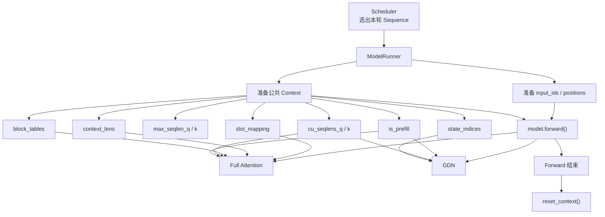

# nano-vLLM：一次 Model Forward 的公共 Context 参数详解

> **这份文档的目标**
>
> 在 `ModelRunner` 把 Prefill 或 Decode 阶段的数据准备好以后，并不是把所有参数都一层层塞进 `model.forward()`。  
> nano-vLLM 会把 Attention、GDN 等层需要共享的执行信息统一放到这一轮 forward 的公共 `Context` 里。后面的层在真正计算时，再通过 `get_context()` 读取这些信息。
>
> 下面不按源码注释的方式解释，而是按照**面试官提问、你现场回答**的口吻，逐个说明每个参数是什么意思。

---

## 1. `is_prefill`

**面试官：`Context` 里面的 `is_prefill` 是干什么的？**

我理解 `is_prefill` 就是告诉模型当前这一轮 forward 到底是在做 Prefill，还是在做 Decode。因为这两个阶段虽然最后都会进入同一个模型，但是 Attention 和 GDN 的执行方式是不一样的。Prefill 一次通常会处理一段 token，需要按变长序列去计算；Decode 则是每个请求这一轮只处理一个新 token，并且要读取之前已经保存好的 KV Cache 或 GDN State。所以底层的 Attention、GDN 层拿到 `is_prefill` 以后，就可以判断这一轮应该走哪一条计算路径。简单来说，它相当于这一轮 forward 的一个**总模式开关**。

---

## 2. `cu_seqlens_q`

**面试官：`cu_seqlens_q` 是什么？为什么 Prefill 需要它？**

`cu_seqlens_q` 主要是在 Prefill 阶段使用的，它用来标记一个 batch 里面不同请求的 Query token 在拍平之后分别从哪里开始、到哪里结束。因为 nano-vLLM 做 Prefill 时，不同请求这一轮要计算的 token 数可能不一样，比如第一个请求算 300 个 token，第二个请求算 200 个 token，ModelRunner 会把这 500 个 token 直接拼成一条连续 Tensor。这样 Attention 本身就不知道前 300 个属于第一个请求、后 200 个属于第二个请求，所以会用 `cu_seqlens_q=[0,300,500]` 这样的累计长度记录边界。底层的变长 Attention 根据这个参数，就能把拍平的数据重新理解成多条互相独立的请求。可以把它理解成**Prefill batch 中 Query 的分界表**。

---

## 3. `cu_seqlens_k`

**面试官：那 `cu_seqlens_k` 和 `cu_seqlens_q` 有什么区别？**

`cu_seqlens_k` 记录的是每个请求在当前 Prefill 阶段真正能够看到的 Key/Value 上下文长度，而 `cu_seqlens_q` 记录的是这一轮新计算了多少个 Query。两者在第一次完整 Prefill 时通常是一样的，但如果存在 Chunked Prefill 或 Prefix KV Cache，它们就可能不一样。比如一个请求前面已经缓存了 600 个 token，这一轮只新算 300 个 token，那么 Query 长度只有 300，但这 300 个 Query 做 Attention 时可以看到前面 600 个历史 KV 加上当前 300 个新 KV，也就是一共 900 个 Key/Value。所以这里 `seqlen_q=300`，`seqlen_k=900`。因此我会把 `cu_seqlens_k` 理解成**告诉变长 Attention：每个请求这一轮实际拥有多长的 KV 上下文**。

---

## 4. `max_seqlen_q`

**面试官：`max_seqlen_q` 又是干什么的？**

`max_seqlen_q` 是当前这个 Prefill batch 里，所有请求中最大的 Query 长度。比如这一轮三个请求分别计算 300、500、200 个 token，那 `max_seqlen_q` 就是 500。它本身并不描述某一个具体请求的状态，而是给底层变长 Attention Kernel 提供一个 batch 级别的辅助信息，让 Kernel 知道这一批数据里最长的 Query 序列有多长，方便内部选择和组织计算。所以这个参数更多是一个**底层算子执行需要的最大长度信息**，而不是 Scheduler 的调度状态。

---

## 5. `max_seqlen_k`

**面试官：`max_seqlen_k` 呢？**

`max_seqlen_k` 和 `max_seqlen_q` 的思想是一样的，只不过它统计的是当前 batch 里最大的 Key/Value 上下文长度。比如第一个请求这一轮 Query 长度是 300，但因为前面有 600 个缓存 token，所以它能看到 900 个 KV；第二个请求第一次 Prefill，一共只有 500 个 KV，那么这一轮的 `max_seqlen_k` 就是 900。这个值主要也是给变长 Attention 的底层 Kernel 使用，让 Kernel 知道当前这批请求最长的历史上下文是多少。

---

## 6. `slot_mapping`

**面试官：`slot_mapping` 这个参数具体是什么意思？**

`slot_mapping` 是用来告诉 Attention：**当前这一轮新计算出来的 K 和 V，应该写到 GPU KV Cache 的哪个具体物理位置。** 因为 nano-vLLM 使用的是 Paged KV Cache，一个请求的 KV 并不一定连续地存在显存里，而是通过多个物理 Block 来保存。`block_table` 只能告诉我们这个请求用了哪些物理 Block，但真正写某一个 token 的 K/V 时，还需要精确到 Block 内的某一个 slot。所以 ModelRunner 会根据 Sequence 的 `block_table`、当前 token 的逻辑位置以及 `block_size`，把每一个新 token 对应的物理 KV 位置算出来，形成 `slot_mapping`。Attention 层在 forward 时直接根据这个映射，把当前生成的 K/V 写进正确的位置。简单来说，`block_table` 是到 Block 级别，而 `slot_mapping` 是进一步精确到**当前 token 的实际 KV 写入地址**。

---

## 7. `context_lens`

**面试官：Decode 阶段的 `context_lens` 是干什么的？**

`context_lens` 主要在 Decode 阶段使用，它表示 batch 中每个请求当前到底有多少个有效的历史 KV 可以参与 Attention。因为 Decode 时每个请求这一轮都只输入一个新 token，但是不同请求已经生成的长度完全不同，比如 A 已经有 1000 个 KV，B 有 500 个，C 有 2000 个。它们可以一起组成一个 Decode batch，但 Attention 必须知道每个请求应该看到多长的历史，所以 ModelRunner 会准备 `context_lens=[1000,500,2000]` 这样的 Tensor。底层的 `flash_attn_with_kvcache` 会结合 `context_lens` 和 `block_tables`，只读取每个请求真正有效的那部分 KV。可以把它理解成**Decode 阶段每个请求当前有效上下文长度的说明书**。

---

## 8. `block_tables`

**面试官：`block_tables` 和 `slot_mapping` 到底有什么区别？**

`block_tables` 保存的是 batch 中每个请求的**逻辑 KV Block 到 GPU 物理 Block 的映射关系**。比如一个请求逻辑上的第 0、1、2 个 Block，实际可能放在 GPU 的 7、21、5 号物理 Block里，那么它的 block table 就可以理解成 `[7,21,5]`。Decode 阶段 Attention 要读取整段历史 KV，就会根据 `block_tables` 找到这些历史 KV 分散在哪些物理 Block 中；如果 Prefill 前面已经有 Prefix Cache 或已经缓存了一部分 KV，也同样需要通过它找到历史数据。和 `slot_mapping` 的区别是，`block_tables` 主要解决“**历史 KV 在哪些 Block 里**”，而 `slot_mapping` 解决“**当前新产生的 K/V 具体写到哪个 slot**”。

---

## 9. `state_indices`

**面试官：Qwen3.5 适配以后为什么 Context 里又增加了一个 `state_indices`？**

这是因为 Qwen3.5 不再是所有层都使用 Full Attention，而是加入了 GDN 层。Full Attention 的历史状态可以通过 `block_table` 找到 KV Cache，但 GDN 并没有标准 KV Cache，它需要长期保存自己的 `conv state` 和 `recurrent state`。所以我在 Sequence 里给每个请求维护一个 `state_slot_id`，表示这个请求的 GDN 状态存放在状态池的哪个槽位。ModelRunner 在每轮 Prefill 或 Decode 前，会把当前 batch 里所有请求的 `state_slot_id` 整理成一个 Tensor，也就是 `state_indices`，再放进 Context。后面的 GDN 层读取 `state_indices` 后，就知道 batch 中每一个请求应该去访问哪一份 `conv state` 和 `recurrent state`。所以它和 Full Attention 的 `block_tables` 本质上是两套并行的状态索引机制：**`block_tables` 找 KV Cache，`state_indices` 找 GDN State。**

---

# 10. 为什么要设计一个公共 Context，而不是全部传进 `model.forward()`？

**面试官：这些参数为什么不直接全部作为 `model.forward()` 的参数传下去？为什么还要单独做一个 Context？**

因为这些参数本质上都属于“这一轮模型怎么执行”的框架信息，而不是模型的普通输入。如果把 `slot_mapping`、`block_tables`、`context_lens`、`cu_seqlens`、`state_indices` 全部作为 `model.forward()` 的参数，那么它们还要从模型入口一层一层继续传给每一个 Decoder Layer，再传给 Attention 或 GDN，代码会非常臃肿。现在 ModelRunner 在 forward 开始前统一调用 `set_context()`，把这一轮需要的执行信息存进去，后面的 Attention 和 GDN 层真正需要时再通过 `get_context()` 读取。一次 forward 结束以后再 `reset_context()`。所以我会把 Context 理解成**当前这一轮模型执行的公共运行环境**，它保存的是框架层提前准备好的索引、长度和执行模式，而不是模型权重或者长期请求状态。

---

# 11. 这些参数在 Prefill 和 Decode 中分别怎么用？

可以把它们快速分成下面三类。

| 参数 | Prefill | Decode | 主要使用模块 |
|---|---|---|---|
| `is_prefill` | 使用 | 使用 | Attention / GDN，判断执行路径 |
| `cu_seqlens_q` | 重点使用 | 通常不用 | 变长 Attention / GDN Prefill |
| `cu_seqlens_k` | 重点使用 | 通常不用 | 变长 Attention |
| `max_seqlen_q` | 使用 | 通常不用 | Prefill Attention Kernel |
| `max_seqlen_k` | 使用 | 通常不用 | Prefill Attention Kernel |
| `slot_mapping` | 使用 | 使用 | Full Attention KV 写入 |
| `context_lens` | 通常不用 | 重点使用 | Decode Attention |
| `block_tables` | Prefix/已有 KV 时使用 | 重点使用 | Full Attention 查历史 KV |
| `state_indices` | Qwen3.5 使用 | Qwen3.5 使用 | GDN 查找请求状态 |

---

# 12. 一张图理解 Context 在一轮 Forward 里的位置

---

# 13. 面试时如果让你整体介绍 Context，可以这样回答

> 我理解 Context 就是 nano-vLLM 为“一轮模型 forward”临时准备的一份公共执行信息。Scheduler 调出一批 Sequence 以后，ModelRunner 会把这些请求整理成模型能用的 Tensor，其中 `input_ids` 和 `positions` 直接传给模型，而像当前是 Prefill 还是 Decode、不同请求的序列边界、KV 要写到哪里、历史 KV 在哪些 Block、每个请求上下文有多长，以及 Qwen3.5 的 GDN State 在哪个槽位，这些信息会统一放进 Context。具体来说，Prefill 主要用 `cu_seqlens_q/k` 和 `max_seqlen_q/k` 描述变长 batch；`slot_mapping` 负责告诉 Attention 新 K/V 写到哪里；Decode 主要通过 `context_lens` 和 `block_tables` 找到每个请求的历史 KV；Qwen3.5 新增的 `state_indices` 则让 GDN 找到对应请求的 conv state 和 recurrent state。这样 Attention 和 GDN 在真正计算的时候自己读取 Context 就可以了，不需要把这些框架参数从模型入口一层一层往下传。一次 forward 结束以后 Context 就会 reset，所以它是一个临时的执行上下文，而不是长期保存请求状态的地方。

%% 项目关联导航：开始 %%
## 项目关联导航

- 所属模块：[[outputs/项目整理/模块-面试准备|模块-面试准备]]

%% 项目关联导航：结束 %%
