# Qwen3.5-27B TP=4：从 Batch 输入到输出 Token 的隐藏状态形状与多卡通信全流程

> **本文目标**
>
> 这份文档专门解决一个问题：
>
> **一批 Token 进入 Qwen3.5-27B 以后，hidden states 的形状从头到尾怎么变化？TP=4 时权重怎么切到四张卡？每张卡各自在算什么？什么时候数据是“完整的”，什么时候又被“分开”，什么时候需要 All-Reduce / All-Gather，最后又是怎么选出一个 Token 的？**
>
> 本文结合你的学习笔记《推理框架的思考》中已经梳理过的 `ModelRunner → Embedding → Attention → MLP → LM Head → Sampler` 主线，并以仓库中 Qwen3.5 适配实现的 `qwen3_5.py / linear.py / embed_head.py / sampler.py` 为主要工程结构。
>
> 为了让形状能真正算出来，全文固定使用：
>
> ```text
> 模型：Qwen3.5-27B
> TP：4
> hidden_size：5120
> vocab_size：248320
> intermediate_size：17408
> Decoder Layers：64
>
> Full Attention：
> Q Heads：24
> KV Heads：4
> head_dim：256
>
> GDN：
> Key Heads：16
> Value Heads：48
> key head dim：128
> value head dim：128
> ```
>
> Qwen3.5-27B 的 64 层是 Hybrid 结构，主要按照：
>
> ```text
> GDN → GDN → GDN → Full Attention
> ```
>
> 周期性排列，也就是大约：
>
> ```text
> 48 个 GDN / Linear Attention Layer
> 16 个 Full Attention Layer
> ```
>
> ---
>
> **最重要的总规律先记住：**
>
> ```text
> 每张卡拿到完整 hidden states
>          ↓
> Column Parallel：按输出特征 / Head 切开，各卡算不同部分
>          ↓
> 各卡在本地继续计算
>          ↓
> Row Parallel：每卡得到完整 hidden_size 的“局部贡献”
>          ↓
> All-Reduce 求和
>          ↓
> 四张卡重新拿到相同的完整 hidden states
> ```
>
> **Qwen3.5 的一层基本一直在重复这个“完整 → 分开 → 本地算 → 合并 → 完整”的过程。**

---

# 一、先看模型开始前：四张卡上的权重是怎么分好的？

这些权重不是请求来了以后临时切的。

模型启动时：

```text
4 个 ModelRunner 进程
        ↓
rank0 → GPU0
rank1 → GPU1
rank2 → GPU2
rank3 → GPU3
        ↓
NCCL 建立 TP 通信组
        ↓
创建模型结构
        ↓
load_model() 读取 safetensors
        ↓
每个 rank 只截取属于自己的权重分片
        ↓
权重长期驻留本卡 GPU 显存
```

所以后面每来一个请求，都只是反复使用已经切好的权重。

---

# 二、TP=4 下三种最重要的权重布局

## 1. Column Parallel：切输出维度

比如完整线性层：

```text
输入：5120
输出：17408
```

TP=4 后不是把输入 hidden states 分成四份，而是：

```text
四张卡都拿完整 [T, 5120] 输入

GPU0：负责输出 0 ~ 4351
GPU1：负责输出 4352 ~ 8703
GPU2：负责下一段
GPU3：负责最后一段
```

所以每张卡：

```text
[T, 5120]
   ↓
本卡权重
   ↓
[T, 4352]
```

这一步**不需要通信**，因为大家本来就在算互不重叠的输出特征。

---

## 2. Row Parallel：切输入维度

假设完整层：

```text
17408 → 5120
```

而前面的 17408 维已经被四张卡分成：

```text
每卡 4352 维
```

那么每张卡只保存和自己这 4352 维相对应的权重：

```text
GPU0：[5120, 4352]
GPU1：[5120, 4352]
GPU2：[5120, 4352]
GPU3：[5120, 4352]
```

每卡计算：

```text
[T,4352]
   ×
本卡权重
   ↓
[T,5120] 局部贡献
```

注意这里虽然形状已经是 `[T,5120]`，但它**还不是完整结果**。

真正结果是：

```text
Y = Y0 + Y1 + Y2 + Y3
```

所以这里要：

```text
All-Reduce(SUM)
```

最后四张卡都得到同样的：

```text
[T,5120]
```

---

## 3. Replicated：四张卡各自完整保存一份

典型的是：

```text
RMSNorm 权重
```

只有：

```text
[5120]
```

规模很小。

所以直接：

```text
GPU0 一份
GPU1 一份
GPU2 一份
GPU3 一份
```

四张卡本地重复算 RMSNorm，比“只让一张卡算完再广播大 Tensor”更便宜。

---

# 三、一张表先看完整模型中权重怎么切

| 模块 | 完整权重 / 逻辑规模 | TP=4 每卡保存什么 | 通信 |
|---|---|---|---|
| Embedding | `[248320,5120]` | `[62080,5120]`，按词表切 | **All-Reduce** |
| RMSNorm | `[5120]` | 四卡各完整一份 | 无 |
| Full Attention Q+Gate | `5120 → 12288` | 每卡 `5120 → 3072` | 无 |
| Full Attention K | `5120 → 1024` | 每卡 `5120 → 256` | 无 |
| Full Attention V | `5120 → 1024` | 每卡 `5120 → 256` | 无 |
| Full Attention O | `6144 → 5120` | 每卡只接收本地 1536 输入维 | **All-Reduce** |
| GDN QKV | 全局 Q/K/V Head 按 TP 切 | 每卡本地 Q/K/V Head | 无 |
| GDN Out | `6144 → 5120` | 每卡接收本地 1536 维 | **All-Reduce** |
| MLP Gate+Up | `5120 → 34816` | 每卡输出 `8704` | 无 |
| MLP Down | `17408 → 5120` | 每卡输入 `4352` | **All-Reduce** |
| Final RMSNorm | `[5120]` | 四卡完整复制 | 无 |
| LM Head | `[248320,5120]` | `[62080,5120]` | 最后候选 **All-Gather** |

---

# 四、从一个具体 Batch 开始

先用一个 **Prefill batch** 看模型入口的数据。

假设这一轮 Scheduler 同时调了两个请求：

```text
请求 A：本轮计算 5 个 Token
请求 B：本轮计算 3 个 Token
```

ModelRunner 不会组织成：

```text
[2, 5]
```

这种必须 Padding 的二维矩阵，而是直接拍平：

```text
input_ids =
[A0,A1,A2,A3,A4,B0,B1,B2]
```

因此：

```text
input_ids.shape = [8]
positions.shape = [8]
```

这里定义：

```text
T = 本轮真正送进模型计算的 Token 总数
```

这个例子里：

```text
T = 8
```

所以后面所有形状都可以把 `T` 换成 `8`。

---

# 五、input_ids 会同时出现在四张卡上

TP=4 时，不是：

```text
GPU0 拿前两个 Token
GPU1 拿后两个 Token
……
```

而是：

```text
GPU0：完整 input_ids [8]
GPU1：完整 input_ids [8]
GPU2：完整 input_ids [8]
GPU3：完整 input_ids [8]
```

**TP 切的是模型权重，不是把 Batch Token 简单切成四份。**

接下来才进入：

```text
VocabParallelEmbedding
```

---

# 六、Embedding：`[8] → [8,5120]`

完整 Embedding 表：

```text
[248320, 5120]
```

TP=4 后，词表这一维切四份：

```text
248320 / 4 = 62080
```

所以：

```text
GPU0 weight：[62080,5120]
GPU1 weight：[62080,5120]
GPU2 weight：[62080,5120]
GPU3 weight：[62080,5120]
```

假设：

```text
input_ids = [10, 70000, 130000, 200000, ...]
```

四张卡都会看到全部 Token ID，但：

```text
GPU0 只对落在自己词表范围的 Token 查表
GPU1 只对自己词表范围查表
GPU2 同理
GPU3 同理
```

其他位置先变成 0。

每张卡局部结果形状都是：

```text
[8,5120]
```

但不同卡只有自己负责的位置是有效值。

随后：

```text
All-Reduce(SUM)
```

因为同一个 Token 位置只有一张卡产生非零 embedding，所以求和后：

```text
GPU0：[8,5120]
GPU1：[8,5120]
GPU2：[8,5120]
GPU3：[8,5120]
```

而且四张卡内容完全一样。

---

## 此时第一次得到真正的 hidden states

```text
input_ids
[8]
 ↓ Embedding
hidden_states
[8,5120]
```

这就是模型真正开始处理的高维特征。

从现在开始到 64 层结束，**主 hidden states 的外部形状基本一直保持 `[T,5120]`**。

变化主要发生在每层内部。

---

# 七、进入 Decoder Layer 前：RMSNorm

每张卡现在都有完整：

```text
hidden_states = [8,5120]
```

RMSNorm 权重：

```text
[5120]
```

四卡各保存完整一份。

所以：

```text
GPU0：[8,5120] → RMSNorm → [8,5120]
GPU1：[8,5120] → RMSNorm → [8,5120]
GPU2：[8,5120] → RMSNorm → [8,5120]
GPU3：[8,5120] → RMSNorm → [8,5120]
```

形状完全不变。

这里：

```text
无 NCCL
无 All-Reduce
```

因为四张卡本来就有一样的数据和一样的 Norm 权重。

---

# 八、如果当前层是 Full Attention：形状怎么变化？

Qwen3.5-27B 的 Full Attention 配置：

```text
24 个 Q Head
4 个 KV Head
head_dim = 256
TP = 4
```

所以每张卡：

```text
Q Head：24 / 4 = 6 个
KV Head：4 / 4 = 1 个
```

---

## 1. Q 投影：Qwen3.5 这里还有一个 Gate

这一点比普通 Qwen3 多一步。

完整 Q 投影实际产生：

```text
24 × 256 × 2
= 12288
```

这里的 `×2` 是因为同时产生：

```text
Q
+
Attention Output Gate
```

TP=4 后，每卡只产生：

```text
12288 / 4
= 3072
```

因此：

```text
每卡输入：
[8,5120]

↓ 本卡 q_proj

q_gate：
[8,3072]
```

reshape：

```text
[8,6,512]
```

然后最后 512 一分为二：

```text
Q：
[8,6,256]

Gate：
[8,6,256]
```

四张卡各负责不同的 6 个 Q Head。

**这里不通信。**

---

## 2. K 投影

完整 K：

```text
4 KV Heads × 256
= 1024
```

TP=4：

```text
每卡只负责 1 个 KV Head
```

所以：

```text
[8,5120]
   ↓
本卡 K 权重
   ↓
[8,256]
   ↓ reshape
[8,1,256]
```

---

## 3. V 投影

完全一样：

```text
[8,5120]
   ↓
[8,1,256]
```

---

## 4. 此时四张卡的数据是什么？

```text
GPU0：
Q0 [8,6,256]
K0 [8,1,256]
V0 [8,1,256]

GPU1：
Q1 [8,6,256]
K1 [8,1,256]
V1 [8,1,256]

GPU2：
Q2 [8,6,256]
K2 [8,1,256]
V2 [8,1,256]

GPU3：
Q3 [8,6,256]
K3 [8,1,256]
V3 [8,1,256]
```

四张卡加起来才是完整：

```text
Q：[8,24,256]
K：[8,4,256]
V：[8,4,256]
```

但是工程上**不会把它们先 All-Gather 成完整 QKV**。

因为后面的：

```text
Q/K Norm
MRoPE
KV Cache
Attention
```

都可以继续在各卡自己的 Head 分片上本地完成。

---

# 九、Full Attention 中 RoPE / KV Cache / Attention 都是本卡完成

每张卡对自己本地的：

```text
Q [8,6,256]
K [8,1,256]
```

做 Q/K Norm 和 MRoPE。

形状不变：

```text
Q：[8,6,256]
K：[8,1,256]
```

V 仍然：

```text
[8,1,256]
```

---

## KV Cache 也按 TP 分片

每张卡只缓存：

```text
自己负责的 KV Head
```

比如每个 Full Attention 层：

```text
GPU0 保存 KV Head 0
GPU1 保存 KV Head 1
GPU2 保存 KV Head 2
GPU3 保存 KV Head 3
```

所以不需要：

```text
四卡先把 K/V 合并
```

`block_table` 在逻辑上描述同一个请求的 Block 布局，但每张卡对应物理 Block 中保存的是**本卡那一份 KV Head 数据**。

---

## Attention 本身也本地算

每卡：

```text
6 个 Q Head
去访问
1 个 KV Head
```

这里是 GQA，一个 KV Head 服务本卡多个 Q Head。

Attention 完成以后，本卡得到：

```text
[8,6,256]
```

这只是 24 个 Q Head 中的四分之一。

---

# 十、为什么 Full Attention 这里不是 All-Gather Head，而是先做 O Projection？

数学上完整 Head 拼接应该是：

```text
24 × 256
= 6144
```

但是工程上不会：

```text
GPU0 的 1536
GPU1 的 1536
GPU2 的 1536
GPU3 的 1536
        ↓
先 All-Gather 成 6144
        ↓
再统一做 O Projection
```

这样会多一次很大的通信。

真正做法是：

```text
每张卡只把本卡 6 个 Head 拼接
```

得到：

```text
[8,6,256]
   ↓ flatten
[8,1536]
```

然后乘本卡的 `o_proj` 权重分片。

---

# 十一、O Projection：第一次把四卡 Attention 结果重新合并

完整 O Projection 是：

```text
6144 → 5120
```

这是一个 Row Parallel Linear。

输入的 6144 已经天然被四张卡分成：

```text
1536 + 1536 + 1536 + 1536
```

所以每卡权重形状可以理解成：

```text
[5120,1536]
```

每张卡：

```text
[8,1536]
   ↓
本卡 O Projection
   ↓
[8,5120] 局部贡献
```

得到：

```text
GPU0：Y0 [8,5120]
GPU1：Y1 [8,5120]
GPU2：Y2 [8,5120]
GPU3：Y3 [8,5120]
```

但是：

```text
Y0 ≠ 完整 Attention 输出
```

真正结果：

```text
Y = Y0 + Y1 + Y2 + Y3
```

所以：

```text
All-Reduce(SUM)
```

之后：

```text
GPU0：[8,5120] 完整
GPU1：[8,5120] 完整
GPU2：[8,5120] 完整
GPU3：[8,5120] 完整
```

这就是 Full Attention 路径最重要的通信点。

---

# 十二、Attention 后的 Output Gate、残差和 RMSNorm

Qwen3.5 的 Attention 在 O Projection 前还有：

```text
Attention Output
×
sigmoid(Gate)
```

这个 Gate 和本地 Q Head 一一对应，仍然本地完成。

O Projection + All-Reduce 以后重新得到：

```text
[8,5120]
```

然后和残差做相加。

四张卡都有完整相同的 Tensor，所以：

```text
残差相加：本地
RMSNorm：本地
```

都不需要通信。

随后进入 MLP。

---

# 十三、如果当前层不是 Full Attention，而是 GDN：形状怎么变化？

Qwen3.5-27B 的 GDN 配置：

```text
Key Heads：16
Value Heads：48
Key Head Dim：128
Value Head Dim：128
TP=4
```

因此每卡：

```text
Key Heads：16 / 4 = 4
Value Heads：48 / 4 = 12
```

---

## 1. 本卡 Q/K/V 维度

每张卡的 Key 维度：

```text
4 × 128
= 512
```

Value 维度：

```text
12 × 128
= 1536
```

所以本地混合 QKV 投影总输出：

```text
Q 512
+
K 512
+
V 1536
=
2560
```

从：

```text
hidden_states [8,5120]
```

得到：

```text
mixed_qkv [8,2560]
```

再拆成：

```text
Q：[8,4,128]
K：[8,4,128]
V：[8,12,128]
```

---

## 2. GDN 其它门控分支

本卡还会产生：

```text
z：[8,1536]

a：[8,12]

b：[8,12]
```

然后在本地完成：

```text
短卷积
+
conv state 更新
+
recurrent state 更新
+
Gated Delta Rule
```

这些计算都只处理本卡负责的 Head 分片。

**不需要先跨卡合并 GDN State。**

---

## 3. GDN State 也是 TP 分片的

每张卡保存：

```text
自己负责的 Key / Value Head 对应状态
```

所以：

```text
GPU0 有自己的 conv/recurrent state shard
GPU1 有自己的 shard
GPU2 有自己的 shard
GPU3 有自己的 shard
```

和 Full Attention KV Cache 一样：

> **历史状态本身不需要每层都 All-Gather。**

---

## 4. GDN 本地结果

GDN 核心计算后，本卡输出大致回到：

```text
[8,12,128]
```

flatten：

```text
[8,1536]
```

然后进入：

```text
out_proj
```

完整 GDN value 维度：

```text
48 × 128
= 6144
```

所以它和 Full Attention 的 O Projection 很像：

```text
每卡拿自己的 1536 维
        ↓
Row Parallel Out Projection
        ↓
每卡 [8,5120] 局部贡献
        ↓
All-Reduce
        ↓
每卡重新得到完整 [8,5120]
```

---

# 十四、所以 Full Attention 和 GDN 的 TP 主结构其实很像

虽然两者内部数学完全不同：

```text
Full Attention：
Q/K/V → RoPE → Attention → KV Cache

GDN：
Q/K/V → Conv → Recurrent State → Delta Rule
```

但从 TP 数据流看，非常像：

```text
完整 hidden states [T,5120]
        ↓
按 Head / 输出维切开
        ↓
各卡本地算自己的状态混合
        ↓
每卡得到本地 1536 维结果
        ↓
Row Parallel 输出投影
        ↓
每卡 [T,5120] 局部贡献
        ↓
All-Reduce
        ↓
每卡完整 [T,5120]
```

这是理解 Qwen3.5 Hybrid 多卡最重要的一点。

---

# 十五、进入 MLP：`[8,5120] → 局部 [8,4352] → [8,5120]`

不管前面这一层是：

```text
Full Attention
还是
GDN
```

后面的 MLP 都一样。

输入每卡都是完整：

```text
[8,5120]
```

Qwen3.5-27B：

```text
intermediate_size = 17408
```

---

## 1. Gate + Up：Column Parallel

Qwen3.5 源码把：

```text
gate_proj
up_proj
```

打包成一个：

```text
MergedColumnParallelLinear
```

完整输出：

```text
17408 + 17408
=
34816
```

TP=4：

```text
每卡：
34816 / 4
=
8704
```

所以每张卡：

```text
[8,5120]
   ↓
gate_up_proj
   ↓
[8,8704]
```

再拆成：

```text
gate_i：[8,4352]
up_i：[8,4352]
```

这里四张卡分别负责完整 17408 中不同的 4352 个中间特征。

**不通信。**

---

## 2. SwiGLU

本卡：

```text
SiLU(gate_i) × up_i
```

所以：

```text
[8,4352]
```

形状不变。

这一部分完全本地。

---

## 3. Down Projection：Row Parallel

完整：

```text
17408 → 5120
```

因为 17408 已经分成：

```text
4 × 4352
```

所以每张卡只保存：

```text
down_proj weight：[5120,4352]
```

本卡：

```text
[8,4352]
   ↓
down_proj
   ↓
[8,5120] 局部贡献
```

四卡：

```text
Y0 [8,5120]
Y1 [8,5120]
Y2 [8,5120]
Y3 [8,5120]
```

然后：

```text
All-Reduce(SUM)
```

重新得到：

```text
每卡完整 [8,5120]
```

再和 MLP 前的 residual 本地相加。

这一层 Decoder 完成。

---

# 十六、一个 Decoder Layer 的 hidden states 为什么前后形状一直是 `[T,5120]`？

因为模型层间接口必须保持统一。

你可以把每个 Decoder Layer 理解成：

```text
输入：
[T,5120]

内部：
可能暂时变成
Q/K/V Head 形状
或者
MLP 中间 4352 / 17408 维

最后：
重新合并成
[T,5120]

输出给下一层
```

所以真正发生巨大变化的不是外部 shape，而是：

> **同样的 5120 个数经过 Attention/GDN 和 MLP 不断融合上下文、更新特征，数值语义越来越丰富。**

---

# 十七、64 层中通信模式怎么重复？

每个 Decoder Layer 都有两大块：

```text
① GDN 或 Full Attention
② MLP
```

第一块最后都有一个 Row Parallel 输出投影：

```text
→ All-Reduce 一次
```

MLP 的 `down_proj`：

```text
→ All-Reduce 一次
```

因此这个仓库的 TP 主干可以粗略记成：

```text
每个 Decoder Layer：
2 次 All-Reduce
```

64 层：

```text
约 128 次 All-Reduce
```

再加最开始：

```text
VocabParallelEmbedding：
1 次 All-Reduce
```

所以只看语言模型主干，一次完整 forward 的“主干同步节奏”可以近似理解成：

```text
Embedding All-Reduce
+
64 × (状态混合模块 All-Reduce + MLP All-Reduce)
```

也就是：

```text
129 个主要 All-Reduce 点
```

这里的重点不是死记数字，而是理解：

> **TP 的通信主要发生在 Row Parallel 把四份局部贡献重新合成为完整 hidden states 的地方。**

---

# 十八、64 层跑完以后：Final RMSNorm

最后一层结束：

```text
每卡：
[8,5120]
```

进入最终 RMSNorm：

```text
[8,5120]
   ↓
Final RMSNorm
   ↓
[8,5120]
```

仍然：

```text
四卡本地计算
无通信
```

---

# 十九、Prefill 阶段为什么不会把 `[8,5120]` 全部送进 LM Head？

假设刚才 8 个 Token 来自：

```text
请求 A：5 个
请求 B：3 个
```

Prefill 完以后，我们只需要：

```text
A 最后一个位置
→ 预测 A 的第一个生成 Token

B 最后一个位置
→ 预测 B 的第一个生成 Token
```

所以 `ParallelLMHead` 会根据：

```text
cu_seqlens_q
```

取每条请求最后一个 hidden state。

原来：

```text
[8,5120]
```

变成：

```text
[2,5120]
```

如果只有一个请求，那么就是：

```text
[1,5120]
```

这就是最后真正需要做下一 Token 预测的位置。

---

# 二十、LM Head：完整词表再次被 TP 切成四份

完整 LM Head 权重：

```text
[248320,5120]
```

TP=4：

```text
每卡：
[62080,5120]
```

假设当前只有一个请求，要输出一个 Token。

最终 hidden state：

```text
每卡都有：
[1,5120]
```

然后：

```text
GPU0：
[1,5120] × 本卡 LM Head
→ [1,62080]

GPU1：
→ [1,62080]

GPU2：
→ [1,62080]

GPU3：
→ [1,62080]
```

这四份 logits 分别对应：

```text
四段不同的词表范围
```

四张卡加起来才覆盖完整：

```text
248320 个 Token
```

---

# 二十一、这里为什么不 All-Gather 完整 24 万维 logits？

理论上可以：

```text
四卡各 [1,62080]
        ↓
All-Gather
        ↓
[1,248320]
```

但是通信数据太大，而且没有必要。

当前项目的做法更聪明：

```text
每张卡先在自己的 62080 个候选里
选一个本地最优 Token + 分数
```

例如：

```text
GPU0：
token=100
score=8.2

GPU1：
token=70000
score=9.1

GPU2：
token=140000
score=7.5

GPU3：
token=210000
score=8.7
```

此时每张卡只需要拿出：

```text
1 个 token id
+
1 个 score
```

---

# 二十二、最后的 All-Gather：收集的是小候选，不是完整 logits

执行：

```text
All-Gather
```

All-Gather 前：

```text
GPU0 只知道 (100, 8.2)
GPU1 只知道 (70000, 9.1)
GPU2 只知道 (140000, 7.5)
GPU3 只知道 (210000, 8.7)
```

All-Gather 后，每个 rank 都收集到：

```text
[
  (100,8.2),
  (70000,9.1),
  (140000,7.5),
  (210000,8.7)
]
```

然后当前实现中：

```text
rank1/2/3 不再负责最终结果
rank0 再比较四个候选
```

找到：

```text
70000，score=9.1
```

于是：

```text
全局下一个 Token ID = 70000
```

---

# 二十三、All-Reduce 和 All-Gather 在这个流程里的区别

你可以直接这样记：

## All-Reduce

```text
四张卡：
各有一份“同一个结果的局部贡献”
        ↓
求和
        ↓
每张卡都得到完整结果
```

典型位置：

```text
Embedding
Attention / GDN 输出投影
MLP down_proj
```

例如：

```text
Y = Y0 + Y1 + Y2 + Y3
```

---

## All-Gather

```text
四张卡：
各有不同的数据
        ↓
不求和
只是全部收集
        ↓
得到完整集合
```

当前项目最终采样阶段：

```text
GPU0 候选
GPU1 候选
GPU2 候选
GPU3 候选
        ↓
All-Gather
        ↓
rank0 看到全部候选
```

---

# 二十四、选出的 Token 怎么重新回到推理框架？

rank0 最终得到：

```text
token_id
```

然后：

```text
GPU Tensor
   ↓ .tolist()
CPU Python Token ID
   ↓
ModelRunner.run() 返回
   ↓
LLMEngine.step()
   ↓
Scheduler.postprocess()
   ↓
Sequence.append_token(token_id)
```

这时候这个 Token 才正式进入 Sequence。

如果请求还没结束：

```text
下一轮 Scheduler
   ↓
Decode
```

然后这个新 Token 会作为：

```text
last_token
```

再次送给四张 GPU。

---

# 二十五、Decode Batch 再看一遍形状：这是最贴近“生成一个 Token”的情况

假设这一轮正在同时 Decode 4 个请求：

```text
A、B、C、D
```

每个请求只有一个新输入 Token：

```text
input_ids.shape = [4]
```

四张卡都看到：

```text
[4]
```

Embedding 后：

```text
每卡 [4,5120]
```

然后 64 层中：

```text
层入口：
每卡 [4,5120]

↓ Column Parallel
局部 Head / 局部 MLP 中间特征

↓ Row Parallel

↓ All-Reduce

层出口：
每卡重新 [4,5120]
```

最后：

```text
Final Norm：
[4,5120]

LM Head：
每卡 [4,62080]

每卡本地采样：
token_ids [4]
scores [4]

All-Gather：
token_ids 逻辑上 [4个rank, 4个请求]
scores    逻辑上 [4个rank, 4个请求]

rank0 沿 rank 维比较
        ↓
得到 4 个全局 Token
        ↓
分别写回 A/B/C/D
```

所以：

> **一个 Decode batch 有几个请求，正常情况下这一轮就会为几个请求各生成一个新 Token。**

如果你只盯着其中请求 A，那么它在这一轮就是：

```text
1 个输入 Token
→ 5120 维 hidden
→ 64 层不断加工
→ 每卡 62080 个局部词表分数
→ 四卡各给一个候选
→ All-Gather
→ rank0 选出 1 个最终 Token
```

---

# 二十六、最重要的一幅从上到下完整流程图

```mermaid
flowchart TD

    A["ModelRunner<br/>本轮总 Token 数 T<br/>例：T=8<br/>input_ids [8]"] --> B["四个 TP Rank 都拿完整 input_ids [8]"]

    B --> C["VocabParallelEmbedding<br/>完整 [248320,5120]<br/>每卡权重 [62080,5120]"]

    C --> C1["GPU0 局部 Embedding<br/>[8,5120]"]
    C --> C2["GPU1 局部 Embedding<br/>[8,5120]"]
    C --> C3["GPU2 局部 Embedding<br/>[8,5120]"]
    C --> C4["GPU3 局部 Embedding<br/>[8,5120]"]

    C1 --> D["All-Reduce SUM"]
    C2 --> D
    C3 --> D
    C4 --> D

    D --> E["四卡重新都有完整 hidden_states<br/>每卡 [8,5120]"]

    E --> F["RMSNorm<br/>每卡本地计算<br/>[8,5120]"]

    F --> G{"当前 Decoder Layer 类型"}

    G -->|"Full Attention"| H["Column Parallel Q/K/V"]
    H --> H1["每卡 Q [8,6,256]<br/>Gate [8,6,256]"]
    H --> H2["每卡 K [8,1,256]<br/>V [8,1,256]"]
    H1 --> H3["本卡 QK Norm + MRoPE<br/>本卡 FlashAttention"]
    H2 --> H3
    H3 --> H4["每卡局部 Head 输出<br/>[8,6,256] → [8,1536]"]
    H4 --> H5["Row Parallel O Projection<br/>每卡局部贡献 [8,5120]"]
    H5 --> H6["All-Reduce SUM"]
    H6 --> L["四卡完整 Attention 输出<br/>[8,5120]"]

    G -->|"GDN"| I["本地 GDN 投影"]
    I --> I1["每卡 Q [8,4,128]<br/>K [8,4,128]<br/>V [8,12,128]"]
    I1 --> I2["本卡 Conv State + Recurrent State<br/>Gated Delta Rule"]
    I2 --> I3["每卡输出 [8,12,128]<br/>flatten → [8,1536]"]
    I3 --> I4["Row Parallel Out Projection<br/>每卡局部贡献 [8,5120]"]
    I4 --> I5["All-Reduce SUM"]
    I5 --> L

    L --> M["Residual + RMSNorm<br/>本地<br/>每卡 [8,5120]"]

    M --> N["MLP Gate+Up<br/>Column Parallel"]
    N --> N1["每卡 gate [8,4352]<br/>up [8,4352]"]
    N1 --> N2["本卡 SwiGLU<br/>[8,4352]"]
    N2 --> N3["Row Parallel down_proj<br/>每卡局部贡献 [8,5120]"]
    N3 --> N4["All-Reduce SUM"]
    N4 --> O["Residual<br/>每卡完整 [8,5120]"]

    O --> P{"还有下一层？"}
    P -->|"有，共64层"| F
    P -->|"没有"| Q["Final RMSNorm<br/>每卡 [8,5120]"]

    Q --> R["Prefill：只取每条 Sequence 最后位置<br/>假设2条请求 → [2,5120]<br/>Decode：直接是 [B,5120]"]

    R --> S["Parallel LM Head<br/>完整词表 248320<br/>每卡权重 [62080,5120]"]

    S --> S1["GPU0 local logits<br/>[B,62080]"]
    S --> S2["GPU1 local logits<br/>[B,62080]"]
    S --> S3["GPU2 local logits<br/>[B,62080]"]
    S --> S4["GPU3 local logits<br/>[B,62080]"]

    S1 --> T["每卡先选本地 Token + Score"]
    S2 --> T
    S3 --> T
    S4 --> T

    T --> U["All-Gather 小候选<br/>不是 Gather 完整 logits"]

    U --> V["rank0 比较四卡候选<br/>选全局 Token ID"]

    V --> W["ModelRunner → LLMEngine<br/>→ Scheduler.postprocess"]

    W --> X["Sequence.append_token()"]

    X --> Y["下一轮 Decode<br/>或 EOS / max_tokens 结束"]
```



---

# 二十七、再把整个过程压缩成“数据状态变化”

如果不看数学细节，只看 Tensor 在四卡上的状态，其实一直重复下面这个状态机：

```text
① Replicated
每卡都有完整 [T,5120]

        ↓ Column Parallel

② Sharded
每卡只有不同 Head / 不同中间特征

例如：
Q [T,6,256]
或
MLP [T,4352]

        ↓ 本地计算

③ Local contribution
每卡通过 Row Parallel 得到
[T,5120]
但只是四分之一贡献

        ↓ All-Reduce

④ Replicated
每卡重新拥有完整 [T,5120]

        ↓

进入下一块计算
```

可以直接记成：

> **完整 hidden → 分片计算 → 局部贡献 → All-Reduce → 完整 hidden。**

---

# 二十八、哪些地方不通信？哪些地方必须通信？

## 不通信

这些地方基本都是本卡直接完成：

```text
RMSNorm
Residual Add
Q/K/V Column Parallel 投影
Q/K Norm
MRoPE
本卡 KV Cache 读写
本卡 Full Attention Head
本卡 GDN State 更新
MLP Gate / Up
SwiGLU
```

原因都是：

```text
当前卡已经拥有需要的数据
或者
本来就只负责这一份分片
```

---

## 需要 All-Reduce

主要是：

```text
Embedding
Full Attention o_proj
GDN out_proj
MLP down_proj
```

它们共同特点：

> **每张卡手里只有完整结果的一部分贡献，需要求和后才能恢复完整 hidden states。**

---

## 需要 All-Gather

当前仓库最终采样阶段：

```text
四卡各自选出局部候选 Token + Score
        ↓
All-Gather
        ↓
rank0 看到所有候选
```

注意：

> **这里不是 All-Gather 四份 `[B,62080]` 的完整 logits，而是 Gather 已经压缩过的少量候选信息。**

---

# 二十九、为什么整个 TP 设计要不断让 hidden states 回到完整 `[T,5120]`？

因为下一块模块通常需要：

```text
完整 hidden_size
```

作为输入。

例如：

```text
Attention 完成
↓
Residual + RMSNorm
↓
MLP
```

MLP 的 Gate / Up 两个投影都希望拿到完整 5120 维输入。

所以 Attention 最后必须通过：

```text
Row Parallel + All-Reduce
```

恢复完整 hidden。

同样：

```text
MLP 结束
↓
下一层 Attention/GDN
```

下一层也希望拿完整 `[T,5120]`。

因此 TP 的核心不是：

```text
从第一层开始把 hidden 永久切成四份
```

而是：

```text
在计算量大的线性层内部切开
需要模块衔接时重新规约成完整 hidden
```

---

# 三十、你面试时可以这样完整回答

> 我这个 Qwen3.5-27B 是 TP=4。ModelRunner 最后会把这一轮所有请求真正需要计算的 Token 展平成一个一维 `input_ids`，假设这一轮总共是 T 个 Token，那么模型入口就是 `[T]`。四张卡都会看到完整的 Token ID，但是 Embedding 的词表权重按词表维切成四份，完整词表是 248320，所以每卡保存 `[62080,5120]`。每张卡只对自己词表范围的 Token 得到有效 Embedding，其他位置置零，然后做一次 All-Reduce，相加后四张卡都会得到完整的 `[T,5120]` hidden states。
>
> 后面进入 64 个 Decoder Layer。每层开始时 hidden states 在四张卡上都是完整 `[T,5120]`。如果这一层是 Full Attention，24 个 Q Head 和 4 个 KV Head 按 TP=4 切开，所以每卡负责 6 个 Q Head、1 个 KV Head。Qwen3.5 的 Q 投影还带一个输出 Gate，所以每卡先得到 `[T,3072]`，再拆成 Q 和 Gate，各是 `[T,6,256]`，K、V 各是 `[T,1,256]`。每张卡自己做 MRoPE、读写自己那份 KV Cache，再做本地 Attention，得到 `[T,6,256]`，展平成 `[T,1536]`。这里不会先把四张卡的 Head All-Gather，而是直接进入 Row Parallel 的输出投影，每张卡得到 `[T,5120]` 的局部贡献，最后 All-Reduce 求和，四张卡重新得到完整 `[T,5120]`。
>
> 如果这一层是 GDN，思路也类似，只是中间不是标准 Attention，而是每卡负责自己那部分 GDN Head。27B 配置里全局有 16 个 Key Head、48 个 Value Head，TP=4 后每卡是 4 个 Key Head、12 个 Value Head，所以本地 Q/K 是 `[T,4,128]`，V 是 `[T,12,128]`。每卡独立更新自己的 conv state 和 recurrent state，最后得到本地 `[T,1536]` 的结果，再通过 Row Parallel out projection 和 All-Reduce 恢复 `[T,5120]`。
>
> 接着进入 MLP。完整中间维度是 17408，Gate 和 Up 用列并行，所以每卡各负责 4352 维，本地做 SwiGLU 后还是 `[T,4352]`；Down Projection 用行并行，每卡得到一个 `[T,5120]` 的局部贡献，再 All-Reduce，四卡重新得到完整 hidden states。这样一层结束，再进入下一层，所以整个模型虽然层内会出现很多局部分片，但 Decoder Layer 的入口和出口基本一直都是每卡完整的 `[T,5120]`。
>
> 64 层结束后做 Final RMSNorm，然后进入 LM Head。LM Head 的词表同样按 TP 切分，每卡只算自己 62080 个 Token 的局部 logits。当前实现不会把完整 24 万维 logits All-Gather，而是每张卡先在自己这部分词表里选一个候选 Token 和分数，再对这几个很小的候选做 All-Gather。最后 rank0 比较四张卡的候选，选出真正的全局 Token ID，再返回给 LLMEngine 和 Scheduler，写回对应 Sequence，进入下一轮 Decode。所以我理解整个 TP 数据流最核心的规律就是：**完整 hidden states 进入每张卡 → 大线性层按 Head 或特征切开并行计算 → 每张卡先得到局部贡献 → Row Parallel 后通过 All-Reduce 恢复完整 hidden states；一直重复到 LM Head，最后再通过 All-Gather 少量候选选出全局 Token。**


%% 项目关联导航：开始 %%
## 项目关联导航

- 所属模块：[[outputs/项目整理/模块-面试准备|模块-面试准备]]
- 关联阅读：[[outputs/项目整理/专题-04-并行推理与MoE实习|专题-04-并行推理与MoE实习]]

%% 项目关联导航：结束 %%
