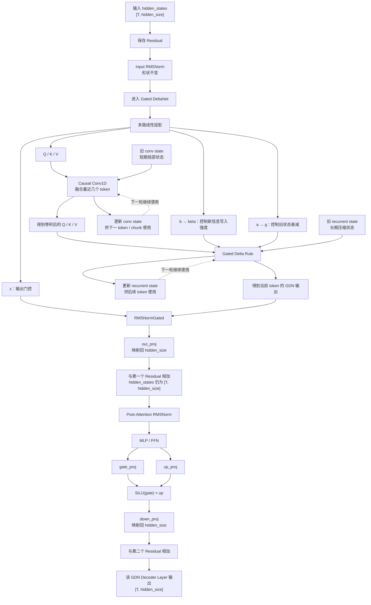

# Qwen3.5 GDN Decoder Layer：内部结构与面试口语版讲解

> **说明**
>
> 你这里说的“DDN”按照前面的项目语境，我理解为 **Qwen3.5 的 GDN（Gated DeltaNet）层**。
>
> 这份文档只解决一个问题：
>
> **Qwen3.5 中一个 GDN 类型的 Decoder Layer，和普通 Full Attention Decoder Layer 相比，内部到底有哪些模块？hidden state 是怎么流动的？`conv state` 和 `recurrent state` 又是在什么位置被读取和更新的？**
>
> 文档分成两部分：
>
> 1. **先用一张流程图把整个 GDN Decoder Layer 串起来**
> 2. **再用面试时可以直接说出口的方式逐段介绍**

---

# 第一部分：GDN Decoder Layer 完整流程图

先明确一个非常重要的认识：

> **GDN 不是把整个 Decoder Layer 都替换掉。**
>
> Qwen3.5 的一个 Decoder Layer 外层结构和普通 Transformer 仍然很像，仍然有：
>
> ```text
> RMSNorm
> 状态混合模块
> Residual
> RMSNorm
> MLP
> Residual
> ```
>
> 只不过这一层如果配置成 GDN Layer，那么原本的 **Full Attention** 被换成了 **Gated DeltaNet**。

---



---

## 把整张图压缩成一句话

一个 GDN Decoder Layer 可以直接记成：

```text
hidden_states
    ↓
RMSNorm
    ↓
GDN：更新短期 conv state + 长期 recurrent state
    ↓
Residual
    ↓
RMSNorm
    ↓
MLP
    ↓
Residual
    ↓
下一层
```

所以它和 Full Attention Layer 最大的区别其实只在中间这一块：

```text
Full Attention Layer：
RMSNorm → Attention + KV Cache → Residual → RMSNorm → MLP → Residual

GDN Layer：
RMSNorm → Gated DeltaNet + 两份 State → Residual → RMSNorm → MLP → Residual
```

---

# 第二部分：面试时怎么完整介绍 GDN Decoder Layer

## 1. 先整体介绍这一层

**面试官：你说一下 Qwen3.5 的 GDN Layer 内部整体是什么结构？**

如果让我从一个完整 Decoder Layer 的角度来说，其实 Qwen3.5 的 GDN Layer 外层和普通 Transformer Layer 差别没有特别大。hidden state 进来以后，首先还是先保存一份 residual，然后做一次 RMSNorm。普通 Full Attention Layer 在这里会进入 Self-Attention，而 GDN Layer 则进入 Gated DeltaNet。GDN 算完以后，输出仍然会映射回原来的 `hidden_size`，再和前面保存的 residual 相加。后面仍然是第二次 RMSNorm，再进入正常的 MLP，MLP 做完以后再做一次 residual，相当于一个完整 Decoder Layer 就结束了。所以真正变化最大的并不是 RMSNorm 和 MLP，而是把原来的 Attention 模块换成了一套基于状态更新的 GDN 模块。

---

## 2. GDN 和普通 Attention 最核心的区别是什么？

**面试官：那 GDN 和普通 Full Attention 最大区别是什么？**

我觉得最核心的区别是它们保存和读取历史信息的方式不一样。Full Attention 会为历史 token 保存 K 和 V，当前 token 来以后，用当前 Q 去和历史 K 做匹配，再从历史 V 里面取信息，所以 KV Cache 会随着上下文越来越长。GDN 不会为每个历史 token 都一直保存一份标准 K/V，而是把历史不断压缩进固定形状的状态里。它主要维护两份状态，一份叫 `conv state`，负责短卷积最近几个 token 的局部历史；另一份叫 `recurrent state`，负责更长期的压缩记忆。所以 Decode 时每来一个 token，它做的主要是“读取旧状态、根据当前 token 更新状态，再从新状态得到当前输出”。

---

## 3. hidden state 进入 GDN 后第一步做什么？

**面试官：hidden state 真正进入 GDN 后，第一步是什么？**

第一步还是做线性投影。只不过 Full Attention 一般主要得到 Q、K、V，而 GDN 除了 Q、K、V 之外，还会额外生成几组门控参数。我这个实现里主要可以看到 `in_proj_qkv`、`in_proj_z`、`in_proj_b` 和 `in_proj_a`。`in_proj_qkv` 就是产生 Q、K、V；`z` 可以理解成最后输出阶段的门控；`b` 后面会经过 sigmoid 得到 `beta`，主要控制当前新信息写入状态的强度；`a` 会结合模型里的衰减参数生成 `g`，主要控制旧 recurrent state 保留或者衰减多少。所以 GDN 不是单纯得到 Q/K/V，而是同时得到“内容”和“怎么更新记忆”的控制参数。

---

## 4. 为什么 Q、K、V 后面还要先做一个 Causal Conv1D？

**面试官：GDN 里面为什么还有一个 causal convolution？**

因为 GDN 在真正更新长期 recurrent state 之前，还想先把最近几个 token 的局部信息融合进当前的 Q、K、V。这个卷积是因果卷积，也就是说当前 token 只能利用当前和前面的少量 token，不会看到未来。为了 Decode 时不用每次重新把最近几个 token 都拿出来计算，它会保存一份 `conv state`。所以新 token 来的时候，会把当前投影结果和旧的 `conv state` 接起来做短卷积，然后把最新的几个历史位置重新写回 `conv state`。因此我会把 `conv state` 理解成给短卷积服务的一份局部历史缓存，也可以通俗地叫短期记忆。

---

## 5. `conv state` 到底保存的是什么？

**面试官：那 `conv state` 是不是像 KV Cache 一样保存整个历史？**

不是。`conv state` 只服务于短卷积，它只需要保留卷积窗口所需的最近几个位置，所以大小基本是固定的，不会随着上下文无限增长。比如卷积核需要最近几步的信息，那它就保存能够让下一次卷积连续算下去的那一小段历史。它和 KV Cache 最大的区别就是，KV Cache 是历史 token 越多一般就越长，而 `conv state` 只是保存短卷积边界所需要的固定大小数据。

---

## 6. 卷积做完以后发生什么？

**面试官：短卷积以后，GDN 的核心计算是什么？**

卷积以后得到处理过的 Q、K、V，接下来就进入 GDN 最核心的 Gated Delta Rule。这里会把当前的 K、V、`beta`、衰减门控 `g`，以及这个请求上一轮留下来的 `recurrent state` 一起拿出来。可以简单理解成，先根据门控决定旧记忆应该保留多少，然后用当前 K 去判断状态里面已经记住了什么，再根据当前 V 判断这次新 token 带来了多少新的信息，最后把这部分新信息写进 recurrent state。这样就从旧的 `State_t` 得到了新的 `State_{t+1}`。

---

## 7. `recurrent state` 到底是什么？

**面试官：你怎么理解 recurrent state？**

我会把它理解成 GDN 的长期压缩记忆。Full Attention 把历史信息显式保存在一个越来越长的 KV Cache 里面，而 GDN 的 recurrent state 更像是把前面很多 token 的信息不断融合到一个固定形状的状态矩阵里。每来一个 token，这份状态都会更新一次，所以整个过程就是 `State_t + Token_t → State_{t+1}`。它最大的特点是状态大小不会因为 token 数变多而线性增长，这也是 GDN 和标准 Attention 在历史状态管理上非常大的区别。

---

## 8. Q、K、V 在 GDN 中分别怎么理解？

**面试官：GDN 里面也叫 Q、K、V，那和 Attention 一样吗？**

名字相似，但是使用方式不完全一样。Full Attention 里，Q 主要去和所有历史 K 做相关性，然后根据权重读取历史 V。GDN 里没有构造这样一整张“当前 token 对所有历史 token”的注意力矩阵。我会简单理解成：K 主要参与判断当前信息怎样和已有状态进行匹配，V 表示当前要写入的内容，Q 最后负责从更新后的状态里读取当前 token 需要的信息。所以它们仍然承担“查询、匹配、内容”这种角色，但是对象从“历史所有 K/V token”变成了“持续维护的状态”。

---

## 9. `beta` 和 `g` 这些门控是干什么的？

**面试官：为什么 GDN 需要这么多 gate？**

因为 GDN 的本质是不断修改一块有限大小的记忆，所以必须解决两个问题：旧信息到底要保留多少，新信息到底要写多少。`g` 可以理解成偏向控制旧状态衰减，也就是以前的信息应该忘掉多少；`beta` 可以理解成控制这次新的 Delta 更新强度，也就是当前 token 带来的新内容应该写入多少。这样模型不是每次都简单粗暴地覆盖状态，而是训练出一套动态的“保留、遗忘、写入”策略。

---

## 10. recurrent state 更新完以后，怎么得到这一层的输出？

**面试官：状态更新完了以后，hidden state 怎么重新出来？**

状态更新完以后，会根据当前 Q 从更新后的 recurrent state 中得到这一轮的输出。然后它还会结合前面 `in_proj_z` 产生的门控，经过一个 `RMSNormGated` 做归一化和门控。之后再通过 `out_proj` 把 GDN 内部的 value head 表示重新映射回模型统一的 `hidden_size`。所以 GDN 内部不管中间 Head 怎么拆，最后还是会重新输出一个和输入相同主维度的 hidden state，后面才能继续做 residual 和 MLP。

---

## 11. GDN 算完以后，这个 Decoder Layer 结束了吗？

**面试官：GDN 算完是不是这一层就结束了？**

不是。GDN 只是替代了普通 Decoder Layer 中 Attention 的位置。GDN 的输出经过 `out_proj` 以后，会先和进入这一块之前保存的 residual 相加，然后再做一次 RMSNorm，接着进入正常的 MLP。MLP 还是 Qwen 里熟悉的 `gate_proj + up_proj + SwiGLU + down_proj`，主要负责对每个 token 自己的特征继续做非线性加工。MLP 完成后再和第二份 residual 相加，这时候一个完整的 GDN Decoder Layer 才真正结束，输出继续传给下一层。

---

## 12. GDN Layer 里面 MLP 和普通 Full Attention Layer 的 MLP 有区别吗？

**面试官：换成 GDN 以后，后面的 MLP 也换了吗？**

从这个层的主结构上看，MLP 这部分并不是 GDN 的核心变化。无论这一层前面是 Full Attention 还是 GDN，后面仍然会进入 Qwen3.5 的 MLP，也就是 hidden state 经过 gate 和 up 两条投影，gate 做 SiLU，然后两路逐元素相乘，最后经过 down projection 映射回 hidden size。所以 Hybrid 模型真正混合的是前面的“历史信息混合模块”：有些层用 Full Attention，有些层用 GDN；MLP 仍然是每层都有的。

---

## 13. Prefill 时 GDN 怎么运行？

**面试官：GDN 在 Prefill 时怎么建立这两份状态？**

Prefill 一次可能进入很多个 token，所以如果一个 token 一个 token 用 Python 循环更新会比较低效。项目里 Prefill 会根据 `cu_seqlens_q` 找到 batch 中每个请求的范围，再根据 `state_indices` 找到每个请求自己的状态槽。短卷积会批量处理当前这段 token，并把最后需要保留的部分写回 `conv state`；recurrent 部分则通过 chunk 方式执行 Gated Delta Rule，在处理整段 token 的同时最终得到这段 Prefill 结束时的 recurrent state，再写回这个请求对应的 slot。所以 Prefill 的重点是“一次处理一段 token，同时把最终两份状态建立起来”。

---

## 14. Decode 时 GDN 怎么运行？

**面试官：那 Decode 阶段呢？**

Decode 就更直观了，因为每个请求这一轮只有一个新 token。ModelRunner 已经通过 `state_indices` 告诉 GDN batch 中每个请求使用哪个 State Slot。GDN 直接取出这些请求旧的 `conv state` 和 `recurrent state`，先结合当前 token 更新短卷积状态，然后计算 Q/K/V 和门控，接着用 recurrent gated delta rule 更新长期状态，得到当前输出，再经过 gated norm 和 out projection。最终就是一个非常典型的递归过程：**当前 token + 旧状态 → 当前输出 + 新状态**，下一轮 Decode 再接着用这个新状态。

---

# 三、最重要的状态关系

一个请求进入 GDN 层时，可以把它想成同时带着两份历史：

```text
Sequence.state_slot_id
        ↓
Context.state_indices
        ↓
当前 GDN Layer
        │
        ├── conv_states[state_slot_id]
        │      └── 最近几步短卷积所需的局部状态
        │
        └── recurrent_states[state_slot_id]
               └── 更长历史压缩后的长期状态
```

注意：

> **每个 GDN Layer 都有自己的一套 `conv_states` 和 `recurrent_states` 显存池。**
>
> 但是同一个请求在所有 GDN Layer 中使用同一个 `state_slot_id`。

比如：

```text
请求 A：
state_slot_id = 3

GDN Layer 0：
conv_states[3]
recurrent_states[3]

GDN Layer 1：
conv_states[3]
recurrent_states[3]

GDN Layer 2：
conv_states[3]
recurrent_states[3]
```

所以 `state_slot_id=3` 不是说所有 GDN 层共用同一份状态，而是：

> **这个请求在每一个 GDN 层自己的状态池里，都使用第 3 个槽位。**

---

# 四、Full Attention Layer 和 GDN Layer 放在一起比较

| 环节 | Full Attention Decoder Layer | GDN Decoder Layer |
|---|---|---|
| 第一层 RMSNorm | 有 | 有 |
| 历史混合模块 | Full Attention | Gated DeltaNet |
| 历史状态 | KV Cache | conv state + recurrent state |
| 历史长度增长 | KV 随 token 增长 | State 形状基本固定 |
| Q/K/V | 和历史 KV 做注意力 | 用于状态更新和状态读取 |
| 短卷积 | 没有 | 有 Causal Conv1D |
| 门控更新 | Attention 输出有自己的 gate | `a/b/z` 等多组 gate |
| 第一处 Residual | 有 | 有 |
| 第二次 RMSNorm | 有 | 有 |
| MLP | 有 | 有 |
| 第二处 Residual | 有 | 有 |
| 最终输出形状 | `[T, hidden_size]` | `[T, hidden_size]` |

所以最简单的区别就是：

```text
普通 Layer：
RMSNorm
→ Attention
→ Residual
→ RMSNorm
→ MLP
→ Residual

GDN Layer：
RMSNorm
→ Q/K/V + Gate
→ Causal Conv
→ 更新 conv state
→ 更新 recurrent state
→ 从 state 得到输出
→ Gated Norm + Out Projection
→ Residual
→ RMSNorm
→ MLP
→ Residual
```

---

# 五、面试时一整段怎么说

> Qwen3.5 的 GDN Layer 我会分成两层来看。首先从整个 Decoder Layer 的结构来说，它其实没有把 Transformer 的外层结构全部改掉，hidden state 进来以后还是先做 RMSNorm，然后原来 Full Attention 的位置换成了 Gated DeltaNet，GDN 输出映射回 hidden size 以后做一次残差相加，接着还是第二个 RMSNorm，再进入正常的 MLP，最后再做一次残差，一个 Decoder Layer 才结束。真正变化最大的是中间的 GDN 模块。GDN 首先会从 hidden state 投影出 Q、K、V，同时还会得到几组门控参数，比如 beta 控制当前新信息写入多少，另外的衰减门控制旧状态保留多少。Q/K/V 会先经过一个短的因果卷积，这里会维护一份 conv state，用来保存最近几个 token 的局部历史；然后进入核心的 Gated Delta Rule，它会读取这个请求之前保存的 recurrent state，根据当前 K、V 和门控去更新这份长期状态，可以理解成把新的 token 信息继续压缩进固定大小的记忆里。状态更新以后，再通过 Q 从新的 recurrent state 中得到当前输出，然后经过 RMSNormGated 和输出投影重新变回 hidden size。这里的 `conv state` 主要服务短期局部卷积，`recurrent state` 负责更长历史的压缩记忆。Decode 时每来一个 token，就是“当前 token 加旧的两份 state，得到当前输出并更新成新的两份 state”；Prefill 时则会以 chunk 的方式批量建立这些状态。所以我理解 GDN 和 Full Attention 最大的区别就是，Full Attention 用不断增长的 KV Cache 保存历史，而 GDN 用固定形状的 conv state 和 recurrent state 持续更新历史记忆，但 GDN 后面的 Residual、RMSNorm 和 MLP 这些 Transformer 主结构仍然保留。

---

# 六、最后只记住这条链

如果面试前只想记最核心的一条，可以背：

```text
hidden state
→ RMSNorm
→ 投影出 Q/K/V 和门控
→ Causal Conv 更新 conv state
→ Gated Delta Rule 更新 recurrent state
→ Q 从新 state 读出当前结果
→ Gated Norm
→ out_proj 回 hidden_size
→ Residual
→ RMSNorm
→ MLP
→ Residual
→ 下一层
```

以及两份 State：

```text
conv state
= 最近几步局部卷积状态

recurrent state
= 更长历史压缩后的长期状态
```

这就是一个 Qwen3.5 GDN Decoder Layer 最完整、同时又适合面试表达的理解方式。


%% 项目关联导航：开始 %%
## 项目关联导航

- 所属模块：[[outputs/项目整理/模块-面试准备|模块-面试准备]]

%% 项目关联导航：结束 %%
