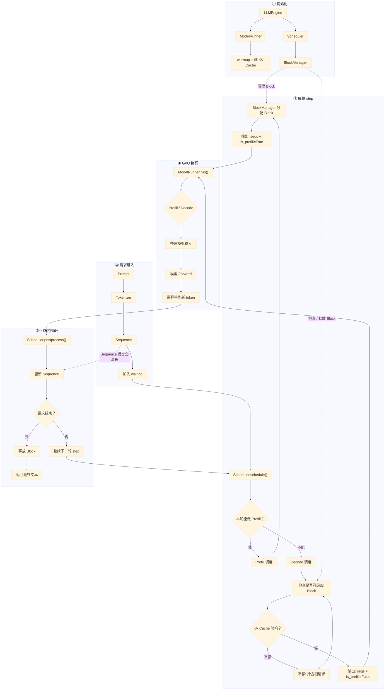

# nano-vLLM `engine` 核心联系图（简化大字版）

> 说明：这次只保留 **一张更简洁、更容易看清的总流程图**。  
> 图中节点尽量缩短；详细解释统一放在图后注释里。

---

## 图后注释

### 1. 这五个核心文件分别干什么？

- **`llm_engine.py`**  
  最上层总控。负责把请求接进来，并不断驱动  
  **`schedule → run → postprocess`** 这个循环。

- **`sequence.py`**  
  一条请求的状态对象。  
  里面记录：token、当前状态、已经缓存多少 token、用了哪些 Block 等。

- **`scheduler.py`**  
  调度器。决定：
  - 本轮谁运行
  - 运行 Prefill 还是 Decode
  - 每条请求本轮算多少 token
  - 显存不够时抢占谁

- **`block_manager.py`**  
  管理 KV Cache 的 Block。负责：
  - 分配 Block
  - 追加 Block
  - 释放 Block
  - 做 Prefix Cache 复用

- **`model_runner.py`**  
  真正执行 GPU 推理。负责：
  - 加载模型
  - warmup
  - 创建真正的 GPU KV Cache
  - 把请求整理成模型输入
  - 调模型 forward
  - 采样出新 token

---

### 2. 一次完整链路怎么走？

一次请求从进入到输出，大体是这样：

1. 用户输入 Prompt
2. `Tokenizer` 转成 token ids
3. 创建 `Sequence`
4. 放入 `waiting`
5. `Scheduler.schedule()` 决定本轮怎么调度
6. `BlockManager` 配合完成 Block 分配或检查
7. `ModelRunner.run()` 真正在 GPU 上跑模型
8. 得到新 token
9. `Scheduler.postprocess()` 回写结果，更新 `Sequence`
10. 如果还没结束，就继续下一轮 `step`
11. 如果结束，就释放 Block 并返回文本

---

### 3. Prefill 和 Decode 在图里怎么看？

- **Prefill 路径**：  
  `schedule → Prefill 调度 → 分配 Block → ModelRunner.run`

- **Decode 路径**：  
  `schedule → Decode 调度 → 检查能否追加 Block → ModelRunner.run`

这版 nano-vLLM 的一个重要特点是：

> **同一轮只跑一种阶段。**  
> 如果本轮成功调度到了 Prefill，请求就先做 Prefill；  
> 没有 Prefill 可调度时，才去做 Decode。

---

### 4. 为什么 `Sequence` 很重要？

因为它是这几个模块之间传递信息的“公共对象”。

- `LLMEngine` 创建它
- `Scheduler` 调度它
- `BlockManager` 给它分配 Block
- `ModelRunner` 根据它准备输入
- `postprocess` 再把结果写回它

可以理解成：  
**Sequence 是“请求档案”，其他模块都是围着它工作。**

---

### 5. `BlockManager` 和 `ModelRunner` 的区别

这两个很容易混：

- **`BlockManager`**：  
  管“这些 Block 怎么分、怎么回收、怎么复用”

- **`ModelRunner`**：  
  管“真正的 GPU KV Cache 张量在哪里，以及模型怎么跑”

所以可以简单记成：

> **BlockManager 管逻辑分配，ModelRunner 管真实执行。**

---

### 6. 什么时候会抢占？

在 **Decode** 阶段，如果某个请求继续生成新 token 时需要新 Block，  
但 KV Cache 不够了，就会触发抢占。

此时 Scheduler 会：
1. 选一个运行中的请求先让路
2. 释放它占用的 Block
3. 让当前更优先的请求继续跑

---

### 7. 最应该记住的总关系

如果只记一句话，可以记这个：

> **LLMEngine 总控全局，Sequence 保存请求状态，Scheduler 决定谁算，BlockManager 管 KV Block，ModelRunner 真正在 GPU 上运行模型。**

%% 项目关联导航：开始 %%
## 项目关联导航

- 所属模块：[[outputs/项目整理/模块-面试准备|模块-面试准备]]

%% 项目关联导航：结束 %%
