# nano-vLLM：4 卡并行下“一次生成 1 个 Token”的清晰流程图

%%{init: {"theme": "default", "flowchart": {"htmlLabels": true, "nodeSpacing": 42, "rankSpacing": 65, "curve": "linear"}, "themeVariables": {"fontSize": "30px", "fontFamily": "Arial"}} }%%

```mermaid
flowchart TB

    A[用户请求\nprompt + sampling params] --> B[LLMEngine\n接收请求]
    B --> C[Sequence\n保存 token、状态、采样参数]
    C --> D[Scheduler\n选出本轮要执行的请求]
    D --> E[BlockManager\n为每个请求分配 / 复用逻辑 KV Blocks]
    E --> F[ModelRunner\n整理 batch：input_ids / positions / slot_mapping / block_tables]
    F --> G[把同一批请求发送到 4 个 TP Worker\n4 张卡“同时做同一层”，但“每张卡只做自己那一份”]

    subgraph T[4 张卡并行主视图（TP = 4）]
        direction TB

        subgraph E0[Step 1：Embedding 并行]
            direction LR
            G0E[GPU0\n词表 1/4] --> AR1[All-Reduce\n合成完整 hidden]
            G1E[GPU1\n词表 1/4] --> AR1
            G2E[GPU2\n词表 1/4] --> AR1
            G3E[GPU3\n词表 1/4] --> AR1
        end

        AR1 --> LAYERS[进入 Decoder Layers × L\n后面每一层都按相同并行模式执行]

        subgraph E1[Step 2：单个 Decoder Layer 的并行细节]
            direction TB

            N1[RMSNorm\n每张卡都有完整参数\n各卡本地直接算] --> N2

            subgraph CP1[QKV：Column Parallel（按输出维切）]
                direction LR
                C0[GPU0：负责 1/4 QKV heads]
                C1[GPU1：负责 1/4 QKV heads]
                C2[GPU2：负责 1/4 QKV heads]
                C3[GPU3：负责 1/4 QKV heads]
            end

            N2[输入 hidden] --> C0
            N2 --> C1
            N2 --> C2
            N2 --> C3

            C0 --> R0[本地 RoPE]
            C1 --> R1[本地 RoPE]
            C2 --> R2[本地 RoPE]
            C3 --> R3[本地 RoPE]

            R0 --> A0[本地 Attention\n只算本地 heads\n只写本地 KV Cache 分片]
            R1 --> A1[本地 Attention\n只算本地 heads\n只写本地 KV Cache 分片]
            R2 --> A2[本地 Attention\n只算本地 heads\n只写本地 KV Cache 分片]
            R3 --> A3[本地 Attention\n只算本地 heads\n只写本地 KV Cache 分片]

            subgraph RP1[O_proj：Row Parallel（按输入维切）]
                direction LR
                O0[GPU0 局部 matmul]
                O1[GPU1 局部 matmul]
                O2[GPU2 局部 matmul]
                O3[GPU3 局部 matmul]
            end

            A0 --> O0
            A1 --> O1
            A2 --> O2
            A3 --> O3

            O0 --> AR2[All-Reduce\n合成完整 attention 输出]
            O1 --> AR2
            O2 --> AR2
            O3 --> AR2

            subgraph CP2[MLP Gate / Up：Column Parallel（按输出维切）]
                direction LR
                M0[GPU0：1/4 中间通道]
                M1[GPU1：1/4 中间通道]
                M2[GPU2：1/4 中间通道]
                M3[GPU3：1/4 中间通道]
            end

            AR2 --> M0
            AR2 --> M1
            AR2 --> M2
            AR2 --> M3

            M0 --> S0[本地 SwiGLU]
            M1 --> S1[本地 SwiGLU]
            M2 --> S2[本地 SwiGLU]
            M3 --> S3[本地 SwiGLU]

            subgraph RP2[MLP Down：Row Parallel（按输入维切）]
                direction LR
                D0M[GPU0 局部 matmul]
                D1M[GPU1 局部 matmul]
                D2M[GPU2 局部 matmul]
                D3M[GPU3 局部 matmul]
            end

            S0 --> D0M
            S1 --> D1M
            S2 --> D2M
            S3 --> D3M

            D0M --> AR3[All-Reduce\n合成完整 MLP 输出]
            D1M --> AR3
            D2M --> AR3
            D3M --> AR3
        end

        LAYERS --> N1
        AR3 --> FR[Final RMSNorm\n各卡本地算]

        subgraph E2[Step 3：LM Head + 采样]
            direction LR
            H0[GPU0：本地 1/4 vocab logits]
            H1[GPU1：本地 1/4 vocab logits]
            H2[GPU2：本地 1/4 vocab logits]
            H3[GPU3：本地 1/4 vocab logits]
            GAT[Gather 到 rank0\n拼成完整 logits]
            SMP[Sampler 仅在 rank0\n采样出 next token]
        end

        FR --> H0
        FR --> H1
        FR --> H2
        FR --> H3
        H0 --> GAT
        H1 --> GAT
        H2 --> GAT
        H3 --> GAT
        GAT --> SMP
    end

    G --> T
    SMP --> OUT[得到 next token]
    OUT --> UPD[Sequence.append_token\n更新请求状态]
    UPD --> ENDQ{是否结束？\nEOS / 达到 max_tokens}
    ENDQ -- 否 --> LOOP[进入下一轮 Decode\n重复同样的 4 卡并行流程]
    ENDQ -- 是 --> FIN[回收 Sequence / Blocks / KV 状态]

    classDef base fill:#f8fbff,stroke:#2b579a,stroke-width:2px,color:#111,font-size:30px;
    classDef comm fill:#fff4db,stroke:#c27c0e,stroke-width:2px,color:#111,font-size:30px;
    classDef gpu fill:#eef8ef,stroke:#2f855a,stroke-width:2px,color:#111,font-size:30px;
    classDef stage fill:#f4f0ff,stroke:#6b46c1,stroke-width:2px,color:#111,font-size:30px;

    class A,B,C,D,E,F,G,OUT,UPD,ENDQ,LOOP,FIN base;
    class AR1,AR2,AR3,GAT comm;
    class G0E,G1E,G2E,G3E,C0,C1,C2,C3,R0,R1,R2,R3,A0,A1,A2,A3,O0,O1,O2,O3,M0,M1,M2,M3,S0,S1,S2,S3,D0M,D1M,D2M,D3M,H0,H1,H2,H3 gpu;
    class T,E0,E1,E2,CP1,RP1,CP2,RP2,LAYERS,N1,N2,FR,SMP stage;
```

## 注解

- 这次重画的重点不是只看“从哪里到哪里”，而是让你一眼能看出：**4 张卡到底是如何分工并行的**。
- **核心理解一句话**：在 TP=4 下，**4 张卡跑的是同一个模型层次结构，但每张卡只持有该层权重的一部分，所以每一层都在并行协作完成一次 forward。**
- 图中最关键的两种切分方式：
  - **Column Parallel（列并行 / 按输出维切）**：QKV、MLP 的 gate/up。理解成“一个大输出拆成 4 份，每张卡各算一份”。
  - **Row Parallel（行并行 / 按输入维切）**：Attention 的 `o_proj`、MLP 的 `down_proj`。理解成“每张卡先拿自己那一段输入做局部计算，最后再把结果合起来”。
- **为什么 Attention 能在 4 张卡上并行？**
  - 因为 Q/K/V 和 attention heads 都被切开了；
  - 每张卡只负责自己那一部分 heads；
  - 所以每张卡也只需要保存自己对应的 **KV Cache 分片**；
  - 这样显存和计算都分摊到了 4 张卡上。
- **哪里需要通信？**
  - Embedding 后：`All-Reduce`；
  - `o_proj` 后：`All-Reduce`；
  - `MLP down_proj` 后：`All-Reduce`；
  - LM Head 后：把各卡的 logits 分片 `Gather` 到 rank0；
  - Sampler 只在 rank0 上做采样。
- **Prefill / Decode 在这张图里的区别**：
  - 并行结构本身是一样的；
  - 不同点主要在于输入 token 数量不同：Prefill 往往是一段 token，Decode 往往是一轮一个 token；
  - 但两者都会经过同样的多卡并行框架。
- 如果你后面还想更“面试友好”，我还可以继续给你再画一个版本：
  1. **更偏工程版**：突出 `Scheduler / BlockManager / ModelRunner / Context / Attention` 的调用关系；
  2. **更偏张量版**：直接把 `hidden_size / num_heads / 每卡 heads 数 / KV Cache 形状` 标在图里。

%% 项目关联导航：开始 %%
## 项目关联导航

- 所属模块：[[outputs/项目整理/模块-面试准备|模块-面试准备]]

%% 项目关联导航：结束 %%
