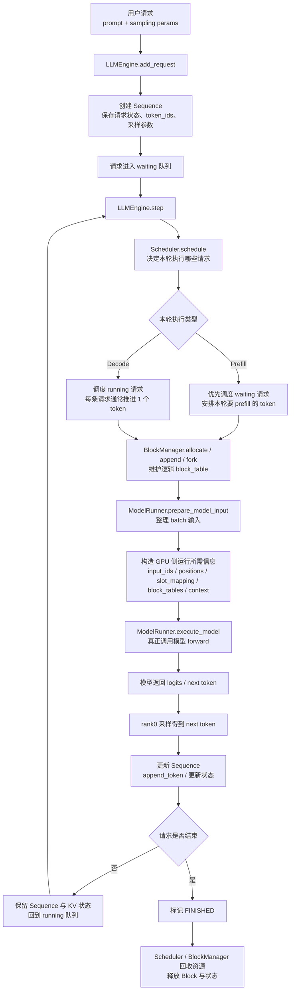
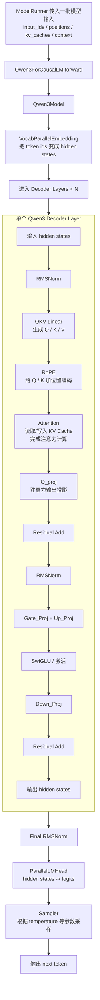
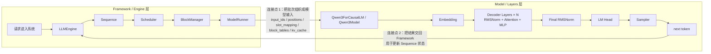

# Nano-vLLM 全局流程图：Framework 层 与 Model/Layers 层

> 这份文档的目标不是讲某一个文件的细节，而是让你从 **“请求进入系统”** 开始，一直看到 **“token 产出”** 为止，真正建立整个 Nano-vLLM 项目的全局视角。  
> 为了更清楚地理解结构，这里把整个项目拆成 **两个模块**：
>
> 1. **Framework / Engine 层**：负责请求管理、调度、状态维护、KV Block 管理、批处理组织。
> 2. **Model / Layers 层**：负责 Qwen3 模型真正的 forward 计算，包括 Embedding、Attention、MLP、LM Head、Sampler。
>
> 你可以把它理解成：
>
> - **Framework 层回答：这一步该算谁、怎么组织起来算。**
> - **Model / Layers 层回答：这一批 token 到底怎么被模型算出下一个 token。**

---

## 图 1：Framework / Engine 层流程图



---

## 图 2：Model / Layers 层 + Qwen3 模型结构流程图



---

## 图 3：两大模块如何连接在一起（总流程图）



---

## 两个模块各自负责什么

### 1）Framework / Engine 层负责什么

这一层不负责“数学计算本身”，它负责的是 **调度和组织**。

你可以把它理解为一个“推理总控系统”，主要做以下几件事：

- 接收请求；
- 为每个请求创建 `Sequence`；
- 把请求放入等待队列；
- 调度器决定当前该算哪些请求；
- BlockManager 决定这些请求的 KV Block 怎么分配、追加、复用、释放；
- ModelRunner 把这些请求整理成一个 batch；
- 准备模型真正 forward 所需的输入；
- 调用模型；
- 拿回输出 token；
- 更新请求状态；
- 判断请求是否结束。

所以，**Framework 层的核心关键词是：调度、状态管理、批处理组织、资源维护。**

---

### 2）Model / Layers 层负责什么

这一层不负责“谁先算、谁后算”，它只负责：

> **给我输入，我就完成一次模型 forward，算出 logits，再采样出下一个 token。**

它主要做的是：

- Embedding：把 token id 变成向量；
- 多层 Decoder Layer：反复做 Attention + MLP；
- Attention 中读写 KV Cache；
- 最后通过 LM Head 输出 logits；
- 再由 Sampler 选出下一个 token。

所以，**Model / Layers 层的核心关键词是：模型结构、算子执行、forward 计算。**

---

## 两个模块“从哪里开始有联系，从哪里开始没联系”

这是最关键的一部分。

### 一、开始有联系的地方

两个模块第一次真正连接起来，是在：

```text
ModelRunner.execute_model
    ↓
Qwen3ForCausalLM.forward
```

也就是说：

- 前面的 `LLMEngine / Scheduler / BlockManager` 都还在 Framework 层；
- 当 `ModelRunner` 把这一批请求整理好，并调用模型 forward 的那一刻，才真正进入 Model / Layers 层。

换句话说：

> **连接点 = ModelRunner 调用 Qwen3 模型 forward。**

在这个连接点上，Framework 层会把这些东西交给模型层：

- `input_ids`
- `positions`
- `slot_mapping`
- `block_tables`
- `kv_caches`
- 运行时 `context`

这些信息会进一步传到 `Attention`、`LM Head` 等模块里。

---

### 二、暂时“没联系”的地方

一旦进入模型 forward 之后：

- `Scheduler` 不再参与层内计算；
- `BlockManager` 不再参与层内张量计算；
- `Sequence` 也不会逐层干预模型计算；
- 此时主要是 `Qwen3Model` 和 `layers` 在完成数学计算。

也就是说，在 forward 的这段时间里：

> **Framework 层主要处于“把舞台搭好以后先退到幕后”的状态。**

它不再决定某一层怎么算，而是把控制权交给模型层。

---

### 三、重新产生联系的地方

模型算出 logits，并由 `Sampler` 得到 next token 之后，会重新回到 Framework 层：

```text
Sampler 输出 next token
    ↓
ModelRunner / LLMEngine 拿到结果
    ↓
更新 Sequence
    ↓
判断结束 / 继续下一轮 decode
```

所以第二个连接点就是：

> **模型层输出 token，Framework 层接回结果并更新请求状态。**

---

## 一条请求从进池到 token 输出的完整历史

你可以把整个过程记成下面这条主线：

```text
用户请求进入
→ LLMEngine.add_request
→ 创建 Sequence
→ 进入 waiting 队列
→ Scheduler 决定这一轮执行它
→ BlockManager 为它准备 block_table / KV 逻辑映射
→ ModelRunner 把它整理进 batch
→ 调用 Qwen3ForCausalLM.forward
→ Embedding
→ 多层 Decoder Layer（Attention + MLP）
→ Final RMSNorm
→ LM Head
→ Sampler
→ 得到 next token
→ 回到 Framework 层更新 Sequence
→ 判断继续还是结束
```

如果没有结束，就会继续进入下一轮 decode，循环以上过程，直到：

- 生成 EOS；或
- 达到最大生成长度；或
- 被上层停止。

---

## 你理解这个项目时，最该抓住的主线

如果你后面要复习整个 Nano-vLLM，我建议你脑子里始终保留这两个问题：

### 问题 1：Framework 层在解决什么？

它在解决：

- 请求怎么排队；
- 谁先算；
- 一次算多少；
- KV Block 怎么管理；
- batch 怎么组织；
- 结果怎么更新回请求状态。

### 问题 2：Model / Layers 层在解决什么？

它在解决：

- token 怎么变成 hidden states；
- hidden states 怎么经过多层 Attention / MLP；
- KV Cache 在 Attention 中怎么被读写；
- 最后怎么变成 logits；
- logits 怎么变成一个新 token。

你只要把这两条线分清，再记住中间的连接点：

```text
Framework 层
   ↓（ModelRunner 调用 forward）
Model / Layers 层
   ↓（Sampler 输出 token）
Framework 层
```

那么整个项目的大结构就会非常清楚。

---

## 一句话总结

**Nano-vLLM 的本质可以概括为：Framework 层负责“把请求组织好并调度起来”，Model / Layers 层负责“把这一批输入真正算成下一个 token”，两者通过 ModelRunner 调用模型 forward 连接，在 Sampler 输出 token 后再回到 Framework 层更新请求状态。**


%% 项目关联导航：开始 %%
## 项目关联导航

- 所属模块：[[outputs/项目整理/模块-面试准备|模块-面试准备]]

%% 项目关联导航：结束 %%
