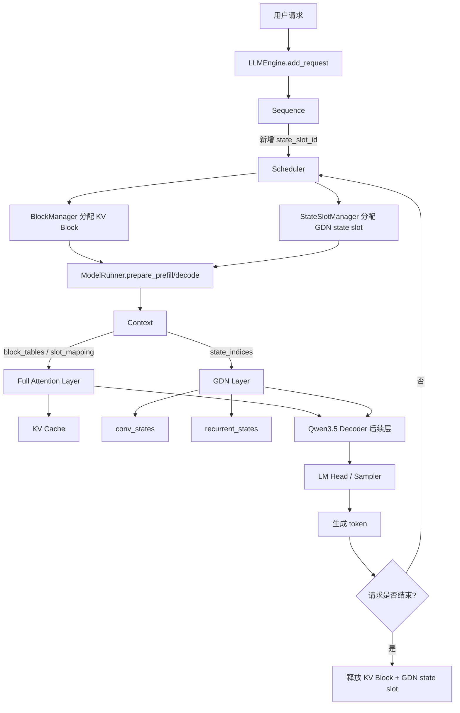
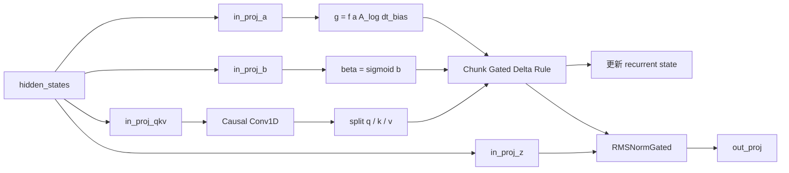
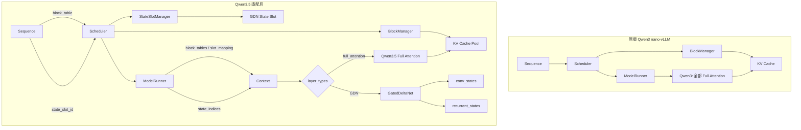

# nano-vLLM 从 Qwen3 适配到 Qwen3.5：源码增量复盘

> 目标：你已经理解原版 nano-vLLM 的请求调度、Prefill/Decode、Paged KV Cache、TP 和 token 生成流程，因此本文**不再从头讲原版框架**，而只回答一个问题：
>
> **为了让原本只支持 Qwen3 的 nano-vLLM 跑起来 Qwen3.5，源码到底在哪些文件增加了什么、为什么必须这么改，以及这些改动之间是怎么串起来的？**

---

## 0. 本文的对比基线

本文实际对比了你提供的两个源码压缩包：

- 原版：`nano-vllm.7z`
- 适配版：`nano-vllm-qwen3.6.7z`

原版 `nanovllm/` 中：

- `engine/`：5 个文件
- `layers/`：7 个文件
- `models/`：只有 `qwen3.py`

适配版中：

- `engine/`：仍然是 5 个文件，但 **5 个都发生了修改**
- `layers/`：新增 `gated_delta_net.py`，其余文件中有 5 个发生修改，`activation.py` 和 `attention.py` 保持不变
- `models/`：新增 `qwen3_5.py`，后续又增加了 `qwen3_mtp.py`、`vision_encoder.py`

另外，适配版 Git 历史中最早的提交 `2d75a4a` 已经包含 Qwen3.5、GDN、多模态和 FP8 相关基础代码；之后的提交大部分继续增加 MTP。因此本文会把当前仓库里的改动分成三类：

- **【Qwen3.5 核心】**：为了 Hybrid + GDN 文本模型必须做的改动
- **【Qwen3.5-V / 多模态】**：图片、MRoPE、Vision Encoder 相关
- **【后续能力】**：FP8、MTP、测试/探针等，不要在面试中误说成“为了 GDN 才改”

---

# 1. 先抓住最核心的变化：框架从“只管理 KV”变成“同时管理两类状态”

原版 Qwen3 的每一层都是 Full Attention。对一个正在生成的请求来说，跨 token 需要长期保存的核心模型状态基本就是：

```text
Sequence
  └── block_table
        └── KV Cache block
```

而 Qwen3.5 是 Hybrid 结构：

```text
一部分层：Full Attention
另一部分层：Gated DeltaNet（GDN）
```

所以一个请求现在需要同时维护：

```text
Full Attention 层：KV Cache
GDN 层：
  1. convolution state
  2. recurrent state
```

因此适配 Qwen3.5 后，请求状态变成：

```text
Sequence
├── block_table       -> Full Attention 的 KV Cache
└── state_slot_id     -> GDN 的状态槽位
                         ├── 每个 GDN 层的 conv_states[slot]
                         └── 每个 GDN 层的 recurrent_states[slot]
```

这就是理解整个源码修改的总钥匙。

## 1.1 为什么不能只在 `qwen3_5.py` 中加一个 GDN 类就结束？

因为 GDN 不是一次 forward 用完就丢掉的普通层。

在 Decode 阶段，第 `t+1` 个 token 的 GDN 计算依赖第 `t` 个 token 结束后留下来的状态。因此框架必须知道：

- 请求 A 的 GDN state 存在哪个槽位；
- 请求 B 的 GDN state 存在哪个槽位；
- 请求被抢占时 state 要不要释放；
- 请求重新 Prefill 时 state 怎么重建；
- 请求结束后什么时候回收；
- batch 中每个请求应该访问哪一个 state；
- CUDA Graph 运行时如何把 state 下标传进去。

所以它必然从模型层一路影响到：

```text
Sequence
  ↓
Scheduler
  ↓
ModelRunner
  ↓
Context
  ↓
Qwen3_5DecoderLayer
  ↓
GatedDeltaNet
```

---

# 2. 整个 Qwen3.5 适配的主调用链



你可以把适配工作理解成：

> **模型层增加了第二种“历史状态”，于是框架层必须给这种状态补齐一整套申请、索引、传递、更新、抢占和释放机制。**

---

# 3. `engine/`：每一个文件相比原版发生了什么

---

## 3.1 `engine/sequence.py`

### 原版职责

原版 `Sequence` 主要保存：

- token 序列；
- 请求状态 WAITING/RUNNING/FINISHED；
- `num_cached_tokens`；
- `num_scheduled_tokens`；
- `block_table`；
- sampling 参数。

这些信息足以支持 Qwen3，因为模型跨 step 的主要外部状态就是 KV Cache，而 KV Cache 已经可以通过 `block_table` 找到。

### Qwen3.5 适配后的核心新增

最重要的是：

```python
self.state_slot_id = -1
```

**【Qwen3.5 核心】**

它表示“这个请求的 GDN 状态放在状态池的第几个槽位”。

例如：

```text
Sequence A.state_slot_id = 3
Sequence B.state_slot_id = 7
```

那么所有 GDN 层都会统一使用：

```text
A -> 每一层 GDN 的 state pool 的第 3 个 slot
B -> 每一层 GDN 的 state pool 的第 7 个 slot
```

注意：**slot 是按请求分配的，而不是按 GDN 层分配的。**

每个 GDN 层自己拥有一份：

```python
layer.conv_states
layer.recurrent_states
```

但是同一个请求在所有 GDN 层里都使用同一个 `state_slot_id`。

因此可以理解成：

```text
state_slot_id = 3

GDN layer 0 -> conv_states[3], recurrent_states[3]
GDN layer 1 -> conv_states[3], recurrent_states[3]
GDN layer 2 -> conv_states[3], recurrent_states[3]
...
```

### 序列化也发生了修改

原版 `__getstate__()` 主要传：

```text
num_tokens
num_prompt_tokens
num_cached_tokens
num_scheduled_tokens
block_table
last_state
```

适配后又加入：

```text
state_slot_id
温度 temperature
```

这是因为多进程 TP 下，rank 0 通过共享内存把 `Sequence` 信息传给其它 rank 时，其它卡也必须知道当前请求对应哪个 GDN state slot。

否则：

```text
GPU0 知道 A -> slot 3
GPU1/GPU2/GPU3 不知道
```

多卡上的 GDN 就无法访问同一个逻辑请求对应的本地状态。

### 多模态额外增加

适配版还增加：

```python
self.pixel_values = None
self.image_grid_thw = None
```

这是 **【Qwen3.5-V / 多模态】**，不是 GDN 文本模型本身要求。

### `is_prefill` 字段的变化

原版 Sequence 内部有：

```python
self.is_prefill = True
```

适配版不再依赖 Sequence 自己保存这个状态，而是主要由本轮 `Scheduler.schedule()` 返回的 `is_prefill` 和运行时 `Context.is_prefill` 驱动。

这属于状态组织方式的重构，不是 GDN 算法本身。

### 这个文件你应该记住的一句话

> **Qwen3.5 让 Sequence 从“只记录 KV Cache 地址”升级成了“同时记录 KV Cache 地址和 GDN state 地址”，新增的关键字段就是 `state_slot_id`。**

---

# 3.2 `engine/scheduler.py`

这是 Qwen3.5 框架适配最重要的文件之一。

## 原版只有一种显存资源管理器

原版 Scheduler 主要有：

```text
BlockManager
  -> 管 KV Cache block
```

## 适配版新增 `StateSlotManager`

新增：

```python
class StateSlotManager:
    def __init__(self, num_slots):
        self.free_slots = deque(range(num_slots))
```

提供：

```text
can_allocate()
allocate()
deallocate()
```

它实际上就是一个很轻量的 free-list。

于是 Scheduler 现在同时管理：

```text
BlockManager       -> Full Attention KV Cache
StateSlotManager   -> GDN recurrent/conv state
```

## 初始化阶段新增

```python
self.is_hybrid = config.is_hybrid
self.state_slot_manager = StateSlotManager(config.max_state_slots)
```

只有 Hybrid 模型才需要第二套状态资源。

---

## Prefill 调度时新增 GDN slot 分配

原版只需要检查：

```text
KV block 是否够
```

Qwen3.5 现在还要检查：

```text
GDN state slot 是否够
```

逻辑变成：

```text
准备调度一个 waiting 请求
  ↓
有足够 KV Block 吗？
  ↓
有足够 GDN state slot 吗？
  ↓
两种资源都满足
  ↓
才能真正进入 Prefill
```

对应代码逻辑：

```python
if self.state_slot_manager is not None and seq.state_slot_id == -1:
    if not self.state_slot_manager.can_allocate():
        break
```

随后真正分配：

```python
seq.state_slot_id = self.state_slot_manager.allocate()
```

这意味着**一个请求第一次进入模型之前，就已经固定了自己的 GDN state 地址**。

---

## 一个极其重要的改动：Hybrid 模型关闭 Prefix KV Cache 命中

Scheduler 中有：

```python
self.block_manager.allocate(
    seq,
    disable_prefix_cache=self.is_hybrid
)
```

这个改动非常值得面试时讲。

### 原版 Prefix Cache 为什么可以跳过一部分 Prefill？

对于纯 Full Attention Qwen3：

```text
前 1024 token 的 KV 已经缓存
        ↓
新请求前 1024 token 完全相同
        ↓
直接复用 KV
        ↓
只算后面的 token
```

这是成立的，因为 Full Attention 层未来需要的历史信息已经包含在 K/V 中。

### 但 Qwen3.5 的问题是什么？

假设前 1024 token 的 KV 命中了：

```text
Full Attention 层：历史 KV 有了
GDN 层：recurrent state / conv state 没有
```

如果此时直接跳过前 1024 token：

```text
GDN 无法凭 KV Cache 恢复自己的历史状态
```

因此模型状态是不完整的。

所以当前实现采取最安全的办法：

> **只要是 Hybrid Qwen3.5，就不通过 Prefix KV Cache 跳过前缀计算，而是重新 Prefill，让 GDN state 正确重建。**

这也是为什么 `block_manager.py` 后面专门增加了 `disable_prefix_cache` 参数。

---

## 抢占 `preempt()` 发生了关键变化

原版抢占：

```text
释放 KV block
请求放回 waiting
以后重新 Prefill
```

Qwen3.5 还必须：

```python
self.state_slot_manager.deallocate(seq.state_slot_id)
seq.state_slot_id = -1
```

因为一个被抢占的请求已经不继续执行了，占着 GDN state slot 没意义。

而且它以后重新进入 Prefill 时，必须从 token 序列重新计算一遍 GDN state。

因此 Qwen3.5 的抢占语义变成：

```text
抢占
├── KV Cache 释放
├── GDN state slot 释放
└── 重新进入 waiting
      ↓
以后重新 Prefill
      ↓
重新构造 KV + GDN state
```

---

## 请求结束也要释放两类资源

原版完成：

```text
deallocate KV blocks
```

现在完成：

```text
deallocate KV blocks
+
deallocate GDN state slot
```

这保证 slot 能被新请求复用。

---

## 这个文件你应该记住的一句话

> **Scheduler 的本质变化是：从只调度 token 和 KV Cache，升级为同时调度 KV Block 与 GDN State Slot；抢占和结束时两种状态必须一起释放。**

---

# 3.3 `engine/block_manager.py`

这个文件不是因为 GDN 算法本身而大改，但为了 Hybrid 状态一致性做了一个非常关键的配合。

## 原版 Prefix Cache 逻辑

原版 `can_allocate()` 会提前：

1. 对完整 block 做哈希；
2. 查 `hash_to_block_id`；
3. 计算能命中多少缓存 block；
4. 只为未命中的部分申请新 block。

之后 `allocate(seq, num_cached_blocks)` 根据缓存命中数去复用 block。

---

## 适配版把 Prefix Cache 判断合并进 `allocate()`

接口变成：

```python
allocate(seq, disable_prefix_cache=False)
```

然后内部：

```python
cache_miss = disable_prefix_cache
```

如果是 Qwen3.5 Hybrid：

```text
disable_prefix_cache = True
```

那么即使哈希能命中，也强制认为 cache miss。

## 为什么这和 GDN 有关？

因为 BlockManager 只管理 KV Cache，它根本不知道 GDN state。

如果 BlockManager 自己继续允许 Prefix Cache：

```text
BlockManager：前缀有 KV，我可以跳过
GDN：但我的 recurrent state 没恢复
```

两个状态系统就会产生逻辑不一致。

因此 Scheduler 把模型类型信息传下来：

```text
Scheduler.is_hybrid
        ↓
disable_prefix_cache=True
        ↓
BlockManager 不允许前缀直接复用
```

---

## `hash_blocks()` 被移除

原版是在执行完后单独调用 `hash_blocks()` 更新完整 block 哈希。

适配版把更多哈希更新逻辑放进 `allocate()` 和 `may_append()`，使 block 刚好填满时就更新哈希状态。

这一部分更像 Prefix Cache / Chunked Prefill 的实现重构，**不要把它全部说成 Qwen3.5 的模型结构改动**。

真正和 Qwen3.5 强相关的是：

```text
允许 Scheduler 显式关闭 Prefix Cache
```

---

# 3.4 `engine/llm_engine.py`

这个文件有一个很重要的结论：

> **纯文本 Qwen3.5 并没有把 LLMEngine 的主调度框架推翻。**

原来的核心流程依旧是：

```python
seqs, is_prefill = scheduler.schedule()
token_ids = model_runner.call("run", seqs, is_prefill)
scheduler.postprocess(...)
```

也就是说：

```text
原版 nano-vLLM 的外层调度骨架基本可以复用
真正重的修改集中在 Scheduler 和 ModelRunner 内部
```

## 当前文件新增的主要内容其实是多模态

增加：

```python
process_messages
image_token_id
vision_start_token_id
vision_end_token_id
```

并且 `add_request()` 支持：

```python
list[dict]
```

也就是类似 Chat Messages 中带图片的输入。

这属于 **【Qwen3.5-V / 多模态】**。

对于纯文本 Qwen3.5 + GDN 来说，这部分不是核心改动。

## 当前版本还有退出流程的小修正

当前仓库还给 `exit()` 增加了幂等保护，避免重复退出。

这属于工程健壮性改动，也不是 GDN 核心。

## 这个文件你应该记住的一句话

> **Qwen3.5 没有改变 LLMEngine 的 schedule → run → postprocess 主骨架；LLMEngine 当前明显新增的功能主要来自多模态输入。**

---

# 3.5 `engine/model_runner.py`

这是整个 Qwen3.5 适配中**改动最大、最重要**的 engine 文件。

如果 Scheduler 负责“给请求分配 GDN state 的编号”，那么 ModelRunner 就负责：

> **真正创建 GDN state 显存池，并在每一次 Prefill/Decode 时把请求的 `state_slot_id` 传进模型。**

---

## 改动 1：不再写死只创建 Qwen3

原版：

```python
self.model = Qwen3ForCausalLM(hf_config)
```

适配版新增 `_create_model()`：

```text
检查 model_type
  ↓
Qwen3.5 -> Qwen3_5ForCausalLM
否则    -> Qwen3ForCausalLM
```

也就是从“写死一个模型”变成“根据配置选择模型实现”。

这是支持多模型的入口。

---

## 改动 2：KV Cache 不再按照 `num_hidden_layers` 全部分配

这是一个非常重要的 Hybrid 适配点。

原版计算 KV Cache 大小时：

```text
num_hidden_layers × K/V × block 数
```

因为 Qwen3 的每一层都有 Full Attention。

但是 Qwen3.5：

```text
Full Attention 层 -> 需要 KV Cache
GDN 层            -> 不需要传统 KV Cache
```

所以当前代码改成：

```python
num_kv_layers = sum(
    1 for m in self.model.modules()
    if hasattr(m, "k_cache") and hasattr(m, "v_cache")
)
```

即：

> **实际数模型里有多少个真正带 K/V Cache 的 Attention 模块。**

然后只为这些 Full Attention 层分配：

```python
self.kv_cache = torch.empty(
    2,
    num_kv_layers,
    num_blocks,
    block_size,
    num_kv_heads,
    head_dim,
)
```

### 为什么这是必须的？

如果仍按照全部隐藏层分配 KV：

```text
GDN 层也会被错误预留 KV 显存
```

虽然未必直接算错，但会严重浪费显存，而且完全没有体现 Hybrid 结构的优势。

---

## 改动 3：新增 `allocate_gdn_state()`

这是 GDN state 真正落到 GPU 显存的位置。

ModelRunner 会先扫描：

```python
gdn_layers = [
    m for m in self.model.modules()
    if isinstance(m, GatedDeltaNet)
]
```

然后读取 GDN 的关键维度：

```text
conv_dim
kernel_size
num_v_heads
head_k_dim
head_v_dim
```

### 每一个请求的 GDN 状态由两部分组成

#### 1. Convolution State

每个 GDN 层：

```text
[slot, conv_dim, kernel_size - 1]
```

它保存 causal Conv1D 继续计算下一个 token 所需要的最近历史。

#### 2. Recurrent State

每个 GDN 层：

```text
[slot, num_v_heads, head_k_dim, head_v_dim]
```

代码中使用 `float32` 保存。

它是 Delta Rule 的长期递归记忆。

---

## GDN state slot 数量不是拍脑袋写死，而是根据剩余显存估算

代码先计算单个请求在**所有 GDN 层**上的状态总显存：

```text
bytes_per_slot
=
所有 GDN 层 conv state 总大小
+
所有 GDN 层 recurrent state 总大小
```

然后：

```python
max_slots = int(free * 0.9) // bytes_per_slot
max_slots = min(max_slots, config.max_num_seqs)
```

最后写回：

```python
config.max_state_slots = max_slots
```

这个值随后被 Scheduler 使用，构造：

```python
StateSlotManager(config.max_state_slots)
```

因此这里有一条很重要的初始化链：

```text
ModelRunner
  ↓
根据 GPU 剩余显存算 max_state_slots
  ↓
写入 config.max_state_slots
  ↓
Scheduler 初始化
  ↓
StateSlotManager(max_state_slots)
```

这说明 **GDN 的最大并发数不仅受 KV Cache 限制，还受 GDN state 容量限制。**

---

## 改动 4：Prefill 输入里增加 `state_indices`

原版 `prepare_prefill()` 主要准备：

```text
input_ids
positions
cu_seqlens_q
cu_seqlens_k
slot_mapping
block_tables
```

适配版增加：

```python
state_indices = []
```

对 batch 中每个请求：

```python
state_indices.append(seq.state_slot_id)
```

随后转成 GPU Tensor：

```python
state_indices_t = torch.tensor(...).cuda()
```

并放入 Context：

```python
set_context(
    True,
    ...,
    state_indices=state_indices_t,
)
```

于是 GDN 层内部不需要拿到整个 `Sequence` 对象。

它只需要：

```python
context = get_context()
state_indices = context.state_indices
```

就知道 batch 中每一行对应哪个 state slot。

这实际上完成了：

```text
Scheduler 里的请求级 state_slot_id
        ↓
ModelRunner 打包成 batch tensor
        ↓
Context
        ↓
GDN Kernel/Layer
```

---

## 改动 5：Decode 也增加 `state_indices`

Decode 时每个请求只输入一个 token，但 GDN 更依赖历史状态。

所以 `prepare_decode()` 中新增：

```python
self.decode_cpu_state_indices[i] = seq.state_slot_id
```

再复制到 GPU：

```python
state_indices_t.copy_(...)
```

最后：

```python
set_context(
    False,
    ...,
    state_indices=state_indices_t,
)
```

假设本轮 batch 是：

```text
A -> state slot 2
B -> state slot 5
C -> state slot 9
```

那么：

```text
state_indices = [2, 5, 9]
```

GDN Decode 就可以直接：

```python
self.conv_states[state_indices]
self.recurrent_states[state_indices]
```

一次把三个请求对应的状态取出来。

---

## 改动 6：CUDA Graph 也必须加入 `state_indices`

原版 CUDA Graph 的静态输入主要有：

```text
input_ids
positions
slot_mapping
context_lens
block_tables
```

Qwen3.5 还需要：

```text
state_indices
```

因此 capture 时新增：

```python
state_indices = torch.arange(max_bs, dtype=torch.int32)
```

Replay 之前：

```python
graph_vars["state_indices"][:bs] = context.state_indices
```

否则 Graph 捕获时 GDN 将始终访问固定 state slot，运行真实请求时状态会串掉。

所以这也是 **GDN 与 CUDA Graph 适配的关键点**。

---

## 改动 7：当前仓库中的多模态输入准备

`_compute_mrope_positions()`、`_broadcast_image_data()`、`pixel_values`、`image_grid_thw` 等属于：

**【Qwen3.5-V / 多模态】**。

纯文本 GDN 面试里不需要把这些算作 GDN 适配核心。

---

## 改动 8：当前仓库 600 行之后大量 MTP 代码

当前 `model_runner.py` 已经扩展到一千多行，后半部分存在：

```text
run_step_probe
run_verify_batch_probe
run_verify_chunk_probe
run_mtp_probe
run_mtp_draft_step
capture_verify_cudagraph
...
```

这些主要来自后续 **MTP speculative decoding** 适配。

另外还出现：

```text
save_decode_state
restore_decode_state
reset_gdn_state_slots
```

这是为了 speculative decode 验证失败时能够对 KV/GDN 状态做保存和回滚。

**不要把这些函数全部归入“最初为了支持 Qwen3.5 GDN 而增加”。**

纯 Qwen3.5 的核心只需要抓住：

```text
_create_model
allocate_kv_cache
allocate_gdn_state
prepare_prefill
prepare_decode
run_model / capture_cudagraph 中的 state_indices
```

---

## `model_runner.py` 一句话总结

> **原版 ModelRunner 只建立和传递 KV Cache；Qwen3.5 之后，它必须同时建立 GDN state pool，并把每个请求的 state slot 作为新的运行时索引传给所有 GDN 层。**

---

# 4. `layers/`：每一个文件相比原版发生了什么

下面按文件逐一说明。

---

# 4.1 `layers/activation.py` —— 没有变化

原版：

```python
SiluAndMul
```

适配版保持完全一致。

原因是 Qwen3.5 的 MLP 仍然沿用：

```text
gate_proj + up_proj
        ↓
SwiGLU / SiLU × value
        ↓
down_proj
```

所以原版的 `SiluAndMul` 可以直接复用。

### 这个“不改”本身说明了什么？

说明 Qwen3 → Qwen3.5 的主要差异并不在 FFN 激活部分。

---

# 4.2 `layers/attention.py` —— 没有变化

这是另一个非常重要的“不变”。

原版 `Attention` 已经能处理：

- Prefill 的变长 Flash Attention；
- Decode 的 KV Cache Attention；
- `slot_mapping`；
- `block_tables`；
- K/V 写入缓存。

Qwen3.5 的 **Full Attention 层本质上仍然是标准 Attention**。

因此适配方式不是去修改底层 `Attention` Kernel，而是：

```text
Qwen3.5Attention
  ↓
先用自己的 q/k/v 投影、QK Norm、MRoPE、Output Gate
  ↓
最后仍然调用原来的 Attention(q, k, v)
```

这是一种很合理的工程设计：

> **模型特有逻辑留在 `qwen3_5.py`，通用 Attention Kernel 不动。**

---

# 4.3 `layers/embed_head.py`

这个文件确实有修改，但**不是 GDN 的核心要求**。

## 改动 1：权重加载支持 FP8 反量化

增加：

```python
maybe_dequant_fp8_weight(...)
```

用于权重加载阶段。

这是 **【FP8 / 后续能力】**。

---

## 改动 2：`ParallelLMHead` 不再在这里 gather 完整词表 logits

原版：

```text
每张卡计算自己的 vocab logits
        ↓
gather 到 rank 0
        ↓
拼成完整 vocab logits
```

适配版：

```python
logits = F.linear(x, self.weight)
return logits
```

也就是说每张卡保留自己的词表分片。

然后把“跨卡选 token”的逻辑移到 `ModelRunner.sample()`。

### 为什么这样做？

每张卡只需要找出自己分片中的最佳 token 和 score，之后跨卡比较几个候选即可，不一定每一步都把整个大词表 logits 拼回 rank 0。

这属于 TP sampling 路径优化，与 GDN 无直接关系。

---

# 4.4 `layers/layernorm.py`

原版只有：

```text
RMSNorm
```

适配版新增两类归一化，是 Qwen3.5 模型结构的重要变化。

---

## 新增 1：`GemmaRMSNorm`

普通 RMSNorm 大致是：

```text
norm(x) × weight
```

`GemmaRMSNorm` 则是 1-centered 的形式：

```text
norm(x) × (1 + weight)
```

因此它的参数初始化也从：

```python
ones
```

变成：

```python
zeros
```

Qwen3.5 中以下地方使用它：

```text
Decoder input_layernorm
Decoder post_attention_layernorm
最终 model norm
Full Attention 的 q_norm
Full Attention 的 k_norm
```

所以这属于 **【Qwen3.5 核心】**。

---

## 新增 2：`RMSNormGated`

这是 GDN 专用的输出归一化：

```text
RMSNorm(hidden_states)
        ×
SiLU(gate)
```

也就是代码描述的：

```text
output = RMSNorm(x) * SiLU(gate)
```

这里的 gate 来自 GDN 的 `z` 投影。

所以它属于 **【Qwen3.5 GDN 核心】**。

---

# 4.5 `layers/linear.py`

有修改，但要准确区分“模型结构需要”和“权重格式需要”。

## 原有 TP 线性层结构基本没变

仍然是：

```text
ReplicatedLinear
ColumnParallelLinear
MergedColumnParallelLinear
QKVParallelLinear
RowParallelLinear
```

Qwen3.5 依然复用了原来的：

```text
Column Parallel
Row Parallel
```

例如：

```text
Full Attention q/k/v -> ColumnParallelLinear
Full Attention o_proj -> RowParallelLinear
MLP gate/up         -> MergedColumnParallelLinear
MLP down            -> RowParallelLinear
GDN z/a/b           -> ColumnParallelLinear
GDN out_proj         -> RowParallelLinear
```

所以 TP 基础设施没有被推翻。

## 主要新增：FP8 权重加载支持

各个 `weight_loader()` 增加：

```python
loaded_scale
maybe_dequant_fp8_weight(...)
```

并根据当前 TP shard 的起始行/列去截对应的 scale。

这主要属于：

**【FP8 / Qwen3.6 后续能力】**。

它不是“因为有 GDN 才必须改”的。

## 一个容易混淆的点

Qwen3.5 Full Attention 从原来的：

```text
一个 QKVParallelLinear
```

变成：

```text
q_proj
k_proj
v_proj
```

但这个结构变化发生在 `qwen3_5.py`，不是通过改 `linear.py` 实现的。

---

# 4.6 `layers/rotary_embedding.py`

这是 Qwen3.5 Full Attention 结构变化的重要文件。

---

## 改动 1：支持 Partial RoPE

原版强制：

```python
assert rotary_dim == head_size
```

也就是整个 head_dim 全部做 RoPE。

适配版改成：

```python
self.rotary_dim = rotary_dim
self.is_partial = rotary_dim < head_size
```

如果只旋转一部分维度：

```text
Q = [需要 RoPE 的部分 | 原样通过的部分]
K = [需要 RoPE 的部分 | 原样通过的部分]
```

处理方式：

```text
前 rotary_dim -> 施加 RoPE
后面的维度    -> 保持不变
最后 cat 回去
```

这属于 **【Qwen3.5 Full Attention 核心】**。

---

## 改动 2：新增 `InterleavedMRoPE`

它可以处理：

```text
1D positions -> 文本
3D positions -> temporal / height / width
```

文本输入时依然可以作为普通/部分 RoPE 使用。

多模态输入时则把：

```text
T
H
W
```

三个位置维度按 `mrope_section` 交错融合。

因此：

- **Partial rotary 支持**：Qwen3.5 文本结构就需要关注；
- **真正 3D T/H/W MRoPE**：主要属于 Qwen3.5-V 多模态。

---

# 4.7 `layers/sampler.py`

原版：

```text
输入完整 logits
温度缩放
随机采样
输出 token_id
```

适配版增加：

```python
forward_with_scores()
greedy_with_scores()
```

不仅返回：

```text
token_id
```

还返回：

```text
score
```

这是因为 `ParallelLMHead` 现在不再把全词表 logits gather 到一张卡。

每个 TP rank 在自己的 vocab shard 中选：

```text
本地最佳 token + 本地最佳 score
```

ModelRunner 再：

```text
all_gather 各卡候选
       ↓
比较 score
       ↓
得到全局 token
```

这属于 TP sampling 结构调整，**不是 GDN 本身要求**。

---

# 4.8 `layers/gated_delta_net.py` —— 新增文件，Qwen3.5 适配的核心

这是整个 `layers/` 中最值得你深入理解的文件。

原版不存在它。

---

## 4.8.1 它解决什么问题？

Qwen3.5 Hybrid 层中，不是所有层都做：

```text
QK^T -> Softmax -> V
```

一部分层使用 Gated DeltaNet，通过固定大小的 recurrent state 压缩历史信息。

因此它不像传统 Attention 那样需要为所有历史 token 都保存 K/V。

但是它需要保留：

```text
Conv 状态
+
递归状态 recurrent state
```

---

## 4.8.2 TP 怎么切 GDN？

初始化读取：

```text
linear_num_value_heads
linear_num_key_heads
linear_key_head_dim
linear_value_head_dim
```

然后按 TP size 切 head：

```python
self.num_v_heads = total_num_v_heads // tp_size
self.num_k_heads = total_num_k_heads // tp_size
```

因此 4 卡时，每张卡只负责一部分 key/value heads。

这是和 Attention TP 非常类似的思路：

```text
按 head 切开
各卡本地计算
最后输出投影通过 RowParallelLinear 做 All-Reduce
```

---

## 4.8.3 GDN 中有哪些投影？

### `in_proj_qkv`

生成 GDN 的：

```text
q
k
v
```

这里直接使用 `nn.Linear`，但挂了自定义 `qkv_weight_loader()`。

原因是 checkpoint 中 Q/K/V 的拼接方式与当前 TP shard 布局需要手工切分。

### `in_proj_z`

生成最终 `RMSNormGated` 使用的 gate。

### `in_proj_b`

后面：

```python
beta = sigmoid(b)
```

控制 Delta 更新强度。

### `in_proj_a`

和：

```text
A_log
dt_bias
```

一起生成衰减/门控项 `g`。

### `out_proj`

使用：

```python
RowParallelLinear
```

把各卡上的 value head 输出重新聚合回 hidden_size。

---

## 4.8.4 为什么还有一个 causal Conv1D？

GDN 在进入 Delta Rule 前不是直接使用线性投影后的 q/k/v，而会先对拼接后的 QKV 做 depthwise causal convolution。

因此需要：

```python
conv1d
```

而 causal convolution 要在 token 之间保留最近 `kernel_size - 1` 个位置的信息，所以出现：

```text
conv_state
```

这就是为什么 GDN 不只有一个 recurrent state，而是有两套状态。

---

## 4.8.5 `conv_states` 和 `recurrent_states`

类初始化时只是占位：

```python
self.conv_states = torch.tensor([])
self.recurrent_states = torch.tensor([])
```

真正的大显存池由 `ModelRunner.allocate_gdn_state()` 在模型加载后统一创建。

这种设计很重要：

```text
GatedDeltaNet 只定义“我需要什么状态”
ModelRunner 决定“根据当前 GPU 显存我到底能分多少 slot”
```

模型层不负责全局显存规划。

---

# 4.8.6 Prefill 路径

`forward()` 首先看：

```python
context.is_prefill
```

如果是 Prefill：

```python
_forward_prefill(...)
```

核心流程可以概括为：



### Step 1：根据 `cu_seqlens_q` 拆 batch 中每条序列

因为 Prefill 可以把多个不同长度 Sequence 拼在一个大 token tensor 里，所以 GDN 根据：

```python
context.cu_seqlens_q
```

逐条找到每个请求的 token 范围。

### Step 2：找到请求对应的 state slot

```python
si = state_indices[i].item()
```

然后：

```python
conv_state = self.conv_states[si:si + 1]
rec_state  = self.recurrent_states[si:si + 1]
```

### Step 3：Causal Conv

`causal_conv1d_prefill()`：

```text
旧 conv_state + 当前 chunk
        ↓
causal convolution
        ↓
把最后 K-1 个输入写回 conv_state
```

于是下一个 Chunked Prefill 或 Decode 可以接着算。

### Step 4：Chunk Gated Delta Rule

Prefill 一次有很多 token，因此不能简单像 Decode 一样一个 token 一个 token Python 循环。

实现了：

```python
chunk_gated_delta_rule(...)
```

把序列按 chunk 处理，得到：

```text
当前所有 token 的 output
+
最终 recurrent state
```

最后写回：

```python
self.recurrent_states[si] = new_state[0]
```

---

# 4.8.7 Decode 路径

Decode 每个请求本轮只有一个 token，因此走：

```python
_forward_decode(...)
```

假设 batch：

```text
A -> slot 2
B -> slot 5
C -> slot 9
```

则直接：

```python
conv_state = self.conv_states[[2,5,9]]
rec_state  = self.recurrent_states[[2,5,9]]
```

然后：

```text
当前 token
  ↓
更新 Conv state
  ↓
算 q/k/v/beta/g
  ↓
recurrent_gated_delta_rule
  ↓
原地更新 recurrent state
  ↓
RMSNormGated
  ↓
out_proj
```

### Decode 的核心递归含义

它可以抽象成：

```text
State_t + Token_t
       ↓
Output_t
State_{t+1}
```

所以对 GDN 来说，state 就像传统 Attention 中 KV Cache 的“历史记忆载体”。

但两者形式完全不同：

```text
Full Attention：历史随 token 数增长，保存 K/V
GDN：维护固定形状 recurrent state，不为每个 token 保存一份完整 K/V
```

---

## 4.8.8 当前版本又增加了 continuation Prefill 路径

当前 `gated_delta_net.py` 后续增加：

```text
_forward_prefill_recurrent_indexed
_forward_prefill_recurrent
```

当一次 Prefill 是已有状态基础上的 continuation 时，可以逐 token 按 recurrent 方式继续更新状态。

这部分是在后续 MTP / continuation 正确性工作中加强的，但它体现了一个重要原则：

> **只要不是从空状态开始的 Prefill，就必须确保新的 chunk 是在已有 conv/recurrent state 上继续演进，而不能把它当成完全独立的新序列。**

---

## `gated_delta_net.py` 一句话总结

> **它实现了 Qwen3.5 的第二条注意力路径：Prefill 用 chunk 方式建立状态，Decode 用 recurrent 方式逐 token 更新状态；每个请求通过 `state_slot_id` 定位自己在所有 GDN 层中的 conv/recurrent state。**

---

# 5. `models/qwen3_5.py`：相比原版 `qwen3.py` 到底改了什么

这是模型结构层最重要的文件。

先看总结构：

```text
Qwen3
Embedding
  ↓
Layer 0: Full Attention + MLP
  ↓
Layer 1: Full Attention + MLP
  ↓
Layer 2: Full Attention + MLP
  ↓
...
  ↓
RMSNorm
  ↓
LM Head
```

Qwen3.5：

```text
Embedding
  ↓
Layer 0: GDN / Full Attention + MLP
  ↓
Layer 1: GDN / Full Attention + MLP
  ↓
Layer 2: GDN / Full Attention + MLP
  ↓
根据 config.layer_types 决定每一层
  ↓
GemmaRMSNorm
  ↓
LM Head
```

---

# 5.1 `Qwen3_5Attention`

Qwen3.5 不只是“有些层换成 GDN”，**保留下来的 Full Attention 本身也发生了变化。**

## 原版 Qwen3

```text
hidden_states
  ↓
QKVParallelLinear
  ↓
一次得到 q/k/v
  ↓
QK RMSNorm
  ↓
完整维度 RoPE
  ↓
Attention
  ↓
o_proj
```

## Qwen3.5

```text
hidden_states
  ├── q_proj -> q + gate
  ├── k_proj -> k
  └── v_proj -> v

q/k
  ↓
GemmaRMSNorm
  ↓
Partial / MRoPE
  ↓
Attention
  ↓
output × sigmoid(gate)
  ↓
o_proj
```

---

## 变化 1：Q/K/V 不再使用一个 `QKVParallelLinear`

Qwen3：

```python
self.qkv_proj = QKVParallelLinear(...)
```

Qwen3.5：

```python
self.q_proj = ColumnParallelLinear(...)
self.k_proj = ColumnParallelLinear(...)
self.v_proj = ColumnParallelLinear(...)
```

原因之一是 Qwen3.5 的 Q 投影不仅输出 query，还同时带一个 output gate。

---

## 变化 2：Q 投影输出两倍

```python
self.q_proj = ColumnParallelLinear(
    hidden_size,
    num_heads * head_dim * 2,
)
```

forward：

```python
q_gate = self.q_proj(hidden_states)
q, gate = q_gate.chunk(2, dim=-1)
```

因此它同时得到：

```text
q
+
gate
```

Attention 结果出来之后：

```python
o = o * torch.sigmoid(gate)
```

所以 gate 不是拿来改变 softmax，而是在 Attention 输出以后再做一层逐元素门控。

---

## 变化 3：Q/K Norm 从 RMSNorm 换成 GemmaRMSNorm

Qwen3：

```text
RMSNorm
```

Qwen3.5：

```text
GemmaRMSNorm
```

即 1-centered 的 RMSNorm 参数形式。

---

## 变化 4：位置编码支持 Partial MRoPE

Qwen3：

```text
整个 head_dim 做 RoPE
```

Qwen3.5：

```text
只有前 rotary_dim 做旋转
剩余维度直接通过
```

并且多模态时可以使用 T/H/W 三维 MRoPE。

---

## 变化 5：底层 Attention Kernel 没变

最后仍然：

```python
self.attn(q, k, v)
```

这说明新增的结构差异都被包在 `Qwen3_5Attention` 外围，底层 KV Cache Attention 可以复用原版。

---

# 5.2 `Qwen3_5MLP`

这一部分变化非常小。

仍然是：

```text
MergedColumnParallelLinear(gate + up)
        ↓
SiluAndMul
        ↓
RowParallelLinear(down)
```

所以可以认为：

> **Qwen3 → Qwen3.5 的主要变化不是 MLP，而是 Attention/Linear Attention 与状态体系。**

---

# 5.3 `Qwen3_5DecoderLayer` —— Hybrid 结构真正发生的地方

原版 Qwen3 每层直接：

```python
self.self_attn = Qwen3Attention(...)
```

所有层完全一样。

Qwen3.5 新增：

```python
layer_type = config.layer_types[layer_idx]
```

然后：

```python
if layer_type == "full_attention":
    self.self_attn = Qwen3_5Attention(...)
else:
    self.linear_attn = GatedDeltaNet(...)
```

这就是 Hybrid 的核心开关。

所以不是运行时每个 token 动态选择，而是在**模型初始化时**，根据 checkpoint config 中每一层的 `layer_type`，把这一层构造成两种模块之一。

可以理解为：

```text
config.layer_types
=
[GDN, GDN, GDN, Full, GDN, ...]

构造模型时
  ↓
Layer0 -> GDN
Layer1 -> GDN
Layer2 -> GDN
Layer3 -> Full Attention
Layer4 -> GDN
...
```

forward 时只需要：

```python
if self.self_attn is not None:
    ...
else:
    ...
```

---

## LayerNorm 也整体换成 GemmaRMSNorm

Qwen3：

```text
input_layernorm        -> RMSNorm
post_attention_norm    -> RMSNorm
```

Qwen3.5：

```text
input_layernorm        -> GemmaRMSNorm
post_attention_norm    -> GemmaRMSNorm
```

---

# 5.4 `Qwen3_5Model`

主体循环仍然非常像 Qwen3：

```python
for layer in self.layers:
    hidden_states, residual = layer(...)
```

所以原版 Decoder-only 的主干没有推翻。

真正变化是 `self.layers` 里面每一层不再是同一种结构。

最终 norm：

```text
RMSNorm -> GemmaRMSNorm
```

---

## 多模态额外增加 image embedding 注入

当前仓库：

```python
if image_embeds is not None and image_token_mask is not None:
    hidden_states[image_token_mask] = image_embeds
```

也就是：

```text
文本 token -> embedding
图片 -> Vision Encoder -> image embeddings
                ↓
替换输入序列中 image placeholder 对应位置
                ↓
统一进入 Language Model
```

这是 **【Qwen3.5-V】**，不是 GDN 文本核心。

---

# 5.5 `Qwen3_5ForCausalLM`

## 新增 checkpoint 权重前缀适配

```python
weight_prefix = "model.language_model."
visual_prefix = "model.visual."
```

这是因为 Qwen3.5/VL checkpoint 的参数命名层级与原版 Qwen3 不完全一样。

Loader 需要把 checkpoint 中的名字映射到 nano-vLLM 模型对象。

---

## `packed_modules_mapping` 只保留 MLP 的 gate/up 合并

Qwen3 原版 mapping 中还有：

```text
q_proj -> qkv_proj
k_proj -> qkv_proj
v_proj -> qkv_proj
```

因为 Qwen3 内部把三个权重合成一个 `QKVParallelLinear`。

Qwen3.5 自己就定义了分开的：

```text
q_proj
k_proj
v_proj
```

因此不需要再把它们打包进一个 qkv_proj。

这正好和前面的 Attention 结构变化对应上。

---

## 当前版本还有两个后续入口

### Vision

```python
self.visual = Qwen3VLVisionEncoder(...)
```

属于多模态。

### MTP

```python
self.mtp = Qwen3MTP(config)
```

属于后来加入的 speculative decoding，不是最初 Qwen3.5 Hybrid 必需部分。

---

# 6. 一次纯文本 Qwen3.5 请求到底比 Qwen3 多经历了什么？

下面只看“新增的步骤”。

---

## 阶段 1：请求进入

原版：

```text
Sequence
  └── block_table = []
```

Qwen3.5：

```text
Sequence
├── block_table = []
└── state_slot_id = -1
```

---

## 阶段 2：第一次被 Scheduler 选中 Prefill

原版：

```text
申请 KV blocks
```

Qwen3.5：

```text
申请 KV blocks
+
申请一个 GDN state slot
```

例如：

```text
block_table = [11, 12, 13]
state_slot_id = 5
```

---

## 阶段 3：ModelRunner 组 batch

原版 Context：

```text
slot_mapping
block_tables
cu_seqlens
...
```

Qwen3.5 Context：

```text
slot_mapping
block_tables
cu_seqlens
state_indices = [5, ...]
```

---

## 阶段 4：经过每一个 Decoder Layer

如果当前层：

```text
layer_type = full_attention
```

则：

```text
写/读 KV Cache
```

如果当前层：

```text
layer_type = linear_attention / GDN
```

则：

```text
通过 state_indices 找到 slot 5
  ↓
读写该层 conv_states[5]
  ↓
读写该层 recurrent_states[5]
```

注意两条状态路径同时存在，但发生在不同层。

---

## 阶段 5：进入 Decode

每生成一个 token：

```text
Full Attention 层
  -> KV Cache 增加当前 token 的 K/V

GDN 层
  -> conv state 滚动更新
  -> recurrent state 原地更新
```

所以可以把一个 Qwen3.5 Decode step 理解为：

```text
同一个 token 穿过模型时
有的层更新 KV
有的层更新 GDN state
```

---

## 阶段 6：请求被抢占

Qwen3：

```text
释放 KV
```

Qwen3.5：

```text
释放 KV
+
释放 state slot
```

以后重新 Prefill 时：

```text
重新计算 token 历史
  ↓
重建 KV
+
重建 GDN state
```

因此当前 Hybrid 实现直接禁止 Prefix KV Cache 跳过历史，避免“KV 有了但 GDN state 没有”的状态错位。

---

## 阶段 7：请求完成

```text
KV Block -> 回到 free block pool
GDN Slot -> 回到 free state slot pool
```

整个请求生命周期结束。

---

# 7. 两套状态系统的对照表

| 项目 | Full Attention | GDN |
|---|---|---|
| 历史信息载体 | KV Cache | conv state + recurrent state |
| 框架索引 | `block_table` / `slot_mapping` | `state_slot_id` / `state_indices` |
| 管理器 | `BlockManager` | `StateSlotManager` |
| 实际显存池创建 | `ModelRunner.allocate_kv_cache()` | `ModelRunner.allocate_gdn_state()` |
| Layer 内访问 | `Attention` | `GatedDeltaNet` |
| Prefill | 批量生成/写入 K/V | chunk/recurrent 方式构造 state |
| Decode | 每 token 新增 K/V | 每 token 原地更新 state |
| 抢占 | KV 释放 | state slot 也释放 |
| 恢复 | 可依赖 KV 重算/缓存机制 | 当前实现重新 Prefill 重建 state |
| Prefix Cache | 原版支持 | 当前 Hybrid 实现禁用直接前缀跳过 |

这张表基本就是 Qwen3.5 框架适配的核心。

---

# 8. `engine/` 文件改动总表

| 文件 | 是否变化 | Qwen3.5 核心变化 |
|---|---:|---|
| `sequence.py` | 是 | 新增 `state_slot_id`；序列化 GDN slot |
| `scheduler.py` | 是 | 新增 `StateSlotManager`；分配/回收 state；抢占同步释放；Hybrid 关闭 Prefix Cache |
| `block_manager.py` | 是 | 新增 `disable_prefix_cache` 配合 Hybrid 状态一致性；其余部分包含 Prefix/Chunked Prefill 重构 |
| `model_runner.py` | **大改** | 自动选择 Qwen3.5；只给 Full Attention 分配 KV；新增 GDN state pool；Prefill/Decode/CUDA Graph 传 `state_indices` |
| `llm_engine.py` | 是 | 纯文本主骨架基本不变；当前明显新增主要为多模态输入 |

---

# 9. `layers/` 文件改动总表

| 文件 | 是否变化 | 作用 |
|---|---:|---|
| `activation.py` | 否 | 原 `SiluAndMul` 直接复用 |
| `attention.py` | 否 | Full Attention 底层 KV/Flash Attention 逻辑直接复用 |
| `embed_head.py` | 是 | FP8 loader + 分布式 vocab sampling 路径调整，非 GDN 核心 |
| `layernorm.py` | 是 | 新增 `GemmaRMSNorm`、`RMSNormGated` |
| `linear.py` | 是 | 主要增加 FP8 权重加载；原有 Column/Row TP 结构继续复用 |
| `rotary_embedding.py` | 是 | 支持 Partial RoPE；新增 Interleaved MRoPE |
| `sampler.py` | 是 | 返回 token + score，配合 TP shard logits 全局选 token |
| `gated_delta_net.py` | **新增** | Qwen3.5 GDN 完整 Prefill/Decode、Conv state、Recurrent state、TP |

---

# 10. 哪些改动才应该在面试中说成“我为了 Qwen3.5 做的”？

如果面试官问：

> 你把 nano-vLLM 从 Qwen3 适配到 Qwen3.5，主要改了什么？

最建议你按下面四层回答。

## 第一层：模型结构

```text
Qwen3 全部是 Full Attention；
Qwen3.5 是 Hybrid，根据 layer_types 在 Full Attention 和 GDN 之间选择。
```

而且 Full Attention 自己也适配了：

```text
Q output gate
GemmaRMSNorm
Partial MRoPE
```

---

## 第二层：状态管理

原版请求只需要：

```text
KV Cache block
```

Qwen3.5 每个请求还增加：

```text
GDN conv state
GDN recurrent state
```

所以：

```text
Sequence 增加 state_slot_id
Scheduler 增加 StateSlotManager
ModelRunner 增加 GDN state pool
Context 增加 state_indices
```

---

## 第三层：Prefill / Decode

```text
Prefill：GDN 用 chunk 方式构造并保存最终 state
Decode：GDN 根据 state_slot_id 找到历史 state，逐 token 原地更新
```

与此同时 Full Attention 层继续走原版 KV Cache。

---

## 第四层：生命周期一致性

```text
请求开始 -> 同时申请 KV + GDN slot
请求 Decode -> 两种状态同步推进
请求抢占 -> 两种状态一起释放
重新运行 -> 重新 Prefill 恢复 GDN 状态
请求结束 -> 两种资源一起回收
```

并且为了避免：

```text
KV prefix 命中，但 GDN state 不存在
```

当前 Hybrid 实现关闭了直接的 Prefix KV Cache 复用。

---

# 11. 最值得你按顺序重新读的源码

你已经懂原版框架，因此不建议重新从 `LLMEngine` 开始全文读。

建议按下面顺序：

### 第一遍：先搞清模型到底变了什么

```text
1. models/qwen3.py
2. models/qwen3_5.py
```

重点对照：

```text
Qwen3DecoderLayer
vs
Qwen3_5DecoderLayer
```

以及：

```text
Qwen3Attention
vs
Qwen3_5Attention
```

---

### 第二遍：把 GDN 本体看懂

```text
3. layers/gated_delta_net.py
```

重点只看：

```text
__init__
_forward_prefill
_forward_decode
forward
```

算法细节 `chunk_gated_delta_rule()` 可以第二轮再深入。

---

### 第三遍：看框架怎么给 GDN state 找地址

```text
4. engine/sequence.py
5. engine/scheduler.py
```

只追一个变量：

```text
state_slot_id
```

看它从：

```text
-1
 -> allocate
 -> 使用
 -> preempt/deallocate
 -> finish/deallocate
```

---

### 第四遍：看 state_slot_id 怎么真正进入 GPU

```text
6. engine/model_runner.py
```

只追：

```text
allocate_gdn_state()
state_indices
prepare_prefill()
prepare_decode()
capture_cudagraph()
```

---

### 第五遍：补齐模型小组件

```text
7. layers/layernorm.py
8. layers/rotary_embedding.py
```

最后再看：

```text
linear.py
embed_head.py
sampler.py
```

因为后面三个文件中掺杂了 FP8、TP sampling 等并非 GDN 核心的改动。

---

# 12. 最终把整个适配压缩成一张图



---

# 13. 你真正应该形成的最终理解

如果只记一句最本质的话，可以记成：

> **Qwen3.5 适配的难点并不是“把一个 GDN 类写出来”，而是把 nano-vLLM 原来围绕 KV Cache 构建的请求状态管理体系扩展成 Hybrid 状态体系。Full Attention 继续使用原来的 KV Cache，而 GDN 为每个请求维护 conv state 和 recurrent state。为此 Sequence 新增 state_slot_id，Scheduler 新增 StateSlotManager，ModelRunner 创建 GDN state pool 并在 Prefill/Decode 中传 state_indices，GatedDeltaNet 再根据这个索引读写对应状态。与此同时 qwen3_5.py 根据 layer_types 在 Full Attention 与 GDN 两条路径间选择，并额外适配了 Q gate、GemmaRMSNorm 和 Partial MRoPE。**

从工程角度看，这才是“把 Qwen3.5 真正接进 nano-vLLM”所完成的完整闭环。

---

# 14. 30 秒面试版总结

如果面试官让你非常简短地回答，可以这样组织：

> 原版 nano-vLLM 的 Qwen3 每一层都是 Full Attention，所以框架主要只需要维护 KV Cache。我适配 Qwen3.5 后最大的变化是它变成了 Hybrid 结构，一部分层还是 Full Attention，另一部分变成 Gated DeltaNet。模型层我新增了 GDN 的 Prefill 和 Decode 两条计算路径，并按 `layer_types` 决定每层走哪一种；同时 Qwen3.5 的 Full Attention 也适配了 Q 输出门控、GemmaRMSNorm 和部分 MRoPE。框架层最大的变化是每个请求除了 KV block 之外，还必须长期维护 GDN 的 conv state 和 recurrent state，所以我给 Sequence 增加了 `state_slot_id`，Scheduler 增加 state slot 的分配、抢占和回收，ModelRunner 根据显存创建 GDN state pool，并在每轮 Prefill/Decode 中通过 `state_indices` 把请求映射到正确状态。这样 Full Attention 的 KV 和 GDN state 才能在请求整个生命周期里保持一致。


---

# 附录 A：虽然不在 `engine/` / `layers/`，但你理解 Qwen3.5 适配时必须知道的支撑文件

这部分不是你要求的主范围，但如果完全不看，会让前面的状态链少两环。

## A.1 `nanovllm/config.py`

原版 Config 只需要保存 Qwen3 的基础配置。

适配版增加了几个和 Hybrid 直接相关的字段：

```python
is_hybrid: bool = False
max_state_slots: int = 0
```

初始化时：

```python
self.is_hybrid = hasattr(self.hf_config, 'layer_types')
```

也就是说，框架不是通过硬编码模型名字判断“这是 Qwen3.5”，而是看 text config 是否存在 Hybrid 的 `layer_types`。

随后这两个字段分别被使用在：

```text
is_hybrid
  ├── Scheduler：是否创建 StateSlotManager
  ├── Scheduler：是否关闭 Prefix KV Cache
  ├── ModelRunner：是否分配 GDN state
  └── ModelRunner：是否准备 state_indices

max_state_slots
  └── Scheduler：StateSlotManager 一共有多少个可并发 slot
```

适配版还会处理：

```text
full_config
text_config
vision_config
image_token_id
```

这些主要是因为 Qwen3.5-V 的 HuggingFace Config 外层可能同时包含视觉配置和文本配置。

对纯文本 GDN 来说，你最重要只记：

```text
config.is_hybrid
config.max_state_slots
```

---

## A.2 `nanovllm/utils/context.py`

原版 Context 负责把一次 forward 的调度信息暴露给 Attention，例如：

```text
is_prefill
cu_seqlens_q / k
slot_mapping
context_lens
block_tables
```

适配 Qwen3.5 后新增：

```python
state_indices: torch.Tensor | None = None
```

它就是连接：

```text
Sequence.state_slot_id
        ↓
ModelRunner.prepare_prefill/decode
        ↓
Context.state_indices
        ↓
GatedDeltaNet
```

的中间桥梁。

因此你可以把两个索引体系对照起来：

```text
Full Attention：
Sequence.block_table
 -> ModelRunner.slot_mapping/block_tables
 -> Context
 -> Attention

GDN：
Sequence.state_slot_id
 -> ModelRunner.state_indices
 -> Context
 -> GatedDeltaNet
```

这两个并行索引体系，是 Qwen3.5 Hybrid 框架最核心的工程结构之一。

---

## A.3 `nanovllm/utils/loader.py`

适配版 Loader 增加了：

```text
weight_prefix
visual_prefix
packed_modules_mapping 的更通用映射
FP8 scale 读取
```

其中和 `qwen3_5.py` 最直接相关的是：

```python
weight_prefix = "model.language_model."
```

因为 Qwen3.5 checkpoint 的参数路径与 nano-vLLM 自己模型对象里的路径不完全一致，Loader 会把 checkpoint 前缀剥掉再映射。

如果没有这一步，即使网络结构完全写对，也会出现：

```text
模型对象有参数
checkpoint 也有参数
但名字对不上，权重无法正确加载
```

FP8 scale 处理则属于后续 Qwen3.6/FP8 能力，不是 GDN 的本质要求。

---

# 附录 B：适配工作真正形成的“闭环变量”

你重新读代码时，不要平均用力。只要把下面三组变量追到底，整个项目基本就能串起来。

## 第一组：KV 路径

```text
block_table
 -> slot_mapping / block_tables
 -> Attention
 -> k_cache / v_cache
```

这是你已经熟悉的原版路径。

## 第二组：GDN 路径

```text
state_slot_id
 -> state_indices
 -> GatedDeltaNet
 -> conv_states / recurrent_states
```

这是 Qwen3.5 新增的主线。

## 第三组：层类型路径

```text
config.layer_types[layer_idx]
 -> Qwen3_5DecoderLayer
 -> Full Attention 或 GatedDeltaNet
```

这是 Hybrid 模型结构的主线。

只要把这三条线同时画在脑子里，你就不会再把 Qwen3.5 适配理解成“单纯多写了一个 GDN Layer”。


%% 项目关联导航：开始 %%
## 项目关联导航

- 所属模块：[[outputs/项目整理/模块-面试准备|模块-面试准备]]
- 关联阅读：[[outputs/项目整理/专题-03-Qwen模型适配与MTP|专题-03-Qwen模型适配与MTP]]

%% 项目关联导航：结束 %%
