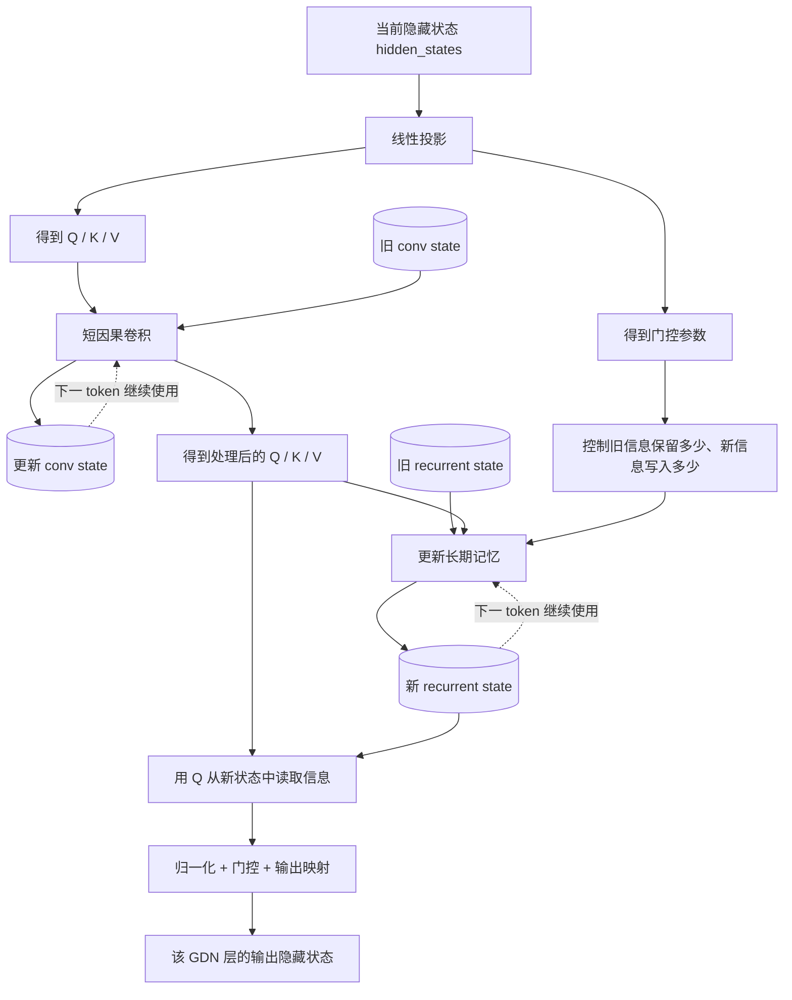

# Qwen3.5 GDN 层内部在做什么？

> **这份文档只解决一个问题：GDN 层接收到隐藏状态以后，到底在干什么？**
>
> 不需要记复杂公式，只要理解它的整体数据流即可。

---

## 1. 先记住一句话

普通 Attention 可以理解成：

> **当前 token 每次都去历史 token 的 KV 中重新找信息。**

而 GDN 的思路是：

> **把历史不断压缩进固定大小的状态里。每来一个新 token，就更新这份状态，再从状态中读出当前结果。**

所以两者最直观的区别是：

```text
Attention：当前 token → 回头查历史 KV → 得到输出

GDN：当前 token + 旧状态 → 更新状态 → 从新状态中读结果
```

---

# 2. 一张流程图看懂 GDN



如果只看这张图，可以把整个 GDN 分成 **4 步**：

1. 当前隐藏状态生成 Q、K、V 和门控参数；
2. 先通过短卷积更新 `conv state`；
3. 再利用 K、V 和门控更新 `recurrent state`；
4. 最后用 Q 从更新后的状态中读出结果。

---

# 3. 第一步：为什么 GDN 里面也有 Q、K、V？

GDN 虽然也会生成 Q、K、V，但它和普通 Attention 的使用方式不一样。

普通 Attention 主要是：

```text
Q 和历史所有 K 做匹配
        ↓
得到注意力权重
        ↓
再对历史 V 加权求和
```

GDN 不会构造这种“当前 token 对所有历史 token”的注意力计算。

可以简单把 GDN 中的 Q、K、V 理解成：

```text
K：帮助判断当前信息应该怎样修改记忆
V：表示当前 token 带来的内容
Q：最后从已经更新好的记忆中读取结果
```

不用记得特别严格，只要知道：

> **GDN 也有 Q/K/V，但它们主要服务于“状态更新和状态读取”，而不是 Full Attention 那样计算完整注意力矩阵。**

---

# 4. 第二步：conv state 在干什么？

Q、K、V 得到以后，会先经过一个很短的**因果卷积**。

它的作用是把最近几个 token 的局部信息融合进来。

例如当前是第 100 个 token，它可能只需要关注：

```text
token 97
   ↓
token 98
   ↓
token 99
   ↓
token 100
```

而不需要重新处理前面所有 token。

为了下一次 Decode 不重新计算最近几步的信息，GDN 会保存一份：

```text
conv state
```

所以可以把它理解成：

> **conv state = 给短卷积使用的“局部状态”，主要保存最近几个 token 的信息。**

它更像是一份**短期记忆**。

---

# 5. 第三步：recurrent state 在干什么？

这是 GDN 最核心的部分。

如果 Attention 的历史可以理解成：

```text
token1 的 KV
token2 的 KV
token3 的 KV
...
token10000 的 KV
```

那么 GDN 不会一直把这些历史逐 token 保存下来。

它会不断把历史压缩进一个固定大小的：

```text
recurrent state
```

可以把它理解成一块“长期记忆”。

每来一个新的 token，大致会做：

```text
旧 recurrent state
        +
当前 token 的 K / V
        +
门控参数
        ↓
决定旧信息保留多少
决定当前新信息写进去多少
        ↓
得到新的 recurrent state
```

因此 GDN 处理历史的关键不是：

> “重新看一遍以前所有 token。”

而是：

> **“拿出以前已经压缩好的状态，再根据当前 token 对它进行一次更新。”**

这也是为什么它叫一种 recurrent（递归/循环更新）状态：

```text
State 0
  ↓ token1
State 1
  ↓ token2
State 2
  ↓ token3
State 3
  ↓ ...
```

每一步的新状态都会继续传给下一步。

---

# 6. 第四步：Q 最后负责从状态里读结果

当 `recurrent state` 更新完成以后，当前 Q 会从新的状态中读取和当前 token 有关的信息。

可以直接理解成：

```text
当前 Q
   +
更新后的 recurrent state
   ↓
读取当前 token 需要的信息
   ↓
归一化 / 门控 / 输出映射
   ↓
GDN 层最终输出
```

然后这个输出会和普通 Transformer 层一样继续流向后面的网络。

与此同时，新得到的：

```text
conv state
recurrent state
```

会被保存下来，下一次 Decode 继续使用。

---

# 7. conv state 和 recurrent state 到底怎么区分？

只需要记住下面这个区别：

| 状态 | 主要作用 | 最简单理解 |
|---|---|---|
| `conv state` | 给短因果卷积保存最近几步信息 | **短期、局部记忆** |
| `recurrent state` | 把更长的历史不断压缩进固定大小状态 | **长期、压缩记忆** |

所以：

> **conv state 管“最近几个 token”，recurrent state 管“更长的历史”。**

需要注意，严格来说 `conv state` 是为了让短卷积连续计算而保存的历史边界状态；“短期记忆”只是为了方便理解。

---

# 8. Decode 一个 token 时到底发生什么？

如果现在来了一个新的 token，可以把 GDN 的一次处理压缩成下面这条链：

```text
当前 token 的隐藏状态
        ↓
生成 Q / K / V 和门控参数
        ↓
结合旧 conv state 做短卷积
        ↓
更新 conv state
        ↓
结合旧 recurrent state、K、V、门控
        ↓
更新 recurrent state
        ↓
Q 从新 recurrent state 中读取信息
        ↓
归一化 + 门控 + 输出映射
        ↓
得到当前 GDN 层输出
        ↓
保存两份新 state，下一 token 继续使用
```

所以 Decode 阶段可以进一步概括成：

```text
当前 token + 旧状态
        ↓
      GDN
        ↓
当前 token 的输出 + 新状态
```

---

# 9. GDN 和 Attention 最后怎么区分？

## Full Attention

```text
当前 Q
  ↓
和历史所有 K 做匹配
  ↓
从历史所有 V 中取信息
  ↓
得到输出
```

特点是历史 KV 会随着上下文长度增加。

## GDN

```text
当前 token
  ↓
读取旧状态
  ↓
更新状态
  ↓
从新状态读取结果
  ↓
得到输出
```

它主要保存固定大小的状态，而不是每次都重新访问越来越长的历史 KV。

---

# 10. 最后只记这四句话

如果后面忘了细节，只需要记住：

> **第一，GDN 不是在做普通的全量 Attention，而是在持续更新一份历史状态。**
>
> **第二，`conv state` 负责保存最近几步的局部信息。**
>
> **第三，`recurrent state` 负责把更长历史压缩到固定大小的状态中。**
>
> **第四，每来一个新 token，就是“读取旧状态 → 更新状态 → Q 从新状态读取输出”。**

用一条最简单的公式化思路表示就是：

```text
旧状态 + 当前 token
        ↓
更新状态
        ↓
从状态读取结果
        ↓
当前输出 + 新状态
```

这就是理解 Qwen3.5 GDN 层最核心的逻辑。


%% 项目关联导航：开始 %%
## 项目关联导航

- 所属模块：[[outputs/项目整理/模块-面试准备|模块-面试准备]]
- 关联阅读：[[outputs/项目整理/专题-03-Qwen模型适配与MTP|专题-03-Qwen模型适配与MTP]]

%% 项目关联导航：结束 %%
