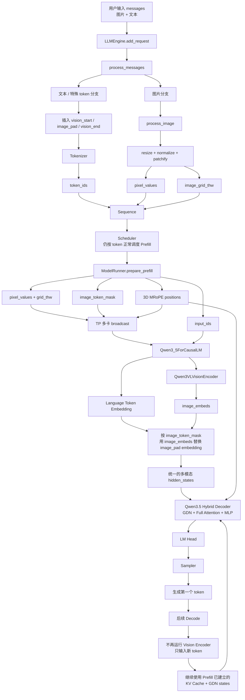

# nano-vLLM Qwen3.5 多模态适配：涉及文件与完整推理路径

> **这份文档只解决两个问题：**
>
> 1. 在已经支持 Qwen3.5 文本模型以后，为了进一步支持“图片 + 文本”的多模态输入，源码中主要涉及哪些文件？每个文件负责什么？
> 2. 一次图片 + 文本请求，从用户输入开始，到图片真正进入 Qwen3.5 Language Model，再到生成 token，完整路径是什么？
>
> 你已经理解 nano-vLLM 的 Scheduler、Prefill、Decode、KV Cache、GDN state 和 Qwen3.5 Hybrid 模型，因此这里**不重新介绍这些基础流程**，只看多模态相比纯文本新增的部分。

---

# 0. 先建立整体认识

纯文本 Qwen3.5 的输入基本是：

```text
文本
 ↓
Tokenizer
 ↓
Token IDs
 ↓
Embedding
 ↓
Qwen3.5 Hybrid Language Model
 ↓
Logits
 ↓
Token
```

加入图片以后，核心变化是多出一条**视觉分支**：

```text
                    ┌─ 文本 ─────────────→ Token IDs ─→ Text Embedding ─┐
用户的图片+文本 ────┤                                                ├─→ 融合后的隐藏状态
                    └─ 图片 ─→ 图像预处理 ─→ Vision Encoder ─→ Image Embedding ─┘
                                                                         ↓
                                                              Qwen3.5 Hybrid LM
                                                                         ↓
                                                                       Token
```

所以，多模态适配最核心的问题不是重新设计一个 Scheduler，而是解决四件事情：

1. **图片怎么变成模型能处理的数据；**
2. **图片在文本 token 序列里放在哪里；**
3. **Vision Encoder 怎么把图片变成和文字 embedding 同维度的向量；**
4. **这些视觉向量怎么注入 Qwen3.5 原来的语言模型。**

从当前仓库的 `nanovllm/` 主代码看，多模态核心涉及 **9 个文件**：

```text
nanovllm/
├── config.py                         # 读取 text_config / vision_config 和视觉特殊 token ID
│
├── engine/
│   ├── llm_engine.py                 # 接收图片+文本 messages，建立多模态 Sequence
│   ├── sequence.py                   # 暂存 pixel_values / image_grid_thw
│   └── model_runner.py               # Prefill 时准备图片、3D MRoPE、TP 广播并送入模型
│
├── utils/
│   ├── image_processing.py           # 【新增】图片预处理 + 多模态 messages 转 token
│   └── loader.py                     # 加载 Vision Encoder 权重
│
├── models/
│   ├── vision_encoder.py             # 【新增】真正把图片编码成 image embeddings
│   └── qwen3_5.py                    # 把 image embeddings 注入语言模型
│
└── layers/
    └── rotary_embedding.py           # 新增多维 MRoPE，表示图片的 T/H/W 位置信息
```

此外：

```text
examples/qwen3_5.py
```

提供了实际的“图片 + 文本”调用示例，但它属于测试/使用入口，不属于推理核心模块。

---

# 第一部分：逐文件理解多模态适配

# 1. `nanovllm/config.py`

## 1.1 这个文件解决什么问题？

纯文本 Qwen3 的配置基本只有一套 Language Model 配置。

但是 Qwen3.5 多模态 checkpoint 的外层配置可能同时包含：

```text
完整模型配置 full_config
├── text_config      → 语言模型配置
└── vision_config    → 视觉编码器配置
```

因此适配版不能再简单地：

```python
hf_config = AutoConfig.from_pretrained(model)
```

然后直接把整个配置全部当作语言模型配置。

当前代码先保存：

```python
self.full_config = AutoConfig.from_pretrained(self.model)
```

然后分别取出：

```text
full_config.text_config   → self.hf_config
full_config.vision_config → self.vision_config
```

所以后面的模型构建关系变成：

```text
Config
├── hf_config      → 创建 Qwen3.5 Language Model
└── vision_config  → 创建 Qwen3VLVisionEncoder
```

---

## 1.2 还增加了三个视觉特殊 token ID

配置中增加：

```text
image_token_id
vision_start_token_id
vision_end_token_id
```

它们大致对应：

```text
<|vision_start|>
<|image_pad|> × N
<|vision_end|>
```

这里最重要的是：

> **图片最终也必须在语言模型的 token 序列里占据一些位置。**

这些 `<|image_pad|>` 就是为视觉 embedding 预留的位置。

### 一句话总结

> `config.py` 的作用是把“一个纯语言模型配置”扩展成“文本配置 + 视觉配置”，同时告诉框架哪些 token 是图片占位 token。

---

# 2. `nanovllm/utils/image_processing.py` —— 新增的图片输入处理文件

这是理解多模态输入的第一个核心文件。

它主要有三个函数：

```text
smart_resize()
process_image()
process_messages()
```

---

## 2.1 `smart_resize()`：先把图片尺寸整理好

图片不能直接以任意 H×W 进入 Vision Encoder。

代码会按照：

```text
patch_size = 16
merge_size = 2
```

把图片高宽调整成合适的倍数，同时限制图片总像素数量。

可以简单理解为：

> **先把原始图片缩放到适合切 patch 的尺寸。**

---

## 2.2 `process_image()`：图片 → patch 数据

这一部分完成真正的图片预处理。

主流程是：

```text
PIL Image
   ↓
转 RGB
   ↓
resize
   ↓
转 Tensor
   ↓
Normalize
   ↓
按照 patch_size 切成 Patch
   ↓
pixel_values
+
image_grid_thw
```

最终返回两份数据。

### `pixel_values`

形状大致是：

```text
[total_patches, patch_dim]
```

它保存真正的图片 patch 像素数据，之后送入 Vision Encoder。

### `image_grid_thw`

形状是：

```text
[num_images, 3]
```

每张图片记录：

```text
[T, H, W]
```

这里的 H/W 已经不是原始像素高宽，而是**切成 patch 以后形成的网格大小**。

它后面有两个重要用途：

```text
1. Vision Encoder 根据它构造视觉位置编码
2. ModelRunner 根据它构造 Language Model 使用的 3D MRoPE position
```

---

## 2.3 `process_messages()`：把图片和文本整理成一个请求

用户实际输入类似：

```python
messages = [{
    "role": "user",
    "content": [
        {"type": "image", "image": image},
        {"type": "text", "text": "描述一下这张图片"},
    ]
}]
```

`process_messages()` 会同时处理两条数据流。

### 图片分支

```text
image
 ↓
process_image()
 ↓
pixel_values + image_grid_thw
```

### 文本序列分支

图片的位置不会直接消失，而会被写成：

```text
<|vision_start|>
<|image_pad|><|image_pad|>...<|image_pad|>
<|vision_end|>
```

其中 `<|image_pad|>` 的数量不是随便填的。

代码计算：

```text
图片最终占用的视觉 token 数
=
T × (H / merge_size) × (W / merge_size)
```

原因是后面的 `VisionPatchMerger` 会把相邻 `merge_size × merge_size` 个 patch 合成一个视觉 token。

因此这里提前放多少个 `<|image_pad|>`，后面 Vision Encoder 就应该输出多少个 `image_embeds`。

最终得到：

```text
token_ids
pixel_values
image_grid_thw
```

### 一句话总结

> `image_processing.py` 的作用就是把“人类输入的图片+文本”拆成两条同步的数据：一条是带图片占位符的 token 序列，另一条是真正的图片 patch 数据。

---

# 3. `nanovllm/engine/llm_engine.py`

原版 `add_request()` 主要接收：

```text
str
或
list[int]
```

多模态以后增加：

```text
list[dict]
```

也就是 messages 格式。

当检测到：

```python
isinstance(prompt[0], dict)
```

就走：

```python
process_messages(...)
```

得到：

```text
token_ids
pixel_values
image_grid_thw
```

随后仍然建立普通的：

```python
seq = Sequence(token_ids, sampling_params)
```

只是额外挂上：

```python
seq.pixel_values = pixel_values
seq.image_grid_thw = image_grid_thw
```

所以这里体现了一个非常重要的设计思想：

```text
Scheduler 看见的主体仍然是 Sequence + Token

图片数据只是额外挂在 Sequence 上
等真正执行 Prefill 时再交给 ModelRunner
```

也就是说：

> **多模态并没有重新定义一套请求对象和调度框架，而是在原来的 Sequence 上增加图片附加数据。**

### 一句话总结

> `llm_engine.py` 是多模态请求入口：识别 messages，调用图片预处理，然后把 token 和图片数据一起挂到 Sequence 上。

---

# 4. `nanovllm/engine/sequence.py`

Sequence 新增：

```python
self.pixel_values = None
self.image_grid_thw = None
```

纯文本 Sequence：

```text
Sequence
├── token_ids
├── block_table
├── state_slot_id
└── ...
```

多模态 Sequence：

```text
Sequence
├── token_ids
├── block_table
├── state_slot_id
├── pixel_values      ← 图片真正的 patch 数据
└── image_grid_thw    ← 图片 patch 网格形状
```

但是这两份图片数据只在**第一次 Prefill**有用。

因为图片经过 Vision Encoder 并注入 Language Model 后，图片信息已经进入：

```text
Full Attention → KV Cache
GDN            → recurrent state / conv state
```

后续 Decode 不需要再重新执行 Vision Encoder。

因此代码在第一次使用后会把：

```text
seq.pixel_values
seq.image_grid_thw
```

清空。

---

## 一个很关键的多卡细节

`Sequence.__getstate__()` 并没有把 `pixel_values` 和 `image_grid_thw` 序列化给其它 TP worker。

其它 rank 重建 Sequence 时这两个字段会重新变成：

```python
None
```

所以后面 `ModelRunner` 必须单独通过 NCCL：

```text
rank 0
  ↓ broadcast
rank 1 / rank 2 / rank 3
```

传图片张量。

这一点后面会继续看到。

### 一句话总结

> `sequence.py` 只是临时替请求保存图片数据；它并不负责处理图片，图片在第一次 Prefill 后就可以释放。

---

# 5. `nanovllm/engine/model_runner.py` —— 多模态框架层最核心的文件

如果说：

```text
image_processing.py 负责“把图片准备好”
vision_encoder.py    负责“把图片算成 embedding”
```

那么：

> **`model_runner.py` 就负责把这两边真正接起来。**

它主要新增了 5 类多模态工作。

---

## 5.1 创建模型时把 `vision_config` 传进去

模型创建从：

```text
只创建 Language Model
```

变成：

```python
Qwen3_5ForCausalLM(
    hf_config,
    vision_config=config.vision_config
)
```

因此每个 TP rank 上的 Qwen3.5 模型现在都包含：

```text
Language Model
+
Vision Encoder
```

当前 `vision_encoder.py` 使用普通 `nn.Linear / nn.Conv3d`，没有做 tensor parallel 切分。

因此可以理解成：

> **视觉编码器在每张 GPU 上完整复制一份；语言模型部分再按照原来的 TP=4 方式并行。**

这也是为什么后面图片像素必须广播到每张卡：每张卡都要本地跑一次相同的 Vision Encoder。

---

## 5.2 `_compute_mrope_positions()`：为图片 token 构造三维位置

纯文本位置通常只有：

```text
0, 1, 2, 3, 4, ...
```

但是图片 token 来自二维网格，单纯的一维编号不能直接表达“这个 patch 在图片第几行、第几列”。

因此多模态 Prefill 会构造：

```text
positions.shape = [3, N]
```

三个维度分别可以理解成：

```text
T：时间/帧位置
H：图片高度方向位置
W：图片宽度方向位置
```

对于文字 token：

```text
T = H = W = 普通文本 position
```

对于图片 token：

```text
T/H/W 分别记录它在视觉网格中的位置
```

这些位置随后交给 `InterleavedMRoPE`。

---

## 5.3 `prepare_prefill()`：把文本和图片组织成同一个 batch

这是多模态 Prefill 最关键的一段。

它首先判断：

```python
has_images = any(seq.pixel_values is not None for seq in seqs)
```

如果本轮包含图片，就额外准备：

```text
pixel_values
image_grid_thw
image_token_mask
3D positions
```

其中最重要的是：

### `image_token_mask`

代码判断：

```python
[t == self.image_token_id for t in seq_token_ids]
```

因此会得到类似：

```text
Token:  [文本][vision_start][image_pad][image_pad][image_pad][vision_end][文本]
Mask:   False   False        True       True       True       False      False
```

这个 mask 后面告诉 `Qwen3_5Model`：

> **哪些 token 的普通词向量应该被视觉 embedding 替换。**

---

## 5.4 `_broadcast_image_data()`：TP 多卡同步图片数据

rank 0 的 Sequence 上有：

```text
pixel_values
image_grid_thw
image_token_mask
3D positions
```

其它 rank 通过 Sequence 的共享内存序列化拿不到这些大图片 Tensor。

所以这里单独用：

```python
dist.broadcast(..., src=0)
```

依次广播：

```text
positions（如果是 3D）
pixel_values
image_grid_thw
image_token_mask
```

因此 TP=4 时可以理解成：

```text
GPU0：保存原始请求的图片数据
            │
            ├──broadcast──→ GPU1
            ├──broadcast──→ GPU2
            └──broadcast──→ GPU3

四张卡得到相同图片输入
       ↓
四张卡各自运行完整 Vision Encoder
       ↓
得到相同 image embeddings
       ↓
再进入 TP 切分的 Language Model
```

当前实现这样做比较简单，但代价是 Vision Encoder 的计算会在四张卡上重复。

---

## 5.5 图片只在 Prefill 处理一次

`run()` 中非常清楚：

### Prefill

```text
prepare_prefill()
 ↓
pixel_values / grid / mask / 3D positions
 ↓
run_model(...图片数据...)
```

### Decode

```text
prepare_decode()
 ↓
pixel_values = None
image_grid_thw = None
image_token_mask = None
 ↓
run_model()
```

也就是说：

> **Vision Encoder 只在第一次处理 prompt 时运行。每生成一个新 token 时，不会重新看图片。**

为什么可以这样？

因为图片信息在 Prefill 后已经写进了语言模型的历史状态：

```text
Full Attention 层 → KV Cache
GDN 层            → conv state + recurrent state
```

后续 Decode 直接使用这些历史状态即可。

### 一句话总结

> `model_runner.py` 是多模态适配的框架核心：负责第一次 Prefill 时收集图片、构造 3D MRoPE、生成 image mask、跨 TP rank 广播图片数据，并把它们送进 Qwen3.5 模型。

---

# 6. `nanovllm/models/vision_encoder.py` —— 新增的视觉模型

这是多模态模型结构的核心文件。

它的目标非常明确：

```text
图片像素 Patch
      ↓
Vision Encoder
      ↓
Image Embeddings
```

而最终输出的 embedding 维度必须和 Language Model 的 hidden size 对得上，这样才能替换 `<|image_pad|>` 的 embedding。

整个视觉编码器可以分成四步。

---

## 6.1 `VisionPatchEmbed`

输入是前面 `process_image()` 已经切好的 patch 数据。

这里使用：

```python
nn.Conv3d(...)
```

把每一个像素 patch 投影成视觉 hidden state。

可以理解成：

```text
一小块图片像素
   ↓
线性/卷积投影
   ↓
一个视觉向量
```

---

## 6.2 视觉位置编码

视觉 token 还必须知道自己位于图片哪里。

这里包含两类位置信息：

```text
pos_embed
+
Vision Rotary Embedding
```

`fast_pos_embed_interpolate()` 会根据图片实际 H/W，对学习到的位置 embedding 做插值。

`rot_pos_emb()` 则根据图片二维坐标产生视觉 Attention 使用的位置旋转信息。

---

## 6.3 `VisionBlock`

每个 VisionBlock 大致还是：

```text
LayerNorm
   ↓
Vision Attention
   ↓
Residual
   ↓
LayerNorm
   ↓
MLP
   ↓
Residual
```

其中 Vision Attention 使用：

```python
flash_attn_varlen_func(..., causal=False)
```

这里 `causal=False` 很重要。

语言模型需要因果 Attention，是因为当前 token 不能看到未来 token。

但是一张图片的 patch 本来就全部已知，所以视觉编码时不存在“未来 patch 不能看”的限制。

因此：

> **Vision Attention 是非因果的，图片中的 patch 可以互相看。**

---

## 6.4 `VisionPatchMerger`

Vision Encoder 不会把每一个原始 patch 都直接塞进 Language Model。

`VisionPatchMerger` 会把：

```text
merge_size × merge_size
```

个相邻视觉 patch 合并成一个视觉 token。

例如：

```text
merge_size = 2

4 个 Patch
┌───┬───┐
│ A │ B │
├───┼───┤
│ C │ D │
└───┴───┘
     ↓
合并成 1 个 image embedding
```

所以前面 `process_messages()` 才会把图片占位 token 数量算成：

```text
T × (H / 2) × (W / 2)
```

两边数量必须严格对应：

```text
image_pad 数量
       =
Vision Encoder 最终输出 image embeddings 数量
```

最终 Vision Encoder 返回：

```text
[视觉 token 数, Language Model hidden_size]
```

### 一句话总结

> `vision_encoder.py` 就是一台“图片翻译器”：把像素 patch 经过视觉 Transformer 编码和 patch merge，转换成能够直接塞进语言模型的 image embeddings。

---

# 7. `nanovllm/models/qwen3_5.py` —— 图片和语言真正融合的位置

这是最需要抓住的文件，因为：

> **图片和文本真正汇合，就是在这里。**

---

## 7.1 `Qwen3_5ForCausalLM` 增加 Vision Encoder

初始化时：

```python
self.visual = None
if vision_config is not None:
    self.visual = Qwen3VLVisionEncoder(vision_config)
```

因此模型结构可以理解成：

```text
Qwen3_5ForCausalLM
├── visual       → Vision Encoder
├── model        → Qwen3.5 Hybrid Language Model
└── lm_head      → 输出词表 logits
```

---

## 7.2 forward 先跑 Vision Encoder

如果输入带图片：

```python
image_embeds = self.visual(pixel_values, image_grid_thw)
```

因此：

```text
pixel_values
    ↓
self.visual
    ↓
image_embeds
```

---

## 7.3 `Qwen3_5Model` 中完成真正的视觉注入

Language Model 仍然会先执行：

```python
hidden_states = self.embed_tokens(input_ids)
```

因此一开始所有 token，包括 `<|image_pad|>`，都有普通 token embedding。

随后最关键的两行：

```python
if image_embeds is not None and image_token_mask is not None:
    hidden_states[image_token_mask] = image_embeds
```

它做的事情非常直观：

```text
原来的输入 embedding：

[文本A] [vision_start] [image_pad] [image_pad] [image_pad] [vision_end] [文本B]
   │          │             │           │           │          │        │
 text emb   token emb     占位emb      占位emb      占位emb   token emb text emb

                            ↓ 用 image_token_mask 替换

融合后的隐藏状态：

[文本A] [vision_start] [视觉向量1] [视觉向量2] [视觉向量3] [vision_end] [文本B]
```

从这一刻开始：

> **语言模型已经不再区分“这个向量原来来自文本还是图片”。它们都变成同一种 hidden state，一起进入 Qwen3.5 Decoder。**

随后照常进入：

```text
GDN Layer
Full Attention Layer
GDN Layer
...
```

所以多模态没有再设计一套“视觉专用 Decoder”。

真正的设计是：

> **先把图片编码成和文本相同维度的向量，再替换图片占位 token 的 embedding，最后复用原来的 Qwen3.5 Hybrid Language Model。**

---

# 8. `nanovllm/layers/rotary_embedding.py`

图片 embedding 虽然已经包含视觉信息，但 Language Model 的 Full Attention 还需要知道图片 token 的空间位置。

因此这里新增：

```python
InterleavedMRoPE
```

它同时支持：

```text
文本：1D position
图片：3D T/H/W position
```

---

## 8.1 纯文本时

positions 是：

```text
[N]
```

例如：

```text
0 1 2 3 4 5 ...
```

此时行为类似普通 RoPE。

---

## 8.2 多模态 Prefill 时

positions 变成：

```text
[3, N]
```

分别携带：

```text
Temporal
Height
Width
```

`InterleavedMRoPE` 把这三类频率按照 `mrope_section` 交错组合，再作用到 Q/K 上。

因此可以把 MRoPE 理解成：

> **让 Language Model 的 Attention 不只知道“这个视觉 token 在序列第几个”，还保留一定的图片空间位置信息。**

注意：这里的 MRoPE 主要作用在 Qwen3.5 的 **Full Attention 层**；GDN 路径本身接收的是已经融合后的 hidden states。

### 一句话总结

> `rotary_embedding.py` 解决的是“视觉 token 在 Language Model 中应该如何表达空间位置”的问题。

---

# 9. `nanovllm/utils/loader.py`

模型结构写出来以后，还必须能够把 checkpoint 里的 Vision Encoder 权重正确加载进来。

Qwen3.5/VL checkpoint 的视觉权重名字类似：

```text
model.visual.xxx
```

而当前 nano-vLLM 模型对象里是：

```text
visual.xxx
```

所以 `loader.py` 新增：

```text
visual_prefix = "model.visual."
```

并做权重名字映射：

```text
checkpoint:
model.visual.blocks.0.xxx

       ↓ 映射

nano-vLLM:
visual.blocks.0.xxx
```

这样 `Qwen3VLVisionEncoder` 才能真正拿到 checkpoint 中训练好的视觉权重。

### 一句话总结

> `loader.py` 不参与推理计算，它负责把 checkpoint 中 `model.visual.*` 的视觉权重正确装进新增的 Vision Encoder。

---

# 10. 哪些原来的核心调度文件没有专门理解“图片”？

这是理解这套实现很重要的一点。

例如：

```text
Scheduler
BlockManager
GDN StateSlotManager
```

并没有增加一套复杂的“图片调度算法”。

为什么？

因为在进入 Scheduler 前，图片已经变成了：

```text
一串 image placeholder token
+
挂在 Sequence 上的辅助图片 Tensor
```

因此 Scheduler 仍然看到：

```text
这个请求一共有多少 token
本轮 Prefill 调多少 token
需要多少 KV Block
需要哪个 GDN state slot
```

也就是说：

> **多模态的核心变化主要发生在“请求进入模型前”和“Embedding 融合前”，而不是调度算法本身。**

这也是这个实现能够较小改动复用 nano-vLLM 原框架的重要原因。

---

# 第二部分：一次“图片 + 文本”请求的完整路径

下面把前面的文件真正串起来。

# 11. 一张主流程图看懂整个多模态链路



---

# 12. 第一步：用户输入图片 + 文本

例如：

```python
messages = [{
    "role": "user",
    "content": [
        {"type": "image", "image": image},
        {"type": "text", "text": "描述一下这张图片"},
    ]
}]
```

进入：

```text
LLM.generate()
 ↓
LLMEngine.add_request()
```

`LLMEngine` 发现输入是 `list[dict]`，知道这不是普通文本 prompt，于是调用：

```text
process_messages()
```

---

# 13. 第二步：图片和文本在这里第一次分叉

`process_messages()` 同时形成：

```text
A. token_ids
B. pixel_values
C. image_grid_thw
```

例如原始语义：

```text
[图片] 请描述这张图片
```

Token 序列实际会类似：

```text
<|im_start|> user
<|vision_start|>
<|image_pad|> × N
<|vision_end|>
请描述这张图片
<|im_end|>
<|im_start|> assistant
```

注意：

> **此时图片内容本身还没有进入 token_ids。token_ids 里面只有“这里将来要放 N 个视觉向量”的占位符。**

真正的图片仍然保存在：

```text
pixel_values
```

中。

---

# 14. 第三步：Sequence 进入 Scheduler

建立：

```text
Sequence
├── token_ids
├── pixel_values
├── image_grid_thw
├── block_table
└── state_slot_id
```

然后像普通请求一样进入：

```text
WAITING
 ↓
Scheduler.schedule()
 ↓
Prefill
```

这里 Scheduler 并不需要理解：

```text
这是一只猫
这是一张汽车图片
这里有多少 patch
```

它只负责按 token 和显存资源调度。

---

# 15. 第四步：ModelRunner 为多模态 Prefill 准备数据

`prepare_prefill()` 同时组织语言模型原本需要的：

```text
input_ids
slot_mapping
cu_seqlens
state_indices
...
```

和新增的多模态信息：

```text
pixel_values
image_grid_thw
image_token_mask
3D positions
```

最终可以把一次多模态 Prefill 的输入理解成：

```text
                     ┌─ input_ids
                     ├─ image_token_mask
ModelRunner ─────────┼─ positions [3,N]
                     ├─ pixel_values
                     └─ image_grid_thw
```

如果 TP>1，则 rank 0 再把图片相关 tensor 广播给其它 rank。

---

# 16. 第五步：Vision Encoder 真正开始“看图”

进入：

```text
Qwen3_5ForCausalLM.forward()
```

如果：

```text
pixel_values != None
```

则执行：

```python
image_embeds = self.visual(pixel_values, image_grid_thw)
```

内部完整路径：

```text
pixel_values
   ↓
VisionPatchEmbed
   ↓
视觉 Patch Embeddings
   ↓
视觉位置编码
   ↓
VisionBlock × N
   │
   ├─ Vision Attention
   └─ Vision MLP
   ↓
VisionPatchMerger
   ↓
image_embeds
```

到这里，图片已经从“像素”变成了一串高维视觉语义向量。

---

# 17. 第六步：图片和文本真正融合

与此同时，语言模型执行：

```python
hidden_states = self.embed_tokens(input_ids)
```

得到普通文本 token embedding。

然后：

```python
hidden_states[image_token_mask] = image_embeds
```

所以真正的融合点只有一句话：

> **找到 `<|image_pad|>` 对应的位置，把这些位置原来的 token embedding 换成 Vision Encoder 输出的 image embeddings。**

融合完成以后：

```text
文字 token → text embedding
图片 token → image embedding
```

但是它们的维度已经统一，因此后面的 Decoder 只看到：

```text
hidden_states
```

不会再分两套路径。

---

# 18. 第七步：统一进入 Qwen3.5 Hybrid Language Model

融合后的序列继续走你已经熟悉的：

```text
Qwen3_5DecoderLayer 0
 ↓
GDN / Full Attention
 ↓
MLP
 ↓
Qwen3_5DecoderLayer 1
 ↓
...
```

这里图片信息有两种方式继续参与历史建模：

### Full Attention 层

```text
图片 hidden states
 ↓
Q / K / V
 ↓
3D MRoPE 提供视觉空间位置
 ↓
Attention
 ↓
KV Cache
```

### GDN 层

```text
图片 hidden states
 ↓
GDN
 ↓
更新 conv state + recurrent state
```

因此在 Prefill 结束以后，图片的影响已经被吸收到：

```text
Full Attention → KV Cache
GDN            → recurrent / conv state
```

中。

---

# 19. 第八步：为什么 Decode 不需要重新运行 Vision Encoder？

Prefill 结束以后生成第一个 token。

下一轮 Decode：

```text
只输入刚刚生成的新 token
```

此时：

```text
pixel_values = None
image_grid_thw = None
image_token_mask = None
```

所以不会再次运行 Vision Encoder。

但是模型并没有“忘记图片”，因为图片在 Prefill 时已经影响过：

```text
KV Cache
+
GDN recurrent state
+
GDN conv state
```

因此 Decode 可以理解成：

```text
新 token
   +
之前由“文字 + 图片”共同建立的历史状态
   ↓
继续生成下一个 token
```

这和普通语言模型“Prompt 只 Prefill 一次”是同一个逻辑。

---

# 20. 一次请求按文件顺序到底经过哪里？

如果你以后重新看源码，只需要按下面顺序读：

```text
① engine/llm_engine.py
   add_request()
        ↓

② utils/image_processing.py
   process_messages()
   process_image()
        ↓

③ engine/sequence.py
   保存 pixel_values / image_grid_thw
        ↓

④ Scheduler
   正常按 token 调度
        ↓

⑤ engine/model_runner.py
   prepare_prefill()
   _compute_mrope_positions()
   _broadcast_image_data()
        ↓

⑥ models/qwen3_5.py
   Qwen3_5ForCausalLM.forward()
        ↓

⑦ models/vision_encoder.py
   pixel → patch → VisionBlock → merger
        ↓
   image_embeds
        ↓

⑧ models/qwen3_5.py
   hidden_states[image_token_mask] = image_embeds
        ↓

⑨ layers/rotary_embedding.py
   Full Attention 使用 3D InterleavedMRoPE
        ↓

⑩ Qwen3.5 Hybrid Decoder
   GDN + Full Attention
        ↓

⑪ LM Head / Sampler
        ↓
   输出 token
```

---

# 21. 最后只需要记住的 5 个核心点

如果面试前忘了细节，只记下面五句话即可。

### ① 图片不会直接作为 token 送进语言模型

图片先被切成 patch，然后通过 Vision Encoder 得到：

```text
image embeddings
```

---

### ② Token 序列里提前放了图片占位符

```text
<|vision_start|>
<|image_pad|> × N
<|vision_end|>
```

其中 `<|image_pad|>` 的数量和 Vision Encoder 最终输出的视觉 token 数一致。

---

### ③ 图片和文字真正的融合方式非常直接

```python
hidden_states[image_token_mask] = image_embeds
```

也就是：

> **把 image_pad 的词向量替换成真正的视觉向量。**

---

### ④ 融合以后完全复用 Qwen3.5 Language Model

```text
文本 embedding
+
图片 embedding
       ↓
同一个 hidden_states 序列
       ↓
GDN + Full Attention Hybrid Decoder
```

Scheduler 不需要重新设计一套“图片调度器”。

---

### ⑤ Vision Encoder 只在 Prefill 跑一次

```text
Prefill：图片 → Vision Encoder → 写入语言模型历史状态

Decode：只输入新 token → 复用 KV Cache + GDN state
```

所以每生成一个 token 并不会重新编码图片。

---

# 22. 最简洁的一条总流程

最后把整个多模态适配压缩成一条链：

```text
图片 + 文本 messages
        ↓
process_messages
        ↓
文本变 token_ids
图片变 pixel_values
        ↓
用 image_pad 在 token 序列中预留视觉位置
        ↓
Sequence → Scheduler → Prefill
        ↓
ModelRunner 构造 image mask + 3D MRoPE
并把图片广播到所有 TP rank
        ↓
Vision Encoder
pixel_values → image embeddings
        ↓
用 image embeddings 替换 image_pad embedding
        ↓
得到统一的“文本 + 图片”hidden_states
        ↓
Qwen3.5 Hybrid Decoder
GDN + Full Attention
        ↓
LM Head / Sampler
        ↓
生成 token
        ↓
后续 Decode 不再处理图片
直接复用已经建立好的 KV Cache + GDN states
```

> **所以你可以把这个项目的多模态适配理解成：在原来 Qwen3.5 文本推理链路前面增加一套 Vision Encoder，再通过 image placeholder 把视觉特征插入文本 embedding 序列；一旦完成融合，后面的 Scheduler、Hybrid Decoder、KV Cache 和 GDN state 主体流程都继续复用原来的逻辑。**

---

# 23. 当前源码实现边界：理解时不要说过头

当前仓库 README 对多模态能力的定位是 Qwen3.5-9B 的 **multimodal smoke test**，并不是完整生产级多模态 serving。

从源码还可以看到几个特点：

1. 当前 `process_messages()` 实际实现的主要是**静态图片 + 文本**，虽然数据结构里保留了 T 维，但没有完整的视频输入链路；
2. Vision Encoder 当前没有按 TP 切分，而是在各 rank 上完整复制并重复计算；
3. 图片数据在第一次 Prefill 后就被清空，因此实现思路明确假设视觉编码只需要执行一次；
4. 当前多模态路径是学习/验证型实现，理解架构时重点看“图片预处理 → Vision Encoder → embedding 替换 → Hybrid LM”这条主链，不要把它描述成已经具备 vLLM 正式版那种完整的生产级多模态调度能力。


%% 项目关联导航：开始 %%
## 项目关联导航

- 所属模块：[[outputs/项目整理/模块-面试准备|模块-面试准备]]
- 关联阅读：[[outputs/项目整理/专题-03-Qwen模型适配与MTP|专题-03-Qwen模型适配与MTP]]

%% 项目关联导航：结束 %%
