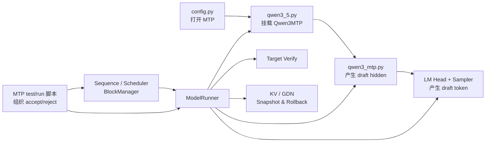
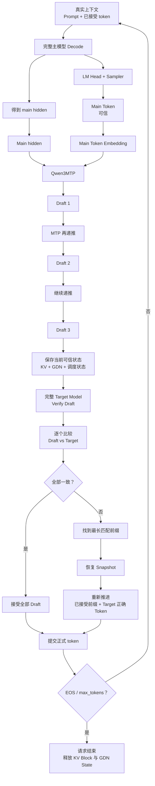

# nano-vLLM Qwen3.5/Qwen3.6：MTP 投机解码原型学习文档

> **学习前提**：已经理解原版 nano-vLLM 的调度、Prefill/Decode、KV Cache、ModelRunner，以及 Qwen3.5 Hybrid 中 Full Attention + GDN 的模型结构和状态管理。  
>
> **本文只回答两个问题：**
>
> 1. 仓库里哪些文件是为了 MTP / speculative decoding 新增或改造的？每个文件具体负责什么？
> 2. 一个请求进入 MTP 路径以后，从主模型生成 token、MTP 产生 draft、主模型 verify、accept/reject、状态回滚，到请求结束，完整流程是什么？

---

# 0. 先建立一个最重要的整体认识

在这个仓库里，**MTP 不是替换 Qwen3.5 主模型**，而是在已经适配好的 Qwen3.5/Qwen3.6 主模型旁边，再挂一个更轻的“未来 token 预测分支”。

普通 Decode 是：

```text
当前 token
   ↓
完整主模型 forward
   ↓
生成 1 个 token
   ↓
下一轮再跑完整主模型
```

加入 MTP 后，思路变成：

```text
完整主模型
   ↓
先生成一个可信的 main token
   ↓
MTP 根据 main token + 主模型 hidden state
继续猜后面的 draft token
   ↓
主模型再验证这些 draft
   ↓
猜对：接受
猜错：回滚，并使用主模型的正确结果
```

所以整个 MTP 原型可以拆成四块：

```text
MTP           → 负责“猜”
Target Model  → 负责“验”
Rollback      → 负责“猜错以后恢复”
控制逻辑       → 负责“接受多少、提交哪些 token”
```

这里还有一个很重要的工程边界：

> **`qwen3_mtp.py` 本身不是完整投机解码。**

它只定义“辅助预测网络长什么样”。  
完整 speculative decoding 是由：

```text
qwen3_mtp.py
+ qwen3_5.py
+ model_runner.py
+ sampler / TP 输出链
+ Sequence / Scheduler / BlockManager 状态
+ 根目录 MTP 测试与运行脚本
```

共同构成的。

另外，从仓库演进角度看，这部分更准确地说是 **在 Qwen3.5 兼容主干基础上继续加入的 Qwen3.6 MTP/speculative decoding prototype**，不要把它误认为最初“为了让 Qwen3.5 的 GDN 跑起来”所必需的改动。

---

# 第一部分：MTP 相关文件分别做了什么

---

## 1. `nanovllm/config.py`

### 这个文件为什么需要改？

原来的配置只需要告诉框架：

```text
跑什么模型
TP 几卡
最大长度多少
显存利用率多少
……
```

加入 MTP 后，需要增加一个开关：

```text
enable_mtp
```

作用就是告诉后面的模型创建过程：

```text
这次只创建普通 Qwen3.5/Qwen3.6 主模型

还是：

主模型 + MTP 辅助预测模块
```

大致配置链：

```text
LLM(... enable_mtp=True)
        ↓
Config.enable_mtp = True
        ↓
hf_config.enable_mtp = True
        ↓
Qwen3_5ForCausalLM
        ↓
创建 self.mtp
```

### 一句话记忆

> `config.py` 负责把 **“要不要启用 MTP”** 这个开关一路传到模型创建阶段。

---

# 2. `nanovllm/models/qwen3_5.py`

这是 MTP 和原来 Qwen3.5 主模型真正连接起来的位置。

原来的主体可以理解成：

```text
Qwen3_5ForCausalLM
├── Qwen3_5Model
└── LM Head
```

加入 MTP 后变成：

```text
Qwen3_5ForCausalLM
├── Qwen3_5Model          ← 完整主模型
├── LM Head               ← 主模型和 MTP 共用
└── Qwen3MTP              ← 新增辅助预测分支
```

也就是说：

```text
self.model
    负责真正的 Qwen3.5/Qwen3.6 Hybrid forward

self.lm_head
    把 hidden state 映射成词表 logits

self.mtp
    根据主模型 hidden + 当前 token
    继续预测后面的 draft token
```

其中一个很重要的设计是：

```text
主模型 hidden
       ↓
共享 LM Head
       ↓
main logits

MTP hidden
       ↓
同一个 LM Head
       ↓
draft logits
```

因此 MTP 并没有再单独复制一个完整词表输出层。

### 一句话记忆

> `qwen3_5.py` 负责把 **MTP 挂到原来的主模型外壳上**，让主模型和 MTP 可以共用 LM Head。

---

# 3. `nanovllm/models/qwen3_mtp.py`

这是 MTP 最核心的新文件。

它主要定义两个类：

```text
Qwen3MTP
Qwen3MTPDecoderLayer
```

---

## 3.1 `Qwen3MTP` 到底输入什么？

MTP 不是重新读取完整 prompt。

它主要拿两个东西：

```text
① 当前 token 的 embedding
② 主模型当前得到的 hidden state
```

可以理解为：

```text
token embedding：
“刚刚这个 token 本身是什么”

主模型 hidden：
“主模型结合整段上下文以后，现在理解到了什么”
```

然后 MTP 把这两个信息融合起来，去猜未来 token。

---

## 3.2 `Qwen3MTP` 内部结构

核心结构可以记成：

```text
当前 token embedding ──→ Norm ──┐
                                ├─→ 拼接 → FC(2H→H)
主模型 hidden state ───→ Norm ──┘
                                      ↓
                            MTP Decoder Layer
                                      ↓
                                  Final Norm
                                      ↓
                                  MTP hidden
                                      ↓
                                  共享 LM Head
                                      ↓
                                  draft logits
                                      ↓
                                  draft token
```

其中：

### 两个 Norm

分别处理：

```text
token embedding
主模型 hidden state
```

因为这两个张量来源不同，先做归一化以后再融合更加稳定。

### `ReplicatedLinear(2H → H)`

两路 hidden 都是 H 维：

```text
embedding: H
hidden:    H
```

拼接后：

```text
2H
```

再通过 FC 压回：

```text
H
```

相当于把：

```text
“当前 token 信息”
+
“主模型上下文信息”
```

融合成 MTP 自己后续要使用的表示。

---

## 3.3 `Qwen3MTPDecoderLayer`

它内部复用了原来 Qwen3.5 已经有的组件：

```text
Qwen3_5Attention
Qwen3_5MLP
GemmaRMSNorm
```

可以简单理解为：

```text
Norm
 ↓
Full Attention
 ↓
Norm
 ↓
MLP
```

注意：

> MTP 这里使用的是 **Full Attention decoder layer**，不是把主模型的整套 GDN + Full Attention Hybrid 结构重新复制一遍。

所以 MTP 是一个更轻的辅助分支，而不是第二个完整 Qwen3.5 主模型。

---

## 3.4 一个容易误解的点：MTP 并不是一次同时吐出多个 token

仓库中的实现更像：

```text
主模型 hidden + main token
        ↓
MTP forward
        ↓
draft 1

MTP hidden 1 + draft 1
        ↓
MTP forward
        ↓
draft 2

MTP hidden 2 + draft 2
        ↓
MTP forward
        ↓
draft 3
```

所以：

> **多个 draft token 是通过多次轻量 MTP forward 递推得到的，而不是一次 MTP forward 同时输出 3、4 个 token。**

### 一句话记忆

> `qwen3_mtp.py` 就是 **draft token 预测网络本身**：输入“当前 token embedding + 上一步 hidden”，输出新的 MTP hidden，再经过共享 LM Head 产生 draft token。

---

# 4. `nanovllm/utils/loader.py`

MTP 增加以后，checkpoint 中会多出一批：

```text
mtp.*
```

权重。

因此 Loader 除了加载：

```text
主模型参数
LM Head
```

还必须能找到并加载：

```text
mtp.pre_fc_norm_embedding.*
mtp.pre_fc_norm_hidden.*
mtp.fc.*
mtp.layers.*
mtp.norm.*
```

ModelRunner 初始化后还会检查：

```text
MTP 权重到底有没有真正加载进来
有没有 mtp.* 参数被跳过
```

否则可能出现：

```text
enable_mtp=True

但 MTP 使用的其实是没有正确加载的参数
```

这种错误会让后面的 draft 完全没有意义。

### 一句话记忆

> `loader.py` 负责让 **MTP 的真实 checkpoint 权重正确进入 `self.mtp`**。

---

# 5. `nanovllm/engine/model_runner.py`

如果只看一个文件来理解“投机解码在工程上怎么运行”，最重要的是这个文件。

因为：

```text
qwen3_mtp.py 只告诉你 MTP 怎么算
model_runner.py 才告诉你 MTP 什么时候算、怎么算 draft、怎么算 verify、怎么保存和恢复 GPU 状态
```

MTP 相关接口概念上包括：

```text
run_mtp_probe
run_mtp_draft_step
run_mtp_draft_fast_step

run_verify_batch_probe
run_verify_chunk_probe
run_verify_batch_fast
……

save_decode_state
save_decode_state_range
restore_decode_state
drop_decode_state

reset_gdn_state_slots
capture_verify_cudagraph
……
```

不需要逐个死记函数名，只要把它们分成三类。

---

## 5.1 第一类：Draft 生成

作用：

```text
先跑主模型
得到 main hidden 和 main token
        ↓
调用 self.model.mtp(...)
        ↓
得到 MTP hidden
        ↓
共享 LM Head
        ↓
Sampler
        ↓
draft token
```

如果 `draft_len > 1`，就循环多次 MTP forward。

---

## 5.2 第二类：Target Verify

MTP 猜出来：

```text
d1 d2 d3
```

之后，主模型必须重新判断：

```text
如果让我自己生成，
我真正会生成的是不是 d1 d2 d3？
```

ModelRunner 因此增加了多种 verify 路径：

```text
逐步 verify
CUDA Graph verify
batch / chunk verify 实验路径
```

它们的目标都是：

> 用完整目标模型判断 draft token 是否正确。

---

## 5.3 第三类：状态 Snapshot / Restore

这是这个项目中 MTP 最容易被忽略、但最关键的工程问题。

因为 Verify 时，目标模型真的会往前运行。

只要主模型跑了候选 token：

```text
Full Attention 层的 KV Cache 会往前写
GDN 层的 conv/recurrent state 也会往前更新
```

如果后面发现：

```text
draft 猜错了
```

就不能直接继续生成。

因为 GPU 里的状态已经被错误 token 污染。

所以必须：

```text
Verify 前：
保存 KV / GDN state

Verify 后：
如果候选不应该保留
恢复到 Verify 前
```

因此 ModelRunner 加入：

```text
save_decode_state
restore_decode_state
```

这类接口。

### 一句话记忆

> `model_runner.py` 是整个 MTP 工程的核心：**负责 main、draft、verify，以及 KV/GDN 状态快照和回滚。**

---

# 6. `nanovllm/layers/embed_head.py`

这部分主要和 **Tensor Parallel 下的 MTP 输出**有关。

TP=4 时，词表通常也是分片的。

所以某张卡看到的并不是完整：

```text
vocab logits
```

而只是：

```text
local vocab logits
```

主模型、MTP、Verify 都会经过 LM Head，所以这条输出链必须统一。

可以理解成：

```text
main hidden  ─┐
MTP hidden   ─┼→ Parallel LM Head → 每张卡 local logits
verify hidden─┘
```

### 一句话记忆

> `embed_head.py` 负责把主模型和 MTP 的 hidden 映射成 **当前 TP rank 自己那一段词表 logits**。

---

# 7. `nanovllm/layers/sampler.py`

既然每张卡只有 local logits，就不能某一张卡单独决定最终 token。

所以每个 rank 先选出：

```text
local token
+
对应 score
```

ModelRunner 再跨卡比较：

```text
GPU0 candidate
GPU1 candidate
GPU2 candidate
GPU3 candidate
        ↓
选全局真正最优 token
        ↓
广播给所有 GPU
```

这套逻辑同时服务：

```text
main token
draft token
verify token
```

### 一句话记忆

> `sampler.py` 负责先从 **本卡 local logits** 里挑候选，ModelRunner 再完成 TP 全局 token 决策。

---

# 8. `sequence.py / scheduler.py / block_manager.py`

这三个文件不是“重新实现了一套 MTP Scheduler”。

普通 Scheduler 的主体结构仍然存在。

但投机解码带来了一个新问题：

> **候选 token 是暂时的，只有 Verify 通过以后才能真正提交。**

因此要区分：

```text
已经正式提交的 token

和

正在试跑、还不确定能不能接受的 draft token
```

如果 Verify 失败，不仅 GPU 状态要恢复，CPU 侧的请求状态也不能错误往前推进。

因此投机解码原型需要关注：

### `sequence.py`

维护：

```text
真实 token 序列
num_cached_tokens
block_table
state_slot_id
……
```

### `scheduler.py`

继续维护：

```text
请求 running/waiting
KV block 分配
GDN state slot
postprocess / token 提交
```

### `block_manager.py`

维护：

```text
KV block 使用情况
block_table
free / used blocks
```

当前原型中，一部分 speculative 控制面的 snapshot / restore 逻辑是在测试、运行脚本里组织的，而不是已经完全融合成 Scheduler 的正式默认路径。

### 一句话记忆

> 这三个文件负责 **“哪些 token 才算真正生成、对应资源应该推进到哪里”**，reject 时 CPU 调度状态也必须与 GPU 状态保持一致。

---

# 9. `utils/context.py`、`attention.py` 等底层文件

这些不是 MTP 最主要的改造点，但会参与运行。

`Context` 仍负责告诉层：

```text
现在是什么执行模式
positions 是什么
KV slot 在哪里
block table 是什么
GDN state index 是什么
```

而 MTP 自己的 Decoder Layer 又复用了：

```text
Qwen3_5Attention
```

因此 Draft 和 Verify 运行时仍然要正确构造执行上下文。

你不需要把这里当成新的 MTP 核心模块，只需要知道：

> **MTP 最终还是复用了原来 nano-vLLM 已经实现好的 Attention、MLP、位置编码和 TP 基础设施。**

---

# 10. 根目录 MTP 测试 / 运行文件

这一部分非常重要，因为当前 MTP 是一个 **prototype**，完整 speculative decoding 控制逻辑并没有全部塞进 `LLMEngine.step()`。

也就是说：

```text
普通 generate()
并不会因为 enable_mtp=True
就自动变成完整 speculative decoding
```

真正的 MTP 实验流程主要由这些脚本组织。

---

## `test_mtp_forward.py`

最基础的检查：

```text
MTP 权重是否正确加载
MTP forward 能不能跑
hidden / logits shape 对不对
能不能得到 draft token
```

相当于 MTP 的 smoke test。

---

## `test_mtp1_verify.py`

主要验证：

```text
MTP 猜的 1 个 draft token
和
完整主模型下一步真正生成的 token
```

是否一致。

它能统计 MTP-1 的接受率。

---

## `test_mtp1_spec_decode.py`

在单个 draft 的基础上进一步加入：

```text
accept
reject
snapshot
rollback
```

开始真正形成 speculative decoding 的闭环。

---

## `test_mtp_spec_decode.py`

用于更完整的多 draft 调试：

```text
生成多个 draft
       ↓
目标模型 verify
       ↓
找最长匹配前缀
       ↓
accept / reject
       ↓
必要时 rollback
       ↓
继续下一轮
```

---

## `test_state_rollback.py`

专门验证：

```text
保存状态
→ 向前运行
→ 恢复状态
→ 再运行一次
```

结果是不是完全一致。

因为如果 rollback 不正确：

```text
一次错误 draft
就可能污染后面整个生成结果
```

---

## `run_mtp_fast_decode.py`

在正确性验证以后，提供更接近性能实验的精简路径：

```text
减少 debug
减少 top-k probe
使用 fast draft / verify
统计真实生成性能
```

---

## `bench_mtp_draft_sweep.py`

用于测试不同：

```text
draft_len = 1 / 2 / 3 / 4 ...
```

对应：

```text
accept rate
decode tok/s
target forward / token
MTP forward / token
reject rerun
```

从而判断 MTP 到底有没有带来实际收益。

---

# 第一部分总结：文件之间怎么分工

可以把所有 MTP 文件压成下面这一张关系图：



最值得记住的是：

```text
qwen3_mtp.py       → MTP 网络怎么算
qwen3_5.py         → MTP 挂在哪里
model_runner.py    → MTP / verify / rollback 怎么真正执行
sampler + LM Head  → 多卡下 token 怎么选
scheduler 等       → 正式 token 和资源状态怎么维护
运行脚本            → 当前 prototype 的整体控制器
```

---

# 第二部分：一个请求从进入 MTP 到最终结束的完整流程

下面假设：

```text
已经完成 Prompt Prefill
请求已经进入 Decode
enable_mtp = True
draft_len = 3
```

也就是说，现在不是重新讲 Prompt 如何进 Scheduler，而是从 **“准备使用 MTP 加速后续 Decode”** 开始。

---

# 1. 主模型先生成一个可信的 Main Token

当前真实上下文：

```text
Prompt + 已经正式接受的历史 token
```

先正常进入完整 Qwen3.5/Qwen3.6 主模型：

```text
当前 token
   ↓
完整 Hybrid Model
   ├── Full Attention → KV Cache
   └── GDN → conv/recurrent state
   ↓
main hidden
   ↓
LM Head
   ↓
Sampler
   ↓
main token
```

这个 `main token` 来自完整目标模型，因此是可信结果。

假设：

```text
main token = A
```

同时保存：

```text
main hidden
```

它将作为 MTP 第一次预测的输入之一。

---

# 2. MTP 开始产生 Draft Token

第一次：

```text
main token embedding
+
main hidden
        ↓
Qwen3MTP
        ↓
mtp hidden 1
        ↓
共享 LM Head
        ↓
draft 1
```

假设：

```text
draft 1 = B
```

第二次继续递推：

```text
draft 1 embedding
+
mtp hidden 1
        ↓
Qwen3MTP
        ↓
mtp hidden 2
        ↓
draft 2
```

得到：

```text
draft 2 = C
```

第三次：

```text
draft 2 embedding
+
mtp hidden 2
        ↓
Qwen3MTP
        ↓
mtp hidden 3
        ↓
draft 3
```

得到：

```text
draft 3 = D
```

所以这一轮暂时得到：

```text
主模型确认：
A

MTP 猜测：
B C D
```

但是：

> **B、C、D 此时只是候选，不能直接写进最终输出。**

---

# 3. Verify 前先保存状态

接下来完整目标模型要试着验证：

```text
B C D
```

但是只要主模型真的往前执行，内部状态就会改变：

```text
KV Cache
GDN conv state
GDN recurrent state
Sequence 的进度
KV block 使用情况
```

因此在正式 Verify 前，需要保存一个“安全点”。

概念上：

```text
真实状态 S0
   ↓
Snapshot
   ↓
开始试跑 B C D
```

这样如果中间发现错误，就还能回到：

```text
S0
```

---

# 4. Target Model 验证 Draft

完整主模型根据真实上下文依次判断：

```text
我自己下一步是不是也会生成 B？
我自己再下一步是不是也会生成 C？
我自己再下一步是不是也会生成 D？
```

假设目标模型真正的结果是：

```text
B
C
X
```

而 MTP 猜的是：

```text
B
C
D
```

比较：

```text
draft:   B  C  D
target:  B  C  X
          ✓  ✓  ×
```

因此：

```text
accept_len = 2
```

也就是：

```text
B、C 可以接受
D 被拒绝
正确 token 应该是 X
```

---

# 5. Accept：匹配的 Draft 可以正式提交

对于：

```text
B、C
```

因为目标模型已经确认：

```text
它们和自己真正会生成的 token 一样
```

所以它们可以从：

```text
“临时候选”
```

转变成：

```text
“正式生成 token”
```

Sequence 最终应该向前推进到：

```text
... A B C
```

---

# 6. Reject：错误 Draft 不能污染历史状态

问题在于：

```text
主模型刚才为了验证 D
已经沿着候选路径向前执行过
```

此时 GPU 内部可能包含：

```text
错误候选对应的 KV
错误候选造成的 GDN state 更新
```

所以不能直接从当前状态接着跑。

必须：

```text
发现 reject
   ↓
恢复 Snapshot
   ↓
回到候选试跑前的可信状态
```

然后按照真正应该保留的 token 重新推进：

```text
B
C
X
```

最终建立一个干净、可信的新状态。

---

# 7. 为什么既要恢复 GPU 状态，也要恢复调度状态？

因为一个请求有两套世界。

### CPU / 调度世界

维护：

```text
Sequence.token_ids
num_cached_tokens
block_table
Scheduler 状态
BlockManager 引用关系
```

### GPU / 模型世界

维护：

```text
Full Attention KV Cache
GDN conv state
GDN recurrent state
```

如果只恢复 GPU，不恢复 Sequence：

```text
CPU 认为已经生成到位置 100
GPU 实际却只恢复到位置 97
```

下一轮就会彻底错位。

反过来也一样。

所以正确 Rollback 必须保证：

```text
逻辑 token 状态
=
KV Cache 状态
=
GDN state 状态
=
Block 管理状态
```

全部回到同一个时间点。

---

# 8. 回滚完成以后进入下一轮 MTP

当前可信序列变成：

```text
... A B C X
```

然后重新开始：

```text
完整主模型得到新的 main hidden / main token
        ↓
MTP 再猜未来 token
        ↓
Target Verify
        ↓
Accept / Reject
        ↓
必要时 Rollback
```

形成循环。

---

# 9. 请求什么时候结束？

和普通生成一样，最终仍然由：

```text
EOS token
或
max_tokens
```

决定结束。

如果这一轮接受了多个 token，需要逐个检查：

```text
其中是否已经出现 EOS
是否已经达到 max_tokens
```

一旦请求完成：

```text
停止继续 Draft / Verify
        ↓
Sequence 结束
        ↓
释放 KV blocks
        ↓
释放 GDN state slot
        ↓
返回最终生成文本
```

---

# 10. 完整 MTP 流程图

这一张图是本文最重要的部分。



---

# 11. 用一个具体例子再走一次

假设现在已经生成：

```text
“张量并行是”
```

完整主模型得到：

```text
main token = “一”
```

MTP 连续猜：

```text
draft 1 = “种”
draft 2 = “将”
draft 3 = “模”
```

于是候选是：

```text
“一 种 将 模”
```

这里：

```text
“一”
```

是主模型生成的可信 token。

而：

```text
“种 将 模”
```

需要 Verify。

假设主模型真正验证结果：

```text
种
将
型
```

那么：

```text
MTP:      种  将  模
Target:   种  将  型
          ✓   ✓   ×
```

所以：

```text
接受：
种、将

拒绝：
模

使用 Target 的：
型
```

最终真实序列推进为：

```text
“张量并行是一种将型……”
```

这里中文内容只是为了演示机制，不代表实际模型一定生成这句话。

关键是理解：

```text
MTP 猜多个
主模型负责确认
对的留下
错的丢掉并恢复状态
```

---

# 12. 和普通 Decode 放在一起比较

## 普通 Decode

```text
主模型 → token 1
主模型 → token 2
主模型 → token 3
主模型 → token 4
```

核心特点：

```text
每得到一个 token
都依赖一次完整主模型 Decode
```

---

## MTP speculative decode

理想情况：

```text
主模型 → main token
      ↓
轻量 MTP → draft 1
      ↓
轻量 MTP → draft 2
      ↓
轻量 MTP → draft 3
      ↓
主模型 Verify
      ↓
一次接受多个 token
```

所以它想降低的是：

> **平均生成一个 token 需要付出的“完整目标模型 Decode”成本。**

但是 MTP 并不一定天然加速。

如果：

```text
draft 经常猜错
MTP 本身很重
Verify 很贵
Rollback 很频繁
```

反而可能更慢。

因此项目还需要测：

```text
accept_rate
draft_len
target_forwards_per_token
mtp_forwards_per_token
reject_reruns
decode tok/s
```

---

# 13. 你现在最应该记住的 6 句话

### 第一句

> **MTP 不是第二个完整 Qwen3.5，而是挂在主模型旁边的轻量候选预测分支。**

### 第二句

> **`qwen3_mtp.py` 输入“当前 token embedding + 上一步 hidden”，输出 MTP hidden，再通过共享 LM Head 得到 draft token。**

### 第三句

> **当前仓库的多个 draft 是通过多次 MTP forward 递推产生，不是一次 forward 同时吐出多个 token。**

### 第四句

> **Draft 不能直接提交，必须由完整 Target Model Verify。**

### 第五句

> **一旦 Verify 走过错误候选，KV Cache 和 GDN state 都可能被污染，所以 reject 后必须 Snapshot/Restore。**

### 第六句

> **当前实现更准确地叫 MTP / speculative decoding prototype，完整 accept/reject 控制主要由 ModelRunner 和根目录测试/运行脚本共同组织，并不是普通 `LLM.generate()` 默认自动走 MTP。**

---

# 14. 从文件角度最后压缩成一条链

```text
config.py
“要不要开 MTP”
      ↓
qwen3_5.py
“把 MTP 挂到主模型”
      ↓
qwen3_mtp.py
“Draft 网络怎么算”
      ↓
embed_head.py + sampler.py
“Draft / Main / Verify token 怎么选”
      ↓
model_runner.py
“什么时候 Draft、什么时候 Verify、怎么 Snapshot/Rollback”
      ↓
sequence / scheduler / block_manager
“哪些 token 正式提交、资源状态推进到哪里”
      ↓
test/run/bench 脚本
“把整个 speculative decoding prototype 串成循环”
```

如果你已经理解原版 nano-vLLM 和 Qwen3.5 Hybrid，那么学习 MTP 时，真正需要重点重新看源码的顺序建议是：

```text
1. qwen3_mtp.py
2. qwen3_5.py 中 self.mtp 的挂载
3. model_runner.py 的 MTP draft
4. model_runner.py 的 verify
5. save / restore decode state
6. sampler.py 的 TP token 选择
7. test_mtp_spec_decode.py / run_mtp_fast_decode.py
```

只要把这七步串起来，仓库中的 MTP 主线基本就清楚了。


%% 项目关联导航：开始 %%
## 项目关联导航

- 所属模块：[[outputs/项目整理/模块-面试准备|模块-面试准备]]
- 关联阅读：[[outputs/项目整理/专题-03-Qwen模型适配与MTP|专题-03-Qwen模型适配与MTP]]

%% 项目关联导航：结束 %%
