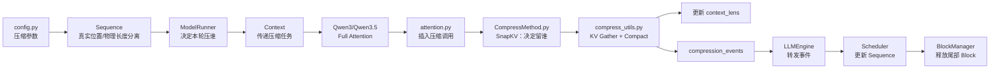
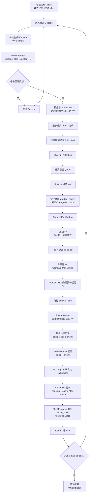

# nano-vLLM / Qwen3.5：KV Cache 压缩源码与完整执行链路

> **学习前提**  
> 你已经理解：
>
> - 原版 nano-vLLM 的 `LLMEngine → Scheduler → ModelRunner → Attention → KV Cache`；
> - Qwen3.5 Hybrid 的 **Full Attention + GDN**；
> - `Sequence / BlockManager / Paged KV Cache / Prefill / Decode`；
> - Qwen3.5 中 GDN 的 `conv state + recurrent state`。
>
> 因此本文不重新讲这些基础，只回答两个问题：
>
> 1. **为了加入 KV Cache 压缩，源码新增/修改了哪些文件？每个文件负责什么？**
> 2. **一次请求进入 Decode 后，KV Cache 从“正常增长”到“触发压缩、选择 KV、搬迁 KV、释放 Block、继续 Decode”的完整链路是什么？**

---

# 0. 先建立最核心的认识

这套 KV Cache 压缩并不是：

```text
生成结束
   ↓
再离线压缩 KV
```

而是一个**在线 Decode 压缩机制**。

它直接插在 Full Attention 的 Decode 路径里：

```text
当前 token 进入 Decode
        ↓
计算当前 Q / K / V
        ↓
先把当前 K / V 写入 KV Cache
        ↓
判断本轮是否需要压缩
        ↓
如果需要：
从尾部 KV 窗口里挑重要 token
        ↓
把重要 K/V 往前搬，形成连续有效区域
        ↓
缩短 context_len
        ↓
用压缩后的 KV 做本轮 Attention
        ↓
把“哪些 Block 可以释放”告诉 Scheduler
        ↓
BlockManager 真正释放多余 Block
        ↓
下一轮 Decode 继续在压缩后的 KV 上增长
```

可以先记一句话：

> **ModelRunner 决定“谁压”；Attention 决定“什么时候压”；SnapKV 决定“留谁”；compress_utils 决定“怎么搬”；Scheduler + BlockManager 决定“怎么释放”。**

---

# 0.1 它压的是 Qwen3.5 的什么？

对于 Qwen3.5 Hybrid：

```text
Qwen3.5
├── Full Attention Layer
│      └── KV Cache       ← 压缩对象
│
└── GDN Layer
       ├── conv state
       └── recurrent state
                              ← 不属于这套 KV Cache 压缩
```

因此最重要的边界是：

> **KV Cache 压缩只针对 Full Attention 层。GDN 层没有标准的历史 K/V Cache，因此不会执行 SnapKV 这条压缩路径。**

GDN 仍然正常维护：

```text
conv state
+
recurrent state
```

这两份状态和 KV 压缩是两套独立的状态管理机制。

---

# 0.2 关于你提供的压缩源码包

本次实际分析的是：

```text
nano-kvllm-qwen3.6.zip
```

其中核心压缩实现位于：

```text
nanokvllm/
```

当前压缩仓库自身的模型文件仍然是：

```text
nanokvllm/models/qwen3.py
```

并没有直接包含你之前 Qwen3.5 适配仓库中的：

```text
qwen3_5.py
gated_delta_net.py
```

因此下面“每个压缩文件具体做什么”完全按照这个压缩源码的真实实现来讲；映射回你的 Qwen3.5 Hybrid 项目时，只需要把这条压缩链挂到 **Full Attention 路径**，GDN State 保持原来的管理方式即可。

---

# 第一部分：KV Cache 压缩相关文件分别做了什么

---

# 1. `nanokvllm/config.py`

这是整个压缩机制的**参数入口**。

新增的核心参数：

```python
kv_compress_enabled = True
kv_compress_period = 1024
kv_compress_topk = 20
kv_compress_window_blocks = 4
kv_compress_keep_blocks = 2
kv_compress_keep_extra_tokens = 1
```

分别理解为：

| 参数 | 作用 |
|---|---|
| `kv_compress_enabled` | 是否开启 KV Cache 压缩 |
| `kv_compress_period` | 每隔多少个全局 Decode step 才允许进行一次压缩 |
| `kv_compress_topk` | 一次压缩最多选择多少个请求 |
| `kv_compress_window_blocks` | 每个请求从尾部拿多少个完整 Block 作为压缩窗口 |
| `kv_compress_keep_blocks` | 压缩后大约保留多少个 Block 的内容 |
| `kv_compress_keep_extra_tokens` | 除完整 Block 外再额外保留多少 token |

当前默认：

```text
block_size = 256

压缩窗口：
4 blocks
= 4 × 256
= 1024 token

目标保留：
2 blocks + 1 token
= 513 token
```

所以一次压缩的直观效果可以理解为：

```text
尾部约 1024 个 KV
        ↓
SnapKV 选重要内容
        ↓
保留约 513 个 KV
```

注意，这里不是压缩整个历史，而是只压缩**尾部窗口**。

### 为什么要设计成“周期 + 窗口”？

旧式设计常见的是：

```text
某个请求长度达到阈值
        ↓
立刻压缩整个历史
```

问题是高并发下很多请求可能频繁同时压缩，压缩计算本身反而拖慢 Decode。

当前版本改成：

```text
每隔固定 Decode 周期
        ↓
最多选 Top-K 个请求
        ↓
只压最近一段未压缩窗口
```

这样更容易控制压缩开销。

### 一句话记忆

> `config.py` 决定 **“压缩开不开、多久压一次、一次压多少请求、每个请求压多少 KV、最后保留多少”**。

---

# 2. `nanokvllm/engine/sequence.py`

原版 `Sequence` 主要关注：

```text
token_ids
num_tokens
num_cached_tokens
block_table
```

加入 KV 压缩以后，一个很重要的问题出现了：

> **真实生成了多少 token，和 GPU 里现在还保留多少 KV，已经不再是同一个长度。**

例如真实历史已经生成：

```text
2000 token
```

经过压缩以后 KV Cache 可能只剩：

```text
1500 个有效 KV 位置
```

如果还用同一个 `len(seq)` 同时代表：

```text
真实时间位置
+
物理 KV 长度
```

RoPE、停止条件、Block 分配都会乱。

因此这里增加了几个重要状态。

---

## 2.1 `generated_completion_tokens`

```python
self.generated_completion_tokens = 0
```

专门记录：

```text
真正已经生成了多少 completion token
```

用于判断：

```text
max_tokens
```

不会因为 KV 被压缩就“忘记之前已经生成了多少”。

---

## 2.2 `rope_pos`

```python
self.rope_pos = self.num_tokens - 1
```

每生成一个新 token：

```python
self.rope_pos += 1
```

这是一个**只增不减的真实位置计数器**。

KV Cache 压缩以后：

```text
物理 context_len 可能 2000 → 1500
```

但是当前 token 的真实 RoPE 位置不能：

```text
1999 → 1499
```

否则位置编码就错了。

因此必须分离：

```text
rope_pos
= 真实 token 时间轴

num_tokens / context_len
= 当前还保留的物理 KV 长度
```

这是整个压缩工程里非常关键的一处改造。

---

## 2.3 `tail_uncompressed_len`

```python
self.tail_uncompressed_len = 0
```

每生成一个 token：

```python
tail_uncompressed_len += 1
```

完成一次压缩以后：

```python
tail_uncompressed_len = 0
```

它回答的问题是：

> **这个请求从上一次压缩以后，又新增长了多少没有被压过的 token？**

只有当：

```text
tail_uncompressed_len
>=
window_blocks × block_size
```

才说明尾部已经重新积累出足够大的新窗口，可以再次压缩。

因此可以把它理解为：

```text
“距离上次压缩以后新长出来的 KV 长度”
```

---

## 2.4 序列化状态也补齐了

`__getstate__ / __setstate__` 中保存：

```text
token_ids
last_token
generated_completion_tokens
rope_pos
seq_id
tail_uncompressed_len
```

这是为了 TP 多进程通信、抢占重算等场景下，不丢失压缩相关状态。

### 一句话记忆

> `sequence.py` 的核心变化是 **把“真实生成时间轴”和“压缩后的物理 KV 长度”拆开，并增加一个计数器记录尾部又积累了多少未压缩 KV。**

---

# 3. `nanokvllm/utils/context.py`

`Context` 原来主要在一次 forward 中传：

```text
is_prefill
slot_mapping
context_lens
block_tables
……
```

现在又增加一组“本轮压缩控制信息”：

```python
compression_events
is_compress_step
compress_selected_batch_indices
compress_selected_seq_ids
compress_base_context_lens
```

可以理解为一次 Decode forward 的临时“压缩任务单”。

---

## 3.1 `is_compress_step`

表示：

```text
当前这一轮 Decode
是不是压缩周期
```

---

## 3.2 `compress_selected_batch_indices`

例如本轮 batch 有：

```text
[A, B, C, D, E]
```

ModelRunner 决定只压：

```text
B、D
```

那么 Context 里可能保存：

```text
[1, 3]
```

Attention 层看到它以后，就知道：

```text
本轮只对 batch 第 1、3 个请求做 KV 压缩
```

---

## 3.3 `compress_base_context_lens`

这是压缩前的：

```text
context_lens
```

为什么需要额外保存？

因为每一层 Full Attention 都会调用压缩函数。

第 0 层压缩以后可能已经把：

```text
context.context_lens
```

改短。

但第 1、2、3……层都必须针对**同一批原始物理位置**做压缩。

所以先保存：

```text
压缩开始前的原始 context_lens
```

后面的每个 Attention 层都从这个基准计算窗口，而不是使用已经被上一层改短后的值。

---

## 3.4 `compression_events`

GPU 模型 forward 过程中，只适合完成：

```text
KV 数据搬迁
context_lens 更新
```

但是：

```text
Sequence
BlockManager
free_block_ids
ref_count
```

这些 CPU 侧调度状态还要统一修改。

因此最后一层 Attention 会生成事件：

```text
这个请求压完以后：
新的 context_len 是多少
还需要多少 Block
哪些尾部 Block 可以释放
```

随后返回给 Scheduler。

### 一句话记忆

> `context.py` 是 **ModelRunner、Attention 和 Scheduler 之间传递“这一轮谁要压、压完变多长”的临时通信桥梁。**

---

# 4. `nanokvllm/engine/model_runner.py`

这是**压缩调度入口**。

它不负责真正计算 SnapKV，但负责决定：

> **这一轮到底要不要压，以及压哪些请求。**

最关键的改动位于：

```python
prepare_decode()
```

---

## 4.1 RoPE 位置改用 `seq.rope_pos`

原来可能直接使用：

```text
len(seq) - 1
```

现在改为：

```python
positions.append(seq.rope_pos)
```

因为压缩以后：

```text
len(seq)
```

表示的物理 KV 长度可能变短，但 RoPE 位置必须继续沿真实生成时间轴增长。

所以：

```text
positions → rope_pos
context_lens → 压缩后的物理 KV 长度
```

这两者彻底分开。

---

## 4.2 增加全局 `decode_step_counter`

开启压缩后：

```python
self.decode_step_counter = 0
```

每执行一次 Decode：

```python
self.decode_step_counter += 1
```

然后判断：

```python
decode_step_counter % kv_compress_period == 0
```

只有命中周期，才真正进入“寻找待压缩请求”的过程。

---

## 4.3 筛选可以压缩的请求

对 batch 中每个 Sequence 检查：

```text
当前 KV context 有多少完整 Block？
上次压缩后有没有重新积累至少一个 window？
当前尾块位置是否适合本轮压缩？
```

核心条件包括：

```python
seq.tail_uncompressed_len >= window_tokens
full_blocks >= window_blocks
```

满足以后放入：

```text
candidates
```

---

## 4.4 一次最多选择 Top-K 个请求

假设这轮有 100 个请求都满足条件，但：

```python
kv_compress_topk = 20
```

那么只取：

```text
前 20 个
```

避免一次 Decode 中大量请求同时执行压缩，造成过大的额外计算开销。

结果写入：

```text
Context.compress_selected_batch_indices
Context.compress_selected_seq_ids
```

---

## 4.5 保存压缩前 `context_lens`

如果这轮真的选中了请求：

```python
ctx.compress_base_context_lens = context_lens.clone()
```

后面所有 Full Attention 层都使用这份“压缩前长度”定位自己的 KV 窗口。

---

## 4.6 `run()` 把压缩结果带回 CPU

正常 ModelRunner 原来主要返回：

```text
token_ids
```

现在变成：

```text
token_ids
+
compression_events
```

压缩事件会沿着：

```text
ModelRunner
  ↓
LLMEngine
  ↓
Scheduler
```

传回 CPU 调度层。

### 一句话记忆

> `model_runner.py` 负责 **“每隔固定周期检查一次 → 从当前 batch 里选最多 Top-K 个请求 → 把压缩任务写进 Context”。**

---

# 5. `nanokvllm/models/qwen3.py`

这个文件本身没有实现压缩算法，但为了让 Attention 知道：

```text
我现在是第几层
整个模型一共有多少层
压缩参数是什么
```

模型调用链增加了相关信息传递。

大致变成：

```text
Qwen3Model
  ↓ enumerate(layer)
得到 layer_id
  ↓
Qwen3DecoderLayer
  ↓
Qwen3Attention
  ↓
Attention.forward(q, k, v, layer_id)
```

同时创建低层 `Attention` 时，把：

```text
vllm_config
num_layers
```

传进去。

为什么要知道 `layer_id`？

因为每一层都必须压缩自己独立的：

```text
K Cache
V Cache
```

但是：

```text
compression_event
```

只需要在**最后一层**生成一次。

否则假设有 32 个 Full Attention 层：

```text
同一个 Sequence
会产生 32 份重复释放事件
```

所以代码在：

```text
layer_id + 1 >= num_layers
```

时才记录最终压缩事件。

---

## 映射到 Qwen3.5

在你的 Qwen3.5 Hybrid 版本里，这个思想不变：

```text
GDN Layer
    ↓
不走 KV 压缩

Full Attention Layer
    ↓
把 layer id / config 传给低层 Attention
    ↓
执行 KV 压缩
```

因此压缩功能本质上是挂在：

```text
Qwen3_5Attention
    ↓
底层 Attention.forward()
```

这一条 Full Attention 路径上。

### 一句话记忆

> 模型文件本身不负责挑 KV，它主要负责 **把“第几层”和压缩配置一路传到真正管理 KV Cache 的 Attention 层。**

---

# 6. `nanokvllm/layers/attention.py`

这是压缩真正插入模型 forward 的位置。

原来的 Decode Attention 主链大致是：

```text
Q/K/V
   ↓
store_kvcache()
   ↓
flash_attn_with_kvcache()
```

现在变成：

```text
Q/K/V
   ↓
store_kvcache()
   ↓
是否是 Decode？
是否开启 KV 压缩？
是否命中压缩周期？
这个 batch 是否选中了请求？
   ↓
MyCompressCompact()
   ↓
flash_attn_with_kvcache()
```

最关键的顺序是：

> **先写当前 token 的 K/V → 再压缩 → 最后执行 Attention。**

---

## 6.1 为什么必须先 `store_kvcache()`？

当前 Decode token 的：

```text
K_t
V_t
```

先被写入 KV Cache。

随后压缩算法使用：

```text
当前 Q_t
+
当前已经完整写好的 KV window
```

计算哪些历史 KV 重要。

所以本轮 Attention 看到的是：

```text
压缩之后的有效 KV
+
当前 token 对应 KV
```

---

## 6.2 为什么压缩放在 FlashAttention 之前？

因为压缩函数会直接修改：

```text
K Cache
V Cache
context_lens
```

所以随后：

```python
flash_attn_with_kvcache(...)
```

读取到的就是已经缩短后的有效上下文。

这一轮不需要再等下一次 Decode 才享受压缩后的 KV。

### 一句话记忆

> `attention.py` 是真正的 **“压缩插入点”**：先存 KV，必要时原地压缩，再让 FlashAttention 直接使用压缩后的 Cache。

---

# 7. 新增核心文件：`nanokvllm/layers/CompressMethod.py`

这个文件回答：

> **到底哪些 token 的 KV 应该保留？**

当前核心方法是：

```python
SnapKV(...)
```

---

## 7.1 输入是什么？

大致输入：

```text
当前 token 的 Q
+
待压缩窗口里的 K
+
待压缩窗口里的 V
```

其中真正用于重要性判断的核心是：

```text
Q × K
```

V 主要保持接口统一。

---

## 7.2 SnapKV 在这里怎么判断重要性？

核心思想可以简化成：

```text
当前 Query
    ↓
分别和窗口中的每个 Key 做相似度
    ↓
得到 Attention Score
    ↓
Softmax
    ↓
跨 Head 汇总
    ↓
得到每个历史 token 的重要性分数
    ↓
Top-K
```

即：

> **当前 token 越关注哪个历史 Key，就越认为那个历史 KV 对接下来的生成重要。**

---

## 7.3 不是只保留 Top-K

代码还会固定保留一些特殊位置。

可以近似理解为：

```text
BOS / 锚点
+
Top-K 重要历史 token
+
最新 token
```

因此当前默认 1024-token 窗口最终大约保留：

```text
513 token
```

---

## 7.4 GQA 也做了处理

如果：

```text
Q Head 数
>
KV Head 数
```

也就是 GQA 情况，代码会按照 Q Head 与 KV Head 的分组关系计算注意力分数，再聚合成每个 token 的重要性。

因此它不是默认假设：

```text
Hq == Hkv
```

### 一句话记忆

> `CompressMethod.py` 只负责 **“算法决策”**：输入 Q/K/V，输出“窗口中哪些 KV 要留下”的索引 `keep_idx`。

---

# 8. 新增核心文件：`nanokvllm/layers/compress_utils.py`

如果说：

```text
CompressMethod.py
= 决定留谁
```

那么：

```text
compress_utils.py
= 真正把这些 KV 搬到正确位置
```

它是整个物理压缩过程的核心。

主要可以分成五步。

---

## 8.1 找到尾部压缩窗口对应的物理 Slot

Paged KV Cache 不是：

```text
Sequence A 的 KV
连续存放在一整段数组里
```

而是通过：

```text
block_table
```

映射到若干物理 Block。

所以第一步不是直接切：

```python
k_cache[-1024:]
```

而是通过：

```text
block_tables
context_lens
```

找出：

```text
这个请求最后 4 个完整 Block
分别对应哪些物理 block_id
```

再展开成：

```text
absolute slot
```

例如：

```text
block_table = [7, 20, 3, 15, 9, ...]

某个逻辑 Block
        ↓
映射到真实 GPU Block
        ↓
block_id × block_size + offset
        ↓
得到真正 KV Slot
```

核心函数：

```python
get_tail_window_and_tail_slots()
```

---

## 8.2 Gather 出待压缩窗口的 K/V

得到所有物理 slot 后：

```python
gather_kv_by_slots()
```

把它们整理成类似：

```text
K: [selected_seqs, KV_heads, window_tokens, head_dim]
V: [selected_seqs, KV_heads, window_tokens, head_dim]
```

这样 SnapKV 就不需要理解 PagedAttention 的离散物理布局。

SnapKV 看到的是一段逻辑连续窗口。

---

## 8.3 调用 `SnapKV()` 得到 `keep_idx`

例如原窗口：

```text
0 1 2 3 4 5 6 7 8 9 ...
```

算法得到：

```text
0, 3, 7, 9, ...
```

这些只是：

```text
窗口内部的逻辑索引
```

随后再映射回真正的：

```text
GPU KV slot
```

---

## 8.4 物理 Compact：把留下来的 KV 往前搬

这是“KV Cache 压缩”真正发生的地方。

假设一段窗口原来：

```text
[A B C D E F G H]
```

算法只保留：

```text
[A C F H]
```

如果只是把 B、D、E、G 标记为“不看”，物理显存仍然占着：

```text
[A _ C _ _ F _ H]
```

Block 仍然无法释放。

所以必须做：

```text
[A C F H _ _ _ _]
```

即：

> **把保留 KV 紧凑写回窗口前部，让后半部分真正变成可以释放的连续空间。**

当前 v0.2.0 的实现采用较稳定的 Torch 路径：

```python
index_select(...)
clone()
index_copy_(...)
```

完成：

```text
src_slots
   ↓
读取保留 K/V
   ↓
dst_slots
   ↓
写入压缩窗口前部
```

---

## 8.5 如果后面还有 Partial Tail，也要跟着前移

例如：

```text
[前缀]
[4 个完整压缩 Block]
[最后一个没填满的 Partial Block]
```

压缩窗口变短以后，最后这个 Partial Tail 不能仍然留在原来的远端物理位置。

所以代码还会：

```text
取出 tail token
        ↓
把它们移动到“压缩后保留 KV”的后面
```

最终有效 KV 在逻辑上重新变成连续区域。

---

## 8.6 修改 `context_lens`

压缩前：

```text
old_context_len
```

压缩窗口：

```text
window_tokens
```

压缩后保留：

```text
keep_tokens
```

因此：

```text
new_context_len
=
old_context_len
- window_tokens
+ keep_tokens
```

随后：

```python
context.context_lens[...] = new_context_len
```

因此紧接着执行的：

```python
flash_attn_with_kvcache()
```

只会读取压缩后的有效 KV 长度。

---

## 8.7 最后一层记录 `compression_event`

每一个 Full Attention 层都有自己独立的 KV Cache，所以每层都会实际执行：

```text
选择
+
搬迁
```

但是只有最后一层记录：

```text
new_context_len
keep_blocks
freed_block_ids
```

形成一个：

```text
compression_event
```

返回 CPU。

### 一句话记忆

> `compress_utils.py` 完成 **Paged KV 的逻辑窗口定位 → Gather → SnapKV → 物理紧凑搬迁 → context_len 更新 → 生成释放事件**。

---

# 9. `nanokvllm/engine/block_manager.py`

GPU 上完成 KV 搬迁后，并不代表显存 Block 已经被框架回收。

因为 CPU 侧还有：

```text
seq.block_table
Block.ref_count
free_block_ids
used_block_ids
```

这些状态。

因此增加：

```python
truncate_blocks(seq, keep_blocks)
```

作用是：

```text
原 block_table
[B0, B1, B2, B3, B4, B5, B6]

压缩后只需要前 5 个
        ↓
[B0, B1, B2, B3, B4]

B5 / B6
        ↓
ref_count -= 1
        ↓
如果 ref_count == 0
        ↓
放回 free_block_ids
```

这样释放出来的 Block 才能真正给其它请求继续使用。

---

## 为什么还要把最后一个 Block 的 hash 设为 `-1`？

原版 Prefix Cache 中，一个完整 Block 可以计算哈希：

```text
hash(block tokens)
```

用于后续前缀复用。

但压缩以后，一个 Block 里面已经可能不再对应：

```text
原始连续 token 序列
```

而是：

```text
从不同位置筛出来的重要 KV
```

因此原来的 Hash 语义失效。

把最后保留 Block 标成：

```text
hash = -1
```

可以避免后续把“压缩后的物理 KV”误认为普通完整前缀 Block。

### 一句话记忆

> `block_manager.py` 负责 **把已经空出来的尾部物理 Block 真正从请求手里回收，重新放回全局空闲池。**

---

# 10. `nanokvllm/engine/scheduler.py`

Scheduler 的核心调度策略没有完全重写。

真正新增的重点在：

```python
postprocess(...)
```

原来：

```text
ModelRunner
   ↓
token_ids
   ↓
Scheduler.postprocess()
   ↓
append_token()
```

现在：

```text
ModelRunner
   ↓
token_ids + compression_events
   ↓
Scheduler.postprocess()
```

---

## 10.1 先处理压缩事件

如果某个 Sequence 本轮压缩：

```text
读取 new_context_len
读取 keep_blocks
        ↓
BlockManager.truncate_blocks()
        ↓
seq.num_tokens = new_context_len
        ↓
seq.tail_uncompressed_len = 0
```

这一步让：

```text
CPU 逻辑状态
```

与刚才 GPU 上已经完成的：

```text
KV 物理 Compact
```

保持一致。

---

## 10.2 再正常 append 新生成 token

处理完压缩以后：

```python
seq.append_token(token_id)
```

此时：

```text
num_tokens
```

又从新的压缩后长度继续增长。

而：

```text
rope_pos
generated_completion_tokens
```

仍然沿真实生成时间轴继续增加。

---

## 10.3 抢占重算也做了兼容

如果一个已经压缩过的请求因为 KV 不足被抢占，需要重新 Prefill。

这时不能只拿：

```text
压缩后的 num_tokens
```

去重建。

因为真正的完整 token 历史仍然保存在：

```text
seq.token_ids
```

因此 `preempt()` 中会把：

```text
seq.num_tokens
```

恢复为：

```text
len(seq.token_ids)
```

然后重新 Prefill。

也就是说：

> **KV 压缩丢的是历史 KV，不是历史 token。**

需要重算时，原始 token 序列仍然可以重新生成完整状态。

### 一句话记忆

> `scheduler.py` 负责 **接收 GPU 的压缩结果，把 Sequence 长度、BlockTable 和 BlockManager 同步到压缩后的新状态，再继续正常生成。**

---

# 11. `nanokvllm/engine/llm_engine.py`

这个文件改动很小，但它是压缩事件从 GPU 回到 Scheduler 的中转站。

原来：

```python
token_ids = model_runner.run(...)
scheduler.postprocess(seqs, token_ids)
```

现在：

```python
token_ids, compression_events = model_runner.run(...)
scheduler.postprocess(
    seqs,
    token_ids,
    compression_events
)
```

所以它本身不压 KV，只负责把：

```text
ModelRunner 产生的压缩事件
```

送到：

```text
Scheduler
```

### 一句话记忆

> `llm_engine.py` 只是 **压缩结果的中转层**，主循环本身没有重新设计。

---

# 12. `query_window_manager.py` 要不要重点看？

在当前 `nanokvllm v0.2.0` 核心路径中，它已经不再是主链。

较早版本为了 SnapKV 保存一段 Query history，引入过：

```text
query_window_manager.py
```

当前 v0.2 的核心方案改成：

```text
直接使用当前 Decode token 的 q_current
```

去给尾部 KV 窗口打分。

所以现在学习主线时，可以先不看旧 Query Cache 机制。

你提供的压缩包里：

```text
KvChat/
```

应用示例目录仍然存在相关文件，但它不是本文所讲 `nanokvllm/` v0.2 核心压缩链必须理解的部分。

---

# 第一部分总结：所有文件到底怎么分工？

把文件压缩成一张图：



如果面试时只记职责，可以记成：

```text
Config
→ 定规则

Sequence
→ 分开真实长度和 KV 长度

ModelRunner
→ 选哪些请求压

Context
→ 把压缩任务传进模型

Attention
→ 决定压缩发生的位置

SnapKV
→ 决定保留哪些 KV

compress_utils
→ 真正搬 KV

Scheduler
→ 同步请求元数据

BlockManager
→ 真正释放 Block

LLMEngine
→ 负责事件中转
```

---

# 第二部分：一次 KV Cache 压缩从头到尾到底怎么跑？

下面按真实时间顺序走一遍。

假设：

```text
block_size = 256
window_blocks = 4
keep_blocks = 2
keep_extra_tokens = 1
period = 1024
topk = 20
```

---

# 阶段 1：Prefill 正常执行，不压缩

请求刚进入：

```text
Prompt
   ↓
Scheduler
   ↓
Prefill
   ↓
Full Attention 计算
   ↓
Prompt K/V 正常写入 Paged KV Cache
```

当前代码明确：

```text
Prefill 不执行 KV Cache 压缩
```

因此：

```text
Prompt KV
```

先完整保留。

对于 Qwen3.5：

```text
Full Attention
→ 建立 KV Cache

GDN
→ 建立 conv/recurrent state
```

两者都正常完成 Prefill。

---

# 阶段 2：进入 Decode，KV 开始正常增长

之后每轮 Decode：

```text
Scheduler.schedule()
        ↓
BlockManager.may_append()
        ↓
ModelRunner.prepare_decode()
        ↓
读取当前 last_token
        ↓
positions = seq.rope_pos
        ↓
context_lens = 当前有效 KV 长度
        ↓
模型 forward
```

每生成一个 token：

```text
KV Cache 增加一个有效位置
tail_uncompressed_len += 1
rope_pos += 1
generated_completion_tokens += 1
```

此时：

```text
rope_pos
```

表示真实时间位置；

```text
num_tokens / context_len
```

表示当前 KV 中还剩多少有效位置。

压缩前两者基本相同；第一次压缩后开始分离。

---

# 阶段 3：ModelRunner 判断“这一轮是不是压缩轮”

每次 Decode：

```python
decode_step_counter += 1
```

例如：

```text
1
2
3
...
1023
1024
```

当：

```text
decode_step_counter % 1024 == 0
```

进入压缩候选筛选。

平时：

```text
不是压缩轮
    ↓
完全按普通 Decode 跑
```

所以不是每个 token 都执行 SnapKV。

---

# 阶段 4：从当前 batch 中挑可以压缩的请求

假设当前 batch：

```text
Seq A
Seq B
Seq C
Seq D
...
```

ModelRunner 对每个请求检查：

```text
上次压缩后是否又积累了 ≥ 1024 个新 KV？
当前是否至少有 4 个完整 Block？
当前尾部布局是否适合压缩？
```

满足条件：

```text
加入 candidate
```

例如：

```text
候选：
A B D F G ...
```

如果：

```text
topk = 20
```

最多选 20 个。

然后写入：

```text
Context.compress_selected_batch_indices
```

至此只是：

> **决定“谁压”，还没有真正修改 KV。**

---

# 阶段 5：进入每一层 Full Attention

当前 token 正常经过：

```text
hidden_states
      ↓
QKV Projection
      ↓
Q, K, V
      ↓
RoPE
```

然后进入低层：

```text
Attention.forward()
```

对于 Qwen3.5：

```text
如果当前层 = GDN
    ↓
正常 GDN 状态更新
    ↓
不参与 KV 压缩

如果当前层 = Full Attention
    ↓
进入下面的 KV 压缩路径
```

---

# 阶段 6：先把当前 token 的 K/V 写进 Cache

Attention 首先：

```python
store_kvcache(k, v, ...)
```

于是当前 token 的：

```text
K_t
V_t
```

进入它对应的物理 Slot。

这时待压缩窗口已经是当前这一轮完整有效的 KV 数据。

---

# 阶段 7：定位“最后 4 个完整 Block”

假设某个 Sequence 当前物理 KV 结构：

```text
较早历史
│
├─ Block 0
├─ Block 1
├─ Block 2
├─ Block 3
├─ Block 4
├─ Block 5
├─ Block 6
├─ Block 7
└─ Partial Tail
```

如果：

```text
window_blocks = 4
```

则只选择：

```text
最后 4 个完整 Block
```

例如：

```text
Block 4 ~ Block 7
```

前面的：

```text
Block 0 ~ Block 3
```

完全不动。

这就是“window-based compression”。

---

# 阶段 8：根据 block_table 找到这些 KV 真正的 GPU Slot

Paged KV 的 Block 在物理显存中可能是：

```text
逻辑 Block 4 → GPU Block 23
逻辑 Block 5 → GPU Block 7
逻辑 Block 6 → GPU Block 41
逻辑 Block 7 → GPU Block 12
```

所以 `compress_utils.py` 根据：

```text
block_tables
+
context_lens
```

计算：

```text
window_src_slots
```

得到 1024 个 KV 在 GPU 中真正的位置。

---

# 阶段 9：Gather 出逻辑连续的 K/V 窗口

把离散物理 Slot 读取出来：

```text
GPU Paged KV
      ↓
gather_kv_by_slots()
      ↓
K_window
V_window
```

形状大致为：

```text
[selected_sequences,
 KV_heads,
 1024,
 head_dim]
```

这样后面的 SnapKV 可以完全忽略：

```text
PagedAttention 的物理 Block 分布
```

只处理逻辑连续序列。

---

# 阶段 10：SnapKV 给 1024 个历史 KV 打分

拿当前 token 的：

```text
Q_current
```

去和窗口中的：

```text
K_window
```

计算注意力相关性：

```text
Q_current
   ×
K_window
   ↓
Attention Score
   ↓
Softmax
   ↓
跨 Head 聚合
   ↓
每个历史 token 一个重要性分数
```

例如：

```text
token 0   0.01
token 1   0.20
token 2   0.002
token 3   0.18
...
```

然后 Top-K 选出重要位置。

同时固定保留：

```text
锚点/BOS
最近 token
```

最终：

```text
1024 个 KV
      ↓
约 513 个 KV
```

得到：

```text
keep_idx
```

---

# 阶段 11：把 `keep_idx` 映射回真实 GPU Slot

`keep_idx` 只是：

```text
窗口里的第 0、17、38、...
```

并不是 GPU 地址。

所以再通过：

```text
window_src_slots
```

映射成：

```text
src_keep
```

即：

> **真正需要留下来的那些 K/V 当前位于哪些物理位置。**

---

# 阶段 12：物理 Compact —— 压缩真正发生

假设窗口：

```text
原来：
[A B C D E F G H]

保留：
[A C F H]
```

代码先取：

```text
A C F H
```

然后把它们写回窗口前部：

```text
[A C F H E F G H]
 ↑有效区域↑
```

后面的内容虽然可能仍有旧值，但：

```text
context_lens
```

随后会缩短，所以不会再被 Attention 读取。

如果存在：

```text
Partial Tail
```

它也会整体向前搬到：

```text
压缩后的保留区域之后
```

最终有效 KV 在逻辑上重新连续。

---

# 阶段 13：立刻缩短 `context_lens`

例如原来：

```text
old_context_len = 2305
```

压缩：

```text
window = 1024
keep = 513
```

得到：

```text
new_context_len
=
2305 - 1024 + 513
=
1794
```

于是：

```python
context.context_lens = 1794
```

这意味着接下来本轮：

```python
flash_attn_with_kvcache()
```

只会把前：

```text
1794 个有效 KV
```

当作上下文。

因此：

> **压缩在当前 Decode step 就已经生效。**

---

# 阶段 14：当前层继续执行 Attention

现在：

```text
Q_current
   ↓
flash_attn_with_kvcache
   ↓
只读取压缩后的有效 KV
   ↓
Attention Output
```

然后继续：

```text
O Projection
MLP
下一层
```

---

# 阶段 15：其它 Full Attention 层执行同样压缩

Qwen3.5 中每个 Full Attention 层都有自己独立的：

```text
K Cache
V Cache
```

所以所有需要压缩的 Full Attention 层都执行：

```text
同一个请求集合
同一个窗口长度
同一个新 context_len
```

但是每层使用的是：

```text
本层自己的 Q/K/V
```

因此每一层可以根据自己的注意力分布选择本层重要 KV。

注意：

> **不同层实际保留下来的 token 位置可以不同，但压缩后的有效长度必须一致。**

这样 `context_lens / block_table` 才能统一服务所有层。

---

# 阶段 16：最后一层生成 Compression Event

最后一个相关 Attention 层完成以后，记录：

```text
batch_index
new_context_len
keep_blocks
freed_block_ids
tail_uncompressed_len_after = 0
```

例如：

```text
Seq B：
new_context_len = 1794
keep_blocks = 8
后面的 Block 可以释放
```

注意此刻：

```text
GPU KV 已经搬完
```

但 CPU BlockManager 还没有真正释放 Block。

---

# 阶段 17：ModelRunner 把事件返回给 LLMEngine

模型完成后：

```text
logits
   ↓
Sampler
   ↓
token_ids
```

同时 ModelRunner 从 Context 中取：

```text
compression_events
```

返回：

```text
(token_ids, compression_events)
```

---

# 阶段 18：LLMEngine 把压缩事件交给 Scheduler

```text
LLMEngine.step()
      ↓
Scheduler.postprocess(
    seqs,
    token_ids,
    compression_events
)
```

LLMEngine 本身不修改 KV。

它只是把：

```text
GPU 世界发生了什么
```

告诉：

```text
CPU 调度世界
```

---

# 阶段 19：Scheduler 同步 Sequence 状态

对被压缩的 Sequence：

```text
seq.num_tokens
    =
new_context_len
```

例如：

```text
2305 → 1794
```

并：

```text
tail_uncompressed_len = 0
```

表示：

```text
从现在开始重新统计
下一段新长出来的未压缩 KV
```

但是：

```text
seq.token_ids
```

不会删除。

真实 token 历史仍然完整保留。

同时：

```text
seq.rope_pos
```

也不会倒退。

---

# 阶段 20：BlockManager 真正释放多余 Block

Scheduler 调用：

```python
truncate_blocks(seq, keep_blocks)
```

例如：

```text
压缩前 block_table：
[B0 B1 B2 B3 B4 B5 B6 B7 B8 B9]

压缩后只需：
[B0 B1 B2 B3 B4 B5 B6 B7]

释放：
B8 B9
```

释放过程：

```text
ref_count -= 1
        ↓
如果 ref_count == 0
        ↓
used_block_ids 删除
        ↓
加入 free_block_ids
```

这些 Block 就可以重新分配给：

```text
新的请求
或
其它正在增长的请求
```

到这里，显存节省才真正落实到框架资源池。

---

# 阶段 21：正常 append 本轮生成 token

压缩事件处理完以后：

```python
seq.append_token(token_id)
```

于是：

```text
物理 KV 长度
从压缩后的 new_context_len 继续增长

rope_pos
继续沿真实时间增长

generated_completion_tokens
继续累计

tail_uncompressed_len
从 0 开始重新累计
```

---

# 阶段 22：后续 Decode 直接使用压缩后的 KV

下一轮：

```text
context_lens
```

已经是压缩后的较小值；

```text
block_table
```

也已经缩短；

```text
空闲 Block
```

已经增加。

因此后续 Decode：

```text
新的 K/V
   ↓
继续写到压缩后 Cache 的尾部
   ↓
Attention 只访问剩余重要 KV + 新增长 KV
```

直到：

```text
又累计出足够大的未压缩窗口
+
再次命中 compression period
```

再执行下一轮压缩。

---

# 23. 完整压缩主流程图



---

# 24. 用一个具体例子再走一遍

假设某个请求当前物理 KV 长度：

```text
2305 token
```

Block Size：

```text
256
```

那么可以理解成：

```text
9 个完整 Block
+
1 个 token 的 Partial Tail
```

当前又刚好命中：

```text
compression period
```

并且这个请求：

```text
tail_uncompressed_len >= 1024
```

所以被选中。

---

## 第一步：只取最后 4 个完整 Block

```text
4 × 256 = 1024 KV
```

前面的历史不动。

---

## 第二步：当前 Q 给这 1024 个 K 打分

SnapKV 得到重要 token 索引。

最终保留约：

```text
513 KV
```

---

## 第三步：将这 513 个 KV 搬到窗口最前面

同时把原来的：

```text
1-token Partial Tail
```

移动到它们后面。

---

## 第四步：缩短 Context

```text
2305
- 1024
+ 513
=
1794
```

所以：

```text
context_len = 1794
```

---

## 第五步：释放尾部 Block

原来约需要：

```text
ceil(2305 / 256)
= 10 blocks
```

现在：

```text
ceil(1794 / 256)
= 8 blocks
```

因此理论上这一轮可以回收：

```text
2 个 Block
```

这些 Block 回到：

```text
BlockManager.free_block_ids
```

供其它请求使用。

---

## 第六步：真实生成位置不倒退

虽然 KV 物理长度：

```text
2305 → 1794
```

但真实位置：

```text
rope_pos
```

继续：

```text
2304 → 2305 → 2306 ...
```

不会跟着变成 1793。

这就是：

> **逻辑 token 时间轴与物理 KV 长度解耦。**

---

# 25. 如果是 Qwen3.5 Hybrid，一次压缩轮怎么理解？

这是你现在最应该建立的最终模型。

假设 Qwen3.5 某一轮 Decoder：

```text
Layer 0：GDN
Layer 1：GDN
Layer 2：Full Attention
Layer 3：GDN
Layer 4：Full Attention
...
```

执行时：

```text
Layer 0 GDN
→ 更新 conv/recurrent state
→ 不压 KV

Layer 1 GDN
→ 更新 conv/recurrent state
→ 不压 KV

Layer 2 Full Attention
→ 写 K/V
→ SnapKV
→ Compact 本层 KV

Layer 3 GDN
→ 正常更新 state

Layer 4 Full Attention
→ 写 K/V
→ SnapKV
→ Compact 本层 KV
```

最后：

```text
所有 Full Attention 层的 KV 物理长度一起缩短
```

而：

```text
所有 GDN state
```

正常连续演进。

所以整个请求最终同时拥有：

```text
Sequence
├── Full Attention
│      └── 被周期性压缩的 KV Cache
│
└── GDN
       ├── conv state
       └── recurrent state
              ↑
          不参与 SnapKV
```

---

# 26. 压缩后为什么还能正常 Decode？

因为 Full Attention 真正需要的并不是：

```text
“历史所有 token 的原始 token_id”
```

而是：

```text
当前 Q
+
仍然保留下来的历史 K/V
```

SnapKV 做的是：

```text
把认为不重要的历史 K/V 删除
```

留下：

```text
更重要的 K/V
```

随后 FlashAttention 的有效上下文变成：

```text
压缩历史 KV
+
之后新增长的 KV
```

所以 Decode 可以继续执行。

代价是：

```text
它不再等价于完整 KV Attention
```

而是一种近似。

因此压缩方法真正要权衡：

```text
显存 / 吞吐收益
        VS
模型输出质量损失
```

---

# 27. 为什么只压 Decode，不压 Prefill？

当前实现明确：

```text
Prefill：不压
Decode：在线压
```

工程原因可以理解成三点：

### 1. Prefill 只发生一次

而 Decode 会运行很多轮。

长输出情况下，KV 不断增长的问题主要发生在 Decode。

### 2. Prefill 是 TTFT 关键路径

Prefill 中额外执行压缩，会增加：

```text
首 token 延迟
```

### 3. 工程实现更简单

先只修改：

```text
Decode Attention
```

可以减少：

```text
Chunked Prefill
Prefix Cache
Prefill FlashAttention
```

等路径上的复杂度。

---

# 28. 压缩和 Prefix KV Cache 为什么存在冲突？

原版 Prefix Cache 假设：

```text
Block 中保存的 KV
对应一段连续原始 token
```

所以可以：

```text
token block
   ↓ hash
   ↓
复用对应物理 KV Block
```

但经过 SnapKV：

```text
一个 Block 里可能变成
token 1、token 7、token 13、token 25……
```

它已经不是原来的连续 token block。

所以：

```text
旧 hash
```

不能再代表新的物理内容。

当前代码因此优先保证：

```text
压缩正确性
```

而不是继续强行复用原来的 Prefix Hash。

这也是 `truncate_blocks()` 会修改最后 Block hash 状态的原因。

---

# 29. 压缩和抢占重算怎么共存？

这是一个很重要的工程问题。

压缩以后：

```text
KV 历史被删掉了一部分
```

如果请求之后被抢占：

```text
这些 KV 已经无法直接恢复
```

但：

```text
完整 token_ids
```

仍然保存在 Sequence 中。

因此重新调度时可以：

```text
完整 token_ids
        ↓
重新 Prefill
        ↓
重建模型状态
```

这就是为什么：

> **KV Cache 可以压缩，但原始 token 序列不能跟着删。**

在 Qwen3.5 中重新 Prefill 时：

```text
Full Attention KV
+
GDN conv/recurrent state
```

都会重新计算。

---

# 30. TP=4 时怎么理解 KV 压缩？

你项目是 TP=4，可以这样理解。

假设 Full Attention 的 KV Heads 被四卡切分：

```text
GPU0：一部分 KV heads
GPU1：一部分 KV heads
GPU2：一部分 KV heads
GPU3：一部分 KV heads
```

压缩时每张卡都有：

```text
本卡自己的 K Cache
本卡自己的 V Cache
本卡自己的 Q heads
```

每个 Rank 本地执行：

```text
SnapKV
+
KV Compact
```

但所有 Rank 必须保持一致：

```text
哪些 Sequence 在压
压缩窗口多长
压缩后 context_len 多长
block_table 的逻辑长度
```

否则会出现：

```text
GPU0 认为上下文 1800
GPU1 认为上下文 1900
```

这种状态是不允许的。

因此：

> **KV 数据本身是 TP 分片的，但压缩长度与调度元数据必须保持跨卡一致。**

---

# 31. 你真正应该记住的“七步压缩口诀”

如果源码细节过几天忘了，只记下面七步：

```text
① ModelRunner 定时检查
② 选出本轮要压的 Sequence
③ Attention 先写当前 K/V
④ SnapKV 用当前 Q 选重要历史 KV
⑤ compress_utils 把保留 KV 往前 Compact
⑥ Scheduler 同步新长度
⑦ BlockManager 释放尾部 Block
```

再加一个非常重要的补充：

```text
RoPE 真实位置不缩短
GDN State 不参与 KV 压缩
```

---

# 32. 面试时的一段完整回答

> 我这个 KV Cache 压缩不是离线做的，而是直接集成在 Decode 的 Full Attention 路径里。首先 ModelRunner 会维护一个 Decode step 计数器，不是每一步都压，而是每隔固定周期从当前 batch 中选最多 Top-K 个满足条件的请求。进入 Full Attention 后，会先把当前 token 的 K、V 正常写进 Paged KV Cache，然后从请求尾部取固定数量的完整 Block 作为压缩窗口，用当前 Query 和窗口里的 Key 计算注意力重要性，按照 SnapKV 的思路保留重要 KV。选完以后不能只做逻辑删除，还要根据 block table 找到真实物理 slot，把保留的 K、V 紧凑搬到窗口前部，同时把后面的 partial tail 前移，然后缩短 context_len，所以当前这一轮 FlashAttention 就直接使用压缩后的 KV。模型最后会产生一个 compression event 交给 Scheduler，Scheduler 再更新 Sequence 的物理缓存长度，并调用 BlockManager 截断 block table、释放真正空出来的 Block。与此同时真实 token 历史和 RoPE 位置不会缩短，这样后面 Decode 和抢占重算仍然正确。对于 Qwen3.5 Hybrid，这套机制只作用在 Full Attention 层，GDN 的 conv state 和 recurrent state 不参与 SnapKV 压缩。

---

# 33. 最后用一条链把整个项目串起来

```text
Config
│
│ 设置 period / topk / window / keep
↓
ModelRunner.prepare_decode
│
│ 判断本轮是否压缩
│ 选择 Top-K Sequence
↓
Context
│
│ 保存 selected seq / base context len
↓
Qwen3.5 Full Attention
│
│ 计算 Q/K/V
↓
Attention.forward
│
├── store 当前 K/V
│
├── MyCompressCompact
│     │
│     ├── block_table → 真实 KV slot
│     ├── Gather 尾部窗口
│     ├── SnapKV → keep_idx
│     ├── Compact K/V
│     ├── 前移 Partial Tail
│     └── 更新 context_len
│
└── FlashAttention 使用压缩 KV
↓
最后一层产生 compression_event
↓
ModelRunner
↓
LLMEngine
↓
Scheduler.postprocess
│
├── 更新 seq.num_tokens
├── tail_uncompressed_len 清零
└── BlockManager.truncate_blocks
       ↓
     释放尾部 Block
↓
append 当前生成 token
↓
下一轮 Decode
↓
继续在压缩后的 KV Cache 上增长
```

理解这条链以后，你就可以把 KV Cache 压缩看成：

> **“模型内部完成数据选择和物理搬迁，框架外部完成元数据同步和显存 Block 回收。”**

这就是这套实现最核心的工程分层。


%% 项目关联导航：开始 %%
## 项目关联导航

- 所属模块：[[outputs/项目整理/模块-面试准备|模块-面试准备]]
- 关联阅读：[[outputs/项目整理/专题-02-KV缓存与调度|专题-02-KV缓存与调度]]

%% 项目关联导航：结束 %%
