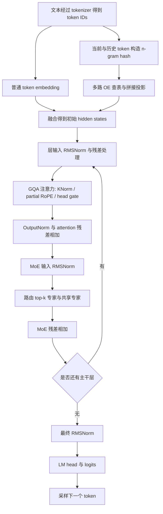
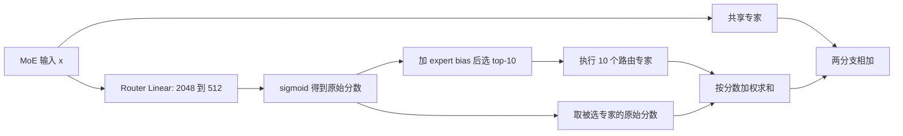
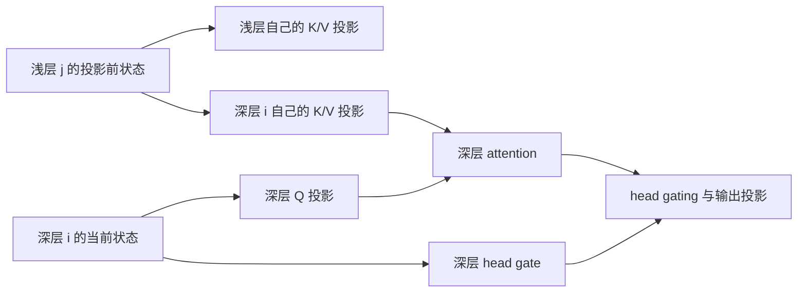
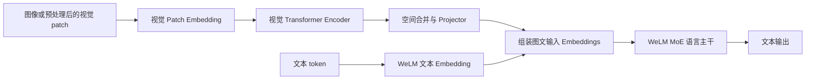

# WeLM 模型结构详解：从官网设计到 sglang-mlu 实现

> 核对日期：2026-09-14。本文以微信 AI 团队官网、原始论文以及本仓库实现为依据。
>
> 本仓库快照：`6ab396396fc284dd24e873cdb094e1eec6496286`；安装脚本实际锁定的 SGLang 基线：`TopIdiot/sglang@12e90632d2`。
>
> 阅读目标：能够画出 WeLM 的计算图，说明一个 token 如何经过嵌入、注意力、MoE 和输出层；理解 KV-Mirror、Over-encoding、Hidden Decoding、MTP 分别改变了什么；能够对应到源码继续开发。

## 1. 先建立整体认识

**WeLM 是一个持续演进的模型系列，不是一个永远固定的网络。** 2022 年的 WeLM-10B、新一代 WeLM-V4-80B-A3B、V3-258B-A22B，以及后续 Hidden Decoding 实验中的 617B 模型，不能混用结构参数。

对本仓库最有用的理解是：

**新一代 WeLM 的语言主干是 decoder-only、自回归的稀疏 MoE Transformer。它通过大量小专家保留模型容量，通过少量激活专家控制计算量；同时在输入表征、注意力、归一化和跨层依赖上做了专门设计。**

主要组件可以分成下面几组。

| 部分 | 关键机制 | 解决的问题 |
|---|---|---|
| 输入 | 普通 token embedding + Over-encoding，简称 OE | 以稀疏查表补充局部 n-gram 信息 |
| 注意力 | GQA、较宽的 Q 投影、partial RoPE、KNorm、head-wise gate | 平衡注意力表达能力、KV 大小和数值稳定性 |
| 层内计算 | partial PostNorm + OutputNorm | 支撑较深网络，调整残差与分支输出的尺度 |
| 前馈网络 | 512 个路由专家、每 token 选 10 个，另有共享专家 | 增大参数容量，同时保持较低激活计算量 |
| 跨层依赖 | KV-Mirror | 用浅层状态生成深层 K/V，使部分 prefill 计算可以省略 |
| 扩展路线 | Depth Up-Scaling、Hidden Decoding | 分别沿层数和内部序列长度增加计算能力 |
| 辅助预测 | MTP / NextN | 为推测解码提供候选 token |
| 仓库扩展 | YaRN、混合窗口、W8A8、视觉编码器、MLU 算子 | 支撑特定模型配置与部署方式 |

前六项的公开设计依据见[官网架构文章](https://welm.weixin.qq.com/posts/building-effective-sparse-moe-models-with-moderate-resources/)与[Hidden Decoding 博客](https://welm.weixin.qq.com/posts/hidden_decoding/)；仓库扩展的依据见第 14 节的源码索引。后文会区分通用设计、具体配置和运行时优化。

### 1.1 本文如何区分证据

| 标记 | 含义 | 能说明什么 |
|---|---|---|
| **官网/论文** | 微信团队直接公开的材料 | 对应文章、模型和实验的设计 |
| **代码** | 当前仓库或锁定基线中的实现 | 这个版本如何计算、接受哪些配置 |
| **推导/示例** | 根据已确认结构进行的计算或教学简化 | 帮助理解，不代表额外公开的模型规格 |
| **待确认** | 缺少真实 checkpoint 配置或公开证据 | 不能仅凭文件名、默认值或测试样例补齐 |

本次没有获得实际部署权重目录中的完整 `config.json`、tokenizer 和权重清单。因此，可以说明适配器所实现的结构，但不能把全部可选功能都认定为某个线上 checkpoint 已启用。

### 1.2 建议阅读顺序

1. 第 2～4 节：认清版本、规格和整体计算图。
2. 第 5～9 节：掌握 OE、归一化、注意力、MoE、KV-Mirror。
3. 第 10～13 节：理解 Hidden Decoding、MTP、训练和视觉扩展。
4. 第 14～17 节：对照源码、配置和推理流程检查自己的理解。

## 2. WeLM 的版本关系：哪些可以放在一起比较

| 模型/名称 | 已确认信息 | 与本仓库的关系 |
|---|---|---|
| 2022 年 WeLM | GPT 风格自回归 Transformer；论文表 2 列出 1.3B、2.7B、10B；10B 为 32 层、hidden 5120、40 heads、2048 context | 历史起点，不能用来解释当前 V4 MoE |
| WeLM-V3-258B-A22B | 官网明确称为较早一代 MoE，采用 Key-Norm、half RoPE 等改进；后训练文章讨论 Thinking/Instruct | 不能直接套用 V4 的 48 层、512 专家等数值 |
| WeLM-V4-80B-A3B | 2026-01-21 架构文章的主要对象 | 本文讲解主线，与仓库多项结构契约一致 |
| WeLM-130B-A4.9B | 在 80B 基础上进行深度扩展，官网列 78 个 MoE 主干层 | 与 Hidden Decoding 是不同扩展方向 |
| 仓库中的 WeLMV4.5 / 80A3 / YARN | 文件、特化条件和脚本中的版本标识；模型类仍叫 `WeLMV4MoeForCausalLM` | 不能仅根据类名判断是否属于初版 V4，须看配置和权重 |
| Hidden Decoding 的 80B/617B | 在既有主干上引入多个内部 stream；2026 年 7 月论文研究 HD4 | HD 是结构扩展方法，不等于一个固定参数规模 |
| 基于 Qwen3-8B 的 Hidden Decoding 开源模型 | 官方项目公开了 8B 系列示范模型 | 是 HD 方法的公开复现实例，不是 WeLM-80B 权重 |

来源：[2022 年论文](https://arxiv.org/abs/2209.10372)、[V3 后训练文章](https://welm.weixin.qq.com/posts/welm-v3-post/)、[V4 架构文章](https://welm.weixin.qq.com/posts/building-effective-sparse-moe-models-with-moderate-resources/)、[HD 论文](https://arxiv.org/abs/2607.08186)、[官方 HD 项目](https://github.com/Tencent/Sequential-Hidden-Decoding)。

**类名中的 `Qwen2Moe` 不等于“这就是 Qwen2-MoE 的权重”。** 当前实现沿用了部分 Qwen 风格命名和代码组织，但添加了 OE、KV-Mirror、特殊归一化和序列展开等机制。代码复用关系不能证明训练初始化关系，也不能证明模型就是 Qwen 微调版。

另外，模型、训练框架、产品和工具系统是不同层次。模型能生成工具调用格式，不意味着 Transformer 内部自带微信数据库访问权限；小微等产品如何接入工具与业务上下文，也不能从模型类名推断出来。

## 3. 80B-A3B 的规格，以及数字究竟是什么意思

### 3.1 官网给出的基础配置

以下数值来自 2026-01-21 架构文章表 1。

| 项目 | WeLM-80B | WeLM-130B |
|---|---:|---:|
| 官方总参数口径 | 80B | 130B |
| 官方激活参数口径 | 3B | 4.9B |
| Embedding 参数，另列 | 6.1B | 6.1B |
| MoE 主干层数 | 48 | 78 |
| MTP 层数，另列 | 1 | 1 |
| hidden size | 2048 | 2048 |
| 路由专家 intermediate size | 512 | 512 |
| attention head dimension | 256 | 256 |
| Query heads | 24 | 24 |
| Key/Value heads | 2 | 2 |
| 每层路由专家数 | 512 | 512 |
| 每 token 选中路由专家数 | 10 | 10 |
| 共享专家数 | 1 | 1 |

**官方明确说明：这里的总参数量和激活参数量不包含 word embedding 与 output layer。** 因此，80B 不是“整个 checkpoint 恰好有 800 亿个参数”，3B 也不能直接换算成完整推理 FLOPs。[官网表 1](https://welm.weixin.qq.com/posts/building-effective-sparse-moe-models-with-moderate-resources/)

本地 `Qwen2MoeAttention.__init__` 中还有一个针对 `80A3` 的特化契约，检查 hidden=2048、Q heads=24、KV heads=2、head_dim=256、48 主干层、512 experts，以及 `qk_rope_head_dim=64`、开启 KNorm、关闭 QK 双归一化。这个条件说明代码针对这一形状开发了特化路径，不是所有 WeLM 配置都必须满足它；该 CUDA/MK 专用优化在 MLU 路径被拒绝。

### 3.2 为什么 80B 的模型每个 token 只激活约 3B

以一个标准 SwiGLU 路由专家为例，设 hidden 维度为 $d$、专家中间维度为 $m$，忽略 bias：

$$
\operatorname{Expert}_e(x)
=W_{e,down}\left[\operatorname{SiLU}(W_{e,gate}x)\odot W_{e,up}x\right].
$$

每个专家有三个矩阵，参数量近似为：

$$
P_{expert}=3dm=3\times2048\times512=3,145,728.
$$

那么，**仅计算 48 个主干层的路由专家**：

$$
P_{routed,total}=48\times512\times3,145,728\approx77.31\text{B},
$$

$$
P_{routed,active}=48\times10\times3,145,728\approx1.51\text{B}.
$$

这两个推导值解释了稀疏 MoE 的主要来源：存了很多专家，但单个 token 只执行其中一部分。完整口径还涉及注意力、共享专家、路由器、归一化，以及是否计入辅助模块，不能用上式直接宣称精确重建了官方 80B/3B。

还要注意三个问题。

- **top-10 是每层、每个 token 分别选择。** 不是整个请求只选 10 个专家，也不是 48 层共用同一组专家。
- **激活比例不等于显存比例。** 一个 batch 的不同 token 可能覆盖大量专家；服务一般仍需要存放完整权重，或付出卸载与搬运成本。
- **“参数参与一次”与“执行了多少次矩阵乘”不同。** HD 将一个用户 token 展开成多个内部位置，同一组主干权重会服务更多位置，计算量会增加。

### 3.3 为什么有些资料写 48 层，有些写 49 层

初版官网把 **48 个主干 MoE 层和 1 个 MTP 层分开列出**。2026 年 7 月 HD 论文附录 B 则将实验中的 80B 配置写为 49 layers，617B 写为 94 layers。

数值上的 `48 + 1 = 49` 是理解差异的线索，但不能仅凭相加就断言论文在所有位置都采用“主干加 MTP”的同一计数定义，更不能把论文的逐层布局直接写回旧 checkpoint。当前代码的 `num_hidden_layers`、`num_target_hidden_layers` 和 `num_nextn_predict_layers` 分别参与构造和索引，应以目标配置为准。[HD 论文附录 B](https://arxiv.org/pdf/2607.08186)

## 4. 整体计算图：一个 token 怎样变成下一个 token

先看未开启 HD、忽略并行通信与算子融合的逻辑结构。



这张图省略了一条非常重要的跨层边：**镜像层的 K/V 输入来自配置指定的浅层，而 Q 和 head gate 仍来自当前层的状态。** 第 9 节会把这条边补上。

从张量角度看，推理框架常把多个请求的 token 打包为一个二维张量，而不是始终保存 `[batch, sequence, hidden]`：

```text
input_ids:                 [T]
embedding / hidden_states: [T, 2048]
每层 attention 输出:       [T, 2048]
每层 MoE 输出:             [T, 2048]
最终选中位置的 logits:     [T_selected, vocab_size]
```

`T` 是本轮参与计算的 token 行数；镜像收缩、HD、分布式切分可能使某些阶段的行数不同。普通生成通常只需要每个请求最后位置的 logits，不需要把所有 prompt 位置的完整词表分布都算出来。

## 5. 输入层：普通 Embedding 与 Over-encoding

### 5.1 普通 embedding 的局限

普通词表查表只依赖当前 token ID：

$$
e_t=E[x_t].
$$

同一个 token 在不同短语里，刚进入第一层时得到相同的向量；上下文差异主要靠后续 Transformer 建立。

OE 额外读取当前 token 与紧邻历史 token 的组合，让输入层就包含局部搭配信息。它是模型参数化的查表模块，不是检索数据库，也不是额外 tokenizer。

### 5.2 本仓库的典型 OE 结构

`welm_perf_opt.py` 定义的特化形状为：

```python
SPECIALIZED_WELM_OE_GRAMS = (2, 2, 3, 3)
SPECIALIZED_WELM_OE_BRANCHES = 4
SPECIALIZED_WELM_OE_DIM = 512
```

也就是两个 2-gram 分支和两个 3-gram 分支，各查出 512 维向量：

```text
当前 token 与前一个 token    → hash → OE 表 0 → 512 维
当前 token 与前一个 token    → hash → OE 表 1 → 512 维
当前 token 与前两个 token    → hash → OE 表 2 → 512 维
当前 token 与前两个 token    → hash → OE 表 3 → 512 维
                                                   ↓
                                           拼接成 2048 维
                                                   ↓
                                            线性投影至 hidden
```

这与官网“2-head over-encoding”和多头哈希的设计相呼应。**这里的两个 head 是每种 n-gram 的多个哈希表分支，不是 GQA 中的两个 KV heads。** 通用路径仍由 `oe_grams`、`oe_vocab_sizes`、`oe_dim` 决定，不能把特化常量当作所有 checkpoint 的配置。

每一路使用独立 embedding 参数。即便输入 n-gram 相同，不同表也能学习不同表示；不同取模大小还可使冲突组合不同，缓解单一哈希表的碰撞问题。[官网 OE 说明](https://welm.weixin.qq.com/posts/building-effective-sparse-moe-models-with-moderate-resources/)

### 5.3 哈希计算与融合公式

当前 MLU 实现及参考测试使用 32 位无符号环绕算术。设基础词表大小为 $V$，第 $b$ 路 n-gram 长度为 $g_b$，桶数为 $M_b$，概念上是：

$$
u_b(t)=\left[\sum_{j=0}^{g_b-1}x_{t-j}V^j\right]\bmod2^{32},
$$

$$
\operatorname{index}_b(t)=\left[(u_b(t)\times2654435761)\bmod2^{32}\right]\bmod M_b.
$$

序列开头不足长度的历史需要按实现约定处理；分块 prefill 和 decode 还需要恢复正确的前缀历史，不能随便拿相邻请求的 token 填充。

查表、拼接和融合为：

$$
c_t=\operatorname{Concat}_b\left(E_b^{OE}[\operatorname{index}_b(t)]\right),
$$

$$
h_t^{(0)}=\frac{E[x_t]+W_{OE}c_t}{2}.
$$

最后的 `/2` 是当前 `compute_welm_oe_embedding` 的实际行为。虽然模块名叫 `oe_gate_up_proj`，模型构造中这里是无 bias 的线性层，不能因为名字里出现 gate 就额外脑补 sigmoid 或 SwiGLU。

代码依据：[OE 实现](../python/sglang_mlu/srt/models/welm_perf_opt.py)、[MLU 哈希 kernel](../python/sglang_mlu/srt/welm_oe_hash_kernels.py)、[哈希参考测试](../test/scripts/test_welm_oe_hash.py)。

### 5.4 为什么可以增加很多 embedding 参数，却不按相同比例增加计算

一个大表包含数百万行，不代表每个 token 都遍历这些行。每个分支通常只取一个索引对应的行，再做一次较小的投影。

因此，OE 扩大的是**可存储的输入表征容量**，不像新增一个密集大矩阵那样，让所有新增参数都参与每个 token 的计算。不过查表、hash、投影、跨卡通信仍有成本；“低开销”不能理解为物理上完全没有开销。

这也解释了为什么本仓库会优化 OE 的 all-reduce 位置、hash 生成和融合查表：模型数学表达式很简单，实际服务仍可能受访存和小算子调度限制。

## 6. 归一化：为什么不是照搬普通 PreNorm

### 6.1 RMSNorm 的基本作用

对长度为 $d$ 的向量：

$$
\operatorname{RMSNorm}(x)=\gamma\odot\frac{x}{\sqrt{\frac1d\sum_{i=1}^d x_i^2+\epsilon}}.
$$

它控制特征的尺度，没有 LayerNorm 的减均值步骤。WeLM 不只是选了 RMSNorm，还改变了它与残差、attention 输出的相对位置。

### 6.2 partial PostNorm 的关键是残差取自哪里

以下是**在 `ppln=True`、该层不属于 `prenorm_layer_idx`、开启 `o_norm` 时的数学示意**。把前一层未融合的残差相加还原后，设层输入为 $x$：

$$
u=N_{in}(x),\qquad r=u,
$$

$$
a=N_{out}(\operatorname{Attention}(u;\text{KV source})),
$$

$$
v=r+a,
$$

$$
y=v+\operatorname{MoE}(N_{moe}(v)).
$$

这里有两个非对称点：

- attention 分支前，归一化后的 $u$ 同时成为 attention 输入和残差基底；普通 PreNorm 通常保留未归一化的 $x$ 作为这一段的残差。
- MoE 分支前，只把 $N_{moe}(v)$ 送入 MoE，残差仍保留 $v$。

所以不能简单把整个块写成普通 PreNorm，也不能说“每个子层输出后都统一套一个 PostNorm”。代码通过 `ppln`、`prenorm_layer_idx`、`o_norm` 表达具体差异。

### 6.3 OutputNorm 为什么放在 attention 输出上

官网给出的动机是：深层网络可能出现表示趋同；调整残差归一化有助于缓解，但残差与分支输出尺度接近时，某些相加结果可能异常小，下一次归一化的反向梯度会被放大。团队用 attention OutputNorm 和较小权重初始化来稳定训练。[官网归一化说明](https://welm.weixin.qq.com/posts/building-effective-sparse-moe-models-with-moderate-resources/)

在当前实现里，OutputNorm 位于 attention 输出投影之后。`mmq_style_norm_after_attn_kernel` 将下面几步融合：

```text
attention 的 o_proj 输出
    → Output RMSNorm
    → 加 residual
    → 为 MoE 做 RMSNorm
```

这不是新增了一套网络结构，而是同一数学计算的融合实现。源码中 `hidden_states` 与 `residual` 分开传递，某次残差加法可能推迟到下一个融合 kernel；读代码时要先恢复逻辑计算图，再分析 BF16/FP32 中间结果。

代码依据：[DecoderLayer](../python/sglang_mlu/srt/models/welmv4.py)、[归一化 kernel](../python/sglang_mlu/srt/layers/welmv4_op.py)。

## 7. Attention：GQA、KNorm、partial RoPE 与 head gate

### 7.1 2048 hidden 为什么能产生 24 × 256 维的 Q

初版 80B 的 attention 配置是：

```text
hidden size = 2048
Q heads     = 24
KV heads    = 2
head dim    = 256
```

因此其逻辑投影宽度为：

$$
d_Q=24\times256=6144,\quad d_K=d_V=2\times256=512.
$$

线性层可以改变维度，完全不要求 `hidden_size == num_heads * head_dim`。当前实现显式接受 `head_dim`，不能使用整数除法 `2048 // 24` 来重建真实 head dimension。

在单卡、非镜像收缩的逻辑视角下：

| 张量/算子 | 形状 |
|---|---|
| attention 输入 | `[T, 2048]` |
| Q | `[T, 24, 256]` |
| K、V | 各 `[T, 2, 256]` |
| 普通 fused QKV 的输出宽度 | `6144 + 512 + 512 = 7168` |
| 每个 Q head 的 attention 输出 | `[T, 256]` |
| 24 heads 拼接 | `[T, 6144]` |
| 输出投影 `o_proj` | `6144 → 2048` |
| head gate 投影 | `2048 → 24` |

镜像源层可能同时为多个目标层生成 K/V，因此其物理融合投影宽度可能大于 7168；TP 则会进一步切分或复制本地 head。上表是基础逻辑形状，不是每个 rank 的所有实际缓冲区形状。

### 7.2 GQA：24 个查询头共享 2 组 K/V

每组有 `24 / 2 = 12` 个 Q heads，共用一组 K/V：

```text
Q head 0  ... 11   → K/V head 0
Q head 12 ... 23   → K/V head 1
```

每个 Q head 仍有自己的查询向量和 attention 权重。共享的是用于被查询的 K/V 表示，不是将所有 attention 结果合并成两个头。

对第 $h$ 个查询头，设其 KV 组为 $g(h)$：

$$
A_h=\operatorname{softmax}\left(\frac{Q_hK_{g(h)}^\top}{\sqrt{d_h}}+M\right)V_{g(h)}.
$$

$M$ 表示因果约束和可能的窗口约束。此式暂不包含可选 sink 和 YaRN 的额外缩放。

相比相同 Q heads、head_dim 的普通 MHA，GQA 的逻辑 KV 数据量缩小为 `2/24 = 1/12`。这不是整个模型显存缩小 12 倍，因为权重、激活和其他缓冲区没有一起按这个比例减少。

**推导示例：** 假设 48 层都保存完整历史、不含 MTP、不做 HD，也不计分页填充和跨卡复制，BF16 的 K/V 每元素占 2 bytes，则一个请求的逻辑 KV 大小为：

$$
M_{KV}=L\times T\times 2\times H_{KV}\times d_h\times b.
$$

这里第二个 `2` 表示 K 与 V 两份，$b$ 是每元素字节数。代入 $L=48,H_{KV}=2,d_h=256,b=2$，每个历史 token 为 98,304 bytes，即 96 KiB；32,768 个 token 为 3 GiB。实际混合窗口、HD、MTP、cache 分配和 TP 下的 KV head 复制会改变设备侧占用，所以这只是统一口径的估算示例。

### 7.3 KNorm：先控制 K 的尺度，再做位置旋转

当前 80A3 特化契约采用 `k_norm=True`、`qk_norm=False`，即：

```text
Q projection → 不做 QNorm → partial RoPE
K projection → KNorm     → partial RoPE
V projection → 直接作为 V
```

KNorm 按 head 的 256 个维度进行 RMS 归一化，帮助控制 attention logit 的尺度。它与第 6 节的 hidden-size RMSNorm 不同，归一化对象与维度也不同。

代码也提供 `qk_norm` 分支，所以“只归一化 K”应关联到上述配置，而不能泛化为模型类永远禁止 QNorm。

### 7.4 partial RoPE：只旋转每个 head 的一部分维度

当前 80A3 代码契约检查 `qk_rope_head_dim=64`，而 `head_dim=256`：

```text
每个 Q/K head:
[192 维 no-PE 内容部分 | 64 维 RoPE 部分]
```

MLU 的 `_apply_welm_rotary_inplace` 明确按照 **no-PE 在前、旋转维度在后** 的布局处理。

概念上：

$$
q_t=[q_t^{content};R_tq_t^{rope}],\qquad
k_s=[k_s^{content};R_sk_s^{rope}].
$$

因此点积既包含不旋转的内容匹配项，也包含带相对位置信息的旋转项。这不表示前 192 维永远不含位置相关信息——经过多层混合后，hidden state 本身可以编码位置；这里只描述直接施加 RoPE 的维度。

### 7.5 head-wise gate：对每个注意力头的输出做连续缩放

当前实现计算：

$$
g_h(x)=\sigma(w_h^\top x),\qquad \widehat A_h=g_h(x)A_h,
$$

然后：

$$
o=W_O\operatorname{Concat}(\widehat A_1,\ldots,\widehat A_{24}).
$$

gate 位于 attention 加权求和之后、`o_proj` 之前，一个标量广播到对应 head 的所有维度。

**这个 gate 和 MoE router 是两套不同机制。** attention gate 不做 top-k，通常仍会计算全部 Q heads；它调整某个头对最终结果的贡献。MoE router 则决定执行哪些专家。

### 7.6 YaRN、滑动窗口与 attention sink 是额外配置维度

代码可以按层读取 `sliding_window_size_layerwise` 和 `enable_attn_sink_layerwise`：有些层采用局部窗口，有些层覆盖完整因果历史。窗口大小不能从 WeLM 名称猜测。

这里的 `attn_sink` 是按 Q head 存放的参数，并通过 `sinks` 传入 attention 后端。它与“模型自发大量关注开头 token”这一 attention-sink 现象不是同一个对象，也不能直接理解成保留若干真实开头 token 的 cache 策略。

YaRN 用于 RoPE 的上下文扩展。当前实现读取 `rope_scaling`，并在特定条件下同时调整 attention softmax scale。它不改变 512 专家、top-10 等 MoE 主体设置，也不等于 KV cache 压缩。

代码依据：[Attention 初始化](../python/sglang_mlu/srt/models/welmv4.py)、[MLU RoPE](../python/sglang_mlu/srt/layers/rotary_embedding/welm.py)、[锁定基线的 Attention.forward](https://github.com/TopIdiot/sglang/blob/12e90632d2/python/sglang/srt/models/welmv4.py)。

## 8. MoE：路由器到底如何选专家

### 8.1 一个 token 会经过两条前馈分支



每层都有自己的 router、专家权重和共享专家。当前 `Qwen2MoeDecoderLayer` 明确把各层设为 sparse，不能套用别的模型“前若干层是 dense MLP”的默认规律。

### 8.2 bias 影响选择，但不直接进入专家输出权重

官网主线采用未归一化 sigmoid 路由。设 router logits 为：

$$
z=W_rx,\qquad s_e=\sigma(z_e).
$$

用于选择的分数是：

$$
\widetilde s_e=s_e+b_e,\qquad I=\operatorname{TopK}(\widetilde s,10).
$$

但混合输出使用选中专家的**原始**分数：

$$
y_{routed}=\sum_{e\in I}s_e\operatorname{Expert}_e(x).
$$

当前 `expert_bias_routing` 的参考路径先对 `scores + expert_bias` 做 top-k，再从 `scores` 中 gather 权重。即使函数签名有 `renormalize`，这个 custom routing 路径也没有执行“除以选中分数之和”。不能看到外层 `norm_topk_prob` 就断言此路径一定归一化。

**推导示例：** 若原始分数是 `[0.80, 0.70, 0.60]`，bias 为 `[0, 0, 0.25]`，top-2 依据 `[0.80, 0.70, 0.85]` 选择专家 2 和 0；加权系数却仍然是 `0.60` 和 `0.80`，而不是 `0.85` 和 `0.80`。

### 8.3 loss-free balance 在训练和推理中分别做什么

官网称其采用 loss-free balance routing。可以将其理解为：利用用于选择的偏置调节专家负载，减少对主任务训练目标的干扰。[官网 MoE 说明](https://welm.weixin.qq.com/posts/building-effective-sparse-moe-models-with-moderate-resources/)

本仓库是推理实现，能确认的是它存储、加载并使用 `expert_bias`。这里没有提供训练端完整的负载统计与 bias 更新算法，因此不能从推理文件推导出精确更新步长、统计窗口或所有辅助 loss 设置。

“loss-free”指负载均衡方法的设计，不是模型训练没有语言建模 loss。

### 8.4 共享专家是否也有 gate

共享专家由 `shared_expert_intermediate_size` 决定是否创建；另外还有 `has_shared_expert_gate` 配置。

未开启共享 gate 时：

$$
y_{MoE}=y_{routed}+\operatorname{SharedExpert}(x).
$$

开启时：

$$
y_{MoE}=y_{routed}+\sigma(w_s^\top x)\operatorname{SharedExpert}(x).
$$

官网表格给出“1 个共享专家”，但不能据此确定每个 V4.5 checkpoint 的共享专家中间维度和 gate 开关。源码为兼容 Qwen 风格保留了默认分支，最终以实际配置为准。

共享专家提供所有 token 都能使用的公共计算路径，路由专家提供有选择的特化路径；这不意味着某个专家被人为固定标注为“数学专家”或“中文专家”。具体分工需要路由统计和实验分析。

另外，当前实现读取 `moe_expert_swiglu_clamp_limit_layerwise` 与 `shared_expert_swiglu_clamp_limit_layerwise`，在相应配置下向专家实现传递 SwiGLU 截断阈值。前面的专家公式是未截断的基本形式；若目标 checkpoint 启用截断，数值复现还需遵守对应 kernel 的截断位置和阈值，不能只用标准 SwiGLU 替代。

### 8.5 并行执行如何对应这一结构

TP 切分矩阵或 attention heads；EP 将不同专家放到不同设备。若 512 个路由专家均匀分配到 EP=4，每 rank 有 128 个路由专家，但每个 token 的全局选择仍然是 top-10。

EP 的大致流程是：

```text
算 router → 按 expert ID 分发 token → 各卡算本地专家
          → 返回专家结果 → 加权合并 → 加共享专家结果
```

注意本仓库对 all-to-all 路径中的共享专家采用了专门的并行处理。某个输出若已经是完整值，再重复 all-reduce 会改变数值，而不是单纯降低性能。这属于实现正确性问题，不是模型又添加了新专家。

代码依据：`expert_bias_routing`、`Qwen2MoeSparseMoeBlock.__init__/forward`，位于[welmv4.py](../python/sglang_mlu/srt/models/welmv4.py)。

## 9. KV-Mirror：WeLM 最需要理解的跨层设计

### 9.1 标准 Transformer 的层间依赖

在普通第 $i$ 层，Q/K/V 都来自该层 attention 的输入 $h_i$：

$$
Q_i=W_i^Qh_i,\quad K_i=W_i^Kh_i,\quad V_i=W_i^Vh_i.
$$

要得到深层所有 prompt 位置的 KV，必须先得到这些位置在前面各层的 hidden states。这就是普通 prefill 通常需要把完整 prompt 走完所有层的原因。

### 9.2 KV-Mirror 改的是 K/V 的输入来源

对镜像目标层 $i$，设源层为 $j$：

$$
Q_i=W_i^Qh_i,\quad K_i=W_i^Kh_j,\quad V_i=W_i^Vh_j.
$$

此处 $h_j$ 是源层在 K/V 投影前保存的状态，不应随意替换成源层 block 的最终输出。



**没有要求 $K_i=K_j$ 或 $V_i=V_j$。** 共享的是输入状态，目标层仍有自己的投影权重。它因此保留了不同层构造不同 K/V 语义的能力。[官网 KV-Mirror 说明](https://welm.weixin.qq.com/posts/building-effective-sparse-moe-models-with-moderate-resources/)

### 9.3 U 形镜像是什么意思

官网描述为前约三分之一的层镜像到后约三分之一，并考虑 MTP 层。可以用下面的教学示例理解形状：

```text
浅层 source:  0   1   2   3
              |   |   |   |
深层 target: 11  10   9   8

中间层正常继续计算。
```

这是 **12 层玩具模型的示意**，不是当前 48 层 checkpoint 的真实映射。真实配对由 `kv_mirror_layers`、`kv_mirror_imitated_layers` 及有效配对处理函数决定，MTP 索引还涉及主干层数偏移。

### 9.4 为什么 prefill 可以少算深层 prompt 位置

假设 prompt 有 1000 个 token，当前只需要最后位置的输出来预测第 1001 个 token。

普通深层必须计算所有 1000 个位置的 hidden，才能构建该层未来要用的 K/V。KV-Mirror 中，这些 K/V 可由已有浅层状态计算，因此深层不再需要为了建 cache 而执行全部历史位置的 Q、attention、MoE。

可以按如下依赖调度：

1. 前段与必要的中间层处理完整 prompt，得到源层状态。
2. 从源层状态生成各镜像目标层需要的完整 K/V。
3. 深层只保留当前需要输出的位置，继续计算 Q、attention 和 MoE。
4. 得到最终 logits；后续 decode 使用已经准备好的 cache。

这不是“后面的层完全不算”，也不是“把 prompt 删短了”。**被减少的是部分深层的 query/hidden/FFN 行，历史 K/V 仍要满足后续查询。**

如果任务需要所有 prompt 位置的 logprob 或 hidden state，就不能默认只保留最后一个位置；收缩必须服从真实输出需求。

### 9.5 当前实现怎样落地

模型代码通过 `kv_mirror_states` 传递跨层状态，并根据 `enable_welm_kv_mirror_opt` 和具体执行模式选用不同投影/缓存路径。

当前实现包含普通 QKV、镜像投影、多 bank K/V，以及 W8A8 对应的投影形式。它们可能把目标层 K/V 提前并入源层计算，也可能延迟做目标层 KNorm、RoPE 和 cache 写入，但需要保持上面的数学依赖。

`custom_last_index` 等元数据用来记录收缩后 query 对应的原始位置。这就是 MLU RoPE 不能假设 Q、K 永远具有同样行数的原因：

```text
镜像 prefill 示例：
Q: [每个请求选中的输出位置数, Q heads, head_dim]
K: [完整所需历史位置数, KV heads, head_dim]
V: [完整所需历史位置数, KV heads, head_dim]
```

### 9.6 它和其他 KV 技术的区别

| 技术 | 改变的对象 | 是否自动改变每层 K/V 的语义来源 |
|---|---|---|
| GQA | Q heads 与 KV heads 的数量比例 | 否 |
| Paged KV cache | KV 的物理存储和寻址方式 | 否 |
| Prefix cache | 不同请求对相同前缀计算结果的复用 | 否 |
| KV 量化 | K/V 的存储精度 | 否，但引入量化误差 |
| token eviction/压缩 | 保存哪些位置或怎样压缩历史 | 取决于算法 |
| WeLM KV-Mirror | 深层 K/V 投影读取哪一层的 hidden | **是** |

由于目标层仍有自己的 K/V，不能直接宣称 KV-Mirror 把全部 cache 容量缩小到某个固定比例。其明确价值首先是改变计算依赖、减少部分 prefill 工作；物理存储节省取决于具体 cache 方案。

代码依据：[镜像投影与 DecoderLayer](../python/sglang_mlu/srt/models/welmv4.py)、[RoPE 的收缩位置处理](../python/sglang_mlu/srt/layers/rotary_embedding/welm.py)。

## 10. Hidden Decoding：增加内部位置，不增加主干层

### 10.1 它不是把思维链文字隐藏起来

Hidden Decoding，简称 HD，改变的是模型内部计算结构：同一个 token 经过多个独立 embedding，形成多个内部位置，然后共同进入 Transformer。

这和界面不展示 `<think>` 内容不同。普通自回归模型即使隐藏了思维链，仍在逐 token 生成那些文本；HD 的中间 stream 不必对应被采样出来的新文本 token。[官方 HD 博客](https://welm.weixin.qq.com/posts/hidden_decoding/)

### 10.2 用 n=2 看清楚输入和预测目标

输入为 `[A, B, C]`，准备两个独立 embedding 表 $E_1,E_2$：

```text
逻辑 token:  A             B             C
内部输入:    E1(A) E2(A)   E1(B) E2(B)   E1(C) E2(C)
物理位置:    0     1       2     3       4     5
预测目标:    -     B       -     C       -     D
```

在完整跨 stream 因果注意力层里，`E2(A)` 所在位置可以读取 `E1(A)` 位置提供的 K/V，也可以读取合法的更早历史。第一个 stream 的中间状态通过网络影响最终 stream。

“单次前向并行”不表示同层第二个位置直接使用同层第一个位置刚算出的 block 输出。Transformer 每层 attention 读取的是该层输入投影出的 K/V，位置间信息逐层传播；这是它能用批量矩阵计算实现的基础。

### 10.3 训练 loss 只直接监督最后 stream

对一般 $n$，内部序列为：

$$
S_{(t-1)n+k}=E_k(x_t),\quad 1\le k\le n.
$$

从每个 token 的最后 stream 预测下一个逻辑 token：

$$
\mathcal L=-\sum_t\log p\left(x_{t+1}\mid h_{tn}\right).
$$

前 $n-1$ 个 stream **没有直接的 next-token loss**，但仍然通过对后续状态的影响接收梯度，并非“不参与训练”或“被冻结”。多个 embedding 表可以从已有表复制初始化，之后独立更新。

同样，“固定 Transformer backbone”描述的是没有加层、加宽，不等于继续预训练时冻结主干权重、只训练新增 embedding。不能把结构不变误解成权重不更新。

### 10.4 对应到本仓库的 `scale_seq_times`

该字段表示**额外添加的组数**：

$$
n=\texttt{scale\_seq\_times}+1.
$$

所以：

| 配置 | 总 stream 数 |
|---|---:|
| `scale_seq_times=0` | 1，未展开 |
| `scale_seq_times=1` | 2 |
| `scale_seq_times=3` | 4，即 HD4 的倍率 |
| `scale_seq_times=7` | 8 |

`Qwen2MoeModel` 创建普通 embedding 和额外的 `scale_seq_embed_tokens_list`。如果启用 OE，还会创建对应的 `scale_seq_oe_embed_list` 和投影列表。

`welm_embeddings` 将这些向量按 token 交错排列，逻辑形状从 `[T, D]` 变为 `[nT, D]`。输出处选择最终 stream 对应的位置；若镜像阶段已做收缩，则不能再次按未经收缩的布局选择。

这里要区分两种“多个分支”：**OE 的多个 hash 分支最终融合成一个位置；HD 的多个 stream 保持为多个序列位置。** 二者可以组合，却不是同一个技术。

### 10.5 SFA：哪些 stream 之间可以互相看见

后续 HD 论文引入 Stream-Factorized Attention，简称 SFA。其区分流内因果层与跨流层，跨流层又可采用局部窗口或完整因果范围。论文附录 B 的布局为：80B 的流内/局部/完整层数为 `20/23/6`，617B 为 `69/0/25`；这是论文实验配置，不能默认等于本地 V4.5 配置。[HD 论文第 2 节及附录 B](https://arxiv.org/pdf/2607.08186)

用当前代码里的 `scale_seq_attn_per_suffix_layerwise` 理解流内模式最直接。设一个逻辑 token 展开为 4 个位置：

```text
stream 0: A0, B0, C0, ...
stream 1: A1, B1, C1, ...
stream 2: A2, B2, C2, ...
stream 3: A3, B3, C3, ...
```

在流内层中，`C2` 只读同一 stream 的合法历史，如 `A2,B2,C2`；在跨流层中，才按对应 causal/window mask 允许不同 stream 的交互。

当前 Attention.forward 还会对流内层把 RoPE position 除以 `scale_seq_factor`，恢复逻辑 token 间距；其他层可使用展开的物理位置。不能把早期博客的“所有层都使用连续物理位置”机械套用到带逐层 stream 模式的实现。

**复杂度推导：** 若原始长度为 $T$，单层 full attention 的注意力矩阵规模为 $T^2$。全部展开后做 full attention 是 $n^2T^2$；若拆成 $n$ 条长度为 $T$ 的独立 stream，则是 $nT^2$。保留的跨流 full 层仍有二次项，因此“近似线性”是特定层布局和运行区间的描述，不意味着固定比例 full 层在任意 $n$ 下都严格线性。

### 10.6 HD 与 KV-Mirror 为什么能组合

HD 的中间 stream 主要通过它们提供的 K/V 影响最终 stream。若尾部镜像层的 K/V 已由前段所有 stream 的状态生成，那么这些尾层不必继续更新所有中间 stream 的 query/FFN，可以只推进最终 stream 所需的状态。

这里有两种容易混淆的收缩：

- 普通 prompt 生成：可以只保留每个请求实际需要输出的 query 位置。
- HD 计算：在满足依赖条件的镜像尾部，可以省略无直接输出需求的中间 stream 计算。

两者都依赖“完整的必要 K/V 已有来源”，不能无条件删除中间位置。带 cache 写入、MTP 验证或全位置输出的执行模式，还需要各自的行索引和位置元数据。

### 10.7 “主干参数不变”不等于“成本不变”

HD 增加 embedding 表、内部 token 行、激活和 KV 工作量。多个内部位置也可能被 router 分配到不同专家，因此每个逻辑 token 所触及的专家并集不一定保持不变。

它的优势是利用同一套主干和较大的批量计算来增加内部计算，特别是小 batch 时可能利用闲置算力；它不保证所有序列长度和 batch 下都更快。

按论文报告，HD4 的单 batch 训练时间在两组设置中分别约为非 HD 的 5.1 倍和 4.4 倍。这不是“全部训练预算只多这么多”，也不是本仓库 MLU 的实测速度。[HD 论文第 3～4 节](https://arxiv.org/pdf/2607.08186)

代码依据：[embedding 展开](../python/sglang_mlu/srt/models/welm_perf_opt.py)、[模型构造与输出选择](../python/sglang_mlu/srt/models/welmv4.py)、[基线 Attention.forward](https://github.com/TopIdiot/sglang/blob/12e90632d2/python/sglang/srt/models/welmv4.py)。

## 11. MTP / NextN：预测未来 token 的辅助分支

### 11.1 它和 HD 的目标不同

HD 给当前逻辑 token 增加内部计算位置；MTP 尝试预测更后面的真实 token，供推测解码使用。两者不能因为都出现“多 token”就合并理解。

官网初版 80B 配置额外添加 1 层 MoE 作为 MTP，训练 loss 权重为 0.3。[官网训练说明](https://welm.weixin.qq.com/posts/building-effective-sparse-moe-models-with-moderate-resources/)

### 11.2 NextN 的输入不是只有 token embedding

锁定基线的 `MTPProjector` 包含：

```text
enorm:   对 embedding 做 RMSNorm
hnorm:   对来自主模型或前一步的 hidden 做 RMSNorm
eh_proj: Linear(2 × hidden_size, hidden_size, bias=True)
```

其核心计算为：

$$
u=W_{eh}\operatorname{Concat}\left(N_e(e),N_h(h)\right)+b_{eh}.
$$

再将 $u$ 送入对应的 NextN decoder 层与输出路径。embedding 路径还可以使用 OE，因此 draft/verify 阶段也需要正确的 token 历史。

训练时，可以把真实的后续 token embedding 与前一位置状态结合，学习进一步预测；推理时则使用已生成或候选 token，形成 draft，再由目标模型验证。

### 11.3 一层 MTP 不等于只能提议一个候选

物理 MTP 层数量、draft 步数、候选数和验证布局是不同配置。当前基线显式区分物理 MTP 层与执行 step，不能从脚本中的某个“步数”反推 checkpoint 存了同样多层。

推测解码能否加速，取决于候选接受率、draft 成本、目标验证成本以及设备利用率。存在 MTP 权重只说明模型具备相关结构，不自动证明某组后端组合已经验证通过。

本仓库 `validate_mlu_speculative_config` 对 WeLM 架构保留了支持入口；具体还要通过量化、cache、并行等组合检查。不能沿用“MLU 一律不支持 speculative decoding”的过时概括。

代码依据：[锁定基线 NextN](https://github.com/TopIdiot/sglang/blob/12e90632d2/python/sglang/srt/models/welmv4_nextn.py)、[MLU 参数检查](../python/sglang_mlu/srt/server_args.py)、[NextN 权重加载测试](../test/registered/models/test_welm_nextn_weight_loader.py)。

## 12. 训练与扩展路线：哪些属于结构，哪些属于训练方法

### 12.1 2022 年 WeLM 是历史背景

2022 年模型使用 GPT 风格自回归 decoder、RoPE 和约 62K 的 SentencePiece 词表，并研究中文、多语言和多提示微调能力。这能说明 WeLM 的研究起点，但不能据此确定 V4 的词表大小、训练语料比例或 attention 结构。[原始论文第 2 节](https://arxiv.org/pdf/2209.10372)

### 12.2 初版 V4：预训练、退火、上下文扩展

官网给出的 80B 路径是：

```text
11T tokens 主阶段预训练
    → 1.4T 高质量 tokens 退火
    → 1.3T tokens 上下文扩展
    → 128K context
```

官网还描述了多语言数据过滤、质量评估、文档提取，以及 Muon 优化器和 MTP 辅助目标。这些决定模型如何学到权重，并不意味着推理时需要运行优化器、质量评估器或 OCR 流水线。[官网数据与训练章节](https://welm.weixin.qq.com/posts/building-effective-sparse-moe-models-with-moderate-resources/)

后续 HD 论文使用更新的训练设置，其 80B 原生 context 写为 256K。不要把不同时间的 `128K`、早期 HD 实验的 `4K/16K`、后续论文的 `256K` 合成一个对所有 WeLM 都成立的最大长度。[HD 博客实验](https://welm.weixin.qq.com/posts/hidden_decoding/)、[HD 论文实验设置](https://arxiv.org/pdf/2607.08186)

### 12.3 130B 的 Depth Up-Scaling

官网说明它从 80B 初始化，对中间区域进行循环复制形成更深网络，最终规格表列出 78 个主干 MoE 层。其本质是扩展层数，不是像 HD 那样仅扩展 embedding stream。

官网的文字概括不足以逐索引重建 78 层的复制映射；也不能据此断言新增层与原层在训练中始终绑定同一权重。研究模型初始化方法和部署权重共享是两个不同问题。[官网结构与训练章节](https://welm.weixin.qq.com/posts/building-effective-sparse-moe-models-with-moderate-resources/)

### 12.4 V3 的 SFT、RL 与 V4.5 推理精度要分开

V3 后训练文章描述了多样化指令冷启动、以 GRPO 为主的数学阶段和混合任务阶段，以及验证器、奖励模型和稳定性策略。Thinking/Instruct 主要表示后训练和输出行为，不是把 decoder-only 换成另一种网络。

该文章还讨论了训练中提高 router 精度的策略。它不代表本地 V4.5 的 MLU 推理 router 必须使用同样精度；当前推理实现有自己的 FP32/BF16 路径和检查条件。[V3 后训练文章](https://welm.weixin.qq.com/posts/welm-v3-post/)

### 12.5 后续 617B 信息放在哪个位置理解

HD 论文附录 B 的 617B 配置为：94 layers、hidden=4096、96 Q heads、8 KV heads、head_dim=128，512 个路由专家加 1 个共享专家，top-k=10。它属于论文中更大规模的研究配置，不能直接替换本仓库 80A3 特化路径的维度。[HD 论文附录 B](https://arxiv.org/pdf/2607.08186)

官方 HD 项目提供的公开 8B 示例可以帮助复现方法，但不能将“方法代码开源”写成“80B/617B 的完整权重与训练数据均已开源”。[官方项目模型列表](https://github.com/Tencent/Sequential-Hidden-Decoding)

## 13. 仓库里的视觉版本：语言模型外面增加了什么

本仓库还注册了 `WeLMV4VLMForConditionalGeneration`。它使用本地 MLU WeLM 语言模型，同时复用基线中的视觉编码器、projector 和图文输入组织逻辑。



基线代码能确认的结构包括：

- patch embedding 使用包含时间维与空间维的卷积核形状；不能仅据此断言某个产品已开放完整视频功能。
- vision block 使用 attention、MLP 和 LayerNorm；它与语言部分的 RMSNorm/MoE 结构不同。
- projector 先归一化，再按 `spatial_merge_size` 聚合空间特征，经过 `Linear → GELU → Linear` 投影到语言输入维度。
- `text_config` 与 `vision_config` 分开；还有 `encoder_only`、`language_only` 执行方式。

当前没有目标 VLM checkpoint 的完整视觉配置，故不填写其层数、patch 大小、分辨率上限或视觉参数量。也不能把团队其他视觉模型的规格自动安到这个类上。

代码依据：[本地 VLM](../python/sglang_mlu/srt/models/welmv4_vlm.py)、[基线视觉结构](https://github.com/TopIdiot/sglang/blob/12e90632d2/python/sglang/srt/models/welmv4_vlm.py)。

## 14. 本仓库适配关系与源码阅读地图

### 14.1 先区分三层代码

```text
SGLang 基线
    定义模型、调度、cache、并行通信和平台扩展接口
        ↓
sglang-mlu 插件
    注册 MLU 平台、替换模型实现、接入 MLU 算子与运行时
        ↓
torch_mlu / torch_mlu_ops / Triton MLU 等
    执行设备张量、融合 kernel 和通信
```

安装入口是 [install_sglang.sh](../scripts/install_sglang.sh)，当前实际版本来自 [sglang_ref.sh](../scripts/sglang_ref.sh) 的 `12e90632d2`，之后应用 [sglang.patch](../scripts/sglang.patch)。仓库 README 中另有旧 commit 描述，因此定位本次基线时采用安装脚本的实际值。

`scripts/mlu/build.property` 记录软件依赖版本，不是模型规格文件；`pyproject.toml` 记录包依赖与入口，也不是 WeLM checkpoint 的结构定义。

### 14.2 推荐逐个阅读的文件与符号

| 文件 | 重点符号/内容 | 阅读时要回答的问题 |
|---|---|---|
| [插件入口](../python/sglang_mlu/__init__.py) | `activate`、`register` | 模型类和算子如何在导入时注册？ |
| [平台](../python/sglang_mlu/srt/platform/platform.py) | `MluSRTPlatform` | 为什么选中 MLU attention 和 cache 实现？ |
| [模型注册](../python/sglang_mlu/srt/models/__init__.py) | `ModelRegistry.models` | 哪些 WeLM 类被本地实现替换？ |
| [语言模型主体](../python/sglang_mlu/srt/models/welmv4.py) | `WeLMV4MoeForCausalLM` | embedding、decoder、LM head 怎么连接？ |
| 同上 | `Qwen2MoeModel` | OE、HD embedding 和最终 norm 如何构造？ |
| 同上 | `Qwen2MoeDecoderLayer` | 残差、norm、attention、MoE 的实际顺序？ |
| 同上 | `Qwen2MoeAttention` | Q/K/V 尺寸、KNorm、RoPE、窗口和 mirror 配置？ |
| 同上 | `expert_bias_routing` | bias 用于选择还是加权？是否 renormalize？ |
| 同上 | `Qwen2MoeSparseMoeBlock` | 共享专家和路由专家怎样相加？ |
| 同上 | `build_welm_qkv_projection` | 普通和镜像层如何选择投影类型？ |
| [OE 与 embedding](../python/sglang_mlu/srt/models/welm_perf_opt.py) | `welm_embeddings`、`compute_welm_oe_embedding` | hash、查表、投影、`/2` 和 HD 交错布局？ |
| [OE hash](../python/sglang_mlu/srt/welm_oe_hash_kernels.py) | decode / segments / MTP hash 路径 | 前缀和分块边界如何保证哈希一致？ |
| [Norm 与 gate 算子](../python/sglang_mlu/srt/layers/welmv4_op.py) | RMSNorm、`mmq_style_norm_after_attn`、`inplace_sigmoid_mul` | 融合 kernel 实际对应哪些数学步骤？ |
| [RoPE](../python/sglang_mlu/srt/layers/rotary_embedding/welm.py) | `_apply_welm_rotary_inplace` | 旋转哪段维度？Q/K 行数不同怎么取 position？ |
| [量化配置](../python/sglang_mlu/srt/models/welm_quantization.py) | `resolve_welm_quantization_config` | 量化方式是否与 checkpoint 一致？ |
| [服务器参数](../python/sglang_mlu/srt/server_args.py) | WeLM / speculative / KV 检查 | 某个模型功能在哪些部署组合被允许？ |
| [视觉版本](../python/sglang_mlu/srt/models/welmv4_vlm.py) | `WeLMV4VLMForConditionalGeneration` | 视觉特征如何接进 MLU 语言主干？ |

阅读本地 `Qwen2MoeAttention` 时还要打开[锁定基线 welmv4.py](https://github.com/TopIdiot/sglang/blob/12e90632d2/python/sglang/srt/models/welmv4.py)：本地类继承了它的前向逻辑，仅看本地初始化函数会漏掉 KNorm、RoPE、head gate 的完整执行顺序。

### 14.3 W8A8 改了精度，没有把模型变成另一种拓扑

当前量化校验明确识别的 WeLM W8A8 配置为：

```json
{
  "quant_method": "smoothquant",
  "weight_precision": "int8",
  "activation_precision": "int8",
  "input_quant_method": "per_token"
}
```

这不表示 router、embedding、norm、head gate 和所有 cache 一律都是 INT8。不同模块有各自的精度策略，QKV 与镜像投影还有相应加载与平滑参数处理。

模型使用 W8A8 权重，也不等于 KV cache 自动变成 INT8；KV 精度是另一套参数和支持条件。当前检查器还要求 WeLM 的 host shared embedding policy 为 `disabled`，EP>1 时使用相应 MLU MoE runner，并拒绝 CUDA/MK 专用 pre-attention 开关。以上是此代码快照的部署约束，不是 WeLM 数学结构本身的限制。

## 15. 把 Prefill、Decode、HD、MTP 串成一次完整执行

### 15.1 普通 prefill

1. tokenizer 将 prompt 转成 token IDs；运行时整理每个请求的位置与前缀信息。
2. 普通 embedding 和 OE 得到初始 hidden。
3. 前段主干对本轮所需的全部 token 行计算，写入必要的源层与目标层 K/V。
4. 若执行模式允许 KV-Mirror 收缩，镜像尾部仅保留需要输出的位置继续计算。
5. 最终 norm、LM head 和 logits processor 得到下一 token 分布。

### 15.2 普通 decode

1. 每个活跃请求提供刚确定的新 token。
2. OE 除了当前 token，还需要最近的逻辑历史。
3. 当前位置经过主干，为各层补充新 K/V；镜像目标的 K/V 仍从对应源层状态构造。
4. attention 读取合法历史 cache，产生下一个 token 的分布。

### 15.3 开启 HD 后

embedding 阶段将每个逻辑 token 展开成 $n$ 个内部位置，cache 地址、RoPE position、流内/跨流 mask 和输出位置选择都必须与展开方式一致。只有最终 stream 用来形成正常的下一 token 输出。

因此，不能只在 embedding 处 `repeat`，却仍然按“一逻辑 token 对应一物理 KV 行”设置调度器和 attention 元数据。

### 15.4 再使用 MTP 时

NextN 读取所需 embedding 和主模型状态，生成 draft；目标模型验证后确认接受部分，并处理未接受候选的状态。OE 历史、镜像 K/V、位置和行布局必须同步更新。

这里的难点不是再写一个 SwiGLU，而是多个阶段对“这个张量的第 i 行究竟属于哪个请求、哪个 token、哪个 stream、哪一步候选”达成一致。

## 16. 拿到真实 checkpoint 后，怎样确认“我跑的到底是哪一种 WeLM”

先查看 `config.json`，不要只看目录名。若是 VLM，语言配置可能嵌套在 `text_config`。

| 字段 | 确认的问题 |
|---|---|
| `architectures`、`model_type` | 文本模型、NextN 还是 VLM？注册到哪个类？ |
| `num_hidden_layers`、`num_target_hidden_layers`、`num_nextn_predict_layers` | 主干与辅助层分别多少？索引怎么解释？ |
| `hidden_size`、`head_dim`、`num_attention_heads`、`num_key_value_heads` | Q/K/V 和输出投影的真实维度 |
| `num_experts`、`num_experts_per_tok`、`moe_intermediate_size` | 专家数、top-k、单专家尺寸 |
| `shared_expert_intermediate_size`、`has_shared_expert_gate` | 共享专家是否存在、是否门控 |
| `moe_routing_type`、`router_score_func`、`norm_topk_prob` | 使用哪条路由路径；需结合 custom routing 代码判断 |
| `ppln`、`prenorm_layer_idx`、`o_norm` | 逐层 norm 和残差结构 |
| `k_norm`、`qk_norm`、`qk_rope_head_dim` | K/Q norm 与 partial RoPE 范围 |
| `oe_grams`、`oe_vocab_sizes`、`oe_dim` | OE 分支与真实表大小 |
| `kv_mirror_layers`、`kv_mirror_imitated_layers` | 真正的 mirror target/source 配对 |
| `scale_seq_times` | 内部 stream 倍率是否大于 1 |
| `scale_seq_attn_per_suffix_layerwise` | 哪些层仅在 stream 内做 attention |
| `sliding_window_size_layerwise`、`enable_attn_sink_layerwise` | 逐层窗口与 sink 配置 |
| `max_position_embeddings`、`rope_theta`、`rope_scaling` | 上下文与 RoPE 的具体定义 |
| `quantization_config` | BF16/量化 checkpoint 与实际加载方式 |
| `vision_config`、`text_config` | 视觉与语言部分的各自结构 |

之后再核对权重名和实际张量形状：Q/K/V 是否被合并存储、OE 表是否齐全、MTP 权重怎样命名、gate 是否经过加载转换、是否有量化 scale。字段缺失时要看代码默认值，但默认值只是解释该配置的规则，不能替代官方模型披露。

以下事项在本次仍未确认：实际部署 checkpoint 的词表、OE 桶大小、完整逐层镜像和窗口列表、HD 倍率、共享专家尺寸、所有 bias 开关、视觉配置，以及这些选项组合在真实 MLU 上的数值与性能结果。

## 17. 用这些问题检查自己是否真正理解

**为什么 hidden=2048，而 attention 输出拼接宽度能是 6144？**

Q 投影把维度扩展为 `24×256`，最后 `o_proj` 再投回 2048；线性投影不要求输入输出等宽。

**2 个 KV heads、OE 的 2-head、HD 的 n=2 是同一回事吗？**

不是。它们分别描述 GQA 分组数、n-gram 哈希表分支和内部序列 stream 数。

**80B-A3B 是否表示只需要保存 3B 权重？**

不是。3B 描述特定参数统计口径下的激活规模，完整专家池仍然存在；官方还单列 embedding 并排除输出层。

**512 专家是整个模型一共 512 个吗？**

不是。这是每个 MoE 层的路由专家数；不同层有不同权重。

**expert bias 是加到最终专家输出上的 bias 吗？**

不是。当前 expert-bias 路径把它加到选择分数上，最终混合仍取原始 sigmoid 分数。

**KV-Mirror 是直接拿浅层 K/V 给深层用吗？**

不是。目标层用自己的 K/V 投影处理浅层投影前状态，目标层 Q 仍走当前状态。

**KV-Mirror 能跳过所有后半层吗？**

不能。它减少特定位置上的深层工作，最终输出位置仍需计算，必要历史 K/V 也必须建立。

**Hidden Decoding 是将同一个模型串行跑 n 遍吗？**

不是。它把 token 展开成多个位置，在同一主干中进行一次更长序列的前向；不是 depth-loop recurrence。

**HD 的中间 stream 没有 loss，是否没有梯度？**

不是。它们通过影响最终 stream 接收间接梯度，只是没有各自独立的 next-token 监督目标。

**HD4 还叫 80B，计算量是不是不变？**

不是。主干容量口径不变，embedding 存储和内部位置计算会增长，逻辑 token 的实际工作量增加。

**MTP 与 HD 是否可互相替代？**

不能。MTP 生成未来 token 候选，HD 增强内部状态计算；组合时还要满足运行时支持条件。

**V4.5_YARN_W8A8 的名称是否足以确定完整结构？**

不足以。它提供版本、位置扩展与精度线索，具体网络仍由配置、权重和加载实现确定。

## 18. 资料来源与核对范围

### 18.1 优先阅读的一手资料

| 编号 | 资料 | 用途 |
|---|---|---|
| S1 | [WeLM 官网](https://welm.weixin.qq.com/) | 官方技术文章入口 |
| S2 | [以适度资源构建高效稀疏 MoE 模型，2026-01-21](https://welm.weixin.qq.com/posts/building-effective-sparse-moe-models-with-moderate-resources/) | 80B/130B 规格、norm、KV-Mirror、OE、MTP 与训练 |
| S3 | [初探 WeLM-258B MOE 模型后训练，2026-01-31](https://welm.weixin.qq.com/posts/welm-v3-post/) | V3 代际差异、SFT 与 RL |
| S4 | [Hidden Decoding：在预训练中扩展序列长度，2026-03-02](https://welm.weixin.qq.com/posts/hidden_decoding/) | HD 基本构造、监督位置与渐进扩展 |
| S5 | [WeLM: A Well-Read Pre-trained Language Model for Chinese，2022](https://arxiv.org/abs/2209.10372) | 早期 WeLM 的历史结构 |
| S6 | [Hidden Decoding at Scale，2026-07-09](https://arxiv.org/abs/2607.08186) | SFA、80B/617B 实验与后续配置 |
| S7 | [Tencent/Sequential-Hidden-Decoding](https://github.com/Tencent/Sequential-Hidden-Decoding) | 官方方法代码与公开模型列表 |
| S8 | [官方 HD 模型集合](https://huggingface.co/collections/tencent/sequential-hidden-decoding) | 官方博客和项目提供的模型入口 |
| S9 | [本仓库锁定的 SGLang 基线](https://github.com/TopIdiot/sglang/tree/12e90632d2) | 本地继承的 Attention、NextN、视觉模块实现；这是安装依赖，不作为微信官方发布背书 |

### 18.2 本次核对做到了什么

已经读取官网首页及三篇技术文章，核对两篇原始论文的相关结构章节，检查官方 HD 项目的模型发布范围，并沿本地模型构造、路由、OE、norm、RoPE、量化与注册路径追踪到安装基线中的继承逻辑。

本文没有用媒体转述填补架构空白，没有把测试中的合成配置当成真实权重配置。公式中的形状与参数量示例属于明确标注的推导。

这是结构研究文档，不是硬件验收报告。本次未加载 WeLM 权重，未执行 MLU 前向、TP/EP 数值对齐、量化精度或性能测试；仓库中已有的测试与历史 benchmark 文件仅作为后续验证入口，不能视作本次重新验证通过。


%% 项目关联导航：开始 %%
## 项目关联导航

- 所属模块：[[outputs/项目整理/模块-实习项目能力|模块-实习项目能力]]
- 关联阅读：[[outputs/项目整理/专题-04-并行推理与MoE实习|专题-04-并行推理与MoE实习]]

%% 项目关联导航：结束 %%
