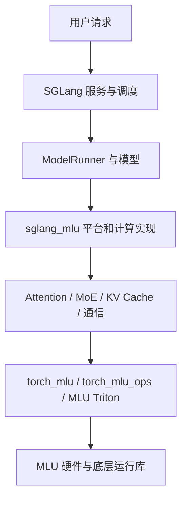
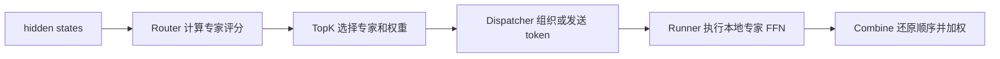
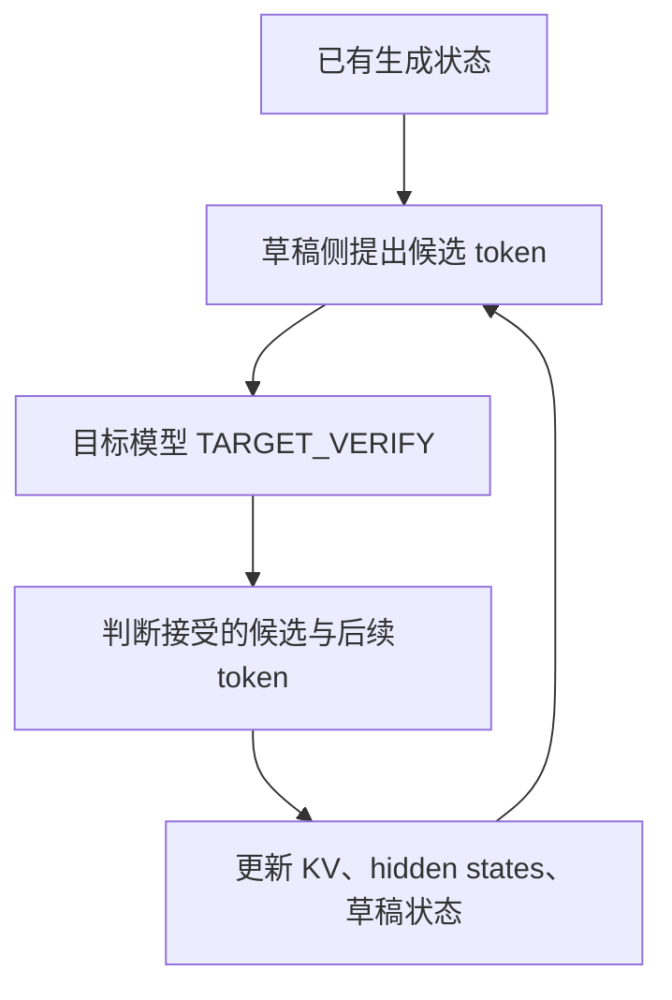

**SGLang-MLU 内部结构详解与源码阅读指南**

分析日期：2026-09-09。分析对象：`/projs/solutionsdk/mahao/backup/sglang-mlu-welm-backup/`。

本文以该目录中的实际源码为依据，覆盖整个 `python/sglang_mlu/` 包。目标是解释每部分“是什么、包含什么、为什么需要、怎样连接到其他部分”，并提供可跟读的入口。本文分析推理运行时代码，不涉及模型训练。

版本基线：仓库 HEAD 为 `520cb75aa7450f51dafc99e48c7ba7032eeb3696`；分析时 `models/welmv4.py` 和 `models/welm_perf_opt.py` 有本地修改，本文包含这些修改后的工作区内容。主框架安装默认版本由 `scripts/sglang_ref.sh` 指定，为 `12e90632d2`；README 中的旧版本描述与它不同，实际运行应以安装后的源码为准。

文中的示意流程用于说明职责；不同模型、并行配置、前向模式和图执行分支会改变具体路径。源码链接使用分析环境中的绝对路径；将本文下载到另一台电脑后，可以按文中给出的相对路径在对应 checkout 中定位。Mermaid 图需要支持 Mermaid 的 Markdown 阅读器；每个图的关键关系也在正文或文本流程中解释。

阅读导航：

- [1. 项目定位与依赖边界](#part-01)
- [2. 必须先认识的术语](#part-02)
- [3. 仓库目录与安装结构](#part-03)
- [4. 插件如何被发现和加载](#part-04)
- [5. 平台、设备和配置](#part-05)
- [6. 请求、batch 和数据结构](#part-06)
- [7. WeLM 模型类与前向流程](#part-07)
- [8. Attention 后端](#part-08)
- [9. KV Cache 与内存管理](#part-09)
- [10. MoE：选择、分发、计算、合并](#part-10)
- [11. TopK、padding 与 direct 路径](#part-11)
- [12. SmoothQuant 与权重加载](#part-12)
- [13. 分布式通信与 Tensor 布局](#part-13)
- [14. 模型执行与 MLU Graph](#part-14)
- [15. Speculative / EAGLE / MTP](#part-15)
- [16. WeLM 专用优化与辅助模块](#part-16)
- [17. 配置之间的关系和当前实现边界](#part-17)
- [18. 测试、排查与阅读顺序](#part-18)
- [19. 全部 Python 文件职责索引](#part-19)
- [20. 关键类和函数定位表](#part-20)

<a id="part-01"></a>

**1. 项目定位：它为 SGLang 提供 MLU 后端。** SGLang 主框架负责服务接口、请求调度、batch 构建和模型执行组织；当前仓库通过平台接口、注册表和 hook，提供 MLU 需要的实现。

完整运行系统可以拆成四层：

| 层次 | 内容 | 主要职责 |
|---|---|---|
| 服务与调度 | SGLang 的 HTTP 服务、Tokenizer、Scheduler、worker | 把请求转成可执行 batch，持续推进生成，返回结果 |
| 模型与后端适配 | `sglang_mlu` | 选择 MLU 组件、组织计算参数、实现模型特殊逻辑 |
| 设备计算接口 | PyTorch、`torch_mlu`、`torch_mlu_ops`、MLU Triton | Tensor 运算、设备管理、专用算子、kernel 编译与启动 |
| 硬件运行环境 | MLU、运行时、算子库、CNCL/CNCLEP 等 | 实际计算、内存操作、多卡数据传输 |



阅读时要区分 `sglang.srt...` 和 `sglang_mlu.srt...` 两种导入。前者来自主框架，后者来自当前插件。一个本地类可以继承主框架类，只覆盖几个方法；其余方法仍在主框架中执行。

**实际行为由“主框架 checkout + 主框架补丁 + 本插件 + 依赖版本 + 配置”共同决定。** 只阅读插件目录，可以理解 MLU 适配层；要跟踪完整 Scheduler 或 `ModelRunner.forward()`，还需要进入实际安装的主框架源码。

<a id="part-02"></a>

**2. 术语先与具体数据对应起来。** 下表是阅读这个项目最常用的概念。

| 术语 | 直观含义 | 在代码里通常表现为什么 |
|---|---|---|
| token | 分词后的一个整数单位 | `input_ids` 中的整数 |
| hidden states | 每个 token 在某层的向量表示 | 常见形状 `[N, H]` |
| logits | 未归一化的评分 | 词表 logits 为 `[N, V]`；router logits 为 `[N, E]` |
| prefill / extend | 为新输入的一段 token 计算模型状态 | `EXTEND`、`extend_seq_lens` 等 |
| decode | 利用已有缓存继续生成 | 通常每请求本轮输入一个 token |
| batch | 本轮一起处理的请求及 token | `ScheduleBatch`、`ForwardBatch` |
| KV Cache | 已算出的历史 Key/Value | KV pool 中的分页 Tensor |
| MoE | 每个 token 只选择部分专家 FFN 计算 | Router、TopK、experts |
| Router | 为专家计算评分的模块 | gate 投影、`router_logits` |
| top-k | 选择评分靠前的 k 项 | 在 MoE 和 speculative 中含义不同 |
| FFN / MLP | Transformer 中的前馈网络 | gate/up/down 投影和激活 |
| kernel | 在设备上执行的计算程序 | `torch_mlu_ops.*` 或 Triton JIT 函数 |
| backend | 某一类计算或功能的具体实现 | attention backend、MoE runner backend |
| OOT | out-of-tree，独立于主框架源码维护的扩展 | `MluSRTPlatform`、`register_oot_forward` |
| rank | 分布式进程在某通信组中的编号 | `tp_rank`、`moe_ep_rank` |
| padding | 为对齐长度或图形状而补出的无效位置 | 额外 Tensor 行、非有效 token 计数 |
| capture / replay | 记录固定形状计算，再反复执行 | MLU Graph |

本文使用：`N` 表示本次计算的 token 行数，`H` 表示 hidden size，`E` 表示专家数，`K` 表示每 token 选出的专家数，`V` 表示词表大小。`N` 可能包含 padding；它也不必等于请求数。

例如，3 个请求各有 4 个待验证 token，目标模型可能需要处理 12 行 token；图 bucket 和并行切分可能进一步改变某个局部 Tensor 的行数。

<a id="part-03"></a>

**3. 仓库外层把运行代码、环境安装、测试和说明分开存放。** 先知道哪些文件参与推理，哪些服务于开发和验证。

```text
sglang-mlu-welm-backup/
├── python/
│   ├── pyproject.toml              包定义与插件入口
│   ├── sglang_mlu/                 核心 Python 代码
│   └── sglang_mlu.egg-info/         安装时生成的包元数据
├── scripts/
│   ├── install_dependencies.sh     安装/配置底层依赖
│   ├── install_sglang.sh           获取主框架并应用补丁
│   ├── install_sglang_mlu.sh       安装当前插件
│   ├── sglang_ref.sh               主框架默认版本
│   ├── sglang.patch                主框架配套修改
│   ├── install_mooncake_mlu.sh     PD 分离传输依赖安装
│   ├── mooncake.patch              Mooncake 配套修改
│   ├── mlu/                       环境与依赖版本配置
│   ├── ci/                        持续集成脚本
│   └── welm*.py                   WeLM 验证与性能脚本
├── test/                          测试用例
├── benchmarks/                    性能测试与结果
├── docs/                          使用、适配与版本文档
├── server.sh                      一套具体服务启动配置
├── README.md                      安装和使用入口
├── AGENTS.md / CLAUDE.md           开发协作约定
└── .claude/                       开发辅助资源
```

核心目录是 `python/sglang_mlu/srt/`。`srt` 是运行时部分；目录结构沿用了主框架中的许多名称，方便按职责对应适配。

`scripts/sglang.patch` 会修改主框架的 speculative、batch、graph runner、平台、缓存等文件。它是实际实现的一部分，不应只当成历史记录。`install_sglang.sh` 会先检查补丁兼容性，再应用补丁。

`pyproject.toml` 当前直接声明的 Python 依赖较少，底层 PyTorch/MLU 环境主要由容器和安装脚本提供。因此，单看这个文件不足以还原全部运行依赖。

`__pycache__`、`.pyc`、`.egg-info` 属于生成物，初次阅读可以跳过。`AGENTS.md` 和开发脚本提供协作约定，本身不参与模型前向计算。

<a id="part-04"></a>

**4. 插件加载的关键，是把主框架中的调用连接到本地实现。** 第一组入口位于 [pyproject.toml](/projs/solutionsdk/mahao/backup/sglang-mlu-welm-backup/python/pyproject.toml) 与 [sglang_mlu/__init__.py](/projs/solutionsdk/mahao/backup/sglang-mlu-welm-backup/python/sglang_mlu/__init__.py)。

```toml
[project.entry-points."sglang.srt.platforms"]
mlu_device = "sglang_mlu:activate"

[project.entry-points."sglang.srt.plugins"]
mlu_plugin = "sglang_mlu:register"
```

`activate()` 检查 `torch.mlu` 和设备可用性，返回 `MluSRTPlatform` 的类路径。`register()` 注册 CLI backend 选项，并导入各适配模块。平台的 `init_backend()` 也通过主框架 `load_plugins()` 接入插件生命周期。

这些 `import` 具有注册副作用：模块导入会执行注册语句或装饰器，将实现放入框架的注册表；模型 Tensor 和权重则在后续实例化、加载阶段处理。

项目中有四类值得辨认的连接方式：

| 方式 | 代码形式 | 解决的问题 |
|---|---|---|
| 平台工厂接口 | `get_mha_kv_pool_cls()` 等 | 框架应创建哪一个平台组件 |
| 算子平台注册 | `MultiPlatformOp.register_oot_forward(...)` | 同一个算子在 MLU 上应调用哪个 forward |
| 功能注册表 | attention registry、ModelRegistry、融合 runner 注册 | 一个名称或配置应映射到哪个实现 |
| hook | `@plugin_hook("目标路径", type=...)` | 原框架尚无专用平台入口时，替换或包装指定行为 |

hook 常见类型：`REPLACE` 替换目标；`AROUND` 包装目标并可调用 `original_fn`；`AFTER` 在原逻辑完成后追加操作。

以 TopK 为例，[layers/__init__.py](/projs/solutionsdk/mahao/backup/sglang-mlu-welm-backup/python/sglang_mlu/srt/layers/__init__.py) 定义 `FusedTopK` 并注册：

```python
MultiPlatformOp.register_oot_forward(TopK, FusedTopK.forward, "mlu")
```

于是模型中的 `self.topk(...)` 会通过平台分发进入 `FusedTopK.forward()`，再调用本地 `moe/topk.py` 的 `fused_topk()`。模型文件中的 `TopK` 可以仍然从 `sglang.srt` 导入。

```text
模型调用主框架 TopK
    → 平台 dispatch key 为 mlu
    → 本地 FusedTopK.forward
    → 本地 fused_topk
    → 普通、分组或自定义路由
```

阅读一个实现时，应同时找到“实现函数”和“注册位置”。另外，`moe_runner/backend.py` 当前还包含动态扩展 backend enum 的兼容逻辑，说明实际接入机制并不完全局限于普通注册表。

<a id="part-05"></a>

**5. 平台与设备层定义运行能力，配置层保证所选组合能落到可用实现。** 核心类是 [MluSRTPlatform](/projs/solutionsdk/mahao/backup/sglang-mlu-welm-backup/python/sglang_mlu/srt/platform/platform.py) 和 [MluDeviceMixin](/projs/solutionsdk/mahao/backup/sglang-mlu-welm-backup/python/sglang_mlu/srt/platform/device.py)。

| 组件 | 内容 | 与其他组件的关系 |
|---|---|---|
| `MluSRTPlatform` | 平台名、默认 attention、KV pool、allocator、graph runner 工厂、能力声明 | 被主框架查询，用来选择具体类 |
| `MluDeviceMixin` | 设置设备、查询显存、同步、清缓存、获取通信 backend | 将设备操作接到 `torch.mlu`，通信 backend 为 `cncl` |
| `configs/device_config.py` | 构建设备配置，使用 `torch.device("mlu")` | 通过 hook 适配主框架 DeviceConfig |
| `server_args.py` | 注册 backend 名、规范化配置、检查功能组合 | 与模型配置、量化配置和平台默认值一起决定执行路径 |

当前平台会把 attention、prefill attention、decode attention backend 设为 `mlu`；未指定 page size 时默认 16；禁用主框架 custom all-reduce，并在启用 hierarchical cache 时关闭该功能。

框架获取的主要类如下：

```text
MHA KV pool   → MLUMHATokenToKVPool
MLA KV pool   → MLUMLATokenToKVPool
分页分配器    → MLUPagedTokenToKVPoolAllocator
Graph runner  → DecodeMluGraphRunner
算子分发 key  → "mlu"
```

平台的 `supports_swa_cache()` 返回 False，指其声明的上游 SWA-aware prefix cache 能力；模型和 attention 中仍有滑动窗口、WeLM hybrid SWA 相关处理，不能把这一返回值扩大解释为所有滑窗计算都不存在。

<a id="part-06"></a>

**6. 请求在进入模型之前，会转换成不同层次的 batch。** 完整调度逻辑主要在主框架，当前插件保留或补充 MLU 所需的元数据。

```text
用户文本
  → 分词得到 token IDs
  → Scheduler 选择本轮执行的请求
  → ScheduleBatch
  → ModelWorkerBatch
  → ForwardBatch
  → ModelRunner / 模型 / Attention / MoE
```

| 数据结构 | 它表示什么 | 常见内容或使用者 |
|---|---|---|
| `ScheduleBatch` | 调度器管理的一组请求 | 请求列表、生成状态、缓存与调度信息 |
| `ModelWorkerBatch` | 交给模型 worker 的执行描述 | 本轮输入及必要的请求元数据 |
| `ForwardBatch` | 一次设备前向的上下文 | 输入、位置、长度、KV 位置、forward mode、spec_info 等 |
| attention `ForwardMetadata` | 注意力 kernel 需要的索引与长度描述 | 页表、累计长度、最大长度、mixed 拆分计划 |
| `StandardTopKOutput` | MoE 路由结果 | 专家编号、权重、router logits |
| `DispatchOutput` | 已组织好的专家输入及附带信息 | token Tensor、scale、专家计数、通信状态 |
| `CombineInput` | 准备恢复为 token 输出的专家结果 | 专家输出及必要的还原信息 |

`ForwardBatch` 中值得首先认识的字段：

| 字段 | 作用 |
|---|---|
| `input_ids` | 本轮处理的 token ID |
| `positions` | token 在序列中的位置，RoPE 等操作需要它 |
| `batch_size` | 请求数量；不总等于 token 行数 |
| `forward_mode` | 本轮是 prefill、decode、verify 等哪类计算 |
| `seq_lens` | 各请求的上下文长度；不同模式有不同更新语义 |
| `req_pool_indices` | 请求在请求池中的索引 |
| `out_cache_loc` | 本轮新 K/V 应写入的缓存位置 |
| `num_token_non_padded` | 某一视图中的有效 token 数，用于 padding 处理 |
| `spec_info` | speculative 相关信息，如候选 token、隐藏状态等 |
| `attn_backend` | 本轮采用的 attention 实例 |

[managers/schedule_batch.py](/projs/solutionsdk/mahao/backup/sglang-mlu-welm-backup/python/sglang_mlu/srt/managers/schedule_batch.py) 通过 hook 保留 mixed batch 的 decode 请求索引，并将 WeLM KV mirror 的部分 host 元数据从调度 batch 传到 `ForwardBatch`。如果这些元数据在转换中丢失，attention 即使收到正确的 Tensor，也可能使用错误的行范围。

<a id="part-07"></a>

**7. 模型层把多个计算组件组织成完整的 WeLM 前向。** [models/__init__.py](/projs/solutionsdk/mahao/backup/sglang-mlu-welm-backup/python/sglang_mlu/srt/models/__init__.py) 将 WeLM 文本与多模态架构注册为本地实现；其他模型适配通过导入相应模块安装。

主要实现位于 [models/welmv4.py](/projs/solutionsdk/mahao/backup/sglang-mlu-welm-backup/python/sglang_mlu/srt/models/welmv4.py)：

```text
WeLMV4MoeForCausalLM
│  对外模型接口、输出处理、权重加载
└── Qwen2MoeModel
    │  输入 embedding、decoder 层堆叠、最终归一化
    └── Qwen2MoeDecoderLayer × 层数
        ├── Qwen2MoeAttention
        ├── Qwen2MoeSparseMoeBlock 或相应 dense MLP
        ├── 归一化与残差处理
        └── LayerCommunicator 与相关布局对象
```

`Qwen2Moe...` 是这里沿用的实现类名。判断模型架构应结合模型注册、配置和具体实现，不能仅凭类名前缀。

| 类或函数 | 主要内容 | 阅读重点 |
|---|---|---|
| `WeLMV4MoeForCausalLM` | 模型接口、forward、量化/并行适配、load_weights | 模型怎样被构造、怎样返回输出 |
| `Qwen2MoeModel` | embedding 与 decoder stack | hidden states 怎样经过所有层 |
| `Qwen2MoeDecoderLayer` | 一层中的 attention、MLP、residual、通信 | 各组件的调用次序和 Tensor 布局 |
| `Qwen2MoeAttention` | attention 投影和 WeLM 专用逻辑，部分行为继承上游 | Q/K/V 的产生和 backend 调用 |
| `Qwen2MoeSparseMoeBlock` | gate、TopK、专家、共享专家 | 从 router logits 到 MoE 输出 |
| `StandardQkvProjection` | QKV 投影的适配封装 | 输入输出及权重布局 |
| `W8A8MultiBankKvMirrorProjection` 等 | W8A8 KV mirror 投影路径 | 多组 KV、量化投影和镜像配置 |
| `expert_bias_routing` | WeLM 专家 bias 路由 | 选择用的评分与输出权重的关系 |

以简化 decoder 层为例，数据流可以写成：

```text
hidden_states + residual
    → norm / QKV projection / RoPE
    → Attention 与 KV Cache
    → output projection / residual / norm
    → 调整为 MoE 所需的 token 布局
    → Router / TopK / 专家 FFN / 共享专家
    → 输出通信和残差处理
    → 下一层
```

这只是职责示意。WeLM 的融合 norm、KV mirror、token-owner、contracted token 和并行分支会重排或合并其中一些步骤。阅读 `Qwen2MoeDecoderLayer.forward()` 时，建议同时记录每一步的 token 行数、hidden 维度、dtype 和所在 rank 的视图。

该文件同时承担较多权重加载职责。`load_weights()` 会处理 checkpoint 参数名、融合权重、专家参数、量化参数和并行切分。只有前向代码与加载布局一致，底层矩阵计算才会得到正确输入。

<a id="part-08"></a>

**8. Attention backend 负责把模型给出的 Q/K/V 和 batch 信息转成 MLU 注意力计算。** 它的职责包括路径选择、元数据构造、缓存读写和算子调用。

[attention_registry.py](/projs/solutionsdk/mahao/backup/sglang-mlu-welm-backup/python/sglang_mlu/srt/layers/attention/attention_registry.py) 将名称 `mlu` 注册为一个工厂，根据 `runner.use_mla_backend` 创建 `MLUAttnBackend` 或 `MLUMLABackend`。

| 文件 | 内容与作用 |
|---|---|
| `mlu_backend.py` | 常规 MHA/GQA 等路径；构建 metadata，并实现 extend、decode、mixed 和 cached query 等计算 |
| `mlu_mla_backend.py` | MLA 缓存和计算，含 absorb、MHA one-shot/chunked KV 等路径 |
| `mla_attention_backend_handler.py` | 为 MLA 模型决定本轮采用哪种 attention forward method |
| `mlu_attention_utils.py` | 草稿长度、verify 支持条件和页表范围等共用逻辑 |
| `merge_state.py` | 合并分块 attention 输出，使用 LSE 加权保证正确归一化 |
| `multi_step_backend.py` | 管理多个草稿步骤对应的 attention backend 和元数据 |

阅读时按“两步”跟踪：先找 `init_forward_metadata*()`，看输入长度和页表如何产生；再找 `forward*()`，看哪些算子使用这些数据。

`ForwardMetadata` 中重要字段：

| 字段 | 解释 |
|---|---|
| `cu_seqlens_q` | 各请求 Query 在拼接 Tensor 中的边界 |
| `cu_seqlens_kv` | 各请求 KV 的累计长度信息 |
| `max_seq_len_q/kv` | 当前请求组的长度上限 |
| `block_tables` | 请求到 KV 页的索引表 |
| `seq_lens` | Attention 实际使用的各请求长度 |
| `mixed_dense_plan` / `mixed_contracted_plan` | mixed batch 在不同 token 视图下的执行计划 |

举例：请求 A 有 3 个 Q token，请求 B 有 2 个 Q token，则可把输入拼成 5 行，累计边界为 `[0, 3, 5]`。这让 kernel 知道第 0～2 行属于 A，第 3～4 行属于 B。

各模式为什么需要不同处理：

- 无缓存 prefill：大量新 Q/K/V 可以一起计算。
- 有缓存前缀的 extend：新 Q 需要访问旧缓存与新写入的 K/V。
- decode：通常只有少量新 Q，但需要访问不断变长的历史 KV。
- mixed：同一 batch 同时有 prefill 与 decode，需要拆分和恢复正确顺序。
- target verify：每请求有多个候选 token，需要匹配候选长度及可见范围。

MLA 还存在表示转换问题。模型存储压缩后的 KV 表示，但某些 prefill 路径使用 MHA 形式执行。`mla_attention_backend_handler.py` 会结合 prefix 长度和容量选择 MHA、MLA、MHA one-shot 或 chunked KV。

`merge_state.py` 解决分块后的归一化：分别计算两个 KV 块后，不能简单把两个 attention 输出相加。需要结合各块的 log-sum-exp（LSE）信息，恢复完整 softmax 对应的加权结果。

<a id="part-09"></a>

**9. KV Cache 的分配和存储由不同组件承担。** [allocator.py](/projs/solutionsdk/mahao/backup/sglang-mlu-welm-backup/python/sglang_mlu/srt/mem_cache/allocator.py) 决定使用哪些空闲位置，[memory_pool.py](/projs/solutionsdk/mahao/backup/sglang-mlu-welm-backup/python/sglang_mlu/srt/mem_cache/memory_pool.py) 保存这些位置上的数据。

```text
新 token 需要缓存
    → alloc_extend / alloc_decode 分配位置
    → forward_batch.out_cache_loc 携带位置
    → 模型计算新 K/V
    → set_kv_buffer 写入
    → Attention 根据请求页表读取历史 K/V
```

常规 MHA 缓存使用分别存放的 K/V Tensor，整体维度为：

```text
[layer, page, head, token_in_page, head_dim]
```

| 维度 | 含义 |
|---|---|
| layer | 哪个 attention 层 |
| page | 缓存页编号 |
| head | 当前 rank 的 KV head |
| token_in_page | token 在页内的位置 |
| head_dim | 每个 head 的向量长度 |

当前实现还分配额外页以承接 graph padding 写入。写入位置会转换为 MLU 算子接受的 slot mapping。KV 搬移要考虑分页布局，不能假设上游线性布局的复制逻辑直接适用。

`MLUMLATokenToKVPool` 存储组合后的 MLA KV 表示，并提供读取、拆分 NOPE/RoPE 相关数据的接口。它与常规 MHA 的两块 K/V 缓存存在结构区别。

INT8 KV 支持涉及三部分：`kv_cache_int8_names.py` 统一名称；`kv_cache_int8.py` 适配 CLI、dtype 和缓存容量估算；`memory_pool.py` 实现数据与 scale 的存储。只改 dtype 而不改容量计算和 scale 布局，会使分配与 kernel 的理解不一致。

当前 INT8 KV 的校验限定于已支持的 WeLM W8A8 MHA 配置，并限制 page size、head dim、SWA/speculative 等组合。此处描述的是当前代码的准入条件，不代表所有 MLU 硬件都具有相同限制。

<a id="part-10"></a>

**10. MoE 把“一个 token 经过哪个 FFN”变成动态选择。** 一个有 E 个专家的 MoE 层通常只为每个 token 执行 K 个专家，K 小于 E。



一个示意例子：

```text
token A → 专家 2、5，权重 0.7、0.3
token B → 专家 1、5，权重 0.6、0.4

专家 1 输入：[B]
专家 2 输入：[A]
专家 5 输入：[A, B]

A 的输出：0.7 × expert2(A) + 0.3 × expert5(A)
B 的输出：0.6 × expert1(B) + 0.4 × expert5(B)
```

在存在共享专家、额外缩放和残差时，还会加入相应结果。上述例子只展示 routed experts 部分。

文件分工如下：

| 文件 | 包含的内容 | 发挥的作用 |
|---|---|---|
| `moe/topk.py` | 选专家、编号映射、padding/direct 策略 | 产生路由 |
| `moe/direct_topk.py` | 开关和 Tensor 属性标记 | 传递路由可以直接使用的信息 |
| `moe/padded_topk.py` | padding 路由合法化 | 保证 MLU kernel 收到合法 expert IDs |
| `moe/token_dispatcher/mlu_all2all.py` | state、buffer、dispatch、combine | 执行 MLU all2all 数据组织和传输 |
| `moe_runner/backend.py` | backend enum 与融合 key | 让主框架识别 MLU runner/a2a |
| `moe_runner/integration.py` | FusedMoE 和 MoeRunner hooks | 装配 dispatcher 与 runner |
| `moe_runner/standard.py` | standard 路径融合执行 | 输入展开、专家 GEMM、激活和本地加权合并 |
| `moe_runner/all2all.py` | all2all 分发后的专家计算 | 对已接收的本地专家输入执行 FFN |
| `moe_runner/weight_loader.py` | 量化专家权重加载 | 正确处理 expert、TP 分片、scale 和 smooth |

两个主要融合注册 key 是 `("none", "mlu")` 和 `("mlu", "mlu")`，分别表示 a2a backend 与 runner backend 的组合。

**standard 路径的示意调用链**：

```text
Qwen2MoeSparseMoeBlock.forward
    → gate / 自定义 router
    → TopK → FusedTopK.forward → fused_topk
    → self.experts(hidden_states, topk_output)
    → FusedMoE 的 dispatcher / quant_method / runner
    → fused_experts_standard
    → moe_gen_idx
    → moe_expand_input 或 moe_quantize
    → group_gemm 或 smooth_quant_group_gemm
    → 激活 / 第二次 GEMM
    → moe_combine_result
```

融合实现会把概念上的多个步骤放在一个 runner 中。跨 rank 的最终归约还要结合模型、dispatcher 和 communicator 的配置判断。

**all2all 路径**首先把 token 送到持有所选专家的 rank，再执行专家计算，之后返回结果。`MluAll2AllState` 保存 handle、容量和通信缓冲区，`MluAll2AllDispatchOutput` 携带专家输入、计数、还原索引、原始形状等信息。

`MluAll2AllDispatchOutput.format` 当前返回 `STANDARD` 是为了满足主框架协议；对象真实包含 all2all state。判断实际通信路径应看 dispatcher 类和分支，不宜只看这个枚举。

<a id="part-11"></a>

**11. TopK 同时负责选专家和路由结果的后处理。** [moe/topk.py](/projs/solutionsdk/mahao/backup/sglang-mlu-welm-backup/python/sglang_mlu/srt/layers/moe/topk.py) 的入口是 `fused_topk()`。

| 输入或输出 | 常见形状 | 作用 |
|---|---|---|
| `hidden_states` | `[N, H]` | token 的输入特征；自定义路由可能使用 |
| `router_logits` | `[N, E]` | 每个 token 对各专家的评分，通常由上游 gate 算出 |
| `topk_config` | 配置对象 | K、分组、归一化、scoring、bias 等 |
| `num_token_non_padded` | Tensor 或 None | 当前路由视图中的有效 token 数 |
| `expert_location_dispatch_info` | 对象或 None | 逻辑/物理专家映射所需信息 |
| `topk_ids` | `[N, K]` | 选中的专家编号，统一为 int32 |
| `topk_weights` | `[N, K]` | 下游合并专家输出的权重 |

主要处理次序：

1. 对 router logits 和 correction bias 做专家分布相关输入变换。
2. 优先判断 grouped top-k；其次自定义 routing；否则普通 top-k。
3. 若启用专家选择采集，记录选择结果。
4. 将逻辑专家编号转换为物理编号，并转为 int32。
5. 判断 direct 准入；打标，或者清标并处理 padding。
6. 调用分布 recorder，返回 `StandardTopKOutput`。

普通路径只支持 softmax，且不接受 correction bias。`renormalize=True` 时先对 logits 取 top-k，再对选出的 logits 做 softmax；False 时对全部 logits 做 softmax 后取 top-k。分组路径调用 `moe_sigmoid_topk` 或 `moe_softmax_topk`，并传递分组、选组、bias 和 scale 信息。当前 correction bias 分支使用 sigmoid 路径，应按代码判断而不能只看配置的默认 scoring 名称。

padding 的问题来自 kernel 对专家编号的要求。主框架可能用 `-1` 表示无效 token 路由，而 MLU MoE 需要 `[0, E)` 范围的编号。[padded_topk.py](/projs/solutionsdk/mahao/backup/sglang-mlu-welm-backup/python/sglang_mlu/srt/layers/moe/padded_topk.py) 会生成合法替代 ID，把无效路由的权重置零，并把整行无效 token 的 hidden states 置零。

```text
路由中存在 -1
    → 生成合法替代 expert ID
    → 对应权重置 0
    → 整行无效时 hidden states 也置 0
    → 交给 MLU MoE
```

direct 路径使用 `_sglang_mlu_direct_moe_topk` 这个 Python Tensor 属性，告诉下游可以跳过 sanitize。它本身不改变专家选择算法，也不是一个新的专家 GEMM backend。标记记录的是代码对来源的信任，不是对每个 ID 进行扫描验证后得到的检查结果。

当前 direct 总条件是：

```python
direct_moe_topk_enabled()
and _forward_allows_direct_routes(num_token_non_padded)
and _is_noop_recorder(recorder)
```

`SGLANG_MLU_MOE_DIRECT_TOPK` 默认开启。当前模式准入为：

| 前向模式 | `_forward_allows_direct_routes` 的条件 |
|---|---|
| `DECODE` | 全局 `get_is_extend_in_batch()` 明确为 False |
| `MIXED` | 不在 piecewise / breakable graph 上下文 |
| `EXTEND` | padding 参数为 None，且不在上述两种 graph 上下文 |
| `TARGET_VERIFY` | 不放行 |
| `DRAFT_EXTEND` | 不放行 |
| `DRAFT_EXTEND_V2` | 不放行 |
| 无当前 ForwardBatch | 不放行 |

普通完整 decode/verify graph 与 piecewise/breakable graph 不是同一个检测上下文；不能把表中的 graph 限制解释为所有图执行都被拒绝。

关于前面讨论的 speculative 优化：当前 WeLM standard EP 常规路由分支给 TopK 的 padding 参数为 None。若收到的 IDs 全部合法，sanitize 对这三组数据是恒等变换，因此有省去开销的空间；但当前模式白名单仍拒绝 verify/draft extend。此前的 CPU 诊断确认了模式拒绝，并在 8 组 FP32/BF16 合法路由数据上验证 sanitize 前后相同。这不等于已经验证 MLU 整模精度和性能。

后续修改还要核对：MK router 是否绕过 `fused_topk`，token-owner gather 后是否丢失标记，是否存在 `-1`，recorder 是否需要正确 padding 统计，以及 graph 是否重新 capture。本文记录当前代码和优化依据，未实施该修改。

<a id="part-12"></a>

**12. 量化层把 checkpoint 参数变成可以执行的矩阵计算。** 当前通用 SmoothQuant 代码包含 W8A8/W4A8 的 Linear 与 MoE 方法；WeLM 的模型配置校验进一步限定其接受的量化组合。

```text
SmoothQuantConfig
    ├── LinearBase → W8A8 / W4A8 LinearMethod
    └── FusedMoE  → W8A8 / W4A8 FusedMoEMethod
```

W8A8 表示 8 bit 权重和 8 bit 激活计算路径；W4A8 表示 4 bit 权重和 8 bit 激活。量化结果如何恢复尺度，需要对应的 scale。`smooth` 保存 SmoothQuant 相关的平滑系数。

生命周期应顺着下面阅读：

```text
配置解析
    → create_weights 创建参数容器
    → weight loader 装入 checkpoint 分片
    → process_weights_after_loading 调整布局
    → apply 执行前向
```

| 参数 | 含义 |
|---|---|
| `qweight` | 量化 Linear 权重 |
| `per_channel_scale` | 权重通道/相关粒度的尺度信息 |
| `smooth` | 输入平滑系数 |
| `w13_qweight` | 专家 gate/up 投影的融合量化权重 |
| `w2_qweight` | 专家 down 投影量化权重 |
| `w13_smooth` / `w2_smooth` | 专家两段计算各自使用的系数 |

Linear 的常规量化路径执行 `scaled_quantize` 和 `scaled_matmul`。MoE 的量化路径结合路由后的输入执行 `moe_quantize` 和 `smooth_quant_group_gemm`。

`moe_runner/weight_loader.py` 特别处理 `w1/w2/w3`、TP 分片、smooth 和 per-channel/groupwise scale。例如 down 投影的 scale 可能需要按当前 MoE TP rank 切片；在 checkpoint 中看起来只是一个 scale Tensor，加载后却必须和本地权重分片严格对应。

W4A8 代码使用打包表示，一个字节容纳两个 4 bit 权重，因此权重 Tensor 的某个维度会缩小。不要将打包后的 Tensor 形状直接解释为原始矩阵尺寸。

`models/welm_quantization.py` 会检查 checkpoint、model config、CLI 三处配置是否冲突。当前 WeLM 量化配置接受 SmoothQuant W8A8、per-token 激活；通用目录里存在 W4A8 类，并不表示当前 WeLM 模型准入也支持 W4A8。

<a id="part-13"></a>

**13. 多卡部分同时管理通信组和 Tensor 分布方式。** `distributed/` 提供通信操作，`layers/communicator.py` 决定层边界怎样转换布局。

| 并行方式 | 切分对象 | 一个示意例子 |
|---|---|---|
| TP | 一层矩阵或 head 的计算 | 两个 rank 各算一部分投影输出 |
| EP | 专家集合 | rank 0 持有专家 0～3，rank 1 持有专家 4～7 |
| Attention DP | attention 侧请求/token 工作份额 | 两组 attention rank 分别处理不同请求 |

实际组合还可能涉及 MoE TP、MoE DP 等通信组，不能把所有 `tp_size` 看作同一个值。

常用 collective：

| 操作 | 作用 |
|---|---|
| all-reduce | 对相应位置的值归约，并让参与 rank 得到结果 |
| all-gather | 收集各 rank 的分片 |
| reduce-scatter | 归约后，每个 rank 保留对应分片 |
| all-gatherv | 收集长度不同的分片；当前 MLU wrapper 可通过 padding、gather、裁剪实现 |
| MoE all2all | 按专家归属交换 token 及相关结果 |

布局名要与通信上下文一起理解：`FULL` 是对应范围内的完整 token 视图，`SCATTERED` 是 token 分片，`TP_ATTN_FULL` 是 attention TP 对应的视图约定。它们不直接表示数据是否位于一张物理卡。

`layers/communicator.py` 在 MLU all2all 的运行时分支中，可以把非 decode 批次恢复为 standard EP 所需的 FULL 输入，并在输出侧调整回周围 attention 的布局。dispatcher 是否走 all2all 还取决于 `get_is_extend_in_batch()` 和当前 mode，不能只凭类名或 CLI 参数判断某一轮的路径。

本地有效 token 数的一个示意：全局 Tensor 有 8 行，其中前 6 行有效；两个 TP rank 各持有连续 4 行。rank 0 有效 4 行，rank 1 有效 2 行。把全局的 6 直接用于 rank 1 的 4 行 Tensor 会漏掉 padding。`_maybe_local_num_token_non_padded()` 就是在特定 MLU a2a/TP 条件下转换这类计数。

<a id="part-14"></a>

**14. Graph 复用固定形状的计算流程，减少重复的执行组织开销。** 当前 [model_executor/model_runner.py](/projs/solutionsdk/mahao/backup/sglang-mlu-welm-backup/python/sglang_mlu/srt/model_executor/model_runner.py) 主要注册 MLU capability allowlist；完整 ModelRunner 主体在主框架中。

本地 [DecodeMluGraphRunner](/projs/solutionsdk/mahao/backup/sglang-mlu-welm-backup/python/sglang_mlu/srt/model_executor/graph_runner.py) 继承上游 `CudaGraphRunner`，覆盖设备 graph 创建、capture、部分输入准备和元数据处理。

```text
初始化模型、缓存和静态缓冲区
    → 按 bucket 预热
    → torch.mlu.graph 捕获
    → 复制本轮输入到静态 buffer
    → graph.replay()
    → 根据真实 token 数取出输出
```

假设真实请求数为 5，复用的 bucket 大小为 8，那么缓存位置、attention metadata、router 输出和最终裁剪都要正确处理多出的 3 个请求位置。若每请求验证 D 个 token，相关 token 行数还会乘以 D；实际还要结合模型内部的 token 布局调整。

此处的关键方法：`capture_one_batch_size()` 负责捕获某 bucket，`replay_prepare()` 准备本轮输入，`replay()` 重放；另外还有 WeLM OE hash 输入准备和标准 EP 元数据适配。

`CudaGraphRunner`、`cuda_graph_*` 等名称是主框架接口沿用的名称。MLU 子类实际创建 `torch.mlu.MLUGraph()`。同理，某些上游模块路径含 `fused_moe_triton`，实际专家计算仍可能通过已注册的 MLU runner 执行。

Graph capture 时执行的 Python 判断会决定被记录的算子路径。Replay 通常不重新运行这些 Python 分支。因此，改了 direct 开关或模式准入后，需要重新 capture 才能评估新的路径。

<a id="part-15"></a>

**15. Speculative 在推理循环中加入候选生成与目标验证。** EAGLE/MTP 相关模块复用主框架流程，并适配 MLU 的 attention、graph、候选验证和缓存操作。



这是概念循环。当前 WeLM 的具体路径可能把草稿生成和 extend 合并，并使用 KV mirror 等优化，不应假设每种模型都严格按独立 draft-decode、verify、draft-extend 三次调用执行。

| 模块 | 内容 | 作用 |
|---|---|---|
| `draft_utils.py` | `MLUDraftBackendFactory` | 选择 decode/draft-extend backend |
| `eagle_worker.py` | MLU worker 子类与 graph mixin | 适配 worker 生命周期和 graph 捕获 |
| `eagle_utils.py` | 线性候选树、greedy verify、采样和 cache loc hooks | 将相关辅助流程接到 MLU |
| `eagle_draft_graph_runner.py` | 草稿 graph 子类 | 用 MLU graph 承接上游草稿图流程 |
| `eagle_draft_extend_graph_runner.py` | 草稿 extend graph 子类 | 用 MLU graph 承接 extend 图流程 |
| `graph_runner_mixin.py` | MLU graph 原语 | 共用 graph 创建、同步、预热和捕获 |
| `attention/multi_step_backend.py` | 多步 attention backend 管理 | 为不同草稿步骤维护元数据 |

模式与含义：

| mode | 含义 | 影响哪些组件 |
|---|---|---|
| `DECODE` | 常规 decode 或某些草稿计算阶段 | attention、KV、graph、MoE |
| `TARGET_VERIFY` | 目标模型验证多个候选 | 候选数、可见范围、KV 长度、输出裁剪 |
| `DRAFT_EXTEND` | 扩展草稿状态 | extend 长度、接受 token、缓存位置 |
| `DRAFT_EXTEND_V2` | V2 的固定形状等草稿扩展流程 | 输出行数、元数据和图输入 |
| `IDLE` | 本 rank 无本地请求，必要时仍参加同步 | 空 Tensor、collective 和设备分配 |

当前 MLU draft backend 要求 speculative 的 top-k 为 1；EAGLE V2 的 MLU 验证调用强制使用 greedy verify。模型级准入在 `server_args.py` 中单独检查。

有两个 top-k 必须分清：

| 参数 | 选择对象 |
|---|---|
| speculative/eagle top-k | 草稿生成中的候选 token 分支 |
| MoE top-k | 一个 token 执行的专家集合 |

因此 `--speculative-eagle-topk 1` 不表示 MoE 每 token 只选择一个专家。开启 speculative 后，TopK 文件里的问题来自 forward mode 变化，而不是这两个 k 值混用。

<a id="part-16"></a>

**16. WeLM 专用代码和辅助模块补齐通用 backend 无法单独表达的行为。** 这些文件跨越 embedding、模型布局、运行预热和服务输出。

| 文件或目录 | 具体内容 | 作用 |
|---|---|---|
| `models/welm_perf_opt.py` | OE 哈希、局部 embedding、拼接、投影、融合路径选择 | 为 WeLM 输入 embedding 降低重复操作和通信开销 |
| `welm_oe_hash.py` | 注册 MLU OE hash producer | 将统一接口连接到 MLU hash 实现 |
| `welm_oe_hash_kernels.py` | decode、分段、MTP history 的哈希 kernel 与包装 | 用 token 历史生成正确的 OE 索引 |
| `models/welm_runtime.py` | 模型初始化期的 OE/门控 kernel 预热 | 减少正式推理时首次编译 |
| `models/welmv4_vlm.py` | 多模态模型与本地 WeLM 语言模型的连接 | 支持视觉输入进入语言模型计算 |
| `layers/welmv4.py` / `welmv4_op.py` | RMSNorm、残差、门控、视觉 RoPE 等融合实现 | 适配或优化 WeLM 特定计算 |
| `models/deepseek_mha.py` | MLA 模型中的 KV 展开与分块 MHA 适配 | 连接 DeepSeek 模型路径和 MLU attention |
| `models/deepseek_weight_loader.py` | 权重名称兼容、dense/quant 路径及 post-load 处理 | 正确解释 checkpoint |
| `models/moe_all2all.py` | shared expert 构造时的 TP 策略 | 让共享专家权重布局匹配 token-scattered 输入 |

OE 在此指 over-encoding 相关 embedding。代码结合当前 token 和历史 n-gram 生成索引，查找额外 embedding，再与输入表示组合。Speculative 的接受/拒绝会改变有效 token 历史，因此 hash 代码存在 MTP 初始化、verify、draft extend、draft decode 等接口。

KV mirror 涉及模型特定的 K/V 投影、缓存状态复用和 token 行选择；token-owner 相关对象描述哪些 rank 拥有哪些 token 的计算行。它们都需要和 `ForwardBatch`、attention metadata、RoPE、MoE 输入保持一致，不能只在某个独立 kernel 内理解。

其他辅助模块：

- `constrained/xgrammar_backend.py`：将语法约束的词表 bitmask 应用到 MLU logits，影响哪些词允许被采样。
- `sampling/penaltylib/min_new_tokens.py`：在生成长度达到下限前屏蔽停止 token，使用紧凑的 stop-token 元数据。
- `ray/scheduler_actor.py`：进入调度循环前选择 MLU 设备，适配 Ray 缓存的 actor 方法。
- `triton_utils/framework_kernel_warmup.py`：在运行时初始化阶段预热框架 kernel。
- `triton_utils/jit_monitor.py`：在 warmup 后监控意外的编译或 autotune，帮助定位延迟抖动。
- `utils/common.py`：设备名称、设备数、可用显存等查询适配。
- `welm_serving.py`：输出 WeLM 运行路径的基线日志；它不是完整 HTTP 服务实现。
- 包外层 `utils/gorilla.py`：随仓库保留的通用补丁工具，当前包内搜索未发现其他源码引用它，主接入链以平台接口和 `plugin_hook` 为主。

<a id="part-17"></a>

**17. 配置是多个相互配合的选择维度。** 理解这些维度，可以解释为什么“用了 MLU”仍然存在很多不同路径。

| 配置或条件 | 决定什么 | 主要实现位置 |
|---|---|---|
| `--device mlu` | 设备平台 | platform、device_config |
| attention backend | 注意力实现 | attention registry 与 backend |
| `--moe-runner-backend mlu` | 专家计算实现 | moe_runner |
| `--moe-a2a-backend none/mlu` | MoE 分发通信方式 | dispatcher、integration |
| direct topk 开关 | 是否允许省去路由清理 | direct_topk、topk、runner |
| quantization | 权重和计算的量化方法 | quantization、weight loader |
| KV cache dtype | KV 数据及 scale 的表示 | kv_cache_int8、memory_pool |
| TP / EP / DP | 权重和 token 分布 | distributed、communicator、模型 |
| graph 配置 | 捕获和重放策略 | graph runner |
| speculative 配置 | 草稿与验证流程 | worker、attention、KV、graph |
| forward mode | 本轮实际执行阶段 | ForwardBatch 及各模块分支 |

当前仓库 `server.sh` 展示的是一套 WeLM 配置：TP4、EP4、MLU runner、standard a2a、EAGLE V2、3 个 speculative steps、4 个 draft tokens。它是启动示例，不足以证明当前服务器进程就使用了这一组参数；实际部署还可能使用其他脚本或环境变量。

从当前代码能直接确认的实现边界包括：

- MLU runner 的 a2a backend 只接受 `none` 或 `mlu`；`mlu` a2a 需要匹配的 MLU runner。
- MLU all2all 的初始化要求支持的专家权重布局和 EP 条件，并拒绝 fused shared experts；外置 shared expert 有另外的适配。
- WeLM 量化校验目前接受规定的 SmoothQuant W8A8 per-token 配置。
- MLU speculative 模型级准入当前限定于代码列出的 WeLM 架构。
- MLU draft backend 的 speculative top-k 为 1，verify 使用 greedy 分支。
- INT8 KV 有额外的模型、量化、page size 和功能组合限制，当前拒绝 speculative 组合。
- 平台关闭 hierarchical cache，并声明某些上游能力暂不支持；仍需区分平台声明与模型内部的专用实现。

这些条件应该从对应 validate 函数和实际分支读取。目录中存在某个类，并不等于任意模型、精度和并行组合都能使用它。

<a id="part-18"></a>

**18. 阅读和排查时，沿着数据的生命周期逐步验证。** 对一个模块，至少回答四个问题：谁注册它、谁调用它、它接收什么布局、它输出什么布局。

建议阅读顺序：

| 阶段 | 阅读入口 | 完成标准 |
|---|---|---|
| 第一遍：入口 | pyproject、包 `__init__`、platform、layers 注册 | 能说明 SGLang 的调用为什么会进入 MLU 代码 |
| 第二遍：模型 | WeLM 顶层、Model、DecoderLayer | 能画出 hidden states 在一层中的流向 |
| 第三遍：MoE | MoE block、TopK、integration、standard runner | 能跟踪一次 token 到专家再还原的过程 |
| 第四遍：Attention/KV | backend metadata、memory pool、allocator | 能解释长度、页表、cache loc 如何对应 |
| 第五遍：并行 | group coordinator、communicator、all2all dispatcher | 能说明当前 rank 拥有哪些 token 和专家 |
| 第六遍：Graph/Spec | graph runner、draft factory、worker、verify helpers | 能解释 mode 和 padding 怎样改变执行 |
| 第七遍：性能与精度 | quantization、weight loader、WeLM 专用优化、测试 | 能把某项优化映射到实际输入输出与验证方法 |

先从 standard MoE 阅读比较集中：

```text
Qwen2MoeSparseMoeBlock.forward
    → FusedTopK.forward
    → fused_topk
    → FusedMoE 运行框架
    → fused_experts_standard
    → torch_mlu_ops
```

可以给每个节点记录一行：`mode / shape / dtype / rank / 是否含padding / 是否新Tensor`。最后一项对于 direct 标记传播尤其重要。

测试目录可以作为接口示例阅读：

| 测试范围 | 代表位置 | 适合验证什么 |
|---|---|---|
| 插件注册 | `test/registered/conftest.py` | register 和 HookRegistry 的应用方式 |
| TopK | `test/registered/layers/moe/test_topk.py` | 路由、padding、recorder、direct 准入 |
| MoE/EP | `test_mlu_all2all_ep.py`、`test_mlu_all2all_tp_ep.py` | 多卡布局、标记传播、专家计算 |
| Attention | `test/registered/layers/attention_backend/` | extend/decode/mixed/MLA/speculative metadata |
| KV Cache | `test/registered/mem_cache/` | 缓存布局、INT8 KV、graph |
| Speculative | `test/registered/speculative/` | backend 选择、worker fallback、draft graph |
| 模型与加载 | `test/registered/models/` | 模型行为、权重兼容、NextN |
| 整体服务/性能 | `test/manual/`、`benchmarks/`、WeLM 验证脚本 | 输出质量、吞吐、延迟、eager/graph 比较 |

`registered` 目录同时包含不同层次的测试，有的会启动模型或使用多卡；不能把目录名等同于“全部是轻量 CPU 单测”。本次文档生成只进行源码与文档结构检查，没有重跑整套服务测试。

按问题定位时可以参考：

| 现象 | 优先检查 |
|---|---|
| MLU 实现没有执行 | entry point、register import、平台 key、hook 目标 |
| 某模型类仍走上游 | ModelRegistry、类替换、继承方法 |
| direct 开关开了仍有 sanitize | forward mode、recorder、Tensor 属性是否传播、MK bypass |
| 某些 token 输出错误 | metadata、padding、cache loc、分片范围 |
| TP/EP 后精度错误 | 权重切分、全局/本地 ID、collective 对齐的 token 顺序 |
| eager 正常而 graph 异常 | 静态 buffer、bucket padding、capture 分支、replay 输入更新 |
| speculative 异常 | verify/draft mode、候选长度、KV 更新、OE history |
| 首次或偶发执行变慢 | kernel warmup、JIT/autotune、动态形状 |

附录的每个文件都给出职责。空 `__init__.py` 主要用于包组织，含导入语句的 `__init__.py` 则可能是重要的注册入口。

<a id="part-19"></a>

**19. 全部 Python 文件职责索引。** 以下目录以 `python/sglang_mlu/` 为相对根，按实际存在的源码生成；每个文件均有职责说明和源码链接。行数用于估计阅读规模，不代表复杂度或重要性。

本次索引共覆盖 **91 个 Python 文件**，合计 **21,277 行**（含注释、空行及随仓库保留的工具源码）。

**包根目录 的文件说明。**

| 源码文件 | 行数 | 具体内容与作用 |
|---|---:|---|
| [__init__.py](/projs/solutionsdk/mahao/backup/sglang-mlu-welm-backup/python/sglang_mlu/__init__.py) | 48 | 插件总入口。检测 MLU 可用性；activate 返回平台类路径，register 导入子模块以安装注册和 hooks。 |

**srt/configs/ 的文件说明。**

| 源码文件 | 行数 | 具体内容与作用 |
|---|---:|---|
| [srt/configs/__init__.py](/projs/solutionsdk/mahao/backup/sglang-mlu-welm-backup/python/sglang_mlu/srt/configs/__init__.py) | 0 | 包组织文件，当前为空或仅有模块说明；自身没有前向计算和注册逻辑。 |
| [srt/configs/device_config.py](/projs/solutionsdk/mahao/backup/sglang-mlu-welm-backup/python/sglang_mlu/srt/configs/device_config.py) | 15 | 替换主框架 DeviceConfig 初始化，将设备类型和 torch.device 配置为 MLU，并保留设备编号。 |

**srt/constrained/ 的文件说明。**

| 源码文件 | 行数 | 具体内容与作用 |
|---|---:|---|
| [srt/constrained/xgrammar_backend.py](/projs/solutionsdk/mahao/backup/sglang-mlu-welm-backup/python/sglang_mlu/srt/constrained/xgrammar_backend.py) | 34 | 包装 XGrammar 的词表 mask 应用入口；MLU Tensor 使用 Triton bitmask 操作，其他路径委托原实现。 |

**srt/distributed/ 的文件说明。**

| 源码文件 | 行数 | 具体内容与作用 |
|---|---:|---|
| [srt/distributed/__init__.py](/projs/solutionsdk/mahao/backup/sglang-mlu-welm-backup/python/sglang_mlu/srt/distributed/__init__.py) | 0 | 包组织文件，当前为空或仅有模块说明；自身没有前向计算和注册逻辑。 |
| [srt/distributed/parallel_state.py](/projs/solutionsdk/mahao/backup/sglang-mlu-welm-backup/python/sglang_mlu/srt/distributed/parallel_state.py) | 335 | 提供 MLUGroupCoordinator，适配世界组和模型并行组初始化、collective 行为与分布式清理。 |

**srt/distributed/device_communicators/ 的文件说明。**

| 源码文件 | 行数 | 具体内容与作用 |
|---|---:|---|
| [srt/distributed/device_communicators/__init__.py](/projs/solutionsdk/mahao/backup/sglang-mlu-welm-backup/python/sglang_mlu/srt/distributed/device_communicators/__init__.py) | 0 | 包组织文件，当前为空或仅有模块说明；自身没有前向计算和注册逻辑。 |
| [srt/distributed/device_communicators/mlu_communicator.py](/projs/solutionsdk/mahao/backup/sglang-mlu-welm-backup/python/sglang_mlu/srt/distributed/device_communicators/mlu_communicator.py) | 147 | 封装基于进程组的 all-reduce、reduce-scatter、all-gather 和 all-gatherv；变长 gather 会进行补齐、收集和裁剪。 |

**srt/ 的文件说明。**

| 源码文件 | 行数 | 具体内容与作用 |
|---|---:|---|
| [srt/kv_cache_int8.py](/projs/solutionsdk/mahao/backup/sglang-mlu-welm-backup/python/sglang_mlu/srt/kv_cache_int8.py) | 72 | 将 INT8 KV 名称接入 CLI，调整 ModelRunner 的缓存 dtype 配置和缓存 cell 大小计算，使容量与真实数据/scale 布局匹配。 |
| [srt/kv_cache_int8_names.py](/projs/solutionsdk/mahao/backup/sglang-mlu-welm-backup/python/sglang_mlu/srt/kv_cache_int8_names.py) | 10 | 定义 INT8 KV 的规范名称 int8_per_token_head 和 int8 别名，提供识别及名称规范化函数。 |
| [srt/server_args.py](/projs/solutionsdk/mahao/backup/sglang-mlu-welm-backup/python/sglang_mlu/srt/server_args.py) | 227 | 注册 MLU backend CLI choices，规范化 MoE backend，校验 SmoothQuant、WeLM、MLU all2all、INT8 KV 与 speculative 配置。 |
| [srt/welm_oe_hash.py](/projs/solutionsdk/mahao/backup/sglang-mlu-welm-backup/python/sglang_mlu/srt/welm_oe_hash.py) | 30 | 向 WeLM OE producer 注册表登记 MLU decode/segments/warmup 实现，并导出 MTP history 相关辅助函数。 |
| [srt/welm_oe_hash_kernels.py](/projs/solutionsdk/mahao/backup/sglang-mlu-welm-backup/python/sglang_mlu/srt/welm_oe_hash_kernels.py) | 659 | MLU OE 哈希 kernel 与入口，覆盖 decode、分段 prefix、MTP history 初始化、target verify、draft extend 和 draft decode。 |
| [srt/welm_serving.py](/projs/solutionsdk/mahao/backup/sglang-mlu-welm-backup/python/sglang_mlu/srt/welm_serving.py) | 64 | 在 WeLM 权重加载后输出 eager baseline 等路径标记，用于观察实际运行配置。 |

**srt/layers/ 的文件说明。**

| 源码文件 | 行数 | 具体内容与作用 |
|---|---:|---|
| [srt/layers/__init__.py](/projs/solutionsdk/mahao/backup/sglang-mlu-welm-backup/python/sglang_mlu/srt/layers/__init__.py) | 69 | 计算层注册入口。导入 attention、norm、RoPE、MoE 等模块；注册 SmoothQuant、TopK 的 MLU forward 和未量化 MoE forward。 |
| [srt/layers/activation.py](/projs/solutionsdk/mahao/backup/sglang-mlu-welm-backup/python/sglang_mlu/srt/layers/activation.py) | 29 | 实现 SiLU-and-mul 与 QuickGELU 的 MLU forward，调用 torch_mlu_ops.active，并注册到主框架算子。 |
| [srt/layers/communicator.py](/projs/solutionsdk/mahao/backup/sglang-mlu-welm-backup/python/sglang_mlu/srt/layers/communicator.py) | 281 | 包装 LayerCommunicator 的层间通信；在 MLU all2all 的相关运行时分支中恢复 FULL standard EP 输入，并处理输出布局衔接。 |
| [srt/layers/layernorm.py](/projs/solutionsdk/mahao/backup/sglang-mlu-welm-backup/python/sglang_mlu/srt/layers/layernorm.py) | 67 | 实现和注册 RMSNorm、LayerNorm 的 MLU 计算，含对应的残差/归一化参数传递。 |
| [srt/layers/welmv4.py](/projs/solutionsdk/mahao/backup/sglang-mlu-welm-backup/python/sglang_mlu/srt/layers/welmv4.py) | 31 | 为 WeLM 特定 fused RMSNorm 注册 MLU forward，连接模型操作与底层实现。 |
| [srt/layers/welmv4_op.py](/projs/solutionsdk/mahao/backup/sglang-mlu-welm-backup/python/sglang_mlu/srt/layers/welmv4_op.py) | 1290 | WeLM 专用操作集合：router 投影、attention 后 norm、残差、RMSNorm、共享专家融合、K norm、sigmoid-mul 和视觉 RoPE 等。 |

**srt/layers/attention/ 的文件说明。**

| 源码文件 | 行数 | 具体内容与作用 |
|---|---:|---|
| [srt/layers/attention/__init__.py](/projs/solutionsdk/mahao/backup/sglang-mlu-welm-backup/python/sglang_mlu/srt/layers/attention/__init__.py) | 0 | 包组织文件，当前为空或仅有模块说明；自身没有前向计算和注册逻辑。 |
| [srt/layers/attention/attention_registry.py](/projs/solutionsdk/mahao/backup/sglang-mlu-welm-backup/python/sglang_mlu/srt/layers/attention/attention_registry.py) | 31 | 注册 mlu attention 工厂；按 use_mla_backend 创建普通或 MLA backend，并检查不支持的 MK verify attention 选择。 |
| [srt/layers/attention/merge_state.py](/projs/solutionsdk/mahao/backup/sglang-mlu-welm-backup/python/sglang_mlu/srt/layers/attention/merge_state.py) | 117 | 使用 LSE 合并两份局部 attention 输出；处理 LSE 的形状、内存布局以及输出缓冲区，服务分块 attention。 |
| [srt/layers/attention/mla_attention_backend_handler.py](/projs/solutionsdk/mahao/backup/sglang-mlu-welm-backup/python/sglang_mlu/srt/layers/attention/mla_attention_backend_handler.py) | 79 | 向 MLA 模型注册 mlu forward-method 选择器；根据 prefix 长度、容量、图上下文等选择 MHA、MLA、one-shot 或 chunked KV。 |
| [srt/layers/attention/mlu_attention_utils.py](/projs/solutionsdk/mahao/backup/sglang-mlu-welm-backup/python/sglang_mlu/srt/layers/attention/mlu_attention_utils.py) | 47 | Attention 公共辅助类：解析 speculative 候选数、检查单 query 路径的 top-k 约束、计算页表应覆盖的 token 长度。 |
| [srt/layers/attention/mlu_backend.py](/projs/solutionsdk/mahao/backup/sglang-mlu-welm-backup/python/sglang_mlu/srt/layers/attention/mlu_backend.py) | 1383 | MLUAttnBackend 主体与 ForwardMetadata/MixedForwardPlan；负责常规 attention 的 metadata、缓存访问及 extend/decode/mixed/verify 等路径。 |
| [srt/layers/attention/mlu_mla_backend.py](/projs/solutionsdk/mahao/backup/sglang-mlu-welm-backup/python/sglang_mlu/srt/layers/attention/mlu_mla_backend.py) | 1652 | MLUMLABackend、MLAForwardMetadata 和 chunk KV runner；实现 MLA、absorb、分块 MHA、DP padding 与 graph metadata 适配。 |
| [srt/layers/attention/multi_step_backend.py](/projs/solutionsdk/mahao/backup/sglang-mlu-welm-backup/python/sglang_mlu/srt/layers/attention/multi_step_backend.py) | 86 | MLUMultiStepDraftBackend 管理多个草稿步骤的 attention backend，统一初始化和更新每一步的 metadata 与 graph 状态。 |

**srt/layers/moe/ 的文件说明。**

| 源码文件 | 行数 | 具体内容与作用 |
|---|---:|---|
| [srt/layers/moe/constants.py](/projs/solutionsdk/mahao/backup/sglang-mlu-welm-backup/python/sglang_mlu/srt/layers/moe/constants.py) | 3 | 集中定义本地有效 token 计数的属性名，供 TopK 和 graph runner 使用同一标记，避免重复或错误转换计数。 |
| [srt/layers/moe/direct_topk.py](/projs/solutionsdk/mahao/backup/sglang-mlu-welm-backup/python/sglang_mlu/srt/layers/moe/direct_topk.py) | 40 | 读取 direct topk 环境开关，给 topk_ids 打标、清标、查询和传播标记；用于下游是否跳过 sanitize 的判断。 |
| [srt/layers/moe/padded_topk.py](/projs/solutionsdk/mahao/backup/sglang-mlu-welm-backup/python/sglang_mlu/srt/layers/moe/padded_topk.py) | 35 | 将负数 padding expert IDs 变为合法编号，对无效路由置零权重，对整行无效 token 置零 hidden states。 |
| [srt/layers/moe/topk.py](/projs/solutionsdk/mahao/backup/sglang-mlu-welm-backup/python/sglang_mlu/srt/layers/moe/topk.py) | 297 | MLU TopK 主入口，支持普通、分组和自定义路由；处理专家映射、采集/记录、padding 本地计数及 direct 准入。 |

**srt/layers/moe/token_dispatcher/ 的文件说明。**

| 源码文件 | 行数 | 具体内容与作用 |
|---|---:|---|
| [srt/layers/moe/token_dispatcher/__init__.py](/projs/solutionsdk/mahao/backup/sglang-mlu-welm-backup/python/sglang_mlu/srt/layers/moe/token_dispatcher/__init__.py) | 15 | 导出 MLU all2all dispatcher、state、dispatch/combine 数据对象，作为模块的公共入口。 |
| [srt/layers/moe/token_dispatcher/mlu_all2all.py](/projs/solutionsdk/mahao/backup/sglang-mlu-welm-backup/python/sglang_mlu/srt/layers/moe/token_dispatcher/mlu_all2all.py) | 1200 | 定义 all2all state/容量/缓冲区、数据对象和 dispatcher；执行分发与合并，处理 MoE TP gather、direct 标记及 standard fallback。 |

**srt/layers/moe_runner/ 的文件说明。**

| 源码文件 | 行数 | 具体内容与作用 |
|---|---:|---|
| [srt/layers/moe_runner/__init__.py](/projs/solutionsdk/mahao/backup/sglang-mlu-welm-backup/python/sglang_mlu/srt/layers/moe_runner/__init__.py) | 7 | MoE runner 注册入口；导入 standard、all2all、backend、integration、weight_loader，以触发各自注册。 |
| [srt/layers/moe_runner/all2all.py](/projs/solutionsdk/mahao/backup/sglang-mlu-welm-backup/python/sglang_mlu/srt/layers/moe_runner/all2all.py) | 142 | 执行 all2all 已分发输入的本地专家计算，提供未量化/量化 GEMM 和激活路径，再把结果交回 combine。 |
| [srt/layers/moe_runner/backend.py](/projs/solutionsdk/mahao/backup/sglang-mlu-welm-backup/python/sglang_mlu/srt/layers/moe_runner/backend.py) | 67 | 为主框架 backend enum 注册 MLU 成员及 is_mlu，按 a2a backend 返回融合 runner 注册 key。 |
| [srt/layers/moe_runner/integration.py](/projs/solutionsdk/mahao/backup/sglang-mlu-welm-backup/python/sglang_mlu/srt/layers/moe_runner/integration.py) | 119 | 将 FusedMoE、MoeRunner 和未量化 MoE 方法接到 MLU runner；选择 dispatcher，并确保 standard 路径保留全局专家编号。 |
| [srt/layers/moe_runner/standard.py](/projs/solutionsdk/mahao/backup/sglang-mlu-welm-backup/python/sglang_mlu/srt/layers/moe_runner/standard.py) | 280 | standard 路径的融合专家执行：按标记决定 sanitize，生成索引和计数，展开/量化输入，执行专家 FFN，再进行本地加权合并。 |
| [srt/layers/moe_runner/weight_loader.py](/projs/solutionsdk/mahao/backup/sglang-mlu-welm-backup/python/sglang_mlu/srt/layers/moe_runner/weight_loader.py) | 100 | 包装 FusedMoE 权重加载；处理 W8A8/W4A8 专家权重、smooth、per-channel/groupwise scale 的专家和 TP 切分。 |

**srt/layers/quantization/smoothquant/ 的文件说明。**

| 源码文件 | 行数 | 具体内容与作用 |
|---|---:|---|
| [srt/layers/quantization/smoothquant/__init__.py](/projs/solutionsdk/mahao/backup/sglang-mlu-welm-backup/python/sglang_mlu/srt/layers/quantization/smoothquant/__init__.py) | 3 | 导出 SmoothQuantConfig，便于上层量化注册和配置解析使用。 |
| [srt/layers/quantization/smoothquant/fused_moe_method.py](/projs/solutionsdk/mahao/backup/sglang-mlu-welm-backup/python/sglang_mlu/srt/layers/quantization/smoothquant/fused_moe_method.py) | 216 | 创建专家量化权重、scale、smooth，校验 group size 和分片，调整加载后的布局，并通过 MLU MoeRunner 执行。 |
| [srt/layers/quantization/smoothquant/linear_method.py](/projs/solutionsdk/mahao/backup/sglang-mlu-welm-backup/python/sglang_mlu/srt/layers/quantization/smoothquant/linear_method.py) | 196 | 创建和加载 W8A8/W4A8 Linear 参数；前向调用 scaled_quantize/scaled_matmul，并兼容 checkpoint 中保持浮点的层。 |
| [srt/layers/quantization/smoothquant/smoothquant.py](/projs/solutionsdk/mahao/backup/sglang-mlu-welm-backup/python/sglang_mlu/srt/layers/quantization/smoothquant/smoothquant.py) | 142 | 解析 SmoothQuant 配置、精度与忽略规则；按 Linear 或 FusedMoE 层类型选择对应量化方法。 |

**srt/layers/quantization/ 的文件说明。**

| 源码文件 | 行数 | 具体内容与作用 |
|---|---:|---|
| [srt/layers/quantization/unquant.py](/projs/solutionsdk/mahao/backup/sglang-mlu-welm-backup/python/sglang_mlu/srt/layers/quantization/unquant.py) | 59 | 为未量化 MoE 创建或确保 MLU runner；加载后按需要初始化 all2all state，前向委托 runner.run。 |
| [srt/layers/quantization/utils.py](/projs/solutionsdk/mahao/backup/sglang-mlu-welm-backup/python/sglang_mlu/srt/layers/quantization/utils.py) | 28 | 提供量化配置中字符串 dtype、bit 数和 torch dtype 等基础转换辅助函数。 |

**srt/layers/rotary_embedding/ 的文件说明。**

| 源码文件 | 行数 | 具体内容与作用 |
|---|---:|---|
| [srt/layers/rotary_embedding/__init__.py](/projs/solutionsdk/mahao/backup/sglang-mlu-welm-backup/python/sglang_mlu/srt/layers/rotary_embedding/__init__.py) | 6 | 导入基础、变体、WeLM、YaRN RoPE 模块，触发 MLU forward 注册。 |
| [srt/layers/rotary_embedding/base.py](/projs/solutionsdk/mahao/backup/sglang-mlu-welm-backup/python/sglang_mlu/srt/layers/rotary_embedding/base.py) | 170 | 适配 RoPE 初始化，避免 CUDA/vLLM 专用依赖；转换 cos/sin cache，并通过 apply_rotary 执行 MLU 旋转位置编码。 |
| [srt/layers/rotary_embedding/rope_variant.py](/projs/solutionsdk/mahao/backup/sglang-mlu-welm-backup/python/sglang_mlu/srt/layers/rotary_embedding/rope_variant.py) | 14 | 把可复用的 MLU RoPE forward 注册到相应上游位置编码变体。 |
| [srt/layers/rotary_embedding/welm.py](/projs/solutionsdk/mahao/backup/sglang-mlu-welm-backup/python/sglang_mlu/srt/layers/rotary_embedding/welm.py) | 150 | 实现 WeLM 的原位 Q/K RoPE，处理 token contraction 布局和延迟的 K-only 旋转路径。 |
| [srt/layers/rotary_embedding/yarn.py](/projs/solutionsdk/mahao/backup/sglang-mlu-welm-backup/python/sglang_mlu/srt/layers/rotary_embedding/yarn.py) | 12 | 为上游 YaRNScalingRotaryEmbedding 注册可复用的 MLU forward。 |

**srt/managers/ 的文件说明。**

| 源码文件 | 行数 | 具体内容与作用 |
|---|---:|---|
| [srt/managers/__init__.py](/projs/solutionsdk/mahao/backup/sglang-mlu-welm-backup/python/sglang_mlu/srt/managers/__init__.py) | 1 | 包组织文件，当前为空或仅有模块说明；自身没有前向计算和注册逻辑。 |
| [srt/managers/schedule_batch.py](/projs/solutionsdk/mahao/backup/sglang-mlu-welm-backup/python/sglang_mlu/srt/managers/schedule_batch.py) | 100 | 在 ScheduleBatch→ModelWorkerBatch→ForwardBatch 转换中保留 mixed decode 索引及 WeLM KV mirror 的 host 元数据。 |

**srt/mem_cache/ 的文件说明。**

| 源码文件 | 行数 | 具体内容与作用 |
|---|---:|---|
| [srt/mem_cache/__init__.py](/projs/solutionsdk/mahao/backup/sglang-mlu-welm-backup/python/sglang_mlu/srt/mem_cache/__init__.py) | 0 | 包组织文件，当前为空或仅有模块说明；自身没有前向计算和注册逻辑。 |
| [srt/mem_cache/allocator.py](/projs/solutionsdk/mahao/backup/sglang-mlu-welm-backup/python/sglang_mlu/srt/mem_cache/allocator.py) | 203 | 继承分页 KV allocator，实现 MLU alloc_extend/alloc_decode 包装和 kernel 预热，衔接模型缓存初始化。 |
| [srt/mem_cache/memory_pool.py](/projs/solutionsdk/mahao/backup/sglang-mlu-welm-backup/python/sglang_mlu/srt/mem_cache/memory_pool.py) | 705 | 实现 MHA/MLA KV 存储布局、写入、读取、搬移、连续缓冲区描述及部分 INT8 KV 数据与 scale 管理。 |

**srt/model_executor/ 的文件说明。**

| 源码文件 | 行数 | 具体内容与作用 |
|---|---:|---|
| [srt/model_executor/__init__.py](/projs/solutionsdk/mahao/backup/sglang-mlu-welm-backup/python/sglang_mlu/srt/model_executor/__init__.py) | 0 | 包组织文件，当前为空或仅有模块说明；自身没有前向计算和注册逻辑。 |
| [srt/model_executor/graph_runner.py](/projs/solutionsdk/mahao/backup/sglang-mlu-welm-backup/python/sglang_mlu/srt/model_executor/graph_runner.py) | 293 | DecodeMluGraphRunner：MLU graph 原语、bucket capture/replay、WeLM OE 输入准备，以及标准 EP 的 padding metadata 适配。 |
| [srt/model_executor/model_runner.py](/projs/solutionsdk/mahao/backup/sglang-mlu-welm-backup/python/sglang_mlu/srt/model_executor/model_runner.py) | 12 | 向上游 ModelRunner 注册 mlu 的 chunked-prefix attention 能力信息；完整模型执行器仍在主框架。 |

**srt/models/ 的文件说明。**

| 源码文件 | 行数 | 具体内容与作用 |
|---|---:|---|
| [srt/models/__init__.py](/projs/solutionsdk/mahao/backup/sglang-mlu-welm-backup/python/sglang_mlu/srt/models/__init__.py) | 17 | 导入模型 hooks，将 WeLM 文本与 VLM 架构名称注册为本地模型类。 |
| [srt/models/deepseek_mha.py](/projs/solutionsdk/mahao/backup/sglang-mlu-welm-backup/python/sglang_mlu/srt/models/deepseek_mha.py) | 105 | 适配 DeepSeek MLA 模型的 KV 读取和 chunked-prefix MHA 计算，让其调用 MLU attention/cache 实现。 |
| [srt/models/deepseek_weight_loader.py](/projs/solutionsdk/mahao/backup/sglang-mlu-welm-backup/python/sglang_mlu/srt/models/deepseek_weight_loader.py) | 229 | 适配 embedding/head 设备处理、部分 NextN dense MLP 判定、SmoothQuant 权重名称与加载后 KV 投影处理。 |
| [srt/models/moe_all2all.py](/projs/solutionsdk/mahao/backup/sglang-mlu-welm-backup/python/sglang_mlu/srt/models/moe_all2all.py) | 68 | 为若干模型的外置 shared expert 调整构造参数，在 MLU all2all 配置下使用匹配 token-scattered 输入的复制权重布局。 |
| [srt/models/welm_perf_opt.py](/projs/solutionsdk/mahao/backup/sglang-mlu-welm-backup/python/sglang_mlu/srt/models/welm_perf_opt.py) | 2078 | WeLM embedding/OE 的共享计算与优化：hash producer、n-gram 索引、本地 embedding、拼接投影、scale-seq 和融合路径。 |
| [srt/models/welm_quantization.py](/projs/solutionsdk/mahao/backup/sglang-mlu-welm-backup/python/sglang_mlu/srt/models/welm_quantization.py) | 102 | 统一 checkpoint/模型/CLI 量化描述，检查冲突，校验当前 WeLM 支持的 W8A8 per-token SmoothQuant 配置。 |
| [srt/models/welm_runtime.py](/projs/solutionsdk/mahao/backup/sglang-mlu-welm-backup/python/sglang_mlu/srt/models/welm_runtime.py) | 50 | 在 ModelRunner 预热生命周期中预热 WeLM sigmoid-mul 和 OE hash kernel，按模型与配置决定是否执行。 |
| [srt/models/welmv4.py](/projs/solutionsdk/mahao/backup/sglang-mlu-welm-backup/python/sglang_mlu/srt/models/welmv4.py) | 4862 | WeLM 主模型：QKV 投影、MoE、Attention、DecoderLayer、模型堆叠、KV mirror/token-owner 元数据、forward 和权重加载。 |
| [srt/models/welmv4_vlm.py](/projs/solutionsdk/mahao/backup/sglang-mlu-welm-backup/python/sglang_mlu/srt/models/welmv4_vlm.py) | 148 | WeLM 多模态模型封装，把视觉输入处理与 MLU WeLM 语言模型连接起来。 |

**srt/models/deepseek_common/ 的文件说明。**

| 源码文件 | 行数 | 具体内容与作用 |
|---|---:|---|
| [srt/models/deepseek_common/__init__.py](/projs/solutionsdk/mahao/backup/sglang-mlu-welm-backup/python/sglang_mlu/srt/models/deepseek_common/__init__.py) | 0 | 包组织文件，当前为空或仅有模块说明；自身没有前向计算和注册逻辑。 |
| [srt/models/deepseek_common/utils.py](/projs/solutionsdk/mahao/backup/sglang-mlu-welm-backup/python/sglang_mlu/srt/models/deepseek_common/utils.py) | 14 | 向主框架 DeepSeek attention 能力表登记 MLU backend，参与相应路径选择。 |

**srt/platform/ 的文件说明。**

| 源码文件 | 行数 | 具体内容与作用 |
|---|---:|---|
| [srt/platform/__init__.py](/projs/solutionsdk/mahao/backup/sglang-mlu-welm-backup/python/sglang_mlu/srt/platform/__init__.py) | 0 | 包组织文件，当前为空或仅有模块说明；自身没有前向计算和注册逻辑。 |
| [srt/platform/device.py](/projs/solutionsdk/mahao/backup/sglang-mlu-welm-backup/python/sglang_mlu/srt/platform/device.py) | 55 | MLU 设备 mixin：设备选择、能力和显存查询、同步、缓存释放以及 cncl backend 名称。 |
| [srt/platform/platform.py](/projs/solutionsdk/mahao/backup/sglang-mlu-welm-backup/python/sglang_mlu/srt/platform/platform.py) | 95 | MLU 平台实现：默认参数、能力声明和 attention/KV/allocator/graph runner 的工厂接口。 |

**srt/ray/ 的文件说明。**

| 源码文件 | 行数 | 具体内容与作用 |
|---|---:|---|
| [srt/ray/__init__.py](/projs/solutionsdk/mahao/backup/sglang-mlu-welm-backup/python/sglang_mlu/srt/ray/__init__.py) | 0 | 包组织文件，当前为空或仅有模块说明；自身没有前向计算和注册逻辑。 |
| [srt/ray/scheduler_actor.py](/projs/solutionsdk/mahao/backup/sglang-mlu-welm-backup/python/sglang_mlu/srt/ray/scheduler_actor.py) | 33 | 替换 Ray SchedulerActor 的执行入口，在进入调度循环前设置 MLU 设备，并处理 Ray 缓存的方法目标。 |

**srt/sampling/ 的文件说明。**

| 源码文件 | 行数 | 具体内容与作用 |
|---|---:|---|
| [srt/sampling/__init__.py](/projs/solutionsdk/mahao/backup/sglang-mlu-welm-backup/python/sglang_mlu/srt/sampling/__init__.py) | 1 | 包组织文件，当前为空或仅有模块说明；自身没有前向计算和注册逻辑。 |

**srt/sampling/penaltylib/ 的文件说明。**

| 源码文件 | 行数 | 具体内容与作用 |
|---|---:|---|
| [srt/sampling/penaltylib/__init__.py](/projs/solutionsdk/mahao/backup/sglang-mlu-welm-backup/python/sglang_mlu/srt/sampling/penaltylib/__init__.py) | 1 | 包组织文件，当前为空或仅有模块说明；自身没有前向计算和注册逻辑。 |
| [srt/sampling/penaltylib/min_new_tokens.py](/projs/solutionsdk/mahao/backup/sglang-mlu-welm-backup/python/sglang_mlu/srt/sampling/penaltylib/min_new_tokens.py) | 152 | 最小生成长度 penalizer，维护紧凑的停止 token 列表，在满足长度前屏蔽对应 logits，并支持 batch 合并/过滤。 |

**srt/speculative/ 的文件说明。**

| 源码文件 | 行数 | 具体内容与作用 |
|---|---:|---|
| [srt/speculative/__init__.py](/projs/solutionsdk/mahao/backup/sglang-mlu-welm-backup/python/sglang_mlu/srt/speculative/__init__.py) | 5 | 导入 draft factory、EAGLE helpers 和 worker 模块，安装 speculative 适配。 |
| [srt/speculative/draft_utils.py](/projs/solutionsdk/mahao/backup/sglang-mlu-welm-backup/python/sglang_mlu/srt/speculative/draft_utils.py) | 67 | MLUDraftBackendFactory：创建多步草稿 decode/backend 和 draft-extend backend，检查当前支持的候选分支数。 |
| [srt/speculative/eagle_draft_extend_graph_runner.py](/projs/solutionsdk/mahao/backup/sglang-mlu-welm-backup/python/sglang_mlu/srt/speculative/eagle_draft_extend_graph_runner.py) | 13 | 通过继承上游 draft-extend graph runner 和 MLU mixin，复用算法流程并替换 graph 设备原语。 |
| [srt/speculative/eagle_draft_graph_runner.py](/projs/solutionsdk/mahao/backup/sglang-mlu-welm-backup/python/sglang_mlu/srt/speculative/eagle_draft_graph_runner.py) | 11 | 通过继承上游 draft graph runner 和 MLU mixin，提供草稿 decode 的 MLU graph。 |
| [srt/speculative/eagle_utils.py](/projs/solutionsdk/mahao/backup/sglang-mlu-welm-backup/python/sglang_mlu/srt/speculative/eagle_utils.py) | 404 | 适配候选树构建、greedy tree verify、V2 verify 采样政策以及 draft-extend cache loc 分配。 |
| [srt/speculative/eagle_worker.py](/projs/solutionsdk/mahao/backup/sglang-mlu-welm-backup/python/sglang_mlu/srt/speculative/eagle_worker.py) | 200 | MLUEagleDraftWorker 和 graph mixin；提供 MLU idle 输入、草稿 graph 捕获、backend graph 能力判定和 greedy 日志。 |
| [srt/speculative/graph_runner_mixin.py](/projs/solutionsdk/mahao/backup/sglang-mlu-welm-backup/python/sglang_mlu/srt/speculative/graph_runner_mixin.py) | 24 | 复用的 MLU graph 原语：创建图、cache loc dtype、预热同步与 torch.mlu.graph 捕获。 |

**srt/triton_utils/ 的文件说明。**

| 源码文件 | 行数 | 具体内容与作用 |
|---|---:|---|
| [srt/triton_utils/__init__.py](/projs/solutionsdk/mahao/backup/sglang-mlu-welm-backup/python/sglang_mlu/srt/triton_utils/__init__.py) | 0 | 包组织文件，当前为空或仅有模块说明；自身没有前向计算和注册逻辑。 |
| [srt/triton_utils/framework_kernel_warmup.py](/projs/solutionsdk/mahao/backup/sglang-mlu-welm-backup/python/sglang_mlu/srt/triton_utils/framework_kernel_warmup.py) | 49 | 在 pool 初始化后预热主框架需要的 kernel，降低运行期首次编译概率。 |
| [srt/triton_utils/jit_monitor.py](/projs/solutionsdk/mahao/backup/sglang-mlu-welm-backup/python/sglang_mlu/srt/triton_utils/jit_monitor.py) | 125 | warmup 后监控 Triton JIT 编译和 autotune cache miss，记录意外的运行期编译事件。 |

**srt/utils/ 的文件说明。**

| 源码文件 | 行数 | 具体内容与作用 |
|---|---:|---|
| [srt/utils/__init__.py](/projs/solutionsdk/mahao/backup/sglang-mlu-welm-backup/python/sglang_mlu/srt/utils/__init__.py) | 0 | 包组织文件，当前为空或仅有模块说明；自身没有前向计算和注册逻辑。 |
| [srt/utils/common.py](/projs/solutionsdk/mahao/backup/sglang-mlu-welm-backup/python/sglang_mlu/srt/utils/common.py) | 67 | 替换或包装可用显存、设备名称和设备数量查询，将相关通用工具接到 torch.mlu。 |

**utils/ 的文件说明。**

| 源码文件 | 行数 | 具体内容与作用 |
|---|---:|---|
| [utils/gorilla.py](/projs/solutionsdk/mahao/backup/sglang-mlu-welm-backup/python/sglang_mlu/utils/gorilla.py) | 884 | 随仓库保留的通用 Python monkey-patching 工具源码；当前包内未发现其他文件引用它，初读可放在主注册链之后。 |

<a id="part-20"></a>

**20. 关键类和函数定位表。** 下表从分析时的源码 AST 提取定位，便于打开文件后直接跳转。类的完整继承逻辑可能仍在上游主框架，表中只列本地定义。

| 源码文件 | 本地定义 | 起始行 |
|---|---|---:|
| [__init__.py](/projs/solutionsdk/mahao/backup/sglang-mlu-welm-backup/python/sglang_mlu/__init__.py) | `activate` | 19 |
| [__init__.py](/projs/solutionsdk/mahao/backup/sglang-mlu-welm-backup/python/sglang_mlu/__init__.py) | `register` | 26 |
| [srt/platform/platform.py](/projs/solutionsdk/mahao/backup/sglang-mlu-welm-backup/python/sglang_mlu/srt/platform/platform.py) | `MluSRTPlatform` | 11 |
| [srt/platform/device.py](/projs/solutionsdk/mahao/backup/sglang-mlu-welm-backup/python/sglang_mlu/srt/platform/device.py) | `MluDeviceMixin` | 11 |
| [srt/server_args.py](/projs/solutionsdk/mahao/backup/sglang-mlu-welm-backup/python/sglang_mlu/srt/server_args.py) | `register_backend_choices` | 27 |
| [srt/server_args.py](/projs/solutionsdk/mahao/backup/sglang-mlu-welm-backup/python/sglang_mlu/srt/server_args.py) | `validate_mlu_moe_backend` | 222 |
| [srt/server_args.py](/projs/solutionsdk/mahao/backup/sglang-mlu-welm-backup/python/sglang_mlu/srt/server_args.py) | `validate_mlu_speculative_config` | 209 |
| [srt/server_args.py](/projs/solutionsdk/mahao/backup/sglang-mlu-welm-backup/python/sglang_mlu/srt/server_args.py) | `validate_mlu_kv_cache_int8_config` | 100 |
| [srt/layers/__init__.py](/projs/solutionsdk/mahao/backup/sglang-mlu-welm-backup/python/sglang_mlu/srt/layers/__init__.py) | `FusedTopK.forward` | 44 |
| [srt/models/welmv4.py](/projs/solutionsdk/mahao/backup/sglang-mlu-welm-backup/python/sglang_mlu/srt/models/welmv4.py) | `WeLMV4MoeForCausalLM.forward` | 4028 |
| [srt/models/welmv4.py](/projs/solutionsdk/mahao/backup/sglang-mlu-welm-backup/python/sglang_mlu/srt/models/welmv4.py) | `WeLMV4MoeForCausalLM.load_weights` | 4338 |
| [srt/models/welmv4.py](/projs/solutionsdk/mahao/backup/sglang-mlu-welm-backup/python/sglang_mlu/srt/models/welmv4.py) | `Qwen2MoeModel.forward` | 3617 |
| [srt/models/welmv4.py](/projs/solutionsdk/mahao/backup/sglang-mlu-welm-backup/python/sglang_mlu/srt/models/welmv4.py) | `Qwen2MoeDecoderLayer.forward` | 2673 |
| [srt/models/welmv4.py](/projs/solutionsdk/mahao/backup/sglang-mlu-welm-backup/python/sglang_mlu/srt/models/welmv4.py) | `Qwen2MoeAttention` | 2043 |
| [srt/models/welmv4.py](/projs/solutionsdk/mahao/backup/sglang-mlu-welm-backup/python/sglang_mlu/srt/models/welmv4.py) | `Qwen2MoeSparseMoeBlock.forward` | 1643 |
| [srt/models/welmv4.py](/projs/solutionsdk/mahao/backup/sglang-mlu-welm-backup/python/sglang_mlu/srt/models/welmv4.py) | `expert_bias_routing` | 1352 |
| [srt/models/welmv4.py](/projs/solutionsdk/mahao/backup/sglang-mlu-welm-backup/python/sglang_mlu/srt/models/welmv4.py) | `StandardQkvProjection` | 1049 |
| [srt/models/welmv4.py](/projs/solutionsdk/mahao/backup/sglang-mlu-welm-backup/python/sglang_mlu/srt/models/welmv4.py) | `build_welm_qkv_projection` | 1314 |
| [srt/layers/attention/attention_registry.py](/projs/solutionsdk/mahao/backup/sglang-mlu-welm-backup/python/sglang_mlu/srt/layers/attention/attention_registry.py) | `create_mlu_backend` | 5 |
| [srt/layers/attention/mlu_backend.py](/projs/solutionsdk/mahao/backup/sglang-mlu-welm-backup/python/sglang_mlu/srt/layers/attention/mlu_backend.py) | `ForwardMetadata` | 39 |
| [srt/layers/attention/mlu_backend.py](/projs/solutionsdk/mahao/backup/sglang-mlu-welm-backup/python/sglang_mlu/srt/layers/attention/mlu_backend.py) | `MixedForwardPlan` | 20 |
| [srt/layers/attention/mlu_backend.py](/projs/solutionsdk/mahao/backup/sglang-mlu-welm-backup/python/sglang_mlu/srt/layers/attention/mlu_backend.py) | `MLUAttnBackend.init_forward_metadata` | 377 |
| [srt/layers/attention/mlu_backend.py](/projs/solutionsdk/mahao/backup/sglang-mlu-welm-backup/python/sglang_mlu/srt/layers/attention/mlu_backend.py) | `MLUAttnBackend.forward` | 790 |
| [srt/layers/attention/mlu_backend.py](/projs/solutionsdk/mahao/backup/sglang-mlu-welm-backup/python/sglang_mlu/srt/layers/attention/mlu_backend.py) | `MLUAttnBackend.forward_extend` | 823 |
| [srt/layers/attention/mlu_backend.py](/projs/solutionsdk/mahao/backup/sglang-mlu-welm-backup/python/sglang_mlu/srt/layers/attention/mlu_backend.py) | `MLUAttnBackend.forward_decode` | 1126 |
| [srt/layers/attention/mlu_backend.py](/projs/solutionsdk/mahao/backup/sglang-mlu-welm-backup/python/sglang_mlu/srt/layers/attention/mlu_backend.py) | `MLUAttnBackend.forward_mixed` | 1260 |
| [srt/layers/attention/mlu_mla_backend.py](/projs/solutionsdk/mahao/backup/sglang-mlu-welm-backup/python/sglang_mlu/srt/layers/attention/mlu_mla_backend.py) | `MLUMLABackend` | 197 |
| [srt/layers/attention/mlu_mla_backend.py](/projs/solutionsdk/mahao/backup/sglang-mlu-welm-backup/python/sglang_mlu/srt/layers/attention/mlu_mla_backend.py) | `MLUMLABackend.forward_mha_chunk_kv` | 1290 |
| [srt/layers/attention/merge_state.py](/projs/solutionsdk/mahao/backup/sglang-mlu-welm-backup/python/sglang_mlu/srt/layers/attention/merge_state.py) | `merge_state` | 57 |
| [srt/mem_cache/allocator.py](/projs/solutionsdk/mahao/backup/sglang-mlu-welm-backup/python/sglang_mlu/srt/mem_cache/allocator.py) | `MLUPagedTokenToKVPoolAllocator.alloc_extend` | 115 |
| [srt/mem_cache/allocator.py](/projs/solutionsdk/mahao/backup/sglang-mlu-welm-backup/python/sglang_mlu/srt/mem_cache/allocator.py) | `MLUPagedTokenToKVPoolAllocator.alloc_decode` | 166 |
| [srt/mem_cache/memory_pool.py](/projs/solutionsdk/mahao/backup/sglang-mlu-welm-backup/python/sglang_mlu/srt/mem_cache/memory_pool.py) | `MLUMHATokenToKVPool` | 110 |
| [srt/mem_cache/memory_pool.py](/projs/solutionsdk/mahao/backup/sglang-mlu-welm-backup/python/sglang_mlu/srt/mem_cache/memory_pool.py) | `MLUMHATokenToKVPool.set_kv_buffer` | 422 |
| [srt/mem_cache/memory_pool.py](/projs/solutionsdk/mahao/backup/sglang-mlu-welm-backup/python/sglang_mlu/srt/mem_cache/memory_pool.py) | `MLUMLATokenToKVPool` | 498 |
| [srt/mem_cache/memory_pool.py](/projs/solutionsdk/mahao/backup/sglang-mlu-welm-backup/python/sglang_mlu/srt/mem_cache/memory_pool.py) | `MLUMLATokenToKVPool.get_mla_kv_buffer` | 628 |
| [srt/layers/moe/topk.py](/projs/solutionsdk/mahao/backup/sglang-mlu-welm-backup/python/sglang_mlu/srt/layers/moe/topk.py) | `fused_topk` | 107 |
| [srt/layers/moe/topk.py](/projs/solutionsdk/mahao/backup/sglang-mlu-welm-backup/python/sglang_mlu/srt/layers/moe/topk.py) | `_forward_allows_direct_routes` | 78 |
| [srt/layers/moe/topk.py](/projs/solutionsdk/mahao/backup/sglang-mlu-welm-backup/python/sglang_mlu/srt/layers/moe/topk.py) | `_topk_standard` | 244 |
| [srt/layers/moe/topk.py](/projs/solutionsdk/mahao/backup/sglang-mlu-welm-backup/python/sglang_mlu/srt/layers/moe/topk.py) | `_topk_grouped` | 266 |
| [srt/layers/moe/topk.py](/projs/solutionsdk/mahao/backup/sglang-mlu-welm-backup/python/sglang_mlu/srt/layers/moe/topk.py) | `_maybe_local_num_token_non_padded` | 202 |
| [srt/layers/moe/direct_topk.py](/projs/solutionsdk/mahao/backup/sglang-mlu-welm-backup/python/sglang_mlu/srt/layers/moe/direct_topk.py) | `mark_direct_moe_topk` | 18 |
| [srt/layers/moe/direct_topk.py](/projs/solutionsdk/mahao/backup/sglang-mlu-welm-backup/python/sglang_mlu/srt/layers/moe/direct_topk.py) | `propagate_direct_moe_topk` | 33 |
| [srt/layers/moe/padded_topk.py](/projs/solutionsdk/mahao/backup/sglang-mlu-welm-backup/python/sglang_mlu/srt/layers/moe/padded_topk.py) | `sanitize_padded_topk_for_mlu_moe` | 8 |
| [srt/layers/moe_runner/integration.py](/projs/solutionsdk/mahao/backup/sglang-mlu-welm-backup/python/sglang_mlu/srt/layers/moe_runner/integration.py) | `_post_init` | 29 |
| [srt/layers/moe_runner/integration.py](/projs/solutionsdk/mahao/backup/sglang-mlu-welm-backup/python/sglang_mlu/srt/layers/moe_runner/integration.py) | `_moe_runner_init` | 84 |
| [srt/layers/moe_runner/standard.py](/projs/solutionsdk/mahao/backup/sglang-mlu-welm-backup/python/sglang_mlu/srt/layers/moe_runner/standard.py) | `_get_standard_metadata` | 18 |
| [srt/layers/moe_runner/standard.py](/projs/solutionsdk/mahao/backup/sglang-mlu-welm-backup/python/sglang_mlu/srt/layers/moe_runner/standard.py) | `fused_experts_standard` | 229 |
| [srt/layers/moe/token_dispatcher/mlu_all2all.py](/projs/solutionsdk/mahao/backup/sglang-mlu-welm-backup/python/sglang_mlu/srt/layers/moe/token_dispatcher/mlu_all2all.py) | `MluAll2AllState` | 179 |
| [srt/layers/moe/token_dispatcher/mlu_all2all.py](/projs/solutionsdk/mahao/backup/sglang-mlu-welm-backup/python/sglang_mlu/srt/layers/moe/token_dispatcher/mlu_all2all.py) | `MluAll2AllDispatchOutput` | 357 |
| [srt/layers/moe/token_dispatcher/mlu_all2all.py](/projs/solutionsdk/mahao/backup/sglang-mlu-welm-backup/python/sglang_mlu/srt/layers/moe/token_dispatcher/mlu_all2all.py) | `MluAll2AllDispatcher.dispatch` | 777 |
| [srt/layers/moe/token_dispatcher/mlu_all2all.py](/projs/solutionsdk/mahao/backup/sglang-mlu-welm-backup/python/sglang_mlu/srt/layers/moe/token_dispatcher/mlu_all2all.py) | `MluAll2AllDispatcher.combine` | 953 |
| [srt/layers/moe/token_dispatcher/mlu_all2all.py](/projs/solutionsdk/mahao/backup/sglang-mlu-welm-backup/python/sglang_mlu/srt/layers/moe/token_dispatcher/mlu_all2all.py) | `_is_decode_only_forward` | 144 |
| [srt/layers/quantization/smoothquant/smoothquant.py](/projs/solutionsdk/mahao/backup/sglang-mlu-welm-backup/python/sglang_mlu/srt/layers/quantization/smoothquant/smoothquant.py) | `SmoothQuantConfig.get_quant_method` | 81 |
| [srt/layers/quantization/smoothquant/linear_method.py](/projs/solutionsdk/mahao/backup/sglang-mlu-welm-backup/python/sglang_mlu/srt/layers/quantization/smoothquant/linear_method.py) | `_LinearMethodBase.apply` | 150 |
| [srt/layers/quantization/smoothquant/fused_moe_method.py](/projs/solutionsdk/mahao/backup/sglang-mlu-welm-backup/python/sglang_mlu/srt/layers/quantization/smoothquant/fused_moe_method.py) | `_FusedMoEMethodBase.create_weights` | 67 |
| [srt/layers/quantization/smoothquant/fused_moe_method.py](/projs/solutionsdk/mahao/backup/sglang-mlu-welm-backup/python/sglang_mlu/srt/layers/quantization/smoothquant/fused_moe_method.py) | `_FusedMoEMethodBase.process_weights_after_loading` | 149 |
| [srt/layers/quantization/smoothquant/fused_moe_method.py](/projs/solutionsdk/mahao/backup/sglang-mlu-welm-backup/python/sglang_mlu/srt/layers/quantization/smoothquant/fused_moe_method.py) | `_FusedMoEMethodBase.apply` | 193 |
| [srt/layers/moe_runner/weight_loader.py](/projs/solutionsdk/mahao/backup/sglang-mlu-welm-backup/python/sglang_mlu/srt/layers/moe_runner/weight_loader.py) | `_mlu_weight_loader` | 15 |
| [srt/distributed/parallel_state.py](/projs/solutionsdk/mahao/backup/sglang-mlu-welm-backup/python/sglang_mlu/srt/distributed/parallel_state.py) | `MLUGroupCoordinator` | 38 |
| [srt/distributed/parallel_state.py](/projs/solutionsdk/mahao/backup/sglang-mlu-welm-backup/python/sglang_mlu/srt/distributed/parallel_state.py) | `init_model_parallel_group` | 249 |
| [srt/layers/communicator.py](/projs/solutionsdk/mahao/backup/sglang-mlu-welm-backup/python/sglang_mlu/srt/layers/communicator.py) | `_prepare_mlp_runtime_standard_ep` | 166 |
| [srt/layers/communicator.py](/projs/solutionsdk/mahao/backup/sglang-mlu-welm-backup/python/sglang_mlu/srt/layers/communicator.py) | `_postprocess_layer_runtime_standard_ep` | 214 |
| [srt/model_executor/graph_runner.py](/projs/solutionsdk/mahao/backup/sglang-mlu-welm-backup/python/sglang_mlu/srt/model_executor/graph_runner.py) | `DecodeMluGraphRunner.capture_one_batch_size` | 218 |
| [srt/model_executor/graph_runner.py](/projs/solutionsdk/mahao/backup/sglang-mlu-welm-backup/python/sglang_mlu/srt/model_executor/graph_runner.py) | `DecodeMluGraphRunner.replay_prepare` | 243 |
| [srt/model_executor/graph_runner.py](/projs/solutionsdk/mahao/backup/sglang-mlu-welm-backup/python/sglang_mlu/srt/model_executor/graph_runner.py) | `DecodeMluGraphRunner.replay` | 257 |
| [srt/speculative/draft_utils.py](/projs/solutionsdk/mahao/backup/sglang-mlu-welm-backup/python/sglang_mlu/srt/speculative/draft_utils.py) | `MLUDraftBackendFactory` | 19 |
| [srt/speculative/eagle_worker.py](/projs/solutionsdk/mahao/backup/sglang-mlu-welm-backup/python/sglang_mlu/srt/speculative/eagle_worker.py) | `MLUEAGLEGraphMixin._capture_cuda_graphs` | 106 |
| [srt/speculative/eagle_worker.py](/projs/solutionsdk/mahao/backup/sglang-mlu-welm-backup/python/sglang_mlu/srt/speculative/eagle_worker.py) | `MLUEagleDraftWorker` | 170 |
| [srt/speculative/eagle_utils.py](/projs/solutionsdk/mahao/backup/sglang-mlu-welm-backup/python/sglang_mlu/srt/speculative/eagle_utils.py) | `eagle_verify_sample` | 324 |
| [srt/speculative/graph_runner_mixin.py](/projs/solutionsdk/mahao/backup/sglang-mlu-welm-backup/python/sglang_mlu/srt/speculative/graph_runner_mixin.py) | `MLUGraphCaptureMixin` | 6 |
| [srt/models/welm_perf_opt.py](/projs/solutionsdk/mahao/backup/sglang-mlu-welm-backup/python/sglang_mlu/srt/models/welm_perf_opt.py) | `welm_embeddings` | 1767 |
| [srt/models/welm_perf_opt.py](/projs/solutionsdk/mahao/backup/sglang-mlu-welm-backup/python/sglang_mlu/srt/models/welm_perf_opt.py) | `compute_welm_oe_embedding` | 1971 |

文档中的数据形状示例用于解释接口，不指定实际模型尺寸。涉及不同精度、图和多卡路径的等价性，需要针对目标配置验证。源码优化建议与当前已有实现已在正文中分别说明。


%% 项目关联导航：开始 %%
## 项目关联导航

- 所属模块：[[outputs/项目整理/模块-实习项目能力|模块-实习项目能力]]
- 关联阅读：[[outputs/项目整理/专题-04-并行推理与MoE实习|专题-04-并行推理与MoE实习]]

%% 项目关联导航：结束 %%
