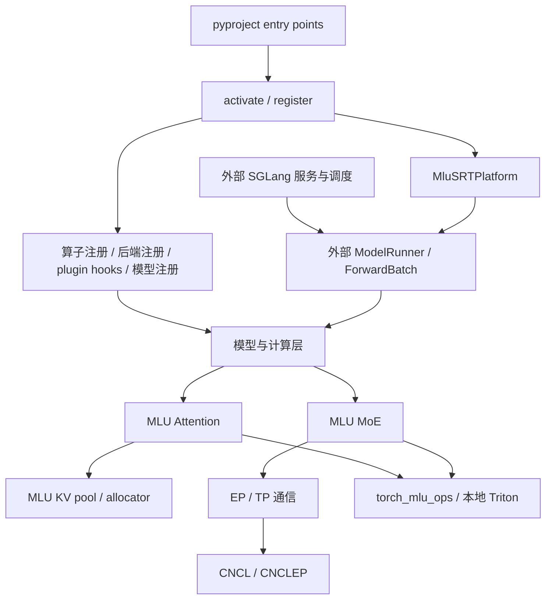
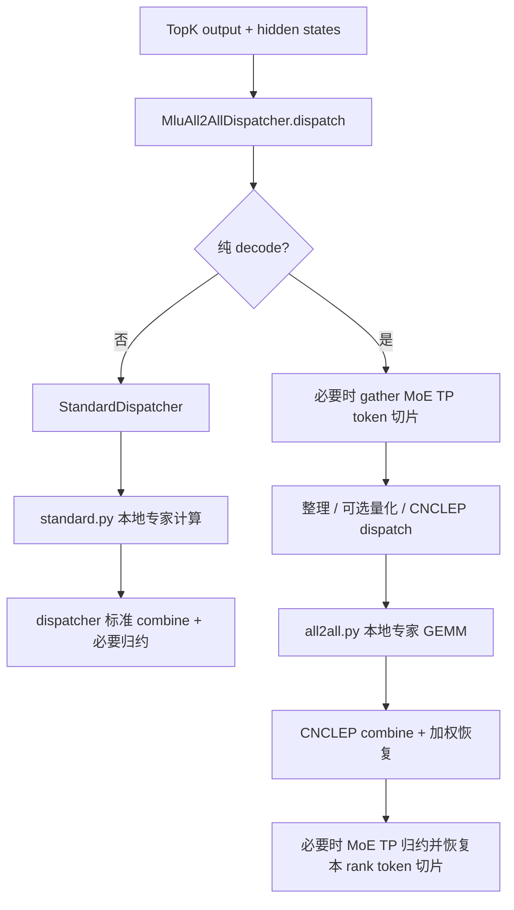

# sglang-mlu 源码阅读与 MoE 开发指南

本文基于本地仓库提交 `6ab3963` 的源码整理，日期为 2026-09-13。目标是帮助你建立整个仓库的职责地图，理解文件之间的调用关系，并找到 MoE 开发的具体落点。

阅读范围：本仓库的 Python 插件、安装脚本、上游补丁及测试。外部 SGLang 文件以本仓库的 import、hook 目标和补丁为定位依据；本文没有对外部完整源码或 MLU 硬件执行结果做验证。表中路径均相对于仓库根目录；`srt/` 简写指 `python/sglang_mlu/srt/`。文件夹下的空 `__init__.py` 主要用于包组织，有注册行为的入口会单独说明。

## 1. 先建立整体认识

**sglang-mlu 是 SGLang 的树外硬件后端插件。要理解完整推理服务，需要把本仓库与它安装的配套 SGLang 源码一起看。**

三层职责如下：

| 层次 | 负责什么 | 阅读位置 |
|---|---|---|
| SGLang 框架 | HTTP 服务、请求处理、调度、批次构造、通用模型与层、MoE 抽象 | 外部 `sglang` 仓库；本地 `scripts/sglang.patch` 展示适配差异 |
| sglang-mlu 插件 | 平台接口、算子分发、MLU Attention/MoE、量化、通信与模型适配 | `python/sglang_mlu/` |
| 设备运行时与算子库 | 设备张量、流、图、GEMM、MoE dispatch/combine、底层通信 | 外部 `torch_mlu`、`torch_mlu_ops`、CNCL、CNCLEP 等；部分 Triton kernel 在本仓库 |

因此，追到 `torch_mlu_ops.group_gemm()` 时，已经到了本仓库与外部算子库的边界。如果要改变 kernel 内部实现，还需要对应算子库源码；如果要改变路由策略、张量布局、通信流程或调用组合，则主要在本仓库工作。



图表示职责和依赖关系，不表示每次请求都会重新执行插件注册。

## 2. 从你当前打开的文件开始

| 文件 | 职责 | 阅读时要回答的问题 |
|---|---|---|
| [python/pyproject.toml](../python/pyproject.toml) | 定义安装包和两个 entry point：`sglang.srt.platforms`、`sglang.srt.plugins` | SGLang 如何发现这个插件？ |
| [python/sglang_mlu/__init__.py](../python/sglang_mlu/__init__.py) | `_mlu_is_available()`、`activate()`、`register()`；导入各模块触发注册 | 平台发现和具体功能注册有什么区别？ |
| [srt/platform/platform.py](../python/sglang_mlu/srt/platform/platform.py) | `MluSRTPlatform` 提供平台能力、默认参数、KV pool、allocator 和 graph runner 工厂 | 框架在哪些位置向平台询问实现？ |
| [scripts/mlu/build.property](../scripts/mlu/build.property) | 声明 torch_mlu、torch_mlu_ops、CNCL、CNCLEP、Triton 等依赖版本 | 代码假设哪些外部算子和运行时版本？ |
| [.claude/knowledge/commit-format.md](../.claude/knowledge/commit-format.md) | 提交信息规范 | 开发完成后如何描述提交？它不参与运行时 |

`platform.py` 中尤其关注：

1. `init_backend()` 调用外部 `load_plugins()`，进入功能注册与 hook 应用流程。
2. `apply_server_args_defaults()` 当前会把通用、prefill、decode attention backend 都设置为 `mlu`；默认 page size 为 16，关闭 custom all-reduce，并做参数校验。
3. `get_dispatch_key_name()` 返回 `mlu`，与 `register_oot_forward(..., "mlu")` 对应。
4. `get_mha_kv_pool_cls()`、`get_mla_kv_pool_cls()`、`get_paged_allocator_cls()`、`get_graph_runner_cls()` 把框架连接到本地实现。
5. `support_cuda_graph()` 返回 True 是沿用框架接口名；本地 graph runner 创建的是 MLU 图。类中也明确声明 SWA-aware prefix cache 和 profiling 等能力限制，不能仅凭某个 kernel 存在就推断完整产品支持。

`_mlu_is_available()` 也不是简单地“没有卡就返回 False”：没有 `torch.mlu` 属性时返回 False；有该属性但设备不可用时会抛出异常。

## 3. 顶层目录和工程文件地图

| 文件或目录 | 职责与关注点 |
|---|---|
| `README.md` | 安装、服务启动、TP 多机、PD 分离和评测示例；用于认识使用方式 |
| `AGENTS.md`、`CLAUDE.md` | 项目协作约定；开发前读，尤其是平台扩展与 hook 使用规则 |
| `python/` | 可安装的 MLU 插件主体，是源码阅读主战场 |
| `scripts/` | 安装依赖、安装外部 SGLang、应用补丁、安装插件、验证和评测 |
| `test/registered/` | 算子、后端、分布式、模型等测试；名称 registered 不代表 CPU 可直接运行 |
| `test/scripts/` | 安装/配置/注册/工具脚本及部分实现契约回归测试；逐个看依赖和 mock 范围 |
| `test/manual/accuracy/` | Qwen、DeepSeek 等真实模型精度测试 |
| `test/manual/performance/` | DeepSeek W4A8 prefill/decode 性能测试；`baseline/` 存基线 JSON |
| `benchmarks/welmv4_mlu_baseline.py` | WeLM 算子性能基准入口 |
| `benchmarks/results/` | 历史性能、精度和验证记录；比较时核对版本、卡型和配置 |
| `docs/user_guide/` | 使用手册；先看 `quickstart/`、`adapter/`、`env_vars/`、`model_feature_matrix/` |
| `docs/release_notes/` | 版本说明；`0.1.0/index.rst` 为具体版本内容 |
| `docs/doc_scripts/` | Sphinx 回调、JSON 配置解析、模板、静态资源与自定义扩展 |
| `docs/*/conf.py`、`conf.json`、`index.rst` | 文档构建配置和目录入口；Makefile、make.bat、makelatexpdf.sh 为构建入口，图片/PDF 为排版素材 |
| `server.sh` | 当前 WeLM 本地启动配置示例；默认 TP4/EP4，MoE A2A 为 `none`，不可把它当所有模型的通用默认值 |
| `.pre-commit-config.yaml`、`.isort.cfg`、`.codespellrc` | 格式、import 排序和拼写检查配置 |
| `.gitignore` | 生成文件与本地文件的忽略规则 |
| `.claude/skills/` | 开发工作流说明，如算子迁移、版本升级、代码审查、提交、PD 分离；不参与推理 |

### 3.1 安装链决定你应该读哪一份上游源码

```text
scripts/mlu/build.property + scripts/mlu/env.sh
    └─ scripts/install_dependencies.sh → 设备运行时 / Python 依赖

scripts/sglang_ref.sh
    └─ scripts/install_sglang.sh
         ├─ clone 配套 SGLang（默认 ../sglang-org）
         ├─ checkout 指定 ref
         ├─ 检查并应用 scripts/sglang.patch
         ├─ 用 scripts/mlu/pyproject_community.toml 配置依赖
         └─ editable install SGLang，按配置安装 router

scripts/install_sglang_mlu.sh → 安装 python/ 下的插件
```

当前 `scripts/sglang_ref.sh` 的默认 ref 为 `12e90632d2`；README 仍写 `039844b22`。默认仓库由 `install_sglang.sh` 指向 `TopIdiot/sglang`，也可以通过 `SGLANG_REPO`、`SGLANG_REF` 覆盖。**阅读和排障应以实际安装脚本、环境覆盖及安装目录提交为准。** `build.property` 中 torch 关联版本也已是 2.12.1，而 README 容器示例仍是 torch 2.11.0。

其他脚本：

| 文件 | 作用 |
|---|---|
| `scripts/smoke_test_sglang_install.sh` | 临时目录中验证补丁、editable install 和 import |
| `scripts/install_mooncake_mlu.sh`、`scripts/mooncake.patch` | PD 分离传输依赖的安装与 MLU 适配 |
| `scripts/install_codex_skills.sh` | 将项目技能安装到 Codex 可发现的位置 |
| `scripts/welm_tp4_ep_eager_serving.py` | WeLM TP4/EP eager 服务验证工具 |
| `scripts/welm_tp4_ep_performance_baseline.py` | TP4/EP 性能基线工具 |
| `scripts/welm_eager_graph_validation.py` | eager 与 graph 行为验证工具 |
| `scripts/welmv4_5_yarn_w8a8_evalscope.py` | WeLM YARN W8A8 的 EvalScope 评测工具 |
| `scripts/ci/pipeline/precheckin.pipeline` | CI 流程定义 |
| `scripts/ci/scripts/build_doc.sh`、`scripts/ci/check_sensitive_words.sh` | 文档构建和敏感词检查 |

## 4. Python 运行时代码职责地图

### 4.1 平台、执行、批次和通信

| 文件（相对 `srt/`） | 职责 | 关联 |
|---|---|---|
| `platform/device.py` | `MluDeviceMixin`：设备选择、显存、同步、设备能力、CNCL backend 名称 | `platform.py`、框架设备抽象 |
| `configs/device_config.py` | DeviceConfig 的 MLU 初始化适配 | 启动参数与设备识别 |
| `server_args.py` | 注册 backend choices；校验 MoE、WeLM、INT8 KV、推测解码配置 | 平台默认值、模型配置 |
| `model_executor/model_runner.py` | `register_model_runner_allowlists()` 注册后端白名单 | **不是完整 ModelRunner**；真正执行器在外部 SGLang |
| `model_executor/graph_runner.py` | `DecodeMluGraphRunner`：图创建、capture/replay、WeLM hash 输入及运行模式适配 | MoE padding、通信、Attention metadata |
| `managers/schedule_batch.py` | 在混合批次及 worker/forward batch 转换时保留 running indices | Attention mixed 路径；不是完整调度器 |
| `distributed/parallel_state.py` | `MLUGroupCoordinator`、并行组创建、collective 接口和清理 | 外部 TP/EP/DP 分组、MLU communicator |
| `distributed/device_communicators/mlu_communicator.py` | all-reduce、all-gather、reduce-scatter 及变长通信实现 | `MLUGroupCoordinator` |
| `layers/communicator.py` | 层间 Attention/MLP token 布局转换；非 decode 的 runtime standard EP；调整归约融合策略 | All-to-All dispatcher、graph runner |
| `ray/scheduler_actor.py` | Ray scheduler actor 事件循环适配 | 多进程/分布式服务 |
| `utils/common.py` | MLU 显存查询、设备与设备数量等公共 hook | 初始化与资源管理 |

通信需要分清两层：`distributed/` 处理设备通信与进程组；`layers/communicator.py` 处理模型层之间“每个 rank 持有哪些 token”的布局语义。MoE 多卡错误常常来自后者。

### 4.2 Attention、位置编码和 KV cache

| 文件（相对 `srt/`） | 职责 |
|---|---|
| `layers/attention/attention_registry.py` | 注册 `mlu` Attention 工厂；根据 `runner.use_mla_backend` 选择 MHA 或 MLA 实现 |
| `layers/attention/mlu_backend.py` | `MLUAttnBackend`：普通 Attention，extend/decode/mixed、paged KV、graph metadata 等 |
| `layers/attention/mlu_mla_backend.py` | `MLUMLABackend`、chunk KV runner；MLA 路由、absorb、chunked prefill 及推测解码 metadata |
| `layers/attention/mla_attention_backend_handler.py` | 将 MLA 模型的后端选择/调用接入 MLU |
| `layers/attention/mlu_attention_utils.py` | Attention 共享工具与 metadata 处理 |
| `layers/attention/merge_state.py` | 合并分段 Attention 的输出和统计量，服务 chunk/prefix 等路径 |
| `layers/attention/multi_step_backend.py` | 多步 draft Attention backend 适配 |
| `mem_cache/memory_pool.py` | `MLUMHATokenToKVPool`、`MLUMLATokenToKVPool`；KV buffer 布局、读写、拷贝以及 INT8 scale 存储 |
| `mem_cache/allocator.py` | 分页 KV 槽位分配及 allocator kernel warmup；区别于保存 KV 内容的 pool |
| `kv_cache_int8_names.py` | INT8 KV 配置名识别和规范化 |
| `kv_cache_int8.py` | INT8 KV CLI、dtype、容量计算接入；与 `server_args.py` 的支持范围校验配合 |
| `layers/rotary_embedding/base.py` | 基础 RoPE 的 MLU forward |
| `layers/rotary_embedding/yarn.py` | YaRN RoPE 适配 |
| `layers/rotary_embedding/rope_variant.py` | 其他 RoPE 变体适配 |
| `layers/rotary_embedding/welm.py` | WeLM 原地 RoPE 与 K-only 路径 |
| `layers/rotary_embedding/__init__.py` | 导入并注册 RoPE 实现 |

理解一条 Attention 路径时，按“ForwardBatch → metadata → KV 槽位 → pool 写入/读取 → kernel → 输出”追踪。MoE 一般不直接管理 KV，但 batch 模式、padding 和 graph 会同时影响两者。

### 4.3 通用层与量化

| 文件（相对 `srt/`） | 职责 |
|---|---|
| `layers/__init__.py` | 算子注册总入口；注册 TopK、非量化 MoE forward、SmoothQuant，并导入子模块 |
| `layers/activation.py` | SiLU-and-mul、QuickGELU 等 MLU 实现 |
| `layers/layernorm.py` | 归一化层的 MLU 实现 |
| `layers/quantization/utils.py` | dtype 字符串、bit 数与 torch dtype 的转换 |
| `layers/quantization/unquant.py` | 非量化 MoE 与 MLU runner 的桥梁，post-load 创建 All-to-All state |
| `layers/quantization/smoothquant/smoothquant.py` | `SmoothQuantConfig` 解析配置并选择 Linear/MoE 的 W8A8 或 W4A8 方法 |
| `layers/quantization/smoothquant/linear_method.py` | 量化 Linear 权重创建、加载兼容、动态量化与 matmul |
| `layers/quantization/smoothquant/fused_moe_method.py` | 量化专家参数创建、scale packing、post-load、MoE runner 创建及 `apply()` |
| `layers/quantization/smoothquant/__init__.py` | 导出 `SmoothQuantConfig` |

`quant_method` 不只是一个量化函数，它还规定参数存储方式、权重加载后处理和 forward 的执行入口。改 MoE kernel 时必须同时核对它的权重契约。

### 4.4 模型适配

| 文件（相对 `srt/`） | 职责 |
|---|---|
| `models/__init__.py` | 导入模型 hook，并将 WeLM 文本/VLM 类写入外部 `ModelRegistry` |
| `models/welmv4.py` | 本地 WeLM 模型实现：路由、MoE block、Attention、decoder、embedding、forward、权重加载 |
| `models/welmv4_vlm.py` | WeLM 多模态类，连接视觉输入与语言模型、处理相应权重 |
| `models/welm_quantization.py` | WeLM 量化配置规范化、W8A8 支持识别及配置一致性校验 |
| `models/welm_runtime.py` | 模型初始化后的 MLU kernel warmup 接入 |
| `models/welm_perf_opt.py` | WeLM OE embedding/hash、局部 embedding、投影与可选优化逻辑 |
| `models/deepseek_common/utils.py` | DeepSeek Attention 后端能力白名单注册 |
| `models/deepseek_mha.py` | DeepSeek MLA KV 读取与 chunked prefix MHA 等方法适配 |
| `models/deepseek_weight_loader.py` | DeepSeek 权重加载适配 |
| `models/moe_all2all.py` | All-to-All 下外部 shared expert 的 TP=1 复制布局策略；hook DeepSeek/Qwen2/Bailing/GLM 构造函数 |
| `layers/welmv4.py` | WeLM fused RMSNorm 的 MLU 注册 |
| `layers/welmv4_op.py` | WeLM 专用算子及 Triton 实现：router linear、norm、residual、sigmoid、视觉 RoPE 等 |
| `welm_oe_hash.py` | WeLM OE hash producer 与运行时接入 |
| `welm_oe_hash_kernels.py` | decode、segment 和 MTP 历史相关 hash kernel、launcher 与 warmup |
| `welm_serving.py` | WeLM 权重加载后的 eager baseline 信息记录 |

不要把 WeLM 的 OE embedding/hash 与 MoE 专家路由混为一谈。它们是不同功能，但共享 forward batch、图与模型执行路径。

### 4.5 推测解码和辅助功能

| 文件（相对 `srt/`） | 职责 |
|---|---|
| `speculative/__init__.py` | 推测解码适配注册入口 |
| `speculative/draft_utils.py` | `MLUDraftBackendFactory`，选择 draft decode/extend Attention backend |
| `speculative/eagle_worker.py` | EAGLE worker 的 MLU 适配 |
| `speculative/eagle_utils.py` | EAGLE 辅助操作与 MLU fallback |
| `speculative/graph_runner_mixin.py` | MLU 图 capture 的共享能力 |
| `speculative/eagle_draft_graph_runner.py` | draft decode graph runner |
| `speculative/eagle_draft_extend_graph_runner.py` | draft extend graph runner |
| `constrained/xgrammar_backend.py` | 结构化输出 vocab mask 的 MLU 应用 |
| `sampling/penaltylib/min_new_tokens.py` | 最少生成 token 数约束，包含 batch filter/merge 后的状态维护 |
| `triton_utils/framework_kernel_warmup.py` | 框架 kernel 提前 warmup，减少运行时首次 JIT 干扰 |
| `triton_utils/jit_monitor.py` | Triton 编译/调优监控与启动接入 |

包外还有 `python/sglang_mlu/utils/gorilla.py`，是 monkey-patching 工具代码。项目当前约定优先使用正式平台接口或 `plugin_hook`，新开发不要因为这个文件存在就沿用任意 monkey-patching。

## 5. 文件是如何被接起来的

### 5.1 注册链：定义函数不等于功能已经生效

```text
python/pyproject.toml
  ├─ mlu_device → sglang_mlu.activate → 返回 MluSRTPlatform 类路径
  └─ mlu_plugin → sglang_mlu.register
       ├─ server_args.register_backend_choices
       ├─ import layers
       │    ├─ Attention registry
       │    ├─ MultiPlatformOp.register_oot_forward(TopK, ...)
       │    ├─ MultiPlatformOp.register_oot_forward(UnquantizedFusedMoEMethod, ...)
       │    ├─ SmoothQuant 配置注册
       │    └─ import moe_runner → fused function 注册 + integration hooks
       ├─ import models → 模型 registry 与模型 hook
       └─ 其他运行时 hook
```

`@plugin_hook` 先登记替换/包装信息，随后由框架应用 hook。测试中的 [test/registered/conftest.py](../test/registered/conftest.py) 明确先 `register()`，再 `HookRegistry.apply_hooks()`。排查“改了代码却没有进入”时，先检查模块是否被导入、注册目标是否正确、hook 是否应用。

### 5.2 一次推理的概念执行链

```text
外部 HTTP/tokenizer → 外部 Scheduler → ScheduleBatch / ForwardBatch
  → 外部 ModelRunner
    → eager 模型 forward 或 DecodeMluGraphRunner capture/replay
      → decoder layer
        → norm / QKV / RoPE / Attention / residual
        → router / TopK / experts / combine / shared expert / residual
      → logits / sampling
```

这是阅读骨架，具体层顺序和融合方式由模型决定。不要在本地 `managers/schedule_batch.py` 中寻找完整 continuous batching 算法，它只做适配。

## 6. MoE 开发必须精读的文件

建议把 MoE 看成五个明确的问题：**选谁计算、把 token 放到哪里、如何计算专家、怎样还原输出、参数如何加载。**

| 优先级 | 文件（相对 `srt/`） | 重点符号 / 责任 |
|---|---|---|
| P0 | `layers/moe/topk.py` | `fused_topk()`、`_topk_standard()`、`_topk_grouped()`；路由算法、有效 token、专家映射、direct route 条件 |
| P0 | `layers/moe_runner/standard.py` | `fused_experts_standard()`；本地专家索引、非量化/量化 GEMM、加权合并 |
| P0 | `layers/moe/token_dispatcher/mlu_all2all.py` | `MluAll2AllDispatcher.dispatch()/combine()`；decode All-to-All、非 decode fallback、通信状态与容量 |
| P0 | `layers/moe_runner/all2all.py` | `fused_experts_mlu_all2all()`；接收已分发 token 后的本地专家计算 |
| P0 | `layers/moe_runner/integration.py` | `_post_init()`、`_moe_runner_init()`；把 dispatcher 和 runner 安装进上游 FusedMoE |
| P0 | `layers/quantization/smoothquant/fused_moe_method.py` | 权重形状、量化 scale、post-load、runner 创建、`apply()` |
| P0 | `layers/quantization/unquant.py` | `unquantized_fused_moe_forward_mlu()`；非量化执行入口 |
| P1 | `layers/moe_runner/backend.py` | backend 枚举兼容和 `get_mlu_fused_key()` |
| P1 | `layers/moe_runner/__init__.py` | fused function 与 hook 的导入注册入口 |
| P1 | `layers/moe_runner/weight_loader.py` | `FusedMoE._weight_loader_impl` 的 SmoothQuant 适配 |
| P1 | `layers/moe/padded_topk.py` | `sanitize_padded_topk_for_mlu_moe()`；将 padding 的 `-1` 路由变为合法且零贡献的路由 |
| P1 | `layers/moe/direct_topk.py` | direct route 开关及 provenance 标记的设置、清除和传播 |
| P1 | `layers/moe/constants.py` | 有效 token 元数据属性名等共享约定 |
| P1 | `layers/moe/token_dispatcher/__init__.py` | dispatcher 相关导出入口 |
| P1 | `layers/communicator.py`、`distributed/parallel_state.py` | token 布局与 EP/TP 进程组 |
| P1 | `models/moe_all2all.py` | shared expert 布局适配 |
| P1 | `server_args.py`、`model_executor/graph_runner.py` | 配置合法性、eager/graph 与 batch 模式关系 |
| 按模型 | `models/welmv4.py` | `Qwen2MoeSparseMoeBlock`：具体模型如何调用 gate、TopK、experts 和后续归约 |

### 6.1 先读最小标准路径

以 WeLM 的 `Qwen2MoeSparseMoeBlock.forward()` 为一个本地可读入口：

```text
hidden_states [M, H]
  → gate / router linear → router_logits [M, E]
  → self.topk(...) → topk_ids、topk_weights [M, K]
  → self.experts(hidden_states, topk_output) 〔外部 FusedMoE 抽象〕
    → dispatcher.dispatch(...)
    → quant_method 的执行入口
      ├─ 非量化：unquant.py → MLU forward
      └─ SmoothQuant：fused_moe_method.py → apply()
    → MoeRunner.run(..., {"layer": layer})
    → FusedOpPool 选择 fused function
    → dispatcher.combine(...)
  → 按模型处理 shared expert、归约及 residual
```

这里 `M` 是本次输入的 token 行数，可能包含 padding；`H` 是 hidden size；`E` 是专家数；`K` 是每 token 选中的专家数。`moe_runner/standard.py` 注释中的 K 表示 hidden dimension，阅读 shape 时要留意局部命名。

标准执行注册键是 **`("none", "mlu")`**，顺序为 A2A backend、runner backend：

1. `_get_standard_metadata()` 保留全局 expert ID，并将路由权重转为 FP32。
2. 计算当前 EP rank 的专家区间，`moe_gen_idx()` 生成 expand/combine 索引与各专家 token 数。
3. 非量化：`moe_expand_input → group_gemm(w13) → moe_active → group_gemm(w2)`。
4. 量化：`moe_quantize → smooth_quant_group_gemm(w13) → moe_quantize（含激活）→ smooth_quant_group_gemm(w2)`。
5. `moe_combine_result()` 按 top-k 权重恢复原 token 行顺序，返回 `StandardCombineInput`。

**标准路径同样可以有 EP。** `none` 表示不选择专门的 A2A backend，不表示整个模型没有跨卡通信；当前 rank 只计算本地专家贡献，最终归约要继续看 dispatcher 和模型层。

### 6.2 All-to-All 路径与标准路径的区别



专用注册键是 **`("mlu", "mlu")`**。与标准 runner 相比，`all2all.py` 接收已经按专家准备好的输入；通信和最终 token 恢复由 dispatcher 承担。

当前实现的重要行为：

- `dispatch()` 检查 `_is_decode_only_forward()`，非 decode 走 `_standard_dispatcher`；`layers/communicator.py` 配合恢复 FULL token 视图。
- `all2all.py` 收到不带 All-to-All `state` 的标准输出时，转调 `fused_experts_standard()`。因此配置 A2A 为 `mlu` 不等于每个 forward 都调用 CNCLEP。
- 纯 decode 时，若 MoE TP 大于 1，会先 gather 对应 token 切片和 TopK 元数据；combine 后归约专家 TP 分片，再切回原 token 布局。
- dispatcher 已处理相应归约；`skip_post_experts_all_reduce_for_mlu_all2all()` 避免模型再做一次 post-expert all-reduce。
- `models/moe_all2all.py` 为特定外部 shared expert MLP 设置 TP=1 复制权重，适应 token-scattered 输入。独立 shared expert 与 `num_fused_shared_experts` 是两个概念。

### 6.3 初始化、权重加载与 forward 是不同阶段

```text
server_args 校验 / backend 注册
  → 模型构造 / FusedMoE 参数创建
  → integration._post_init 绑定 dispatcher、runner 和 dispatch mode
  → checkpoint 权重加载（weight_loader.py 等）
  → process_weights_after_loading
     ├─ scale packing / 参数整理
     └─ maybe_create_all2all_state：参数已在 MLU 时准备固定容量 state
  → eager forward / graph capture / graph replay
```

`MluAll2AllGlobalState` 管理进程级 CNCLEP state；dispatcher 还管理逐层视图和输出存储。量化与非量化 dispatch mode 有一致性约束。不能把每层 dispatcher 的析构直接等同于全局 handle 的销毁。

### 6.4 MoE 参数与数据契约

| 对象 | 含义 | 修改时应核对 |
|---|---|---|
| `topk_ids` | token 选择的专家编号 | 全局 ID 与本地 ID 不能混用；标准 MLU runner 自己处理全局专家区间 |
| `topk_weights` | 多个专家结果的加权系数 | softmax/sigmoid、renormalize、scaling、归约 dtype |
| `w13_weight` | 合并的 gate/up 投影 | 非量化 gated 路径典型形状 `[E_local, 2I, H]`；`I` 为本地中间维度 |
| `w2_weight` | down 投影 | 典型形状 `[E_local, H, I]`；和 MoE TP 切分一致 |
| `w13_qweight`、`w2_qweight` | 量化专家权重 | W8A8 与 W4A8 packed 存储不同；W4A8 两个 4-bit 权重装入一字节 |
| `w13_smooth`、`w2_smooth` | 专家相关输入平滑参数 | 与专家维及输入维对应；量化 dispatch 需要全局顺序的 w13 smooth |
| `*_per_channel_scale` | 权重量化 scale | 普通与 groupwise 布局不同；post-load 可能 permute packing |
| `expand_idx`、`combine_idx` | token→专家展开及结果还原索引 | 与排序和通信后的行顺序匹配 |
| `expert_num_tokens` / `local_token_counts` | 每个本地专家处理的 token 数 | 对应 grouped GEMM 的组列表，不能用总 batch size 替代 |
| `MoeRunnerConfig` | 专家规模、hidden size、激活、dtype 等配置 | 初始化、权重布局、state 容量三者一致 |
| All-to-All state/buffer | handle、容量、通信布局和存储 | graph 地址稳定、最大 token 容量、逐层生命周期 |

Padding 特别容易引入静默错误：`padded_topk.py` 将 `-1` 改成合法 expert ID，同时把对应权重归零；完全 padding 的 token 行也清零 hidden states。仅把 ID 改为 0 会产生错误贡献。

`direct_topk.py` 的标记表示上游路径已满足直接消费条件，允许跳过部分 sanitize；它不是一种新的 TopK 算法。张量转换或 gather 之后必须正确传播或清除该标记，不能仅根据 shape 就认定安全。

### 6.5 当前配置边界

- MLU runner 接受 A2A `none` 或 `mlu`；A2A=`mlu` 且 runner=`auto` 时会规范化成 `mlu`。
- 安装 MLU All-to-All dispatcher 需要 EP>1、有效本地/全局专家配置、无 fused shared experts，并具有完整非量化或 SmoothQuant 参数布局。不满足时 integration 明确报错。
- MLU runner 的初始化 hook 当前拒绝 LoRA。
- WeLM EP>1 要求 `--moe-runner-backend mlu`；另有 shared embedding policy、量化和 speculative 配置约束。
- `backend.py` 为兼容上游封闭枚举暂时扩展 Enum 内部结构，这是需要随上游升级复查的技术债，文件有 TODO。

支持边界以 `server_args.py`、`integration.py` 和 dispatcher 中的实际检查为准；以上说明不等于所有组合均已做硬件验证。

## 7. 想理解完整仓库，还要读哪些外部 SGLang 文件

以下是外部源码定位路径，不是本仓库内的文件链接。默认安装目录为 `../sglang-org`，实际位置可能被 `SGLANG_DIR` 覆盖。升级后先用搜索确认名称。

| 外部文件（相对 SGLang 仓库） | 为什么读 |
|---|---|
| `python/sglang/srt/platforms/__init__.py`、`interface.py` | 插件平台发现与 `SRTPlatform` 契约 |
| `python/sglang/srt/plugins/hook_registry.py` | hook 登记、应用及 AROUND/AFTER 等语义 |
| `python/sglang/srt/layers/utils.py` | `MultiPlatformOp` 的 forward 分发机制 |
| `python/sglang/srt/managers/scheduler.py`、`schedule_batch.py` | 调度及 batch 形成；对应插件只有少量 hook |
| `python/sglang/srt/model_executor/model_runner.py`、`forward_batch_info.py` | 模型加载、forward、batch mode 和执行上下文 |
| `python/sglang/srt/layers/moe/fused_moe_triton/layer.py` | `FusedMoE` 构造、dispatch→计算→combine 组织及权重加载；名称带 triton 不代表 MLU 用 Triton 专家 kernel |
| `python/sglang/srt/layers/moe/moe_runner/base.py`、`runner.py` | `MoeRunnerConfig`、`FusedOpPool`、`register_fused_func`、`MoeRunner.run` |
| `python/sglang/srt/layers/moe/token_dispatcher/base.py`、`standard.py` | dispatcher 输入/输出协议及标准分发 |
| `python/sglang/srt/layers/moe/topk.py`、`utils.py` | TopK 配置/输出结构、MoE backend/并行配置 |
| `python/sglang/srt/layers/quantization/unquant.py`、`base_config.py` | quant method 与参数创建/加载/执行协议 |
| `python/sglang/srt/distributed/parallel_state.py` | TP/EP/DP group 构建和 rank 语义 |
| `python/sglang/srt/layers/dp_attention.py` | Attention DP 与 MoE token layout 交互 |
| `python/sglang/srt/models/` 中目标模型文件 | 非本地覆盖模型的完整结构；从本地 import/hook 字符串追踪 |

先读 `scripts/sglang.patch` 的 `diff --git` 列表，能够快速识别这个版本向框架增加了哪些平台能力和适配点。它涉及 scheduler、memory、ModelRunner、graph、platform、speculative 等多个环节，应与插件一起评估版本兼容性。

## 8. 推荐阅读路线：每一步都带一个验收问题

### 第一轮：建立全局地图

1. `README.md → install_sglang.sh → sglang_ref.sh → build.property`：能否说清运行时由哪三个项目/依赖层组成？
2. `pyproject.toml → __init__.py → platform.py → layers/__init__.py`：能否说明一个 MLU forward 是如何被选中的？
3. 外部 `Scheduler → ForwardBatch → ModelRunner`，再读本地 graph runner 和 schedule batch hook：能否画出请求到模型 forward 的数据流？
4. `attention_registry.py → mlu_backend.py → memory_pool.py → allocator.py`：能否区分 Attention metadata、KV 数据和分配索引？
5. 选一个具体模型追一层 forward；WeLM 先用符号导航找到 `Qwen2MoeSparseMoeBlock`，再读 decoder/model，不必从几千行文件第一行开始顺读。

### 第二轮：以 MoE 为主线精读

1. `models/welmv4.py` 的 sparse block → `topk.py`：明确 gate、TopK、experts 的输入输出。
2. 外部 `FusedMoE` → 本地 `unquant.py` → `standard.py`：先理解单路径数学与数据布局。
3. `smoothquant.py → fused_moe_method.py → weight_loader.py`：掌握 W8A8/W4A8 权重协议。
4. `backend.py → integration.py`：理解两个 fused key 如何被选中。
5. `mlu_all2all.py → all2all.py → layers/communicator.py → distributed/parallel_state.py`：追踪每次布局改变和归约。
6. `padded_topk.py → direct_topk.py → graph_runner.py`：掌握 graph/padding 的正确性条件。
7. 对照相应测试，解释每个输入构造是在验证哪条不变量。

完成这一轮的标准：能够独立解释“同一组 token 在每一步由哪些 rank 持有、行顺序是什么、expert ID 属于什么编号空间、输出在哪里完成加权和跨卡归约”。

## 9. 不同 MoE 开发任务应改哪里

| 任务 | 主要入口 | 必须同步检查 |
|---|---|---|
| 改 softmax/sigmoid/grouped routing、bias 或归一化策略 | `layers/moe/topk.py`；模型特定路由还要看 `models/welmv4.py` | direct route 条件、padding、逻辑→物理 expert 映射、路由精度 |
| 优化专家 GEMM/激活融合 | `moe_runner/standard.py`、`moe_runner/all2all.py` | 权重 dtype/shape、量化 scale、空 token/空专家、输出别名 |
| 新增量化格式 | `quantization/smoothquant/` 或新的 quant method | 配置注册、权重加载、runner、dispatcher 的量化模式识别，不能只改 GEMM |
| 优化 EP dispatch/combine | `moe/token_dispatcher/mlu_all2all.py` | CNCL/CNCLEP 依赖、TP≠EP、prefill fallback、容量和图安全 |
| 修改 token 分片策略 | `layers/communicator.py`、dispatcher | shared experts、residual、post-expert all-reduce、Attention DP |
| 支持新 MoE 模型 | 外部/本地模型 + `models/__init__.py` | router 精度、专家参数名、shared expert、量化配置、post-reduce 策略 |
| 优化 decode graph | `model_executor/graph_runner.py`、dispatcher、TopK helpers | 地址稳定、padding、安全复用 buffer、连续 replay 及切换 batch size |
| 升级 SGLang 或 torch_mlu_ops | `sglang_ref.sh`、`sglang.patch`、`build.property` | hook 目标签名、枚举、fused function 协议、算子参数和测试 |

## 10. 测试地图与验证顺序

| 测试入口 | 主要用途 |
|---|---|
| `test/registered/layers/moe/test_topk.py` | 路由行为 |
| `test/registered/layers/moe/test_fused_moe.py` | 非量化专家计算 |
| `test/registered/layers/moe/test_moe_quant.py` | 量化 MoE |
| `test/registered/layers/moe/test_mlu_moe_backend_selection.py` | runner/A2A backend 选择与兼容 |
| `test/registered/layers/moe/test_mlu_all2all_init.py` | All-to-All 初始化与状态 |
| `test/registered/layers/moe/test_mlu_all2all_ep.py` | EP All-to-All 路径 |
| `test/registered/layers/moe/test_mlu_all2all_tp_ep.py` | TP 与 EP 不相等的组合；文件使用 4 进程、EP2 配置 |
| `test/registered/distributed/test_ep.py`、`test_parallel_state.py`、`test_distributed_tensor_collectives.py` | 专家并行、通信组、collective |
| `test/registered/models/test_mlu_moe_all2all_joyai_e2e.py` | JoyAI 模型端到端 All-to-All |
| `test/registered/test_mlu_graph_runner.py` | graph runner |
| `test/registered/models/test_deepseek_weight_loader.py`、`test_welm_nextn_weight_loader.py` | 模型权重加载 |
| `test/scripts/test_welm_ops_registration.py`、`test_welm_w8a8_qkv.py` 等 | WeLM 注册/权重/配置等定向回归 |

其余测试按职责对应：`layers/attention_backend/` 覆盖 Attention；`mem_cache/` 覆盖 KV；`speculative/` 覆盖 draft/verify；`function_call/` 覆盖工具调用；`sampling/` 覆盖采样约束；`disaggregation/` 覆盖 Mooncake PD；`test_mlu_scheduler.py` 覆盖调度相关适配。

在已安装配套 SGLang、MLU 依赖并具备对应卡数的 Linux MLU 环境，可按改动范围运行：

```bash
# 路由/基础专家计算
python -m pytest -q test/registered/layers/moe/test_topk.py test/registered/layers/moe/test_fused_moe.py

# 量化与后端选择
python -m pytest -q test/registered/layers/moe/test_moe_quant.py test/registered/layers/moe/test_mlu_moe_backend_selection.py

# 多卡：测试内部组织进程，先读文件中的卡数与拓扑要求
python -m pytest -vs test/registered/layers/moe/test_mlu_all2all_init.py test/registered/layers/moe/test_mlu_all2all_ep.py test/registered/layers/moe/test_mlu_all2all_tp_ep.py

# 图执行
python -m pytest -q test/registered/test_mlu_graph_runner.py
```

推荐验证顺序是：路由/权重正确性 → 单层专家输出 → EP → TP≠EP → eager/graph → 真实模型精度 → 性能。测试里的环境探测可能触发 skip，必须区分“通过”和“没有运行”。本文仅整理测试入口，没有执行这些硬件测试。

性能对比至少固定模型、权重格式、依赖版本、TP/EP、输入/输出长度、batch/并发、prefill/decode 模式和 graph 开关。使用 `benchmarks/results/` 的历史数据前先核对这些条件。

## 11. 开发时最容易踩的坑

1. **改了函数但没有注册。** 检查 `register()` 的导入链、`layers/__init__.py` 和 hook 应用。
2. **把标准 EP 误认为单卡。** `moe-a2a-backend none` 仍可能有跨卡归约。
3. **认为设置 All-to-All 后 prefill 也走 CNCLEP。** 当前只在纯 decode 使用专用路径。
4. **将全局专家 ID 提前映射为本地 ID。** MLU 标准 runner 自己按全局区间处理，重复映射会算错专家。
5. **重复 all-reduce。** 先确定 dispatcher 是否已经完成归约及输出 token 布局。
6. **只检查数值 shape，忽略 rank 上的 token 含义。** 相同 `[M,H]` 可能是 FULL 或 scattered，不能直接相加/归约。
7. **忽略 W4A8 packing 和 groupwise scale 轴变换。** checkpoint 布局不等于最终 kernel 布局。
8. **为节省 buffer 破坏 graph。** 当前非量化 All-to-All 明确使用独立输入 staging 和逐层稳定 GEMM2/输出 buffer。
9. **直接照搬 GPU/其他版本的分支。** 先核对本仓库锁定的上游接口及依赖版本。
10. **以单层测试代替模型验证。** 模型还有 router dtype、shared expert、residual、KV 和 batch 模式等交互。

项目约定：优先 `MultiPlatformOp.register_oot_forward`、Attention registry 等结构化平台扩展；没有合适接口时才使用 `plugin_hook`。新增注册模块需要被入口导入，import 阶段不加载模型或分配设备张量。算子直接在所属层调用 `torch_mlu_ops`，避免新增集中包装中心。具体协作规范见 [CLAUDE.md](../CLAUDE.md)。

## 12. 实用源码检索命令

以下 `rg` 命令可在仓库根目录运行；搜索结果用于定位后再打开上下文：

```bash
# 平台注册与 hook
rg -n 'register_oot_forward|register_attention_backend|plugin_hook' python/sglang_mlu

# MoE 两条执行路径的注册和调用
rg -n 'register_fused_func|FusedOpPool|MoeRunner|runner.run' python/sglang_mlu/srt/layers

# 路由与参数流
rg -n 'topk_ids|topk_weights|w13_qweight|w13_weight' python/sglang_mlu/srt/layers

# 通信与布局切换
rg -n 'runtime_standard_ep|_is_decode_only_forward|all_reduce|all_gather' python/sglang_mlu/srt/layers

# 查看上游补丁涉及的文件
rg '^diff --git' scripts/sglang.patch
```

建议在 IDE 同时固定打开：模型 sparse block、外部 FusedMoE、`topk.py`、`standard.py`、`mlu_all2all.py`、`fused_moe_method.py`。对每个 forward 标记输入输出的 shape、dtype、token 布局、expert 编号空间和归约责任，再开始修改实现。


%% 项目关联导航：开始 %%
## 项目关联导航

- 所属模块：[[outputs/项目整理/模块-实习项目能力|模块-实习项目能力]]
- 关联阅读：[[outputs/项目整理/专题-04-并行推理与MoE实习|专题-04-并行推理与MoE实习]]

%% 项目关联导航：结束 %%
