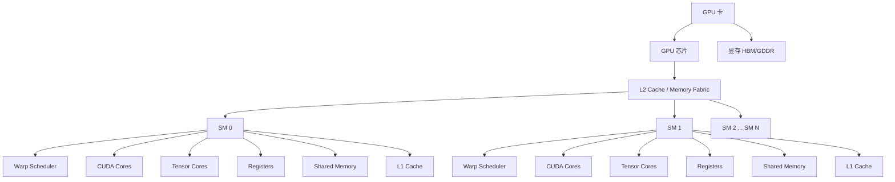

# GPU 内部架构与 CUDA/GEMM 学习笔记

> 目标：帮助你从“看 GEMM 源码一头雾水”，过渡到“知道 GPU 里有什么、每个概念在干什么、GEMM 为什么这样写”。

---

# 1. 为什么学 GEMM 前一定要先理解 GPU 架构

GEMM（General Matrix Multiply，通用矩阵乘法）之所以难看懂，不是因为代码本身语法复杂，而是因为它背后同时依赖很多层知识：

- GPU 硬件架构
- CUDA 执行模型
- 线程、线程块、Warp
- 内存层次（全局内存、共享内存、寄存器等）
- 数据搬运路径
- 访存合并
- Tensor Core / CUDA Core 的使用方式
- 资源分配与 Occupancy
- 分块（Tiling）思想

所以如果你直接看 GEMM 源码，常常会出现以下困惑：

- 为什么一个 GEMM 要分成 block tile / warp tile / thread tile？
- 为什么要先从 global memory 搬到 shared memory？
- 为什么还要从 shared memory 再搬到寄存器？
- 为什么线程块大小不是随便设？
- 为什么 CUDA Core 和 Tensor Core 的 GEMM 写法不同？
- 为什么明明是矩阵乘法，却出现了很多“索引、搬运、同步、分块”代码？

本笔记的目标就是把这些底层概念先讲清楚。

---

# 2. GPU 从外到内的整体结构

你可以先把 GPU 想象成一座“并行计算工厂”。

## 2.1 从最外层看：一张 GPU 卡包含什么

从物理/系统层面看，一张 GPU 卡大致包括：

- GPU 芯片（最核心的计算芯片）
- 显存（HBM 或 GDDR）
- 显存控制器
- PCIe / NVLink 接口
- 电源与散热模块
- 板级电路

### 这些部分各自干什么

#### 1）GPU 芯片
真正执行并行计算的地方。CUDA Core、Tensor Core、SM、Cache 等都在芯片内部。

#### 2）显存（Device Memory / Global Memory 背后的物理载体）
用于存放大规模数据，例如：

- 输入矩阵 A
- 输入矩阵 B
- 输出矩阵 C
- 神经网络权重
- KV Cache
- 中间激活值

它容量大，但访问延迟高于片上资源。

#### 3）显存控制器
连接 GPU 芯片和显存，负责组织对显存的读写。

#### 4）PCIe / NVLink
GPU 与 CPU / 其他 GPU 通信的通道。

- **PCIe**：常见通用接口
- **NVLink**：更高速，常见于高端多卡系统

#### 5）电源与散热
GPU 做大规模并行计算时功耗和热量都很高，因此电源和散热很重要。

---

## 2.2 从逻辑结构看：GPU 内部“从外到内”的分层

下面是一个简化但非常适合学习的 GPU 内部结构示意图。

## 2.2.1 ASCII 示意图

```text
┌──────────────────────────────────────────────────────────────┐
│                           GPU 卡                             │
│  ┌────────────────────────────────────────────────────────┐  │
│  │                       GPU 芯片                         │  │
│  │                                                        │  │
│  │   ┌────────────────────────────────────────────────┐   │  │
│  │   │            L2 Cache / Memory Fabric            │   │  │
│  │   └────────────────────────────────────────────────┘   │  │
│  │                                                        │  │
│  │   ┌────────────┐  ┌────────────┐  ┌────────────┐       │  │
│  │   │    SM 0    │  │    SM 1    │  │   ...      │       │  │
│  │   │            │  │            │  │            │       │  │
│  │   │ WarpSched  │  │ WarpSched  │  │ WarpSched  │       │  │
│  │   │ CUDA Core  │  │ CUDA Core  │  │ CUDA Core  │       │  │
│  │   │ TensorCore │  │ TensorCore │  │ TensorCore │       │  │
│  │   │ Registers  │  │ Registers  │  │ Registers  │       │  │
│  │   │ SharedMem  │  │ SharedMem  │  │ SharedMem  │       │  │
│  │   │ L1 Cache   │  │ L1 Cache   │  │ L1 Cache   │       │  │
│  │   └────────────┘  └────────────┘  └────────────┘       │  │
│  │                                                        │  │
│  └────────────────────────────────────────────────────────┘  │
│                                                              │
│  ┌────────────────────────────────────────────────────────┐  │
│  │           显存（HBM / GDDR，Global Memory）            │  │
│  └────────────────────────────────────────────────────────┘  │
└──────────────────────────────────────────────────────────────┘
```

## 2.2.2 Mermaid 示意图（支持 Mermaid 的 Markdown 查看器可直接渲染）



---

# 3. GPU 芯片内部：从大模块到小模块

接下来从 GPU 芯片内部继续往里拆。

## 3.1 SM（Streaming Multiprocessor）

SM 是 GPU 中最核心的执行单元组织单位。

你可以把它理解为：

> GPU 内部的“并行计算车间”。

一个 GPU 芯片内部通常有很多个 SM。Kernel 启动后，线程块（block）会被调度到不同的 SM 上执行。

### SM 里面通常有哪些东西

- Warp Scheduler（Warp 调度器）
- CUDA Cores
- Tensor Cores
- Load/Store Units
- Special Function Units
- 寄存器文件（Register File）
- Shared Memory
- L1 Cache（有些架构与 Shared Memory 关系紧密）
- 线程块执行所需的控制资源

### SM 的作用

- 承载线程块执行
- 调度 Warp
- 执行标量/向量算术指令
- 访问片上共享内存和寄存器
- 通过 L1/L2/显存完成数据读取

### 为什么 SM 重要

因为在 CUDA 编程里，很多性能问题最终都归结到：

- 一个 SM 上能同时驻留多少线程块 / Warp？
- 每个线程用了多少寄存器？
- 每个线程块用了多少共享内存？
- SM 是否有足够 Warp 来隐藏内存访问延迟？

---

## 3.2 Warp Scheduler（Warp 调度器）

### 什么是 Warp

Warp 是 NVIDIA GPU 中非常重要的执行粒度。

通常：

- **1 个 Warp = 32 个线程**

也就是说，虽然你在 CUDA 代码里看到的是一个个线程，但硬件并不是一条一条线程单独调度的，而是按 32 个线程一组来调度。

### Warp Scheduler 干什么

Warp Scheduler 负责：

- 选择当前哪个 Warp 可以执行
- 当某个 Warp 等待内存时，切换到另一个 Warp
- 隐藏内存延迟

### 为什么这很重要

GPU 与 CPU 很不一样：

- CPU 更擅长低延迟、强单线程
- GPU 更擅长高吞吐、大量并发

GPU 的一个核心思想就是：

> 某个 Warp 在等 global memory，不要傻等，先去执行别的 Warp。

这就叫**延迟隐藏（Latency Hiding）**。

---

## 3.3 CUDA Core

CUDA Core 可以理解为 GPU 中执行普通数值计算的基本计算单元。

### 它负责什么

典型工作包括：

- 浮点加法 / 乘法 / FMA
- 整数运算
- 地址计算
- 一般标量/向量计算

### 在 GEMM 中的作用

如果你的 GEMM 是传统 CUDA Core 路径，那么矩阵乘法里的核心操作：

```text
C[i,j] += A[i,k] * B[k,j]
```

本质上会在 CUDA Core 上不断进行乘加运算。

### 为什么叫 CUDA Core

因为 CUDA 编程模型面向的最基础执行资源之一就是它。

不过要注意：

> 写 CUDA 程序不等于“直接操作 CUDA Core”，你写的是线程级代码，最后由编译器和硬件映射到 CUDA Core 上执行。

---

## 3.4 Tensor Core

Tensor Core 是 NVIDIA GPU 中专门为矩阵乘法等张量运算加速的硬件单元。

### 它为什么重要

深度学习里最重的运算之一就是：

- GEMM
- Conv（底层也常转成 GEMM 思想）
- Attention 中的矩阵乘法

Tensor Core 专门优化这类运算，因此在 AI 计算中非常重要。

### Tensor Core 干什么

Tensor Core 擅长执行小矩阵块级别的乘加，例如概念上：

```text
D = A × B + C
```

它会在硬件层面对一小块矩阵完成高吞吐乘加。

### 与 CUDA Core 的区别

#### CUDA Core
更通用，适合一般数值计算。

#### Tensor Core
更专门，专门为矩阵乘加设计，吞吐极高，但使用方式更受约束。

### 为什么 GEMM 源码会区分 CUDA Core GEMM 和 Tensor Core GEMM

因为二者底层硬件不同：

- CUDA Core GEMM 常强调线程如何计算若干输出元素
- Tensor Core GEMM 常强调如何把数据组织成 MMA（Matrix Multiply-Accumulate）需要的格式

### Tensor Core 常见关键词

- WMMA
- MMA
- HMMA
- `mma.sync`
- fragment
- tile
- mixed precision

你后面看高性能 GEMM 代码时，经常会看到这些词。

---

## 3.5 Register File（寄存器文件）

寄存器是 GPU 上最快的存储资源之一，属于线程私有。

### 寄存器的特点

- 速度快
- 容量很有限
- 每个线程私有
- 由编译器自动分配
- 使用太多会影响 Occupancy

### 在 GEMM 中的作用

GEMM 里每个线程通常会把自己负责的小块输出累加值放在寄存器里，例如：

```text
thread 负责 4×4 的输出子块
```

那么这 16 个累加值通常会放在寄存器中。

这是因为：

- 输出值会被重复更新很多次
- 如果每次都写回 global memory，代价太大
- 寄存器最适合存这种“频繁反复使用”的临时累加结果

### 寄存器太多的坏处

如果每线程使用寄存器过多，会导致：

- 一个 SM 上能同时驻留的线程减少
- 活跃 Warp 减少
- 延迟隐藏能力下降

这就是为什么优化里经常要平衡：

- 更多寄存器复用
- 更高 Occupancy

---

## 3.6 Shared Memory（共享内存）

共享内存是 CUDA 编程里极其重要的一层片上存储。

### 它的作用域

- **线程块内共享**
- 同一个 block 中的所有线程都能访问
- 不同 block 之间不能直接共享

### 共享内存的特点

- 比 global memory 快很多
- 容量远小于 global memory
- 需要程序员显式管理
- 非常适合 block 内数据复用

### 为什么 GEMM 特别依赖共享内存

GEMM 中一个 block 往往负责计算矩阵 C 的一个 tile。

为了计算这个 tile，block 中的线程需要反复使用：

- A 的一个 tile
- B 的一个 tile

如果每次都去 global memory 读：

- 延迟高
- 带宽压力大

所以更高效的做法是：

1. 把 A 的一块 tile 从 global memory 搬到 shared memory
2. 把 B 的一块 tile 从 global memory 搬到 shared memory
3. block 内所有线程从 shared memory 反复读取
4. 在寄存器里累加结果

于是你就理解了 GEMM 常见数据流：

```text
Global Memory
    ↓
Shared Memory
    ↓
Registers
    ↓
CUDA Core / Tensor Core 计算
```

### 共享内存为什么要配合同步

因为是“线程块协作加载”的。

例如：

- 线程 0 负责搬一部分 A tile
- 线程 1 负责搬另一部分 A tile
- …
- 所有线程搬完后，大家才能一起用

所以一般要：

```cpp
__syncthreads();
```

表示：

> 先等 block 内所有线程都把共享内存准备好，再继续计算。

---

## 3.7 L1 Cache 和 L2 Cache

GPU 也有缓存，只不过与 CPU 的缓存系统设计思路不同。

### 3.7.1 L1 Cache

L1 Cache 通常靠近 SM。

#### 作用

- 缓存部分 global memory / local memory 访问
- 减少直接访问显存的次数
- 提高数据访问效率

#### 与 Shared Memory 的关系

在很多 NVIDIA 架构中，L1 与 Shared Memory 的组织比较紧密，甚至共享部分片上资源。

你现在不必死记某一代架构的细节，更重要的是知道：

- L1 是**硬件自动管理**的缓存
- Shared Memory 是**程序员显式管理**的片上存储

这是二者最本质的区别。

### 3.7.2 L2 Cache

L2 Cache 比 L1 更大，通常是整个 GPU 多个 SM 共享的。

#### 作用

- 缓存来自显存的数据
- 在不同 SM 之间起到一定共享缓存作用
- 减少对 global memory 的直接访问

#### 对算子的意义

即使你没有手动使用 shared memory，某些访问也可能因为命中 L2 而变快。

但要记住：

> Cache 是“锦上添花”，良好的数据布局与访存模式才是基础。

---

## 3.8 Global Memory（全局内存）

全局内存是 CUDA 编程里最常用、容量最大的一层 device memory。

### 它是什么

从程序员视角看，很多 `cudaMalloc` 分配出来的显存，本质上就是 global memory。

例如：

```cpp
float* d_A;
cudaMalloc(&d_A, bytes);
```

`d_A` 指向的数据，通常就位于 GPU 的 global memory。

### 它的特点

- 容量大
- 所有线程都可访问
- Host 也可以通过 CUDA API 读写（通过 copy）
- 延迟比寄存器、shared memory 高很多
- 性能非常依赖访问模式

### GEMM 中 global memory 存什么

- A 矩阵
- B 矩阵
- C 矩阵
- 其他大规模输入输出张量

### 为什么 global memory 慢

因为它本质上对应板级显存（HBM/GDDR），离执行单元更远，访问延迟高。

所以高性能算子的核心思想之一就是：

> 尽量减少对 global memory 的重复访问。

---

## 3.9 Local Memory（本地内存）

这个名字很容易误导初学者。

### 它并不“本地又高速”

CUDA 里的 local memory 是指：

- **线程私有的地址空间**
- 但物理上通常仍在 device memory 层次中
- 并不等于“片上高速小内存”

### 什么时候会出现 local memory

常见情况：

- 线程私有数组太大
- 寄存器不够用了（register spilling）
- 编译器无法把变量放进寄存器

### 为什么它常常是坏信号

因为 local memory 访问通常比寄存器慢很多。

如果你的代码出现很多 local memory，用性能分析工具往往会发现：

- 寄存器压力大
- spill 发生
- 性能下降

---

## 3.10 Constant Memory（常量内存）

常量内存是一块只读的小型内存区域。

### 适合什么数据

- 小
- 只读
- 多线程会重复访问
- 很多线程经常访问相同地址

### 典型用途

例如卷积核的小权重、常量系数等。

### 优势

如果同一 Warp 中的线程读的是同一个常量地址，硬件可以很好地广播。

不过在 GEMM 主体里，常量内存通常不是核心角色，因为 GEMM 的主数据量太大了，不适合放常量内存。

---

# 4. CUDA 相关概念：你在写什么，硬件又是怎么执行的

## 4.1 CUDA 是什么

CUDA 可以简单理解为：

> NVIDIA 提供的一套 GPU 通用并行计算平台与编程模型。

它包括：

- 编程语言扩展（CUDA C/C++）
- 编译工具（nvcc）
- Runtime API
- Driver API
- 数学库（cuBLAS、cuDNN 等）
- 执行模型（grid / block / thread）

所以当你说“学 CUDA”，其实是在学：

1. 如何写 GPU 程序  
2. 这些程序如何映射到 GPU 硬件执行

---

## 4.2 Kernel（核函数）

Kernel 是在 GPU 上执行的函数。

例如：

```cpp
__global__ void gemm_kernel(...) { ... }
```

### 含义

- Host（CPU）发起调用
- Device（GPU）上大量线程并行执行

### 在 GEMM 里

你看到的 `gemm_kernel`，本质上就是“让很多 GPU 线程共同完成矩阵乘法”。

---

## 4.3 Thread / Block / Grid

这是 CUDA 的基本执行层次。

### Thread（线程）
最小逻辑执行单位。

### Block（线程块）
多个线程组成一个 block。

- 同一个 block 的线程可以共享 shared memory
- 可以使用 `__syncthreads()`

### Grid（网格）
多个 block 组成一个 grid。

### 为什么要有 block

因为 GPU 不只是需要“很多线程”，还需要“线程协作的组织单位”。

GEMM 中往往就是：

- 一个 block 负责计算 C 的一个 tile
- block 内多个线程协作加载 shared memory
- 每个线程再计算自己负责的一部分输出

---

## 4.4 Warp

再强调一遍：

- **一个 Warp 通常是 32 个线程**

虽然代码是 thread 级别写的，但硬件很多时候按 warp 调度和执行。

### 对算子开发为什么重要

因为很多性能现象都与 warp 有关：

- 访存合并
- 分支分化（warp divergence）
- warp-level primitive
- Tensor Core 的 warp 级协作
- warp tile

---

## 4.5 Occupancy（占用率）

Occupancy 通常描述一个 SM 上活跃 Warp 数占硬件可支持最大 Warp 数的比例。

### 影响 Occupancy 的因素

- 每线程寄存器使用量
- 每 block 共享内存使用量
- 每 block 线程数
- SM 的硬件上限

### 为什么重要

Occupancy 高，通常说明可以有更多 Warp 同时驻留，从而更容易隐藏延迟。

但要注意：

> Occupancy 高不等于性能一定最好。

因为过度追求 Occupancy 可能会：

- 限制寄存器使用
- 导致 spilling
- 降低单线程/单 Warp 的计算效率

所以性能优化常常是在平衡：

- Occupancy
- 寄存器复用
- shared memory 使用
- ILP（指令级并行）

---

# 5. 内存层次：一定要真正理解“数据搬到哪了”

下面给你一个非常重要的总结图。

## 5.1 GPU 内存层次示意图

```text
距离计算单元最近 / 速度最快 / 容量最小
    ↑
    │  Registers（线程私有）
    │  Shared Memory（block 共享）
    │  L1 Cache
    │  L2 Cache
    │  Global Memory（显存）
    │  Host Memory（CPU 内存）
    ↓
距离计算单元更远 / 速度更慢 / 容量更大
```

## 5.2 每种内存的作用总结表

| 名称 | 作用域 | 容量特点 | 速度特点 | 典型用途 |
|---|---|---:|---|---|
| Register | 单线程私有 | 很小 | 最快之一 | 累加器、局部临时变量 |
| Shared Memory | block 内共享 | 小 | 很快 | tile 缓存、线程协作复用 |
| L1 Cache | 近 SM | 小 | 快 | 自动缓存部分访问 |
| L2 Cache | 全 GPU 共享 | 较大 | 较快 | 缓存 global memory |
| Global Memory | 所有线程可见 | 很大 | 慢于片上资源 | 大矩阵、输入输出、权重 |
| Local Memory | 单线程私有地址空间 | 逻辑上可大 | 慢 | spill、大局部数组 |
| Constant Memory | 只读、全局可见 | 小 | 对广播友好 | 小型常量数据 |

---

# 6. GEMM 视角下，GPU 里面到底发生了什么

## 6.1 GEMM 公式本身

GEMM 的基本形式：

```text
C = A × B
```

即：

```text
C[m, n] = Σ_k A[m, k] * B[k, n]
```

如果按最朴素的想法：

- 一个线程算一个 `C[m,n]`
- 对 `k` 做循环
- 每次从 global memory 取 `A[m,k]` 和 `B[k,n]`

这能算对，但性能会很差。

---

## 6.2 为什么朴素 GEMM 慢

原因主要有：

### 1）global memory 重复访问太多
很多线程会反复读取同一块 A / B 数据。

### 2）数据复用没利用
A 的某一行片段、B 的某一列片段会被很多输出元素重复用到。

### 3）寄存器和 shared memory 没用好
本可以把重复数据缓存到更快的层次。

---

## 6.3 高性能 GEMM 的核心思想：分块（Tiling）

高性能 GEMM 的关键不是“乘法怎么写”，而是：

> 怎么把大矩阵切成一块一块，在 GPU 上高效搬运和复用。

典型分层：

### Block Tile
一个 block 负责 C 的一个大 tile。

### Warp Tile
block 内每个 warp 再负责更小的 tile。

### Thread Tile
一个线程在寄存器里再负责更小的一组输出元素。

你看到源码里的 `BM / BN / BK`、`WM / WN`、`TM / TN` 之类参数，通常就在表达这些 tile 大小。

---

## 6.4 高性能 GEMM 中的数据流

最经典的数据流如下：

```text
A/B 在 Global Memory 中
        ↓
Block 协作加载到 Shared Memory
        ↓
每个线程/warp 从 Shared Memory 取数据到寄存器
        ↓
在寄存器 + CUDA Core / Tensor Core 上做乘加累积
        ↓
结果保存在寄存器中
        ↓
最终写回 Global Memory 的 C
```

### 为什么这样做

#### Global Memory
容量大，但慢。适合存原始大矩阵。

#### Shared Memory
适合 block 内复用 A/B tile，减少重复 global memory 读取。

#### Registers
适合存线程私有累加结果，避免频繁写回。

#### CUDA Core / Tensor Core
做真正的乘加计算。

---

## 6.5 GEMM 中的同步为什么多

在 shared memory 分块 GEMM 中，通常流程是：

1. block 内线程把 A、B 的一个 tile 搬到 shared memory
2. `__syncthreads()`
3. 大家一起消费这批 tile
4. `__syncthreads()`
5. 再搬下一批 tile

所以你看到很多同步，其实本质上是在保证：

> 数据搬完了，大家再开始算。

---

## 6.6 为什么 GEMM 会关心访存合并（Coalescing）

如果一个 Warp 的线程访问 global memory 时地址是连续的，硬件可以更高效地合并成较少的内存事务。

这叫**访存合并**。

### 对 GEMM 有什么影响

高性能 GEMM 非常在乎：

- 加载 A/B tile 时能否连续读取
- 写回 C 时能否尽量连续

所以很多复杂索引，本质上都是为了把线程映射成更高效的访存模式。

---

## 6.7 为什么还会出现 double buffering / pipeline

因为更高级的 GEMM 不满足于“先搬完，再算”。

它会尝试：

- 一边计算当前 tile
- 一边预取下一 tile

这样可以重叠：

- memory load
- compute

从而进一步提高吞吐。

这就是你后面会看到的：

- double buffering
- software pipeline
- `cp.async`
- stage

---

# 7. CUDA Core GEMM 与 Tensor Core GEMM 的区别

## 7.1 CUDA Core GEMM

### 特点

- 更通用
- 线程自己做标量/向量乘加
- 更容易从基础 CUDA 理解
- 通常先学这个更合适

### 典型代码风格

- shared memory tile
- 每线程多个寄存器累加器
- for 循环遍历 `K`
- `a_reg * b_reg + c_reg`

---

## 7.2 Tensor Core GEMM

### 特点

- 更高吞吐
- 数据格式要求更严格
- 更依赖 warp 协作
- 常涉及 fragment / mma 指令

### 常见数据类型

- FP16
- BF16
- TF32
- INT8
- FP8（新架构）

### 为什么更难看懂

因为 Tensor Core GEMM 的代码不再只是“线程算一个输出”，而是：

> 一个 Warp 协作驱动底层硬件矩阵乘单元。

所以它比 CUDA Core GEMM 多出更多概念：

- fragment
- mma tile
- layout（row major / col major）
- load_matrix_sync
- mma_sync
- store_matrix_sync

如果你现在还在看基础 GEMM，建议先把 CUDA Core GEMM 搞懂，再进入 Tensor Core GEMM。

---

# 8. 算子开发中会涉及哪些知识

## 8.1 必须掌握的基础知识

### 1）C++ / CUDA 语法基础
- 指针
- 模板
- `__global__` / `__device__`
- kernel launch
- `dim3`
- 内置索引变量

### 2）CUDA 执行模型
- thread / block / grid
- warp
- block 与 SM 的关系
- kernel 如何启动

### 3）GPU 内存模型
- global memory
- shared memory
- register
- local memory
- constant memory
- cache

### 4）访存与性能基础
- coalescing
- bank conflict
- latency hiding
- occupancy
- warp divergence

---

## 8.2 写 GEMM / 常见算子时必须掌握的知识

### 1）分块（tiling）
包括：
- block tile
- warp tile
- thread tile

### 2）线程映射
- 哪个 block 负责 C 的哪一块
- 哪个 warp 负责哪一子块
- 哪个线程负责哪几个元素

### 3）数据搬运
- global -> shared
- shared -> register
- register -> compute -> global

### 4）同步
- `__syncthreads()`
- warp-level sync（更高级）

### 5）资源平衡
- shared memory 用太多会降低 occupancy
- register 用太多会 spill
- block 太大 / 太小都可能不好

---

## 8.3 进一步做高性能算子需要的知识

### 1）性能分析工具
- Nsight Compute
- Nsight Systems

### 2）Tensor Core
- WMMA / MMA
- fragment
- mixed precision

### 3）异步拷贝与流水线
- `cp.async`
- double buffering
- multi-stage pipeline

### 4）高级并行原语
- warp shuffle
- cooperative groups

### 5）常见算子模板
- GEMM
- Reduction
- Softmax
- LayerNorm
- Attention
- Convolution

---

# 9. 每个概念的“在算子开发中有什么用”

为了帮助你把概念和用途对应起来，这里给你做一个“作用表”。

| 概念 | 它是什么 | 在算子开发中的作用 |
|---|---|---|
| SM | GPU 的执行车间 | block 被调度到 SM 执行，影响 occupancy 和并发 |
| Warp | 32 线程执行组 | 决定调度、访存、分支行为，是性能分析的重要单位 |
| CUDA Core | 普通计算单元 | 执行传统 GEMM、激活函数、逐元素运算等 |
| Tensor Core | 矩阵乘加专用单元 | 执行高吞吐矩阵乘法，是 AI 核心加速硬件 |
| Register | 线程私有最快存储之一 | 存中间变量、累加器，GEMM 中存输出子块 |
| Shared Memory | block 内共享片上内存 | 缓存 tile、减少 global memory 重复读 |
| Global Memory | 显存对应的大容量存储 | 存大矩阵、输入输出、权重 |
| L1/L2 Cache | 硬件自动缓存 | 缓解一部分 global memory 访问代价 |
| Occupancy | SM 活跃 Warp 比例 | 影响延迟隐藏能力 |
| Coalescing | Warp 连续访存 | 提高带宽利用率 |
| Bank Conflict | shared memory 冲突 | 会拖慢共享内存访问 |
| Latency Hiding | 用别的 Warp 掩盖等待 | GPU 高吞吐的关键机制 |
| Warp Divergence | 同 warp 线程走不同分支 | 降低执行效率 |
| Tiling | 把大问题切块 | GEMM/Conv/Attention 的核心优化思想 |
| Synchronization | 线程协作同步 | 保证 shared memory 数据就绪 |
| WMMA/MMA | Tensor Core 编程接口/指令形式 | 用于 Tensor Core GEMM |

---

# 10. 你现在看 GEMM 源码时，建议带着什么问题去看

建议你不要一上来盯着每一行代码，而要先抓这几个问题。

## 10.1 这个 kernel 的线程映射是什么

问自己：

- 一个 block 算 C 的多大 tile？
- 一个 warp 算多大 tile？
- 一个线程算几个输出元素？

## 10.2 数据从哪搬到哪

问自己：

- A/B 在 global memory 中是怎样排布的？
- 哪些数据搬到了 shared memory？
- 哪些数据搬到了寄存器？
- 最后 C 的结果什么时候写回 global memory？

## 10.3 每一层 tile 是什么含义

常见参数例如：

- `BM, BN, BK`
- `WM, WN`
- `TM, TN`

你可以先粗略理解为：

- Block 级 tile
- Warp 级 tile
- Thread 级 tile

不用一开始就想特别精确，先知道“这些参数描述的是分块层次”。

## 10.4 同步点在保护什么

看到 `__syncthreads()` 时，不要只记“这里有同步”，而要问：

- 同步前搬了什么数据？
- 同步后谁要用这些数据？

这样你就能知道同步的意义。

## 10.5 优化在减少什么开销

每段复杂代码通常是在减少下面几类开销中的某一种：

- global memory 访问次数
- global memory 延迟
- shared memory 冲突
- 指令数量
- 地址计算开销
- thread/warp 分支开销
- 寄存器 spill
- CUDA Core / Tensor Core 空转

---

# 11. 一条适合你当前阶段的学习路线

如果你现在目标是“把 GEMM 看懂”，建议按下面顺序学。

## 第一阶段：先建立 GPU 结构地图

你现在最需要先理解：

- GPU 卡 -> GPU 芯片 -> SM -> Warp -> CUDA Core/Tensor Core
- Global / Shared / Register 之间的层次关系
- CUDA 的 thread / block / grid

只要这一步通了，GEMM 代码会少很多“玄学感”。

## 第二阶段：先看朴素 CUDA GEMM

先理解：

- 一个线程算一个输出元素
- 为什么这样能算对
- 为什么这样很慢

这一步是理解优化动机。

## 第三阶段：看 Shared Memory 分块 GEMM

理解：

- 为什么 A/B tile 要搬到 shared memory
- 为什么 C 累加值放寄存器
- 为什么要同步

这是最关键的一步。

## 第四阶段：看 Warp Tile / Thread Tile GEMM

理解：

- block 内如何继续细分任务
- 为什么一个线程不只算一个输出
- 为什么要提高寄存器复用与计算密度

## 第五阶段：再看 Tensor Core GEMM

等你把前面几步真正搞懂，再看：

- WMMA
- MMA
- fragment
- Tensor Core tile

会容易很多。

---

# 12. 结语：你应该建立的“脑内模型”

最后，把整件事压缩成一个脑内模型：

```text
CPU 发起一个 CUDA Kernel
    ↓
很多线程块被调度到很多 SM 上
    ↓
每个 SM 中 Warp 被调度执行
    ↓
线程块先从 Global Memory 搬数据到 Shared Memory
    ↓
线程再从 Shared Memory 取数据到寄存器
    ↓
用 CUDA Core 或 Tensor Core 做乘加
    ↓
结果暂存在寄存器
    ↓
最后写回 Global Memory
```

如果你能把这条链真正理解，那么你再去看 GEMM 源码时，大部分复杂代码都能归类到这条链中的某一步：

- 这是在做线程映射
- 这是在做 tile 分块
- 这是在从 global 搬到 shared
- 这是在从 shared 搬到寄存器
- 这是在做乘加累加
- 这是在同步
- 这是在写回结果
- 这是在优化访存或提高并发

这样源码就不再是“乱”，而是“层次很多，但每层都各司其职”。

---

# 13. 建议你接下来继续补的内容

如果你愿意，我下一步可以继续给你生成下面其中任意一个学习文件：

1. **《GEMM 为什么要分块（Tiling）——从朴素矩阵乘法到高性能 GEMM》**
2. **《Shared Memory 在 GEMM 中到底是怎么工作的》**
3. **《Warp Tile / Thread Tile 到底是什么意思》**
4. **《Tensor Core GEMM 入门》**
5. **《结合你当前项目源码，逐文件解释 GEMM 的执行流程》**

如果你的目标是**直接看懂你那个 GEMM 项目**，最推荐下一步做：

> **结合你项目里的 `launcher.cu`、`gemm_warp_tile.cu`、`config.h`，画出“这个项目里的 GEMM 数据流和线程映射图”。**


%% 项目关联导航：开始 %%
## 项目关联导航

- 所属模块：[[outputs/项目整理/模块-gemm算子|模块-gemm算子]]
- 关联阅读：[[outputs/项目整理/专题-05-GEMM与推理性能|专题-05-GEMM与推理性能]]

%% 项目关联导航：结束 %%
