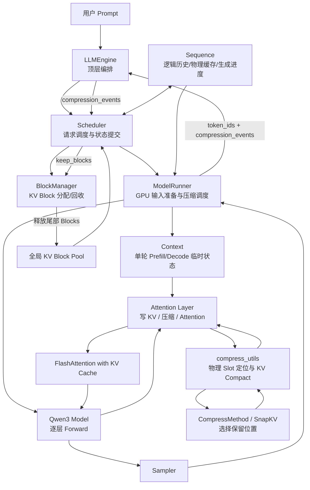
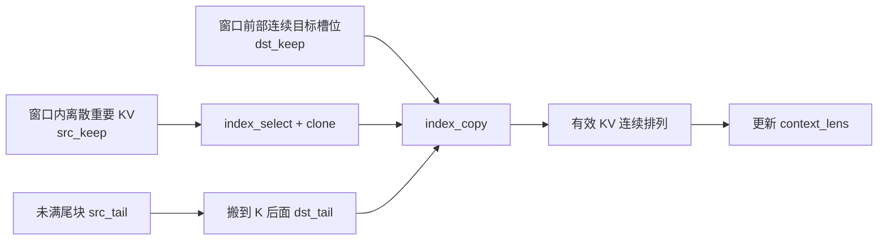
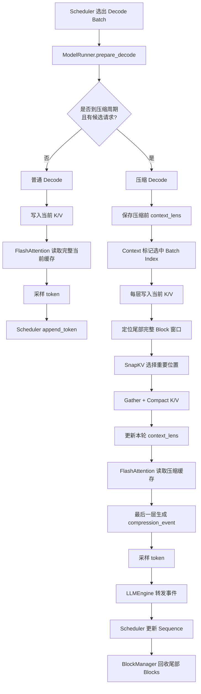
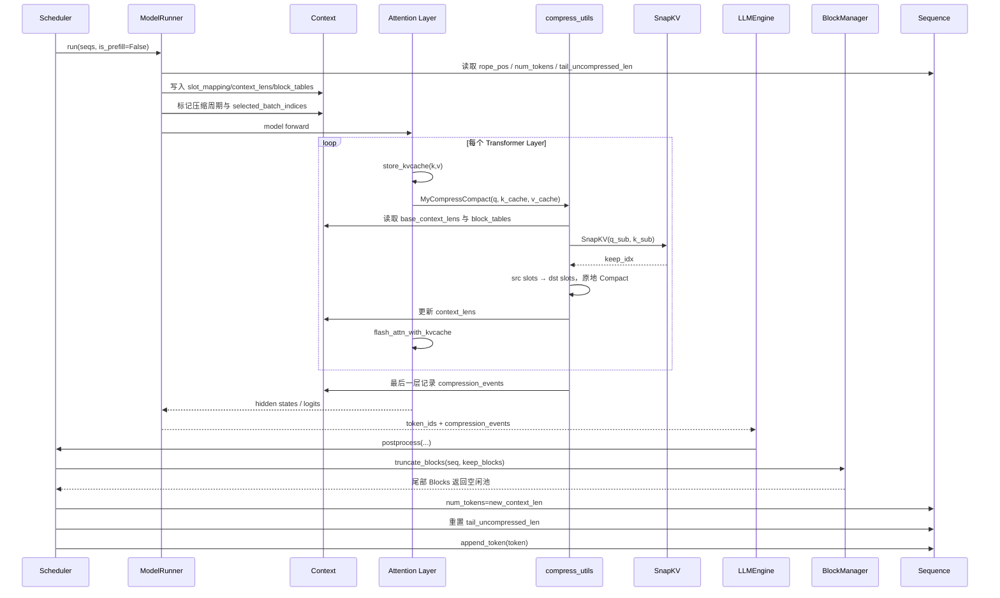
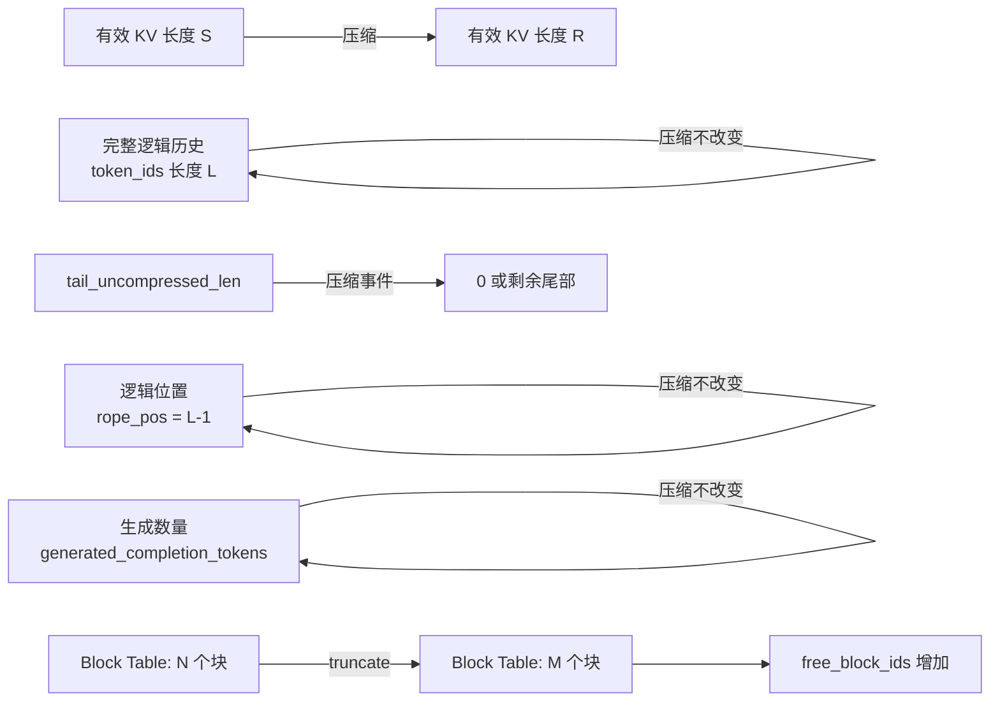
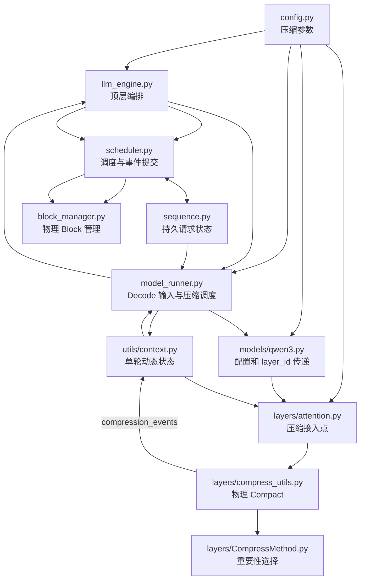

# nano-kvLLM 项目整体改动与 KV Cache 压缩全链路分析

> 面向已经学习过 nano-vLLM、并逐文件阅读过 nano-kvLLM 的 AI Infra 初学者  
> 目标：不再按文件零散记忆，而是从“算法思想—GPU 数据执行—推理框架状态—物理显存回收”四个层次，把整个项目串成一条完整链路。

---

## 0. 阅读结论先行：nano-kvLLM 到底做了什么

nano-kvLLM 的核心不是简单地在 `attention.py` 中增加一个 Top-K，也不是只把 KV Cache Tensor 截短。

它完成的是一次跨越推理框架多个层次的系统改造：

```text
算法层
决定哪些历史 KV 更重要
        ↓
GPU 数据层
将离散保留 KV 紧凑搬到缓存前部
        ↓
模型执行层
让当前 FlashAttention 立即使用压缩后的上下文
        ↓
控制面
把压缩后的长度和 Block 数作为 compression_event 返回
        ↓
调度与显存管理层
更新 Sequence 状态、截断 block_table、回收物理 KV Blocks
        ↓
下一轮 Decode
继续沿真实 RoPE 时间轴生成，但只读取压缩后的 KV
```

因此，它真正解决的问题是：

> **如何把一个 KV Cache 压缩算法，嵌入到具备 Continuous Batching、Paged KV Cache、Prefix Cache、CUDA Graph、Tensor Parallel 和请求抢占机制的推理框架中，并让算法压缩结果最终转化为可复用的物理显存。**

可以用一句话概括整个项目：

> nano-kvLLM 在尽量保留 nano-vLLM 原结构的前提下，引入了基于当前 Query 的窗口式、周期式 KV Cache 选择与紧凑搬移机制，并建立了从 Attention 数据面到 Scheduler/BlockManager 控制面的压缩事件闭环。

---

# 第一部分：先理解为什么要做 KV Cache 压缩

## 1. KV Cache 是什么

在 Decoder-only 大模型中，每生成一个新 token，都要计算当前层的：

```text
Query：只服务于当前一步
Key：需要保存，供后续 token 查询
Value：需要保存，供后续 token 聚合
```

如果每一步都重新计算全部历史 token 的 K/V，Decode 会非常低效。

因此推理框架会保存历史 K/V：

```text
第 1 步生成 token₁ → 保存 K₁、V₁
第 2 步生成 token₂ → 读取 K₁、V₁，再保存 K₂、V₂
第 3 步生成 token₃ → 读取 K₁..K₂、V₁..V₂，再保存 K₃、V₃
...
```

这部分保存的历史 K/V 就是 KV Cache。

---

## 2. KV Cache 为什么会成为推理瓶颈

单条序列 KV Cache 的近似显存占用为：

```text
KV Cache bytes
≈ 2
× num_layers
× context_len
× num_kv_heads
× head_dim
× dtype_bytes
```

其中：

- `2`：Key 和 Value 两份缓存；
- `num_layers`：每层都有独立缓存；
- `context_len`：上下文越长，缓存越大；
- `num_kv_heads × head_dim`：每个 token 的 KV 向量大小；
- `dtype_bytes`：FP16/BF16 一般为 2 bytes。

批处理后还要乘活跃请求数量。

所以 KV Cache 的问题具有两个方向：

```text
单请求上下文越长 → 每条请求占用越多
并发请求越多     → 总占用线性增加
```

当显存池中的 KV Blocks 耗尽时，Scheduler 只能：

- 拒绝新请求；
- 暂停或抢占已有请求；
- 释放缓存后重新 Prefill；
- 降低最大并发；
- 降低最大上下文。

---

## 3. KV Cache 压缩的基本思想

KV Cache 压缩的核心假设是：

> 对当前生成而言，并非所有历史 token 的 K/V 都同等重要。

因此可以从长度为 `S` 的历史缓存中选择 `R` 个重要 KV：

```text
原缓存：S 个 KV
        ↓ 重要性选择
保留：R 个 KV，R < S
```

后续 Decode 只读取这 `R` 个保留项。

这和 KV Cache 量化、Offload 的区别是：

| 技术 | 改变什么 | 典型目标 |
|---|---|---|
| KV Cache 压缩/稀疏化 | 减少保留 token 数 | 缩短上下文缓存长度 |
| KV Cache 量化 | 降低每个 KV 元素的位宽 | 减少每 token 字节数 |
| KV Cache Offload | 把缓存迁移到 CPU/其他介质 | 扩大可用容量，牺牲传输成本 |
| Prefix Cache | 复用相同 Prompt 的已有 KV | 避免重复 Prefill |
| Paged KV Cache | 按 Block 管理物理缓存 | 减少碎片并支持动态调度 |

nano-kvLLM 做的是第一类，并与原有 Paged KV Cache 结合。

---

## 4. 为什么“写一个压缩算法”远远不够

假设算法已经得出：

```text
保留 token 下标 = [0, 8, 31, 66, 100, ...]
```

系统仍然必须解决以下问题：

1. 这些下标对应 GPU Paged KV Cache 中哪些物理槽位？
2. 离散保留 KV 如何整理为 FlashAttention 可读取的连续布局？
3. K 和 V 如何使用完全相同的索引搬移？
4. 压缩后当前 Attention 应读取多少 token？
5. 下一 token 的 RoPE 位置是否会错误重置？
6. Sequence 的逻辑历史长度和物理缓存长度如何区分？
7. 哪些物理 Blocks 已经不再需要？
8. Block 引用计数如何更新？
9. 压缩事件如何从 GPU 模型层返回 Scheduler？
10. 请求被抢占后如何恢复完整历史重新 Prefill？
11. CUDA Graph 如何处理动态压缩分支？
12. Prefix Cache 共享 Block 被原地改写时怎么办？

nano-kvLLM 的工程改动正是围绕这些问题展开。

---

# 第二部分：整个项目的宏观改动方向

## 5. 八个主要改动方向

nano-kvLLM 相比 nano-vLLM 的改动可以归纳为八个方向。

### 方向一：增加压缩配置入口

涉及：

```text
config.py
```

新增：

- 是否开启压缩；
- 全局压缩周期；
- 每个压缩步最多处理多少 Sequence；
- 压缩窗口包含多少 Blocks；
- 窗口压缩后保留多少完整 Blocks；
- 额外保留多少 token。

它解决的是：

> 压缩策略如何由外部配置，并支持开关和 Benchmark。

---

### 方向二：把 Sequence 拆成多条状态轴

涉及：

```text
sequence.py
```

新增或强化：

- 完整逻辑 token 历史；
- 实际生成 token 数；
- RoPE 逻辑位置；
- 当前压缩后有效 KV 长度；
- 最近未压缩增长量；
- 物理 Block Table。

它解决的是：

> 压缩后，“生成到哪里”“缓存还剩多少”“下一 token 用什么位置”不再是同一个数。

---

### 方向三：建立压缩运行时调度

涉及：

```text
model_runner.py
utils/context.py
```

负责：

- 统计全局 Decode Step；
- 周期性检查压缩；
- 判断哪些 Sequence 已积累足够未压缩窗口；
- 每步只选择有限数量请求；
- 把选择结果写入 Context。

它解决的是：

> 何时压缩、压缩哪些请求，以及如何控制压缩开销峰值。

---

### 方向四：增加 Query-aware KV 选择算法

涉及：

```text
CompressMethod.py
```

负责：

- 用当前 Query 与窗口内 Key 做相关性评分；
- 兼容 MHA 和 GQA；
- 聚合各 Query Heads 的重要性；
- Top-K 选择历史位置；
- 固定保留窗口锚点和近期位置。

它解决的是：

> 压缩窗口内具体保留哪些 KV。

---

### 方向五：把算法索引转换为 Paged KV 物理搬移

涉及：

```text
compress_utils.py
```

负责：

- 根据 Block Table 找到物理 Slot；
- Gather 待压缩 K/V；
- 根据 `keep_idx` 找到源槽位；
- 将离散 KV 紧凑写入窗口前部；
- 搬移未满尾块；
- 更新本轮 GPU Context Length；
- 在最后一层生成压缩事件。

它解决的是：

> 如何让算法结果真正成为可被 FlashAttention 使用的压缩缓存。

---

### 方向六：把压缩插入 Attention 数据路径

涉及：

```text
models/qwen3.py
attention.py
```

负责将完整 Config、总层数和 Layer ID 传到每层 Attention，并在 Decode 中执行：

```text
写入当前 token KV
→ 压缩
→ FlashAttention 读取压缩缓存
```

它解决的是：

> 压缩发生在哪个时刻，以及如何在本轮立刻生效。

---

### 方向七：建立压缩事件反馈闭环

涉及：

```text
model_runner.py
llm_engine.py
scheduler.py
```

返回协议从：

```text
token_ids
```

变为：

```text
token_ids + compression_events
```

它解决的是：

> GPU 数据面完成压缩后，CPU 控制面如何知道缓存长度和 Block 占用已经变化。

---

### 方向八：真正回收物理 KV Blocks

涉及：

```text
block_manager.py
```

新增：

```text
truncate_blocks()
```

负责：

- 截断 `seq.block_table`；
- 降低尾部 Block 引用计数；
- 将引用计数归零的 Block 放回空闲池；
- 调整缓存元数据。

它解决的是：

> 如何把算法上的“上下文变短”转化为系统可用显存增加。

---

# 第三部分：整个项目的分层架构

## 6. 总体架构图



---

## 7. 控制面与数据面的分工

这是理解 nano-kvLLM 最关键的架构视角。

### 7.1 数据面

数据面直接处理 GPU Tensor：

```text
ModelRunner
Attention
compress_utils
CompressMethod
FlashAttention
```

负责：

- 计算 Q/K/V；
- 写入 KV Cache；
- 计算重要性；
- Gather/Compact；
- 更新 GPU 上本轮 `context_lens`；
- 计算 Attention 输出。

### 7.2 控制面

控制面管理请求和资源：

```text
LLMEngine
Scheduler
Sequence
BlockManager
```

负责：

- 哪些请求本轮运行；
- 每条请求有哪些 Blocks；
- 压缩后保留多少 Blocks；
- 哪些 Blocks 可以回收；
- 请求是否完成；
- 抢占后如何重算。

### 7.3 `compression_events` 是两者之间的桥

```text
数据面：
我已经把请求 i 的 KV 压缩到 new_context_len，
只需保留 keep_blocks 个 Blocks。

控制面：
收到，我会同步 Sequence 和 BlockManager，
并把多余 Blocks 放回空闲池。
```

没有该事件桥，GPU Tensor 和调度器元数据会脱节。

---

# 第四部分：一次请求从 Prefill 到多次压缩的完整生命周期

## 8. 阶段一：请求进入与 Prefill

用户 Prompt 经 Tokenizer 变成：

```text
token_ids = [t0, t1, ..., tN-1]
```

创建 `Sequence` 后：

```text
token_ids                    = 完整 Prompt
num_prompt_tokens            = N
num_tokens                   = N
generated_completion_tokens  = 0
rope_pos                     = N - 1
tail_uncompressed_len        = 0
block_table                  = []
```

Scheduler 检查：

- 本轮 Token Budget；
- 可用 KV Blocks；
- Prefix Cache 命中。

BlockManager 分配 Block Table。

ModelRunner 的 Prefill 路径：

```text
input_ids = 未命中的 Prompt 后缀
positions = Prompt 的真实位置
slot_mapping = 对应物理 KV Slot
```

Attention 将 Prompt K/V 写入全局 KV Cache。

当前版本为了简化压缩集成，弱化或取消了原版 Chunked Prefill，通常要求完整 Prompt 可以一次进入 Prefill。

---

## 9. 阶段二：普通 Decode

Prefill 后采样第一个生成 token，Scheduler 执行：

```text
Sequence.append_token()
```

状态变化：

```text
token_ids 增加 1
num_tokens 增加 1
generated_completion_tokens 增加 1
rope_pos 增加 1
tail_uncompressed_len 增加 1
```

下一轮 Decode：

```text
input_ids    = last_token
positions    = rope_pos
context_lens = 当前有效 KV 长度
slot_mapping = 当前 token 写入的物理槽位
```

普通 Decode 不触发压缩时：

```text
store_kvcache
→ flash_attn_with_kvcache
→ sample
```

---

## 10. 阶段三：达到周期与窗口条件

ModelRunner 维护：

```text
decode_step_counter
```

每到：

```text
decode_step_counter % kv_compress_period == 0
```

进入压缩候选检查。

对每条 Sequence，检查：

```text
tail_uncompressed_len >= window_blocks × block_size
且
当前至少存在 window_blocks 个完整 Block
```

随后从候选中取前 `kv_compress_topk` 条请求。

注意这里的 `topk` 表示：

```text
每个压缩步最多处理多少条 Sequence
```

不是 SnapKV 内部要保留多少 token。

---

## 11. 阶段四：把压缩选择写入 Context

ModelRunner 将本轮信息写入 Context：

```text
is_compress_step
compress_selected_batch_indices
compress_selected_seq_ids
compress_base_context_lens
```

`compress_base_context_lens` 是压缩前长度快照。

它非常重要，因为 Layer 0 压缩后会修改 `context.context_lens`，后续各层仍必须按照同一个压缩前窗口定位自己的 K/V。

---

## 12. 阶段五：每层 Attention 执行压缩

每层执行：

```text
Q/K/V 投影
→ Q/K RoPE
→ store_kvcache
→ MyCompressCompact
→ flash_attn_with_kvcache
```

这里的顺序非常关键。

### 为什么先 Store

当前 Decode token 的 K/V 先进入缓存：

- 当前 Query 可以评估最近历史；
- 当前 token 的 KV 可以进入尾部保护区域；
- 压缩后可以直接得到本轮最终布局。

### 为什么压缩在 Attention 前

压缩函数会立即更新：

```text
context.context_lens
```

因此本轮 FlashAttention 就只读取压缩后的缓存，减少本轮 KV 读取量。

---

## 13. 阶段六：SnapKV-style 重要性选择

对选中的请求，提取尾部窗口：

```text
K: [m, Hk, window_tokens, D]
Q: [m, Hq, 1, D]
```

计算：

```text
attention score = QKᵀ / √D
```

GQA 下多个 Query Heads 共享 KV Head，代码会重排 Query 后进行分组矩阵乘法。

然后：

```text
Softmax
→ 跨 Query Window 求和
→ 跨 Query Heads 聚合
→ Top-K
```

最终保留：

```text
窗口首部锚点
+ Top-K 重要位置
+ 窗口最后的近期位置
```

并按原始位置排序。

需要准确理解：

- 当前实现只使用一个当前 Query；
- “BOS”变量实际是压缩窗口第一个位置，不是全局 BOS；
- 它是 SnapKV 思路的轻量实现，不等于完整官方 SnapKV 实现。

---

## 14. 阶段七：从算法索引映射到 Paged KV 物理槽位

Paged KV Cache 不是一个按请求连续存储的数组。

每条 Sequence 通过：

```text
block_table
```

将逻辑 Block 映射到全局物理 Block。

例如：

```text
逻辑 Block 0 → 物理 Block 17
逻辑 Block 1 → 物理 Block 3
逻辑 Block 2 → 物理 Block 42
```

`compress_utils.py` 需要先把窗口内 Block 展开成绝对 Slot：

```text
absolute_slot = block_id × block_size + offset
```

然后：

```text
keep_idx
→ src_keep 物理源槽位
```

---

## 15. 阶段八：KV Compact

压缩前的局部布局：

```text
[P][W0 W1 W2 W3][T]
```

其中：

- `P`：不参与本次压缩的旧前缀；
- `W`：最后若干完整 Blocks；
- `T`：窗口之后的未满尾块。

SnapKV 从 `W` 中选出 `K`：

```text
[P][K][T]
```

物理执行过程：



之所以先 `index_select().clone()`，是为了处理源和目标区域重叠：

```text
先把所有源数据完整保存
再覆盖目标区域
```

否则前移时可能覆盖尚未读取的 KV。

---

## 16. 阶段九：FlashAttention 使用压缩后的 KV

压缩完成后：

```text
context.context_lens[seq] = new_context_len
```

随后同一层调用：

```text
flash_attn_with_kvcache
```

FlashAttention 仍使用原接口：

- 全局 `k_cache`；
- 全局 `v_cache`；
- `block_table`；
- 压缩后的 `cache_seqlens`。

这要求压缩后的有效 KV 必须连续位于前部逻辑槽位，不能存在空洞。

---

## 17. 阶段十：生成压缩事件

最后一层完成 Compact 后，生成事件：

```text
batch_index
new_context_len
keep_blocks
freed_block_ids
tail_uncompressed_len_after
```

其中：

```text
keep_blocks = ceil(new_context_len / block_size)
```

事件只在最后一层生成，避免每层重复上报。

---

## 18. 阶段十一：事件返回 CPU 控制面

```text
Attention/Context
→ ModelRunner.run()
→ LLMEngine.step()
→ Scheduler.postprocess()
```

`LLMEngine` 从原来的：

```text
只接收 token_ids
```

改成兼容：

```text
(token_ids, compression_events)
```

其本身不执行压缩，只负责把执行侧结果转交控制侧。

---

## 19. 阶段十二：Scheduler 更新 Sequence

Scheduler 根据 `batch_index` 找到请求，执行：

```text
BlockManager.truncate_blocks(seq, keep_blocks)
seq.num_tokens = new_context_len
seq.tail_uncompressed_len = tail_uncompressed_len_after
```

之后再追加本轮采样出的新 token。

所以压缩后的状态会变成：

```text
缓存长度先从 S 降到 R
再因 append_token 增加 1
```

---

## 20. 阶段十三：BlockManager 真正释放物理 Blocks

`truncate_blocks()`：

```text
保留 block_table[:keep_blocks]
释放 block_table[keep_blocks:]
```

对尾部 Block：

```text
ref_count -= 1
若 ref_count == 0：
    从 used_block_ids 移除
    加入 free_block_ids
```

此时压缩才真正产生系统资源收益。

---

# 第五部分：最重要的状态模型

## 21. 为什么压缩后需要多条“长度轴”

在原版 nano-vLLM 中，以下概念通常接近：

```text
逻辑 token 总数
当前 RoPE 位置
KV Cache 有效长度
需要的 Block 数
```

压缩后它们会分离。

假设：

```text
Prompt 长度 = 1000
已生成 token = 500
完整逻辑历史 = 1500
压缩后有效 KV = 700
```

此时：

```text
len(token_ids)               = 1500
generated_completion_tokens  = 500
rope_pos                     = 1499
num_tokens（当前实现）        = 700
block_table 容量             ≈ ceil(700 / block_size)
```

---

## 22. 各字段的准确职责

| 字段 | 表示什么 | 压缩时是否回退 |
|---|---|---|
| `token_ids` | 完整 Prompt + 全部生成 token | 否 |
| `generated_completion_tokens` | 实际生成了多少 token | 否 |
| `rope_pos` | 当前 token 在真实逻辑时间轴的位置 | 否 |
| `num_tokens` | 当前实现中常被重写为有效 KV 上下文长度 | 是 |
| `tail_uncompressed_len` | 上次压缩后新增了多少 token | 重置/调整 |
| `block_table` | 当前 Sequence 持有的物理 KV Blocks | 截断 |
| `num_cached_tokens` | Prefix Cache/缓存进度相关统计 | 需要同步 |
| `last_token` | 下一次 Decode 的输入 token | 否 |

---

## 23. RoPE 位置与 Context Length 为什么必须分离

ModelRunner 的 Decode 准备改成：

```text
positions    = seq.rope_pos
context_lens = len(seq)
```

其中：

- `positions` 回答：当前 token 在真实时间轴上是第几个；
- `context_lens` 回答：当前 Attention 实际可以读取多少 KV。

压缩后：

```text
逻辑位置可能是 4095
有效 KV 长度可能是 1280
```

旧 Key 已经带有原始位置的 RoPE 旋转结果。

Compact 只是移动 Key 的物理槽位，不重新做 RoPE，所以其逻辑位置语义仍保留。

---

## 24. 当前 `num_tokens` 双重语义是项目最难理解的点

当前实现中：

```text
未压缩或抢占重算时：
num_tokens ≈ 完整逻辑长度

压缩运行时：
num_tokens = 当前有效 KV 长度
```

因此请求被抢占后，需要：

```text
seq.num_tokens = len(seq.token_ids)
```

恢复完整逻辑历史，才能重新 Prefill。

这种字段复用实现简单，但理解和维护成本较高。

更清晰的工程设计应拆分为：

```text
logical_num_tokens
active_context_len
```

---

# 第六部分：算法知识与工程实现如何对应

## 25. 算法层真正解决的问题

算法层只解决：

```text
窗口内哪些 KV 应保留
```

它不关心：

- Block ID；
- 引用计数；
- Shared Memory；
- Scheduler；
- CUDA Graph；
- 抢占；
- Prefix Cache 哈希。

当前选择公式：

```text
score(q, k_i) = q · k_i / √D
```

然后：

```text
p_i = softmax(score_i)
```

跨 Heads 聚合后选 Top-K。

---

## 26. 工程层真正解决的问题

工程层解决：

```text
如何让选择结果在推理框架中可靠运行
```

对应关系如下。

| 算法概念 | 工程实现 |
|---|---|
| 压缩窗口 | `window_blocks × block_size` |
| 当前 Query | Attention Forward 中的 `q_current` |
| 历史 Key | 根据 Block Table Gather 的 `k_sub` |
| Top-K 索引 | `keep_idx` |
| 保留 KV | `src_keep` |
| 压缩后连续布局 | `dst_keep` |
| 保护近期尾部 | `src_tail → dst_tail` |
| 新有效长度 | `new_context_lens_tensor` |
| 可释放块数 | `keep_blocks_after` |
| 系统状态提交 | `compression_events` |
| 实际物理回收 | `truncate_blocks()` |

---

## 27. 为什么算法和工程必须同时理解

只懂算法，会出现：

```text
我知道 Top-K，但不知道为什么 nvidia-smi 显存不降；
不知道为什么要 Compact；
不知道为什么还要 Scheduler 和 BlockManager；
不知道为什么压缩后 RoPE 会出错。
```

只懂工程，会出现：

```text
我知道事件和 Block 回收，但不知道保留索引为什么合理；
不知道 Query-aware 与滑动窗口的区别；
不知道 GQA 下 Q/K Head 如何匹配；
不知道压缩率与质量如何权衡。
```

真正完整的理解应该是：

```text
Query-aware 选择减少有效历史
        +
Paged KV Compact 保证连续物理布局
        +
事件闭环保证元数据一致
        +
Block 回收把算法收益转成并发容量
```

---

# 第七部分：详细流程结构图

## 28. 普通 Decode 与压缩 Decode 对比



---

## 29. 压缩 Decode 时序图



---

## 30. 状态变化图



---

## 31. 文件调用关系图



---

# 第八部分：每个核心文件在整条链路中的职责

## 32. `config.py`：压缩策略入口

新增参数大致控制：

```text
kv_compress_enabled
kv_compress_period
kv_compress_topk
kv_compress_window_blocks
kv_compress_keep_blocks
kv_compress_keep_extra_tokens
```

重要关系：

```text
window_tokens
= window_blocks × block_size

keep_tokens
= keep_blocks × block_size + keep_extra_tokens
```

必须满足：

```text
0 < keep_tokens < window_tokens
```

否则没有真实压缩收益。

---

## 33. `utils/context.py`：单轮 GPU 执行的临时总线

新增：

```text
compression_events
is_compress_step
compress_selected_batch_indices
compress_selected_seq_ids
compress_base_context_lens
compress_any
```

它不是长期状态，不跨请求生命周期永久保存。

它的作用是：

```text
ModelRunner 写入本轮决策
→ 所有 Attention 层读取
→ 最后一层写入事件
→ ModelRunner 在 reset 前取出
```

---

## 34. `models/qwen3.py`：把压缩参数和层编号送进 Attention

主要变化：

- 模型构造接收完整 Config；
- 每层 Attention 接收压缩配置；
- Forward 时传入 `layer_id`；
- 最后一层可以被压缩工具识别。

它本身不执行选择或搬移，只负责打通参数传播链。

---

## 35. `sequence.py`：持久状态模型

关键新增：

```text
generated_completion_tokens
rope_pos
tail_uncompressed_len
seq_id 序列化
完整 token_ids 序列化
```

Sequence 是连接：

```text
Scheduler
BlockManager
ModelRunner
多进程 Worker
```

的状态对象。

---

## 36. `model_runner.py`：压缩运行时控制中心

负责：

- Decode 输入准备；
- `rope_pos` 与 `context_lens` 分离；
- 全局压缩周期；
- 候选 Sequence 选择；
- Context 广播；
- 压缩步 CUDA Graph/eager 路径；
- 收集和返回事件。

---

## 37. `attention.py`：压缩接入点

核心执行顺序：

```text
store_kvcache
→ MyCompressCompact
→ flash_attn_with_kvcache
```

压缩关闭时基本退化为原版路径。

---

## 38. `CompressMethod.py`：算法策略层

只输出：

```text
keep_idx
```

它和物理缓存管理解耦，因此可以替换成其他算法。

---

## 39. `compress_utils.py`：算法到系统的桥

负责四种映射：

```text
逻辑 Block → 物理 Slot
算法索引 → 源 Slot
分散 KV → 连续目标 Slot
压缩结果 → compression_event
```

---

## 40. `llm_engine.py`：事件传递桥

从：

```text
run() → token_ids
```

改成：

```text
run() → token_ids, compression_events
```

并把事件交给 Scheduler。

此外加入 CUDA 同步计时，主要服务 Benchmark，不是压缩核心算法。

---

## 41. `scheduler.py`：压缩结果提交点

负责：

- 根据 Batch Index 找到 Sequence；
- 调用 `truncate_blocks()`；
- 更新有效缓存长度；
- 重置压缩周期状态；
- 继续 append token；
- 用独立生成计数判断停止；
- 抢占时恢复完整逻辑历史。

---

## 42. `block_manager.py`：压缩收益落地层

如果没有它，压缩只是：

```text
Attention 少读一些 KV
```

加入 `truncate_blocks()` 后才会变成：

```text
请求实际占用 Block 减少
→ 全局空闲 Block 增加
→ 可以接纳更多请求
```

---

# 第九部分：一个带数字的完整例子

## 43. 配置假设

```text
block_size = 256
window_blocks = 4
keep_blocks = 2
keep_extra_tokens = 1
```

因此：

```text
window_tokens = 4 × 256 = 1024
keep_tokens   = 2 × 256 + 1 = 513
```

每次对一个 1024-token 完整窗口压缩到 513 token。

理论上该窗口减少：

```text
1024 - 513 = 511 token
```

物理 Block 数从：

```text
4 Blocks
```

降到：

```text
ceil(513 / 256) = 3 Blocks
```

单次释放 1 个 Block。

注意：虽然 token 压缩率接近 50%，但由于 Block 对齐，只释放 25% 的窗口 Blocks。

这说明实际系统收益要按：

```text
释放 Block 数
```

而不是只看 token 压缩比例。

---

## 44. 序列压缩前

假设当前有效 KV 长度：

```text
old_context_len = 2124
```

则：

```text
full_blocks = 8
tail_len = 76
```

最后 4 个完整 Blocks 是压缩窗口，尾部还有 76 token。

布局：

```text
前缀 4 Blocks
+ 压缩窗口 4 Blocks
+ 尾部 76 token
```

---

## 45. 压缩后

新长度：

```text
new_context_len
= 2124 - 1024 + 513
= 1613
```

所需 Block 数：

```text
ceil(1613 / 256) = 7 Blocks
```

原来需要：

```text
ceil(2124 / 256) = 9 Blocks
```

因此可以释放：

```text
2 Blocks
```

为什么不是只释放窗口中的 1 Block？

因为前面已有 4 Blocks，压缩窗口从 4 Block 变为 3 Block，加尾部 76 token 会接在压缩后区域，整体重新对齐后总容量减少 2 Blocks。

具体结果由 `new_context_len` 的全局 Block 对齐决定。

---

## 46. 逻辑时间轴不变

假设该请求完整历史已经有 5000 token：

```text
rope_pos = 4999
len(token_ids) = 5000
```

压缩后：

```text
active_context_len = 1613
rope_pos 仍为 4999
```

下一 token：

```text
position = 5000
```

而不是：

```text
position = 1613
```

---

# 第十部分：KV Cache 压缩带来的实际工程收益

## 47. 显存池视角

nano-vLLM 通常在启动时预分配一个全局 KV Cache Tensor Pool。

nano-kvLLM 压缩后并不一定让：

```text
nvidia-smi 已占用总显存
```

立即下降，因为全局 Pool 仍然存在。

真正变化的是：

```text
used_block_ids 减少
free_block_ids 增加
```

因此应关注：

- 每条请求平均占用 Block 数；
- 空闲 Block 数；
- 最大同时运行请求数；
- 抢占次数；
- 可支持的生成长度；
- 相同显存下完成的请求数量。

---

## 48. Attention 计算视角

Decode Attention 常受显存带宽影响：

```text
每步需要读取历史 K/V
```

压缩后 Context Length 变短，理论上：

- K/V 读取量减少；
- FlashAttention Decode 延迟降低；
- TPOT 可能改善。

但压缩本身增加：

- QK 重要性计算；
- Softmax；
- Top-K；
- Gather；
- KV Compact；
- GPU/CPU 同步。

所以最终收益取决于：

```text
节省的长期 Attention 成本
是否大于周期性压缩成本
```

---

## 49. 并发视角

压缩最直接的系统收益通常是：

```text
同样 KV Pool 可以容纳更多请求
```

尤其在：

- 长输出；
- 多轮对话；
- 高并发 Decode；
- Prompt 不太长、输出持续增长；

场景中收益更明显。

---

# 第十一部分：Benchmark 应该如何设计

## 50. 必测指标

### 50.1 资源指标

- 峰值活跃 Block 数；
- 平均每请求 Block 数；
- 空闲 Block 数随时间变化；
- 压缩事件次数；
- 每次释放 Block 数；
- 抢占/重算次数；
- 最大并发请求数。

### 50.2 性能指标

- TTFT；
- TPOT；
- Decode throughput；
- 端到端 latency；
- 压缩 Step 的 P50/P95/P99 时延；
- 普通 Decode Step 与压缩 Step 分开统计；
- 总生成 token / 总 Decode 时间。

### 50.3 质量指标

- Perplexity；
- LongBench/Needle-in-a-Haystack；
- 多轮对话一致性；
- 长上下文问答准确率；
- 压缩率—质量曲线；
- 不同 Query Window 的质量对比。

---

## 51. 建议实验矩阵

| 变量 | 建议取值 |
|---|---|
| 压缩开关 | off / on |
| 输入长度 | 512 / 2K / 4K / 8K |
| 输出长度 | 128 / 512 / 2K / 4K |
| 并发 | 1 / 4 / 16 / 32 |
| period | 128 / 256 / 512 / 1024 |
| window_blocks | 2 / 4 / 8 |
| keep ratio | 25% / 50% / 75% |
| 每步压缩请求数 | 1 / 4 / 8 / 20 |
| eager / CUDA Graph | 分开测试 |

---

## 52. 吞吐统计需要注意

不能只对每步 `tokens/s` 做算术平均。

正确的总体 Decode 吞吐是：

```text
Decode 总 token 数 / Decode 总时间
```

同时应单独统计：

```text
普通 Decode Step
压缩 Decode Step
```

否则平均值会掩盖周期性延迟尖峰。

---

# 第十二部分：当前源码的工程取舍与潜在问题

## 53. 该项目更像研究原型，而不是生产级 vLLM 功能

它的主要价值是：

- 代码量小；
- 调用链清楚；
- 容易理解 KV 压缩落地；
- 容易替换算法；
- 适合实验与简历项目。

它没有完整解决所有生产问题。

---

## 54. `num_tokens` 双重语义

风险：

- 某个模块把有效缓存长度当逻辑历史长度；
- `num_completion_tokens` 计算失真；
- Block 数计算误用；
- 抢占重算忘记恢复。

建议：

```text
logical_num_tokens
active_context_len
```

显式分开。

---

## 55. Prefix Cache 与压缩缓存冲突

压缩会改写原物理 Blocks 中的 KV 内容。

但 BlockManager 仍可能保留原来的：

```text
hash
token_ids
hash_to_block_id
```

风险：

- 压缩过的 Block 被当作原始 Prompt Prefix Cache 复用；
- 旧哈希映射指向已被改写的 KV；
- 输出错误且难以定位。

更安全的方案：

- 压缩过的 Blocks 全部失去 Prefix Cache 资格；
- 为压缩 Sequence 标记 `is_compressed`；
- 压缩前确保窗口不包含共享 Prefix Blocks；
- 或实现 Copy-on-Write。

---

## 56. 共享 Block 原地 Compact 风险

如果窗口 Block：

```text
ref_count > 1
```

直接写入会破坏其他请求。

必须保证：

```text
压缩窗口全部是请求独占 Blocks
```

或者先 Copy-on-Write。

项目的“只压缩最近未压缩窗口”设计有助于让窗口落在 Decode 独占区域，但源码仍应显式验证。

---

## 57. Prefix Cache 哈希发布时间过早

新版 BlockManager 在 `allocate()` 或 `may_append()` 中可能在 KV 真正计算完成前登记哈希。

更稳健的状态应是：

```text
ALLOCATED
→ COMPUTING
→ READY
```

只有 Forward 成功完成后才进入 Prefix Cache。

---

## 58. `can_allocate()` 过于保守

当前可能要求：

```text
free Blocks >= Sequence 全部 Blocks
```

即使其中大量 Blocks 可共享 Prefix Cache，也可能拒绝请求。

结果：

- 并发接纳率降低；
- 队首阻塞；
- Prefix Cache 收益不能充分利用。

---

## 59. CUDA Graph 压缩步切换疑点

ModelRunner 试图通过：

```text
compress_any
```

判断压缩步是否切回 eager。

但当前调用顺序中，该值可能在 Forward 前仍为 False。

更合理的判断是：

```text
bool(compress_selected_batch_indices)
```

压缩函数包含动态 Python List、`.item()`、事件对象和动态 Gather/Compact，通常不适合直接进入原普通 Decode CUDA Graph。

---

## 60. 运行时压缩开关可能没有真正传播到已构造的层

仓库中的聊天入口会修改：

```text
model_runner.config.kv_compress_enabled
```

但 `ModelRunner` 和每个 `Attention` 在初始化时又分别缓存了：

```text
self.kv_compress_enabled
```

如果运行时只修改 Config，而没有同步修改这些已经构造好的实例字段，那么 `/compress on`、`/compress off` 可能不能完整改变实际执行路径。

更可靠的方案是：

- 每轮直接从统一 Config 读取；或
- 提供 `set_kv_compress_enabled()`，同时更新 ModelRunner 与所有 Attention 层；或
- 把开关放入每轮 Context。

---

## 61. 大量 GPU→CPU 同步

`compress_utils.py` 中存在：

```text
.item()
.tolist()
Python List 循环
```

这些会导致：

- GPU Pipeline 停顿；
- 压缩 Step 延迟尖峰；
- 无法 Graph Capture；
- 高并发性能下降。

后续可用 Triton/CUDA Kernel 融合：

```text
Window Gather
Importance Top-K
KV Compact
Event Buffer
```

---

## 62. 完整 `token_ids` 跨进程传输

新版 Sequence Decode 时也可能序列化完整历史。

优点：

- 抢占恢复简单；
- 调试方便；
- 逻辑历史完整。

代价：

- 长上下文 IPC 数据量持续增长；
- Shared Memory 固定大小可能溢出；
- CPU pickle 开销上升。

生产实现应只传增量或使用共享 Tensor 元数据。

---

## 63. Warmup 边界

若：

```text
max_model_len > max_num_batched_tokens
```

当前 Warmup 计算可能得到零条 Sequence。

需要恢复：

```text
seq_len = min(max_model_len, max_num_batched_tokens)
```

的保护。

---

## 64. `tail_uncompressed_len_after` 语义不清

压缩函数保留了窗口后的未满尾块，但事件固定返回 0。

如果该字段表示：

```text
距上次压缩后的新增量
```

清零合理。

如果表示：

```text
当前仍未被压缩的真实尾部长度
```

则应返回 `tail_len`。

需要统一命名和语义。

---

## 65. README/CHANGE_LOG 与当前源码存在版本差异

仓库文档同时出现过两类策略：

```text
旧版：长度达到 S 时压缩到 R
当前源码：周期式 + 窗口式 + 每步 Top-K Sequence
```

理解项目时应以当前源码为准：

```text
period
window_blocks
keep_blocks
keep_extra_tokens
```

旧的 `S/R/query_window_size` 可以视为历史版本或 KvChat 分支设计。

---

## 66. 与压缩无直接关系的改动

以下修改不应与核心压缩思想混在一起：

- `dataclass(slots=True)` 改成普通 dataclass；
- `Sampler`/`SiluAndMul` 增加显式 `__init__`；
- 未使用的 Tokenizer、`os`、`math` 导入；
- Benchmark 进度条调整；
- 部分 dtype 字段兼容；
- `linear.py` 权重加载分支删除。

特别是 `linear.py` 删除一维参数直接复制分支，可能是独立兼容性变化甚至潜在回归，不是 KV Cache 压缩所必需。

---

# 第十三部分：对几个容易混淆问题的准确解释

## 67. 压缩后是不是删除了 token？

没有删除用户可见的完整 token 历史。

```text
token_ids 仍保存全部历史
```

被删除的是部分历史 token 在各 Attention 层中的 K/V 表示。

因此：

- 最终文本仍完整；
- 抢占后可以用 token_ids 重新 Prefill；
- 后续 Attention 不再访问被淘汰的 KV。

---

## 68. 每层必须保留相同的 token 吗？

不一定。

每个 Transformer Layer 有自己独立的 K/V Cache。

当前实现可以让每层根据本层 Q/K 得到不同 `keep_idx`。

真正必须一致的是：

```text
压缩后的有效长度
所需 Block 数
可释放物理 Block 形状
```

同一个紧凑槽位在不同层可以保存不同原始历史位置的 KV，因为每层 Attention 只读取自己的缓存。

但如果未来需要跨层共享 token 映射、恢复原 token 身份或使用统一稀疏索引，则需要共享保留位置。

---

## 69. 不同 Tensor Parallel Rank 必须保留相同 token 吗？

也不一定要求语义位置完全相同。

每个 TP rank 保存不同 Head 分片的 K/V，各 rank 可以基于本地 Heads 选择不同历史位置，只要：

- 每个 rank 压缩后的长度一致；
- 每个 rank 的 Block 数一致；
- 调度器释放的物理 Block 数一致；
- rank 间模型执行保持确定性。

如果希望算法严格等同于全 Heads 聚合的重要性，则需要 All-Reduce 或 Rank 0 广播索引。

当前源码没有显式全局聚合，因此更接近 rank-local/head-group-local 选择。

---

## 70. 为什么物理槽位变了，RoPE 不需要重新计算？

Key 在生成时已经经过原始逻辑位置的 RoPE。

例如：

```text
原位置 1000 的 Key
```

被搬到物理槽位 100 后，其向量仍然包含位置 1000 的旋转信息。

物理地址只决定从哪里读取，不代表逻辑位置。

---

## 71. 为什么需要 Compact，不能只保留一个索引列表？

当前 FlashAttention 接口接收：

```text
连续 context_len
+ block_table
```

它没有接收任意稀疏 token 索引列表。

所以必须把离散保留项压紧为：

```text
前 R 个逻辑缓存位置全部有效
```

否则中间空洞会被当作有效 KV 读取。

---

## 72. 为什么压缩后 nvidia-smi 可能看不出变化？

因为全局 KV Cache Pool 已经预分配。

压缩释放的是 Pool 内部的 Blocks，不一定把整个 CUDA Tensor 归还给驱动。

应看：

```text
free_block_ids
最大并发
抢占次数
每请求 Block 数
```

---

# 第十四部分：如何用一句面试回答讲清楚项目

## 73. 30 秒版本

> nano-kvLLM 是在 nano-vLLM 上实现在线 KV Cache 压缩。它在 Decode 阶段周期性选择积累了完整未压缩窗口的请求，使用当前 Query 对窗口内 Key 做 SnapKV-style 重要性评分，保留高分 KV，并把离散 K/V 原地紧凑到 Paged KV Cache 前部。压缩后立即更新 FlashAttention 的 context length，同时通过 compression events 把新长度和保留 Block 数返回 Scheduler，最终由 BlockManager 截断 block table 并回收尾部 Blocks。为保证正确性，项目还将 RoPE 逻辑位置、生成 token 数和压缩后缓存长度拆开维护。

---

## 74. 两分钟版本

可以按四层讲：

1. **算法层**：当前 Query 与历史 Key 计算相关性，Top-K 保留重要 KV，并保护窗口首尾。
2. **数据层**：根据 Block Table 将逻辑位置映射到物理 Slot，Gather 后原地 Compact，使有效 KV 连续。
3. **模型层**：压缩插在 `store_kvcache` 和 `flash_attn_with_kvcache` 之间，本轮立即使用压缩缓存；RoPE 位置保持真实时间轴。
4. **系统层**：ModelRunner 产生 `compression_events`，Scheduler 更新 Sequence，BlockManager 截断 Block Table 并释放 Blocks，从而提高固定显存池下的并发容量。

然后补充取舍：

> 当前版本是研究原型，弱化了 Chunked Prefill，对 Prefix Cache 哈希失效、共享 Block Copy-on-Write、CUDA Graph 动态压缩和 GPU 同步开销还有优化空间。

---

# 第十五部分：推荐的后续学习顺序

## 75. 第一轮：只记住闭环

```text
触发
→ 选择
→ Compact
→ Attention
→ 事件
→ 回收
```

对应：

```text
ModelRunner
→ CompressMethod
→ compress_utils
→ Attention
→ LLMEngine/Scheduler
→ BlockManager
```

---

## 76. 第二轮：只追踪五个关键状态

```text
token_ids
rope_pos
num_tokens
tail_uncompressed_len
block_table
```

每次压缩前后手工写出它们的变化。

---

## 77. 第三轮：手算一个 Block 例子

固定：

```text
B=256
window_blocks=4
keep_blocks=2
extra=1
```

手算：

- 压缩窗口；
- keep_tokens；
- new_context_len；
- keep_blocks_after；
- 释放多少 Blocks；
- 下一步 Slot Mapping；
- 下一步 RoPE Position。

---

## 78. 第四轮：验证工程风险

重点设置断点或日志观察：

- 压缩步是否真的走 eager；
- `compression_events` 是否产生；
- 每层 `new_context_len` 是否相同；
- `free_block_ids` 是否增加；
- 被改写 Blocks 是否仍存在 Prefix Hash；
- 压缩窗口 Block 的 `ref_count` 是否为 1；
- 抢占后是否能完整重算；
- TP 各 rank 的长度是否一致。

---

# 第十六部分：最终总览

## 79. nano-vLLM 与 nano-kvLLM 的根本区别

### nano-vLLM 的核心假设

```text
逻辑序列长度
≈ RoPE 位置
≈ KV Cache 有效长度
≈ Block 占用增长
```

### nano-kvLLM 打破该假设

```text
完整逻辑历史继续增长
RoPE 位置继续增长
实际生成数量继续增长
但 KV Cache 可以周期性缩短
Block 占用可以回退
```

---

## 80. 项目改动的真正主线

所有文件改动最终都服务于以下主线：

```text
① Sequence 能表达压缩后的新状态
        ↓
② ModelRunner 能决定何时压缩
        ↓
③ Context 能把决策送入每层 Attention
        ↓
④ SnapKV 能决定保留哪些 KV
        ↓
⑤ compress_utils 能在物理缓存中 Compact
        ↓
⑥ FlashAttention 能读取压缩后的连续缓存
        ↓
⑦ compression_events 能把结果返回控制面
        ↓
⑧ Scheduler 能同步 Sequence
        ↓
⑨ BlockManager 能回收物理 Blocks
        ↓
⑩ 下一轮 Decode 使用真实 RoPE + 压缩 Context
```

---

## 81. 最终理解

nano-kvLLM 最值得学习的并不只是 SnapKV 公式，而是：

> 一个模型算法优化只有同时处理张量布局、位置编码、请求状态、调度协议、物理内存管理、并发安全和性能路径，才能真正成为推理框架功能。

这个项目把 KV Cache 压缩拆成了三个相互衔接的层面：

```text
算法思想：
哪些历史 KV 值得保留？

GPU 执行：
如何把保留 KV 变成连续、可读取的物理布局？

推理系统：
如何让压缩后的显存被调度器重新利用，并保证下一步 Decode 正确？
```

只有把这三个问题一起回答，才算真正理解 nano-kvLLM。

---

# 附录 A：核心配置关系

```text
B = kvcache_block_size
W = kv_compress_window_blocks
K = kv_compress_keep_blocks
E = kv_compress_keep_extra_tokens

window_tokens = W × B
keep_tokens   = K × B + E
```

建议约束：

```text
W >= 1
K >= 0
E >= 0
0 < keep_tokens < window_tokens
kv_compress_period >= 1
kv_compress_topk >= 1
```

---

# 附录 B：压缩事件建议协议

当前事件可进一步标准化为：

```python
{
    "event_version": 1,
    "batch_index": int,
    "seq_id": int,
    "old_context_len": int,
    "new_context_len": int,
    "keep_blocks": int,
    "freed_block_ids": list[int],
    "tail_uncompressed_len_after": int,
}
```

并加入验证：

```text
new_context_len > 0
keep_blocks == ceil(new_context_len / block_size)
freed_block_ids 与 block_table 尾部一致
seq_id 与 batch_index 对应请求一致
```

---

# 附录 C：资料范围

本报告综合了以下逐文件学习材料，并使用仓库中的 nano-vLLM 与 nano-kvLLM 源码进行交叉核查：

```text
1-kvllm_llm_engine_对比分析.md
2-kvllm_sequence_对比分析.md
3-kvllm_scheduler_对比分析.md
4-kvllm_block_manager_对比分析.md
5-kvllm_model_runner_对比分析.md
6-kvllm_attention_对比分析.md
7-kvLLM_compress_utils_分析.md
8-kvLLM_CompressMethod_分析.md
```

额外纳入了源码中的：

```text
config.py
utils/context.py
models/qwen3.py
README.md
CHANGE_LOG.md
```

分析以当前 `nanokvllm/` 源码实现为主要依据；仓库 README/CHANGE_LOG 中出现的旧版 S/R 阈值策略或 KvChat 参数作为历史设计背景，不与当前周期式窗口压缩实现混为一谈。


%% 项目关联导航：开始 %%
## 项目关联导航

- 所属模块：[[outputs/项目整理/模块-nano-kvllm|模块-nano-kvllm]]

%% 项目关联导航：结束 %%
