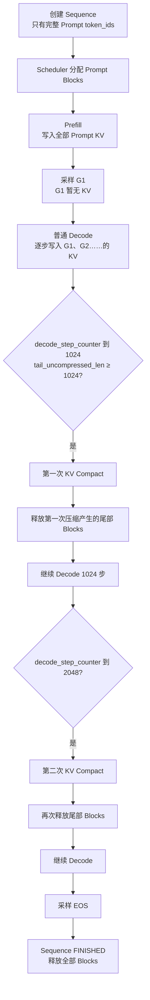
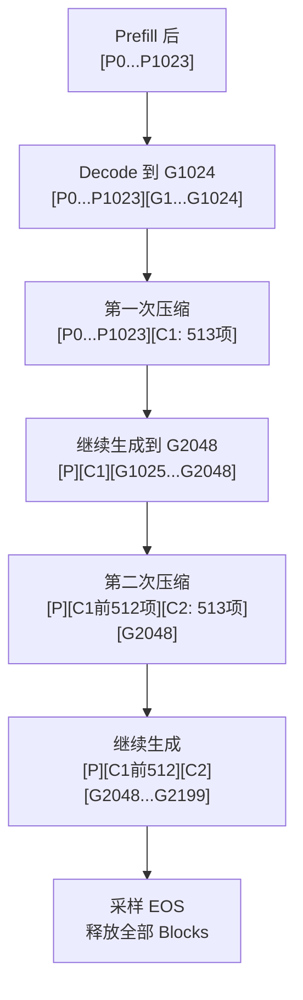
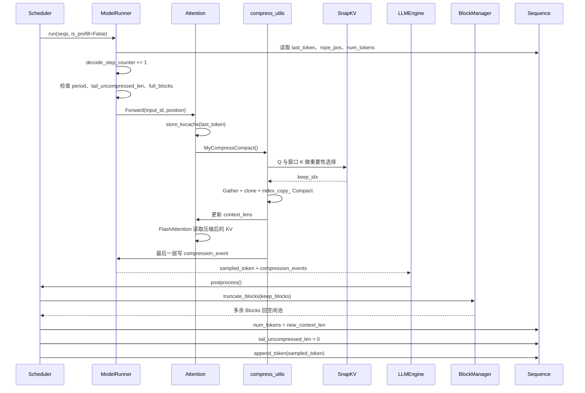

# nano-kvLLM：一次请求从 Prefill 到多次 KV Cache 压缩的完整生命周期

> 本文严格按照 nano-kvLLM 当前源码中的主要执行顺序说明：  
> `LLMEngine → Scheduler → ModelRunner → Attention → SnapKV/Compact → compression_events → Scheduler → BlockManager`。
>
> 重点不是分别介绍参数和缓存，而是在每一个时间点同时说明：
>
> 1. 请求处于什么阶段；
> 2. 关键参数当前是多少；
> 3. GPU KV Cache 里具体保存了哪些内容；
> 4. `block_table` 如何变化；
> 5. 下一步为什么这样执行。

---

# 1. 先确定本文贯穿始终的例子

为了让多次压缩过程与源码参数完全对应，本文采用 nano-kvLLM 的默认压缩配置：

```python
kvcache_block_size = 256

kv_compress_enabled = True
kv_compress_period = 1024
kv_compress_topk = 20
kv_compress_window_blocks = 4
kv_compress_keep_blocks = 2
kv_compress_keep_extra_tokens = 1
```

由此得到：

```text
一个 KV Block 容纳的 token 数：
B = 256

一次参与压缩的完整窗口：
window_tokens = 4 × 256 = 1024

窗口压缩后的目标保留数量：
keep_tokens = 2 × 256 + 1 = 513
```

也就是说，每次压缩会从最后 4 个完整 Block，也就是 1024 个 KV 中，保留 513 个 KV。

本例设置：

```text
Prompt 长度 = 1024 token
最大生成长度 > 2200 token
第 2200 个生成 token 是 EOS
```

因此，一次请求会经历：

```text
Prefill
→ 普通 Decode
→ 第一次压缩
→ 继续 Decode
→ 第二次压缩
→ 继续 Decode
→ 生成 EOS
→ 释放全部 KV Blocks
```

---

# 2. 本文中的符号

## 2.1 token 符号

```text
P0 ～ P1023
```

表示 Prompt 的 1024 个 token。

```text
G1、G2、G3……
```

表示模型依次生成的 completion token。

其中：

```text
G2200 = EOS
```

---

## 2.2 KV 符号

一个 token 在每一层都对应一组 K/V，并且每组 K/V 内又包含多个 KV Head。

为了避免把整张量全部展开，本文用：

```text
KVℓ(P0)
```

表示第 `ℓ` 层中，Prompt token `P0` 对应的全部 Key/Value Head 数据。

为了简化图示，后文通常直接写：

```text
P0
G1
C1[0]
```

但它们真正表示的是：

```text
该层该位置上的 K/V 向量
```

不同 Transformer 层中的实际数值不同。

---

## 2.3 压缩结果符号

第一次压缩后，第 `ℓ` 层保留下来的 513 个 KV 记为：

```text
C1ℓ[0] ～ C1ℓ[512]
```

第二次压缩产生：

```text
C2ℓ[0] ～ C2ℓ[512]
```

不同层可以根据本层的 Query 和 Key 选出不同历史位置，所以严格写法带有层编号 `ℓ`。

为了保持图示易读，后文省略层编号，写成：

```text
C1[0:512]
C2[0:512]
```

但必须记住：

> `C1`、`C2` 在不同层中可能对应不同的原始历史 token，所有层相同的是压缩后的长度和 Block 数。

---

## 2.4 Paged KV Cache 中的 Block ID

`block_table` 保存的是物理 Block ID，而不是连续内存下标。

本文假设 BlockManager 给该请求分配了以下物理 Blocks：

```text
40、7、18、55、3、61、12、27、9、44、73……
```

所以：

```python
block_table = [40, 7, 18, 55]
```

表示：

```text
请求的逻辑 Block 0 → 物理 Block 40
请求的逻辑 Block 1 → 物理 Block 7
请求的逻辑 Block 2 → 物理 Block 18
请求的逻辑 Block 3 → 物理 Block 55
```

物理 Block ID 不需要连续。

---

# 3. 理解生命周期前必须知道的一个 Decode 细节

在 nano-vLLM/nano-kvLLM 中，采样出的新 token 不会在采样的同一时刻立刻拥有 KV Cache。

执行顺序是：

```text
本轮模型输入 last_token
→ 计算并写入 last_token 的 K/V
→ 计算 logits
→ 采样 next_token
→ Sequence.append_token(next_token)
```

所以每轮结束后：

```text
新采样的 next_token 已经存在于 token_ids 中，
但它的 K/V 要到下一轮 Decode 才写入 KV Cache。
```

本文把这种 token 标记为：

```text
G1025*
```

其中 `*` 表示：

```text
已采样并追加到 Sequence，
但还没有写入 GPU KV Cache。
```

这是理解 `num_tokens`、`slot_mapping` 和实际 KV 内容之间一拍延迟的关键。

---

# 4. 贯穿全文的关键参数

| 参数 | 含义 |
|---|---|
| `len(token_ids)` | 完整 Prompt 和全部已采样生成 token 的数量 |
| `num_tokens` | 当前源码中用于表示下一轮模型看到的有效上下文长度；压缩后会缩短 |
| `num_prompt_tokens` | Prompt token 数，本例始终为 1024 |
| `generated_completion_tokens` | 已采样生成 token 数，不受 KV 压缩影响 |
| `rope_pos` | 当前最后一个 token 的真实逻辑位置，不受压缩影响 |
| `tail_uncompressed_len` | 上次压缩后累计生成了多少新 token |
| `num_cached_tokens` | 当前实现主要记录 Prefix Cache 命中的完整 token 数，不等于实际 KV 总长度 |
| `block_table` | 该请求当前持有的物理 KV Block ID |
| `context_lens` | 当前 GPU Forward 中 FlashAttention 应读取的有效 KV 长度 |
| `decode_step_counter` | ModelRunner 级全局 Decode 批次计数器 |
| `slot_mapping` | 当前输入 token 的 K/V 要写入的物理槽位 |

本例假设没有 Prefix Cache 命中，因此：

```text
num_cached_tokens = 0
```

即使 GPU 中已经保存了大量 KV，该值仍可能是 0。

因此本项目当前代码中：

> 判断实际有效 KV 长度主要看 `num_tokens/context_lens`，判断物理占用看 `block_table`，不能把 `num_cached_tokens` 当成当前 KV 总长度。

---

# 5. 生命周期总览



---

# 6. 阶段 0：请求刚创建，还没有进入 Prefill

用户 Prompt 分词后得到：

```text
P0, P1, ..., P1023
```

创建 `Sequence`。

## 当前参数与 KV 结构

| 参数 | 当前值 |
|---|---:|
| `len(token_ids)` | 1024 |
| `num_tokens` | 1024 |
| `num_prompt_tokens` | 1024 |
| `generated_completion_tokens` | 0 |
| `rope_pos` | 1023 |
| `tail_uncompressed_len` | 0 |
| `num_cached_tokens` | 0 |
| `block_table` | `[]` |
| `status` | `WAITING` |
| `decode_step_counter` | 0 |

此时的完整逻辑历史：

```text
token_ids:
[P0, P1, ..., P1023]
```

GPU KV Cache 中该请求的内容：

```text
还没有任何属于该请求的 K/V。
```

BlockManager 视角：

```text
该请求尚未占用任何 Block。
```

整体结构：

```text
Sequence:
[P0 ... P1023]

GPU KV:
空

block_table:
[]
```

下一步由 Scheduler 从 `waiting` 队列中取出该请求，并检查：

```text
完整 Prompt 是否满足 token budget
是否有至少 4 个可分配 Blocks
```

---

# 7. 阶段 1：Scheduler 为 Prefill 分配 KV Blocks

Prompt 长度是 1024，Block 大小是 256，因此需要：

```text
num_blocks = ceil(1024 / 256) = 4
```

假设分配到的物理 Block ID 是：

```python
block_table = [40, 7, 18, 55]
```

此时还只是完成了缓存地址分配，模型尚未计算 Prompt 的 K/V。

## 当前参数与 KV 结构

| 参数 | 当前值 |
|---|---:|
| `len(token_ids)` | 1024 |
| `num_tokens` | 1024 |
| `generated_completion_tokens` | 0 |
| `rope_pos` | 1023 |
| `tail_uncompressed_len` | 0 |
| `num_cached_tokens` | 0，本例没有 Prefix Cache 命中 |
| `block_table` | `[40, 7, 18, 55]` |
| `status` | `RUNNING` |

逻辑 Block 与物理 Block 的关系：

```text
逻辑 L0 → 物理 B40
逻辑 L1 → 物理 B7
逻辑 L2 → 物理 B18
逻辑 L3 → 物理 B55
```

当前 GPU KV 内容仍未写入：

```text
B40: 已分配，内容尚未由本次 Prefill 写入
B7 : 已分配，内容尚未由本次 Prefill 写入
B18: 已分配，内容尚未由本次 Prefill 写入
B55: 已分配，内容尚未由本次 Prefill 写入
```

可以表示为：

```text
block_table = [40, 7, 18, 55]

L0/B40: [待写入 P0   ... P255]
L1/B7 : [待写入 P256 ... P511]
L2/B18: [待写入 P512 ... P767]
L3/B55: [待写入 P768 ... P1023]
```

下一步 ModelRunner 构造 Prefill 输入：

```text
input_ids = P0 ... P1023
positions = 0 ... 1023
slot_mapping = B40、B7、B18、B55 对应的 1024 个物理槽位
```

---

# 8. 阶段 2：Prefill 完成，Prompt KV 全部写入

每一层 Attention 都把 Prompt 的 K/V 写入相同 Block Table 指定的本层 KV Cache。

注意：

```text
所有层共享同一份 block_table，
但每层物理 Block 里的 K/V 数值不同。
```

第 `ℓ` 层的 KV 内容可以表示为：

```text
L0/B40: [P0,   P1,   ..., P255]
L1/B7 : [P256, P257, ..., P511]
L2/B18: [P512, P513, ..., P767]
L3/B55: [P768, P769, ..., P1023]
```

这里每个 `Pi` 都表示：

```text
KVℓ(Pi)
```

Prefill 结束后，模型根据最后一个 Prompt token 的输出采样出第一个生成 token：

```text
G1
```

Scheduler 调用：

```python
seq.append_token(G1)
```

## Prefill 后、G1 已采样时的参数与 KV 结构

| 参数 | 当前值 |
|---|---:|
| `len(token_ids)` | 1025 |
| `num_tokens` | 1025 |
| `num_prompt_tokens` | 1024 |
| `generated_completion_tokens` | 1 |
| `rope_pos` | 1024 |
| `tail_uncompressed_len` | 1 |
| `num_cached_tokens` | 0 |
| `block_table` | `[40, 7, 18, 55]` |
| `decode_step_counter` | 0 |
| `status` | `RUNNING` |

完整逻辑历史：

```text
[P0 ... P1023, G1*]
```

GPU KV 实际内容：

```text
L0/B40: [P0   ... P255]
L1/B7 : [P256 ... P511]
L2/B18: [P512 ... P767]
L3/B55: [P768 ... P1023]
```

关键点：

```text
G1 已经进入 token_ids，
但 G1 的 K/V 尚未计算，所以仍标记为 G1*。
```

此时：

```text
num_tokens = 1025
```

表示下一次 Decode 将处理一个 1025 长度的有效上下文，其中最后一个 token `G1` 会在该 Decode 中写入 KV。

---

# 9. 阶段 3：第一次普通 Decode，写入 G1 的 KV

Scheduler 调度 Decode 时先调用：

```python
BlockManager.may_append(seq)
```

此时：

```text
len(seq) = 1025
1025 % 256 = 1
```

表示 `G1` 是一个新逻辑 Block 中的第一个 token，因此需要再分配一个 Block。

假设分配物理 Block：

```text
3
```

于是：

```python
block_table = [40, 7, 18, 55, 3]
```

ModelRunner 构造：

```text
input_id = G1
position = rope_pos = 1024
context_len = num_tokens = 1025
slot_mapping = B3 的 offset 0
```

每层 Attention 执行：

```text
store_kvcache(G1)
→ 普通 flash_attn_with_kvcache
```

当前不是压缩步：

```text
decode_step_counter = 1
1 % 1024 != 0
```

模型采样出：

```text
G2
```

Scheduler 追加 G2。

## 第一次 Decode 结束后的参数与 KV 结构

| 参数 | 当前值 |
|---|---:|
| `len(token_ids)` | 1026 |
| `num_tokens` | 1026 |
| `generated_completion_tokens` | 2 |
| `rope_pos` | 1025 |
| `tail_uncompressed_len` | 2 |
| `block_table` | `[40, 7, 18, 55, 3]` |
| `decode_step_counter` | 1 |

完整逻辑历史：

```text
[P0 ... P1023, G1, G2*]
```

GPU KV 实际内容：

```text
L0/B40: [P0   ... P255]
L1/B7 : [P256 ... P511]
L2/B18: [P512 ... P767]
L3/B55: [P768 ... P1023]
L4/B3 : [G1, 空, 空, ..., 空]
```

此时：

```text
G1 已有 KV；
G2 是下一轮待写入 KV 的 pending token。
```

以后普通 Decode 重复同样模式：

```text
本轮写入当前 last_token 的 KV
→ 读取当前全部有效 KV
→ 采样下一个 token
→ 将下一个 token 设为 pending
```

---

# 10. 阶段 4：持续 Decode，逐渐填满新的 KV Blocks

随着生成继续，物理 Block 依次填充。

在第 256 个生成 token 的 KV 写入后：

```text
B3 保存 G1 ～ G256
```

随后分配新物理 Block，例如：

```text
61
```

继续写入：

```text
B61 保存 G257 ～ G512
```

再继续分配：

```text
B12 保存 G513 ～ G768
B27 保存 G769 ～ G1024
```

在即将进行第 1024 次 Decode 时，请求状态如下。

---

# 11. 阶段 5：第一次压缩前的完整状态

这里所说的“第 1024 次 Decode”是：

```text
本轮输入 G1024，
本轮将写入 G1024 的 KV，
然后采样 G1025。
```

进入该 Decode 前：

| 参数 | 当前值 |
|---|---:|
| `len(token_ids)` | 2048 |
| `num_tokens` | 2048 |
| `num_prompt_tokens` | 1024 |
| `generated_completion_tokens` | 1024 |
| `rope_pos` | 2047 |
| `tail_uncompressed_len` | 1024 |
| `decode_step_counter` | 即将从 1023 增加到 1024 |
| `block_table` | `[40, 7, 18, 55, 3, 61, 12, 27]` |
| `block_table` 长度 | 8 |

完整逻辑历史：

```text
[P0 ... P1023, G1 ... G1023, G1024*]
```

在 Attention 执行 `store_kvcache(G1024)` 之前，GPU 中最后一个槽位还未写入 G1024。

写入 G1024 后，本层 GPU KV 结构变成：

```text
L0/B40: [P0    ... P255]
L1/B7 : [P256  ... P511]
L2/B18: [P512  ... P767]
L3/B55: [P768  ... P1023]

L4/B3 : [G1    ... G256]
L5/B61: [G257  ... G512]
L6/B12: [G513  ... G768]
L7/B27: [G769  ... G1024]
```

此时有效 KV 长度：

```text
context_lens = 2048
```

压缩判断：

```text
decode_step_counter = 1024
1024 % 1024 == 0

tail_uncompressed_len = 1024
window_tokens = 1024

full_blocks = 2048 // 256 = 8
full_blocks >= window_blocks
```

因此该请求被选为第一次压缩候选。

---

# 12. 阶段 6：第一次压缩选择哪些 KV

压缩处理最后 4 个完整 Block：

```text
L4、L5、L6、L7
```

即窗口：

```text
[G1, G2, ..., G1024]
```

Prompt 的四个 Blocks 不参与本次压缩：

```text
[P0 ... P1023]
```

SnapKV-style 算法在每层执行：

```text
当前 Query Q(G1024)
与窗口内 Key 做 QKᵀ / √D
→ Softmax
→ 跨 Query Heads 聚合
→ Top-K
```

默认配置：

```text
keep_tokens = 513
num_keep = 511
window = 1
```

最终保留：

```text
窗口第一个位置：G1
从 G2 ～ G1023 中选出的 511 个高重要性位置
窗口最后位置：G1024
```

第 `ℓ` 层的第一次压缩结果记为：

```text
C1ℓ =
[
  G1,
  Top511ℓ(G2 ... G1023),
  G1024
]
```

并按原始时间顺序排列。

注意：

> 各层的 `Top511` 可以不同，因为每层 Q/K 不同，但各层最终都保留 513 个 KV。

---

# 13. 阶段 7：第一次 KV Compact 的物理结构变化

压缩前：

```text
逻辑结构：
[P0 ... P1023]
[G1 ... G1024]

Block 结构：
L0/B40  Prompt
L1/B7   Prompt
L2/B18  Prompt
L3/B55  Prompt
L4/B3   G1-G256
L5/B61  G257-G512
L6/B12  G513-G768
L7/B27  G769-G1024
```

`compress_utils.py` 将离散选中的 513 个 KV 搬到窗口最前面的 513 个槽位：

```text
目标区域从 L4/B3 开始。
```

Compact 后：

```text
L0/B40: [P0 ... P255]
L1/B7 : [P256 ... P511]
L2/B18: [P512 ... P767]
L3/B55: [P768 ... P1023]

L4/B3 : [C1[0]   ... C1[255]]
L5/B61: [C1[256] ... C1[511]]
L6/B12: [C1[512], 空, 空, ..., 空]

L7/B27: 不再属于有效上下文
```

新的有效 KV 长度：

```text
new_context_len
= 2048 - 1024 + 513
= 1537
```

新的物理 Block 数：

```text
keep_blocks
= ceil(1537 / 256)
= 7
```

最后一层生成事件：

```python
{
    "batch_index": 0,
    "new_context_len": 1537,
    "keep_blocks": 7,
    "freed_block_ids": [27],
    "tail_uncompressed_len_after": 0,
}
```

当前这一层 FlashAttention 立即使用：

```text
context_lens = 1537
```

读取：

```text
[P0 ... P1023] + [C1[0] ... C1[512]]
```

而不是继续读取压缩前的 2048 个 KV。

---

# 14. 阶段 8：第一次压缩事件提交到 Scheduler

模型运行完成后采样：

```text
G1025
```

ModelRunner 返回：

```text
token_ids = [G1025]
compression_events = [第一次压缩事件]
```

Scheduler 的处理顺序是：

```text
1. truncate_blocks(seq, keep_blocks=7)
2. seq.num_tokens = 1537
3. seq.tail_uncompressed_len = 0
4. seq.append_token(G1025)
```

`BlockManager.truncate_blocks()` 执行后：

```python
block_table = [40, 7, 18, 55, 3, 61, 12]
```

物理 Block 27：

```text
ref_count: 1 → 0
从 used_block_ids 移入 free_block_ids
```

注意：

```text
GPU Tensor 中 B27 的旧字节通常不会立刻清零，
只是 BlockManager 不再认为它属于该请求。
以后可被其他请求覆盖。
```

随后追加 G1025。

## 第一次压缩全部提交完成后的参数与 KV 结构

| 参数 | 当前值 |
|---|---:|
| `len(token_ids)` | 2049 |
| `num_tokens` | 1538 |
| `generated_completion_tokens` | 1025 |
| `rope_pos` | 2048 |
| `tail_uncompressed_len` | 1 |
| `decode_step_counter` | 1024 |
| `block_table` | `[40, 7, 18, 55, 3, 61, 12]` |
| 有效 KV 数 | 1537 |
| pending token | `G1025*` |

完整逻辑历史：

```text
[P0 ... P1023, G1 ... G1025*]
```

GPU 有效 KV 结构：

```text
L0/B40: [P0 ... P255]
L1/B7 : [P256 ... P511]
L2/B18: [P512 ... P767]
L3/B55: [P768 ... P1023]
L4/B3 : [C1[0] ... C1[255]]
L5/B61: [C1[256] ... C1[511]]
L6/B12: [C1[512], 空 ...]
```

为什么：

```text
num_tokens = 1538
```

但实际已写入 KV 只有 1537？

因为：

```text
G1025 已采样并进入 Sequence，
但其 KV 要在下一次 Decode 才写入。
```

下一次写入位置：

```text
B12 offset 1
```

---

# 15. 阶段 9：第一次压缩后继续 Decode

下一轮 Decode 使用：

```text
input_id = G1025
position = rope_pos = 2048
context_len = num_tokens = 1538
slot_mapping = B12 offset 1
```

写入后结构：

```text
L6/B12:
[C1[512], G1025, 空, ..., 空]
```

注意逻辑位置：

```text
G1025 的真实位置是 2048，
并不是压缩后缓存中的位置 1537。
```

所以 ModelRunner 使用：

```python
positions.append(seq.rope_pos)
```

而不是：

```python
positions.append(len(seq) - 1)
```

随着 Decode 继续：

```text
B12 剩余位置写入 G1025 ～ G1279
B9  写入 G1280 ～ G1535
B44 写入 G1536 ～ G1791
B73 写入 G1792 ～ G2047
B27 的 offset 0 写入 G2048
```

为了演示物理 Block 复用，假设后续 BlockManager 分配：

```text
9、44、73，并重新使用之前释放的 27
```

---

# 16. 阶段 10：第二次压缩前的完整状态

到第 2048 次 Decode 时，当前输入是：

```text
G2048
```

该 token 在本轮 `store_kvcache()` 后进入 KV Cache。

此时参数：

| 参数 | 当前值 |
|---|---:|
| `len(token_ids)` | 3072 |
| `num_tokens` | 2561 |
| `generated_completion_tokens` | 2048 |
| `rope_pos` | 3071 |
| `tail_uncompressed_len` | 1024 |
| `decode_step_counter` | 2048 |
| `block_table` | `[40,7,18,55,3,61,12,9,44,73,27]` |
| `block_table` 长度 | 11 |
| `context_lens` | 2561 |

为什么逻辑历史和有效 KV 长度不同？

```text
完整逻辑历史：
1024 Prompt + 2048 completion = 3072

当前有效 KV：
第一次压缩后的 1537
+ 后续新增的 1024
= 2561
```

本层在写入 G2048 后的 KV 结构：

```text
L0/B40: [P0 ... P255]
L1/B7 : [P256 ... P511]
L2/B18: [P512 ... P767]
L3/B55: [P768 ... P1023]

L4/B3 : [C1[0]   ... C1[255]]
L5/B61: [C1[256] ... C1[511]]

L6/B12:
[C1[512], G1025, G1026, ..., G1279]

L7/B9 :
[G1280 ... G1535]

L8/B44:
[G1536 ... G1791]

L9/B73:
[G1792 ... G2047]

L10/B27:
[G2048, 空, ..., 空]
```

这里：

```text
full_blocks = 2561 // 256 = 10
tail_len = 2561 % 256 = 1
```

所以本次压缩窗口是最后 4 个完整 Block：

```text
L6、L7、L8、L9
```

未满尾块：

```text
L10/B27 中的 G2048
```

不会进入 SnapKV Top-K，而是被整体保护并搬到压缩结果之后。

---

# 17. 阶段 11：第二次压缩窗口的具体内容

第二次压缩窗口不是简单的：

```text
G1025 ～ G2048
```

而是按照当前有效缓存的完整 Block 边界选择：

```text
L6/B12:
[C1[512], G1025 ... G1279]

L7/B9:
[G1280 ... G1535]

L8/B44:
[G1536 ... G1791]

L9/B73:
[G1792 ... G2047]
```

窗口总计：

```text
1 个第一次压缩结果的最后 KV
+ G1025 ～ G2047
= 1024 个 KV
```

尾部残块：

```text
G2048
```

位于窗口之外。

第二次 SnapKV 在每层选出：

```text
C2ℓ =
[
  C1ℓ[512],                         # 窗口第一个锚点
  Top511ℓ(G1025 ... G2046),
  G2047                             # 窗口最后位置
]
```

注意：

```text
G2048 不参与 Top-K，
但会作为未满尾块原样保留。
```

---

# 18. 阶段 12：第二次 KV Compact 的物理结构变化

第二次压缩前的局部结构：

```text
不动前缀：
L0 ～ L5
= P0 ～ P1023 + C1[0] ～ C1[511]

压缩窗口：
L6 ～ L9
= C1[512] + G1025 ～ G2047

未满尾块：
L10
= G2048
```

Compact 后，窗口中选出的 513 个 KV 被搬到 L6 开始的位置。

G2048 紧接在 513 个保留 KV 后面。

最终结构：

```text
L0/B40: [P0 ... P255]
L1/B7 : [P256 ... P511]
L2/B18: [P512 ... P767]
L3/B55: [P768 ... P1023]

L4/B3 : [C1[0]   ... C1[255]]
L5/B61: [C1[256] ... C1[511]]

L6/B12: [C2[0]   ... C2[255]]
L7/B9 : [C2[256] ... C2[511]]

L8/B44:
[C2[512], G2048, 空, ..., 空]

L9/B73:
不再属于有效上下文

L10/B27:
不再属于有效上下文
```

新的有效长度：

```text
new_context_len
= 2561 - 1024 + 513
= 2050
```

新的 Block 数：

```text
keep_blocks
= ceil(2050 / 256)
= 9
```

第二次事件：

```python
{
    "batch_index": 0,
    "new_context_len": 2050,
    "keep_blocks": 9,
    "freed_block_ids": [73, 27],
    "tail_uncompressed_len_after": 0,
}
```

为什么能释放两个 Blocks？

压缩前：

```text
ceil(2561 / 256) = 11 Blocks
```

压缩后：

```text
ceil(2050 / 256) = 9 Blocks
```

所以释放：

```text
11 - 9 = 2 Blocks
```

---

# 19. 阶段 13：第二次压缩提交后采样 G2049

模型使用压缩后的 2050 个 KV 完成本轮 Attention，并采样：

```text
G2049
```

Scheduler 按顺序执行：

```text
truncate_blocks(seq, 9)
num_tokens = 2050
tail_uncompressed_len = 0
append_token(G2049)
```

于是：

```python
block_table = [40, 7, 18, 55, 3, 61, 12, 9, 44]
```

物理 Blocks：

```text
73、27
```

回到全局空闲池。

## 第二次压缩完成后的参数与 KV 结构

| 参数 | 当前值 |
|---|---:|
| `len(token_ids)` | 3073 |
| `num_tokens` | 2051 |
| `generated_completion_tokens` | 2049 |
| `rope_pos` | 3072 |
| `tail_uncompressed_len` | 1 |
| `decode_step_counter` | 2048 |
| `block_table` | `[40,7,18,55,3,61,12,9,44]` |
| 已写入有效 KV | 2050 |
| pending token | `G2049*` |

完整逻辑历史：

```text
[P0 ... P1023, G1 ... G2049*]
```

GPU KV 结构：

```text
L0/B40: Prompt
L1/B7 : Prompt
L2/B18: Prompt
L3/B55: Prompt

L4/B3 : C1[0:255]
L5/B61: C1[256:511]

L6/B12: C2[0:255]
L7/B9 : C2[256:511]

L8/B44:
[C2[512], G2048, 空 ...]
```

下一次 Decode 会把：

```text
G2049
```

写入：

```text
B44 offset 2
```

---

# 20. 两次压缩后，哪些内容仍然存在

两次压缩后，完整 `token_ids` 仍是：

```text
P0 ... P1023
G1 ... G2049
```

但每层有效 KV 不再包含所有这些 token。

每层当前保存：

```text
完整 Prompt：
P0 ... P1023

第一次压缩结果中未进入第二次窗口的前 512 项：
C1[0] ... C1[511]

第二次压缩结果：
C2[0] ... C2[512]

第二次窗口外受保护的尾部：
G2048

pending：
G2049 尚无 KV
```

可以表示为：

```text
完整逻辑历史：
[P][G1.........................................G2049*]

当前每层有效 KV：
[P][C1 前 512 项][C2 的 513 项][G2048]

下一轮才写入：
[G2049*]
```

这正是 KV Cache 压缩的本质：

> 完整文本历史继续保留，但 Attention 层只保存和读取被认为更重要的历史 K/V。

---

# 21. 阶段 14：第二次压缩后继续生成到 G2199

从 G2049 开始继续普通 Decode。

到输入 G2199 的 Decode 开始前：

| 参数 | 当前值 |
|---|---:|
| `len(token_ids)` | 3223 |
| `num_tokens` | 2201 |
| `generated_completion_tokens` | 2199 |
| `rope_pos` | 3222 |
| `tail_uncompressed_len` | 151 |
| `decode_step_counter` | 即将变成 2199 |
| `block_table` 长度 | 9 |

本轮写入 G2199 后，GPU 有效 KV 长度为：

```text
2201
```

L8/B44 当前结构：

```text
offset 0   : C2[512]
offset 1   : G2048
offset 2   : G2049
...
offset 152 : G2199
offset 153～255 : 空
```

整个每层 KV：

```text
L0-L3: 1024 个 Prompt KV
L4-L5: 512 个 C1 KV
L6-L7: 512 个 C2 KV
L8   : C2[512] + G2048 ～ G2199
```

总数：

```text
1024 + 512 + 513 + 1 + 151
= 2201
```

本轮不是压缩步：

```text
2199 % 1024 != 0
```

模型采样：

```text
G2200 = EOS
```

---

# 22. 阶段 15：采样 EOS，请求结束

Scheduler 先执行：

```python
seq.append_token(G2200)
```

所以在结束判断的一瞬间：

| 参数 | 当前值 |
|---|---:|
| `len(token_ids)` | 3224 |
| `num_tokens` | 2202 |
| `generated_completion_tokens` | 2200 |
| `rope_pos` | 3223 |
| `tail_uncompressed_len` | 152 |
| `last_token` | `G2200 = EOS` |
| `status` | 随后改为 `FINISHED` |

完整逻辑历史：

```text
[P0 ... P1023, G1 ... G2199, G2200(EOS)*]
```

注意：

```text
G2200 是刚采样出的 EOS，
请求立即结束，因此不需要再进行下一轮 Decode，
也不需要为 G2200 写入 K/V。
```

结束判断成立：

```python
token_id == eos
```

随后：

```python
BlockManager.deallocate(seq)
```

---

# 23. 阶段 16：释放该请求的全部 KV Blocks

结束前该请求持有：

```python
block_table = [40, 7, 18, 55, 3, 61, 12, 9, 44]
```

BlockManager 逐个执行：

```text
ref_count -= 1
```

如果引用计数归零：

```text
从 used_block_ids 移除
加入 free_block_ids
```

然后：

```python
seq.block_table.clear()
seq.num_cached_tokens = 0
```

## 最终状态与 KV 结构

| 参数 | 最终值 |
|---|---:|
| `len(token_ids)` | 3224，完整历史仍保存在 Sequence 输出中 |
| `generated_completion_tokens` | 2200 |
| `rope_pos` | 3223 |
| `status` | `FINISHED` |
| `block_table` | `[]` |
| `num_cached_tokens` | 0 |
| 该请求持有的物理 Blocks | 0 |

逻辑输出仍然存在：

```text
G1 ... G2200
```

但 KV Cache 资源已经全部释放。

GPU 大 Tensor 中原来对应 Block 的字节不一定清零：

```text
B40、B7、B18……
可能暂时还保留旧数值，
但它们已经不再属于该请求，
可以被后续请求重新覆盖。
```

最终：

```text
Sequence 输出历史仍在 CPU 逻辑状态中；
该请求的 GPU KV Cache 生命周期结束。
```

---

# 24. 整个例子的参数变化总表

| 时间点 | 完整 `token_ids` 长度 | `num_tokens` | 已生成数 | `rope_pos` | `tail_uncompressed_len` | 有效 KV 数 | Blocks |
|---|---:|---:|---:|---:|---:|---:|---:|
| 创建请求 | 1024 | 1024 | 0 | 1023 | 0 | 0 | 0 |
| Prefill Blocks 已分配 | 1024 | 1024 | 0 | 1023 | 0 | 0，尚未写入 | 4 |
| Prefill 后采样 G1 | 1025 | 1025 | 1 | 1024 | 1 | 1024 | 4 |
| 第一次普通 Decode 后 | 1026 | 1026 | 2 | 1025 | 2 | 1025 | 5 |
| 第一次压缩前、写入 G1024 后 | 2048 | 2048 | 1024 | 2047 | 1024 | 2048 | 8 |
| 第一次 Compact 后、采样前 | 2048 | GPU 临时 1537 | 1024 | 2047 | 尚未由 CPU 重置 | 1537 | GPU 暂仍有旧表 |
| 第一次事件提交并追加 G1025 | 2049 | 1538 | 1025 | 2048 | 1 | 1537 | 7 |
| 第二次压缩前、写入 G2048 后 | 3072 | 2561 | 2048 | 3071 | 1024 | 2561 | 11 |
| 第二次 Compact 后、采样前 | 3072 | GPU 临时 2050 | 2048 | 3071 | 尚未由 CPU 重置 | 2050 | GPU 暂仍有旧表 |
| 第二次事件提交并追加 G2049 | 3073 | 2051 | 2049 | 3072 | 1 | 2050 | 9 |
| 写入 G2199 后 | 3223 | 2201 | 2199 | 3222 | 151 | 2201 | 9 |
| 追加 EOS G2200 | 3224 | 2202 | 2200 | 3223 | 152 | 2201，EOS 无 KV | 9 |
| 请求结束释放后 | 3224 | 保留旧数值但不再运行 | 2200 | 3223 | 152 | 0 个归属该请求的 KV | 0 |

---

# 25. 两次压缩中 KV 结构变化的总图



---

# 26. 为什么第一次压缩只释放 1 个 Block，第二次释放 2 个

第一次压缩前：

```text
2048 token
= 8 Blocks
```

第一次压缩后：

```text
1537 token
= ceil(1537 / 256)
= 7 Blocks
```

所以释放：

```text
8 - 7 = 1 Block
```

第二次压缩前：

```text
2561 token
= 11 Blocks
```

第二次压缩后：

```text
2050 token
= 9 Blocks
```

所以释放：

```text
11 - 9 = 2 Blocks
```

压缩减少的 token 数固定是：

```text
1024 - 513 = 511
```

但释放的 Block 数不一定固定，因为它还取决于：

```text
压缩前长度对 256 的余数
```

因此项目 Benchmark 应统计：

```text
实际释放 Block 数
```

而不能只看 token 压缩比例。

---

# 27. 多次压缩后为什么缓存仍可能继续增长

每个周期新增：

```text
1024 个生成 token
```

每次压缩删除：

```text
1024 - 513 = 511 个有效 KV
```

所以一个完整压缩周期后，缓存净增长约：

```text
1024 - 511 = 513 token
```

第一次压缩后长度：

```text
1537
```

第二次压缩后长度：

```text
1537 + 513 = 2050
```

如果继续到第三次压缩，事件中的长度将近似为：

```text
2050 + 513 = 2563
```

所以该算法不是把 KV 长度固定在常数，而是：

> 让 KV Cache 的长期增长速度从每 1024 个新 token 增长 1024，降低到每周期净增长约 513。

如果想让上下文稳定在固定上限，需要：

- 更激进的保留比例；
- 压缩更早的历史区域；
- 全局容量控制；
- 或达到阈值后重复压缩更大范围。

---

# 28. 一次压缩在代码中的精确时序



---

# 29. 如果请求中途被抢占，会发生什么

本例没有中途抢占，但完整生命周期还需要理解这一分支。

压缩后可能出现：

```text
len(token_ids) = 3073
num_tokens = 2051
```

如果请求因 Block 不足被抢占，Scheduler 先恢复：

```python
seq.num_tokens = len(seq.token_ids)
seq.last_token = seq.token_ids[-1]
```

于是：

```text
num_tokens: 2051 → 3073
```

然后释放当前压缩 KV：

```text
block_table → []
```

请求回到 `WAITING`。

以后重新调度时，对完整：

```text
P0 ... P1023, G1 ... G2049
```

重新执行 Prefill。

原因是：

```text
被压缩掉的 K/V 已经不存在，
要重建完整上下文只能根据完整 token_ids 重算。
```

这也是 nano-kvLLM 必须始终保留完整 `token_ids` 的原因之一。

---

# 30. 理解这个生命周期时最容易犯的错误

## 错误一：认为 `token_ids` 也被压缩

错误。

```text
压缩的是各层 K/V，
完整 token_ids 仍然保留。
```

---

## 错误二：认为采样出的 token 立刻有 KV

错误。

```text
本轮采样出的 token，
到下一轮 Decode 才会计算并写入 K/V。
```

---

## 错误三：认为 `rope_pos` 等于压缩后的缓存位置

错误。

压缩后：

```text
rope_pos 继续沿完整逻辑时间线增长；
context_lens 才表示压缩后的 KV 长度。
```

---

## 错误四：认为压缩事件产生后，物理 Block 已经自动释放

错误。

Attention/`compress_utils` 只改变 GPU KV 内容和本轮长度。

真正释放 Block 必须经过：

```text
compression_event
→ Scheduler
→ BlockManager.truncate_blocks()
```

---

## 错误五：认为每次压缩窗口都是最近新增的恰好 1024 个 token

不一定。

窗口按：

```text
当前有效缓存中的最后 4 个完整 Block
```

选择。

第一次压缩后出现了 513-token 的非整块结果，因此第二次窗口可能包含：

```text
上次压缩结果的一部分
+ 新生成 token
```

本例第二次窗口就是：

```text
C1[512] + G1025 ... G2047
```

---

## 错误六：认为不同层必须选择完全相同的历史 token

当前实现中不一定。

不同层可以产生不同 `keep_idx`，但必须具有：

```text
相同 new_context_len
相同 keep_blocks
相同 Block 资源形状
```

---

# 31. 最终总结

一次 nano-kvLLM 请求的完整生命周期可以归纳为：

```text
1. Prompt 创建 Sequence，保存完整 token_ids。
2. Scheduler 为 Prompt 分配 Paged KV Blocks。
3. Prefill 将所有 Prompt token 的 K/V 写入每一层缓存。
4. Prefill 采样 G1，但 G1 的 KV 到下一次 Decode 才写入。
5. 每次 Decode 写入当前 last_token 的 KV，再采样下一个 token。
6. generated_completion_tokens、rope_pos、tail_uncompressed_len 每轮递增。
7. 到达全局压缩周期后，ModelRunner 检查未压缩增长量和完整 Block 数。
8. 每层 Attention 先写当前 token KV，再压缩最后若干完整 Blocks。
9. SnapKV 根据当前 Query–Key 相关性选择需要保留的历史 KV。
10. compress_utils 将离散 KV 紧凑搬到窗口前部，并保护未满尾块。
11. 本轮 context_lens 立即缩短，FlashAttention 直接读取压缩缓存。
12. 最后一层生成 new_context_len 和 keep_blocks 事件。
13. Scheduler 根据事件更新 num_tokens 和 tail_uncompressed_len。
14. BlockManager 截断 block_table，回收引用计数归零的尾部 Blocks。
15. 下一轮继续使用真实 rope_pos，但只读取压缩后的有效 KV。
16. 后续达到周期后再次执行同样的压缩闭环。
17. 生成 EOS 后，完整文本历史返回，全部 KV Blocks 释放。
```

整个项目最核心的状态关系是：

```text
完整 token 历史继续增长
        ≠
压缩后的有效 KV 长度

真实 RoPE 位置继续增长
        ≠
KV 在紧凑缓存中的物理位置

算法选择减少 KV 数量
        +
BlockManager 回收 Blocks
        =
压缩真正转化为推理系统显存收益
```


%% 项目关联导航：开始 %%
## 项目关联导航

- 所属模块：[[outputs/项目整理/模块-nano-kvllm|模块-nano-kvllm]]

%% 项目关联导航：结束 %%
