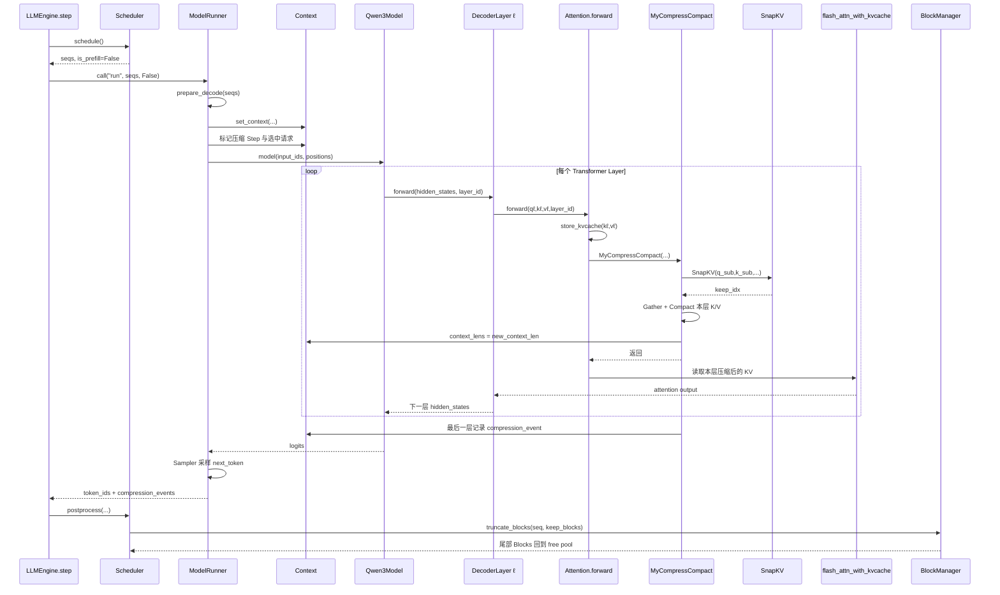

# nano-kvLLM：压缩发生瞬间的完整函数调用链与 SnapKV Top-K 选择详解

> 本文集中回答两个问题：
>
> 1. 当一次 Decode 到达压缩时刻时，从 `Scheduler` 到每一层 `Attention`、压缩算法、`FlashAttention`，再到 `Scheduler` 和 `BlockManager`，所有关键文件和函数到底按什么顺序调用？
> 2. `CompressMethod.py` 中的 SnapKV-style 算法怎样根据当前 Query，从压缩窗口内选出 Top-K KV？

---

# 1. 先给出最关键的答案

nano-kvLLM **不是**：

```text
先把所有 Transformer 层统一压缩
→ 再统一执行所有层 Attention
```

真实顺序是：

```text
第 0 层：
生成第 0 层 Q/K/V
→ 写入当前 token 的第 0 层 K/V
→ 压缩第 0 层自己的 KV Cache
→ 第 0 层 FlashAttention 立即使用压缩后的第 0 层 KV
→ 输出 hidden_states 给第 1 层

第 1 层：
根据新的 hidden_states 生成第 1 层 Q/K/V
→ 写入当前 token 的第 1 层 K/V
→ 压缩第 1 层自己的 KV Cache
→ 第 1 层 FlashAttention 立即使用压缩后的第 1 层 KV
→ 输出 hidden_states 给第 2 层

……

最后一层：
写入本层 KV
→ 压缩本层 KV
→ 本层 FlashAttention
→ 记录 compression_event
```

所以压缩和 Attention 是**逐层交替执行**的。

每一层都会为**同一个当前 token**生成该层独有的 K/V，但不会每层生成一个新 token。新的 token 只有在全部 Transformer 层、Final Norm 和 LM Head 执行完后，才由 Sampler 采样出来。

---

# 2. “第 1024 个 token 会压缩”应怎样准确理解

默认配置可概括为：

```python
kvcache_block_size = 256
kv_compress_period = 1024
kv_compress_window_blocks = 4
kv_compress_keep_blocks = 2
kv_compress_keep_extra_tokens = 1
kv_compress_topk = 20
```

由此：

```text
window_tokens
= 4 × 256
= 1024

keep_tokens
= 2 × 256 + 1
= 513
```

但压缩并不是单纯满足：

```text
某条请求生成了第 1024 个 token
```

就必然发生。

还需要同时满足：

```text
1. ModelRunner 的全局 decode_step_counter
   到达 kv_compress_period 的整数倍；

2. 当前 Sequence 的 tail_uncompressed_len
   至少达到 1024；

3. 当前有效 KV 至少拥有 4 个完整 Block；

4. 当前 Sequence 被选入本压缩 Step 的前 kv_compress_topk 条候选请求。
```

需要区分两个 Top-K：

```text
kv_compress_topk
→ 每个压缩 Step 最多压缩多少条 Sequence；

SnapKV 的 num_keep
→ 对每条被压缩 Sequence 的窗口保留多少个 KV。
```

在单请求、每轮都参与 Decode 的示例里，两种计数通常会在第 1024 次 Decode 左右对齐；Continuous Batching 下则不一定。

---

# 3. 压缩前的示例状态

假设当前请求为：

```text
Prompt：
P0 ～ P1023

已进入 Decode：
G1 ～ G1024

block_size：
256
```

请求当前持有：

```python
block_table = [40, 7, 18, 55, 3, 61, 12, 27]
```

即：

```text
逻辑 Block 0 → 物理 B40
逻辑 Block 1 → 物理 B7
逻辑 Block 2 → 物理 B18
逻辑 Block 3 → 物理 B55
逻辑 Block 4 → 物理 B3
逻辑 Block 5 → 物理 B61
逻辑 Block 6 → 物理 B12
逻辑 Block 7 → 物理 B27
```

每一层自己的 KV Cache 结构是：

```text
B40：[P0   ... P255]
B7 ：[P256 ... P511]
B18：[P512 ... P767]
B55：[P768 ... P1023]

B3 ：[G1   ... G256]
B61：[G257 ... G512]
B12：[G513 ... G768]
B27：[G769 ... G1024]
```

其中每个 `Pi`、`Gi` 只是来源标签，实际表示：

```text
该层该 token 的 K/V 向量。
```

关键参数：

```text
num_tokens = 2048
generated_completion_tokens = 1024
rope_pos = 2047
tail_uncompressed_len = 1024
context_len = 2048
```

---

# 4. 整体函数调用链



---

# 5. `Scheduler.schedule()` 做什么

`LLMEngine.step()` 先调用：

```python
seqs, is_prefill = scheduler.schedule()
```

当前：

```text
is_prefill = False
```

在进入 ModelRunner 前，Scheduler 已保证：

```text
1. 请求处于 RUNNING；
2. 当前 token 有可写槽位；
3. 若需要新 Block，may_append() 已完成分配；
4. seq.block_table 是本轮的有效物理映射。
```

此时 Scheduler 还不知道本轮最终会压缩到多长。

---

# 6. `ModelRunner.run()` 与 `prepare_decode()`

`ModelRunner.run()` 在 Decode 路径中调用：

```python
prepare_decode(seqs)
```

它构造：

```text
input_ids
positions
slot_mapping
context_lens
block_tables
```

---

## 6.1 当前模型输入

Decode 每条请求通常只输入当前：

```text
last_token
```

本例：

```text
input_id = G1024
```

历史 token 不重新输入，历史 K/V 已在缓存中。

---

## 6.2 逻辑位置和有效缓存长度分开

```python
positions.append(seq.rope_pos)
context_lens.append(len(seq))
```

当前压缩前：

```text
position = 2047
context_len = 2048
```

压缩后：

```text
rope_pos 继续按完整历史增长；
context_len 会缩短。
```

---

## 6.3 当前 token 的 KV 写入位置

`slot_mapping` 根据：

```text
block_table
block_size
最后 Block 内 offset
```

确定当前 K/V 写入地址。

本例：

```text
G1024
→ 逻辑 Block 7
→ 物理 B27
→ offset 255
```

---

# 7. `prepare_decode()` 判断压缩周期

ModelRunner 更新：

```python
decode_step_counter += 1
```

当前：

```text
decode_step_counter = 1024
```

满足：

```text
1024 % kv_compress_period == 0
```

随后检查当前 Sequence：

```text
tail_uncompressed_len = 1024
window_tokens = 1024

full_blocks = 2048 // 256 = 8
window_blocks = 4
```

条件满足，加入候选。

最终写入 Context：

```text
is_compress_step = True
compress_selected_batch_indices = [0]
compress_selected_seq_ids = [seq_id]
compress_base_context_lens = [2048]
```

---

# 8. 为什么需要 `compress_base_context_lens`

第 0 层完成 Compact 后会执行：

```python
context.context_lens[0] = 1537
```

但是第 1 层的 KV Cache 此时还没有被压缩，仍然是 2048 长。

因此第 1 层寻找压缩窗口时，不能使用已经变成 1537 的：

```text
context.context_lens
```

而必须使用压缩前快照：

```text
compress_base_context_lens = 2048
```

两者职责不同：

```text
compress_base_context_lens
→ 每层定位本层压缩前窗口时使用；

context_lens
→ 当前层 FlashAttention 应读取的压缩后长度。
```

---

# 9. `Qwen3Model.forward()` 按层顺序执行

模型内部近似为：

```python
for layer_id, layer in enumerate(self.layers):
    hidden_states = layer(
        hidden_states,
        positions,
        layer_id
    )
```

层之间有数据依赖：

```text
Layer 1 必须等待 Layer 0 输出；
Layer 2 必须等待 Layer 1 输出。
```

因此不存在：

```text
先把所有层 KV 统一压缩完，
再回到 Layer 0 重新做 Attention。
```

---

# 10. 每一层的精确执行顺序

第 `ℓ` 层：

```text
hidden_statesℓ
    ↓
q_proj / k_proj / v_proj
    ↓
Qℓ、Kℓ、Vℓ
    ↓
Qℓ/Kℓ 应用 RoPE
    ↓
Attention.forward(Qℓ,Kℓ,Vℓ,layer_id=ℓ)
    ↓
store_kvcache
    ↓
MyCompressCompact
    ↓
flash_attn_with_kvcache
    ↓
attention output
    ↓
下一层 hidden_states
```

这里当前 token 始终是同一个：

```text
G1024
```

但每层产生：

```text
K0(G1024), V0(G1024)
K1(G1024), V1(G1024)
...
```

因为每层输入 hidden state 不同。

---

# 11. 第 0 层压缩的完整过程

## 11.1 生成本层 Q/K/V

Layer 0 根据当前隐藏状态产生：

```text
Q0(G1024)
K0(G1024)
V0(G1024)
```

并使用：

```text
rope_pos = 2047
```

对 Q0/K0 做 RoPE。

---

## 11.2 `Attention.forward()` 读取 Context

```python
context = get_context()
```

看到：

```text
is_prefill = False
is_compress_step = True
selected_batch_indices = [0]
base_context_len = 2048
```

---

## 11.3 `store_kvcache()` 先写当前 token

```python
store_kvcache(
    k,
    v,
    k_cache,
    v_cache,
    slot_mapping
)
```

将：

```text
K0(G1024)、V0(G1024)
```

写到 Layer 0：

```text
B27 offset 255
```

所以压缩算法运行时，当前 token 的本层 K/V 已经存在。

---

## 11.4 调用 `MyCompressCompact()`

条件：

```text
不是 Prefill
压缩已开启
当前为压缩 Step
有选中的请求
```

于是：

```python
MyCompressCompact(
    q_current=q,
    k_cache=k_cache,
    v_cache=v_cache,
    layer_id=0,
    ...
)
```

---

## 11.5 Layer 0 调用 `SnapKV()`

压缩窗口为：

```text
G1 ～ G1024
```

Layer 0 使用：

```text
Q0(G1024)
Layer 0 窗口 K0(G1...G1024)
```

得到：

```text
keep_idx0
```

---

## 11.6 Layer 0 Compact

默认从 1024 个 KV 中保留 513 个：

```text
窗口首部锚点
+ Top-511
+ 窗口最后位置
```

然后搬到窗口前部。

压缩后 Layer 0 缓存：

```text
Prompt 1024 个 KV
+ C0[0...512]
```

新长度：

```text
2048 - 1024 + 513
= 1537
```

---

## 11.7 Layer 0 立即调用 FlashAttention

`MyCompressCompact()` 返回前已经执行：

```python
context.context_lens[0] = 1537
```

随后：

```python
flash_attn_with_kvcache(
    q.unsqueeze(1),
    k_cache,
    v_cache,
    cache_seqlens=context.context_lens,
    block_table=context.block_tables
)
```

Layer 0 读取的是：

```text
Layer 0 压缩后的 1537 个 KV
```

不是原来的 2048 个。

---

# 12. 第 1 层接着发生什么

Layer 0 输出新的 hidden states。

Layer 1 重新计算：

```text
Q1(G1024)
K1(G1024)
V1(G1024)
```

先把 Layer 1 当前 token 的 K/V 写入 Layer 1 自己的 KV Cache。

Layer 1 的缓存仍是压缩前结构，因为它尚未执行自己的 `MyCompressCompact()`。

定位窗口时使用：

```text
compress_base_context_lens = 2048
```

而不是当前已缩短的 `context_lens=1537`。

随后：

```text
SnapKV 计算 keep_idx1
→ Compact Layer 1 K/V
→ Layer 1 FlashAttention 读取 Layer 1 压缩后的 1537 个 KV
```

以后各层同理。

---

# 13. 当前 token 是否参与 Top-K

当前 token 先通过：

```text
store_kvcache
```

进入缓存。

但是否参加 Top-K，要看它所在位置。

## 情况 A：当前 token 填满最后一个完整 Block

本例 `G1024` 位于：

```text
最后一个完整 Block 的最后位置
```

因此进入压缩窗口。

当前算法还会固定保留窗口最后位置，所以 `G1024` 会保留。

## 情况 B：当前 token 位于未满尾块

如果压缩时当前 token 位于窗口之后的未满 Block：

```text
它不参与 SnapKV Top-K；
但未满尾块会整体搬到压缩结果之后；
所以它仍被保护。
```

---

# 14. 每层是否必须选择相同 token

当前实现中，不必要求不同层的 `keep_idx` 一样。

例如：

```text
Layer 0 保留 G100、G300、G700；
Layer 1 保留 G50、G400、G900。
```

这可以运行，因为：

```text
每层 KV Cache 独立；
每层 Attention 只读取本层缓存；
保留 Key 已带有原始 RoPE 信息。
```

真正必须一致的是：

```text
每层最终保留数量相同；
new_context_len 相同；
keep_blocks 相同；
有效 KV 都被压紧在前部连续区域。
```

---

# 15. 为什么不能在 Layer 0 压缩后立即释放 Blocks

Layer 0 压缩后，Layer 0 已经不需要尾部 Blocks。

但 Layer 1～最后一层仍然需要从**各自层**的尾部 Blocks 中读取压缩窗口。

若此时 BlockManager 将尾部 Block 分配给其他请求：

```text
其他请求可能覆盖这些物理槽位；
后续层尚未完成压缩；
当前请求会读到被覆盖的数据。
```

所以必须等待：

```text
所有层完成 Compact
```

后再释放。

---

# 16. FlashAttention 与 BlockManager 的先后关系

精确顺序：

```text
Layer 0 Compact
→ Layer 0 FlashAttention

Layer 1 Compact
→ Layer 1 FlashAttention

……

最后一层 Compact
→ 最后一层 FlashAttention
→ 生成 compression_event

整个模型完成
→ Sampler 采样 next_token
→ 事件返回 Scheduler
→ BlockManager.truncate_blocks()
```

所以：

> FlashAttention 在 BlockManager 释放之前就已经使用压缩后 KV。

此时旧 `block_table` 暂时仍包含尾部 Blocks，但：

```text
context_lens 已缩短
```

FlashAttention 只读取前：

```text
new_context_len
```

个逻辑位置，不会读取尾部 Blocks。

---

# 17. 为什么只在最后一层生成事件

`MyCompressCompact()` 每层都能计算：

```text
new_context_len
keep_blocks
```

但只有：

```python
layer_id + 1 >= num_layers
```

时写入：

```python
context.compression_events
```

含义：

```text
最后一层完成
→ 全部层缓存都已经 Compact
→ 可以向 Scheduler 提交资源变化。
```

若 Layer 0 就生成事件并释放空间，会过早。

---

# 18. 模型执行结束后的调用链

最后一层完成后：

```text
Final Norm
→ LM Head
→ logits
→ Sampler
```

采样出：

```text
G1025
```

ModelRunner 在 `reset_context()` 前取出：

```python
compression_events
```

然后返回：

```python
(token_ids, compression_events)
```

`LLMEngine.step()` 拆分结果并调用：

```python
scheduler.postprocess(
    seqs,
    token_ids,
    compression_events
)
```

---

# 19. Scheduler 与 BlockManager 提交压缩结果

事件示例：

```python
{
    "batch_index": 0,
    "new_context_len": 1537,
    "keep_blocks": 7,
    "tail_uncompressed_len_after": 0,
}
```

Scheduler 先：

```python
block_manager.truncate_blocks(seq, 7)
```

原表：

```python
[40, 7, 18, 55, 3, 61, 12, 27]
```

截断为：

```python
[40, 7, 18, 55, 3, 61, 12]
```

Block 27：

```text
ref_count: 1 → 0
→ 进入 free_block_ids
```

随后：

```python
seq.num_tokens = 1537
seq.tail_uncompressed_len = 0
seq.append_token(G1025)
```

最终：

```text
num_tokens = 1538
rope_pos = 2048
tail_uncompressed_len = 1
```

---

# 20. 压缩瞬间状态表

| 时间点 | 已压缩层 | `context_lens` | `block_table` | FlashAttention 使用什么 | 是否释放 |
|---|---|---:|---|---|---|
| 模型开始前 | 无 | 2048 | 8 Blocks | 尚未执行 | 否 |
| Layer 0 Store 后 | 无 | 2048 | 8 Blocks | 尚未执行 | 否 |
| Layer 0 Compact 后 | Layer 0 | 1537 | 仍为 8 Blocks | Layer 0 压缩 KV | 否 |
| Layer 1 Compact 后 | Layer 0～1 | 1537 | 8 Blocks | Layer 1 压缩 KV | 否 |
| 最后一层 Compact 后 | 全部层 | 1537 | 8 Blocks | 最后一层压缩 KV | 否 |
| Scheduler 收到事件后 | 全部层 | CPU 状态更新为 1537 | 截为 7 Blocks | 模型已结束 | 是 |

---

# 21. SnapKV Top-K 的输入

`CompressMethod.py` 的输入形状：

```text
Q: [B, Hq, Wq, D]
K: [B, Hk, L, D]
V: [B, Hk, L, D]
```

其中：

```text
B  ：被选中压缩的请求数
Hq ：Query Head 数
Hk ：KV Head 数
Wq ：用于评分的 Query Window
L  ：压缩窗口长度
D  ：Head Dimension
```

当前主路径：

```text
Wq = 1
L = window_blocks × block_size = 1024
```

`V` 不参与重要性评分，但后续按同一个 `keep_idx` 搬移。

---

# 22. `compress_utils.py` 怎样取得 Q/K/V

先调用：

```python
get_tail_window_and_tail_slots()
```

根据：

```text
compress_base_context_lens
block_tables
block_size
window_blocks
```

得到窗口的绝对物理 Slot。

再调用：

```python
gather_kv_by_slots()
```

得到连续张量：

```text
K_sub: [B, Hk, 1024, D]
V_sub: [B, Hk, 1024, D]
Q_sub: [B, Hq, 1, D]
```

然后：

```python
keep_idx = SnapKV(
    Q_sub,
    K_sub,
    V_sub,
    num_keep=keep_tokens-2,
    window=1
)
```

---

# 23. 为什么 `num_keep = keep_tokens - 2`

默认最终保留：

```text
keep_tokens = 513
```

算法额外固定加入：

```text
窗口首部锚点 1 个
窗口末尾近期位置 1 个
```

所以普通 Top-K 只需：

```text
513 - 2 = 511
```

最终：

```text
1 + 511 + 1 = 513
```

---

# 24. Top-K 第一步：排除近期保护窗口

```python
K_cut = K[:, :, :-window, :]
```

当前：

```text
window = 1
```

因此：

```text
K_cut = 位置 0～1022
近期保护 = 位置 1023
```

位置 1023 不参与 Top-K，最后无条件加入。

---

# 25. Top-K 第二步：计算 QK 分数

标准公式：

```text
score = QKᵀ / √D
```

若：

```text
Hq == Hk
```

直接矩阵乘法：

```text
[B,Hq,Wq,D]
×
[B,Hk,D,L-window]
```

得到：

```text
[B,Hq,Wq,L-window]
```

---

# 26. GQA 下如何处理

Qwen3 常见：

```text
Hq > Hk
```

例如：

```text
Hq = 8
Hk = 2
group_size = 4
```

含义：

```text
Query Heads 0～3 共享 KV Head 0
Query Heads 4～7 共享 KV Head 1
```

代码将 Query 重排为：

```text
[B,Hk,group_size,Wq,D]
```

与对应 KV Head 的 Key 计算分数，再恢复为：

```text
[B,Hq,Wq,L-window]
```

---

# 27. Top-K 第三步：固定首部锚点

算法将候选区域位置 0 的分数设成：

```python
-inf
```

但随后显式加入位置 0。

目的：

```text
固定保留位置 0，
又不让它占用普通 Top-K 名额。
```

这里的位置 0 是：

```text
本次压缩窗口首位置
```

不一定是整条序列真正 BOS。

---

# 28. Top-K 第四步：Softmax

```python
attn_probs = softmax(attn_scores, dim=-1)
```

得到每个 Query Head 对各历史位置的相对注意力概率：

```text
p(h,q,i)
```

---

# 29. Top-K 第五步：跨 Query Window 与 Heads 聚合

先：

```python
key_importance = attn_probs.sum(dim=2)
```

聚合多个 Query 位置。

当前 `Wq=1`，相当于去掉该维度。

再：

```python
key_importance.sum(dim=1, keepdim=True)
```

聚合 Query Heads。

最终：

```text
importance(i)
= Σh Σq p(h,q,i)
```

当前：

```text
importance(i)
= Σh p(h,i)
```

一个历史位置被更多 Query Heads 关注时，综合分数更高。

---

# 30. Top-K 第六步：`torch.topk()`

```python
idx_keep = torch.topk(
    key_importance,
    k=num_keep,
    dim=-1,
    largest=True,
    sorted=False
).indices
```

默认从候选位置中选出：

```text
511 个最高分位置。
```

位置 0 已设为 `-inf`，不会重复进入 Top-K。

---

# 31. Top-K 第七步：按原始时间排序

Top-K 返回顺序可能按重要性：

```text
[700, 20, 300, 100]
```

代码再执行：

```python
torch.sort(idx_keep)
```

得到：

```text
[20, 100, 300, 700]
```

所以：

```text
选择按重要性；
存储按原时间顺序。
```

---

# 32. Top-K 第八步：拼接最终索引

```text
final_idx
=
[窗口首部锚点]
+
[511 个 Top-K]
+
[窗口末尾近期位置]
```

最终：

```text
keep_idx.shape = [B, 513]
```

---

# 33. 一个 8-token 手算例子

假设压缩窗口：

```text
位置 0,1,2,3,4,5,6,7
```

配置：

```text
window = 1
最终保留 4 个位置
普通 Top-K = 2
```

跨 Heads 聚合后的重要性：

| 位置 | 分数 |
|---:|---:|
| 0 | 固定保留，竞争分数设为 `-inf` |
| 1 | 0.08 |
| 2 | 0.31 |
| 3 | 0.11 |
| 4 | 0.26 |
| 5 | 0.15 |
| 6 | 0.09 |
| 7 | 近期保护，不参加竞争 |

Top-2：

```text
位置 2
位置 4
```

最终：

```text
keep_idx = [0,2,4,7]
```

K/V 同时保留：

```text
[K0,K2,K4,K7]
[V0,V2,V4,V7]
```

---

# 34. `keep_idx` 如何变成物理搬移

SnapKV 输出的是窗口内相对下标。

`compress_utils.py` 执行：

```python
src_keep = torch.gather(
    window_src_slots,
    1,
    keep_idx
)
```

得到真实物理源 Slot。

目标位置：

```python
dst_keep = window_src_slots[:, :keep_tokens]
```

即窗口最前面的连续 Slot。

---

# 35. 为什么先 `clone()` 再 `index_copy_()`

源和目标可能重叠。

例如：

```text
源：[0,2,4,7]
目标：[0,1,2,3]
```

若边读边写，会覆盖后续源数据。

因此先：

```python
vals_k = index_select(src).clone()
vals_v = index_select(src).clone()
```

再：

```python
index_copy_(dst, vals_k)
index_copy_(dst, vals_v)
```

保证原地 Compact 安全。

---

# 36. 未满尾块如何处理

算法只压缩最后若干**完整** Blocks。

窗口后的未满尾块：

```text
不参加 SnapKV Top-K；
整体搬到压缩结果之后；
继续作为最近上下文保留。
```

最终布局：

```text
不压缩前缀
+ Top-K 压缩结果
+ 未满尾部
```

---

# 37. 为什么 FlashAttention 可以直接读取

FlashAttention 不接收 `keep_idx`，只接收：

```text
k_cache
v_cache
cache_seqlens
block_table
```

因此 `compress_utils.py` 必须把离散保留 KV 压紧成：

```text
前 new_context_len 个逻辑位置全部有效
```

并立即更新：

```python
context.context_lens = new_context_len
```

于是本层 FlashAttention 可以继续使用原接口。

---

# 38. SnapKV 评分与正式 FlashAttention 不是同一件事

压缩 Step 中会出现两次 QK 相关计算。

## SnapKV QK

目的：

```text
选择保留哪些历史 KV
```

输出：

```text
keep_idx
```

## FlashAttention QK

目的：

```text
完成模型本层真正的 Attention
```

输入：

```text
当前 Query
压缩后的全部有效 Key/Value
```

输出：

```text
本层 Attention 表示
```

SnapKV 不能替代正式 Attention，因为它只评价局部压缩窗口，也没有完成全部 Value 聚合。

---

# 39. 最终回答四个核心疑问

## 疑问一：FlashAttention 什么时候使用压缩后的 KV？

每一层中：

```text
store_kvcache
→ MyCompressCompact
→ 更新 context_lens
→ flash_attn_with_kvcache
```

所以本层在压缩后立即使用本层压缩 KV，不需要等下一 token。

---

## 疑问二：是不是统一压缩所有层后，再统一做 Attention？

不是。

```text
Layer 0：压缩 → Attention
Layer 1：压缩 → Attention
Layer 2：压缩 → Attention
……
```

逐层交替。

---

## 疑问三：每一层会不会产生新的 KV 参与压缩？

会产生**同一个当前 token 在该层的 K/V**。

```text
Layer 0 产生 K0/V0；
Layer 1 产生 K1/V1；
……
```

它们分别写入和压缩对应层缓存。

不会每层生成一个新的序列 token。

---

## 疑问四：BlockManager 什么时候释放？

等：

```text
所有层都完成 Compact 和 FlashAttention
→ 模型完成
→ Sampler 采样 next_token
→ compression_event 返回 Scheduler
```

之后才调用：

```python
truncate_blocks()
```

---

# 40. 推荐打断点位置

```text
engine/model_runner.py
    prepare_decode()
    run_model()
    run()

models/qwen3.py
    Qwen3Model.forward() 的逐层循环

layers/attention.py
    store_kvcache() 前后
    MyCompressCompact() 前后
    flash_attn_with_kvcache() 前

layers/compress_utils.py
    get_tail_window_and_tail_slots()
    gather_kv_by_slots()
    MyCompressCompact()

layers/CompressMethod.py
    SnapKV()

engine/scheduler.py
    postprocess()

engine/block_manager.py
    truncate_blocks()
```

建议观察：

```text
layer_id
seq.num_tokens
seq.rope_pos
seq.tail_uncompressed_len
context.context_lens
context.compress_base_context_lens
window_src_slots
keep_idx
new_context_lens
compression_events
seq.block_table
free_block_ids 数量
```

---

# 41. 最终函数调用树

```text
LLMEngine.step
└── Scheduler.schedule
└── ModelRunner.run
    ├── prepare_decode
    │   ├── 构造 input_id / positions
    │   ├── 构造 slot_mapping / context_lens / block_tables
    │   ├── 判断压缩周期
    │   └── 选择待压缩 Sequence
    ├── set_context
    └── Qwen3ForCausalLM.forward
        └── Qwen3Model.forward
            └── for each layer_id
                └── Qwen3DecoderLayer.forward
                    └── Qwen3Attention.forward
                        └── Attention.forward
                            ├── store_kvcache
                            ├── MyCompressCompact
                            │   ├── get_tail_window_and_tail_slots
                            │   ├── gather_kv_by_slots
                            │   ├── SnapKV
                            │   │   ├── 排除近期窗口
                            │   │   ├── QKᵀ / √D
                            │   │   ├── GQA 分组
                            │   │   ├── Softmax
                            │   │   ├── 跨 Query/Head 聚合
                            │   │   ├── torch.topk
                            │   │   ├── 按时间排序
                            │   │   └── 拼接锚点和近期位置
                            │   ├── keep_idx → 物理 src slots
                            │   ├── clone + index_copy_ Compact
                            │   ├── 更新 context_lens
                            │   └── 最后一层记录 event
                            └── flash_attn_with_kvcache
    ├── compute_logits
    ├── Sampler
    └── 收集 compression_events
└── LLMEngine 转发事件
└── Scheduler.postprocess
    ├── 事件去重
    ├── BlockManager.truncate_blocks
    ├── seq.num_tokens = new_context_len
    ├── 重置 tail_uncompressed_len
    └── append_token(next_token)
```

---

# 42. 一句话总结

> nano-kvLLM 在压缩 Step 中，对每个 Transformer 层依次执行“生成并写入当前 token 的本层 K/V → 用当前 Query 对本层窗口 Key 做 SnapKV Top-K → 将保留 K/V 原地压紧 → 立即用本层压缩缓存执行 FlashAttention”；只有全部层完成后，才通过 compression_event 通知 Scheduler，由 BlockManager 统一释放尾部物理 Blocks。


%% 项目关联导航：开始 %%
## 项目关联导航

- 所属模块：[[outputs/项目整理/模块-nano-kvllm|模块-nano-kvllm]]

%% 项目关联导航：结束 %%
