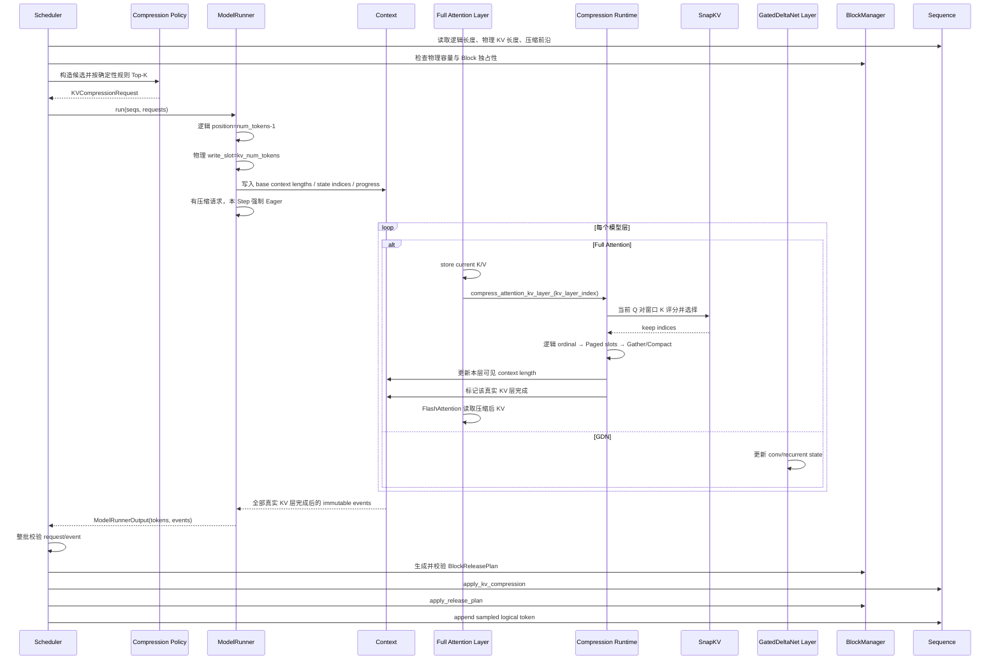

# 从 Qwen3 到 Qwen3.5 Hybrid：KV Cache 压缩融合改动详解

> **分析对象**：`nano-kvllm-qwen3.6.zip` 中的三套代码
>
> - `nano-vllm/`：原始基础框架；
> - `nano-kvllm/`：最初面向 Dense Qwen3 的 KV Cache 压缩版本；
> - `nano-vllm-qwen3.6/`：在 Qwen3.5/Qwen3.6 Hybrid、Multimodal、GDN、MTP、Chunked Prefill 等能力上融合压缩后的最终版本。
>
> **目标**：不是重新介绍 SnapKV，而是回答一个更具体的问题：
>
> **原先能够运行在 Qwen3 Dense 模型上的压缩机制，为什么不能原样搬到 Qwen3.5；最终仓库为了融合 Qwen3.5，具体改变了哪些状态、接口、调用链和安全约束？**

---

# 0. 结论先行

将 KV Cache 压缩从 Qwen3 融合到 Qwen3.5，最大的变化并不是“给 Qwen3.5 的 Attention 再调用一次 SnapKV”，而是把旧版一个**依赖 Dense 模型假设的局部功能**，重构成一个能够识别 Hybrid 架构、管理两类缓存状态并与调度器闭环协作的**通用 KV 压缩子系统**。

旧版 Qwen3 的关键假设是：

```text
每个 Transformer 层都是标准 Full Attention 层
每层都有 K/V Cache
模型层号 == KV Cache 层号
最后一个模型层完成 == 所有 KV Cache 层均完成
逻辑 token 长度 ≈ 当前有效 KV 长度
```

Qwen3.5 打破了这些假设：

```text
Transformer 层 = Full Attention 层 + GDN 层交错
只有 Full Attention 层拥有标准 K/V Cache
GDN 层维护 conv state 和 recurrent state
模型层号不再等于 KV Cache 层号
逻辑 token 时间轴、Full Attention KV 长度、GDN 状态生命周期必须分开管理
```

因此最终版本完成了以下核心重构：

1. **只压缩真实 Full Attention 层，完全不压缩 GDN state。**
2. **为真实 KV 层建立独立、连续的 `kv_layer_index`，不再使用模型层号判断压缩完成。**
3. **把一个模糊的长度字段拆成逻辑 token、Prefill 进度和物理 KV 长度三条状态轴。**
4. **将压缩触发从 ModelRunner 上移到 Scheduler 的控制面，由 Scheduler 生成不可变压缩请求。**
5. **把压缩算法、候选策略、Paged Slot 映射、运行时执行、事件协议拆成独立 `kv_compression/` 子系统。**
6. **重新设计 Decode 元数据：RoPE/MRoPE 使用逻辑位置，K/V 写入和 FlashAttention 长度使用物理 KV 位置。**
7. **压缩事件必须等待所有真实 KV 层完成后才能产生，随后由 Scheduler 原子校验并由 BlockManager 安全释放整块尾部 Block。**
8. **对 Prefix Cache、共享 Block、Chunked Prefill、抢占重算、Tensor Parallel、CUDA Graph、MTP 和多模态位置编码增加了明确兼容策略。**
9. **Qwen3.5 模型主体 `qwen3_5.py` 本身没有为了压缩而被硬编码修改；压缩通过通用 Attention、ModelRunner 和缓存绑定层接入。**

可以用一句话概括：

> **Qwen3 版本是在 Dense Attention 调用链里插入压缩；Qwen3.5 版本则重新定义了“哪些层有 KV、哪些长度属于 KV、何时所有 KV 层完成、KV 与 GDN state 如何并存”，再在此基础上建立完整压缩闭环。**

---

# 1. 三套代码分别扮演什么角色

最终仓库不是单一代码快照，而是保留了清晰的对照关系。

| 目录 | 角色 | 主要用途 |
|---|---|---|
| `nano-vllm/` | 原始上游行为参考 | 查看未加入压缩时的基础调度、Paged KV、Sequence 和 Attention |
| `nano-kvllm/` | Qwen3 压缩参考实现 | 查看最初的周期式 SnapKV、Compact、事件和 Block 回收链路 |
| `nano-vllm-qwen3.6/` | 最终融合目标 | 查看 Qwen3.5/Qwen3.6 Hybrid、多模态、GDN、MTP 与压缩的统一实现 |

最终融合分支为：

```text
feat/qwen36-kv-compression
```

其主要提交顺序也体现了工程重构逻辑：

```text
42172c6  定义融合契约
4fa993a  配置与逻辑/物理长度状态
af494e2  BlockManager 改用物理 KV 长度
b3783cb  SnapKV 策略与 Paged Slot Compact
8c1c01b  压缩上下文下的 Decode 元数据
90fa5c1  Full Attention 逐层压缩接入
4906b34  压缩事件闭环与 Block 释放
39d1f46  可执行模型 Smoke Runner
73beff9  回归测试与文档
4d87ba2  可复现实验脚本
```

这一顺序说明，融合不是先改算法，而是先确定状态和资源语义，再接入模型执行。

---

# 2. 先回顾：旧 Qwen3 压缩版本的工作方式

理解 Qwen3.5 的变化前，需要先明确旧版依赖了哪些前提。

## 2.1 旧版调用链

旧版 `nano-kvllm` 的核心执行路径为：

```text
Scheduler.schedule
  ↓
ModelRunner.prepare_decode
  ├─ decode_step_counter += 1
  ├─ 判断周期和候选请求
  └─ 将压缩选择写入 Context
  ↓
Qwen3Model.forward
  ↓ 逐模型层
Qwen3Attention.forward
  ↓
Attention.forward(q, k, v, Layer)
  ├─ store_kvcache
  ├─ MyCompressCompact
  │    ├─ Gather 窗口 K/V
  │    ├─ SnapKV Top-K
  │    ├─ 原地 Compact
  │    └─ 最后一层写 compression_event
  └─ flash_attn_with_kvcache
  ↓
ModelRunner 返回 token_ids + compression_events
  ↓
Scheduler.postprocess
  ↓
BlockManager.truncate_blocks
```

顺序上的核心仍然正确：

```text
写当前 token K/V
→ 压缩本层 K/V
→ 本层立即使用压缩后的 K/V 做 Attention
```

## 2.2 旧版最重要的 Dense 假设

旧版 Qwen3 模型中，每个 Decoder Layer 都有标准 Attention，因此：

```text
模型第 0 层 = KV 第 0 层
模型第 1 层 = KV 第 1 层
...
模型最后一层 = 最后一个 KV 层
```

所以旧版直接沿 Qwen3 调用链传递：

```python
layer_id
num_layers
```

并使用类似条件：

```python
if layer_id + 1 >= num_layers:
    emit_compression_event()
```

对于 Dense Qwen3，这是成立的。

## 2.3 旧版长度模型

旧版虽然增加了：

```text
generated_completion_tokens
rope_pos
tail_uncompressed_len
```

但仍让 `num_tokens` 同时承担两种语义：

```text
未压缩时：完整逻辑历史长度
压缩后：当前有效 KV Cache 长度
```

压缩后 Scheduler 会直接执行：

```python
seq.num_tokens = new_context_len
```

请求被抢占时再恢复：

```python
seq.num_tokens = len(seq.token_ids)
```

这在简单 Dense 路径中可以工作，但字段语义非常脆弱。

## 2.4 旧版压缩模块的耦合方式

旧版主要散落在：

```text
layers/CompressMethod.py
layers/compress_utils.py
layers/attention.py
engine/model_runner.py
engine/scheduler.py
engine/block_manager.py
utils/context.py
```

其特点是：

- 压缩选择、运行时状态和事件用 Python List/Dict 传递；
- ModelRunner 同时负责模型元数据与压缩策略调度；
- Attention 接口被 Qwen3 专门加入 `Layer` 参数；
- 事件是否完成依赖“最后一个模型层”；
- Tail Compact 的部分地址计算隐含物理连续性假设；
- Prefix Cache 与压缩改写之间缺乏完整隔离；
- 压缩 Step 与 CUDA Graph 的判断存在绕过动态压缩路径的风险。

这套实现适合展示算法闭环，但不适合直接承载 Qwen3.5 Hybrid 的复杂状态。

---

# 3. Qwen3.5 相比 Qwen3，架构上究竟多了什么

## 3.1 Full Attention 与 GDN 交错

`nanovllm/models/qwen3_5.py` 中，Decoder Layer 会根据：

```python
config.layer_types[layer_idx]
```

选择两类核心模块：

```text
full_attention → Qwen3_5Attention
gated_delta_net / linear attention → GatedDeltaNet
```

因此模型结构不再是：

```text
Attention
Attention
Attention
Attention
...
```

而可能近似为：

```text
GDN
GDN
Full Attention
GDN
GDN
Full Attention
...
```

只有 Full Attention 层具有标准：

```text
K Cache + V Cache
```

GDN 层维护的是：

```text
Convolution State
Recurrent State
```

它们不是按历史 token 保存的一长串 K/V，不能套用 SnapKV Top-K。

## 3.2 Qwen3.5 Full Attention 自身也更复杂

Qwen3.5 的 Full Attention 路径还包括：

- Query 输出同时包含注意力 Query 与门控分量；
- K/V 分别投影；
- Q/K 使用 Gemma 风格 RMSNorm；
- 使用 Interleaved MRoPE，可支持文本一维位置和视觉三维位置；
- Attention 输出再经过门控；
- 可与多模态 Vision Embedding、MTP 等路径共同运行。

但这些变化并不意味着压缩算法要侵入 Qwen3.5 模型内部。最终代码选择在通用 `Attention` 层和缓存管理层接入，从而保持模型定义稳定。

## 3.3 Qwen3.5 有两类持久运行时记忆

Dense Qwen3 主要只有：

```text
Paged K/V Cache
```

Qwen3.5 Hybrid 同时具有：

```text
Full Attention 层：Paged K/V Cache
GDN 层：conv_states + recurrent_states
```

二者生命周期不同：

| 状态 | 增长方式 | 是否按 token 历史展开 | 是否参与 SnapKV |
|---|---|---:|---:|
| Full Attention K/V | 每次 Prefill/Decode 物化新 K/V | 是 | 是 |
| GDN Conv State | 固定窗口/卷积状态更新 | 否 | 否 |
| GDN Recurrent State | 递归状态原地更新 | 否 | 否 |

所以融合的根本要求是：

> **压缩 Full Attention 的物理历史时，不能重置、截断或错误重映射 GDN state；但请求抢占、结束和状态槽复用时，又必须同时正确回收两类资源。**

---

# 4. 旧版为何不能原样复制到 Qwen3.5

## 4.1 “最后一个模型层”不等于“最后一个 KV 层”

假设 Hybrid 层布局为：

```text
模型层 0：GDN
模型层 1：GDN
模型层 2：Full Attention
模型层 3：GDN
模型层 4：Full Attention
模型层 5：GDN
```

真实 KV 层只有：

```text
模型层 2
模型层 4
```

如果仍用：

```python
layer_id + 1 == num_hidden_layers
```

来判断压缩完成，那么最后一个模型层 5 是 GDN，根本不会进入 KV 压缩函数；事件可能永远不产生。

反过来，若在模型层 4 看到“最后一个 Full Attention”就立即回收，但这个判断没有显式 KV 层绑定，也很容易在模型变体、MTP 附加缓存或模块遍历顺序中出错。

## 4.2 GDN 层没有标准 K/V

旧版假设每层都能执行：

```text
store_kvcache
→ SnapKV
→ Compact
→ FlashAttention
```

GDN 层执行的是状态递推，不存在可供该算法 Gather 的历史 K/V Tensor。原样复制会出现接口和语义错误。

## 4.3 单一长度无法同时描述三种进度

Qwen3.5 中至少需要同时回答：

```text
完整对话已经有多少 token？
Chunked Prefill 已经完成多少逻辑 token？
Full Attention 实际驻留多少个 KV？
GDN state slot 是否已经分配并正确初始化？
```

如果仍把 `num_tokens` 压缩回退，就会影响：

- MRoPE 的真实逻辑位置；
- 图像 token 的位置路由；
- Chunked Prefill 的分块边界；
- GDN state 的连续递推；
- EOS 与最大生成长度；
- 抢占后完整历史重算。

## 4.4 多模态位置不能由压缩后 KV 长度决定

对于文本或图像 token：

```text
逻辑位置是输入序列语义的一部分
```

KV Compact 只改变物理缓存布局，不能让 MRoPE 位置回退或重新编号。

## 4.5 Hybrid 状态槽的分配与回收独立于 KV Block

Paged KV 使用 Block Table；GDN 使用 state slot。请求可能：

- KV Block 足够但无 GDN state slot；
- GDN slot 已复用但未重置；
- 抢占时只释放 KV，却留下旧请求的 recurrent state；
- Chunked Prefill 每个分块都错误清空 GDN state。

因此必须将两类资源协调管理，而不是只修改 KV Block 数量。

---

# 5. 改动总览：旧 Qwen3 版本与 Qwen3.5 融合版本对比

| 维度 | 旧 Qwen3 压缩 | Qwen3.5/Qwen3.6 融合后 |
|---|---|---|
| 模型层假设 | 每层都是 KV 层 | 只识别真实 Full Attention KV 层 |
| 层编号 | 使用模型 `layer_id` | 独立连续 `kv_layer_index` |
| 完成条件 | 最后一个模型层完成 | 所有真实 KV 层位图全部完成 |
| GDN | 不存在 | conv/recurrent state 独立维护，不参与压缩 |
| 长度状态 | `num_tokens` 复用 | `num_tokens`、`num_cached_tokens`、`kv_num_tokens` 分离 |
| 压缩边界 | `tail_uncompressed_len` + 尾部完整块 | `kv_uncompressed_start` 压缩前沿 + 物理窗口 |
| 策略归属 | ModelRunner 判断周期和候选 | Scheduler 生成确定性请求 |
| 请求/事件 | 可变 Dict/List | Frozen Dataclass、Request ID、严格匹配 |
| SnapKV | 硬编码首/尾保护 | required mask、sink、平滑窗口、稳定排序 |
| Slot Compact | 部分依赖物理尾部连续 | 每个逻辑 ordinal 分别映射 Paged Slot |
| Block 回收 | 直接 truncate | 先生成不可变 ReleasePlan，再原子校验应用 |
| Prefix Cache | 压缩下仍有冲突风险 | 启用压缩时明确禁用共享 Prefix Cache |
| Chunked Prefill | 旧版弱化/简化 | 保留，并按成功计算量提交物理 KV |
| 抢占 | 重写 `num_tokens` 恢复 | 丢弃物理 KV/GDN state，逻辑历史保持不变 |
| MRoPE/视觉 | 无 | 始终使用逻辑时间轴 |
| TP | 缺乏完整协议 | 各 Rank 压本地 Head，Rank 0 返回事件 |
| CUDA Graph | 压缩路径判断不稳 | 有请求的压缩 Step 强制 Eager，之后可回 Graph |
| MTP | 未统一处理 | 压缩与 MTP 显式互斥 |
| 模块组织 | 分散在 layers/engine | 独立 `nanovllm/kv_compression/` 子系统 |

---

# 6. 变化一：从“模型层编号”改成“真实 KV 层编号”

这是 Hybrid 融合最关键的结构性变化。

## 6.1 新增 `kv_layer_index`

最终版本通过：

```text
nanovllm/kv_compression/runtime.py
```

中的缓存绑定逻辑遍历实际拥有 K/V Cache 的 Attention 模块，为主模型中的真实 Full Attention 层分配：

```text
kv_layer_index = 0, 1, 2, ...
```

例如：

| 模型层号 | 层类型 | `kv_layer_index` |
|---:|---|---:|
| 0 | GDN | 无 |
| 1 | GDN | 无 |
| 2 | Full Attention | 0 |
| 3 | GDN | 无 |
| 4 | Full Attention | 1 |
| 5 | GDN | 无 |
| 6 | Full Attention | 2 |

这实现了两种编号的解耦：

```text
model layer index：保持 Qwen3.5 原架构语义
kv layer index：只服务于 K/V Cache 分配、压缩进度和事件完成
```

## 6.2 `num_kv_layers` 不再等于 `num_hidden_layers`

最终 `config.py` 会识别 `layer_types`：

```text
Hybrid 模型：num_kv_layers = full_attention 层数量
Dense 模型：num_kv_layers = num_hidden_layers
```

这影响：

- 全局 KV Cache Tensor 第一维分配；
- 每个 Rank 的 K/V Cache 绑定；
- 压缩完成位图大小；
- 事件是否可以提交；
- 附加模块是否计入主模型压缩完成条件。

## 6.3 为什么不能把 MTP 附加 Attention 算作主 KV 层

最终绑定逻辑允许某些额外模块获得 K/V Cache，但可以设置：

```text
kv_layer_index = None
```

这意味着：

- 它可以使用缓存；
- 但不属于主模型压缩完成位图；
- 不会错误延迟或提前主请求的压缩事件。

这比旧版简单传 `num_layers` 更健壮。

---

# 7. 变化二：事件完成条件从“最后一层”改成“所有真实 KV 层完成”

## 7.1 旧版问题

旧版每层压缩后，在：

```python
layer_id + 1 >= num_layers
```

时生成一次事件。

这隐含：

```text
模型层全部有 KV
模型层按固定顺序执行
最后模型层一定执行压缩
```

Hybrid 不满足。

## 7.2 新版 `KVCompressionProgress`

最终版本在：

```text
nanovllm/kv_compression/events.py
```

中引入每个请求的压缩进度对象，维护类似：

```text
completed_layer_mask
num_kv_layers
```

每个真实 Full Attention 层完成本层 Compact 后，标记对应 bit：

```text
KV layer 0 完成：001
KV layer 1 完成：011
KV layer 2 完成：111
```

只有：

```text
completed_layer_mask == full_mask
```

时才构造最终 `KVCompressionEvent`。

## 7.3 该变化解决的安全问题

只有所有真实 KV 层完成，Scheduler 才能释放请求尾部 Blocks。

否则会出现：

```text
较早 Full Attention 层已 Compact
→ 控制面过早释放尾部 Block
→ 后面的 Full Attention 层仍需从自己的对应 Block 读取旧窗口
→ Block 被其他请求复用或覆盖
→ 后续层读到错误 K/V
```

注意：同一个物理 Block ID 在各层对应不同的 K/V Tensor 分片，但资源所有权是按请求 Block Table 管理的。必须等所有层完成后统一回收。

---

# 8. 变化三：Sequence 从双重语义长度改成三条明确状态轴

这是融合中最重要的状态模型重构。

## 8.1 新版三个长度字段

最终 `engine/sequence.py` 明确区分：

| 字段 | 含义 | 压缩时是否减少 |
|---|---|---:|
| `num_tokens` | 完整逻辑 token 历史，包括 Prompt 和已采样 token | 否 |
| `num_cached_tokens` | 普通 Prefill/Chunked Prefill 中无需重新处理的逻辑进度 | 按 Prefill 语义维护 |
| `kv_num_tokens` | 已经真正物化在 Full Attention K/V Cache 中的条目数 | 是 |

另外新增：

```text
kv_uncompressed_start
pending_compression
last_applied_compression_id
compression_count
```

## 8.2 为什么要保留 `num_cached_tokens`

它不是 KV 压缩后的物理长度，而是 Chunked Prefill 和 Re-prefill 的控制状态。

例如一个长 Prompt 分三次 Prefill：

```text
第 1 块成功计算 128 token
第 2 块成功计算 128 token
第 3 块成功计算剩余 token
```

只有成功执行的逻辑 token 才可以推进该进度，不能因为 Scheduler 计划了某个块就提前认定它已缓存。

## 8.3 `kv_num_tokens` 只在计算成功后提交

新版通过类似：

```python
commit_kv_tokens(count)
```

明确提交物理 K/V 物化量。

压缩事件成功后才调用类似：

```python
apply_kv_compression(...)
```

将：

```text
kv_num_tokens: old_len → new_len
kv_uncompressed_start → new_frontier
```

而 `num_tokens` 保持单调增加。

## 8.4 Decode 中三个关键位置

当最新采样 token 已存在于逻辑历史但尚未写入 K/V 时：

```text
当前输入 token 的逻辑位置 = num_tokens - 1
当前 K/V 写入物理 ordinal = kv_num_tokens
本轮 FlashAttention 长度 = kv_num_tokens + 1
```

即：

```text
Logical timeline:
[P0 ... G2049]
          ↑ 当前输入的真实位置

Physical KV timeline:
[保留的 KV ...]
               ↑ 当前 token 写入这里
```

这取代了旧版依靠 `rope_pos` 和压缩后重写 `num_tokens` 的做法。

## 8.5 GDN state 是第三类独立状态

Sequence 还维护：

```text
state_slot_id
state_slot_needs_reset
```

它表示该请求在 GDN 状态池中的槽位，而不是 K/V Block。

因此最终状态模型更准确地说是：

```text
逻辑历史轴：num_tokens
Prefill 控制轴：num_cached_tokens
Full Attention 物理缓存轴：kv_num_tokens / block_table
GDN 状态轴：state_slot_id / conv_states / recurrent_states
```

---

# 9. 变化四：GDN state 与 K/V Cache 分离管理

## 9.1 GDN 不参与 SnapKV

最终实现只在通用 Full Attention `Attention.forward()` 中调用 KV 压缩运行时。

GDN 层：

```text
不 Gather K/V
不计算 SnapKV Top-K
不执行 KV Compact
不计入 KV layer 完成位图
```

其 `conv_states` 和 `recurrent_states` 继续按原算法更新。

## 9.2 ModelRunner 单独分配 GDN 状态池

最终 `model_runner.py` 会：

- 分配 Full Attention 的 Paged K/V Cache；
- 独立分配 GDN 的 `conv_states` 和 `recurrent_states`；
- 为每条 Hybrid 请求分配 state slot；
- 将 `state_indices` 写入 Context，供 GDN 层索引。

## 9.3 状态槽只在首次使用时重置一次

对新分配或复用的 state slot：

```text
首次 Prefill 前清零一次
之后同一请求的多个 Chunked Prefill 分块不能重复清零
```

否则：

```text
第 1 个 Prefill Chunk 更新 recurrent state
第 2 个 Chunk 开始前又清零
→ 前一 Chunk 的状态丢失
```

所以 `state_slot_needs_reset` 是一次性标记。

## 9.4 抢占和结束必须同时释放两类资源

请求被抢占或完成时，需要：

```text
释放 Paged KV Blocks
释放 GDN state slot
清除物理 KV 状态
保留或返回完整逻辑 token 历史
```

只释放 K/V 而不释放 GDN slot，会造成状态泄漏；只复用 slot 不清零，会让新请求继承旧请求状态。

---

# 10. 变化五：压缩策略从 ModelRunner 迁移到 Scheduler

## 10.1 旧版职责混合

旧版在 `ModelRunner.prepare_decode()` 中维护：

```text
decode_step_counter
周期判断
候选筛选
Top-K 请求截取
```

但 ModelRunner 属于执行侧，缺少完整的请求资源所有权信息，尤其不适合判断：

- Block 是否共享；
- 当前 Sequence 是否已有 Pending 请求；
- 压缩后资源能否安全释放；
- 多请求候选如何稳定排序；
- 请求 ID 如何与事件一一对应。

## 10.2 新版由 Scheduler 构造 `KVCompressionRequest`

最终 `kv_compression/policy.py` 定义候选和策略，Scheduler 在 Decode 调度时：

1. 计算本轮写入当前 token 后的预计物理 KV 长度；
2. 检查请求是否满足最小上下文和窗口条件；
3. 检查 Block 是否独占；
4. 检查是否已有 `pending_compression`；
5. 根据压缩前沿确定窗口；
6. 对候选进行确定性排序；
7. 为选中请求分配单调递增 `request_id`；
8. 构造不可变 `KVCompressionRequest`。

## 10.3 候选排序更稳定

新版排序优先级大致为：

```text
1. 未压缩尾部越长，优先级越高
2. 物理 KV 越长，优先级越高
3. seq_id
4. batch_index
```

它比旧版“候选列表前 N 条”更确定，也便于测试和 TP Rank 间复现。

## 10.4 窗口由压缩前沿控制

旧版主要依靠：

```text
tail_uncompressed_len
最后若干完整 Block
```

新版引入：

```text
kv_uncompressed_start
```

它表示未来压缩窗口最早可从哪里开始。

窗口起点约为：

```text
max(kv_uncompressed_start, sink_tokens)
```

窗口完成后，前沿推进到新的压缩结果之后，避免马上重复压缩同一区域。

---

# 11. 变化六：配置项从“块数量”升级为更明确的策略参数

旧版主要配置：

```text
kv_compress_period
kv_compress_topk
kv_compress_window_blocks
kv_compress_keep_blocks
kv_compress_keep_extra_tokens
```

新版主要配置：

```text
kv_compress_enabled
kv_compress_period
kv_compress_topk
kv_compress_window_blocks
kv_compress_keep_ratio
kv_compress_smoothing_window
kv_compress_sink_tokens
kv_compress_min_tokens
```

## 11.1 Keep Ratio 取代固定 Keep Blocks + Extra

新版推导：

```text
window_tokens = window_blocks × block_size
keep_tokens   = 基于 keep_ratio 计算
```

更利于做统一压缩率实验。

## 11.2 增加 Smoothing Window

SnapKV 分数可以经过奇数窗口的局部平滑，缓解单点注意力尖峰造成的选择不稳定。

配置会校验：

```text
smoothing_window 必须为正奇数
```

## 11.3 增加 Sink Tokens 与 Min Tokens

- `sink_tokens`：保护序列开头的固定锚点区域；
- `min_tokens`：只有物理上下文足够长才允许压缩。

这比旧版把“窗口第一个位置”硬称为 BOS 更准确，因为旧版窗口起点未必是真实全局 BOS。

## 11.4 增加兼容性校验

新版在 Config 阶段明确拒绝：

```text
MTP + KV Compression 同时开启
无 Full Attention 层却开启 KV 压缩
非法 keep ratio
非法 smoothing window
min_tokens 无法覆盖 sink + window
```

同时：

```text
Hybrid 或压缩模式下禁用 Prefix Cache 分享
```

配置失败会尽早暴露，而不是在运行时得到错误缓存。

---

# 12. 变化七：SnapKV 从硬编码首尾规则改成通用 Required-Mask 选择

## 12.1 旧版选择方式

旧 `CompressMethod.py` 主要做：

```text
排除最近一个位置
窗口位置 0 设为 -inf
普通 Top-K
显式拼回窗口位置 0
显式拼回窗口最后位置
按时间排序
```

问题是：

- 位置 0 只是本次窗口起点，不一定是真正 BOS；
- 当前 token 是否必须保留，取决于它是否位于窗口内；
- 固定首尾逻辑难以扩展到多个 required token；
- tie-breaking 和平滑行为不够明确。

## 12.2 新版 Required Mask

新版 `kv_compression/snapkv.py` 接收通用：

```text
required_mask / required_indices
```

它可以强制保留：

- 必须保护的锚点；
- 当前 Decode token（仅当它位于压缩窗口内）；
- 未来其他策略指定的不可淘汰位置。

普通 Top-K 只从剩余预算中选择。

## 12.3 GQA/MQA 处理更明确

Qwen3.5 Full Attention 常使用：

```text
num_query_heads > num_kv_heads
```

新版将 Query Head 按共享 KV Head 分组，计算本地 Head 分片的相关性，并在组/Head 维聚合。

其重要性逻辑可概括为：

```text
Q: [B, Hq, Wq, D]
K: [B, Hkv, L, D]

Hq = Hkv × group_size

每个 KV Head 对应一组 Query Heads
→ 计算 QK 分数
→ 对历史位置 Softmax
→ 跨 Query/Head 聚合
→ 可选局部平滑
→ 稳定 Top-K
```

## 12.4 数值和确定性增强

新版：

- 使用 FP32 计算 logits；
- 使用稳定排序处理同分位置；
- required 位置不会占用后被重复选中；
- 最终索引按原始时间顺序排序；
- K/V 使用同一组保留索引。

不同 Full Attention 层仍可选出不同历史位置，但必须得到相同保留数量和物理长度。

---

# 13. 变化八：Paged KV Compact 不再假设物理 Block 连续

## 13.1 Paged Cache 的实际布局

请求的 `block_table` 可能为：

```text
[40, 7, 18, 55, 3, 61]
```

逻辑相邻 Block 在物理上并不相邻。

正确映射必须是：

```text
logical KV ordinal
→ logical block index + offset
→ block_table[logical block index]
→ physical slot
```

## 13.2 旧版潜在问题

旧版部分 Tail Compact 逻辑使用类似：

```text
dst_tail_start = 最后一个目标物理 slot + 1
```

这只在下一逻辑位置恰好落在相邻物理地址时成立。

一旦跨 Block：

```text
逻辑 Block A → 物理 61
逻辑 Block B → 物理 12
```

物理 slot `61*B + 255` 的下一个整数并不是物理 Block 12 的开头。

## 13.3 新版逐 ordinal 映射

新版 `kv_compression/slots.py`：

1. 先构造压缩后的逻辑源序列：
   
   ```text
   窗口内保留位置 + 窗口后的未压缩 Tail
   ```

2. 构造连续逻辑目标 ordinal；
3. 源 ordinal 和目标 ordinal 分别通过 `block_table` 映射为物理 slot；
4. 对 K/V 先 Gather + Clone；
5. 再 `index_copy_` 写入目标 slot。

因此完全不依赖物理 Block ID 连续。

## 13.4 为什么必须先 Gather/Clone

源和目标区域会重叠，例如：

```text
源位置：[0, 4, 6, 9]
目标位置：[0, 1, 2, 3]
```

若直接原地逐项搬移，前面的写入可能覆盖后面尚未读取的源数据。

所以必须：

```text
先完整读取所有源 K/V 到临时 Tensor
再统一写入目标位置
```

代价是额外临时显存流量，但保证正确性。

---

# 14. 变化九：压缩元数据和事件改为不可变协议

## 14.1 旧版可变 Dict/List 的问题

旧版 Context 中存在：

```text
selected_batch_indices
selected_seq_ids
base_context_lens
compression_events: list[dict]
```

这种设计容易出现：

- 某层修改后影响后续层；
- 事件字段缺失或被覆盖；
- Batch Index 与 Sequence 不匹配；
- 同一事件重复应用；
- TP Rank 间序列化不稳定；
- Scheduler 在部分状态已修改后才发现错误。

## 14.2 新版结构化对象

最终引入 Frozen/Slotted Dataclass：

```text
KVCompressionRequest
KVCompressionProgress
KVCompressionEvent
ModelRunnerOutput
BlockReleasePlan
```

请求包含：

```text
request_id
seq_id
batch_index
source physical length
window start/end
keep budget
required indices
new physical length
new compression frontier
```

事件包含与请求对应的最终结果。

## 14.3 Scheduler 严格匹配请求与事件

事件返回后，Scheduler 会校验：

```text
request_id 是否一致
seq_id 是否一致
batch_index 是否一致
source length 是否仍一致
target length 是否一致
frontier 是否一致
是否缺失事件
是否重复事件
是否出现未请求事件
```

任何不一致都在修改 Sequence 和 BlockManager 前失败。

## 14.4 整批原子校验

新版不是处理一行、释放一行，再处理下一行；而是先：

1. 验证整个 Batch 的事件；
2. 为每行生成不可变 Block Release Plan；
3. 检查不同请求是否错误共享/重叠释放同一 Block；
4. 全部通过后才应用状态更新和资源释放。

避免“前半个 Batch 已修改、后半个 Batch 报错”的半提交状态。

---

# 15. 变化十：BlockManager 从简单截断升级为安全 Release Plan

## 15.1 所有几何计算改用物理 KV 长度

新版 BlockManager 分配和追加容量时使用：

```text
kv_num_tokens
```

而不是逻辑 `num_tokens`。

因为压缩后可能出现：

```text
num_tokens = 6000
kv_num_tokens = 2600
```

下一个 K/V 应写入物理 ordinal 2600，而不是为逻辑位置 6000 直接扩容。

## 15.2 必须验证 Block 独占

压缩会原地改写请求持有的 Block。如果：

```text
ref_count > 1
```

说明该 Block 被多个请求共享。原地 Compact 会破坏其他请求的 K/V。

新版增加：

```text
are_blocks_exclusive()
assert_blocks_exclusive()
```

压缩候选只允许持有独占 Block 的请求。

## 15.3 ReleasePlan 记录旧状态快照

`validate_release_unused_tail_blocks()` 会生成计划，记录：

```text
Sequence/Manager 身份
source/target physical length
原始 block_table
保留 Block IDs
待释放 Block IDs
ref_count/hash/token metadata
Prefix Hash Map 状态
```

真正应用时再次验证这些状态未变化，防止使用过期计划。

## 15.4 只释放完整尾部 Block

即使 token 数减少，也只能回收：

```text
不再覆盖任何有效 KV 的完整物理 Block
```

如果压缩前后仍落在同一个 Block 数量内：

```text
物理 KV token 减少
但释放 Block 数 = 0
```

这是合法结果，不应误判为压缩失败。

## 15.5 Prefix Hash 必须失效

被 Compact 改写的 Block 内容已不再对应原 Token Prefix。新版在允许的路径中会失效相关 Hash，并且压缩模式下直接禁用 Prefix Cache 分享，避免陈旧哈希复用。

---

# 16. 变化十一：Prefix Cache 在压缩模式下被明确禁用

## 16.1 为什么 Prefix Cache 与原地 Compact 冲突

Prefix Cache 假设：

```text
某个 Block 的 token_ids/hash 与其中 K/V 内容稳定对应
```

压缩会：

```text
把离散历史 K/V 搬进原 Block 前部
```

此后该 Block 内容不再对应原始连续 Token Prefix。

若仍被哈希命中，其他请求可能复用错误 K/V。

## 16.2 最终策略

由于仓库没有实现 Copy-on-Write，最终选择：

```text
开启 KV Compression → 禁用 Prefix Cache 命中和共享
Hybrid 路径也采用保守的私有状态策略
```

这是功能限制，但比旧版隐式冲突更安全。

未来若要同时支持，需要：

- 对所有将被改写的共享 Block 做 Copy-on-Write；
- 压缩后彻底移除旧 Hash；
- 明确哪些未改写 Prefix Block 仍可共享。

---

# 17. 变化十二：Decode 元数据同时携带逻辑位置和物理位置

最终 `kv_compression/metadata.py` 与 `model_runner.py` 将 Decode 元数据拆清楚。

对一条压缩后的请求：

```text
input_id      = last logical token
position      = num_tokens - 1
write ordinal = kv_num_tokens
context_len   = kv_num_tokens + 1
block_table   = 当前物理 Block 映射
state_index   = GDN state slot
```

## 17.1 为什么 `position` 不能用 `kv_num_tokens`

假设：

```text
完整逻辑历史 = 4096 token
压缩后物理 KV = 1600 token
```

当前 token 的位置仍应为：

```text
4095
```

而不是：

```text
1599
```

因为历史 Key 已经携带原始 RoPE/MRoPE 位置信息，Compact 只改变存储地址。

## 17.2 为什么写入位置必须用 `kv_num_tokens`

FlashAttention 读取的是 Compact 后连续的物理 KV 序列。新 K/V 必须追加在：

```text
当前有效物理 KV 末尾
```

而不是逻辑历史下标对应的稀疏地址。

## 17.3 当前 token 先写入，再决定是否压缩

本轮仍保持：

```text
store current K/V
→ compress selected window
→ update context length
→ FlashAttention
```

如果当前 token 落在压缩窗口内，Request 会将其标为 required；若在窗口后的 Tail 中，则 Tail 整体保留。

---

# 18. 变化十三：Qwen3.5 模型主体没有被压缩逻辑侵入

这是最终实现中非常值得强调的设计。

对比 `main..feat/qwen36-kv-compression`，`nanovllm/models/qwen3_5.py` 没有被修改。

这意味着：

- 没有在 Qwen3.5 Decoder Layer 中手工传 `layer_id`；
- 没有在 GDN 分支中添加无意义的压缩判断；
- 没有改变 Qwen3.5 的 MRoPE、Q/K Norm、Attention Gate、Vision Scatter 等模型逻辑；
- 压缩通过通用 `layers/attention.py`、缓存绑定和运行时元数据接入。

新版通用 Attention 的逻辑近似为：

```text
Attention.forward(q, k, v)
  ├─ store_kvcache
  ├─ 若 Decode 且本 Batch 有压缩请求：
  │    ├─ 检查该模块已绑定 kv_layer_index
  │    └─ compress_attention_kv_layer_()
  └─ flash_attn_with_kvcache
```

因此：

```text
Dense Qwen3 的 Full Attention 可以复用
Qwen3.5 的 Full Attention 可以复用
GDN 因不调用该通用 Attention，自然不会进入压缩
```

这比旧版修改 Qwen3 专用 Forward 签名更模块化。

---

# 19. 变化十四：Chunked Prefill 被保留，并适配逻辑/物理双时间轴

旧 Qwen3 压缩版本为简化实现，弱化了 Chunked Prefill。最终 Qwen3.5/Qwen3.6 版本必须保留，因为：

- 多模态 Prompt 可能很长；
- 长文本 Prefill 需要分块；
- GDN state 必须跨 Chunk 连续更新；
- 抢占后可能需要完整 Re-prefill。

## 19.1 只有成功计算的 token 才物化 KV

Scheduler 计划一个 Prefill Span 后，只有模型成功执行，才能同时推进：

```text
num_cached_tokens
kv_num_tokens
GDN state
```

不能预先提交。

## 19.2 Re-prefill 排除 Pending Completion Token

在自回归流程中，最新采样 token 已在 `token_ids` 中，但尚未经过模型。

若请求抢占后重做 Prefill，已经生成过的逻辑历史要重建，但不能把“当前待 Decode token”在 Prefill 中处理一次、随后 Decode 又处理一次。

新版 `build_prefill_span()` 会根据是否已开始生成，重建到：

```text
num_tokens - 1
```

将最新 Pending token 留给下一次 Decode。

## 19.3 GDN state 不能在每个 Chunk 之间清零

同一请求的 state slot 只在第一次 Chunk 前重置，后续 Chunk 继续累计状态。

---

# 20. 变化十五：多模态与 MRoPE 始终沿逻辑时间轴

Qwen3.5 的多模态输入可能包含：

```text
文本 token
图像占位 token
视觉编码器输出对应的连续视觉 token span
```

压缩发生在 Decode 阶段的 Full Attention K/V 上，不改变原始 token 序列和视觉位置语义。

因此：

```text
MRoPE Position IDs → 基于完整逻辑历史
KV Write Slot       → 基于压缩后物理长度
GDN State Update    → 基于实际按序处理的输入
```

最终 Config 也会从 `text_config` 中读取 Qwen3.5 多模态模型的文本层配置，正确识别：

```text
layer_types
num_hidden_layers
num_attention_heads
num_key_value_heads
```

而不是把外层 Vision Config 错当成纯文本模型配置。

当前已知限制是：多模态 Smoke 要求一个连续视觉 token span 能放入单个 Prefill Batch；跨 Chunk 切分视觉 span 仍不宣称支持。

---

# 21. 变化十六：Tensor Parallel 下按本地 Head 压缩，但共享资源形状

## 21.1 每个 Rank 拥有不同 Head 分片

TP 下每个 Rank 保存本地：

```text
Query Head shard
KV Head shard
K/V Cache shard
```

每个 Rank 根据本地 Query/Key 计算 SnapKV 重要性并 Compact 本地 K/V。

## 21.2 不同 Rank 可以保留不同语义位置吗

当前实现允许不同 Rank 基于本地 Head 分片得到不同 keep indices，只要：

```text
每个 Rank 的 keep 数量一致
new_context_len 一致
需要保留的 Block 数一致
请求和事件元数据一致
```

因为每个 Rank 的 Attention 只读取本地 Head 对应的缓存。

若要严格模拟“全局所有 Head 汇总后统一选 token”，则需要额外 All-Reduce 分数或广播统一索引；当前代码没有这样做。

## 21.3 元数据在所有 Rank 上一致执行

Scheduler 构造的不可变请求会通过模型执行路径到达所有 Rank。每个 Rank：

```text
存当前本地 K/V
→ 压缩本地 Head shard
→ 更新本地 Context Length
```

只有 Rank 0 将 `ModelRunnerOutput` 和完成事件返回 CPU 控制面，避免多 Rank 重复提交同一资源事件。

---

# 22. 变化十七：压缩 Step 强制 Eager，普通 Decode 可恢复 CUDA Graph

压缩包含：

- 动态候选行；
- 动态 Top-K；
- Python 控制流；
- 动态 Gather/Scatter；
- 事件对象；
- `.item()` 等标量同步。

这些不适合直接塞入普通静态 CUDA Graph。

## 22.1 旧版风险

旧版曾通过 Context 中的动态标记判断是否绕过 Graph，但该标记在 Forward 前可能尚未正确置位，导致压缩 Step 错误复用普通 Decode Graph，从而根本不执行动态压缩分支。

## 22.2 新版判断依据

新版在 ModelRunner 准备 Decode 元数据时已经知道：

```text
本 Batch 是否附带 KVCompressionRequest
```

因此：

```text
有压缩请求 → 本 Step 强制 Eager
无压缩请求 → 满足原条件时可使用 CUDA Graph
```

压缩完成后的下一次普通 Decode 可以重新回到 Graph Replay，不会永久关闭 Graph。

---

# 23. 变化十八：MTP 与压缩明确互斥

Qwen3.6 的 MTP/Speculative Decoding 会涉及：

- Draft token；
- Verify Chunk；
- 预扩容 K/V；
- 接受/拒绝后的回滚；
- 附加模型或额外 Cache 模块。

压缩同时改变物理 KV 长度和 Block 所有权，两者叠加需要定义非常复杂的事务顺序。

最终版本选择：

```text
enable_mtp=True
且
kv_compress_enabled=True
→ Config 直接拒绝
```

这不是忘记适配，而是明确限制当前研究范围。

当压缩关闭时，原有 MTP 路径仍保留，并且相关回滚快照已适配新增的双长度字段，避免新增状态破坏原功能。

---

# 24. 变化十九：完整压缩调用链发生了什么变化

## 24.1 新版完整调用链



## 24.2 与旧版调用链最本质的区别

旧版：

```text
ModelRunner 决定压缩
→ Attention 根据模型层号压缩
→ 最后一模型层写 Dict 事件
→ Scheduler 直接 truncate
```

新版：

```text
Scheduler 基于资源状态生成不可变请求
→ ModelRunner 构造逻辑/物理双元数据
→ 只有真实 Full Attention 层压缩
→ KV 层位图完成后产生事件
→ Scheduler 整批原子校验
→ Sequence 更新物理状态
→ BlockManager 应用不可变 ReleasePlan
```

---

# 25. 用一个 Hybrid 层例子理解压缩瞬间

假设模型层分布为：

```text
Layer 0: GDN
Layer 1: Full Attention  → kv_layer_index 0
Layer 2: GDN
Layer 3: GDN
Layer 4: Full Attention  → kv_layer_index 1
Layer 5: GDN
Layer 6: Full Attention  → kv_layer_index 2
```

当前请求：

```text
完整逻辑 token 数 num_tokens = 4096
已物化物理 KV kv_num_tokens = 2048
本轮当前 token 的逻辑位置 = 4095
当前 K/V 将写入物理 ordinal = 2048
预计 FlashAttention 长度 = 2049
```

Scheduler 为该请求生成压缩请求，目标为：

```text
source physical len = 2049
window = [1024, 2049) 中的指定区域
new physical len = 1537（示例）
```

模型执行：

```text
Layer 0 GDN：
  使用逻辑输入更新 recurrent/conv state
  不处理 KV 压缩

Layer 1 Full Attention / KV 0：
  写当前 token 的本层 K/V 到 ordinal 2048
  选本层 keep_idx_0
  Compact 本层 K/V
  标记 mask = 001
  本层 FlashAttention 读取 1537 个 KV

Layer 2 GDN：
  正常更新 GDN state

Layer 3 GDN：
  正常更新 GDN state

Layer 4 Full Attention / KV 1：
  写当前 token 本层 K/V
  使用压缩前 base_context_len 定位自己的原窗口
  选本层 keep_idx_1
  Compact
  标记 mask = 011
  本层读取 1537 个 KV

Layer 5 GDN：
  正常更新 state

Layer 6 Full Attention / KV 2：
  写当前 token本层 K/V
  选 keep_idx_2
  Compact
  标记 mask = 111
  所有真实 KV 层完成，产生唯一事件
```

关键点：

1. GDN state 从头到尾没有被压缩或回退；
2. 三个 Full Attention 层可以选择不同原始历史 token；
3. 三层最终物理长度必须一致；
4. 后一 Full Attention 层定位窗口必须使用压缩前长度快照，不能使用前一层已经缩短的 Context Length；
5. Scheduler 只能在 `111` 后释放尾部 Block；
6. 完整逻辑位置 4095 不会因 KV 变成 1537 而回退。

---

# 26. 压缩前后各类状态如何变化

假设压缩前：

```text
num_tokens           = 4096
num_cached_tokens    = 4095
kv_num_tokens        = 2049  # 当前 token 已在本轮写入
kv_uncompressed_start= 1024
state_slot_id        = 7
block_table          = 9 个 Blocks
```

压缩后、Scheduler 提交事件：

```text
num_tokens           = 4096   # 不变
num_cached_tokens    = 4095   # 不因 KV Compact 回退
kv_num_tokens        = 1537   # 缩短
kv_uncompressed_start= 新前沿
state_slot_id        = 7      # 不变
GDN states           = 正常完成本轮更新
block_table          = 按 ceil(1537 / block_size) 保留
```

随后采样的新 token 追加：

```text
num_tokens           = 4097
kv_num_tokens        = 1537   # 新采样 token 尚无 KV
```

下一轮 Decode：

```text
logical position = 4096
physical write ordinal = 1537
projected attention len = 1538
state_slot_id = 7
```

这正是融合后最重要的状态关系。

---

# 27. 各核心文件为了融合 Qwen3.5 分别改了什么

## 27.1 `nanovllm/config.py`

主要变化：

- 增加完整压缩配置；
- 从多模态模型的 `text_config` 读取文本架构；
- 通过 `layer_types` 计算真实 `num_kv_layers`；
- 区分 Dense 与 Hybrid；
- 校验 keep ratio、smooth window、sink/min tokens；
- 压缩模式禁用 Prefix Cache；
- 压缩与 MTP 互斥；
- 压缩默认关闭，避免影响原路径。

## 27.2 `nanovllm/engine/sequence.py`

主要变化：

- `num_tokens` 固定表示完整逻辑历史；
- 新增 `kv_num_tokens`；
- 保留 `num_cached_tokens` 作为 Prefill 控制进度；
- 新增压缩前沿和 Pending Request；
- 新增 Request ID 防重放；
- 新增 GDN state slot 字段；
- 提供 `commit_kv_tokens()`、`apply_kv_compression()`、`reset_kv_state()`；
- TP/Worker 序列化包含所有新状态。

## 27.3 `nanovllm/engine/scheduler.py`

主要变化：

- 控制压缩周期和候选策略；
- 使用物理 KV 长度预测 Block 需求；
- 生成不可变 Request；
- 检查 Block 独占性；
- 保存 Pending Request；
- 校验 Event 的完整性和新旧状态；
- 整批生成/校验 Release Plan；
- 先提交物理压缩和回收，再追加新逻辑 token；
- 抢占时同时清理 KV 和 GDN state slot；
- 保留 Chunked Prefill 和非压缩 MTP 路径。

## 27.4 `nanovllm/engine/model_runner.py`

主要变化：

- 识别 Qwen3.5/Qwen3.6 Hybrid；
- 按真实 KV 模块数量分配 K/V Cache；
- 绑定连续 `kv_layer_index`；
- 单独分配 GDN conv/recurrent state；
- 准备 `state_indices`；
- Decode 同时构造逻辑位置和物理 K/V 写入位置；
- 构造压缩 Progress 和 Base Context Length；
- 有压缩请求时强制 Eager；
- 校验所有 Progress 完成；
- Rank 0 返回结构化 `ModelRunnerOutput`；
- Re-prefill 排除 Pending token。

## 27.5 `nanovllm/layers/attention.py`

主要变化：

- 不再要求模型 Forward 手工传 `Layer`；
- Attention 实例通过绑定获得 `kv_layer_index`；
- 只有 Decode 且 Context 有 Request 才调用压缩运行时；
- 顺序保持 Store → Compress → FlashAttention；
- GDN 不经过该路径；
- Dense Qwen3 和 Qwen3.5 Full Attention 共用接口。

## 27.6 `nanovllm/utils/context.py`

主要变化：

- 使用强类型 Dataclass；
- 增加 GDN `state_indices`；
- 保存不可变 `kv_compression_progress`；
- 保存压缩前 Context Length 快照；
- 保存结构化 Event Tuple；
- 校验 Batch Shape、Dtype、Device、Batch Index 唯一性；
- 禁止 Prefill 中错误携带 Decode 压缩请求。

## 27.7 `nanovllm/engine/block_manager.py`

主要变化：

- 分配几何改用 `kv_num_tokens`；
- 增加独占 Block 检查；
- 校验 active block table 无重复、有效且已占用；
- 增加不可变 Release Plan；
- 应用前验证状态未变化；
- 只释放完整尾部 Blocks；
- 防止共享 Prefix Block 原地写；
- 失效被改写缓存的 Hash；
- 请求 deallocate 时重置物理 KV 状态。

## 27.8 `nanovllm/kv_compression/events.py`

负责：

- Request/Event/Progress/Output 类型；
- Request ID 和请求-事件匹配字段；
- 每个真实 KV 层的完成位图；
- Exactly-once 事件产生。

## 27.9 `nanovllm/kv_compression/policy.py`

负责：

- 候选资格；
- sink/frontier/window 计算；
- 独占性条件；
- 确定性排序；
- 每周期 Top-K 请求；
- Required 当前 token 判断；
- 新物理长度和新前沿计算。

## 27.10 `nanovllm/kv_compression/metadata.py`

负责：

- 从 Sequence 构造 Decode 逻辑/物理元数据；
- 当前 token Slot Mapping；
- Block Table Padding；
- Base Context Length；
- Progress 与 Batch Row 对齐；
- 防止长度、窗口、Batch 索引漂移。

## 27.11 `nanovllm/kv_compression/snapkv.py`

负责：

- GQA/MQA-aware QK 评分；
- FP32 logits；
- Head/Group 聚合；
- 可选局部平滑；
- Required Mask；
- 稳定 Top-K；
- 时间顺序输出。

## 27.12 `nanovllm/kv_compression/slots.py`

负责：

- 逻辑 KV ordinal 到物理 Slot；
- 非连续 Block Table；
- 窗口保留项与未压缩 Tail 的源布局；
- 连续目标布局；
- Gather/Clone/Scatter Compact；
- K/V 同索引搬移。

## 27.13 `nanovllm/kv_compression/runtime.py`

负责：

- 发现并绑定真实 KV 层；
- 区分主模型 KV 层和附加 Cache 模块；
- 逐 Full Attention 层执行压缩；
- 更新本层 Context Length；
- 标记完成位图；
- 全部真实 KV 层完成后生成 Event。

---

# 28. 哪些 Qwen3.5 能力没有被压缩破坏

最终设计刻意保持以下能力的原语义：

| 能力 | 融合后的处理 |
|---|---|
| Qwen3 Dense | 压缩关闭时保持默认路径；压缩可复用通用 Full Attention 接口 |
| Qwen3.5 Hybrid | 仅 Full Attention K/V 压缩，GDN state 不压缩 |
| Q/K Norm 与 Attention Gate | 留在模型内部，不受压缩框架侵入 |
| Interleaved MRoPE | 始终基于完整逻辑位置 |
| Vision Embedding | 逻辑 Token/位置保持；压缩主要发生在 Decode |
| Chunked Prefill | 保留，按成功计算量提交 K/V 和 GDN state |
| Tensor Parallel | 各 Rank 压本地 Head，Rank 0 提交事件 |
| CUDA Graph | 压缩 Step Eager，普通 Step 可恢复 Graph |
| MTP | 压缩关闭时保留；与压缩同时开启被拒绝 |
| EOS/Max Tokens | 基于逻辑 token 计数，不基于压缩后 KV 长度 |

---

# 29. 相比旧版，修复或规避了哪些潜在错误

## 29.1 避免模型层号与 KV 层号错位

通过 `kv_layer_index` 和 `num_kv_layers` 解决。

## 29.2 避免过早释放 Block

通过每个真实 KV 层完成位图解决。

## 29.3 避免压缩后 RoPE/MRoPE 回退

通过 `num_tokens` 与 `kv_num_tokens` 分离解决。

## 29.4 避免 GDN State 被错误清零或泄漏

通过独立 state slot、一次性 reset、抢占/结束统一回收解决。

## 29.5 避免非连续物理 Block 上的错误 Tail 搬移

通过逻辑 ordinal 分别映射源/目标 Slot 解决。

## 29.6 避免共享 Prefix Block 被原地改写

通过压缩模式禁用 Prefix Cache 和独占性检查解决。

## 29.7 避免动态压缩被 CUDA Graph 绕过

通过 Request 存在性在 Forward 前强制 Eager 解决。

## 29.8 避免重复、缺失或过期事件导致状态漂移

通过不可变 Request/Event、Request ID 和整批校验解决。

## 29.9 避免部分 Batch 已提交、后续行失败

通过预生成 ReleasePlan 和原子应用顺序解决。

## 29.10 避免抢占 Re-prefill 重复处理 Pending Token

通过逻辑历史重建边界 `num_tokens - 1` 解决。

---

# 30. 当前实现仍有哪些限制

这些限制需要在面试或项目说明中主动说清楚。

## 30.1 只做稀疏保留，不是 FP8 KV Cache

当前功能：

```text
减少保留的 K/V token 数量
```

不是：

```text
把 K/V 元素从 BF16 量化为 FP8
```

Qwen3.6 FP8 权重加载/反量化与 KV 压缩是两条不同路径。

## 30.2 只压缩 Full Attention K/V

GDN recurrent/conv state 不压缩，因此 Hybrid 模型的全部运行时状态并不会按同一比例下降。

## 30.3 Prefix Cache 与压缩不能同时使用

当前没有 Copy-on-Write。

## 30.4 MTP 与压缩不能同时开启

尚未定义 Draft/Verify/Rollback 与压缩事务的组合语义。

## 30.5 压缩 Step 有 Python 和同步开销

动态 `.item()`、Top-K、Gather/Scatter 尚未融合成 Triton/CUDA Kernel，可能造成 P99 延迟尖峰。

## 30.6 抢占后需要完整 Re-prefill

压缩时没有持久化每层原始 token 映射。抢占会丢弃压缩后的物理 KV，并从完整逻辑 token 历史重算。

如果完整逻辑历史已经超过未压缩状态下的物理 KV 总容量，请求可能在压缩状态下能继续运行，却无法在抢占后重新分配并 Re-prefill。

## 30.7 GPU、真实模型和 TP 性能仍需实机验证

仓库文档记录的本地验证环境为 CPU-only PyTorch：

```text
168 个 CPU 测试通过
3 个 CUDA 测试因无 CUDA 被跳过
```

因此已经验证的是：

- 状态机；
- 元数据；
- 策略；
- Block 几何；
- 非连续 Slot Compact 的 CPU 逻辑；
- 事件原子性；
- Chunked Prefill/GDN/MTP 回归接口。

尚不能仅凭当前结果宣称：

- FlashAttention CUDA 实机正确性；
- Qwen3.5/Qwen3.6 真实输出质量；
- TP=4 Rank 间一致性；
- CUDA Graph 恢复；
- 吞吐/TPOT/P99 改善。

---

# 31. 推荐的源码阅读顺序

如果你已经理解旧 Qwen3 压缩，不建议从 SnapKV 重新开始，而应按以下顺序迁移认知。

## 第一轮：先理解 Hybrid 架构边界

```text
nanovllm/models/qwen3_5.py
nanovllm/layers/gated_delta_net.py
```

重点看：

- 哪些层是 Full Attention；
- 哪些层是 GDN；
- GDN state 如何索引；
- Full Attention 为什么仍调用通用 `Attention`。

## 第二轮：理解新状态模型

```text
nanovllm/config.py
nanovllm/engine/sequence.py
```

重点追踪：

```text
num_tokens
num_cached_tokens
kv_num_tokens
kv_uncompressed_start
state_slot_id
pending_compression
```

## 第三轮：看 Scheduler 如何生成压缩请求

```text
nanovllm/kv_compression/policy.py
nanovllm/engine/scheduler.py
nanovllm/engine/block_manager.py
```

重点看：

- Eligibility；
- Block exclusivity；
- Request ID；
- ReleasePlan；
- Event atomic validation。

## 第四轮：看模型执行数据面

```text
nanovllm/kv_compression/metadata.py
nanovllm/engine/model_runner.py
nanovllm/utils/context.py
nanovllm/layers/attention.py
```

重点区分：

```text
logical position
physical write ordinal
projected context length
GDN state index
```

## 第五轮：看压缩算法和物理搬移

```text
nanovllm/kv_compression/snapkv.py
nanovllm/kv_compression/slots.py
nanovllm/kv_compression/runtime.py
nanovllm/kv_compression/events.py
```

重点看：

- GQA 分组；
- Required Mask；
- 非连续 Paged Slot；
- KV layer completion mask；
- Event 何时产生。

## 第六轮：对照旧版

```text
nano-kvllm/nanokvllm/layers/CompressMethod.py
nano-kvllm/nanokvllm/layers/compress_utils.py
nano-kvllm/nanokvllm/layers/attention.py
nano-kvllm/nanokvllm/engine/model_runner.py
nano-kvllm/nanokvllm/engine/scheduler.py
```

这时再比较，会清楚看到哪些不是“代码风格变化”，而是 Hybrid 正确性必需的变化。

---

# 32. 面试时应该怎样概括“为了融合 Qwen3.5 做了什么”

可以这样回答：

> 最初 Qwen3 版本默认每个 Decoder Layer 都是标准 Attention，因此模型层号就是 KV 层号，压缩后也直接把 Sequence 的 `num_tokens` 改成有效 KV 长度。融合 Qwen3.5 后，这些假设都不成立，因为 Qwen3.5 是 Full Attention 和 GDN 交错的 Hybrid 架构，只有 Full Attention 层有 K/V Cache，GDN 维护独立的卷积和递归状态。所以我主要做了三层改造。第一层是模型执行层，只给真实 Full Attention 模块绑定连续的 `kv_layer_index`，每层仍按“写 K/V、SnapKV 选择、Paged Compact、再做 FlashAttention”的顺序执行；GDN state 完全不参与压缩。第二层是状态和调度层，把完整逻辑 token 数、Chunked Prefill 进度和物理 KV 长度拆开，RoPE/MRoPE 始终走逻辑位置，而 Slot Mapping 和 Attention Length 走压缩后的物理长度，同时由 Scheduler 生成不可变压缩请求。第三层是资源安全层，所有真实 KV 层完成后才产生唯一事件，Scheduler 整批校验，再让 BlockManager 在确认 Block 独占、计划未过期后释放完整尾块。除此之外还处理了 GDN state slot、Chunked Prefill、抢占重算、TP、CUDA Graph、Prefix Cache 和 MTP 的兼容边界。这样压缩就不再是 Qwen3 专用的 Attention 补丁，而是能在 Hybrid 模型中保持逻辑时间轴、两类状态和物理缓存一致的完整功能。

---

# 33. 最终认知框架

你原来理解的 Qwen3 压缩主线是：

```text
周期触发
→ 当前 Query 对窗口 Key 评分
→ Top-K
→ K/V Compact
→ 更新 Context Length
→ Event
→ 回收 Block
```

这条主线在 Qwen3.5 中仍然存在，但外围增加了四个必须同时成立的约束：

```text
一、层类型约束
只有真实 Full Attention 层拥有和压缩标准 K/V。

二、状态约束
逻辑 token、物理 KV、Prefill 进度和 GDN state 不可混为一个长度。

三、完成约束
必须等所有真实 KV 层完成，才能回收请求级物理 Blocks。

四、系统约束
Prefix Sharing、Chunked Prefill、抢占、TP、CUDA Graph、MRoPE 和 MTP
必须有明确兼容策略，不能只保证单层 Tensor 算法能运行。
```

因此，从 Qwen3 到 Qwen3.5 的本质升级是：

```text
旧版：
在 Dense Attention 链路中加入在线 KV 淘汰。

新版：
在 Hybrid 推理系统中，区分 Full Attention KV 与 GDN state，
建立逻辑历史和物理缓存双时间轴，
并用显式 KV 层绑定、不可变事件和原子 Block 回收保证全链路一致性。
```

> **最应该记住的一句话：Qwen3.5 融合的难点不在 SnapKV 公式，而在 Hybrid 层识别、双缓存状态、逻辑/物理长度解耦，以及所有真实 KV 层完成后的安全资源提交。**

---

# 附录 A：新旧核心文件映射

| 旧 Qwen3 实现 | Qwen3.5 融合后对应 |
|---|---|
| `layers/CompressMethod.py` | `kv_compression/snapkv.py` |
| `layers/compress_utils.py` | `kv_compression/slots.py` + `runtime.py` |
| Context 中多个压缩 List/Flag | `kv_compression/events.py` + typed Context |
| ModelRunner 中候选选择 | Scheduler + `kv_compression/policy.py` |
| 手工传 `Layer` 到 Attention | `bind_kv_cache_layers()` 绑定 `kv_layer_index` |
| 最后一模型层写 Dict Event | KV 层完成位图生成 Frozen Event |
| `seq.num_tokens = new_len` | `seq.kv_num_tokens = new_len`，逻辑长度不变 |
| `truncate_blocks()` | validate/apply immutable `BlockReleasePlan` |
| `tail_uncompressed_len` | `kv_uncompressed_start` 压缩前沿 |

---

# 附录 B：分析依据与验证边界

本报告以仓库源码静态对照为主，并交叉参考目标分支中的：

```text
docs/kv_compression_integration_spec.md
docs/kv_compression_implementation_report.md
docs/kv_compression_known_limitations.md
docs/kv_compression_test_report.md
```

已确认：

- 最终压缩分支未修改 `nanovllm/models/qwen3_5.py`；
- 新增独立 `nanovllm/kv_compression/` 包；
- 目标文档记录 CPU 回归测试 168 项通过、3 项 CUDA 测试跳过；
- 当前仓库未提供在此分析环境中可验证的真实权重、CUDA FlashAttention、TP=4 和性能数据。

因此本文对调用链、状态协议和代码结构的说明来自源码；对真实 GPU 性能和模型质量不做未经实机验证的结论。


%% 项目关联导航：开始 %%
## 项目关联导航

- 所属模块：[[outputs/项目整理/模块-nano-kvllm|模块-nano-kvllm]]

%% 项目关联导航：结束 %%
