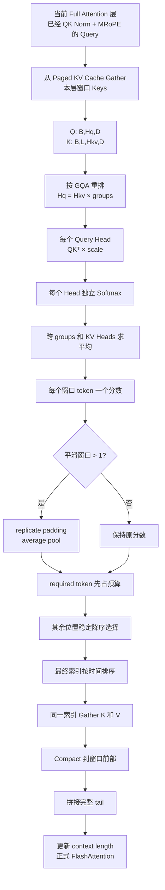

# nano-kvLLM 中 SnapKV 筛选机制：从代码、数学到工程落地的完整理解

> **阅读对象**：已经知道 Transformer、Attention、KV Cache、Prefill、Decode 的基本概念，但对“为什么当前 Query 能筛选历史 KV”“GQA 下怎么打分”“Softmax、平滑、Top-K 和物理搬移分别在做什么”还没有真正吃透的初学者。  
> **分析基准**：以仓库最终融合 Qwen3.5/Qwen3.6 Hybrid 的 `nano-vllm-qwen3.6` 代码为主；同时对比早期 `nano-kvllm` 中的旧实现，并参照 SnapKV 原论文解释思想来源。  
> **核心源码**：
>
> ```text
> nanovllm/kv_compression/snapkv.py
> nanovllm/kv_compression/runtime.py
> nanovllm/kv_compression/slots.py
> nanovllm/kv_compression/policy.py
> nanovllm/kv_compression/events.py
> nanovllm/layers/attention.py
> nanovllm/models/qwen3_5.py
> tests/test_kv_compression_snapkv.py
> ```

---

# 1. 先给出最重要的结论

仓库中的筛选逻辑可以用一句话概括：

> **在某个 Full Attention 层中，用当前 Decode token 的 Query，分别询问本层待压缩窗口里的每个 Key；把多个 Query Head 的注意力概率平均成每个历史位置的综合重要性分数，对分数做局部平滑，再在保证必留 token 不被删除的前提下选出最高分位置，并按原时间顺序保存对应的 K/V。**

完整数据流是：

```text
当前层已经做完 Q/K 投影、QK Norm 和 MRoPE
                    ↓
当前 Query: [B, Hq, D]
窗口 Key : [B, L, Hkv, D]
                    ↓
按照 GQA 关系把 Hq 个 Query Head 分给 Hkv 个 KV Head
                    ↓
每个 Query Head 独立计算 QKᵀ / √D
                    ↓
每个 Query Head 独立对 L 个历史位置做 Softmax
                    ↓
跨 Query Group 和 KV Head 求平均
                    ↓
每个窗口 token 得到一个分数 [B, L]
                    ↓
可选的局部平均池化平滑
                    ↓
先放入 required token，再从其他位置选最高分
                    ↓
最终索引按时间升序排列
                    ↓
K 和 V 使用同一批索引进行物理 Compact
```

这段机制不负责决定：

```text
什么时候压缩；
压缩哪条请求；
压缩窗口从哪里开始；
释放多少个物理 Block。
```

这些事情由 `policy.py`、Scheduler、事件系统和 BlockManager 决定。

`snapkv.py` 只回答一个问题：

> **已经给定一个压缩窗口和保留预算后，窗口里具体保留哪些位置？**

---

# 2. 为什么 KV Cache 可以按“重要性”筛选

## 2.1 Attention 本身就是一次内容检索

对一个 Query Head 来说，标准注意力分数是：

\[
\ell_i=\frac{q\cdot k_i}{\sqrt{D}}
\]

其中：

- \(q\)：当前 token 在当前层、当前 Query Head 上的查询向量；
- \(k_i\)：历史第 \(i\) 个缓存位置的 Key；
- \(D\)：Head Dimension；
- \(\ell_i\)：当前 Query 与历史位置 \(i\) 的匹配程度。

随后做 Softmax：

\[
p_i=\frac{e^{\ell_i}}{\sum_j e^{\ell_j}}
\]

此时 \(p_i\) 可以理解为：

> 在这个 Query Head 看来，本次读取历史信息时，应把多少注意力份额分给位置 \(i\)。

因此，若某个历史位置获得较高注意力概率，说明它的 Key 与当前 Query 更匹配，对当前生成状态更相关。

SnapKV 类方法利用的正是这个信号：

```text
Attention 已经替我们计算了“当前正在找什么”；
Key 已经是历史内容的检索索引；
高 QK 注意力的位置，通常更值得继续保留。
```

## 2.2 为什么不是直接看 K 的大小

Key 向量本身的模长大，不代表它对当前任务重要。

例如两个历史位置：

```text
K1 很大，但方向和当前 Q 几乎正交；
K2 较小，但方向和当前 Q 高度一致。
```

真正影响注意力的是：

```text
Q 与 K 的匹配关系
```

而不是单独的：

```text
K 的大小
```

所以筛选必须是 Query-aware，也就是“结合当前 Query 决定历史 Key 的重要性”。

## 2.3 为什么 Value 不参与打分

代码的筛选函数只接收 Query 和 Key 来计算分数，没有用 Value：

```python
scores = snapkv_token_scores(query, window_keys, ...)
```

这是因为标准 Attention 中：

```text
Q 和 K 决定去哪里找；
V 决定找到后读出什么内容。
```

注意力权重来自：

\[
\operatorname{Softmax}(QK^T)
\]

而最终输出才是：

\[
\operatorname{Softmax}(QK^T)V
\]

因此筛选“哪些位置可能被访问”时，Key 是直接的地址匹配依据。

但一旦决定保留位置 \(i\)，就必须同时保留：

```text
K_i 和 V_i
```

不能只保留 Key 或只保留 Value，因为二者是一一对应的 KV Pair。

## 2.4 为什么这种判断不是绝对正确

当前 Query 只能反映：

```text
模型此刻正在处理什么；
当前生成状态正在关注什么。
```

它不能保证预测未来所有 Query 的需求。

例如当前模型正在总结实验结果，早期某个电话号码暂时没有被关注；几百个 token 后用户又问那个电话号码。如果相关 KV 已被删除，模型就无法直接读取它。

因此这是一种有损近似：

```text
利用当前注意力分布预测未来可能的重要历史
```

而不是数学上保证不丢信息的无损压缩。

---

# 3. 这份代码与原版 SnapKV 是什么关系

## 3.1 原论文的核心观察

SnapKV 原论文发现：

1. 长 Prompt 中，生成阶段经常被关注的关键位置具有一定稳定性；
2. Prompt 末尾一小段“观察窗口”的 Query，可以提前暴露模型之后会关注哪些 Prompt 特征；
3. 因此可以在正式生成前，用观察窗口对长 Prompt 的 Key 打分；
4. 对重要位置做局部聚类式保留，再把完整观察窗口拼回去。

原论文的简化流程是：

```text
Prompt 前缀 Key
        ↑
Prompt 末尾多个 Query 作为 observation window
        ↓
对每个 Head 统计被关注的前缀位置
        ↓
池化形成局部簇
        ↓
每个 Head 独立 Top-K
        ↓
压缩后的前缀 + 完整 observation window
```

## 3.2 当前仓库是 SnapKV-style，不是论文原样复现

最终仓库保留了这些 SnapKV 核心思想：

```text
使用 Query-Key 注意力概率衡量 KV 重要性；
利用局部平滑照顾重要位置附近的信息；
选择高分历史位置；
不需要重新训练模型；
选择后同时压缩 K 和 V。
```

但它和原版论文有明显区别：

| 维度 | 原版 SnapKV | 当前仓库最终实现 |
|---|---|---|
| 主要压缩时机 | Prompt/Prefill 后形成一次压缩缓存 | Decode 中周期性在线压缩 |
| Query 来源 | Prompt 末尾多个 observation queries | 当前 Decode token 的单个 Query |
| 压缩对象 | 长 Prompt 前缀 | 当前策略指定的未压缩物理 KV 窗口 |
| 头维度选择 | 每个 Attention Head 独立 Top-K | 先跨本地 Query Heads 聚合，得到每层统一 token 索引 |
| 局部聚类 | 原论文主要使用池化，官方伪代码为 max pooling | 当前代码使用 replicate padding + average pooling |
| 近期窗口 | observation window 完整保留 | 窗口外 tail 完整保留；当前 token 在窗口内时强制保留 |
| sink 保护 | 与方法实现有关 | 全局 `sink_tokens` 直接排除在压缩窗口之外 |
| 多层关系 | 每层/每头可独立处理 | 每个真实 KV 层可以选不同位置，但每层保留数量一致 |

所以面试时最准确的说法是：

> 本项目采用的是 **SnapKV 启发的 current-query 重要性筛选**，不是完整复刻论文中的 Prompt observation-window、逐 Head 聚类选择方案。

---

# 4. 从 Qwen3.5 层内调用位置理解输入数据

Qwen3.5 Full Attention 层中，相关代码顺序为：

```python
q = self.q_norm(q)
k = self.k_norm(k)
q, k = self.rotary_emb(positions, q, k)
o = self.attn(q, k, v)
```

然后通用 `Attention.forward()` 中：

```python
store_kvcache(k, v, k_cache, v_cache, context.slot_mapping)
compress_attention_kv_layer_(q, k_cache, v_cache, ...)
flash_attn_with_kvcache(...)
```

因此用于筛选的 Query 具有三个重要特点：

1. 它是当前 Full Attention 层自己的 Query；
2. 它已经经过 QK Norm；
3. 它已经经过 MRoPE 旋转。

窗口中的缓存 Key 也是此前写入缓存的、已经经过相同位置编码体系处理的 Key。

所以 SnapKV 打分使用的不是随便构造的向量，而是与正式 FlashAttention 使用的同一类 Q/K 表示。

## 4.1 为什么每层可能选出不同位置

每层隐藏状态不同，因此每层产生的：

```text
Q 不同；
K 不同；
注意力职责不同。
```

浅层可能更关注局部词法信息，深层可能更关注任务目标或语义实体。

因此代码允许：

```text
KV Layer 0 保留位置 [2, 8, 20]
KV Layer 1 保留位置 [1, 7, 19]
KV Layer 2 保留位置 [3, 8, 25]
```

只要每层最终都保留相同数量的物理 KV 项即可。

这也是测试 `test_each_kv_layer_may_keep_different_positions_with_same_length` 验证的行为。

## 4.2 为什么 GDN 层不参与

Qwen3.5 Hybrid 架构中，只有 Full Attention 层具有标准 K/V Cache。

GDN 层维护的是 recurrent/convolution state，并不存在供当前 Query 遍历的标准历史 Key 序列。

因此：

```text
Full Attention KV 层：执行 SnapKV 筛选；
GDN 层：不执行 SnapKV，也不 Compact GDN state。
```

最终代码通过独立的 `kv_layer_index` 只绑定真实 KV 层。

---

# 5. SnapKV 主文件的四层结构

最终 `snapkv.py` 可以拆成四层：

```text
第一层：gqa_attention_logits
        计算每个 Query Head 对窗口 Key 的原始 logits

第二层：snapkv_token_scores
        做逐 Head Softmax、跨 Head 聚合和局部平滑

第三层：select_indices_from_scores
        处理必留位置、预算、稳定排序和时间顺序

第四层：select_snapkv_indices
        把打分和选择串起来
```

主调用函数非常短：

```python
def select_snapkv_indices(
    query,
    window_keys,
    *,
    keep_tokens,
    required_mask=None,
    smoothing_window=1,
    scale=None,
):
    scores = snapkv_token_scores(
        query,
        window_keys,
        smoothing_window=smoothing_window,
        scale=scale,
    )
    return select_indices_from_scores(
        scores,
        keep_tokens=keep_tokens,
        required_mask=required_mask,
    )
```

其本质就是：

```text
先算每个 token 的分数
再按约束选索引
```

下面逐层拆解。

---

# 6. 第一步：`gqa_attention_logits()` 怎样处理 GQA

## 6.1 输入形状

函数要求：

```text
query       : [B, Hq, D]
window_keys : [B, L, Hkv, D]
```

含义：

| 维度 | 含义 |
|---|---|
| `B` | 被处理请求数 |
| `Hq` | 当前 TP Rank 上的 Query Head 数 |
| `Hkv` | 当前 TP Rank 上的 KV Head 数 |
| `L` | 压缩窗口 token 数 |
| `D` | Head Dimension |

Decode 阶段每条请求当前只有一个 Query token，因此没有显式的 Query Length 维度。

## 6.2 MHA、GQA 和 MQA 的关系

### MHA

```text
Hq = Hkv
```

每个 Query Head 有自己对应的 KV Head。

### GQA

```text
Hq > Hkv
Hq % Hkv = 0
```

多个 Query Heads 共享一个 KV Head。

例如：

```text
Hq = 8
Hkv = 2
groups = 4
```

映射关系为：

```text
Q Head 0～3 → KV Head 0
Q Head 4～7 → KV Head 1
```

### MQA

```text
Hkv = 1
```

所有 Query Heads 共享同一个 KV Head。

最终实现同时兼容三者。

## 6.3 为什么先 reshape Query

源码：

```python
groups = num_query_heads // num_kv_heads
grouped_query = query.float().reshape(
    batch, num_kv_heads, groups, head_dim
)
```

原始 Query：

```text
[B, Hq, D]
```

变成：

```text
[B, Hkv, G, D]
```

这里：

\[
G=\frac{H_q}{H_{kv}}
\]

这不是改变数据语义，只是明确表示：

```text
每个 KV Head 对应哪一组 Query Heads。
```

## 6.4 为什么 Key 要 permute

窗口 Key 输入为：

```text
[B, L, Hkv, D]
```

源码：

```python
keys_by_head = window_keys.float().permute(0, 2, 1, 3)
```

变为：

```text
[B, Hkv, L, D]
```

这样 Query 和 Key 的 KV Head 维度就对齐了。

## 6.5 `einsum` 到底在算什么

源码：

```python
torch.einsum(
    'bhgd,bhld->bhgl', grouped_query, keys_by_head
)
```

字母解释：

```text
b：batch
h：KV Head
g：该 KV Head 共享的 Query Group
l：窗口 token 位置
d：Head Dimension
```

执行的是：

\[
\text{logit}_{b,h,g,l}
=
\sum_d Q_{b,h,g,d}K_{b,h,l,d}
\]

输出：

```text
[B, Hkv, G, L]
```

这等价于：

```text
每一个 Query Head
分别与它所共享的 KV Head 中的 L 个 Key 做点积。
```

## 6.6 为什么乘 `1/sqrt(D)`

源码默认：

```python
scale = head_dim ** -0.5
```

即：

\[
\frac{1}{\sqrt D}
\]

若不缩放，随着 \(D\) 增大，点积方差也会增大，Softmax 容易变得极端：

```text
一个位置概率接近 1；
其他位置几乎都是 0。
```

缩放后，logits 的数值范围更稳定。

在实际调用中，代码传入的是 Attention 模块自己的：

```python
scale=self.scale
```

因此筛选打分和正式 Attention 使用相同缩放系数。

## 6.7 为什么显式转成 float32

源码：

```python
grouped_query = query.float()
keys_by_head = window_keys.float()
```

模型的 Q/K Cache 可能是 BF16 或 FP16。

打分、Softmax 和排序对数值误差较敏感，先转 FP32 可以降低：

```text
低精度点积误差；
Softmax 下溢或过度饱和；
Top-K 临界位置因数值抖动发生变化。
```

代价是压缩步骤会增加临时显存和计算开销。

---

# 7. 第二步：为什么要“每个 Query Head 先独立 Softmax”

源码：

```python
logits = gqa_attention_logits(query, window_keys, scale=scale)
scores = torch.softmax(logits, dim=-1).mean(dim=(1, 2))
```

这是整个筛选机制最关键的一行。

## 7.1 Softmax 的维度

`logits` 形状：

```text
[B, Hkv, G, L]
```

执行：

```python
torch.softmax(logits, dim=-1)
```

表示对每一个：

```text
batch、KV Head、Query Group
```

单独在 L 个历史位置之间归一化。

因此每个 Query Head 都得到一份自己的注意力概率分布：

\[
\sum_{i=1}^{L}p_{h,i}=1
\]

## 7.2 为什么不能先把 Head 的 logits 平均，再做 Softmax

下面两种写法不等价：

### 当前正确逻辑

\[
\frac{1}{H}\sum_h\operatorname{Softmax}(\ell_h)
\]

### 另一种逻辑

\[
\operatorname{Softmax}\left(\frac{1}{H}\sum_h\ell_h\right)
\]

Softmax 是非线性函数，所以不能交换顺序。

更直观地说：

```text
Head 0 的 logits 可能整体幅值很大；
Head 1 的 logits 可能整体幅值较小。
```

若先平均 logits，大幅值 Head 可能压过其他 Head。

而逐 Head Softmax 后，每个 Head 都先得到总和为 1 的投票权，再跨 Head 平均：

```text
每个 Query Head 都平等投一票。
```

这正是代码注释强调的：

```python
# Softmax is intentionally evaluated independently for every query head
# before GQA groups and KV heads are reduced.
```

## 7.3 `mean(dim=(1, 2))` 在做什么

Softmax 后形状仍为：

```text
[B, Hkv, G, L]
```

对维度 1、2 求平均：

```python
.mean(dim=(1, 2))
```

得到：

```text
[B, L]
```

数学上：

\[
s_i=\frac{1}{H_q}\sum_{h=1}^{H_q}p_{h,i}
\]

即：

> 每个 token 的最终分数，是所有本地 Query Heads 对它分配的平均注意力概率。

如果某个位置：

```text
被很多 Heads 同时关注
```

其平均分会较高。

如果它：

```text
只被一个 Head 极强关注，其他 Heads 几乎不看
```

最终是否入选取决于该强关注是否足够拉高平均值。

## 7.4 为什么用 mean 而不是 sum

当 Head 数固定时：

```text
sum 和 mean 的排序结果完全相同。
```

因为：

\[
\operatorname{mean}=\frac{1}{H}\operatorname{sum}
\]

只是乘了一个正常数。

使用 mean 的好处是分数尺度更统一：

```text
不同模型、不同 TP 切分下，分数不会简单随本地 Head 数增长。
```

在不做平滑时，每行所有 token 分数之和为 1，因此更容易解释为平均注意力概率。

## 7.5 这一步与原版逐 Head Top-K 的区别

原版 SnapKV 更强调：

```text
每个 Head 有自己的关注模式；
每个 Head 独立选择重要位置。
```

当前仓库则先把所有本地 Query Heads 聚合为一个 token 分数：

```text
同一层内所有 KV Heads 共用一组保留位置。
```

优点：

```text
物理 Compact 更简单；
每个 token 位置整体保留或整体删除；
Paged KV Cache 长度容易统一管理。
```

代价：

```text
某个少数 Head 独有但非常重要的位置，可能被多数 Head 的低关注稀释。
```

---

# 8. 第三步：局部平滑为什么能保护“重要信息附近的 token”

源码：

```python
if smoothing_window > 1:
    padding = smoothing_window // 2
    padded = F.pad(
        scores.unsqueeze(1),
        (padding, padding),
        mode='replicate',
    )
    scores = F.avg_pool1d(
        padded,
        kernel_size=smoothing_window,
        stride=1,
    ).squeeze(1)
```

默认配置：

```text
kv_compress_smoothing_window = 5
```

## 8.1 为什么不能只保留孤立最高点

一个语义单元往往跨多个 token。

例如电话号码：

```text
+86 138 1234 5678
```

或一个变量名：

```text
kv_compression_window
```

模型可能对其中某个 token 的 Key 给出最高分，但完整信息依赖它附近的 token。

只保留孤立峰值可能出现：

```text
保留了国家区号，丢了后面的号码；
保留了变量名的一部分，丢了其他子词；
保留了实体中心词，丢了修饰条件。
```

所以 SnapKV 原思想加入局部聚类：

> 一个位置重要时，它附近的上下文也可能有价值。

## 8.2 当前代码使用平均池化

假设平滑窗口为 3，原始分数为：

```text
[s0, s1, s2, s3, s4]
```

中间位置的新分数近似为：

\[
\tilde{s}_i=\frac{s_{i-1}+s_i+s_{i+1}}{3}
\]

它会产生两个作用：

### 作用一：降低孤立尖峰

```text
0.01, 0.90, 0.01
```

中心平滑后不再是 0.90，而约为：

```text
0.307
```

说明只有一个孤立位置很高、邻居完全不重要时，不再拥有绝对优势。

### 作用二：提高连续高分区域

```text
0.60, 0.70, 0.65
```

平滑后中间仍然很高，说明这是一段稳定的重要区域。

因此平均池化偏好：

```text
局部连续的重要区域
```

而不是：

```text
单个偶然的尖峰。
```

## 8.3 为什么 `smoothing_window` 必须是正奇数

代码要求：

```text
1、3、5、7……
```

奇数窗口有明确中心：

```text
左边 padding 个位置
+ 当前中心位置
+ 右边 padding 个位置
```

例如窗口 5：

```text
i-2, i-1, i, i+1, i+2
```

这样平滑后输出与原序列位置一一对应。

## 8.4 为什么边界用 replicate padding

例如最左端位置没有 `i-1`。

`mode='replicate'` 会复制边界：

```text
原始：[s0, s1, s2, ...]
pad ：[s0, s0, s1, s2, ...]
```

窗口为 3 时，最左分数变为：

\[
\frac{s_0+s_0+s_1}{3}
\]

这样：

- 输出长度不变；
- 不会因为补零而人为压低边界；
- 每个位置都能使用相同大小的池化窗口。

## 8.5 当前平均池化与原论文 max pooling 的区别

原版 SnapKV 伪代码强调 max pooling：

```text
局部区域只要存在一个强峰，附近位置都可能获得较高聚类分数。
```

当前仓库使用 average pooling：

```text
局部区域整体持续高分时才更占优势。
```

两者偏好不同：

| 池化 | 更偏好什么 |
|---|---|
| Max Pooling | 区域中存在一个极强峰 |
| Average Pooling | 区域整体平均较重要 |

所以当前实现是一种更平滑、更保守的局部连续性启发式，不是原论文池化方式的逐字复刻。

## 8.6 平滑不等于强制选择连续块

平滑只是修改每个位置的分数。

最终仍然是独立 Top-K，所以结果可能是：

```text
[2, 3, 10, 20, 21]
```

而不一定是完整连续区间。

它只是让邻近高分位置更有机会入选，不保证一定成簇。

---

# 9. 第四步：`required_mask` 为什么必须存在

## 9.1 required token 是什么

`required_mask` 表示：

```text
无论重要性分数高低，都必须保留的位置。
```

最终策略中，若当前 Decode token 位于压缩窗口内，它必须被加入：

```text
required_window_indices
```

随后 `runtime.py` 把这些索引转成布尔 Mask。

## 9.2 为什么当前 token 必须保留

Attention 调用顺序是：

```text
先 store 当前 token 的 K/V
再执行压缩
再执行本层正式 FlashAttention
```

如果当前 token 落在本次窗口内，却因为分数不高被删掉，会出现：

```text
刚刚写入的当前 K/V 被本轮自己删除。
```

这会破坏：

- 当前层缓存的完整状态；
- 下一轮 Decode 的历史；
- Scheduler 对物理 KV 长度的假设。

所以事件对象在构造时就验证：

```text
当前 token 在窗口内 → 必须出现在 required_window_indices 中
```

## 9.3 required token 会占用保留预算

假设：

```text
keep_tokens = 4
required token 数 = 1
```

那么普通高分位置只能再选：

```text
4 - 1 = 3 个
```

源码：

```python
remaining_budget = keep_tokens - required_indices.numel()
```

这非常重要。

错误做法是：

```text
先选 Top-4，再额外塞入 required token
```

这样最终会保留 5 个，破坏压缩后长度和 Block 回收计划。

当前代码保证：

```text
必留位置 + 普通选中位置 = keep_tokens
```

## 9.4 sink token 为什么不通过 required_mask 保护

最终策略中的 sink token 在窗口规划阶段就被排除：

```python
window_start = max(kv_uncompressed_start, sink_tokens)
```

例如：

```text
sink_tokens = 1
```

则物理 KV 位置 0 永远位于窗口之前，不参与竞争，也不会被 Compact 覆盖。

所以：

```text
sink token 的保护发生在 policy 层；
当前 token 的保护发生在 required_mask 层。
```

这两者不能混为一谈。

---

# 10. 第五步：真正的 Top-K 选择是怎样执行的

核心代码：

```python
required_indices = all_indices[required[batch_index]]
remaining_indices = all_indices[~required[batch_index]]
remaining_budget = keep_tokens - required_indices.numel()

remaining_scores = scores[batch_index, remaining_indices]
order = torch.argsort(
    remaining_scores,
    descending=True,
    stable=True,
)
chosen = remaining_indices[order[:remaining_budget]]
selected = torch.cat((required_indices, chosen))
selected = torch.sort(selected).values
```

## 10.1 为什么没有直接使用 `torch.topk()`

最终代码使用稳定 `argsort`，主要为了可重复处理同分情况。

当多个 token 分数完全相同：

```text
token 0: 0.2
token 1: 0.2
token 2: 0.2
```

`stable=True` 会保持这些位置原本的相对顺序，因此优先更早的位置：

```text
[0, 1, 2]
```

测试明确验证：

```python
scores = torch.ones(1, 5)
keep_tokens = 3
selected == [0, 1, 2]
```

好处：

```text
相同输入得到确定结果；
CPU/GPU 和多次运行更容易对齐；
压缩事件容易测试和复现。
```

## 10.2 为什么只在 non-required 位置里排序

如果 required token 也参加 Top-K，可能出现两类问题：

1. required token 分数太低，没进入 Top-K，违反强制保留；
2. required token 既被强制加入，又被 Top-K 再选一次，造成重复索引。

所以代码先把位置拆成：

```text
required 集合
non-required 集合
```

只对 non-required 位置排序。

## 10.3 为什么最后必须按时间顺序排序

按重要性选出的顺序可能是：

```text
[700, 20, 300, 100]
```

但实际写入缓存前会排序成：

```text
[20, 100, 300, 700]
```

原因有三层。

### 原因一：Compact 后形成可解释的历史顺序

压缩缓存仍按原来的时间先后排列。

### 原因二：后续 tail 会接在保留窗口之后

缓存布局是：

```text
不动前缀
+ 按时间排列的保留窗口
+ 完整未压缩 tail
```

若保留窗口内部乱序，物理时间线会更加混乱。

### 原因三：下游校验要求 chronological

`slots.py` 明确检查：

```python
keep_indices == torch.sort(keep_indices).values
```

否则拒绝执行 Compact。

## 10.4 为什么物理位置变化后不重新做 RoPE

Key 在原始 token 生成时已经完成 MRoPE/RoPE 旋转。

把它从物理 Slot 700 搬到 Slot 20，并不会把它的逻辑位置改成 20。

需要区分：

```text
逻辑位置：已经编码在 Key 向量中；
物理位置：只是 KV Cache 存储地址。
```

因此 Compact 只搬运向量，不重新旋转。

---

# 11. 用一个完整的 GQA 小例子手算

为了能手工计算，假设：

```text
B = 1
Hq = 4
Hkv = 2
G = Hq / Hkv = 2
D = 2
L = 6
scale = 1
```

Query：

```text
Q0 = [2, 0]
Q1 = [1, 0]   → 共享 KV Head 0

Q2 = [0, 2]
Q3 = [0, 1]   → 共享 KV Head 1
```

窗口中 6 个 token 的两个 KV Head Key：

| token | KV Head 0 | KV Head 1 |
|---:|---|---|
| 0 | `[1,0]` | `[0,1]` |
| 1 | `[0.5,0]` | `[0,0.5]` |
| 2 | `[0,1]` | `[1,0]` |
| 3 | `[-1,0]` | `[0,-1]` |
| 4 | `[1,0]` | `[0,1]` |
| 5 | `[0,1]` | `[1,0]` |

## 11.1 点积 logits

四个 Query Heads 得到：

| Head | token0 | token1 | token2 | token3 | token4 | token5 |
|---|---:|---:|---:|---:|---:|---:|
| Q0 | 2.0 | 1.0 | 0.0 | -2.0 | 2.0 | 0.0 |
| Q1 | 1.0 | 0.5 | 0.0 | -1.0 | 1.0 | 0.0 |
| Q2 | 2.0 | 1.0 | 0.0 | -2.0 | 2.0 | 0.0 |
| Q3 | 1.0 | 0.5 | 0.0 | -1.0 | 1.0 | 0.0 |

这里 Q2/Q3 虽然数值方向与 Q0/Q1 不同，但它们与自己的 KV Head 1 匹配后得到同样分布。

## 11.2 每个 Head 独立 Softmax

强 Query Head 的概率约为：

```text
[0.3764, 0.1385, 0.0509, 0.0069, 0.3764, 0.0509]
```

弱 Query Head 的概率约为：

```text
[0.2876, 0.1744, 0.1058, 0.0389, 0.2876, 0.1058]
```

对 4 个 Heads 求平均后：

| token | 综合分数 |
|---:|---:|
| 0 | 0.3320 |
| 1 | 0.1564 |
| 2 | 0.0784 |
| 3 | 0.0229 |
| 4 | 0.3320 |
| 5 | 0.0784 |

所以最重要的是：

```text
token 0 和 token 4
```

第三名是：

```text
token 1
```

若：

```text
keep_tokens = 3
required_mask 全 False
```

最终选择：

```text
[0, 1, 4]
```

注意，重要性顺序可能先得到：

```text
[0, 4, 1]
```

但最终按时间排序为：

```text
[0, 1, 4]
```

## 11.3 加入 required token

假设 token 3 是当前 Decode token，必须保留：

```text
required = token 3
keep_tokens = 3
```

token 3 的分数虽然最低，仍先占用一个预算。

剩余预算：

```text
3 - 1 = 2
```

再选最高分 token 0 和 token 4。

最终：

```text
[0, 3, 4]
```

这说明：

> required token 的安全性优先于纯重要性排序。

## 11.4 加入 smoothing window = 3

原分数：

```text
[0.3320, 0.1564, 0.0784, 0.0229, 0.3320, 0.0784]
```

平均池化后约为：

```text
[0.2735, 0.1889, 0.0859, 0.1444, 0.1444, 0.1629]
```

可以看到：

- token 0 仍高，但孤立优势下降；
- token 1 因靠近 token 0 获得提升；
- token 5 因靠近 token 4 获得提升；
- token 4 的高峰被邻居较低值平均后下降。

这正体现了平均池化的偏好：

```text
更看重局部区域的整体重要性，而不是单点最高值。
```

---

# 12. 筛选窗口是怎么来的

SnapKV 函数本身不知道窗口起点。窗口由 `policy.py` 规划。

## 12.1 最终实现是 frontier window

窗口起点：

```python
window_start = max(kv_uncompressed_start, sink_tokens)
```

窗口终点：

```python
window_end = window_start + window_tokens
```

因此它从：

```text
最老的尚未压缩物理 KV 边界
```

向后选择一个固定窗口。

这不是简单地永远取：

```text
缓存最后 window_tokens 个 token
```

## 12.2 为什么从最老未压缩边界推进

假设缓存：

```text
[sink][已压缩区][未压缩区................................][当前尾部]
                  ↑
          kv_uncompressed_start
```

每次压缩未压缩区最前面的一个固定窗口：

```text
[sink][已压缩区][本次窗口][仍未处理的 tail]
```

压缩后 frontier 前移：

```text
new_kv_uncompressed_start = window_start + keep_tokens
```

这样可以：

- 避免不断反复压缩同一批已经压缩过的 KV；
- 让压缩过程沿物理历史向前推进；
- 保持单次窗口大小固定；
- 完整保留窗口后的新 tail。

## 12.3 窗口外的 token 怎么处理

布局分为：

```text
窗口前 prefix：完全不动
窗口内 KV    ：SnapKV 筛选
窗口后 tail  ：全部保留
```

筛选只比较窗口内位置的相对重要性。

它不会给 prefix 和 tail 打分，因为它们根本不参加本次淘汰竞争。

---

# 13. 从筛选索引到真实 KV 搬移

SnapKV 返回的是：

```text
窗口内部相对索引
```

例如：

```text
keep_indices = [0, 3, 7]
window_start = 100
```

真实源逻辑位置为：

```text
[100, 103, 107]
```

源码：

```python
source_keep = keep_indices + request.window_start
```

然后把窗口后的完整 tail 拼上：

```python
source_tail = arange(window_end, source_kv_num_tokens)
source_positions = cat(source_keep, source_tail)
```

目标位置为：

```python
destination_positions = arange(window_start, new_kv_num_tokens)
```

形成：

```text
原布局：prefix + 分散保留项 + 被删除项 + tail
新布局：prefix + 紧凑保留项 + tail
```

## 13.1 为什么必须先 Gather + Clone

源和目标可能重叠。

例如：

```text
源位置：[100, 103, 107]
目标位置：[100, 101, 102]
```

若一边读一边写：

```text
把源 103 写到目标 101
```

可能覆盖后续仍需读取的其他源数据。

所以代码先：

```python
gathered_k = flat_k.index_select(0, source_slots).clone()
gathered_v = flat_v.index_select(0, source_slots).clone()
```

再统一：

```python
flat_k.index_copy_(0, destination_slots, gathered_k)
flat_v.index_copy_(0, destination_slots, gathered_v)
```

这相当于搬家前先把所有要保留的东西装进临时箱子，再覆盖旧房间。

## 13.2 为什么 K 和 V 使用完全相同的索引

每个缓存位置表示同一个历史 token 在某个 KV Head 上的一对：

```text
(K_i, V_i)
```

若 K 使用 `[0,3,7]`，V 却使用 `[0,4,7]`，注意力就会出现：

```text
通过 K3 匹配到位置 3
却读取 V4 的内容
```

语义完全错位。

所以筛选只产生一套位置索引，并同时作用于 K/V。

## 13.3 Paged KV Cache 为什么还要映射 Slot

逻辑位置不是物理连续地址。

例如 `block_table`：

```text
[7, 23, 2, 41]
```

逻辑 Block 0 可能在物理 Block 7，逻辑 Block 1 在物理 Block 23。

位置映射：

\[
\text{logical block}=\left\lfloor\frac{p}{B}\right\rfloor
\]

\[
\text{offset}=p\bmod B
\]

\[
\text{physical slot}=\text{block\_table[logical block]}\times B+\text{offset}
\]

`slots.py` 对每个源位置和目标位置单独做该映射，不假设物理 Block ID 连续。

---

# 14. 为什么筛选后本轮 FlashAttention 就能直接使用

每层顺序是：

```text
1. 写当前 K/V
2. SnapKV 筛选
3. Compact 本层 K/V
4. context_lens 改成新长度
5. FlashAttention
```

Compact 后有效 KV 被压到缓存前部连续逻辑区间：

```text
[0, new_kv_num_tokens)
```

FlashAttention 不需要知道：

```text
哪些 token 被删除；
每个保留 KV 原本来自什么位置；
keep_indices 是多少。
```

它只接收：

```text
k_cache
v_cache
block_table
cache_seqlens = new_kv_num_tokens
```

然后读取前 `new_kv_num_tokens` 个有效逻辑位置。

这就是为什么筛选后必须进行物理 Compact，而不能只留下一个稀疏索引列表。

---

# 15. 旧 Qwen3 版本与最终 Qwen3.5 版本的筛选差异

## 15.1 旧版函数

早期 `CompressMethod.py` 的主要特点：

```text
Q: [B, Hq, query_window, D]
K: [B, Hkv, L, D]

排除最后 recent window；
窗口第一个位置分数设为 -inf；
普通 Top-K 不选它；
最后显式拼接：
  window index 0
  + Top-K
  + 最后 recent window
```

因此旧版固定保留：

```text
窗口首位置 + 近期位置
```

## 15.2 最终版主要变化

### 变化一：输入布局更符合最终 Paged Gather 结果

```text
旧：K [B, Hkv, L, D]
新：K [B, L, Hkv, D]
```

### 变化二：只使用当前单个 Query

```text
旧：保留 query window 维度
新：Query [B, Hq, D]
```

### 变化三：Sink 从算法内固定拼接改为策略外保护

旧版：

```text
窗口 index 0 被当作锚点固定保留
```

最终版：

```text
全局前 sink_tokens 不进入窗口
```

两者含义不同：

```text
旧窗口 index 0 不一定是真正全局 BOS；
新 sink token 是物理缓存最前面的全局受保护区域。
```

### 变化四：当前 token 使用通用 required_mask

最终版不再无条件拼接窗口最后一个位置。

规则是：

```text
当前 token 在窗口中 → 强制保留；
当前 token 在窗口后 tail 中 → tail 本来就完整保留；
```

### 变化五：加入平滑

旧版没有局部池化；最终版支持奇数窗口平均池化。

### 变化六：稳定同分策略

旧版 `torch.topk(sorted=False)` 对相同分数的顺序不强调稳定。

最终版使用：

```python
torch.argsort(..., stable=True)
```

同分时优先更早位置，便于复现。

### 变化七：强校验更多

最终版显式验证：

- 形状；
- dtype；
- GQA 整除关系；
- scale 合法性；
- required 数量不超过预算；
- score 有限；
- 索引唯一；
- 索引按时间排序；
- required token 必须出现在结果中。

---

# 16. 为什么这套方法在工程上“可以运行”

要区分两个问题：

```text
算法是否一定保持质量？
系统是否能正确执行？
```

## 16.1 系统正确性为什么成立

当前实现保证：

1. 每层 K/V 使用同一保留索引；
2. 所有真实 KV 层保留数量一致；
3. 当前 token 不会被误删；
4. sink 和窗口后 tail 不会参与淘汰；
5. 结果按时间顺序排列；
6. Compact 后有效 KV 连续；
7. `context_lens` 与压缩后长度一致；
8. 所有真实 KV 层完成后才发事件并释放 Blocks；
9. GDN state 不被误当作 KV 压缩；
10. RoPE/MRoPE 逻辑时间线不因物理搬移回退。

所以它能在推理框架中保持数据结构和生命周期一致。

## 16.2 模型质量为什么只是经验上可能成立

质量依赖于以下经验假设：

```text
当前 Query 的关注模式，对近期未来仍具有代表性；
高注意力历史位置比低注意力位置更值得保留；
局部平滑能保护完整语义邻域；
sink 和新 tail 能维持生成稳定性。
```

这些假设在很多长上下文任务中有效，但不是理论保证。

因此必须通过实验验证：

- LongBench；
- Needle-in-a-Haystack；
- 长代码生成；
- 多轮对话事实回忆；
- 不同压缩率下的质量曲线；
- 不同 smoothing window 的消融。

---

# 17. 这份实现的局限与需要警惕的地方

## 17.1 当前 Query 可能过于短视

最终实现只使用一个 Decode Query：

```text
Wq = 1
```

优点是开销低；缺点是一次 Query 可能存在偶然性。

相比原版多个 observation queries，它对未来关注模式的估计可能更抖动。

可以考虑的改进：

```text
缓存最近若干 Query；
使用多个 Decode Query 聚合；
对多个压缩周期累计分数；
加入指数移动平均。
```

## 17.2 跨 Head 平均会稀释少数 Head 的专有信息

某个 Head 可能专门负责：

```text
复制数字；
追踪括号；
检索实体；
维持格式。
```

如果只有它强烈关注某位置，其他 Heads 都不关注，平均后该位置可能被删。

原版逐 Head Top-K 更能保留 Head 专门化，但工程布局更复杂。

## 17.3 Average Pooling 不是原版 Max Pooling

平均池化更强调区域平均质量，可能压低重要的孤立精确事实。

例如一个独立数字 token 周围都是普通文本，它的高峰可能被稀释。

## 17.4 分数只在当前窗口内部归一化

Softmax 的分母只包含窗口内 L 个位置。

所以它回答的是：

```text
在本窗口这些候选中，谁更重要？
```

而不是：

```text
这个位置相对于整条历史绝对有多重要？
```

窗口整体可能都不重要，也必须留下 `keep_tokens` 个；窗口整体可能都很重要，也必须删除固定数量。

这属于固定预算压缩的天然局限。

## 17.5 每层位置身份不统一

不同层可能在相同紧凑槽位存储不同原始 token 的 KV。

这对当前层内 Attention 可以工作，但系统不再拥有统一的“压缩后 token 身份映射”。

未来若要：

```text
跨层共享稀疏索引；
恢复原始 token 身份；
做可解释性追踪；
统一逐 token 重要性；
```

就需要额外元数据。

## 17.6 Tensor Parallel 下是 Rank-local 选择

从当前代码调用链看，SnapKV 打分使用每个 TP Rank 本地的 Query Heads 和 KV Heads，没有在选择前做全局 Head 分数 All-Reduce。

因此不同 Rank 可以选择不同历史位置，只要求：

```text
保留数量相同；
压缩后长度相同；
释放 Block 数一致。
```

这在分 Head 计算上可以运行，但并不等价于“聚合全模型所有 Heads 后得到统一 Top-K”。

## 17.7 筛选和搬移有额外开销

压缩步骤包含：

```text
FP32 QK 打分；
Softmax；
池化；
稳定排序；
Paged Gather；
K/V Clone；
Scatter Compact。
```

所以短上下文或低并发场景不一定更快。

净收益应比较：

\[
\text{后续节省的 Attention 读取成本}
-
\text{周期性压缩成本}
\]

---

# 18. 代码中的防御性检查分别防什么错误

## 18.1 `Hq % Hkv == 0`

防止 GQA Head 映射不完整。

例如：

```text
Hq = 3
Hkv = 2
```

无法平均分组。

## 18.2 scale 必须正且有限

防止：

```text
scale = 0
scale = NaN
scale = inf
scale = True
```

导致分数异常。

## 18.3 scores 必须 finite

若出现 NaN/inf，排序结果不可解释，直接拒绝。

## 18.4 required 数量不能超过 keep budget

否则不可能同时满足：

```text
全部必留
且
最终总数不超过预算
```

## 18.5 keep indices 必须唯一

重复索引意味着保留数量名义上够，实际不同 KV 数不足。

## 18.6 结果必须 chronological

保证 Compact 布局和后续 tail 追加语义稳定。

## 18.7 当前 token 在窗口内必须 required

防止刚写入的 Decode KV 被删除。

这些检查看起来繁琐，但 KV Cache 属于跨层共享的底层状态，一次错误可能不会立即报错，而会在很多 Decode 步后表现为随机输出异常，因此必须尽早 fail-fast。

---

# 19. 如何逐行调试这部分代码

建议断点顺序：

```text
nanovllm/layers/attention.py
    Attention.forward()

nanovllm/kv_compression/runtime.py
    compress_attention_kv_layer_()

nanovllm/kv_compression/snapkv.py
    gqa_attention_logits()
    snapkv_token_scores()
    select_indices_from_scores()

nanovllm/kv_compression/slots.py
    build_compaction_positions()
    compact_paged_kv_()
```

重点观察：

```text
query.shape
window_keys.shape
num_query_heads
num_kv_heads
groups
logits.shape
softmax 后每个 Head 的概率和
scores.shape
scores.topk 前后的值
required_mask
keep_indices
source_positions
destination_positions
source_slots
destination_slots
context.context_lens
```

## 19.1 推荐的断言

### 检查每 Head Softmax 是否归一化

```python
probs = torch.softmax(logits, dim=-1)
assert torch.allclose(
    probs.sum(dim=-1),
    torch.ones_like(probs.sum(dim=-1)),
    atol=1e-5,
)
```

### 无平滑时检查综合 score 和

```python
scores = probs.mean(dim=(1, 2))
assert torch.allclose(
    scores.sum(dim=-1),
    torch.ones_like(scores.sum(dim=-1)),
    atol=1e-5,
)
```

### 检查 required 全被选中

```python
assert torch.isin(required_indices, keep_indices).all()
```

### 检查时间顺序和唯一性

```python
assert torch.equal(keep_indices, torch.sort(keep_indices).values)
assert torch.unique(keep_indices).numel() == keep_indices.numel()
```

---

# 20. 仓库测试已经验证了什么

`tests/test_kv_compression_snapkv.py` 覆盖：

1. GQA Query Heads 是否正确归到对应 KV Head；
2. MHA、GQA、MQA 输出形状；
3. 非整除 GQA 是否被拒绝；
4. required token 是否消耗预算并必然保留；
5. required 数量超预算是否报错；
6. 同分时是否稳定选择更早位置；
7. 平滑前后长度是否保持一致；
8. 不同 KV 层是否可以选择不同位置；
9. CPU 与 CUDA 选择是否一致（有 CUDA 时）；
10. dtype、scale 和 Mask 形状是否合法。

本次分析环境缺少 `transformers`，无法直接通过包入口运行整个 unittest 模块；但绕过包初始化后，已对核心文件进行了隔离执行验证：

```text
GQA logits 形状和数值：PASS
required token 预算选择：PASS
stable tie 选择更早位置：PASS
```

仓库自身的实现日志记录的是：

```text
SnapKV/Policy/Slot 等相关 35 项测试通过；
完整测试发现 78 项通过；
当时 CPU-only 环境下 2 项 CUDA 测试被跳过。
```

这属于仓库记录，不等于本次环境重新完成了全套 GPU 验证。

---

# 21. 最容易产生的十个误解

## 误解一：Top-K 是选请求

项目里有两个不同 Top-K：

```text
kv_compress_topk：一次压缩最多选多少条请求；
SnapKV keep_tokens：一条请求的窗口内保留多少 token。
```

二者完全不同。

## 误解二：分数高代表该 token 永远重要

它只代表：

```text
当前层、当前 Query 状态下，相对更受关注。
```

## 误解三：V 也应参与 QV 点积

标准注意力寻址依据是 QK，不是 QV。

## 误解四：所有层必须保留相同 token

当前实现只要求保留数量和物理长度一致，不要求原 token 身份一致。

## 误解五：所有 Head 各自保留一套索引

当前最终实现是先跨本地 Heads 聚合，每层得到一套共享 token 索引。

## 误解六：默认固定保留窗口首尾

这是旧版行为。

最终版：

```text
全局 sink 在窗口外保护；
当前 token 在窗口内时 required；
窗口后 tail 整体保护。
```

## 误解七：窗口总是缓存末尾

最终版从 `kv_uncompressed_start` 指向的 frontier 开始。

## 误解八：平滑后一定选择连续 token

不一定。平滑只改变分数，最终仍是 Top-K。

## 误解九：移动到新 Slot 后 token 位置编码改变

不会。RoPE/MRoPE 信息已经编码在 K 中。

## 误解十：逻辑筛选后显存自然释放

不会。还需要：

```text
Compact
→ 更新长度
→ 所有 KV 层完成
→ 事件回传
→ BlockManager 释放尾部 Blocks
```

---

# 22. 面试时如何讲清楚这部分

## 22.1 一分钟回答

> 我的筛选策略是 SnapKV 启发的 current-query 方法。压缩时，我会取当前 Full Attention 层已经做完 QK Norm 和位置编码的 Query，再从 Paged KV Cache 中 Gather 本次窗口的 Key。因为 Qwen3.5 使用 GQA，所以先把多个 Query Head 按共享关系分组到对应 KV Head，分别计算缩放点积。每个 Query Head 都独立对窗口位置做 Softmax，再跨 Query Groups 和 KV Heads 求平均，得到每个历史位置的综合注意力分数。之后可以用一维平均池化平滑分数，避免只保留孤立 token。选择阶段先占用预算保留当前 Decode token 等 required 位置，再从其他位置稳定地选最高分，最后按原时间顺序排列。同一套索引同时搬移 K 和 V，并把窗口后的 tail 接在后面。它保留了 SnapKV 用注意力模式判断重要 KV 的思想，但不是原论文的完整复现：原论文用 Prompt 末尾多个观察 Query、逐 Head 选择和 max pooling，而我的项目是 Decode 周期压缩、单个当前 Query、层内跨 Head 聚合和 average pooling。

## 22.2 面试官追问“为什么当前 Q 能判断历史重要性”

> 因为 Key 本身就是 Attention 的检索索引，当前 Query 与某个 Key 的缩放点积经过 Softmax 后，就是本次注意力对该历史位置分配的权重。高权重说明这个位置与当前生成状态更匹配，所以可以把它当作重要性的代理信号。这个假设不是绝对保证，而是基于注意力模式具有一定持续性的经验观察，所以需要和 sink 保护、当前 token 必留、未压缩 tail 以及质量评测一起使用。

## 22.3 追问“为什么 Softmax 要在 Head 聚合前”

> 因为不同 Head 的 logits 数值尺度可能不同。先对每个 Head 独立 Softmax，相当于先给每个 Head 一份总量为 1 的投票权，再平均各 Head 的意见；如果先把 logits 平均再 Softmax，大幅值 Head 可能主导结果，而且 Softmax 是非线性的，两种顺序不等价。

## 22.4 追问“为什么还要平滑”

> 语义通常跨多个 token，单纯保留最高注意力点可能只留下一个实体或数字的局部片段。平滑会把局部邻域的分数综合起来，更偏好连续稳定的重要区域。不过当前实现使用平均池化，只是提高邻居入选概率，并不强制保留完整连续块。

---

# 23. 把整个筛选过程压缩成一张图



---

# 24. 最终理解

真正吃透这部分，需要把它分成三个层次。

## 24.1 数学层

```text
QK 点积衡量匹配；
逐 Head Softmax 得到各 Head 的相对注意力概率；
跨 Head 平均得到每个 token 的综合重要性；
局部平滑让连续语义区域更稳定；
Top-K 在固定预算内选择位置。
```

## 24.2 模型层

```text
每个 Full Attention 层有自己的 Q/K/V；
每层可以保留不同原始 token；
Q/K 已做 QK Norm 和 MRoPE；
GDN 层没有标准 KV，不参与；
K/V 必须成对保留。
```

## 24.3 系统层

```text
Policy 决定窗口和 required token；
SnapKV 只输出窗口内相对索引；
Slots 把逻辑位置映射到 Paged Cache 物理地址；
Gather + Clone 保证重叠搬移安全；
Compact 后 FlashAttention 只读新长度；
全部 KV 层完成后 Scheduler 才释放 Blocks。
```

一句话总结：

> **这段 SnapKV 筛选代码的本质，是把“当前 Attention 正在检索哪些历史信息”转换成一个可排序的 token 重要性分数，再用安全约束和固定预算选择要驻留在 GPU KV Cache 中的历史；它利用的是注意力分布的经验稳定性，而系统正确性则依赖 GQA 对齐、必留位置、时间排序、K/V 同步搬移和事件化 Block 回收。**

---

# 25. 资料与源码依据

## 仓库源码

```text
nano-vllm-qwen3.6/nanovllm/kv_compression/snapkv.py
    GQA logits、逐 Head Softmax、Head 聚合、平滑和稳定选择

nano-vllm-qwen3.6/nanovllm/kv_compression/runtime.py
    Gather 窗口 Key、构造 required mask、调用筛选和 Compact

nano-vllm-qwen3.6/nanovllm/kv_compression/policy.py
    Frontier window、sink 保护、当前 token 必留和请求选择

nano-vllm-qwen3.6/nanovllm/kv_compression/slots.py
    Paged Slot 映射、时间顺序校验、K/V 重叠安全搬移

nano-vllm-qwen3.6/nanovllm/kv_compression/events.py
    压缩请求几何关系、当前 token 必留、跨 KV 层完成事件

nano-vllm-qwen3.6/nanovllm/layers/attention.py
    Store KV → Compress → FlashAttention

nano-vllm-qwen3.6/nanovllm/models/qwen3_5.py
    QK Norm、MRoPE、Full Attention 与 GDN Hybrid 结构

nano-vllm-qwen3.6/tests/test_kv_compression_snapkv.py
    GQA、required budget、stable ties、平滑、跨层选择和 CPU/CUDA 一致性

nano-kvllm/nanokvllm/layers/CompressMethod.py
    早期 Qwen3 版本的 SnapKV-style 实现，用于版本对照
```

## 思想来源

```text
Yuhong Li et al.
SnapKV: LLM Knows What You are Looking for Before Generation
NeurIPS 2024, arXiv:2404.14469
```

需要注意：本文对“原版 SnapKV”的说明来自论文；对“当前项目实际行为”的说明以仓库最终源码为准。二者存在差异时，不能用论文描述替代仓库代码。


%% 项目关联导航：开始 %%
## 项目关联导航

- 所属模块：[[outputs/项目整理/模块-nano-kvllm|模块-nano-kvllm]]

%% 项目关联导航：结束 %%
