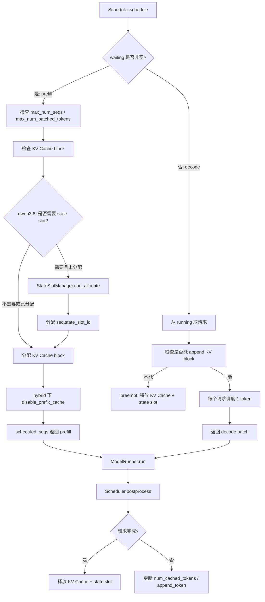

# qwen3.6_scheduler.py_对比分析

> 对比对象：  
> 1. 原版 `nano-vLLM` 中的 `scheduler.py`  
> 2. `nano-vllm-qwen3.6` 中对应的 `scheduler.py`
>
> 本文目标：从工程全局角度分析 qwen3.6 版本相比原版 `scheduler.py` 做了哪些修改，这些修改为什么出现，以及它们在 Qwen3.6 / hybrid 架构 / 推理系统中的作用。

---

## 1. 文件整体定位

`scheduler.py` 是 nano-vLLM 推理系统里的 **请求调度器**。

它不负责模型结构计算，不直接执行 Attention、MLP、GatedDeltaNet，也不直接采样 token。它负责回答一个更上层的问题：

```text
当前这一轮推理 step，到底应该把哪些请求送进模型？
这些请求是 prefill 还是 decode？
有没有足够的 KV Cache block？
如果资源不够，是否需要抢占某些请求？
请求完成后，如何释放它占用的缓存资源？
```

所以它处在推理系统中的位置是：

```text
LLMEngine.step()
  ↓
Scheduler.schedule()
  ↓
ModelRunner.run(seqs, is_prefill)
  ↓
Scheduler.postprocess(seqs, token_ids, is_prefill)
```

原版 nano-vLLM 的 `Scheduler` 主要围绕 **KV Cache block** 做调度；qwen3.6 版本在此基础上新增了 **GDN recurrent / conv state slot** 管理能力，用来支持 hybrid 架构中的非 Attention 状态。

---

## 2. 整体变化概览

qwen3.6 版本 `scheduler.py` 相比原版主要变化如下：

| 改动类别 | 原版 nano-vLLM | qwen3.6 版本 | 作用 |
|---|---|---|---|
| 状态资源管理 | 只管理 KV Cache block | 新增 `StateSlotManager` 管理 GDN state slot | 支持 hybrid / GatedDeltaNet recurrent state |
| 配置字段 | 使用 `kvcache_block_size`、`num_kvcache_blocks` | 新增使用 `config.is_hybrid`、`config.max_state_slots` | 根据模型结构决定是否启用 hybrid 资源管理 |
| prefill 准入判断 | `block_manager.can_allocate(seq)` 返回 cached blocks / -1 | `block_manager.can_allocate(seq)` 作为布尔资源检查 | KV Cache 资源判断接口被简化或迁移 |
| prefix cache | 原版可通过 cached blocks 复用前缀 | hybrid 时 `disable_prefix_cache=self.is_hybrid` | 避免 hybrid 状态和 prefix cache 不一致 |
| prefill token 数 | 根据 cached blocks 或 num_cached_tokens 计算 | `max(seq.num_tokens - seq.num_cached_tokens, 1)` | 适配 re-prefill、抢占恢复、至少调度一个 token |
| decode 状态标记 | 设置 `seq.is_prefill = False` | 删除对 `seq.is_prefill` 的依赖 | prefill/decode 不再由 Sequence 布尔字段维护 |
| preempt 抢占 | 只释放 KV Cache，重置 `is_prefill` | 释放 KV Cache + GDN state slot | hybrid 请求被抢占后状态需重算 |
| postprocess | 调用 `hash_blocks(seq)`，更新缓存，必要时 append token | 不再 hash blocks，显式处理 chunked prefill / re-prefill after preemption | 适配 hybrid 禁用 prefix cache 和抢占恢复 |
| finish 释放 | 只释放 KV Cache block | 释放 KV Cache block + state slot | 防止 GDN state slot 泄漏 |

一句话总结：

**qwen3.6 版本的调度器从“只调度 token 和 KV Cache block”，扩展成了“同时调度 token、KV Cache block、GDN recurrent state slot”的资源调度器。**

---

## 3. 原版 Scheduler 的核心逻辑

原版 `Scheduler` 主要维护两个队列：

```python
self.waiting: deque[Sequence] = deque()
self.running: deque[Sequence] = deque()
```

其中：

```text
waiting：还没有完成 prefill，等待进入模型的请求
running：已经完成 prefill，正在 decode 的请求
```

原版调度逻辑可以概括为：

```text
优先调度 waiting 队列做 prefill
如果本轮有 prefill 请求，就返回 prefill batch
否则调度 running 队列做 decode
如果 decode 时 KV Cache 不够，就抢占某些请求
```

这体现了 nano-vLLM 的基本策略：

```text
prefill 优先级高于 decode
prefill 可以 chunk
decode 每个请求每轮只调度 1 个 token
KV Cache 不够时通过 preempt 释放资源
```

---

## 4. 改动一：新增 `StateSlotManager`

qwen3.6 版本在 `Scheduler` 前新增：

```python
class StateSlotManager:
    """Simple free-list allocator for GDN recurrent/conv state slots."""

    def __init__(self, num_slots: int):
        self.free_slots: deque[int] = deque(range(num_slots))

    def can_allocate(self) -> bool:
        return len(self.free_slots) > 0

    def allocate(self) -> int:
        return self.free_slots.popleft()

    def deallocate(self, slot_id: int):
        self.free_slots.append(slot_id)
```

这是整个文件最重要的新增结构。

原版 Transformer 推理中，每个请求的历史信息主要靠 KV Cache，也就是每个 Attention 层保存历史 token 的 K/V。但是 Qwen3.5 / Qwen3.6 的 hybrid 架构中，除了 full attention 层，还可能包含 GatedDeltaNet 层。GatedDeltaNet 这类 recurrent 结构需要维护 per-request 的 recurrent state / conv state / delta state。

因此，调度器除了要问：

```text
还有没有 KV Cache block？
```

还要问：

```text
还有没有 GDN state slot？
```

`StateSlotManager` 就是一个简单的空闲槽位分配器。它用一个 `deque` 保存当前空闲的 slot id，需要时从左侧取出，释放时再放回队列。

可以把它理解为：

```text
block_manager       -> 管 Attention 层的 KV Cache blocks
state_slot_manager  -> 管 GatedDeltaNet 层的 recurrent/conv state slots
```

---

## 5. 改动二：初始化中新增 hybrid 配置

原版初始化主要是：

```python
self.max_num_seqs = config.max_num_seqs
self.max_num_batched_tokens = config.max_num_batched_tokens
self.eos = config.eos
self.block_size = config.kvcache_block_size
self.block_manager = BlockManager(config.num_kvcache_blocks, config.kvcache_block_size)
```

原版只关心最大并发、最大 batch token 数、EOS、KV Cache block size 和 BlockManager。

qwen3.6 版本变成：

```python
self.max_num_seqs = config.max_num_seqs
self.max_num_batched_tokens = config.max_num_batched_tokens
self.eos = config.eos
self.is_hybrid = config.is_hybrid
self.block_manager = BlockManager(config.num_kvcache_blocks, config.kvcache_block_size)
self.state_slot_manager = StateSlotManager(config.max_state_slots) if config.max_state_slots > 0 else None
```

新增了：

```text
self.is_hybrid
self.state_slot_manager
```

`is_hybrid` 用来告诉调度器当前模型是不是 hybrid 架构。如果是普通 dense attention 模型，调度器主要管理 KV Cache；如果是 hybrid 模型，调度器还必须管理 GDN state，并且 prefix cache 可能需要禁用或特殊处理。

`max_state_slots` 表示最多允许多少个请求同时持有 GDN recurrent / conv state。如果 `config.max_state_slots > 0`，就创建 `StateSlotManager`；否则说明不启用 state slot 管理。

这说明 qwen3.6 的 Scheduler 已经不再是完全模型无关的调度器。它开始根据模型结构决定资源管理策略。

---

## 6. 改动三：prefill 调度逻辑变化

原版 prefill 中计算待调度 token 数的逻辑是：

```python
if not seq.block_table:
    num_cached_blocks = self.block_manager.can_allocate(seq)
    if num_cached_blocks == -1:
        break
    num_tokens = seq.num_tokens - num_cached_blocks * self.block_size
else:
    num_tokens = seq.num_tokens - seq.num_cached_tokens
```

这个写法说明原版支持 prefix cache：如果请求还没有 `block_table`，`block_manager.can_allocate(seq)` 不只是判断能不能分配，还会返回可以复用的 cached blocks 数量。这样 prefill 可以跳过已经命中的前缀 token。

qwen3.6 版本改为：

```python
num_tokens = max(seq.num_tokens - seq.num_cached_tokens, 1)
remaining = self.max_num_batched_tokens - num_batched_tokens
if remaining == 0 or (not seq.block_table and not self.block_manager.can_allocate(seq)):
    break
```

核心变化是：

```text
不再从 can_allocate(seq) 拿 num_cached_blocks
改成直接用 seq.num_tokens - seq.num_cached_tokens
并且至少为 1
```

这说明 qwen3.6 版本把 prefill 的 token 数计算从“依赖 BlockManager 返回 prefix cache 命中块数”，改成了“依赖 Sequence 自己记录 num_cached_tokens”。这和 qwen3.6 版 `sequence.py` 中强化 `num_cached_tokens` 语义是一致的。

`max(..., 1)` 的意义是避免调度 0 个 token。它对抢占恢复、re-prefill、hybrid state 重建这类场景更稳妥。尤其在 hybrid 模型中，请求的历史状态不只由 KV Cache 决定，还可能包括 GDN recurrent state；即使 KV Cache 角度看 token 已经缓存，state 角度也可能需要重新推进或恢复。

---

## 7. 改动四：prefill 阶段新增 state slot 准入判断

qwen3.6 新增：

```python
if self.state_slot_manager is not None and seq.state_slot_id == -1:
    if not self.state_slot_manager.can_allocate():
        break
```

含义是：

```text
如果当前模型需要 GDN state slot，
并且这个请求还没有 state_slot_id，
那就先检查是否还有空闲 state slot。
如果没有，就不能把这个请求调度进去。
```

原版调度器只需要检查 KV Cache 是否足够；qwen3.6 调度器必须同时检查 GDN state slot 是否足够。

否则会出现一种错误状态：请求已经进入模型 forward，Attention 有 KV Cache block，但是 GatedDeltaNet 没有 recurrent state 的存放位置。这会导致 hybrid 层无法正确推理。

因此 state slot 是和 KV Cache 同级别的关键资源。

---

## 8. 改动五：KV Cache 分配时 hybrid 禁用 prefix cache

原版分配逻辑：

```python
if not seq.block_table:
    self.block_manager.allocate(seq, num_cached_blocks)
```

这里传入 `num_cached_blocks`，说明原版 `BlockManager.allocate()` 会结合 prefix cache 命中情况来分配 block。

qwen3.6 改为：

```python
if not seq.block_table:
    self.block_manager.allocate(seq, disable_prefix_cache=self.is_hybrid)
```

新增关键参数：

```text
disable_prefix_cache=self.is_hybrid
```

普通 attention-only 模型中，prefix cache 的核心思想是：如果两个请求共享相同前缀，就复用前缀对应的 KV Cache。但是 hybrid 模型不只有 KV Cache，还有 GDN recurrent / conv state。

同一个前缀在模型中不仅产生：

```text
Attention K/V
```

还会产生：

```text
GDN recurrent state
conv state
```

如果只复用 KV Cache，而没有同步复用对应的 GDN state，就会造成状态不一致。例如 KV Cache 表示前缀已经算过，但 GDN state 仍然是空的或属于别的请求，decode 结果就可能错误。

所以在没有完整实现 hybrid prefix state cache 之前，最安全的做法是：

```text
hybrid 模型禁用 prefix cache
```

这就是 `disable_prefix_cache=self.is_hybrid` 的意义。

---

## 9. 改动六：prefill 完成判断变化

原版判断：

```python
if seq.num_cached_tokens + seq.num_scheduled_tokens == seq.num_tokens:
    seq.status = SequenceStatus.RUNNING
    self.waiting.popleft()
    self.running.append(seq)
```

也就是说，如果本轮之后所有 prompt token 都已经缓存，就从 waiting 移到 running。

qwen3.6 改为：

```python
if seq.num_scheduled_tokens == num_tokens:
    seq.status = SequenceStatus.RUNNING
    self.waiting.popleft()
    self.running.append(seq)
```

因为 qwen3.6 中的 `num_tokens` 已经表示“当前还需要调度的 token 数”，所以判断可以简化为：

```text
本轮 scheduled token 数是否覆盖了当前剩余工作量
```

这和新的 `num_cached_tokens` 语义一致。

---

## 10. 改动七：decode 阶段删除 `seq.is_prefill = False`

原版 decode 阶段：

```python
seq.num_scheduled_tokens = 1
seq.is_prefill = False
self.block_manager.may_append(seq)
scheduled_seqs.append(seq)
```

它显式设置 `seq.is_prefill = False`。

qwen3.6 版本：

```python
seq.num_scheduled_tokens = 1
self.block_manager.may_append(seq)
scheduled_seqs.append(seq)
```

没有再设置 `seq.is_prefill`。原因是 qwen3.6 版本的 `Sequence` 已经删除了 `is_prefill` 字段。是否 prefill / decode 由 `Scheduler.schedule()` 返回的第二个值 `is_prefill` 表示，而不是写进每个 `Sequence`。

这更合理，因为 prefill/decode 是当前调度 step 的性质，不是 Sequence 的永久属性。尤其在抢占、chunked prefill、re-prefill 场景中，一个请求可能多次回到 waiting，再次经历 prefill-like 的状态恢复。

---

## 11. 改动八：preempt 抢占时释放 state slot

原版 `preempt`：

```python
def preempt(self, seq: Sequence):
    seq.status = SequenceStatus.WAITING
    seq.is_prefill = True
    self.block_manager.deallocate(seq)
    self.waiting.appendleft(seq)
```

原版抢占只做四件事：状态改回 WAITING、标记 `is_prefill=True`、释放 KV Cache、放回 waiting 队首。

qwen3.6 版本：

```python
def preempt(self, seq: Sequence):
    seq.status = SequenceStatus.WAITING
    self.block_manager.deallocate(seq)
    if self.state_slot_manager is not None and seq.state_slot_id != -1:
        self.state_slot_manager.deallocate(seq.state_slot_id)
        seq.state_slot_id = -1
    self.waiting.appendleft(seq)
```

新增了：

```text
释放 state_slot_id
重置为 -1
```

抢占意味着当前请求暂时让出资源，回到 waiting 队列。原版只需要释放 KV Cache block；hybrid 模型中，请求还占着 GDN state slot。如果抢占时不释放 state slot，就会造成 state slot 泄漏，可并发请求数越来越少，后续请求无法进入 prefill。

qwen3.6 的策略是：

```text
抢占时释放 state slot
恢复时重新 prefill 计算 state
```

这与代码注释 `state will be recomputed on re-prefill` 是一致的。

---

## 12. 改动九：postprocess 不再调用 `hash_blocks(seq)`

原版 `postprocess()` 开头：

```python
self.block_manager.hash_blocks(seq)
seq.num_cached_tokens += seq.num_scheduled_tokens
```

`hash_blocks(seq)` 通常和 prefix cache 有关，可以理解为把已经计算完成的 block 做 hash，供后续 prefix cache 复用。

qwen3.6 版本没有再调用 `hash_blocks(seq)`，而是：

```python
if is_prefill:
    seq.num_cached_tokens = min(seq.num_cached_tokens + seq.num_scheduled_tokens, seq.num_tokens)
    if seq.num_cached_tokens < seq.num_tokens or seq.num_completion_tokens > 0:
        seq.num_scheduled_tokens = 0
        continue
```

结合前面的 `disable_prefix_cache=self.is_hybrid`，可以看出 qwen3.6 至少在 hybrid 场景下不再依赖原版 prefix cache hash 逻辑。

原因仍然是 hybrid 状态不只包括 KV Cache。如果只 hash token block 并复用 KV Cache，不足以复用 GDN recurrent state。真正支持 hybrid prefix cache，需要同时缓存 KV Cache、GDN recurrent state、conv state 等状态，否则只复用 KV Cache 是不安全的。

---

## 13. 改动十：postprocess 对 prefill / re-prefill 的处理更细

qwen3.6 的 prefill 后处理：

```python
if is_prefill:
    seq.num_cached_tokens = min(seq.num_cached_tokens + seq.num_scheduled_tokens, seq.num_tokens)
    if seq.num_cached_tokens < seq.num_tokens or seq.num_completion_tokens > 0:
        seq.num_scheduled_tokens = 0
        continue
```

这里有两个关键分支。

第一，`seq.num_cached_tokens < seq.num_tokens` 表示 chunked prefill 还没完成。这时不能 append 新 token，因为 prompt 还没完整处理完，采样输出还没有意义。

第二，`seq.num_completion_tokens > 0` 表示这个请求已经生成过 completion token，但当前又走了 prefill。这通常发生在 decode 过程中被 preempt 后，KV Cache 和 state slot 被释放，后来重新回到 waiting，需要 re-prefill 来恢复模型状态。

这种 re-prefill 是为了重建缓存和 recurrent state，不是为了让模型再采样一个新 token。因此 qwen3.6 在这种情况下只更新缓存状态，不 append token，避免重复生成。

---

## 14. 改动十一：append token 后更新 `num_cached_tokens`

原版是在 append token 之前更新缓存 token 数：

```python
self.block_manager.hash_blocks(seq)
seq.num_cached_tokens += seq.num_scheduled_tokens
seq.num_scheduled_tokens = 0
...
seq.append_token(token_id)
```

qwen3.6 改成：

```python
seq.append_token(token_id)
seq.num_cached_tokens += 1
seq.num_scheduled_tokens = 0
```

这更符合 decode 语义：decode 阶段每轮只处理一个 token，模型生成一个新 token 后，这个 token 被追加到 Sequence，同时它对应的 KV Cache / hybrid state 也已经被写入或更新，所以 cached token 数也随之加 1。

这也和 qwen3.6 的 `Sequence.__getstate__()` 配合：当 `num_cached_tokens` 覆盖 `num_tokens` 时，下一轮 decode 只需要传 last token。

---

## 15. 改动十二：完成时释放 state slot

原版完成逻辑：

```python
if (not seq.ignore_eos and token_id == self.eos) or seq.num_completion_tokens == seq.max_tokens:
    seq.status = SequenceStatus.FINISHED
    self.block_manager.deallocate(seq)
    self.running.remove(seq)
```

qwen3.6 增加：

```python
if self.state_slot_manager is not None and seq.state_slot_id != -1:
    self.state_slot_manager.deallocate(seq.state_slot_id)
    seq.state_slot_id = -1
```

请求完成后，它不再参与 decode，也不再需要 KV Cache 和 GDN recurrent state。因此两类资源都必须释放。

如果只释放 KV Cache，不释放 state slot，就会导致长时间服务后 state slot 被耗尽，新请求无法进入 hybrid 推理。

---

## 16. 原版和 qwen3.6 调度流程对比

### 16.1 原版流程

```text
waiting 队列
  ↓
检查 KV Cache block 是否够
  ↓
支持 prefix cache 命中
  ↓
分配 KV Cache block
  ↓
prefill
  ↓
hash_blocks 供 prefix cache 使用
  ↓
进入 running
  ↓
decode 每轮 append 一个 token
  ↓
完成时释放 KV Cache
```

### 16.2 qwen3.6 流程

```text
waiting 队列
  ↓
检查 KV Cache block 是否够
  ↓
如果需要 hybrid state，检查 state slot 是否够
  ↓
hybrid 下分配 KV Cache 时禁用 prefix cache
  ↓
分配 GDN state slot
  ↓
prefill / re-prefill
  ↓
chunked prefill 未完成则不 append token
  ↓
re-prefill after preemption 只恢复状态，不 append token
  ↓
进入 running
  ↓
decode 每轮使用 KV Cache + state slot
  ↓
抢占或完成时同时释放 KV Cache 和 state slot
```

---

## 17. 对 Qwen3.6 / hybrid 架构的意义

Qwen3.6 的核心不是简单把模型名字从 Qwen3 改成 Qwen3.6。如果模型结构变成 hybrid：

```text
部分层是 full attention
部分层是 GatedDeltaNet / recurrent 类结构
```

那么推理系统必须同时管理两类历史状态：

| 层类型 | 历史状态 | 调度器需要管理什么 |
|---|---|---|
| Attention 层 | KV Cache | block_table / KV cache blocks |
| GatedDeltaNet 层 | recurrent / conv state | state_slot_id / state slot |

所以 qwen3.6 的 `scheduler.py` 增加 state slot 管理，是一个非常关键的系统级改造。它说明 Scheduler 不只是决定请求顺序，还要保证每个请求进入模型前拿到所有必要状态资源。

---

## 18. 为什么 Scheduler 层必须感知 hybrid

一个常见误解是：

```text
GatedDeltaNet 是模型内部的事，Scheduler 不需要管。
```

实际不是。

只要某个模型状态是 per-request、跨 step 保存、容量有限的，就必须进入调度器资源管理。GDN recurrent state 满足三个条件：

```text
每个请求有自己的 state
decode 阶段需要持续复用
state 池容量有限
```

因此 Scheduler 必须知道：

```text
这个请求是否已经分配 state slot
当前是否还有空闲 state slot
抢占时是否释放 state slot
完成时是否释放 state slot
```

这就是 qwen3.6 新增 `StateSlotManager` 的原因。

---

## 19. 和 `sequence.py` 改动的配合关系

前面 `sequence.py` 中新增了：

```python
self.state_slot_id = -1
```

`scheduler.py` 中新增：

```python
seq.state_slot_id = self.state_slot_manager.allocate()
```

两者配合关系是：

```text
Sequence 保存“我占用了哪个 state slot”
Scheduler 决定“什么时候分配 / 释放 state slot”
ModelRunner / 模型层根据 state_slot_id 找到对应 recurrent state
```

所以：

```text
sequence.py 是状态字段
scheduler.py 是状态资源分配策略
```

这两个文件必须一起看。

---

## 20. 和 `block_manager.py` 的隐含关系

虽然本次没有对比 `block_manager.py`，但从 `scheduler.py` 的调用方式可以看出，qwen3.6 版本很可能也修改了 `BlockManager`：

原版：

```python
num_cached_blocks = self.block_manager.can_allocate(seq)
self.block_manager.allocate(seq, num_cached_blocks)
```

qwen3.6：

```python
self.block_manager.can_allocate(seq)
self.block_manager.allocate(seq, disable_prefix_cache=self.is_hybrid)
```

这说明：

```text
can_allocate 的返回语义可能从“返回命中 cached blocks 数 / -1”改成了“是否可分配”
allocate 新增 disable_prefix_cache 参数
```

也就是说，调度器层的变化不是孤立的，底层 KV Cache 管理也应该配套改动。

---

## 21. 关键设计取舍

qwen3.6 版本做了一个很重要的取舍：

```text
为了 hybrid state 正确性，牺牲一部分 prefix cache 复用能力。
```

这是合理的。推理系统里正确性优先于性能优化。

如果 prefix cache 只复用了 KV Cache，但没有复用 GDN recurrent state，那么输出可能错误。所以在没有完整 hybrid prefix cache 机制之前，禁用 prefix cache 是安全选择。

未来如果要继续优化，可以设计：

```text
prefix KV Cache + prefix GDN State Cache
```

让两类状态一起命中、一起复用。

---

## 22. 对初学者最重要的理解

这个文件可以抓住三句话：

```text
原版 Scheduler 管的是请求队列 + KV Cache block。
qwen3.6 Scheduler 还要管 GDN recurrent state slot。
hybrid 模型中，KV Cache 不是唯一历史状态，所以调度器必须扩展。
```

具体对应：

```text
block_manager       -> 管 Attention 的 KV Cache
state_slot_manager  -> 管 GatedDeltaNet 的 recurrent/conv state
waiting/running     -> 管请求生命周期
preempt/finish      -> 释放所有请求级资源
```

---

## 23. 面试角度应该怎么回答

如果面试官问：

> qwen3.6 版本的 `scheduler.py` 相比原版改了什么？

可以这样回答：

`Scheduler` 是推理系统里负责 prefill/decode 调度和资源管理的模块。原版 nano-vLLM 的调度器主要围绕 KV Cache block 工作：waiting 请求先做 prefill，running 请求做 decode，KV Cache 不够时通过 preempt 释放 block，并且原版还通过 `hash_blocks` 支持 prefix cache。qwen3.6 版本最大的变化是新增了 `StateSlotManager`，用于给 hybrid 模型中的 GatedDeltaNet recurrent/conv state 分配 per-request state slot。调度器初始化时会读取 `config.is_hybrid` 和 `config.max_state_slots`，prefill 调度时不仅检查 KV Cache 是否足够，还会检查 state slot 是否可用，并给没有 state slot 的请求分配 `seq.state_slot_id`。在 preempt 或请求完成时，除了释放 KV Cache，也会释放 state slot，避免状态槽泄漏。另外 qwen3.6 在 hybrid 模型下通过 `disable_prefix_cache=self.is_hybrid` 禁用 prefix cache，因为只复用 KV Cache 而不复用 GDN recurrent state 会导致模型状态不一致。postprocess 也相应改成更显式地处理 chunked prefill 和 preemption 后的 re-prefill，避免恢复状态时重复 append token。整体来看，这个文件体现了 qwen3.6 从普通 attention-only 推理扩展到 hybrid 推理时，调度器必须同时管理 KV Cache 和 recurrent state 两类资源。

---

## 24. Mermaid 对比流程图



---

## 25. 最终结论

qwen3.6 版本 `scheduler.py` 的核心改造是：

```text
把调度器从 KV Cache 单资源管理，扩展为 KV Cache + GDN state slot 双资源管理。
```

具体来说：

1. 新增 `StateSlotManager`，为 GatedDeltaNet recurrent/conv state 分配槽位；
2. 初始化时读取 `config.is_hybrid` 和 `config.max_state_slots`；
3. prefill 时检查 state slot 可用性，并给请求分配 `seq.state_slot_id`；
4. hybrid 模型下禁用 prefix cache，避免 KV Cache 和 GDN state 不一致；
5. 删除对 `seq.is_prefill` 的依赖，让 prefill/decode 由调度 step 控制；
6. preempt 和 finish 时同时释放 KV Cache 与 state slot；
7. postprocess 更细致地区分 chunked prefill、首次 prefill 和 preemption 后 re-prefill；
8. 不再调用原版 `hash_blocks`，体现出 prefix cache 逻辑在 hybrid 场景下被弱化或禁用。

所以这个文件非常关键，它说明为了支持 Qwen3.6 hybrid 架构，nano-vLLM 不只是改模型 forward，还必须改调度器资源管理逻辑。

真正的推理系统支持不是：

```text
加一个 GatedDeltaNet layer 就结束
```

而是要让：

```text
Sequence 记录 state_slot_id
Scheduler 分配/释放 state slot
ModelRunner 根据 state_slot_id 准备状态
模型层用这个 state 做 recurrent forward
```

这些环节全部打通。


%% 项目关联导航：开始 %%
## 项目关联导航

- 所属模块：[[outputs/项目整理/模块-nano-vllm-qwen3.6|模块-nano-vllm-qwen3.6]]

%% 项目关联导航：结束 %%
