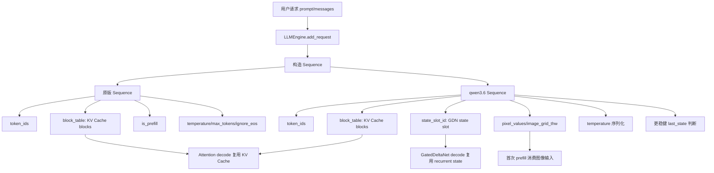

# qwen3.6_sequence.py_对比分析

> 对比对象：原版 `nano-vLLM` 中的 `sequence.py` 与 `nano-vllm-qwen3.6` 中对应的 `sequence.py`。  
> 目标：从工程全局角度分析 qwen3.6 版本相比原版做了哪些修改，这些修改为什么出现，以及它们在 Qwen3.6 / hybrid 架构 / 推理系统中的作用。

---

## 1. 文件整体定位

`sequence.py` 定义的是推理系统中的 **请求序列对象**。

在 nano-vLLM 中，用户请求进入系统后，不会一直以原始 prompt 字符串存在，而是会被包装成一个 `Sequence` 对象。这个对象负责保存一个请求的 token 序列、请求状态、prompt 长度、生成长度、KV Cache block 映射、本轮调度 token 数、采样参数，以及跨进程传输时需要保留的最小状态。

所以 `Sequence` 不是模型层代码，也不是 Attention、MLP、GatedDeltaNet 的计算代码。它更像是：

```text
Scheduler 和 ModelRunner 之间传递请求状态的轻量级数据结构
```

它处在推理流程中的位置是：

```text
LLMEngine.add_request
  ↓
Sequence(prompt_token_ids, sampling_params)
  ↓
Scheduler.add(seq)
  ↓
Scheduler.schedule()
  ↓
ModelRunner.run(seqs, is_prefill)
  ↓
模型 forward / KV Cache / 状态更新
  ↓
Scheduler.postprocess()
  ↓
Sequence.append_token()
```

因此，`Sequence` 的改动通常反映的是：推理系统需要为每个请求额外维护哪些运行时状态。

---

## 2. qwen3.6 版本整体变化概览

相比原版 `sequence.py`，qwen3.6 版本主要做了以下改动：

| 改动点 | 原版 nano-vLLM | qwen3.6 版本 | 作用 |
|---|---|---|---|
| prefill 状态字段 | 有 `self.is_prefill = True` | 删除 `is_prefill` 字段 | 不再由 Sequence 自己判断 prefill/decode，而交给调度器或运行上下文 |
| GDN state | 无 | 新增 `state_slot_id = -1` | 为 GatedDeltaNet / recurrent state 分配状态槽位 |
| 多模态数据 | 无 | 新增 `pixel_values`、`image_grid_thw` | 让一个请求可携带图像张量和视觉网格信息 |
| 序列化内容 | 只传 6 个字段 | 传更多字段，包括 `state_slot_id`、`temperature` | 适配多进程 ModelRunner 的更多请求状态 |
| `__getstate__` 判断逻辑 | 依赖 `is_prefill` | 依赖 completion/cache/token 关系 | 更稳健地区分需要传完整 token 序列还是只传 last token |
| `__setstate__` 兼容性 | 固定 6 元组 | 支持 7 元组和 8 元组 | 兼容旧序列化格式或不同版本 worker |
| 反序列化后多模态字段 | 无 | 重置为 None | 避免大图像张量被跨进程无意义复制 |

一句话总结：

```text
qwen3.6 版本的 Sequence 从“纯文本 + KV Cache 请求状态对象”，扩展成了“可携带 GDN recurrent state 槽位、多模态附加输入，并支持更稳健跨进程序列化的请求状态对象”。
```

---

## 3. 原版 Sequence 的核心职责

原版 `Sequence` 主要服务于普通 decoder-only dense Transformer 推理。它关注的核心状态包括：

```python
self.token_ids
self.last_token
self.num_tokens
self.num_prompt_tokens
self.num_cached_tokens
self.num_scheduled_tokens
self.is_prefill
self.block_table
self.temperature
self.max_tokens
self.ignore_eos
```

这些字段分别对应：

| 字段 | 含义 |
|---|---|
| `token_ids` | 当前请求完整 token 序列 |
| `last_token` | 当前请求最后一个 token，decode 阶段常用 |
| `num_tokens` | 当前请求总 token 数 |
| `num_prompt_tokens` | prompt 部分 token 数 |
| `num_cached_tokens` | 已经缓存、不需要重新 prefill 的 token 数 |
| `num_scheduled_tokens` | 本轮调度要计算的 token 数 |
| `is_prefill` | 原版中用于判断序列化时传完整 token 还是 last token |
| `block_table` | 当前请求占用的 KV Cache block 列表 |
| `temperature` | 采样温度 |
| `max_tokens` | 最大生成 token 数 |
| `ignore_eos` | 是否忽略 EOS |

在原版 dense Qwen3 / LLaMA 类模型中，一个请求最重要的运行时状态就是：

```text
token 序列 + KV Cache block_table
```

因为 decoder-only 模型在 decode 阶段复用历史信息主要靠 KV Cache。

---

## 4. 改动一：删除 `is_prefill` 字段

### 4.1 原版写法

原版中有：

```python
self.is_prefill = True
```

并且在 `__getstate__()` 中使用：

```python
last_state = self.last_token if not self.is_prefill else self.token_ids
```

这个设计的含义是：

```text
如果这个 Sequence 还处在 prefill 阶段：
    跨进程序列化时传完整 token_ids

如果已经进入 decode 阶段：
    跨进程序列化时只传 last_token
```

这样做的目标是减少进程间通信开销。因为 decode 阶段每个请求每轮只需要当前最后一个 token，历史 token 已经在 KV Cache 中，没有必要把完整 `token_ids` 都传给 worker。

### 4.2 qwen3.6 版本变化

qwen3.6 版本删除了：

```python
self.is_prefill = True
```

并且 `__getstate__()` 不再依赖 `is_prefill`，而是改成：

```python
last_state = self.token_ids if self.num_completion_tokens == 0 or self.num_cached_tokens < self.num_tokens else self.last_token
```

### 4.3 为什么要这样改

原版用 `is_prefill` 作为判断条件，有一个问题：

```text
Sequence 自己需要知道当前处于 prefill 还是 decode。
```

但在推理框架中，prefill / decode 通常是由 Scheduler 或 ModelRunner 当前 step 决定的，而不是请求对象本身永远固定的属性。

尤其引入 prefix cache、chunked prefill、hybrid state 以后，一个请求是否需要传完整 token，不能简单等价于：

```text
is_prefill == True
```

因为可能出现：

1. prompt 有一部分已经命中 prefix cache；
2. 当前请求还没生成 completion，但并不一定需要重新计算所有 prompt token；
3. 某些 token 已经有 KV Cache 或 recurrent state；
4. hybrid 模型中除了 KV Cache，还可能有 GDN recurrent state；
5. 多进程 worker 只需要拿到本轮模型执行所需的最小输入。

所以 qwen3.6 版本改成用已有状态推导：

```text
是否已经有 completion token？
当前缓存 token 是否覆盖当前 token 数？
```

这比单独维护 `is_prefill` 更可靠。

---

## 5. 改动二：新增 `state_slot_id`

### 5.1 新增代码

qwen3.6 版本新增：

```python
self.state_slot_id = -1       # GDN state slot (-1 = not allocated)
```

这是整个 `sequence.py` 中最关键的 qwen3.6 / hybrid 架构相关改动。

### 5.2 `state_slot_id` 是什么

`state_slot_id` 可以理解为：

```text
当前请求在 GatedDeltaNet recurrent state 池中的槽位编号。
```

在普通 Transformer attention 中，每个请求的历史信息主要存在 KV Cache 中，也就是每层 Attention 保存历史 K 和 V。

但是 Qwen3.5 / Qwen3.6 的 hybrid 架构中，除了 attention 层，还引入了类似 GatedDeltaNet 的 recurrent 结构。这类结构不一定为每个历史 token 保存完整 K/V，而是维护一种随时间更新的状态，例如：

```text
recurrent state
conv state
delta state
```

因此每个请求除了需要 KV Cache block_table，还需要知道：

```text
我的 recurrent state 存在哪里？
```

这个“存在哪里”的编号就是 `state_slot_id`。

### 5.3 为什么默认是 `-1`

```python
self.state_slot_id = -1
```

表示当前请求还没有分配 GDN state slot。

| 值 | 含义 |
|---|---|
| `-1` | 未分配 |
| `0, 1, 2, ...` | 已分配的 state slot 编号 |

这样 Scheduler 或 state manager 后续可以判断：

```python
if seq.state_slot_id == -1:
    allocate_state_slot(seq)
```

### 5.4 它和 KV Cache 的关系

原版 `Sequence` 已经有：

```python
self.block_table = []
```

`block_table` 记录的是：

```text
这个请求的 token 对应哪些 KV Cache blocks。
```

新增的 `state_slot_id` 记录的是：

```text
这个请求的 GDN recurrent state 对应哪个状态槽。
```

可以对比如下：

| 状态 | 服务对象 | 保存什么 | Sequence 中的索引 |
|---|---|---|---|
| KV Cache | Attention 层 | 历史 K/V | `block_table` |
| GDN State | GatedDeltaNet 层 | recurrent/conv/delta 状态 | `state_slot_id` |

所以 qwen3.6 版本的 `Sequence` 同时支持两类历史状态：

```text
Attention history -> KV Cache block_table
GDN history       -> state_slot_id
```

这正是 hybrid 架构推理系统改造的典型特征。

---

## 6. 改动三：新增多模态字段 `pixel_values` 和 `image_grid_thw`

### 6.1 新增代码

qwen3.6 版本新增：

```python
self.pixel_values = None       # torch.Tensor | None
self.image_grid_thw = None     # torch.Tensor | None
```

注释写得很明确：

```text
Multimodal data (consumed on first prefill, then cleared)
```

也就是：多模态数据只在首次 prefill 使用，使用后会清理。

### 6.2 `pixel_values` 是什么

`pixel_values` 通常表示图像经过预处理后的张量。例如图片会被 resize、normalize、patchify，最后变成模型视觉编码器可以处理的 tensor。

它不是 token id，而更接近视觉模型的原始输入张量。

### 6.3 `image_grid_thw` 是什么

`image_grid_thw` 通常表示图像或视频 patch 的网格结构：

```text
T = temporal / time
H = height
W = width
```

对于图片，T 往往是 1。它告诉模型这些视觉 token 原本在图像里的空间结构是什么。

多模态模型不能只知道有一堆视觉 patch，还需要知道这些 patch 如何排列，否则会丢失图像空间关系。

### 6.4 为什么挂在 `Sequence` 上

前面 `llm_engine.py` 的多模态入口会把 messages 处理成：

```text
token_ids
pixel_values
image_grid_thw
```

然后挂到 `Sequence` 上。

因此 `Sequence` 就成为“一个请求所有输入信息”的承载对象。原版 Sequence 只背 token ids、sampling params、KV Cache metadata；qwen3.6 版本 Sequence 还可以背图像张量、图像网格信息和 GDN state slot。

### 6.5 为什么只在首次 prefill 使用

多模态图像输入通常只需要在 prompt 阶段进入模型。例如用户输入：

```text
[图片] 请描述这张图
```

模型在 prefill 阶段需要处理图片和文字上下文。一旦 prompt 处理完，后续 decode 每次生成一个新 token 时，不需要反复重新处理原始图片。

后续 decode 依赖的是：

```text
已经写入的 KV Cache
已经维护好的 recurrent state
```

所以注释中说：

```text
consumed on first prefill, then cleared
```

这可以避免图像张量长期挂在请求对象上，占用 CPU/GPU 内存，或者在跨进程传输时造成额外开销。

---

## 7. 改动四：`__getstate__()` 序列化内容增加

### 7.1 原版 `__getstate__`

原版：

```python
def __getstate__(self):
    last_state = self.last_token if not self.is_prefill else self.token_ids
    return (
        self.num_tokens,
        self.num_prompt_tokens,
        self.num_cached_tokens,
        self.num_scheduled_tokens,
        self.block_table,
        last_state,
    )
```

原版只序列化 6 个字段：

```text
num_tokens
num_prompt_tokens
num_cached_tokens
num_scheduled_tokens
block_table
last_state
```

没有序列化 `state_slot_id`，因为原版没有 GDN state；也没有序列化多模态字段，因为原版没有图像输入路径。

### 7.2 qwen3.6 版本 `__getstate__`

qwen3.6 版本：

```python
def __getstate__(self):
    last_state = self.token_ids if self.num_completion_tokens == 0 or self.num_cached_tokens < self.num_tokens else self.last_token
    return (
        self.num_tokens,
        self.num_prompt_tokens,
        self.num_cached_tokens,
        self.num_scheduled_tokens,
        self.block_table,
        self.state_slot_id,
        last_state,
        self.temperature,
    )
```

现在序列化 8 个字段：

```text
num_tokens
num_prompt_tokens
num_cached_tokens
num_scheduled_tokens
block_table
state_slot_id
last_state
temperature
```

新增的是：

```text
state_slot_id
temperature
```

同时 `last_state` 的判断逻辑也变了。

### 7.3 为什么要序列化 `state_slot_id`

因为 worker / ModelRunner 侧需要知道当前请求对应哪个 GDN state slot。

对于普通 Attention 层：

```text
block_table 定位 KV Cache
```

对于 GatedDeltaNet 层：

```text
state_slot_id 定位 recurrent state
```

所以 `state_slot_id` 必须参与跨进程序列化。否则模型执行侧无法在 GatedDeltaNet 层中定位这个请求的 recurrent state。

### 7.4 为什么要序列化 `temperature`

原版虽然 `Sequence` 初始化时保存了：

```python
self.temperature = sampling_params.temperature
```

但 `__getstate__()` 没有传它。qwen3.6 版本把它加入序列化：

```python
self.temperature
```

这可能是为了让 worker 或采样相关流程在跨进程状态中也能访问采样温度。

从这个文件本身只能确定：

```text
temperature 被纳入跨进程序列化状态。
```

不能仅凭这个文件断言采样一定被移动到了 worker 内部，需要继续结合 `model_runner.py` 或 `sampler.py` 确认。

---

## 8. 改动五：`last_state` 判断逻辑更复杂

### 8.1 原版逻辑

原版：

```python
last_state = self.last_token if not self.is_prefill else self.token_ids
```

这是一个二选一：

```text
prefill -> 完整 token_ids
decode  -> last_token
```

### 8.2 qwen3.6 版本逻辑

qwen3.6 版本：

```python
last_state = self.token_ids if self.num_completion_tokens == 0 or self.num_cached_tokens < self.num_tokens else self.last_token
```

它的含义可以拆开：

```text
如果还没有生成 completion token：
    传完整 token_ids

或者如果缓存 token 数小于当前 token 数：
    传完整 token_ids

否则：
    只传 last_token
```

### 8.3 为什么这样更稳健

这个逻辑不再依赖手动维护的 `is_prefill`，而是从请求当前状态推断需要传什么。

#### 情况一：`num_completion_tokens == 0`

说明当前请求还没有生成任何新 token，通常对应 prompt / prefill 阶段。此时 worker 需要完整 prompt 或本轮待处理 token 信息，因此传 `self.token_ids`。

#### 情况二：`num_cached_tokens < self.num_tokens`

说明当前请求仍有 token 没有被缓存覆盖。即使已经不是最初 prefill，也可能存在 chunked prefill、prefix cache 部分命中、某些 token 尚未写入 KV Cache / state 等情况。

此时只传最后一个 token 不够，因为模型可能需要处理一段未缓存 token。

#### 情况三：否则传 `last_token`

当已经有 completion token，并且 `num_cached_tokens >= num_tokens`，说明历史 token 已经被缓存状态覆盖，当前 step 只需要最后 token 即可。这就是典型 decode 阶段。

### 8.4 与 prefix cache / hybrid state 的关系

在更复杂的推理系统里，“是否是 prefill”不再是简单布尔值。更准确的问题是：

```text
这个请求当前还有多少 token 没有被模型状态覆盖？
```

模型状态可能包括 KV Cache、GDN recurrent state、conv state、prefix cache。

因此 qwen3.6 版本通过：

```text
num_cached_tokens < num_tokens
```

来判断是否还需要传完整 token 信息，这比 `is_prefill` 更接近真实运行状态。

---

## 9. 改动六：`__setstate__()` 增强兼容性

### 9.1 原版 `__setstate__`

原版：

```python
def __setstate__(self, state):
    self.num_tokens, self.num_prompt_tokens, self.num_cached_tokens, self.num_scheduled_tokens, self.block_table, last_state = state
    ...
```

原版假设传入状态一定是 6 个字段。如果状态长度变化，就会直接解包失败。

### 9.2 qwen3.6 版本 `__setstate__`

qwen3.6 版本：

```python
def __setstate__(self, state):
    if len(state) == 7:
        self.num_tokens, self.num_prompt_tokens, self.num_cached_tokens, self.num_scheduled_tokens, self.block_table, self.state_slot_id, last_state = state
        self.temperature = 1.0
    else:
        self.num_tokens, self.num_prompt_tokens, self.num_cached_tokens, self.num_scheduled_tokens, self.block_table, self.state_slot_id, last_state, self.temperature = state
```

它支持两种格式：

| state 长度 | 字段 | 说明 |
|---|---|---|
| 7 | 多了 `state_slot_id`，没有 `temperature` | 兼容旧 qwen3.6 中间格式 |
| 8 | 有 `state_slot_id` 和 `temperature` | 当前完整格式 |

### 9.3 为什么要做兼容

推理框架中多进程 worker 可能有以下情况：

1. 主进程和 worker 之间传输的是 pickle 后的 `Sequence`；
2. 开发过程中序列化字段发生过变更；
3. 某些旧状态没有 temperature；
4. 不同 worker 或缓存对象可能使用旧格式；
5. 需要减少升级过程中的崩溃风险。

所以 qwen3.6 版本通过：

```python
if len(state) == 7:
    self.temperature = 1.0
```

给旧状态一个默认温度。

### 9.4 为什么默认 temperature 是 1.0

`temperature = 1.0` 是采样中最常见的默认值。它表示不额外放大或缩小 logits 分布。

所以当旧序列化状态没有 temperature 时，设置为 1.0 是一个合理的保守默认值。

---

## 10. 改动七：反序列化后清空多模态字段

### 10.1 qwen3.6 新增逻辑

在 `__setstate__()` 末尾：

```python
self.pixel_values = None
self.image_grid_thw = None
```

注释：

```python
# Attributes not serialized (only live on rank 0 / scheduler side)
```

含义是：这些属性不参与序列化，只存在于 rank 0 / scheduler 侧。

### 10.2 为什么不序列化图像张量

`pixel_values` 可能是很大的 tensor。如果每次跨进程传输 `Sequence` 都把图像张量一起 pickle，会带来严重问题：

1. IPC 数据量巨大；
2. CPU 内存占用增加；
3. 多进程复制开销大；
4. decode 阶段完全不需要图像张量；
5. 容易导致 worker 侧拿到不该持有的大对象；
6. 对性能影响很大。

所以 qwen3.6 版本选择：

```text
Sequence 序列化时不携带 pixel_values / image_grid_thw
```

这符合注释中的设计：多模态数据只在首次 prefill 消费，然后清空。

### 10.3 rank 0 / scheduler side 是什么意思

在 tensor parallel 多进程推理中，通常有：

```text
rank 0：主控进程 / scheduler 所在进程
rank 1..N：worker 进程
```

请求对象完整状态通常在 rank 0 管理。worker 侧只需要执行模型 forward 所需的最小状态。

所以 `pixel_values` / `image_grid_thw` 不会像 `block_table`、`state_slot_id` 那样作为每轮基础调度状态被频繁序列化。

---

## 11. 保持不变的部分

虽然 qwen3.6 增加了一些字段，但 `Sequence` 的基本语义没有变。

### 11.1 请求状态枚举不变

```python
class SequenceStatus(Enum):
    WAITING = auto()
    RUNNING = auto()
    FINISHED = auto()
```

说明请求仍然是三态生命周期：等待调度、正在运行、已经完成。

### 11.2 token 计数逻辑不变

```python
self.num_tokens
self.num_prompt_tokens
self.num_completion_tokens
```

仍然用来区分 prompt 部分、completion 部分和当前总长度。

### 11.3 KV Cache block 逻辑不变

```python
block_size = 256
block_table = []
num_blocks
last_block_num_tokens
block(i)
```

说明 qwen3.6 版本仍然沿用原版按 block 管理 KV Cache 的设计。

### 11.4 token append 不变

```python
def append_token(self, token_id: int):
    self.token_ids.append(token_id)
    self.last_token = token_id
    self.num_tokens += 1
```

自回归生成仍然是采样一个 token，追加到 Sequence，并更新 `last_token` 与 `num_tokens`。

---

## 12. 从推理流程角度看这些改动

### 12.1 原版纯文本 dense 模型路径

```text
prompt
  ↓ tokenizer.encode
token_ids
  ↓
Sequence(token_ids)
  ↓
Scheduler 分配 KV Cache block
  ↓
prefill 写入 KV Cache
  ↓
decode 每轮使用 last_token + block_table
  ↓
append_token
```

原版 Sequence 需要维护的核心就是：

```text
token_ids + block_table
```

### 12.2 qwen3.6 hybrid / 多模态增强路径

```text
prompt / messages
  ↓
token_ids + optional pixel_values + image_grid_thw
  ↓
Sequence(token_ids)
  ↓
Sequence 额外携带 multimodal data
  ↓
Scheduler 分配 KV Cache block
  ↓
如果有 GDN 层，再分配 state_slot_id
  ↓
prefill 消费 token / image / state
  ↓
decode 使用 last_token + block_table + state_slot_id
  ↓
append_token
```

qwen3.6 版本的 Sequence 需要维护：

```text
token_ids
block_table
state_slot_id
pixel_values / image_grid_thw
temperature
```

这说明它已经不只是普通文本 Transformer 请求对象，而是为更复杂模型结构服务的请求状态容器。

---

## 13. 和 Qwen3.6 hybrid 架构的关系

Qwen3.6 这类 hybrid 架构的核心变化可以简单理解为：

```text
不是每一层都只有 full attention，而是混合了 attention 层和 GatedDeltaNet / recurrent 类层。
```

普通 attention 层的历史状态是：

```text
KV Cache
```

而 GatedDeltaNet 类层的历史状态是：

```text
recurrent state / conv state
```

所以推理系统必须为每个请求维护两类索引：

```text
block_table   -> 找 KV Cache
state_slot_id -> 找 GDN state
```

这就是为什么 qwen3.6 版本需要在 `Sequence` 中新增：

```python
self.state_slot_id = -1
```

如果没有这个字段，Scheduler 即使能调度 token，也无法告诉模型这个请求的 GatedDeltaNet 历史状态在哪里。

因此，`state_slot_id` 是 `sequence.py` 中最直接体现 Qwen3.6 hybrid 推理支持的改造。

---

## 14. 和多模态支持的关系

qwen3.6 版本还新增：

```python
self.pixel_values = None
self.image_grid_thw = None
```

这说明该项目不只是支持纯文本 token 序列，还可能支持类似 Qwen-VL 的多模态输入路径。

这可以和 `llm_engine.py` 的改动串起来：

```text
llm_engine.py:
    process_messages(...)
    得到 token_ids / pixel_values / image_grid_thw

sequence.py:
    Sequence(token_ids)
    seq.pixel_values = pixel_values
    seq.image_grid_thw = image_grid_thw

model_runner.py:
    在首次 prefill 时读取并消费这些图像信息
```

所以 `sequence.py` 在多模态路径中的作用是：

```text
把入口层解析出的图像张量，挂到请求对象上，随请求一起进入调度系统。
```

---

## 15. 为什么这些改动集中在 Sequence 中

`Sequence` 是整个推理系统中非常核心的“请求状态实体”。任何 per-request 状态，如果需要跨调度周期保留，都很可能要挂在 `Sequence` 上。

| 状态类型 | 是否 per-request | 是否跨 step 保留 | 是否适合放在 Sequence |
|---|---|---|---|
| token_ids | 是 | 是 | 是 |
| block_table | 是 | 是 | 是 |
| temperature | 是 | 是 | 是 |
| state_slot_id | 是 | 是 | 是 |
| pixel_values | 是 | 只首轮需要 | 可以临时挂载 |
| image_grid_thw | 是 | 只首轮需要 | 可以临时挂载 |
| 模型权重 | 否 | 是 | 否 |
| attention kernel | 否 | 否 | 否 |
| global config | 否 | 是 | 否 |

所以 qwen3.6 为了支持 hybrid state 和多模态输入，修改 `Sequence` 是合理的。

---

## 16. 对比流程图



---

## 17. 原版与 qwen3.6 的核心差异表

| 模块 | 原版 | qwen3.6 | 影响 |
|---|---|---|---|
| 请求阶段判断 | `is_prefill` 字段 | 根据 token/cache 状态推断 | 减少状态不一致风险 |
| 跨进程状态 | 6 元组 | 7/8 元组 | 可携带更多 per-request 状态 |
| Hybrid 支持 | 无 GDN state 索引 | `state_slot_id` | 支持 recurrent state 管理 |
| 多模态支持 | 无 | `pixel_values`、`image_grid_thw` | 支持图像输入随请求进入系统 |
| 序列化兼容 | 固定格式 | 根据 `len(state)` 兼容 | 降低版本变更风险 |
| 大对象传输 | 不涉及 | 多模态字段不序列化 | 避免 IPC 复制大张量 |
| 采样温度 | 初始化保存但不序列化 | 序列化 temperature | 跨进程状态更完整 |

---

## 18. 面试角度应该怎么回答

如果面试官问：

> qwen3.6 版本的 `sequence.py` 相比原版做了什么改动？

可以这样回答：

`sequence.py` 定义的是每个请求在推理系统中的状态对象。原版主要维护 token 序列、KV Cache block_table、采样参数以及 prefill/decode 的简单状态；qwen3.6 版本做了几个重要扩展。第一，它删除了原来的 `is_prefill` 字段，改为根据 `num_completion_tokens` 和 `num_cached_tokens` 判断序列化时应该传完整 token 序列还是只传 last token，这比单独维护布尔状态更适合 prefix cache、chunked prefill 或复杂调度。第二，它新增了 `state_slot_id`，用于记录每个请求在 GatedDeltaNet recurrent state 池里的槽位，这是支持 Qwen3.6 hybrid 架构的关键，因为 attention 层用 `block_table` 找 KV Cache，而 GDN 层需要用 `state_slot_id` 找 recurrent state。第三，它新增了 `pixel_values` 和 `image_grid_thw`，让 Sequence 可以临时携带多模态图像输入，在首次 prefill 被消费后清理。第四，它扩展了 `__getstate__` / `__setstate__`，把 `state_slot_id` 和 `temperature` 纳入序列化，并支持旧格式兼容，同时避免序列化图像大张量。整体来看，这个文件的改动说明 qwen3.6 版本把 Sequence 从纯文本 KV Cache 请求对象，扩展成了可以支持 hybrid recurrent state 和多模态输入的请求状态容器。

---

## 19. 初学者最应该抓住的主线

学习这个文件不要只记字段名，而要抓住这条主线：

```text
原版 nano-vLLM:
    每个请求主要需要 token_ids + KV Cache block_table

qwen3.6:
    每个请求除了 token_ids + KV Cache block_table
    还可能需要 GDN state slot
    还可能临时携带多模态图像张量
```

所以：

```text
block_table 解决 Attention 历史缓存在哪里
state_slot_id 解决 GatedDeltaNet 历史状态在哪里
pixel_values / image_grid_thw 解决多模态输入怎么跟着请求走
```

---

## 20. 最终结论

qwen3.6 版本 `sequence.py` 的核心意义是：

```text
增强 Sequence 作为“请求状态载体”的能力。
```

它没有直接实现 Qwen3.6 的 GatedDeltaNet 计算，也没有直接实现视觉编码器，但它为这些能力提供了请求级状态支持。

具体来说：

1. `state_slot_id` 是 hybrid / GDN 推理状态管理的关键入口；
2. `pixel_values` 和 `image_grid_thw` 是多模态请求进入调度系统的桥；
3. 删除 `is_prefill` 并改用 token/cache 状态判断，使 prefill/decode 的序列化逻辑更适合复杂调度；
4. 扩展 `__getstate__` 和 `__setstate__`，让多进程推理时能传递更多必要状态，同时保持一定兼容性；
5. 不序列化多模态大张量，体现了推理系统对 IPC 成本和内存占用的考虑。

因此，这个文件虽然很短，但它体现了 qwen3.6 项目从普通 decoder-only 文本推理向：

```text
hybrid 架构推理 + recurrent state 管理 + 多模态输入支持
```

扩展时，对请求状态对象做出的基础工程改造。


%% 项目关联导航：开始 %%
## 项目关联导航

- 所属模块：[[outputs/项目整理/模块-nano-vllm-qwen3.6|模块-nano-vllm-qwen3.6]]

%% 项目关联导航：结束 %%
