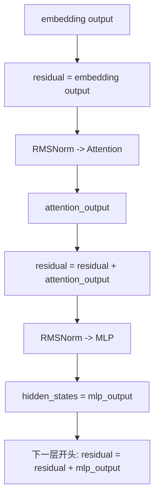
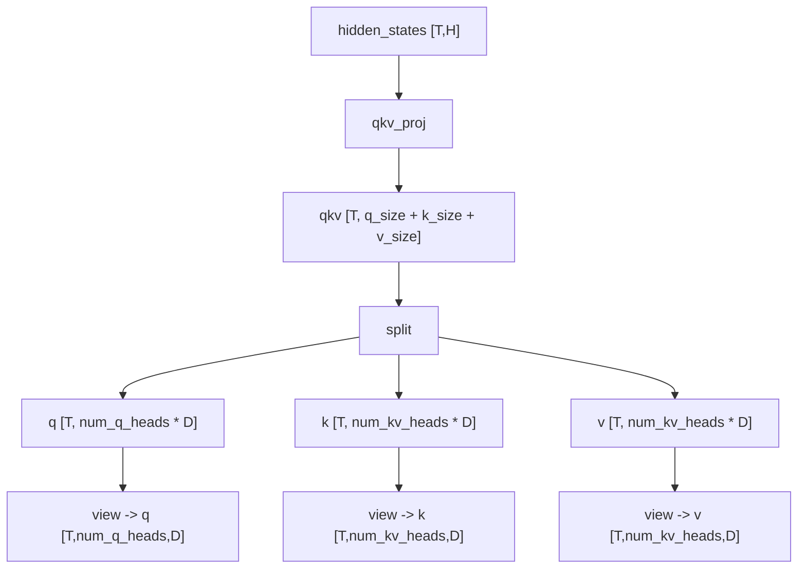
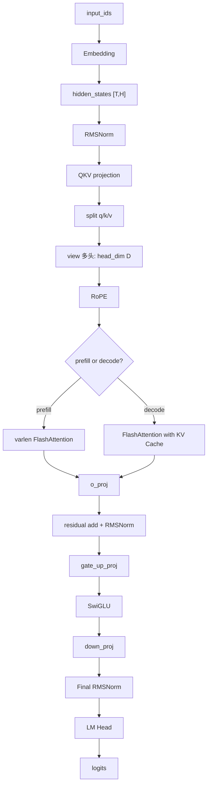

# Qwen3 / nano-vLLM 核心概念疑难点串讲

> 本文根据 `Qwen3_DecoderOnly架构与nano-vLLM模型代码对应总览.md` 和 nano-vLLM 源码整理。  
> 目标：集中解释你在阅读 Qwen3 decoder-only 架构和 nano-vLLM 模型代码时不清晰的概念，包括 Final RMSNorm、LM Head、SwiGLU/MLP、FlashAttention、batch size、hidden_states/residual、QKV projection、head_dim 等。

---

## 0. 先把这些概念放回一次 forward 里

先看完整链路：

```text
input_ids
  ↓
Embedding
  ↓
hidden_states
  ↓
DecoderLayer × N
  ├── RMSNorm
  ├── QKV projection
  ├── RoPE
  ├── FlashAttention / FlashAttention with KV Cache
  ├── residual add + RMSNorm
  ├── gate_up_proj
  ├── SwiGLU
  └── down_proj
  ↓
Final RMSNorm
  ↓
LM Head
  ↓
logits
  ↓
Sampler
  ↓
next token
```

你列出的概念基本可以分成五类：

| 类别 | 包含问题 |
|---|---|
| 输出阶段 | Final RMSNorm、LM Head |
| MLP / FFN | SwiGLU、MLP、gate_up_proj、down_proj |
| Attention | QKV projection、split/view、FlashAttention、varlen flash attention、kvcache attention |
| 张量形状 | batch_size、hidden_size、head_dim |
| 状态流 | hidden_states、residual |

---

## 1. Final RMSNorm 是什么？RMSNorm 的作用是什么？

### 1.1 RMSNorm 先理解成“控制向量尺度”

模型里每个 token 都会被表示成一个向量：

```text
hidden_states[i] = [x1, x2, x3, ..., xH]
```

这个向量有 `H = hidden_size` 个维度。

RMSNorm 做的事情是：

```text
把这个 token 的 hidden 向量缩放到一个更稳定的尺度
```

公式可以简化理解为：

```text
rms = sqrt(mean(x^2) + eps)
output = x / rms * weight
```

注意：

1. RMSNorm 是对每个 token 自己的 hidden 维度做归一化；
2. 它不会混合不同 token；
3. token 之间的信息交互是 Attention 做的；
4. RMSNorm 的主要作用是数值稳定。

---

### 1.2 RMSNorm 和 LayerNorm 有什么区别

LayerNorm 通常是：

```text
(x - mean) / sqrt(variance + eps)
```

RMSNorm 是：

```text
x / sqrt(mean(x^2) + eps)
```

区别：

| 对比项 | LayerNorm | RMSNorm |
|---|---|---|
| 是否减均值 | 是 | 否 |
| 是否做尺度归一化 | 是 | 是 |
| 计算量 | 稍大 | 更轻 |
| Qwen3 中使用 | 否 | 是 |

所以 Qwen3 中你看到的 `layernorm.py` 文件，实际实现的是 RMSNorm。

---

### 1.3 Final RMSNorm 是什么

`Final RMSNorm` 指的是所有 decoder layer 跑完之后，送入 LM Head 前的最后一次 RMSNorm。

源码：

```python
hidden_states, _ = self.norm(hidden_states, residual)
return hidden_states
```

位置：

```text
Embedding
  ↓
DecoderLayer × N
  ↓
Final RMSNorm
  ↓
LM Head
```

它的作用：

1. 把最后一层 MLP 输出加回 residual；
2. 对最终 hidden states 做一次归一化；
3. 让送入 LM Head 的向量尺度稳定；
4. 得到最终用于预测下一个 token 的表示。

特别注意：

```text
Final RMSNorm 不是生成 token 的地方。
```

它只是把最后的 hidden states 整理好，真正产生 logits 的是 LM Head。

---

## 2. LM Head / lm_head 是什么？

你列了两次 LM Head，所以这里合并讲。

### 2.1 LM Head 的一句话解释

**LM Head 是把模型最后的 hidden state 转成词表 logits 的线性层。**

它做的是：

```text
hidden_states -> logits
```

形状：

```text
hidden_states: [num_tokens, hidden_size]
logits:        [num_tokens, vocab_size]
```

或者在 nano-vLLM prefill 优化后：

```text
logits: [num_seqs, vocab_size]
```

---

### 2.2 logits 是什么

logits 是模型对词表中每个 token 的原始分数。

假设词表大小是 150000，那么一个位置的 logits 是：

```text
[score_token_0, score_token_1, ..., score_token_149999]
```

分数越高，表示模型越倾向下一个 token 是它。

然后 sampler 会对 logits 做：

```text
temperature
softmax
sample / argmax
```

得到真正的下一个 token id。

---

### 2.3 LM Head 在 nano-vLLM 中对应哪个文件

文件：

```text
nanovllm/layers/embed_head.py
```

类：

```python
ParallelLMHead
```

在 `Qwen3ForCausalLM` 中：

```python
self.lm_head = ParallelLMHead(config.vocab_size, config.hidden_size)
```

调用：

```python
def compute_logits(self, hidden_states):
    return self.lm_head(hidden_states)
```

所以：

```text
Qwen3ForCausalLM.forward() 返回 hidden_states
compute_logits() 才调用 LM Head 得到 logits
```

---

### 2.4 为什么 prefill 时只取最后一个 token 做 LM Head

prefill 阶段 prompt 中所有 token 都要经过模型 forward，因为要建立上下文和 KV Cache。

但预测下一个 token 时，只需要每个请求最后一个 token 的 hidden state。

比如 prompt：

```text
今 天 天 气 怎 么 样
```

真正要预测的是“样”后面的下一个 token。

所以 nano-vLLM 在 `ParallelLMHead.forward()` 中：

```python
if context.is_prefill:
    last_indices = context.cu_seqlens_q[1:] - 1
    x = x[last_indices].contiguous()
```

这表示：

```text
prefill 阶段只取每个请求最后一个 token 的 hidden state 计算 logits
```

这样可以避免对 prompt 中每个 token 都计算巨大的 vocab logits。

---

## 3. SwiGLU 和 MLP 是什么？

### 3.1 MLP / FFN 是什么

MLP 又叫 FFN，Feed Forward Network。

在 Transformer 中，每个 decoder layer 通常有两大模块：

```text
Attention
MLP / FFN
```

二者分工：

| 模块 | 作用 |
|---|---|
| Attention | 让 token 和上下文中其他 token 交互 |
| MLP / FFN | 对每个 token 自己的 hidden 向量做非线性加工 |

所以 MLP 不负责 token 之间交流。

它是对每个 token 独立做：

```text
[hidden_size] -> [intermediate_size] -> [hidden_size]
```

---

### 3.2 SwiGLU 是 Qwen3 MLP 的具体形式

Qwen3 的 MLP 不是普通：

```text
activation(up_proj(x)) -> down_proj
```

而是：

```text
down_proj( SiLU(gate_proj(x)) * up_proj(x) )
```

这叫 SwiGLU。

含义：

1. `up_proj(x)` 生成候选特征；
2. `gate_proj(x)` 生成门控信号；
3. `SiLU(gate_proj(x))` 变成非线性门控；
4. 两者逐元素相乘；
5. `down_proj` 压回 hidden_size。

---

### 3.3 SwiGLU 的直观理解

可以把 MLP 看成一个加工车间。

```text
up_proj：生产很多候选特征
gate_proj：判断哪些候选特征有用
SiLU：让判断过程有非线性
乘法：真正筛选特征
down_proj：把筛选后的特征压回原来的 hidden_size
```

所以 SwiGLU 的核心是：

```text
不是所有中间特征都直接通过，而是被 gate 分支控制。
```

---

## 4. gate_up_proj、down_proj 是什么意思？

### 4.1 概念上应该有 gate_proj 和 up_proj

概念公式：

```text
gate = gate_proj(x)
up = up_proj(x)
mid = SiLU(gate) * up
out = down_proj(mid)
```

### 4.2 源码里为什么叫 gate_up_proj

nano-vLLM 为了推理效率，把 `gate_proj` 和 `up_proj` 合并成一个大线性层：

```python
self.gate_up_proj = MergedColumnParallelLinear(
    hidden_size,
    [intermediate_size] * 2,
    bias=False,
)
```

它一次性输出：

```text
gate_up: [T, 2 * intermediate_size]
```

然后 `SiluAndMul` 里切成两半：

```python
x, y = x.chunk(2, -1)
return F.silu(x) * y
```

更容易理解的名字是：

```python
gate, up = gate_up.chunk(2, -1)
return silu(gate) * up
```

---

### 4.3 down_proj 的作用

`down_proj` 把中间特征从 `intermediate_size` 压回 `hidden_size`。

形状：

```text
[T, intermediate_size] -> [T, hidden_size]
```

为什么需要它？

因为 Transformer 每一层的输入输出都必须是：

```text
[T, hidden_size]
```

这样才能继续 residual add、下一层 decoder layer、final norm、LM Head。

---

## 5. FlashAttention 发生在什么位置？

FlashAttention 发生在 Qwen3Attention 里面，也就是 Attention 子层中。

整体位置：

```text
DecoderLayer
  ↓
input RMSNorm
  ↓
QKV projection
  ↓
q/k/v split + view
  ↓
q/k RoPE
  ↓
FlashAttention
  ↓
o_proj
  ↓
post attention RMSNorm
  ↓
MLP
```

源码位置：

```text
nanovllm/layers/attention.py
```

调用位置：

```python
o = self.attn(q, k, v)
```

这里的 `self.attn` 会根据当前是 prefill 还是 decode，选择不同 FlashAttention kernel。

---

## 6. flash-attn varlen 是什么？

### 6.1 varlen 的意思

`varlen` 是 variable length 的缩写，意思是变长序列。

在推理时，一个 batch 里不同请求的 prompt 长度可能不同：

```text
请求 A: 5 个 token
请求 B: 12 个 token
请求 C: 3 个 token
```

如果强行 padding 成一样长，会浪费计算。

varlen flash attention 的做法是：

```text
把所有 token 拼成一条长的一维 token 序列
再用 cu_seqlens 标记每个请求的边界
```

例如：

```text
A 有 5 个 token
B 有 12 个 token
C 有 3 个 token
```

拼起来总长度是：

```text
T = 20
```

`cu_seqlens` 是：

```text
[0, 5, 17, 20]
```

它告诉 FlashAttention：

```text
0~5 是请求 A
5~17 是请求 B
17~20 是请求 C
```

---

### 6.2 在 nano-vLLM 中什么时候用

prefill 阶段使用：

```python
flash_attn_varlen_func(...)
```

因为 prefill 一次处理多个 prompt token，而且每个请求长度可能不同。

代码：

```python
if context.is_prefill:
    o = flash_attn_varlen_func(...)
```

所以：

```text
varlen flash attention = prefill 阶段处理变长 prompt 的 FlashAttention
```

---

## 7. kvcache attention 是什么？

decode 阶段使用：

```python
flash_attn_with_kvcache(...)
```

decode 的特点：

```text
每个请求当前只输入 1 个新 token
但这个 token 要看完整历史上下文
```

历史上下文的 K/V 不会重新计算，而是保存在 KV Cache 里。

所以 decode attention 做的是：

```text
当前新 token 的 q
  ↓
读取历史 k_cache / v_cache
  ↓
和历史上下文做 attention
  ↓
得到当前 token 的输出
```

这就是 `flash_attn_with_kvcache`。

一句话：

```text
kvcache attention = decode 阶段用当前 q 去访问历史 KV Cache 的 attention。
```

---

## 8. varlen flash attention 和 kvcache attention 区别

| 对比项 | varlen flash attention | kvcache attention |
|---|---|---|
| 主要阶段 | prefill | decode |
| 输入 token 数 | 每个请求可能多个 prompt token | 每个请求通常 1 个新 token |
| K/V 来源 | 当前 prefill 计算出的 K/V | 历史 KV Cache + 当前 token K/V |
| 是否需要 cu_seqlens | 需要 | 通常不需要 |
| 是否需要 block_tables | prefix cache 时需要 | 需要 |
| 主要目标 | 高效处理变长 prompt | 高效读取历史 KV Cache 生成下一个 token |

---

## 9. FlashAttention with KV Cache 是什么意思？

`FlashAttention with KV Cache` 可以拆成两部分：

```text
FlashAttention：高效 attention kernel
KV Cache：保存历史 token 的 key/value
```

合起来：

```text
在 decode 阶段，用 FlashAttention 的高效实现，直接从 KV Cache 里读取历史 K/V 完成 attention。
```

为什么需要它？

因为 decode 时每步只来一个新 token：

```text
新 token 只需要新算 q/k/v
历史 token 的 k/v 可以直接复用
```

如果没有 KV Cache，每生成一个 token 都要重新计算整个历史 prompt 的 K/V，成本非常高。

---

## 10. decode 的模型输入 `input_ids: [batch_size]` 中 batch_size 是什么？

### 10.1 batch_size 在 decode 阶段的含义

decode 阶段：

```text
每个请求每轮只生成一个 token
```

如果当前有 `batch_size` 个请求还没结束，那么本轮 decode 就有：

```text
batch_size 个输入 token
```

所以：

```text
input_ids: [batch_size]
```

表示：

```text
当前 batch 中每个请求的最后一个 token id
```

例如当前有 4 个请求正在生成：

```text
请求 A 上一步生成 token 101
请求 B 上一步生成 token 205
请求 C 上一步生成 token 33
请求 D 上一步生成 token 700
```

那么 decode 输入可能是：

```text
input_ids = [101, 205, 33, 700]
```

shape 是：

```text
[4]
```

这里：

```text
batch_size = 4
```

---

### 10.2 batch_size 不是固定值

在推理服务中，batch_size 是动态的。

它取决于当前调度器这一轮选中了多少个请求。

可能这一轮：

```text
batch_size = 8
```

下一轮有些请求结束，有些请求加入：

```text
batch_size = 6 或 12
```

所以 continuous batching 中的 batch_size 是动态变化的。

---

### 10.3 prefill 阶段为什么不是 `[batch_size, seq_len]`

nano-vLLM prefill 会把多个请求 token 拼成一维：

```text
input_ids: [total_num_tokens]
```

因为每个 prompt 长度不同，使用 varlen flash attention 更方便。

decode 阶段每个请求只有 1 个 token，所以自然是：

```text
input_ids: [batch_size]
```

---

## 11. hidden_states 是原始输入信息吗？

答案：**一开始是，但后面不是。**

更准确地说：

```text
hidden_states 是 token 在模型内部当前阶段的向量表示。
```

### 11.1 刚经过 Embedding 时

```python
hidden_states = self.embed_tokens(input_ids)
```

这时：

```text
hidden_states 是 token id 对应的初始向量
```

可以理解为原始输入 token 的向量化表示。

### 11.2 经过每一层后

进入 decoder layers 后，hidden_states 会不断被更新：

```text
hidden_states -> Attention -> MLP -> 下一层
```

它就不再是“原始输入信息”，而是：

```text
融合了上下文、经过多层加工后的中间表示。
```

### 11.3 最后输出时

Final RMSNorm 后的 hidden_states 是：

```text
最终用于预测下一个 token 的语义表示
```

然后 LM Head 把它映射成 logits。

所以你可以这样记：

```text
hidden_states 不是固定的原始输入，而是模型内部不断更新的 token 表示。
```

---

## 12. residual 是不是每次一层完了之后的输出？

答案：**不是简单等于“每层最终输出”，它更像残差主干。**

在 nano-vLLM 里，每层返回：

```python
return hidden_states, residual
```

其中：

```text
hidden_states = 当前层 MLP 输出
residual = 当前已经累积的残差主干
```

关键点：

1. Attention 输出会立刻加进 residual；
2. MLP 输出不会在当前层末尾立刻加进 residual；
3. MLP 输出会在下一层开头的 `input_layernorm(hidden_states, residual)` 中加进去；
4. 最后一层 MLP 输出会在 final norm 中加进去。

所以 residual 更准确理解为：

```text
到当前阶段为止，模型主干已经累积的信息。
```

不是每层的最终完整输出。

---

## 13. hidden_states 和 residual 的关系图



一句话：

```text
hidden_states 常常是当前子层新产生的输出；
residual 是等待被继续累加的主干。
```

---

## 14. H = hidden_size 是什么？

`H = hidden_size` 表示每个 token 的隐藏向量维度。

如果：

```text
hidden_size = 1024
```

那么每个 token 在模型内部表示成：

```text
长度为 1024 的向量
```

形状：

```text
hidden_states: [T, H]
```

其中：

```text
T = 当前 step 的 token 数
H = hidden_size
```

hidden_size 影响：

1. token 表示能力；
2. 模型参数量；
3. attention 和 MLP 的计算量；
4. LM Head 输入维度。

---

## 15. D = head_dim 是什么？

Attention 会把 hidden_size 拆成多个 head。

如果：

```text
hidden_size = H
num_attention_heads = Nq
head_dim = D
```

通常：

```text
H = Nq * D
```

`D = head_dim` 表示每个 attention head 的向量维度。

例如：

```text
hidden_size = 1024
num_heads = 16
head_dim = 64
```

含义：

```text
一个 token 的 1024 维表示，被拆成 16 个 head，每个 head 64 维。
```

---

## 16. hidden_size 和 head_dim 的关系

可以这样理解：

```text
hidden_size 是整个 token 向量的总宽度
head_dim 是每个注意力头分到的宽度
num_heads 是拆成多少个头
```

关系：

```text
hidden_size = num_heads * head_dim
```

在 GQA 中，Q head 数和 KV head 数可能不同。

所以：

```text
q: [T, num_q_heads, head_dim]
k: [T, num_kv_heads, head_dim]
v: [T, num_kv_heads, head_dim]
```

---

## 17. QKV projection 是在干嘛？

### 17.1 从 hidden_states 生成 Q/K/V

Attention 需要三个东西：

```text
Q = Query
K = Key
V = Value
```

它们都来自当前 hidden_states 的线性变换：

```text
Q = hidden_states * Wq
K = hidden_states * Wk
V = hidden_states * Wv
```

QKV projection 就是这一步。

它的意义：

1. Q 表示当前 token 想找什么信息；
2. K 表示每个 token 提供什么索引特征；
3. V 表示每个 token 真正提供的内容。

Attention 做的就是：

```text
用 Q 和 K 算相关性
再用相关性加权汇总 V
```

---

### 17.2 源码里为什么是 qkv_proj

概念上是三个线性层：

```text
q_proj
k_proj
v_proj
```

工程上合并成一个：

```python
qkv = self.qkv_proj(hidden_states)
```

这样一次矩阵乘法同时得到 Q/K/V。

好处：

1. 少 kernel launch；
2. 权重更紧凑；
3. 更方便 tensor parallel；
4. 推理效率更高。

---

## 18. split 后和 view 后是什么意思？

源码：

```python
qkv = self.qkv_proj(hidden_states)
q, k, v = qkv.split([self.q_size, self.kv_size, self.kv_size], dim=-1)
q = q.view(-1, self.num_heads, self.head_dim)
k = k.view(-1, self.num_kv_heads, self.head_dim)
v = v.view(-1, self.num_kv_heads, self.head_dim)
```

### 18.1 split 是把合并结果切开

`qkv_proj` 输出是把 Q/K/V 拼在一起的：

```text
qkv: [T, q_size + k_size + v_size]
```

`split` 做的是：

```text
qkv -> q, k, v
```

切完后：

```text
q: [T, q_size]
k: [T, kv_size]
v: [T, kv_size]
```

### 18.2 view 是把一条长向量拆成多个 head

`q` 刚 split 后还是二维：

```text
q: [T, num_heads * head_dim]
```

`view` 后变成三维：

```text
q: [T, num_heads, head_dim]
```

这不是重新计算，只是改变张量形状，让后续 attention 按 head 计算。

一句话：

```text
split 是切出 Q/K/V；
view 是把每个 Q/K/V 拆成多头。
```

---

## 19. QKV projection + split + view 流程图



---

## 20. 把 Attention 相关概念串起来

Qwen3Attention 的完整流程：

```text
hidden_states
  ↓
QKV projection
  ↓
split q/k/v
  ↓
view 成多头
  ↓
q_norm/k_norm
  ↓
RoPE
  ↓
存当前 k/v 到 KV Cache
  ↓
根据 prefill/decode 选择 attention kernel
  ↓
o_proj
```

prefill：

```text
使用 flash_attn_varlen_func
```

decode：

```text
使用 flash_attn_with_kvcache
```

所以：

```text
FlashAttention 发生在 Q/K/V 已经准备好之后，o_proj 之前。
```

---

## 21. 一张总图：这些概念在 forward 中的位置



---

## 22. 最后用一句话回答你的 13 个问题

| 问题 | 一句话答案 |
|---|---|
| Final RMSNorm | 所有 decoder layer 后的最后归一化，整理最终 hidden state 再送 LM Head |
| RMSNorm | 对每个 token 的 hidden 向量按 RMS 缩放，稳定数值尺度 |
| LM Head | 把 hidden state 映射成 vocab logits 的线性层 |
| SwiGLU | Qwen3 MLP 的门控激活结构：`SiLU(gate_proj(x)) * up_proj(x)` |
| MLP | 每层中对单个 token hidden state 做非线性加工的 FFN |
| flash-attn varlen | prefill 阶段处理变长 prompt 的 FlashAttention |
| batch_size | decode 当前轮同时处理的请求数量 |
| hidden_states | 模型内部当前 token 表示，开始接近输入，后面是逐层加工后的表示 |
| residual | 残差主干，不简单等于一层最终输出 |
| H = hidden_size | 每个 token 的总隐藏向量维度 |
| D = head_dim | 每个 attention head 的维度 |
| QKV projection | 从 hidden_states 一次性生成 Q/K/V |
| split/view | split 切出 q/k/v，view 把 q/k/v 改成多头形状 |
| kvcache attention | decode 阶段当前 q 读取历史 KV Cache 做 attention |
| gate_up_proj | 工程上合并的 gate_proj + up_proj |
| down_proj | 把 MLP 中间特征压回 hidden_size |
| FlashAttention with KV Cache | decode 阶段结合 FlashAttention kernel 和历史 KV Cache 的 attention |

---

## 23. 最推荐的记忆顺序

如果你觉得概念多，不要按名词背，按 forward 顺序记：

```text
1. input_ids 进入 Embedding，得到 hidden_states
2. hidden_states 经过 RMSNorm 稳定尺度
3. QKV projection 生成 q/k/v
4. split 切开 q/k/v，view 拆成多头
5. prefill 用 varlen FlashAttention，decode 用 FlashAttention with KV Cache
6. attention 输出后接 residual add + RMSNorm
7. 进入 MLP：gate_up_proj -> SwiGLU -> down_proj
8. 多层结束后 Final RMSNorm
9. LM Head 把 hidden_states 转成 logits
10. Sampler 从 logits 选下一个 token
```

这条线串起来后，Qwen3 decoder-only 架构和 nano-vLLM 的模型代码就会顺很多。


%% 项目关联导航：开始 %%
## 项目关联导航

- 所属模块：[[outputs/项目整理/模块-nano-vllm-qwen3.6|模块-nano-vllm-qwen3.6]]

%% 项目关联导航：结束 %%
