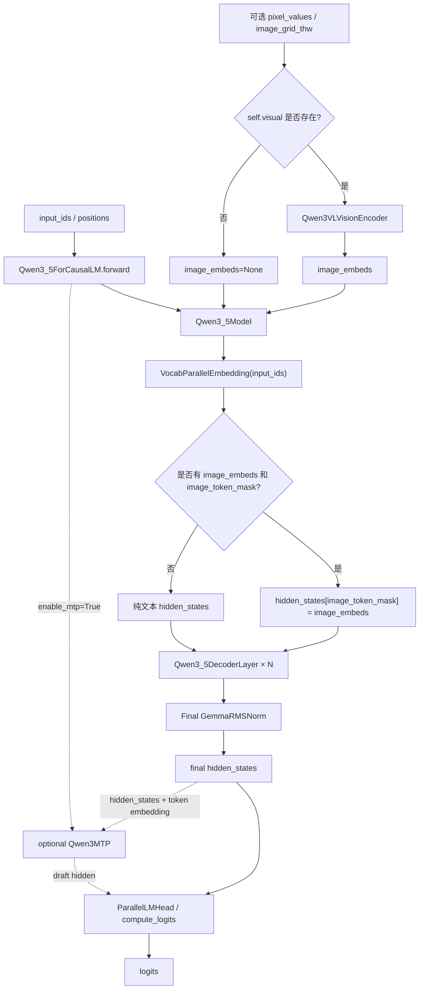
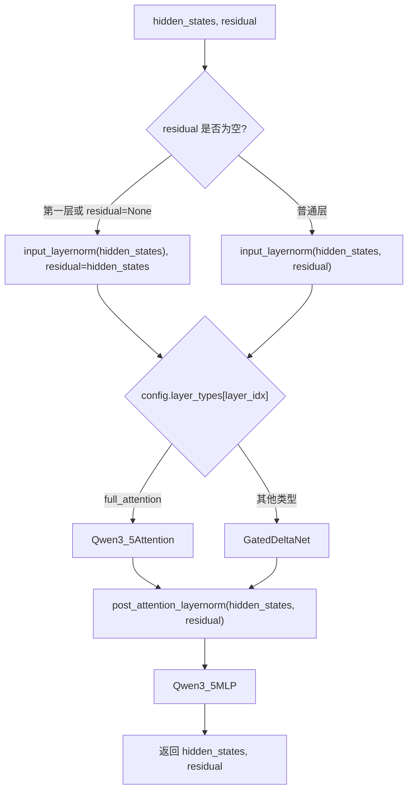
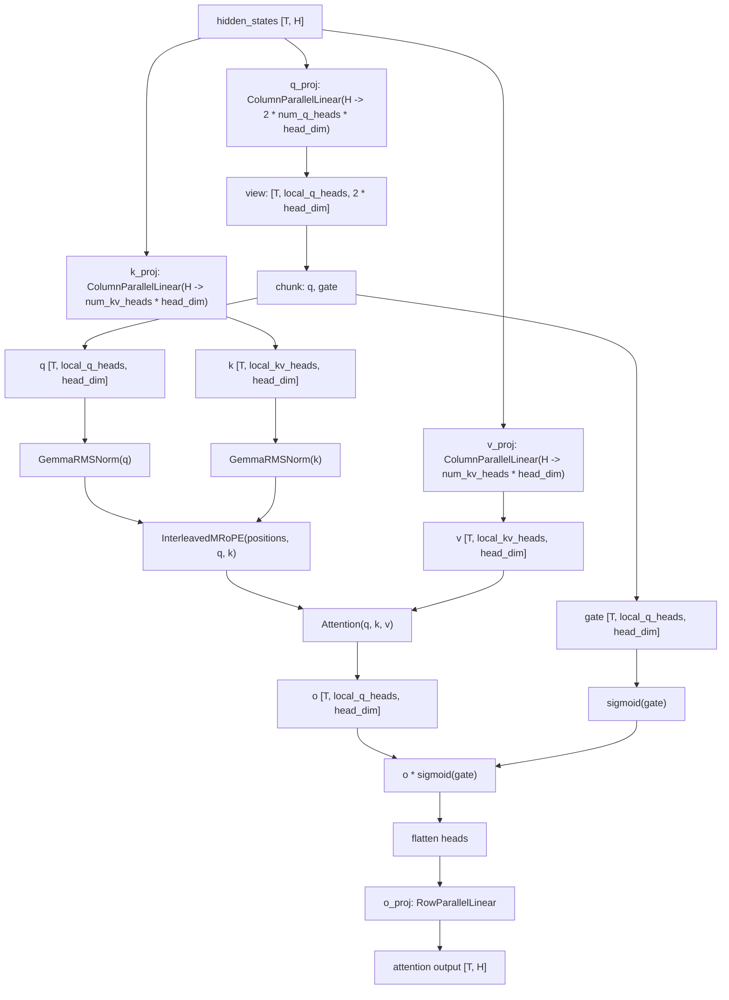
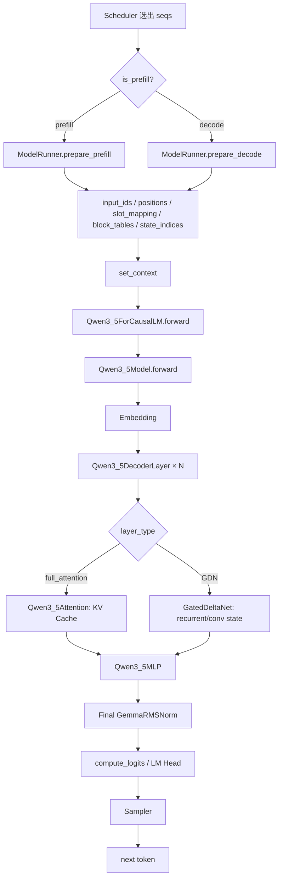
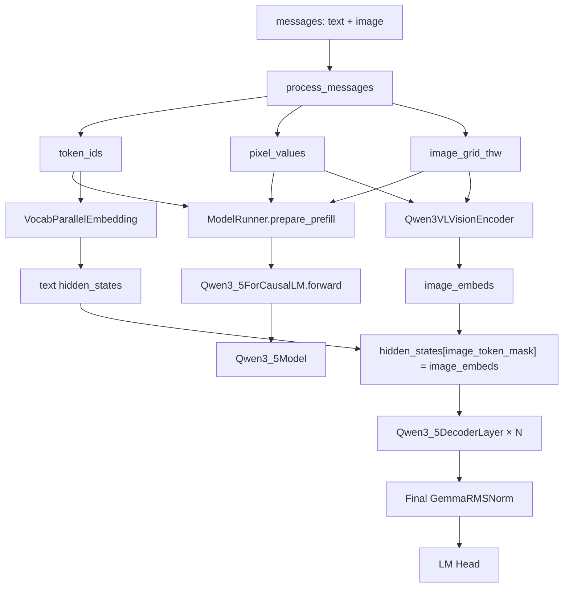

# Qwen3.6 完整模型架构与 nano-vLLM-qwen3.6 代码逻辑总览

> 目标：把你已经学过的 **Qwen3 dense Decoder-only 架构** 和 `nano-vllm-qwen3.6` 中新增的 **Qwen3.5/Qwen3.6 hybrid 模型代码** 串起来。  
>
> 读完本文后，你应该能回答：
>
> 1. `nano-vllm-qwen3.6` 中 Qwen3.6 的完整模型结构是什么样？
> 2. 它和原版 nano-vLLM 的 Qwen3 dense 结构相比，核心变化在哪里？
> 3. `q_proj / k_proj / v_proj` 分开、`query + gate`、`output gating`、`GemmaRMSNorm`、`InterleavedMRoPE` 这些改动分别处在 forward 的哪个位置？
> 4. 这些模型结构变化为什么会牵动 `ModelRunner`、KV Cache、GDN state、多模态和 MTP 等系统层代码？

---

## 0. 先说明：本文分析的“Qwen3.6 架构”具体指什么

在 `nano-vllm-qwen3.6` 这个仓库中，Qwen3.5 / Qwen3.6 hybrid 模型主体并不是写在原版 `models/qwen3.py` 里，而是新增在：

```text
nanovllm/models/qwen3_5.py
```

核心类包括：

```text
Qwen3_5ForCausalLM
Qwen3_5Model
Qwen3_5DecoderLayer
Qwen3_5Attention
Qwen3_5MLP
```

虽然文件名和类名里是 `Qwen3_5`，但从该 fork 的整体实现看，它承担的是 **Qwen3.5 / Qwen3.6 hybrid 语言模型结构** 的实现工作。Qwen3.6-27B-FP8 text-only 运行脚本也是通过这个模型结构、FP8 loader 和 tensor parallel 路径跑起来的。

因此本文中的“Qwen3.6 模型架构”可以理解为：

```text
该仓库中用于支持 Qwen3.5/Qwen3.6 hybrid 模型的 Qwen3_5ForCausalLM 架构。
```

需要注意：

```text
1. 视觉 encoder 是可选模块。
2. MTP 是可选模块。
3. Qwen3.6-27B-FP8 当前常见运行方式是 text-only，即 enable_vision=False。
4. full attention 的新结构只出现在 full_attention 层。
5. GatedDeltaNet 层不是普通 attention 层，因此不会走 q_proj/k_proj/v_proj/MRoPE 这条路径。
```

---

## 1. 从原版 Qwen3 dense 到 Qwen3.6 hybrid：总认知变化

### 1.1 原版 nano-vLLM 的 Qwen3 dense

原版 nano-vLLM 中的 Qwen3 dense 模型可以理解为：

```text
input_ids
  ↓
VocabParallelEmbedding
  ↓
Qwen3DecoderLayer × N
  ↓
Final RMSNorm
  ↓
ParallelLMHead
  ↓
logits
```

每层 `Qwen3DecoderLayer` 基本都是：

```text
RMSNorm
  ↓
QKVParallelLinear
  ↓
q/k/v split
  ↓
q_norm / k_norm
  ↓
Standard RoPE
  ↓
Causal Self-Attention with KV Cache
  ↓
o_proj
  ↓
RMSNorm
  ↓
SwiGLU MLP
```

它的关键特征是：

```text
1. 每一层都是 full attention + MLP。
2. 所有层都需要 KV Cache。
3. q/k/v 在工程上合并成 qkv_proj。
4. RoPE 是标准 1D RoPE。
5. Norm 主要是普通 RMSNorm。
6. 输入主要是纯文本 token。
```

---

### 1.2 qwen3.6 版本的 Qwen3.5/Qwen3.6 hybrid

qwen3.6 版本的模型结构变成：

```text
input_ids
  ↓
VocabParallelEmbedding
  ↓
如果有图像：image_embeds 替换 image token 位置
  ↓
Qwen3_5DecoderLayer × N
  ↓
Final GemmaRMSNorm
  ↓
ParallelLMHead
  ↓
logits
```

其中每层 `Qwen3_5DecoderLayer` 不再固定是 full attention，而是根据：

```python
config.layer_types[layer_idx]
```

动态选择：

```text
full_attention 层:
    Qwen3_5Attention + Qwen3_5MLP

非 full_attention 层:
    GatedDeltaNet + Qwen3_5MLP
```

所以它不是简单“把 Qwen3 的 attention 写法换了”，而是整体变成：

```text
full attention 层 + GatedDeltaNet 层混合的 hybrid decoder-only causal LM。
```

---

## 2. Qwen3.6 完整模型结构总图

下面这张图是 `Qwen3_5ForCausalLM` 的完整结构图，包括语言主干、可选视觉分支和可选 MTP 分支。



这张图对应代码结构：

```text
Qwen3_5ForCausalLM
  ├── self.model = Qwen3_5Model
  ├── self.lm_head = ParallelLMHead
  ├── self.visual = optional Qwen3VLVisionEncoder
  └── self.mtp = optional Qwen3MTP

Qwen3_5Model
  ├── VocabParallelEmbedding
  ├── Qwen3_5DecoderLayer × num_hidden_layers
  └── Final GemmaRMSNorm
```

---

## 3. Qwen3.6 主干结构：`Qwen3_5ForCausalLM`

### 3.1 最外层模型外壳

`Qwen3_5ForCausalLM` 是 causal LM 外壳，主要有四个组成部分：

```python
self.model = Qwen3_5Model(config)
self.lm_head = ParallelLMHead(config.vocab_size, config.hidden_size)
self.mtp = optional Qwen3MTP(config)
self.visual = optional Qwen3VLVisionEncoder(vision_config)
```

对应概念：

| 代码成员 | 模型概念 | 是否每次都启用 |
|---|---|---|
| `self.model` | 语言模型主干 | 必须 |
| `self.lm_head` | hidden states 到 vocab logits | 必须 |
| `self.visual` | 图像像素到 image embeddings | 仅多模态启用 |
| `self.mtp` | Multi-Token Prediction 辅助分支 | 仅 enable_mtp=True 启用 |

它的主 forward 是：

```text
如果有 pixel_values 且 visual 存在:
    image_embeds = visual(pixel_values, image_grid_thw)

hidden_states = self.model(input_ids, positions, image_embeds, image_token_mask)
return hidden_states
```

然后由：

```python
compute_logits(hidden_states)
```

调用：

```text
ParallelLMHead(hidden_states)
```

得到 logits。

---

### 3.2 权重加载适配

这个类还定义了：

```python
weight_prefix = "model.language_model."
visual_prefix = "model.visual."
packed_modules_mapping = {
    "gate_proj": ("gate_up_proj", 0),
    "up_proj": ("gate_up_proj", 1),
}
```

这几个不是 forward 计算，但对模型加载非常重要。

含义是：

```text
checkpoint 里的语言模型权重:
    model.language_model.xxx
映射到 nano-vLLM 模型里的:
    model.xxx

checkpoint 里的视觉权重:
    model.visual.xxx
映射到 nano-vLLM 模型里的:
    visual.xxx

MLP 中:
    gate_proj / up_proj
加载到合并后的:
    gate_up_proj
```

注意：这里没有：

```text
q_proj/k_proj/v_proj -> qkv_proj
```

因为 Qwen3.6 full attention 中 q/k/v 不再合并成一个 `qkv_proj`。

---

## 4. Qwen3.6 主干结构：`Qwen3_5Model`

`Qwen3_5Model` 是语言模型主体。

结构是：

```python
self.embed_tokens = VocabParallelEmbedding(config.vocab_size, config.hidden_size)
self.layers = nn.ModuleList([
    Qwen3_5DecoderLayer(config, i)
    for i in range(config.num_hidden_layers)
])
self.norm = GemmaRMSNorm(config.hidden_size, eps=config.rms_norm_eps)
```

forward 流程是：

```text
input_ids
  ↓
embed_tokens(input_ids)
  ↓
如果 image_embeds 不为空:
    hidden_states[image_token_mask] = image_embeds
  ↓
逐层 Qwen3_5DecoderLayer
  ↓
Final GemmaRMSNorm
  ↓
hidden_states
```

---

## 5. Qwen3.6 单层 DecoderLayer 总图

每层 `Qwen3_5DecoderLayer` 的外壳仍然保持 decoder-only block 的基本结构：

```text
Norm
  ↓
token mixing module
  ↓
Norm
  ↓
MLP
```

但中间的 token mixing module 不一定是 attention。



对应代码逻辑：

```python
layer_type = config.layer_types[layer_idx]

if layer_type == "full_attention":
    self.self_attn = Qwen3_5Attention(config, layer_idx)
    self.linear_attn = None
else:
    self.linear_attn = GatedDeltaNet(config, layer_idx)
    self.self_attn = None
```

所以每层可以分成两类：

| layer_type | token mixing 模块 | 历史状态 |
|---|---|---|
| `full_attention` | `Qwen3_5Attention` | KV Cache |
| 非 `full_attention` | `GatedDeltaNet` | recurrent state + conv state |

这就是 qwen3.6 架构和 Qwen3 dense 最大的差异之一。

---

## 6. Qwen3.6 Full Attention 层完整结构

用户特别关心的 5 个关键改动，都集中在 `Qwen3_5Attention` 中。

完整 attention 子层流程是：



对应伪代码：

```python
q_gate = self.q_proj(hidden_states)
q_gate = q_gate.view(-1, self.num_heads, self.head_dim * 2)
q, gate = q_gate.chunk(2, dim=-1)

k = self.k_proj(hidden_states).view(-1, self.num_kv_heads, self.head_dim)
v = self.v_proj(hidden_states).view(-1, self.num_kv_heads, self.head_dim)

q = self.q_norm(q)
k = self.k_norm(k)

q, k = self.rotary_emb(positions, q, k)

o = self.attn(q, k, v)

o = o * torch.sigmoid(gate)

output = self.o_proj(o.flatten(1, -1))
```

---

## 7. 关键改动一：`q_proj / k_proj / v_proj` 分开

### 7.1 原版 Qwen3 dense 的做法

原版 Qwen3 dense 中，attention 通常使用：

```python
self.qkv_proj = QKVParallelLinear(...)
```

也就是工程上把：

```text
q_proj
k_proj
v_proj
```

打包成一个大线性层：

```text
qkv_proj
```

forward 中：

```text
hidden_states
  ↓
qkv_proj
  ↓
split 成 q / k / v
```

好处是：

```text
1. 少一次或少几次 linear 调用。
2. q/k/v 权重加载可以通过 packed_modules_mapping 合并。
3. 对普通 dense attention 结构更简单。
```

---

### 7.2 Qwen3.6 的做法

Qwen3.6 full attention 中改成：

```python
self.q_proj = ColumnParallelLinear(...)
self.k_proj = ColumnParallelLinear(...)
self.v_proj = ColumnParallelLinear(...)
```

也就是 q/k/v 是三个独立线性层。

原因不是“忘了优化”，而是 Qwen3.6 的 q 分支结构变了：

```text
q_proj 不只输出 query，还输出 gate。
```

如果仍然强行使用原版 `QKVParallelLinear`，就需要让 q 分支携带额外 gate 维度，同时还要处理 k/v 的 GQA 维度和 checkpoint 权重映射，复杂度会明显上升。

所以代码选择更直接的结构：

```text
q_proj:
    hidden_size -> 2 * num_attention_heads * head_dim

k_proj:
    hidden_size -> num_key_value_heads * head_dim

v_proj:
    hidden_size -> num_key_value_heads * head_dim
```

---

### 7.3 这个改动的意义

这个改动说明：

```text
Qwen3.6 full attention 不再是原版 Qwen3 dense 那种普通 qkv 合并 attention。
```

它变成：

```text
q 分支带 gate
k/v 分支仍然是普通 K/V
attention 输出还要被 gate 调制
```

因此 q/k/v 分开是后面 `query + gate` 和 `output gating` 的前提。

---

## 8. 关键改动二：`q_proj` 输出 query + gate

### 8.1 输出维度为什么是普通 query 的 2 倍

在 Qwen3.6 full attention 中：

```python
self.q_proj = ColumnParallelLinear(
    config.hidden_size,
    self.total_num_heads * self.head_dim * 2,
    bias=False,
)
```

普通 query 的输出维度应该是：

```text
num_attention_heads * head_dim
```

这里变成：

```text
2 * num_attention_heads * head_dim
```

原因是它同时输出：

```text
query
gate
```

forward 中：

```python
q_gate = self.q_proj(hidden_states)
q_gate = q_gate.view(-1, self.num_heads, self.head_dim * 2)
q, gate = q_gate.chunk(2, dim=-1)
```

也就是说，当前 rank 上：

```text
q_gate: [T, local_q_heads * 2 * head_dim]
view 后:
q_gate: [T, local_q_heads, 2 * head_dim]

chunk 后:
q:    [T, local_q_heads, head_dim]
gate: [T, local_q_heads, head_dim]
```

---

### 8.2 gate 和 query 的关系

`gate` 不是另一个 attention head，也不是 K/V。

它是和 query head 一一对应的调制信号：

```text
每个 token
每个 query head
每个 head_dim 通道
都有一个 gate 值
```

后面 attention 计算出输出 `o` 后，会用：

```python
o = o * torch.sigmoid(gate)
```

对 attention 输出做逐元素调制。

因此：

```text
q 决定“去哪里取上下文信息”
gate 决定“取回来的信息通过多少”
```

这是 Qwen3.6 full attention 相比普通 attention 的重要结构增强。

---

## 9. 关键改动三：Attention 输出后乘 `sigmoid(gate)`

### 9.1 原版 Qwen3 dense 的 attention 输出

原版 full attention 大致是：

```text
q/k/v
  ↓
attention(q, k, v)
  ↓
o_proj
  ↓
attention_output
```

即：

```text
output = o_proj(Attention(q, k, v))
```

---

### 9.2 Qwen3.6 的 attention 输出

Qwen3.6 中多了一步：

```python
o = self.attn(q, k, v)
o = o * torch.sigmoid(gate)
output = self.o_proj(o.flatten(1, -1))
```

也就是：

```text
output = o_proj(Attention(q, k, v) * sigmoid(gate))
```

其中：

```text
sigmoid(gate) ∈ (0, 1)
```

这意味着 gate 可以动态控制 attention 输出的强弱。

---

### 9.3 output gating 的直观理解

可以把普通 attention 理解为：

```text
模型从历史上下文中取回一份信息 o。
```

Qwen3.6 的 gated attention 则是：

```text
模型先从历史上下文中取回信息 o；
再根据当前 token 自己产生的 gate 决定 o 的每个通道通过多少。
```

比如某个 token 在某个 head 上的 gate 较小：

```text
sigmoid(gate) 接近 0
```

那么该 head/channel 的 attention 输出就会被压低。

如果 gate 较大：

```text
sigmoid(gate) 接近 1
```

那么 attention 输出基本保留。

所以 output gating 提供了一种更细粒度的信息流控制能力。

---

## 10. 关键改动四：q/k 使用 `GemmaRMSNorm`

### 10.1 原版 Qwen3 dense 的 q/k norm

原版 Qwen3 dense 中，q/k norm 通常使用普通 RMSNorm：

```text
q = RMSNorm(q)
k = RMSNorm(k)
```

它的形式可以理解为：

```text
RMSNorm(x) = x / rms(x) * weight
```

---

### 10.2 Qwen3.6 的 q/k norm

Qwen3.6 中：

```python
self.q_norm = GemmaRMSNorm(self.head_dim, eps=config.rms_norm_eps)
self.k_norm = GemmaRMSNorm(self.head_dim, eps=config.rms_norm_eps)
```

forward 中：

```python
q = self.q_norm(q)
k = self.k_norm(k)
```

`GemmaRMSNorm` 的核心特点是：

```text
output = norm(x) * (1 + weight)
```

而普通 RMSNorm 是：

```text
output = norm(x) * weight
```

所以 GemmaRMSNorm 中的 `weight` 更像是相对于 1 的偏移量，而不是直接缩放系数。

---

### 10.3 为什么 q/k norm 很重要

q/k norm 作用在 attention score 计算之前。

attention score 本质上依赖：

```text
q · k
```

如果 q/k 的尺度不稳定，attention logits 也会不稳定。

所以 q/k norm 的作用是：

```text
让每个 head 内 q/k 的尺度更稳定，
避免 attention score 过大或过小。
```

Qwen3.6 使用 GemmaRMSNorm，说明它的 checkpoint 与模型结构期望的是 Gemma 风格的 norm 参数定义。如果推理框架错误地用普通 RMSNorm，会导致数值不一致。

---

## 11. 关键改动五：RoPE 使用 `InterleavedMRoPE`

### 11.1 原版标准 1D RoPE

原版 Qwen3 dense 的 RoPE 可以理解为：

```text
positions: [T]
q, k: [T, heads, head_dim]

根据每个 token 的一维位置 position_id
生成 cos/sin
作用到 q/k 上
```

它适合纯文本序列，因为文本 token 的位置就是：

```text
第 0 个 token
第 1 个 token
第 2 个 token
...
```

---

### 11.2 Qwen3.6 的 InterleavedMRoPE

Qwen3.6 使用：

```python
self.rotary_emb = InterleavedMRoPE(
    head_size=self.head_dim,
    partial_rotary_factor=partial_rotary_factor,
    mrope_section=mrope_section,
    max_position_embeddings=...,
    base=rope_theta,
)
```

它比标准 RoPE 多了几个能力：

```text
1. 支持 partial RoPE
2. 支持普通文本 1D positions
3. 支持多模态 3D positions
4. 支持 temporal / height / width 三维位置交错编码
```

---

### 11.3 partial RoPE

`partial_rotary_factor` 表示：

```text
只让 head_dim 的一部分维度参与 RoPE。
```

例如：

```text
head_dim = 128
partial_rotary_factor = 0.25
rotary_dim = 32
```

那么：

```text
前 32 维参与 RoPE
后 96 维直接保留
```

这和原版强制 `rotary_dim == head_size` 的标准 RoPE 不同。

---

### 11.4 MRoPE 的 3D positions

多模态输入中，图像 token 不只是文本序列位置，还来自图像 patch 网格。

因此它可以有三维位置：

```text
temporal position
height position
width position
```

也就是：

```text
positions: [3, T]
```

其中三行分别表示：

```text
T 维
H 维
W 维
```

`InterleavedMRoPE` 会把这三类位置信息按照 `mrope_section` 交错进 rotary 频率中。

这样语言模型在 attention 中看到 image token 时，不只是知道：

```text
这是序列中的第几个 token
```

还能知道：

```text
这个 image token 来自图像的哪一帧、哪一行、哪一列。
```

---

### 11.5 text-only 时怎么办

如果是纯文本输入，positions 仍然可以是一维：

```text
positions: [T]
```

这时 `InterleavedMRoPE` 可以退化为普通文本 RoPE 路径。

所以它不是只为多模态服务，而是统一支持：

```text
text-only 1D positions
multimodal 3D positions
```

---

## 12. Qwen3.6 MLP：仍然是 SwiGLU，但只打包 gate/up

`Qwen3_5MLP` 的结构和 Qwen3 dense 类似：

```python
self.gate_up_proj = MergedColumnParallelLinear(
    config.hidden_size,
    [config.intermediate_size] * 2,
    bias=False,
)
self.down_proj = RowParallelLinear(
    config.intermediate_size,
    config.hidden_size,
    bias=False,
)
self.act_fn = SiluAndMul()
```

forward 是：

```python
return self.down_proj(self.act_fn(self.gate_up_proj(x)))
```

对应公式：

```text
MLP(x) = down_proj(SiLU(gate_proj(x)) * up_proj(x))
```

注意：

```text
gate_proj / up_proj 仍然被合并成 gate_up_proj
q_proj / k_proj / v_proj 不再被合并成 qkv_proj
```

所以 qwen3.6 不是完全取消权重打包，而是：

```text
MLP 的 gate/up 合并保留；
Attention 的 q/k/v 合并取消。
```

---

## 13. 完整 DecoderLayer 结构对照：Qwen3 dense vs Qwen3.6

| 结构点 | 原版 Qwen3 dense | qwen3.6 hybrid |
|---|---|---|
| 每层类型 | 全部 full attention | 由 `config.layer_types` 决定 full attention 或 GatedDeltaNet |
| Attention 投影 | `QKVParallelLinear` 合并 q/k/v | `q_proj/k_proj/v_proj` 分开 |
| q 分支 | 只输出 query | 输出 `query + gate` |
| attention 输出 | 直接 `o_proj(o)` | `o * sigmoid(gate)` 后再 `o_proj` |
| q/k norm | 普通 RMSNorm | GemmaRMSNorm |
| RoPE | 标准 1D RoPE | InterleavedMRoPE，支持 partial 和 3D |
| MLP | gate/up 合并，SwiGLU | gate/up 合并，SwiGLU |
| Norm | RMSNorm | GemmaRMSNorm |
| 历史状态 | 每层 KV Cache | full attention 用 KV Cache，GDN 用 recurrent/conv state |
| 多模态 | 原版无 | 可选 vision encoder + image token scatter |
| MTP | 原版无 | 可选 Qwen3MTP |

---

## 14. Qwen3.6 text-only forward：从 ModelRunner 到模型

一次 text-only 推理 step 可以这样理解：



其中：

```text
ModelRunner 负责准备运行时张量；
Qwen3_5ForCausalLM 负责模型结构 forward；
Attention/GDN 通过 Context 读取 KV Cache / state_indices 等运行时信息。
```

---

## 15. Qwen3.6 multimodal forward：图像如何进入模型

如果启用视觉路径，多模态输入会多出：

```text
pixel_values
image_grid_thw
image_token_mask
```

整体流程是：



多模态融合点在：

```python
hidden_states = self.embed_tokens(input_ids)

if image_embeds is not None and image_token_mask is not None:
    hidden_states[image_token_mask] = image_embeds.to(hidden_states.dtype)
```

也就是说：

```text
文本 token:
    走 embedding table

图像 token:
    先由 vision encoder 得到 image_embeds
    再替换 image token 位置上的 hidden_states
```

---

## 16. Qwen3.6 optional MTP：不是主 forward，但挂在模型外壳上

`Qwen3_5ForCausalLM` 中：

```python
self.mtp = None
if getattr(config, "enable_mtp", False):
    self.mtp = Qwen3MTP(config)
```

`Qwen3MTP` 的输入是：

```text
当前 token embedding
主模型 hidden_states
positions
```

流程是：

```text
inputs_embeds
  ↓ GemmaRMSNorm

hidden_states
  ↓ GemmaRMSNorm

concat([inputs_embeds, hidden_states])
  ↓
ReplicatedLinear(2H -> H)
  ↓
Qwen3MTPDecoderLayer × num_layers
  ↓
Final GemmaRMSNorm
  ↓
mtp_hidden
  ↓
LM Head
  ↓
draft logits
```

MTP 不属于普通 `Qwen3_5ForCausalLM.forward()` 必经路径，而是由 `ModelRunner` 中的：

```text
run_mtp_probe
run_mtp_draft_step
run_mtp_draft_fast_step
```

等函数主动调用。

所以完整模型外壳中有 MTP，但普通文本生成不一定启用它。

---

## 17. 为什么模型结构改动会牵动 KV Cache 和 GDN state

原版 Qwen3 dense 中：

```text
所有 decoder layer 都是 full attention
```

所以可以简单理解为：

```text
num_hidden_layers 层都需要 KV Cache
```

但 qwen3.6 hybrid 中：

```text
full_attention 层:
    需要 KV Cache

GatedDeltaNet 层:
    不需要 KV Cache
    需要 conv_state / recurrent_state
```

因此系统层必须改：

```text
1. KV Cache 不能再按总层数分配。
2. ModelRunner 需要只给真正有 k_cache/v_cache 的层分配 KV Cache。
3. GDN 层要额外分配 conv_states 和 recurrent_states。
4. Sequence 需要记录 state_slot_id。
5. Scheduler 需要分配和释放 state slot。
6. Context 需要把 state_indices 传给 GDN 层。
7. CUDA Graph replay 时也要包含 state_indices。
```

这就是为什么你看到很多文件都在改：

```text
sequence.py
scheduler.py
model_runner.py
context.py
block_manager.py
```

这些不是模型数学结构本身，但都是为了让 hybrid 模型正确运行。

---

## 18. 关键代码对应表

| 架构概念 | qwen3.6 代码位置 | 作用 |
|---|---|---|
| 模型外壳 | `Qwen3_5ForCausalLM` | language model + lm_head + optional visual + optional mtp |
| 语言主干 | `Qwen3_5Model` | embedding + decoder layers + final GemmaRMSNorm |
| hybrid layer 选择 | `Qwen3_5DecoderLayer` | 根据 `layer_types` 选择 full attention 或 GatedDeltaNet |
| gated full attention | `Qwen3_5Attention` | q/gate、k、v、MRoPE、attention、output gating |
| GDN 层 | `GatedDeltaNet` | hybrid 中非 full_attention 层的 token mixing |
| MLP | `Qwen3_5MLP` | SwiGLU FFN，gate/up 合并 |
| q/k norm | `GemmaRMSNorm` | q/k 和 layer norm 使用 Gemma 风格 RMSNorm |
| 位置编码 | `InterleavedMRoPE` | partial RoPE + text 1D + multimodal 3D positions |
| 视觉入口 | `Qwen3VLVisionEncoder` | pixel_values/image_grid_thw -> image_embeds |
| MTP | `Qwen3MTP` | draft hidden prediction |
| 模型创建 | `ModelRunner._create_model` | 根据 `model_type` 选择 Qwen3_5ForCausalLM 或 Qwen3ForCausalLM |
| KV/GDN 状态 | `ModelRunner.allocate_kv_cache / allocate_gdn_state` | full attention 分配 KV，GDN 分配 state |
| logits | `compute_logits / ParallelLMHead` | hidden_states -> vocab logits |
| sampling | `Sampler` | logits -> next token |

---

## 19. 对只学过原版 nano-vLLM 的人，应该怎么迁移理解

### 19.1 原版 Qwen3 dense 的核心心智模型

你原来可以这样想：

```text
每层都是 attention + MLP
attention 都有 KV Cache
qkv 合并成 qkv_proj
RoPE 是 1D
RMSNorm 是普通 RMSNorm
```

---

### 19.2 qwen3.6 需要替换成新的心智模型

现在要改成：

```text
不是每层都是 full attention；
每层先看 layer_types。

如果是 full_attention:
    走 Qwen3_5Attention
    q_proj 输出 q + gate
    k_proj/v_proj 单独算
    q/k 用 GemmaRMSNorm
    q/k 用 InterleavedMRoPE
    attention 输出乘 sigmoid(gate)
    再 o_proj

如果不是 full_attention:
    走 GatedDeltaNet
    不使用普通 attention KV Cache
    使用 recurrent/conv state

不管哪种 token mixing:
    后面都接 Qwen3_5MLP
```

---

## 20. 单层 forward 的“口述版”

如果面试官让你解释 Qwen3.6 一个 decoder layer 怎么 forward，可以这样说：

```text
Qwen3.6 的 decoder layer 是 hybrid 的。进入每层时，先通过 GemmaRMSNorm 做 pre-norm，并维护 residual 主干。然后根据 config.layer_types 判断该层是 full attention 还是 GatedDeltaNet。如果是 full attention，就进入 Qwen3_5Attention：hidden_states 分别经过 q_proj、k_proj、v_proj，其中 q_proj 的输出维度是普通 query 的两倍，会被 reshape 后 split 成 query 和 gate；k_proj/v_proj 分别产生 key/value。query 和 key 会先经过 GemmaRMSNorm，再通过 InterleavedMRoPE 注入位置信息。随后调用 Attention 模块执行 prefill/decode 的 KV Cache attention。attention 输出和 sigmoid(gate) 做逐元素相乘，形成 output gating，再经过 o_proj 回到 hidden_size。如果该层不是 full attention，则调用 GatedDeltaNet，它使用 recurrent/conv state 而不是 KV Cache。token mixing 结束后，再做 post_attention_layernorm，然后进入 SwiGLU MLP，即 gate_up_proj、SiluAndMul、down_proj，最后返回新的 hidden_states 和 residual。
```

---

## 21. 五个关键改动的面试回答版

### 21.1 为什么 q/k/v 分开？

因为 Qwen3.6 的 q 分支不再只是 query，而是 `query + gate`。原版 `QKVParallelLinear` 假设 q/k/v 都是普通投影并合并成一个大矩阵，但 Qwen3.6 的 q_proj 输出维度变成两倍，并且 gate 后面要参与 output gating。因此代码改成 q_proj、k_proj、v_proj 三个独立 `ColumnParallelLinear`，便于准确表达 checkpoint 结构和 gated attention 逻辑。

---

### 21.2 q_proj 输出 query + gate 是什么意思？

q_proj 的输出维度是：

```text
2 * num_attention_heads * head_dim
```

它会被 reshape 成：

```text
[T, local_q_heads, 2 * head_dim]
```

然后沿最后一维切成：

```text
q:    [T, local_q_heads, head_dim]
gate: [T, local_q_heads, head_dim]
```

其中 q 用于 attention score，gate 用于控制 attention 输出通道通过多少。

---

### 21.3 output gating 怎么理解？

普通 attention 是：

```text
o = Attention(q, k, v)
output = o_proj(o)
```

Qwen3.6 是：

```text
o = Attention(q, k, v)
o = o * sigmoid(gate)
output = o_proj(o)
```

所以 gate 是一个动态门控信号，让模型决定当前 token、当前 head、当前通道的 attention 信息要保留多少。

---

### 21.4 为什么 q/k 用 GemmaRMSNorm？

q/k norm 直接影响 attention score 的数值尺度。Qwen3.6 checkpoint 对应的是 Gemma 风格 RMSNorm，即：

```text
output = norm(x) * (1 + weight)
```

而不是普通 RMSNorm 的：

```text
output = norm(x) * weight
```

所以使用 GemmaRMSNorm 是为了保持模型结构和权重语义一致。

---

### 21.5 为什么使用 InterleavedMRoPE？

原版标准 RoPE 只支持一维文本位置，适合纯文本序列。Qwen3.6 需要支持 partial RoPE 和多模态位置编码：文本时 positions 可以是 `[T]`，多模态时 positions 可以是 `[3, T]`，分别表示 temporal、height、width。InterleavedMRoPE 可以把这三维位置信息交错编码到 q/k 中，从而让语言模型在处理 image token 时理解图像 patch 的空间/时间位置。

---

## 22. 最终总结

`nano-vllm-qwen3.6` 中的 Qwen3.6 模型架构，可以用一句话概括：

```text
它是在 decoder-only causal LM 外壳下，
把原版 Qwen3 dense 的“每层 full attention + MLP”
扩展成“full attention / GatedDeltaNet 混合 + gated attention + GemmaRMSNorm + InterleavedMRoPE + 可选视觉入口 + 可选 MTP”的 hybrid 模型结构。
```

最核心的模型层变化集中在 `Qwen3_5Attention`：

```text
q/k/v 分开
q_proj 输出 q + gate
attention 输出乘 sigmoid(gate)
q/k 使用 GemmaRMSNorm
RoPE 使用 InterleavedMRoPE
```

最核心的系统层变化是：

```text
full attention 层继续使用 KV Cache；
GatedDeltaNet 层使用 recurrent/conv state；
ModelRunner/Scheduler/Sequence/Context 必须一起改，才能让 hybrid 模型在 prefill、decode、CUDA Graph、MTP/spec decode 下保持状态一致。
```

你可以把它和原版 nano-vLLM 的关系记成：

```text
原版 nano-vLLM:
    清晰实现 Qwen3 dense 文本推理

nano-vllm-qwen3.6:
    在原版推理框架上，加入 Qwen3.5/Qwen3.6 hybrid 模型结构和配套运行时系统
```

所以学习这个项目时，不要只盯着某一个文件中的几行改动，而要抓住一条主线：

```text
模型结构变复杂
  ↓
attention 层结构变复杂
  ↓
不是所有层都用 KV Cache
  ↓
GDN state 需要单独管理
  ↓
ModelRunner/Scheduler/Context/Sequence 必须配合
  ↓
才能跑通 Qwen3.6 text-only、multimodal、MTP 和 spec decode 实验
```


%% 项目关联导航：开始 %%
## 项目关联导航

- 所属模块：[[outputs/项目整理/模块-nano-vllm-qwen3.6|模块-nano-vllm-qwen3.6]]

%% 项目关联导航：结束 %%
