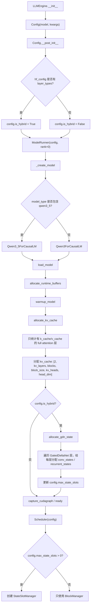
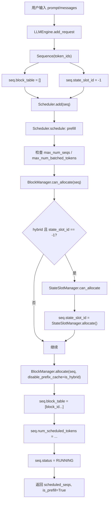
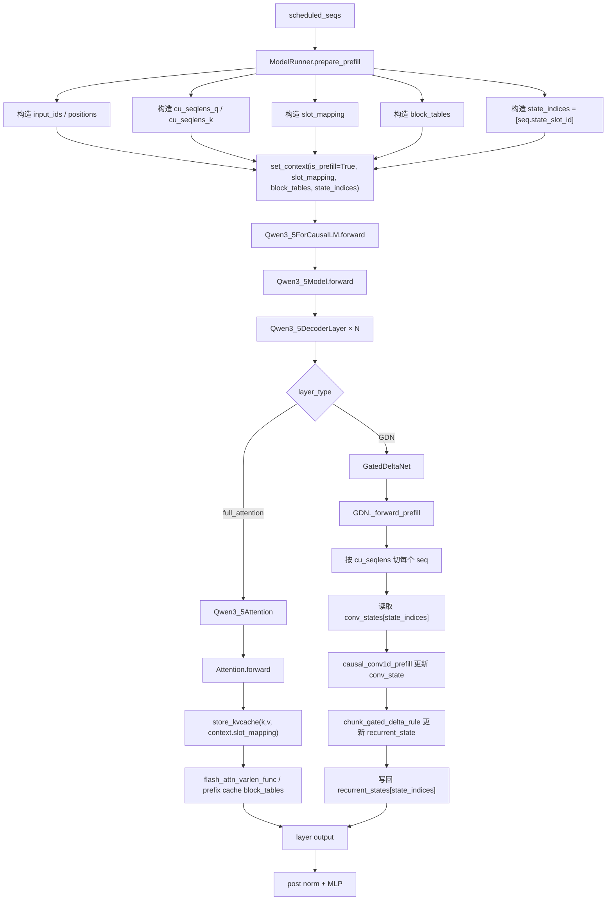
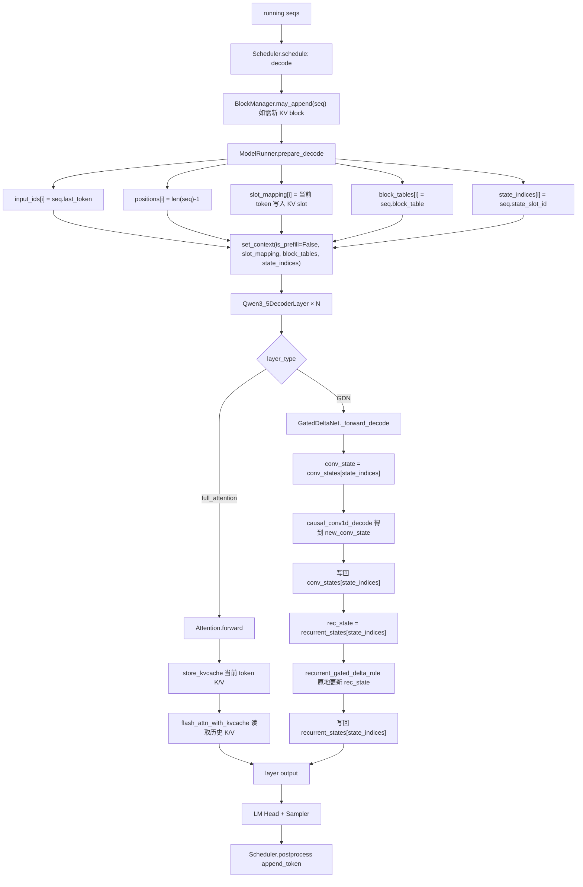
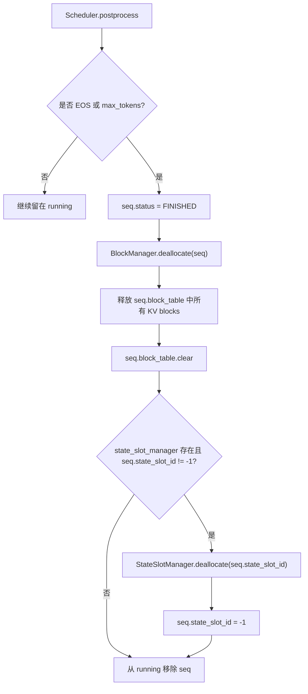
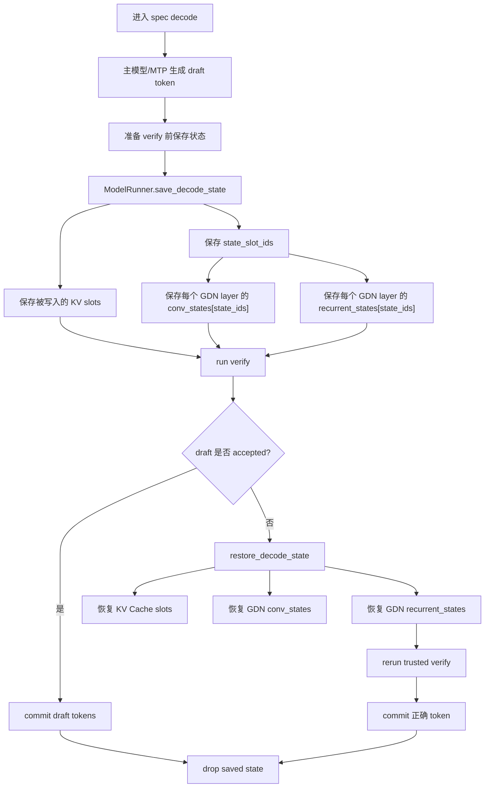

# nano-vLLM-qwen3.6 大方向二详解：Hybrid 运行时状态管理（KV Cache + GDN State）

> 本文展开《nano-vLLM-qwen3.6 整体改动宏观分析》中的第二个大方向：  
>
> **Hybrid 运行时状态管理 —— KV Cache 之外新增 GDN state**
>
> 目标是把下面几个问题讲清楚：
>
> 1. 原版 nano-vLLM 的 KV Cache 为什么体现了 PagedAttention 思想？
> 2. GatedDeltaNet 的 GDN state 有没有类似 PagedAttention 的思想？
> 3. GatedDeltaNet 层到底在维护什么状态：`conv_state` 和 `recurrent_state` 分别是什么？
> 4. `sequence.py`、`scheduler.py`、`block_manager.py`、`model_runner.py`、`context.py`、`gated_delta_net.py`、`qwen3_5.py` 如何互相调用？
> 5. prefill / decode / rollback 过程中，KV Cache 和 GDN state 的完整链路是什么？

---

## 1. 先给结论：GDN state 不使用 PagedAttention，但借鉴了“池化分配 + 间接索引”的思想

原版 nano-vLLM 的 KV Cache 管理非常接近 PagedAttention 的核心思想：

```text
把连续增长的 token 历史 K/V 切成固定大小 block；
每个请求用 block_table 记录自己有哪些 block；
decode 时通过 block_table 间接索引历史 K/V。
```

而 qwen3.6 中的 GDN state 不是 token-level block，也不是 PagedAttention 那种“按 token 页管理历史 K/V”的结构。

GDN state 的管理方式更像：

```text
为每个正在运行的请求分配一个 state slot；
每个 GatedDeltaNet 层都有一组 state pools；
请求通过 state_slot_id / state_indices 读写自己的 conv_state 和 recurrent_state。
```

因此可以这样概括：

```text
KV Cache:
    token-paged block memory
    一个请求有多个 KV blocks
    block 数随序列长度增长

GDN state:
    request-slot state memory
    一个请求占一个 state slot
    state 大小基本不随序列长度线性增长
```

所以，GDN state **没有实现类似 PagedAttention 的 token 分页机制**，但它和 KV Cache 一样，都是在 GPU 上预分配一块资源池，然后用间接索引把“请求”映射到“物理存储位置”。

---

## 2. 原版 KV Cache 的 PagedAttention 思想

### 2.1 为什么 KV Cache 需要分页

在自回归 decode 中，每个新 token 都会产生新的：

```text
K_t
V_t
```

Attention 层下一步要继续看历史所有 token，所以必须保存：

```text
K_0, K_1, ..., K_t
V_0, V_1, ..., V_t
```

如果每个请求都要求一段连续显存，会有很多问题：

```text
1. 不同请求 prompt 长度不同。
2. decode 时每个请求持续增长。
3. 请求会不断进入和退出 batch。
4. 连续分配容易产生碎片。
5. prefix cache 很难复用。
```

PagedAttention 的思想就是把 KV Cache 拆成固定大小的块：

```text
block 0: 存一段 token 的 K/V
block 1: 存一段 token 的 K/V
block 2: 存一段 token 的 K/V
...
```

每个请求不需要连续显存，只需要一个逻辑表：

```text
seq.block_table = [block_id_0, block_id_1, block_id_2, ...]
```

decode attention 通过这个表找到历史 K/V。

---

### 2.2 nano-vLLM 中 KV Cache 的几个关键对象

原版和 qwen3.6 都保留了这套 KV Cache 结构。

核心对象是：

```text
Sequence.block_table
BlockManager.blocks
BlockManager.free_block_ids
ModelRunner.kv_cache
Context.slot_mapping
Context.block_tables
Attention.store_kvcache / flash_attn_with_kvcache
```

它们之间的关系是：

```text
Sequence:
    记录当前请求逻辑上使用哪些 KV blocks

BlockManager:
    管理所有物理 block 的分配、释放、prefix hash

ModelRunner:
    分配真正的 kv_cache 大 tensor，并构造 slot_mapping / block_tables

Context:
    把 slot_mapping / block_tables 传给 Attention

Attention:
    根据 slot_mapping 写入 K/V，根据 block_tables 读取历史 K/V
```

---

### 2.3 KV Cache 的物理结构

在 qwen3.6 的 `ModelRunner.allocate_kv_cache()` 中，KV Cache 的结构可以理解为：

```text
kv_cache:
    [2, num_kv_layers, num_kvcache_blocks, block_size, num_kv_heads, head_dim]
```

其中：

```text
第 0 维 2:
    0 表示 K Cache
    1 表示 V Cache

num_kv_layers:
    只有 full attention 层才需要 KV Cache

num_kvcache_blocks:
    GPU 显存预算下能分配多少 KV block

block_size:
    每个 block 存多少 token

num_kv_heads, head_dim:
    每个 token 的 K/V 形状
```

qwen3.6 的重要变化是：

```text
num_kv_layers 不再等于 num_hidden_layers；
而是只统计真正有 k_cache/v_cache 的 full attention 层。
```

因为 GatedDeltaNet 层没有 KV Cache。

---

### 2.4 KV Cache 的写入链路

一次 prefill 或 decode 时，ModelRunner 会构造：

```text
slot_mapping
```

它告诉 Attention：

```text
当前算出来的第 i 个 token 的 K/V 应该写到 kv_cache 的哪个物理 slot。
```

在 Attention 里：

```text
store_kvcache(k, v, k_cache, v_cache, context.slot_mapping)
```

把当前 token 的 K/V 写进去。

这里的物理 slot 可以理解为：

```text
slot = block_id * block_size + offset_in_block
```

所以 KV Cache 是：

```text
逻辑 token 位置
  ↓
Sequence.block_table
  ↓
物理 block_id
  ↓
slot_mapping
  ↓
实际 K/V 写入位置
```

---

### 2.5 KV Cache 的读取链路

decode 阶段，每个请求只输入当前 1 个 token，但要读取所有历史 K/V。

所以 ModelRunner 会构造：

```text
block_tables
context_lens
```

然后 Attention 调用：

```text
flash_attn_with_kvcache(q, k_cache, v_cache, block_table, cache_seqlens)
```

它根据：

```text
block_tables:
    每个请求有哪些 block

context_lens:
    每个请求当前历史长度
```

读取历史 K/V 做 attention。

---

## 3. GDN state 是否有类似 PagedAttention 的思想？

### 3.1 相似点：都使用“预分配资源池 + 请求级间接索引”

KV Cache 和 GDN state 都不是每次临时 malloc，而是预先在 GPU 上分配资源池。

KV Cache 是：

```text
BlockManager 管理 KV blocks
Sequence.block_table 映射请求到 blocks
```

GDN state 是：

```text
StateSlotManager 管理 state slots
Sequence.state_slot_id 映射请求到 state slot
```

两者的共同点是：

```text
请求本身不直接持有大 tensor；
请求只记录一个或多个索引；
真正的大 tensor 在 ModelRunner / Layer 里统一管理。
```

这种设计非常适合 continuous batching，因为请求不断进入和退出，资源可以复用。

---

### 3.2 不同点：KV Cache 是 token-paged，GDN state 是 request-slotted

KV Cache 是随 token 增长的。

一个请求越长，需要的 block 越多：

```text
seq_len = 1000
block_size = 256
num_blocks = ceil(1000 / 256) = 4
```

所以 Sequence 需要：

```text
block_table = [b0, b1, b2, b3]
```

而 GDN state 通常是固定大小的。

无论请求长度是 100 还是 1000，只要它还在运行，通常只占：

```text
一个 state_slot_id
```

因为 GatedDeltaNet 把历史信息递推压缩进 state：

```text
state_t = f(state_{t-1}, token_t)
```

因此 GDN state 不需要像 KV Cache 那样每隔 `block_size` 追加一个块。

---

### 3.3 为什么 GDN state 不需要 PagedAttention 式 block_table

PagedAttention 的核心价值是解决：

```text
历史 K/V 按 token 不断增长
```

的问题。

但 GDN state 的特点是：

```text
历史不以 token 列表形式保存；
历史被压缩为 recurrent_state；
短期局部信息保存在 conv_state；
state 大小和序列长度没有线性关系。
```

所以如果把 GDN state 也做成 token block，反而不符合它的计算方式。

对 GDN 来说，更合适的是：

```text
一个请求一个 state slot；
这个 slot 里保存当前请求在所有 GDN 层的最新状态。
```

所以它不是 PagedAttention，而更像：

```text
RNN hidden state pool
State-space model state pool
Recurrent cache pool
```

---

### 3.4 GDN state 的管理模式可以叫“StateSlot Cache”

为了方便理解，可以把 qwen3.6 的 GDN state 机制称为：

```text
StateSlot Cache
```

它的核心元素是：

```text
state_slot_id:
    Sequence 记录自己占用的 state slot

state_indices:
    ModelRunner 当前 batch 中每个请求对应的 state slot id

conv_states:
    每个 GDN layer 的卷积短期状态池

recurrent_states:
    每个 GDN layer 的递推长期状态池
```

和 KV Cache 对比：

```text
KV Cache:
    seq.block_table → 多个 KV block

GDN state:
    seq.state_slot_id → 一个 state slot
```

---

## 4. GatedDeltaNet 层到底是什么？

### 4.1 GatedDeltaNet 在 DecoderLayer 中的位置

在 `Qwen3_5DecoderLayer` 中，每一层先看：

```text
config.layer_types[layer_idx]
```

如果是：

```text
full_attention
```

就走：

```text
Qwen3_5Attention
```

否则走：

```text
GatedDeltaNet
```

但无论走哪一种，后面仍然接：

```text
Qwen3_5MLP
```

所以 GatedDeltaNet 不是 MLP 的替代品，而是替代了原来 decoder block 里的 token mixing 子层。

可以理解为：

```text
full attention:
    用 q/k/v 和 KV Cache 做全历史注意力

GatedDeltaNet:
    用 causal conv + gated delta recurrent update 做 token mixing
```

---

### 4.2 GatedDeltaNet 的主要参数和子模块

GatedDeltaNet 中有几个关键部分：

```text
in_proj_qkv:
    从 hidden_states 产生 q/k/v 混合输入

in_proj_z:
    产生输出 gating / norm gating 相关信号

in_proj_b:
    产生 beta，控制 delta 更新强度

in_proj_a:
    产生 g / decay 相关信号

conv1d:
    causal depthwise conv，用于局部短期 token mixing

A_log / dt_bias:
    和 decay/gating 相关的可学习参数

RMSNormGated:
    对 GDN 输出做带 gate 的 norm

out_proj:
    把 GDN 输出投影回 hidden_size
```

可以粗略画成：

```text
hidden_states
  ├── in_proj_qkv → causal conv1d → q/k/v
  ├── in_proj_z   → z gate
  ├── in_proj_b   → beta
  └── in_proj_a   → g / decay
          ↓
      gated delta rule
          ↓
      RMSNormGated(out, z)
          ↓
      out_proj
          ↓
      GDN output
```

---

### 4.3 conv_state 是什么

`conv_state` 服务于 causal depthwise conv。

GDN 中的 conv1d 是因果卷积，它需要最近几个 token 的输入作为上下文。

如果卷积 kernel size 是 `K`，那么 decode 每次处理 1 个 token 时，需要保存最近：

```text
K - 1
```

个位置的状态。

所以 conv_state 的形状可以理解为：

```text
conv_state:
    [state_slot, conv_dim, conv_kernel_size - 1]
```

它保存的是：

```text
当前请求在某个 GDN 层里，因果卷积所需的短期局部历史。
```

在 decode 时：

```text
读取 conv_states[state_indices]
与当前 token x_t 做 causal_conv1d_decode
得到 new_conv_state
写回 conv_states[state_indices]
```

所以 conv_state 是短期、局部、滑动窗口式的历史缓存。

---

### 4.4 recurrent_state 是什么

`recurrent_state` 服务于 gated delta rule。

它不是保存最近几个 token，而是保存一个长期递推记忆。

形状大致是：

```text
recurrent_state:
    [state_slot, num_v_heads, head_k_dim, head_v_dim]
```

它保存的是：

```text
当前请求在某个 GDN 层里，经过所有历史 token 递推更新后的长期状态矩阵。
```

在 decode 时：

```text
读取 recurrent_states[state_indices]
用当前 q/k/v/g/beta 更新 recurrent_state
得到当前 token 的输出
写回 recurrent_states[state_indices]
```

所以 recurrent_state 是长期、压缩、递推式的历史摘要。

---

### 4.5 conv_state 和 recurrent_state 的区别

| 对比项 | conv_state | recurrent_state |
|---|---|---|
| 作用 | 因果卷积的短期缓存 | gated delta rule 的长期递推状态 |
| 记忆范围 | 最近 `kernel_size - 1` 个 token | 理论上压缩所有历史 token |
| 形状核心 | `[slot, conv_dim, K-1]` | `[slot, num_v_heads, Dk, Dv]` |
| dtype | 通常跟模型 dtype 一致，如 BF16 | 代码中使用 FP32 |
| 更新方式 | 滑动窗口式 shift + append | recurrent update / in-place matrix update |
| 类比 | 最近窗口缓存 | RNN / SSM hidden state |

---

## 5. GatedDeltaNet 的 prefill 路径

### 5.1 prefill 输入是什么

prefill 阶段，ModelRunner 会把多个请求的 prompt token 打平成一维 token 流：

```text
hidden_states: [total_tokens, hidden_size]
cu_seqlens_q: 记录每个请求的边界
state_indices: 当前 batch 每个请求对应哪个 GDN state slot
```

GDN 从 Context 中读：

```text
context.cu_seqlens_q
context.state_indices
context.block_tables
```

然后按 sequence 分段处理。

---

### 5.2 warmup prefill 和真实 prefill 的区别

在模型 warmup 阶段，GDN state pool 可能还没有真正分配。

代码里会判断：

```text
warmup = state_indices is None or self.conv_states.numel() == 0
```

warmup 时：

```text
conv_state 使用临时全零 tensor
recurrent_state 使用 None
不写入真实 state pool
```

真实请求 prefill 时：

```text
state_indices 不为空
conv_states 已经分配
recurrent_states 已经分配
```

此时会使用真实的：

```text
conv_states[si]
recurrent_states[si]
```

并在处理完 prompt 后写回。

---

### 5.3 prefill 的核心步骤

对 batch 中每个 sequence：

```text
1. 根据 cu_seqlens_q 切出该请求的 hidden_states。
2. in_proj_qkv 得到 mixed_qkv。
3. in_proj_z / in_proj_b / in_proj_a 得到 z、beta、g。
4. 用 causal_conv1d_prefill 处理 mixed_qkv，并更新 conv_state。
5. split mixed_qkv 得到 q/k/v。
6. 根据 gqa_ratio 复制 q/k。
7. 用 chunk_gated_delta_rule 处理整个 prompt chunk。
8. 得到 out 和 new recurrent_state。
9. 如果不是 warmup，把 recurrent_states[si] 写成 new_state。
10. 用 RMSNormGated(out, z) 和 out_proj 得到 GDN 输出。
```

也就是说，prefill 做的是：

```text
把 prompt 这一段 token 逐步压缩进 conv/recurrent state，
最终 state 表示“prompt 处理完后的历史状态”。
```

---

### 5.4 continuation prefill

代码里还有一个概念：

```text
continuation = not warmup and context.block_tables is not None
```

它通常和 chunked prefill / prefix cache / 继续 prefill 有关。

当一个请求不是从零开始，而是已经有已有 state，再继续处理后续 token 时，就不能简单把 recurrent_state 当 None。

此时要从：

```text
conv_states[state_slot_id]
recurrent_states[state_slot_id]
```

继续递推。

这就是 GDN state 和 chunked prefill 的关系。

---

## 6. GatedDeltaNet 的 decode 路径

### 6.1 decode 输入是什么

decode 阶段，每个请求只输入最后一个 token：

```text
hidden_states: [batch_size, hidden_size]
state_indices: [batch_size]
```

其中：

```text
state_indices[i] = seq_i.state_slot_id
```

---

### 6.2 decode 的核心步骤

decode 中 GDN 做：

```text
1. hidden_states.unsqueeze(1) 变成 [B, 1, H]。
2. in_proj_qkv / in_proj_z / in_proj_b / in_proj_a。
3. conv_state = conv_states[state_indices]。
4. causal_conv1d_decode 得到 mixed_qkv 和 new_conv_state。
5. 写回 conv_states[state_indices] = new_conv_state。
6. split mixed_qkv 得到 q/k/v。
7. beta = sigmoid(b)，g = decay。
8. rec_state = recurrent_states[state_indices]。
9. recurrent_gated_delta_rule(q, k, v, g, beta, rec_state)。
10. 写回 recurrent_states[state_indices] = rec_state。
11. RMSNormGated(out, z)。
12. out_proj 得到 [B, H] 输出。
```

decode 的关键点是：

```text
GDN 不查历史 token 的 KV；
它只读取当前请求 state slot 中的 conv/recurrent state；
然后用当前 token 更新这个 state。
```

这和 attention decode 完全不同。

---

## 7. KV Cache 和 GDN state 的本质区别

| 维度 | KV Cache / PagedAttention | GDN state |
|---|---|---|
| 服务层类型 | full attention 层 | GatedDeltaNet 层 |
| 历史保存方式 | 保存每个历史 token 的 K/V | 历史压缩进 conv/recurrent state |
| 分配粒度 | token block | request state slot |
| 请求映射 | `Sequence.block_table` | `Sequence.state_slot_id` |
| batch 映射 | `Context.block_tables`、`slot_mapping` | `Context.state_indices` |
| 是否随 seq_len 增长 | 是，block 数随 token 增长 | 通常不随 seq_len 线性增长 |
| prefix cache | 可以按 block 复用 | 不能只复用 KV，必须同步 state |
| decode 更新 | 写入当前 token 的 K/V slot | 原地更新 state slot |
| rollback | 恢复被写入的 KV slots | 恢复 state slot 的 conv/recurrent tensors |
| 类比 | 分页存储的历史笔记 | 持续更新的压缩记忆 |

---

## 8. 各代码文件之间的调用关系

### 8.1 `config.py`：判断是否是 hybrid

`Config.__post_init__()` 中会读取 HF config。

关键字段：

```text
is_hybrid:
    是否存在 layer_types

max_state_slots:
    GDN state slot 数，后续由 ModelRunner 根据显存估算

kvcache_block_size:
    KV Cache block 大小

max_num_seqs:
    最大并发请求数
```

这一步决定后续是否启用 GDN state 相关逻辑。

---

### 8.2 `llm_engine.py`：初始化顺序和请求入口

`LLMEngine.__init__()` 的核心顺序是：

```text
1. 创建 Config
2. 设置 Sequence.block_size
3. 启动 worker ModelRunner
4. 创建 rank0 ModelRunner
5. 创建 tokenizer
6. 创建 Scheduler
```

注意这个顺序很重要：

```text
ModelRunner 会先 allocate_gdn_state，并计算 config.max_state_slots；
然后 Scheduler(config) 才创建 StateSlotManager。
```

所以 Scheduler 可以拿到 GDN state slot 数。

请求进入时：

```text
LLMEngine.add_request
  ↓
Sequence(token_ids)
  ↓
scheduler.add(seq)
```

此时 Sequence 还没有真正分配 state slot：

```text
state_slot_id = -1
```

---

### 8.3 `sequence.py`：请求级状态对象

`Sequence` 里和本方向有关的关键字段：

```text
token_ids:
    请求已有 token

block_table:
    KV Cache block 映射

state_slot_id:
    GDN state slot，初始 -1

num_cached_tokens:
    prefix cache / prefill 进度

num_scheduled_tokens:
    当前 step 调度 token 数
```

可以理解为：

```text
Sequence 是请求状态的控制面对象。
```

它不直接持有 KV Cache 或 GDN state tensor，只持有索引。

---

### 8.4 `scheduler.py`：分配 KV block 和 state slot

Scheduler 有两个资源管理器：

```text
BlockManager:
    管 KV Cache blocks

StateSlotManager:
    管 GDN state slots
```

prefill 调度时：

```text
1. 看是否有 batch token budget。
2. 看 KV block 是否够。
3. 如果 hybrid，看 state slot 是否够。
4. 如果 seq.block_table 为空，分配 KV blocks。
5. 如果 seq.state_slot_id == -1，分配 state slot。
6. 设置 seq.num_scheduled_tokens。
7. 把 seq 放入 running。
```

decode 调度时：

```text
1. 从 running 取出 seq。
2. 如果当前 block 满了，BlockManager.may_append 追加新 block。
3. decode 每个 seq 只调度 1 个 token。
4. state_slot_id 不变，继续使用同一份 GDN state。
```

请求结束或抢占时：

```text
BlockManager.deallocate(seq)
StateSlotManager.deallocate(seq.state_slot_id)
seq.state_slot_id = -1
```

---

### 8.5 `block_manager.py`：KV block 管理和 hybrid prefix cache

BlockManager 负责：

```text
1. 分配 block。
2. 释放 block。
3. 维护 hash_to_block_id，实现 prefix cache。
4. append 新 block。
```

qwen3.6 的关键点是：

```text
allocate(seq, disable_prefix_cache=self.is_hybrid)
```

当模型是 hybrid 时，Scheduler 会让 BlockManager 禁用 prefix cache。

原因是：

```text
prefix cache 只复用 KV block；
但 GDN state 也必须对应同样的 prefix 历史；
否则 attention 层和 GDN 层状态不一致。
```

所以这里体现了一个重要原则：

```text
hybrid 模型中的历史状态必须成套一致：
KV Cache 和 GDN state 不能各自独立复用。
```

---

### 8.6 `model_runner.py`：运行时核心

`ModelRunner` 在这个方向中承担最多职责。

#### 8.6.1 初始化阶段

```text
_create_model
  ↓
load_model
  ↓
allocate_runtime_buffers
  ↓
warmup_model
  ↓
allocate_kv_cache
  ↓
if config.is_hybrid:
      allocate_gdn_state
  ↓
capture_cudagraph
```

其中：

```text
allocate_kv_cache:
    只给有 k_cache/v_cache 的 full attention 层分配 KV Cache

allocate_gdn_state:
    收集所有 GatedDeltaNet 层
    根据剩余显存估算 max_state_slots
    给每个 GDN 层分配 conv_states / recurrent_states
```

#### 8.6.2 prefill 阶段

`prepare_prefill()` 会构造：

```text
input_ids
positions
cu_seqlens_q
cu_seqlens_k
slot_mapping
block_tables
state_indices
```

其中和 GDN 最相关的是：

```text
state_indices = [seq.state_slot_id for seq in seqs]
```

然后：

```text
set_context(..., state_indices=state_indices_t)
```

#### 8.6.3 decode 阶段

`prepare_decode()` 会为每个 running seq 填：

```text
input_ids[i] = seq.last_token
positions[i] = len(seq) - 1
slot_mapping[i] = 当前 token 写入 KV Cache 的 slot
block_tables[i] = seq.block_table
state_indices[i] = seq.state_slot_id
```

然后：

```text
set_context(False, ..., block_tables=block_tables, state_indices=state_indices_t)
```

#### 8.6.4 save / restore decode state

MTP/spec decode 或 rollback test 中，ModelRunner 还会：

```text
save_decode_state:
    保存指定 KV slots
    保存指定 state_slot_ids 对应的所有 GDN layer conv/recurrent states

restore_decode_state:
    恢复 KV Cache
    恢复 GDN conv/recurrent states
```

这说明状态回滚不是只恢复 KV Cache，而是：

```text
KV Cache + GDN state
```

都要恢复。

---

### 8.7 `context.py`：运行时元信息桥梁

Context 中新增了：

```text
state_indices
```

原版 Context 主要传：

```text
is_prefill
cu_seqlens_q
cu_seqlens_k
slot_mapping
context_lens
block_tables
```

这些主要服务 attention / KV Cache。

qwen3.6 增加：

```text
state_indices
```

服务 GatedDeltaNet。

所以 Context 变成：

```text
Attention 读 slot_mapping / block_tables / context_lens
GDN 读 state_indices
```

---

### 8.8 `qwen3_5.py`：决定哪些层走 GDN

`Qwen3_5DecoderLayer` 根据：

```text
config.layer_types[layer_idx]
```

决定：

```text
full_attention:
    self.self_attn = Qwen3_5Attention

else:
    self.linear_attn = GatedDeltaNet
```

forward 时：

```text
if self.self_attn is not None:
    hidden_states = self.self_attn(positions, hidden_states)
else:
    hidden_states = self.linear_attn(hidden_states)
```

也就是说：

```text
qwen3_5.py 负责“模型结构上哪些层需要 GDN state”；
model_runner/scheduler/sequence 负责“运行时怎么给这些层准备 state”。
```

---

### 8.9 `gated_delta_net.py`：真正读写 GDN state

GatedDeltaNet 内部有：

```text
self.conv_states
self.recurrent_states
```

这两个初始为空，ModelRunner 后续分配。

prefill / decode 时，它从 Context 读：

```text
state_indices
```

然后用：

```text
conv_states[state_indices]
recurrent_states[state_indices]
```

读写当前 batch 请求的状态。

它是 GDN state 的真正消费者和更新者。

---

## 9. 完整链路流程图一：初始化阶段



---

## 10. 完整链路流程图二：请求进入与 prefill 调度



---

## 11. 完整链路流程图三：prefill forward 中 KV Cache 和 GDN state 如何同时工作



---

## 12. 完整链路流程图四：decode forward 中 KV Cache 和 GDN state 如何同时更新



---

## 13. 完整链路流程图五：请求结束、抢占与状态释放



抢占时逻辑类似：

```text
preempt(seq):
    seq.status = WAITING
    释放 KV blocks
    释放 state slot
    seq.state_slot_id = -1
    放回 waiting
```

因为抢占后如果重新 prefill，需要重新计算 KV Cache 和 GDN state。

---

## 14. 完整链路流程图六：MTP/spec decode 下的 rollback

MTP/spec decode 会先尝试 draft，再验证。如果 draft 被拒绝，必须恢复状态。



这个流程说明：

```text
在 hybrid 模型中，rollback 不能只回滚 KV Cache。
GDN state 也是模型历史状态的一部分，必须一起回滚。
```

---

## 15. 为什么 hybrid 下 prefix cache 不能简单使用

原版 prefix cache 的核心是：

```text
相同 prefix token → 相同 KV block → 可以复用 KV Cache
```

但 hybrid 模型中历史状态包括：

```text
KV Cache
GDN conv_state
GDN recurrent_state
```

如果只复用 KV Cache，会出现：

```text
full_attention 层:
    认为 prefix 已经存在，可以跳过计算

GatedDeltaNet 层:
    state 仍然是空的或不匹配的
```

于是同一个请求在不同层看到的历史不一致。

所以 qwen3.6 中 hybrid 下禁用 prefix cache 的原因是：

```text
不是 prefix cache 原理错了；
而是当前实现只缓存了 KV，没有缓存 GDN state。
```

未来如果要支持 hybrid prefix cache，需要做更复杂的机制：

```text
prefix_hash
  ↓
KV blocks
  ↓
GDN conv_state snapshot
  ↓
GDN recurrent_state snapshot
```

也就是同一个 prefix 需要同时缓存：

```text
attention 历史
GDN 历史
```

---

## 16. GDN state 的显存成本如何估算

对每个 GatedDeltaNet 层，每个 state slot 需要两部分：

```text
conv_state:
    conv_dim * (kernel_size - 1) * dtype_size

recurrent_state:
    num_v_heads * head_k_dim * head_v_dim * 4
```

其中 recurrent_state 用 FP32，所以乘以 4 字节。

如果有 `num_gdn_layers` 个 GDN 层，那么每个请求 state slot 的成本大致是：

```text
bytes_per_slot =
    num_gdn_layers * conv_dim * (kernel_size - 1) * dtype_size
  + num_gdn_layers * num_v_heads * head_k_dim * head_v_dim * 4
```

ModelRunner 会根据剩余 GPU 显存估算：

```text
max_state_slots = int(free_memory * 0.9) // bytes_per_slot
max_state_slots = min(max_state_slots, max_num_seqs)
```

这说明：

```text
GDN state slot 数限制了 hybrid 模型能同时服务多少个请求。
```

类似地，KV Cache block 数限制了能容纳多少总 token 历史。

---

## 17. KV Cache blocks 和 GDN state slots 的资源约束关系

在 hybrid 模型中，一个请求想被调度，至少要满足两个资源条件：

```text
1. KV Cache blocks 够。
2. GDN state slots 够。
```

它们约束的维度不同：

```text
KV blocks:
    更受总 token 数、上下文长度影响。

GDN state slots:
    更受并发请求数影响。
```

一个长请求可能消耗很多 KV blocks，但仍然只占一个 GDN state slot。

很多短请求可能每个只占少量 KV blocks，但会占用很多 GDN state slots。

所以 hybrid 调度实际是在同时管理：

```text
token-level memory pressure
request-level state pressure
```

这比原版 attention-only nano-vLLM 更复杂。

---

## 18. 文件调用关系总表

| 文件 | 在本方向中的角色 | 关键对象 / 字段 | 什么时候被调用 |
|---|---|---|---|
| `config.py` | 判断模型是否 hybrid，保存 max_state_slots | `is_hybrid`、`max_state_slots` | LLM 初始化 |
| `llm_engine.py` | 创建 ModelRunner 后创建 Scheduler，接收请求 | `LLMEngine.step()` | 整个推理循环 |
| `sequence.py` | 每个请求的状态对象 | `block_table`、`state_slot_id` | add_request、schedule、postprocess |
| `scheduler.py` | 调度请求并分配/释放资源 | `BlockManager`、`StateSlotManager` | 每个 step |
| `block_manager.py` | KV Cache block 分配与 prefix cache | `allocate`、`may_append`、`deallocate` | prefill/decode/finish/preempt |
| `model_runner.py` | 分配 KV/GDN 物理 tensor，准备 context，运行模型 | `allocate_kv_cache`、`allocate_gdn_state`、`state_indices` | 初始化、prefill、decode、rollback |
| `context.py` | 把运行时元信息传给 layer | `slot_mapping`、`block_tables`、`state_indices` | 每次 forward 前 |
| `qwen3_5.py` | 根据 layer_types 调用 Attention 或 GDN | `Qwen3_5DecoderLayer` | 模型 forward |
| `attention.py` | full attention 层读写 KV Cache | `k_cache`、`v_cache`、`store_kvcache` | full_attention 层 |
| `gated_delta_net.py` | GDN 层读写 conv/recurrent state | `conv_states`、`recurrent_states` | GDN 层 |
| `test_state_rollback.py` / MTP 脚本 | 验证状态保存恢复 | scheduler snapshot、decode state | MTP/spec decode/rollback test |

---

## 19. 用一次完整 decode step 串起来

假设当前有 3 个 running 请求：

```text
seqA.state_slot_id = 0
seqB.state_slot_id = 5
seqC.state_slot_id = 9
```

decode step 发生：

```text
1. Scheduler.schedule 选出 seqA/seqB/seqC。
2. BlockManager.may_append 检查它们是否需要新 KV block。
3. ModelRunner.prepare_decode 构造：
       input_ids = [seqA.last_token, seqB.last_token, seqC.last_token]
       positions = [len(seqA)-1, len(seqB)-1, len(seqC)-1]
       slot_mapping = [当前 token 写入的 KV slot]
       block_tables = [每个 seq 的 KV block table]
       state_indices = [0, 5, 9]
4. set_context(... state_indices=[0,5,9])
5. 进入 Qwen3_5Model.forward。
6. 对 full_attention 层：
       Attention 写入当前 K/V 到 slot_mapping
       Attention 用 block_tables 读取历史 K/V
7. 对 GDN 层：
       conv_state = conv_states[[0,5,9]]
       recurrent_state = recurrent_states[[0,5,9]]
       用当前 token 更新这些 state
       写回对应 slot
8. LM Head 输出 logits。
9. Sampler 得到 next token。
10. Scheduler.postprocess append_token。
```

这就是 hybrid decode 的核心。

---

## 20. 和原版 nano-vLLM 的对比总结

原版 nano-vLLM：

```text
Sequence:
    token_ids + block_table

Scheduler:
    只分配 KV blocks

BlockManager:
    可以做 prefix cache

ModelRunner:
    分配所有层 KV Cache
    prepare_prefill/decode 只关心 slot_mapping/block_tables

Attention:
    读写 KV Cache

模型层:
    每层都是 attention
```

qwen3.6 hybrid：

```text
Sequence:
    token_ids + block_table + state_slot_id

Scheduler:
    分配 KV blocks + GDN state slots

BlockManager:
    hybrid 下禁用/限制 prefix cache

ModelRunner:
    只给 attention 层分配 KV Cache
    给 GDN 层分配 conv/recurrent state pools
    prepare_prefill/decode 同时准备 state_indices
    rollback 同时保存 KV + GDN state

Attention:
    读写 KV Cache

GatedDeltaNet:
    读写 conv_states / recurrent_states

模型层:
    layer_types 决定 attention 或 GDN
```

---

## 21. 面试回答版

如果面试官问：

> nano-vllm-qwen3.6 为了支持 hybrid 模型，在运行时状态管理上做了什么？

可以这样回答：

```text
原版 nano-vLLM 面向 Qwen3 dense，每层都是 full attention，所以运行时历史状态主要是 KV Cache。KV Cache 采用类似 PagedAttention 的 block 管理方式：BlockManager 管理固定大小 KV blocks，Sequence.block_table 记录每个请求使用哪些 block，ModelRunner 构造 slot_mapping 和 block_tables，Attention 根据这些信息写入和读取 K/V。

qwen3.6 支持 Qwen3.5/Qwen3.6 hybrid 架构后，不是所有层都是 full attention，有些层是 GatedDeltaNet。GatedDeltaNet 不维护每个历史 token 的 K/V，而是维护 conv_state 和 recurrent_state。conv_state 是 causal depthwise conv 的短期局部缓存，形状类似 [state_slot, conv_dim, kernel_size-1]；recurrent_state 是 gated delta rule 的长期递推状态，形状类似 [state_slot, num_v_heads, head_k_dim, head_v_dim]。

因此 qwen3.6 增加了 state_slot_id 和 StateSlotManager。每个 Sequence 增加 state_slot_id，Scheduler 在 prefill 请求进入 running 前同时分配 KV blocks 和 GDN state slot；ModelRunner 初始化时遍历所有 GatedDeltaNet 层，为每层分配 conv_states 和 recurrent_states 池，并在 prepare_prefill/prepare_decode 时根据 seq.state_slot_id 构造 state_indices，通过 Context 传给 GDN 层。GDN 层在 prefill/decode 中用 state_indices 读写自己的 state。

GDN state 没有使用 PagedAttention 那种 token block paging，因为它不是保存每个历史 token，而是把历史压缩到固定大小状态中。它和 KV Cache 的相似点是都使用预分配资源池和间接索引；不同点是 KV Cache 是 token-level block，随序列长度增长，而 GDN state 是 request-level slot，主要随并发请求数增长。hybrid 下 prefix cache 也不能只复用 KV blocks，否则 attention 层和 GDN 层历史状态不一致，所以需要禁用或重新设计成 KV + GDN state 一起缓存。
```

---

## 22. 最终总结

这一大方向的核心是：

```text
原版 nano-vLLM:
    运行时状态 = KV Cache

nano-vllm-qwen3.6:
    运行时状态 = KV Cache + GDN conv/recurrent state
```

KV Cache 继续使用 PagedAttention 风格的 block 管理：

```text
block_table
slot_mapping
block_tables
k_cache/v_cache
```

GDN state 使用 state-slot 管理：

```text
state_slot_id
StateSlotManager
state_indices
conv_states
recurrent_states
```

两者共同构成 hybrid 模型的完整历史状态。

可以用一句话记住：

```text
KV Cache 保存 attention 层的逐 token 历史；
GDN state 保存 GatedDeltaNet 层的压缩递推历史。
```

而 qwen3.6 在系统层的核心改造，就是让：

```text
Sequence
Scheduler
BlockManager
ModelRunner
Context
Qwen3_5DecoderLayer
GatedDeltaNet
```

共同围绕这两套状态协同工作。


%% 项目关联导航：开始 %%
## 项目关联导航

- 所属模块：[[outputs/项目整理/模块-nano-vllm-qwen3.6|模块-nano-vllm-qwen3.6]]

%% 项目关联导航：结束 %%
