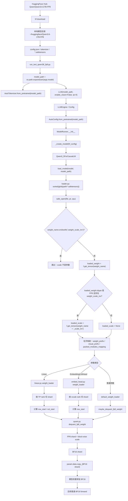
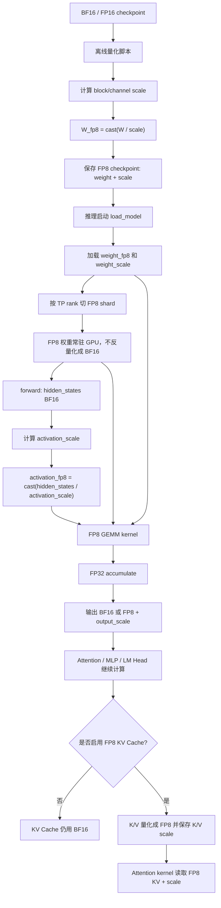

# nano-vLLM-qwen3.6 大方向三详解：FP8 checkpoint 加载与真正 FP8 推理原理

> 本文展开《nano-vLLM-qwen3.6 整体改动宏观分析》中的第三个大方向：
>
> **FP8 checkpoint 加载 —— 不是 runtime FP8，而是加载时反量化**
>
> 重点回答两个问题：
>
> 1. `nano-vllm-qwen3.6` 这个项目里实现的 FP8 到底是什么流程？模型权重从哪里来、存在哪里、哪个脚本调用、哪个源码文件加载、如何反量化、最后 forward 怎么跑？
> 2. 如果要“真正实现 FP8 量化推理”，应该怎么做？原理是什么？和当前项目的实现差在哪里？

---

## 1. 总结先行：这个项目实现的是“FP8 checkpoint 加载时反量化”，不是完整 FP8 推理

`nano-vllm-qwen3.6` 支持的是：

```text
磁盘 checkpoint 是 FP8 权重
  ↓
启动时读取 safetensors
  ↓
读取 FP8 weight + weight_scale_inv
  ↓
按 tensor parallel rank 切 shard
  ↓
按 block-wise scale 反量化
  ↓
得到 BF16 权重
  ↓
复制到模型参数
  ↓
后续 forward 主要按 BF16 权重推理
```

所以它更准确的名称是：

```text
FP8 checkpoint loading compatibility
rank-local load-time FP8 dequantization
```

而不是：

```text
runtime FP8 inference
native FP8 GEMM
FP8 activation quantization
FP8 KV Cache
```

项目 README 明确说明：Qwen3.6-27B-FP8 会在 FP8 block dequantization 后以 BF16 weights 的形式加载；native FP8 matmul kernels 还没有实现。它还说明当前 Qwen3.6-27B-FP8 目标是 text-only，并建议使用 `enable_vision=False`。

---

## 2. 这个方向涉及哪些文件

这一方向主要涉及下面这些文件：

| 文件 | 作用 |
|---|---|
| `README.md` | 说明模型下载位置、Qwen3.6 FP8 的运行方式和当前限制 |
| `run_text_qwen36_fp8.py` | Qwen3.6-27B-FP8 text-only smoke test 入口 |
| `config.py` | 从本地模型目录读取 HF config，决定 dtype、model_type、vision_config、is_hybrid |
| `model_runner.py` | 创建模型，然后调用 `load_model()` 加载 checkpoint |
| `loader.py` | 遍历 safetensors，读取 FP8 weight 和 `weight_scale_inv`，完成参数名映射 |
| `quant.py` | 真正执行 block-wise FP8 到 BF16 的反量化 |
| `linear.py` | TP linear 层的 weight_loader，按 rank 切 shard 后调用 `quant.py` |
| `embed_head.py` | VocabParallelEmbedding / ParallelLMHead 的 FP8 shard 反量化 |
| `qwen3_5.py` | 提供 `weight_prefix`、`visual_prefix`、`packed_modules_mapping`，帮助 loader 对齐 checkpoint 名字 |

---

## 3. 端到端流程：从下载模型到完成一次 BF16 forward

完整链路如下：

```text
HuggingFace 下载 Qwen3.6-27B-FP8
  ↓
保存到 ~/huggingface/Qwen3.6-27B-FP8
  ↓
运行 run_text_qwen36_fp8.py
  ↓
LLM(model_path, enable_vision=False, tp=4, ...)
  ↓
Config(model_path)
  ↓
AutoConfig.from_pretrained(model_path)
  ↓
ModelRunner.__init__
  ↓
_create_model(hf_config)
  ↓
Qwen3_5ForCausalLM
  ↓
load_model(model, model_path)
  ↓
loader.py 遍历 *.safetensors
  ↓
读取 FP8 weight 和 weight_scale_inv
  ↓
根据 prefix / packed_modules_mapping 找到参数
  ↓
linear.py / embed_head.py 按 TP rank 切 shard
  ↓
quant.py 做 block-wise dequant
  ↓
BF16 weight copy 到 param.data
  ↓
warmup / allocate_kv_cache / allocate_gdn_state / capture_cuda_graph
  ↓
generate
  ↓
普通 BF16 forward
```

下面展开每一步。

---

## 4. 第一步：模型权重从哪里下载，存在哪里

项目 README 建议把模型权重放在仓库外部，例如：

```text
~/huggingface/Qwen3.6-27B-FP8
```

并给出了类似下面的下载命令：

```bash
hf download Qwen/Qwen3.6-27B-FP8 \
  --local-dir ~/huggingface/Qwen3.6-27B-FP8 \
  --max-workers 8
```

这说明：

```text
1. 权重不是放在 nano-vllm-qwen3.6 仓库里。
2. 权重是一个本地 HuggingFace 模型目录。
3. 目录里通常包含 config.json、tokenizer 文件和多个 *.safetensors 文件。
4. loader.py 不负责下载，只负责从本地目录读取。
```

所以项目的权重来源链路是：

```text
HuggingFace Hub
  ↓ hf download
本地目录 ~/huggingface/Qwen3.6-27B-FP8
  ↓
nano-vLLM-qwen3.6 从这个本地目录加载
```

---

## 5. 第二步：运行脚本如何指定模型路径

`run_text_qwen36_fp8.py` 是 Qwen3.6 FP8 text-only 的 smoke test 脚本。

它默认参数大致是：

```python
--model ~/huggingface/Qwen3.6-27B-FP8
--devices 0,1,2,3
--tp 4
```

脚本内部做：

```python
model_path = os.path.expanduser(args.model)

llm = LLM(
    model_path,
    enable_vision=False,
    tensor_parallel_size=args.tp,
    ...
)
```

这说明：

```text
1. 脚本不直接加载 safetensors。
2. 脚本只是把本地模型目录传给 LLM。
3. enable_vision=False 表示当前 Qwen3.6 FP8 路径只跑 text-only。
4. tensor_parallel_size=args.tp 决定启动多少个 TP rank。
```

---

## 6. 第三步：Config 读取本地模型目录

`LLM` / `LLMEngine` 会创建：

```python
Config(model_path, ...)
```

`Config.__post_init__()` 中会调用：

```python
AutoConfig.from_pretrained(self.model)
```

这一步会从本地模型目录读取 HuggingFace config。

它会决定：

```text
1. 模型类型 model_type
2. hidden_size / num_layers / head_dim 等结构参数
3. dtype
4. 是否有 text_config / vision_config
5. 是否有 layer_types，从而判断是否是 hybrid
```

对于 Qwen3.6 / Qwen3.5 hybrid 类模型，`config.is_hybrid` 通常由：

```python
hasattr(self.hf_config, "layer_types")
```

判断。

所以 Config 的职责是：

```text
把本地模型目录中的 HuggingFace 配置转换成 nano-vLLM 运行时需要的 Config 对象。
```

---

## 7. 第四步：ModelRunner 创建模型并调用 loader

`ModelRunner.__init__()` 中的关键顺序是：

```text
1. 初始化分布式环境
2. 设置默认 dtype/device
3. 创建模型
4. 调用 load_model()
5. 创建 sampler
6. 分配 runtime buffers
7. warmup model
8. allocate kv cache
9. 如果 hybrid，allocate gdn state
10. capture cuda graph
```

其中和 FP8 最相关的是：

```python
self.model = _create_model(hf_config, vision_config=config.vision_config)
self.load_result = load_model(self.model, config.model, log_fn=self._log)
```

也就是说：

```text
FP8 checkpoint 加载的真正入口是 model_runner.py 中的 load_model() 调用。
```

---

## 8. 第五步：_create_model 选择 Qwen3_5ForCausalLM

`_create_model()` 会根据 HuggingFace config 的 `model_type` 选择模型类。

逻辑可以概括为：

```text
if "qwen3_5" in model_type:
    Qwen3_5ForCausalLM
else:
    Qwen3ForCausalLM
```

Qwen3.6 FP8 在这个项目里通常复用的是 `Qwen3_5ForCausalLM` 这套 hybrid 模型实现。

这意味着：

```text
Qwen3.6 FP8 的加载不是只改 loader；
它要先创建出能够接收这些权重的 qwen3_5/qwen3.6 hybrid 模型结构。
```

---

## 9. 第六步：loader.py 遍历 safetensors 文件

`loader.py` 的核心逻辑是：

```python
files = sorted(glob(os.path.join(path, "*.safetensors")))
for file in files:
    with safe_open(file, "pt", "cpu") as f:
        for weight_name in f.keys():
            ...
```

关键点：

```text
1. 它只扫描本地模型目录下的 *.safetensors。
2. 它使用 safetensors.safe_open 在 CPU 上读取 tensor。
3. 它不会下载模型。
4. 它不会把所有权重一次性完整读进 GPU。
5. 它逐个 tensor 读取、映射、切片、反量化、copy。
```

---

## 10. 第七步：loader.py 如何识别 FP8 weight 和 scale

FP8 checkpoint 中通常会有两类 tensor：

```text
xxx.weight
xxx.weight_scale_inv
```

其中：

```text
xxx.weight:
    FP8 权重

xxx.weight_scale_inv:
    用于反量化的 block-wise scale
```

`loader.py` 会先跳过：

```python
if weight_name.endswith(".weight_scale_inv"):
    continue
```

原因是：

```text
weight_scale_inv 不是模型参数本身；
它只是 xxx.weight 的反量化辅助元数据。
```

然后对每个真正的 weight：

```python
scale_name = weight_name + "_scale_inv"

loaded_scale = (
    f.get_tensor(scale_name)
    if loaded_weight.dtype == torch.float8_e4m3fn and scale_name in weight_names
    else None
)
```

所以判断逻辑是：

```text
如果 weight 是 torch.float8_e4m3fn
并且 safetensors 中存在对应的 weight_scale_inv
则把 loaded_scale 传给 weight_loader

否则 loaded_scale = None
```

这使得同一套 loader 同时兼容：

```text
普通 FP16/BF16 checkpoint
FP8 checkpoint
```

---

## 11. 第八步：loader.py 负责权重名字映射

Qwen3.6 / Qwen3.5 checkpoint 的权重名和 nano-vLLM 模型参数名可能不完全一致。

`Qwen3_5ForCausalLM` 中定义：

```python
weight_prefix = "model.language_model."
visual_prefix = "model.visual."
packed_modules_mapping = {
    "gate_proj": ("gate_up_proj", 0),
    "up_proj": ("gate_up_proj", 1),
}
```

loader 会根据这些属性做三类映射。

### 11.1 语言模型前缀映射

checkpoint 可能是：

```text
model.language_model.layers.0.xxx
```

nano-vLLM 模型里可能是：

```text
model.layers.0.xxx
```

所以 loader 需要：

```text
model.language_model.* → model.*
```

### 11.2 视觉模型前缀映射

如果存在视觉模型权重，checkpoint 可能是：

```text
model.visual.xxx
```

nano-vLLM 模型里是：

```text
visual.xxx
```

所以 loader 需要：

```text
model.visual.* → visual.*
```

不过 Qwen3.6 FP8 text-only 通常 `enable_vision=False`，所以视觉路径可能不会启用。

### 11.3 packed modules 映射

MLP 中 HuggingFace checkpoint 可能有：

```text
gate_proj.weight
up_proj.weight
```

nano-vLLM 中为了计算效率合并成：

```text
gate_up_proj.weight
```

所以 loader 会把：

```text
gate_proj → gate_up_proj shard 0
up_proj   → gate_up_proj shard 1
```

并把 `shard_id` 一起传给 `MergedColumnParallelLinear.weight_loader()`。

---

## 12. 第九步：linear.py 按 TP rank 切 shard 后再反量化

为什么不能在 loader.py 直接对完整权重反量化？

因为 tensor parallel 下，每张 GPU 只需要完整权重的一部分。

例如：

```text
ColumnParallelLinear:
    按输出维切分，也就是按 weight 的行切分

RowParallelLinear:
    按输入维切分，也就是按 weight 的列切分

MergedColumnParallelLinear:
    gate/up 合并权重，需要先定位 shard_id，再按 TP rank 切分

QKVParallelLinear:
    q/k/v 三段分别切分
```

`linear.py` 的做法是：

```text
1. param_data 是当前 rank 需要的参数形状。
2. 根据 param_data 和 tp_rank 算出 start_idx。
3. 从 loaded_weight 中 narrow 出当前 rank 的 shard。
4. 根据切分维度计算 row_start / col_start。
5. 调用 maybe_dequant_fp8_weight(shard, loaded_scale, row_start, col_start)。
6. 把反量化后的 BF16 shard copy 到 param.data。
```

这叫：

```text
rank-local FP8 dequantization
```

优点：

```text
每张卡只反量化自己需要的权重 shard；
不需要先把完整 FP8 权重反量化成完整 BF16 权重再切分；
降低 CPU/GPU 临时内存压力。
```

---

## 13. 第十步：embed_head.py 处理 vocab parallel 权重

Embedding 和 LM Head 的权重按 vocab 维度切分。

对 `VocabParallelEmbedding` 来说：

```text
rank0 持有 vocab 的第 0 段
rank1 持有 vocab 的第 1 段
...
```

因此它的 weight_loader 做：

```python
start_idx = self.tp_rank * shard_size
loaded_weight = loaded_weight.narrow(0, start_idx, shard_size)
loaded_weight = maybe_dequant_fp8_weight(
    loaded_weight, loaded_scale, row_start=start_idx
)
```

这说明：

```text
Embedding / LM Head 也不能直接 copy FP8；
它们同样要根据 vocab 起始行 row_start 找对应 scale block。
```

---

## 14. 第十一步：quant.py 执行 block-wise FP8 反量化

`quant.py` 是这一方向的数学核心。

它的输入是：

```python
weight: torch.Tensor
scale_inv: torch.Tensor
row_start: int
col_start: int
block_size: tuple[int, int] = (128, 128)
```

也就是：

```text
weight:
    当前 rank 当前参数要加载的 FP8 shard

scale_inv:
    完整权重对应的 block-wise scale tensor

row_start / col_start:
    当前 shard 在完整矩阵中的起始坐标

block_size:
    默认 128 × 128
```

核心逻辑：

```text
1. 根据 row_start / col_start 和当前 shard shape，计算覆盖哪些 scale block。
2. 从 scale_inv 中切出对应 scale blocks。
3. repeat_interleave 把 block scale 展开成逐元素 scale。
4. 根据 row_offset / col_offset 裁剪到和 weight 同 shape。
5. 执行 weight.float() * scale.float()。
6. 转成 torch.bfloat16 返回。
```

公式可以写成：

```text
BF16_weight = FP8_weight × dequant_scale
```

注意，这里变量名叫 `scale_inv`，checkpoint 里叫 `weight_scale_inv`，但代码使用方式是：

```python
weight.float() * scale.float()
```

所以在这个实现里，它被当作“反量化时乘上的 scale”使用。

---

## 15. 第十二步：模型参数最终是什么 dtype？

反量化结果：

```python
return (weight.float() * scale.float()).to(torch.bfloat16)
```

所以最终复制到模型参数中的权重是：

```text
BF16
```

不是：

```text
FP8
```

因此后续 forward 中：

```text
Linear / Attention / MLP
```

主要仍按 BF16 参数计算。

README 也说明当前 Qwen3.6-27B-FP8 是 BF16-resident，因此启动慢，因为原始 FP8 checkpoint 要在启动时转换；如果有预转换好的 TP-sharded checkpoint，启动会更快。

---

## 16. 当前项目 FP8 链路结构图



---

## 17. 当前项目 FP8 实现的优点

### 17.1 兼容 FP8 checkpoint

即使 checkpoint 权重是 FP8，也能成功加载进 nano-vLLM 模型。

这解决了：

```text
原版 loader 只能直接 copy FP16/BF16/FP32 权重
```

的问题。

### 17.2 支持 tensor parallel 下的 rank-local dequant

每个 TP rank 只处理自己拥有的 shard。

这比：

```text
完整权重反量化 → 再切 shard
```

更节省临时内存。

### 17.3 支持 block-wise scale

不是整个矩阵一个 scale，而是默认按：

```text
128 × 128 block
```

取 scale。

block-wise scale 比 per-tensor scale 精度更好。

### 17.4 对 forward 侵入小

因为加载后是 BF16 参数，所以 forward 不需要立刻写 FP8 GEMM kernel。

这使得项目能用较少代码先跑通：

```text
Qwen3.6-27B-FP8 text-only
```

---

## 18. 当前项目 FP8 实现的局限

### 18.1 不节省运行时权重显存到 FP8 级别

因为最终模型参数是 BF16。

所以运行时权重显存接近：

```text
BF16 模型显存
```

而不是：

```text
FP8 模型显存
```

这也是为什么 README 中提到 TP=2 在 24GB 卡上放不下，而 TP=4 才能验证。

### 18.2 不加速 GEMM

forward 中线性层仍然主要是：

```python
F.linear(x, self.weight)
```

其中 `self.weight` 是 BF16。

所以不会获得 native FP8 Tensor Core GEMM 的速度收益。

### 18.3 启动慢

因为每次启动都要：

```text
读取 FP8
读取 scale
展开 scale
乘法反量化
转 BF16
copy 到参数
```

这会增加启动时间。

### 18.4 没有 FP8 activation quantization

真正 FP8 GEMM 通常需要：

```text
activation 也量化成 FP8
weight 是 FP8
GEMM 输入是 FP8 × FP8
accumulate 到 FP32/BF16
输出再 dequant 或转 BF16
```

当前项目没有这条完整链路。

### 18.5 没有 FP8 KV Cache

当前项目没有把 KV Cache 存成 FP8。

也就是说：

```text
attention.py 的 k_cache/v_cache 仍按模型 dtype 分配和使用；
store_kvcache 没有写 K/V scale；
flash_attn_with_kvcache 也没有读取 FP8 KV + scale 的自定义逻辑。
```

所以它不是 FP8 KV Cache 项目。

---

## 19. 真正的 FP8 量化原理是什么？

### 19.1 量化的本质

量化的目标是：

```text
用更低 bit 的数表示原本高精度的数。
```

对于 FP8 权重量化，基本思想是：

```text
高精度权重 W_fp16 / W_bf16
  ↓
选择 scale
  ↓
W_scaled = W / scale
  ↓
cast / round / clamp 到 FP8 可表示范围
  ↓
得到 W_fp8
```

反量化时：

```text
W_hat = W_fp8 × scale
```

其中：

```text
W_hat
```

是对原始权重的近似。

### 19.2 为什么需要 scale

FP8 的数值范围和精度都有限。

不同层、不同矩阵、不同 block 的数值分布差异很大。

如果没有 scale，很多值会：

```text
过大 → overflow / clamp
过小 → underflow / 变成 0
```

scale 的作用是：

```text
把当前 tensor 或 block 的数值范围映射到 FP8 能表达的范围内。
```

### 19.3 per-tensor、per-channel、per-block scale

常见 scale 粒度有三种。

```text
per-tensor scale:
    整个矩阵一个 scale
    元数据少，但精度差

per-channel scale:
    每一行或每一列一个 scale
    精度更好，但 scale 更多

per-block scale:
    每个小 block 一个 scale，例如 128×128
    精度和元数据开销折中
```

当前项目的 `quant.py` 假设的是：

```text
block-wise scale
默认 block_size = (128, 128)
```

---

## 20. 真正实现 runtime FP8 推理应该怎么做？

真正 FP8 推理不是“把 FP8 checkpoint 读进来再转 BF16”。

真正 FP8 推理至少要做到：

```text
权重 FP8 常驻
activation 动态量化成 FP8
GEMM 使用 FP8 kernel
输出按 scale 反量化或继续保持低精度
```

完整链路可以分为 7 个部分。

---

## 21. 真正 FP8 推理第一步：权重离线量化并保存

需要一个离线转换脚本：

```text
输入:
    BF16 / FP16 checkpoint

处理:
    对每个 Linear / Embedding / LM Head 权重选择量化粒度
    计算 scale
    W_fp8 = cast(W / scale)
    保存 W_fp8 和 scale

输出:
    FP8 checkpoint
```

保存格式可以类似：

```text
xxx.weight             # FP8 tensor
xxx.weight_scale_inv   # dequant scale
```

这一步当前项目“使用已有 FP8 checkpoint”，但没有提供完整的 BF16 → FP8 离线量化工具链。

---

## 22. 真正 FP8 推理第二步：加载后保持 FP8 权重常驻

当前项目：

```text
load FP8 weight
  ↓
dequant to BF16
  ↓
param.data = BF16
```

真正 FP8 推理应该是：

```text
load FP8 weight
  ↓
param / buffer 保持 FP8
  ↓
同时保存 scale
  ↓
forward 时使用 FP8 GEMM
```

也就是说，Linear 层中不应该只有：

```python
self.weight: BF16 Parameter
```

而应该有类似：

```text
self.weight_fp8
self.weight_scale
```

甚至还要区分：

```text
column parallel shard 的 scale
row parallel shard 的 scale
merged shard 的 scale
```

---

## 23. 真正 FP8 推理第三步：activation 动态量化

GEMM 的输入通常是：

```text
activation × weight
```

如果 weight 是 FP8，但 activation 仍是 BF16，可能只能走混合路径或需要 kernel 内转换。

典型 FP8 GEMM 要做：

```text
activation_bf16
  ↓
计算 activation scale
  ↓
activation_fp8 = cast(activation_bf16 / activation_scale)
  ↓
FP8 GEMM
```

activation scale 可以是：

```text
per-tensor
per-token
per-channel
per-block
```

不同粒度影响：

```text
精度
kernel 复杂度
scale 存储开销
吞吐性能
```

---

## 24. 真正 FP8 推理第四步：使用 FP8 GEMM kernel

需要把当前：

```python
F.linear(x, self.weight)
```

替换成：

```text
fp8_linear(x_fp8, weight_fp8, x_scale, w_scale)
```

底层可以是：

```text
cuBLASLt FP8 matmul
Transformer Engine
Triton custom FP8 GEMM
CUTLASS FP8 kernel
```

输出通常会：

```text
FP8 × FP8 → FP32 accumulate → BF16 output
```

或者：

```text
FP8 × FP8 → FP32 accumulate → FP8 output + output scale
```

具体取决于后续算子是否也支持 FP8。

---

## 25. 真正 FP8 推理第五步：维护 scale 的生命周期

一旦 runtime 使用 FP8，scale 不再只是 loader 的临时变量，而是模型运行时的一部分。

需要维护：

```text
weight_scale:
    离线固定，随 checkpoint 加载

activation_scale:
    运行时计算，可能每个 batch / 每个 token 都不同

output_scale:
    如果输出也要 FP8，需要继续计算或传递

kv_scale:
    如果 KV Cache 也 FP8，需要为 K/V 存 scale
```

这意味着 scale 需要进入：

```text
Linear forward
Attention QKV projection
MLP gate/up/down
LM Head
CUDA Graph 输入或静态 buffer
```

不是简单在 loader 里传一次就结束。

---

## 26. 真正 FP8 推理第六步：如果要做 FP8 KV Cache，还要改 attention.py

FP8 KV Cache 是另一个独立方向。

当前 KV Cache 保存的是：

```text
K/V high precision tensor
```

FP8 KV Cache 要变成：

```text
K_cache_fp8
V_cache_fp8
K_scale
V_scale
```

写入时：

```text
当前 K/V BF16
  ↓
计算 K/V scale
  ↓
cast 到 FP8
  ↓
写入 K_cache_fp8 / V_cache_fp8
  ↓
保存对应 scale
```

读取 attention 时：

```text
读取 FP8 K/V
读取 K/V scale
在 attention kernel 内反量化或直接做 FP8 dot
```

这需要修改：

```text
model_runner.allocate_kv_cache
attention.store_kvcache
attention.forward
flash attention kernel / 自定义 attention kernel
Context 中可能还要传 KV scale metadata
```

所以 FP8 KV Cache 不是改 `quant.py` 就能完成的。

---

## 27. 真正 FP8 推理第七步：和 Tensor Parallel / CUDA Graph 兼容

runtime FP8 还必须和系统层配合。

### 27.1 Tensor Parallel

每个 rank 持有不同权重 shard。

所以必须保证：

```text
weight_fp8 shard 和 weight_scale shard 对齐
activation scale 在 rank 间语义一致
RowParallelLinear 的 all_reduce 前后 dtype/scale 正确
LM Head vocab shard 的 token/score 汇聚正确
```

### 27.2 CUDA Graph

CUDA Graph 要求：

```text
输入 tensor shape 和地址稳定
```

如果 activation scale 是每步动态计算，仍然要把相关 buffer 设计成：

```text
固定地址
可 replay
```

否则 decode graph capture 会失败或 replay 不安全。

### 27.3 Correctness 验证

需要比较：

```text
BF16 baseline logits
FP8 runtime logits
per-layer error
最终生成 token 一致率
困惑度 / benchmark accuracy
```

不能只看“能跑出文字”。

---

## 28. 真正 FP8 推理完整结构图



---

## 29. 当前项目 vs 真正 FP8 推理：对比表

| 对比项 | 当前 nano-vllm-qwen3.6 | 真正 runtime FP8 推理 |
|---|---|---|
| checkpoint | FP8 weight + scale | FP8 weight + scale |
| 加载时 | 读 FP8，立刻反量化成 BF16 | 读 FP8，保持 FP8 常驻 |
| 参数 dtype | BF16 | FP8 weight + scale |
| Linear forward | `F.linear(BF16, BF16)` | FP8 GEMM kernel |
| activation | BF16 | 动态量化为 FP8 |
| accumulate | 普通 PyTorch 线性层内部处理 | 通常 FP32 accumulate |
| 输出 | BF16 / normal tensor | BF16 或 FP8 + output scale |
| 显存节省 | 不明显，权重常驻 BF16 | 权重显存约减半 |
| 速度收益 | 无 native FP8 GEMM 收益 | 取决于硬件和 kernel，有潜在收益 |
| KV Cache | 非 FP8 | 可选 FP8 KV + scale |
| 主要改动文件 | `loader.py`、`quant.py`、`linear.py`、`embed_head.py` | 还要改 Linear forward、attention kernel、KV cache、CUDA Graph、scale manager |
| 项目定位 | 兼容 FP8 checkpoint | 真正低精度推理引擎 |

---

## 30. 如果你要在这个项目上继续实现“真正 FP8”，应该怎么改

可以按优先级分三阶段。

### 阶段一：权重常驻 FP8 + FP8 Linear prototype

目标：

```text
先让某一类 Linear 层不再加载为 BF16，而是保存 FP8 weight + scale。
```

需要改：

```text
linear.py
loader.py
quant.py
```

思路：

```text
1. loader 仍读取 weight 和 scale。
2. weight_loader 不调用 maybe_dequant_fp8_weight。
3. 保存 weight_fp8 和 weight_scale。
4. forward 使用一个 fp8_linear kernel。
5. 先只支持 ReplicatedLinear 或 ColumnParallelLinear。
6. 对比输出误差。
```

### 阶段二：扩展到所有 Linear / MLP / Attention projection

目标：

```text
Q/K/V projection、O projection、MLP gate/up/down 都走 FP8 GEMM。
```

需要处理：

```text
ColumnParallelLinear
RowParallelLinear
MergedColumnParallelLinear
QKVParallelLinear
GatedDeltaNet 的 in_proj_qkv / in_proj_z / in_proj_b / in_proj_a
```

同时要保证：

```text
TP shard scale 正确
RowParallel all_reduce 前后 dtype 正确
CUDA Graph decode 能 replay
```

### 阶段三：FP8 KV Cache

目标：

```text
decode 长上下文时降低 KV Cache 显存和带宽压力。
```

需要改：

```text
model_runner.allocate_kv_cache:
    分配 FP8 K/V cache + scale cache

attention.store_kvcache:
    写入前量化 K/V

attention.forward:
    decode attention 读取 FP8 K/V 和 scale

可能需要自定义 Triton/FlashAttention kernel:
    支持 FP8 KV dequant 或 FP8 attention
```

这是难度最高但简历价值也很高的方向。

---

## 31. 面试回答版

如果面试官问：

> 你这个项目里的 FP8 量化是怎么做的？

可以这样回答：

```text
这个项目实现的是 FP8 checkpoint 的加载兼容，而不是完整 runtime FP8 推理。模型权重先通过 README 中的 hf download 下载到本地目录，例如 ~/huggingface/Qwen3.6-27B-FP8。运行 run_text_qwen36_fp8.py 时，脚本把这个本地路径传给 LLM，并设置 enable_vision=False、tensor_parallel_size=4。LLMEngine 创建 Config，Config 通过 AutoConfig.from_pretrained 读取本地模型配置；ModelRunner 创建 Qwen3_5ForCausalLM 后调用 load_model。

load_model 会遍历模型目录下的 safetensors 文件。对于 xxx.weight_scale_inv，它不会当作普通参数加载，而是跳过；对于 xxx.weight，如果 dtype 是 torch.float8_e4m3fn 并且存在 xxx.weight_scale_inv，就把这个 scale 作为 loaded_scale 传给参数自己的 weight_loader。loader 还负责处理 model.language_model 前缀、model.visual 前缀以及 gate_proj/up_proj 到 gate_up_proj 的 packed module 映射。

具体反量化发生在 linear.py、embed_head.py 和 quant.py。linear/embed 的 weight_loader 先根据 tensor parallel rank 切出当前 rank 的 shard，并计算这个 shard 在完整权重矩阵中的 row_start/col_start；然后调用 maybe_dequant_fp8_weight。quant.py 根据 row_start/col_start 从 block-wise scale 中取出对应 block，展开并裁剪到和 shard 相同 shape，执行 weight.float() * scale.float()，最后转成 BF16。最终 copy 到 param.data 的是 BF16 权重，所以后续 forward 仍然是 BF16-resident，不是 native FP8 GEMM。
```

如果继续问：

> 那真正的 FP8 推理应该怎么做？

可以这样回答：

```text
真正的 FP8 推理需要让 FP8 权重常驻 GPU，并在 forward 中使用 FP8 GEMM kernel，而不是加载时反量化成 BF16。通常流程是离线把 BF16 权重量化成 FP8 并保存 scale；推理时加载 FP8 weight 和 scale，Linear forward 时把 activation 也动态量化成 FP8，调用 cuBLASLt、Transformer Engine、Triton 或 CUTLASS 的 FP8 GEMM kernel，通常 FP8×FP8、FP32 accumulate，输出 BF16 或继续以 FP8+scale 形式传递。如果还想节省 KV Cache，就需要把 K/V cache 也改成 FP8 存储，同时维护 K/V scale，并修改 attention kernel 在读取时反量化或直接支持 FP8 attention。也就是说，真正 FP8 涉及 loader、linear forward、activation scale、GEMM kernel、attention/KV cache 和 CUDA Graph 的系统性改造。
```

---

## 32. 最终总结

这一大方向的核心可以用一句话概括：

```text
nano-vllm-qwen3.6 当前不是实现了完整 FP8 推理，而是实现了 FP8 checkpoint 到 BF16 resident model 的加载时反量化链路。
```

当前链路是：

```text
FP8 safetensors
  ↓
loader.py 读取 weight 和 weight_scale_inv
  ↓
linear.py / embed_head.py 根据 TP rank 切 shard
  ↓
quant.py 做 block-wise FP8 → BF16 dequant
  ↓
BF16 参数进入模型
  ↓
普通 BF16 forward
```

真正 FP8 推理则需要：

```text
FP8 权重常驻
activation FP8 动态量化
FP8 GEMM kernel
scale runtime 管理
可选 FP8 KV Cache
attention kernel 支持
CUDA Graph / TP / correctness 全链路适配
```

因此，你在简历或面试中表述这个项目时，建议写：

```text
支持 Qwen3.6 FP8 checkpoint 的 rank-local load-time dequantization。
```

不要写成：

```text
实现了完整 FP8 runtime inference。
```


%% 项目关联导航：开始 %%
## 项目关联导航

- 所属模块：[[outputs/项目整理/模块-nano-vllm-qwen3.6|模块-nano-vllm-qwen3.6]]

%% 项目关联导航：结束 %%
