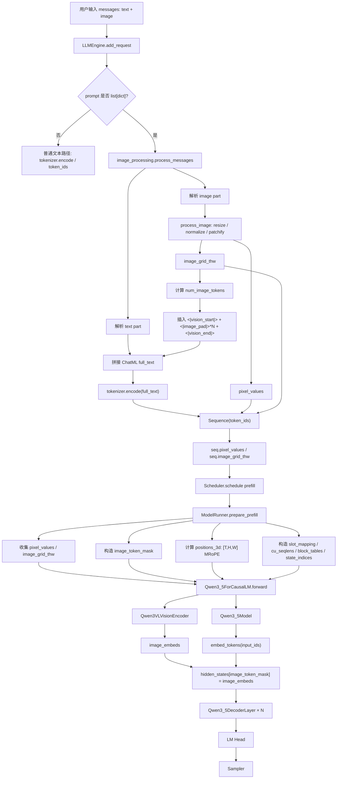
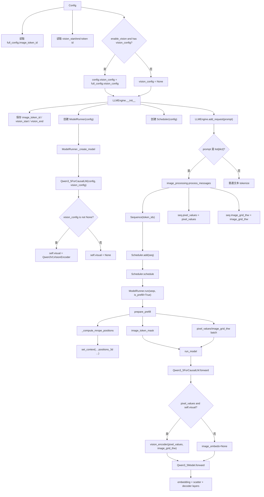
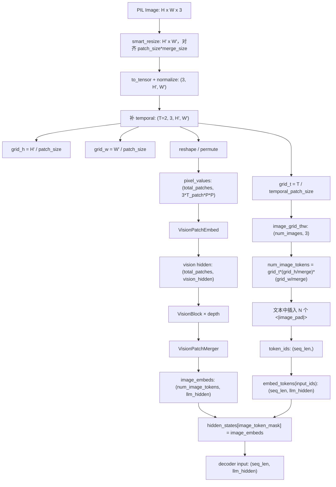
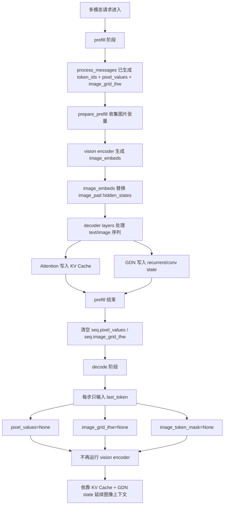
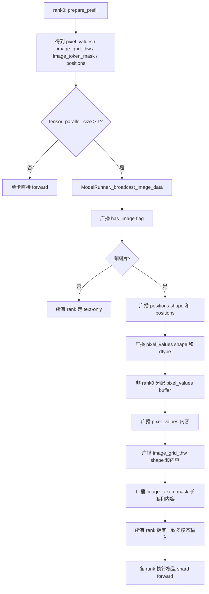

# nano-vLLM-qwen3.6 大方向四详解：多模态输入支持链路

> 本文展开《nano-vLLM-qwen3.6 整体改动宏观分析》中的第四个大方向：
>
> **多模态输入支持 —— 从纯文本 prompt 到 messages + image**
>
> 目标是把下面两个问题讲清楚：
>
> 1. 多模态输入方向涉及哪些代码文件？这些文件怎么互相调用、怎么传递数据、各自承担什么职责？
> 2. 从用户传入 `messages`，到图片被 vision encoder 编码，再到 image embeddings 进入 Qwen3.5/Qwen3.6 hybrid decoder，中间完整链路是什么？

---

## 1. 总结先行：多模态不是“多传一个 pixel_values”，而是一整条 prefill 链路

原版 nano-vLLM 的输入链路很简单：

```text
prompt: str
  ↓ tokenizer.encode
token_ids
  ↓ Sequence
  ↓ Scheduler
  ↓ ModelRunner
  ↓ Qwen3 dense model
```

`nano-vllm-qwen3.6` 为了支持 Qwen-VL / Qwen3.5-VL 类多模态模型，把入口扩展成：

```text
messages: list[dict]
  ↓
text part + image part
  ↓
token_ids + pixel_values + image_grid_thw
  ↓
Sequence 临时保存图片张量
  ↓
ModelRunner.prepare_prefill 构造 image_token_mask 和 3D MRoPE positions
  ↓
Qwen3VLVisionEncoder(pixel_values, image_grid_thw)
  ↓
image_embeds
  ↓
hidden_states[image_token_mask] = image_embeds
  ↓
Qwen3_5DecoderLayer × N
```

所以多模态方向的关键不是某一个文件，而是多个文件协同：

```text
Config:
    决定有没有 vision_config，读取 image token id

LLMEngine:
    判断输入是不是 messages，调用 process_messages

image_processing.py:
    把图片变成 pixel_values/image_grid_thw，并在文本中插 image_pad tokens

Sequence:
    临时携带 pixel_values/image_grid_thw

Scheduler:
    正常调度 prefill 请求，不直接处理图片内容

ModelRunner:
    batch 化图片张量，计算 image_token_mask 和 MRoPE 3D positions

Qwen3_5ForCausalLM:
    调用 vision encoder 得到 image_embeds

Qwen3_5Model:
    把 image_embeds scatter 到 image token hidden_states

VisionEncoder:
    真正把图片 patch 编码成视觉 embedding

RotaryEmbedding:
    给语言模型侧 image token 提供 3D MRoPE 位置编码
```

一句话概括：

```text
image_processing.py 负责“把图片整理成模型输入”；
vision_encoder.py 负责“看图”；
qwen3_5.py 负责“把图像 embedding 融入语言 token 序列”；
model_runner.py 负责“把这些张量组织成一次 prefill forward”。
```

---

## 2. 这个方向要解决什么问题

原版 nano-vLLM 的输入只有文本：

```text
prompt
  ↓
token_ids
```

但多模态模型需要同时满足三件事：

```text
1. 文本 token 序列中要有 image placeholder token。
2. 图片本身要被处理成 vision encoder 需要的 pixel_values。
3. 语言模型要知道 image token 的 3D 位置，用 MRoPE 编码 T/H/W。
```

这三个条件缺一不可。

如果只有图片 tensor，没有 image placeholder：

```text
语言模型不知道 image_embeds 应该放到 token 序列哪里。
```

如果只有 image placeholder，没有 pixel_values：

```text
模型看到的是空占位符，没有真实图像内容。
```

如果有 image_embeds 但没有正确 3D positions：

```text
语言模型 attention 不知道这些 image token 来自图像的哪一行、哪一列、哪一帧。
```

所以 qwen3.6 版本新增的是一条完整链路：

```text
messages 解析
  ↓
图片预处理
  ↓
placeholder token 对齐
  ↓
Sequence 携带图像张量
  ↓
prefill batch 整理
  ↓
vision encoder
  ↓
image_embeds scatter
  ↓
MRoPE 位置编码
```

---

## 3. 文件职责总表

| 文件 | 在多模态链路中的职责 | 关键数据 |
|---|---|---|
| `config.py` | 从 HF config 读取 vision_config 和特殊 token id | `enable_vision`、`vision_config`、`image_token_id` |
| `llm_engine.py` | 识别 `list[dict] messages`，调用 `process_messages` | `token_ids`、`pixel_values`、`image_grid_thw` |
| `image_processing.py` | 图片 resize/normalize/patchify，插入 `<|image_pad|>` | `pixel_values`、`image_grid_thw`、placeholder |
| `sequence.py` | 每个请求临时保存多模态张量 | `seq.pixel_values`、`seq.image_grid_thw` |
| `scheduler.py` | 正常调度 Sequence，分配 KV/GDN state | 不直接处理图片 tensor |
| `model_runner.py` | prefill 时组织多模态 batch，计算 MRoPE 3D positions 和 mask | `image_token_mask`、`positions_3d` |
| `vision_encoder.py` | 把图片 patch 编码成 image embeddings | `image_embeds` |
| `qwen3_5.py` | 创建可选 visual encoder；把 image_embeds scatter 到 hidden_states | `hidden_states[image_token_mask]` |
| `rotary_embedding.py` | 语言模型 attention 中支持 1D/3D MRoPE | `InterleavedMRoPE` |
| `loader.py` | 加载视觉塔权重时做 `model.visual.* -> visual.*` 映射 | `visual_prefix` |

---

## 4. `config.py`：多模态能力的第一道开关

`Config` 中新增了多模态相关字段：

```python
enable_vision: bool = True
vision_config: object | None = None
image_token_id: int = -1
vision_start_token_id: int = -1
vision_end_token_id: int = -1
```

初始化时，它会从完整 HF config 中读取：

```text
image_token_id
vision_start_token_id
vision_end_token_id
vision_config
```

其中最关键的逻辑是：

```python
if self.enable_vision and hasattr(self.full_config, 'vision_config'):
    self.vision_config = self.full_config.vision_config
```

这说明视觉 encoder 不是无条件创建的，而是同时依赖：

```text
1. 用户/脚本没有关闭 enable_vision
2. 模型 config 中确实存在 vision_config
```

如果运行 text-only Qwen3.6 FP8 脚本时设置：

```python
enable_vision=False
```

那么：

```text
vision_config 不会传入模型
Qwen3_5ForCausalLM 也不会创建 visual encoder
```

所以多模态链路的第一道判断在 `Config`。

---

## 5. `llm_engine.py`：入口从纯文本扩展到 messages

原版入口通常支持：

```text
prompt: str
prompt_token_ids: list[int]
```

qwen3.6 的 `LLMEngine.add_request()` 支持：

```python
prompt: str | list[int] | list[dict]
```

其中：

```python
if isinstance(prompt, list) and len(prompt) > 0 and isinstance(prompt[0], dict):
    token_ids, pixel_values, image_grid_thw = process_messages(...)
    seq = Sequence(token_ids, sampling_params)
    seq.pixel_values = pixel_values
    seq.image_grid_thw = image_grid_thw
else:
    ...
```

这一步是多模态入口的分岔点：

```text
普通 str:
    tokenizer.encode(prompt)

list[int]:
    直接作为 token ids

list[dict]:
    认为是 ChatML / OpenAI 风格 messages
    调用 image_processing.process_messages
```

所以 `llm_engine.py` 的作用不是处理图片细节，而是：

```text
识别 messages 输入，并把多模态预处理结果挂到 Sequence 上。
```

---

## 6. `image_processing.py`：多模态入口预处理核心

`image_processing.py` 是这条链路的入口侧核心文件。

它主要包含三个函数：

```text
smart_resize
process_image
process_messages
```

---

## 7. `smart_resize`：图片尺寸对齐和像素预算控制

视觉 encoder 后面会做：

```text
patchify
spatial merge
```

所以图片尺寸必须对齐：

```text
factor = patch_size * merge_size
```

默认：

```text
patch_size = 16
merge_size = 2
factor = 32
```

这意味着图片高宽要调整成 32 的倍数。

`smart_resize` 做三件事：

```text
1. 检查图片最小边是否小于 factor。
2. 把高宽 round 到 factor 倍数。
3. 如果像素数超过 max_pixels 就缩小，如果低于 min_pixels 就放大。
```

这一步既保证后续 reshape/patchify 不出错，也控制视觉 token 数量，避免图像太大导致 prefill 过慢。

---

## 8. `process_image`：PIL Image → pixel_values + image_grid_thw

`process_image()` 输入一张 PIL Image，输出：

```text
pixel_values
image_grid_thw
```

整体流程是：

```text
PIL Image
  ↓
RGB
  ↓
smart_resize 到 patch_size * merge_size 的倍数
  ↓
to_tensor: [0, 1]
  ↓
normalize: mean=0.5, std=0.5
  ↓
补 temporal 维度
  ↓
计算 grid_t / grid_h / grid_w
  ↓
按 Qwen-VL 风格 reshape / permute
  ↓
pixel_values: [total_patches, patch_dim]
  ↓
image_grid_thw: [[grid_t, grid_h, grid_w]]
```

其中：

```text
patch_dim = C * temporal_patch_size * patch_size * patch_size
```

默认：

```text
C = 3
temporal_patch_size = 2
patch_size = 16

patch_dim = 3 * 2 * 16 * 16 = 1536
```

所以 `pixel_values` 的每一行可以理解为一个 temporal-spatial patch 的原始像素向量。

---

## 9. `image_grid_thw` 的作用

`image_grid_thw` 是多模态链路中非常关键的结构信息。

它记录：

```text
grid_t: temporal patch 数
grid_h: height 方向 patch 数
grid_w: width 方向 patch 数
```

例如一张 448×448 的图片，patch_size=16，temporal_patch_size=2：

```text
grid_t = 1
grid_h = 28
grid_w = 28
```

所以：

```text
image_grid_thw = [[1, 28, 28]]
```

这个 tensor 后续同时服务三件事：

```text
1. process_messages:
      计算要插入多少个 <|image_pad|> token

2. vision_encoder:
      计算视觉 patch 位置、cu_seqlens、视觉 attention 边界

3. model_runner:
      计算语言模型侧 image token 的 3D MRoPE positions
```

---

## 10. `process_messages`：messages → token_ids + pixel_values + image_grid_thw

`process_messages()` 是入口总函数。

它接收：

```text
messages: list[dict]
tokenizer
patch_size
temporal_patch_size
merge_size
image_token_id / vision_start_id / vision_end_id
```

然后遍历每条 message。

### 10.1 纯文本 content

如果 content 是字符串：

```python
content = "你好"
```

会拼成：

```text
<|im_start|>user
你好<|im_end|>
```

最后再加：

```text
<|im_start|>assistant
```

作为生成起点。

---

### 10.2 图片 content

如果 content 是 list，里面有 image part：

```python
{"type": "image", "image": img}
```

则：

```text
1. 如果 img 是字符串路径，则 Image.open(img)
2. 调用 process_image(img)
3. 得到 pv, gt
4. 保存到 pixel_values_list / grid_thw_list
5. 根据 gt 计算 image placeholder token 数量
```

核心公式是：

```text
num_tokens = grid_t * (grid_h // merge_size) * (grid_w // merge_size)
```

也就是说，语言模型最终看到的是 merge 后的视觉 token，而不是所有原始 patch。

例如：

```text
grid_t = 1
grid_h = 28
grid_w = 28
merge_size = 2

num_tokens = 1 * 14 * 14 = 196
```

于是文本中插入：

```text
<|vision_start|>
<|image_pad|> × 196
<|vision_end|>
```

---

### 10.3 输出

最后：

```python
token_ids = tokenizer.encode(full_text, add_special_tokens=False)
pixel_values = torch.cat(pixel_values_list, dim=0) or None
image_grid_thw = torch.cat(grid_thw_list, dim=0) or None
```

输出就是：

```text
token_ids
pixel_values
image_grid_thw
```

这三个值会进入 `LLMEngine.add_request()`，再挂到 `Sequence` 上。

---

## 11. `sequence.py`：图片张量的临时载体

`Sequence` 中新增了：

```python
self.pixel_values = None
self.image_grid_thw = None
```

`LLMEngine.add_request()` 在处理 messages 后会：

```python
seq.pixel_values = pixel_values
seq.image_grid_thw = image_grid_thw
```

这两个字段只用于首次 prefill。

为什么只用于 prefill？

因为图片内容在 prefill 阶段已经通过 vision encoder 转换成 image_embeds，并写进语言模型上下文。后续 decode 每轮只输入新 token：

```text
decode 阶段:
    不再重复跑 vision encoder
    不再重复传 pixel_values
    依靠 KV Cache / GDN state 延续上下文
```

`Sequence.__setstate__()` 中也说明：

```text
pixel_values / image_grid_thw 不被序列化
```

这说明它们只是 rank0 / scheduler 侧的临时对象，不是跨进程序列化的核心请求状态。

---

## 12. `scheduler.py`：不直接处理图片，但保证 prefill 正常进入模型

Scheduler 在多模态链路中没有直接看图片，也不处理 `pixel_values`。

它仍然做原来的工作：

```text
waiting 队列取请求
  ↓
分配 KV Cache blocks
  ↓
hybrid 下分配 GDN state slot
  ↓
设置 seq.num_scheduled_tokens
  ↓
把 seq 放入 running
```

也就是说：

```text
Scheduler 只关心这个请求需要被调度多少 token；
不关心某些 token 是文本 token 还是 image_pad token。
```

但它间接影响多模态：

```text
image_pad token 会增加 prompt token 数量；
prompt token 数增加会影响 prefill token budget、KV blocks 和 GDN state 初始化。
```

所以 Scheduler 不处理图片内容，但会处理图片带来的 token 数量压力。

---

## 13. `model_runner.py`：多模态 prefill 的调度执行核心

`model_runner.py` 是多模态链路最重要的中间层。

它做四件事：

```text
1. 初始化时保存 image_token_id、vision_config、spatial_merge_size。
2. prepare_prefill 时收集 pixel_values/image_grid_thw。
3. 根据 image_grid_thw 计算 3D MRoPE positions。
4. 在 TP>1 时把图片数据广播到所有 rank。
```

---

## 14. ModelRunner 初始化：保存视觉相关配置

`ModelRunner.__init__()` 中：

```python
self.image_token_id = config.image_token_id
self.vision_config = config.vision_config
self.spatial_merge_size = getattr(config.vision_config, 'spatial_merge_size', 2) if config.vision_config else 2
```

这些字段后续用于：

```text
image_token_id:
    判断哪些 token 是 image_pad

spatial_merge_size:
    根据 image_grid_thw 计算语言模型侧 image token 网格

vision_config:
    创建 Qwen3_5ForCausalLM 时决定是否创建 visual encoder
```

---

## 15. `_compute_mrope_positions`：为 image token 计算 3D 位置

多模态模型不能只用普通一维 position。

文本 token 可以用：

```text
position = token index
```

但是 image token 来自图像 patch 网格，应该有：

```text
temporal position
height position
width position
```

`_compute_mrope_positions()` 的输入是：

```text
token_ids
image_grid_thw
```

输出是：

```text
positions: [3, seq_len]
```

它会遍历 token_ids：

```text
如果是普通文本 token:
    positions[:, i] = current_pos

如果遇到连续 image_token_id:
    根据 image_grid_thw 取出当前图片的 t/h/w
    计算 merge 后的 llm_t / llm_h / llm_w
    给 image token span 分配 T/H/W 三维位置
```

对图片来说：

```text
T 维:
    通常同一张图片为同一个 temporal position

H 维:
    按 merge 后的行位置变化

W 维:
    按 merge 后的列位置变化
```

这一步输出的 3D positions 会传给语言模型中的 `InterleavedMRoPE`。

---

## 16. `prepare_prefill`：收集多模态 batch

`prepare_prefill()` 是多模态数据进入 GPU forward 的关键。

它先判断：

```python
has_images = any(seq.pixel_values is not None for seq in seqs)
```

如果这个 batch 中有图片，则准备：

```text
pixel_values_list
image_grid_thw_list
all_positions_3d
image_token_mask_parts
```

对于每个 seq：

```text
1. 取出本次 scheduled 的 token slice。
2. 如果 seq 有 pixel_values 且 start == 0：
      计算该 seq 的 3D MRoPE positions。
      构造 image_token_mask。
      收集 pixel_values 和 image_grid_thw。
      positions 使用 positions_3d。
3. 如果是混合 batch 中的纯文本 seq：
      用普通 1D positions expand 成 3D positions。
      mask 全 False。
4. 继续构造 slot_mapping、cu_seqlens、state_indices 等普通推理元信息。
```

最终返回：

```text
input_ids
positions
pixel_values
image_grid_thw
image_token_mask
```

注意：

```text
positions 在有图片时是 [3, total_tokens]；
没有图片时是普通 [total_tokens]。
```

---

## 17. `image_token_mask`：image_embeds scatter 的对齐依据

`image_token_mask` 是一个 bool tensor：

```text
长度 = 本次 scheduled token 数
True 表示这个位置是 image_pad token
False 表示普通文本 token
```

它后面在 `Qwen3_5Model.forward()` 中使用：

```python
hidden_states[image_token_mask] = image_embeds.to(hidden_states.dtype)
```

所以必须保证：

```text
image_token_mask 中 True 的数量
等于
vision_encoder 输出 image_embeds 的行数
```

这个数量对齐依赖前面的公式：

```text
num_image_tokens = grid_t * (grid_h // merge_size) * (grid_w // merge_size)
```

如果 placeholder token 数量和 vision encoder 输出数量不一致，这里就会 shape mismatch。

---

## 18. 为什么 prefill 后要清空 seq.pixel_values

`prepare_prefill()` 在收集完图片张量后会：

```python
for seq in seqs:
    if seq.pixel_values is not None:
        seq.pixel_values = None
        seq.image_grid_thw = None
```

原因是：

```text
1. 图片只需要在首次 prefill 使用。
2. decode 阶段不再重复跑 vision encoder。
3. pixel_values 可能很大，不能长期挂在 Sequence 上。
4. 多进程/调度状态中不应该反复携带大 tensor。
```

清空后，后续 decode 就走普通 text token decode：

```text
pixel_values = image_grid_thw = image_token_mask = None
```

---

## 19. TP 多卡下为什么要 broadcast image data

在 tensor parallel 下，有多个 rank：

```text
rank0
rank1
rank2
...
```

`Sequence` 对象和图片张量通常只在 rank0 的调度侧真正持有。

但 forward 中每个 rank 都有一份模型 shard，并且都需要参与：

```text
vision encoder forward
language model forward
```

所以 `ModelRunner._broadcast_image_data()` 在 TP>1 时会把：

```text
positions
pixel_values
image_grid_thw
image_token_mask
```

从 rank0 broadcast 到其他 rank。

这一步保证：

```text
所有 TP rank 都能得到一致的多模态输入。
```

如果不广播，非 rank0 worker 没有图片数据，模型 forward 会出错或得到不一致结果。

---

## 20. `run()`：只有 prefill 会传图片，decode 不传

`ModelRunner.run()` 中：

```text
if is_prefill:
    input_ids, positions, pixel_values, image_grid_thw, image_token_mask = prepare_prefill(seqs)
    如果 world_size > 1，广播图片数据
else:
    input_ids, positions = prepare_decode(seqs)
    pixel_values = image_grid_thw = image_token_mask = None
```

这说明多模态输入只在 prefill 阶段真正进入模型。

decode 阶段：

```text
新 token 是普通文本 token
图片上下文已经通过 prefill 写入 KV Cache / GDN state
```

所以 decode 不需要再次处理图片。

---

## 21. `run_model()`：把多模态参数传给模型 forward

`run_model()` 中调用：

```python
self.model(
    input_ids,
    positions,
    pixel_values=pixel_values,
    image_grid_thw=image_grid_thw,
    image_token_mask=image_token_mask,
)
```

然后再：

```python
self.model.compute_logits(...)
```

所以多模态张量最终从 `ModelRunner` 进入：

```text
Qwen3_5ForCausalLM.forward()
```

---

## 22. `qwen3_5.py`：模型侧视觉入口和融合点

`Qwen3_5ForCausalLM` 初始化时：

```python
self.visual = None
if vision_config is not None:
    self.visual = Qwen3VLVisionEncoder(vision_config)
```

这表示视觉 encoder 是可选模块。

forward 时：

```python
image_embeds = None
if pixel_values is not None and self.visual is not None:
    image_embeds = self.visual(pixel_values, image_grid_thw)

return self.model(input_ids, positions, image_embeds, image_token_mask)
```

这里有两个条件：

```text
1. pixel_values 不为空
2. self.visual 已创建
```

只有两个条件都满足，才会运行 vision encoder。

如果 `enable_vision=False`，则 `self.visual=None`，即使传入图片也不能正常走视觉路径。

---

## 23. `Qwen3_5Model.forward`：真正把图像嵌入语言序列

`Qwen3_5Model.forward()` 做：

```python
hidden_states = self.embed_tokens(input_ids)

if image_embeds is not None and image_token_mask is not None:
    hidden_states[image_token_mask] = image_embeds.to(hidden_states.dtype)
```

这就是多模态融合点。

可以理解为：

```text
文本 token:
    input_id → embedding table → hidden state

image_pad token:
    原本也会有 token embedding
    但会被 vision encoder 输出的 image_embeds 替换
```

替换之后，文本 token 和图像 token 组成同一个 hidden_states 序列：

```text
[text hidden, image hidden, image hidden, ..., text hidden]
```

然后一起进入：

```text
Qwen3_5DecoderLayer × N
```

此后 attention/GDN/MLP 不需要特别区分 token 来自文本还是图像，它们只处理统一的 hidden states。

---

## 24. `vision_encoder.py`：图片如何变成 image_embeds

`Qwen3VLVisionEncoder.forward()` 输入：

```text
hidden_states = pixel_values
grid_thw = image_grid_thw
```

输出：

```text
image_embeds
```

整体流程：

```text
pixel_values
  ↓
VisionPatchEmbed
  ↓
absolute position embedding interpolation
  ↓
vision rotary position embedding
  ↓
VisionBlock × depth
  ↓
VisionPatchMerger
  ↓
image_embeds
```

---

## 25. VisionPatchEmbed：pixel_values → vision hidden states

`VisionPatchEmbed` 使用 3D Conv：

```python
nn.Conv3d(
    in_channels,
    hidden_size,
    kernel_size=[temporal_patch_size, patch_size, patch_size],
    stride=[temporal_patch_size, patch_size, patch_size],
)
```

输入 `pixel_values` 被 view 成：

```text
[-1, in_channels, temporal_patch_size, patch_size, patch_size]
```

然后 Conv3d 输出：

```text
[total_patches, vision_hidden_size]
```

也就是说：

```text
image_processing.py 只是把图片整理成 patch 像素向量；
VisionPatchEmbed 才把像素 patch 投影成视觉 hidden states。
```

---

## 26. VisionAttention：视觉 attention 是 non-causal

视觉 encoder 中的 attention 使用：

```python
flash_attn_varlen_func(..., causal=False)
```

这和语言模型 decoder attention 不同。

语言模型 attention 是 causal：

```text
token 只能看当前位置之前的 token
```

视觉 encoder attention 是 non-causal：

```text
图像 patch 之间可以互相看
```

这是合理的，因为图像不是自回归生成序列，编码整张图片时没有“未来 token 不能看”的限制。

---

## 27. VisionPatchMerger：把 patch 合并到语言模型 image token 粒度

视觉 encoder 最后调用：

```text
VisionPatchMerger
```

它会把 spatial merge 后的视觉表示映射到：

```text
config.out_hidden_size
```

这个维度应该和语言模型 hidden_size 对齐。

也就是说：

```text
vision encoder 输出 image_embeds 的每一行
对应语言模型中的一个 <|image_pad|> token 位置。
```

这和 `process_messages()` 插入 placeholder token 的数量必须一致。

---

## 28. `rotary_embedding.py`：InterleavedMRoPE 支持 3D positions

语言模型侧的 `Qwen3_5Attention` 使用 `InterleavedMRoPE`。

`InterleavedMRoPE` 支持两种 positions：

```text
positions.ndim == 1:
    文本-only，退化为普通 RoPE

positions.ndim == 2:
    shape = [3, N]
    多模态，分别表示 temporal / height / width
```

多模态时，它会根据：

```text
positions_3d: [3, N]
```

计算三组频率，然后把 T/H/W 频率交错合并。

这解决的是：

```text
image token 不只是“序列中第几个 token”，
还来自图像的具体 T/H/W 网格位置。
```

所以多模态位置编码不是 vision encoder 内部的事情，语言模型 attention 本身也要支持 3D MRoPE。

---

## 29. `loader.py`：视觉塔权重如何加载

多模态不仅需要创建视觉塔，还需要加载视觉塔权重。

`Qwen3_5ForCausalLM` 定义：

```python
visual_prefix = "model.visual."
```

`loader.py` 中会把 checkpoint 中的：

```text
model.visual.xxx
```

映射到模型对象中的：

```text
visual.xxx
```

所以视觉 encoder 权重加载依赖：

```text
qwen3_5.py:
    定义 visual_prefix

loader.py:
    根据 visual_prefix 做名字映射

vision_encoder.py:
    定义实际参数结构
```

如果是 text-only 模型或关闭 `enable_vision`，`self.visual` 不存在，对应权重可能会被 skipped 或不参与加载。

---

## 30. 多模态链路流程图一：整体端到端流程



---

## 31. 多模态链路流程图二：代码文件调用关系



---

## 32. 多模态链路流程图三：张量形状变化



---

## 33. 多模态链路流程图四：prefill 和 decode 的边界



---

## 34. 多模态链路流程图五：TP 多卡广播



---

## 35. 各文件之间的联系：从控制流看

### 35.1 初始化阶段

```text
Config
  ↓
LLMEngine
  ↓
ModelRunner
  ↓
Qwen3_5ForCausalLM
  ↓
Qwen3VLVisionEncoder
```

解释：

```text
Config 决定 vision_config 是否存在；
LLMEngine 创建 ModelRunner；
ModelRunner 调用 _create_model；
_create_model 把 vision_config 传给 Qwen3_5ForCausalLM；
Qwen3_5ForCausalLM 如果拿到 vision_config，就创建 Qwen3VLVisionEncoder。
```

---

### 35.2 请求入口阶段

```text
LLMEngine.add_request
  ↓
image_processing.process_messages
  ↓
Sequence
  ↓
Scheduler
```

解释：

```text
LLMEngine 判断输入是不是 messages；
如果是 messages，就调用 process_messages；
process_messages 返回 token_ids/pixel_values/image_grid_thw；
Sequence 保存 token_ids，同时临时保存图片张量；
Scheduler 只负责调度这个 Sequence。
```

---

### 35.3 prefill 准备阶段

```text
Scheduler.schedule
  ↓
ModelRunner.prepare_prefill
  ↓
_compute_mrope_positions
  ↓
set_context
```

解释：

```text
Scheduler 选出要 prefill 的 seq；
ModelRunner 收集 input_ids、slot_mapping、cu_seqlens；
如果有图片，额外收集 pixel_values/image_grid_thw；
根据 image_grid_thw 计算 3D positions；
构造 image_token_mask；
把 attention/GDN 运行时元信息写入 Context。
```

---

### 35.4 模型 forward 阶段

```text
ModelRunner.run_model
  ↓
Qwen3_5ForCausalLM.forward
  ↓
Qwen3VLVisionEncoder.forward
  ↓
Qwen3_5Model.forward
  ↓
Qwen3_5DecoderLayer × N
```

解释：

```text
ModelRunner 把 pixel_values/image_grid_thw/image_token_mask 传给模型；
Qwen3_5ForCausalLM 如果有 visual 和 pixel_values，就运行 vision encoder；
vision encoder 输出 image_embeds；
Qwen3_5Model 先做 text embedding，再用 image_embeds 替换 image_pad token hidden_states；
之后进入 hybrid decoder layers。
```

---

### 35.5 decode 阶段

```text
Scheduler.schedule decode
  ↓
ModelRunner.prepare_decode
  ↓
Qwen3_5ForCausalLM.forward(pixel_values=None)
```

解释：

```text
decode 不再传图片；
图像上下文已经在 prefill 阶段进入 KV Cache / GDN state；
后续每步只生成文本 token。
```

---

## 36. 容易误解的几个点

### 36.1 输入有图片，不等于视觉 encoder 一定能跑

视觉 encoder 需要：

```text
1. enable_vision=True
2. HF config 中有 vision_config
3. Qwen3_5ForCausalLM 创建了 self.visual
4. forward 时 pixel_values 不为空
```

如果运行脚本里写了：

```python
enable_vision=False
```

那么 self.visual 不会创建，多模态路径不能正常使用。

---

### 36.2 pixel_values 不是最终喂给语言模型的 embedding

`pixel_values` 是原始 patch 像素向量。

它必须经过：

```text
Qwen3VLVisionEncoder
```

才能变成：

```text
image_embeds
```

语言模型最终接收的是：

```text
hidden_states
```

其中 image token 对应位置被替换成 `image_embeds`。

---

### 36.3 image_pad token 不是靠 token embedding 表示图片

`<|image_pad|>` 的作用是占位和对齐。

真正的图片语义来自：

```text
vision encoder 输出的 image_embeds
```

而不是 `<|image_pad|>` token 本身的 embedding。

---

### 36.4 多模态主要发生在 prefill，不在 decode 反复发生

图片只在首次 prefill 使用。

decode 阶段不再：

```text
重复 process_image
重复 vision_encoder
重复 scatter image_embeds
```

这对性能很重要。

---

### 36.5 image_grid_thw 同时服务 vision encoder 和 MRoPE

它不是一个只给 vision encoder 用的形状参数。

它同时用于：

```text
1. 计算 placeholder token 数量
2. vision encoder 中计算视觉 patch 位置和 cu_seqlens
3. model_runner 中计算语言模型侧 3D MRoPE positions
```

---

## 37. 对原版 nano-vLLM 的改造总结

原版 nano-vLLM：

```text
LLMEngine:
    prompt -> tokenizer.encode

Sequence:
    只保存 token ids / block table

ModelRunner:
    只准备 input_ids / positions / KV Cache metadata

Model:
    embedding(input_ids) -> decoder

RoPE:
    只支持一维文本 position

无:
    image_processing
    vision_encoder
    image_token_mask
    image_grid_thw
    3D MRoPE positions
```

qwen3.6 多模态版本：

```text
LLMEngine:
    messages -> process_messages -> token_ids + pixel_values + image_grid_thw

Sequence:
    临时保存 pixel_values / image_grid_thw

ModelRunner:
    prefill 组织图片 batch，计算 image_token_mask 和 positions_3d

Model:
    visual(pixel_values, image_grid_thw) -> image_embeds
    hidden_states[image_token_mask] = image_embeds

RoPE:
    InterleavedMRoPE 支持 [3, N] positions
```

---

## 38. 面试回答版

如果面试官问：

> nano-vllm-qwen3.6 是怎么支持多模态输入的？

可以这样回答：

```text
原版 nano-vLLM 只支持文本 prompt，入口基本是 tokenizer.encode 得到 token_ids。qwen3.6 版本在 LLMEngine.add_request 中支持 list[dict] messages 输入，如果判断是 messages，就调用 image_processing.process_messages。这个函数会解析 text/image part，对图片做 smart_resize、RGB 转换、normalize、补 temporal 维度，并按 Qwen-VL 的 patch 顺序 reshape/permute 成 pixel_values，同时生成 image_grid_thw。它还会根据 grid_t、grid_h、grid_w 和 merge_size 计算需要多少个 image_pad token，在文本里插入 vision_start、image_pad、vision_end，然后 tokenizer.encode 得到 token_ids。

Sequence 中新增 pixel_values 和 image_grid_thw 字段，用于把图片数据从入口传到 prefill。Scheduler 不直接处理图片，只负责正常调度 token。ModelRunner.prepare_prefill 会收集 batch 中的 pixel_values/image_grid_thw，构造 image_token_mask，并根据 image_grid_thw 计算 3D MRoPE positions。如果 tensor parallel 大于 1，还会把 pixel_values、image_grid_thw、image_token_mask 和 positions 从 rank0 broadcast 到其他 rank。

模型侧 Qwen3_5ForCausalLM 在 vision_config 存在时创建 Qwen3VLVisionEncoder。forward 时如果 pixel_values 不为空且 self.visual 存在，就调用 vision encoder 得到 image_embeds。随后 Qwen3_5Model 先用 embed_tokens 得到文本 hidden_states，再用 hidden_states[image_token_mask] = image_embeds 把图像 embedding 填到 image_pad token 对应位置。之后 text token 和 image token 作为统一 hidden_states 进入 hybrid decoder layers。语言模型 attention 使用 InterleavedMRoPE，可以处理普通 1D positions 和多模态 [3, N] positions，因此 image token 能携带 temporal/height/width 位置信息。图片只在 prefill 阶段处理，decode 阶段不再重新跑 vision encoder，而是依赖 prefill 建立的 KV Cache 和 GDN state 延续图像上下文。
```

---

## 39. 最终总结

多模态输入方向可以用一句话概括：

```text
nano-vllm-qwen3.6 把原版“文本 prompt -> token_ids”的入口，
扩展成“messages + image -> token_ids + pixel_values + image_grid_thw -> image_embeds -> hidden_states scatter”的完整 prefill 链路。
```

这一方向涉及的核心文件分工是：

```text
config.py:
    决定视觉模块是否启用，读取 image token id 和 vision_config

llm_engine.py:
    判断 messages 输入，调用 process_messages

image_processing.py:
    图片预处理、patchify、placeholder token 插入

sequence.py:
    临时保存 pixel_values/image_grid_thw

scheduler.py:
    正常调度 prefill，不直接处理图片内容

model_runner.py:
    组织多模态 batch，计算 image_token_mask 和 3D MRoPE positions，TP 下广播图片数据

vision_encoder.py:
    把 pixel_values/image_grid_thw 编码成 image_embeds

qwen3_5.py:
    创建可选 visual encoder，并把 image_embeds scatter 到 image token hidden_states

rotary_embedding.py:
    InterleavedMRoPE 支持文本 1D 和多模态 3D positions

loader.py:
    visual_prefix 支持视觉塔权重加载
```

这条链路最关键的工程因果是：

```text
因为输入有图片
  → 所以入口要生成 pixel_values/image_grid_thw
  → 所以文本中要插入 image_pad tokens
  → 所以 Sequence 要携带图片张量
  → 所以 ModelRunner 要计算 image_token_mask 和 3D positions
  → 所以模型要运行 vision encoder 得到 image_embeds
  → 所以 Qwen3_5Model 要把 image_embeds 替换到 image token 位置
  → 所以 RoPE 要升级成 InterleavedMRoPE
```

最终形成的不是“图片作为额外参数传进去”这么简单，而是：

```text
图像内容、图像 token 占位、视觉 embedding、语言 token 序列、3D 位置编码
```

五者必须严格对齐的一套多模态 prefill 系统。


%% 项目关联导航：开始 %%
## 项目关联导航

- 所属模块：[[outputs/项目整理/模块-nano-vllm-qwen3.6|模块-nano-vllm-qwen3.6]]

%% 项目关联导航：结束 %%
