# nano-vLLM-qwen3.6 大方向五与六详解：MTP 投机解码原型与 Tensor Parallel 输出采样链路

> 本文展开《nano-vLLM-qwen3.6 整体改动宏观分析》中的两个大方向：
>
> - **大方向五：MTP / speculative decoding 原型**
> - **大方向六：Tensor Parallel 输出与采样链路调整**
>
> 这两个方向不能割裂理解。MTP 会反复产生主模型 logits、draft logits 和 verify logits；在 Tensor Parallel 下，这些 logits 都是按词表切分的 local logits，因此 MTP 能否正确工作，依赖新的“local logits → local token/score → 跨 rank 选择全局 token”链路。
>
> 本文目标：
>
> 1. 解释这两个方向分别解决什么问题。
> 2. 说明涉及哪些源码文件、各文件如何互相调用。
> 3. 串清楚 MTP draft、target verify、accept/reject、KV/GDN state rollback 的完整流程。
> 4. 串清楚 Tensor Parallel 下 Embedding、LM Head、Sampler、ModelRunner 的完整输出链路。
> 5. 给出详细 Mermaid 流程图，标明控制流、张量流、状态流和多卡通信点。
> 6. 明确当前项目已经实现什么、没有实现什么，避免把实验原型误解为生产级投机解码。

---

# 0. 两个方向的总关系

原版 nano-vLLM 的标准 decode 路径是：

```text
当前 token
  ↓
主模型 forward
  ↓
完整 vocab logits
  ↓
Sampler 采样 1 个 token
  ↓
Sequence.append_token
  ↓
下一轮 decode
```

它有两个特点：

```text
1. 一次主模型 forward 只产生一个新 token。
2. Tensor Parallel 下，LM Head 会把各 rank 的 local logits 汇聚成完整 vocab logits，再在 rank0 采样。
```

qwen3.6 fork 的两个相关改动是：

```text
方向五：
    增加 Qwen3MTP，先产生 draft tokens，再由主模型 verify，
    并处理 accept / reject / rollback。

方向六：
    LM Head 不再汇聚完整 vocab logits；
    每个 rank 先在自己的 vocab shard 中选 local token + score，
    ModelRunner 再跨 rank 选择全局 token。
```

它们的结合关系是：

```text
主模型 hidden
  ↓
ParallelLMHead 产生 local logits
  ↓
各 rank 的 Sampler 产生 local candidate token + score
  ↓
ModelRunner all_gather
  ↓
rank0 选出 global token
  ↓
MTP 继续预测 draft token
  ↓
选出的 token broadcast 给所有 rank
  ↓
各 rank 使用同一个 token 进入下一次 MTP forward
```

所以，第六方向不是只服务普通 TP 采样，它还是第五方向中主 token、draft token、verify token和 top-k 探针的公共基础设施。

---

# 1. 涉及的学习源码分析文件

## 1.1 大方向五：MTP / speculative decoding

主要对应：

```text
qwen3.6_qwen3_mtp.py_分析.md
qwen3.6_qwen3_5.py_分析.md
qwen3.6_model_runner.py_对比分析.md
qwen3.6_sampler.py_对比分析.md
qwen3.6_sequence.py_对比分析.md
qwen3.6_scheduler.py_对比分析.md
qwen3.6_block_manager.py_对比分析.md
nano-vllm-qwen3.6_根目录文件作用与源码改造分析.md
```

## 1.2 大方向六：Tensor Parallel 输出与采样

主要对应：

```text
qwen3.6_embed_head.py_对比分析.md
qwen3.6_sampler.py_对比分析.md
qwen3.6_model_runner.py_对比分析.md
qwen3.6_linear.py_对比分析.md
qwen3.6_loader.py_对比分析.md
qwen3.6_qwen3_mtp.py_分析.md
```

其中最重要的三个实现文件是：

```text
embed_head.py:
    local LM Head logits

sampler.py:
    local candidate token + score

model_runner.py:
    跨 rank 汇聚、全局选择、MTP draft、verify、state save/restore
```

---

# 第一部分：大方向五——MTP / speculative decoding 原型

---

# 2. 原版自回归 decode 为什么慢

普通 decoder-only 模型生成 token 的过程是严格串行的：

```text
token_t
  ↓ 主模型 forward
token_{t+1}
  ↓ 主模型 forward
token_{t+2}
  ↓ 主模型 forward
token_{t+3}
```

生成 `N` 个 token，通常至少要做 `N` 次目标模型 decode forward。

decode 阶段每次输入很小，常见瓶颈不只是算力，还包括：

```text
GPU kernel launch
CPU/GPU 调度
显存带宽
多卡同步
逐 token 串行依赖
```

MTP 的目标不是取消自回归因果关系，而是利用一个较轻的辅助预测分支先猜出后续 token，然后由主模型批量或快速验证。

---

# 3. MTP、draft model 和 speculative decoding 的区别

这三个概念容易混淆。

## 3.1 MTP

MTP 全称：

```text
Multi-Token Prediction
```

在这个项目中，`Qwen3MTP` 是挂在主模型旁边的辅助模块。它使用：

```text
主模型 hidden_states
当前 token embedding
当前预测位置 positions
```

生成：

```text
mtp_hidden
  ↓
共享 LM Head
  ↓
draft logits
  ↓
draft token
```

MTP 负责“猜 token”。

---

## 3.2 Draft token

draft token 是 MTP 预测出来的候选 token：

```text
d1, d2, d3, ..., dk
```

这些 token 暂时不能直接当成最终输出，因为 MTP 比主模型轻，预测可能错误。

---

## 3.3 Speculative decoding

Speculative decoding 是完整控制流程：

```text
1. Draft 阶段生成候选 token。
2. Target 主模型验证这些候选 token。
3. 找到最长可接受前缀。
4. 接受正确 draft。
5. 遇到错误时恢复状态。
6. 提交目标模型给出的正确 token。
```

因此：

```text
Qwen3MTP ≠ 完整 speculative decoding
```

更准确地说：

```text
Qwen3MTP:
    候选生成模型结构

ModelRunner:
    主模型执行、MTP 执行、verify、GPU state 保存恢复

Sequence / Scheduler / BlockManager:
    请求控制状态、token 状态、KV block 状态

根目录 test/run 脚本:
    speculative decoding 的实验控制器
```

---

# 4. 当前项目的 MTP 实现处于什么阶段

必须准确理解该项目当前的工程边界。

## 4.1 已经实现的内容

项目已经具备：

```text
1. 可选创建 Qwen3MTP 模块。
2. 加载并检查 MTP checkpoint 权重。
3. 主模型产生 main token。
4. MTP 递推产生 1~多个 draft token。
5. 使用主模型做 eager / CUDA Graph / chunk verify。
6. 比较 draft tokens 和 target tokens。
7. 计算 accept_len。
8. 保存与恢复 KV Cache。
9. 保存与恢复 GDN conv/recurrent state。
10. 保存与恢复 Sequence / Scheduler / BlockManager 控制状态。
11. reject 后重新执行 trusted verify。
12. 与 greedy baseline 比较最终 token 序列。
13. 统计 accept_rate、forward/token、reject_reruns 等指标。
```

## 4.2 当前实现的限制

当前实现仍然是实验原型，主要限制包括：

```text
1. MTP/spec decode 没有接入普通 LLMEngine.step() 的默认生成路径。
2. 根目录脚本手动组织 draft、verify、accept/reject 和 rollback。
3. MTP draft 和 verify 主要限制为 batch size 1。
4. MTP 路径明确是 text-only。
5. 测试脚本主要使用 temperature=0，即 greedy 验证。
6. draft token 由多个 MTP forward 递推生成，不是一次 MTP forward 并行产出全部 token。
7. eager/graph verify 本质上仍逐 token 执行目标模型，只是 graph 可减少 launch 开销。
8. chunk verify 是实验路径，需要与 trusted eager/graph 路径比对。
9. 是否真正加速必须看 accept rate、目标模型 forward 次数和 rollback 成本，不能仅凭“实现了 MTP”判断。
```

因此该项目最准确的定位是：

```text
Qwen3.6 MTP + speculative decoding correctness/performance prototype
```

不是：

```text
已经完成生产级高并发投机解码引擎
```

---

# 5. `config.py`：MTP 开关从哪里进入

`Config` 中新增：

```python
enable_mtp: bool = False
```

初始化时又把这个值写入语言模型 HF config：

```python
self.hf_config.enable_mtp = self.enable_mtp
```

因此配置传递链是：

```text
根目录脚本：
    LLM(..., enable_mtp=True)

  ↓

Config.enable_mtp = True

  ↓

Config.__post_init__:
    hf_config.enable_mtp = True

  ↓

ModelRunner._create_model(hf_config)

  ↓

Qwen3_5ForCausalLM(config)
```

注意：

```text
enable_mtp=True 只表示创建和加载 MTP 模块；
不表示普通 generate 会自动改成 speculative decoding。
```

是否真正运行 MTP，还取决于根目录脚本是否调用：

```text
run_mtp_probe
run_mtp_draft_step
run_mtp_draft_fast_step
```

---

# 6. `qwen3_5.py`：MTP 挂载在主模型哪里

`Qwen3_5ForCausalLM` 的主要成员是：

```text
self.model:
    Qwen3.5/Qwen3.6 hybrid 语言主干

self.lm_head:
    语言主干和 MTP 共用的 vocab projection

self.mtp:
    可选 Qwen3MTP 模块

self.visual:
    可选视觉 encoder
```

MTP 创建逻辑是：

```python
self.mtp = None
if getattr(config, "enable_mtp", False):
    self.mtp = Qwen3MTP(config)
```

结构关系：

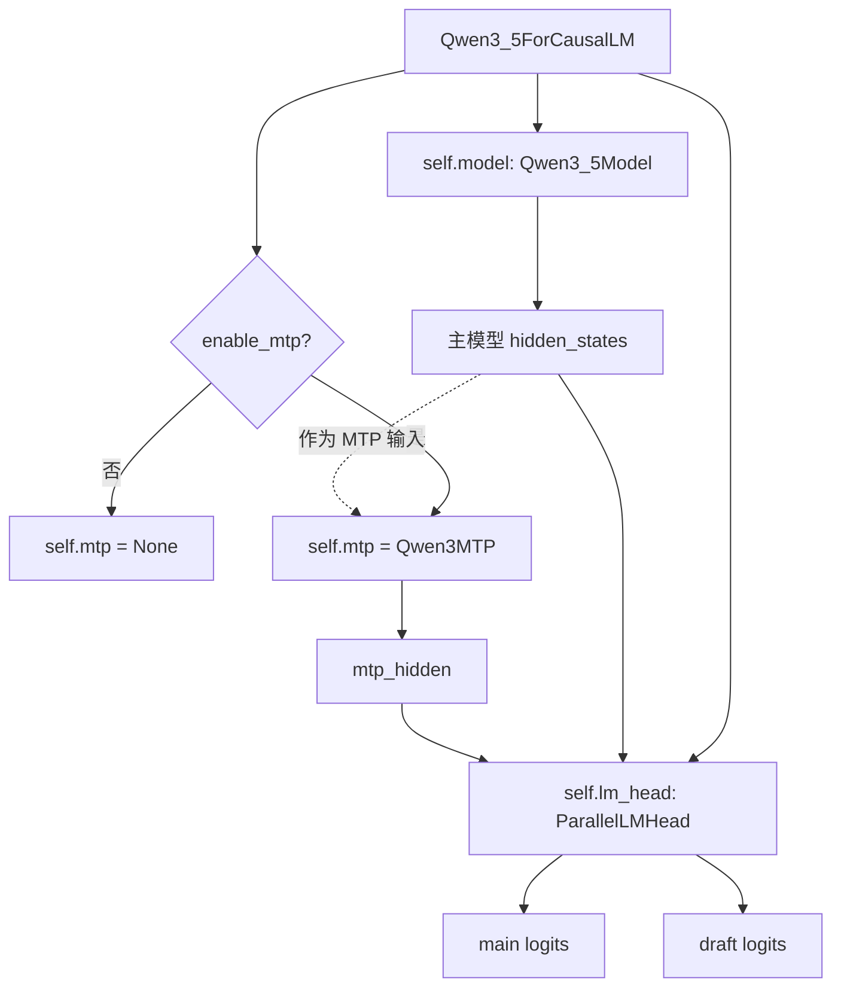

这里有一个关键设计：

```text
主模型 hidden 和 MTP hidden 都调用同一个 compute_logits / lm_head。
```

所以 Tensor Parallel 的 local logits 与采样改造会同时影响主模型和 MTP。

---

# 7. `loader.py` 与 `model_runner.py`：MTP 权重如何加载和检查

模型创建后，`ModelRunner` 调用：

```python
self.load_result = load_model(self.model, config.model, log_fn=self._log)
```

由于 `self.mtp` 已经作为模型子模块存在，`model.named_parameters()` / `get_parameter()` 可以定位：

```text
mtp.pre_fc_norm_embedding.*
mtp.pre_fc_norm_hidden.*
mtp.fc.*
mtp.layers.*
mtp.norm.*
```

加载结束后，`ModelRunner` 会检查：

```text
loaded_names 中以 mtp. 开头的权重
skipped_names 中以 mtp. 开头的权重
```

如果启用了 MTP，但 MTP 权重被跳过，则直接断言失败。

完整初始化链：

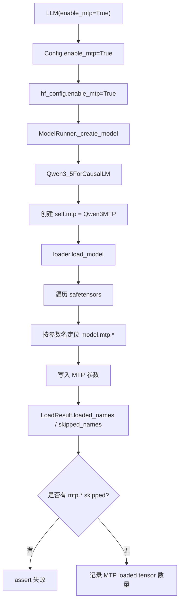

这一步的意义是：

```text
避免 enable_mtp=True，但实际上辅助头没有正确加载权重，
却继续用随机参数生成 draft token。
```

---

# 8. `qwen3_mtp.py`：MTP 模型结构

## 8.1 `Qwen3MTP` 的输入

MTP forward 接收：

```python
positions
hidden_states
inputs_embeds
```

含义：

```text
positions:
    要预测位置的 position ids

hidden_states:
    主模型在当前 token 位置产生的隐藏状态

inputs_embeds:
    当前已选 token 经过主模型 embedding table 得到的 embedding
```

---

## 8.2 MTP 主体结构

结构如下：

```text
inputs_embeds
  ↓ pre_fc_norm_embedding

main hidden_states
  ↓ pre_fc_norm_hidden

两者 concat: [embedding, hidden]
  ↓ ReplicatedLinear(2H → H)
  ↓ Qwen3MTPDecoderLayer × num_mtp_layers
  ↓ Final GemmaRMSNorm
  ↓ mtp_hidden
```

`Qwen3MTPDecoderLayer` 又是：

```text
GemmaRMSNorm
  ↓
Qwen3_5Attention
  ↓
GemmaRMSNorm
  ↓
Qwen3_5MLP
```

流程图：

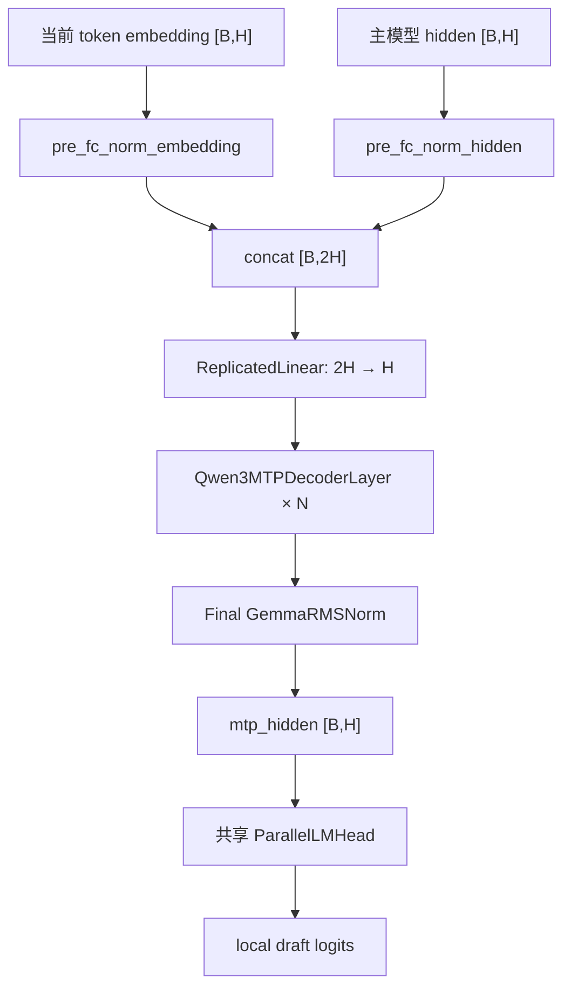

---

## 8.3 为什么同时输入 token embedding 和主模型 hidden

两者表达的信息不同：

```text
主模型 hidden:
    已经融合了完整上下文，表示主模型对当前上下文的高级理解。

当前 token embedding:
    明确告诉 MTP，主模型刚刚选择或接受了哪个 token。
```

MTP 将二者融合，预测后续状态：

```text
mtp_hidden_{t+1} = MTP(hidden_t, embed(token_{t+1}), position_{t+1})
```

下一轮又使用：

```text
mtp_hidden_{t+1}
embed(draft_{t+2})
```

继续产生后续 draft hidden。

---

# 9. `model_runner.py`：MTP draft 生成的完整过程

核心入口：

```text
run_mtp_probe
run_mtp_draft_step
run_mtp_draft_fast_step
```

它们最终都围绕 `_run_mtp_draft()` 或对应 fast 版本工作。

---

## 9.1 第一步：先运行一次主模型

如果当前轮是 prefill：

```text
prepare_prefill(seqs)
  ↓
主模型处理完整 prompt
  ↓
从每个请求最后一个 prompt token 取 main_hidden
```

如果当前轮是 decode：

```text
prepare_decode(seqs)
  ↓
主模型处理当前 last_token
  ↓
得到当前 main_hidden
```

然后：

```text
main_hidden
  ↓
compute_logits
  ↓
TP sampling
  ↓
main_token
```

这个 main token 是目标模型正式产生的 token，可以先提交。

---

## 9.2 第二步：把 main token 广播到所有 TP rank

`ModelRunner.sample()` 最终只有 rank0 返回全局 token。

但是 `_run_mtp_draft()` 尚未结束，所有 rank 接下来都必须执行：

```text
embed_tokens(main_token)
Qwen3MTP.forward(...)
```

因此 rank0 会把 main token 写入 GPU tensor，再：

```python
dist.broadcast(main_token_tensor, src=0)
```

这样所有 rank 都获得完全相同的 token id。

这是第五方向和第六方向的一个关键连接点：

```text
TP sampling 在 rank0 决定全局 token；
MTP 在同一次 runner call 内还要继续执行；
所以必须立刻把全局 token broadcast 回所有 rank。
```

---

## 9.3 第三步：循环生成 draft token

对于每个 draft step：

```text
1. current_token_tensor 进入主模型 embedding table。
2. 得到 inputs_embeds。
3. 构造临时 Context。
4. 调用 self.model.mtp。
5. mtp_hidden 进入共享 LM Head。
6. 得到各 rank 的 local draft logits。
7. 各 rank 选 local candidate + score。
8. ModelRunner all_gather，rank0 选 global draft token。
9. global draft token 再 broadcast 到所有 rank。
10. 更新 current_hidden / current_positions / current_token。
```

详细流程：

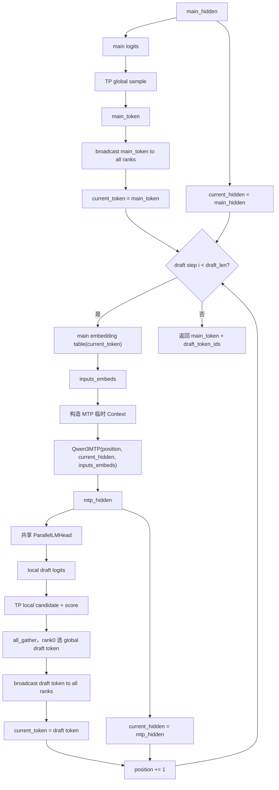

---

## 9.4 MTP 临时 Context 为什么设置 `slot_mapping=-1`

MTP draft 循环中会构造：

```text
is_prefill=True
cu_seqlens=[0,1,...]
slot_mapping=-1
block_tables=None
state_indices=None
```

其中 `slot_mapping=-1` 的作用是：

```text
让 Attention 的 store_kvcache kernel 跳过写入。
```

因此 MTP 自己的临时 full-attention layer不会污染主模型真实 KV Cache。

同时：

```text
state_indices=None
```

表示这条 MTP draft 路径不使用主模型的 GDN recurrent/conv state。

可以理解为：

```text
主模型 forward:
    会推进真实请求状态。

MTP draft forward:
    只是产生候选，不提交到真实 KV/GDN 状态。
```

真正会推进主模型状态的是后面的 target verify。

---

# 10. 根目录脚本如何把 MTP 组合成 speculative decoding

MTP 模块和 ModelRunner 只是提供执行能力，完整控制流主要由根目录脚本组织。

## 10.1 `test_mtp_forward.py`

作用：

```text
最小 smoke test
```

调用链：

```text
创建 LLM(enable_mtp=True, enforce_eager=True)
  ↓
add_request
  ↓
scheduler.schedule 得到 prefill seq
  ↓
model_runner.call("run_mtp_probe")
  ↓
输出 main token、draft token、top-k、hidden/logits shape
  ↓
检查 MTP loaded/skipped tensor 数量
```

它不做完整 accept/reject，只验证：

```text
MTP 权重是否加载
MTP 单步 forward 是否能工作
draft token/top-k 是否能产生
```

---

## 10.2 `test_mtp1_verify.py`

作用：

```text
draft_len=1 的候选准确率验证
```

基本逻辑：

```text
MTP 产生 1 个 draft token
  ↓
主模型执行下一步 decode
  ↓
得到 target token
  ↓
比较 draft == target
  ↓
累计 accepted / rejected / accept_rate
```

它重点测：

```text
MTP 作为候选模型，预测下一 token 的命中率如何。
```

---

## 10.3 `test_mtp1_spec_decode.py`

作用：

```text
draft_len=1 的 accept/reject + rollback 验证
```

它比 `test_mtp1_verify.py` 多了：

```text
scheduler snapshot
decode state snapshot
accept 分支
reject 分支
force reject 测试
```

这是最小的 speculative decoding 闭环。

---

## 10.4 `test_mtp_spec_decode.py`

作用：

```text
多 token MTP speculative decoding correctness prototype
```

主要能力：

```text
1. draft_len 可配置。
2. verify-mode 支持 eager / graph / chunk。
3. 支持强制 reject，测试回滚。
4. 支持保存 logits 并比较 max_logit_diff。
5. 支持和 greedy baseline 比较最终 token 序列。
6. 统计 accept_len、discarded drafts、wasted verified tokens、rerun 成本。
```

---

## 10.5 `run_mtp_fast_decode.py`

作用：

```text
去掉大量 top-k/logit debug，保留更接近性能测试的路径。
```

它调用：

```text
run_mtp_draft_fast_step
run_verify_batch_fast
```

并统计：

```text
decode_tok_s
accept_rate
target_forwards_per_token
mtp_forwards_per_token
verify_graph_replays
verify_eager_calls
verify_chunk_calls
reject_reruns
```

---

## 10.6 `bench_mtp_draft_sweep.py`

作用：

```text
扫描 draft_len=1,2,3,4 等配置。
```

它复用：

```text
run_greedy_decode
run_mtp_fast_decode
summarize_stats
```

比较不同 draft_len 下：

```text
生成结果是否和 greedy 一致
token/s
accept_rate
target forward/token
MTP forward/token
verify 调用次数
reject rerun 次数
```

---

## 10.7 `test_state_rollback.py`

作用：

```text
独立验证状态保存和恢复是否精确。
```

流程：

```text
1. 正常 prefill。
2. 进入一次 decode 前保存 Scheduler 和 GPU state。
3. 执行第一遍 decode，保存 token/logits。
4. 恢复 Scheduler 状态。
5. 恢复 KV Cache + GDN state。
6. 从同一个状态再执行一次 decode。
7. 比较两次 token 和 logits。
```

若恢复正确：

```text
first_token == second_token
max_logit_diff <= tolerance
```

---

# 11. Speculative decoding 一轮的完整语义

假设主模型先产生：

```text
m
```

MTP 继续产生：

```text
d1, d2, d3, d4
```

verify 输入不是直接把四个 draft 当输出，而是构造：

```text
[m, d1, d2, d3]
```

主模型对这些输入分别预测：

```text
t1, t2, t3, t4
```

然后比较：

```text
d1 ?= t1
d2 ?= t2
d3 ?= t3
d4 ?= t4
```

最长连续匹配前缀就是：

```text
accept_len
```

例如：

```text
draft = [17, 25, 31, 48]
target = [17, 25, 99, 52]
```

则：

```text
d1 == t1
d2 == t2
d3 != t3

accept_len = 2
reject_index = 2
```

最终应该提交：

```text
main token m
accepted drafts: 17, 25
目标模型正确 token: 99
```

不能提交：

```text
31, 48
```

---

# 12. 为什么 verify 前必须保存两类状态

一次主模型 verify 会真实运行模型，因此会修改状态。

需要保存两个层面。

## 12.1 控制面状态

由根目录脚本中的 `snapshot_scheduler()` 保存：

```text
Sequence.status
Sequence.token_ids
last_token
num_tokens
num_cached_tokens
num_scheduled_tokens
block_table
state_slot_id

Scheduler.waiting
Scheduler.running

BlockManager.free_block_ids
BlockManager.used_block_ids
BlockManager.hash_to_block_id
每个 Block 的 ref_count/hash/token_ids

StateSlotManager.free_slots
```

这些状态描述：

```text
请求在逻辑上生成到了哪里
哪些 block/slot 被占用
Scheduler 当前队列是什么
```

---

## 12.2 数据面状态

由 `ModelRunner.save_decode_state_range()` 保存：

```text
将被 verify 覆盖的 KV Cache slots
每个 GDN layer 中当前请求的 conv_state
每个 GDN layer 中当前请求的 recurrent_state
```

这些状态描述：

```text
GPU tensor 中真实的模型历史。
```

---

## 12.3 为什么两个层面都要恢复

只恢复 `Sequence.token_ids` 不够：

```text
GPU KV/GDN state 仍然已经走过错误 draft。
```

只恢复 GPU tensor 也不够：

```text
Sequence、block_table、Scheduler 队列仍然认为 token 已经提交。
```

因此 rollback 必须是：

```text
控制面恢复 + 数据面恢复
```

---

# 13. 状态保存与回滚结构图

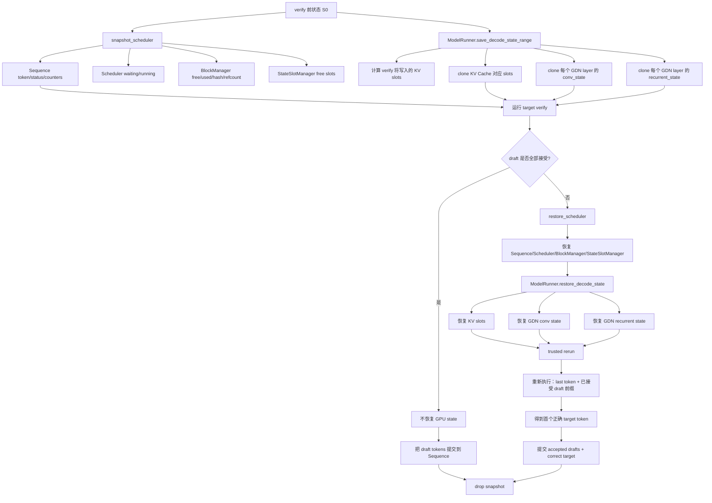

---

# 14. `model_runner.py` 如何保存 GPU 状态

## 14.1 保存 KV Cache

`save_decode_state_range` 根据：

```text
start_pos
num_slots
seq.block_table
block_size
```

计算物理 KV slot：

```text
physical_slot =
    seq.block_table[position // block_size] * block_size
    + position % block_size
```

然后把 KV Cache 的 block/token 两维展平，用 `index_select` clone 这些位置。

这样不是复制完整 KV Cache，而只保存 verify 会覆盖的 slots。

---

## 14.2 保存 GDN state

GDN state 和 KV Cache 不同：

```text
KV Cache:
    每个 token 一个位置，可以只保存被覆盖 slots。

GDN recurrent/conv state:
    一个请求一个 state slot，verify 每一步都会递推修改整个状态。
```

因此它会为每个 GDN layer 保存：

```text
conv_states[state_slot_ids]
recurrent_states[state_slot_ids]
```

也就是：

```text
KV 按 token slot 局部保存；
GDN 按 request state slot 保存。
```

---

## 14.3 恢复

恢复时：

```text
KV Cache:
    index_copy_ 回原物理 slot

GDN:
    index_copy_ 回原 state slot
```

`drop_decode_state()` 最后删除 snapshot，避免长期占用显存。

---

# 15. Accept 分支和 Reject 分支为什么不同

## 15.1 全部接受

如果：

```text
draft_token_ids == target_token_ids
```

那么 verify 执行后的 GPU 状态正是正确目标模型路径。

此时：

```text
不需要恢复 KV/GDN state；
只需要在 Sequence/Scheduler 控制面提交这些 draft token。
```

---

## 15.2 中途拒绝

如果第 `i` 个 draft 不匹配：

```text
前 i 个 token 可接受；
第 i 个 token 应替换为 target token。
```

但 verify 已经继续计算了后面的 token，GPU state 已被污染。

因此必须：

```text
1. 恢复 verify 前状态。
2. 重新运行 last_token + accepted draft prefix。
3. 得到第一个 rejected 位置对应的正确 target token。
4. 提交 accepted prefix + correct target token。
```

这就是 `reject_rerun`。

---

# 16. 为什么还需要手动管理 BlockManager

根目录 spec decode 脚本不会完全沿用普通 `Scheduler.schedule → postprocess` 的一 token 一轮模式。

一次 verify 可能要写多个未来位置，因此脚本需要：

```text
ensure_block_capacity:
    提前保证 block_table 有足够 KV block。

sync_full_block_hashes:
    同步完整 block 的 hash/token_ids。

trim_block_table_to_context:
    丢弃超出已提交上下文的临时 block。

finalize_manual_commit:
    让 BlockManager 的逻辑状态与实际已提交 token 对齐。
```

原因是：

```text
verify 是“先执行未来多个位置，再决定提交多少”；
普通 Scheduler 假设“每次只推进一个真实 token”。
```

因此实验脚本必须手动弥合这两种执行语义。

---

# 17. 三种 verify 模式

## 17.1 Eager verify

做法：

```text
对 verify_input_ids 中每个 token：
    prepare_decode
    主模型 forward
    采样 target token
    临时 work_seq append 下一个输入
```

特点：

```text
语义最直接
每个 token 一次 eager forward
kernel launch 和 Python 开销较大
```

---

## 17.2 Graph verify

项目会为：

```text
verify_len = 1,2,3,4
```

捕获专用 CUDA Graph。

graph 内部仍然按 token 顺序调用模型：

```text
for i in verify_len:
    set_context for one token
    model(one token)
```

所以它的主要优化是：

```text
把多次固定形状 decode 操作 capture 到一个 graph 中，
减少 CPU launch / Python 调度开销。
```

它不是把多 token target verify 数学上融合成一次 attention kernel。

---

## 17.3 Chunk verify

chunk verify 把多个 candidate inputs 作为一个 prefill-style chunk：

```text
input_ids: [verify_len]
positions: 连续位置
cu_seqlens_q=[0, verify_len]
cu_seqlens_k=[0, context_len]
```

理想目标是：

```text
一次 chunk forward 得到多个目标 token logits。
```

但 hybrid 模型中 GDN 是递推状态，chunk 和逐 token decode 的状态更新语义必须严格一致。

因此项目会：

```text
先运行 chunk verify
  ↓
恢复状态
  ↓
再运行 trusted eager/graph verify
  ↓
比较 token 和 max_logit_diff
```

这说明 chunk verify 在当前项目中仍是需要验证的实验路径。

---

# 18. Verify 模式结构图

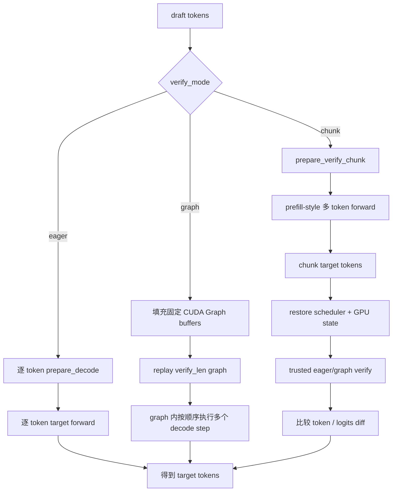

---

# 19. `Sequence`、`Scheduler`、`BlockManager` 在 MTP 中的作用

## 19.1 `Sequence`

保存：

```text
真正已经提交的 token_ids
last_token
num_tokens
num_cached_tokens
num_scheduled_tokens
block_table
state_slot_id
sampling params
```

MTP draft token 在接受前不应直接永久写入 Sequence。

---

## 19.2 `Scheduler`

负责普通请求生命周期：

```text
waiting → prefill → running → decode → finished
```

MTP 脚本仍通过：

```text
scheduler.schedule()
scheduler.postprocess()
```

提交主 token 和最终接受 token。

但对多 token verify/commit，根目录脚本增加了手工控制。

---

## 19.3 `BlockManager`

负责：

```text
KV block 分配
物理 block 生命周期
block hash
prefix metadata
ref_count
```

spec decode 会临时预留未来 block，因此 rollback 时也要恢复 BlockManager 的 free/used/hash 状态。

---

# 20. `ModelRunner.call()`：多卡 MTP 方法如何同时在所有 rank 执行

Tensor Parallel 下，rank0 不能只在本地执行 MTP 方法，因为内部包含：

```text
all_gather
broadcast
all_reduce
```

这些 NCCL collective 必须所有 rank 按相同顺序调用。

`ModelRunner.call(method_name, *args)` 的逻辑是：

```text
rank0:
    把 method_name 和 args 序列化进 SharedMemory
    通过 Event 唤醒 worker ranks
    本地执行同一个 method

worker rank:
    loop 等待 Event
    从 SharedMemory 反序列化 method_name / args
    调用同名 method
```

流程：

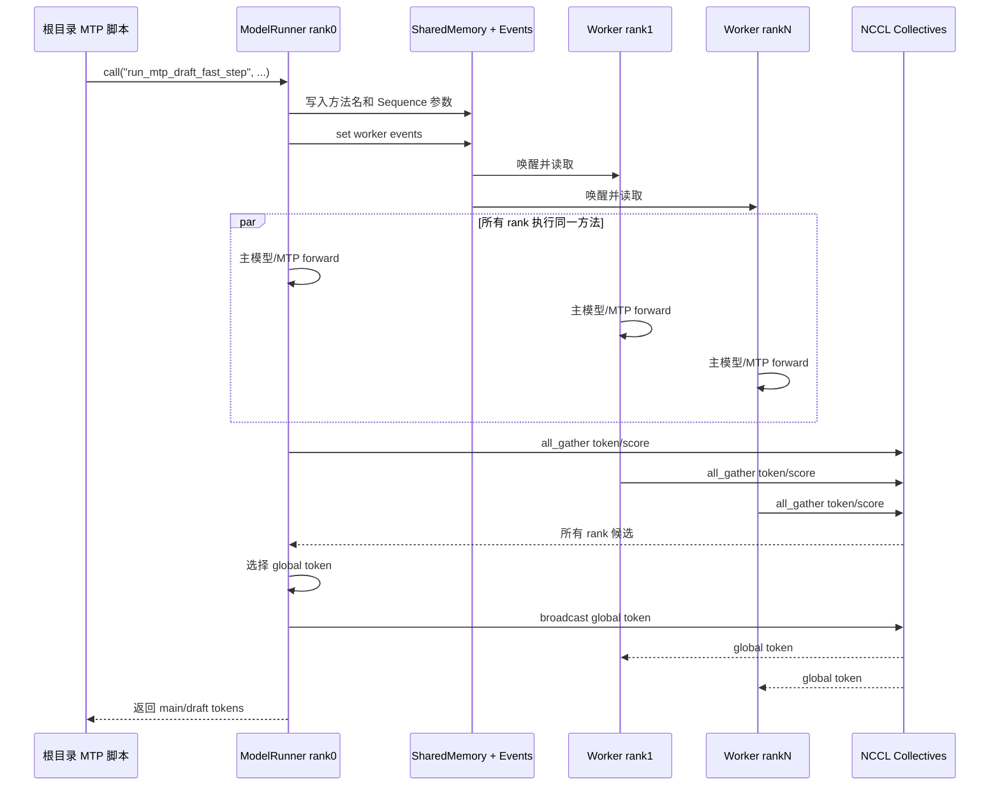

---

# 21. 大方向五文件调用关系总图

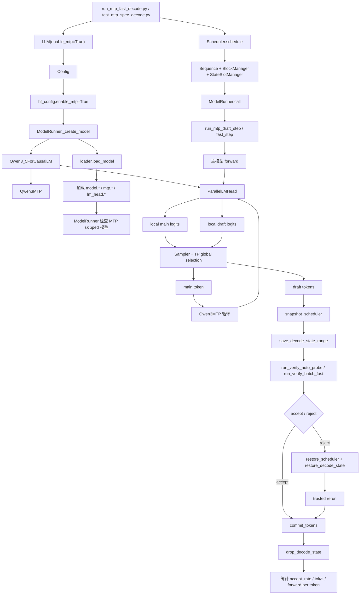

---

# 第二部分：大方向六——Tensor Parallel 输出与采样链路调整

---

# 22. 先理解词表并行

假设：

```text
vocab_size = 12
tensor_parallel_size = 3
```

每个 rank 持有：

```text
rank0: token id 0~3
rank1: token id 4~7
rank2: token id 8~11
```

LM Head 权重：

```text
完整权重: [12, hidden_size]
```

切成：

```text
rank0 weight: [4, hidden_size]
rank1 weight: [4, hidden_size]
rank2 weight: [4, hidden_size]
```

每个 rank 只能计算自己的 local logits：

```text
rank0 local logits: vocab 0~3
rank1 local logits: vocab 4~7
rank2 local logits: vocab 8~11
```

最终采样必须在完整 12 token 的逻辑词表上进行。

---

# 23. 原版 nano-vLLM 的输出链路

原版 `ParallelLMHead.forward()`：

```text
1. 每个 rank 计算 local logits。
2. dist.gather 把所有 local logits 收集到 rank0。
3. rank0 torch.cat 得到 full logits。
4. rank0 Sampler 在完整 vocab 上采样。
```

流程：

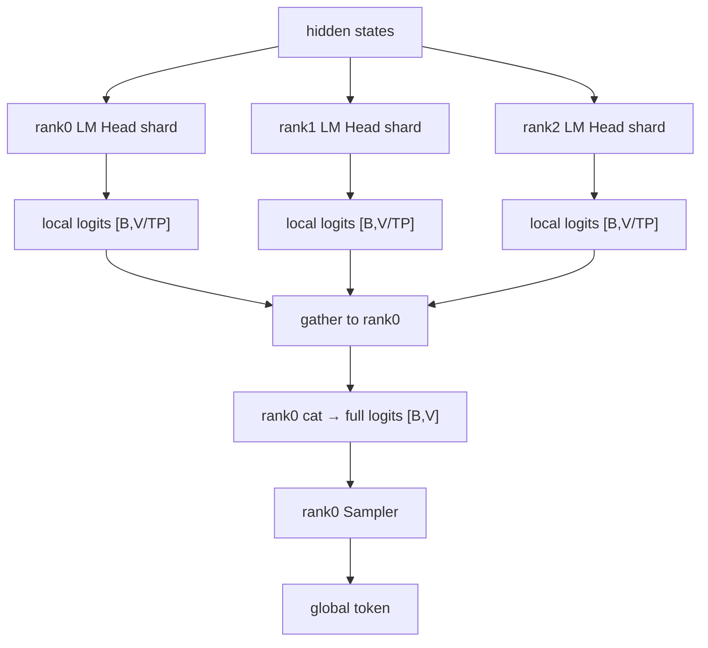

优点：

```text
逻辑简单
支持任何需要完整 logits 的后处理
```

缺点：

```text
每一步都传输完整 vocab logits
rank0 要构造 full logits
LM Head 同时承担投影和通信职责
MTP/probe 每次 logits 都会触发同样的大张量 gather
```

---

# 24. qwen3.6 的新输出链路

qwen3.6 的 `ParallelLMHead.forward()` 只做：

```python
logits = F.linear(x, self.weight)
return logits
```

也就是说：

```text
每个 rank 返回自己的 local logits；
LM Head 不再 gather 完整 vocab。
```

然后 `ModelRunner.sample()` 做：

```text
1. 每个 rank 从 local logits 中选 local token 和 local score。
2. local token 加 vocab_start_idx，变成 global token id。
3. all_gather 所有 rank 的 token 和 score。
4. rank0 找最大 score 对应的 rank。
5. rank0 返回该 rank 的 global token。
```

流程：

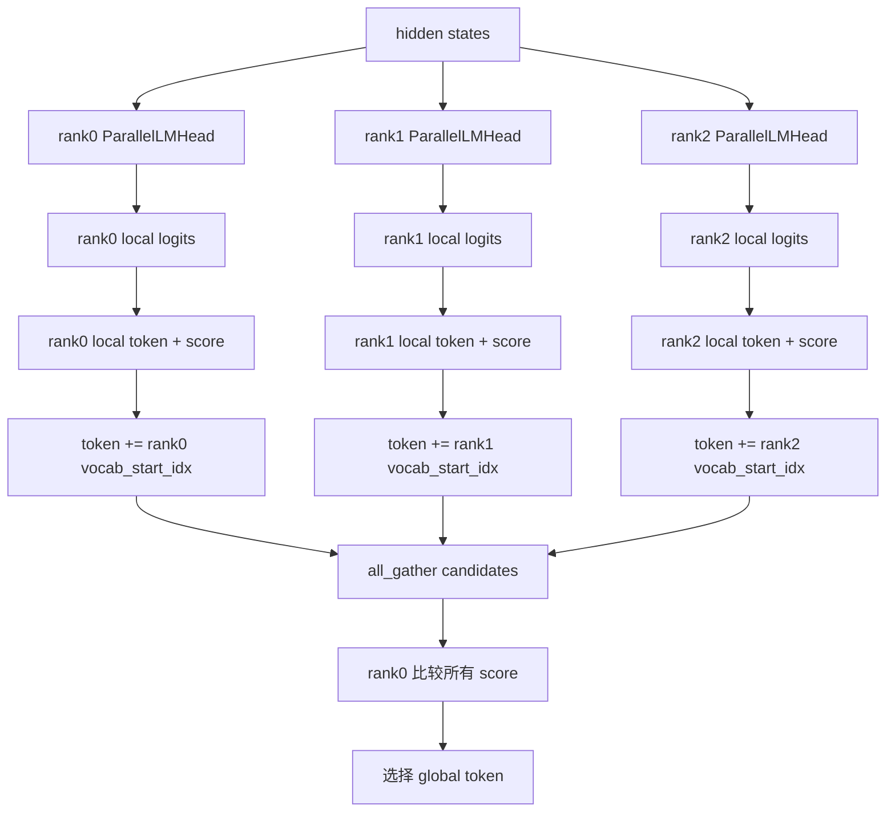

---

# 25. `embed_head.py` 的两种 TP 行为

`embed_head.py` 同时包含：

```text
VocabParallelEmbedding
ParallelLMHead
```

两者的通信逻辑不同。

## 25.1 输入 Embedding

每个 rank 只保存词表的一段。

对输入 token：

```text
当前 token 属于本 rank vocab:
    查本 rank embedding

不属于本 rank:
    该位置输出置 0
```

然后：

```python
dist.all_reduce(y)
```

由于只有一个 rank 对该 token 有非零 embedding，all-reduce 后所有 rank 都得到完整 embedding。

输入链路：

```text
global input token id
  ↓
每个 rank 判断是否属于自己的 vocab range
  ↓
拥有者查 embedding，其余 rank 输出 0
  ↓
all_reduce
  ↓
所有 rank 得到相同 hidden embedding
```

---

## 25.2 输出 LM Head

输出端不需要让每个 rank 都得到 full logits。

所以改成：

```text
每个 rank 保留 local logits
  ↓
只交换 local candidate token + score
```

这体现了输入端和输出端不同的通信需求：

```text
Embedding:
    后续所有模型 shard 都需要同一个完整 hidden，因此 all_reduce hidden。

LM Head:
    最终只需要确定一个 token，不一定需要完整 logits。
```

---

# 26. `sampler.py` 为什么从 token 变成 token + score

原版 Sampler 只返回：

```text
sample_tokens
```

新 Sampler 返回：

```text
sample_tokens
sample_scores
```

原因是：

```text
每个 rank 只知道自己的 local candidate；
必须把 score 一起交给 ModelRunner，
才能判断哪个 rank 的 candidate 是全局赢家。
```

---

## 26.1 Greedy

每个 rank：

```text
local_score, local_token = max(local_logits)
```

跨 rank：

```text
global_token = candidate of rank with max local_score
```

这是精确的全局 argmax，因为：

```text
max(full_vocab) =
max(max(rank0 shard), max(rank1 shard), ...)
```

---

## 26.2 Temperature sampling

新 Sampler 计算：

```text
scores = logits / temperature
noise = log(Exp(1))
perturbed_score = scores - noise
sample = argmax(perturbed_score)
```

由于：

```text
-log(Exp(1))
```

服从 Gumbel 分布，所以这是 Gumbel-Max categorical sampling。

每个 rank 只需要返回本 shard 内最大的：

```text
perturbed_score
local token
```

再跨 rank 取全局最大值，就等价于在完整 vocab 上做一次 Gumbel-Max。

数学上：

```text
argmax_i [logit_i / T - log(E_i)]
```

可以按词表 shard 分组：

```text
先求每个 shard 内最大值
再求所有 shard 最大值
```

最终结果与直接在完整 vocab 上求最大值相同。

---

# 27. 原版采样和新采样为什么等价

原版大致使用：

```text
p_i = softmax(logit_i / T)
sample = argmax(p_i / E_i), E_i ~ Exp(1)
```

对其取 log：

```text
argmax log(p_i / E_i)
=
argmax [log p_i - log E_i]
```

而：

```text
log p_i = logit_i / T - logsumexp(logits/T)
```

`logsumexp` 对所有 token 都相同，不影响 argmax，因此：

```text
argmax [logit_i / T - log E_i]
```

正是新实现。

所以新实现的意义不是改变采样分布，而是：

```text
把采样改写成“每个 token 一个可跨 rank 比较的 score”，
从而允许先做 local max，再做 global max。
```

---

# 28. `ModelRunner.sample()` 逐步分析

## 28.1 每个 rank 局部选择

```text
greedy:
    sampler.greedy_with_scores(local_logits)

temperature:
    sampler.forward_with_scores(local_logits, temperatures)
```

输出：

```text
local_token_ids: [batch]
local_scores: [batch]
```

---

## 28.2 local id 转 global id

每个 rank 的 `local_token_id` 都从 0 开始。

因此：

```python
global_token_id = local_token_id + lm_head.vocab_start_idx
```

例如：

```text
rank2 vocab_start_idx = 80000
local_token_id = 153
global_token_id = 80153
```

---

## 28.3 all_gather

所有 rank 交换：

```text
token_ids
scores
```

而不是交换：

```text
完整 local logits
```

---

## 28.4 rank0 选 winner

将各 rank score stack 成：

```text
[TP, batch]
```

然后：

```text
rank_ids = scores.argmax(dim=0)
```

对 batch 中每个请求，找到 winning rank，再从 token_ids 中 gather 出最终 global token。

非 rank0 返回 `None`，rank0 返回 Python token list。

---

# 29. TP greedy 例子

假设：

```text
rank0 local max:
    local id=2, global id=2, score=7.1

rank1 local max:
    local id=1, global id=5, score=8.6

rank2 local max:
    local id=3, global id=11, score=8.2
```

all_gather 后：

```text
scores = [7.1, 8.6, 8.2]
tokens = [2, 5, 11]
```

全局赢家：

```text
score 8.6
global token id 5
```

不需要把 12 个 logits 全部传到 rank0。

---

# 30. 通信量变化

设：

```text
batch size = B
vocab size = V
TP size = P
```

## 30.1 原版

每个 rank 有：

```text
[B, V/P]
```

local logits。

gather 后 rank0 接收近似：

```text
O(B × V)
```

个浮点数。

---

## 30.2 新版普通采样

每个 rank 只交换：

```text
B 个 token ids
B 个 scores
```

逻辑数据规模约：

```text
O(B × P)
```

远小于：

```text
O(B × V)
```

因为通常：

```text
V 远大于 P
```

例如 vocab 十万级，而 TP 只有 2、4、8。

---

## 30.3 注意

新实现使用的是：

```text
all_gather
```

所以候选会到达所有 rank，而最终只有 rank0使用。

从实现简洁性看这样做合理；若继续优化，可以考虑只将候选 reduce/gather 到 rank0。

但即使是 all_gather，传输的也只是少量 token/score，不是完整 vocab logits。

---

# 31. `topk_tokens()` 如何工作

调试和 MTP probe 需要显示全局 top-k。

每个 rank 先做：

```text
local top-k
```

然后：

```text
1. local token id 加 vocab_start_idx。
2. all_gather 各 rank 的 k 个候选。
3. 把 P×k 个候选拼起来。
4. 在 rank0 再取 global top-k。
```

这是正确的，因为全局 top-k 一定包含在：

```text
所有 rank 的 local top-k 候选并集
```

中。

它主要用于：

```text
MTP probe
verify debug
logit mismatch 定位
```

不是普通生成每步必须执行的路径。

---

# 32. 新 TP 采样链路和 MTP 如何结合

MTP 每轮至少会产生两类 logits：

```text
1. 主模型 main logits
2. 一个或多个 MTP draft logits
```

它们都走：

```text
compute_logits
  ↓
ParallelLMHead local logits
  ↓
ModelRunner.sample
  ↓
local candidate + score
  ↓
all_gather
  ↓
rank0 global token
```

但 MTP 循环中还有一步：

```text
global token broadcast 回所有 rank
```

原因是：

```text
下一次 MTP forward 发生在当前同一次 ModelRunner.call 内；
其他 rank 不能等待 Scheduler 下一轮再获得 token。
```

完整组合图：

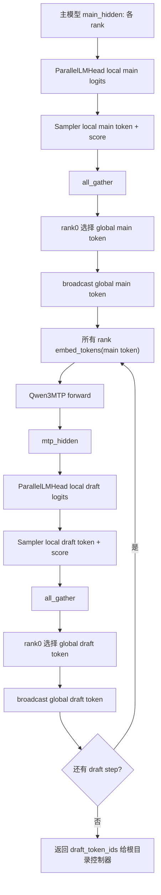

---

# 33. CUDA Graph 与两个方向的关系

## 33.1 普通 decode graph

qwen3.6 的普通 decode CUDA Graph 除了：

```text
input_ids
positions
slot_mapping
context_lens
block_tables
```

还要复制：

```text
state_indices
```

这样 hybrid 模型中的 GDN state slot 才正确。

---

## 33.2 MTP verify graph

当：

```text
enable_mtp=True
enforce_eager=False
```

ModelRunner 会额外 capture：

```text
verify_graphs
verify_chunk_graphs
```

针对固定：

```text
verify_len = 1,2,3,4
```

预建 graph。

MTP 本身没有被完整 capture 成“主模型+draft+verify+rollback”单一 graph；当前是：

```text
主模型/MTP 方法控制流
  +
多个专用 verify graph
```

---

# 34. 大方向六各文件调用关系总图

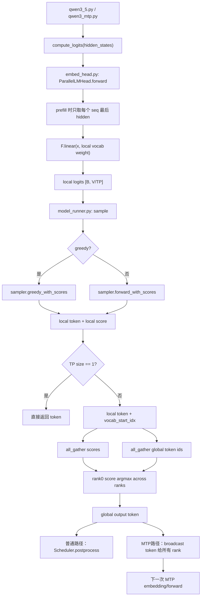

---

# 35. 为什么把通信从 LM Head 移到 ModelRunner

## 35.1 职责更清楚

新版分工：

```text
ParallelLMHead:
    只负责当前 rank 的 vocab projection。

Sampler:
    只负责当前 rank 的候选选择。

ModelRunner:
    负责分布式通信和全局 token 决策。
```

这符合分层设计：

```text
Layer 不负责整个分布式执行策略；
Runner 统一管理 rank 间协作。
```

---

## 35.2 MTP/verify 更容易复用

主模型、MTP、verify、top-k probe 都会产生 local logits。

把通信集中在 ModelRunner 后，可以统一复用：

```text
sample
topk_tokens
_compare_logits
broadcast token
```

不需要每个模型头各自实现一套跨 rank逻辑。

---

## 35.3 避免强制构造 full logits

普通生成最终只需要：

```text
一个 token
```

不一定需要：

```text
完整 [batch, vocab_size] logits
```

因此只传候选更符合信息需求。

---

# 36. 新 TP 采样链路的限制

这种 candidate-based sampling 当前适合：

```text
greedy
temperature categorical sampling
global top-k probe
```

但如果要支持更完整的采样策略，还要进一步设计。

## 36.1 Top-p

Top-p 需要知道：

```text
全局 token 概率排序
累计概率质量
```

只拿每个 rank 一个 local winner 不够。

---

## 36.2 Top-k sampling

若要从全局 top-k 中按概率采样，需要：

```text
每个 rank 提交足够多 local candidates
rank0 合成 global top-k
再做概率归一化和采样
```

当前 `topk_tokens()` 主要是探针输出，不是完整 top-k sampling。

---

## 36.3 Repetition/presence/frequency penalty

这些 penalty 需要根据全局 token 历史修改对应 global vocab logits。

词表分片下可以在各 rank 根据 global token id 修改自己的 local shard，但需要额外逻辑。

---

## 36.4 Logprobs

API 如果要求：

```text
完整 token logprob
top-n logprobs
```

需要跨 rank 计算全局 logsumexp，不能只返回 local winner score。

当前 sampler 中的 `sample_score` 是用于跨 rank 比较的扰动 score，不等于最终规范化 log probability。

---

## 36.5 随机可复现性

Gumbel/Exponential 噪声由各 rank 分别生成。

理论采样分布正确，但：

```text
同一个 seed 在不同 TP size 下，随机数分片方式可能不同；
因此生成 token 不一定跨 TP 配置逐 token 完全一致。
```

如需严格可复现，还要设计 TP-aware RNG mapping。

---

# 37. 第五与第六方向的完整端到端总流程

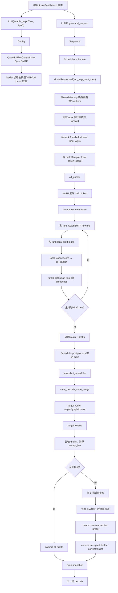

---

# 38. 文件之间的调用与职责总表

| 文件 | 方向五中的职责 | 方向六中的职责 | 直接调用关系 |
|---|---|---|---|
| `config.py` | 提供 `enable_mtp`，传入 HF config | 提供 `tensor_parallel_size` | 根目录脚本 → LLM → Config |
| `qwen3_5.py` | 可选创建 `Qwen3MTP`，主模型输出 hidden | 创建 vocab-parallel LM Head | ModelRunner `_create_model` → `Qwen3_5ForCausalLM` |
| `qwen3_mtp.py` | 产生 MTP hidden / draft hidden | draft hidden 复用 sharded LM Head | ModelRunner → `model.mtp()` |
| `loader.py` | 加载并记录 `mtp.*` 权重 | 加载各 rank 的 embedding/head shard | ModelRunner → `load_model()` |
| `embed_head.py` | 主模型和 MTP 都通过 LM Head 得 logits | 返回 local logits，不 gather full logits | `compute_logits()` → `ParallelLMHead.forward()` |
| `sampler.py` | 生成 main/draft/verify token 候选 | 返回 local token + comparable score | ModelRunner → Sampler |
| `model_runner.py` | draft、verify、save/restore、CUDA Graph | all_gather token/score、选择 global token、broadcast | 根目录脚本通过 `call()` 调用 |
| `sequence.py` | 保存真正提交的 token 和请求状态 | 下一轮把 global token 传给各 rank | Scheduler / snapshot 脚本使用 |
| `scheduler.py` | schedule、postprocess、结束条件 | rank0 控制最终 token 提交 | 根目录脚本直接调用 |
| `block_manager.py` | verify block 容量、rollback 控制状态 | 不参与 logits 采样 | Scheduler 与 spec helper 使用 |
| `attention.py` | target verify 写 KV；MTP 临时路径用 `slot=-1` 避免写 cache | Attention 内部 TP 与此方向间接关联 | 主模型/MTP layer 调用 |
| `gated_delta_net.py` | target verify 更新 GDN state，reject 时恢复 | 与 vocab sampling 无直接关系 | 主模型 hybrid layer 调用 |
| `test_state_rollback.py` | 保存/恢复 Scheduler 控制面 | 无直接采样职责 | 被 spec 脚本复用 |
| `test_mtp_spec_decode.py` | correctness 控制器 | 依赖 ModelRunner 全局 token | 调用 draft/verify/save/restore |
| `run_mtp_fast_decode.py` | fast-path 控制器 | 依赖 local candidate sampling | 调用 fast draft/verify |
| `bench_mtp_draft_sweep.py` | 扫描 draft_len 和性能指标 | TP 配置影响实际性能 | 复用 fast decode 函数 |

---

# 39. 两个方向相比原版 nano-vLLM 的核心变化

## 39.1 原版

```text
Qwen3 main model
  ↓
LM Head local logits
  ↓ gather full logits to rank0
  ↓
rank0 Sampler
  ↓
一个 token
  ↓
Scheduler.postprocess
```

状态管理只服务标准单 token decode。

---

## 39.2 qwen3.6

```text
主模型 + optional Qwen3MTP
  ↓
LM Head 始终输出 local logits
  ↓
每个 rank local token+score
  ↓
ModelRunner all_gather 选择 global token
  ↓
普通 generate：
    Scheduler.postprocess

MTP：
    broadcast global token
    继续生成 draft
    target verify
    accept/reject
    KV/GDN/Scheduler rollback
```

变化的本质是：

```text
输出侧：
    从“汇聚完整张量”变成“汇聚最终决策候选”。

decode 侧：
    从“每次只生成并提交一个 token”
    变成“候选生成、目标验证、条件提交、必要回滚”。
```

---

# 40. 为什么第六方向不仅是性能优化，也是架构解耦

它确实减少了完整 logits 通信，但意义不只在通信量。

它还实现了三个解耦：

```text
1. LM Head 与分布式采样解耦。
2. 模型 forward 与 token 决策解耦。
3. 主模型、MTP、verify 共用同一个采样接口。
```

因此 Direction 6 是 Direction 5 能较清晰落地的一个底层支撑。

---

# 41. 当前项目是否已经真正实现 speculative decoding 加速

不能只看是否出现：

```text
MTP
draft
verify
accept
```

必须比较总成本。

设：

```text
A = 平均每轮接受的 draft token 数
T = 目标模型 forward 成本
M = 一次 MTP forward 成本
R = reject 后 rerun 成本
C = 通信、snapshot、控制开销
```

普通 decode 每生成一个 token，大致成本：

```text
T
```

MTP 路径每轮大致成本：

```text
1 次主模型 forward
+ draft_len 次 MTP forward
+ verify 成本
+ rollback/rerun 概率成本
+ C
```

只有当：

```text
平均一次循环提交的 token 数足够多
并且
MTP + verify + rollback 的单位 token 成本足够低
```

才会真正加速。

因此项目专门统计：

```text
accept_rate
accept_length_total
target_forwards_per_token
mtp_forwards_per_token
reject_reruns
decode_tok_s
greedy_match
```

这些指标比“实现了 MTP”更能说明效果。

---

# 42. 学习时最应该抓住的五条因果链

## 42.1 为什么要新增 `qwen3_mtp.py`

```text
因为需要一个比完整目标模型更轻的候选预测分支。
```

## 42.2 为什么 `model_runner.py` 改动最大

```text
因为 MTP 不是单个 layer 功能；
它涉及主模型、draft、verify、TP 通信、CUDA Graph 和状态回滚。
```

## 42.3 为什么 `sampler.py` 必须返回 score

```text
因为每个 TP rank 只看到局部 vocab，
只有 token id 不能判断哪个 rank 的候选是全局赢家。
```

## 42.4 为什么要同时 snapshot Scheduler 和模型 state

```text
因为错误 draft 会同时污染逻辑请求状态和 GPU 历史状态。
```

## 42.5 为什么测试脚本比普通单元测试复杂

```text
因为 speculative decoding 是一个跨模块协议，
正确性取决于多个组件在 accept/reject 边界上的一致性。
```

---

# 43. 面试回答：大方向五

> `nano-vllm-qwen3.6` 中的 MTP/speculative decoding 是怎么实现的？

可以回答：

```text
这个项目首先在 Qwen3_5ForCausalLM 中通过 enable_mtp 可选挂载 Qwen3MTP。Qwen3MTP 接收主模型 hidden state 和当前 token embedding，分别做 GemmaRMSNorm 后 concat，通过 2H 到 H 的 ReplicatedLinear 融合，再经过一到多层 Qwen3MTPDecoderLayer 和 final norm 得到 mtp hidden，最后复用主模型的 ParallelLMHead 产生 draft logits。

执行层主要在 ModelRunner。run_mtp_draft_step 会先正常运行一次主模型，得到 main hidden 和 main token；然后把全局 main token broadcast 给所有 TP rank。每个 draft step 都用当前 token 的 embedding 和 current hidden 调用 MTP，产生 draft hidden 和 draft logits，再通过 TP candidate sampling 得到全局 draft token，并继续递推。

完整 speculative decoding 控制流目前主要在根目录 test/run 脚本里，而不是默认 LLMEngine.step 中。脚本会先提交主模型 main token，再保存 Scheduler 控制状态和 ModelRunner GPU 状态。GPU snapshot 包括 verify 将覆盖的 KV slots，以及每个 GDN layer 对应 state slot 的 conv/recurrent state。之后用主模型对 draft tokens 做 eager、CUDA Graph 或 chunk verify，计算最长接受前缀。全部接受时直接提交 drafts；出现拒绝时恢复 Scheduler、KV Cache 和 GDN state，再重新运行已接受前缀，提交 accepted drafts 和第一个正确 target token。最后用 greedy_match、accept_rate、target_forwards_per_token 和 reject_reruns 验证正确性与性能。
```

---

# 44. 面试回答：大方向六

> 为什么 qwen3.6 把完整 logits gather 改成 local token+score 汇聚？

可以回答：

```text
原版 nano-vLLM 的 ParallelLMHead 在每个 rank 计算 local logits 后，把整个 vocab logits gather 到 rank0，再由 rank0 采样。qwen3.6 改成 LM Head 只返回 local logits，每个 rank 的 Sampler 先在自己的 vocab shard 中产生 local candidate token 和 score，ModelRunner 再 all_gather 所有 rank 的候选并选择全局赢家。

对于 greedy，局部最大值再取跨 rank 最大值和完整 vocab argmax 完全等价。对于 temperature sampling，Sampler 使用 logits/T 减去 log Exp(1) 的 Gumbel-Max score，因此每个 rank 先取本地最大，再跨 rank 取最大，也等价于在完整 vocab 上做 categorical sampling。local token 在通信前加 vocab_start_idx 转成 global token id。

这样普通采样只交换每个请求每个 rank 的一个 token id 和一个 score，而不是交换整个 vocab logits，通信规模从近似 O(batch×vocab) 降到 O(batch×TP)。同时把分布式通信从 LM Head 移到 ModelRunner，使主模型、MTP draft 和 verify 都能复用同一套采样逻辑。需要注意，当前设计主要覆盖 greedy 和 temperature categorical；top-p、规范化 logprobs、复杂 penalties 仍需要额外的跨 rank 逻辑。
```

---

# 45. 最终总结

大方向五和大方向六可以合并成一条主线：

```text
MTP 负责产生更多候选 token；
Target verify 负责保证候选正确；
Rollback 负责保证错误候选不污染状态；
TP candidate sampling 负责让主 token、draft token 和 verify token 在多卡词表分片下正确决策。
```

文件之间的核心协作是：

```text
config.py:
    打开 enable_mtp

qwen3_5.py:
    在主模型外壳挂载 Qwen3MTP，并提供共享 LM Head

qwen3_mtp.py:
    用主 hidden + token embedding 产生 draft hidden

embed_head.py:
    主模型/MTP 都只产生 local vocab logits

sampler.py:
    从 local logits 返回 local token + score

model_runner.py:
    跨 rank 选择全局 token；
    生成 draft；
    执行 verify；
    capture verify CUDA Graph；
    保存和恢复 KV/GDN state

sequence.py / scheduler.py / block_manager.py:
    维护已提交 token、请求队列、KV block 和 state slot 控制状态

test_state_rollback.py:
    提供 Scheduler 控制面 snapshot/restore

test_mtp_spec_decode.py / run_mtp_fast_decode.py:
    把上述能力编排成 accept/reject/rollback 原型

bench_mtp_draft_sweep.py:
    测试不同 draft_len 的正确性和性能
```

最重要的两个结论是：

```text
第一：
Qwen3MTP 本身只是候选预测模块；
完整 speculative decoding 是模型、Runner、Scheduler、KV/GDN state 和外部控制脚本共同构成的协议。

第二：
新版 TP 输出链路没有汇聚完整 logits；
它汇聚的是每个 rank 的 local candidate token 和可比较 score，
从而同时服务普通生成、MTP draft、target verify 和调试 top-k。
```

当前项目已经建立了一个可学习、可测试的 MTP/spec decode 实验闭环，但仍要准确表述为：

```text
MTP / speculative decoding prototype
```

而不是生产级、多请求、全采样策略、完全 fused 的 speculative decoding serving 实现。


%% 项目关联导航：开始 %%
## 项目关联导航

- 所属模块：[[outputs/项目整理/模块-nano-vllm-qwen3.6|模块-nano-vllm-qwen3.6]]

%% 项目关联导航：结束 %%
