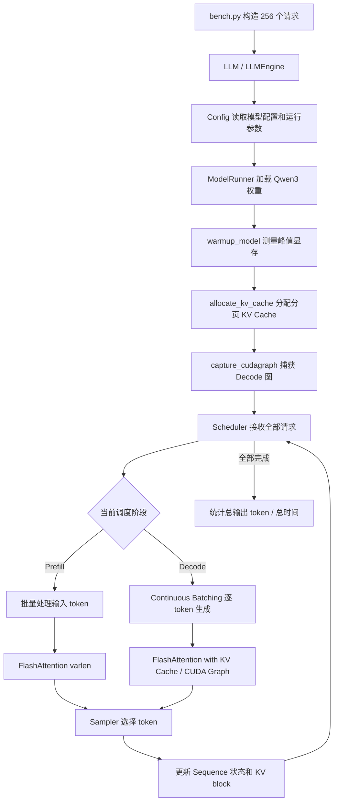

# nano-vLLM 首次跑通后的环境原理与性能实验设计

> 适用场景：Windows 11 + WSL2 Ubuntu 22.04 + RTX 5070 Laptop 12 GB + Python 3.10 + PyTorch 2.8 cu128 + CUDA Toolkit 12.8 + FlashAttention 2 + Qwen3-0.6B。  
> 本文重点不是再次罗列安装命令，而是回答两个问题：**为什么必须这样配置**，以及**怎样用少量但关键的实验说明 nano-vLLM 的性能**。

---

## 1. 先建立一个整体认识：你真正搭建的是一条“分层运行链路”

第一次实验能够成功，不是因为某一条命令单独起作用，而是下面各层恰好兼容并成功连接：

```text
Qwen3-0.6B 模型权重
        ↓
nano-vLLM 推理引擎
        ↓
PyTorch + Triton + FlashAttention 2
        ↓
CUDA Runtime / CUDA Toolkit
        ↓
WSL2 的 Linux GPU 接口
        ↓
Windows NVIDIA 驱动
        ↓
RTX 5070 Laptop GPU
```

每层负责的工作不同：

| 层级 | 核心作用 | 出问题时常见现象 |
|---|---|---|
| 模型权重 | 提供 Qwen3 参数、配置和 tokenizer | 找不到模型、权重名不匹配 |
| nano-vLLM | 调度请求、管理 KV Cache、组织 Prefill/Decode | 调度错误、显存不足、结果异常 |
| PyTorch | 张量、模型模块、CUDA 调用、显存管理 | `torch.cuda.is_available=False` |
| FlashAttention 2 | 执行高效 Attention / KV Cache Attention kernel | 导入失败或 `no kernel image` |
| CUDA Toolkit | 提供 `nvcc` 和 CUDA 开发文件，编译 CUDA 扩展 | FlashAttention 无法编译 |
| WSL2 | 提供 Linux 内核和 Linux 软件生态 | Linux 依赖无法使用、GPU 不可见 |
| Windows NVIDIA 驱动 | 真正控制物理 GPU | Windows/WSL 都无法识别 GPU |

因此，“环境配置”本质上是解决三类兼容性：

1. **操作系统兼容性**：项目主要按 Linux 生态开发；
2. **软件版本兼容性**：Python、PyTorch、CUDA、FlashAttention 彼此必须匹配；
3. **硬件架构兼容性**：RTX 5070 属于 `sm_120`，CUDA kernel 必须包含对应架构代码。

---

# 第一部分：关键环境操作背后的原因

## 2. 为什么选择 Windows + WSL2，而不是直接在 Windows 或 VMware 中运行

### 2.1 为什么保留 Windows

你的笔记本日常使用环境是 Windows，显卡驱动、厂商控制中心、电源模式和笔记本功耗策略也主要由 Windows 管理。保留 Windows 可以继续使用：

- NVIDIA Windows 驱动；
- 机械革命性能模式和风扇控制；
- Windows 下的 VS Code、浏览器和文档工具；
- 笔记本独显的正常显示与功耗管理。

### 2.2 为什么在 Windows 内增加 WSL2

nano-vLLM 的关键依赖属于 Linux AI 软件栈：

- PyTorch Linux CUDA wheel；
- Triton；
- FlashAttention；
- NCCL；
- Linux 进程、共享内存和编译工具链。

直接在 Windows 原生环境中安装，即使 PyTorch 能运行，也容易在 FlashAttention、Triton、NCCL、编译器和动态库方面遇到问题。

WSL2 提供了一个真正的 Linux 内核和 Ubuntu 用户空间，同时把 Windows 驱动控制的物理 GPU 映射给 Linux：

```text
Ubuntu 中的 PyTorch
        ↓
WSL2 映射的 CUDA Driver 接口
        ↓
Windows NVIDIA Driver
        ↓
物理 RTX 5070 GPU
```

这使你的开发环境在命令、目录、依赖和代码行为上接近真实 Ubuntu GPU 服务器。

### 2.3 为什么不使用普通 VMware Ubuntu

普通 VMware 虚拟机通常得到的是虚拟显卡，而不是可直接运行 CUDA 的 RTX 5070。要在传统虚拟机里使用物理独显，通常需要 PCIe Passthrough、IOMMU、独立宿主机配置等条件，消费级 Windows 笔记本并不适合。

所以二者的关键区别不是“哪个 Linux 更像真的”，而是：

```text
VMware Ubuntu：通常看不到可用于 CUDA 的物理独显
WSL2 Ubuntu：通过 Windows 驱动直接使用物理 NVIDIA GPU
```

---

## 3. 为什么只在 Windows 安装 NVIDIA 驱动，不在 WSL 内安装 Linux 显卡驱动

Windows 是宿主系统，真正拥有并控制物理 GPU。WSL2 中看到的 `libcuda` 接口由 Windows NVIDIA 驱动映射而来。

因此：

- **Windows 驱动**负责设备控制、CUDA Driver API 和 GPU 资源；
- **WSL 内的 CUDA Toolkit**只负责开发工具、头文件和 `nvcc`；
- WSL 内不应再安装一套普通 Linux NVIDIA 驱动去争夺设备控制权。

错误地在 WSL 中安装 `nvidia-driver-*` 或包含驱动的完整 `cuda` 元包，可能造成：

- 驱动库路径冲突；
- WSL 映射的 `libcuda.so` 被覆盖；
- `nvidia-smi` 或 PyTorch CUDA 失效。

所以安装时选择的是 **toolkit-only** 的 `cuda-toolkit-12-8`，而不是安装 Linux GPU 驱动。

---

## 4. 为什么 `nvidia-smi` 显示 CUDA 13.0，而又安装 CUDA Toolkit 12.8 和 PyTorch cu128

这是整个环境中最容易混淆的地方。这里存在三个不同的“CUDA 版本”。

### 4.1 `nvidia-smi` 的 CUDA Version

你看到：

```text
Driver Version: 581.57
CUDA Version: 13.0
```

这里的 CUDA 13.0 表示：

> 当前 NVIDIA 驱动最高支持到相应 CUDA Driver API 版本。

它不表示系统中已经安装了 CUDA Toolkit 13.0，也不表示 PyTorch 必须是 cu130。

### 4.2 `nvcc --version` 的版本

`nvcc` 属于 CUDA Toolkit。你安装 12.8 后，它表示本机编译 CUDA 扩展时使用的编译器版本：

```text
CUDA Toolkit / nvcc = 12.8
```

### 4.3 `torch.version.cuda` 的版本

PyTorch 的 cu128 wheel 自带运行所需的 CUDA Runtime 组件：

```text
PyTorch 构建版本 = cu128
PyTorch CUDA Runtime = 12.8
```

因此以下组合完全合理：

```text
Windows Driver 最高兼容：CUDA 13.0
本地 nvcc 编译工具：CUDA 12.8
PyTorch 自带 Runtime：CUDA 12.8
```

它成立的基础是较新的 NVIDIA 驱动可以运行由较旧 CUDA 工具链构建的程序。

### 4.4 为什么对 RTX 5070 选择 12.8

你的 GPU 计算能力为：

```text
Compute Capability = 12.0
CUDA 架构标识 = sm_120
```

CUDA Toolkit 12.8 是支持该 Blackwell 消费级架构的重要版本。过旧的 CUDA/PyTorch wheel 可能不包含 `sm_120` kernel，从而出现：

```text
no kernel image is available for execution on the device
```

因此 cu128 并不是随意选择，而是为了让 PyTorch 和 CUDA 扩展能够识别 RTX 50 系列架构。

---

## 5. 为什么安装 CUDA Toolkit：PyTorch 明明已经自带 CUDA Runtime

普通 PyTorch 推理通常只安装 CUDA wheel 就能工作，因为 wheel 已经携带大部分 CUDA Runtime 库。

但 nano-vLLM 依赖 FlashAttention 2，而 FlashAttention 属于 CUDA 扩展。安装或编译 CUDA 扩展时需要：

- `nvcc` CUDA 编译器；
- CUDA 头文件；
- CUDA 开发库；
- 能识别 `sm_120` 的工具链。

所以两者分工是：

```text
PyTorch cu128：负责运行时调用 CUDA
CUDA Toolkit 12.8：负责本地编译 CUDA 扩展
```

这也解释了为什么：

- 只跑普通 PyTorch 矩阵乘法时，可能不需要 Toolkit；
- 要安装/编译 FlashAttention 时，Toolkit 往往成为必要条件。

---

## 6. 为什么要配置 `CUDA_HOME` 和 `PATH`

### 6.1 `CUDA_HOME`

```text
CUDA_HOME=/usr/local/cuda-12.8
```

它告诉 PyTorch 扩展构建系统和其他软件：

> CUDA Toolkit 的根目录在哪里。

构建程序会在其下面寻找：

```text
$CUDA_HOME/bin/nvcc
$CUDA_HOME/include/
$CUDA_HOME/lib64/
```

### 6.2 `PATH`

```text
PATH=$CUDA_HOME/bin:$PATH
```

它使 Shell 输入 `nvcc` 时可以找到：

```text
/usr/local/cuda-12.8/bin/nvcc
```

### 6.3 为什么没有强制永久设置 `LD_LIBRARY_PATH`

PyTorch cu128 自带 CUDA Runtime 库。如果全局强制让 `/usr/local/cuda-12.8/lib64` 排在所有库之前，可能出现：

- PyTorch 自带库与系统 Toolkit 库混用；
- 不同项目需要不同 CUDA 版本时相互干扰；
- 动态库版本不一致。

所以只设置定位编译器所需的 `CUDA_HOME` 和 `PATH` 更稳妥；只有明确遇到动态库查找问题时，才针对具体程序设置库路径。

---

## 7. 为什么使用 Ubuntu 22.04 和 Python 3.10

选择版本时，不是“越新越好”，而是要取依赖交集。

当前仓库的 Python 要求是：

```text
Python >= 3.10 且 < 3.13
```

Ubuntu 22.04 默认提供 Python 3.10，因此形成了一个成熟组合：

```text
Ubuntu 22.04
+ Python 3.10
+ GCC 11
+ CUDA Toolkit 12.8
+ PyTorch 2.8 cu128
```

Python 过旧可能不满足项目声明；Python 过新则可能使某些 FlashAttention、Triton 或其他二进制 wheel 暂无匹配版本。

所以 Python 3.10 的价值不是功能最先进，而是：

- 项目明确支持；
- 上游 wheel 丰富；
- Ubuntu 22.04 原生提供；
- 依赖组合成熟，排错变量较少。

---

## 8. 为什么安装 GCC、G++、Ninja、CMake、Python-dev 等基础工具

这些工具不是用来“运行 Python 语句”的，而是用来处理 Python 包中的本地代码。

| 工具 | 背后作用 |
|---|---|
| `gcc/g++` | 编译 C/C++ 扩展和 PyTorch binding |
| `make` | 传统构建流程 |
| `ninja` | 高并发、低开销地编译大量 C++/CUDA 源文件 |
| `cmake` | 生成和组织跨平台构建配置 |
| `python3-dev` | 提供 `Python.h` 等编译 Python 扩展所需头文件 |
| `pkg-config` | 帮构建系统定位头文件、库文件和版本 |
| `git/git-lfs` | 获取代码和大文件 |
| `wget/curl` | 下载软件源、模型或 wheel |
| `p7zip` | 解压已有 `.7z` 项目包 |

FlashAttention 安装包虽然通过 `pip` 安装，但内部可能执行：

```text
pip
  → setuptools / wheel
  → PyTorch C++ Extension
  → Ninja
  → g++ + nvcc
  → 生成 Python 可加载的 .so 动态库
```

因此“安装 Python 包”背后实际可能是一场完整的 C++/CUDA 编译。

---

## 9. 为什么为 WSL 配置内存和 swap

### 9.1 系统内存与 GPU 显存是两套资源

你的电脑有：

```text
系统内存：32 GB
GPU 独立显存：12 GB
```

二者用途不同：

- 系统内存：运行 WSL、Python、编译器、CPU 侧数据和进程；
- GPU 显存：存放模型权重、激活、KV Cache 和 CUDA workspace。

WSL 的 `memory=20GB` 或 `swap=12GB` 不能增加 GPU 显存。

### 9.2 为什么编译 FlashAttention 容易吃系统内存

FlashAttention 包含很多模板化 CUDA/C++ 源文件。Ninja 并行启动多个编译任务时，每个 `nvcc`/`g++` 进程都可能占用较多内存。

所以可能出现：

```text
32 GB 物理内存
├── Windows 和日常程序占用
├── WSL 虚拟机占用
└── 多个编译进程同时占用
        ↓
内存不足，进程被系统杀死
```

### 9.3 swap 的价值和局限

swap 是把硬盘空间当作低速备用内存：

- 优点：降低编译进程因瞬间内存不足被直接杀死的概率；
- 缺点：速度远低于物理内存，一旦大量使用会明显变慢。

所以 swap 是“防止崩溃的缓冲区”，不是提高运行性能的工具。

### 9.4 为什么还要限制 `MAX_JOBS`

即使配置了 swap，也不应无限增加并行编译任务。限制 `MAX_JOBS` 的本质是用较长的编译时间换取较低的峰值内存：

```text
并行任务多：编译快，但峰值内存高
并行任务少：编译慢，但更稳定
```

---

## 10. 为什么把项目放在 `/home/dtone/workspace`，而不是 `/mnt/c/...`

WSL 中有两类文件系统：

```text
/home/dtone/...   → WSL 自己的 Linux ext4 文件系统
/mnt/c/...        → 挂载的 Windows NTFS 文件系统
```

项目代码、虚拟环境和编译产物包含大量小文件，并频繁执行：

- 文件创建和删除；
- 权限与符号链接操作；
- Python 模块扫描；
- C++/CUDA 中间文件读写；
- Git 元数据访问。

在 `/mnt/c` 下，Linux 与 Windows 文件语义之间需要额外转换，通常会增加小文件 I/O 和元数据操作开销。

因此推荐：

```text
~/workspace/nano-vllm       源码
~/venvs/nano-vllm-base      虚拟环境
~/models/Qwen3-0.6B         模型
~/benchmark_logs/nano-vllm  实验日志
```

Windows 仍可通过 `\\wsl$` 或 `explorer.exe .` 访问这些文件。

---

## 11. 为什么使用独立 Python 虚拟环境

你后续还要运行 `nano-vllm-qwen3.6`。两个仓库都可能：

- 使用同一个 Python 包名 `nanovllm`；
- 需要不同 Transformers、FlashAttention 或 PyTorch 版本；
- 通过 editable 模式指向不同源码目录。

如果共用环境，可能出现：

```text
安装 qwen3.6 仓库
        ↓
原 nano-vLLM 的 nanovllm 导入路径被覆盖
        ↓
以为在测试原项目，实际运行了另一份源码
```

因此分别建立：

```text
~/venvs/nano-vllm-base
~/venvs/nano-vllm-qwen36
```

虚拟环境隔离的不是 GPU，而是 Python 解释器所看到的包版本和安装路径。

每次实验前检查：

```text
which python
python -c "import nanovllm; print(nanovllm.__file__)"
```

这是确认“当前到底运行哪套代码”的关键证据。

---

## 12. 为什么安装 PyTorch cu128，而不是系统默认 pip 中随便一个 torch

`pip install torch` 如果不指定官方 CUDA 12.8 仓库，可能得到：

- CPU 版本；
- 其他 CUDA 版本；
- 与 RTX 5070 架构不匹配的版本；
- 与 FlashAttention wheel 不匹配的版本。

你固定：

```text
PyTorch 2.8.0 + cu128
```

是为了同时满足：

1. 能识别 `sm_120`；
2. 与 CUDA Toolkit 12.8 对齐；
3. 与 FlashAttention 的 torch2.8 wheel 标签对齐；
4. 满足 nano-vLLM 的 `torch>=2.4.0` 要求；
5. 降低环境漂移，便于实验复现。

安装后必须验证的不只是包名，而是完整链路：

```text
torch.__version__             → PyTorch 版本
torch.version.cuda            → wheel 的 CUDA Runtime
torch.cuda.is_available()     → CUDA 是否可用
get_device_name               → 是否使用正确 GPU
get_device_capability         → 是否为 (12, 0)
实际矩阵乘法                  → kernel 是否真的能执行
```

---

## 13. 为什么 nano-vLLM 必须安装 FlashAttention 2

FlashAttention 不是“可选加速包”，在该项目中属于直接代码依赖。

nano-vLLM 的 Attention 路径需要两类核心能力：

### 13.1 Prefill 阶段：变长序列 Attention

多个请求输入长度不同，不能简单把所有序列填充成同样长度后做大量无效计算。`flash_attn_varlen_func` 通过累计长度等信息处理变长 batch：

```text
请求 A：300 token
请求 B：512 token
请求 C：128 token
        ↓
按真实 token 紧凑排列
        ↓
FlashAttention varlen kernel
```

### 13.2 Decode 阶段：携带 KV Cache 的 Attention

每个 decode step 只生成一个新 token，但要查询历史 KV Cache。`flash_attn_with_kvcache` 负责把新 Q 与缓存 K/V 组合计算。

因此安装后不能只验证：

```text
import flash_attn 成功
```

还必须真实运行：

```text
flash_attn_varlen_func
flash_attn_with_kvcache
```

原因是 wheel 能加载不等于包含 `sm_120` 可执行 kernel。

---

## 14. 为什么优先安装预编译 FlashAttention wheel，而不是源码编译

源码编译需要：

- 消耗大量时间与内存；
- 正确处理 PyTorch ABI；
- 正确选择 CUDA 架构；
- 正确处理 CUDA/GCC 兼容；
- 生成 `sm_120` kernel。

匹配的预编译 wheel 已经将这些本地 C++/CUDA 代码编译成 `.so`，安装过程主要变成下载和解包，风险更低。

wheel 文件名中的标签实际在描述兼容条件，例如：

```text
cu12          CUDA 12 系列
torch2.8      对应 PyTorch 2.8
cxx11abiTRUE  C++ ABI 匹配
cp310         Python 3.10
linux_x86_64  Linux 64 位
```

只有标签匹配当前环境，Python 才能正确加载二进制扩展。

---

## 15. 为什么使用 `pip install -e . --no-deps` 安装 nano-vLLM

### 15.1 `-e`：editable 可编辑安装

它不会简单复制一份源码到 site-packages，而是让 Python 指向当前仓库源码。

意义是：

```text
修改 ~/workspace/nano-vllm/nanovllm/*.py
        ↓
下一次 python 运行立即使用新代码
```

这对源码学习、插入日志、做消融实验和后续改造非常重要。

### 15.2 `--no-deps`：不让 pip 重新决策核心依赖

你已经手动固定：

```text
PyTorch 2.8 cu128
FlashAttention 2 对应 wheel
Transformers 兼容版本
```

如果让项目安装器自动解析所有依赖，可能重新升级或替换 PyTorch/FlashAttention，破坏刚刚验证成功的环境。

所以安装策略是：

```text
先人工固定最敏感的底层包
再补普通 Python 依赖
最后 --no-deps 安装项目本身
```

---

## 16. 为什么模型权重独立放在 `~/models` 或 `~/huggingface`

模型权重不是项目源码，通常体积远大于代码。分开存放可以：

- 防止误提交到 Git；
- 让多个项目复用同一份模型；
- 独立管理磁盘空间；
- 更清晰地区分“代码版本”和“模型版本”。

模型目录中不只有权重，还包括：

| 文件 | 作用 |
|---|---|
| `config.json` | 层数、hidden size、head 数、dtype 等模型结构配置 |
| `model.safetensors` | 实际参数权重 |
| `tokenizer.json` | token 与 token id 的映射和分词规则 |
| `tokenizer_config.json` | tokenizer 配置 |
| `generation_config.json` | 默认生成配置 |

`Config.__post_init__()` 会读取 Hugging Face 配置，nano-vLLM 再根据其中的层数、KV head 数、head dimension 和 dtype 计算 KV Cache 大小。

---

## 17. 为什么第一次先用 Qwen3-0.6B，而不是直接上更大模型

第一次运行的目标不是追求最大模型，而是逐层验证：

```text
环境正确
→ 权重可加载
→ Attention kernel 正确
→ KV Cache 正确
→ Scheduler 正确
→ Decode 与采样正确
→ CUDA Graph 正确
```

Qwen3-0.6B 的优势是：

- 权重显存较小；
- 给 KV Cache 和 CUDA Graph 留出充足空间；
- 初始化和排错快；
- 与仓库官方 benchmark 一致，便于比较。

如果一开始用接近显存上限的大模型，任何 OOM 都难以判断来自：

- 权重本身；
- warmup；
- KV Cache；
- CUDA Graph；
- Windows 桌面占用；
- batch 配置。

小模型用于“验证系统”，大模型才用于“测试容量”。

---

## 18. 为什么第一次冒烟测试要降低参数

仓库默认配置大致包括：

```text
max_num_batched_tokens = 16384
max_num_seqs           = 512
max_model_len          = 4096
gpu_memory_utilization = 0.9
kvcache_block_size     = 256
```

这些参数是面向较高吞吐设计的，不是面向首次排错设计的。

### 18.1 `max_num_batched_tokens`

它限制一次 Prefill 调度最多处理多少 token，也被模型 warmup 使用。

`ModelRunner.warmup_model()` 会构造接近该上限的虚拟输入运行一次 forward，用于：

- 建立 CUDA context；
- 触发 kernel 初始化或编译；
- 测量模型运行的峰值显存；
- 为后续 KV Cache 容量计算提供依据。

如果上限过大，第一次初始化就可能 OOM。所以冒烟测试先降低它，本质上是在减少 warmup 压力。

### 18.2 `max_num_seqs`

它限制调度器能同时处理的最大序列数，也影响 CUDA Graph 捕获的最大 batch size。

降低它可以减少：

- 调度状态规模；
- Graph capture 数量；
- 用于 Graph 的静态 buffer；
- 首次初始化时间和显存压力。

### 18.3 `max_model_len`

它限制单请求输入与输出的总长度，同时影响：

- 单请求最多需要多少 KV Cache block；
- CUDA Graph 中 block table 的最大宽度；
- 合法请求长度检查。

### 18.4 `gpu_memory_utilization`

nano-vLLM 并不是按请求临时申请全部 KV Cache，而是在初始化阶段估算剩余显存后一次性创建大块 KV Cache。

代码逻辑可概括为：

```text
允许使用的总显存预算
- 已占显存
- warmup 峰值额外开销
= 可分配给 KV Cache 的空间
```

然后：

```text
KV Cache block 数
= 可用 KV Cache 字节数 / 单 block 字节数
```

所以该参数提高时：

- 能保存更多并发序列或更长上下文；
- 但可供临时 workspace、CUDA Graph 和其他程序使用的余量减少；
- 过高可能增加 OOM 风险。

冒烟测试的意义是先留足安全余量，证明逻辑正确；正式 benchmark 再提高到统一配置。

---

## 19. 为什么先跑 Eager，再跑 CUDA Graph

### 19.1 Eager 模式

每个 decode step 都由 Python/PyTorch 正常发起一系列 GPU kernel：

```text
CPU 调用 kernel 1
CPU 调用 kernel 2
CPU 调用 kernel 3
……
```

优点：

- 执行逻辑直接；
- 更容易调试；
- 对动态输入形状更灵活；
- 初始化更简单。

缺点：

- Decode 每次只有少量 token，kernel launch 开销占比高；
- CPU 调度和 GPU 同步开销明显。

### 19.2 CUDA Graph 模式

nano-vLLM 会为若干 decode batch size 预先捕获一整套 GPU 执行图。正式 decode 时只更新输入 buffer，然后 `graph.replay()`：

```text
正常 Eager：CPU 逐个发起许多 kernel
CUDA Graph：CPU 一次 replay 整张执行图
```

因此 CUDA Graph 主要改善 decode，而不是 Prefill。

### 19.3 为什么按这个顺序验证

如果 Eager 失败，问题可能在模型、FlashAttention、KV Cache 或调度主链路；如果 Eager 成功但 Graph 失败，问题范围就缩小到：

- Graph capture；
- 静态 shape/buffer；
- Graph replay；
- Graph 与动态状态的兼容。

这是典型的“先验证基础正确性，再启用优化”的排错方法。

---

## 20. 为什么运行 `bench.py` 前要先 warmup

仓库 `bench.py` 在正式计时前执行一次小请求：

```text
llm.generate(["Benchmark: "], SamplingParams())
```

它把以下一次性成本尽量排除在正式计时之外：

- CUDA context 首次初始化；
- 第一次 kernel 加载；
- Triton/torch.compile 的首次编译；
- 缓存创建；
- Python 模块惰性初始化；
- 首次执行的额外同步。

否则第一次 benchmark 会包含“启动成本”，而后续轮次不包含，结果不可比。

需要区分两类 warmup：

1. **引擎初始化 warmup**：在 `ModelRunner` 中用于测峰值显存和建立运行状态；
2. **benchmark 前请求 warmup**：在 `bench.py` 中用于排除首次请求的一次性开销。

---

## 21. `python bench.py` 背后的完整调用链

你执行的不是一个简单矩阵乘法，而是完整推理系统：



这也解释了你当前得到的 `2746.15 tok/s` 是一个**系统级聚合吞吐结果**，它同时受到以下因素影响：

- GPU 算力与显存带宽；
- FlashAttention kernel；
- CUDA Graph；
- Continuous Batching；
- Scheduler；
- KV Cache block 管理；
- 请求长度分布；
- 笔记本功耗和温度。

---

# 第二部分：如何设计关键实验说明 nano-vLLM 的性能

## 22. 先明确：一个吞吐数字不能完整说明项目性能

你已经测得：

```text
Total: 133966 tok
Time: 48.78 s
Throughput: 2746.15 tok/s
```

这个结果证明了：

> 在当前 Qwen3-0.6B、256 个随机长度离线请求和当前硬件环境下，nano-vLLM 的聚合输出吞吐约为 2746 tok/s。

但它不能回答：

- 单个用户多久看到第一个 token？
- 单请求文字生成速度多快？
- 并发增加后吞吐如何扩展？
- CUDA Graph 到底贡献多少？
- Prefix Cache 是否有效？
- 更长输入是否会显著拖慢 TTFT？
- 性能是否稳定，是否有热降频？

所以实验必须覆盖 **吞吐、延迟、扩展性、优化收益、资源与稳定性**。

---

## 23. 所有实验都应统一遵守的控制原则

### 23.1 固定软件和硬件环境

至少记录：

- GPU 型号与独立显存；
- GPU 功耗上限和性能模式；
- Windows NVIDIA 驱动；
- WSL、Ubuntu、Python；
- CUDA Toolkit；
- PyTorch、Triton、FlashAttention；
- nano-vLLM commit 或源码版本；
- 模型名称和 dtype。

### 23.2 一次只改变一个自变量

例如测试输入长度时，应固定：

```text
模型、输出长度、并发、Graph 模式、采样参数、显存比例
```

否则无法判断性能变化是由哪个因素造成。

### 23.3 固定工作负载

- 固定随机种子；
- 固定输入 token 数和输出 token 数；
- 使用 `ignore_eos=True` 时保证每个请求生成固定长度；
- 比较不同引擎时使用同一批 token id。

### 23.4 预热后多轮测试

推荐：

```text
预热 2～3 轮，不计入成绩
正式 5～10 轮
报告 mean ± standard deviation，同时给出 P50/P95
```

### 23.5 记录温度、功耗和频率

笔记本 GPU 结果很容易受：

- 冷机/热机；
- 功耗墙；
- 风扇模式；
- 后台程序；
- Windows 桌面显存占用。

建议每秒记录：

```text
GPU temperature
power draw / power limit
GPU utilization
core clock
memory clock
VRAM usage
```

---

## 24. 核心指标及其意义

### 24.1 TTFT：Time To First Token

```text
TTFT = 请求提交到第一个输出 token 产生的时间
```

主要反映 Prefill 性能和排队等待。输入越长，通常 TTFT 越大。

### 24.2 TPOT：Time Per Output Token

```text
TPOT = 第一个输出 token 之后的 Decode 总时间 / 后续输出 token 数
```

它反映用户看到文本持续输出的速度。

### 24.3 单请求 Decode Throughput

```text
Decode tok/s ≈ 1 / TPOT
```

TPOT 越低、decode tok/s 越高，单用户体验越流畅。

### 24.4 E2E Latency

```text
E2E = 从提交请求到全部输出生成完毕的时间
```

大致由 TTFT 与所有 Decode step 的时间构成。

### 24.5 Aggregate Output Throughput

```text
聚合输出吞吐 = 所有请求生成的输出 token 总数 / 总时间
```

这是原始 `bench.py` 输出的主要指标，反映整张 GPU 的服务产能，而非单用户速度。

### 24.6 Request Throughput

```text
Request/s = 完成请求数 / 总时间
```

只有请求长度固定时，req/s 才比较容易解释。

### 24.7 显存和 KV Cache 容量

应同时记录：

- 模型加载后的显存；
- 初始化完成后的显存；
- 峰值显存；
- 总 KV Cache block 数；
- 峰值已用 block 数；
- 最大可承载上下文 token 数。

注意 nano-vLLM 会提前分配 KV Cache，所以不同并发实验的 `nvidia-smi` 显存可能接近；此时 block 使用率比总显存变化更有解释力。

---

## 25. 关键实验一：官方工作负载复现——证明“总体吞吐”

### 目的

复现作者 `bench.py` 的相同工作负载，验证：

1. 项目能稳定运行完整 Continuous Batching；
2. 你的环境与作者结果处于什么性能区间；
3. 后续代码改造有一个固定 baseline。

### 控制条件

```text
模型：Qwen3-0.6B
请求数：256
输入长度：随机 100～1024
输出长度：随机 100～1024
随机种子：0
max_model_len：4096
CUDA Graph：开启
```

### 指标

- 总输出 token；
- 总时间；
- 聚合 output tok/s；
- 平均/最高温度；
- 平均功耗和核心频率。

### 你的当前 baseline

```text
Total = 133,966 tokens
Time = 48.78 s
Throughput = 2,746.15 output tok/s
```

### 如何解释

该实验适合说明“系统总体吞吐”，但不用于说明 TTFT 和单请求 decode 速度。

与作者结果比较时必须注明硬件不同，因此只能表达为：

> 在相同工作负载下的整机结果比较。

不能把差异直接写成代码优化收益。

---

## 26. 关键实验二：Eager vs CUDA Graph——证明优化模块的真实收益

### 目的

证明 CUDA Graph 是否减少 Decode 阶段 CPU launch 和调度开销。

### 设计

保持以下条件完全相同：

```text
模型：Qwen3-0.6B
输入/输出长度：固定
并发数：固定
请求 token：固定
采样参数：固定
```

只改变：

```text
enforce_eager=True
vs
enforce_eager=False
```

推荐至少两个场景：

| 场景 | 输入/输出 | 并发 | 原因 |
|---|---:|---:|---|
| 单请求 | 512/128 | 1 | 看 TPOT 和单用户速度 |
| 多请求 | 128/128 | 16 | 看聚合 Decode 吞吐 |

### 指标

- 初始化时间；
- TTFT；
- TPOT；
- Decode tok/s；
- 聚合 output tok/s；
- E2E latency；
- 显存。

### 预期解释

- Prefill 没有主要走 CUDA Graph，所以 TTFT 改善可能有限；
- Decode 重复执行结构固定，更容易从 Graph replay 中获益；
- Graph 初始化和显存占用可能高于 Eager；
- 这是“启动成本换取稳定运行阶段速度”的优化。

计算：

```text
Graph 加速比 = Graph 吞吐 / Eager 吞吐
延迟降低率 = (Eager TPOT - Graph TPOT) / Eager TPOT
```

---

## 27. 关键实验三：输入长度扫描——说明 Prefill 和上下文长度影响

### 目的

说明 nano-vLLM 面对不同上下文长度时：

- TTFT 如何变化；
- Prefill tok/s 如何变化；
- Decode 读取更长 KV Cache 后是否变慢。

### 设计

固定：

```text
输出长度 = 128
并发 = 1
CUDA Graph = 开启
```

改变输入长度：

```text
128、512、1024、2048（显存与模型长度允许时）
```

### 指标

- TTFT mean/P95；
- Prefill tok/s；
- TPOT；
- E2E；
- 峰值 KV block。

### 结果应回答的问题

1. 输入长度翻倍时 TTFT 增加多少？
2. 长上下文下 Decode TPOT 是否上升？
3. Prefill 是否已成为单请求主要延迟来源？

该实验说明的是“上下文扩展性能”，而不是多用户吞吐。

---

## 28. 关键实验四：并发扩展曲线——说明 Continuous Batching 的价值

### 目的

nano-vLLM 的核心价值之一是把多个请求动态组成 batch。实验要说明：

```text
并发增加时，总吞吐是否上升？
上升到何时开始饱和？
吞吐提高付出了多少单请求延迟代价？
```

### 设计

固定：

```text
输入长度 = 128
输出长度 = 128
CUDA Graph = 开启
```

改变并发：

```text
1、4、8、16、32
```

### 指标

- 聚合 output tok/s；
- request/s；
- 平均与 P95 E2E latency；
- GPU 利用率；
- KV block 使用率；
- 温度与功耗。

### 典型结果解释

```text
低并发：GPU 吃不满，单请求延迟低，总吞吐低
中并发：GPU 利用率提高，总吞吐快速上升
高并发：吞吐趋于饱和，但排队和单请求延迟继续上升
```

最重要的图不是单个数字，而是：

```text
横轴：并发数
纵轴 1：聚合 output tok/s
纵轴 2：P95 latency
```

从图中找出吞吐增长开始明显放缓的“甜点并发区间”。

---

## 29. 关键实验五：Prefix Cache 命中——证明前缀复用能力

### 目的

说明相同系统提示词或长公共前缀被重复请求时，Prefix Cache 是否减少重复 Prefill。

### 设计

构造一段较长的公共前缀，例如 512 或 1024 token：

```text
请求 1：公共前缀 + 问题 A
请求 2：同一公共前缀 + 问题 B
请求 3：同一公共前缀 + 问题 C
```

对比：

1. 第一次冷缓存请求；
2. 后续前缀命中请求；
3. 内容相同长度但前缀不同的对照请求。

### 指标

- TTFT；
- 实际执行的 Prefill token 数；
- Prefill 时间；
- Prefix Cache block 命中数量；
- KV Cache block 分配变化。

### 如何解释

```text
Prefix Cache 不会让模型权重计算消失；
它复用的是相同前缀已经生成的 KV Cache block，
从而跳过重复前缀对应的 Prefill 计算。
```

这个实验比单纯报告“支持 Prefix Cache”更有说服力，因为它直接展示命中前后的 TTFT 差异。

---

## 30. 关键实验六：KV Cache 容量与显存效率——说明分页管理能力

### 目的

说明 `gpu_memory_utilization`、上下文长度和并发数如何共同决定系统容量。

### 设计

可选择 2～3 个显存比例：

```text
0.60、0.75、0.90
```

保持模型不变，记录初始化后的：

- `num_kvcache_blocks`；
- 可缓存总 token 数；
- 引擎总显存；
- 最大可运行并发；
- 是否出现 OOM；
- 吞吐和延迟。

### 重点不是“比例越高越好”

提高比例通常会增加 KV Cache 容量，但也压缩：

- CUDA Graph buffer；
- 临时 workspace；
- 其他 CUDA 库开销；
- Windows 桌面与后台进程的安全余量。

因此实验应寻找的是：

> 在不发生 OOM 且运行稳定的前提下，能够提供最大有效容量的配置。

---

## 31. 关键实验七：nano-vLLM vs vLLM——证明项目定位

### 目的

仓库声称 nano-vLLM 能以较小代码量实现接近 vLLM 的离线推理性能，因此最有价值的外部对照是 vLLM。

### 公平比较要求

必须保证：

- 同一 GPU 和功耗模式；
- 同一模型与 dtype；
- 同一批输入 token id；
- 同一输出长度；
- 同一 `ignore_eos` 策略；
- 同一并发和请求数；
- 都进行预热；
- 都使用相同计时边界；
- 不把模型加载计入其中一个而排除另一个。

### 指标

- 聚合 output tok/s；
- TTFT、TPOT；
- 峰值显存；
- 初始化时间；
- 支持功能与代码复杂度。

### 如何解释

如果 nano-vLLM 吞吐接近或高于 vLLM，不代表它整体替代 vLLM。还要说明：

- nano-vLLM 是教学型、轻量实现；
- vLLM 支持更丰富的模型、服务、分布式、量化和生产特性；
- 比较主要体现核心离线推理路径的效率。

---

## 32. 关键实验八：长时间稳定性和热降频

### 目的

你的设备是笔记本，单次冷机数据可能偏高。需要证明性能不是偶然值。

### 设计

用同一 benchmark 连续运行 5～10 轮，或连续运行 15～30 分钟。

每轮记录：

- 吞吐；
- 时间；
- 平均/最高温度；
- 平均功耗；
- 平均核心频率；
- GPU 利用率；
- 是否有异常或 OOM。

### 判断热降频

同时出现以下现象时，才较有把握判断热降频：

```text
GPU 利用率持续较高
+ 温度上升
+ 核心频率下降
+ 后续轮次吞吐下降
```

如果温度不高、功耗长期贴近 65 W 且频率受限，更可能是功耗墙而不是热降频。

### 报告方式

不要只写：

```text
吞吐 = 2746 tok/s
```

更可信的表达是：

```text
稳定温度和固定功耗模式下，5 轮聚合输出吞吐为
X ± Y tok/s，轮间变异系数为 Z%。
```

---

## 33. 对你当前阶段最合适的“最小实验集”

不需要一次把所有实验做完。第一阶段建议只做以下五组，它们已经能比较完整地说明项目性能：

| 实验 | 自变量 | 核心指标 | 证明什么 |
|---|---|---|---|
| 官方 bench 复现 | 无 | 聚合 output tok/s | 系统总体吞吐 baseline |
| Eager vs Graph | 执行模式 | TPOT、吞吐、初始化时间 | CUDA Graph 收益 |
| 输入长度扫描 | 128/512/1024 | TTFT、Prefill tok/s | Prefill 与上下文扩展能力 |
| 并发扫描 | 1/4/8/16/32 | 总吞吐、P95 latency | Continuous Batching 扩展性 |
| 稳定性 | 连续 5 轮 | mean/std、温度、功耗、频率 | 结果是否可复现 |

完成这五组后，再追加：

- Prefix Cache 命中；
- KV Cache 容量；
- 与 vLLM 对比。

---

## 34. 推荐的结果表格

### 34.1 单请求延迟

| 模式 | 输入 | 输出 | TTFT mean | TTFT P95 | TPOT | Decode tok/s | E2E |
|---|---:|---:|---:|---:|---:|---:|---:|
| Eager | 512 | 128 |  |  |  |  |  |
| CUDA Graph | 512 | 128 |  |  |  |  |  |

### 34.2 并发扩展

| 并发 | Output tok/s | Request/s | E2E mean | E2E P95 | GPU Util | KV Block 利用率 |
|---:|---:|---:|---:|---:|---:|---:|
| 1 |  |  |  |  |  |  |
| 4 |  |  |  |  |  |  |
| 8 |  |  |  |  |  |  |
| 16 |  |  |  |  |  |  |
| 32 |  |  |  |  |  |  |

### 34.3 环境与稳定性

| 轮次 | Throughput | 时间 | 平均温度 | 最高温度 | 平均功耗 | 平均核心频率 |
|---:|---:|---:|---:|---:|---:|---:|
| 1 |  |  |  |  |  |  |
| 2 |  |  |  |  |  |  |
| 3 |  |  |  |  |  |  |
| 4 |  |  |  |  |  |  |
| 5 |  |  |  |  |  |  |

---

## 35. 你当前结果应如何准确表述

你现在可以写：

> 在 RTX 5070 Laptop 12 GB、Qwen3-0.6B、CUDA Graph 开启的条件下，使用仓库原始 `bench.py` 对 256 个随机长度离线请求进行测试，共生成 133,966 个输出 token，用时 48.78 s，聚合输出吞吐达到 2,746.15 tok/s。

同时应补充：

- 这是聚合吞吐，不是单请求 decode tok/s；
- 不包含模型加载和引擎初始化时间；
- 需要多轮重复后报告均值与标准差；
- 与作者 RTX 4070 Laptop 结果比较时，差异同时包含硬件与软件栈影响，不能直接称为代码优化收益。

---

## 36. 从“照着命令运行”转向“真正理解”的学习方法

以后遇到每个安装或运行操作，都用下面四问分析：

### 问题一：它处在哪一层？

例如：

```text
nvidia-smi        → 驱动层
nvcc              → CUDA 开发工具层
torch             → 深度学习运行时层
flash_attn        → CUDA kernel 层
nanovllm          → 推理引擎层
Qwen3-0.6B        → 模型层
```

### 问题二：它解决哪个具体依赖？

例如：

```text
CUDA Toolkit 不是为了让 nvidia-smi 工作，
而是为了提供 nvcc 编译 FlashAttention。
```

### 问题三：如果不做，会在哪里失败？

例如：

```text
没有虚拟环境 → 两个 nanovllm 项目互相覆盖
没有 sm_120 kernel → GPU 执行时报 no kernel image
项目放 /mnt/c → 编译和小文件访问变慢
不 warmup → 首轮计时包含一次性初始化成本
```

### 问题四：怎样用一个检查证明它真的生效？

例如：

```text
WSL GPU 映射     → WSL 内运行 nvidia-smi
Toolkit          → nvcc --version
PyTorch CUDA     → 实际 GPU 矩阵乘法
FlashAttention   → 两个核心 kernel 实际执行
Editable install → print(nanovllm.__file__)
CUDA Graph       → Eager/Graph 消融性能对比
```

这样你就不会停留在“命令执行成功”，而会形成：

```text
目的 → 原理 → 风险 → 验证证据
```

这正是 AI Infra 工程中最重要的环境与实验思维。

---

## 37. 本文对应的关键源码位置

后续复习时，建议把本文概念与下面源码对应：

| 主题 | 源码位置 |
|---|---|
| 默认运行参数 | `nanovllm/config.py` |
| LLM API 与 generate 主循环 | `nanovllm/engine/llm_engine.py` |
| 模型加载、warmup、KV Cache、CUDA Graph | `nanovllm/engine/model_runner.py` |
| 请求选择与 Prefill/Decode 调度 | `nanovllm/engine/scheduler.py` |
| KV block 分配和 Prefix Cache | `nanovllm/engine/block_manager.py` |
| 请求状态、token 和 block table | `nanovllm/engine/sequence.py` |
| FlashAttention 调用 | `nanovllm/layers/attention.py` |
| Qwen3 forward 主链路 | `nanovllm/models/qwen3.py` |
| 权重加载 | `nanovllm/utils/loader.py` |
| 官方聚合吞吐测试 | `bench.py` |

阅读顺序建议：

```text
bench.py
→ llm_engine.py
→ scheduler.py
→ model_runner.py
→ attention.py
→ block_manager.py
→ sequence.py
```

因为这个顺序正好对应一次请求从进入系统到输出 token 的运行路径。

---

# 总结

第一次跑通 nano-vLLM，真正完成的是以下验证：

```text
Windows 驱动能够控制 RTX 5070
→ WSL2 能访问真实 GPU
→ CUDA 12.8 工具链支持 sm_120
→ PyTorch cu128 能执行 GPU kernel
→ FlashAttention 2 能执行 Prefill 和 KV Cache Attention
→ nano-vLLM 能加载 Qwen3 权重
→ Scheduler、Paged KV Cache、Continuous Batching 正常
→ CUDA Graph 能正常 capture 和 replay
→ 原始 benchmark 能完成 256 请求吞吐测试
```

而要说明项目性能，最关键的不是堆很多实验，而是用少量实验分别回答：

1. **总体产能多高？**——官方聚合吞吐；
2. **单用户体验如何？**——TTFT、TPOT、E2E；
3. **并发能否扩展？**——吞吐-延迟并发曲线；
4. **优化是否真的有效？**——Eager vs CUDA Graph、Prefix Cache；
5. **显存和 KV Cache 如何约束容量？**——block 与显存实验；
6. **结果是否稳定可信？**——多轮温度、功耗和频率监控。

这套实验完成后，你对 nano-vLLM 的理解就会从“项目能够运行”，升级为“能够解释它为什么运行、性能来自哪里、瓶颈在哪里、优化是否有效”。


%% 项目关联导航：开始 %%
## 项目关联导航

- 所属模块：[[outputs/项目整理/模块-nano-vllm-qwen3.6|模块-nano-vllm-qwen3.6]]

%% 项目关联导航：结束 %%
