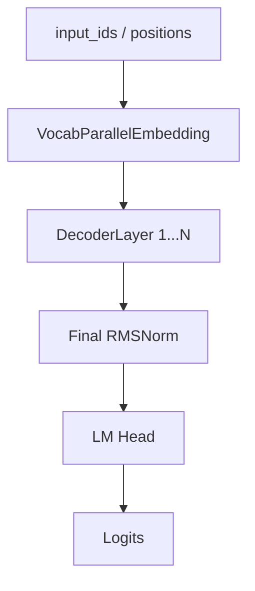
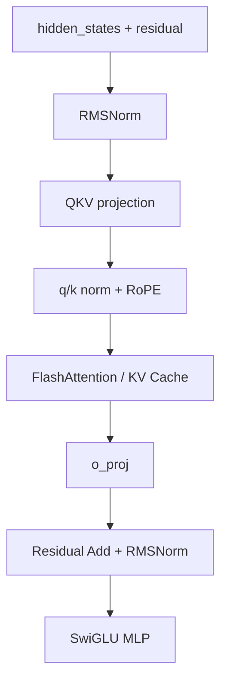

# Qwen3 Dense Forward 与 Qwen3.5 / Qwen3.6 Hybrid 架构详解

> 面向阶段：你已经熟悉 nano-vLLM 的整体推理流程，准备继续学习 `nano-vllm-qwen3.6` 项目。  
> 本文目标：先把 **Qwen3 dense 模型的一次 forward** 完整串起来，再解释 **Qwen3 到 Qwen3.5 / Qwen3.6 的结构变化**，尤其是 hybrid 架构和 Gated DeltaNet。

---

## 0. 先给结论

Qwen3 dense 和 Qwen3.5 / Qwen3.6 最大的区别可以先这样记：

| 模型阶段 | 主体结构 | 每层 token 混合方式 | FFN 部分 | 推理状态 |
|---|---|---|---|---|
| Qwen3 dense | 标准 Decoder-only Transformer | 每层都是 full attention | Dense MLP / SwiGLU | KV Cache |
| Qwen3 MoE | Decoder-only Transformer + MoE | 每层仍是 attention | MoE FFN | KV Cache + expert routing |
| Qwen3.5 小模型 | Hybrid 架构 | 大部分层是 Gated DeltaNet，少数层是 Gated Attention | Dense FFN | GDN recurrent state + attention KV Cache |
| Qwen3.6-35B-A3B | Hybrid + MoE + vision encoder | 大部分层是 Gated DeltaNet，少数层是 Gated Attention | MoE | GDN state + attention KV Cache + expert routing |

最核心的一句话：

**Qwen3 dense 是“每层 full attention + MLP”的标准 Transformer；Qwen3.5 / 3.6 开始变成 hybrid backbone：多数层用 Gated DeltaNet 这种线性注意力 / recurrent memory 来降低长上下文成本，少数层保留 full attention 来补全全局精确建模能力。**

---

## 1. Qwen3 Dense 模型结构总览

在 nano-vLLM 的 `qwen3.py` 中，Qwen3 dense 的类结构是：

```text
Qwen3ForCausalLM
  ├── Qwen3Model
  │   ├── VocabParallelEmbedding
  │   ├── Qwen3DecoderLayer × num_hidden_layers
  │   │   ├── RMSNorm
  │   │   ├── Qwen3Attention
  │   │   │   ├── QKVParallelLinear
  │   │   │   ├── q_norm / k_norm
  │   │   │   ├── RotaryEmbedding
  │   │   │   ├── Attention
  │   │   │   └── RowParallelLinear
  │   │   ├── RMSNorm
  │   │   └── Qwen3MLP
  │   │       ├── MergedColumnParallelLinear
  │   │       ├── SiluAndMul
  │   │       └── RowParallelLinear
  │   └── final RMSNorm
  └── ParallelLMHead
```

从 Transformer 视角看，它就是一个标准 decoder-only causal LM：

```text
input_ids
  ↓
token embedding
  ↓
N 层 Decoder Layer
  ↓
final RMSNorm
  ↓
lm_head
  ↓
logits
  ↓
sampler 采样下一个 token
```

在 nano-vLLM 中，`Qwen3ForCausalLM.forward()` 只返回 hidden states，真正把 hidden states 变成 logits 的步骤在 `compute_logits()` 里。

这样设计是为了推理引擎方便控制：

1. prefill 阶段只取每个请求最后一个 token 的 logits；
2. decode 阶段每个请求本来就只有一个新 token；
3. sampler 只需要 logits，不需要全部 token 的输出。

---

## 2. 一次 Qwen3 Dense Forward：从输入到输出完整串联

下面按照一次推理 forward 的真实顺序来串。

### 2.1 输入：`input_ids` 和 `positions`

模型 forward 接收两个核心输入：

```python
def forward(self, input_ids, positions):
    ...
```

含义如下：

| 输入 | 含义 |
|---|---|
| `input_ids` | tokenizer 得到的 token id |
| `positions` | 每个 token 在序列中的位置，用于 RoPE |

在推理系统中，`input_ids` 的形状不一定是传统训练里的 `[batch, seq_len]`。

nano-vLLM 为了支持 continuous batching，会把多个请求当前需要计算的 token 拼成一个大的一维 token 序列：

```text
input_ids: [num_tokens]
positions: [num_tokens]
```

其中 `num_tokens` 可能是：

1. prefill 阶段多个 prompt 的 token 总数；
2. decode 阶段多个请求各 1 个 token 的总数。

---

### 2.2 Embedding：token id 变成 hidden states

源码：

```python
hidden_states = self.embed_tokens(input_ids)
```

作用：

```text
input_ids:      [num_tokens]
hidden_states:  [num_tokens, hidden_size]
```

这一步本质是查表：

```text
第 i 个 token id -> embedding 表中的第 token_id 行向量
```

在 nano-vLLM 中使用的是 `VocabParallelEmbedding`。

如果 tensor parallel size > 1，词表会按 vocab 维度切分到不同 GPU 上：

```text
GPU0: 负责 vocab 的一部分
GPU1: 负责 vocab 的另一部分
...
```

每张卡只查自己负责的词表片段，然后通过 `all_reduce` 合并结果。

---

### 2.3 进入多层 Decoder Layer

源码：

```python
residual = None
for layer in self.layers:
    hidden_states, residual = layer(positions, hidden_states, residual)
```

Qwen3 dense 的每一层结构是：

```text
RMSNorm
  ↓
Self Attention
  ↓
Residual Add + RMSNorm
  ↓
MLP / SwiGLU
  ↓
Residual 留到下一层处理
```

nano-vLLM 的 residual 写法稍微特殊。

它不是每一步都立即写成：

```text
x = x + sublayer(norm(x))
```

而是把 residual 和 RMSNorm 的 add 融合在一起处理。

这样做的好处是：

1. 减少中间张量；
2. 方便把 add + norm 做成更高效 kernel；
3. 更接近 vLLM 这类推理框架中的 fused add rmsnorm 思路。

---

## 3. 单层 Qwen3DecoderLayer 详解

源码结构：

```python
class Qwen3DecoderLayer(nn.Module):
    self.self_attn = Qwen3Attention(...)
    self.mlp = Qwen3MLP(...)
    self.input_layernorm = RMSNorm(...)
    self.post_attention_layernorm = RMSNorm(...)
```

forward：

```python
def forward(self, positions, hidden_states, residual):
    if residual is None:
        hidden_states, residual = self.input_layernorm(hidden_states), hidden_states
    else:
        hidden_states, residual = self.input_layernorm(hidden_states, residual)

    hidden_states = self.self_attn(positions, hidden_states)

    hidden_states, residual = self.post_attention_layernorm(hidden_states, residual)

    hidden_states = self.mlp(hidden_states)

    return hidden_states, residual
```

这个写法看起来和教科书 Transformer 不太一样，但逻辑是一样的。

可以拆成下面两段。

### 3.1 第一段：Attention 前的 RMSNorm

如果是第一层：

```text
residual = None
hidden_states = embedding 输出
```

执行：

```text
normed_x = RMSNorm(hidden_states)
residual = hidden_states
```

如果不是第一层：

```text
hidden_states = 上一层 MLP 输出
residual = 上一层保留下来的残差主干
```

执行：

```text
residual = hidden_states + residual
normed_x = RMSNorm(residual)
```

所以这个 `RMSNorm(x, residual)` 实际包含两件事：

```text
先 residual add
再 RMSNorm
```

---

### 3.2 第二段：Self Attention

执行：

```python
hidden_states = self.self_attn(positions, hidden_states)
```

输入是 norm 后的 hidden states。

输出是 attention 子层输出。

注意：这里还没有立刻和 residual 相加。

这个相加会放到下一句 `post_attention_layernorm(hidden_states, residual)` 中完成。

---

### 3.3 第三段：Attention 输出残差 + RMSNorm

执行：

```python
hidden_states, residual = self.post_attention_layernorm(hidden_states, residual)
```

对应数学逻辑：

```text
residual = residual + attention_output
hidden_states = RMSNorm(residual)
```

所以这一步等价于 Transformer 里的：

```text
x = x + Attention(RMSNorm(x))
mlp_input = RMSNorm(x)
```

---

### 3.4 第四段：MLP / SwiGLU

执行：

```python
hidden_states = self.mlp(hidden_states)
```

对应：

```text
mlp_output = MLP(mlp_input)
```

注意：MLP 输出也没有在当前层末尾立刻加 residual。

它会在下一层开头的 `input_layernorm(hidden_states, residual)` 中被加到 residual 上。

最后一层结束后，`Qwen3Model.forward()` 里会执行：

```python
hidden_states, _ = self.norm(hidden_states, residual)
```

这一步把最后一层 MLP 输出也加回 residual，并做 final norm。

---

## 4. Qwen3Attention：一次 Attention 子层怎么走

Qwen3 attention 的 forward：

```python
qkv = self.qkv_proj(hidden_states)
q, k, v = qkv.split([self.q_size, self.kv_size, self.kv_size], dim=-1)
q = q.view(-1, self.num_heads, self.head_dim)
k = k.view(-1, self.num_kv_heads, self.head_dim)
v = v.view(-1, self.num_kv_heads, self.head_dim)
if not self.qkv_bias:
    q = self.q_norm(q)
    k = self.k_norm(k)
q, k = self.rotary_emb(positions, q, k)
o = self.attn(q, k, v)
output = self.o_proj(o.flatten(1, -1))
return output
```

完整流程如下。

### 4.1 QKV projection

输入：

```text
hidden_states: [num_tokens, hidden_size]
```

经过 `QKVParallelLinear`：

```text
qkv: [num_tokens, local_q_size + local_k_size + local_v_size]
```

在普通 Transformer 里，我们通常写：

```text
q = x Wq
k = x Wk
v = x Wv
```

而在推理框架中，为了减少 kernel 调用和方便权重加载，常常把三个线性层合并：

```text
qkv = x Wqkv
```

nano-vLLM 中的 `packed_modules_mapping` 说明了权重加载时如何把 Hugging Face 的：

```text
q_proj
k_proj
v_proj
```

打包到本地的：

```text
qkv_proj
```

---

### 4.2 GQA：Q 头数多，KV 头数少

Qwen3 使用 GQA，也就是 grouped-query attention。

代码中：

```python
self.total_num_heads = num_heads
self.total_num_kv_heads = num_kv_heads
```

官方 Qwen3-0.6B 模型卡中写的是：

```text
Q heads = 16
KV heads = 8
```

这说明 Q 的头数多于 K/V。

形状可以理解为：

```text
q: [num_tokens, num_q_heads, head_dim]
k: [num_tokens, num_kv_heads, head_dim]
v: [num_tokens, num_kv_heads, head_dim]
```

为什么要 GQA？

因为 decode 阶段最占显存的是 KV Cache。

如果 K/V 头数减少，KV Cache 也会减少：

```text
KV Cache 大小 ∝ num_kv_heads × head_dim × seq_len × layers
```

所以 GQA 是一种推理友好的结构：

1. Q 保持较强表达能力；
2. K/V 头数减少，降低 KV Cache 显存；
3. decode 阶段读 KV Cache 的带宽压力下降。

---

### 4.3 q_norm / k_norm

代码中：

```python
if not self.qkv_bias:
    q = self.q_norm(q)
    k = self.k_norm(k)
```

这表示如果 QKV projection 没有 bias，就对 q 和 k 做 RMSNorm。

直观理解：

1. q 和 k 是拿来做点积的；
2. 点积大小会影响 softmax 的分布；
3. 对 q/k 做归一化，可以稳定 attention score。

在推理时，这一步是 attention 内部的小计算，但会影响数值稳定性。

---

### 4.4 RoPE：给 q/k 注入位置信息

代码：

```python
q, k = self.rotary_emb(positions, q, k)
```

RoPE 只作用在 q 和 k 上，不作用在 v 上。

原因是：

1. q/k 决定 token 之间的匹配分数；
2. 位置信息应该影响“谁和谁相关”；
3. v 是被加权汇总的内容本身，不需要旋转位置。

RoPE 的效果可以理解为：

```text
同一个 token 向量，在不同 position 上会被旋转成不同方向
```

这样 attention 在计算 `q · k` 时，就能感知相对位置。

---

### 4.5 Attention kernel：prefill 和 decode 不同路径

nano-vLLM 的 `Attention.forward()` 会根据当前上下文选择路径：

```python
if context.is_prefill:
    o = flash_attn_varlen_func(...)
else:
    o = flash_attn_with_kvcache(...)
```

#### Prefill 阶段

prefill 阶段一次处理 prompt 的全部 token：

```text
q/k/v 都来自当前 prompt
```

它使用：

```text
flash_attn_varlen_func
```

并通过 `cu_seqlens_q`、`cu_seqlens_k` 支持多个不同长度请求拼在一起计算。

如果有 prefix cache，则可能直接复用已有 KV Cache。

#### Decode 阶段

decode 阶段每个请求只计算一个新 token：

```text
q = 当前新 token 的 query
k/v = 当前新 token 的 key/value + 历史 KV Cache
```

它使用：

```text
flash_attn_with_kvcache
```

并通过：

```text
k_cache
v_cache
context_lens
block_tables
```

从分页 KV Cache 中读取历史 K/V。

---

### 4.6 输出投影 o_proj

Attention kernel 输出：

```text
o: [num_tokens, num_q_heads, head_dim]
```

先 flatten：

```text
o.flatten(1, -1): [num_tokens, num_q_heads * head_dim]
```

再经过 `o_proj`：

```text
output: [num_tokens, hidden_size]
```

这一步对应标准 Transformer 里的输出投影：

```text
O = Concat(heads) W_o
```

---

## 5. Qwen3MLP：SwiGLU 结构

Qwen3 dense 的 MLP：

```python
gate_up = self.gate_up_proj(x)
x = self.act_fn(gate_up)
x = self.down_proj(x)
```

其中 `gate_up_proj` 是合并线性层：

```text
gate_proj 和 up_proj 合并
```

输出会被切成两半：

```python
x, y = gate_up.chunk(2, -1)
return silu(x) * y
```

这就是 SwiGLU：

```text
SwiGLU(x) = SiLU(x W_gate) ⊙ (x W_up)
```

再经过：

```text
down_proj
```

回到 hidden_size。

形状变化：

```text
[num_tokens, hidden_size]
  ↓ gate_up_proj
[num_tokens, 2 × intermediate_size]
  ↓ chunk + SiLU + multiply
[num_tokens, intermediate_size]
  ↓ down_proj
[num_tokens, hidden_size]
```

直观理解：

1. `up_proj` 负责扩维，提供候选特征；
2. `gate_proj` 经过 SiLU 产生门控；
3. 两者相乘，表示“哪些特征允许通过”；
4. `down_proj` 再压回 hidden_size。

---

## 6. Final Norm、LM Head 和 Logits

所有 decoder layer 跑完后：

```python
hidden_states, _ = self.norm(hidden_states, residual)
```

得到最终 hidden states：

```text
[num_tokens, hidden_size]
```

然后在 `Qwen3ForCausalLM.compute_logits()` 中：

```python
logits = self.lm_head(hidden_states)
```

输出：

```text
logits: [num_selected_tokens, vocab_size]
```

这里要注意 `ParallelLMHead.forward()`：

```python
if context.is_prefill:
    last_indices = context.cu_seqlens_q[1:] - 1
    x = x[last_indices].contiguous()
```

也就是说：

1. prefill 阶段，prompt 里每个 token 都算 hidden states；
2. 但真正需要采样的是每个请求最后一个 token；
3. 所以 lm_head 只取每个请求最后位置的 hidden state 去算 logits；
4. decode 阶段，每个请求本来只有一个 token，所以直接算 logits。

这就是推理框架里非常关键的性能意识：

**不要对不需要采样的位置计算完整 vocab logits。**

---

## 7. Qwen3 Dense 一次 forward 总流程图



单个 decoder layer 内部：



---

## 8. Qwen3、Qwen3.5、Qwen3.6 的主要区别

### 8.1 Qwen3：标准 Transformer backbone

Qwen3 模型族包括 dense 和 MoE 两类。

以 Qwen3 dense 为例，它的主干还是标准 decoder-only Transformer：

```text
Attention -> MLP
Attention -> MLP
Attention -> MLP
...
```

Qwen3-0.6B 官方模型卡给出的信息包括：

1. Causal Language Model；
2. 28 层；
3. GQA：16 个 Q heads，8 个 KV heads；
4. 上下文长度 32,768；
5. 支持 thinking / non-thinking 模式切换。

从工程角度看，Qwen3 dense 对 nano-vLLM 来说非常友好：

1. 每层结构规律；
2. 每层都有 KV Cache；
3. attention kernel 可以统一处理；
4. MLP 是普通 dense MLP；
5. 不涉及 recurrent state；
6. 不涉及 MoE routing。

---

### 8.2 Qwen3.5：开始进入 hybrid 架构

Qwen3.5 的官方模型卡明确写到它采用：

```text
Efficient Hybrid Architecture:
Gated Delta Networks combined with sparse Mixture-of-Experts
```

以 Qwen3.5-0.8B 为例，语言模型布局是：

```text
6 × (3 × (Gated DeltaNet → FFN) → 1 × (Gated Attention → FFN))
```

展开理解就是：

```text
第 1 组:
  Gated DeltaNet -> FFN
  Gated DeltaNet -> FFN
  Gated DeltaNet -> FFN
  Gated Attention -> FFN

第 2 组:
  Gated DeltaNet -> FFN
  Gated DeltaNet -> FFN
  Gated DeltaNet -> FFN
  Gated Attention -> FFN

...

共 6 组 = 24 层
```

也就是说，在 Qwen3.5-0.8B 中：

```text
Gated DeltaNet 层：18 层
Gated Attention 层：6 层
总层数：24 层
```

这说明它不再是“每层都是 full attention”。

它变成了：

```text
大多数层用 Gated DeltaNet
少数层保留 Gated Attention
```

这就是 hybrid。

---

### 8.3 Qwen3.6：hybrid + MoE + 更强 agent / coding 取向

Qwen3.6-35B-A3B 官方模型卡给出的语言模型布局是：

```text
10 × (3 × (Gated DeltaNet → MoE) → 1 × (Gated Attention → MoE))
```

展开理解：

```text
每 4 层一组:
  3 层 Gated DeltaNet
  1 层 Gated Attention

重复 10 组:
  总层数 40
```

所以：

```text
Gated DeltaNet 层：30 层
Gated Attention 层：10 层
总层数：40 层
```

与 Qwen3.5-0.8B 的区别在于：

| 对比项 | Qwen3.5-0.8B | Qwen3.6-35B-A3B |
|---|---|---|
| 层数 | 24 | 40 |
| 布局 | 6 组，每组 3 GDN + 1 Attention | 10 组，每组 3 GDN + 1 Attention |
| FFN | Dense FFN | MoE |
| 参数量 | 0.8B | 35B total / 3B activated |
| 是否有 vision encoder | 有 | 有 |
| 上下文 | 262K | 262K native，可扩展到 1M |
| 目标 | 小规模高效 hybrid 多模态基础模型 | 更强 coding / agent / real-world utility |

这里的 `35B-A3B` 意思是：

```text
总参数量约 35B
每个 token 激活约 3B 参数
```

这是 MoE 的典型写法。

也就是说，模型总容量很大，但每个 token 不会经过所有专家，只会经过一部分专家。

---

## 9. 什么是 Hybrid 架构

### 9.1 先从普通 Transformer 说起

普通 decoder-only Transformer 的每一层基本都是：

```text
Self Attention
  ↓
MLP
```

每一层都用 full attention。

full attention 的优点：

1. 每个 token 可以直接看见上下文中所有 token；
2. 信息交互非常直接；
3. 表达能力强；
4. 很适合复杂推理、检索、长距离依赖。

缺点：

1. prefill 计算复杂度接近 `O(n^2)`；
2. decode 需要不断读越来越长的 KV Cache；
3. 长上下文显存压力很大；
4. KV Cache 随序列长度线性增长。

---

### 9.2 Hybrid 的意思

hybrid 架构就是：

**不再让所有层都使用同一种 token mixing 机制，而是把不同机制混合使用。**

在 Qwen3.5 / 3.6 中，混合的是：

```text
Gated DeltaNet + Gated Attention
```

可以理解为：

| 结构 | 作用 |
|---|---|
| Gated DeltaNet | 高效处理长序列，使用 recurrent state 压缩历史信息 |
| Gated Attention | 保留 full attention 的强表达能力和精确 token-to-token 交互 |

所以 hybrid 不是随便拼，而是在性能和能力之间做权衡：

```text
大部分层用便宜的长上下文机制
少部分层用昂贵但强大的 full attention
```

---

### 9.3 为什么是 3 个 GDN + 1 个 Attention

Qwen3.5 / 3.6 的布局都是类似：

```text
3 × Gated DeltaNet + 1 × Gated Attention
```

直观理解：

1. 前面几层 GDN 用较低成本持续吸收上下文信息；
2. 每隔几层插入一次 full attention，让 token 能进行更直接的全局交互；
3. 这样既保留长上下文效率，又不完全失去 attention 的建模能力。

对于推理系统，这意味着不能再假设：

```text
每一层都有 KV Cache
```

而要区分：

```text
Attention 层：需要 KV Cache
Gated DeltaNet 层：需要 recurrent state / conv state 等状态
```

---

## 10. 初学者理解 Gated DeltaNet

### 10.1 先理解 full attention 的“记忆方式”

在标准 attention 中，模型保存历史信息的方式是 KV Cache。

每生成一个 token，就把这个 token 的 K/V 存下来：

```text
token 1 -> K1, V1
token 2 -> K2, V2
token 3 -> K3, V3
...
```

decode 第 t 个 token 时：

```text
当前 Q_t 去和所有历史 K_1...K_t 做匹配
再加权汇总所有 V_1...V_t
```

这就像：

**模型把所有历史笔记都摊在桌上，每次回答问题都翻一遍所有笔记。**

优点是信息完整。

缺点是历史越长，桌上的笔记越多，每次翻阅越慢、越占空间。

---

### 10.2 Gated DeltaNet 的“记忆方式”

Gated DeltaNet 不保存每个历史 token 的完整 K/V 列表。

它更像维护一个固定大小的状态：

```text
state
```

每来一个新 token，就用这个 token 更新 state：

```text
state_t = update(state_{t-1}, token_t)
```

生成时再从 state 中读取信息：

```text
output_t = read(state_t, query_t)
```

这有点像：

**不把所有历史笔记都摊开保存，而是维护一本不断更新的摘要笔记。新信息来了，就把摘要笔记改一下；要回答问题，就查这本摘要笔记。**

优点：

1. 状态大小可以固定；
2. 不需要随上下文无限增长 KV Cache；
3. 长上下文更省内存；
4. decode 复杂度更稳定。

缺点：

1. 摘要笔记不是原始全文；
2. 压缩历史可能损失某些细节；
3. 因此仍需要少量 full attention 层补强精确交互。

---

### 10.3 什么是 Delta

Delta 可以理解为“更新量”。

如果普通记忆更新是：

```text
把新内容直接写进 state
```

DeltaNet 更强调：

```text
先看当前 state 中已经读出了什么
再计算新 value 和已有读取结果之间的差值
把这个差值写回 state
```

非常直观地说：

```text
如果 state 里已经记住了类似内容，就少写一点；
如果新内容和旧记忆差异很大，就写入差异部分。
```

这比“无脑覆盖”更精细。

Gated DeltaNet 论文里的核心动机之一就是：delta rule 适合做精准更新，而 gate 适合做自适应遗忘，两者互补。

---

### 10.4 什么是 Gated

Gate 就是门控。

门控的作用是控制：

```text
哪些信息保留
哪些信息忘掉
哪些信息写入
写入多少
```

可以把 gate 想象成一个 0 到 1 的开关：

```text
gate 接近 0：少更新 / 少写入 / 多保留
gate 接近 1：多更新 / 多擦除 / 多写入
```

在长上下文模型中，门控很重要，因为不是所有历史信息都同等重要。

模型需要学会：

1. 高频无用信息可以忘；
2. 当前任务相关信息要保留；
3. 新出现的重要实体、约束、代码变量要写入；
4. 旧的过时信息要覆盖。

---

### 10.5 Gated DeltaNet 和线性注意力的关系

Gated DeltaNet 可以归入线性注意力 / recurrent sequence model 的大类。

与 full attention 的差别：

| 对比项 | Full Attention | Gated DeltaNet |
|---|---|---|
| 历史存储 | 保存所有 token 的 K/V | 保存固定大小 state |
| decode 记忆 | KV Cache 随长度增长 | recurrent state 大小相对固定 |
| token 交互 | 当前 token 可直接看所有历史 token | 通过压缩 state 读取历史 |
| 长上下文成本 | 随长度增长明显 | 更适合长上下文 |
| 信息精确度 | 高 | 取决于 state 是否记住 |

所以 GDN 的目标不是在所有方面替代 attention，而是：

**用更便宜的方式承担大部分长序列建模，再配合少量 full attention 保留精确交互能力。**

---

## 11. 对 nano-vLLM / vLLM 推理系统意味着什么

Qwen3 dense 的推理系统假设相对简单：

```text
每层 attention 都有 KV Cache
每层 forward 都是 Attention + MLP
```

但 Qwen3.5 / 3.6 的 hybrid 架构会引入新的工程问题。

### 11.1 层类型不能再统一

Qwen3 dense：

```text
Layer i = Attention + MLP
```

Qwen3.6：

```text
Layer i 可能是 Gated DeltaNet + MoE
Layer j 可能是 Gated Attention + MoE
```

所以模型代码要支持：

```text
if layer_type == "gated_delta_net":
    run_gdn(...)
elif layer_type == "gated_attention":
    run_attention(...)
```

---

### 11.2 KV Cache 不能按总层数分配

Qwen3 dense 中，每层都是 attention，因此：

```text
KV Cache layers = num_hidden_layers
```

但 Qwen3.6 中，只有 Gated Attention 层需要 KV Cache。

例如 40 层中只有 10 层是 Gated Attention：

```text
KV Cache layers = 10
GDN state layers = 30
```

如果仍然按 40 层分配 KV Cache，就会浪费大量显存。

---

### 11.3 GDN 层需要新的 state 管理

Gated DeltaNet 层不是保存 K/V 列表，而是维护 recurrent state。

推理框架需要管理：

```text
每个请求
每个 GDN 层
对应的 recurrent state
```

可能还包括：

```text
conv state
```

这和 KV Cache 的 block table 管理不同。

KV Cache 像分页存储历史 token 的 K/V；

GDN state 更像每个请求每层都有一块固定状态，需要在 decode 中持续更新。

---

### 11.4 Prefill 和 decode 的边界更复杂

Qwen3 dense：

```text
prefill: 建 KV Cache
decode: 读 KV Cache + 追加新 KV
```

Qwen3.6 hybrid：

```text
prefill:
  Attention 层写 KV Cache
  GDN 层扫描 prompt，得到最终 recurrent state

decode:
  Attention 层读写 KV Cache
  GDN 层读取上一 token state，更新成新 state
```

因此，prefill 不再只是“把 K/V 写进 cache”，还要把 GDN 的 recurrent state 跑到 prompt 末尾。

---

### 11.5 CUDA Graph / replay 要更小心

如果推理框架使用 CUDA Graph 优化 decode，需要保证每次 replay 时：

1. KV Cache 地址稳定；
2. GDN state 地址稳定；
3. 当前请求到 state 的映射稳定；
4. batch 中请求结束或新增时，状态管理不会破坏 graph 假设。

这也是 Qwen3.6 类项目比 Qwen3 dense 更复杂的核心原因。

---

## 12. Qwen3 dense 到 Qwen3.6 学习路线建议

你已经熟悉 nano-vLLM，现在看 qwen3.6 项目时，可以按这个顺序：

### 第一步：先确认模型层类型布局

重点看配置中有没有类似：

```text
layer_types
hidden_layout
gated_delta_net
gated_attention
```

你要先回答：

1. 哪些层是 GDN？
2. 哪些层是 Attention？
3. GDN 和 Attention 是固定 3:1 交替吗？
4. FFN 是 dense FFN 还是 MoE？

---

### 第二步：对比 Qwen3Attention 和 GatedAttention

关注：

1. 是否还是 q/k/v projection；
2. 是否仍然使用 RoPE；
3. 是否有额外 gate；
4. KV Cache 存储格式是否变化；
5. attention head / kv head / head_dim 如何配置。

---

### 第三步：重点看 GatedDeltaNet forward

你要盯住几个问题：

1. 输入 hidden_states 后生成了哪些投影？
2. 有没有 q/k/v 或类似变量？
3. recurrent state 的 shape 是什么？
4. prefill 是否用并行 scan / chunk scan？
5. decode 是否逐 token 更新 state？
6. state 存在哪里？
7. state 如何随请求生命周期释放？

---

### 第四步：看 MoE

Qwen3.6-35B-A3B 的 FFN 是 MoE，不是普通 dense MLP。

你要看：

1. router / gate 怎么选 expert；
2. top-k 是多少；
3. shared expert 怎么处理；
4. expert 权重如何加载；
5. inference 时 token 如何分发到 expert；
6. 最后如何 combine 回 hidden_states。

---

### 第五步：看推理引擎改动

模型结构变了之后，engine 通常也要变：

1. block_manager 是否只管理 attention 层 KV Cache；
2. 是否新增 GDN state manager；
3. sequence 对象是否记录 recurrent state；
4. scheduler 是否需要考虑 state；
5. CUDA graph warmup 是否覆盖 GDN；
6. prefix cache 是否能支持 recurrent state 快照。

---

## 13. 最应该记住的对比

### Qwen3 dense forward 一句话

```text
input_ids -> embedding -> N 层 [RMSNorm -> QKV/GQA/RoPE/Attention/KV Cache -> RMSNorm -> SwiGLU MLP] -> final norm -> lm_head -> logits
```

### Qwen3.5 / 3.6 hybrid forward 一句话

```text
input_ids -> embedding -> 多组 [3 层 GatedDeltaNet + 1 层 GatedAttention]，每层后接 FFN 或 MoE -> final norm -> lm_head -> logits
```

### 对推理系统的一句话

```text
Qwen3 dense 主要管理 KV Cache；Qwen3.5 / 3.6 既要管理 attention KV Cache，又要管理 GatedDeltaNet 的 recurrent state，并且 Qwen3.6 还要处理 MoE routing。
```

---

## 14. 参考资料

1. [Qwen3-0.6B Hugging Face 模型卡](https://huggingface.co/Qwen/Qwen3-0.6B)：说明 Qwen3 dense 模型的 GQA、层数和上下文信息。
2. [Qwen3.5-0.8B Hugging Face 模型卡](https://huggingface.co/Qwen/Qwen3.5-0.8B)：说明 Qwen3.5 的 `6 × (3 × (Gated DeltaNet → FFN) → 1 × (Gated Attention → FFN))` 布局。
3. [Qwen3.6-35B-A3B Hugging Face 模型卡](https://huggingface.co/Qwen/Qwen3.6-35B-A3B)：说明 Qwen3.6 的 `10 × (3 × (Gated DeltaNet → MoE) → 1 × (Gated Attention → MoE))` 布局。
4. [Gated Delta Networks: Improving Mamba2 with Delta Rule](https://arxiv.org/abs/2412.06464)：解释 Gated DeltaNet 中 gating 与 delta update rule 的动机。

---

## 15. 最后总结

如果你准备开始学习 `nano-vllm-qwen3.6`，要先把思维从“标准 Transformer 每层都一样”切换到“不同层有不同状态”的角度。

Qwen3 dense 的重点是：

```text
Attention + KV Cache + SwiGLU MLP
```

Qwen3.6 的重点会变成：

```text
Gated DeltaNet recurrent state
+ 少量 Gated Attention KV Cache
+ MoE expert routing
+ 长上下文状态管理
```

所以你后面看源码时，最重要的不是一上来背每个函数，而是先画出这三张表：

| 层号 | 层类型 | 需要什么状态 |
|---|---|---|
| 0 | GatedDeltaNet | recurrent state |
| 1 | GatedDeltaNet | recurrent state |
| 2 | GatedDeltaNet | recurrent state |
| 3 | GatedAttention | KV Cache |

然后再沿着：

```text
prefill 如何初始化状态
decode 如何更新状态
scheduler 如何保存/释放状态
```

去读项目代码。这样你会比直接扎进 GatedDeltaNet 公式轻松很多。


%% 项目关联导航：开始 %%
## 项目关联导航

- 所属模块：[[outputs/项目整理/模块-nano-vllm-qwen3.6|模块-nano-vllm-qwen3.6]]

%% 项目关联导航：结束 %%
