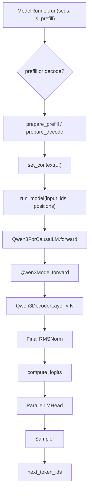
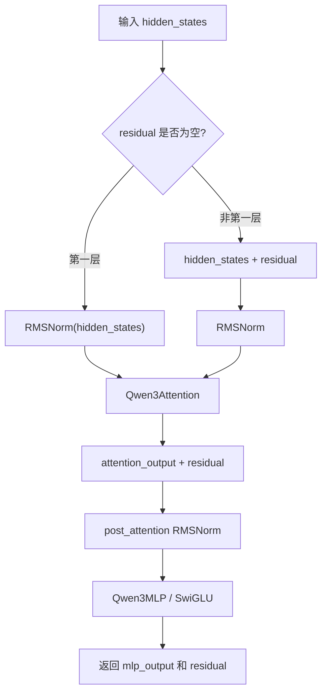
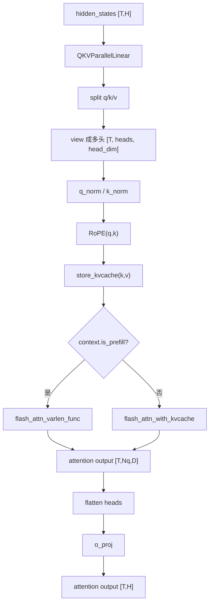
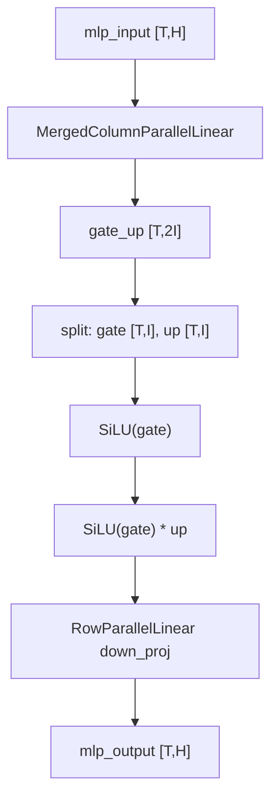
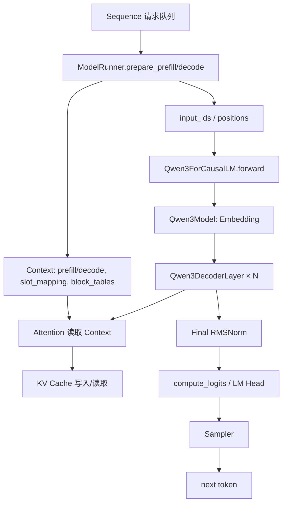
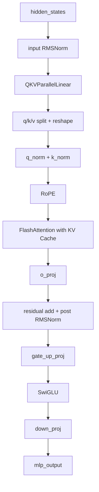
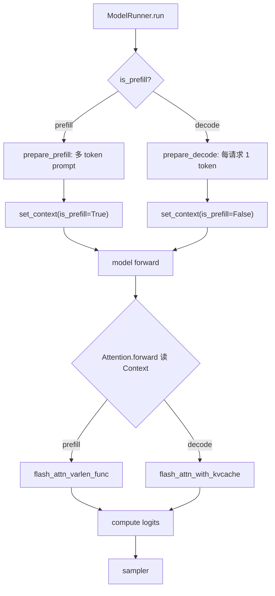

# Qwen3 Decoder-only 架构与 nano-vLLM 模型代码对应总览

> 目标：把 **Qwen3 dense 模型结构知识** 和 **nano-vLLM 中的实际工程代码** 串成一条完整学习线。  
> 你读完这份文档后，应该能回答三个问题：  
> 1. Qwen3 dense 作为 decoder-only causal LM，一次 forward 到底怎么走？  
> 2. nano-vLLM 中每个模型相关代码文件分别对应 Transformer 的哪个概念？  
> 3. 从 `ModelRunner.run()` 到 `Sampler`，各个文件如何互相调用？

---

## 1. 先建立总认知：Qwen3 dense 是什么

Qwen3 dense 可以先用一句话理解：

**Qwen3 dense 是一个 decoder-only Transformer causal language model，每一层都由 causal self-attention + MLP 组成，用 KV Cache 支持自回归推理。**

拆开看：

| 词 | 含义 |
|---|---|
| Qwen3 | 千问第三代模型族 |
| dense | 每个 token 都经过同一套普通 MLP 参数，不是 MoE 专家路由 |
| decoder-only | 只有 Transformer decoder block，没有 encoder |
| causal LM | 自回归语言模型，只能看当前位置及其之前的 token |
| forward | 输入 token id，经过 embedding、decoder layers、norm、lm head，得到 logits |

如果只看概念图，Qwen3 dense 是：

```text
input_ids
  ↓
Embedding
  ↓
DecoderLayer × N
  ↓
Final RMSNorm
  ↓
LM Head
  ↓
logits
  ↓
Sampler
  ↓
next_token_id
```

其中每个 `DecoderLayer` 是：

```text
RMSNorm
  ↓
Causal Self-Attention
  ↓
Residual Add
  ↓
RMSNorm
  ↓
SwiGLU MLP
  ↓
Residual Add
```

nano-vLLM 的代码没有按教科书完全原样写，而是为了推理效率把一些步骤融合或延迟处理，例如：

1. `q_proj/k_proj/v_proj` 合并成 `qkv_proj`；
2. `gate_proj/up_proj` 合并成 `gate_up_proj`；
3. `residual add + RMSNorm` 合并在 `RMSNorm.forward(x, residual)` 里；
4. prefill/decode 的差异不写在 `qwen3.py` 里，而是由 `context.py` 和 `attention.py` 配合处理。

---

## 2. 概念结构和代码文件的对应表

先把文件放到整体地图里。

| 代码文件 | 对应概念 | 在 forward 中的位置 | 主要作用 |
|---|---|---|---|
| `engine/model_runner.py` | 推理执行入口 | 模型 forward 之前和之后 | 准备 input_ids、positions、Context、KV Cache，调用模型和 sampler |
| `utils/context.py` | 推理上下文 | Attention kernel 选择时 | 保存 prefill/decode、cu_seqlens、slot_mapping、block_tables 等运行时信息 |
| `utils/loader.py` | 权重加载 | 模型初始化之后 | 从 safetensors 加载权重，并处理 q/k/v、gate/up 合并权重 |
| `models/qwen3.py` | Qwen3 模型主体 | 核心 forward | 定义 Qwen3ForCausalLM、Qwen3Model、DecoderLayer、Attention、MLP |
| `layers/embed_head.py` | Embedding + LM Head | forward 开头和 logits 输出 | token id 查表；hidden states 转 logits |
| `layers/layernorm.py` | RMSNorm | 每层 attention/MLP 前后 | 做 RMSNorm，也支持 fused add + RMSNorm |
| `layers/linear.py` | 并行线性层 | QKV、o_proj、MLP | 实现 TP 下的 Column/Row parallel linear |
| `layers/rotary_embedding.py` | RoPE | Attention 内部 q/k 后 | 给 q/k 注入位置信息 |
| `layers/attention.py` | Attention kernel + KV Cache | Attention 内部 | 存 KV Cache；prefill 用 varlen flash attention；decode 用 kvcache attention |
| `layers/activation.py` | SwiGLU 激活 | MLP 内部 | `SiLU(gate) * up` |
| `layers/sampler.py` | 采样 | logits 之后 | 根据 logits 和 temperature 采样下一个 token |

可以这样记：

```text
model_runner.py 负责“什么时候跑、跑哪些 token”
qwen3.py 负责“模型结构长什么样”
layers/*.py 负责“每个数学模块怎么实际计算”
context.py 负责“告诉 attention 当前是 prefill 还是 decode”
loader.py 负责“把 HF 权重塞进 nano-vLLM 的合并模块”
sampler.py 负责“从 logits 选下一个 token”
```

---

## 3. 总调用关系图

下面是从推理执行入口到采样输出的完整调用关系。



这张图要重点理解：

1. `ModelRunner` 不直接写 Attention 公式；
2. `Qwen3ForCausalLM` 不关心调度，也不关心 batch 怎么拼；
3. `Attention` 不自己判断请求长度，而是读取全局 `Context`；
4. `Sampler` 不关心模型结构，只关心 logits。

这就是工程代码的分层：

```text
Engine / Runner 层：组织请求和显存状态
Model 层：执行 Transformer forward
Layer 层：执行具体算子
Sampler 层：把 logits 变成 token
```

---

## 4. 从 `ModelRunner.run()` 开始串一次 forward

一次推理 step 的入口是：

```python
ModelRunner.run(seqs, is_prefill)
```

其中：

| 参数 | 含义 |
|---|---|
| `seqs` | 当前被调度的一批请求 |
| `is_prefill` | 当前 step 是 prefill 还是 decode |

`run()` 做四件事：

```python
input_ids, positions = self.prepare_prefill(seqs) if is_prefill else self.prepare_decode(seqs)
temperatures = self.prepare_sample(seqs)
logits = self.run_model(input_ids, positions, is_prefill)
token_ids = self.sampler(logits, temperatures)
```

对应概念：

```text
请求序列
  ↓
整理成模型输入 token
  ↓
模型 forward 得到 logits
  ↓
采样得到 next token
```

---

## 5. Prefill 和 Decode 在模型输入上的区别

### 5.1 Prefill：一次处理 prompt 的一段 token

`prepare_prefill()` 会构造：

| 变量 | 作用 |
|---|---|
| `input_ids` | 本次要计算的 prompt token |
| `positions` | 每个 token 的绝对位置 |
| `cu_seqlens_q` | flash-attn varlen 需要的 query 累积长度 |
| `cu_seqlens_k` | key 的累积长度，prefix cache 时可能大于 q |
| `slot_mapping` | 当前 token 的 K/V 应该写到 KV Cache 哪个 slot |
| `block_tables` | 每个请求对应的 KV cache block 列表 |

prefill 的模型输入通常是：

```text
input_ids: [本批所有 prompt token 拼接后的总 token 数]
positions: [同样长度]
```

它不是传统训练中的 `[batch, seq_len]`，而是把多个请求打平成一维 token 流。

原因是：

1. 不同请求 prompt 长度不同；
2. flash-attn varlen 支持变长序列；
3. 用 `cu_seqlens` 记录每个请求边界即可。

---

### 5.2 Decode：每个请求只处理一个新 token

`prepare_decode()` 会构造：

| 变量 | 作用 |
|---|---|
| `input_ids` | 每个请求的最后一个 token |
| `positions` | 这个 token 在序列中的位置 |
| `slot_mapping` | 新 K/V 写入 KV Cache 的 slot |
| `context_lens` | 每个请求当前上下文长度 |
| `block_tables` | 每个请求历史 KV Cache 的 block 映射 |

decode 的模型输入通常是：

```text
input_ids: [batch_size]
positions: [batch_size]
```

也就是每个请求 1 个 token。

---

## 6. Context：连接调度系统和 Attention kernel 的桥

`utils/context.py` 定义了一个全局 `Context`：

```python
@dataclass(slots=True)
class Context:
    is_prefill: bool
    cu_seqlens_q: torch.Tensor | None
    cu_seqlens_k: torch.Tensor | None
    max_seqlen_q: int
    max_seqlen_k: int
    slot_mapping: torch.Tensor | None
    context_lens: torch.Tensor | None
    block_tables: torch.Tensor | None
```

为什么需要 Context？

因为 `qwen3.py` 里的模型 forward 只接收：

```python
input_ids, positions
```

但是底层 attention kernel 还需要知道：

1. 当前是 prefill 还是 decode；
2. prompt 中每个请求的边界；
3. 新 K/V 要写到 KV Cache 的哪个位置；
4. decode 时每个请求历史长度是多少；
5. block table 怎么索引历史 KV。

这些信息不适合塞进每个 layer 的 forward 参数里，所以 nano-vLLM 用全局 Context 传递。

调用关系是：

```text
ModelRunner.prepare_prefill/decode
  ↓
set_context(...)
  ↓
Qwen3Attention.forward
  ↓
Attention.forward
  ↓
get_context()
```

---

## 7. `Qwen3ForCausalLM`：模型最外壳

`models/qwen3.py` 中最外层是：

```python
class Qwen3ForCausalLM(nn.Module):
    self.model = Qwen3Model(config)
    self.lm_head = ParallelLMHead(...)
```

它有两个重要方法：

```python
def forward(self, input_ids, positions):
    return self.model(input_ids, positions)

def compute_logits(self, hidden_states):
    return self.lm_head(hidden_states)
```

注意：

**`forward()` 只返回 hidden states，不直接返回 logits。**

原因是推理框架想把：

```text
模型主干 forward
```

和：

```text
hidden states -> logits
```

分开控制。

特别是在 prefill 阶段，所有 prompt token 都要经过模型主干，但只有每个请求最后一个 token 需要 logits。

---

## 8. `Qwen3Model`：Embedding + Decoder Layers + Final Norm

源码：

```python
class Qwen3Model(nn.Module):
    self.embed_tokens = VocabParallelEmbedding(...)
    self.layers = nn.ModuleList([Qwen3DecoderLayer(config) for _ in range(config.num_hidden_layers)])
    self.norm = RMSNorm(...)
```

forward：

```python
hidden_states = self.embed_tokens(input_ids)
residual = None
for layer in self.layers:
    hidden_states, residual = layer(positions, hidden_states, residual)
hidden_states, _ = self.norm(hidden_states, residual)
return hidden_states
```

对应概念：

```text
input_ids
  ↓ embedding
hidden_states
  ↓ decoder layer 1
hidden_states, residual
  ↓ decoder layer 2
hidden_states, residual
  ↓ ...
  ↓ final RMSNorm
final hidden_states
```

这里最关键的是 `residual`。

nano-vLLM 的 residual 不是每个子层结束立即加，而是把：

```text
residual add + RMSNorm
```

合并到下一次 RMSNorm 中处理。

---

## 9. `Qwen3DecoderLayer`：一个 decoder block

一个 Qwen3 decoder layer 包含：

```python
self.self_attn = Qwen3Attention(...)
self.mlp = Qwen3MLP(...)
self.input_layernorm = RMSNorm(...)
self.post_attention_layernorm = RMSNorm(...)
```

概念上对应：

```text
PreNorm Self-Attention
PreNorm MLP
```

源码 forward：

```python
if residual is None:
    hidden_states, residual = self.input_layernorm(hidden_states), hidden_states
else:
    hidden_states, residual = self.input_layernorm(hidden_states, residual)

hidden_states = self.self_attn(positions, hidden_states)
hidden_states, residual = self.post_attention_layernorm(hidden_states, residual)
hidden_states = self.mlp(hidden_states)
return hidden_states, residual
```

把它翻译成容易理解的逻辑：

```text
如果是第一层:
  residual = embedding_output
  x = RMSNorm(embedding_output)

如果不是第一层:
  residual = residual + 上一层 MLP 输出
  x = RMSNorm(residual)

attention_output = Attention(x)

residual = residual + attention_output
mlp_input = RMSNorm(residual)

mlp_output = MLP(mlp_input)

返回:
  hidden_states = mlp_output
  residual = 当前残差主干
```

最后一层的 MLP 输出会在 `Qwen3Model.final_norm` 时加回 residual。

---

## 10. DecoderLayer 内部流程图



这张图里的关键点：

1. `hidden_states` 在层间传的是当前子层输出；
2. `residual` 是残差主干；
3. RMSNorm 同时可能负责 add 和 norm；
4. 最终保持和 pre-norm Transformer 等价。

---

## 11. `Qwen3Attention`：Qwen3 的注意力子层

`Qwen3Attention` 包含：

```python
self.qkv_proj = QKVParallelLinear(...)
self.o_proj = RowParallelLinear(...)
self.rotary_emb = get_rope(...)
self.attn = Attention(...)
self.q_norm = RMSNorm(...)
self.k_norm = RMSNorm(...)
```

forward：

```python
qkv = self.qkv_proj(hidden_states)
q, k, v = qkv.split(...)
q = q.view(-1, self.num_heads, self.head_dim)
k = k.view(-1, self.num_kv_heads, self.head_dim)
v = v.view(-1, self.num_kv_heads, self.head_dim)
q = self.q_norm(q)
k = self.k_norm(k)
q, k = self.rotary_emb(positions, q, k)
o = self.attn(q, k, v)
output = self.o_proj(o.flatten(1, -1))
```

对应标准 attention：

```text
Q = X Wq
K = X Wk
V = X Wv
Q, K = RoPE(Q, K)
O = Attention(Q, K, V)
Y = O Wo
```

---

## 12. Attention 内部张量 shape

假设：

```text
T = 当前 step 总 token 数
H = hidden_size
Nq = num_attention_heads / tp_size
Nkv = num_key_value_heads / tp_size
D = head_dim
```

那么形状变化是：

| 步骤 | 张量 | shape |
|---|---|---|
| Attention 输入 | `hidden_states` | `[T, H]` |
| QKV projection | `qkv` | `[T, Nq*D + 2*Nkv*D]` |
| split 后 | `q` | `[T, Nq*D]` |
| split 后 | `k` | `[T, Nkv*D]` |
| split 后 | `v` | `[T, Nkv*D]` |
| view 后 | `q` | `[T, Nq, D]` |
| view 后 | `k` | `[T, Nkv, D]` |
| view 后 | `v` | `[T, Nkv, D]` |
| Attention 输出 | `o` | `[T, Nq, D]` |
| flatten | `o` | `[T, Nq*D]` |
| o_proj | `output` | `[T, H]` |

这里出现 `Nq != Nkv`，说明 Qwen3 使用 GQA。

GQA 的推理意义：

```text
Q 头数可以多一点，保持表达能力；
K/V 头数少一点，降低 KV Cache 显存和带宽。
```

---

## 13. `attention.py`：真正区分 prefill / decode 的地方

`Qwen3Attention` 调用：

```python
o = self.attn(q, k, v)
```

这里的 `self.attn` 是 `layers/attention.py` 里的 `Attention`。

它做三件关键事。

### 13.1 写入 KV Cache

```python
if k_cache.numel() and v_cache.numel():
    store_kvcache(k, v, k_cache, v_cache, context.slot_mapping)
```

含义：

```text
当前 step 新算出来的 k/v
  ↓
按照 slot_mapping
  ↓
写入当前层的 k_cache/v_cache
```

`slot_mapping` 是 `ModelRunner.prepare_prefill/decode()` 准备好的。

---

### 13.2 Prefill 走 varlen flash attention

```python
if context.is_prefill:
    o = flash_attn_varlen_func(...)
```

prefill 的特点：

1. 一次处理 prompt 多个 token；
2. 多个请求长度不同；
3. 用 `cu_seqlens_q/cu_seqlens_k` 标记请求边界；
4. causal=True，保证 token 只能看自己和过去。

---

### 13.3 Decode 走 kvcache attention

```python
else:
    o = flash_attn_with_kvcache(...)
```

decode 的特点：

1. 每个请求只有当前 1 个 query；
2. 历史 K/V 已经在 KV Cache；
3. 用 `block_tables` 找到每个请求的历史 block；
4. 用 `context_lens` 知道每个请求当前长度。

所以 decode 的 attention 可以理解为：

```text
当前 q
  ↓
读取历史 k_cache/v_cache
  ↓
和历史所有 token 做 causal attention
  ↓
得到当前 token 的输出
```

---

## 14. Attention 子层流程图



---

## 15. `Qwen3MLP`：SwiGLU 前馈网络

MLP 代码：

```python
gate_up = self.gate_up_proj(x)
x = self.act_fn(gate_up)
x = self.down_proj(x)
```

`gate_up_proj` 是：

```python
MergedColumnParallelLinear(hidden_size, [intermediate_size] * 2)
```

意思是把两个投影合并：

```text
gate_proj
up_proj
```

`SiluAndMul`：

```python
x, y = gate_up.chunk(2, -1)
return F.silu(x) * y
```

对应公式：

```text
MLP(x) = down_proj( SiLU(gate_proj(x)) ⊙ up_proj(x) )
```

这就是 SwiGLU。

形状变化：

```text
[T, hidden_size]
  ↓ gate_up_proj
[T, 2 * intermediate_size]
  ↓ split + SiLU + multiply
[T, intermediate_size]
  ↓ down_proj
[T, hidden_size]
```

---

## 16. MLP 子层流程图



---

## 17. `linear.py`：为什么有这么多 Linear

普通 PyTorch 里一个线性层就是：

```python
F.linear(x, weight, bias)
```

nano-vLLM 里有多种 linear，是为了 tensor parallel 和权重打包。

| 类 | 用在哪里 | 作用 |
|---|---|---|
| `ReplicatedLinear` | 普通线性层 | 每张卡都有完整权重 |
| `ColumnParallelLinear` | QKV、MLP up/gate | 按输出维度切分权重 |
| `MergedColumnParallelLinear` | MLP `gate_up_proj` | 把多个 column parallel 线性层合并 |
| `QKVParallelLinear` | Attention `qkv_proj` | 把 q/k/v projection 合并并切分 |
| `RowParallelLinear` | `o_proj`、`down_proj` | 按输入维度切分，输出后 all_reduce |

从概念上：

```text
ColumnParallelLinear:
  每张卡算一部分输出特征

RowParallelLinear:
  每张卡拿一部分输入特征算局部输出
  最后 all_reduce 合并
```

这和模型结构的关系：

1. QKV projection 输出很宽，适合按输出切；
2. MLP gate/up 输出也很宽，适合按输出切；
3. attention o_proj 和 MLP down_proj 要回到 hidden_size，适合 row parallel 后 all_reduce。

---

## 18. `loader.py`：HF 权重如何对应 nano-vLLM 模块

Hugging Face 模型权重通常是：

```text
q_proj.weight
k_proj.weight
v_proj.weight
gate_proj.weight
up_proj.weight
down_proj.weight
...
```

nano-vLLM 模型中为了推理效率合并了：

```text
q_proj/k_proj/v_proj -> qkv_proj
gate_proj/up_proj -> gate_up_proj
```

`Qwen3ForCausalLM.packed_modules_mapping` 定义了映射：

```python
packed_modules_mapping = {
    "q_proj": ("qkv_proj", "q"),
    "k_proj": ("qkv_proj", "k"),
    "v_proj": ("qkv_proj", "v"),
    "gate_proj": ("gate_up_proj", 0),
    "up_proj": ("gate_up_proj", 1),
}
```

`load_model()` 读取 safetensors 时，会根据这个 mapping 找到对应参数，并调用对应 `weight_loader` 把权重放进合并后的参数矩阵。

这就是“概念上分开的层”和“工程上合并的层”之间的桥。

---

## 19. `embed_head.py`：Embedding 和 LM Head

这个文件定义：

```python
VocabParallelEmbedding
ParallelLMHead
```

### 19.1 VocabParallelEmbedding

作用：

```text
input_ids -> hidden_states
```

如果 tensor parallel size > 1，会按词表维度切分 embedding 权重。

### 19.2 ParallelLMHead

作用：

```text
hidden_states -> logits
```

它继承自 `VocabParallelEmbedding`，本质上使用同一类按 vocab 维度切分的权重。

关键优化：

```python
if context.is_prefill:
    last_indices = context.cu_seqlens_q[1:] - 1
    x = x[last_indices].contiguous()
```

含义：

**prefill 阶段只取每个请求最后一个 token 的 hidden state 去算 logits。**

这样不会为 prompt 中每个 token 都计算 vocab logits。

---

## 20. `sampler.py`：从 logits 到 next token

Sampler 的逻辑：

```python
logits = logits.float().div_(temperatures.unsqueeze(dim=1))
probs = torch.softmax(logits, dim=-1)
sample_tokens = probs.div_(torch.empty_like(probs).exponential_(1).clamp_min_(1e-10)).argmax(dim=-1)
```

流程：

```text
logits
  ↓ temperature 缩放
softmax 得到概率
  ↓
随机采样
  ↓
next_token_id
```

在一次自回归推理中，采样得到的 token 会被追加到对应 `Sequence`，下一轮 decode 时作为新的输入 token。

---

## 21. 一次完整 forward 的张量流

假设当前 step 有 `T` 个 token：

| 阶段 | 张量 | shape | 对应文件 |
|---|---|---|---|
| 输入 | `input_ids` | `[T]` | `model_runner.py` |
| 位置 | `positions` | `[T]` | `model_runner.py` |
| Embedding | `hidden_states` | `[T, H]` | `embed_head.py` |
| LayerNorm | `hidden_states` | `[T, H]` | `layernorm.py` |
| QKV | `qkv` | `[T, NqD + 2NkvD]` | `linear.py` |
| Split/View | `q/k/v` | `[T, heads, D]` | `qwen3.py` |
| RoPE | `q/k` | `[T, heads, D]` | `rotary_embedding.py` |
| Attention | `o` | `[T, Nq, D]` | `attention.py` |
| o_proj | `attn_out` | `[T, H]` | `linear.py` |
| MLP gate/up | `gate_up` | `[T, 2I]` | `linear.py` |
| SwiGLU | `mlp_mid` | `[T, I]` | `activation.py` |
| down_proj | `mlp_out` | `[T, H]` | `linear.py` |
| final norm | `hidden_states` | `[T, H]` | `layernorm.py` |
| LM Head | `logits` | `[num_seqs, vocab]` | `embed_head.py` |
| Sampling | `token_ids` | `[num_seqs]` | `sampler.py` |

其中：

```text
H = hidden_size
I = intermediate_size
Nq = local num_attention_heads
Nkv = local num_key_value_heads
D = head_dim
```

---

## 22. 完整结构图：概念和代码合并版



---

## 23. 单层结构图：Qwen3 dense decoder block



---

## 24. Prefill 与 Decode 的完整对照图



---

## 25. 你应该怎么把概念和代码一起记

### 25.1 不要把 qwen3.py 当成孤立模型文件

`qwen3.py` 只定义模型结构，但它运行时依赖：

```text
linear.py: 线性层和 TP 切分
attention.py: FlashAttention 和 KV Cache
rotary_embedding.py: RoPE
layernorm.py: RMSNorm
activation.py: SwiGLU
embed_head.py: Embedding / LM Head
context.py: prefill/decode 上下文
loader.py: 权重加载映射
```

所以要从“调用关系”而不是“文件列表”理解。

---

### 25.2 每个代码文件都对应一个 Transformer 概念

| Transformer 概念 | nano-vLLM 实现 |
|---|---|
| token embedding | `VocabParallelEmbedding` |
| decoder block | `Qwen3DecoderLayer` |
| pre-norm | `RMSNorm` |
| q/k/v projection | `QKVParallelLinear` |
| grouped-query attention | `Qwen3Attention` 中的 `num_heads` / `num_kv_heads` |
| positional encoding | `RotaryEmbedding` |
| causal self-attention | `Attention` + flash-attn |
| KV Cache | `Attention.k_cache/v_cache` + `ModelRunner.allocate_kv_cache` |
| FFN / MLP | `Qwen3MLP` |
| SwiGLU | `SiluAndMul` |
| output projection | `ParallelLMHead` |
| sampling | `Sampler` |

---

### 25.3 真正的 forward 不是只在模型文件里

如果你问：

**Qwen3 dense 一次 forward 怎么走？**

答案不是只看：

```text
qwen3.py
```

而是：

```text
ModelRunner.prepare_prefill/decode
  ↓
Context 设置运行时信息
  ↓
Qwen3ForCausalLM.forward
  ↓
Qwen3Model.forward
  ↓
Qwen3DecoderLayer.forward
  ↓
Qwen3Attention / Qwen3MLP
  ↓
Attention 读取 Context 并使用 KV Cache
  ↓
Final RMSNorm
  ↓
compute_logits
  ↓
Sampler
```

这才是工程里的完整 forward。

---

## 26. 学习检查问题

你可以用下面这些问题检查自己是否真的串起来了。

1. `ModelRunner.run()` 为什么要先 `prepare_prefill/prepare_decode`？
2. `qwen3.py` 的 forward 为什么只接收 `input_ids` 和 `positions`，不接收 `block_tables`？
3. `Context` 解决了什么工程问题？
4. prefill 和 decode 在 `Attention.forward()` 中分别走什么 kernel？
5. `slot_mapping` 的作用是什么？
6. 为什么 `Qwen3ForCausalLM.forward()` 不直接返回 logits？
7. prefill 阶段为什么 LM Head 只取每个请求最后一个 token？
8. `QKVParallelLinear` 为什么要把 q/k/v 合并？
9. GQA 中为什么 `num_attention_heads` 和 `num_key_value_heads` 可以不同？
10. RoPE 为什么作用在 q/k 上，而不是 v 上？
11. `MergedColumnParallelLinear` 为什么适合实现 gate/up 合并？
12. `RowParallelLinear` 为什么需要 all_reduce？
13. `RMSNorm(x, residual)` 和普通 RMSNorm 有什么区别？
14. KV Cache 是在哪个文件分配的？又是在哪个文件写入的？
15. Qwen3 dense 的 decoder-only 结构和 nano-vLLM 代码如何一一对应？

---

## 27. 最后总结

Qwen3 dense 的概念结构并不复杂：

```text
Embedding
  ↓
多层 Decoder-only Transformer
  ↓
Final Norm
  ↓
LM Head
  ↓
Sampler
```

但 nano-vLLM 的工程实现把它拆成了多个文件，每个文件解决一个推理系统中的实际问题：

```text
qwen3.py 负责模型结构
linear.py 负责并行线性层
attention.py 负责 attention kernel 和 KV Cache
context.py 负责传递 prefill/decode 元信息
loader.py 负责权重映射
embed_head.py 负责 embedding 和 logits
sampler.py 负责采样
model_runner.py 负责把请求组织成模型能跑的输入
```

你后面继续学习 Qwen3.6 或改造 nano-vLLM 时，最重要的是保持这条思维线：

**先问这个模块在 Transformer 概念中对应什么，再问它在推理工程里额外解决了什么问题。**

这样你就不会只是在背源码，而是在把模型结构和推理系统真正连起来。


%% 项目关联导航：开始 %%
## 项目关联导航

- 所属模块：[[outputs/项目整理/模块-nano-vllm-qwen3.6|模块-nano-vllm-qwen3.6]]

%% 项目关联导航：结束 %%
