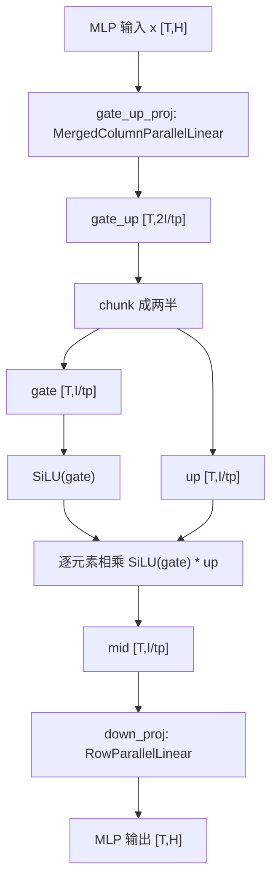
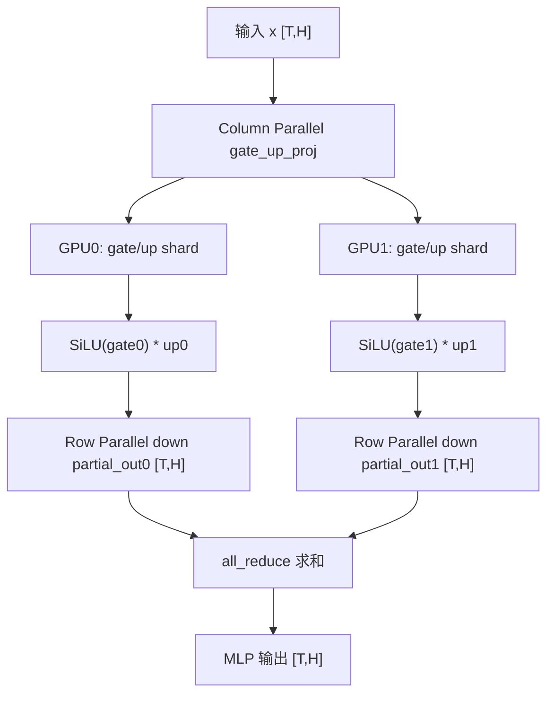

# Qwen3 MLP / FFN 中 gate_proj、up_proj、down_proj 线性层详解

> 本文基于 `Qwen3_DecoderOnly架构与nano-vLLM模型代码对应总览.md` 和 nano-vLLM 源码整理。  
> 目标：让你彻底搞懂 Qwen3 dense 中 MLP / FFN 模块的作用、数学结构、源码实现、张量 shape、tensor parallel 切分方式，以及它在整个 decoder-only forward 中的位置。

---

## 1. 先给结论

Qwen3 dense 的每个 decoder layer 里都有一个 MLP / FFN 模块。

在概念上，它由三条线性投影组成：

```text
gate_proj
up_proj
down_proj
```

公式可以写成：

```text
FFN(x) = down_proj( SiLU(gate_proj(x)) * up_proj(x) )
```

这就是 **SwiGLU MLP**。

但在 nano-vLLM 源码里，你不会直接看到：

```python
self.gate_proj
self.up_proj
```

而是看到：

```python
self.gate_up_proj = MergedColumnParallelLinear(...)
self.down_proj = RowParallelLinear(...)
self.act_fn = SiluAndMul()
```

原因是：

**工程实现会把 `gate_proj` 和 `up_proj` 合并成一个更大的线性层 `gate_up_proj`，一次矩阵乘法同时算出 gate 分支和 up 分支，然后再切开做 SiLU 和逐元素相乘。**

最核心流程：

```text
输入 x [T, hidden_size]
  ↓
gate_up_proj: 同时计算 gate_proj(x) 和 up_proj(x)
  ↓
gate_up [T, 2 * intermediate_size]
  ↓
切成两半 gate 和 up
  ↓
SiLU(gate) * up
  ↓
down_proj
  ↓
输出 [T, hidden_size]
```

---

## 2. MLP / FFN 在整体 Qwen3 forward 中的位置

Qwen3 dense 是 decoder-only Transformer。

整体结构是：

```text
input_ids
  ↓
Embedding
  ↓
DecoderLayer × N
  ↓
Final RMSNorm
  ↓
LM Head
  ↓
logits
```

每个 `DecoderLayer` 内部是：

```text
RMSNorm
  ↓
Self Attention
  ↓
Residual Add + RMSNorm
  ↓
MLP / FFN
```

所以 MLP / FFN 的位置是：

**它位于每一层 Attention 之后，负责对每个 token 的 hidden state 做非线性特征变换。**

Attention 和 MLP 的分工可以这样理解：

| 模块 | 作用对象 | 核心作用 |
|---|---|---|
| Self-Attention | token 和 token 之间 | 让当前位置从上下文其他 token 中取信息 |
| MLP / FFN | 每个 token 自己 | 对当前 token 的向量做非线性特征加工 |

Attention 负责“信息交流”，MLP 负责“信息加工”。

一个更直观的说法：

```text
Attention：让每个 token 看上下文，决定要拿哪些信息
MLP：拿到信息后，在当前 token 内部做更复杂的特征变换
```

---

## 3. 源码位置

Qwen3 MLP 的核心代码在：

```text
nanovllm/models/qwen3.py
nanovllm/layers/linear.py
nanovllm/layers/activation.py
nanovllm/utils/loader.py
```

关系如下：

| 文件 | 和 MLP 的关系 |
|---|---|
| `models/qwen3.py` | 定义 `Qwen3MLP`，组织 `gate_up_proj -> act_fn -> down_proj` |
| `layers/linear.py` | 定义 `MergedColumnParallelLinear` 和 `RowParallelLinear` |
| `layers/activation.py` | 定义 `SiluAndMul`，也就是 SwiGLU 的激活和门控相乘 |
| `utils/loader.py` | 加载 HF 权重，并把 `gate_proj/up_proj` 映射到 `gate_up_proj` |

---

## 4. Qwen3MLP 源码逐行解释

源码：

```python
class Qwen3MLP(nn.Module):

    def __init__(
        self,
        hidden_size: int,
        intermediate_size: int,
        hidden_act: str,
    ) -> None:
        super().__init__()
        self.gate_up_proj = MergedColumnParallelLinear(
            hidden_size,
            [intermediate_size] * 2,
            bias=False,
        )
        self.down_proj = RowParallelLinear(
            intermediate_size,
            hidden_size,
            bias=False,
        )
        assert hidden_act == "silu"
        self.act_fn = SiluAndMul()

    def forward(self, x):
        gate_up = self.gate_up_proj(x)
        x = self.act_fn(gate_up)
        x = self.down_proj(x)
        return x
```

先看初始化：

```python
self.gate_up_proj = MergedColumnParallelLinear(
    hidden_size,
    [intermediate_size] * 2,
    bias=False,
)
```

这表示：

```text
输入维度：hidden_size
输出维度：intermediate_size + intermediate_size
```

也就是：

```text
gate_up_proj 输出 = 2 * intermediate_size
```

概念上等价于两个线性层：

```text
gate = gate_proj(x)
up   = up_proj(x)
```

只不过工程里合成了一次：

```text
gate_up = gate_up_proj(x)
```

然后再切开。

再看：

```python
self.down_proj = RowParallelLinear(
    intermediate_size,
    hidden_size,
    bias=False,
)
```

这表示：

```text
输入维度：intermediate_size
输出维度：hidden_size
```

也就是把扩大的中间维度再压回模型 hidden size。

最后：

```python
assert hidden_act == "silu"
self.act_fn = SiluAndMul()
```

说明 Qwen3 这里使用的是 SiLU 激活，并且激活不是单独作用在整个张量上，而是配合 gate/up 两个分支做门控。

---

## 5. MLP/FFN 的数学公式

普通 FFN 常见形式是：

```text
FFN(x) = W2 * activation(W1 * x)
```

也就是：

```text
x -> 升维 -> 激活 -> 降维
```

Qwen3 使用的是 SwiGLU 变体：

```text
gate = gate_proj(x)
up   = up_proj(x)
mid  = SiLU(gate) * up
out  = down_proj(mid)
```

合起来：

```text
FFN(x) = down_proj( SiLU(gate_proj(x)) * up_proj(x) )
```

这里的 `*` 是逐元素相乘，不是矩阵乘法。

可以把它理解成：

1. `up_proj(x)` 生成一批候选特征；
2. `gate_proj(x)` 生成一批门控信号；
3. `SiLU(gate_proj(x))` 决定每个候选特征通过多少；
4. 两者逐元素相乘；
5. `down_proj` 把结果压回 hidden size。

---

## 6. gate_proj、up_proj、down_proj 分别是什么

### 6.1 gate_proj：门控分支

概念上：

```text
gate = gate_proj(x)
```

作用：

**为每个中间特征生成一个门控值，决定这个特征应该被放大、削弱还是抑制。**

如果把 MLP 中间层看成一组特征通道：

```text
feature_1, feature_2, feature_3, ...
```

那么 gate 分支就像每个通道前面的开关：

```text
这个特征重要吗？
要不要通过？
通过多少？
```

经过 SiLU 后：

```text
gate_score = SiLU(gate)
```

它会变成一个非线性的门控信号。

---

### 6.2 up_proj：候选特征分支

概念上：

```text
up = up_proj(x)
```

作用：

**把 hidden state 从 hidden_size 扩展到 intermediate_size，生成更丰富的候选特征。**

为什么要扩维？

因为如果一直在 `hidden_size` 内做线性变换，表达能力有限。

FFN 通常会先升维：

```text
hidden_size -> intermediate_size
```

再降维：

```text
intermediate_size -> hidden_size
```

中间维度更大，模型可以在更高维空间里组合特征。

直观理解：

```text
原始 hidden state 是压缩表达
up_proj 把它展开成更宽的特征空间
gate_proj 决定展开后的哪些特征有用
down_proj 再把有用特征压回 hidden_size
```

---

### 6.3 down_proj：回到 hidden_size

概念上：

```text
out = down_proj(mid)
```

作用：

**把经过门控筛选后的中间特征从 intermediate_size 压回 hidden_size。**

为什么必须压回 hidden_size？

因为 Transformer 每一层的输入和输出维度必须一致。

只有这样才能：

1. 做 residual add；
2. 继续传给下一层 decoder layer；
3. 保持整个模型结构稳定；
4. 最终接上 lm_head。

所以 MLP 内部可以扩维，但模块输出必须回到：

```text
[T, hidden_size]
```

---

## 7. 张量 shape 完整变化

设：

```text
T = 当前 step 总 token 数
H = hidden_size
I = intermediate_size
tp = tensor_parallel_size
```

从概念上，不考虑 tensor parallel：

| 步骤 | 张量 | shape |
|---|---|---|
| MLP 输入 | `x` | `[T, H]` |
| gate_proj | `gate` | `[T, I]` |
| up_proj | `up` | `[T, I]` |
| concat 后 | `gate_up` | `[T, 2I]` |
| SiLU(gate) * up | `mid` | `[T, I]` |
| down_proj | `out` | `[T, H]` |

在 nano-vLLM 中，`gate_proj` 和 `up_proj` 合并，所以实际代码中的 shape 是：

```text
x:       [T, H]
gate_up: [T, 2I / tp]
mid:     [T, I / tp]
out:     [T, H]
```

为什么 `gate_up` 是 `2I / tp`？

因为 `MergedColumnParallelLinear` 是 column parallel，会按输出维度切分。

如果 `tp = 1`：

```text
gate_up: [T, 2I]
```

如果 `tp = 2`：

```text
GPU0 gate_up: [T, I]
GPU1 gate_up: [T, I]
合起来才是 [T, 2I]
```

更细一点，因为 `gate_up_proj` 的两个分支都是 `I`：

```text
每张 GPU 上:
gate shard: [T, I/tp]
up shard:   [T, I/tp]
合并:       [T, 2I/tp]
```

---

## 8. 结构流程图



---

## 9. 为什么源码里叫 `gate_up_proj`，而不是分开写

概念上分开写是：

```python
gate = gate_proj(x)
up = up_proj(x)
mid = silu(gate) * up
```

这需要两次线性层计算：

```text
x @ W_gate^T
x @ W_up^T
```

工程上可以把两个权重在输出维度拼起来：

```text
W_gate_up = concat(W_gate, W_up, dim=0)
```

然后一次计算：

```text
gate_up = x @ W_gate_up^T
```

再切开：

```text
gate, up = gate_up.chunk(2, dim=-1)
```

这样做的好处：

1. 少一次线性层调用；
2. 少一次 kernel launch；
3. 更容易做 tensor parallel 输出切分；
4. 权重加载时可以把两个权重塞进同一个参数；
5. 推理时更紧凑。

所以：

```text
gate_proj + up_proj 是概念结构
gate_up_proj 是工程合并实现
```

---

## 10. `MergedColumnParallelLinear` 是什么

源码：

```python
class MergedColumnParallelLinear(ColumnParallelLinear):

    def __init__(
        self,
        input_size: int,
        output_sizes: list[int],
        bias: bool = False,
    ):
        self.output_sizes = output_sizes
        super().__init__(input_size, sum(output_sizes), bias)
```

在 Qwen3MLP 中调用：

```python
MergedColumnParallelLinear(
    hidden_size,
    [intermediate_size] * 2,
    bias=False,
)
```

等价于：

```text
output_sizes = [I, I]
sum(output_sizes) = 2I
```

所以它构造的是一个：

```text
输入 H，输出 2I
```

的线性层。

因为它继承 `ColumnParallelLinear`，所以在 tensor parallel 下会按输出维度切分：

```text
每张卡只保存一部分输出通道对应的权重
```

---

## 11. gate/up 权重如何加载

Hugging Face 权重中通常是分开的：

```text
gate_proj.weight
up_proj.weight
down_proj.weight
```

nano-vLLM 模型中是：

```text
gate_up_proj.weight
down_proj.weight
```

映射关系在 `Qwen3ForCausalLM` 中：

```python
packed_modules_mapping = {
    "gate_proj": ("gate_up_proj", 0),
    "up_proj": ("gate_up_proj", 1),
}
```

含义：

| HF 权重名 | nano-vLLM 参数名 | shard id |
|---|---|---|
| `gate_proj.weight` | `gate_up_proj.weight` | 0 |
| `up_proj.weight` | `gate_up_proj.weight` | 1 |

`loader.py` 中：

```python
if k in weight_name:
    v, shard_id = packed_modules_mapping[k]
    param_name = weight_name.replace(k, v)
    param = model.get_parameter(param_name)
    weight_loader(param, f.get_tensor(weight_name), shard_id)
```

这表示：

1. 如果读到 `gate_proj.weight`；
2. 把名字替换成 `gate_up_proj.weight`；
3. `shard_id = 0`，说明放到 gate 部分；
4. 如果读到 `up_proj.weight`；
5. 也替换成 `gate_up_proj.weight`；
6. `shard_id = 1`，说明放到 up 部分。

---

## 12. `MergedColumnParallelLinear.weight_loader` 怎么塞权重

源码：

```python
def weight_loader(self, param, loaded_weight, loaded_shard_id):
    param_data = param.data
    shard_offset = sum(self.output_sizes[:loaded_shard_id]) // self.tp_size
    shard_size = self.output_sizes[loaded_shard_id] // self.tp_size
    param_data = param_data.narrow(self.tp_dim, shard_offset, shard_size)
    loaded_weight = loaded_weight.chunk(self.tp_size, self.tp_dim)[self.tp_rank]
    param_data.copy_(loaded_weight)
```

这里的核心是：

```text
根据 loaded_shard_id 决定把权重放到 gate 部分还是 up 部分
```

如果：

```text
loaded_shard_id = 0
```

说明是 `gate_proj`，放到 `gate_up_proj.weight` 的前半部分。

如果：

```text
loaded_shard_id = 1
```

说明是 `up_proj`，放到后半部分。

同时它还会根据 `tp_rank` 只取当前 GPU 负责的 shard。

---

## 13. `SiluAndMul`：SwiGLU 真正发生的地方

源码：

```python
class SiluAndMul(nn.Module):

    @torch.compile
    def forward(self, x: torch.Tensor) -> torch.Tensor:
        x, y = x.chunk(2, -1)
        return F.silu(x) * y
```

输入：

```text
gate_up: [T, 2I/tp]
```

切开：

```text
x = gate: [T, I/tp]
y = up:   [T, I/tp]
```

计算：

```text
mid = SiLU(gate) * up
```

输出：

```text
mid: [T, I/tp]
```

注意这里变量名 `x, y` 只是源码临时变量：

```python
x, y = x.chunk(2, -1)
```

更容易理解的名字应该是：

```python
gate, up = gate_up.chunk(2, -1)
return silu(gate) * up
```

---

## 14. SiLU 是什么

SiLU 的公式：

```text
SiLU(x) = x * sigmoid(x)
```

它和 ReLU 不同：

```text
ReLU(x) = max(0, x)
```

SiLU 更平滑。

在 SwiGLU 中，SiLU 不是单独作为普通激活，而是用于 gate 分支：

```text
SiLU(gate) * up
```

直观理解：

```text
up 分支提供候选内容
gate 分支决定候选内容通过多少
SiLU 让这个门控过程带有非线性
```

---

## 15. `down_proj` 为什么用 RowParallelLinear

源码：

```python
self.down_proj = RowParallelLinear(
    intermediate_size,
    hidden_size,
    bias=False,
)
```

`down_proj` 的概念输入是：

```text
mid: [T, I]
```

输出是：

```text
out: [T, H]
```

在 tensor parallel 下，前面的 `gate_up_proj` 是 column parallel，所以每张 GPU 只得到：

```text
mid_shard: [T, I/tp]
```

如果要得到完整的：

```text
out: [T, H]
```

每张卡可以用自己的 `mid_shard` 乘以 `down_proj` 的一部分权重，得到局部输出：

```text
partial_out: [T, H]
```

然后所有 GPU 的局部输出相加：

```text
out = partial_out_0 + partial_out_1 + ...
```

这就是 `RowParallelLinear.forward()` 里的：

```python
y = F.linear(x, self.weight, ...)
if self.tp_size > 1:
    dist.all_reduce(y)
return y
```

所以：

```text
gate/up 用 ColumnParallelLinear
down 用 RowParallelLinear
```

是一个很自然的 tensor parallel 搭配。

---

## 16. Tensor Parallel 下 MLP 怎么切

假设：

```text
hidden_size = H
intermediate_size = I
tensor_parallel_size = 2
```

### 16.1 gate_up_proj

概念权重：

```text
W_gate_up: [2I, H]
```

两张 GPU 按输出维度切：

```text
GPU0: [I, H]
GPU1: [I, H]
```

但因为 `gate_up` 包含 gate 和 up 两个部分，实际每张 GPU 会拿到：

```text
gate 的一部分 + up 的一部分
```

输出：

```text
GPU0 gate_up_shard: [T, I]
GPU1 gate_up_shard: [T, I]
```

每张卡本地切成：

```text
gate_shard: [T, I/2]
up_shard:   [T, I/2]
```

### 16.2 SiluAndMul

每张 GPU 本地做：

```text
mid_shard = SiLU(gate_shard) * up_shard
```

得到：

```text
mid_shard: [T, I/2]
```

### 16.3 down_proj

概念权重：

```text
W_down: [H, I]
```

按输入维度切：

```text
GPU0: [H, I/2]
GPU1: [H, I/2]
```

每张卡计算：

```text
partial_out = mid_shard @ W_down_shard^T
```

得到：

```text
partial_out: [T, H]
```

最后：

```text
all_reduce(partial_out)
```

得到完整输出：

```text
out: [T, H]
```

---

## 17. Tensor Parallel 流程图



---

## 18. MLP 和 Attention 在一层中的关系

在 `Qwen3DecoderLayer.forward()` 中：

```python
hidden_states = self.self_attn(positions, hidden_states)
hidden_states, residual = self.post_attention_layernorm(hidden_states, residual)
hidden_states = self.mlp(hidden_states)
return hidden_states, residual
```

对应：

```text
Attention 输出
  ↓
和 residual 相加
  ↓
RMSNorm
  ↓
进入 MLP
```

所以 MLP 输入不是原始 token embedding，而是：

```text
已经融合上下文信息后的 hidden state
```

Attention 已经让当前位置看过上下文，MLP 再对这个更新后的表示做更复杂的非线性加工。

---

## 19. MLP 输出为什么不立刻 residual add

你可能会注意到：

```python
hidden_states = self.mlp(hidden_states)
return hidden_states, residual
```

这里没有写：

```python
hidden_states = hidden_states + residual
```

原因是 nano-vLLM 把这个 add 延迟到下一层开头：

```python
hidden_states, residual = self.input_layernorm(hidden_states, residual)
```

如果是最后一层，则在 `Qwen3Model.forward()` 最后：

```python
hidden_states, _ = self.norm(hidden_states, residual)
```

把最后一层 MLP 输出加回 residual。

所以 MLP 输出仍然会进入残差主干，只是工程实现上延迟到了下一次 fused add RMSNorm。

---

## 20. MLP / FFN 在推理性能中的作用

MLP 是 Transformer 里非常重的计算模块。

对每个 token 来说，MLP 至少包含两次大矩阵乘法：

```text
gate_up_proj: [T,H] -> [T,2I]
down_proj:    [T,I] -> [T,H]
```

如果 `I` 很大，MLP 的计算量非常可观。

在 dense 模型中：

```text
每个 token 都经过同一套 MLP 参数
```

这也是为什么 dense 模型的推理计算量比较稳定。

和 MoE 对比：

| 结构 | 每个 token 经过什么 |
|---|---|
| Dense FFN | 所有 token 都经过同一个 FFN |
| MoE FFN | 每个 token 只经过被 router 选中的少数专家 |

Qwen3 dense 用的是 dense MLP。

Qwen3.6-35B-A3B 这类模型则会把 FFN 换成 MoE，工程复杂度更高。

---

## 21. 常见误区

### 误区 1：`gate_proj` 是 attention 里的 gate

不是。

这里的 `gate_proj` 属于 MLP / FFN，不属于 Attention。

它控制的是 MLP 中间特征是否通过，不是控制 token 看哪些 token。

### 误区 2：`up_proj` 和 `down_proj` 是互逆操作

不是严格数学逆。

它们只是维度方向相反：

```text
up_proj: hidden_size -> intermediate_size
down_proj: intermediate_size -> hidden_size
```

但它们不是互逆矩阵。

### 误区 3：源码里没有 `gate_proj`，说明模型没有 gate

不是。

源码里没有单独的 `self.gate_proj`，是因为工程上合并成了：

```text
gate_up_proj
```

权重加载时仍然从 HF 的 `gate_proj.weight` 和 `up_proj.weight` 来。

### 误区 4：SwiGLU 只是普通激活函数

不完全是。

SwiGLU 是一种门控 FFN 结构：

```text
SiLU(gate_proj(x)) * up_proj(x)
```

它包含两个线性分支和一个逐元素门控乘法。

---

## 22. 面试或自查问题

1. Qwen3 的 MLP / FFN 在 decoder layer 中处于什么位置？
2. `gate_proj`、`up_proj`、`down_proj` 各自的输入输出维度是什么？
3. 为什么 `gate_proj` 和 `up_proj` 可以合并成 `gate_up_proj`？
4. `SiluAndMul` 做了哪两件事？
5. 为什么 `down_proj` 的输出必须回到 `hidden_size`？
6. `MergedColumnParallelLinear` 为什么适合实现 `gate_up_proj`？
7. `RowParallelLinear` 为什么需要 `all_reduce`？
8. HF 权重中的 `gate_proj.weight` 如何加载进 nano-vLLM 的 `gate_up_proj.weight`？
9. MLP 和 Attention 的分工是什么？
10. 为什么 MLP 输出没有在当前层末尾立刻 residual add？

---

## 23. 最后总结

Qwen3 dense 的 MLP / FFN 模块，本质是：

```text
down_proj( SiLU(gate_proj(x)) * up_proj(x) )
```

概念上：

```text
gate_proj：生成门控信号
up_proj：生成候选中间特征
down_proj：把筛选后的中间特征压回 hidden_size
```

工程上：

```text
gate_proj + up_proj -> gate_up_proj
gate_up_proj -> SiluAndMul -> down_proj
```

在 nano-vLLM 中：

```text
gate_up_proj = MergedColumnParallelLinear
SiluAndMul = chunk + SiLU + multiply
down_proj = RowParallelLinear
```

在整体 forward 中：

```text
Attention 先让 token 和上下文交互
RMSNorm 后进入 MLP
MLP 再对每个 token 的 hidden state 做非线性特征加工
输出回到 hidden_size
进入下一层或 final norm
```

你只要抓住这条线，就能把 Qwen3 的 FFN 概念、nano-vLLM 的工程实现、tensor parallel 的切分方式一起串起来。


%% 项目关联导航：开始 %%
## 项目关联导航

- 所属模块：[[outputs/项目整理/模块-nano-vllm-qwen3.6|模块-nano-vllm-qwen3.6]]

%% 项目关联导航：结束 %%
