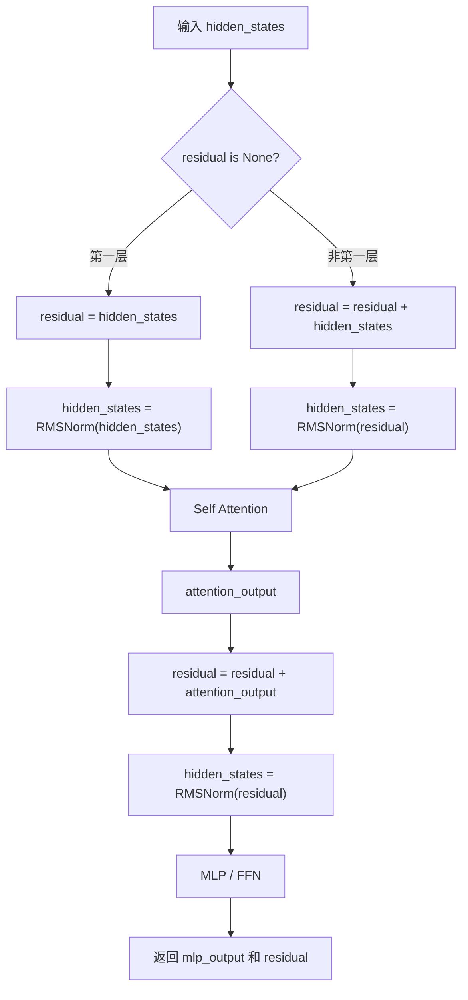
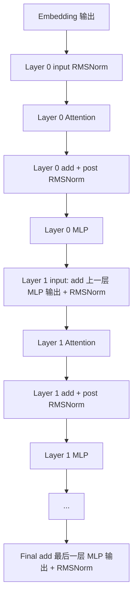
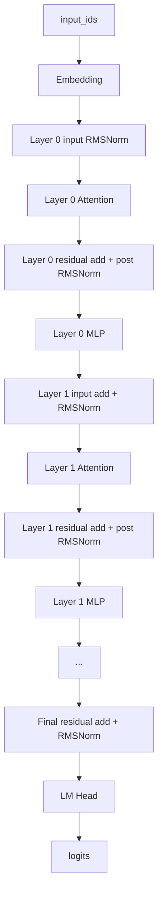

# Qwen3 中 LayerNorm / RMSNorm 与残差连接详解

> 本文基于 `Qwen3_DecoderOnly架构与nano-vLLM模型代码对应总览.md` 和 nano-vLLM 源码整理。  
> 目标：彻底搞懂 Qwen3 dense 中 **RMSNorm、LayerNorm、残差连接 residual** 的作用、位置、源码实现和 forward 流程，尤其理解 nano-vLLM 为什么把 `residual add + RMSNorm` 写成融合形式。

---

## 1. 先给结论

Qwen3 dense 里真正用的是 **RMSNorm**，不是传统完整 LayerNorm。

在 nano-vLLM 源码里，RMSNorm 相关文件是：

```text
nanovllm/layers/layernorm.py
```

在 Qwen3 模型结构中，RMSNorm 出现在四类位置：

| 位置 | 源码变量 | 作用 |
|---|---|---|
| 每个 DecoderLayer 的 Attention 前 | `input_layernorm` | 把当前残差主干归一化后送入 Attention |
| 每个 DecoderLayer 的 MLP 前 | `post_attention_layernorm` | 把 attention 输出加回 residual 后归一化，再送入 MLP |
| 整个模型最后 | `Qwen3Model.norm` | 把最后一层 MLP 输出加回 residual 后做 final norm |
| Attention 内部 q/k 上 | `q_norm` / `k_norm` | 对 q/k head 向量归一化，稳定 attention score |

最重要的工程写法：

```python
hidden_states, residual = self.input_layernorm(hidden_states, residual)
```

这不是普通的 RMSNorm。

它实际做了两件事：

```text
1. residual = residual + hidden_states
2. hidden_states = RMSNorm(residual)
```

所以 nano-vLLM 中的 `RMSNorm(x, residual)` 是：

```text
fused add + RMSNorm
```

一句话总结：

**RMSNorm 负责稳定每层输入的数值分布；残差连接负责保留主干信息和帮助深层网络传递梯度；nano-vLLM 为推理效率把 residual add 和 RMSNorm 融合到同一个模块里。**

---

## 2. 先区分 LayerNorm 和 RMSNorm

### 2.1 LayerNorm 是什么

传统 LayerNorm 对一个 token 的 hidden 向量做归一化。

假设一个 token 的 hidden state 是：

```text
x = [x1, x2, x3, ..., xH]
```

LayerNorm 会计算：

```text
mean = 平均值
variance = 方差
```

然后：

```text
y = (x - mean) / sqrt(variance + eps) * weight + bias
```

它做了两件核心事：

1. 减去均值；
2. 除以标准差。

---

### 2.2 RMSNorm 是什么

RMSNorm 是 Root Mean Square Layer Normalization。

它不减均值，只用均方根做缩放。

源码：

```python
var = x.pow(2).mean(dim=-1, keepdim=True)
x.mul_(torch.rsqrt(var + self.eps))
x = x.to(orig_dtype).mul_(self.weight)
```

对应公式：

```text
rms = sqrt(mean(x^2) + eps)
y = x / rms * weight
```

也就是说：

```text
RMSNorm 只控制向量整体尺度，不强制把均值变成 0。
```

---

### 2.3 LayerNorm 和 RMSNorm 对比

| 对比项 | LayerNorm | RMSNorm |
|---|---|---|
| 是否减均值 | 是 | 否 |
| 是否除以尺度 | 是，用标准差 | 是，用 RMS |
| 参数 | 通常有 weight 和 bias | 通常只有 weight |
| 计算量 | 稍高 | 更轻 |
| 大模型常见度 | 早期 Transformer 常见 | LLaMA/Qwen 等常见 |

RMSNorm 更简单，计算更省，同时在大模型中效果很好，所以 Qwen3 使用 RMSNorm。

---

## 3. 为什么 Transformer 需要 Norm

Transformer 是很多层堆叠起来的。

每层都会做：

```text
Attention
MLP
Residual Add
```

如果没有 Norm，hidden state 的数值分布可能随着层数增加不断变化，比如：

1. 某些层输出越来越大；
2. 某些维度数值特别突出；
3. softmax 或激活函数进入不稳定区域；
4. 深层网络训练和推理都更容易出现数值问题。

Norm 的作用是：

```text
让每个 token 的 hidden 向量在进入子模块之前，尺度保持相对稳定。
```

在 Qwen3 中，RMSNorm 通常放在子模块之前，所以叫：

```text
PreNorm
```

---

## 4. 为什么 Transformer 需要残差连接

残差连接的基本形式是：

```text
output = x + sublayer(x)
```

例如 Attention 子层：

```text
x = x + Attention(RMSNorm(x))
```

MLP 子层：

```text
x = x + MLP(RMSNorm(x))
```

残差连接的作用：

1. 保留原始信息，不让子层完全覆盖输入；
2. 让深层模型更容易训练；
3. 让梯度能沿着残差主干传播；
4. 如果某个子层暂时没学好，模型仍然可以近似保留输入；
5. 每层只需要学习“增量修改”，而不是从零重建表示。

直观理解：

```text
residual 主干像一条高速公路；
Attention 和 MLP 像沿途的加工站；
每个加工站只是在主干上添加或修改一部分信息。
```

---

## 5. Qwen3 dense 的标准概念写法

如果用更接近论文的伪代码写，一个 Qwen3 decoder layer 可以理解为：

```python
x = x + SelfAttention(RMSNorm(x))
x = x + MLP(RMSNorm(x))
```

这就是 PreNorm decoder block。

展开一点：

```text
输入 x
  ↓
x_norm = RMSNorm(x)
  ↓
attn_out = Attention(x_norm)
  ↓
x = x + attn_out
  ↓
x_norm = RMSNorm(x)
  ↓
mlp_out = MLP(x_norm)
  ↓
x = x + mlp_out
```

但是 nano-vLLM 源码没有直接这样写。

它为了工程效率，把 `x` 和 `residual` 拆开传。

---

## 6. nano-vLLM 中的实际写法

`Qwen3DecoderLayer.forward()`：

```python
def forward(self, positions, hidden_states, residual):
    if residual is None:
        hidden_states, residual = self.input_layernorm(hidden_states), hidden_states
    else:
        hidden_states, residual = self.input_layernorm(hidden_states, residual)

    hidden_states = self.self_attn(positions, hidden_states)

    hidden_states, residual = self.post_attention_layernorm(hidden_states, residual)

    hidden_states = self.mlp(hidden_states)

    return hidden_states, residual
```

这段代码最容易困惑，因为：

1. `hidden_states` 有时候是 norm 后的输入；
2. `hidden_states` 有时候又是 attention 输出或 MLP 输出；
3. `residual` 才是残差主干；
4. MLP 输出没有在当前层末尾立刻加回 residual。

要理解它，必须先搞懂 `RMSNorm.forward(x, residual)`。

---

## 7. `RMSNorm.forward()` 的两种模式

源码：

```python
def forward(self, x, residual=None):
    if residual is None:
        return self.rms_forward(x)
    else:
        return self.add_rms_forward(x, residual)
```

它有两种用法。

### 7.1 普通 RMSNorm：`RMSNorm(x)`

当 `residual is None` 时：

```python
return self.rms_forward(x)
```

只做：

```text
x -> RMSNorm(x)
```

输出是一个张量。

常见于第一层开头：

```python
hidden_states, residual = self.input_layernorm(hidden_states), hidden_states
```

这时 embedding 输出还没有历史 residual 可以相加，所以先单独 norm。

---

### 7.2 融合 Add + RMSNorm：`RMSNorm(x, residual)`

当 `residual` 不为空时：

```python
return self.add_rms_forward(x, residual)
```

源码：

```python
x = x.float().add_(residual.float())
residual = x.to(orig_dtype)
var = x.pow(2).mean(dim=-1, keepdim=True)
x.mul_(torch.rsqrt(var + self.eps))
x = x.to(orig_dtype).mul_(self.weight)
return x, residual
```

这一步实际做：

```text
new_residual = x + residual
normed_x = RMSNorm(new_residual)
return normed_x, new_residual
```

也就是说：

```python
hidden_states, residual = RMSNorm(hidden_states, residual)
```

等价于：

```python
residual = residual + hidden_states
hidden_states = RMSNorm(residual)
```

这是理解整个模块的钥匙。

---

## 8. 为什么要把 Add 和 RMSNorm 融合

概念上你可以分开写：

```python
residual = residual + hidden_states
hidden_states = rms_norm(residual)
```

但推理工程中会倾向写成融合形式：

```python
hidden_states, residual = rms_norm(hidden_states, residual)
```

好处：

1. 少创建中间张量；
2. 减少一次读写显存；
3. 更容易后续替换成 fused CUDA/Triton kernel；
4. 和 vLLM 等推理框架常见的 fused add rmsnorm 写法一致；
5. decode 阶段每层都要执行，能节省累计开销。

所以：

```text
源码写法复杂一点，是为了推理效率。
```

---

## 9. 一层 DecoderLayer 的完整残差流

下面把一层彻底拆开。

### 9.1 第一层时

第一层进入时：

```text
hidden_states = embedding_output
residual = None
```

代码：

```python
hidden_states, residual = self.input_layernorm(hidden_states), hidden_states
```

含义：

```text
residual = embedding_output
hidden_states = RMSNorm(embedding_output)
```

然后：

```python
hidden_states = self.self_attn(positions, hidden_states)
```

含义：

```text
attention_output = Attention(RMSNorm(embedding_output))
```

再：

```python
hidden_states, residual = self.post_attention_layernorm(hidden_states, residual)
```

等价于：

```text
residual = embedding_output + attention_output
hidden_states = RMSNorm(residual)
```

然后：

```python
hidden_states = self.mlp(hidden_states)
```

含义：

```text
mlp_output = MLP(RMSNorm(embedding_output + attention_output))
```

返回：

```text
hidden_states = mlp_output
residual = embedding_output + attention_output
```

注意：第一层 MLP 输出还没加回 residual，它会在下一层开头加。

---

### 9.2 非第一层时

假设上一层返回：

```text
hidden_states = 上一层 mlp_output
residual = 上一层 attention 后的残差主干
```

进入下一层开头：

```python
hidden_states, residual = self.input_layernorm(hidden_states, residual)
```

等价于：

```text
residual = residual + 上一层 mlp_output
hidden_states = RMSNorm(residual)
```

这一步实际上完成了：

```text
上一层 MLP 的 residual add
当前层 Attention 前的 RMSNorm
```

这就是为什么你在上一层末尾没看到：

```text
x = x + MLP(...)
```

因为它被推迟到下一层开头做了。

---

### 9.3 最后一层之后

最后一层 MLP 输出也需要加回 residual。

但已经没有下一层了，所以在 `Qwen3Model.forward()` 末尾做：

```python
hidden_states, _ = self.norm(hidden_states, residual)
```

等价于：

```text
residual = residual + 最后一层 mlp_output
hidden_states = RMSNorm(residual)
```

这就是 final RMSNorm。

---

## 10. 一层结构图



---

## 11. 多层残差流图



这张图要记住：

```text
每层 MLP 输出的 residual add，是在下一层开头完成的。
最后一层 MLP 输出的 residual add，是在 final norm 完成的。
```

---

## 12. RMSNorm 的张量 shape

无论是普通 RMSNorm 还是 fused add RMSNorm，主要张量 shape 都是：

```text
hidden_states: [T, hidden_size]
residual:      [T, hidden_size]
weight:        [hidden_size]
```

其中：

```text
T = 当前 step 总 token 数
```

在 prefill 阶段：

```text
T = 本批所有 prompt token 拼接后的总 token 数
```

在 decode 阶段：

```text
T = 当前 batch 中请求数量
```

RMSNorm 是对最后一维做：

```python
var = x.pow(2).mean(dim=-1, keepdim=True)
```

也就是：

```text
对每个 token 的 hidden_size 维度单独计算 RMS
```

它不会在 token 之间做归一化。

这点非常重要：

```text
RMSNorm 不会混合不同 token 的信息。
```

token 之间的信息混合是 Attention 做的。

---

## 13. RMSNorm 源码逐行解释

### 13.1 初始化

```python
class RMSNorm(nn.Module):
    def __init__(self, hidden_size, eps=1e-6):
        super().__init__()
        self.eps = eps
        self.weight = nn.Parameter(torch.ones(hidden_size))
```

这里有两个东西：

| 变量 | 作用 |
|---|---|
| `eps` | 防止除以 0，保证数值稳定 |
| `weight` | 可学习缩放参数，shape 是 `[hidden_size]` |

没有 bias，因为 RMSNorm 通常只做缩放，不做平移。

---

### 13.2 普通 RMSNorm

```python
orig_dtype = x.dtype
x = x.float()
var = x.pow(2).mean(dim=-1, keepdim=True)
x.mul_(torch.rsqrt(var + self.eps))
x = x.to(orig_dtype).mul_(self.weight)
return x
```

逐行解释：

1. 保存原始 dtype，例如 FP16/BF16；
2. 转成 FP32 计算，提升归一化的数值稳定性；
3. 对 hidden 维度求平方均值；
4. `rsqrt` 计算 `1 / sqrt(var + eps)`；
5. 用这个值缩放 x；
6. 转回原始 dtype；
7. 乘以可学习参数 `weight`。

---

### 13.3 Fused Add RMSNorm

```python
x = x.float().add_(residual.float())
residual = x.to(orig_dtype)
var = x.pow(2).mean(dim=-1, keepdim=True)
x.mul_(torch.rsqrt(var + self.eps))
x = x.to(orig_dtype).mul_(self.weight)
return x, residual
```

逐行解释：

1. 把当前子层输出 `x` 和残差主干 `residual` 都转成 FP32；
2. 做相加；
3. 把相加后的结果保存为新的 residual；
4. 对相加后的结果做 RMSNorm；
5. 返回 norm 后的 hidden_states 和新的 residual。

所以返回值是：

```text
hidden_states = RMSNorm(x + residual)
residual = x + residual
```

---

## 14. Attention 内部的 q_norm / k_norm

除了 decoder layer 上的 RMSNorm，`Qwen3Attention` 里还有：

```python
if not self.qkv_bias:
    q = self.q_norm(q)
    k = self.k_norm(k)
```

这里的 `q_norm` 和 `k_norm` 不是对 `[T, hidden_size]` 做，而是对每个 head 的 `head_dim` 做：

```text
q: [T, num_heads, head_dim]
k: [T, num_kv_heads, head_dim]
```

它们的 `hidden_size` 参数其实是：

```text
head_dim
```

作用：

```text
稳定 q/k 的尺度，避免 attention score 过大或分布不稳定。
```

因为 attention score 来自：

```text
q · k
```

如果 q/k 尺度不稳定，softmax 前的分数也会不稳定。

所以 q_norm/k_norm 是 Attention 内部的数值稳定模块。

它不参与 residual 主干。

---

## 15. RMSNorm 与 Attention / MLP 的关系

在一层中：

```text
input RMSNorm -> Attention
post attention RMSNorm -> MLP
```

也就是说：

| RMSNorm | 后面接什么 |
|---|---|
| `input_layernorm` | Self Attention |
| `post_attention_layernorm` | MLP / FFN |
| `final norm` | LM Head |
| `q_norm/k_norm` | Attention score 计算 |

RMSNorm 自己不负责产生新语义信息。

它的作用更像：

```text
把输入整理到一个稳定尺度，再交给真正的计算模块。
```

---

## 16. 为什么叫 PreNorm

Transformer 有两种常见写法：

### 16.1 PostNorm

```text
x = Norm(x + Sublayer(x))
```

Norm 放在子层之后。

### 16.2 PreNorm

```text
x = x + Sublayer(Norm(x))
```

Norm 放在子层之前。

Qwen3 使用的是 PreNorm 思路。

在源码里体现为：

```text
先 input_layernorm
再 self_attn

先 post_attention_layernorm
再 mlp
```

PreNorm 对深层大模型更友好，因为残差主干更直接，训练稳定性更好。

---

## 17. 概念公式和 nano-vLLM 写法对照

概念公式：

```text
x = x + Attention(RMSNorm(x))
x = x + MLP(RMSNorm(x))
```

nano-vLLM 写法：

```python
hidden_states, residual = input_layernorm(hidden_states, residual)
hidden_states = self_attn(hidden_states)
hidden_states, residual = post_attention_layernorm(hidden_states, residual)
hidden_states = mlp(hidden_states)
```

它们的关系：

| 概念公式 | nano-vLLM 写法 |
|---|---|
| `RMSNorm(x)` | `input_layernorm(hidden_states, residual)` 的输出 |
| `x + Attention(...)` | `post_attention_layernorm(attention_out, residual)` 内部完成 |
| `RMSNorm(x + attn_out)` | `post_attention_layernorm(...)` 的 norm 输出 |
| `x + MLP(...)` | 下一层 `input_layernorm(mlp_out, residual)` 内部完成 |
| 最后一层 `x + MLP(...)` | `Qwen3Model.norm(hidden_states, residual)` 内部完成 |

---

## 18. 为什么 hidden_states 和 residual 分开传

如果按最直观的方式写，每层都维护一个 `x`：

```python
x = x + attention(norm(x))
x = x + mlp(norm(x))
```

很好懂，但工程上会产生更多中间读写。

nano-vLLM 分开传：

```text
hidden_states: 当前子层刚算出来的输出
residual: 当前累积的残差主干
```

这样做方便：

1. 把 add 和 norm 合并；
2. 减少临时变量；
3. 让每个 decoder layer 返回统一的 `(hidden_states, residual)`；
4. 最后一层统一用 final norm 收尾。

可以这样记：

```text
hidden_states 是“新加工出来的增量”
residual 是“主干状态”
RMSNorm(x, residual) 负责把增量合并进主干，并输出下一步要用的规范化表示。
```

---

## 19. 完整 forward 中的位置图



---

## 20. 常见误区

### 误区 1：RMSNorm 会混合 token 信息

不会。

RMSNorm 只对每个 token 自己的 hidden dimension 做归一化。

token 之间的信息混合由 Attention 完成。

---

### 误区 2：RMSNorm 和 LayerNorm 完全一样

不一样。

LayerNorm 会减均值，RMSNorm 不减均值，只按 RMS 缩放。

---

### 误区 3：MLP 输出没有 residual add

不是没有。

它只是没有在当前层末尾立刻 add，而是在下一层开头的：

```python
input_layernorm(hidden_states, residual)
```

中完成。

最后一层的 MLP 输出则在：

```python
self.norm(hidden_states, residual)
```

中完成。

---

### 误区 4：`residual` 是某一个固定层的输入

不是。

`residual` 是不断更新的残差主干。

每次 fused add RMSNorm 后，residual 都会变成：

```text
旧 residual + 当前子层输出
```

---

### 误区 5：q_norm/k_norm 和 input_layernorm 是同一类位置

不是。

`input_layernorm` 和 `post_attention_layernorm` 是 decoder block 主干上的 norm。

`q_norm/k_norm` 是 attention 内部对 q/k head 向量的 norm，不参与 residual 主干。

---

## 21. 自查问题

1. Qwen3 为什么使用 RMSNorm，而不是传统 LayerNorm？
2. RMSNorm 和 LayerNorm 的核心区别是什么？
3. `RMSNorm(x)` 和 `RMSNorm(x, residual)` 分别做什么？
4. `residual` 在 nano-vLLM 中代表什么？
5. 为什么 MLP 输出没有在当前层末尾立刻 residual add？
6. 最后一层 MLP 输出在哪里加回 residual？
7. `input_layernorm`、`post_attention_layernorm`、`final norm` 分别处于什么位置？
8. q_norm/k_norm 的 shape 是什么？它们和 residual 主干有没有关系？
9. RMSNorm 会不会混合不同 token 的信息？
10. 为什么推理框架喜欢 fused add RMSNorm？

---

## 22. 最后总结

Qwen3 dense 中的 RMSNorm 和残差连接可以用一条线记住：

```text
残差连接负责保留和累积主干信息；
RMSNorm 负责在进入 Attention / MLP / LM Head 前稳定向量尺度；
nano-vLLM 把 residual add 和 RMSNorm 融合，减少中间张量和显存读写。
```

概念公式：

```text
x = x + Attention(RMSNorm(x))
x = x + MLP(RMSNorm(x))
```

nano-vLLM 工程写法：

```text
hidden_states, residual = RMSNorm(hidden_states, residual)
hidden_states = sublayer(hidden_states)
```

你后面读 Qwen3 或 Qwen3.6 源码时，只要看到：

```python
RMSNorm(x, residual)
```

就要立刻反应过来：

```text
这一步不是单纯 norm，而是在做 residual add + norm。
```

这就是理解 nano-vLLM decoder layer 残差流的关键。


%% 项目关联导航：开始 %%
## 项目关联导航

- 所属模块：[[outputs/项目整理/模块-nano-vllm-qwen3.6|模块-nano-vllm-qwen3.6]]

%% 项目关联导航：结束 %%
