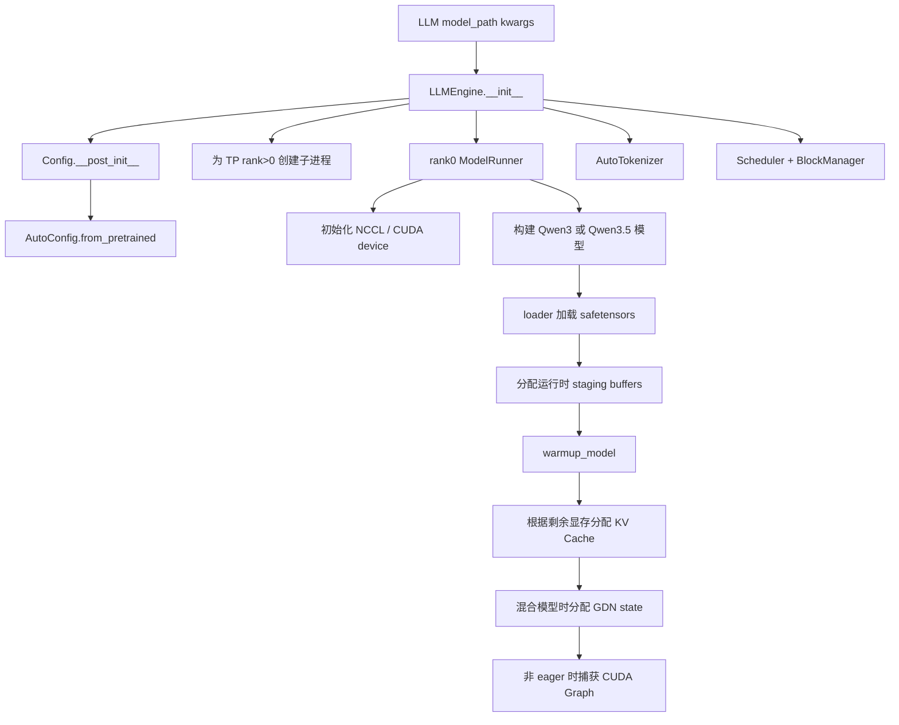
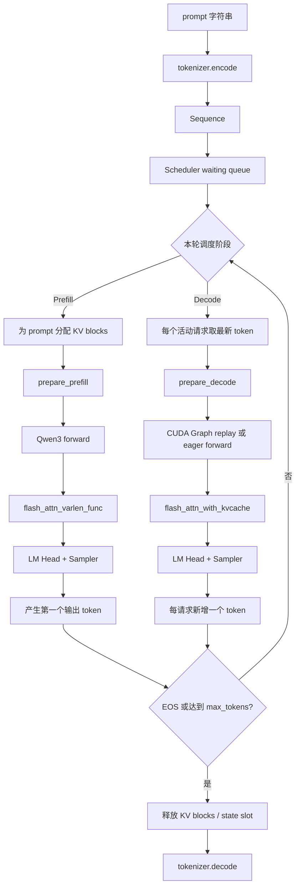

# nano-vLLM-qwen3.6：RTX 5070 Ti Laptop 从零跑通、代码链路与性能实验指南

> 适用对象：此前没有安装过 PyTorch、没有运行过深度学习实验，希望先完整跑通 nano-vLLM，再开展规范性能测试。  
> 目标仓库：`nano-vllm-qwen3.6`，本次分析版本 commit：`c468d63`。  
> 建议首个模型：`Qwen/Qwen3-0.6B`，而不是 Qwen3.5-9B 或 Qwen3.6-27B-FP8。

---

## 0. 最重要的结论

### 0.1 你的设备可以完成什么

你的设备条件：

- GPU：RTX 5070 Ti Laptop，**12 GB 独立显存**；系统显示的“12+4 GB”中，额外 4 GB 通常是共享系统内存，不能按 16 GB CUDA 显存规划。
- 内存：32 GB，足够运行 Qwen3-0.6B，并可进行单卡 benchmark；编译 FlashAttention 时要限制并行编译任务。
- 硬盘：空闲 512 GB，空间充分。
- 当前状态：没有安装 PyTorch，也没有深度学习实验经验。

推荐能力边界：

| 模型/实验 | 理论权重体积 | 你的设备是否适合 | 结论 |
|---|---:|---|---|
| Qwen3-0.6B BF16 | 约 1.2 GB | 是 | **首选，先跑通原生 Qwen3 路径** |
| Qwen3-1.7B BF16 | 约 3.4 GB | 大概率可以 | 跑通 0.6B 后再尝试 |
| Qwen3-4B BF16 | 约 8 GB，仅权重 | 风险较高 | 留给后续；KV Cache 和运行时会挤压显存 |
| Qwen3.5-9B BF16 | 约 18 GB，仅权重 | 否 | 单张 12 GB 显卡无法容纳 |
| Qwen3.6-27B-FP8 | checkpoint 虽是 FP8，但仓库启动后分片反量化为 BF16 | 否 | 仓库明确面向 4×RTX 4090、TP=4 |
| Qwen3.6 MTP | 依赖 27B 模型和多卡 | 否 | 当前设备只做源码分析，不做实机验证 |

### 0.2 正确的运行路线

不要直接执行仓库 README 中的 Qwen3.5/Qwen3.6 命令。建议依次完成：

1. Windows 驱动和 WSL2 GPU 检查；
2. 在 WSL2 Ubuntu 22.04 中安装 CUDA Toolkit 12.8；
3. 创建 Python 3.10/3.11 虚拟环境；
4. 安装 PyTorch 2.8.0 CUDA 12.8 版本；
5. 编译并验证 FlashAttention 2；
6. 安装 nano-vLLM；
7. 下载 Qwen3-0.6B；
8. 运行环境诊断脚本；
9. 先用 eager 模式进行功能冒烟测试；
10. 再启用 CUDA Graph；
11. 最后开展单请求延迟和多请求吞吐实验。

### 0.3 为什么不建议 VMware Ubuntu

该项目不是普通 CPU Python 程序，它依赖：

- NVIDIA CUDA；
- NCCL；
- Triton GPU kernel；
- FlashAttention CUDA 扩展；
- CUDA Graph。

普通 VMware Workstation 虚拟机一般无法把消费级笔记本 NVIDIA GPU 以该项目所需方式直接暴露给 Ubuntu。对你的 Windows 笔记本，优先级应为：

1. **WSL2 Ubuntu 22.04：最推荐**；
2. 原生 Ubuntu 双系统：性能和兼容性更稳定，但安装成本更高；
3. 原生 Windows：不推荐，NCCL 和 FlashAttention 的 Linux 路径更成熟；
4. VMware Ubuntu：不用于该 CUDA 实验。

---

# 第一部分：项目代码结构与一次推理的完整调用链

## 1. 仓库定位

`nano-vllm-qwen3.6` 是在原始 nano-vLLM 上扩展的教学/研究型推理引擎，重点包括：

- 原始 Qwen3 dense 模型；
- Qwen3.5 混合架构：全注意力层 + Gated DeltaNet；
- Qwen3.6 FP8 checkpoint 加载；
- Tensor Parallel；
- KV Cache；
- CUDA Graph decode；
- GDN recurrent state / conv state；
- MTP draft/verify 原型。

它不是完整生产级服务框架：没有 OpenAI API Server、成熟压测客户端、分布式服务治理和完整可观测系统。因此，本项目实验应聚焦“单进程/单卡推理内核与调度行为”，不要把它包装成线上服务 benchmark。

## 2. 关键目录

```text
nanovllm/
├── config.py                 # 全局配置及 Hugging Face 模型配置解析
├── llm.py                    # LLM 对 LLMEngine 的轻量封装
├── sampling_params.py        # temperature、max_tokens、ignore_eos
├── engine/
│   ├── llm_engine.py         # 用户 API、请求加入、推理主循环
│   ├── scheduler.py          # waiting/running 队列、prefill/decode 调度
│   ├── sequence.py           # 单请求状态与 token/KV block 信息
│   ├── block_manager.py      # KV Cache block 分配、释放、prefix cache
│   └── model_runner.py       # GPU、NCCL、模型、KV Cache、CUDA Graph
├── layers/
│   ├── attention.py          # FlashAttention prefill/decode 与 KV 写入
│   ├── linear.py             # TP 线性层
│   ├── gated_delta_net.py    # Qwen3.5 GDN 状态计算
│   ├── sampler.py            # logits 采样
│   └── ...
├── models/
│   ├── qwen3.py              # 原始 Qwen3 dense 模型
│   ├── qwen3_5.py            # Qwen3.5/Qwen3.6 混合模型路径
│   └── qwen3_mtp.py          # MTP 模块
└── utils/
    ├── loader.py             # checkpoint 加载
    ├── quant.py              # FP8 block 反量化
    └── ...
```

## 3. 初始化调用链



### 3.1 默认配置为什么不适合首次运行

`nanovllm/config.py` 默认值为：

```python
max_num_batched_tokens = 16384
max_num_seqs = 512
max_model_len = 4096
gpu_memory_utilization = 0.9
enforce_eager = False
kvcache_block_size = 256
```

`ModelRunner.warmup_model()` 会使用接近 `max_num_batched_tokens` 的预热负载。默认配置可能构造约 16K token 的 warmup；对 12 GB 显存的首次实验过于激进，可能在模型刚加载时 OOM。

首次运行必须显式改为：

```python
max_model_len=1024
max_num_batched_tokens=1024
max_num_seqs=4
gpu_memory_utilization=0.80
enforce_eager=True
```

这不是模型能力上限，而是为了把环境问题、内核问题和显存问题分开排查。

## 4. `generate()` 调用链



## 5. Prefill 与 Decode 在项目中的边界

### Prefill

- 输入：一个或多个请求的全部 prompt token；
- 核心：处理长 token 序列，计算各层 hidden states；
- Attention API：`flash_attn_varlen_func`；
- 作用：建立每层 K/V 缓存；
- 本仓库的第一次 prefill step 同时采样第一个输出 token；
- 典型指标：TTFT、prefill tokens/s。

### Decode

- 输入：每个活动请求最新生成的 1 个 token；
- 核心：读取历史 KV Cache，仅为新 token 计算；
- Attention API：`flash_attn_with_kvcache`；
- 每轮每个活动请求通常生成 1 个 token；
- 可以通过 CUDA Graph 减少 Python 与 kernel launch 开销；
- 典型指标：TPOT、ITL、decode tokens/s。

## 6. 为什么 FlashAttention 是本机安装的最高风险点

`nanovllm/layers/attention.py` 直接依赖两个 FlashAttention 2 API：

```python
from flash_attn import flash_attn_varlen_func, flash_attn_with_kvcache
```

因此：

- 仅安装 PyTorch 不够；
- 仅有 PyTorch SDPA 不够；
- 安装只有不同接口的实现也不能无修改替换；
- 必须保证 FlashAttention 扩展为 Blackwell `sm_120` 编译；
- PyTorch CUDA 版本、系统 CUDA Toolkit、FlashAttention ABI 必须匹配。

---

# 第二部分：仓库已有实验脚本分析

## 7. `examples/qwen3.py`：功能冒烟测试

目标：验证 Qwen3 模型是否能加载并生成文字。

它能回答：

- 模型文件是否完整；
- tokenizer 是否可用；
- 权重映射是否正确；
- prefill/decode 是否能完整执行；
- 最终是否能正常停止和解码文本。

它不能回答：

- TTFT 是多少；
- TPOT 是多少；
- p95 延迟是多少；
- 峰值显存是多少；
- CUDA Graph 加速多少；
- 并发吞吐是多少。

风险：原始示例没有覆盖安全的小配置，会继承 16K warmup 等默认值。因此本指南提供了单独的 `smoke_qwen3_06b.py`。

## 8. `bench.py`：聚合吞吐测试

原始 benchmark 的负载：

- 256 个请求；
- 每个输入长度随机 100～1024 token；
- 每个输出长度随机 100～1024 token；
- `ignore_eos=True`；
- 计时范围通常不含模型初始化；
- 结果为所有输出 token 数 / 总 wall-clock time。

公式：

\[
\text{Aggregate Output Throughput}
= \frac{\sum_i N_{output,i}}{T_{end}-T_{start}}
\]

这个指标代表：

> 在大量请求共同参与 continuous batching 时，整个引擎每秒生成多少输出 token。

它不代表：

- 单个用户每秒能看到多少 token；
- 单请求 decode tok/s；
- 首 token 延迟；
- 每个请求的 p95 延迟。

### 原仓库 README 中 4070 Laptop 数字的正确理解

原始 nano-vLLM README 曾使用 RTX 4070 Laptop 8 GB、Qwen3-0.6B 和 256 个随机请求，对比：

- vLLM：约 1361.84 output tok/s；
- nano-vLLM：约 1434.13 output tok/s。

这属于特定软件版本、功耗、长度分布和批处理形状下的合成聚合吞吐结果。不能直接据此预测你的 5070 Ti 数字，也不能据此断言 nano-vLLM 在所有场景都比 vLLM 快。

## 9. `bench_qwen35_fixed.py`：单提示词阶段计时

该脚本针对 Qwen3.5，主要做：

- 单 prompt；
- 预热后重复多轮；
- 每个 step 前后调用 `torch.cuda.synchronize()`；
- 分开统计 prefill 与 decode。

主要指标：

\[
\text{Prefill tok/s}=\frac{N_{prompt}}{T_{prefill}}
\]

\[
\text{Decode tok/s}=\frac{N_{decode}}{T_{decode}}
\]

\[
\text{Total output tok/s}=\frac{N_{output}}{T_{prefill}+T_{decode}}
\]

优点：阶段清楚，适合学习 prefill/decode。

局限：

- batch size=1；
- 每步强制同步，会把 CPU 同步开销计入；
- 没有严格的 ITL 时间序列；
- 没有 p50/p95；
- 不适用于你的 12 GB 显卡上的 Qwen3.5-9B。

本指南提供的 `benchmark_qwen3_06b.py` 把这一思路迁移到 Qwen3-0.6B，并增加 TTFT、TPOT、E2E、p50/p95 和显存统计。

## 10. Qwen3.5/Qwen3.6 smoke 脚本

- `run_text_qwen35_v2.py`：Qwen3.5 文本功能验证；
- `run_text_qwen36_fp8.py`：Qwen3.6 FP8 checkpoint 的文本加载/生成验证。

二者首先属于 correctness smoke test，而不是完整 benchmark。仓库 README 中的 41 tok/s、98 tok/s 也明确是本地单请求 smoke 结果，不是服务吞吐结论。

## 11. MTP 实验脚本与指标

你的单卡当前不运行这些脚本，但需要理解其实验逻辑。

| 脚本 | 验证重点 | 主要指标 |
|---|---|---|
| `test_mtp_forward.py` | MTP 权重是否加载、forward shape 是否正确 | drafted token、top-k、shape |
| `test_mtp1_verify.py` | 单 token draft/verify | attempts、accepted、rejected、accept_rate |
| `test_mtp1_spec_decode.py` | 接受/拒绝与状态回滚 | accept_rate、reject reruns、rollback |
| `test_mtp_spec_decode.py` | 多 token draft + 批量 verify | greedy_match、accept length、forward 数、mismatch |
| `run_mtp_fast_decode.py` | 精简探针后的速度 | decode tok/s、model_call_seconds、accept_rate |
| `bench_mtp_draft_sweep.py` | draft length 1/2/3/4 对比 | 速度、接受率、forward/token、graph 调用数 |

MTP 的结果必须按以下优先级判断：

1. **greedy_match / correctness 必须先通过**；
2. 再看 accept_rate；
3. 再看 target forwards per output token；
4. 最后才看 wall-clock decode tok/s；
5. 要区分模型计算时间与 Python/状态管理开销。

高 accept rate 不等于一定加速。例如 draft/verify 本身增加了更多模型调用和状态复制，即使接受率较高，总时间也可能更慢。仓库 README 已明确说明当前 MTP 原型尚未提供 decode speedup。

---

# 第三部分：应该测哪些性能指标

## 12. Correctness 指标：性能测试前的门槛

### 12.1 能否生成

- 无 Python traceback；
- 无 CUDA OOM；
- 无 `illegal memory access`；
- 无 NCCL error；
- 输出 token 数符合 `max_tokens`/EOS 行为；
- 中文文本不是完全乱码。

### 12.2 eager 与 CUDA Graph 一致性

固定：

```python
temperature=0.0
```

对同一 prompt 比较 eager 和 graph 的 token ID 序列。理想结果应完全一致；至少在同一环境、同一权重、相同采样方式下保持 greedy 对齐。

性能数据只有在 correctness 通过后才有意义。

## 13. TTFT：Time To First Token

定义：从请求开始，到第一个输出 token 产生的时间。

\[
TTFT = t_{first\ token}-t_{request\ start}
\]

本仓库中第一次 `step()` 是 prefill，并同时采样第一个 token，因此本地 engine benchmark 可以用第一次 prefill step 的耗时近似 TTFT。

注意：这不包含网络、HTTP 排队和序列化，所以应写成：

> Engine-level TTFT，而不是 end-to-end serving TTFT。

主要受以下因素影响：

- 输入长度；
- prefill attention/GEMM；
- batch 中的总 prompt token 数；
- GPU 频率和功耗；
- 是否刚启动/是否已预热。

## 14. TPOT：Time Per Output Token

定义：首 token 之后，平均生成一个后续 token 的时间。

\[
TPOT = \frac{T_{decode}}{N_{output}-1}
\]

单请求下：

\[
Decode\ tok/s \approx \frac{1}{TPOT}
\]

TPOT 更能反映用户在首 token 出现后看到文字连续输出的速度。

## 15. ITL：Inter-Token Latency

ITL 是每两个相邻输出 token 之间的实际间隔。严格测量需要记录每个 decode step 的完成时间：

\[
ITL_j=t_j-t_{j-1}
\]

应报告：

- ITL mean；
- ITL p50；
- ITL p95；
- ITL max。

本指南基础脚本先报告平均 TPOT。后续做更严谨实验时，可以把每次 decode step 的 `elapsed` 逐项保存成列表，得到 ITL 分布。

## 16. E2E Latency

\[
E2E = t_{last\ token}-t_{request\ start}
\]

它同时包含 prefill 和全部 decode。对于固定输入/输出长度，适合比较 eager 与 CUDA Graph 的整体差异。

## 17. Prefill Throughput

\[
Prefill\ tok/s=\frac{N_{prompt\ tokens}}{T_{prefill}}
\]

建议固定输出长度较短，例如 8 或 16 token，以突出 prefill。输入长度可取：

- 128；
- 512；
- 1024；
- 后续稳定后再测试 2048。

## 18. 单请求 Decode Throughput

\[
Decode\ tok/s=\frac{N_{output}-1}{T_{decode}}
\]

建议固定输入 128 token，对比输出长度：

- 32；
- 128；
- 512。

输出越长，启动和 prefill 的固定成本越容易被摊薄。

## 19. 聚合输出吞吐

\[
Aggregate\ Output\ tok/s=\frac{\sum N_{generated}}{T_{wall}}
\]

它衡量 continuous batching 下整张 GPU 的总产出能力。对比并发请求数：

- 1；
- 4；
- 8；
- 16；
- 32；
- 64 只在前面均稳定时尝试。

注意：高聚合吞吐往往伴随单请求延迟上升，所以不能只报告吞吐。

## 20. 显存指标

至少记录：

- `torch.cuda.max_memory_allocated()`；
- `torch.cuda.max_memory_reserved()`；
- `nvidia-smi` 中进程显存；
- 加载后静态显存；
- benchmark 峰值显存。

### 为什么模型加载后显存可能接近 80% 或 90%

`ModelRunner.allocate_kv_cache()` 会基于 `gpu_memory_utilization` 和当前剩余显存，主动把可用空间分配给 KV Cache。因此显存占用高通常是预期行为，不代表内存泄漏。

对于 Qwen3-0.6B（按 28 层、8 个 KV heads、head_dim 128、BF16 粗略估算）：

\[
KV/token \approx 2\times 28\times 8\times 128\times 2\ bytes
=114688\ bytes
\]

约为 112 KiB/token。block size=256 时，一个全局 KV block 约为 28 MiB。实际数值应以代码配置和实测为准。

## 21. CUDA Graph 加速比

\[
Speedup=\frac{Metric_{graph}}{Metric_{eager}}
\]

对 tok/s，数值越高越好；对 TPOT/延迟：

\[
Latency\ Reduction=\frac{T_{eager}-T_{graph}}{T_{eager}}\times100\%
\]

CUDA Graph 主要减少 decode 中反复的 Python 调度与 kernel launch 开销。它对 batch 小、每步计算量较小的 decode 通常更敏感；对大 prefill 的帮助不一定明显。

---

# 第四部分：从零安装环境——Windows + WSL2

## 22. 实验前的物理设置

在笔记本上先完成：

1. 插电运行；
2. Windows 电源模式设为“最佳性能”；
3. 厂商控制中心设为性能模式；
4. 若支持独显直连/MUX，启用独显模式；
5. 关闭大型游戏、浏览器大量标签页和占 GPU 的软件；
6. 第一次安装阶段不要超频；
7. benchmark 时记录 GPU 温度和功耗，防止热降频导致轮次差异。

## 23. 更新 Windows NVIDIA 驱动

安装支持 Blackwell 和 CUDA 12.8 的较新 NVIDIA Studio Driver 或 Game Ready Driver。

在 Windows PowerShell 中运行：

```powershell
nvidia-smi
```

需要看到：

- NVIDIA RTX 5070 Ti Laptop GPU；
- Driver Version；
- 约 12 GB 总显存。

这里显示的“CUDA Version”表示驱动可支持的最高 CUDA API 版本，不等于 WSL 已安装 CUDA Toolkit。

## 24. 安装 WSL2 Ubuntu 22.04

以管理员身份打开 PowerShell：

```powershell
wsl --install -d Ubuntu-22.04
wsl --update
wsl -l -v
```

`wsl -l -v` 应看到 Ubuntu 的 VERSION 为 `2`。

若为 1：

```powershell
wsl --set-version Ubuntu-22.04 2
```

安装过程要求重启时，按提示重启 Windows。

## 25. 为 WSL 分配内存和 swap

在 Windows 用户目录创建：

```text
C:\Users\你的Windows用户名\.wslconfig
```

写入：

```ini
[wsl2]
memory=24GB
processors=8
swap=16GB
```

说明：

- 32 GB 总内存中给 WSL 24 GB，给 Windows 留出约 8 GB；
- `processors=8` 可按你的 CPU 核心数调整或删除该行；
- 16 GB swap 主要用于防止 FlashAttention 编译时内存不足；
- swap 不是 GPU 显存。

保存后执行：

```powershell
wsl --shutdown
```

重新打开 Ubuntu。

## 26. 验证 WSL 中能看到 GPU

Ubuntu 终端：

```bash
nvidia-smi
```

如果命令不在 PATH，可试：

```bash
/usr/lib/wsl/lib/nvidia-smi
```

WSL 中**不要另外安装 Linux NVIDIA 显卡驱动**。GPU 驱动由 Windows 主机提供；WSL 内只安装 CUDA Toolkit。

## 27. 安装基础软件

```bash
sudo apt update
sudo apt upgrade -y
sudo apt install -y \
  build-essential \
  git git-lfs \
  p7zip-full \
  python3 python3-venv python3-dev \
  ninja-build cmake pkg-config \
  wget curl htop

git lfs install
```

检查：

```bash
python3 --version
gcc --version
ninja --version
```

仓库要求 Python `>=3.10,<3.13`。Ubuntu 22.04 默认 Python 3.10 正合适。

## 28. 安装 CUDA Toolkit 12.8

```bash
cd /tmp
wget https://developer.download.nvidia.com/compute/cuda/repos/wsl-ubuntu/x86_64/cuda-keyring_1.1-1_all.deb
sudo dpkg -i cuda-keyring_1.1-1_all.deb
sudo apt update
sudo apt install -y cuda-toolkit-12-8
```

将环境变量写入 `~/.bashrc`：

```bash
cat >> ~/.bashrc <<'BASHRC'
export CUDA_HOME=/usr/local/cuda-12.8
export PATH=$CUDA_HOME/bin:$PATH
export LD_LIBRARY_PATH=$CUDA_HOME/lib64:${LD_LIBRARY_PATH:-}
export TORCH_CUDA_ARCH_LIST="12.0"
BASHRC

source ~/.bashrc
```

检查：

```bash
nvcc --version
```

应看到 CUDA 12.8。

## 29. 将项目放到 WSL 文件系统

不要长期在 `/mnt/c/...` 下编译。Windows 挂载盘进行大量小文件读写和编译通常更慢。

假设压缩包位于 Windows 下载目录：

```bash
mkdir -p ~/projects
cp /mnt/c/Users/你的Windows用户名/Downloads/nano-vllm-qwen3.6.7z ~/projects/
cd ~/projects
7z x nano-vllm-qwen3.6.7z
```

进入实际含有 `pyproject.toml` 的目录：

```bash
cd ~/projects/nano-vllm-qwen3.6/nano-vllm-qwen3.6
pwd
ls
```

你应看到：

```text
README.md
pyproject.toml
nanovllm/
examples/
bench.py
...
```

## 30. 创建 Python 虚拟环境

在仓库根目录：

```bash
python3 -m venv .venv
source .venv/bin/activate
python -m pip install -U pip setuptools wheel packaging psutil ninja
```

以后每次重新打开终端都要：

```bash
cd ~/projects/nano-vllm-qwen3.6/nano-vllm-qwen3.6
source .venv/bin/activate
```

确认当前 Python 指向 `.venv`：

```bash
which python
python --version
```

## 31. 安装 PyTorch CUDA 12.8 版本

为了兼顾 Blackwell `sm_120` 与 FlashAttention 版本兼容，建议先固定为 PyTorch 2.8.0 + cu128：

```bash
python -m pip install torch==2.8.0 \
  --index-url https://download.pytorch.org/whl/cu128
```

验证：

```bash
python - <<'PY'
import torch
print("torch:", torch.__version__)
print("torch CUDA:", torch.version.cuda)
print("CUDA available:", torch.cuda.is_available())
print("GPU:", torch.cuda.get_device_name(0) if torch.cuda.is_available() else None)
print("capability:", torch.cuda.get_device_capability(0) if torch.cuda.is_available() else None)
print("arch list:", torch.cuda.get_arch_list())
PY
```

预期：

- `torch.cuda.is_available()` 为 `True`；
- GPU 名称为 RTX 5070 Ti Laptop；
- capability 为 `(12, 0)`；
- arch list 中有 `sm_120`。

若 arch list 没有 `sm_120`，不要继续编译 FlashAttention，应先排查 PyTorch wheel 是否装成了 CPU/cu126/旧版本。

## 32. 安装 FlashAttention 2

先安装构建依赖：

```bash
python -m pip install -U packaging ninja psutil
```

然后限制并行编译，避免 32 GB 内存被多个 `nvcc` 任务耗尽：

```bash
export MAX_JOBS=1
export TORCH_CUDA_ARCH_LIST="12.0"
python -m pip install flash-attn==2.8.3.post1 \
  --no-build-isolation 2>&1 | tee flash_attn_install.log
```

验证关键 API：

```bash
python - <<'PY'
import flash_attn
from flash_attn import flash_attn_varlen_func, flash_attn_with_kvcache
print("flash_attn:", flash_attn.__version__)
print("flash_attn_varlen_func:", flash_attn_varlen_func)
print("flash_attn_with_kvcache:", flash_attn_with_kvcache)
PY
```

### 如果 PyPI 安装失败

从官方源码 tag 编译：

```bash
mkdir -p ~/src
cd ~/src
git clone https://github.com/Dao-AILab/flash-attention.git
cd flash-attention
git checkout v2.8.3.post1

source ~/projects/nano-vllm-qwen3.6/nano-vllm-qwen3.6/.venv/bin/activate
export CUDA_HOME=/usr/local/cuda-12.8
export TORCH_CUDA_ARCH_LIST="12.0"
export MAX_JOBS=1
python -m pip install . --no-build-isolation 2>&1 | tee ~/flash_attn_source_build.log
```

然后重新执行关键 API 验证。

> Blackwell 上 FlashAttention 是本流程中最可能遇到版本/编译问题的组件。不要在它未通过前继续下载大模型或修改项目代码。

## 33. 安装其余依赖和项目

回到仓库：

```bash
cd ~/projects/nano-vllm-qwen3.6/nano-vllm-qwen3.6
source .venv/bin/activate
```

安装依赖。限制 Transformers 低于 5，避免未来大版本 API 变化：

```bash
python -m pip install \
  "transformers>=4.51,<5" \
  huggingface_hub \
  safetensors \
  xxhash \
  tqdm \
  sentencepiece \
  pillow
```

安装本地项目，但禁止 pip 自动替换刚固定的 torch/flash-attn：

```bash
python -m pip install -e . --no-deps
```

查看最终依赖：

```bash
python -m pip list | grep -E "torch|triton|transformers|flash|nano-vllm|xxhash"
```

## 34. 静态语法检查

```bash
python -m compileall \
  nanovllm \
  examples \
  run_text_qwen35_v2.py \
  run_text_qwen36_fp8.py \
  test_mtp_forward.py \
  test_mtp1_verify.py \
  test_mtp1_spec_decode.py \
  test_mtp_spec_decode.py \
  test_state_rollback.py
```

所有文件正常编译不代表 GPU 推理一定成功，但可提前排除 Python 语法问题。

---

# 第五部分：下载模型与首次跑通

## 35. 下载 Qwen3-0.6B

模型放到仓库之外：

```bash
mkdir -p ~/huggingface/Qwen3-0.6B
hf download Qwen/Qwen3-0.6B \
  --local-dir ~/huggingface/Qwen3-0.6B \
  --max-workers 4
```

检查：

```bash
ls -lh ~/huggingface/Qwen3-0.6B
```

需要有类似文件：

- `config.json`；
- tokenizer 文件；
- `.safetensors` 权重；
- safetensors index（若模型分片）。

不要把模型权重提交到 Git 仓库。

## 36. 把本指南提供的脚本复制进仓库

下载附件后，将四个脚本放到仓库根目录：

```text
env_check_nano_vllm.py
smoke_qwen3_06b.py
benchmark_qwen3_06b.py
throughput_benchmark_qwen3_06b.py
```

然后：

```bash
chmod +x *_nano_vllm.py smoke_qwen3_06b.py benchmark_qwen3_06b.py throughput_benchmark_qwen3_06b.py 2>/dev/null || true
```

## 37. 运行统一环境检查

```bash
python env_check_nano_vllm.py 2>&1 | tee env_check.log
```

必须依次通过：

- `nvcc`；
- `nvidia-smi`；
- PyTorch CUDA；
- `sm_120`；
- CUDA matmul；
- Triton；
- Transformers；
- FlashAttention 两个关键 API；
- `nanovllm` import。

最后应出现：

```text
[PASS] Core environment is ready for the Qwen3-0.6B smoke test.
```

## 38. 监控 GPU

另开一个 WSL 终端：

```bash
watch -n 1 nvidia-smi
```

观察：

- 显存；
- GPU 利用率；
- 温度；
- 功耗；
- 是否出现残留 Python 进程。

## 39. 第一次运行：eager 模式

```bash
python smoke_qwen3_06b.py \
  --model ~/huggingface/Qwen3-0.6B \
  --max-tokens 64 2>&1 | tee smoke_eager.log
```

该脚本的安全参数：

```python
tensor_parallel_size=1
enforce_eager=True
max_model_len=1024
max_num_batched_tokens=1024
max_num_seqs=4
gpu_memory_utilization=0.80
```

通过标准：

- 模型成功加载；
- 没有 OOM；
- 没有 FlashAttention 报错；
- 能生成文本；
- token count > 0；
- 进程正常退出。

## 40. 第二次运行：CUDA Graph

只有 eager 成功后再执行：

```bash
python smoke_qwen3_06b.py \
  --model ~/huggingface/Qwen3-0.6B \
  --max-tokens 64 \
  --graph 2>&1 | tee smoke_graph.log
```

如果 graph 失败而 eager 成功，则环境和模型主路径基本正确，问题集中在 CUDA Graph 捕获/重放或静态 buffer shape 上，排查范围会小很多。

## 41. correctness 对比

用完全相同 prompt、`temperature=0.0` 运行 eager 和 graph，比较输出 token IDs。

最简单的做法是临时在 smoke 脚本末尾增加：

```python
print(outputs[0]["token_ids"])
```

分别保存：

```bash
python smoke_qwen3_06b.py --model ~/huggingface/Qwen3-0.6B > eager.txt
python smoke_qwen3_06b.py --model ~/huggingface/Qwen3-0.6B --graph > graph.txt
diff -u eager.txt graph.txt
```

注意日志中的加载时间可能不同，因此最好只提取 token ID 行比较，而不是全文 diff。

---

# 第六部分：规范性能实验步骤

## 42. benchmark 基本规则

每组实验都遵守：

1. 笔记本插电；
2. 性能模式不变；
3. 关闭其他 GPU 程序；
4. 同一组只改变一个变量；
5. 至少预热 2 次；
6. 正式重复至少 5 次；
7. 报告 mean、p50、p95；
8. 记录驱动、CUDA、torch、flash-attn、commit；
9. 记录温度/功耗，避免热降频；
10. 首次 benchmark 不使用仓库默认 256 个大随机请求。

## 43. 实验 0：环境和正确性基线

| 项目 | 值 |
|---|---|
| 仓库 commit | c468d63 |
| GPU | RTX 5070 Ti Laptop 12 GB |
| Driver | 实测填写 |
| CUDA Toolkit | 12.8 |
| PyTorch | 2.8.0+cu128 |
| FlashAttention | 实测填写 |
| Transformers | 实测填写 |
| 模型 | Qwen3-0.6B |
| dtype | BF16（以模型 config/代码实测为准） |
| TP | 1 |
| block size | 256 |
| correctness eager | Pass/Fail |
| correctness graph | Pass/Fail |
| greedy token IDs 一致 | Pass/Fail |

## 44. 实验 1：单请求基础延迟

### eager

```bash
mkdir -p results
python benchmark_qwen3_06b.py \
  --model ~/huggingface/Qwen3-0.6B \
  --input-tokens 128 \
  --max-tokens 128 \
  --warmups 2 \
  --repeats 5 \
  --eager \
  --json-out results/single_128x128_eager.json
```

### CUDA Graph

```bash
python benchmark_qwen3_06b.py \
  --model ~/huggingface/Qwen3-0.6B \
  --input-tokens 128 \
  --max-tokens 128 \
  --warmups 2 \
  --repeats 5 \
  --json-out results/single_128x128_graph.json
```

比较：

- TTFT mean/p50/p95；
- TPOT mean/p50/p95；
- decode tok/s；
- E2E；
- peak allocated/reserved；
- graph 相对 eager 的加速比。

## 45. 实验 2：输入长度扫描——分析 Prefill

保持输出 32 token，输入取：

```text
128, 512, 1024
```

命令模板：

```bash
for N in 128 512 1024; do
  python benchmark_qwen3_06b.py \
    --model ~/huggingface/Qwen3-0.6B \
    --input-tokens $N \
    --max-tokens 32 \
    --warmups 2 \
    --repeats 5 \
    --max-model-len 2048 \
    --max-batched-tokens 2048 \
    --json-out results/input_${N}_out32_graph.json
done
```

预期趋势：

- 输入越长，TTFT 上升；
- prefill tok/s 可能随 shape 和 GPU 利用率变化，并非严格单调；
- TPOT 主要由 decode 决定，变化通常小于 TTFT；
- KV Cache 使用量随上下文增加。

## 46. 实验 3：输出长度扫描——分析 Decode

保持输入 128 token，输出取：

```text
32, 128, 512
```

```bash
for N in 32 128 512; do
  python benchmark_qwen3_06b.py \
    --model ~/huggingface/Qwen3-0.6B \
    --input-tokens 128 \
    --max-tokens $N \
    --warmups 2 \
    --repeats 5 \
    --max-model-len 1024 \
    --max-batched-tokens 1024 \
    --json-out results/input128_out_${N}_graph.json
done
```

注意：128+512 小于 1024，满足 `max_model_len`。

预期趋势：

- E2E 随输出长度近似增长；
- 长输出摊薄固定加载/首步成本；
- 随上下文增长，decode attention 读取的 KV Cache 变长，TPOT 可能逐步变差；
- 单次平均 decode tok/s 会比只生成极短输出更稳定。

## 47. 实验 4：并发/continuous batching 吞吐

先用固定 128 输入、128 输出：

```bash
for B in 1 4 8 16 32; do
  python throughput_benchmark_qwen3_06b.py \
    --model ~/huggingface/Qwen3-0.6B \
    --num-seqs $B \
    --min-input-len 128 \
    --max-input-len 128 \
    --min-output-len 128 \
    --max-output-len 128 \
    --max-model-len 1024 \
    --max-batched-tokens 2048 \
    --max-num-seqs 64 \
    --json-out results/throughput_b${B}_graph.json
done
```

再运行 eager 对照：

```bash
for B in 1 4 8 16 32; do
  python throughput_benchmark_qwen3_06b.py \
    --model ~/huggingface/Qwen3-0.6B \
    --num-seqs $B \
    --min-input-len 128 \
    --max-input-len 128 \
    --min-output-len 128 \
    --max-output-len 128 \
    --max-model-len 1024 \
    --max-batched-tokens 2048 \
    --max-num-seqs 64 \
    --eager \
    --json-out results/throughput_b${B}_eager.json
done
```

重点观察：

- aggregate output tok/s 随并发如何增长；
- 在哪个并发附近趋于饱和；
- 峰值显存；
- eager 与 graph 差异；
- 是否因 block 不足或 OOM 失败。

该脚本只给总吞吐，不给每请求 p95。若以后要做服务质量实验，需要为每个 Sequence 记录到达、首 token 和结束时间。

## 48. 实验 5：随机长度负载

在固定长度实验稳定后，再模拟更接近仓库原始 benchmark 的长度分布：

```bash
python throughput_benchmark_qwen3_06b.py \
  --model ~/huggingface/Qwen3-0.6B \
  --num-seqs 32 \
  --min-input-len 100 \
  --max-input-len 1024 \
  --min-output-len 100 \
  --max-output-len 512 \
  --max-model-len 2048 \
  --max-batched-tokens 2048 \
  --max-num-seqs 64 \
  --seed 0 \
  --json-out results/random_b32_graph.json
```

不要第一天直接复刻 256×(100～1024 input/output)：

- 总实验时间长；
- 可能暴露显存/调度上限；
- 一旦失败，很难判断是环境、长度、并发还是 block 数的问题。

逐级从 16、32、64 扩展，更易定位瓶颈。

## 49. 实验 6：`gpu_memory_utilization` 对容量的影响

稳定后测试：

```text
0.70, 0.80, 0.90
```

目的不是证明 utilization 越高速度越快，而是分析：

- 可分配 KV block 数；
- 最大可承载上下文/并发；
- 是否给 CUDA runtime 留出安全空间；
- OOM 风险。

建议：

- 首次 0.80；
- 遇到 graph capture 或临时 buffer OOM 时先降到 0.70～0.75；
- 想提高容量时再试 0.85/0.90；
- 每次只改变该参数。

## 50. 实验 7：与原始 nano-vLLM 或 vLLM 对比

只有在 nano-vLLM 单独稳定后才进行。

公平对比必须固定：

- 同一 GPU 及功耗模式；
- 同一模型和 dtype；
- 同一 tokenizer；
- 同一 prompt token IDs；
- 同一输入/输出长度分布；
- 同一 `ignore_eos`；
- 同一并发数；
- 都排除模型下载和加载时间；
- 都预热；
- 都重复多轮；
- 都报告软件版本。

不要把 nano-vLLM 的 Python engine-level benchmark，直接和 vLLM HTTP server benchmark 混为一谈；网络与服务调度边界不同。

---

# 第七部分：结果记录与分析模板

## 51. 环境表

| 字段 | 实测值 |
|---|---|
| 日期 | |
| 仓库 commit | c468d63 |
| Windows 版本 | |
| WSL Ubuntu | 22.04 |
| GPU | RTX 5070 Ti Laptop |
| 独立显存 | 12 GB |
| NVIDIA Driver | |
| CUDA Toolkit | 12.8 |
| Python | |
| PyTorch | |
| `torch.version.cuda` | |
| Triton | |
| FlashAttention | |
| Transformers | |
| 模型 | Qwen3-0.6B |
| 模型 revision | |
| 电源模式 | |
| GPU 温度范围 | |

## 52. 单请求结果表

| Mode | Input | Output | TTFT mean ms | TTFT p95 ms | TPOT mean ms | TPOT p95 ms | Decode tok/s | E2E s | Peak alloc GiB |
|---|---:|---:|---:|---:|---:|---:|---:|---:|---:|
| eager | 128 | 128 | | | | | | | |
| graph | 128 | 128 | | | | | | | |

## 53. 并发吞吐结果表

| Mode | Requests | Input/req | Output/req | Wall s | Aggregate output tok/s | Total tok/s | Peak alloc GiB | 是否成功 |
|---|---:|---:|---:|---:|---:|---:|---:|---|
| graph | 1 | 128 | 128 | | | | | |
| graph | 4 | 128 | 128 | | | | | |
| graph | 8 | 128 | 128 | | | | | |
| graph | 16 | 128 | 128 | | | | | |
| graph | 32 | 128 | 128 | | | | | |

## 54. 分析时应该回答的问题

1. eager 与 CUDA Graph 的 token IDs 是否一致？
2. CUDA Graph 主要改善 TTFT 还是 TPOT？为什么？
3. 输入长度增加时 TTFT 如何变化？
4. 输出长度增加时 TPOT 是否稳定？
5. 并发增加时聚合吞吐在哪一点趋于饱和？
6. 吞吐提升是否以单请求延迟增大为代价？
7. 显存主要由权重、KV Cache 还是临时 buffer 占据？
8. `gpu_memory_utilization` 增大后，速度是否真的上升，还是只增加容量？
9. benchmark 的变异系数是否可接受？
10. 温度/功耗下降是否造成后几轮性能衰减？

### 重复稳定性

可计算变异系数：

\[
CV=\frac{standard\ deviation}{mean}\times100\%
\]

一般建议：

- CV < 5%：较稳定；
- 5%～10%：可用，但需检查温度和后台负载；
- >10%：不应急于下结论，应增加预热、重复次数并排查热降频/系统干扰。

---

# 第八部分：常见报错与处理

## 55. `torch.cuda.is_available() == False`

检查顺序：

```bash
nvidia-smi
python -c "import torch; print(torch.__version__, torch.version.cuda)"
```

常见原因：

- 安装了 CPU 版 PyTorch；
- WSL 未升级；
- Windows NVIDIA 驱动太旧；
- 误在 VMware 中运行；
- 当前 shell 没有激活正确虚拟环境。

## 56. `no kernel image is available` / `sm_120 is not compatible`

说明某个 wheel 或 CUDA 扩展没有为 Blackwell `sm_120` 编译。

处理：

1. 检查 PyTorch：

```bash
python -c "import torch; print(torch.cuda.get_arch_list())"
```

2. 确保安装 cu128 版本；
3. 设置：

```bash
export TORCH_CUDA_ARCH_LIST="12.0"
```

4. 卸载并重编 FlashAttention：

```bash
pip uninstall -y flash-attn
export MAX_JOBS=1
pip install flash-attn==2.8.3.post1 --no-build-isolation
```

## 57. `nvcc: command not found`

```bash
export CUDA_HOME=/usr/local/cuda-12.8
export PATH=$CUDA_HOME/bin:$PATH
export LD_LIBRARY_PATH=$CUDA_HOME/lib64:${LD_LIBRARY_PATH:-}
nvcc --version
```

若目录不存在，重新安装 `cuda-toolkit-12-8`。

## 58. FlashAttention 编译时进程被杀死

通常是系统内存不足或并行编译过多：

```bash
export MAX_JOBS=1
free -h
```

确认 `.wslconfig` 中有 swap，然后在 PowerShell：

```powershell
wsl --shutdown
```

重新进入 WSL 再编译。

## 59. `undefined symbol`，导入 `flash_attn_2_cuda` 失败

通常是 PyTorch 与 FlashAttention 二进制 ABI 不匹配。

处理：

```bash
pip uninstall -y flash-attn
pip cache purge
pip install torch==2.8.0 --index-url https://download.pytorch.org/whl/cu128
export MAX_JOBS=1
pip install flash-attn==2.8.3.post1 --no-build-isolation
```

不要在安装 FlashAttention 后随意升级 torch。

## 60. 缺少 `flash_attn_with_kvcache`

说明版本或包不对。执行：

```bash
python - <<'PY'
from flash_attn import flash_attn_varlen_func, flash_attn_with_kvcache
print("OK")
PY
```

如果失败，该项目不能直接运行。不要只检查 `import flash_attn` 成功。

## 61. 模型初始化时 OOM

先使用本指南安全参数，不要运行原始默认值。继续降低：

```python
max_model_len=512
max_num_batched_tokens=512
max_num_seqs=2
gpu_memory_utilization=0.70
enforce_eager=True
```

同时：

```bash
nvidia-smi
pkill -f python   # 仅在确认没有其他需要保留的 Python 任务时使用
```

不要把“共享 4 GB”当作可用于 CUDA 权重和 KV Cache 的显存。

## 62. `assert num_kvcache_blocks > 0`

模型权重、warmup 峰值和预留显存已经耗尽预算，剩余空间不足以建立 KV Cache。

处理：

- 降低 `max_model_len`；
- 降低 `max_num_batched_tokens`；
- 降低 `max_num_seqs`；
- 关闭其他 GPU 进程；
- 确认使用 Qwen3-0.6B；
- 若 utilization 过低，可能需要从 0.70 调回 0.80，但不要盲目设 0.99。

## 63. 模型加载后显存接近 80%

这是 `gpu_memory_utilization=0.80` 下按剩余空间分配 KV Cache 的预期结果。判断是否泄漏要看：

- 同一 workload 重复后显存是否持续无上限增长；
- 请求完成后 block 是否被 BlockManager 释放；
- reserved memory 与 allocated memory 的差别。

## 64. NCCL 初始化失败

该仓库即使 TP=1 也会初始化 NCCL process group。检查：

```bash
python -c "import torch; print(torch.distributed.is_nccl_available())"
```

还可检查固定端口 2333 是否被占用：

```bash
ss -ltnp | grep 2333
```

清理残留进程后重试。确保在 Linux/WSL2 而非普通 Windows Python 环境中运行。

## 65. CUDA Graph 失败但 eager 正常

暂时使用：

```python
enforce_eager=True
```

这说明模型权重、基本 kernel 和调度链路大概率正常。随后重点检查：

- graph capture 期间是否有动态内存分配；
- shape 是否超出捕获 bucket；
- FlashAttention Blackwell graph 兼容；
- runtime buffer 大小；
- 是否在 capture 前完成 warmup。

不要同时修改多个模块。

## 66. 输出乱码或行为异常

先使用真实字符串 prompt，而不是随机 token benchmark；固定：

```python
temperature=0.0
```

检查：

- 是否使用对应模型 tokenizer；
- chat template 是否正确；
- `enable_thinking=False` 是否符合你的测试目标；
- 模型权重是否完整；
- eager 与 graph token IDs 是否一致。

随机 token benchmark 本来就不用于判断语义质量。

---

# 第九部分：建议的两天执行清单

## 第一天：只追求正确跑通

- [ ] Windows `nvidia-smi` 正常；
- [ ] 安装 WSL2 Ubuntu 22.04；
- [ ] WSL `nvidia-smi` 正常；
- [ ] 安装 CUDA Toolkit 12.8；
- [ ] 建立 `.venv`；
- [ ] 安装 torch 2.8.0 cu128；
- [ ] `sm_120` 检查通过；
- [ ] 编译 FlashAttention；
- [ ] 两个关键 FlashAttention API 导入成功；
- [ ] 安装 nano-vLLM；
- [ ] 下载 Qwen3-0.6B；
- [ ] 环境检查脚本 PASS；
- [ ] eager smoke 成功；
- [ ] CUDA Graph smoke 成功；
- [ ] eager/graph greedy 输出一致。

## 第二天：建立性能基线

- [ ] 记录完整软件/硬件版本；
- [ ] 单请求 128×128，eager 5 次；
- [ ] 单请求 128×128，graph 5 次；
- [ ] 输入长度 128/512/1024；
- [ ] 输出长度 32/128/512；
- [ ] 并发 1/4/8/16/32；
- [ ] 保存所有 JSON；
- [ ] 计算 graph speedup；
- [ ] 检查 CV 和热降频；
- [ ] 写出“吞吐—延迟—显存”的结论，而不是只挑最高 tok/s。

---

# 第十部分：本阶段不应该做的事

1. 不直接下载 Qwen3.5-9B 期待在 12 GB BF16 单卡运行；
2. 不直接运行 Qwen3.6-27B-FP8；
3. 不把共享系统内存计入 CUDA 显存；
4. 不在 VMware 中折腾 CUDA 直通；
5. 不在 eager 尚未成功时先调 CUDA Graph；
6. 不在 FlashAttention API 未通过时修改 attention.py；
7. 不第一轮就运行 256 个超长随机请求；
8. 不只跑一次就报告性能；
9. 不混淆 aggregate throughput 与单请求 decode tok/s；
10. 不把模型加载时间混入推理吞吐，除非专门研究 cold start；
11. 不把随机 token 的输出当作模型质量测试；
12. 不在不同功耗模式、温度和后台负载下做横向结论。

---

# 第十一部分：本次分析的限制

本指南完成了：

- 两个压缩仓库的解压与目录检查；
- `nano-vllm-qwen3.6` commit `c468d63` 的源码静态分析；
- 初始化、调度、prefill、decode、KV Cache、CUDA Graph 和 MTP 实验链路分析；
- 所有 Python 文件 `compileall` 静态检查；
- 针对 Qwen3-0.6B 的安全 smoke 与 benchmark 辅助脚本编写及语法检查。

当前执行环境没有你的 RTX 5070 Ti、Windows 驱动、WSL 和模型权重，因此不能替你给出真实 tok/s、TTFT、TPOT 或 FlashAttention 编译成功结果。所有最终性能数字必须在你的设备上按上述步骤实测。

---

# 官方参考资料

- PyTorch 安装与历史版本：https://pytorch.org/get-started/locally/ ；https://pytorch.org/get-started/previous-versions/
- NVIDIA CUDA on WSL：https://docs.nvidia.com/cuda/wsl-user-guide/index.html
- Microsoft WSL 安装：https://learn.microsoft.com/windows/wsl/install
- CUDA Toolkit Archive：https://developer.nvidia.com/cuda-toolkit-archive
- FlashAttention 官方仓库：https://github.com/Dao-AILab/flash-attention
- Qwen3-0.6B：https://huggingface.co/Qwen/Qwen3-0.6B
- RTX 50 Laptop GPU 规格：https://www.nvidia.com/en-us/geforce/laptops/50-series/
