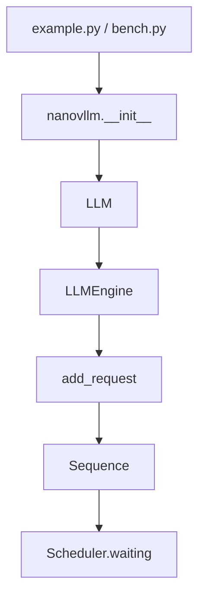
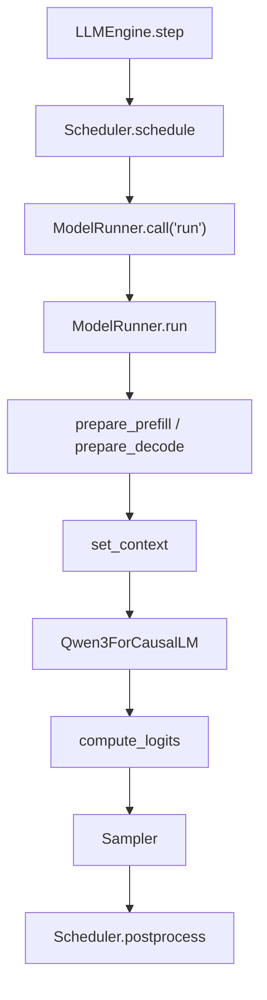
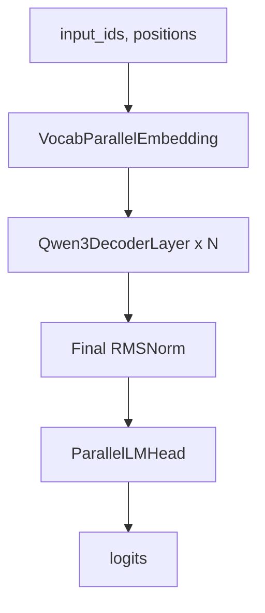
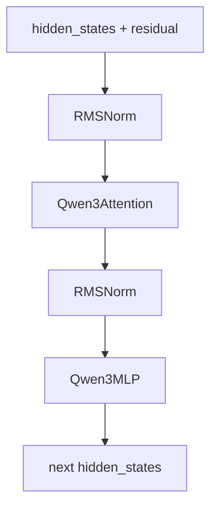
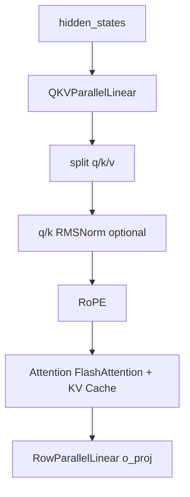
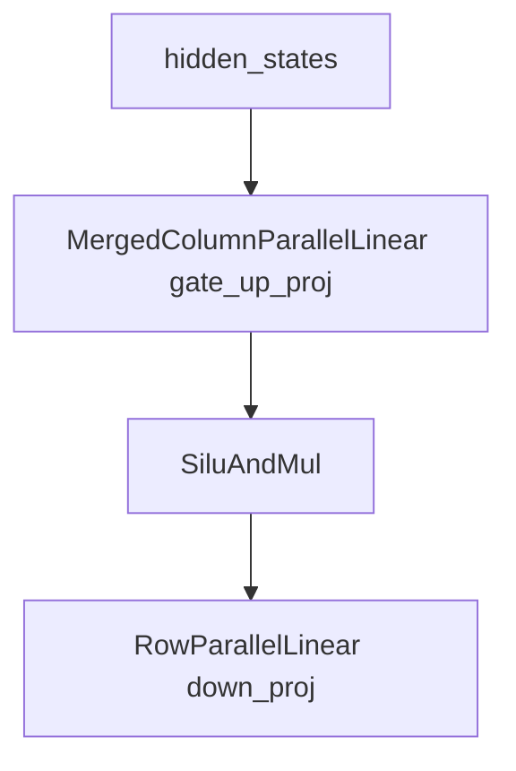
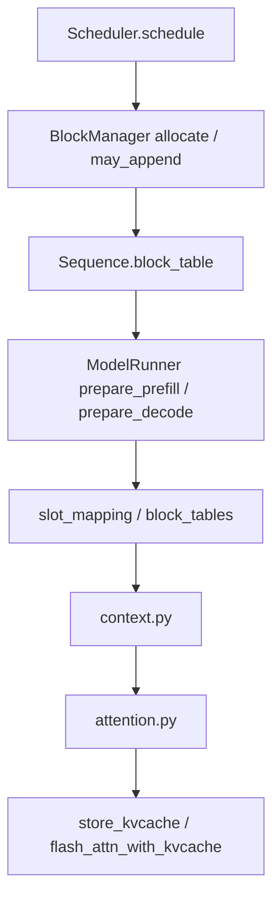
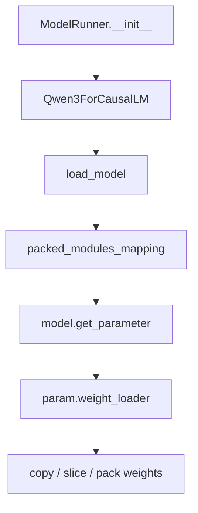
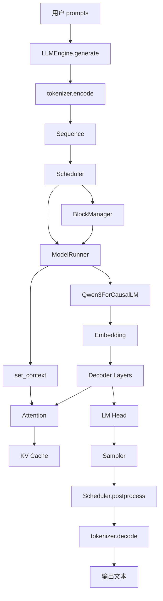

# nano-vLLM 源码结构与调用关系总览

## 0. 这份文档解决什么问题

你现在已经看完了 `layers/`、`models/qwen3.py`、`utils/` 等模型侧代码，也已经学过 engine 侧代码。但看完单个文件之后，最容易卡住的不是“某一行代码什么意思”，而是：

- 这个文件在整个项目里处在哪个位置？
- 它属于请求入口、调度、KV Cache、模型 forward、采样，还是权重加载？
- 它被谁调用，又会继续调用谁？
- prefill / decode / tensor parallel / prefix cache 这些概念分别落在哪些文件里？

这份文档的目标就是把 nano-vLLM 的源码从“散开的文件”重新串成“一条完整推理链路”。

核心主线是：

```text
用户 prompt
  -> LLM.generate
  -> tokenizer.encode
  -> Sequence
  -> Scheduler
  -> BlockManager
  -> ModelRunner
  -> Qwen3ForCausalLM
  -> layers
  -> logits
  -> Sampler
  -> Sequence.append_token
  -> tokenizer.decode
  -> 输出文本
```

## 1. 项目目录结构总览

nano-vLLM 的核心代码很少，但每个文件职责比较集中。

```text
nano-vllm-main/
  README.md
  example.py
  bench.py
  pyproject.toml
  nanovllm/
    __init__.py
    llm.py
    config.py
    sampling_params.py
    engine/
      llm_engine.py
      scheduler.py
      sequence.py
      block_manager.py
      model_runner.py
    models/
      qwen3.py
    layers/
      embed_head.py
      linear.py
      layernorm.py
      activation.py
      rotary_embedding.py
      attention.py
      sampler.py
    utils/
      context.py
      loader.py
```

可以把它分成 6 层：

| 层级 | 文件 | 主要职责 |
|---|---|---|
| 用户入口层 | `__init__.py`, `llm.py`, `example.py`, `bench.py` | 暴露 `LLM` API，提供使用和 benchmark 示例 |
| 配置与采样参数层 | `config.py`, `sampling_params.py` | 保存模型路径、最大 token 数、TP 大小、temperature 等参数 |
| Engine 调度层 | `llm_engine.py`, `scheduler.py`, `sequence.py`, `block_manager.py` | 管请求、调度 prefill/decode、维护 Sequence、管理 KV Cache blocks |
| 模型运行层 | `model_runner.py` | 初始化分布式进程、加载模型、分配 KV Cache、准备输入、执行模型、CUDA Graph |
| 模型结构层 | `models/qwen3.py` | 定义 Qwen3 Attention/MLP/Decoder/Model/CausalLM |
| Layer 与工具层 | `layers/*`, `utils/*` | 实现 embedding、linear、norm、RoPE、attention、sampler、context、loader |

一句话理解：

> `engine/` 决定“这一轮该算哪些请求”，`model_runner.py` 决定“怎么把这一轮请求送进 GPU 模型”，`models/` 和 `layers/` 决定“模型具体怎么算”。

## 2. 一次 `generate()` 的完整生命周期

### 2.1 用户入口

用户一般从 `example.py` 或自己的代码开始：

```python
from nanovllm import LLM, SamplingParams

llm = LLM(path, enforce_eager=True, tensor_parallel_size=1)
sampling_params = SamplingParams(temperature=0.6, max_tokens=256)
outputs = llm.generate(prompts, sampling_params)
```

这里的 `LLM` 来自：

```text
nanovllm/__init__.py
  -> nanovllm/llm.py
       -> class LLM(LLMEngine)
```

`LLM` 本身没有新逻辑，只是继承 `LLMEngine`。所以真正的入口类是：

```text
engine/llm_engine.py::LLMEngine
```

### 2.2 初始化阶段

创建 `LLM(path, ...)` 时，会进入 `LLMEngine.__init__`。

初始化主线：

```text
LLMEngine.__init__
  -> Config(model, **kwargs)
  -> 设置 Sequence.block_size
  -> 如果 tensor_parallel_size > 1，spawn 子进程
  -> 创建 rank 0 的 ModelRunner
  -> AutoTokenizer.from_pretrained
  -> 设置 config.eos
  -> 创建 Scheduler
```

这里有一个很重要的顺序：

```text
ModelRunner 先创建并分配 KV Cache
Scheduler 后创建并读取 config.num_kvcache_blocks
```

因为 `config.num_kvcache_blocks` 初始是 `-1`，真正的 block 数量是在 `ModelRunner.allocate_kv_cache()` 里根据 GPU 显存算出来的。随后 `Scheduler(config)` 再用这个数量创建 `BlockManager`。

### 2.3 添加请求

`LLMEngine.generate()` 会把每个 prompt 加入调度器：

```text
generate
  -> add_request(prompt, sampling_params)
       -> tokenizer.encode(prompt)  # 如果 prompt 是字符串
       -> Sequence(prompt_token_ids, sampling_params)
       -> scheduler.add(seq)
```

`Sequence` 是单条请求的运行状态对象，里面保存：

- prompt token；
- 已生成 token；
- 当前状态 WAITING/RUNNING/FINISHED；
- KV Cache block table；
- 已缓存 token 数；
- 本轮调度 token 数；
- temperature、max_tokens、ignore_eos。

### 2.4 主循环

`generate()` 的核心循环：

```text
while not scheduler.is_finished():
    outputs, num_tokens = step()
```

`step()` 做三件事：

```text
1. scheduler.schedule()
   -> 选出本轮要执行的 seqs
   -> 判断本轮是 prefill 还是 decode

2. model_runner.call("run", seqs, is_prefill)
   -> 准备 input_ids/positions/context
   -> 执行模型 forward
   -> LM Head 计算 logits
   -> sampler 采样 token

3. scheduler.postprocess(...)
   -> 更新 KV Cache block hash
   -> 更新 Sequence token 状态
   -> 判断 EOS/max_tokens
   -> 释放完成请求的 KV Cache
```

最后所有请求完成后：

```text
completion token ids
  -> tokenizer.decode
  -> {"text": ..., "token_ids": ...}
```

## 3. 源码文件详细作用

## 3.1 根目录文件

### 3.1.1 `README.md`

作用：项目说明文档。

主要说明：

- nano-vLLM 是轻量 vLLM 实现；
- 目标是可读性和快速离线推理；
- 支持 prefix caching、tensor parallel、torch compile、CUDA graph 等；
- 给出安装、模型下载、quick start 和 benchmark 数据。

它不参与运行，但告诉你这个项目的定位：

```text
不是完整生产级 vLLM
而是用较少代码复现 vLLM 核心推理机制
```

### 3.1.2 `example.py`

作用：最小使用示例。

流程：

```text
加载 tokenizer
创建 LLM
创建 SamplingParams
把用户 prompt 套 chat template
调用 llm.generate
打印 completion
```

它对应用户真实使用入口，帮助你理解 `LLM.generate()` 的外部 API。

### 3.1.3 `bench.py`

作用：benchmark 脚本。

流程：

```text
随机生成 prompt_token_ids
随机生成每条请求的 max_tokens
创建 LLM(enforce_eager=False)
先 warmup 一次
正式 generate
统计输出 token 总数 / 耗时
打印 throughput
```

它的重点不是模型语义，而是吞吐性能：

```text
Throughput = total output tokens / total time
```

`bench.py` 也体现了 nano-vLLM 支持两类输入：

- `list[str]`：需要 tokenizer encode；
- `list[list[int]]`：已经是 token ids，可直接推理。

### 3.1.4 `pyproject.toml`

作用：Python 项目配置文件。

一般包含包名、依赖、构建配置等。它不参与推理链路，但决定安装时依赖哪些库，例如 torch、transformers、flash-attn、triton、safetensors 等相关生态。

## 3.2 包入口与配置文件

### 3.2.1 `nanovllm/__init__.py`

作用：包导出入口。

它暴露：

```python
from nanovllm.llm import LLM
from nanovllm.sampling_params import SamplingParams
```

所以用户才能写：

```python
from nanovllm import LLM, SamplingParams
```

这个文件不做推理，只是 API 门面。

### 3.2.2 `nanovllm/llm.py`

作用：定义用户直接使用的 `LLM` 类。

代码很短：

```python
class LLM(LLMEngine):
    pass
```

说明 `LLM` 只是 `LLMEngine` 的别名式封装。

真实逻辑全部在：

```text
engine/llm_engine.py
```

### 3.2.3 `nanovllm/config.py`

作用：保存推理引擎全局配置。

核心字段：

| 字段 | 作用 |
|---|---|
| `model` | HuggingFace 模型目录 |
| `max_num_batched_tokens` | 一轮 prefill 最多处理多少 token |
| `max_num_seqs` | 一轮最多处理多少请求 |
| `max_model_len` | 最大上下文长度 |
| `gpu_memory_utilization` | 多少比例 GPU 显存用于权重+KV Cache |
| `tensor_parallel_size` | 张量并行 GPU 数 |
| `enforce_eager` | 是否强制 eager，关闭 CUDA Graph |
| `hf_config` | HuggingFace AutoConfig |
| `eos` | tokenizer 的 EOS token id |
| `kvcache_block_size` | KV Cache block 大小 |
| `num_kvcache_blocks` | 实际可分配 KV Cache block 数 |

`__post_init__` 做几件事：

```text
检查模型目录存在
检查 block_size 是 256 的倍数
检查 TP size 合法
读取 HF config
max_model_len 不超过模型 max_position_embeddings
```

它是配置中心，后续 `LLMEngine`、`Scheduler`、`ModelRunner` 都依赖它。

### 3.2.4 `nanovllm/sampling_params.py`

作用：定义每条请求的采样参数。

字段：

| 字段 | 作用 |
|---|---|
| `temperature` | 控制采样随机性 |
| `max_tokens` | 最多生成多少 completion token |
| `ignore_eos` | 是否忽略 EOS |

注意：

```python
assert self.temperature > 1e-10, "greedy sampling is not permitted"
```

这说明 nano-vLLM 当前 sampler 不支持 temperature 接近 0 的 greedy sampling，只支持随机采样。

## 3.3 Engine 文件

## 3.3.1 `engine/llm_engine.py`

### 文件定位

`llm_engine.py` 是用户 API 和推理系统之间的总入口。

它负责：

1. 初始化配置；
2. 创建多进程 tensor parallel 环境；
3. 创建 `ModelRunner`；
4. 创建 tokenizer；
5. 创建 `Scheduler`；
6. 接收用户请求；
7. 驱动调度循环；
8. 返回最终文本。

### 在推理流程中的位置

```text
用户调用 LLM.generate
  -> LLMEngine.generate
  -> LLMEngine.step
  -> Scheduler.schedule
  -> ModelRunner.run
  -> Scheduler.postprocess
```

### 关键函数

#### `__init__`

初始化推理服务。

如果 `tensor_parallel_size > 1`：

```text
rank 1..N-1 通过 multiprocessing spawn 子进程
rank 0 在主进程中创建
```

rank 0 和其他 rank 通过 shared memory + event 通信。

#### `add_request`

把 prompt 转成 `Sequence`：

```text
str prompt -> tokenizer.encode -> token ids
list[int] prompt -> 直接用
token ids + sampling params -> Sequence
Sequence -> scheduler.waiting
```

#### `step`

一次调度步。

核心流程：

```text
seqs, is_prefill = scheduler.schedule()
token_ids = model_runner.call("run", seqs, is_prefill)
scheduler.postprocess(seqs, token_ids, is_prefill)
返回已经 finished 的输出
```

#### `generate`

完整生成入口。

它循环调用 `step()`，直到所有请求结束。

同时统计：

- prefill throughput；
- decode throughput。

最后 decode token ids 为文本。

### 和其他文件的关系

| 调用/依赖 | 关系 |
|---|---|
| `Config` | 初始化全局配置 |
| `Sequence` | 每条请求的状态对象 |
| `Scheduler` | 决定每轮运行哪些请求 |
| `ModelRunner` | 真正执行 GPU 模型 |
| `AutoTokenizer` | prompt encode 和 output decode |

## 3.3.2 `engine/sequence.py`

### 文件定位

`sequence.py` 定义单条请求的状态。

在推理服务里，一条用户请求不是简单的字符串，而是一个不断变化的对象：

```text
prompt tokens
已生成 tokens
当前状态
KV Cache block table
已缓存 token 数
本轮调度 token 数
采样参数
```

这些都放在 `Sequence` 里。

### 核心类

#### `SequenceStatus`

三种状态：

| 状态 | 含义 |
|---|---|
| `WAITING` | 等待 prefill 或因 preempt 回到等待队列 |
| `RUNNING` | prefill 已完成，正在 decode |
| `FINISHED` | 生成结束 |

#### `Sequence`

核心字段：

| 字段 | 作用 |
|---|---|
| `seq_id` | 请求唯一编号 |
| `token_ids` | 当前完整 token 列表，包含 prompt + generated |
| `last_token` | 当前最后一个 token，decode 输入用 |
| `num_tokens` | 当前总 token 数 |
| `num_prompt_tokens` | prompt token 数 |
| `num_cached_tokens` | 已经写入 KV Cache 的 token 数 |
| `num_scheduled_tokens` | 本轮将要调度的 token 数 |
| `is_prefill` | 当前是否仍处于 prefill 逻辑 |
| `block_table` | 该 sequence 使用的 KV Cache block id 列表 |
| `temperature` | 采样温度 |
| `max_tokens` | 最大生成 token 数 |
| `ignore_eos` | 是否忽略 EOS |

### 关键属性

| 属性 | 作用 |
|---|---|
| `num_completion_tokens` | 已生成 token 数 |
| `prompt_token_ids` | prompt 部分 |
| `completion_token_ids` | completion 部分 |
| `num_blocks` | 当前 sequence 需要多少 KV Cache blocks |
| `last_block_num_tokens` | 最后一个 block 中已有多少 token |

### 和其他文件的关系

| 文件 | 如何使用 Sequence |
|---|---|
| `llm_engine.py` | 创建 Sequence，最后取 completion_token_ids |
| `scheduler.py` | 根据 Sequence 状态调度 prefill/decode |
| `block_manager.py` | 根据 Sequence.block_table 分配/释放 KV blocks |
| `model_runner.py` | 根据 Sequence 构造 input_ids、positions、slot_mapping |

## 3.3.3 `engine/block_manager.py`

### 文件定位

`block_manager.py` 负责 KV Cache blocks 的逻辑管理。

它不直接存 GPU 上的 K/V tensor，而是管理：

```text
哪些 block 空闲
哪些 block 正在使用
某条 sequence 使用哪些 block
哪些 prefix block 可以复用
block 的 ref_count
```

真正的 KV Cache tensor 在 `model_runner.py` 中分配。

### 核心类

#### `Block`

表示一个 KV Cache block 的元信息。

字段：

| 字段 | 作用 |
|---|---|
| `block_id` | 物理 block 编号 |
| `ref_count` | 被多少 sequence 引用 |
| `hash` | prefix caching 用的 block hash |
| `token_ids` | 该 block 对应的 token ids |

#### `BlockManager`

管理所有 blocks。

核心结构：

| 字段 | 作用 |
|---|---|
| `blocks` | 所有 Block 对象 |
| `hash_to_block_id` | prefix hash 到 block id 的映射 |
| `free_block_ids` | 空闲 block 队列 |
| `used_block_ids` | 正在使用的 block 集合 |

### 核心函数

#### `can_allocate(seq)`

判断一条 waiting sequence 是否能分配 KV blocks。

同时做 prefix cache 检查：

```text
从第 0 个完整 block 开始计算 hash
如果 hash 命中并且 token_ids 一致
说明该 prefix block 可复用
统计 num_cached_blocks
```

返回：

- `-1`：空闲 blocks 不够；
- `num_cached_blocks`：可复用的 prefix block 数。

#### `allocate(seq, num_cached_blocks)`

给 prefill 请求分配 blocks。

逻辑：

```text
前 num_cached_blocks 个 block 复用已有 prefix cache
剩余 block 从 free_block_ids 新分配
写入 seq.block_table
更新 seq.num_cached_tokens
```

#### `can_append(seq)` / `may_append(seq)`

decode 阶段每生成一个 token，可能需要追加一个新 block。

如果当前 token 是新 block 的第一个 token，就需要分配新 block。

#### `hash_blocks(seq)`

prefill 后，把已经完整填满的 block 计算 hash，加入 `hash_to_block_id`。

这是 prefix caching 的基础。

#### `deallocate(seq)`

请求结束或被 preempt 时释放 blocks。

如果 block 被多个 sequence 共享，会减少 `ref_count`；只有 `ref_count == 0` 才真正回到 free list。

### 和其他文件的关系

| 文件 | 关系 |
|---|---|
| `scheduler.py` | 调用 BlockManager 分配、追加、释放、hash blocks |
| `sequence.py` | BlockManager 读写 seq.block_table |
| `model_runner.py` | 根据 seq.block_table 构造 block_tables/slot_mapping |
| `attention.py` | 使用 slot_mapping 写 KV Cache，使用 block_tables 读 KV Cache |

## 3.3.4 `engine/scheduler.py`

### 文件定位

`scheduler.py` 是请求调度器。

它决定每一步推理：

- 是做 prefill 还是 decode；
- 哪些 sequence 进入本轮 batch；
- prefill 本轮处理多少 token；
- decode 是否能追加 KV Cache block；
- 请求完成后如何释放资源。

### 核心队列

```python
self.waiting: deque[Sequence]
self.running: deque[Sequence]
```

含义：

| 队列 | 含义 |
|---|---|
| `waiting` | 新请求或被抢占请求，等待 prefill |
| `running` | prefill 已完成，正在 decode |

### `schedule()`

调度逻辑分两段：

```text
优先 prefill
如果没有 prefill 可做，再 decode
```

#### prefill 调度

从 waiting 队列取请求，受两个限制：

| 限制 | 含义 |
|---|---|
| `max_num_seqs` | 一轮最多多少条 sequence |
| `max_num_batched_tokens` | 一轮 prefill token 总数上限 |

它会：

1. 检查/分配 KV blocks；
2. 尝试复用 prefix cache；
3. 设置 `seq.num_scheduled_tokens`；
4. 如果 prompt 已全部 prefill 完，把 seq 移入 running；
5. 返回 `(scheduled_seqs, True)`。

注意：

```text
只有第一个 seq 允许 chunked prefill
```

如果剩余 token budget 不够完整处理后续 seq，会停止添加更多 seq。

#### decode 调度

如果没有 waiting prefill，调度 running 队列。

每条 running seq 每轮 decode 一个 token：

```text
seq.num_scheduled_tokens = 1
seq.is_prefill = False
```

如果 KV Cache block 不够，会触发 preempt：

```text
释放某些 running seq 的 KV Cache
把它们放回 waiting
之后重新 prefill
```

### `postprocess()`

模型运行后更新 sequence 状态。

流程：

```text
hash_blocks(seq)
seq.num_cached_tokens += seq.num_scheduled_tokens
清空 num_scheduled_tokens
如果是 chunked prefill 且 prompt 还没全部缓存，暂不 append token
否则 append sampled token
判断 EOS 或 max_tokens
如果结束，释放 KV blocks，从 running 删除
```

这说明：

```text
prefill 也会采样 token
但如果是 chunked prefill 中间片段，这个 token 会被忽略
只有 prompt prefill 完成后，采样 token 才作为第一个生成 token 追加
```

### 和其他文件的关系

| 文件 | 关系 |
|---|---|
| `llm_engine.py` | 每次 step 调用 scheduler.schedule/postprocess |
| `sequence.py` | 调度对象就是 Sequence |
| `block_manager.py` | 调度时分配/释放 KV blocks |
| `model_runner.py` | scheduler 选出的 seqs 会交给 ModelRunner 执行 |

## 3.3.5 `engine/model_runner.py`

### 文件定位

`model_runner.py` 是 GPU 模型执行器。

它负责：

1. 初始化分布式进程组；
2. 设置 CUDA device；
3. 创建 Qwen3ForCausalLM；
4. 加载模型权重；
5. warmup；
6. 根据显存分配 KV Cache；
7. 把 KV Cache tensor 挂到每层 Attention；
8. 准备 prefill/decode 输入；
9. 设置 context；
10. 执行模型 forward；
11. 采样 token；
12. 可选 capture/replay CUDA Graph。

可以把它理解为：

```text
Scheduler 选中请求
ModelRunner 把请求变成 GPU tensor 并跑模型
```

### 初始化主线

```text
dist.init_process_group
torch.cuda.set_device(rank)
torch.set_default_dtype(hf_config.dtype)
torch.set_default_device("cuda")
self.model = Qwen3ForCausalLM(hf_config)
load_model(self.model, config.model)
self.sampler = Sampler()
self.warmup_model()
self.allocate_kv_cache()
capture_cudagraph(optional)
```

### tensor parallel 多进程

如果 `world_size > 1`：

- rank 0 在主进程；
- rank > 0 在子进程；
- rank 0 通过 shared memory 写入方法名和参数；
- 子进程等待 event，读取 shared memory，然后调用同名方法。

这让所有 TP ranks 都能同步执行 `run`、`exit` 等方法。

### `allocate_kv_cache()`

根据显存计算可用 KV Cache blocks：

```text
block_bytes =
  2
  * num_hidden_layers
  * block_size
  * num_kv_heads_per_rank
  * head_dim
  * dtype.itemsize
```

其中 `2` 表示 K 和 V。

然后分配：

```text
kv_cache:
[2, num_layers, num_blocks, block_size, num_kv_heads, head_dim]
```

再遍历模型模块：

```text
找到每个 Attention 模块
module.k_cache = kv_cache[0, layer_id]
module.v_cache = kv_cache[1, layer_id]
```

这一步把 engine 层的 KV Cache tensor 和 model/layer 层的 Attention 接起来。

### `prepare_prefill(seqs)`

把 prefill 请求变成模型输入。

输出：

```text
input_ids: [total_scheduled_tokens]
positions: [total_scheduled_tokens]
context:
  is_prefill=True
  cu_seqlens_q
  cu_seqlens_k
  max_seqlen_q
  max_seqlen_k
  slot_mapping
  block_tables(optional)
```

关键点：

- `input_ids` 是所有 scheduled prompt token 展平后的列表；
- `positions` 是每个 token 在自己 sequence 里的位置；
- `slot_mapping` 表示每个 token 的 K/V 写入哪个物理 KV slot；
- 如果存在 prefix cache，则 `block_tables` 不为 None。

### `prepare_decode(seqs)`

把 decode 请求变成模型输入。

每条 sequence 只输入一个 token：

```text
input_ids = [seq.last_token for seq in seqs]
positions = [len(seq) - 1 for seq in seqs]
```

context：

```text
is_prefill=False
slot_mapping
context_lens
block_tables
```

decode 阶段的 `block_tables` 很重要，Attention 要靠它从 Paged KV Cache 中读历史 K/V。

### `run_model()`

模型执行入口。

两条路径：

```text
prefill / enforce_eager / bs > 512:
  直接 eager 执行 model + compute_logits

decode 且启用 CUDA Graph:
  复制 input 到 graph_vars
  graph.replay()
  compute_logits(outputs)
```

### `run()`

完整一次模型运行：

```text
prepare_prefill 或 prepare_decode
prepare_sample
run_model
sampler(logits, temperatures)
reset_context
return token_ids
```

### `capture_cudagraph()`

为 decode 阶段预先 capture 多个 batch size 的 CUDA Graph：

```text
graph_bs = [1, 2, 4, 8, 16, 32, ...]
```

原因：decode 每步形状相对稳定，适合 CUDA Graph 减少 CPU launch overhead。

prefill 因为 token 数和长度变化大，不走 CUDA Graph。

## 3.4 Model 文件

## 3.4.1 `models/qwen3.py`

### 文件定位

`qwen3.py` 是模型结构总装文件。

它定义：

| 类 | 作用 |
|---|---|
| `Qwen3Attention` | 单层 Attention 子模块 |
| `Qwen3MLP` | 单层 MLP/SwiGLU 子模块 |
| `Qwen3DecoderLayer` | 一个完整 Decoder block |
| `Qwen3Model` | embedding + 多层 decoder + final norm |
| `Qwen3ForCausalLM` | Qwen3Model + LM Head |

层级关系：

```text
Qwen3ForCausalLM
  -> Qwen3Model
       -> VocabParallelEmbedding
       -> Qwen3DecoderLayer x N
            -> Qwen3Attention
            -> Qwen3MLP
       -> final RMSNorm
  -> ParallelLMHead
```

### `Qwen3Attention`

负责一层 self-attention。

调用关系：

```text
hidden_states
  -> QKVParallelLinear
  -> split q/k/v
  -> optional q_norm/k_norm
  -> RoPE
  -> Attention
  -> RowParallelLinear(o_proj)
```

它使用 tensor parallel：

```text
total_num_heads / tp_size -> 当前 rank 的 num_heads
total_num_kv_heads / tp_size -> 当前 rank 的 num_kv_heads
```

### `Qwen3MLP`

负责一层 MLP。

结构：

```text
gate_up_proj = MergedColumnParallelLinear(hidden_size, [intermediate_size, intermediate_size])
act_fn = SiluAndMul()
down_proj = RowParallelLinear(intermediate_size, hidden_size)
```

数学形式：

```text
MLP(x) = down_proj(silu(gate_proj(x)) * up_proj(x))
```

### `Qwen3DecoderLayer`

把 Attention、MLP、RMSNorm、residual 串起来。

概念结构：

```text
x = x + Attention(RMSNorm(x))
x = x + MLP(RMSNorm(x))
```

代码中通过：

```text
hidden_states, residual
```

两条线实现 residual add + RMSNorm 融合。

### `Qwen3Model`

负责：

```text
input_ids
  -> embedding
  -> decoder layers
  -> final norm
  -> hidden_states
```

输入：

```text
input_ids: [num_tokens]
positions: [num_tokens]
```

输出：

```text
hidden_states: [num_tokens, hidden_size]
```

### `Qwen3ForCausalLM`

负责：

```text
hidden_states -> logits
```

包含：

```text
self.model = Qwen3Model(config)
self.lm_head = ParallelLMHead(...)
```

`packed_modules_mapping` 给 `loader.py` 使用：

| HF 权重 | nano-vLLM 参数 | shard_id |
|---|---|---|
| `q_proj` | `qkv_proj` | `"q"` |
| `k_proj` | `qkv_proj` | `"k"` |
| `v_proj` | `qkv_proj` | `"v"` |
| `gate_proj` | `gate_up_proj` | `0` |
| `up_proj` | `gate_up_proj` | `1` |

## 3.5 Layers 文件

## 3.5.1 `layers/embed_head.py`

### 文件定位

负责模型输入端和输出端：

```text
input_ids -> VocabParallelEmbedding -> hidden_states
hidden_states -> ParallelLMHead -> logits
```

### `VocabParallelEmbedding`

按 vocab 维度做 tensor parallel。

每个 rank 只保存一部分词表权重：

```text
[vocab_size / tp_size, hidden_size]
```

forward：

```text
判断 token id 是否属于当前 rank
属于则查 embedding
不属于则置零
all_reduce 得到完整 hidden_states
```

### `ParallelLMHead`

继承 `VocabParallelEmbedding`，但 forward 做的是：

```text
hidden_states @ weight.T -> local logits
gather -> rank 0 拼完整 vocab logits
```

prefill 阶段只取每条 sequence 最后一个 token 的 hidden state 算 logits。

## 3.5.2 `layers/linear.py`

### 文件定位

负责 Qwen3 中所有重要线性层的 tensor parallel 封装。

核心类：

| 类 | 作用 |
|---|---|
| `ReplicatedLinear` | 不切分的普通 Linear |
| `ColumnParallelLinear` | 切输出维度 |
| `MergedColumnParallelLinear` | 合并多个输出投影，切输出维度 |
| `QKVParallelLinear` | 合并 q/k/v，按 head 切分 |
| `RowParallelLinear` | 切输入维度，最后 all_reduce |

在 Qwen3 中：

```text
QKVParallelLinear -> qkv_proj
MergedColumnParallelLinear -> gate_up_proj
RowParallelLinear -> o_proj / down_proj
```

它也是 `loader.py` 能正确加载 TP 切片的基础，因为这些 Parameter 上挂了自定义 `weight_loader`。

## 3.5.3 `layers/layernorm.py`

### 文件定位

负责 RMSNorm。

用途：

- decoder layer 输入归一化；
- attention 后归一化；
- final norm；
- Q/K norm。

核心函数：

| 函数 | 作用 |
|---|---|
| `rms_forward` | 普通 RMSNorm |
| `add_rms_forward` | residual add + RMSNorm 融合 |

RMSNorm 公式：

```text
x / sqrt(mean(x^2) + eps) * weight
```

它是高频小算子，使用 `torch.compile` 优化。

## 3.5.4 `layers/activation.py`

### 文件定位

负责 Qwen3 MLP 中的 SwiGLU 激活。

核心：

```python
x, y = x.chunk(2, -1)
return F.silu(x) * y
```

对应：

```text
silu(gate_proj(x)) * up_proj(x)
```

它处在：

```text
gate_up_proj -> SiluAndMul -> down_proj
```

中间。

## 3.5.5 `layers/rotary_embedding.py`

### 文件定位

负责 RoPE 旋转位置编码。

位置：

```text
q/k reshape 后
Attention 计算前
```

它根据 `positions` 从 cos/sin cache 取出对应位置参数，对 q/k 做旋转：

```text
q, k = rotary_emb(positions, q, k)
```

只作用于 q/k，不作用于 v。

## 3.5.6 `layers/attention.py`

### 文件定位

负责真正的 Attention 计算和 KV Cache 读写。

核心功能：

1. Triton kernel 写入 KV Cache；
2. prefill 用 `flash_attn_varlen_func`；
3. decode 用 `flash_attn_with_kvcache`；
4. prefix cache 时通过 block table 从 KV Cache 读取 prefix K/V。

它读取 `context.py` 中的全局 context：

- `is_prefill`
- `cu_seqlens_q/k`
- `max_seqlen_q/k`
- `slot_mapping`
- `context_lens`
- `block_tables`

这是模型层和 engine 调度层交汇最明显的文件。

## 3.5.7 `layers/sampler.py`

### 文件定位

负责从 logits 采样 next token。

流程：

```text
logits
  -> temperature scaling
  -> softmax
  -> exponential noise + argmax
  -> sample token ids
```

输入：

```text
logits: [num_seqs, vocab_size]
temperatures: [num_seqs]
```

输出：

```text
sample_tokens: [num_seqs]
```

它只在 rank 0 上执行，因为 `ParallelLMHead` 已经把完整 vocab logits gather 到 rank 0。

## 3.6 Utils 文件

## 3.6.1 `utils/context.py`

### 文件定位

`context.py` 是模型 forward 期间的全局上下文容器。

它保存当前 batch 的推理元信息：

| 字段 | prefill 用途 | decode 用途 |
|---|---|---|
| `is_prefill` | 判断 prefill 分支 | 判断 decode 分支 |
| `cu_seqlens_q` | varlen FlashAttention 的 Q 边界 | 不用 |
| `cu_seqlens_k` | varlen FlashAttention 的 K 边界 | 不用 |
| `max_seqlen_q` | 最大 Q 长度 | 不用 |
| `max_seqlen_k` | 最大 K 长度 | 不用 |
| `slot_mapping` | K/V 写入 cache 位置 | 新 token K/V 写入位置 |
| `context_lens` | 不用 | 每条 sequence 当前长度 |
| `block_tables` | prefix cache 读取 blocks | decode 读取历史 KV blocks |

为什么需要它？

因为 `Qwen3Attention.forward(q, k, v)` 的函数签名只传 q/k/v，但 `attention.py` 还需要调度器准备的 batch 元信息。于是 `ModelRunner` 在 forward 前调用 `set_context`，Attention 内部用 `get_context` 读取。

## 3.6.2 `utils/loader.py`

### 文件定位

负责从 safetensors 加载 HuggingFace 权重。

关键机制：

```text
普通参数 -> default copy 或参数自带 weight_loader
packed 参数 -> 根据 packed_modules_mapping 改名并传 shard_id
```

例如：

```text
q_proj.weight -> qkv_proj.weight 的 q 段
k_proj.weight -> qkv_proj.weight 的 k 段
v_proj.weight -> qkv_proj.weight 的 v 段
gate_proj.weight -> gate_up_proj.weight 第 0 段
up_proj.weight -> gate_up_proj.weight 第 1 段
```

它不自己实现 TP 切片，而是调用参数上的 `weight_loader`：

- `QKVParallelLinear.weight_loader`
- `MergedColumnParallelLinear.weight_loader`
- `RowParallelLinear.weight_loader`
- `VocabParallelEmbedding.weight_loader`

## 4. 文件之间的整体调用关系

### 4.1 用户 API 到调度器



解释：

- 用户只看到 `LLM`；
- `LLM` 实际是 `LLMEngine`；
- prompt 被 tokenizer 编码后封装成 `Sequence`；
- `Sequence` 进入 `Scheduler.waiting` 等待调度。

### 4.2 一次 step 的调用链



解释：

- `Scheduler` 只决定“算哪些请求”；
- `ModelRunner` 负责“怎么跑 GPU 模型”；
- `Qwen3ForCausalLM` 负责“模型怎么算”；
- `Sampler` 给出 next token；
- `postprocess` 更新请求状态。

### 4.3 Qwen3 模型内部调用链



单个 DecoderLayer：



Attention 内部：



MLP 内部：



### 4.4 KV Cache 相关调用链



解释：

- `BlockManager` 管逻辑 blocks；
- `Sequence.block_table` 记录每条请求使用哪些 block；
- `ModelRunner` 把 block_table 转成 GPU tensor；
- `context.py` 传递给 attention；
- `attention.py` 真正写入和读取 KV Cache。

### 4.5 权重加载调用链



解释：

- `qwen3.py` 定义结构和 packed mapping；
- `loader.py` 遍历 safetensors；
- 每个参数自己决定怎么加载；
- 并行 Linear/Embedding 的 loader 会自动按 TP rank 切片。

## 5. prefill 和 decode 在各文件中的分工

| 文件 | prefill 中的作用 | decode 中的作用 |
|---|---|---|
| `Scheduler` | 从 waiting 选 prompt token，支持 chunked prefill 和 prefix cache | 从 running 选 seq，每条 seq 一个 token |
| `BlockManager` | 分配 prompt 所需 blocks，检查 prefix cache | 必要时追加新 block，内存不足时 preempt |
| `ModelRunner` | 构造多 token `input_ids/positions/cu_seqlens/slot_mapping` | 构造每 seq 一个 `last_token/context_lens/block_tables` |
| `context.py` | 保存 varlen attention 元信息 | 保存 kvcache attention 元信息 |
| `Qwen3Model` | 处理 prompt tokens | 处理当前 step tokens |
| `attention.py` | `flash_attn_varlen_func`，写入 prompt K/V | `flash_attn_with_kvcache`，读取历史 K/V 并写入新 K/V |
| `embed_head.py` | LM Head 只取每条 prompt 最后 token 算 logits | LM Head 对每个 decode token 算 logits |
| `sampler.py` | 采样首个生成 token | 采样后续 token |
| `Scheduler.postprocess` | prefill 完成后 append 首 token；chunk 中间片段不 append | append 每轮 decode token，判断 EOS/max_tokens |

最关键的边界：

```text
prefill:
  一次处理 prompt 的多个 token，建立 KV Cache，得到首 token

decode:
  每条请求每轮处理一个新 token，复用 KV Cache，持续生成后续 token
```

## 6. KV Cache / Paged Attention 相关文件分工

| 概念 | 主要文件 | 说明 |
|---|---|---|
| KV Cache 真实 tensor | `model_runner.py` | 分配 `[2, layers, blocks, block_size, kv_heads, head_dim]` |
| KV Cache block 元信息 | `block_manager.py` | 管 free/used/ref_count/hash |
| 每条请求用哪些 block | `sequence.py` | `seq.block_table` |
| 本轮 token 写入哪个 slot | `model_runner.py` | 构造 `slot_mapping` |
| 每条请求 block 映射表 | `model_runner.py` | 构造 `block_tables` |
| 写入 K/V | `attention.py` | Triton `store_kvcache_kernel` |
| decode 读取 K/V | `attention.py` | `flash_attn_with_kvcache` |
| prefix cache | `block_manager.py` + `attention.py` | hash 命中复用 block，attention 用 block_table 读 cache |

KV Cache 主线：

```text
Scheduler/BlockManager 分配 block
  -> Sequence.block_table 记录逻辑到物理 block
  -> ModelRunner 生成 slot_mapping/block_tables
  -> Attention 写入/读取 KV Cache
```

## 7. Tensor Parallel 相关文件分工

| 文件 | TP 作用 |
|---|---|
| `LLMEngine` | spawn 多个 ModelRunner 进程 |
| `ModelRunner` | 初始化 NCCL process group，设置 rank/device |
| `qwen3.py` | 根据 `dist.get_world_size()` 切 attention heads |
| `linear.py` | Column/Row/QKV/Merged 线性层切分 |
| `embed_head.py` | vocab embedding 和 lm_head 切分 |
| `loader.py` | 调用参数 loader，让每个 rank 加载自己的切片 |
| `attention.py` | 每个 rank 计算自己的 local heads |
| `sampler.py` | 通常只在 rank 0 对完整 logits 采样 |

TP 主线：

```text
每个 rank 创建同样的模型结构
但每个 rank 的参数只加载自己的切片
Attention/MLP 局部计算
必要时 all_reduce/gather
rank 0 采样并返回 token
```

## 8. 权重加载与模型结构适配

HuggingFace 原始 Qwen3 权重和 nano-vLLM 运行时结构不完全一致。

### 8.1 Attention 权重

HF：

```text
q_proj.weight
k_proj.weight
v_proj.weight
```

nano-vLLM：

```text
qkv_proj.weight
```

映射由 `Qwen3ForCausalLM.packed_modules_mapping` 提供，由 `loader.py` 执行，由 `QKVParallelLinear.weight_loader` 完成写入和切片。

### 8.2 MLP 权重

HF：

```text
gate_proj.weight
up_proj.weight
```

nano-vLLM：

```text
gate_up_proj.weight
```

这个顺序必须和 `SiluAndMul` 的 `chunk(2, -1)` 对齐：

```text
前半段 = gate
后半段 = up
```

### 8.3 普通权重

例如：

- RMSNorm weight；
- o_proj；
- down_proj；
- embedding；
- lm_head。

这些可能原名加载，但仍然可能通过参数自己的 `weight_loader` 做 TP 切片。

## 9. 推荐你现在如何复习这些源码

你现在已经看完了 layers/models/utils，建议按以下顺序把它们重新串起来：

1. 先看 `llm_engine.py`：理解用户请求怎么进入系统。
2. 再看 `scheduler.py + sequence.py`：理解请求状态和 prefill/decode 调度。
3. 再看 `block_manager.py`：理解 KV Cache block、prefix cache、preempt。
4. 再看 `model_runner.py`：理解 input_ids/positions/context/KV Cache tensor 如何准备。
5. 再看 `qwen3.py`：理解模型结构总装。
6. 再看 `layers/attention.py`：理解 prefill/decode 真正分叉的位置。
7. 最后串 `loader.py + linear.py + embed_head.py`：理解权重加载和 TP 切片。

最重要的 3 条主线：

```text
请求状态主线:
  Sequence -> Scheduler -> postprocess -> Sequence

KV Cache 主线:
  BlockManager -> block_table -> slot_mapping/block_tables -> Attention

模型计算主线:
  input_ids -> embedding -> Qwen3 layers -> lm_head -> sampler
```

## 10. 一句话总结每个核心文件

| 文件 | 一句话总结 |
|---|---|
| `__init__.py` | 暴露 `LLM` 和 `SamplingParams` 给用户 |
| `llm.py` | 用 `LLM` 包装 `LLMEngine` |
| `config.py` | 保存推理服务全局配置和 HF config |
| `sampling_params.py` | 保存每条请求的 temperature/max_tokens/ignore_eos |
| `llm_engine.py` | 用户 API、请求加入、主循环、tokenizer encode/decode |
| `sequence.py` | 单条请求的 token、状态、block_table 和采样参数 |
| `scheduler.py` | 决定每轮做 prefill 还是 decode，并更新请求状态 |
| `block_manager.py` | 管理 KV Cache block、prefix cache、引用计数和释放 |
| `model_runner.py` | GPU 执行器，负责模型加载、KV Cache、context、forward、sampler、CUDA Graph |
| `qwen3.py` | Qwen3 模型结构总装，定义 Attention/MLP/Decoder/CausalLM |
| `embed_head.py` | 输入 embedding 和输出 LM Head 的 vocab parallel |
| `linear.py` | Attention/MLP 中并行 Linear、QKV 合并、gate/up 合并 |
| `layernorm.py` | RMSNorm 和 residual add + norm 融合 |
| `activation.py` | MLP 中 `silu(gate) * up` |
| `rotary_embedding.py` | RoPE，把 position 注入 q/k |
| `attention.py` | FlashAttention、KV Cache 写入、prefill/decode attention |
| `sampler.py` | logits 到 next token 的 temperature sampling |
| `context.py` | 在 ModelRunner 和 Attention 之间传递当前 batch 元信息 |
| `loader.py` | safetensors 权重加载、合并权重映射、TP 切片分发 |

## 11. 最终整体图



如果只记一条线，就是：

```text
LLMEngine 管入口
Scheduler 管本轮谁能跑
BlockManager 管 KV Cache block
ModelRunner 管 GPU 执行
Qwen3.py 管模型结构
layers 管具体算子
context.py 把调度信息传给 Attention
sampler.py 把 logits 变成 token
```


%% 项目关联导航：开始 %%
## 项目关联导航

- 所属模块：[[outputs/项目整理/模块-nano_vllm|模块-nano_vllm]]
- 关联阅读：[[outputs/项目整理/专题-01-请求从输入到输出|专题-01-请求从输入到输出]]

%% 项目关联导航：结束 %%
