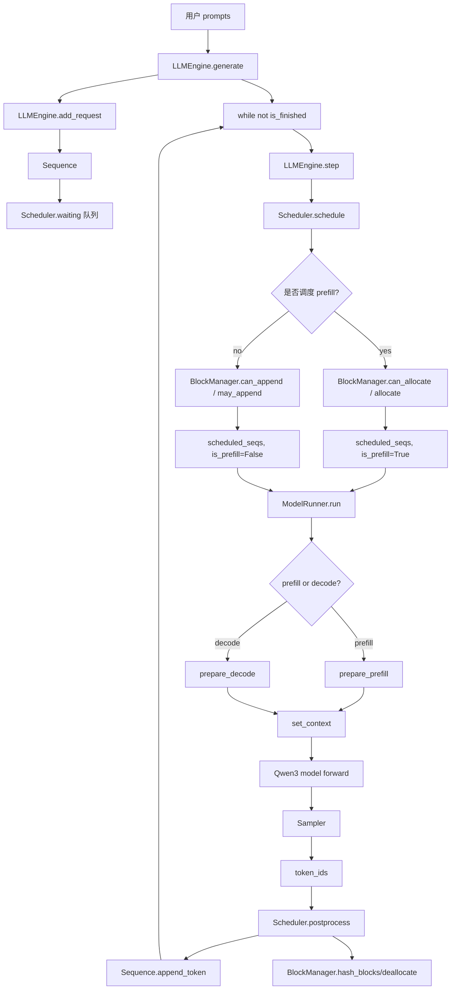

# nano-vLLM `engine/` 源码结构与调用关系详解

> 适用状态：你已经看完了 `example.py`、`bench.py` 和 `nanovllm/engine/` 目录下的 5 个文件，但目前只是知道“大概做什么”，还没有把 **文件之间、类之间、方法之间、数据结构之间的调用关系** 串起来。本文档的目标就是把 `engine/` 的 5 个文件拆开讲清楚，再重新组合成完整推理流程。

---

## 0. 先给出总判断：`engine/` 是 nano-vLLM 的“大脑”和“调度中枢”

`nanovllm/engine/` 目录中的 5 个文件分别是：

```text
engine/
├── llm_engine.py       # 用户 API 到内部推理循环的总控入口
├── sequence.py         # 单个请求/序列的运行时状态对象
├── scheduler.py        # prefill/decode 调度器，决定每一步跑哪些请求
├── block_manager.py    # KV Cache block 管理器，负责分配、释放、prefix cache
└── model_runner.py     # GPU 模型执行器，负责真正调用模型 forward 和采样
```

一句话概括它们之间的分工：

```text
LLMEngine 接收用户请求
    ↓
Sequence 表示每个请求的运行状态
    ↓
Scheduler 决定本轮推理跑哪些 Sequence，是 prefill 还是 decode
    ↓
BlockManager 给 Sequence 分配/释放 KV Cache block
    ↓
ModelRunner 把 Sequence 转成 GPU tensor，调用 Qwen3 模型 forward，采样下一个 token
    ↓
Scheduler.postprocess 更新 Sequence 状态，完成则释放 KV Cache
```

你可以把它类比成一个操作系统：

| 操作系统概念 | nano-vLLM engine 中的对应物 |
|---|---|
| 用户进程 | `Sequence` |
| 进程状态：就绪/运行/结束 | `SequenceStatus.WAITING/RUNNING/FINISHED` |
| CPU 调度器 | `Scheduler` |
| 物理内存页 | KV Cache `Block` |
| 页表 | `seq.block_table` |
| 内存管理器 | `BlockManager` |
| 真实硬件执行 | `ModelRunner` 调用 GPU 模型 |
| 系统调用入口 | `LLMEngine.generate()` |

---

## 1. engine 五个文件在推理过程中的位置

### 1.1 完整调用链总览

从用户代码开始：

```python
from nanovllm import LLM, SamplingParams

llm = LLM(model_path)
outputs = llm.generate(prompts, sampling_params)
```

内部实际经过：

```text
用户调用 LLM.generate()
    ↓
LLMEngine.generate()
    ↓
LLMEngine.add_request()
    ↓
把每个 prompt 包装成 Sequence
    ↓
Scheduler.add(seq)
    ↓
while not Scheduler.is_finished():
    LLMEngine.step()
        ↓
        Scheduler.schedule()
            ↓
            如果 waiting 队列有请求：优先做 prefill 调度
            如果 waiting 队列没有可调度请求：做 decode 调度
            ↓
            调度时通过 BlockManager 分配/追加 KV Cache block
        ↓
        ModelRunner.call("run", seqs, is_prefill)
            ↓
            ModelRunner.run()
                ↓
                prepare_prefill() 或 prepare_decode()
                ↓
                set_context(...)
                ↓
                run_model()
                ↓
                Qwen3ForCausalLM forward
                ↓
                Sampler 采样下一个 token
                ↓
                reset_context()
        ↓
        Scheduler.postprocess()
            ↓
            hash 新完成的 KV block
            ↓
            更新 num_cached_tokens / num_scheduled_tokens
            ↓
            追加新 token
            ↓
            判断 EOS 或 max_tokens
            ↓
            结束则释放 KV Cache
    ↓
全部 Sequence 结束
    ↓
Tokenizer.decode()
    ↓
返回文本
```

### 1.2 一张 Mermaid 图看清五个文件关系



---

# 2. `llm_engine.py`：用户入口与推理循环总控

## 2.1 文件定位

`llm_engine.py` 是 `engine/` 的最高层控制文件。它不是直接做 attention，也不是直接管理 KV Cache 的细节，而是把其他模块组织起来。

它主要负责：

1. 接收用户传入的模型路径和配置参数；
2. 构造 `Config`；
3. 设置 `Sequence.block_size`；
4. 启动 tensor parallel worker 进程；
5. 创建 rank 0 的 `ModelRunner`；
6. 加载 tokenizer；
7. 创建 `Scheduler`；
8. 把 prompt 转成 `Sequence`；
9. 循环执行 `step()`，直到所有请求完成；
10. 最后把输出 token ids decode 成文本。

所以它的角色是：

```text
用户 API 层 + 推理主循环控制器 + Scheduler / ModelRunner 的连接器
```

---

## 2.2 `LLMEngine` 类整体说明

```python
class LLMEngine:
    def __init__(self, model, **kwargs): ...
    def exit(self): ...
    def add_request(self, prompt, sampling_params): ...
    def step(self): ...
    def is_finished(self): ...
    def generate(self, prompts, sampling_params, use_tqdm=True): ...
```

### 类的输入

构造 `LLMEngine` 时主要输入：

| 输入 | 类型 | 作用 |
|---|---|---|
| `model` | 路径字符串 | Hugging Face 模型目录路径 |
| `**kwargs` | 配置参数 | 只保留 `Config` 中存在的字段，例如 `max_num_seqs`、`max_num_batched_tokens`、`tensor_parallel_size` 等 |

### 类的核心属性

| 属性 | 类型 | 作用 |
|---|---|---|
| `self.ps` | list[`Process`] | tensor parallel 中非 rank0 worker 进程列表 |
| `self.events` | list[`Event`] | rank0 通知其他 worker 的进程同步事件 |
| `self.model_runner` | `ModelRunner` | rank0 模型执行器，真正负责 `run()` |
| `self.tokenizer` | Hugging Face tokenizer | prompt 编码和输出 token 解码 |
| `self.scheduler` | `Scheduler` | 请求调度器 |

---

## 2.3 `__init__(self, model, **kwargs)`：初始化整个推理引擎

### 作用

初始化一个可运行的推理引擎。

### 核心流程

```text
传入 model 和 kwargs
    ↓
筛选 kwargs，只保留 Config 支持的字段
    ↓
创建 Config(model, **config_kwargs)
    ↓
把 Sequence.block_size 设置成 config.kvcache_block_size
    ↓
如果 tensor_parallel_size > 1，启动 rank1/rank2/... worker 进程
    ↓
创建 rank0 ModelRunner
    ↓
加载 tokenizer
    ↓
把 tokenizer.eos_token_id 写入 config.eos
    ↓
创建 Scheduler(config)
    ↓
注册退出清理函数
```

### 关键点 1：为什么要筛选 `kwargs`？

代码逻辑是：

```python
config_fields = {field.name for field in fields(Config)}
config_kwargs = {k: v for k, v in kwargs.items() if k in config_fields}
config = Config(model, **config_kwargs)
```

意思是：用户可能传入很多参数，但只有 `Config` 数据类中定义过的参数才会被用于构造配置。

这样可以避免把无关参数传给 `Config` 导致报错。

### 关键点 2：为什么设置 `Sequence.block_size`？

```python
Sequence.block_size = config.kvcache_block_size
```

`Sequence` 需要根据 block size 计算：

```python
seq.num_blocks
seq.last_block_num_tokens
seq.block(i)
```

这些计算必须和 KV Cache 的物理 block size 一致。否则 `Sequence` 以为一个 block 是 256 token，而 `BlockManager` 以为一个 block 是 128 token，整个 block table 就会错位。

所以这里是全局同步：

```text
Config.kvcache_block_size
    ↓
Sequence.block_size
    ↓
BlockManager.block_size
    ↓
ModelRunner.block_size
```

### 关键点 3：tensor parallel 的 worker 是谁启动的？

当 `config.tensor_parallel_size > 1` 时：

```python
for i in range(1, config.tensor_parallel_size):
    event = ctx.Event()
    process = ctx.Process(target=ModelRunner, args=(config, i, event))
    process.start()
```

rank0 在主进程内创建：

```python
self.model_runner = ModelRunner(config, 0, self.events)
```

也就是说：

```text
主进程：rank0 ModelRunner
子进程：rank1, rank2, ... ModelRunner
```

rank0 接收 `LLMEngine.step()` 的调用，并通过共享内存通知其他 rank 一起执行相同方法。

### 输出

`__init__` 没有显式返回值，但初始化完成后，`LLMEngine` 拥有：

```text
Config
Tokenizer
Scheduler
ModelRunner(rank0)
TP worker processes
```

---

## 2.4 `add_request(self, prompt, sampling_params)`：把用户请求转成 Sequence

### 作用

把一个 prompt 加入调度器等待队列。

### 输入

| 参数 | 类型 | 含义 |
|---|---|---|
| `prompt` | `str` 或 `list[int]` | 可以是字符串，也可以是已经编码好的 token ids |
| `sampling_params` | `SamplingParams` | 控制 temperature、max_tokens、ignore_eos |

### 流程

```text
如果 prompt 是字符串
    ↓
用 tokenizer.encode(prompt) 转成 token ids
    ↓
创建 Sequence(prompt_token_ids, sampling_params)
    ↓
self.scheduler.add(seq)
    ↓
seq 进入 waiting 队列
```

### 输出

无显式返回值。副作用是：

```text
Scheduler.waiting 队列增加一个 Sequence
```

### 它和 `Sequence` 的关系

`LLMEngine` 不直接管理请求细节，它只负责把外部 prompt 包装成内部对象：

```python
seq = Sequence(prompt, sampling_params)
```

此后该请求的状态全部由 `Sequence` 记录，由 `Scheduler` 和 `BlockManager` 修改。

---

## 2.5 `step(self)`：一次推理调度步

### 作用

执行一次推理 step。这个函数是 `LLMEngine` 最核心的方法。

### 输入

无显式输入。它从 `Scheduler` 内部的 `waiting/running` 队列取任务。

### 输出

```python
return outputs, num_tokens
```

| 返回值 | 类型 | 含义 |
|---|---|---|
| `outputs` | list[tuple[int, list[int]]] | 本 step 结束的 sequence 输出，格式为 `(seq_id, completion_token_ids)` |
| `num_tokens` | int | 用于吞吐统计。prefill 时为正数，decode 时为负数 |

### 流程

```text
1. seqs, is_prefill = scheduler.schedule()
       ↓
   得到本轮要跑的一批 Sequence，以及阶段类型

2. 统计本轮 token 数
       ↓
   prefill: sum(seq.num_scheduled_tokens)
   decode: -len(seqs)

3. token_ids = model_runner.call("run", seqs, is_prefill)
       ↓
   真正调用模型 forward，并采样每个 seq 的下一个 token

4. scheduler.postprocess(seqs, token_ids, is_prefill)
       ↓
   更新 Sequence，追加 token，处理 EOS，释放 KV Cache

5. 找出本轮完成的 seq
       ↓
   outputs = [(seq.seq_id, seq.completion_token_ids) for seq in seqs if seq.is_finished]

6. 返回 outputs, num_tokens
```

### 为什么 decode 的 `num_tokens` 是负数？

```python
num_tokens = sum(seq.num_scheduled_tokens for seq in seqs) if is_prefill else -len(seqs)
```

这是一个小技巧，用正负号区分阶段：

| 情况 | `num_tokens` | 在 `generate()` 中解释为 |
|---|---|---|
| prefill | 正数 | prefill throughput |
| decode | 负数 | decode throughput |

所以它不是说 decode token 数真的为负，而是用负号标记“这是 decode”。

### `step()` 是模块关系的集中体现

```text
LLMEngine.step()
    ├── Scheduler.schedule()
    ├── ModelRunner.run()
    └── Scheduler.postprocess()
```

这也是你理解 engine 目录最重要的函数之一。

---

## 2.6 `generate(...)`：完整离线推理接口

### 作用

对一组 prompts 执行完整生成，直到所有请求完成。

### 输入

| 参数 | 类型 | 作用 |
|---|---|---|
| `prompts` | `list[str]` 或 `list[list[int]]` | 多个输入请求 |
| `sampling_params` | 单个 `SamplingParams` 或 list | 采样配置，可以所有请求共用，也可以每个请求一个 |
| `use_tqdm` | bool | 是否显示进度条 |

### 输出

返回格式：

```python
[
    {"text": decoded_text, "token_ids": token_ids},
    ...
]
```

### 流程

```text
创建 tqdm 进度条
    ↓
如果 sampling_params 不是 list，则复制成和 prompts 一样长
    ↓
循环调用 add_request(prompt, sp)
    ↓
while not self.is_finished():
    调用 step()
    根据 num_tokens 更新 prefill/decode throughput
    收集已经完成的 seq 输出
    更新进度条
    ↓
所有请求结束后
    ↓
按 seq_id 排序恢复输出顺序
    ↓
用 tokenizer.decode() 把 token ids 转成文本
    ↓
返回 outputs
```

### 为什么要按 `seq_id` 排序？

请求可能不是按提交顺序完成。例如短 prompt、短输出的请求可能更早完成。`outputs` 字典按完成时间收集，但最终要恢复原始请求顺序。

```python
outputs = [outputs[seq_id] for seq_id in sorted(outputs.keys())]
```

由于 `Sequence.seq_id` 是按创建顺序递增的，所以排序后可以恢复用户传入 prompts 的顺序。

---

# 3. `sequence.py`：单个请求的运行时状态对象

## 3.1 文件定位

`sequence.py` 是整个 engine 中最基础的数据结构文件。

它不负责调度，也不负责 GPU 计算，只负责描述：

```text
一个请求现在是什么状态？
它的 token ids 是什么？
prompt 有多长？
已经生成了多少 token？
已经缓存了多少 token？
当前分配到了哪些 KV Cache block？
本轮被调度了多少 token？
```

也就是说：

```text
Sequence = 一个用户请求在推理引擎内部的运行时状态对象
```

---

## 3.2 `SequenceStatus` 枚举

```python
class SequenceStatus(Enum):
    WAITING = auto()
    RUNNING = auto()
    FINISHED = auto()
```

三个状态含义如下：

| 状态 | 含义 | 通常位于哪个队列 |
|---|---|---|
| `WAITING` | 等待调度，可能还没 prefill，或者被抢占后等待重新 prefill | `Scheduler.waiting` |
| `RUNNING` | prompt 已完成 prefill，正在 decode 生成 | `Scheduler.running` |
| `FINISHED` | 遇到 EOS 或达到 max_tokens，已结束 | 不在 waiting/running 中 |

请求生命周期是：

```text
WAITING
  ↓ prefill 完成
RUNNING
  ↓ EOS 或 max_tokens
FINISHED
```

如果 decode 阶段 KV Cache 不够，会出现抢占：

```text
RUNNING
  ↓ preempt
WAITING
  ↓ 重新 prefill
RUNNING
```

---

## 3.3 `Sequence` 类整体说明

### 构造函数

```python
class Sequence:
    block_size = 256
    counter = count()

    def __init__(self, token_ids: list[int], sampling_params=SamplingParams()):
        ...
```

### 输入

| 参数 | 类型 | 作用 |
|---|---|---|
| `token_ids` | `list[int]` | prompt 对应的 token id 序列 |
| `sampling_params` | `SamplingParams` | 生成参数 |

### 核心属性

| 属性 | 类型 | 初始值/来源 | 作用 |
|---|---|---|---|
| `seq_id` | int | `next(Sequence.counter)` | 请求唯一 ID，用于恢复输出顺序 |
| `status` | `SequenceStatus` | `WAITING` | 当前请求状态 |
| `token_ids` | `list[int]` | prompt 的拷贝 | 当前完整 token 序列，包含 prompt + completion |
| `last_token` | int | `token_ids[-1]` | 当前最后一个 token，用于 decode 输入 |
| `num_tokens` | int | `len(token_ids)` | 当前完整 token 数 |
| `num_prompt_tokens` | int | 初始 prompt 长度 | prompt 长度，后续不变 |
| `num_cached_tokens` | int | 0 | 已经写入/复用 KV Cache 的 token 数 |
| `num_scheduled_tokens` | int | 0 | 本轮被调度处理的 token 数 |
| `is_prefill` | bool | True | 当前序列是否处于 prefill 语义下 |
| `block_table` | list[int] | [] | 逻辑 block 到物理 KV Cache block id 的映射 |
| `temperature` | float | sampling params | 采样温度 |
| `max_tokens` | int | sampling params | 最多生成 token 数 |
| `ignore_eos` | bool | sampling params | 是否忽略 EOS |

---

## 3.4 `Sequence` 中最关键的三个计数

### 1. `num_tokens`

当前完整序列长度。

```text
num_tokens = prompt token 数 + 已生成 completion token 数
```

每次 `append_token()` 后都会加 1。

### 2. `num_cached_tokens`

已经进入 KV Cache 的 token 数。

在 prefill 阶段，它表示 prompt 中已经完成计算并写入 KV Cache 的 token 数。

如果 prefix cache 命中，初始时可能不是 0，而是：

```python
num_cached_tokens = num_cached_blocks * block_size
```

如果 prompt 很长并发生 chunked prefill，它会随着每个 prefill chunk 逐步增加。

### 3. `num_scheduled_tokens`

本轮被调度器选中、即将送入模型计算的 token 数。

| 阶段 | `num_scheduled_tokens` 含义 |
|---|---|
| prefill | 本轮要处理多少个 prompt token，可能是完整 prompt，也可能是 chunk |
| decode | 通常为 1，表示本轮处理上一个 token 并生成下一个 token |

这三个计数的关系非常重要：

```text
num_tokens             当前序列总长度
num_cached_tokens      已经进入 KV Cache 的长度
num_scheduled_tokens   本轮即将处理的长度
```

在 prefill 中：

```text
本轮处理区间 = [num_cached_tokens, num_cached_tokens + num_scheduled_tokens)
```

在 `ModelRunner.prepare_prefill()` 中就是这样使用的：

```python
start = seq.num_cached_tokens
seqlen_q = seq.num_scheduled_tokens
end = start + seqlen_q
input_ids.extend(seq[start:end])
positions.extend(range(start, end))
```

---

## 3.5 `block_table`：Sequence 与 KV Cache 的核心桥梁

`block_table` 是一个 list，里面存的是物理 KV Cache block id。

例如：

```python
seq.block_table = [7, 3, 19]
```

表示：

```text
这个 sequence 的第 0 个逻辑 block 存在物理 block 7
这个 sequence 的第 1 个逻辑 block 存在物理 block 3
这个 sequence 的第 2 个逻辑 block 存在物理 block 19
```

它类似操作系统页表：

```text
逻辑 token 位置
    ↓
逻辑 block 编号
    ↓
seq.block_table[逻辑 block 编号]
    ↓
物理 KV Cache block id
    ↓
KV Cache 中真实位置
```

在 `ModelRunner.prepare_prefill()` 和 `prepare_decode()` 中会根据 `block_table` 生成 `slot_mapping` 和 `block_tables`，传给 attention 层使用。

---

## 3.6 属性方法详解

### `__len__(self)`

```python
def __len__(self):
    return self.num_tokens
```

作用：允许写：

```python
len(seq)
```

返回当前完整序列长度。

---

### `__getitem__(self, key)`

```python
def __getitem__(self, key):
    return self.token_ids[key]
```

作用：允许直接切片：

```python
seq[start:end]
```

等价于：

```python
seq.token_ids[start:end]
```

这在 `ModelRunner.prepare_prefill()` 中大量使用。

---

### `is_finished`

```python
@property
def is_finished(self):
    return self.status == SequenceStatus.FINISHED
```

判断当前请求是否完成。

`LLMEngine.step()` 会用它筛选本轮完成的输出。

---

### `num_completion_tokens`

```python
@property
def num_completion_tokens(self):
    return self.num_tokens - self.num_prompt_tokens
```

表示已经生成了多少 completion token。

`Scheduler.postprocess()` 用它判断是否达到最大生成长度：

```python
seq.num_completion_tokens == seq.max_tokens
```

---

### `prompt_token_ids`

```python
@property
def prompt_token_ids(self):
    return self.token_ids[:self.num_prompt_tokens]
```

返回 prompt 部分。

---

### `completion_token_ids`

```python
@property
def completion_token_ids(self):
    return self.token_ids[self.num_prompt_tokens:]
```

返回生成出来的 token 部分。

最终 `LLMEngine.generate()` 返回的就是 completion 部分，而不是 prompt + completion 全部。

---

### `num_blocks`

```python
@property
def num_blocks(self):
    return (self.num_tokens + self.block_size - 1) // self.block_size
```

表示当前序列需要多少个 KV Cache block。

这是向上取整：

```text
block_size = 256
num_tokens = 1     => num_blocks = 1
num_tokens = 256   => num_blocks = 1
num_tokens = 257   => num_blocks = 2
num_tokens = 512   => num_blocks = 2
num_tokens = 513   => num_blocks = 3
```

---

### `last_block_num_tokens`

```python
@property
def last_block_num_tokens(self):
    return self.num_tokens - (self.num_blocks - 1) * self.block_size
```

表示最后一个 block 里有多少 token。

例如：

```text
block_size = 256
num_tokens = 300
num_blocks = 2
last_block_num_tokens = 300 - 1 * 256 = 44
```

在 decode 阶段计算当前 token 要写入 KV Cache 的 slot 时会用到：

```python
slot_mapping.append(seq.block_table[-1] * self.block_size + seq.last_block_num_tokens - 1)
```

---

### `block(self, i)`

```python
def block(self, i):
    assert 0 <= i < self.num_blocks
    return self.token_ids[i*self.block_size: (i+1)*self.block_size]
```

返回第 `i` 个逻辑 token block。

用途：

1. `BlockManager.can_allocate()` 中用于 prefix cache 哈希匹配；
2. `BlockManager.allocate()` 中用于复用已缓存 block；
3. `BlockManager.hash_blocks()` 中用于给完成的 block 建立 hash。

---

### `append_token(self, token_id)`

```python
def append_token(self, token_id: int):
    self.token_ids.append(token_id)
    self.last_token = token_id
    self.num_tokens += 1
```

作用：把模型生成的新 token 追加到序列末尾。

调用位置：

```python
Scheduler.postprocess()
```

注意：不是 `ModelRunner` 直接修改 `Sequence`，而是 `Scheduler.postprocess()` 根据模型返回的 token ids 统一更新请求状态。

---

## 3.7 `__getstate__` / `__setstate__`：多进程通信时的序列压缩

这两个方法是非常容易被忽略但很关键的点。

### 背景

tensor parallel 时，rank0 要把 `seqs` 传给 rank1/rank2 worker。

传输方式是：

```text
pickle.dumps([method_name, *args])
    ↓
写入 SharedMemory
    ↓
其他 rank 从 SharedMemory 读取
    ↓
pickle.loads(...)
```

Python 对对象 pickle 时会调用 `__getstate__`，反序列化时调用 `__setstate__`。

### `__getstate__`

```python
def __getstate__(self):
    last_state = self.last_token if not self.is_prefill else self.token_ids
    return (
        self.num_tokens,
        self.num_prompt_tokens,
        self.num_cached_tokens,
        self.num_scheduled_tokens,
        self.block_table,
        last_state,
    )
```

意思是：

| 阶段 | 传什么 |
|---|---|
| prefill | 传完整 `token_ids` |
| decode | 只传 `last_token` |

为什么？

因为 decode 阶段每个 sequence 本轮只需要输入最后一个 token，历史 token 已经在 KV Cache 里，不需要把完整 token list 再跨进程传一遍。

### `__setstate__`

```python
def __setstate__(self, state):
    ...
    if isinstance(last_state, list):
        self.token_ids = last_state
        self.last_token = self.token_ids[-1]
    else:
        self.token_ids = []
        self.last_token = last_state
```

如果收到的是完整 list，说明是 prefill；如果收到的是单个 token，说明是 decode。

### 一个重要细节

decode 阶段 worker 反序列化后 `self.token_ids = []`，但仍然有：

```text
num_tokens
num_prompt_tokens
num_cached_tokens
num_scheduled_tokens
block_table
last_token
```

这些足以完成 `prepare_decode()`，因为 decode 只需要：

```python
seq.last_token
len(seq)
seq.block_table
seq.last_block_num_tokens
```

不需要完整 `token_ids`。

---

# 4. `block_manager.py`：KV Cache block 管理与 prefix cache

## 4.1 文件定位

`block_manager.py` 负责管理 KV Cache 的“逻辑块”和“物理块”。

它解决的问题是：

```text
不同请求长度不同，生成过程不断变长，KV Cache 如何高效分配？
相同 prefix 的请求能不能复用已经算过的 KV Cache？
请求结束后 KV Cache 如何释放？
显存不够时如何判断能不能继续 decode？
```

它的核心思想类似 vLLM 的 PagedAttention：

```text
不要为每个请求分配一段连续 KV Cache
而是把 KV Cache 切成固定大小 block
每个 Sequence 用 block_table 映射到若干物理 block
```

---

## 4.2 `Block` 类：一个物理 KV Cache block 的元数据

```python
class Block:
    def __init__(self, block_id): ...
    def update(self, hash, token_ids): ...
    def reset(self): ...
```

注意：`Block` 对象本身不存真正的 K/V tensor。真正的 K/V tensor 在 `ModelRunner.kv_cache` 里。

`Block` 只是管理这个物理 block 的元信息。

### 属性

| 属性 | 类型 | 作用 |
|---|---|---|
| `block_id` | int | 物理 block 编号 |
| `ref_count` | int | 引用计数，有多少 sequence 正在使用它 |
| `hash` | int | 该 block 对应 token 内容的 prefix hash |
| `token_ids` | list[int] | 该 block 对应的 token ids，用于 hash 碰撞二次校验 |

### `update(hash, token_ids)`

```python
def update(self, hash: int, token_ids: list[int]):
    self.hash = hash
    self.token_ids = token_ids
```

作用：当一个完整 block 的 KV Cache 已经算好之后，把它登记到 prefix cache 中。

### `reset()`

```python
def reset(self):
    self.ref_count = 1
    self.hash = -1
    self.token_ids = []
```

作用：把一个空闲 block 重新分配给某个 sequence。

注意：`reset()` 会把 `ref_count` 设为 1，因为刚分配出去就有一个 sequence 使用它。

---

## 4.3 `BlockManager` 类整体说明

### 构造函数

```python
class BlockManager:
    def __init__(self, num_blocks: int, block_size: int):
        self.block_size = block_size
        self.blocks = [Block(i) for i in range(num_blocks)]
        self.hash_to_block_id = dict()
        self.free_block_ids = deque(range(num_blocks))
        self.used_block_ids = set()
```

### 输入

| 参数 | 类型 | 作用 |
|---|---|---|
| `num_blocks` | int | 当前 GPU 可用于 KV Cache 的物理 block 总数 |
| `block_size` | int | 每个 block 容纳多少 token |

### 核心属性

| 属性 | 类型 | 作用 |
|---|---|---|
| `block_size` | int | 每个 KV block 的 token 数 |
| `blocks` | list[`Block`] | 所有物理 block 的元数据 |
| `hash_to_block_id` | dict[int, int] | prefix hash 到 block id 的映射，用于 prefix cache 命中 |
| `free_block_ids` | deque[int] | 当前空闲的物理 block id |
| `used_block_ids` | set[int] | 当前正在被使用的物理 block id |

### 与真实 KV Cache 的关系

`BlockManager` 并不直接操作 GPU tensor。它只分配 block id。

真正的 KV Cache tensor 在 `ModelRunner` 里：

```python
self.kv_cache = torch.empty(
    2,
    num_layers,
    num_kvcache_blocks,
    block_size,
    num_kv_heads,
    head_dim,
)
```

`BlockManager` 返回的 block id 会进入：

```python
seq.block_table
```

然后 `ModelRunner.prepare_prefill()` / `prepare_decode()` 根据 `seq.block_table` 生成 `slot_mapping` / `block_tables`，最终 attention 层用它访问真实 KV Cache。

---

## 4.4 `compute_hash(token_ids, prefix=-1)`：prefix cache 的哈希基础

```python
@classmethod
def compute_hash(cls, token_ids: list[int], prefix: int = -1):
    h = xxhash.xxh64()
    if prefix != -1:
        h.update(prefix.to_bytes(8, "little"))
    h.update(np.array(token_ids).tobytes())
    return h.intdigest()
```

### 作用

计算一个 token block 的哈希。

如果有前一个 block 的 hash，会把前缀 hash 也加入当前 hash：

```text
h0 = hash(block0_token_ids)
h1 = hash(h0 + block1_token_ids)
h2 = hash(h1 + block2_token_ids)
```

这样做的意义是：

```text
同一个 block token 内容如果出现在不同前缀后面，hash 不一定相同
```

例如：

```text
序列 A: [block X][block Y]
序列 B: [block Z][block Y]
```

如果只对 `block Y` 自己哈希，那么二者会命中同一个 block；但对于 Transformer KV Cache 来说，位置和前文上下文相关，不能随便复用。因此要把 prefix hash 也纳入计算。

### 输入输出

| 输入 | 含义 |
|---|---|
| `token_ids` | 当前 block 的 token ids |
| `prefix` | 前一个 block 的 hash，默认 -1 表示没有前缀 |

| 输出 | 含义 |
|---|---|
| int | 当前 block 的 chained hash |

---

## 4.5 `_allocate_block()`：分配一个空闲物理 block

```python
def _allocate_block(self) -> int:
    block_id = self.free_block_ids.popleft()
    block = self.blocks[block_id]
    assert block.ref_count == 0
    if block.hash != -1 and self.hash_to_block_id.get(block.hash) == block_id:
        del self.hash_to_block_id[block.hash]
    block.reset()
    self.used_block_ids.add(block_id)
    return block_id
```

### 作用

从 `free_block_ids` 中取一个空闲 block，标记为正在使用，并返回 block id。

### 关键细节：为什么要删除旧 hash？

一个 block 被释放后，可能还保留着旧的：

```text
block.hash
block.token_ids
```

这是为了 prefix cache 可以在 block 空闲时仍然记住它的内容。

但是如果这个 block 被重新分配给新请求，它的旧内容已经不再可靠。因此：

```python
if block.hash != -1 and self.hash_to_block_id.get(block.hash) == block_id:
    del self.hash_to_block_id[block.hash]
```

这一步防止 prefix cache 把一个已经被重用的 block 误认为旧 prefix。

---

## 4.6 `_deallocate_block(block_id)`：释放物理 block

```python
def _deallocate_block(self, block_id: int):
    assert self.blocks[block_id].ref_count == 0
    self.used_block_ids.remove(block_id)
    self.free_block_ids.append(block_id)
```

### 作用

把引用计数已经降到 0 的 block 放回空闲队列。

### 注意

它不会清空 `hash` 和 `token_ids`。

这正是 prefix cache 的设计：

```text
block 虽然空闲了，但它里面“曾经算过的 token block”元信息仍然保留
如果后续请求正好有相同 prefix，就可以重新复用该 block
```

真正重新分配时，`_allocate_block()` 会删除旧 hash。

---

## 4.7 `can_allocate(seq)`：prefill 前判断能否分配 KV Cache，并检查 prefix cache

```python
def can_allocate(self, seq: Sequence) -> int:
    ...
```

### 作用

在一个新 sequence 第一次进入 prefill 前，判断：

1. 它有多少个完整 prefix block 可以复用；
2. 剩余需要新分配多少 block；
3. 当前空闲 block 是否够用。

### 输入输出

| 输入 | 类型 | 含义 |
|---|---|---|
| `seq` | `Sequence` | 准备 prefill 的请求 |

| 输出 | 含义 |
|---|---|
| `-1` | 当前空闲 block 不足，不能调度 |
| `>=0` | 命中的 prefix cache block 数量 |

### 逻辑拆解

```python
h = -1
num_cached_blocks = 0
num_new_blocks = seq.num_blocks
for i in range(seq.num_blocks - 1):
    token_ids = seq.block(i)
    h = self.compute_hash(token_ids, h)
    block_id = self.hash_to_block_id.get(h, -1)
    if block_id == -1 or self.blocks[block_id].token_ids != token_ids:
        break
    num_cached_blocks += 1
    if block_id in self.used_block_ids:
        num_new_blocks -= 1
if len(self.free_block_ids) < num_new_blocks:
    return -1
return num_cached_blocks
```

### 为什么循环是 `range(seq.num_blocks - 1)`？

因为它只尝试复用“已经完整闭合”的 block，不复用最后一个 block。

最后一个 block 可能是：

1. 不满的 block；
2. 后续还要继续写入生成 token；
3. 不适合作为稳定 prefix cache 单元。

所以代码只对前面的完整 block 做 cache 匹配。

### 为什么还要比较 `token_ids`？

```python
self.blocks[block_id].token_ids != token_ids
```

这是防止 hash 碰撞。

虽然 xxhash 碰撞概率很低，但工程上仍然做了一层 token 内容校验。

### `num_new_blocks` 的含义

初始：

```python
num_new_blocks = seq.num_blocks
```

如果 prefix cache 命中的 block 当前仍在 `used_block_ids` 中，说明它还在显存 KV Cache 中，可以增加引用计数复用，不需要新分配。

所以：

```python
if block_id in self.used_block_ids:
    num_new_blocks -= 1
```

如果命中的 block 不在 `used_block_ids` 中，说明它虽然有 hash 记录，但当前处于 free 状态。后续 `allocate()` 会把它从 free 中拿回来使用，因此仍然要占用一个 free block 名额。

---

## 4.8 `allocate(seq, num_cached_blocks)`：给 Sequence 建立 block_table

```python
def allocate(self, seq: Sequence, num_cached_blocks: int):
    assert not seq.block_table
    ...
```

### 作用

为一个还没有 `block_table` 的 sequence 分配 KV Cache block。

### 输入输出

| 输入 | 含义 |
|---|---|
| `seq` | 需要分配 block 的 Sequence |
| `num_cached_blocks` | prefix cache 命中的 block 数量 |

无显式输出，但会修改：

```text
seq.block_table
seq.num_cached_tokens
Block.ref_count
free_block_ids
used_block_ids
```

### 流程

分两段：

#### 第一段：复用 prefix cache block

```python
for i in range(num_cached_blocks):
    token_ids = seq.block(i)
    h = self.compute_hash(token_ids, h)
    block_id = self.hash_to_block_id[h]
    block = self.blocks[block_id]
    if block_id in self.used_block_ids:
        block.ref_count += 1
    else:
        block.ref_count = 1
        self.free_block_ids.remove(block_id)
        self.used_block_ids.add(block_id)
    seq.block_table.append(block_id)
```

如果 block 正在被其他 sequence 使用：

```text
ref_count += 1
```

如果 block 当前空闲但 hash 还在：

```text
从 free_block_ids 移除
加入 used_block_ids
ref_count = 1
```

#### 第二段：给剩余 block 分配新物理 block

```python
for i in range(num_cached_blocks, seq.num_blocks):
    seq.block_table.append(self._allocate_block())
```

#### 最后：更新已缓存 token 数

```python
seq.num_cached_tokens = num_cached_blocks * self.block_size
```

这意味着：

```text
如果 prefix cache 命中 2 个 block，block_size=256
则这个 seq 前 512 个 token 不需要重新 prefill
prepare_prefill 从第 512 个 token 开始
```

---

## 4.9 `deallocate(seq)`：释放一个 Sequence 的所有 KV Cache block

```python
def deallocate(self, seq: Sequence):
    for block_id in reversed(seq.block_table):
        block = self.blocks[block_id]
        block.ref_count -= 1
        if block.ref_count == 0:
            self._deallocate_block(block_id)
    seq.num_cached_tokens = 0
    seq.block_table.clear()
```

### 作用

当请求完成或者被抢占时，释放它占用的 KV Cache block。

### 为什么 reversed？

从最后一个 block 往前释放更符合序列增长方向，也更安全地处理共享 prefix：

```text
后面的 block 更可能是当前 sequence 独有
前面的 block 更可能是 prefix cache 共享
```

虽然这段代码对正确性不是严格依赖 reversed，但这是常见的释放顺序。

### 释放后 Sequence 状态

```text
seq.num_cached_tokens = 0
seq.block_table = []
```

如果该 sequence 是完成状态，后续不会再用。

如果是抢占状态，后续会重新进入 waiting 队列，并重新走 `can_allocate()` / `allocate()`。

---

## 4.10 `can_append(seq)` 和 `may_append(seq)`：decode 阶段追加 block

decode 阶段，每生成一个 token，序列长度会增加。随着长度增长，可能跨过 block 边界，需要新 block。

### `can_append(seq)`

```python
def can_append(self, seq: Sequence) -> bool:
    return len(self.free_block_ids) >= (len(seq) % self.block_size == 1)
```

这里 `(len(seq) % self.block_size == 1)` 是 bool，Python 中：

```text
True  == 1
False == 0
```

含义是：

```text
如果当前 len(seq) % block_size == 1，说明当前最后一个 token 是某个新 block 的第一个 token
这时候需要有 1 个 free block
否则不需要新 block
```

为什么是 `== 1` 而不是 `== 0`？

因为 decode 的执行顺序是：

```text
上一步 postprocess 已经 append_token(new_token)
    ↓
下一步 decode 要把这个 new_token 作为 input token 跑模型
    ↓
此时需要给这个 input token 的 KV 写入 slot
```

例如 `block_size=256`：

```text
prompt 长度 256，prefill 后生成第 1 个 token
append 后 len(seq)=257
这个新 token 的 position=256，是新 block 的第 1 个 token
257 % 256 = 1
所以 decode 这一轮要追加新 block
```

### `may_append(seq)`

```python
def may_append(self, seq: Sequence):
    if len(seq) % self.block_size == 1:
        seq.block_table.append(self._allocate_block())
```

作用：如果当前 token 已经进入新 block，就真正分配一个物理 block，并追加到 `seq.block_table`。

这两个函数配合使用：

```text
can_append：判断有没有足够 block
may_append：真正追加 block
```

---

## 4.11 `hash_blocks(seq)`：把新完成的完整 block 登记到 prefix cache

```python
def hash_blocks(self, seq: Sequence):
    start = seq.num_cached_tokens // self.block_size
    end = (seq.num_cached_tokens + seq.num_scheduled_tokens) // self.block_size
    if start == end: return
    h = self.blocks[seq.block_table[start - 1]].hash if start > 0 else -1
    for i in range(start, end):
        block = self.blocks[seq.block_table[i]]
        token_ids = seq.block(i)
        h = self.compute_hash(token_ids, h)
        block.update(h, token_ids)
        self.hash_to_block_id[h] = block.block_id
```

### 作用

当某一轮 prefill/decode 完成后，如果有新的完整 block 被写入 KV Cache，就给它计算 hash，并写入 `hash_to_block_id`，供后续请求 prefix cache 命中。

### 输入输出

| 输入 | 含义 |
|---|---|
| `seq` | 刚完成一次模型计算的 Sequence |

无显式输出，副作用是更新：

```text
Block.hash
Block.token_ids
hash_to_block_id
```

### `start` 和 `end` 的意义

```python
start = seq.num_cached_tokens // self.block_size
end = (seq.num_cached_tokens + seq.num_scheduled_tokens) // self.block_size
```

它只 hash 本轮之后变成“完整”的 block。

例如：

```text
block_size = 256
num_cached_tokens = 0
num_scheduled_tokens = 128
start = 0
end = 0
没有完整 block，不 hash

num_cached_tokens = 0
num_scheduled_tokens = 256
start = 0
end = 1
第 0 个 block 完整，hash block 0

num_cached_tokens = 256
num_scheduled_tokens = 300
start = 1
end = 2
第 1 个 block 完整，hash block 1
```

### 为什么 `postprocess()` 里先 `hash_blocks()` 再更新 `num_cached_tokens`？

`Scheduler.postprocess()` 中顺序是：

```python
self.block_manager.hash_blocks(seq)
seq.num_cached_tokens += seq.num_scheduled_tokens
seq.num_scheduled_tokens = 0
```

因为 `hash_blocks()` 要知道：

```text
本轮开始前 cached 到哪里
本轮 scheduled 了多少
```

如果先把 `num_cached_tokens` 更新了，就不知道本轮新完成的区间了。

---

# 5. `scheduler.py`：prefill/decode 调度器

## 5.1 文件定位

`scheduler.py` 是 nano-vLLM 的调度核心。

它决定每一次 `LLMEngine.step()` 到底做什么：

```text
本轮是 prefill 还是 decode？
哪些 Sequence 被放进 batch？
每个 Sequence 本轮处理多少 token？
KV Cache block 是否够？
如果不够，抢占谁？
模型返回 token 后，Sequence 状态如何更新？
```

它维护两个队列：

```python
self.waiting: deque[Sequence]
self.running: deque[Sequence]
```

| 队列 | 含义 |
|---|---|
| `waiting` | 等待 prefill 的请求，包括新请求和被抢占后等待重算的请求 |
| `running` | 已经完成 prefill，正在 decode 的请求 |

---

## 5.2 `Scheduler` 类整体说明

```python
class Scheduler:
    def __init__(self, config): ...
    def is_finished(self): ...
    def add(self, seq): ...
    def schedule(self): ...
    def preempt(self, seq): ...
    def postprocess(self, seqs, token_ids, is_prefill): ...
```

### 核心属性

| 属性 | 来源 | 作用 |
|---|---|---|
| `max_num_seqs` | `config.max_num_seqs` | 一个 step 最多调度多少个 sequence |
| `max_num_batched_tokens` | `config.max_num_batched_tokens` | prefill 阶段一个 step 最多处理多少 prompt token |
| `eos` | `config.eos` | EOS token id，用于判断结束 |
| `block_size` | `config.kvcache_block_size` | KV block 大小 |
| `block_manager` | `BlockManager(...)` | 管理 KV Cache block |
| `waiting` | deque | 等待 prefill 的队列 |
| `running` | deque | 正在 decode 的队列 |

---

## 5.3 `add(seq)`：加入等待队列

```python
def add(self, seq: Sequence):
    self.waiting.append(seq)
```

作用：把新请求加入 `waiting`。

调用来源：

```text
LLMEngine.add_request()
    ↓
Scheduler.add(seq)
```

---

## 5.4 `is_finished()`：判断所有任务是否完成

```python
def is_finished(self):
    return not self.waiting and not self.running
```

只要两个队列都空，说明没有请求需要继续推理。

调用来源：

```text
LLMEngine.generate() while not self.is_finished()
```

---

## 5.5 `schedule()` 总体结构

`schedule()` 是最核心的方法。

它返回：

```python
return scheduled_seqs, is_prefill
```

| 返回值 | 含义 |
|---|---|
| `scheduled_seqs` | 本轮要交给 `ModelRunner` 执行的 Sequence 列表 |
| `is_prefill` | True 表示本轮是 prefill，False 表示本轮是 decode |

整体结构是：

```text
先尝试 prefill
    ↓
如果成功调度了至少一个 seq
    ↓
直接返回 prefill batch

如果没有 prefill 可做
    ↓
进入 decode 调度
    ↓
返回 decode batch
```

这说明 nano-vLLM 的调度策略是：

```text
prefill 优先于 decode
```

也就是说，只要 waiting 队列中有可调度请求，本轮就会优先处理 prompt，而不是继续 decode 已运行请求。

---

## 5.6 prefill 调度逻辑详解

代码结构：

```python
scheduled_seqs = []
num_batched_tokens = 0

while self.waiting and len(scheduled_seqs) < self.max_num_seqs:
    seq = self.waiting[0]
    remaining = self.max_num_batched_tokens - num_batched_tokens
    ...
```

### prefill 调度要同时受两个限制

| 限制 | 变量 | 含义 |
|---|---|---|
| sequence 数限制 | `max_num_seqs` | 本轮最多多少个请求 |
| token 数限制 | `max_num_batched_tokens` | 本轮 prefill prompt token 总数上限 |

这两个不是一回事。

例如：

```text
max_num_seqs = 256
max_num_batched_tokens = 16384
```

表示：

```text
本轮最多 256 个请求，但这些请求的 prompt token 总数不能超过 16384
```

### 第一步：看 waiting 队首请求

```python
seq = self.waiting[0]
remaining = self.max_num_batched_tokens - num_batched_tokens
```

这里只看队首，不是从 waiting 中随便挑。

### 第二步：如果这个 seq 还没有 block_table，说明是第一次分配

```python
if not seq.block_table:
    num_cached_blocks = self.block_manager.can_allocate(seq)
    if num_cached_blocks == -1:
        break
    num_tokens = seq.num_tokens - num_cached_blocks * self.block_size
else:
    num_tokens = seq.num_tokens - seq.num_cached_tokens
```

两种情况：

| 情况 | 含义 |
|---|---|
| `not seq.block_table` | 第一次 prefill，需要检查 prefix cache，并分配 block |
| 已有 `block_table` | 说明之前做过 chunked prefill，还没完成，继续处理剩余 token |

### 第三步：chunked prefill 规则

```python
if remaining < num_tokens and scheduled_seqs:
    break
```

注释是：

```python
# only allow chunked prefill for the first seq
```

意思是：

```text
只有本轮 batch 的第一个 seq 允许被切块 prefill
如果已经调度了一些 seq，后面的 seq 必须能完整放进 remaining，否则就不调度
```

为什么这样设计？

这是一个简化策略，避免一个 batch 里出现多个 sequence 都只 prefill 一部分，导致调度状态更复杂。

举例：

```text
max_num_batched_tokens = 1000
waiting:
  seqA 剩余 1500 token
  seqB 剩余 200 token
```

本轮：

```text
scheduled_seqs 为空
seqA 可以 chunked prefill 1000 token
```

但如果：

```text
已调度 seqA 600 token
remaining = 400
seqB 需要 500 token
```

因为 `scheduled_seqs` 不为空，seqB 不能被切成 400 token，所以 break。

### 第四步：真正分配 block

```python
if not seq.block_table:
    self.block_manager.allocate(seq, num_cached_blocks)
```

分配后：

```text
seq.block_table 有值
seq.num_cached_tokens 可能因为 prefix cache 命中而大于 0
```

### 第五步：设置本轮调度 token 数

```python
seq.num_scheduled_tokens = min(num_tokens, remaining)
num_batched_tokens += seq.num_scheduled_tokens
```

如果 prompt 能完整放下：

```text
num_scheduled_tokens = 剩余 prompt token 数
```

如果 prompt 太长且它是本轮第一个 seq：

```text
num_scheduled_tokens = remaining
```

这就是 chunked prefill。

### 第六步：如果 prefill 完整结束，把它从 waiting 移到 running

```python
if seq.num_cached_tokens + seq.num_scheduled_tokens == seq.num_tokens:
    seq.status = SequenceStatus.RUNNING
    self.waiting.popleft()
    self.running.append(seq)
```

含义是：

```text
已缓存 token 数 + 本轮即将处理 token 数 == 当前总 token 数
```

说明这次模型执行完成后，整个 prompt 的 KV Cache 就完整了。

于是提前把状态改成 `RUNNING`，放入 running 队列。

注意：真正 `num_cached_tokens += num_scheduled_tokens` 是在 `postprocess()` 中模型执行结束后做的。这里先根据调度意图移动状态。

### 第七步：只要调度到 prefill，就直接返回

```python
if scheduled_seqs:
    return scheduled_seqs, True
```

这就是 prefill 优先策略。

---

## 5.7 decode 调度逻辑详解

只有当 prefill 没有调度到任何 seq 时，才会进入 decode。

```python
while self.running and len(scheduled_seqs) < self.max_num_seqs:
    seq = self.running.popleft()
    while not self.block_manager.can_append(seq):
        if self.running:
            self.preempt(self.running.pop())
        else:
            self.preempt(seq)
            break
    else:
        seq.num_scheduled_tokens = 1
        seq.is_prefill = False
        self.block_manager.may_append(seq)
        scheduled_seqs.append(seq)
```

### 第一步：从 running 队首取一个 seq

```python
seq = self.running.popleft()
```

这说明 decode 是对正在生成的请求进行轮转调度。

### 第二步：判断是否有足够 KV block 追加当前 token

```python
while not self.block_manager.can_append(seq):
```

如果当前 token 处于新 block 的第一个位置，需要一个新物理 block。如果没有空闲 block，就需要抢占。

### 第三步：如果空间不够，抢占 running 队尾

```python
if self.running:
    self.preempt(self.running.pop())
else:
    self.preempt(seq)
    break
```

逻辑是：

```text
优先保留当前正在尝试调度的 seq
如果还有其他 running seq，就从队尾抢占一个释放 KV Cache
如果没有其他 seq，只能抢占当前 seq
```

抢占后，被抢占的 seq 会回到 waiting 队列，将来重新 prefill。

### 第四步：空间足够，设置 decode 调度

```python
seq.num_scheduled_tokens = 1
seq.is_prefill = False
self.block_manager.may_append(seq)
scheduled_seqs.append(seq)
```

decode 阶段每个 seq 一次只处理一个 token。

注意这里的“处理一个 token”指的是：

```text
把当前 last_token 送入模型
用它和历史 KV Cache 计算 logits
采样得到下一个 token
```

### 第五步：把本轮被调度的 seq 放回 running 左侧

```python
self.running.extendleft(reversed(scheduled_seqs))
```

这个写法的作用是保持顺序。

如果：

```text
scheduled_seqs = [A, B, C]
reversed(scheduled_seqs) = [C, B, A]
extendleft([C, B, A])
```

`deque.extendleft()` 会依次从左侧插入，所以最终队列左侧顺序仍是：

```text
A, B, C
```

这样这些正在 running 的 seq 保持在队列中，下一轮 decode 还能继续调度。

---

## 5.8 `preempt(seq)`：抢占一个正在 decode 的请求

```python
def preempt(self, seq: Sequence):
    seq.status = SequenceStatus.WAITING
    seq.is_prefill = True
    self.block_manager.deallocate(seq)
    self.waiting.appendleft(seq)
```

### 作用

当 KV Cache 空间不足时，把某个 running sequence 的 KV Cache 释放掉，并放回 waiting 队列，等待以后重新 prefill。

### 输入输出

| 输入 | 含义 |
|---|---|
| `seq` | 要被抢占的 Sequence |

无返回值，副作用：

```text
seq.status = WAITING
seq.is_prefill = True
释放 seq 的全部 block_table
seq 放到 waiting 队首
```

### 为什么抢占后要重新 prefill？

因为 `deallocate(seq)` 会释放它的 KV Cache：

```text
历史上下文的 K/V 没了
```

后续如果要继续生成，必须重新根据 `seq.token_ids` 把 prompt + 已生成 token 的 KV Cache 计算回来。

这就是抢占的代价。

---

## 5.9 `postprocess(seqs, token_ids, is_prefill)`：模型执行后的状态更新

```python
def postprocess(self, seqs, token_ids, is_prefill):
    for seq, token_id in zip(seqs, token_ids):
        self.block_manager.hash_blocks(seq)
        seq.num_cached_tokens += seq.num_scheduled_tokens
        seq.num_scheduled_tokens = 0
        if is_prefill and seq.num_cached_tokens < seq.num_tokens:
            continue
        seq.append_token(token_id)
        if (not seq.ignore_eos and token_id == self.eos) or seq.num_completion_tokens == seq.max_tokens:
            seq.status = SequenceStatus.FINISHED
            self.block_manager.deallocate(seq)
            self.running.remove(seq)
```

### 作用

处理模型返回的 token ids，并更新对应 sequence。

### 输入

| 参数 | 类型 | 含义 |
|---|---|---|
| `seqs` | list[`Sequence`] | 本轮参与推理的请求 |
| `token_ids` | list[int] | 模型为每个 seq 采样出的下一个 token |
| `is_prefill` | bool | 本轮是否是 prefill |

### 流程详解

#### 第一步：登记新完成的完整 block

```python
self.block_manager.hash_blocks(seq)
```

这一步为 prefix cache 服务。

#### 第二步：更新已缓存 token 数

```python
seq.num_cached_tokens += seq.num_scheduled_tokens
seq.num_scheduled_tokens = 0
```

模型已经执行完，本轮调度 token 已经进入 KV Cache。

#### 第三步：如果是 chunked prefill 且 prompt 还没处理完，不能 append token

```python
if is_prefill and seq.num_cached_tokens < seq.num_tokens:
    continue
```

这是一个关键点。

prefill 阶段模型也会返回 token，但只有在整个 prompt prefill 完整结束后，这个 token 才能作为第一个生成 token 追加。

如果只是 chunked prefill 的中间块，例如 prompt 2000 token，本轮只处理前 1000 token，那么这时不能生成 completion token。

所以直接 `continue`。

#### 第四步：追加生成 token

```python
seq.append_token(token_id)
```

有两种情况会 append：

| 情况 | 含义 |
|---|---|
| prefill 且 prompt 全部处理完 | 追加第一个 completion token |
| decode | 追加每轮生成的新 token |

#### 第五步：判断是否结束

```python
if (not seq.ignore_eos and token_id == self.eos) or seq.num_completion_tokens == seq.max_tokens:
    seq.status = SequenceStatus.FINISHED
    self.block_manager.deallocate(seq)
    self.running.remove(seq)
```

结束条件有两个：

1. 生成了 EOS，且没有忽略 EOS；
2. 生成 token 数达到 `max_tokens`。

结束后：

```text
状态改为 FINISHED
释放 KV Cache
从 running 队列移除
```

---

# 6. `model_runner.py`：GPU 模型执行器

## 6.1 文件定位

`model_runner.py` 是 engine 中最接近 GPU 和模型计算的文件。

它负责：

1. 初始化分布式 tensor parallel 环境；
2. 设置 CUDA device；
3. 创建 `Qwen3ForCausalLM` 模型；
4. 加载 Hugging Face 权重；
5. 创建 `Sampler`；
6. warmup 模型；
7. 根据显存计算并分配 KV Cache；
8. 为 prefill / decode 构造输入 tensor；
9. 设置运行时 context，供 attention 层使用；
10. 执行模型 forward；
11. 用 sampler 采样 token；
12. 可选使用 CUDA Graph 加速 decode；
13. 多卡时通过 shared memory 通知其他 rank 执行相同方法。

它的角色是：

```text
Scheduler 给出“本轮跑哪些 Sequence”
ModelRunner 把这些 Sequence 变成 GPU tensor，然后真正执行模型
```

---

## 6.2 `ModelRunner` 类核心属性

构造函数中设置了：

| 属性 | 来源 | 作用 |
|---|---|---|
| `self.config` | `Config` | 全局推理配置 |
| `self.block_size` | `config.kvcache_block_size` | KV Cache block 大小 |
| `self.enforce_eager` | `config.enforce_eager` | 是否禁用 CUDA Graph |
| `self.world_size` | `config.tensor_parallel_size` | TP 并行进程数/GPU 数 |
| `self.rank` | 构造参数 | 当前 runner 的 rank |
| `self.event` | 构造参数 | 多进程同步事件 |
| `self.model` | `Qwen3ForCausalLM` | 实际大模型结构 |
| `self.sampler` | `Sampler` | 根据 logits 采样 token |
| `self.kv_cache` | torch.Tensor | 真正的 GPU KV Cache 存储 |
| `self.graphs` | dict | CUDA Graph 缓存，仅在非 eager 时存在 |
| `self.graph_vars` | dict | CUDA Graph 输入输出静态 tensor |

---

## 6.3 `__init__(config, rank, event)`：初始化模型执行器

### 输入

| 参数 | 类型 | 作用 |
|---|---|---|
| `config` | `Config` | 推理配置 |
| `rank` | int | 当前 TP rank |
| `event` | `Event` 或 list[`Event`] | 多进程同步事件 |

### 流程

```text
保存配置和 rank 信息
    ↓
初始化 torch.distributed NCCL 进程组
    ↓
设置当前 CUDA device 为 rank
    ↓
临时把默认 dtype 设置为 hf_config.dtype
    ↓
默认 device 设置为 cuda
    ↓
创建 Qwen3ForCausalLM(hf_config)
    ↓
load_model 加载权重
    ↓
创建 Sampler
    ↓
warmup_model()
    ↓
allocate_kv_cache()
    ↓
如果不是 enforce_eager，则 capture_cudagraph()
    ↓
恢复默认 device 和 dtype
    ↓
如果 world_size > 1：
        rank0 创建 SharedMemory
        rank>0 连接 SharedMemory 并进入 loop()
```

### 为什么先 warmup，再 allocate_kv_cache？

`allocate_kv_cache()` 要根据显存剩余空间决定能分配多少 KV Cache block。

但模型第一次运行会触发一些额外显存开销，例如 CUDA kernel 初始化、临时 buffer、显存峰值等。

所以先 `warmup_model()`：

```text
跑一次最大/近似最大输入
统计 peak memory
清理 cache
```

然后再用显存信息估算可用 KV Cache block 数。

---

## 6.4 多进程相关方法：`loop/read_shm/write_shm/call`

这些方法服务于 tensor parallel。

### `call(method_name, *args)`

```python
def call(self, method_name, *args):
    if self.world_size > 1 and self.rank == 0:
        self.write_shm(method_name, *args)
    method = getattr(self, method_name, None)
    return method(*args)
```

这是统一调用入口。

如果是 rank0 且 world_size > 1：

```text
先把方法名和参数写入共享内存
通知其他 rank
然后 rank0 自己也执行同样的方法
```

例如：

```python
self.model_runner.call("run", seqs, is_prefill)
```

表示：

```text
所有 rank 都执行 ModelRunner.run(seqs, is_prefill)
```

### `write_shm(method_name, *args)`

把方法名和参数 pickle 后写入共享内存。

```text
[方法名, 参数...] -> pickle.dumps -> SharedMemory
```

然后对每个 worker event 执行 `event.set()`，通知子进程读取。

### `read_shm()`

worker rank 调用：

```text
等待 event
读取 SharedMemory
pickle.loads
清除 event
返回 method_name, args
```

### `loop()`

worker rank 进入无限循环：

```text
while True:
    method_name, args = read_shm()
    self.call(method_name, *args)
    if method_name == "exit": break
```

所以 rank>0 的进程初始化后基本就在等 rank0 发命令。

---

## 6.5 `warmup_model()`：模型预热与显存峰值准备

```python
def warmup_model(self):
    torch.cuda.empty_cache()
    torch.cuda.reset_peak_memory_stats()
    max_num_batched_tokens, max_model_len = self.config.max_num_batched_tokens, self.config.max_model_len
    seq_len = min(max_num_batched_tokens, max_model_len)
    num_seqs = min(max_num_batched_tokens // seq_len, self.config.max_num_seqs)
    seqs = [Sequence([0] * seq_len) for _ in range(num_seqs)]
    for seq in seqs:
        seq.num_scheduled_tokens = seq_len
    self.run(seqs, True)
    torch.cuda.empty_cache()
```

### 作用

跑一次假的 prefill，让模型和 CUDA 环境进入稳定状态，并为后续显存统计做准备。

### 关键点

它创建一些假的 `Sequence([0] * seq_len)`，设置：

```python
seq.num_scheduled_tokens = seq_len
```

然后调用：

```python
self.run(seqs, True)
```

也就是按照 prefill 路径跑一次模型。

注意 warmup 时这些 fake seq 没有真实 `block_table`，所以 `prepare_prefill()` 里看到：

```python
if not seq.block_table:    # warmup
    continue
```

会跳过 slot_mapping 生成。

---

## 6.6 `allocate_kv_cache()`：根据显存分配真正 KV Cache

```python
def allocate_kv_cache(self):
    free, total = torch.cuda.mem_get_info()
    used = total - free
    peak = torch.cuda.memory_stats()["allocated_bytes.all.peak"]
    current = torch.cuda.memory_stats()["allocated_bytes.all.current"]
    ...
    block_bytes = 2 * num_layers * block_size * num_kv_heads * head_dim * dtype_size
    config.num_kvcache_blocks = int(total * gpu_memory_utilization - used - peak + current) // block_bytes
    self.kv_cache = torch.empty(...)
```

### 作用

根据 GPU 显存和模型结构计算最多能放多少 KV Cache block，然后创建一个大 tensor 作为全局 KV Cache。

### KV Cache tensor 形状

```python
self.kv_cache = torch.empty(
    2,
    num_hidden_layers,
    num_kvcache_blocks,
    block_size,
    num_kv_heads,
    head_dim,
)
```

含义：

| 维度 | 含义 |
|---|---|
| `2` | K 和 V 两部分 |
| `num_hidden_layers` | Transformer 层数 |
| `num_kvcache_blocks` | 物理 KV block 数 |
| `block_size` | 每个 block 容纳多少 token |
| `num_kv_heads` | 每张卡负责的 KV head 数 |
| `head_dim` | 每个 head 的维度 |

### 为什么 `block_bytes` 前面有 `2`？

因为 KV Cache 同时存：

```text
Key Cache
Value Cache
```

所以需要乘 2。

### 为什么 `num_kv_heads` 要除以 `world_size`？

```python
num_kv_heads = hf_config.num_key_value_heads // self.world_size
```

tensor parallel 下，每张 GPU 只负责一部分 KV heads。

### 把 KV Cache 挂到每层 attention 上

```python
layer_id = 0
for module in self.model.modules():
    if hasattr(module, "k_cache") and hasattr(module, "v_cache"):
        module.k_cache = self.kv_cache[0, layer_id]
        module.v_cache = self.kv_cache[1, layer_id]
        layer_id += 1
```

这一步非常关键。

`ModelRunner` 统一分配一个大 KV Cache tensor，然后把每一层 attention 的 `k_cache`、`v_cache` 指向对应层的 slice。

最终 attention 层 forward 时会把本轮 token 的 K/V 写入这些 cache。

---

## 6.7 `prepare_block_tables(seqs)`：把 Python block_table 转成 GPU tensor

```python
def prepare_block_tables(self, seqs: list[Sequence]):
    max_len = max(len(seq.block_table) for seq in seqs)
    block_tables = [seq.block_table + [-1] * (max_len - len(seq.block_table)) for seq in seqs]
    block_tables = torch.tensor(block_tables, dtype=torch.int32, pin_memory=True).cuda(non_blocking=True)
    return block_tables
```

### 作用

把一批 sequence 的 `block_table` 对齐成二维矩阵。

例如：

```text
seqA.block_table = [2, 7, 9]
seqB.block_table = [5]
seqC.block_table = [1, 8]
```

对齐后：

```text
[
  [2, 7, 9],
  [5, -1, -1],
  [1, 8, -1],
]
```

再转成 GPU tensor。

### 为什么要 padding 为 -1？

一个 batch 里的 sequence 长度不同，block_table 长度也不同。GPU tensor 需要规则形状，所以要 padding。

`-1` 表示无效 block。

---

## 6.8 `prepare_prefill(seqs)`：构造 prefill 阶段输入

这是 `ModelRunner` 最重要的方法之一。

### 作用

把本轮 prefill 的 `Sequence` 列表转换为模型 forward 需要的：

```text
input_ids
positions
cu_seqlens_q
cu_seqlens_k
max_seqlen_q
max_seqlen_k
slot_mapping
block_tables
```

并通过 `set_context(...)` 传给 attention 层。

### 输入输出

| 输入 | 类型 | 含义 |
|---|---|---|
| `seqs` | list[`Sequence`] | 本轮 prefill batch |

| 输出 | 类型 | 含义 |
|---|---|---|
| `input_ids` | torch.Tensor | 本轮要送入模型的 token ids |
| `positions` | torch.Tensor | 每个 token 的位置 id |

其他数据通过 `set_context()` 写入全局 context。

### 对每个 seq 的处理

```python
start = seq.num_cached_tokens
seqlen_q = seq.num_scheduled_tokens
end = start + seqlen_q
seqlen_k = end
input_ids.extend(seq[start:end])
positions.extend(range(start, end))
```

解释：

| 变量 | 含义 |
|---|---|
| `start` | 本轮从哪个 token 开始 prefill，通常等于已缓存 token 数 |
| `seqlen_q` | 本轮要处理多少 token |
| `end` | 本轮处理到哪里，不包含 end |
| `seqlen_k` | 当前 attention 可看到的 key 长度，即从位置 0 到 end |

例如：

```text
prompt 长度 1000
block_size 256
prefix cache 命中 512 token
本轮 scheduled 488 token

start = 512
end = 1000
input_ids = seq[512:1000]
positions = [512, 513, ..., 999]
seqlen_q = 488
seqlen_k = 1000
```

这里 `seqlen_q != seqlen_k`，说明 query 只来自本轮新 token，但 key 包括历史 cached token + 本轮 token。

### `cu_seqlens_q` 和 `cu_seqlens_k`

这两个是 FlashAttention varlen 接口需要的累积长度。

例如 batch 中有两个 sequence：

```text
seqA 本轮 q 长度 3，k 长度 10
seqB 本轮 q 长度 5，k 长度 20
```

则：

```text
cu_seqlens_q = [0, 3, 8]
cu_seqlens_k = [0, 10, 30]
```

它告诉 flash-attn：

```text
第 0 个 sequence 的 q 在 input_ids[0:3]
第 1 个 sequence 的 q 在 input_ids[3:8]

第 0 个 sequence 的 k 长度为 10
第 1 个 sequence 的 k 长度为 20
```

### `slot_mapping` 的作用

`slot_mapping` 告诉 attention 层：

```text
本轮每个 input token 的 K/V 应该写到 KV Cache 的哪个物理 slot
```

代码：

```python
start_block = start // self.block_size
end_block = (end + self.block_size - 1) // self.block_size
for i in range(start_block, end_block):
    slot_start = seq.block_table[i] * self.block_size
    if i == start_block:
        slot_start += start % self.block_size
    if i != end_block - 1:
        slot_end = seq.block_table[i] * self.block_size + self.block_size
    else:
        slot_end = seq.block_table[i] * self.block_size + end - i * self.block_size
    slot_mapping.extend(range(slot_start, slot_end))
```

例如：

```text
block_size = 256
seq.block_table = [7, 3]
本轮处理 token position 256~299
```

这些 token 属于逻辑 block 1，对应物理 block 3，所以：

```text
slot_start = 3 * 256 + 0
slot_end   = 3 * 256 + 44
```

于是这些 token 的 K/V 会写到物理 block 3 的前 44 个 slot。

### prefix cache 时为什么需要 `block_tables`？

```python
if cu_seqlens_k[-1] > cu_seqlens_q[-1]:    # prefix cache
    block_tables = self.prepare_block_tables(seqs)
```

如果 `k` 总长度大于 `q` 总长度，说明存在历史 cached token。

attention 计算时，新 query 要能 attend 到旧 prefix 的 K/V。旧 K/V 不在当前 input 中，而在 KV Cache 里，所以需要 `block_tables` 告诉 attention 去哪里找旧 K/V。

### `set_context(...)`

```python
set_context(
    True,
    cu_seqlens_q,
    cu_seqlens_k,
    max_seqlen_q,
    max_seqlen_k,
    slot_mapping,
    None,
    block_tables,
)
```

这一步把 prefill 所需的运行时信息写入全局 context。

后面 `layers/attention.py` 会通过 `get_context()` 读取这些信息。

---

## 6.9 `prepare_decode(seqs)`：构造 decode 阶段输入

### 作用

把 running sequences 转成 decode 输入。

decode 每个 sequence 本轮只输入一个 token：当前的 `last_token`。

### 核心代码

```python
for seq in seqs:
    input_ids.append(seq.last_token)
    positions.append(len(seq) - 1)
    context_lens.append(len(seq))
    slot_mapping.append(seq.block_table[-1] * self.block_size + seq.last_block_num_tokens - 1)
```

### 每个字段含义

| 字段 | 含义 |
|---|---|
| `input_ids` | 每个 seq 的最后一个 token |
| `positions` | 这个 token 在完整序列中的位置 |
| `context_lens` | 每个 seq 当前完整上下文长度 |
| `slot_mapping` | 当前 token 的 K/V 写入 KV Cache 的物理 slot |
| `block_tables` | 每个 seq 的 block table，用于读取历史 KV |

### decode 的一个例子

假设：

```text
block_size = 256
seq.num_tokens = 300
seq.last_token = 12345
seq.block_table = [7, 3]
seq.last_block_num_tokens = 44
```

则：

```text
input_ids = [12345]
positions = [299]
context_lens = [300]
slot_mapping = 3 * 256 + 44 - 1 = 811
```

意思是：

```text
把 position 299 的 token 输入模型
它的 K/V 写到物理 block 3 的第 43 个位置
attention 时可以通过 block_table 找到整个历史上下文
```

### `set_context(False, ...)`

```python
set_context(False, slot_mapping=slot_mapping, context_lens=context_lens, block_tables=block_tables)
```

decode 阶段不需要 `cu_seqlens_q/k`，而是需要：

```text
slot_mapping
context_lens
block_tables
```

这些会被 attention 层的 decode 路径使用。

---

## 6.10 `prepare_sample(seqs)`：构造温度 tensor

```python
def prepare_sample(self, seqs: list[Sequence]):
    temperatures = [seq.temperature for seq in seqs]
    temperatures = torch.tensor(temperatures, dtype=torch.float32, pin_memory=True).cuda(non_blocking=True)
    return temperatures
```

### 作用

提取每个 sequence 的 sampling temperature，转成 GPU tensor，给 sampler 使用。

只有 rank0 需要采样：

```python
temperatures = self.prepare_sample(seqs) if self.rank == 0 else None
```

因为最终 token ids 只需要 rank0 返回。

---

## 6.11 `run_model(input_ids, positions, is_prefill)`：真正执行模型 forward

```python
@torch.inference_mode()
def run_model(self, input_ids, positions, is_prefill):
    if is_prefill or self.enforce_eager or input_ids.size(0) > 512:
        return self.model.compute_logits(self.model(input_ids, positions))
    else:
        ... CUDA Graph replay ...
```

### 作用

根据当前阶段选择执行方式：

| 情况 | 执行方式 |
|---|---|
| prefill | eager forward |
| enforce_eager=True | eager forward |
| batch size > 512 | eager forward |
| decode 且非 eager 且 bs <= 512 | CUDA Graph replay |

### 为什么 prefill 不用 CUDA Graph？

prefill 的输入长度变化大，不同 prompt/chunk 长度不同，动态 shape 多，不适合提前捕获固定 CUDA Graph。

decode 每个 sequence 每轮只输入 1 个 token，shape 更稳定，更适合 CUDA Graph。

### eager 路径

```python
return self.model.compute_logits(self.model(input_ids, positions))
```

两步：

```text
model(input_ids, positions) -> hidden_states
model.compute_logits(hidden_states) -> logits
```

### CUDA Graph 路径

主要步骤：

```text
选择一个 >= 当前 batch size 的 graph
把当前 input_ids/positions/context 复制到 graph_vars 静态 tensor
graph.replay()
从 graph_vars["outputs"] 取出当前 batch 的 hidden states
compute_logits
```

注意：CUDA Graph 捕获的是 `self.model(...)`，不是 `compute_logits(...)`。所以 replay 后还要再调用 `compute_logits`。

---

## 6.12 `run(seqs, is_prefill)`：一次完整模型执行 + 采样

```python
def run(self, seqs: list[Sequence], is_prefill: bool) -> list[int]:
    input_ids, positions = self.prepare_prefill(seqs) if is_prefill else self.prepare_decode(seqs)
    temperatures = self.prepare_sample(seqs) if self.rank == 0 else None
    logits = self.run_model(input_ids, positions, is_prefill)
    token_ids = self.sampler(logits, temperatures).tolist() if self.rank == 0 else None
    reset_context()
    return token_ids
```

### 作用

这是 `LLMEngine.step()` 调用 `ModelRunner` 的主入口。

完整流程：

```text
根据 is_prefill 选择 prepare_prefill 或 prepare_decode
    ↓
构造 temperatures
    ↓
run_model forward 得到 logits
    ↓
rank0 sampler 采样 token ids
    ↓
reset_context()
    ↓
返回 token_ids
```

### 输入输出

| 输入 | 含义 |
|---|---|
| `seqs` | 本轮被 Scheduler 调度的 Sequence 列表 |
| `is_prefill` | 本轮是否是 prefill |

| 输出 | 含义 |
|---|---|
| `list[int]` | 每个 seq 的下一个 token id。非 rank0 返回 None |

---

## 6.13 `capture_cudagraph()`：捕获 decode CUDA Graph

### 作用

提前为多个 batch size 捕获 decode 阶段 CUDA Graph，减少每轮 decode 的 Python/CUDA launch 开销。

### 关键变量

```python
max_bs = min(self.config.max_num_seqs, 512)
max_num_blocks = (config.max_model_len + self.block_size - 1) // self.block_size
input_ids = torch.zeros(max_bs, dtype=torch.int64)
positions = torch.zeros(max_bs, dtype=torch.int64)
slot_mapping = torch.zeros(max_bs, dtype=torch.int32)
context_lens = torch.zeros(max_bs, dtype=torch.int32)
block_tables = torch.zeros(max_bs, max_num_blocks, dtype=torch.int32)
outputs = torch.zeros(max_bs, hf_config.hidden_size)
```

这些都是固定 shape 的静态 tensor。

### 捕获哪些 batch size？

```python
self.graph_bs = [1, 2, 4, 8] + list(range(16, max_bs + 1, 16))
```

也就是：

```text
1, 2, 4, 8, 16, 32, 48, 64, ...
```

运行时如果实际 batch size 是 20，就选择第一个大于等于 20 的 graph，例如 32。

### 捕获流程

```text
for bs in reversed(self.graph_bs):
    set_context(False, 固定 tensor 切片)
    outputs[:bs] = self.model(input_ids[:bs], positions[:bs])  # warmup
    with torch.cuda.graph(graph, self.graph_pool):
        outputs[:bs] = self.model(input_ids[:bs], positions[:bs])  # capture
    保存 graph
    reset_context()
```

### 运行时 replay

`run_model()` 里：

```text
把真实数据拷贝到 graph_vars 的前 bs 个位置
graph.replay()
读取 outputs[:bs]
```

---

# 7. 五个文件如何互相调用：按场景串起来

## 7.1 初始化阶段

```text
用户创建 LLM(model_path)
    ↓
LLMEngine.__init__
    ↓
Config(model, **kwargs)
    ↓
Sequence.block_size = config.kvcache_block_size
    ↓
启动 TP worker 进程：ModelRunner(config, rank>0, event)
    ↓
主进程创建 ModelRunner(config, rank=0, events)
        ↓
        ModelRunner.__init__
            ↓
            dist.init_process_group
            ↓
            Qwen3ForCausalLM(hf_config)
            ↓
            load_model
            ↓
            Sampler
            ↓
            warmup_model
            ↓
            allocate_kv_cache
            ↓
            capture_cudagraph 可选
    ↓
AutoTokenizer.from_pretrained
    ↓
config.eos = tokenizer.eos_token_id
    ↓
Scheduler(config)
        ↓
        BlockManager(config.num_kvcache_blocks, config.kvcache_block_size)
```

### 初始化阶段的数据依赖

```text
Config.kvcache_block_size
    ├── Sequence.block_size
    ├── Scheduler.block_size
    ├── BlockManager.block_size
    └── ModelRunner.block_size

ModelRunner.allocate_kv_cache()
    ↓
config.num_kvcache_blocks
    ↓
Scheduler(config)
    ↓
BlockManager(num_kvcache_blocks, block_size)
```

注意：`Scheduler` 是在 `ModelRunner` 之后创建的，因为 `ModelRunner.allocate_kv_cache()` 会写入：

```python
config.num_kvcache_blocks
```

`Scheduler` 创建 `BlockManager` 时需要这个值。

---

## 7.2 请求加入阶段

```text
LLMEngine.generate(prompts, sampling_params)
    ↓
for prompt in prompts:
    LLMEngine.add_request(prompt, sp)
        ↓
        如果 prompt 是 str：tokenizer.encode(prompt)
        ↓
        Sequence(token_ids, sampling_params)
            ↓
            seq_id 递增
            status = WAITING
            token_ids = prompt ids
            num_tokens = prompt length
            num_cached_tokens = 0
            num_scheduled_tokens = 0
            block_table = []
        ↓
        Scheduler.add(seq)
            ↓
            waiting.append(seq)
```

此时请求还没有进入 GPU，也没有 KV Cache。

---

## 7.3 prefill 阶段：没有 prefix cache 的普通情况

假设一个 prompt 长度为 600，block_size=256。

### Sequence 初始状态

```text
num_tokens = 600
num_prompt_tokens = 600
num_cached_tokens = 0
num_scheduled_tokens = 0
block_table = []
status = WAITING
```

### Scheduler.schedule()

```text
waiting 队列有 seq
    ↓
seq.block_table 为空
    ↓
BlockManager.can_allocate(seq)
        ↓
        seq.num_blocks = ceil(600/256)=3
        prefix cache 没命中，num_cached_blocks=0
        free block 足够，返回 0
    ↓
BlockManager.allocate(seq, 0)
        ↓
        分配 3 个物理 block，例如 [5, 8, 9]
        seq.block_table = [5, 8, 9]
        seq.num_cached_tokens = 0
    ↓
seq.num_scheduled_tokens = 600 或 chunked 数量
```

如果 `max_num_batched_tokens` 足够，本轮完整 prefill：

```text
seq.num_cached_tokens + seq.num_scheduled_tokens == seq.num_tokens
0 + 600 == 600
```

所以：

```text
seq.status = RUNNING
waiting.popleft()
running.append(seq)
```

### ModelRunner.run(seqs, is_prefill=True)

```text
prepare_prefill:
    start = 0
    end = 600
    input_ids = seq[0:600]
    positions = 0..599
    slot_mapping 根据 block_table 生成
    set_context(is_prefill=True, ...)
    ↓
run_model:
    model(input_ids, positions)
    compute_logits
    ↓
sampler:
    采样第一个 completion token
    ↓
reset_context
```

### Scheduler.postprocess()

```text
hash_blocks(seq)
    ↓
    对完整的 block 0、block 1 计算 hash
    block 2 不满，不 hash

seq.num_cached_tokens += 600
seq.num_scheduled_tokens = 0

prefill 已完整：seq.num_cached_tokens == seq.num_tokens
    ↓
seq.append_token(token_id)
    ↓
num_tokens = 601
num_completion_tokens = 1

如果没 EOS 且没达到 max_tokens：继续 RUNNING
```

---

## 7.4 chunked prefill 阶段

假设：

```text
prompt 长度 = 2000
max_num_batched_tokens = 1000
```

### 第一次 step

```text
Scheduler.schedule:
    num_tokens = 2000
    remaining = 1000
    scheduled_seqs 为空，所以允许 chunked prefill
    seq.num_scheduled_tokens = 1000
    不满足 0 + 1000 == 2000
    所以 seq 仍在 waiting 队列
    scheduled_seqs = [seq]
    return [seq], True
```

`ModelRunner.prepare_prefill()`：

```text
start = 0
end = 1000
input_ids = seq[0:1000]
positions = 0..999
```

`Scheduler.postprocess()`：

```text
hash_blocks(seq)
seq.num_cached_tokens = 1000
seq.num_scheduled_tokens = 0
if is_prefill and seq.num_cached_tokens < seq.num_tokens:
    continue
```

这里不会 append token，因为 prompt 还没完整 prefill。

### 第二次 step

```text
seq.block_table 已存在
num_tokens = seq.num_tokens - seq.num_cached_tokens = 2000 - 1000 = 1000
seq.num_scheduled_tokens = 1000
这次 1000 + 1000 == 2000
seq.status = RUNNING
waiting.popleft()
running.append(seq)
```

`prepare_prefill()`：

```text
start = 1000
end = 2000
input_ids = seq[1000:2000]
positions = 1000..1999
```

`postprocess()`：

```text
seq.num_cached_tokens = 2000
prefill 完整
append 第一个 completion token
```

这就是 chunked prefill 的完整逻辑。

---

## 7.5 prefix cache 命中阶段

假设 block_size=256，一个新请求前 512 token 与之前请求相同。

### BlockManager.can_allocate(seq)

```text
i=0:
    token_ids = seq.block(0)
    h0 = hash(block0)
    hash_to_block_id 命中 block 7
    token_ids 校验一致
    num_cached_blocks += 1

i=1:
    token_ids = seq.block(1)
    h1 = hash(h0 + block1)
    hash_to_block_id 命中 block 3
    token_ids 校验一致
    num_cached_blocks += 1

返回 num_cached_blocks = 2
```

### BlockManager.allocate(seq, 2)

```text
复用 block 7、block 3
seq.block_table 前两个逻辑 block 指向已有物理 block
seq.num_cached_tokens = 2 * 256 = 512
剩余 block 新分配
```

### ModelRunner.prepare_prefill()

```text
start = seq.num_cached_tokens = 512
end = prompt_len
input_ids 只包含 512 之后的新 token
positions 从 512 开始
cu_seqlens_k 大于 cu_seqlens_q
block_tables 被传入 context
```

### Attention 层将会做什么

虽然本文不展开 `layers/attention.py`，但这里你需要知道：

```text
新 token 的 K/V 会通过 slot_mapping 写入新 block
旧 prefix 的 K/V 会通过 block_tables 从缓存中读取
```

这就是 prefix cache 节省 prefill 计算的核心。

---

## 7.6 decode 阶段

假设某个 seq 已经完成 prefill，并且已经 append 第一个 completion token。

### Scheduler.schedule()

```text
waiting 队列没有可调度 prefill
    ↓
进入 decode
    ↓
从 running 左侧取 seq
    ↓
BlockManager.can_append(seq)
    ↓
空间够，则：
        seq.num_scheduled_tokens = 1
        seq.is_prefill = False
        BlockManager.may_append(seq)
        scheduled_seqs.append(seq)
    ↓
running.extendleft(reversed(scheduled_seqs))
    ↓
return scheduled_seqs, False
```

### ModelRunner.prepare_decode()

对每个 seq：

```text
input_ids = [seq.last_token]
positions = [len(seq)-1]
context_lens = [len(seq)]
slot_mapping = 当前 last_token 的 KV 写入位置
block_tables = 当前 seq 的 block table
set_context(False, ...)
```

### ModelRunner.run_model()

如果启用 CUDA Graph 且 batch size <= 512：

```text
复制 input_ids/positions/context 到 graph_vars
    ↓
graph.replay()
    ↓
compute_logits
```

否则：

```text
model(input_ids, positions)
compute_logits
```

### Scheduler.postprocess()

```text
hash_blocks(seq)
seq.num_cached_tokens += 1
seq.num_scheduled_tokens = 0
seq.append_token(next_token)
if next_token == eos or num_completion_tokens == max_tokens:
    FINISHED
    deallocate
    running.remove(seq)
```

---

## 7.7 结束阶段

当某个 seq 满足：

```text
token_id == eos 且 ignore_eos=False
或者
num_completion_tokens == max_tokens
```

`Scheduler.postprocess()` 会：

```text
seq.status = FINISHED
BlockManager.deallocate(seq)
running.remove(seq)
```

`LLMEngine.step()` 会收集：

```python
outputs = [(seq.seq_id, seq.completion_token_ids) for seq in seqs if seq.is_finished]
```

`LLMEngine.generate()` 收集所有完成输出后，最后：

```python
outputs = [outputs[seq_id] for seq_id in sorted(outputs.keys())]
outputs = [{"text": tokenizer.decode(token_ids), "token_ids": token_ids} for token_ids in outputs]
```

---

# 8. 五个文件中类与方法的输入输出汇总表

## 8.1 `LLMEngine`

| 方法 | 输入 | 输出 | 主要副作用 | 作用 |
|---|---|---|---|---|
| `__init__` | `model`, `**kwargs` | 无 | 创建 Config、ModelRunner、Tokenizer、Scheduler | 初始化引擎 |
| `exit` | 无 | 无 | 关闭 ModelRunner 和 worker 进程 | 资源清理 |
| `add_request` | prompt, sampling_params | 无 | 创建 Sequence，加入 waiting | 添加请求 |
| `step` | 无 | `(outputs, num_tokens)` | 调度、模型执行、状态更新 | 单步推理 |
| `is_finished` | 无 | bool | 无 | 判断所有请求是否完成 |
| `generate` | prompts, sampling_params, use_tqdm | list[dict] | 执行完整推理循环 | 用户主接口 |

## 8.2 `SequenceStatus` / `Sequence`

| 对象 | 作用 |
|---|---|
| `SequenceStatus` | 请求状态枚举：WAITING/RUNNING/FINISHED |
| `Sequence` | 单个请求的 token、状态、KV block 映射、采样参数等运行时信息 |

| `Sequence` 方法/属性 | 输入 | 输出 | 作用 |
|---|---|---|---|
| `__init__` | token_ids, sampling_params | 无 | 初始化请求状态 |
| `__len__` | 无 | 当前 token 数 | 支持 `len(seq)` |
| `__getitem__` | key/slice | token 或 token 切片 | 支持 `seq[start:end]` |
| `is_finished` | 无 | bool | 是否完成 |
| `num_completion_tokens` | 无 | int | 已生成 token 数 |
| `prompt_token_ids` | 无 | list[int] | prompt 部分 |
| `completion_token_ids` | 无 | list[int] | completion 部分 |
| `num_blocks` | 无 | int | 当前序列需要多少 block |
| `last_block_num_tokens` | 无 | int | 最后一个 block 中 token 数 |
| `block(i)` | i | list[int] | 第 i 个逻辑 block 的 token ids |
| `append_token` | token_id | 无 | 追加生成 token |
| `__getstate__` | 无 | tuple | pickle 时压缩状态 |
| `__setstate__` | state | 无 | 反 pickle 恢复状态 |

## 8.3 `Block` / `BlockManager`

| 类 | 作用 |
|---|---|
| `Block` | 物理 KV Cache block 的元数据 |
| `BlockManager` | 物理 block 分配、释放、prefix cache、append 判断 |

| 方法 | 输入 | 输出 | 作用 |
|---|---|---|---|
| `Block.update` | hash, token_ids | 无 | 登记 block 内容 |
| `Block.reset` | 无 | 无 | 重置为新分配状态 |
| `compute_hash` | token_ids, prefix | int | 计算 chained prefix hash |
| `_allocate_block` | 无 | block_id | 从 free 中分配物理 block |
| `_deallocate_block` | block_id | 无 | 把 block 放回 free |
| `can_allocate` | seq | -1 或 cached block 数 | 判断 prefill 是否可分配，并检查 prefix cache |
| `allocate` | seq, num_cached_blocks | 无 | 建立 seq.block_table |
| `deallocate` | seq | 无 | 释放 seq 所有 block |
| `can_append` | seq | bool | decode 前判断是否有空间追加 block |
| `may_append` | seq | 无 | decode 时必要则追加新 block |
| `hash_blocks` | seq | 无 | 把新完成 block 加入 prefix cache |

## 8.4 `Scheduler`

| 方法 | 输入 | 输出 | 作用 |
|---|---|---|---|
| `__init__` | config | 无 | 初始化队列和 BlockManager |
| `is_finished` | 无 | bool | waiting/running 是否都为空 |
| `add` | seq | 无 | 加入 waiting 队列 |
| `schedule` | 无 | `(scheduled_seqs, is_prefill)` | 核心调度：prefill 优先，否则 decode |
| `preempt` | seq | 无 | 抢占 seq，释放 KV Cache，放回 waiting |
| `postprocess` | seqs, token_ids, is_prefill | 无 | 更新状态、追加 token、判断结束、释放 block |

## 8.5 `ModelRunner`

| 方法 | 输入 | 输出 | 作用 |
|---|---|---|---|
| `__init__` | config, rank, event | 无 | 初始化分布式、模型、权重、KV Cache、CUDA Graph |
| `exit` | 无 | 无 | 清理共享内存、CUDA graph、进程组 |
| `loop` | 无 | 无 | worker rank 等待 rank0 指令 |
| `read_shm` | 无 | method_name, args | 从共享内存读取调用命令 |
| `write_shm` | method_name, args | 无 | rank0 写入共享内存并通知 worker |
| `call` | method_name, args | 方法返回值 | rank0 同步多 rank 调用 |
| `warmup_model` | 无 | 无 | 模型预热和显存峰值准备 |
| `allocate_kv_cache` | 无 | 无 | 根据显存分配 KV Cache |
| `prepare_block_tables` | seqs | tensor | block_table 对齐并转 GPU tensor |
| `prepare_prefill` | seqs | input_ids, positions | 构造 prefill 输入和 context |
| `prepare_decode` | seqs | input_ids, positions | 构造 decode 输入和 context |
| `prepare_sample` | seqs | temperatures tensor | 构造采样温度 |
| `run_model` | input_ids, positions, is_prefill | logits | 执行模型 forward，必要时用 CUDA Graph |
| `run` | seqs, is_prefill | token_ids | 一次完整模型执行与采样 |
| `capture_cudagraph` | 无 | 无 | 捕获 decode CUDA Graph |

---

# 9. 关键数据在五个文件之间的流动

## 9.1 `Sequence` 的数据流

```text
LLMEngine.add_request
    ↓ 创建
Sequence
    ↓ 加入
Scheduler.waiting
    ↓ schedule prefill
BlockManager.allocate 修改 seq.block_table / seq.num_cached_tokens
    ↓
ModelRunner.prepare_prefill 读取 seq.token_ids / seq.block_table / seq.num_scheduled_tokens
    ↓
ModelRunner.run 返回 token_id
    ↓
Scheduler.postprocess 修改 seq.num_cached_tokens / append_token / status
    ↓
Scheduler.running 或 FINISHED
```

## 9.2 `block_table` 的数据流

```text
BlockManager.allocate / may_append
    ↓
seq.block_table
    ↓
ModelRunner.prepare_prefill / prepare_decode
    ↓
slot_mapping / block_tables tensor
    ↓
set_context(...)
    ↓
layers.attention.get_context()
    ↓
写入或读取 KV Cache
```

## 9.3 `token_id` 的数据流

```text
用户 prompt string
    ↓ tokenizer.encode
prompt token_ids
    ↓ Sequence.token_ids
prefill/decode input_ids
    ↓ model forward
logits
    ↓ sampler
next token_id
    ↓ Scheduler.postprocess
seq.append_token(token_id)
    ↓ completion_token_ids
    ↓ tokenizer.decode
输出文本
```

## 9.4 `num_cached_tokens` 的数据流

```text
Sequence 初始 0
    ↓
BlockManager.allocate 根据 prefix cache 命中可能设为 cached_blocks * block_size
    ↓
Scheduler.schedule 根据 num_cached_tokens 决定本轮 prefill 起点
    ↓
ModelRunner.prepare_prefill 使用 start = num_cached_tokens
    ↓
Scheduler.postprocess 执行后 num_cached_tokens += num_scheduled_tokens
    ↓
用于下一轮 chunked prefill 或 decode 状态
```

---

# 10. 你容易混淆的几个点

## 10.1 `num_tokens` 和 `num_cached_tokens` 不是一回事

| 变量 | 含义 |
|---|---|
| `num_tokens` | 当前序列总长度，包括 prompt 和已生成 token |
| `num_cached_tokens` | 已经写入或复用 KV Cache 的 token 数 |

在 prompt 完整 prefill 之前：

```text
num_cached_tokens < num_tokens
```

在正常 decode 中，通常每轮 postprocess 后：

```text
num_cached_tokens 跟随已处理 token 增长
num_tokens 因 append_token 也增长
```

---

## 10.2 prefill 结束时为什么会立即 append 一个 token？

prefill 处理完整 prompt 后，模型会输出 prompt 最后位置对应的 logits。

这个 logits 可以采样出第一个 completion token。

所以完整 prefill 结束时会：

```text
prompt tokens 进入 KV Cache
    ↓
根据 prompt 最后一个位置 logits 采样第一个生成 token
    ↓
append_token(token_id)
```

但如果是 chunked prefill 的中间块，则不能 append token，因为 prompt 还没有完整处理。

---

## 10.3 decode 阶段为什么输入的是 `last_token`，不是完整序列？

因为历史 token 的 K/V 已经在 KV Cache 里。

decode 只需要：

```text
当前最后一个 token
+ 历史 KV Cache
```

就可以计算下一个 token。

这就是 KV Cache 加速自回归生成的核心。

---

## 10.4 `block_table` 是逻辑到物理的映射，不是真正 KV 数据

```text
seq.block_table = [5, 8, 9]
```

不表示 token ids，也不表示 K/V tensor 本身。

它表示：

```text
这个 sequence 的逻辑 block 0/1/2 分别存在物理 KV block 5/8/9
```

真正的 K/V tensor 在：

```text
ModelRunner.kv_cache
```

---

## 10.5 `Block.hash/token_ids` 也不是真正 KV 数据

`Block` 只存元数据：

```text
hash
对应 token_ids
ref_count
```

真正 K/V 仍在 GPU 的 `kv_cache` tensor 中。

---

## 10.6 prefix cache 复用的是 KV Cache，不是只复用 token ids

prefix cache 命中时：

```text
相同 prefix 的 KV 已经算过
    ↓
新请求可以直接复用对应物理 block
    ↓
不用重新跑这部分 prefill
```

所以 `seq.num_cached_tokens` 会直接变成命中的 prefix token 数。

---

## 10.7 preempt 不是简单暂停，而是释放 KV Cache 后将来重算

`preempt(seq)` 会调用：

```python
block_manager.deallocate(seq)
```

这会清空：

```text
seq.block_table
seq.num_cached_tokens
```

所以被抢占的请求之后要重新 prefill。

---

## 10.8 `is_prefill` 有两个层次

| 名称 | 位置 | 含义 |
|---|---|---|
| `seq.is_prefill` | Sequence 对象 | 该序列当前是否处于 prefill 语义下 |
| `is_prefill` | Scheduler.schedule 返回值 / ModelRunner.run 参数 | 本轮 batch 是 prefill 还是 decode |

一般情况下二者一致，但真正控制本轮执行路径的是：

```python
is_prefill = Scheduler.schedule() 返回的 bool
```

---

# 11. 推荐你接下来如何衔接 `layers/`、`qwen3.py` 和 `utils/`

你已经看完 engine，接下来建议按这个顺序理解剩余文件：

```text
1. utils/context.py
2. layers/attention.py
3. models/qwen3.py
4. layers/linear.py
5. layers/embed_head.py
6. layers/layernorm.py
7. layers/rotary_embedding.py
8. layers/activation.py
9. layers/sampler.py
10. utils/loader.py
```

原因是：

```text
engine/model_runner.py 里 prepare_prefill/prepare_decode 调用了 set_context
    ↓
attention.py 里 get_context 读取这些信息
    ↓
qwen3.py 里 Qwen3Attention 调用 attention layer
    ↓
linear/embed/layernorm/rope/activation 是模型组件
    ↓
loader.py 负责把 HF 权重加载进这些组件
```

你下一步最应该重点看的是：

```text
utils/context.py + layers/attention.py
```

因为它们回答的是：

```text
ModelRunner 准备好的 slot_mapping / block_tables / cu_seqlens 到底如何被 attention 使用？
KV Cache 是在哪里真正写入和读取的？
```

---

# 12. 用一句话重新总结五个 engine 文件

```text
sequence.py 定义“请求是什么”；
block_manager.py 管“请求的 KV Cache 放在哪里”；
scheduler.py 管“每一步跑哪些请求、跑 prefill 还是 decode”；
model_runner.py 管“如何把调度结果变成 GPU 模型 forward 并采样 token”；
llm_engine.py 管“用户调用、请求加入、主循环、输出收集”。
```

更完整地说：

```text
LLMEngine 是外层总控，Scheduler 是调度大脑，Sequence 是请求状态，BlockManager 是 KV Cache 内存管理器，ModelRunner 是 GPU 执行器。五者共同完成 continuous batching + paged KV cache + prefix cache + prefill/decode 自回归生成。
```

---

# 13. 最小心智模型：以后看源码时只记这条主线

```text
prompt
  ↓ tokenizer.encode
Sequence
  ↓ Scheduler.waiting
Scheduler.schedule
  ↓ BlockManager.allocate / may_append
scheduled_seqs + is_prefill
  ↓ ModelRunner.prepare_prefill / prepare_decode
input_ids + positions + context
  ↓ Qwen3ForCausalLM forward
logits
  ↓ Sampler
next_token
  ↓ Scheduler.postprocess
Sequence.append_token / finish / deallocate
  ↓ tokenizer.decode
text
```

只要你后面看到任何函数，都可以问自己：

```text
它是在这条链路的哪一步？
它读了 Sequence 的哪些字段？
它改了 Sequence 的哪些字段？
它是否改变了 block_table？
它是否影响 KV Cache？
它是在 prefill 还是 decode 用？
```

这样就不会被源码细节绕晕。


%% 项目关联导航：开始 %%
## 项目关联导航

- 所属模块：[[outputs/项目整理/模块-nano_vllm|模块-nano_vllm]]

%% 项目关联导航：结束 %%
