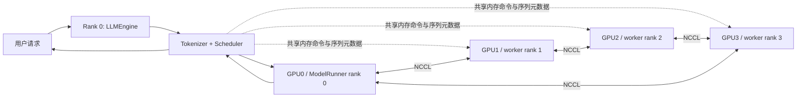
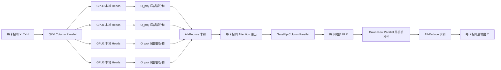
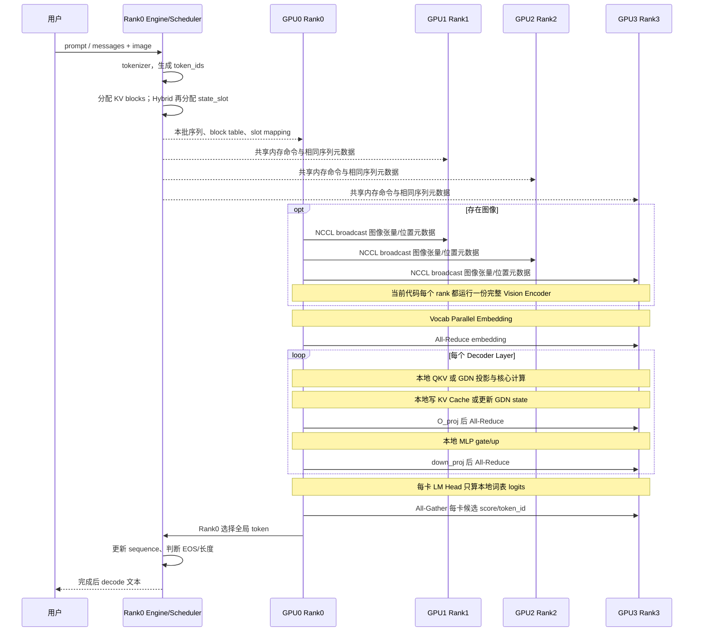
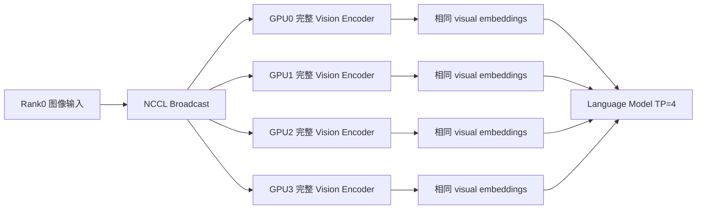
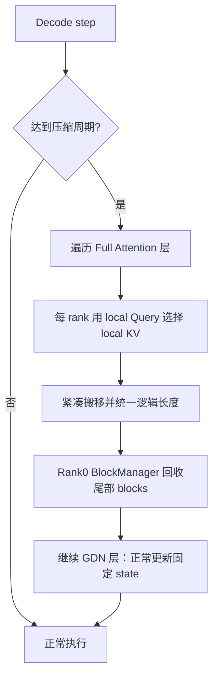

# 基于 nano-vLLM 的 Qwen3 / Qwen3.5 Hybrid 四卡推理学习文档

> **目标**：从“一次请求到底怎样穿过 4 张 RTX 3090”这一主线，理解本项目的 Tensor Parallel（TP）推理、跨卡通信、KV Cache、GDN state、Chunked Prefill、CUDA Graph，以及动态 KV Cache 压缩在多卡环境中的含义。
>
> **阅读对象**：已经知道 Transformer、Prefill、Decode、KV Cache 的基本概念，但还没有真正建立多卡推理执行图景的初学者。

---

## 0. 本文分析范围与仓库结论

本次分析基于上传的三个代码快照：

| 仓库快照 | Git 提交 | 本文用途 |
|---|---:|---|
| `nano-vllm` | `bb823b3` | 原始 Qwen3 / Nano-vLLM 基线 |
| `nano-vllm-qwen3.6` | `c468d63` | Qwen3.5 Hybrid、GDN state、多模态、FP8 兼容加载、MTP 原型 |
| `nano-kvllm` | `a7d8069` | Qwen3 Full Attention 的动态 KV Cache 压缩 |

### 0.1 一个必须先说明的仓库边界

当前上传快照中：

- **Qwen3.5 Hybrid 与 GDN state** 位于 `nano-vllm-qwen3.6`；
- **动态 KV Cache 压缩** 位于独立的 `nano-kvllm`；
- 在上传的 `nano-vllm-qwen3.6` 快照里，尚未发现把 `nano-kvllm` 压缩逻辑真正接入 Qwen3.5 Full Attention 层的代码路径。

因此，本文会分成两种层次：

1. 对已经存在的 Qwen3、Qwen3.5 多卡实现进行代码级、可验证的说明；
2. 对“Qwen3.5 Hybrid + 动态 KV 压缩”说明正确的融合位置和多卡语义，但不会把尚未出现在该快照中的功能描述成已完成代码。

若 GitHub 上另有更新的融合分支，应以该分支代码重新复核。

---

# 1. 先建立最重要的多卡认知

## 1.1 四张 24 GB 显卡不是自动变成一张 96 GB 显卡

RTX 3090 每张显卡有独立的：

- GPU 显存；
- CUDA Context；
- 权重分片；
- KV Cache / GDN state；
- CUDA Graph 内存池；
- 中间计算张量。

只有显式执行 NCCL 通信时，一张卡的数据才会发送给其他卡。

本项目采用的是 **Tensor Parallel，TP=4**：把一个大矩阵沿某个维度切成 4 片，四个进程分别绑定 GPU0～GPU3，合作完成同一个请求。

```text
同一个请求
   │
   ├── GPU0：第 0 份权重、Heads 0~...
   ├── GPU1：第 1 份权重、Heads ...
   ├── GPU2：第 2 份权重、Heads ...
   └── GPU3：第 3 份权重、Heads ...

四张卡计算局部结果，再通过 NCCL 合并。
```

## 1.2 为什么不是 Data Parallel

Data Parallel（数据并行）会让四张卡各自保存一整份模型，只是处理不同请求：

```text
GPU0：完整模型 + 请求 A
GPU1：完整模型 + 请求 B
GPU2：完整模型 + 请求 C
GPU3：完整模型 + 请求 D
```

它能提高总吞吐量，却不能解决“单张卡放不下一个完整模型”的问题。

本项目需要的是：

```text
GPU0~3：每张只保存约 1/4 的大矩阵权重，共同处理请求 A
```

这才是 TP。

## 1.3 本项目没有使用哪些并行方式

从当前代码看，核心是单机四卡 Tensor Parallel：

- 没有 Pipeline Parallel；
- 没有把不同 Transformer 层放到不同显卡；
- 没有 Expert Parallel；
- 没有训练中的梯度同步；
- 没有多节点调度。

所以本文中的“跨卡协作”主要围绕：

1. 行并行线性层后的 `All-Reduce`；
2. 词表分片后的采样 `All-Gather`；
3. 多模态输入广播；
4. 四个进程执行顺序与状态槽位的一致性。

---

# 2. 单卡为什么可能不够：必须区分“放不下”和“不好用”

## 2.1 不能笼统地说所有 Qwen3 / Qwen3.5 都无法单卡运行

以 BF16 为例，每个参数约占 2 Byte：

$$
M_{weight} \approx N_{param}\times 2\ \text{Byte}
$$

代表性估算如下，均不含运行时缓存与碎片：

| 模型示例 | 权重参数量近似 | BF16 权重总量 | TP=4 理想每卡权重 |
|---|---:|---:|---:|
| Qwen3-8B | 约 8.19B | 约 15.26 GiB | 约 3.81 GiB |
| Qwen3.5-9B 文本部分 | 约 8.95B | 约 16.68 GiB | 约 4.17 GiB |
| Qwen3.5-9B Vision 部分 | 约 0.46B | 约 0.85 GiB | 当前代码每卡都完整复制 |
| Qwen3-32B | 约 32.76B | 约 61.02 GiB | 约 15.26 GiB |

因此：

- **Qwen3-8B / Qwen3.5-9B 文本推理并非绝对不能放入单张 24 GB 3090**；
- 但加载权重后还要容纳 KV Cache、GDN state、FlashAttention 工作区、CUDA Graph、输入图像、临时张量与显存碎片，长上下文和高并发会迅速压缩余量；
- Qwen3-32B 这类 BF16 权重本身已远超 24 GB，单卡在容量上就是不可能的；
- 当前仓库对 FP8 checkpoint 的处理是“加载 FP8 后反量化为 BF16 常驻”，并不是原生 FP8 GEMM，所以不能按 1 Byte/参数估算最终 GPU 常驻权重。

### 结论

多卡可能有两类动机：

1. **容量型动机**：单卡连权重都放不下；
2. **服务型动机**：单卡能加载，但 KV Cache、GDN state、CUDA Graph 和并发空间不足，或者单卡计算时间太长。

## 2.2 4×3090 的实际显存预算不是 4×24 GB 全部可用

单卡预算更接近：

$$
M_{usable}=24\text{GB}-M_{CUDA}-M_{weight\ shard}-M_{graph}-M_{workspace}-M_{fragment}
$$

剩余部分才可以分给：

- Paged KV Cache；
- Qwen3.5 GDN state slot；
- 批处理临时输入；
- MTP 快照与验证状态。

本项目的 `ModelRunner` 会在模型加载、warmup 后查询剩余显存，再决定能分配多少 KV block 和 GDN state slot。这意味着 **模型权重能装下并不等于服务一定能跑得稳**。

---

# 3. 四卡进程拓扑：程序启动后发生了什么

## 3.1 一卡一进程

`nanovllm/engine/llm_engine.py` 创建 TP worker；`nanovllm/engine/model_runner.py` 中每个进程：

1. 调用 `torch.cuda.set_device(rank)` 绑定一张 GPU；
2. 调用 `dist.init_process_group(backend="nccl", ...)` 加入通信组；
3. 根据 `rank` 和 `world_size=4` 创建本卡权重分片；
4. 从 checkpoint 中读取完整 CPU tensor，但只截取本 rank 所属分片并复制到 GPU 参数；
5. 分配本卡 KV Cache；
6. 若为 Hybrid，分配本卡 GDN conv/recurrent state；
7. 捕获本 rank 的 Decode CUDA Graph。

## 3.2 Rank 0 与其他 Rank 的职责并不完全相同



- Rank 0 负责 tokenizer、scheduler、请求结束判断、输出 token 管理；
- Rank 1～3 没有独立调度决策，只执行 Rank 0 发来的同一方法和同一批序列；
- 序列元数据主要通过 CPU 共享内存与事件通知传递；
- 模型张量合并通过 NCCL；
- 四个 rank 必须以相同顺序进入 collective，否则会死锁。

这是一种很关键的设计：**控制面集中在 Rank 0，数据面由四张卡共同执行。**

---

# 4. Tensor Parallel 的两个核心积木

设输入隐藏状态：

$$
X\in \mathbb{R}^{T\times H}
$$

其中：

- `T`：本次 Prefill 的 token 数，或 Decode 的活动序列数；
- `H`：hidden size，本文代表模型取 `H=4096`；
- TP world size `P=4`。

## 4.1 Column Parallel：切输出维度，不通信

线性层：

$$
Y=XW^T,\quad W\in\mathbb{R}^{O\times H}
$$

把 `W` 的输出行切成四份：

```text
完整 W [O, H]
 ├─ GPU0 W0 [O/4, H]
 ├─ GPU1 W1 [O/4, H]
 ├─ GPU2 W2 [O/4, H]
 └─ GPU3 W3 [O/4, H]
```

每卡都有完整输入 `X`，分别得到：

$$
Y_i=XW_i^T\in\mathbb{R}^{T\times O/4}
$$

不需要立即合并，因为后续 Attention head 或 MLP 中间维度本来就可以各算各的。

代码对应：

- `layers/linear.py::ColumnParallelLinear`
- `MergedColumnParallelLinear`
- `QKVParallelLinear`

## 4.2 Row Parallel：切输入维度，必须 All-Reduce

对于输出投影或 MLP down projection：

$$
W\in\mathbb{R}^{O\times I}
$$

沿输入列切分：

```text
完整 W [O, I]
 ├─ GPU0 W0 [O, I/4]
 ├─ GPU1 W1 [O, I/4]
 ├─ GPU2 W2 [O, I/4]
 └─ GPU3 W3 [O, I/4]
```

每卡只持有对应输入分片 `X_i`：

$$
Y_i=X_iW_i^T\in\mathbb{R}^{T\times O}
$$

完整结果满足：

$$
Y=Y_0+Y_1+Y_2+Y_3
$$

因此执行：

```python
y = F.linear(local_x, local_weight)
dist.all_reduce(y)
```

`All-Reduce(sum)` 后，四张卡都得到相同的完整 `Y`，后续残差连接和 RMSNorm 才能继续保持一致。

代码对应：

- `layers/linear.py::RowParallelLinear.forward`

## 4.3 一层 Transformer 的通信骨架



所以无论是 Full Attention 层还是 GDN 层，只要都采用同样的 `o_proj + MLP` TP 结构，**每个 Decoder Layer 通常有两次隐藏状态 All-Reduce**：

1. Attention/GDN 输出投影后一次；
2. MLP down projection 后一次。

---

# 5. Qwen3 在 TP=4 下的具体切分

下面使用代表性的 Qwen3-8B 配置：

| 参数 | 数值 |
|---|---:|
| hidden size `H` | 4096 |
| intermediate size `I` | 12288 |
| layers `L` | 36 |
| query heads | 32 |
| KV heads | 8 |
| head dim | 128 |
| vocab size | 151936 |

## 5.1 Embedding 如何切

完整 Embedding：

$$
E\in\mathbb{R}^{151936\times4096}
$$

TP=4 后：

| GPU | 词表 ID 范围 | 本地权重形状 |
|---|---|---:|
| GPU0 | `[0, 37984)` | `[37984, 4096]` |
| GPU1 | `[37984, 75968)` | `[37984, 4096]` |
| GPU2 | `[75968, 113952)` | `[37984, 4096]` |
| GPU3 | `[113952, 151936)` | `[37984, 4096]` |

假设 token id=50000：

- 只有 GPU1 能查到真正 embedding；
- 另外三张卡输出全零；
- 四卡 `All-Reduce(sum)` 后，每张卡都得到同一个 `[T,4096]` embedding。

代码对应：`layers/embed_head.py::VocabParallelEmbedding`。

## 5.2 QKV 权重与 head 如何切

完整 Q/K/V 输出维度：

- Q：`32×128=4096`；
- K：`8×128=1024`；
- V：`8×128=1024`；
- 总计：`6144`。

每卡拥有：

- 8 个 Q heads；
- 2 个 KV heads；
- 本地 QKV 输出维度 `1024+256+256=1536`。

| 张量/权重 | 完整形状 | 每卡形状 |
|---|---:|---:|
| packed QKV weight | `[6144,4096]` | `[1536,4096]` |
| local Q | `[T,32,128]` 的分片 | `[T,8,128]` |
| local K | `[T,8,128]` 的分片 | `[T,2,128]` |
| local V | `[T,8,128]` 的分片 | `[T,2,128]` |

每张卡只对自己的 8 个 Q heads 做 Attention，不需要收集其他 GPU 的 K/V。

这是本项目最容易被误解的地方：

> **Attention 之前不需要把所有 Q/K/V All-Gather 回来。每张卡拥有完整模型隐藏状态的输入，但只计算自己负责的 head。**

## 5.3 O projection 为什么必须 All-Reduce

每张卡 Attention 输出：

$$
A_i\in\mathbb{R}^{T\times1024}
$$

完整 `o_proj` 原本是 `[4096,4096]`，按输入列切为：

$$
W_{o,i}\in\mathbb{R}^{4096\times1024}
$$

局部结果：

$$
Y_i=A_iW_{o,i}^T\in\mathbb{R}^{T\times4096}
$$

每个 `Y_i` 只是来自部分 Attention heads 的贡献，所以必须：

$$
Y=\sum_{i=0}^{3}Y_i
$$

这就是 Attention 后的第一次 `All-Reduce`。

## 5.4 MLP 如何切

Qwen3 MLP 的 gate/up 完整输出各为 12288：

| 权重 | 完整形状 | 每卡形状 |
|---|---:|---:|
| gate_proj | `[12288,4096]` | `[3072,4096]` |
| up_proj | `[12288,4096]` | `[3072,4096]` |
| 合并 gate+up | `[24576,4096]` | `[6144,4096]` |
| down_proj | `[4096,12288]` | `[4096,3072]` |

每卡独立计算：

$$
Z_i=\operatorname{SiLU}(Gate_i)\odot Up_i\in\mathbb{R}^{T\times3072}
$$

然后 `down_proj` 得到 `[T,4096]` 局部部分和，再执行第二次 `All-Reduce`。

## 5.5 Qwen3 一层的完整过程

```text
每卡相同 hidden [T,4096]
    ↓ RMSNorm（每卡独立，结果相同）
QKV Column Parallel
    ↓
GPU0~3 各得到 Q [T,8,128]、K/V [T,2,128]
    ↓
各卡写本地 KV Cache，并做本地 FlashAttention
    ↓ local attention [T,1024]
O_proj Row Parallel
    ↓ local partial [T,4096]
All-Reduce
    ↓ 每卡相同 [T,4096]
残差 + RMSNorm
    ↓
Gate/Up Column Parallel → 本地 SwiGLU [T,3072]
    ↓
Down Row Parallel → local partial [T,4096]
    ↓
All-Reduce
    ↓ 每卡相同 layer output [T,4096]
```

代码对应：

- `models/qwen3.py::Qwen3Attention`
- `models/qwen3.py::Qwen3MLP`
- `models/qwen3.py::Qwen3DecoderLayer`
- `layers/attention.py`

---

# 6. Qwen3.5 Hybrid 在 TP=4 下如何工作

下面使用代表性的 Qwen3.5-9B 配置：

| 参数 | 数值 |
|---|---:|
| hidden size | 4096 |
| intermediate size | 12288 |
| Decoder layers | 32 |
| 层模式 | 每 4 层中 3 个 GDN + 1 个 Full Attention |
| GDN layers | 24 |
| Full Attention layers | 8 |
| Full Attention Q heads | 16 |
| Full Attention KV heads | 4 |
| Full Attention head dim | 256 |
| GDN key heads | 16 |
| GDN value heads | 32 |
| GDN key/value head dim | 128 |
| GDN conv kernel | 4 |
| vocab size | 248320 |

典型层序列可以理解为：

```text
Layer 0  GDN
Layer 1  GDN
Layer 2  GDN
Layer 3  Full Attention
Layer 4  GDN
Layer 5  GDN
Layer 6  GDN
Layer 7  Full Attention
...重复...
```

在代码中，`models/qwen3_5.py::Qwen3_5DecoderLayer` 根据 `config.layer_types` 选择 Full Attention 或 `GatedDeltaNet`。

---

## 6.1 Qwen3.5 Full Attention 层如何切

### Head 分片

TP=4 后每卡：

- Q heads：`16/4=4`；
- KV heads：`4/4=1`；
- 本地 Attention hidden：`4×256=1024`。

Qwen3.5 的 Q projection 同时产生 query 与 output gate：

| 张量/权重 | 完整输出 | 每卡输出 |
|---|---:|---:|
| Q + gate projection | 8192 | 2048 |
| reshape 后 | `[T,16,512]` | `[T,4,512]` |
| 切分 Q | `[T,16,256]` | `[T,4,256]` |
| 切分 gate | `[T,16,256]` | `[T,4,256]` |
| K | `[T,4,256]` | `[T,1,256]` |
| V | `[T,4,256]` | `[T,1,256]` |

本地 Attention 输出乘 sigmoid gate 后，形状仍为 `[T,1024]`，再经过本地 `o_proj [4096,1024]`，最后 All-Reduce。

### 关键结论

- Full Attention 的 KV Cache 沿 KV head 维度分片；
- 每卡只存一个 KV head；
- 不需要跨卡同步 K/V tensor；
- 跨卡合并发生在 `o_proj` 之后，而不是 Attention 之前。

---

## 6.2 GDN 层是什么：先不用公式理解

Full Attention 会保存所有历史 token 的 K/V：

```text
token 1 K/V
 token 2 K/V
 token 3 K/V
 ...
 token L K/V
```

显存随上下文长度 `L` 线性增长。

Gated DeltaNet 不保存所有历史 token，而是维护两类压缩状态：

1. **conv state**：保存深度卷积所需的最近 `kernel_size-1` 步局部历史；
2. **recurrent state**：用固定大小矩阵概括更长历史。

因此它的状态大小对每个活动请求基本固定，不随上下文长度增长。

概念上的递推可写成：

$$
S_t=\operatorname{decay}_t(S_{t-1})+\operatorname{DeltaUpdate}(k_t,v_t,\beta_t)
$$

$$
y_t=q_tS_t
$$

这里不需要死记公式，真正重要的是：

> Full Attention 的历史以“token 列表”保存；GDN 的历史被折叠进一个固定大小的递归矩阵。

---

## 6.3 GDN 权重怎样在四卡切分

完整 GDN 投影维度：

- q：`16×128=2048`；
- k：`16×128=2048`；
- v：`32×128=4096`；
- qkv 总维度：8192；
- z/gate：`32×128=4096`。

TP=4 后每卡：

- local key heads：4；
- local value heads：8；
- local q dim：512；
- local k dim：512；
- local v dim：1024；
- local qkv 总维度：2048；
- local z dim：1024。

| GDN 权重/张量 | 每卡形状或维度 |
|---|---:|
| `in_proj_qkv` | `[2048,4096]` |
| `in_proj_z` | `[1024,4096]` |
| `in_proj_a` | `[8,4096]` |
| `in_proj_b` | `[8,4096]` |
| depthwise conv weight | `[2048,1,4]` |
| local GDN output | `[T,1024]` |
| `out_proj` | `[4096,1024]` |

GDN 的 q/k/v、卷积和递归更新全部在本卡 head shard 内完成；`out_proj` 后通过 All-Reduce 合并四卡贡献。

所以从 TP 骨架看：

```text
GDN input projection：Column Parallel
GDN recurrence：Rank-local
GDN out projection：Row Parallel + All-Reduce
MLP：Column Parallel + Row Parallel + All-Reduce
```

**GDN 并没有消除每层的两次 All-Reduce。它主要减少长上下文 Attention 计算和 KV Cache，而不是减少 TP 通信次数。**

---

# 7. KV Cache 与 GDN state 在四卡下如何保存

## 7.1 Qwen3 KV Cache

每个 rank 的本地 KV Cache 只保存本卡负责的 KV heads。

Qwen3-8B、TP=4：

```text
每卡每层：2 个 KV heads × 128 dim
36 个 Full Attention 层
```

缓存概念形状：

$$
[2,\ L_{attn},\ N_{blocks},\ block\_size,\ H_{kv,local},\ D]
$$

其中第一个维度的 2 表示 K 和 V。

在本例中：

```text
[2, 36, num_blocks, 256, 2, 128]
```

每张卡存的是不同 head 的 K/V，不是同一份缓存的重复副本。

## 7.2 Qwen3.5 Full Attention KV Cache

Qwen3.5-9B 只有 8 个 Full Attention 层，并且 TP=4 后每卡只有 1 个 KV head：

```text
[2, 8, num_blocks, 256, 1, 256]
```

GDN 层没有传统 KV Cache，因此 `ModelRunner` 只会为具有 `k_cache/v_cache` 的模块分配缓存。

## 7.3 Qwen3.5 GDN state

每个 GDN 层、每个活动请求、每个 rank 保存：

### Conv state

```text
[max_state_slots, local_conv_dim, kernel_size-1]
= [slots, 2048, 3]
数据类型：BF16
```

### Recurrent state

```text
[max_state_slots, local_value_heads, key_head_dim, value_head_dim]
= [slots, 8, 128, 128]
数据类型：FP32
```

代码对应：

- `engine/model_runner.py` 中 GDN state pool 分配；
- `layers/gated_delta_net.py` 中 Prefill/Decode 读取和原位更新。

## 7.4 “状态同步”不等于每一步把状态 All-Reduce

四张卡的 state shard 是不同 head 的状态：

```text
GPU0：GDN value heads 0~7 的 state
GPU1：GDN value heads 8~15 的 state
GPU2：GDN value heads 16~23 的 state
GPU3：GDN value heads 24~31 的 state
```

它们没有必要数值相等，也不需要 All-Reduce。

真正需要一致的是：

- 同一请求在四张卡使用相同的 `state_slot_id`；
- 四张卡按相同 token 顺序更新；
- Prefill chunk 边界一致；
- Decode batch 中请求排列一致；
- MTP accept/reject 时四张卡同时提交或回滚对应本地状态。

可以将它理解为：

> **同步的是“控制协议和槽位身份”，不是把四张卡的 state tensor 变成相同值。**

---

# 8. 一次请求从输入到输出的完整四卡链路

下面把普通文本请求、图片请求和 Hybrid 状态放到同一条主线上。



---

## 8.1 阶段 A：Rank 0 预处理

Rank 0：

1. 将 prompt 编码为 token IDs；
2. Scheduler 判断是 Prefill 还是 Decode；
3. 通过 BlockManager 分配逻辑 KV blocks；
4. Hybrid 请求再分配一个逻辑 `state_slot_id`；
5. 若启用 Chunked Prefill，只取当前允许处理的 prompt chunk；
6. 把相同 Sequence 元数据发给所有 worker。

## 8.2 阶段 B：四个 rank 准备相同执行形状

每个 rank 根据 Sequence 元数据构造：

- `input_ids`；
- `positions`；
- `slot_mapping`；
- `context_lens`；
- `block_tables`；
- Hybrid 的 `state_indices`。

虽然每卡缓存内容不同，但索引结构和批次顺序必须一致。

## 8.3 阶段 C：Embedding All-Reduce

每张卡只拥有 1/4 词表，局部 embedding 中不属于本卡词表的 token 为零；一次 All-Reduce 后得到每卡相同隐藏状态。

## 8.4 阶段 D：逐层执行

### 对 Qwen3 Full Attention 层

1. 本地 QKV projection；
2. 把本地 K/V 写入本地 cache；
3. 本地 FlashAttention；
4. `o_proj` 局部部分和；
5. All-Reduce；
6. 本地 MLP；
7. down projection 后 All-Reduce。

### 对 Qwen3.5 GDN 层

1. 本地 q/k/v/z/a/b projection；
2. 读取对应请求的本地 conv/recurrent state；
3. 本地卷积和 delta recurrence；
4. 原位更新本地状态；
5. out projection 后 All-Reduce；
6. MLP 后再 All-Reduce。

## 8.5 阶段 E：LM Head 与跨卡采样

LM Head 同样按词表行切分：

```text
GPU0 logits: [B, V/4]
GPU1 logits: [B, V/4]
GPU2 logits: [B, V/4]
GPU3 logits: [B, V/4]
```

当前自定义仓库没有把整个 `[B,V]` logits 聚合到 Rank 0，而是：

1. 每卡在本地词表分片中取一个最优 token 与 score；
2. `All-Gather` 四张卡的 score；
3. `All-Gather` 四张卡的全局 token ID；
4. Rank 0 在四个候选中选最终 token。

对非 greedy sampling，Sampler 使用 Gumbel-max 形式，所以“各分片局部最大值再取全局最大值”仍能得到全词表采样结果。

相比原始 nano-vLLM 聚合完整 logits，这显著减少了通信量。

## 8.6 阶段 F：进入下一轮 Decode

Rank 0：

- 将新 token 追加到请求；
- 若为 EOS 或达到 `max_tokens`，释放 KV blocks 和 state slot；
- 否则下一轮让四个 rank 对该 token 再执行一次模型。

CUDA Graph 模式下，每个 rank replay 自己捕获的图。collective 的顺序和 batch shape 必须在四卡上一致，否则不能正确 replay。

---

# 9. Prefill、Chunked Prefill 与 Decode 中的多卡差异

## 9.1 Prefill

Prefill 一次处理多个 prompt token：

```text
输入 hidden: [T_prompt,4096]
```

特点：

- GEMM 尺寸较大，GPU 计算利用率高；
- All-Reduce tensor 大，通信带宽更重要；
- Qwen3 Full Attention 需要处理 prompt 内 token 间 Attention；
- Qwen3.5 GDN 需要按顺序或 chunk 语义更新递归状态。

## 9.2 Chunked Prefill

如果一个长 prompt 一次处理会占用过多临时显存或阻塞其他请求，Scheduler 将其切成多个 chunk：

```text
Prompt 8192 tokens
  ├─ chunk 0: 0~2047
  ├─ chunk 1: 2048~4095
  ├─ chunk 2: 4096~6143
  └─ chunk 3: 6144~8191
```

四张卡必须使用相同 chunk 边界：

- Full Attention：逐 chunk 写入各自本地 KV；
- GDN：chunk 结束的 state 必须成为下一 chunk 的初始 state；
- 不能只在 Rank 0 更新状态，worker 也必须更新自己的 head shard。

## 9.3 Decode

Decode 每轮通常每个活动请求只输入一个 token：

```text
输入 hidden: [batch_size,4096]
```

特点：

- GEMM 变小；
- All-Reduce 数据量小；
- 但是每层都要等待 collective 完成，通信**延迟**比带宽更关键；
- Qwen3 从 KV Cache 读取全部历史；
- Qwen3.5 Full Attention 层读 KV，GDN 层只读写固定 state。

这解释了一个常见现象：

> TP=4 可以解决显存，但对小 batch 单请求 Decode 不一定线性加速，甚至可能因为大量小 All-Reduce 而变慢。

---

# 10. All-Reduce 与 All-Gather 到底发生在哪里

## 10.1 实际代码中的 All-Reduce 位置

| 位置 | 原因 | 每次传输张量 |
|---|---|---:|
| Vocab Parallel Embedding | 只有一个 rank 命中该 token embedding，需要求和还原 | `[T,H]` |
| 每层 Attention/GDN `o_proj` | 各卡只计算部分 heads 的输出贡献 | `[T,H]` |
| 每层 MLP `down_proj` | 各卡只计算部分 intermediate channel 的贡献 | `[T,H]` |

Qwen3-8B、36 层：

$$
1+36\times2=73\text{ 次 All-Reduce / forward}
$$

Qwen3.5-9B、32 层：

$$
1+32\times2=65\text{ 次 All-Reduce / forward}
$$

注意：虽然 Qwen3.5 只有 8 个 Full Attention 层，但 24 个 GDN 层同样有 `out_proj` 和 MLP，所以通信次数只是因为总层数从 36 变为 32 而减少，并不是因为 GDN 不通信。

## 10.2 实际代码中的 All-Gather 位置

当前主要位于采样：

- 收集各 rank 的本地最优 score；
- 收集各 rank 的 token ID；
- top-k 调试/验证时收集每卡本地 top-k。

没有在每层 Attention 前 All-Gather 完整 Q/K/V，也没有在每层把本地 KV Cache 拼成完整缓存。

## 10.3 通信量估算

隐藏张量 BF16 大小：

$$
S=T\times H\times 2\ \text{Byte}
$$

对 4 卡 ring All-Reduce，按常用“每 rank 发送总量”口径：

$$
Traffic_{send}\approx2\frac{P-1}{P}S=1.5S
$$

接收量也约为 `1.5S`。若将发送和接收相加，则约为 `3S`。

### Decode：batch=1

$$
S=1\times4096\times2=8192\text{ Byte}=8\text{ KiB}
$$

每次 All-Reduce 每 rank 约发送 12 KiB。

- Qwen3-8B：`73×12 KiB≈876 KiB/token/rank`；
- Qwen3.5-9B：`65×12 KiB≈780 KiB/token/rank`。

这些字节数不算大，但 65～73 次 collective 的启动和同步延迟很重要。

### Prefill：T=4096

单个 `[4096,4096]` BF16 hidden tensor：

$$
S=32\text{ MiB}
$$

每次 All-Reduce 每 rank 发送约 48 MiB：

- Qwen3-8B：`73×48 MiB≈3.42 GiB/rank`；
- Qwen3.5-9B：`65×48 MiB≈3.05 GiB/rank`。

这是逻辑通信量估算，不等同于最终耗时；实际速度还取决于：

- GPU 拓扑；
- PCIe/NVLink 路径；
- NCCL 算法；
- GEMM 与通信能否重叠；
- chunk 大小；
- 是否发生额外同步。

建议部署前运行：

```bash
nvidia-smi topo -m
```

确认四卡之间的真实拓扑，而不是只看显卡数量。

---

# 11. KV Cache 与 GDN state 显存估算

以下均按 BF16 K/V、block size=256、TP=4 估算。

## 11.1 Qwen3-8B 每卡 KV Cache

每 token、每 rank：

$$
2(K,V)\times36\times2\text{ local KV heads}\times128\times2\text{ Byte}
=36\text{ KiB}
$$

因此：

| 上下文长度 | 每请求、每卡 KV Cache |
|---:|---:|
| 256 | 9 MiB |
| 4096 | 144 MiB |
| 32768 | 1.125 GiB |

这还没有乘并发请求数。

## 11.2 Qwen3.5-9B 每卡 Full Attention KV Cache

每 token、每 rank：

$$
2\times8\times1\times256\times2=8\text{ KiB}
$$

| 上下文长度 | 每请求、每卡 KV Cache |
|---:|---:|
| 256 | 2 MiB |
| 4096 | 32 MiB |
| 32768 | 256 MiB |

## 11.3 Qwen3.5-9B 每卡 GDN state

### 24 层 conv state

$$
24\times2048\times3\times2\text{ Byte}=0.28125\text{ MiB}
$$

### 24 层 recurrent state

$$
24\times8\times128\times128\times4\text{ Byte}=12\text{ MiB}
$$

### 总计

$$
M_{GDN\ state}\approx12.28\text{ MiB/request/rank}
$$

它与上下文长度无关。

## 11.4 两种架构的状态显存对比

| 模型 | 4K 上下文每请求每卡 | 32K 上下文每请求每卡 |
|---|---:|---:|
| Qwen3-8B KV | 144 MiB | 1.125 GiB |
| Qwen3.5-9B KV + GDN | 约 44.28 MiB | 约 268.28 MiB |

Hybrid 在长上下文下显著降低状态显存，但不是“没有状态”：

- 仍有 8 层 Full Attention KV；
- 每个活动请求固定占用约 12.28 MiB/rank 的 GDN state；
- recurrent state 使用 FP32，是为了递推稳定性，因此不能简单按 BF16 计算。

---

# 12. 为什么 Qwen3.5 Hybrid 的 Prefix Cache 更难

Qwen3 的某个 prefix 如果 token 完全相同，可以复用对应 KV blocks：

```text
相同 token prefix → 相同 K/V → 可以复用
```

但 Qwen3.5 GDN 层在 prefix 结束处还需要：

- conv state；
- recurrent matrix state。

只复用 Full Attention 的 KV，并不能恢复 GDN 的历史状态。

当前 Scheduler 对 Hybrid 请求禁用普通 prefix cache，其逻辑是合理的：

```text
共享 token/KV blocks
    ≠
共享完整 Hybrid 执行状态
```

要真正支持 Hybrid Prefix Cache，需要把 prefix 对应的 GDN state snapshot 也纳入缓存键、生命周期、引用计数和显存管理，复杂度明显高于传统 Paged KV Cache。

---

# 13. MTP Accept/Reject 时四卡状态如何回滚

MTP / speculative decoding 会先尝试 draft token，再由主模型 verify：

```text
保存当前状态
   ↓
尝试 draft token
   ↓
Verify
   ├─ Accept：保留新 KV/GDN state
   └─ Reject：恢复旧 KV/GDN state
```

在四卡下，每张卡都保存自己的局部分片：

- 本地 KV slot；
- 本地 GDN conv state；
- 本地 GDN recurrent state。

`ModelRunner` 的 snapshot/restore 方法在四个 rank 上以相同请求槽位执行。

这里同样不需要把 tensor 发到 Rank 0：

```text
GPU0 保存/恢复自己的 heads
GPU1 保存/恢复自己的 heads
GPU2 保存/恢复自己的 heads
GPU3 保存/恢复自己的 heads
```

Rank 0 只负责决定这次 Accept 还是 Reject，并保证所有 rank 走相同控制分支。

---

# 14. 多模态输入在四卡下的额外路径

当前 Qwen3.5 多模态实现中：

1. Rank 0 准备 `pixel_values`、`image_grid_thw`、图像 token 位置和 mask；
2. 通过 NCCL broadcast 发给其他 rank；
3. 每张 GPU 都保存并运行一份完整 Vision Encoder；
4. 每张卡得到相同 visual features；
5. 把 visual features 注入相同的语言模型 hidden positions；
6. 进入正常 TP language model。



这不是最节省资源的方案：

- Vision 权重在每卡复制；
- Vision 计算在每卡重复；
- 好处是实现简单，语言模型入口保持每卡相同 hidden state。

如果以后优化，可以考虑：

- 只在 Rank 0 运行 Vision Encoder，再 broadcast visual embeddings；
- 或为 Vision Encoder 单独设计 TP；
- 但需要权衡 broadcast 特征大小、实现复杂度和 CUDA Graph 路径。

---

# 15. 动态 KV Cache 压缩在多卡下怎样理解

## 15.1 当前 `nano-kvllm` 做了什么

压缩相关代码主要位于：

- `nano-kvllm/nanokvllm/config.py`
- `engine/model_runner.py::prepare_decode`
- `layers/attention.py`
- `layers/compress_utils.py`
- `layers/CompressMethod.py`
- `engine/block_manager.py`

当前默认思想大致为：

1. 每隔固定 decode 周期触发；
2. 查看最近若干 KV blocks；
3. 使用最新 Query 计算历史 token 对当前查询的重要性；
4. 用 SnapKV 风格 top-k 保留重要历史 K/V；
5. 同时保留最近窗口；
6. 把被保留的 K/V 紧凑搬到更靠前的物理槽位；
7. 缩短逻辑上下文并释放不再需要的 blocks 给其他请求复用。

## 15.2 “压缩后显存下降”准确是什么意思

GPU 上预先分配的大 KV Cache tensor 通常不会立刻变小。压缩产生的价值是：

```text
原请求占 20 个 blocks
   ↓ 压缩
只保留 8 个逻辑 blocks
   ↓
其余 12 个 blocks 回到 BlockManager 空闲池
   ↓
可接纳更多请求或更长后续 Decode
```

所以更准确的描述是：

- 降低单请求逻辑 KV block 占用；
- 提高预分配缓存池的可复用率；
- 延迟 block 耗尽；
- 提升可承载并发。

不是每次压缩都调用 `cudaFree` 让 `nvidia-smi` 立刻减少同等显存。

## 15.3 TP=4 下压缩是否需要跨卡通信

当前 Qwen3 压缩实现基于每卡自己的：

- local Q heads；
- local KV heads；
- local K/V cache。

因此每个 rank 可以独立计算自己的 token/head 重要性并压缩本地 KV，不需要为了算法本身 All-Reduce 完整 Q/K/V。

但是必须保证以下元数据一致：

- 本次哪些 batch item 触发压缩；
- 压缩后保留 token 数量；
- 剩余 block 数；
- 哪些逻辑 blocks 被 BlockManager 回收；
- 四个 rank 在后续 Decode 使用相同的逻辑 context length。

### rank 间可以保留不同 token 位置吗

若压缩定义为“每个 head shard 独立稀疏化”，不同 rank 可以选择不同历史 token，因为它们本来负责不同 Attention heads；已旋转后的 K 保留了原始位置信息。

但需要满足：

- 每卡保留数量相同；
- 本地 cache 紧凑布局与本地 Attention 一致；
- 全局 block table 的长度和回收操作一致。

如果目标是“所有 heads 使用同一组 token 索引”，则需要额外流程：

```text
每卡计算 local importance
   ↓
All-Reduce 汇总 importance
   ↓
Rank0 / 所有 rank 计算统一 top-k
   ↓
Broadcast 或确定性复现索引
```

这会增加通信，当前代码不是这种全局统一策略。

## 15.4 如何接入 Qwen3.5 Hybrid

正确边界是：

- 仅压缩 **8 个 Full Attention 层**的 KV Cache；
- 不对 24 个 GDN 层调用 SnapKV，因为它们没有 token 级 KV 列表；
- GDN state 仍按每个请求固定保存；
- 压缩触发与 block 回收必须和 Hybrid 的 `state_slot_id` 生命周期解耦；
- MTP 快照必须同时覆盖“压缩前后 KV 布局”和 GDN state，否则 Reject 后可能恢复不完整。

可以画成：



### 不能直接压缩 GDN state 的原因

GDN recurrent state 已经是递推摘要，不再对应可独立删除的历史 token。要“忘掉某段历史”，必须重新设计 decay/recurrence 或从保留 token 重算状态，而不是从矩阵中删除几行。

---

# 16. Qwen3 与 Qwen3.5 四卡推理对比

| 维度 | Qwen3 Full Attention | Qwen3.5 Hybrid |
|---|---|---|
| 层结构 | 所有层均 Full Attention | 24 GDN + 8 Full Attention |
| TP 主结构 | QKV Column + O Row；MLP Column/Row | Full Attention 与 GDN 都遵循 Column/Core/Row；MLP 相同 |
| 每层通信 | 通常 2 次 All-Reduce | 通常仍为 2 次 All-Reduce |
| 代表模型 forward All-Reduce 数 | 36 层时约 73 次，含 Embedding | 32 层时约 65 次，含 Embedding |
| KV Cache | 所有层按上下文线性增长 | 仅 8 个 Full Attention 层线性增长 |
| 额外状态 | 无 GDN state | 每请求、每卡固定 conv + recurrent state |
| 长上下文显存 | 较高 | 明显更低 |
| 长上下文计算 | 所有层 Attention | 仅部分层 Attention，其余为递推计算 |
| Decode 通信延迟 | 高频小 All-Reduce | 仍是高频小 All-Reduce |
| Prefix Cache | 只管理 token/KV 相对直接 | 必须同时考虑 GDN state，当前禁用普通复用 |
| 状态回滚 | 主要 KV | KV + conv state + recurrent state |
| 多模态 | 当前 Qwen3 基线无该路径 | 图像广播，Vision Encoder 当前每卡复制 |
| 实现难点 | head/KV 分片、Paged Cache | 双状态系统、continuation prefill、slot 管理、回滚、多模态 |
| 动态 KV 压缩 | 独立仓库已有 Qwen3 实现 | 当前快照尚未真正融合，只应作用于 Full Attention 层 |

---

# 17. 代码模块与本文概念对应表

## 17.1 Qwen3 / Qwen3.5 主仓库

| 代码文件 | 关键类/函数 | 负责内容 |
|---|---|---|
| `nanovllm/engine/llm_engine.py` | `LLMEngine` | 创建 TP worker、Rank0 调度、调用模型、处理输出 |
| `nanovllm/engine/model_runner.py` | `ModelRunner` | NCCL 初始化、GPU 绑定、权重加载、KV/GDN state 分配、Prefill/Decode、CUDA Graph、采样通信 |
| `nanovllm/layers/linear.py` | `ColumnParallelLinear` | 输出维度切分，无 forward collective |
| 同上 | `QKVParallelLinear` | Q/K/V head 范围按 rank 切分 |
| 同上 | `RowParallelLinear` | 输入维度切分，本地部分和后 All-Reduce |
| `nanovllm/layers/embed_head.py` | `VocabParallelEmbedding` | 词表分片，embedding All-Reduce |
| 同上 | `ParallelLMHead` | 每卡输出本地词表 logits |
| `nanovllm/models/qwen3.py` | Attention/MLP/DecoderLayer | Qwen3 Full Attention TP 主路径 |
| `nanovllm/models/qwen3_5.py` | `Qwen3_5DecoderLayer` | 根据 layer type 选择 Full Attention 或 GDN |
| `nanovllm/layers/attention.py` | KV store / FlashAttention | 写本地 KV、Prefill/Decode Attention |
| `nanovllm/layers/gated_delta_net.py` | `GatedDeltaNet` | 本地 GDN 投影、conv/recurrent state 读取与更新、out projection |
| `nanovllm/engine/scheduler.py` | Scheduler | Chunked Prefill、KV block/state slot 生命周期、Hybrid prefix-cache 策略 |
| `nanovllm/engine/block_manager.py` | BlockManager | 逻辑/物理 KV block 分配与释放 |
| `nanovllm/models/vision_encoder.py` | Vision Encoder | 当前每 rank 复制执行的视觉路径 |
| `nanovllm/utils/loader.py` | `load_model` | 逐 tensor 读取 checkpoint，调用各参数的分片 loader |
| `nanovllm/utils/quant.py` | FP8 helpers | 对本 rank 所属 FP8 权重块反量化后存为 BF16 |

## 17.2 KV 压缩仓库

| 代码文件 | 负责内容 |
|---|---|
| `nanokvllm/config.py` | 压缩周期、窗口、top-k、保留块数 |
| `engine/model_runner.py` | 在 Decode 中决定本轮哪些请求触发压缩 |
| `layers/attention.py` | KV 写入后调用压缩逻辑，再执行 Attention |
| `layers/CompressMethod.py` | 基于 Query-KV 注意力得分进行 SnapKV 风格筛选 |
| `layers/compress_utils.py` | 收集窗口、选择、K/V 紧凑搬移、长度更新 |
| `engine/block_manager.py` | 截断逻辑 block table，回收尾部 blocks |

---

# 18. 当前实现中值得重点关注的工程风险

## 18.1 各 rank 独立估算 KV block 数

`ModelRunner` 在每个 rank 上根据本卡剩余显存估算可分配 block 数。

如果四张 GPU 的剩余显存不同，例如某张卡被其他进程占用：

```text
GPU0 能分 1000 blocks
GPU1 能分 980 blocks
GPU2 能分 1000 blocks
GPU3 能分 1000 blocks
```

而 Scheduler 只依据 Rank 0 的容量工作，就可能让 GPU1 越界或 OOM。

更稳妥的生产做法是：

1. 每 rank 计算本地最大 block 数；
2. NCCL `all_reduce(MIN)`；
3. 所有 rank 使用全局最小容量。

GDN `max_state_slots` 也有同类问题。

## 18.2 四卡 collective 顺序必须完全一致

如果某个 rank 因条件分支少执行一次 `All-Reduce`，其余 rank 会永久等待。

所以以下条件必须在所有 rank 一致：

- 当前模型层类型；
- batch size；
- 是否 Prefill；
- 是否压缩；
- 是否进入 MTP verify；
- 是否执行 image path；
- top-k / sampling 路径。

## 18.3 Head 数必须能被 TP 整除

代码中的 `divide()` 使用整除断言：

```text
Qwen3: 32 Q heads / 4 = 8；8 KV heads / 4 = 2
Qwen3.5: 16 Q heads / 4 = 4；4 KV heads / 4 = 1
GDN: 16 key heads / 4 = 4；32 value heads / 4 = 8
```

若换模型使 KV head 数小于 TP size 或不能整除，当前实现不能直接运行，需要 KV head replication 或更灵活的映射。

## 18.4 Vision Encoder 完整复制

多模态场景下，每卡额外复制视觉权重和计算。虽然 9B 模型仍可能有足够空间，但会降低四卡的有效利用率，也会让“文本权重约 1/4”不再等于“全部模型权重约 1/4”。

## 18.5 TP=4 不保证更快

对小模型、小 batch、单 token Decode：

- 每卡 GEMM 工作量缩小；
- 但 collective 次数不变；
- 通信和同步占比上升。

因此四卡的主要收益可能是显存与并发，而不是单请求 token/s。

---

# 19. 用一句话回答常见面试追问

## 19.1 “QKV 切了以后为什么不需要 All-Gather？”

因为每个 rank 负责一组完整的 Attention heads，这些 heads 可以使用本 rank 的 Q/K/V 独立计算；只有把不同 heads 投影回共同 hidden space 时，才需要在 `o_proj` 后对部分和 All-Reduce。

## 19.2 “KV Cache 在四卡上是复制还是切分？”

沿 KV head 维度切分。四卡的逻辑 token/block 索引相同，但每卡保存不同 KV heads 的数据。

## 19.3 “GDN state 需要每 token 同步吗？”

不需要同步 tensor。每卡更新自己负责的 GDN heads；只需保证相同请求使用相同 state slot、相同 token 顺序和相同 accept/reject 决策。

## 19.4 “Qwen3.5 为什么 KV 少，但通信没有按 Full Attention 层数大幅下降？”

因为 GDN 层仍有 row-parallel output projection 和 MLP down projection，仍各触发一次 All-Reduce。GDN 减少的是 Attention 计算和随序列增长的 KV 状态，不是 TP 的主通信骨架。

## 19.5 “动态 KV 压缩后 `nvidia-smi` 为什么可能不下降？”

因为引擎通常预分配 KV Cache 大池；压缩是把逻辑 blocks 还给池子复用，而不是缩小底层已分配 tensor。

## 19.6 “为什么 Hybrid Prefix Cache 难？”

相同 token prefix 不只对应 Full Attention KV，还对应 GDN conv/recurrent state。只命中 KV 并不能恢复完整执行状态。

## 19.7 “四张 3090 的 96 GB 能直接当统一显存吗？”

不能。每张 GPU 只有独立 24 GB，TP 通过分片权重和状态、在特定位置执行 NCCL collective，才把四张卡组织成一个逻辑模型。

---

# 20. 建议按这个顺序阅读代码

1. `engine/llm_engine.py`：先看四个进程如何被组织；
2. `engine/model_runner.py`：看 rank、NCCL、缓存分配和一次 run；
3. `layers/linear.py`：彻底理解 Column / Row Parallel；
4. `layers/embed_head.py`：理解 embedding 与 logits 为什么是特殊分片；
5. `models/qwen3.py`：用熟悉的 Full Attention 串起 TP；
6. `layers/attention.py`：确认 KV 是本地 head shard；
7. `models/qwen3_5.py`：看 layer type 分派；
8. `layers/gated_delta_net.py`：只追踪输入、state、输出，不先陷入公式；
9. `scheduler.py` 与 `block_manager.py`：理解逻辑 block 和 state slot 生命周期；
10. 最后阅读 `nano-kvllm` 的 compression path，思考它怎样只挂到 Hybrid Full Attention 层。

阅读每个模块时只追问四个问题：

```text
1. 输入 tensor 在每卡是完整还是分片？
2. 权重沿哪一维切？
3. 本卡保存哪部分长期状态？
4. 此处是否必须 collective，为什么？
```

只要这四个问题始终能回答，多卡执行就不会再变成一堆零散 API。

---

# 21. 最终执行图景

```text
Rank 0 负责“决定大家做什么”
四个 ModelRunner 负责“各算自己那 1/4”

输入 token
  ↓
词表分片 Embedding：All-Reduce 得到每卡相同 hidden
  ↓
每个 Decoder Layer：
  ├─ Column Parallel 产生本地 heads/channels
  ├─ 本地 Full Attention 或 GDN
  ├─ 本地写 KV 或更新 GDN state
  ├─ Row Parallel + All-Reduce 合并各卡贡献
  ├─ 本地 MLP 分片
  └─ Row Parallel + All-Reduce
  ↓
每卡只算 1/4 词表 logits
  ↓
All-Gather 少量候选 score/token
  ↓
Rank 0 得到新 token，调度下一轮
```

对 Qwen3：历史主要存在所有层的 KV Cache 中。

对 Qwen3.5 Hybrid：历史分成两种：

```text
8 个 Full Attention 层 → token 级 KV Cache，随上下文增长
24 个 GDN 层           → 固定大小 conv/recurrent state
```

对动态 KV 压缩：只改变 Full Attention 层的逻辑 KV 保留集合和 block 占用，不替代 GDN state，也不改变每层 Tensor Parallel 的 All-Reduce 骨架。

这就是该项目在四张 RTX 3090 上执行一个请求时，最完整、最重要的系统视图。


%% 项目关联导航：开始 %%
## 项目关联导航

- 所属模块：[[outputs/项目整理/模块-nanovllm项目面试准备|模块-nanovllm项目面试准备]]

%% 项目关联导航：结束 %%
