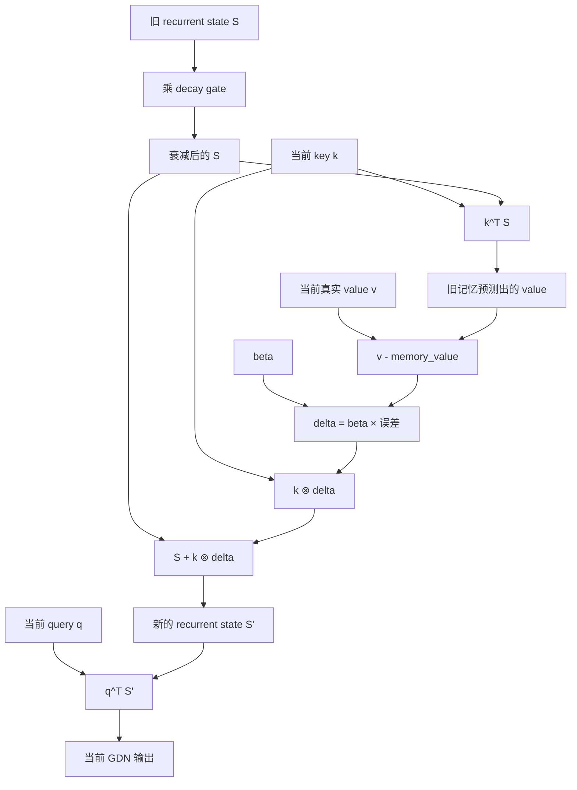
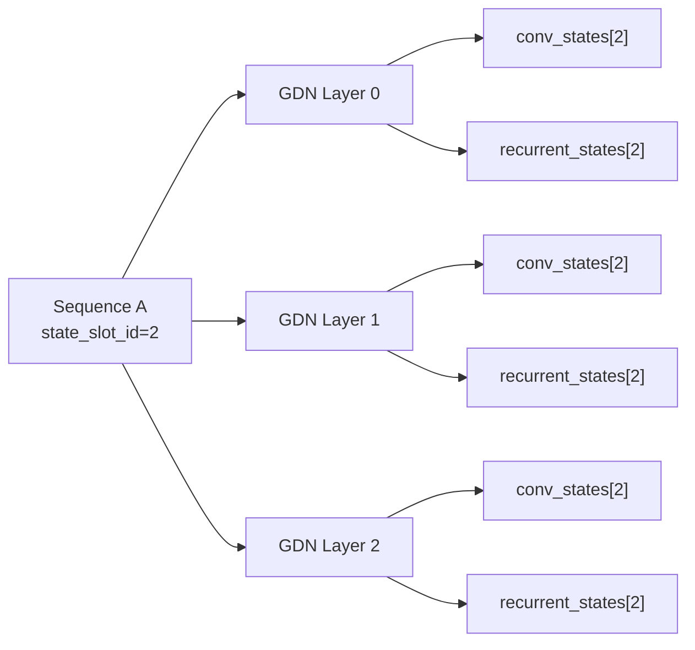
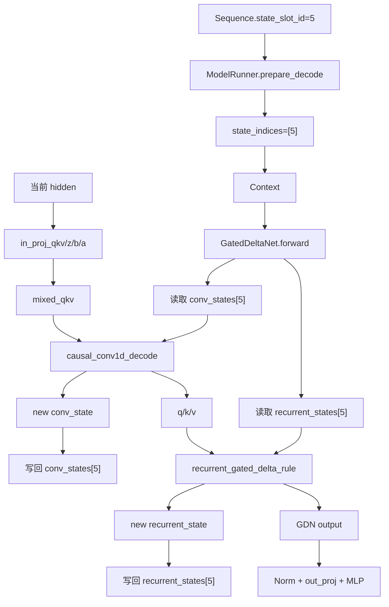
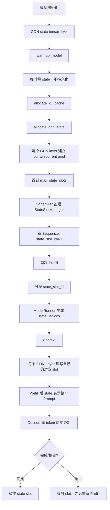

# nano-vLLM-qwen3.6：GatedDeltaNet 的 `conv_state` 与 `recurrent_state` 完整解析

> 目标：从“这两个 state 到底是什么”开始，一直讲到它们在 `nano-vllm-qwen3.6` 中如何分配、索引、更新、回收、回滚。
>
> 主要源码：
>
> - `nanovllm/layers/gated_delta_net.py`
> - `nanovllm/models/qwen3_5.py`
> - `nanovllm/engine/model_runner.py`
> - `nanovllm/engine/scheduler.py`
> - `nanovllm/engine/sequence.py`
> - `nanovllm/utils/context.py`
> - `nanovllm/engine/llm_engine.py`

---

# 1. 先建立最重要的直觉：GDN 也必须“记住历史”

普通 Full Attention 在 decode 时，需要保存历史每个 token 的 K/V：

```text
K0,V0
K1,V1
K2,V2
...
```

这就是 KV Cache。序列越长，保存的 K/V 越多，所以 KV Cache 随上下文长度增长。

GatedDeltaNet（下文简称 GDN）不保存每个历史 token 的完整 K/V，而是把历史不断压缩进两个固定大小的状态：

```text
conv_state
recurrent_state
```

可以先粗略理解为：

```text
conv_state      = 最近几个 token 的短期记忆
recurrent_state = 从序列开始到现在的长期压缩记忆
```

每处理一个新 token：

```text
旧 conv_state + 当前 token
    ↓
新 conv_state

旧 recurrent_state + 当前 token
    ↓
新 recurrent_state
```

下一 token 再从这两个“新状态”继续。

---

# 2. 为什么需要两个 State，而不是一个

## 2.1 `conv_state`：负责短期、局部上下文

GDN 中有 causal depthwise Conv1D：

```python
self.conv1d = nn.Conv1d(
    self.conv_dim,
    self.conv_dim,
    kernel_size=self.conv_kernel_size,
    groups=self.conv_dim,
)
```

如果：

```text
kernel_size = 4
```

当前 token 的卷积需要最近 4 个位置，因此 decode 时必须额外保存前 `K-1=3` 个位置的数据。

这就是：

```text
conv_state
```

它相当于一个长度固定的短期滑动窗口。

## 2.2 `recurrent_state`：负责长期历史

Conv1D 只能直接保留很短的局部窗口。如果只靠卷积，kernel size=4 时最多直接使用最近几个位置。

因此 GDN 还维护：

```text
recurrent_state
```

它不是保存所有历史 token，而是随着每一个 token 到来持续更新，把长历史压缩进一个固定大小的矩阵状态。

所以二者可以记成：

```text
conv_state
    → 最近 K-1 个位置的短期局部记忆

recurrent_state
    → 整个历史逐步压缩后的长期记忆
```

---

# 3. GDN 在 Qwen3.5/Qwen3.6 Decoder 中处在什么位置

`qwen3_5.py` 中，每个 `Qwen3_5DecoderLayer` 初始化时读取：

```python
layer_type = config.layer_types[layer_idx]
```

如果：

```text
layer_type == "full_attention"
```

创建 `Qwen3_5Attention`；否则创建 `GatedDeltaNet`。

因此模型可能类似：

```text
Layer 0 → GDN
Layer 1 → GDN
Layer 2 → Full Attention
Layer 3 → GDN
Layer 4 → GDN
Layer 5 → Full Attention
...
```

一个 GDN Decoder Layer 仍然是：

```text
GemmaRMSNorm
  ↓
GatedDeltaNet
  ↓
GemmaRMSNorm
  ↓
MLP
```

所以 GDN 替代的是原 Decoder Layer 中的 token-mixing/attention 位置，不是替代整个 Decoder Layer。

---

# 4. 一个 token 进入 GDN 后先发生什么

假设当前 hidden state 是：

```text
x_t
```

GDN 首先做几组投影：

```text
x_t
 ├─ in_proj_qkv → mixed_qkv
 ├─ in_proj_z   → z
 ├─ in_proj_b   → b → beta
 └─ in_proj_a   → a → g
```

其中：

```text
mixed_qkv
    后面经过 causal Conv1D，再拆成 q/k/v

beta
    控制本次新信息写入长期状态的强度

g
    控制旧长期状态的衰减

z
    用于后续 gated normalization
```

真正涉及历史状态的顺序是：

```text
mixed_qkv
  ↓
conv_state + causal Conv1D
  ↓
q / k / v
  ↓
recurrent_state + gated delta rule
  ↓
GDN output
```

也就是说：

```text
先用短期状态做局部混合
再用长期状态做递推记忆
```

---

# 5. `conv_state` 到底保存什么

这是最容易理解错的地方。

`conv_state` 不是原始 token，不是完整 hidden state，也不是 Attention 的 K/V。

源码先做：

```python
mixed_qkv = self.in_proj_qkv(x).transpose(1, 2)
```

然后 `mixed_qkv` 才进入 causal Conv1D。

因此 `conv_state` 保存的是：

> 最近 `kernel_size-1` 个位置的、经过 `in_proj_qkv` 后但尚未经过 causal Conv1D 的投影特征。

流程是：

```text
hidden x_t
  ↓
in_proj_qkv
  ↓
mixed_qkv_t
  ├───────────────┐
  ↓               │
causal Conv1D      │
                  │
        写入 conv_state
```

如果：

```text
kernel_size = 4
```

那么某请求当前的 state 可以想象为：

```text
conv_state =
[
  mixed_qkv_(t-2),
  mixed_qkv_(t-1),
  mixed_qkv_t
]
```

下一步处理 `t+1` 时，它们会和 `mixed_qkv_(t+1)` 一起参与卷积。

---

# 6. `conv_state` 的物理形状

`ModelRunner.allocate_gdn_state()` 为每个 GDN 层分配：

```python
layer.conv_states = torch.zeros(
    max_slots,
    conv_dim,
    kernel_size - 1,
    dtype=hf_config.dtype,
    device="cuda",
)
```

所以：

```text
conv_states.shape =
[max_state_slots, conv_dim, kernel_size - 1]
```

含义：

```text
第 0 维 max_state_slots
    → 同时能保存多少个请求的状态

第 1 维 conv_dim
    → 当前 TP rank 上 q+k+v 投影合起来的局部维度

第 2 维 kernel_size-1
    → 保存多少个历史卷积输入位置
```

例如：

```text
max_state_slots = 64
conv_dim = 4096
kernel_size = 4
```

则：

```text
conv_states.shape = [64, 4096, 3]
```

其中：

```text
conv_states[5]
```

就是 state slot 5 对应请求在“这一层 GDN”中的短期卷积历史。

---

# 7. Decode 时 `conv_state` 如何更新

源码 `causal_conv1d_decode()` 的逻辑很直观。

假设旧状态：

```text
[x_(t-2), x_(t-1), x_t]
```

当前输入：

```text
x_(t+1)
```

卷积相当于使用：

```text
[x_(t-2), x_(t-1), x_t, x_(t+1)]
```

与 kernel 权重做 depthwise 卷积。

然后状态窗口左移：

```text
旧：
[x_(t-2), x_(t-1), x_t]

新：
[x_(t-1), x_t, x_(t+1)]
```

源码：

```python
new_conv_state[:, :, :-1] = conv_state[:, :, 1:]
new_conv_state[:, :, -1:] = x
```

所以 `conv_state` 本质上就是 GPU 上的滑动窗口。

---

# 8. Prefill 时 `conv_state` 怎么建立

Prompt 可能一次输入很多 token：

```text
x0, x1, x2, ..., x99
```

Prefill 不希望逐 token 手工 shift 100 次，所以 `causal_conv1d_prefill()` 直接：

```python
x_padded = torch.cat([conv_state, x], dim=-1)
conv_state.copy_(x_padded[:, :, -(K - 1):])
out = F.conv1d(x_padded, weight, groups=...)
```

逻辑是：

```text
之前的短期状态
+
本次整个 prefill chunk
  ↓
一次 causal Conv1D
  ↓
最后 K-1 个投影输入写回 conv_state
```

第一次新请求时，初始 state 应该是零状态。

如果 Prompt 有 100 个位置，kernel size=4，prefill 结束后只保留最近 3 个投影特征。

因此即使 Prompt 有 10,000 token：

```text
conv_state 的 shape 仍然不变
```

---

# 9. `recurrent_state` 到底是什么

`recurrent_state` 更抽象。

项目分配：

```python
layer.recurrent_states = torch.zeros(
    max_slots,
    num_v_heads,
    head_k_dim,
    head_v_dim,
    dtype=torch.float32,
)
```

所以单个请求、单个 GDN layer 的状态为：

```text
[num_v_heads, head_k_dim, head_v_dim]
```

对每一个 value head，都有一个二维矩阵：

```text
S_h : [Dk, Dv]
```

可以把它直观理解为：

> 一个持续更新的“Key → Value 关联记忆矩阵”。

这是根据代码里的读写公式做的解释；源码真正保存的就是这个 `[Dk,Dv]` 状态矩阵。

---

# 10. 用初学者方式理解 recurrent state 更新

Decode 走：

```python
recurrent_gated_delta_rule(...)
```

忽略 batch 和多 head，只看一个 head。

当前有：

```text
q_t
k_t
v_t
旧状态 S
```

## 10.1 先让旧记忆衰减

代码：

```python
state.mul_(g_t)
```

即：

```text
S ← decay × S
```

可以理解为：旧信息不会永远以相同强度存在，而是根据 gate 逐步衰减。

## 10.2 用当前 Key 查询旧记忆

代码：

```python
kv_mem = (state * k.unsqueeze(-1)).sum(dim=-2)
```

直观上：

```text
memory_value = k_t^T S
```

意思是：

> 用当前 key 去问现有记忆：“按照之前记住的关联，这个 key 应该对应什么 value？”

## 10.3 计算旧记忆和当前 Value 的误差

代码：

```python
delta = (v - kv_mem) * beta
```

即：

```text
delta = beta × (当前真实 value - 旧记忆预测 value)
```

`beta` 控制本次更新强度。

## 10.4 把修正写进 State

代码：

```python
state.add_(k.unsqueeze(-1) * delta.unsqueeze(-2))
```

可以理解成：

```text
S ← S + k ⊗ delta
```

也就是以当前 key 为“地址”，把 value 的误差修正写回长期记忆。

## 10.5 用 Query 从新状态读取输出

最后：

```python
output = (state * q.unsqueeze(-1)).sum(dim=-2)
```

直观上：

```text
output = q_t^T S
```

即当前 query 从已经更新后的长期记忆中读取信息。

---

# 11. recurrent state 更新流程图



---

# 12. 为什么 recurrent state 能表示长期历史

假设依次处理：

```text
token1
token2
token3
...
token10000
```

每一步都执行：

```text
旧 S
  ↓ 衰减
结合当前 k/v 做修正
  ↓
新 S
```

到了 token10000 时，并没有保存 token1~9999 每个位置的 K/V，而是前面的信息经过不断更新已经压缩进当前矩阵 `S` 中。

所以 recurrent state 的大小由：

```text
num_v_heads
head_k_dim
head_v_dim
```

决定，而不是由 sequence length 决定。

---

# 13. 两个 State 放在一起理解

| 对比项 | `conv_state` | `recurrent_state` |
|---|---|---|
| 保存内容 | 最近 K-1 个 projected mixed_qkv | 长期 Key→Value 关联矩阵 |
| 时间尺度 | 短期 | 长期 |
| 形状 | `[slot, conv_dim, K-1]` | `[slot, Hv, Dk, Dv]` |
| 是否随序列增长 | 否 | 否 |
| dtype | 模型 dtype，如 BF16 | 项目中 FP32 |
| 更新方式 | 滑动窗口 shift + append | decay + delta rule |
| 服务计算 | causal Conv1D | recurrent gated delta rule |

一个 token 在 GDN 中：

```text
hidden_t
  ↓
in_proj_qkv
  ↓
当前 projected feature
  ↓
conv_state + causal Conv1D
  ↓
q/k/v
  ↓
recurrent_state + beta + g
  ↓
gated delta rule
  ↓
GDN output
```

---

# 14. 工程上不是“每个请求自己 new 两个 Tensor”

如果每来一个请求就重新 `torch.zeros()` 两块 state，会产生大量 GPU malloc/free、显存碎片，也不利于 continuous batching 和 CUDA Graph。

所以项目使用：

```text
预分配 State Pool
+
state_slot_id 间接索引
```

这和 PagedAttention 有一点共同思想：

```text
Sequence 不直接持有大 GPU Tensor；
它只持有索引，真正的 Tensor 统一在 GPU pool 中。
```

但粒度不同：

```text
KV Cache:
    一个请求有很多 block，block 数随 token 数增加

GDN state:
    一个请求只有一个 state_slot_id
```

---

# 15. 每个 GDN Layer 都有自己独立的 State Pool

假设模型有 3 个 GDN 层：

```text
GDN layer 0
GDN layer 1
GDN layer 2
```

每层都有：

```text
layer0.conv_states
layer0.recurrent_states

layer1.conv_states
layer1.recurrent_states

layer2.conv_states
layer2.recurrent_states
```

如果请求 A：

```text
state_slot_id = 2
```

那么：

```text
Layer0 使用 conv_states[2] / recurrent_states[2]
Layer1 使用 conv_states[2] / recurrent_states[2]
Layer2 使用 conv_states[2] / recurrent_states[2]
```

**同一个 `state_slot_id` 在所有 GDN 层保持一致，但每层的数据完全独立。**

因此 `state_slot_id=2` 的真正含义是：

```text
这个请求在所有 GDN state pool 中都占第 2 行
```

---

# 16. State Pool 结构图



---

# 17. State Pool 是什么时候真正分配的

`GatedDeltaNet.__init__()` 中一开始只是：

```python
self.conv_states = torch.tensor([])
self.recurrent_states = torch.tensor([])
```

真实 pool 由 `ModelRunner.allocate_gdn_state()` 分配。

`ModelRunner` 初始化顺序是：

```text
创建模型
  ↓
加载权重
  ↓
allocate_runtime_buffers
  ↓
warmup_model
  ↓
allocate_kv_cache
  ↓
allocate_gdn_state
  ↓
capture CUDA Graph
```

注意 warmup 在真实 GDN state pool 分配之前。

因此 GDN 源码判断：

```python
warmup = state_indices is None or self.conv_states.numel() == 0
```

warmup 时使用临时零状态，只用于跑模型、测显存，不保存真实请求历史。

---

# 18. `max_state_slots` 是怎么估算的

`allocate_gdn_state()` 先统计所有 GDN layer，然后计算一个请求占多少 state 显存。

Conv state 每 slot：

```text
num_gdn_layers
× conv_dim
× (kernel_size-1)
× model dtype bytes
```

Recurrent state 每 slot：

```text
num_gdn_layers
× num_v_heads
× head_k_dim
× head_v_dim
× 4 bytes
```

乘 4 是因为 recurrent state 使用 FP32。

然后：

```python
max_slots = int(free_memory * 0.9) // bytes_per_slot
max_slots = min(max_slots, config.max_num_seqs)
```

所以 `max_state_slots` 表示：

> 剩余 GPU 显存最多可以同时保存多少个请求的完整 GDN 状态。

它不是“state 能保存多少 token”。

---

# 19. 为什么 recurrent state 用 FP32

源码明确把 recurrent state 分配为：

```text
float32
```

同时 `recurrent_gated_delta_rule()` 也把 q/k/v/g/beta 转成 FP32 参与递推更新。

从数值角度很好理解：

```text
recurrent_state 会跨大量 token 持续乘、加、修正；
误差也会随递推积累。
```

使用 FP32 是在显存和长期数值稳定性之间做取舍。

Conv state 只保存短窗口，所以按模型 dtype（通常 BF16）存储。

---

# 20. 一个请求如何拿到 `state_slot_id`

新 `Sequence` 创建时：

```python
self.state_slot_id = -1
```

表示还没有状态槽位。

Scheduler 中新增：

```text
StateSlotManager
```

它实际上是一个简单 free-list：

```text
free_slots = [0,1,2,3,...]
```

请求 A 首次进入 prefill：

```text
A.state_slot_id = allocate() = 0
```

请求 B：

```text
B.state_slot_id = 1
```

如果没有空 slot，新 hybrid 请求就不能继续进入 running。

因此 GDN state 增加了一种新的资源约束：

```text
KV blocks 主要约束总上下文 token 容量
state slots 主要约束同时活跃请求数
```

---

# 21. 为什么 Sequence 只保存 ID

`Sequence` 中：

```text
block_table
    → KV Cache 的物理 block 索引

state_slot_id
    → GDN State Pool 的物理行索引
```

所以：

```text
Sequence = 控制面/元数据
GPU 大 Tensor = ModelRunner / Layer 管理
```

这样 Scheduler 不需要搬运大 Tensor，请求状态也更容易跨 TP worker 同步。

---

# 22. `state_slot_id` 如何真正传到 GDN Layer

假设 decode batch 有三个请求：

```text
A.state_slot_id = 0
B.state_slot_id = 5
C.state_slot_id = 9
```

`ModelRunner.prepare_decode()` 构造：

```text
state_indices = [0,5,9]
```

然后：

```python
set_context(..., state_indices=state_indices)
```

进入 GDN：

```python
context = get_context()
state_indices = context.state_indices

conv_state = self.conv_states[state_indices]
rec_state = self.recurrent_states[state_indices]
```

于是 batch 中每个请求都能读写自己的 state。

调用链：

```text
Sequence.state_slot_id
  ↓
Scheduler 调度 Sequence
  ↓
ModelRunner.prepare_prefill/decode
  ↓
state_indices
  ↓
Context
  ↓
GatedDeltaNet
  ↓
conv_states[state_indices]
recurrent_states[state_indices]
```

---

# 23. 一次真实 Decode Step 如何更新两个 State

假设请求 A：

```text
state_slot_id = 5
```

进入某个 GDN layer。

第一步，找到状态：

```text
conv_state = layer.conv_states[5]
recurrent_state = layer.recurrent_states[5]
```

第二步，当前 hidden 做投影：

```text
hidden_t
  ↓
in_proj_qkv / z / b / a
```

第三步，更新短期状态：

```text
旧 conv_state + 当前 mixed_qkv
  ↓
causal_conv1d_decode
  ↓
卷积输出 + new_conv_state
```

写回：

```text
conv_states[5] = new_conv_state
```

第四步，卷积输出拆成 q/k/v。

第五步，长期状态更新：

```text
旧 recurrent_state
  ↓ decay
当前 k/v
  ↓ delta correction
新的 recurrent_state
```

同时当前 q 从新状态读取输出。

第六步，写回 `recurrent_states[5]`，然后进入后面的 gated norm、out projection 和 MLP。

---

# 24. Decode 完整流程图



---

# 25. Prefill 时两个 State 如何建立

第一次 Prompt：

```text
token0 token1 ... token99
```

Conv state：

```text
整段 mixed_qkv
  ↓
causal_conv1d_prefill
  ↓
批量计算所有位置
  ↓
最后 K-1 个投影输入留在 conv_state
```

Recurrent state：

```text
整个 Prompt 的 q/k/v/g/beta
  ↓
chunk_gated_delta_rule
  ↓
得到所有位置输出
+
最终 final_state
```

然后把 `final_state` 写入该请求对应的 recurrent state slot。

因此 Prompt prefill 结束时：

```text
conv_state
    = Prompt 结尾附近的短期局部历史

recurrent_state
    = 整个 Prompt 累积后的长期状态
```

Decode 就从这里继续，不需要重新计算 Prompt。

---

# 26. Chunked Prefill 为什么更复杂

假设 Prompt 有 10,000 token，一次只能处理 4,000：

```text
Chunk 1: 0~3999
Chunk 2: 4000~7999
Chunk 3: 8000~9999
```

Chunk 1 完成后，state 已经代表前 4000 token。

Chunk 2 绝不能重新从零 state 开始，否则会忘掉 Chunk 1。

所以 continuation 路径会读取已有：

```text
conv_states[state_slot]
recurrent_states[state_slot]
```

继续递推。

对应关系：

```text
Attention:
    上一 chunk 的 KV Cache
    → 下一 chunk 继续读

GDN:
    上一 chunk 的 final conv/recurrent state
    → 下一 chunk 作为 initial state
```

---

# 27. 和 KV Cache / PagedAttention 的根本区别

| 对比项 | KV Cache | GDN State |
|---|---|---|
| 对应层 | Full Attention | GatedDeltaNet |
| 历史保存方式 | 每个历史 token 一份 K/V | 历史压缩到固定状态 |
| 数据结构 | 多个 block | 一个 state slot |
| 随序列长度增长 | 是 | 否 |
| Sequence 记录 | `block_table` | `state_slot_id` |
| batch 运行时索引 | `slot_mapping/block_tables` | `state_indices` |
| 局部历史 | K/V 本身 | `conv_state` |
| 长期历史 | 所有 K/V | `recurrent_state` |
| 抢占 | block 释放，之后重算 | slot 释放，之后重算 |

GDN 没有照搬 PagedAttention。

更准确地说：

```text
PagedAttention = token-level block pool
GDN State      = request-level state slot pool
```

共同点只是：

```text
都预分配 GPU 资源池，并使用间接索引管理请求
```

---

# 28. 为什么 Hybrid 下不能只复用 KV Prefix Cache

如果两个请求有相同前缀，Full Attention 的 K/V 可以复用。

但如果只复用 KV：

```text
Full Attention 层
    → 认为 prefix 已经处理过

GDN 层
    → recurrent/conv state 还是空的
```

这样同一模型不同层看到的“历史”不一致。

因此当前 Scheduler 在 hybrid 模型中调用 BlockManager 时禁用 KV-only prefix cache。

真正支持 hybrid prefix caching，需要同时缓存：

```text
KV blocks
+
对应 prefix 末尾的 conv_state snapshot
+
对应 prefix 末尾的 recurrent_state snapshot
```

---

# 29. 请求完成或抢占后如何释放

请求 EOS 或达到 `max_tokens`：

```text
Scheduler.postprocess
  ↓
BlockManager.deallocate
  ↓
StateSlotManager.deallocate(state_slot_id)
  ↓
seq.state_slot_id = -1
```

抢占时也会：

```text
释放 KV blocks
释放 state slot
把请求放回 waiting
```

之后重新 prefill，重新构建 KV 和 GDN state。

当前项目不是把 GDN state swap 到 CPU，而是选择在抢占后重算。

---

# 30. 一个重要工程细节：State Slot 复用前清零

`ModelRunner` 定义了：

```python
reset_gdn_state_slots(slot_ids)
```

它会把指定 slot 在所有 GDN layer 中的：

```text
conv_state
recurrent_state
```

都填 0。

这说明新请求复用旧 slot 前，从设计上应该避免继承旧请求状态。

但在本文检查到的普通：

```text
LLMEngine.step
Scheduler.schedule
Scheduler.postprocess
Scheduler.preempt
```

路径中，没有看到 Scheduler 直接调用这个 reset 函数。`StateSlotManager.deallocate()` 只是把 slot id 放回 free list，并不清零 Tensor。

因此这里是一个值得实际测试的工程点：

```text
设计意图：新请求应从零 GDN state 开始。

当前检查到的代码：提供了 reset_gdn_state_slots()，
但普通 Scheduler 路径没有明显调用。
```

推荐 correctness test：

```text
1. 请求 A 使用 slot 0 并生成若干 token。
2. A 结束，slot 0 回收到 free list。
3. 请求 B 再次拿到 slot 0。
4. 对比 B 在当前进程中的输出与全新进程中 B 的输出。
```

如果存在差异，就要检查 slot reuse 清零问题。

---

# 31. Tensor Parallel 多卡时 State 如何管理

TP 下每个 rank 都只持有 GDN 参数的一部分，因此每个 rank 都会独立分配自己的：

```text
conv_states
recurrent_states
```

但一个请求的逻辑 `state_slot_id` 在各 rank 上要一致。

例如：

```text
Request A.state_slot_id = 5
```

那么：

```text
rank0 → 自己 GDN shard 的 states[5]
rank1 → 自己 GDN shard 的 states[5]
rank2 → 自己 GDN shard 的 states[5]
rank3 → 自己 GDN shard 的 states[5]
```

每卡存的是对应模型 shard 的状态，但 slot 编号统一。

---

# 32. 为什么 CUDA Graph 也要加入 `state_indices`

CUDA Graph replay 时不仅要固定：

```text
input_ids
positions
slot_mapping
block_tables
```

Hybrid 模型还必须告诉 GDN：

```text
当前 batch 中每个请求使用哪个 state slot
```

所以 `ModelRunner.allocate_runtime_buffers()` 增加：

```text
decode_cpu_state_indices
decode_gpu_state_indices
verify_cpu_state_indices
```

每次 replay 前更新这些 buffer 的内容，地址保持固定。

这说明 GDN state 已经不是 Layer 内部一个小变量，而是：

```text
Scheduler
  ↓
Sequence
  ↓
ModelRunner
  ↓
Context
  ↓
CUDA Graph
  ↓
GatedDeltaNet
```

整条运行时系统的一部分。

---

# 33. Speculative Decode 为什么必须回滚 GDN State

投机验证 draft token 时，目标主模型会真实执行 GDN layer，因此每个 candidate token 都会修改：

```text
conv_state
recurrent_state
```

如果第 2 个 draft 错了，那么错误路径之后的 GDN state 都不能保留。

所以 `ModelRunner._save_decode_state_slots()` 除了保存 KV Cache，还会遍历所有 GDN layer 并 clone：

```text
layer.conv_states[state_indices]
layer.recurrent_states[state_indices]
```

Reject 时 `restore_decode_state()` 再用 `index_copy_` 写回。

因此可以把两套历史状态记成：

```text
Full Attention 的历史 = KV Cache
GatedDeltaNet 的历史   = conv_state + recurrent_state
```

Spec Decode 要正确，就必须一起恢复。

---

# 34. GDN State 生命周期总图



---

# 35. 一次完整请求例子

假设模型有：

```text
GDN Layer 1
GDN Layer 3
GDN Layer 5
```

请求：

```text
“请解释一下 KV Cache”
```

Scheduler 分配：

```text
state_slot_id = 7
```

则 prefill 时：

```text
Layer1 → conv_states[7], recurrent_states[7]
Layer3 → conv_states[7], recurrent_states[7]
Layer5 → conv_states[7], recurrent_states[7]
```

Prompt 处理完后：

```text
Layer1 states[7]
    = Layer1 对整个 Prompt 的压缩历史

Layer3 states[7]
    = Layer3 自己的压缩历史

Layer5 states[7]
    = Layer5 自己的压缩历史
```

后续每个 decode token，这三层都继续更新自己的 slot 7。

序列越来越长时：

```text
KV Cache block 数会继续增长
```

但是：

```text
conv_states[7] shape 不变
recurrent_states[7] shape 不变
```

只是在不断更新其中的数值。

---

# 36. 最容易混淆的几个问题

## `conv_state` 是卷积输出吗？

不是。它保存最近 `K-1` 个 `in_proj_qkv` 后、Conv1D 前的投影输入特征。

## `recurrent_state` 是一个普通 hidden vector 吗？

不是。每个 value head 保存一个 `[Dk,Dv]` 二维矩阵。

## 一个请求只有一份 recurrent state 吗？

不是。**每个 GDN layer × 每个请求** 都有自己的 recurrent state。`state_slot_id` 只是统一索引。

## 每生成一个 token 会新分配 state 吗？

不会。请求从 prefill 到结束一直用同一个 slot，state 原地更新。

## State 会随上下文长度增长吗？

不会。shape 固定，只更新数值。

## GDN 不需要历史了吗？

不是。它仍然依赖历史，只是把历史从“每 token 一份 K/V”改成“固定大小的短期+长期状态”。

---

# 37. 用一句话理解两个 State

> `conv_state` 是 GDN 为 causal Conv1D 保存的“最近几个 token 的短期滑动窗口”；`recurrent_state` 是 gated delta rule 持续更新的“长期 Key→Value 关联记忆矩阵”。每个请求由 Scheduler 分配一个 `state_slot_id`，而每个 GDN layer 都有独立的 state pool；`ModelRunner` 把请求 slot id 组成 `state_indices` 放入 Context，GDN 再据此读写自己的状态。请求结束或抢占后 slot 被释放，Speculative Decode 回滚时则必须和 KV Cache 一起恢复这些 state。

---

# 38. 最终把整条工程链记住

```text
config.layer_types
  ↓
决定哪些 Decoder Layer 是 GDN
  ↓
每个 GDN Layer 创建空 state 句柄
  ↓
ModelRunner warmup
  ↓
allocate_gdn_state
  ↓
每个 GDN Layer 建立：
    conv_states[max_slots,...]
    recurrent_states[max_slots,...]
  ↓
Scheduler 创建 StateSlotManager
  ↓
新请求 Sequence.state_slot_id=-1
  ↓
首次 prefill 分配 slot
  ↓
ModelRunner:
    state_indices=[seq.state_slot_id]
  ↓
Context
  ↓
GatedDeltaNet
  ├─ conv_states[state_indices]
  │    短期滑动窗口
  │
  └─ recurrent_states[state_indices]
       长期递推记忆
  ↓
每个 token 原地更新
  ↓
请求完成/抢占：释放 slot
  ↓
Spec Decode reject：从 snapshot 恢复 slot 内容
```

如果只记住一个区别：

```text
Full Attention：
    用越来越长的 KV Cache 保存历史。

GatedDeltaNet：
    用固定大小的 conv_state + recurrent_state 压缩历史。
```

这就是理解本项目 Hybrid 状态管理的核心。


%% 项目关联导航：开始 %%
## 项目关联导航

- 所属模块：[[outputs/项目整理/模块-nanovllm项目面试准备|模块-nanovllm项目面试准备]]

%% 项目关联导航：结束 %%
