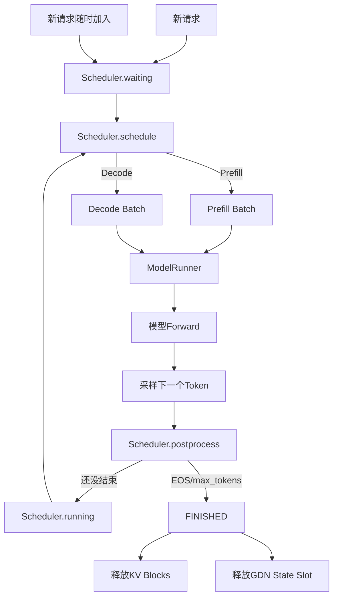

# Qwen3.5 适配版 nano-vLLM：Continuous Batching 原理与项目实现

> 本文基于你提供的 Qwen3.5 适配版仓库源码，重点分析 `LLMEngine → Scheduler → Sequence → BlockManager → ModelRunner` 这一条真实调用链。  
> Continuous Batching 常被误写成 “continues batching”，更准确的名称是 **Continuous Batching（连续批处理）**，也常叫 **Iteration-level Scheduling（迭代级调度）**。

---

## 1. Continuous Batching 到底是什么

先看传统 **Static Batching（静态批处理）**。

假设同时来了 3 个请求：

```text
A：需要生成 100 Token
B：需要生成 20 Token
C：需要生成 60 Token
```

静态 Batch 的思路是：

```text
A、B、C 一起组成 Batch
↓
一起开始
↓
B 在第20步已经结束
但整个 Batch 仍然继续跑
↓
直到 A 最后结束
↓
这个 Batch 才彻底结束
```

问题在于：B 提前结束后，它原来的位置不能立刻让给新请求 D，GPU Batch 中会出现空洞。

Continuous Batching 的核心思想则是：

> **模型每生成一轮 Token，就重新检查一次当前有哪些请求还活着，再动态组成下一轮 Batch。**

例如：

```text
第1轮：A B C
第2轮：A B C
...
第20轮：A B C
B结束
第21轮：A C D
第22轮：A C D
...
C结束
下一轮：A D E
```

所以 Continuous Batching 的重点不是“Batch 很大”，而是：

```text
Batch 成员可以在推理过程中不断进入和退出。
```

它解决的核心问题是 **GPU 计算资源和 KV Cache 空间不能及时复用**。

---

## 2. 为什么大模型推理特别需要 Continuous Batching

大模型生成是自回归的：

```text
输入 Prompt
↓
Prefill
↓
生成 Token1
↓
生成 Token2
↓
生成 Token3
↓
...
```

不同请求的生成长度天然不同。

例如聊天服务中：

```text
请求A：回答一句话，30 Token
请求B：生成代码，1000 Token
请求C：总结论文，500 Token
```

如果使用静态 Batch，A 明明早已结束，却可能因为 B 还没结束而长期占着 Batch 位置。

Continuous Batching 可以做到：

```text
A结束
↓
立即释放A的KV Cache
↓
下一轮把新请求D补进来
```

因此它主要带来三类收益。

### 2.1 提高 GPU 利用率

Batch 中的位置不会因为短请求提前结束而长期闲置。

### 2.2 提高系统吞吐量

单位时间可以处理更多请求和更多输出 Token。

### 2.3 提高资源复用率

请求结束后立刻释放：

```text
KV Cache Block
Qwen3.5 GDN State Slot
```

新请求下一轮就可以使用。

所以 Continuous Batching 本质上同时涉及：

```text
调度
+
模型执行
+
KV Cache管理
+
请求生命周期管理
```

而不是 Scheduler 单独一个模块就能完成。

---

## 3. 你的项目中 Continuous Batching 的整体结构

项目核心结构可以画成：



代码中最关键的是：

```text
nanovllm/engine/llm_engine.py
nanovllm/engine/scheduler.py
nanovllm/engine/sequence.py
nanovllm/engine/block_manager.py
nanovllm/engine/model_runner.py
```

---

## 4. `Sequence`：Continuous Batching 中每条请求的“身份证”

文件：

```text
nanovllm/engine/sequence.py
```

每个请求会被封装成一个 `Sequence`。

它有三个状态：

```python
class SequenceStatus(Enum):
    WAITING = auto()
    RUNNING = auto()
    FINISHED = auto()
```

可以理解成：

```text
WAITING：
等待 Prefill 或抢占后等待重算

RUNNING：
Prompt 已经准备完成，正在 Decode

FINISHED：
遇到 EOS 或达到 max_tokens
```

每条 Sequence 还保存：

```text
token_ids
num_tokens
num_cached_tokens
num_scheduled_tokens
kv_num_tokens
block_table
state_slot_id
```

Continuous Batching 能成立的前提就是：

> 每条请求自己的状态必须独立保存，下一轮即使 Batch 成员变化，也能继续从自己的历史状态运行。

---

## 5. `waiting` 和 `running`：整个调度器最重要的两个队列

`Scheduler.__init__()` 中：

```python
self.waiting = deque()
self.running = deque()
```

### `waiting`

放：

```text
新请求
被抢占后需要重新 Prefill 的请求
```

### `running`

放：

```text
已经完成 Prefill，可以继续 Decode 的请求
```

新请求加入：

```python
def add(self, seq):
    self.waiting.append(seq)
```

因此请求生命周期大致为：

```text
创建
↓
WAITING
↓
Prefill
↓
RUNNING
↓
多轮Decode
↓
FINISHED
```

如果显存不足：

```text
RUNNING
↓
PREEMPT
↓
WAITING
↓
重新Prefill
↓
RUNNING
```

---

## 6. Continuous Batching 真正发生在 `Scheduler.schedule()`

最重要文件：

```text
nanovllm/engine/scheduler.py
```

每执行一次：

```python
seqs, is_prefill = scheduler.schedule()
```

Scheduler 都会 **重新构造这一轮的 Batch**。

这就是 Continuous Batching 的核心。

它并没有维护一个永远固定的：

```text
batch = [A,B,C,D]
```

而是每轮重新看：

```text
现在 waiting 有谁？
running 有谁？
KV Cache 还有多少？
最多允许多少请求？
```

再决定下一轮送哪些 Sequence 给 GPU。

---

## 7. 当前项目先调度 Prefill，再调度 Decode

`schedule()` 首先检查：

```python
while self.waiting ...
```

也就是先处理 waiting 请求。

受两个主要限制：

```text
max_num_seqs
max_num_batched_tokens
```

例如：

```text
max_num_seqs = 8
max_num_batched_tokens = 1024
```

表示一轮 Prefill：

```text
最多8条Sequence
总共最多1024个新Token
```

如果 Prompt 太长，还会利用前面学习过的：

```text
Chunked Prefill
```

只调度其中一部分。

只要这一轮成功安排了 Prefill：

```python
if scheduled_seqs:
    return scheduled_seqs, True
```

立即返回。

这意味着当前项目：

> **一轮要么是 Prefill Batch，要么是 Decode Batch，并没有实现生产版 vLLM 中更复杂的 Prefill + Decode 同轮混合 Batch。**

这是理解当前项目边界非常重要的一点。

---

## 8. Decode 阶段才最能体现 Continuous Batching

如果没有 waiting Prefill，进入：

```python
while self.running
```

Scheduler 从 `running` 中不断取请求。

每个 Decode 请求：

```python
seq.num_scheduled_tokens = 1
```

因为普通自回归 Decode：

```text
每条请求这一轮只输入1个Token
```

假设当前：

```text
running = [A, B, C, D]
max_num_seqs = 3
```

这一轮只选择：

```text
[A, B, C]
```

送给模型。

下一轮会再次重新调度，而不是永远固定这 3 个。

---

## 9. 用一个真实过程理解 Continuous Batching

假设：

```text
max_num_seqs = 3

A：还要生成4 Token
B：还要生成2 Token
C：还要生成3 Token
```

第一轮：

```text
Batch = [A,B,C]
```

模型一次 Forward 为三条请求各生成一个 Token：

```text
A1
B1
C1
```

第二轮：

```text
Batch = [A,B,C]
```

生成：

```text
A2
B2 → B结束
C2
```

`postprocess()` 发现 B 达到 EOS 或 `max_tokens`：

```python
seq.status = FINISHED
self.block_manager.deallocate(seq)
self.running.remove(seq)
```

如果是 Qwen3.5 Hybrid，还会：

```python
self.state_slot_manager.deallocate(
    seq.state_slot_id
)
```

于是下一轮：

```text
running = [A,C]
```

如果这时新请求 D 已经完成 Prefill 进入 RUNNING：

```text
下一轮Batch = [A,C,D]
```

这就是“连续”的含义。

不是：

```text
一个请求结束后等整个Batch结束
```

而是：

```text
请求结束后的下一轮就可以替换Batch成员
```

---

## 10. `LLMEngine.step()` 为什么是 Continuous Batching 的节拍器

文件：

```text
nanovllm/engine/llm_engine.py
```

核心：

```python
def step(self):
    seqs, is_prefill = self.scheduler.schedule()

    token_ids = self.model_runner.call(
        "run",
        seqs,
        is_prefill,
    )

    self.scheduler.postprocess(...)
```

然后 `generate()`：

```python
while not self.is_finished():
    self.step()
```

可以理解成：

```text
一次 step
=
重新组 Batch
+
模型执行一次
+
更新所有请求状态
```

下一次 `step()`：

```text
再重新组 Batch
```

所以这个项目实现的是很典型的：

> **Iteration-level Continuous Batching。**

---

## 11. KV Cache 为什么必须适配 Continuous Batching

假设 Batch 第一轮：

```text
[A,B,C]
```

第二轮变成：

```text
[A,C,D]
```

显然不能认为：

```text
Batch第1行永远属于A
第2行永远属于B
```

因为 Batch 行号会不断变化。

所以每个 Sequence 自己保存：

```python
seq.block_table
```

例如：

```text
A → [block 8, block 19]
B → [block 3]
C → [block 22, block 27]
```

ModelRunner 每一轮根据本轮真正选中的 Sequence 重新生成：

```text
block_tables
slot_mapping
context_lens
```

因此即使 Batch 从：

```text
[A,B,C]
```

变成：

```text
[C,A,D]
```

Attention 仍然知道每条请求该读自己的哪些 KV Blocks。

这就是：

> **Paged KV Cache 是 Continuous Batching 能高效运行的重要基础。**

---

## 12. 新 Token 需要 KV Block 时怎么办

Decode 前：

```python
while not self.block_manager.can_append(seq):
```

Scheduler 会先检查：

```text
这条请求下一Token的KV还能不能放下
```

如果能：

```python
self.block_manager.may_append(seq)
```

必要时动态申请一个新 Block。

因此 Continuous Batching 不是先给所有请求固定一大片最大显存，而是：

```text
请求随着生成增长
↓
需要时追加Block
↓
结束后立即释放
```

这也是 PagedAttention 思想与 Continuous Batching 的结合点。

---

## 13. 显存不足时为什么需要 Preemption

如果：

```text
KV Block已经不够
```

Scheduler 不会直接 OOM，而是：

```python
self.preempt(...)
```

`preempt()`：

```python
seq.status = WAITING
self.block_manager.deallocate(seq)
```

Qwen3.5 还会释放：

```text
state_slot_id
```

被抢占请求保留完整逻辑 Token 历史，但物理状态被释放。

之后再次被调度时：

```text
重新 Prefill
↓
重建 KV Cache
↓
重建 GDN State
```

这使系统能在有限显存中继续服务更多请求。

代价是：

```text
被抢占请求需要重算
```

所以 Continuous Batching、Paged KV Cache 和 Preemption 实际上是一套协同机制。

---

## 14. Qwen3.5 为什么比普通 Qwen3 多一层 Continuous Batching 状态管理

Qwen3 主要需要维护：

```text
KV Cache
```

但 Qwen3.5 Hybrid 中还有 Gated DeltaNet。

每条请求还需要：

```text
conv state
recurrent state
```

项目没有把这些状态和 Batch 行号绑定，而是建立：

```python
StateSlotManager
```

它管理一个：

```text
state slot free list
```

新 Hybrid 请求进入 Prefill 时：

```python
seq.state_slot_id =
    self.state_slot_manager.allocate()
```

请求结束：

```python
deallocate(state_slot_id)
```

请求被抢占：

```text
同样释放state slot
```

所以即使 Continuous Batching 中请求顺序不断改变：

```text
Batch row 0 这轮是A
下一轮可能是D
```

ModelRunner 只需传入：

```text
state_indices
```

GDN 就能找到对应请求自己的 recurrent/conv state。

---

## 15. Continuous Batching 和 CUDA Graph 怎么兼容

CUDA Graph 喜欢：

```text
固定Shape
固定内存地址
```

但 Continuous Batching 的：

```text
实际Batch Size
```

一直变化。

例如：

```text
这一轮3个请求
下一轮7个
下一轮5个
```

项目解决办法是：

```text
预先Capture多个Batch Size Bucket
```

例如：

```text
1,2,4,8,16,32...
```

如果真实：

```text
Batch=3
```

使用：

```text
Batch=4 Graph
```

其中一行 Padding。

如果：

```text
Batch=7
```

使用：

```text
Batch=8 Graph
```

然后每一轮把新的：

```text
input_ids
positions
slot_mapping
context_lens
block_tables
state_indices
```

写进固定 Graph Buffer。

所以：

> **Continuous Batching 负责动态改变“谁在这一轮运行”，CUDA Graph Bucket 负责让变化的 Batch Size 仍尽量复用固定执行图。**

---

## 16. KV Cache 压缩如何进入 Continuous Batching

当前项目在 Decode 调度后：

```python
_schedule_kv_compression(
    scheduled_seqs
)
```

也就是说压缩不是全局随便选请求，而是在：

```text
本轮真正进入Decode Batch的Sequence
```

中筛选候选。

例如：

```text
本轮Batch=[A,B,C,D]
```

只有这些请求会参与这一轮：

```text
compression candidate selection
```

如果 B 被选中压缩：

```text
B 的 pending_compression
```

会随本轮 Batch 进入 ModelRunner。

压缩完成后：

```text
Scheduler.postprocess()
```

统一应用压缩事件并释放多余 Blocks。

因此 Continuous Batching 还承担：

```text
“这一轮哪些请求有资格触发压缩”
```

的边界。

---

## 17. 请求完成后为什么必须立即释放资源

`postprocess()` 中：

```python
if EOS or max_tokens:
    seq.status = FINISHED
    block_manager.deallocate(seq)
    state_slot_manager.deallocate(...)
    running.remove(seq)
```

这是 Continuous Batching 的关键收益来源。

假设 B 完成：

```text
B占了8个KV Blocks
+ 1个GDN State Slot
```

完成后立即释放。

下一轮：

```text
新请求D
```

就可以使用这些资源。

如果必须等待整个旧 Batch 全部结束才释放：

```text
Continuous Batching的容量优势就没有了
```

---

## 18. 当前项目中的 Continuous Batching 有什么边界

需要如实区分。

### 已经实现

```text
每轮重新选择Sequence
请求完成后动态退出Batch
新请求进入waiting队列
Decode Batch大小动态变化
KV Block动态追加和释放
显存不足时Preemption
Qwen3.5 GDN State Slot动态分配/释放
CUDA Graph Batch Bucket
KV压缩基于当前Decode Batch调度
```

### 当前不是完整生产级 Serving

`LLM.generate()` 中通常先：

```python
for prompt in prompts:
    add_request(...)
```

再进入：

```python
while not finished:
    step()
```

也就是说离线 `generate()` 接口默认是：

```text
先把这一批Prompt都加入
再持续调度
```

仓库本身没有 HTTP Server、异步请求接入和真实网络 Arrival Queue。

但是底层：

```python
add_request()
+
step()
+
waiting/running
```

已经具备“在不同 Step 之间加入新 Sequence 并重新组 Batch”的调度结构。

因此更准确地说：

> **项目实现了 Continuous Batching 的核心迭代级调度机制，但不是完整在线 Serving 系统。**

---

## 19. 当前项目另一个重要特点：Prefill 与 Decode 不混合

生产版 vLLM 的高级调度可以在一轮中更灵活地组合：

```text
Decode Tokens
+
Chunked Prefill Tokens
```

而当前 Scheduler：

```text
只要waiting里成功调度了Prefill
→ 立即返回Prefill Batch
```

只有没有 Prefill 时：

```text
才进入Decode调度
```

所以当前项目是：

```text
Continuous Decode Batching
+
动态Prefill Scheduling
```

但不是最完整的：

```text
Mixed Prefill/Decode Continuous Batching
```

这一点面试时讲清楚反而更可信。

---

## 20. 最后用一个完整案例串起来

假设：

```text
max_num_seqs=3
```

当前：

```text
A、B、C 已经RUNNING
```

### Step 1

Scheduler：

```text
[A,B,C]
```

ModelRunner 一次 Decode。

### Step 2

仍：

```text
[A,B,C]
```

B 生成 EOS。

Postprocess：

```text
B → FINISHED
释放B的KV Blocks
释放B的GDN State Slot
从running删除B
```

### 此时新请求 D 到达

```text
D → waiting
```

### Step 3

Scheduler 先看 waiting：

```text
D需要Prefill
```

所以这一轮：

```text
只执行D的Prefill
```

A、C 暂停一个 Scheduler Step。

D完成 Prompt 后：

```text
D → RUNNING
```

### Step 4

现在：

```text
running=[A,C,D]
```

Decode Batch：

```text
[A,C,D]
```

### 后续显存不足

C 下一 Token 需要新 KV Block，但 free block 不够。

Scheduler：

```text
Preempt某条请求
↓
释放其KV和GDN State
↓
被抢占请求回WAITING
```

其余请求继续。

这就是你项目里 Continuous Batching 与：

```text
Scheduler
Paged KV Cache
Chunked Prefill
Preemption
GDN State
CUDA Graph
KV Compression
```

真正结合起来的完整结构。

---

## 21. 面试时可以怎么回答

> Continuous Batching 的核心不是一次把很多请求组成固定 Batch，而是每一个推理迭代都重新调度 Batch。因为不同请求生成长度不同，有的请求会提前 EOS，如果使用静态 Batch，它结束后原来的位置不能及时复用，会浪费 GPU 和 KV Cache。我的项目里 Scheduler 维护 waiting 和 running 两个队列，新请求先进入 waiting，完成 Prefill 后进入 running；Decode 时每轮从 running 中选择最多 `max_num_seqs` 条请求，每条请求生成一个 Token，下一轮再重新组 Batch。请求结束后会立即释放自己的 Paged KV Blocks，Qwen3.5 Hybrid 还会释放对应的 recurrent/conv state slot，所以新请求下一轮就可以复用这些资源。如果 KV Block 不足，Scheduler 还支持抢占，把某条运行请求的物理 KV 和 GDN state 释放掉，之后再通过 Re-Prefill 重建。为了兼容动态 Batch Size，CUDA Graph 采用多个 Batch Bucket；KV Cache 压缩也只针对当前真正被调度的 Decode Batch。当前这个轻量实现已经具备 Continuous Batching 的核心迭代级调度，但 Prefill 和 Decode 仍然是分轮执行的，还不是生产版 vLLM 那种完整混合调度。

---

## 22. 最终记住这六句话

1. **Static Batching 是 Batch 成员基本固定；Continuous Batching 是每轮都重新组成 Batch。**
2. **Continuous Batching 的真正价值是请求结束后，GPU 位置、KV Block 和状态资源可以立即被新请求复用。**
3. **你的项目用 `waiting + running + FINISHED` 管理请求生命周期。**
4. **Paged KV Cache 让请求即使在不同 Batch 行之间移动，也能通过自己的 `block_table` 找到历史 KV。**
5. **Qwen3.5 又增加 `state_slot_id`，保证 GDN recurrent/conv state 不依赖 Batch 行号。**
6. **当前实现属于迭代级 Continuous Batching，但 Prefill 与 Decode 仍分开调度，不是完整生产级混合 Serving。**


%% 项目关联导航：开始 %%
## 项目关联导航

- 所属模块：[[outputs/项目整理/模块-nanovllm项目面试准备|模块-nanovllm项目面试准备]]

%% 项目关联导航：结束 %%
