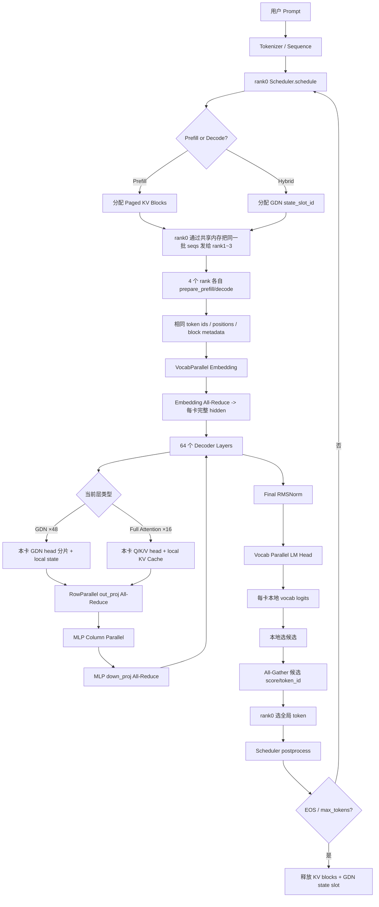
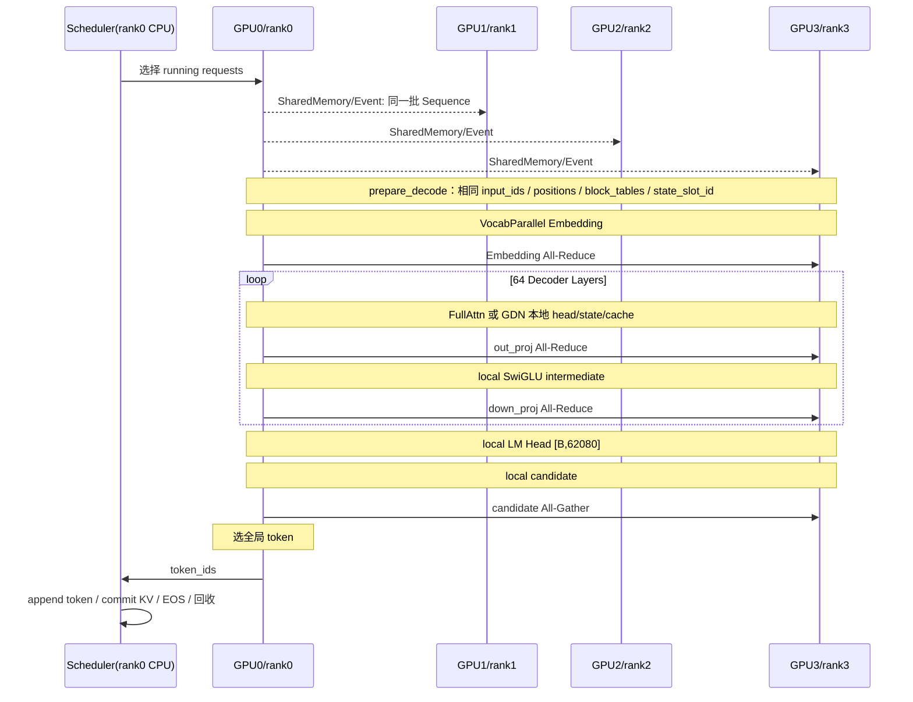

# nano-vLLM / Qwen3.5 Hybrid / KV Cache 压缩：4×RTX 3090、TP=4 多卡推理机制源码学习文档

> **定位**：面向 AI Infra / 大模型推理优化面试。目标不是记“TP=4 就是把模型除以 4”，而是能够沿一次请求的真实执行顺序回答：**四张卡分别存什么、算什么、什么时候通信、为什么这样切、KV/GDN 状态如何维护、CUDA Graph/MTP/压缩又如何嵌入这条链路。**
>
> **源码基线**：
> - 原始 `nano-vllm`：用于确认最基础的 Tensor Parallel（TP）、Vocab Parallel、Paged KV Cache、调度与 CUDA Graph 设计；
> - `nano-kvllm`：用于确认早期 KV Cache 压缩如何接入 Attention；
> - `nano-vllm-qwen3.6` 的 Qwen3.5/Qwen3.6 Hybrid + KV compression 分支：作为本文的**当前实现主线**，重点分析 `qwen3_5.py`、`gated_delta_net.py`、`model_runner.py`、`scheduler.py`、`kv_compression/*`、MTP 与 CUDA Graph。
>
> **模型 Shape 说明**：仓库代码并不把 Qwen3.5-27B 的结构常数写死在源码里，而是从模型目录的 Hugging Face `config.json` 读取。因此本文涉及 `hidden_size=5120`、`num_attention_heads=24`、`num_key_value_heads=4` 等具体数值时，属于对 **Qwen/Qwen3.5-27B 官方配置**的外部核对；TP 的切分方式和通信位置则直接来自你提供的仓库源码。

---

## 源码版本基线

本文实际解包并核对的三个仓库 HEAD 为：

| 仓库 | HEAD | 用途 |
|---|---|---|
| `nano-vllm` | `bb823b3` | 原始 TP、Paged KV、Chunked Prefill/CUDA Graph 基线 |
| `nano-kvllm` | `a7d8069` | 早期周期性 SnapKV/compact 压缩实现 |
| `nano-vllm-qwen3.6` | `4d87ba2` | Qwen3.5 Hybrid + GDN state + 双长度 KV + 新压缩/MTP/CUDA Graph 主线 |

### 三个仓库的演化关系应该怎么理解

**第一阶段：原始 nano-vLLM。** 已经具备一维 Tensor Parallel：Embedding/Vocabulary 切分、Column Parallel、Row Parallel，以及 `RowParallelLinear.forward()` 中的 NCCL All-Reduce。原版 LM Head 会把各 rank 的完整 vocab shard logits Gather 到 rank0。

**第二阶段：nano-kvllm。** 在原始 Attention/Paged KV 上插入周期性 KV 压缩。其核心思路已经是“当前 Query 给历史 K 打分 → 选重要 token → 在 Paged KV 中原地 compact → 更新 context length → 释放多余 blocks”。

**第三阶段：Qwen3.5 Hybrid/当前压缩分支。** 在上述 TP 基线之上加入 Gated DeltaNet、请求级 recurrent/conv state slot，并进一步把 `Sequence.num_tokens` 和 `kv_num_tokens` 拆成逻辑/物理双长度；压缩事件也从早期较直接的 layer-hook 方式改为 request/progress/event 模型。同时 LM Head 改成“local candidate + 小规模 All-Gather”，减少全词表通信。

因此面试时最好把项目讲成：**不是重新发明 TP，而是在 nano-vLLM 原有 TP 框架内，把 Qwen3.5 Hybrid 的两类状态以及 KV 压缩/MTP/CUDA Graph 正确嵌入多卡执行链路。**

---

## 0. 先记住整套项目最重要的一句话

在这个项目的 `TP=4` 中：

**同一个请求不会被拆成“四张卡各算一部分 token”**，而是**四张卡同时处理同一批 token**，每张卡只保存并计算某些权重/Head/中间通道的 1/4；在需要把局部结果重新合成完整 hidden state 的地方通过 NCCL `All-Reduce` 通信。

因此可以把四卡想成：

```text
同一批 Token / 同一份调度元数据
                │
       ┌────────┼────────┬────────┐
       ▼        ▼        ▼        ▼
     GPU0      GPU1      GPU2      GPU3
   权重分片0  权重分片1  权重分片2  权重分片3
   Head分片0  Head分片1  Head分片2  Head分片3
       │        │        │        │
       └────── All-Reduce ────────┘
                │
        每卡恢复相同的完整
          [N, 5120] hidden
```

最核心的规律是：

1. **Column Parallel**：沿输出维切权重，四卡得到不同的局部输出，通常**不立即通信**；
2. **Row Parallel**：沿输入维切权重，各卡算一个“部分和”，随后 **All-Reduce(sum)**，恢复完整输出；
3. Q/K/V Head、MLP 中间维、Vocabulary 都能天然分片；
4. **KV Cache 和 GDN state 跟着 Head 分片保存**，因此正常 Attention/GDN 状态更新本身不需要 All-Gather；
5. 核心 Transformer 层里最频繁的通信不是 All-Gather，而是每层 Attention 输出投影和 MLP Down 投影后的 **All-Reduce**；
6. 最终 LM Head 仍按 Vocabulary 分片，当前版本不 Gather 全量 logits，而是每卡先做局部候选，再只 `All-Gather` 很小的 `(score, token_id)` 候选。

---

# 1. 这四张 3090 在软件上到底是什么

## 1.1 一个 GPU 对应一个 Python 进程 / TP Rank

关键源码：

- `nanovllm/engine/llm_engine.py:17-40`
- `nanovllm/engine/model_runner.py:103-159`

`LLMEngine.__init__()` 会：

1. 根据 `tensor_parallel_size` 创建配置；
2. 对 rank 1、2、3 分别 `spawn` 一个 `ModelRunner` 子进程；
3. rank 0 的 `ModelRunner` 运行在主进程；
4. 每个 `ModelRunner` 执行：

```python
dist.init_process_group(
    "nccl",
    "tcp://localhost:2333",
    world_size=4,
    rank=rank,
)
torch.cuda.set_device(rank)
```

所以实际映射是：

| TP Rank | CUDA Device | 角色 |
|---|---:|---|
| rank 0 | GPU 0 | 主 ModelRunner + 返回最终采样结果 |
| rank 1 | GPU 1 | Worker |
| rank 2 | GPU 2 | Worker |
| rank 3 | GPU 3 | Worker |

**注意**：这里的 TP 是“单机 4 卡 NCCL TP”。源码没有记录你服务器的 PCIe/NVLink 拓扑，因此面试时不要声称“四卡一定走 NVLink”。更严谨的表述是：**项目的 GPU 集合通信统一交给 NCCL，真实链路由机器拓扑决定。**

---

## 1.2 控制面和数据面是两套通信

### 控制面：SharedMemory + Event

rank 0 在 `ModelRunner.call()` 中把：

```text
method_name + seqs + is_prefill + 其它 Python 参数
```

序列化写进共享内存，然后通过 `Event` 唤醒 rank1~3。

关键源码：

- `model_runner.py:180-208`

因此 Scheduler 并不是四份独立运行，而是：

```text
                  CPU rank0
             Scheduler.schedule()
                    │
          选出同一批 Sequence
                    │
       SharedMemory / Event 广播调用
          ┌─────────┼─────────┐
          ▼         ▼         ▼
       rank1      rank2      rank3
```

### 数据面：NCCL

真正的大张量通信由 PyTorch Distributed/NCCL 完成，例如：

- `dist.all_reduce(y)`
- `dist.all_gather(...)`
- `dist.broadcast(...)`

可以总结为：

> **Scheduler 决定“大家一起算谁”；NCCL 决定“各卡的局部结果怎么合起来”。**

---

# 2. 模型加载阶段：四张卡并不是先加载完整模型再切

## 2.1 每个 rank 都创建相同的模块拓扑

`ModelRunner.__init__()` 中：

```python
self.model = _create_model(...)
self.load_result = load_model(...)
```

四个进程都会创建 `Qwen3_5ForCausalLM`。

看起来“每卡都有完整模型类”，但每个 TP-aware Linear 在构造时已经根据：

```python
dist.get_rank()
dist.get_world_size()
```

只分配本 rank 应保存的 Parameter Shape。

所以：

- **逻辑结构完整**：每卡都有 64 层、每层都有 Attention/GDN/MLP 对象；
- **大权重物理分片**：Column/Row Parallel 权重只保存 1/4；
- Norm 等小参数通常复制；
- GDN 的 Head 参数按 head 切；
- Vision Encoder 当前代码主要是普通 `nn.Linear`/`nn.Conv`，不是本文语言模型 TP 主线，若开启多模态会存在重复参数/重复计算。

---

## 2.2 Safetensors 是怎样被切成 4 份的

关键源码：

- `nanovllm/utils/loader.py:26-100`
- `nanovllm/layers/linear.py:62-208`
- `nanovllm/layers/embed_head.py:10-71`

Loader 在每个 rank 上遍历 checkpoint tensor，然后把读出的 CPU tensor 交给对应 Parameter 的 `weight_loader()`。

### ColumnParallelLinear

源码核心：

```python
shard_size = param_data.size(0)
start_idx = tp_rank * shard_size
loaded_weight = loaded_weight.narrow(0, start_idx, shard_size)
```

即沿权重的 **output dimension / 第 0 维**切。

若全局权重：

```text
W: [output, input]
```

TP=4：

```text
GPU0: W[0:1/4 output, :]
GPU1: W[1/4:2/4 output, :]
GPU2: W[2/4:3/4 output, :]
GPU3: W[3/4:4/4 output, :]
```

### RowParallelLinear

源码沿第 1 维切：

```python
loaded_weight = loaded_weight.narrow(1, start_idx, shard_size)
```

即：

```text
GPU0: W[:, 0:1/4 input]
GPU1: W[:, 1/4:2/4 input]
GPU2: W[:, 2/4:3/4 input]
GPU3: W[:, 3/4:4/4 input]
```

然后每卡算：

```text
Yi = Xi · Wi^T
```

最终：

```text
Y = Y0 + Y1 + Y2 + Y3
```

这正是 `dist.all_reduce(y)` 的数学含义。

---

# 3. Qwen3.5-27B：为了理解 TP=4，先记住这些 Shape

官方 Qwen3.5-27B text config 中与本文有关的关键值：

| 参数 | 全局值 |
|---|---:|
| hidden_size | 5120 |
| num_hidden_layers | 64 |
| intermediate_size | 17408 |
| num_attention_heads | 24 |
| num_key_value_heads | 4 |
| attention head_dim | 256 |
| vocab_size | 248320 |
| linear/GDN key heads | 16 |
| linear/GDN value heads | 48 |
| GDN key head dim | 128 |
| GDN value head dim | 128 |
| GDN conv kernel | 4 |
| Full Attention 间隔 | 每 4 层 1 个 |
| Full Attention 层数 | 16 |
| GDN / linear attention 层数 | 48 |

在 `TP=4` 后：

| 张量/Head | 全局 | 每卡 |
|---|---:|---:|
| Hidden width | 5120 | **5120（层边界复制）** |
| Q heads | 24 | 6 |
| KV heads | 4 | 1 |
| Attention output width | 6144 | 1536 |
| MLP intermediate | 17408 | 4352 |
| GDN key heads | 16 | 4 |
| GDN value heads | 48 | 12 |
| GDN key width | 2048 | 512 |
| GDN value width | 6144 | 1536 |
| Vocabulary | 248320 | 62080 |

这里最容易误解的是：

> **hidden_size=5120 不会永久变成每卡 1280。**

在本项目的一维 Megatron 风格 TP 中，`[N,5120]` hidden state 在每个 Decoder Layer 的边界上是**四卡复制的完整张量**。被分片的是某些线性层内部的输出通道/输入通道。

---

# 4. 一次请求的真实链路总览



---

# 5. Prefill：4 张卡如何一起处理 Prompt

关键源码：

- `scheduler.py:68-121`
- `model_runner.py:prepare_prefill()`
- `llm_engine.py:72-87`

## 5.1 Scheduler 在 rank0 做什么

Scheduler 先尝试从 waiting 队列中拿请求。

对每个新请求：

1. 检查 KV Block 是否足够；
2. `BlockManager.allocate(seq)` 分配 Paged KV Block；
3. Hybrid 模型检查是否还有 GDN state slot；
4. 若需要，`StateSlotManager.allocate()` 分配一个整数 `state_slot_id`；
5. 根据 `max_num_batched_tokens` 决定本轮 Prefill 实际跑多少 token；
6. Chunked Prefill 时只把部分 Prompt 放进这一轮。

因此 rank0 决定的不是：

```text
GPU0 算前 1/4 Prompt
GPU1 算第 2/4 Prompt
...
```

而是：

```text
这一轮所有 GPU 都算同一个 Prefill token batch，
只是在模型维度上分工。
```

---

## 5.2 prepare_prefill 生成哪些关键元数据

`ModelRunner.prepare_prefill()` 会构造：

- `input_ids`
- `positions`
- `cu_seqlens_q`
- `cu_seqlens_k`
- `slot_mapping`
- `block_tables`
- Hybrid 下的 `state_indices`

### slot_mapping

它告诉 Attention：

> 当前这个 token 的 K/V 应该写到我这张 GPU 的 KV Cache 的哪个物理 slot。

例如：

```text
block_size = 256
block_table = [17, 4]

当前 token 逻辑位置 = 300
=> 位于逻辑 block 1，block 内 offset=44
=> physical slot = 4 * 256 + 44 = 1068
```

四张卡得到的是**同样的物理 block ID / slot 编号**，但是这些编号索引的是各卡自己的 local KV Cache。

因此：

```text
block 4
GPU0 -> KV head0 的 block4
GPU1 -> KV head1 的 block4
GPU2 -> KV head2 的 block4
GPU3 -> KV head3 的 block4
```

这就是“**Block metadata 同构，KV 内容按 Head 分片**”。

---

# 6. Embedding：输入 Token 四卡相同，为什么还要通信

关键源码：

- `layers/embed_head.py:10-51`

Vocabulary = 248320，TP=4：

```text
每卡 vocab rows = 248320 / 4 = 62080
```

大致分区：

```text
GPU0: token id [0, 62080)
GPU1: [62080, 124160)
GPU2: [124160, 186240)
GPU3: [186240, 248320)
```

假设输入 token id = 100000：

- GPU0：不属于自己，输出 0；
- GPU1：查自己的 embedding row，得到 `[5120]`；
- GPU2：输出 0；
- GPU3：输出 0。

然后：

```python
dist.all_reduce(y)
```

求和后四卡都得到相同 `[5120]` embedding。

所以：

```text
Vocab Parallel Embedding
= 参数按词表切
+ token ID 每卡相同
+ 非本卡 token 输出 0
+ All-Reduce 恢复完整 embedding
```

---

# 7. 进入一个 Decoder Layer：层边界 hidden 为什么四卡一样

`Qwen3_5DecoderLayer.forward()`：

```text
RMSNorm
  ↓
Full Attention 或 GDN
  ↓
RMSNorm / residual
  ↓
MLP
```

因为：

- Attention/GDN 最后的 `out_proj` 是 RowParallel；
- MLP 的 `down_proj` 是 RowParallel；
- RowParallel 都做 `All-Reduce`;

所以每完成一个子层，四卡都会重新拿到相同的：

```text
hidden_states: [N, 5120]
```

这让下一层的 RMSNorm 和下一次 Column Parallel 可以从相同输入开始。

---

# 8. Full Attention 层：TP=4 最重要的 Shape 拆解

关键源码：

- `models/qwen3_5.py:14-88`
- `layers/attention.py:44-95`
- `layers/linear.py:62-91, 173-208`

Qwen3.5-27B 的 Full Attention：

```text
H = 5120
Q heads = 24
KV heads = 4
head_dim = 256
TP = 4
```

## 8.1 Q Projection

源码：

```python
q_proj = ColumnParallelLinear(
    hidden_size,
    total_num_heads * head_dim * 2
)
```

乘 2 是因为 Qwen3.5 Full Attention 带 output gate：

```text
[q, gate]
```

全局输出宽度：

```text
24 × 256 × 2 = 12288
```

每卡：

```text
12288 / 4 = 3072
```

每卡 q_proj 权重：

```text
[3072, 5120]
```

Forward：

```text
input:  [N, 5120]
GPU0:   [N, 3072] -> view [N, 6, 512] -> q/gate 各 [N,6,256]
GPU1:   [N, 3072]
GPU2:   [N, 3072]
GPU3:   [N, 3072]
```

**此处不通信。**

## 8.2 K/V Projection

全局 KV heads = 4，每卡正好 1 个 KV head：

```text
K global output = 4 × 256 = 1024
K local output  = 1 × 256 = 256
V 同理
```

所以每卡：

```text
K: [N, 1, 256]
V: [N, 1, 256]
```

每张 GPU 并不保存 4 个 KV Head 的副本，而是只保存 1 个。

## 8.3 GQA 在单卡内部就能完成

每卡：

```text
Q heads = 6
KV heads = 1
```

恰好：

```text
6 Query heads : 1 KV head
```

因此 GPU0 完全可以用自己的：

```text
Q0~Q5 + KV head0
```

做局部 GQA Attention；GPU1 用自己的另外 6 个 Q heads + KV head1。

**不需要把四张卡的 K/V All-Gather 到一起。**

## 8.4 Attention Output 与 o_proj

每卡局部 Attention 输出：

```text
[N, 6, 256] -> flatten -> [N,1536]
```

四卡合起来对应全局 6144 宽，但代码并不会先 All-Gather `[N,6144]`。

直接进入 `o_proj` Row Parallel：

```text
全局 o_proj weight: [5120, 6144]

GPU0: [5120, 1536]
GPU1: [5120, 1536]
GPU2: [5120, 1536]
GPU3: [5120, 1536]
```

每卡：

```text
Yi = local_attention_i @ W_i^T
Yi shape = [N,5120]
```

最后：

```python
dist.all_reduce(Yi)
```

数学上：

```text
Y = Y0 + Y1 + Y2 + Y3
```

四卡恢复相同 `[N,5120]`。

### 为什么是 All-Reduce 而不是 All-Gather？

完整线性层本来就是：

```text
Y = [X0 X1 X2 X3] · [W0 W1 W2 W3]^T
  = X0W0^T + X1W1^T + X2W2^T + X3W3^T
```

真正需要的是**部分乘积的和**，不是把 Xi 全拼回来。

---

# 9. Full Attention 的 KV Cache：四卡到底分别存什么

关键源码：

- `model_runner.py:222-252`
- `layers/attention.py:11-95`

ModelRunner 按：

```python
num_kv_heads = hf_config.num_key_value_heads // world_size
```

计算本卡 KV heads。

Qwen3.5-27B、TP=4：

```text
local_num_kv_heads = 4 / 4 = 1
```

只对真正有 KV Cache 的 Full Attention 层分配，主模型是 16 层。

**在主模型、MTP 关闭的标准 Qwen3.5 推理口径下**，逻辑 Shape：

```text
kv_cache:
[2, num_kv_layers, num_blocks, block_size, local_kv_heads, head_dim]

=
[2, 16, num_blocks, 256, 1, 256]
```

第一维 `2` 分别是 K 和 V。

需要注意 `allocate_kv_cache()` 实际会扫描**所有带 `k_cache/v_cache` 的 module**。因此如果开启 MTP，MTP decoder 内部复用的 `Qwen3_5Attention` 也会成为一个 cache module，运行时大池的 `num_kv_layers` 可能高于主模型的 16；随后 `bind_kv_cache_layers()` 会区分“主模型 16 个真实 Full Attention 层”和其它 cache module，KV 压缩只绑定主模型层。所以下面显存公式明确按**主模型 16 层、MTP 关闭**来计算。

## 9.1 单 token KV Cache 显存

每卡、每 token、16 个 Full Attention 层：

```text
K+V
= 2 × 16 × 1 × 256 × 2 bytes
= 16384 bytes
= 16 KiB
```

四卡合计：

```text
64 KiB / token
```

例如 physical KV 长度 4096：

```text
每卡约 64 MiB / request
4卡合计约 256 MiB / request
```

这里只计算主模型 16 个 Full Attention 层 KV，不包含 GDN state、权重、workspace 等。

## 9.2 一个 Paged KV Block 多大

项目默认：

```text
block_size = 256 tokens
```

每卡：

```text
256 × 16 KiB = 4 MiB / block-id
```

四卡 aggregate：

```text
16 MiB / block-id
```

这解释了为什么 Block 数量会直接影响并发能力。

---

# 10. Paged KV Cache：Block ID 为什么四卡必须一致

Scheduler 的 `BlockManager` 只在 rank0 控制面管理逻辑 Block。

假设：

```text
Sequence A block_table = [5, 19, 3]
```

四张卡都会收到同样的 `[5,19,3]`，但各卡 block 5 的内容不同：

```text
GPU0 block5: Full Attention 各层的 KV head0
GPU1 block5: KV head1
GPU2 block5: KV head2
GPU3 block5: KV head3
```

这保证每卡 FlashAttention 都可以直接：

```python
flash_attn_with_kvcache(
    local_q,
    local_k_cache,
    local_v_cache,
    cache_seqlens=context_lens,
    block_table=context.block_tables
)
```

而不需要跨卡 K/V 通信。

---

# 11. Gated DeltaNet：TP=4 下为什么也能天然 Head 分片

关键源码：

- `layers/gated_delta_net.py:132-382`

全局：

```text
linear_num_key_heads = 16
linear_num_value_heads = 48
key head dim = 128
value head dim = 128
TP=4
```

每卡：

```text
key heads = 4
value heads = 12

local key width   = 4 × 128 = 512
local value width = 12 × 128 = 1536
```

Q/K/V 混合投影本卡总宽：

```text
Q: 512
K: 512
V: 1536
conv_dim = 2560
```

## 11.1 in_proj_qkv 看起来是 nn.Linear，为什么仍然是 TP 分片？

源码不是标准 `ColumnParallelLinear`，而是：

```python
self.in_proj_qkv = nn.Linear(hidden_size, self.conv_dim)
self.in_proj_qkv.weight.weight_loader = self.qkv_weight_loader
```

然后 `qkv_weight_loader()` 根据 rank 从 checkpoint 中分别 narrow：

```text
本 rank 的 Q 区间
本 rank 的 K 区间
本 rank 的 V 区间
```

再 concat 到本地 Parameter。

所以它在**权重加载语义上仍是 Head/Column 分片**，只是实现形式是自定义 loader。

## 11.2 GDN 其它权重

- `in_proj_z`：ColumnParallel，按 value width 切；
- `in_proj_b`：ColumnParallel，按 value heads 切；
- `in_proj_a`：ColumnParallel；
- depthwise `conv1d`：只保存本卡 local conv channels；
- `A_log`、`dt_bias`：按本卡 value heads 切；
- 最终 `out_proj`：RowParallel，从全局 value width 6144 的 1/4 输入映射回 5120，再 All-Reduce。

因此 GDN 通信结构和 Full Attention 有共同规律：

```text
局部 Head / 局部状态计算
           ↓
local output [N,1536]
           ↓
RowParallel out_proj
           ↓
All-Reduce
           ↓
full hidden [N,5120]
```

---

# 12. GDN recurrent state / conv state：四卡是否要同步

答案：

> **正常情况下不需要把 GDN state 跨卡同步。**

因为每卡只负责自己那一组 GDN heads。

## 12.1 recurrent state Shape

每卡、每个 GDN layer、每个 request slot：

```text
[num_v_heads, head_k_dim, head_v_dim]
=
[12, 128, 128]
```

dtype 是 FP32：

```text
12 × 128 × 128 × 4
= 786432 bytes
= 768 KiB
= 0.75 MiB / layer / request / GPU
```

## 12.2 conv state Shape

每卡：

```text
[conv_dim, kernel_size - 1]
=
[2560, 3]
```

BF16：

```text
2560 × 3 × 2 = 15360 bytes ≈ 15 KiB / layer / request
```

## 12.3 48 个 GDN layer 合计

每卡每个 active request slot：

```text
约 36.70 MiB
```

四卡 aggregate：

```text
约 146.81 MiB / active request
```

重要对比：

- Full Attention KV Cache：随 context length 线性增长；
- GDN state：基本不随 context length 增长，但随 active request 数增长，而且 recurrent state 使用 FP32。

## 12.4 state_slot_id 是“同步索引”，不是“同步状态值”

Scheduler 给请求分配：

```text
seq.state_slot_id = 7
```

四个 rank 都收到这个 `7`：

```text
GPU0: recurrent_states[layer][7] -> 本卡 12 个 value heads
GPU1: recurrent_states[layer][7] -> 另 12 个 heads
GPU2: ...
GPU3: ...
```

同一个 slot id 保证四卡对“这个请求用哪个槽位”达成一致。

但：

```text
GPU0 state tensor != GPU1 state tensor
```

而且本来就不应该相等，因为它们代表不同 Head 分片。

所以：

> **同步的是 request→slot 的映射；不是 state 数值本身。**

---

# 13. GDN Prefill 与 Decode

## 13.1 Prefill

`GatedDeltaNet._forward_prefill()`：

1. local `in_proj_qkv`;
2. local causal conv；
3. reshape 成本卡 q/k/v heads；
4. `chunk_gated_delta_rule(...)`；
5. 将最终 recurrent state 写入本卡对应 slot；
6. local norm；
7. local value-width 输出；
8. `out_proj` RowParallel；
9. All-Reduce 恢复 `[N,5120]`。

## 13.2 Decode

`_forward_decode()`：

```python
conv_state = self.conv_states[state_indices]
...
self.conv_states[state_indices] = new_conv_state

rec_state = self.recurrent_states[state_indices]
out = recurrent_gated_delta_rule(...)
self.recurrent_states[state_indices] = rec_state
```

这一步完全是**每卡对自己本地 state pool 的更新**。

随后只有 `out_proj` 做一次 All-Reduce。

---

# 14. MLP：为什么一个 MLP 子层还需要一次 All-Reduce

关键源码：

- `Qwen3_5MLP`
- `MergedColumnParallelLinear`
- `RowParallelLinear`

全局：

```text
hidden = 5120
intermediate = 17408
```

SwiGLU 需要 gate 和 up：

```text
gate_proj: [17408,5120]
up_proj:   [17408,5120]
```

仓库 merge 后：

```text
global gate_up output = 34816
local = 34816 / 4 = 8704
```

每卡：

```text
gate local: 4352
up local:   4352
SiluAndMul -> [N,4352]
```

down_proj：

```text
global: [5120,17408]
local per rank: [5120,4352]
```

每卡算局部 `[N,5120]` 后：

```python
dist.all_reduce(y)
```

因此 **每个 Decoder Layer 的 MLP 固定有一个主 All-Reduce**。

---

# 15. 64 层到底有多少次主 All-Reduce

无论当前层是 Full Attention 还是 GDN，它们最终输出投影都是 RowParallel。

每层：

```text
Attention/GDN out_proj -> 1 次 All-Reduce
MLP down_proj          -> 1 次 All-Reduce
```

64 层：

```text
约 64 × 2 = 128 次主 All-Reduce / 一次完整 forward
```

此外还有：

- 输入 VocabParallelEmbedding 的 All-Reduce；
- LM Head 采样阶段的候选 All-Gather；
- MTP 中 token Broadcast；
- 多模态输入开启时 image data Broadcast；
- 调试/探针路径可能有其它 collective。

面试时建议说：

> “主干 Transformer 每层两次 TP All-Reduce，因此 64 层逻辑上大约 128 次。这是最主要的高频跨卡同步点。”

---

# 16. Decode：为什么 TP 通信延迟特别值得关注

假设并发 B=8：

```text
hidden tensor = [8,5120] BF16
```

一次 RowParallel All-Reduce 的逻辑张量大小：

```text
8 × 5120 × 2 bytes = 81920 bytes ≈ 80 KiB
```

一轮 64 层 forward 有约 128 个：

```text
128 × 80 KiB ≈ 10 MiB
```

这只是“参与规约的张量体积”的直观量级，**实际链路字节数取决于 NCCL algorithm 和 GPU 拓扑**。

关键不是 10 MiB 本身，而是：

> Decode 有大量“小消息、高频、强同步”的 collective。单个 GEMM 因 TP=4 变小了，但 128 个通信同步点不会消失。

所以加卡后可能出现：

```text
计算时间下降
     +
通信延迟占比上升
```

这就是“增加 GPU 不一定线性提速”的第一原因。

---

# 17. Prefill 的通信是另一种形态

假设 Prefill 真正送进模型的总 token 数 N=4096：

```text
一次 [N,5120] BF16 All-Reduce
= 4096 × 5120 × 2
≈ 40 MiB
```

比 Decode 的 80 KiB 大很多，但 Prefill 的 GEMM 也大很多，GPU 更容易吃满，通信更偏向带宽型。

所以：

- **Decode**：小 batch、小矩阵，高频 collective，latency sensitivity 强；
- **Prefill**：大 token batch、大 GEMM、大 collective，更偏 compute/bandwidth。

---

# 18. LM Head：原版 nano-vLLM 与当前实现的通信变化

## 18.1 原版 nano-vLLM

原版 `ParallelLMHead.forward()`：

1. 每卡算自己的 vocab shard logits；
2. `dist.gather(logits, all_logits, 0)`；
3. rank0 拼完整 vocabulary logits。

也就是：

```text
[B,62080] × 4
    ↓ Gather
rank0 得 [B,248320]
```

## 18.2 当前 Qwen3.5/Qwen3.6 分支

当前 `ParallelLMHead.forward()` 只返回：

```text
local logits: [B,62080]
```

随后 `ModelRunner.sample()`：

1. 每卡在 local vocab 内找到候选 token 和 score；
2. token id 加本卡 `vocab_start_idx` 变成全局 token id；
3. `All-Gather` 四卡候选 `(score, token_id)`；
4. rank0 在 4 个候选中选全局 winner。

所以普通 greedy / Gumbel sample 不需要通信完整 `[B,248320]` logits。

这是一个典型优化：

> **能在分片上先做 reduction，就不要先 Gather 全量大张量。**

---

# 19. 采样后为什么所有 GPU 下一轮仍然得到同一个 Token

普通 Engine 路径：

1. 四 rank 同时执行 `run(seqs, ...)`;
2. Sampling collective 让 rank0 得到全局 token；
3. rank0 Scheduler `postprocess()` 把 token append 到 Sequence；
4. 下一次 `ModelRunner.call("run", seqs, ...)` 时，更新后的 Sequence 再通过 SharedMemory 发给 rank1~3。

因此普通 decode 不需要每个 token 都显式 `dist.broadcast(token_id)`。

### MTP 是例外

MTP draft 会在一次 ModelRunner 调用内部连续前向多次，等不到下一轮 Scheduler 同步 Sequence。

所以源码显式：

```python
dist.broadcast(main_token_tensor, src=0)
dist.broadcast(next_token_tensor, src=0)
```

---

# 20. 一次 Decode 的四卡时间顺序



---

# 21. KV Cache 压缩：TP=4 下到底在哪里发生

当前实现关键源码：

- `config.py:26-38, 111-179`
- `scheduler.py:145-199`
- `kv_compression/metadata.py`
- `layers/attention.py:44-95`
- `kv_compression/runtime.py:121-243`
- `kv_compression/snapkv.py:7-191`
- `kv_compression/slots.py`

压缩只作用于：

```text
Full Attention 的 KV Cache
```

GDN recurrent/conv state 不走该压缩路径。

配置明确：

```text
compression 是 decode-only
MTP 与 KV compression 当前互斥
```

---

# 22. 为什么压缩版本必须把“逻辑长度”和“物理 KV 长度”拆开

`Sequence` 新增：

```python
num_tokens               # 完整逻辑 token 时间线
kv_num_tokens            # 当前物理 KV 中保留多少 token
kv_uncompressed_start    # 尚未被压缩的 frontier
pending_compression
```

例如：

```text
逻辑历史 num_tokens = 4097
经过压缩后 physical KV = 2305
```

下一 token 的 RoPE position 仍应按真实时间线：

```text
position = 4096
```

但 KV 新条目的物理写位置可能是：

```text
physical_write_position = 2304
```

所以：

```text
logical position != physical KV position
```

这是压缩工程改造中很有含金量的一点。

---

# 23. 压缩时四卡是否需要先 All-Gather KV

**不需要。源码没有做。**

每个 Full Attention rank 本地已有：

```text
local Q: [B,6,256]
local K cache: [...,1,256]
local V cache: [...,1,256]
```

压缩运行时：

1. 根据相同 `block_table` 从**本卡 KV Cache** gather 窗口；
2. 用本卡 `Q + local K` 算 SnapKV score；
3. 本卡选 `keep_indices`；
4. 本卡原地 compact K/V；
5. 更新本地 `context_lens`；
6. 所有 16 个 Full Attention 层完成后形成 request-level compression event；
7. rank0 Scheduler 应用 event 并释放尾部 Block。

代码里没有：

```text
All-Reduce token score
All-Gather window KV
Broadcast keep_indices
```

因此压缩核心计算是 TP-local 的。

## 23.1 一个值得面试追问的深入细节

`SnapKV` 当前会在**本 rank 拥有的 Query/KV heads 内**对 Head 得分做平均。

不同 rank 拥有不同 Heads：

```text
GPU0 score 来源 = heads 0..5 + KV head0
GPU1 score 来源 = heads 6..11 + KV head1
...
```

源码没有强制四卡 `keep_indices` 相同。

因此当前实现语义是：

> **每个 TP rank 可以针对自己的 Head 分片保留不同的历史 KV token 子集。**

但四卡仍保持：

- 相同新的 physical length；
- 相同 block table 数量；
- 相同 logical request；
- 每张卡自己的 local Attention 在本地压缩 KV 上读取。

如果想改成“所有 KV heads 采用统一保留 token 集”，可以设计：

```text
local token scores
      ↓
All-Reduce(sum/max)
      ↓
统一 global scores
      ↓
相同 top-k
```

但这会新增通信。

**当前源码没有这样做。**

面试时可以说：

> “为了避免把压缩收益吃掉，我当前压缩是 TP-local，不新增 Q/K score 的跨卡聚合。如果后续要强制全局统一 token 子集，我会优先同步 token-level score，而不是 Gather KV 本身。”

---

# 24. KV 压缩为什么能提升并发，而不仅是“少一个 Tensor”

Scheduler 真正的资源单位是：

```text
Paged KV Block
```

压缩让 physical KV length 变短后，末尾一些 physical blocks 不再需要。

收益链：

```text
历史 KV 重要性筛选
    ↓
本地 K/V compact
    ↓
physical KV length 下降
    ↓
尾部 Paged Blocks 释放
    ↓
BlockManager free blocks 增加
    ↓
更少 preemption / 更高可承载并发
```

这就是“峰值活跃 KV Block 降低、零抢占并发提升”的底层机制。

---

# 25. 压缩触发时为什么 CUDA Graph 走 eager

`run_model()` 的 `should_run_eager(...)` 会考虑：

```text
context.has_kv_compression
```

压缩步骤涉及：

- 动态选择 request；
- 动态窗口；
- 动态 keep indices；
- 动态 compact；
- compression event；
- physical context length 改变。

因此源码选择：

> **有 active compression 的 decode step 直接 eager。**

普通未触发压缩的 decode 仍可 Graph replay。

---

# 26. CUDA Graph 在 TP=4 下不是“一张跨四卡的大图”

关键源码：

- `model_runner.py:1559-1711`

每个 rank 独立：

```python
graph = torch.cuda.CUDAGraph()
with torch.cuda.graph(graph):
    outputs = self.model(...)
```

物理上：

```text
GPU0: CUDA Graph rank0
GPU1: CUDA Graph rank1
GPU2: CUDA Graph rank2
GPU3: CUDA Graph rank3
```

但图内部 `RowParallelLinear` 仍执行 NCCL `All-Reduce`。

因此四张图不是互不相关：

> replay 时四个 rank 必须以一致顺序进入相同 collective，使 NCCL 调用匹配。

可以理解为：

```text
4 张 rank-local CUDA Graph
      +
图中被 capture 的 NCCL collective
      =
协同 replay 的 TP Forward
```

## 26.1 Graph bucket

源码预先 capture：

```text
1, 2, 4, 8, 16, 32, ...
```

真实 batch=6：

```text
选择 graph_bs=8
```

真实 6 行 copy 入静态 buffer，其余行通过哨兵/清零等方式屏蔽。

## 26.2 Hybrid 额外需要 state_indices

普通 Decode Graph 动态元数据主要有：

```text
input_ids
positions
slot_mapping
context_lens
block_tables
```

Qwen3.5 Hybrid 额外需要：

```text
state_indices
```

因为 GDN Graph replay 时不能把请求 A 写进请求 B 的 recurrent/conv state slot。

---

# 27. MTP：TP=4 下存什么、算什么、通信什么

关键源码：

- `models/qwen3_mtp.py`
- `model_runner.py:_run_mtp_draft()`
- verify / verify graph 路径

当前 MTP prototype：

1. 主模型跑一次；
2. 取 main hidden；
3. 主 LM Head 采样一个 token；
4. rank0 Broadcast 该 token 给其它 rank；
5. 各卡做 token embedding；
6. `pre_fc_norm_embedding` + `pre_fc_norm_hidden`;
7. concat `[embedding, hidden]`;
8. `ReplicatedLinear(10240 -> 5120)`；
9. 经过一层 MTP Decoder Layer；
10. MTP hidden -> 同一个 vocab-parallel LM Head；
11. 每卡本地候选 -> All-Gather；
12. rank0 选 draft token；
13. Broadcast draft token；
14. 下一次 draft。

## 27.1 MTP 的 fc 为什么是 ReplicatedLinear

源码：

```python
self.fc = ReplicatedLinear(hidden_size * 2, hidden_size)
```

这个参数不是 TP 切分，而是四卡各保存完整副本。

输入：

```text
[inputs_embeds, main_hidden] = [B,10240]
```

输出：

```text
[B,5120]
```

由于这里输入在四卡一致，因此每卡相同 fc 副本会得到相同输出，不需要 collective。

## 27.2 MTP Decoder Layer 仍然是 TP

MTP decoder layer 复用：

```python
Qwen3_5Attention
Qwen3_5MLP
```

所以仍有：

```text
Q/K/V local heads
Attention local
o_proj All-Reduce
MLP local intermediate
down_proj All-Reduce
```

MTP 不是“完全绕过通信的小模型”。

## 27.3 Draft token 为什么必须 Broadcast

MTP 在**同一个 ModelRunner 调用里连续 draft**，所以必须立即：

```python
dist.broadcast(next_token_tensor, src=0)
```

否则 rank1~3 不知道全局 vocab 最终选出的 token。

## 27.4 Verify 与 CUDA Graph

源码为 verify_len：

```text
1,2,3,4
```

capture：

- verify graph；
- chunk verify graph。

它们仍然是每 rank 独立 capture，内部 TP collective 要四卡一致 replay。

---

# 28. MTP 与 KV 压缩为什么当前不能同时开

`Config._validate_kv_compression_options()` 明确：

```python
if kv_compress_enabled and enable_mtp:
    raise ValueError(...)
```

不是理论上永远不能共存，而是当前工程尚未处理两套动态状态的组合：

```text
MTP:
draft → verify → accept/reject → snapshot/rollback

KV compression:
logical len != physical KV len
→ compact
→ block release
```

若同时开启，需要定义：

- draft 临时 KV 是否可压缩；
- reject 时 compact 后的 KV 如何回滚；
- verify KV slot 何时提交；
- GDN state snapshot 与 compressed KV timeline 如何一致；
- BlockManager 何时释放 block。

因此当前互斥是清晰的工程边界。

---

# 29. 抢占（Preemption）时四卡状态怎么处理

Scheduler 当 KV Block 不够时：

```python
self.preempt(seq)
```

Hybrid 设计：

1. `BlockManager.deallocate(seq)`：释放 Paged KV blocks；
2. `StateSlotManager.deallocate(state_slot_id)`：释放 GDN slot；
3. `seq.state_slot_id = -1`；
4. 请求放回 waiting；
5. 重新 Prefill 时重新分配 Block/state slot；
6. 根据完整逻辑 token history 重算 KV/GDN state。

关键结论：

> 抢占不是“把 GPU0 的 state 拷到 CPU 等待”，而是**释放物理状态、保留逻辑 token history，恢复时重算**。

四卡会重新使用同一个新的 slot id，但各自重建自己的 Head 分片 state。

---

# 30. 四张 GPU 最终分别保存什么：总表

| 对象 | GPU0 | GPU1 | GPU2 | GPU3 | 是否通信 |
|---|---|---|---|---|---|
| 输入 token IDs | 同一份 | 同一份 | 同一份 | 同一份 | 控制面同步 |
| LayerNorm 参数 | 副本 | 副本 | 副本 | 副本 | 无 |
| Embedding vocab | 1/4 rows | 1/4 | 1/4 | 1/4 | 输出 All-Reduce |
| FullAttn Q heads | 6 | 6 | 6 | 6 | local |
| FullAttn KV heads | 1 | 1 | 1 | 1 | local |
| FullAttn KV Cache | KV head0 | head1 | head2 | head3 | 正常 Attention 不 Gather |
| Attention o_proj | 输入列 1/4 | 1/4 | 1/4 | 1/4 | **All-Reduce** |
| MLP gate/up | intermediate 1/4 | 1/4 | 1/4 | 1/4 | local |
| MLP down | input cols 1/4 | 1/4 | 1/4 | 1/4 | **All-Reduce** |
| GDN key heads | 4 | 4 | 4 | 4 | local |
| GDN value heads | 12 | 12 | 12 | 12 | local |
| GDN recurrent state | 本卡 heads | 本卡 heads | 本卡 heads | 本卡 heads | 不 All-Gather |
| GDN conv state | 本卡 channels | 本卡 channels | 本卡 channels | 本卡 channels | 不 All-Gather |
| Paged Block IDs | 同一逻辑表 | 同一 | 同一 | 同一 | 元数据一致 |
| KV 压缩 | local Q/K 评分 | local | local | local | 当前不做 score 同步 |
| LM Head vocab | 62080 rows | 62080 | 62080 | 62080 | 候选 All-Gather |
| MTP replicated fc | 完整副本 | 完整副本 | 完整副本 | 完整副本 | 无 |
| MTP token | rank0 决策 | 接收 | 接收 | 接收 | Broadcast |
| CUDA Graph | rank0 本地图 | rank1 本地图 | rank2 本地图 | rank3 本地图 | 图内 collective 对齐 |

---

# 31. 所有关键通信点按真实顺序

## 初始化 / Load

- NCCL process group 初始化；
- Barrier；
- 权重不是 GPU0 加载完整模型后 scatter，而是各 rank 自己读 checkpoint 并由 `weight_loader()` 切自己的 shard。

## Prefill / Decode 主干

### 1. Embedding

```text
All-Reduce [N,5120]
```

### 2. 每个 Decoder Layer

Attention 或 GDN：

```text
RowParallel out_proj -> All-Reduce [N,5120]
```

MLP：

```text
down_proj -> All-Reduce [N,5120]
```

64 层主干约 128 次。

### 3. LM Head / Sampling

```text
local logits
→ local candidate
→ All-Gather(score, global_token_id)
→ rank0 global winner
```

### 4. MTP

每次 draft 额外：

```text
rank0 -> Broadcast token_id
```

MTP decoder 内部还有 TP All-Reduce。

### 5. 多模态（若开启）

`_broadcast_image_data()` 把 pixel values、grid、mask 等从 rank0 Broadcast 到其它 ranks。当前 Vision Encoder 使用普通 PyTorch Linear/Conv 为主，并没有沿语言模型 TP 方式分片，因此四卡会重复执行 Vision Encoder。

---

# 32. 为什么核心 Attention 不需要 All-Gather Q/K/V

已知：

```text
Q heads = 24
KV heads = 4
TP=4
```

每卡：

```text
Q heads = 6
KV heads = 1
```

一个 Attention head 计算只依赖：

```text
自己的 Q head
对应的 KV head
```

这些数据在同一张卡上已经齐全。

所以：

```text
Q/K/V projection
      ↓
local attention
```

不需要跨卡。

真正要合并的是不同 Head 对下一层完整 hidden 的贡献，所以放在 `o_proj` Row Parallel + All-Reduce 处完成。

---

# 33. 显存：TP=4 到底省了哪些，不省哪些

## 33.1 大部分权重

Column/Row Parallel 的主体权重大体 1/4。

按“27B 级 BF16 模型”做非常粗略数量级估算：

```text
27B × 2 bytes ≈ 54 GB
54 / 4 ≈ 13.5 GB / GPU
```

但这**不是实测显存**：

- 有 replicated Norm / MTP fc / vision params；
- allocator overhead；
- CUDA/NCCL workspace；
- KV Cache；
- GDN state；
- CUDA Graph memory pool；
- 若使用 FP8 checkpoint，加载/反量化策略也会影响占用。

因此面试说：

> “权重主体按 TP=4 分片，但最终显存绝不是简单除以 4。”

## 33.2 KV Cache

按 KV Head 分成 1/4。

## 33.3 GDN state

也按 GDN Heads 切。

## 33.4 Activation

层边界 hidden `[N,5120]` 是复制的，不是 1/4；内部 ColumnParallel activation 才是分片。

## 33.5 CUDA Graph/runtime buffer

每卡都要保存本 rank graph 和静态 buffer，因此不是全局只一份。

---

# 34. 为什么增加 GPU 不一定更快

## 34.1 GEMM 变小，计算效率可能下降

单卡大 GEMM 拆成 4 个小 GEMM 后，FLOPs/卡下降，但 kernel 未必维持同样高的 SM/Tensor Core 利用率。

## 34.2 每层高频 collective 仍在

64 层每轮约 128 次主 All-Reduce。

TP 越大：

```text
每卡计算 ↓
通信参与者 ↑
同步代价占比 ↑
```

## 34.3 Decode 特别吃 collective latency

并发 8 时一次 hidden All-Reduce 约 80 KiB，是高频小消息。

## 34.4 GPU 拓扑可能成为瓶颈

4×3090 的真实 P2P/PCIe/NVLink 连接依赖服务器拓扑。

## 34.5 有些参数/计算不会随 TP 下降

例如：

- LayerNorm；
- replicated 权重；
- Scheduler/CPU；
- Sampling；
- 当前 Vision Encoder；
- metadata copy；
- kernel launch overhead。

## 34.6 CUDA Graph 不会消除通信

Graph 降低 CPU launch overhead，但图内 NCCL All-Reduce 仍真实执行。

所以：

> TP 的第一目的常常是**让模型/状态放得下**；是否更快要看 compute/communication ratio。

---

# 35. TP、DP、PP 的区别——结合你的项目

| 维度 | TP（本项目） | DP | PP |
|---|---|---|---|
| 怎么切 | 每层矩阵/Head/通道 | 模型复制，不同请求分流 | 按 Layer 分 stage |
| 同一个 request | 四卡共同算 | 通常只在一个 replica/TP group | 依次经过多个 stage |
| 权重显存 | 大权重约 1/TP | 每卡完整模型 | 每卡部分 layers |
| 层内通信 | 高频 All-Reduce | 单纯推理可很少 | stage 间传 activation |
| 延迟特点 | 每层同步 | 单请求低通信 | 流水与 stage latency |
| 吞吐扩展 | 受通信限制 | 适合请求并行扩吞吐 | 需 microbatch 填流水 |
| 本仓库 | **核心模式** | 未见完整 DP engine | 未见 PP stage engine |

一句话：

> **TP 把“一层”拆给多卡；PP 把“不同层”分给多卡；DP 把“整个模型复制多份、请求分流”。**

---

# 36. 面试常见误区纠正

### 误区 1：“TP=4 后 hidden_size=5120，每卡只有1280”
错。层边界 hidden 是完整 `[N,5120]`。

### 误区 2：“四张卡每张算 Prompt 的1/4 token”
错。四卡处理同一 token batch，拆模型维度。

### 误区 3：“KV Cache 四卡各保存完整副本”
错。Full Attention KV heads=4，TP=4 后每卡1个。

### 误区 4：“Attention 前要 All-Gather 四卡 KV”
错。本地 Q/K/V 已构成完整 local GQA 组。

### 误区 5：“GDN state 必须四卡 All-Reduce”
错。同步 slot id，不同步状态值。

### 误区 6：“LM Head 一定 Gather 全 logits”
原版是 Gather；当前分支改为 local candidate + 小规模 All-Gather。

### 误区 7：“CUDA Graph 把 NCCL 通信优化没了”
错。collective 仍执行。

### 误区 8：“压缩后 RoPE position 也缩短”
错。逻辑时间线不变，physical KV 才缩短。

---

# 37. 面试题：请完整讲一下你的 4 卡 TP 推理流程

推荐 2~3 分钟回答：

> 我的项目用 4 张 3090 做 TP=4，是单机四进程、每个进程绑定一张 GPU，并通过 NCCL 做张量并行。模型加载时不是先在一张卡放完整模型再复制，而是每个 rank 根据自己的编号直接从 checkpoint 取对应权重分片。请求进来以后，Scheduler 只在 rank0 统一决定本轮是 Prefill 还是 Decode，然后把同一批 Sequence 发给其它三个 rank，所以四张卡处理的是同一批 token，不是每卡处理不同 token。Embedding 按词表切，先各卡查自己的 vocab shard，再 All-Reduce 得到完整 5120 维 hidden。进入每层以后，Full Attention 的 24 个 Q head 和 4 个 KV head 在 TP=4 下分别变成每卡 6 个 Q head、1 个 KV head，各卡可以独立完成自己的 GQA 和 KV Cache 读写，最后 o_proj 是 Row Parallel，通过 All-Reduce 合成完整 hidden；GDN 同样按 key/value head 切，每卡维护自己的 recurrent 和 conv state，只同步 state slot 的编号，最后也是 out_proj All-Reduce。MLP 的 gate/up 按 intermediate 维切成四份，down_proj 再做一次 All-Reduce。所以 64 层主干每次 forward 逻辑上大约有 128 次主要 All-Reduce。最后 LM Head 按 vocab 切，每卡先选本地候选，再 All-Gather 很小的候选 score 和 token id，由 rank0 得到全局 token。KV Cache 也是按 KV head 分片，四卡共享相同 block table 逻辑编号但保存不同 head 内容，因此正常 Attention 不需要 Gather KV。我的 KV 压缩也是每卡对自己的 local KV 做筛选和 compact，没有额外 Gather KV；CUDA Graph 则是每个 rank 独立 capture，本地图里包含 TP collective，四卡 replay 时保证 collective 顺序一致。

---

# 38. 高频追问与回答

## 38.1 为什么 Row Parallel 后必须 All-Reduce？

> Row Parallel 沿输入维切权重。完整输入可看成 `[X0,X1,X2,X3]`，权重按输入列切成 `W0~W3`，每卡只能算 `XiWi^T`，完整输出是四部分的和，所以需要 All-Reduce sum。

## 38.2 为什么 Column Parallel 后不马上通信？

> 后面通常能继续在分片上独立算，例如 Q/K/V Head 和 SwiGLU intermediate。提前 Gather 只增加通信，等真正需要完整 hidden 时再通过 Row Parallel 合并。

## 38.3 KV Cache 4 卡怎么切？

> Qwen3.5-27B Full Attention 有 4 个 KV heads，TP=4 后每卡 1 个。16 层主模型的 Paged KV Cache 每卡逻辑 Shape 是 `[2,16,num_blocks,256,1,256]`，四卡 block table 编号相同，但 block 内是不同 KV head 内容。

## 38.4 GDN state 为什么不像 KV Cache 随上下文增长？

> Full Attention 要保留每个历史 token 的 K/V，所以随上下文线性增长。GDN 把历史压进固定 recurrent state 和短 conv state，因此对单请求基本固定，但会随 active request 数增长，而且 recurrent state 是 FP32。

## 38.5 为什么 TPOT 可能随 GPU 增加而变差？

> 每卡 GEMM 变小，但每层同步点仍在。本项目 64 层大约 128 个主要 All-Reduce。Decode 并发 8 时每次 hidden collective 约 80 KiB，属于大量小消息，对 latency 很敏感；省下的计算可能小于新增通信成本。

## 38.6 All-Reduce 和 All-Gather 各在哪里？

> 主干主要是 All-Reduce：Embedding、每层 Attention/GDN out_proj、MLP down_proj。当前 LM Head 每卡先选本地候选，再 All-Gather candidate score/token id。MTP 连续 draft 还会 Broadcast token id。正常 Q/K/V 和 KV Cache 不 All-Gather。

## 38.7 KV 压缩会增加 TP 通信吗？

> 当前压缩核心不会 Gather KV。每个 rank 用 local Query 和 local KV head 算 SnapKV importance，再 compact 本卡 Paged KV。当前也没有聚合四卡 token score，所以不同 rank 理论上可以保留不同 token 子集。

## 38.8 压缩后四卡 BlockManager 怎么一致？

> BlockManager 控制逻辑只在 rank0。四卡执行相同 compression request，新的 physical KV 长度一致；完成后 rank0 根据 event 更新 `kv_num_tokens`、释放尾部 block，再把更新后的 Sequence/block table 传给 workers。

## 38.9 CUDA Graph 和 TP 通信冲突吗？

> 不冲突。每个 rank capture 自己的图，RowParallel 中 NCCL All-Reduce 也在执行序列内；四个 rank replay 时 collective 顺序必须匹配。Hybrid 还需要动态更新 graph 的 `state_indices`。

## 38.10 如果 4 卡换 8 卡呢？

Qwen3.5-27B：

```text
Q heads=24
KV heads=4
```

源码要求各类 Head 能直接被 TP size 整除。`KV heads=4` 无法按当前实现均分到 TP=8，而且源码没有实现 KV head replication/uneven partition。

因此：

> **TP=8 不是简单改一个参数就一定能跑。**

这是很好的源码级回答。

---

# 39. 4×3090 下最该关注的性能瓶颈

优先级：

1. 64 层中高频 TP All-Reduce；
2. Decode 小矩阵 GEMM 利用率；
3. Paged KV Cache / FlashAttention 读带宽；
4. GDN recurrent kernel 与 FP32 state 带宽；
5. Continuous Batching 是否能把 batch 做大；
6. CUDA Graph 是否减少 launch/CPU gap；
7. 压缩触发 step 的 compact 成本是否抵消后续收益；
8. CPU Scheduler / pinned-memory metadata copy；
9. 实际 PCIe/P2P/NCCL topology；
10. 开多模态时 Vision Encoder 的重复计算。

用 Nsight Systems 时重点看：

```text
GPU compute kernels
NCCL AllReduce
kernel launch gaps
H2D metadata copy
CUDA Graph replay
```

---

# 40. 源码导航：面试前至少能定位这些函数

## Engine / 多进程 / 调度

### `nanovllm/engine/llm_engine.py`
- `LLMEngine.__init__`
- `LLMEngine.step`

### `nanovllm/engine/scheduler.py`
- `Scheduler.schedule`
- `Scheduler._schedule_kv_compression`
- `Scheduler.preempt`
- `StateSlotManager`

### `nanovllm/engine/model_runner.py`
- `ModelRunner.__init__`
- `allocate_kv_cache`
- `allocate_gdn_state`
- `prepare_prefill`
- `prepare_decode`
- `run_model`
- `sample`
- `_run_mtp_draft`
- `capture_cudagraph`
- `capture_verify_cudagraph`
- `capture_verify_chunk_cudagraph`

## TP 基础

### `nanovllm/layers/linear.py`
- `ColumnParallelLinear`
- `MergedColumnParallelLinear`
- `QKVParallelLinear`
- `RowParallelLinear`

### `nanovllm/layers/embed_head.py`
- `VocabParallelEmbedding`
- `ParallelLMHead`

## Qwen3.5 Hybrid

### `nanovllm/models/qwen3_5.py`
- `Qwen3_5Attention`
- `Qwen3_5MLP`
- `Qwen3_5DecoderLayer`
- `Qwen3_5Model`
- `Qwen3_5ForCausalLM`

### `nanovllm/layers/gated_delta_net.py`
- `GatedDeltaNet.qkv_weight_loader`
- `_forward_prefill`
- `_forward_decode`

## KV / 压缩

### `nanovllm/layers/attention.py`
- `store_kvcache`
- `Attention.forward`

### `nanovllm/kv_compression/runtime.py`
- `bind_kv_cache_layers`
- `compress_attention_kv_layer_`

### `nanovllm/kv_compression/snapkv.py`
- `gqa_attention_logits`
- `snapkv_token_scores`
- `select_snapkv_indices`

### `nanovllm/engine/sequence.py`
- `num_tokens`
- `kv_num_tokens`
- `kv_uncompressed_start`
- `apply_kv_compression`

## MTP

### `nanovllm/models/qwen3_mtp.py`
- `Qwen3MTP`
- `Qwen3MTPDecoderLayer`

---

# 41. 最后压缩成 10 个必须背熟的结论

1. **TP=4 是模型维度并行，不是 token 维度并行。**
2. **每 rank 一个进程绑定一张 GPU，NCCL 负责 GPU collective。**
3. **ColumnParallel 沿 output 切，通常不通信；RowParallel 沿 input 切，最后 All-Reduce。**
4. **Qwen3.5-27B Full Attention 在 TP=4 下每卡 6 个 Q heads、1 个 KV head。**
5. **KV Cache 按 KV Head 分片；block_table 四卡相同，KV 内容不同。**
6. **GDN 每卡 4 key heads、12 value heads，本卡维护 recurrent/conv state；同步 slot id，不同步 state 值。**
7. **每层 Attention/GDN 输出投影 1 次 All-Reduce，MLP down 1 次；64 层主干约 128 次。**
8. **当前 LM Head 按 vocab 分片，不 Gather 全 logits，而是本地候选后 All-Gather 小结果。**
9. **KV 压缩是 TP-local：不 Gather KV，也没有跨 rank 同步 keep indices；压缩 step 走 eager。**
10. **CUDA Graph 每卡独立 capture，但图内 collective 必须四卡一致 replay；加 GPU 不一定提速，因为通信占比会上升。**

---

# 42. 一张最终白板图

```text
                   ┌─────────────────────────────┐
                   │   rank0 Scheduler / CPU     │
                   │ seq / block_table / slot_id │
                   └──────────────┬──────────────┘
                                  │ same batch
          ┌───────────────────────┼────────────────────────┐
          ▼                       ▼                        ▼
       GPU0/r0                 GPU1/r1                  GPU2/r2 ... GPU3/r3
          │                       │                        │
 Token IDs└─────────────── 同一批 token ──────────────────┘
          │
          │ vocab 1/4 on each rank
          └──────── Embedding All-Reduce [N,5120] ────────┐
                                                          │
                                                full hidden replica
                                                          │
        ┌─────────────────────────────────────────────────┴──────────┐
        │ 每一个 Decoder Layer                                     │
        │                                                            │
        │ Full Attention:                                            │
        │   Q 6 heads/card, KV 1 head/card                           │
        │   local KV Cache + local FlashAttention                    │
        │                 ↓                                          │
        │   o_proj RowParallel → All-Reduce [N,5120]                 │
        │                                                            │
        │ 或 GDN:                                                    │
        │   K 4 heads/card, V 12 heads/card                          │
        │   local conv/recurrent state                               │
        │                 ↓                                          │
        │   out_proj RowParallel → All-Reduce [N,5120]               │
        │                                                            │
        │ MLP:                                                       │
        │   gate/up intermediate 4352/card                           │
        │   down_proj RowParallel → All-Reduce [N,5120]              │
        └──────────────────────────┬─────────────────────────────────┘
                                   │ ×64
                                   ▼
                             Final RMSNorm
                                   │
               ┌───────────────────┼───────────────────┐
               ▼                   ▼                   ▼
          vocab shard0        vocab shard1 ...    vocab shard3
          local winner        local winner        local winner
               └──── candidate score/id All-Gather ────┘
                                   │
                               rank0 winner
                                   │
                        append token / next decode
```

---

# 43. 文档边界与严谨性说明

本文信息分三类：

### A. 直接来自你仓库源码
包括：

- TP process/rank 建立；
- Column/Row Parallel 切分；
- All-Reduce / All-Gather / Broadcast 的实际调用位置；
- Qwen3.5 Attention/GDN/MLP；
- KV Cache 分配公式；
- GDN state pool；
- Sequence 逻辑/物理双长度；
- KV Compression local SnapKV + compact；
- MTP draft/verify；
- CUDA Graph；
- preemption/recompute。

### B. 来自 Qwen3.5-27B 官方配置的 Shape
仓库通过 `AutoConfig.from_pretrained()` 动态读取模型配置，并未写死 `5120/24/4/17408/...`。本文用官方 `Qwen/Qwen3.5-27B config.json` 核对这些数值。

### C. 推导/估算
例如：

- 80 KiB Decode All-Reduce tensor size；
- 4 MiB / block / GPU；
- 36.70 MiB GDN state / request / GPU；
- “27B × BF16 ≈54GB”的参数数量级估算。

这些由源码 Shape/官方配置推导，**不是 Nsight 或 nvidia-smi 实测值**。

---

# 44. 与你的实际 Benchmark 如何对应

你的简历配置是：

```text
4×RTX 3090
TP=4
Qwen3.5-27B
```

所以面试官问“为什么必须多卡”时，不应该只答“27B 太大”。

更完整的回答是：

> 权重主体通过 TP 分片后，每卡承担约 1/4 大权重；Full Attention 的 KV Cache 也按 KV Head 分成 1/4；GDN state 也按 Head 切。但层边界 hidden、部分小参数和运行时资源仍有复制，而且 TP 每层会引入 All-Reduce。所以四卡既解决显存容量问题，也改变了性能瓶颈：权重和状态压力下降，但 Decode 会受到高频 NCCL collective 的影响。Benchmark 里看到的吞吐、并发和 KV Block 占用，本质上就是这套四卡资源/通信机制共同作用的结果。

---

# 45. 最终复习顺序

如果面试前时间有限，按以下顺序复习：

```text
1. ColumnParallel vs RowParallel
2. Full Attention TP Shape：24Q/4KV -> 每卡6Q/1KV
3. 为什么 o_proj / down_proj 是 All-Reduce
4. KV Cache [2,16,blocks,256,1,256]
5. GDN state：每卡4 K-head / 12 V-head，slot id 同步
6. 一次 Decode 的 128 次主 All-Reduce
7. LM Head local candidate + All-Gather
8. KV compression 是 TP-local
9. MTP token Broadcast
10. CUDA Graph 是 rank-local graph + captured NCCL collective
```

只要这 10 点能脱稿讲清楚，你对这个项目的“多卡并行”就已经能回答到**源码、Shape、显存、通信、状态和性能瓶颈**这一层。


%% 项目关联导航：开始 %%
## 项目关联导航

- 所属模块：[[outputs/项目整理/模块-nanovllm项目面试准备|模块-nanovllm项目面试准备]]

%% 项目关联导航：结束 %%
