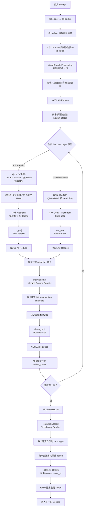

# Qwen3.5 Hybrid 在 4×RTX 3090、TP=4 下的多卡推理完整流程

> **范围说明**：本文只讨论项目中 **Qwen3.5 Hybrid 适配版、未融合 KV Cache 压缩**的普通推理链路。重点回答一个问题：**一个请求进来以后，四张 GPU 分别保存什么、计算什么，Attention/MLP 在哪里按列切、哪里按行切，以及什么时候发生 NCCL 通信。**
>
> 本文不展开 Qwen3.6、KV Cache 压缩、MTP 等后续能力。

---

# 1. 先记住整个 TP=4 的核心

这个项目中的 TP（Tensor Parallel，张量并行）不是：

```text
GPU0 算 Prompt 的前 1/4 Token
GPU1 算 Prompt 的第 2/4 Token
GPU2 算 Prompt 的第 3/4 Token
GPU3 算 Prompt 的最后 1/4 Token
```

而是：

```text
四张卡处理同一批 Token
        ↓
每张卡只保存模型大权重的一部分
        ↓
每张卡计算一部分 Head / 一部分 MLP 通道
        ↓
需要合并结果的位置通过 NCCL 通信
```

因此，TP=4 的本质是：

> **Token 不切，模型内部的特征维度和权重切。**

项目中最重要的两种切法：

1. **Column Parallel**：按输出维切权重。每张卡直接得到不同的一部分输出，通常不立即通信。
2. **Row Parallel**：按输入维切权重。每张卡得到完整输出的一个“部分和”，随后通过 `All-Reduce(sum)` 合并。

数学上，线性层写成：

\[
Y=XW
\]

Column Parallel：

\[
W=[W_0,W_1,W_2,W_3]
\]

所以四张卡分别得到：

\[
Y_i=XW_i
\]

这是不同的输出块，不需要立刻相加。

Row Parallel：

\[
X=[X_0,X_1,X_2,X_3]
\]

\[
W=
\begin{bmatrix}
W_0\\W_1\\W_2\\W_3
\end{bmatrix}
\]

于是：

\[
Y=X_0W_0+X_1W_1+X_2W_2+X_3W_3
\]

每张卡只能算一项，所以最后必须：

```text
NCCL All-Reduce(sum)
```

---

# 2. 四张 GPU 在软件中是什么关系

源码核心：

```text
nanovllm/engine/llm_engine.py
nanovllm/engine/model_runner.py
```

TP=4 时，项目启动 4 个 `ModelRunner`：

```text
rank 0 → GPU0
rank 1 → GPU1
rank 2 → GPU2
rank 3 → GPU3
```

每个进程都会执行：

```python
dist.init_process_group("nccl", ..., world_size=4, rank=rank)
torch.cuda.set_device(rank)
```

所以：

```text
TP = 决定模型怎样切
NCCL = 负责四张 GPU 之间真正的数据通信
```

rank0 上的 Scheduler 决定本轮处理哪些请求，然后四个 rank 同时执行同一轮模型 Forward。

---

# 3. 一张图看懂一次请求的四卡完整链路



这张图可以压缩成一句话：

> **Embedding 通信一次；每个 Decoder Layer 的 Token Mixing 输出通信一次、MLP 输出再通信一次；最后 LM Head 做一次小规模候选 All-Gather。**

---

# 4. 第一步：Embedding 怎么切

源码：

```text
nanovllm/layers/embed_head.py
VocabParallelEmbedding
```

Embedding 权重原本是：

```text
[vocab_size, hidden_size]
```

TP=4 后沿 **vocab 维**切：

```text
GPU0：词表第 0/4
GPU1：词表第 1/4
GPU2：词表第 2/4
GPU3：词表第 3/4
```

同一个 Token ID 会同时发送给四张卡。

假设这个 Token 属于 GPU1 的词表范围：

```text
GPU0 → 输出 0
GPU1 → 正常查表得到 embedding
GPU2 → 输出 0
GPU3 → 输出 0
```

然后源码执行：

```python
dist.all_reduce(y)
```

四张卡相加后，都得到相同的完整：

```text
hidden_states: [N, hidden_size]
```

所以 Decoder Layer 的入口处，四卡都有完整 Hidden State。

---

# 5. Full Attention：哪里列切，哪里行切

源码：

```text
nanovllm/models/qwen3_5.py
Qwen3_5Attention
```

项目里的 Full Attention 主要是：

```text
hidden_states
   ↓
q_proj ─┐
k_proj ─┼→ Attention → o_proj
v_proj ─┘
```

## 5.1 Q/K/V：Column Parallel

源码中：

```python
self.q_proj = ColumnParallelLinear(...)
self.k_proj = ColumnParallelLinear(...)
self.v_proj = ColumnParallelLinear(...)
```

因此 Q/K/V 都沿 **输出维**切。

Qwen3.5-27B 的 Full Attention 全局有：

```text
Q Heads  = 24
KV Heads = 4
TP       = 4
```

因此每张卡负责：

```text
6 个 Q Heads
1 个 K Head
1 个 V Head
```

可以理解成：

```text
完整 Q：
[Q0 Q1 Q2 ... Q23]

GPU0 → Q0~Q5
GPU1 → Q6~Q11
GPU2 → Q12~Q17
GPU3 → Q18~Q23
```

K/V 同理，每卡 1 个 KV Head。

**这里不用 All-Gather。**

因为每张卡已经拥有完成本地 Attention 所需的 Q/K/V 分片。

---

## 5.2 Attention 本身：各卡本地算

经过 Q/K/V 投影后：

```text
GPU0 → 自己的 6Q + 1K + 1V
GPU1 → 自己的 6Q + 1K + 1V
GPU2 → 自己的 6Q + 1K + 1V
GPU3 → 自己的 6Q + 1K + 1V
```

Full Attention 的 KV Cache 也按照 KV Head 分片：

```text
GPU0 保存 KV Head 0 的历史 KV
GPU1 保存 KV Head 1 的历史 KV
GPU2 保存 KV Head 2 的历史 KV
GPU3 保存 KV Head 3 的历史 KV
```

所以 Attention 计算时不需要先把四张卡的 KV Cache Gather 到一起。

即：

```text
Q/K/V Column Parallel
        ↓
各卡本地 Attention
        ↓
得到各自的局部 Attention 输出
```

---

## 5.3 o_proj：Row Parallel + All-Reduce

源码：

```python
self.o_proj = RowParallelLinear(...)
```

Attention 结束以后，各卡只有一部分 Head 的输出。

这些局部 Head 正好作为 `o_proj` 的局部输入：

```text
GPU0：自己的 Attention Head → W0
GPU1：自己的 Attention Head → W1
GPU2：自己的 Attention Head → W2
GPU3：自己的 Attention Head → W3
```

每张卡算：

```text
partial_output_i
```

`RowParallelLinear.forward()` 最后执行：

```python
dist.all_reduce(y)
```

于是：

```text
GPU0 partial ┐
GPU1 partial ├→ All-Reduce(sum) → 完整 [N, hidden_size]
GPU2 partial ┤
GPU3 partial ┘
```

所以 Full Attention 最好记成：

```text
Q/K/V：Column Parallel
        ↓
Attention：本地计算
        ↓
o_proj：Row Parallel
        ↓
All-Reduce
```

---

# 6. Gated DeltaNet：四卡怎么分

源码：

```text
nanovllm/layers/gated_delta_net.py
GatedDeltaNet
```

Qwen3.5 Hybrid 并不是每层都是 Full Attention。

`Qwen3_5DecoderLayer` 会读取：

```python
config.layer_types[layer_idx]
```

如果是 `full_attention`，走前面的 Full Attention；否则走 Gated DeltaNet。

GDN 初始化时直接读取 TP world size：

```python
self.num_v_heads = total_num_v_heads // tp_size
self.num_k_heads = total_num_k_heads // tp_size
```

也就是说 GDN 同样是**按 Head 分片**。

它的 Q/K/V 权重虽然不是简单直接使用一个 `ColumnParallelLinear`，但 `qkv_weight_loader()` 会根据 `tp_rank` 从完整权重中只加载本 rank 的 Q/K/V Head，因此效果仍然是：

```text
GPU0 → GDN Head 分片0
GPU1 → GDN Head 分片1
GPU2 → GDN Head 分片2
GPU3 → GDN Head 分片3
```

`in_proj_z / in_proj_a / in_proj_b` 则明确使用 `ColumnParallelLinear`。

随后每张卡只用自己的局部数据执行：

```text
causal conv1d
recurrent gated delta rule
conv state 更新
recurrent state 更新
```

这些 GDN State 都是 **rank-local** 的，不需要每一步把 state 在四张卡之间同步。

最后：

```python
self.out_proj = RowParallelLinear(...)
```

因此 GDN 和 Full Attention 的通信结构其实高度相似：

```text
输入投影：按输出/Head 分片
        ↓
本卡 GDN 计算 + 本卡 State
        ↓
out_proj：Row Parallel
        ↓
NCCL All-Reduce
```

---

# 7. MLP：最标准的 Column → Row 组合

源码：

```text
nanovllm/models/qwen3_5.py
Qwen3_5MLP
```

结构：

```python
gate_up_proj = MergedColumnParallelLinear(...)
down_proj = RowParallelLinear(...)
```

完整流程：

```text
hidden_states [N, H]
        ↓
gate_proj + up_proj
Merged Column Parallel
        ↓
GPU0：1/4 intermediate channels
GPU1：1/4 intermediate channels
GPU2：1/4 intermediate channels
GPU3：1/4 intermediate channels
        ↓
各卡本地执行 SwiGLU
        ↓
down_proj
Row Parallel
        ↓
四卡各得到 partial output
        ↓
NCCL All-Reduce(sum)
        ↓
完整 [N, H]
```

Qwen3.5-27B 的：

```text
intermediate_size = 17408
```

TP=4 后每卡大约负责：

```text
17408 / 4 = 4352
```

个 MLP 中间通道。

这里特别适合面试时解释为什么 **Column Parallel 和 Row Parallel 经常成对出现**：

> Column Parallel 先把大中间维拆到四张卡上，中间激活完全本地计算；紧接着 Row Parallel 直接消费这份已经分片的输入，最后一次 All-Reduce 就恢复完整 Hidden State，中间不需要额外 All-Gather。

---

# 8. 为什么每层结束后四张卡又都有完整 Hidden State

每个 Decoder Layer 可以抽象成：

```text
完整 hidden_states
        ↓
Token Mixing
    ├─ Full Attention
    └─ GDN
        ↓
Row Parallel + All-Reduce
        ↓
完整 hidden_states
        ↓
MLP Column Parallel
        ↓
MLP Row Parallel + All-Reduce
        ↓
完整 hidden_states
```

所以最重要的规律是：

> **层内部会暂时把特征切开，但在关键 Row Parallel 后通过 All-Reduce 恢复，因此下一层入口处四张 GPU 又拥有相同的完整 Hidden State。**

这也是为什么不能简单理解成：

```text
hidden_size=5120
TP=4
所以每张卡整个网络一直只拿 1280 维
```

这是错误的。

正确理解是：

```text
层边界：每卡完整 H
层内部：某些投影输出被切成 1/4
Row Parallel 后：再次恢复完整 H
```

---

# 9. LM Head 和最终采样怎么通信

源码：

```text
nanovllm/layers/embed_head.py
ParallelLMHead

nanovllm/engine/model_runner.py
sample()
```

LM Head 与 Embedding 一样按词表切分。

所以：

```text
GPU0 → vocab shard 0 的 logits
GPU1 → vocab shard 1 的 logits
GPU2 → vocab shard 2 的 logits
GPU3 → vocab shard 3 的 logits
```

当前这条代码路径没有先把完整词表 logits 全部 Gather 到 rank0。

而是每张卡先在自己的 local logits 中选择候选：

```text
GPU0 → local token0 + score0
GPU1 → local token1 + score1
GPU2 → local token2 + score2
GPU3 → local token3 + score3
```

随后：

```python
dist.all_gather(all_scores, scores)
dist.all_gather(all_token_ids, token_ids)
```

rank0 比较四张卡的候选，得到全局最终 Token。

所以 LM Head 可以记成：

```text
Vocab Parallel
   ↓
Local Logits
   ↓
每卡本地选候选
   ↓
All-Gather 少量候选
   ↓
rank0 得到最终 Token
```

---


# 10. 用一次 Decode batch=8 把四卡数据流真正走一遍

下面用你项目采用的 Qwen3.5-27B 配置举例。关键参数为：

```text
hidden_size          = 5120
num_attention_heads  = 24
num_key_value_heads  = 4
head_dim              = 256
intermediate_size     = 17408
TP                    = 4
Decode batch          = 8
```

此时进入某个 Decoder Layer 的输入，在四张卡上都是：

```text
hidden_states = [8, 5120]
```

注意：这是**四卡各有一份完整的 `[8,5120]`**，不是每卡只有 `[8,1280]`。

## 10.1 如果这一层是 Full Attention

### 第一步：Q 投影

Qwen3.5 的 `q_proj` 不只产生 Q，还同时产生 output gate，因此全局输出宽度为：

```text
24 heads × 256 × 2 = 12288
```

Column Parallel 后每卡：

```text
12288 / 4 = 3072
```

所以：

```text
GPU0: q_gate [8, 3072]
GPU1: q_gate [8, 3072]
GPU2: q_gate [8, 3072]
GPU3: q_gate [8, 3072]
```

reshape 并拆开以后，每张卡得到：

```text
q    : [8, 6, 256]
gate : [8, 6, 256]
```

这就是“Q 按 Head 切”。

### 第二步：K/V 投影

全局 KV Heads 为 4，TP=4，因此每卡只负责 1 个 KV Head：

```text
k: [8, 1, 256]
v: [8, 1, 256]
```

四卡分别拥有不同的 KV Head。

历史 KV Cache 也对应这样分布，所以 GPU0 的 Query 只需要访问 GPU0 本地保存的 KV Head 分片，不需要把其它三张卡的 KV Cache 搬过来。

### 第三步：Attention 本地计算

每卡最终得到自己的 6 个 Query Head 的 Attention 输出：

```text
local attention output = [8, 6, 256]
```

展平：

```text
[8, 1536]
```

到这里仍然没有跨卡通信。

### 第四步：o_proj

`o_proj` 是 Row Parallel。

四张卡分别拿自己的 `[8,1536]` 输入做局部矩阵乘，都会产生：

```text
partial output = [8, 5120]
```

但是这四个 `[8,5120]` 都只是部分和。

所以执行：

```text
All-Reduce(sum)
```

最终四卡都得到：

```text
attention output = [8, 5120]
```

这时 Attention 子层结束。

---

## 10.2 如果这一层是 Gated DeltaNet

GDN 的思路也一样：**输入完整，内部 Head 分片，输出再 All-Reduce。**

以项目配置为例：

```text
linear key heads   = 16 → 每卡 4
linear value heads = 48 → 每卡 12
key head dim       = 128
value head dim     = 128
```

因此每卡：

```text
Q/K local width = 4  × 128 = 512
V local width   = 12 × 128 = 1536
```

`in_proj_qkv` 的本地输出宽度为：

```text
512 + 512 + 1536 = 2560
```

所以四张卡都输入 `[8,5120]`，但各自只产生自己的 GDN Head 分片。

接下来：

```text
GPU0：local Q/K/V → local conv state → local recurrent state
GPU1：local Q/K/V → local conv state → local recurrent state
GPU2：local Q/K/V → local conv state → local recurrent state
GPU3：local Q/K/V → local conv state → local recurrent state
```

这里的 conv/recurrent state 不需要 All-Gather，因为每个 rank 的状态本来就是它所负责 Head 的状态。

最后 `out_proj` 是 Row Parallel：

```text
local GDN output [8,1536]
        ↓
local partial [8,5120]
        ↓
All-Reduce(sum)
        ↓
完整 [8,5120]
```

所以从“多卡通信结构”看，GDN 和 Full Attention 非常统一：

```text
前半段：分片、本地算
后半段：Row Parallel
最后：All-Reduce
```

---

## 10.3 接着进入同一层的 MLP

此时四张卡重新都有：

```text
[8,5120]
```

`gate_up_proj` 是 Merged Column Parallel。

全局 intermediate size：

```text
17408
```

TP=4 后，每卡：

```text
17408 / 4 = 4352
```

因此每卡分别计算：

```text
gate local: [8,4352]
up   local: [8,4352]
```

然后直接在本卡执行：

```text
SiLU(gate) × up
```

输出仍是：

```text
[8,4352]
```

这里不需要通信。

紧接着 `down_proj` 是 Row Parallel：

```text
GPU0 [8,4352] → partial [8,5120]
GPU1 [8,4352] → partial [8,5120]
GPU2 [8,4352] → partial [8,5120]
GPU3 [8,4352] → partial [8,5120]
```

执行一次：

```text
All-Reduce(sum)
```

得到：

```text
[8,5120]
```

至此一个完整 Decoder Layer 结束，并进入下一层。

因此，无论这一层前半部分是 Full Attention 还是 GDN，一个普通 Decoder Layer 的主干通信都可以记成：

```text
Token Mixing out_proj
        ↓
All-Reduce #1
        ↓
MLP gate/up + SwiGLU
        ↓
MLP down_proj
        ↓
All-Reduce #2
```

如果模型配置为 64 个 Decoder Layer，那么一次完整主干 Forward 中，仅这两类 Row Parallel 就会逻辑上出现：

```text
64 × 2 = 128 次 All-Reduce
```

这也是为什么 TP 卡数继续增加时，计算量虽然下降，但 NCCL 通信占比会越来越重要。

---

# 11. 一张表看清所有“切分点”和“通信点”

| 模块 | TP 切法 | 每卡拿什么 | 模块结束是否通信 |
|---|---|---|---|
| Embedding | Vocab Parallel | 1/4 词表 | **All-Reduce** |
| Full Attention `q_proj` | Column Parallel | 1/4 Q Heads | 不通信 |
| Full Attention `k_proj/v_proj` | Column Parallel | 1/4 KV Heads | 不通信 |
| Full Attention 核心计算 | Head Local | 本卡 Q/K/V + 本卡 KV Cache | 不通信 |
| Full Attention `o_proj` | Row Parallel | 1/4 Attention 输入 | **All-Reduce** |
| GDN 输入投影 | Head/Output 分片 | 本卡 GDN Heads | 不通信 |
| GDN Conv/Recurrent | Head Local | 本卡 state | 不通信 |
| GDN `out_proj` | Row Parallel | 1/4 GDN 输出通道 | **All-Reduce** |
| MLP `gate/up` | Column Parallel | 1/4 intermediate | 不通信 |
| SwiGLU | Local | 本卡 intermediate | 不通信 |
| MLP `down_proj` | Row Parallel | 1/4 intermediate 输入 | **All-Reduce** |
| LM Head | Vocab Parallel | 1/4 vocab logits | 不 Gather 全词表 |
| Sampling | Local candidate | 每卡候选 token/score | **All-Gather 候选** |

从这张表可以看到项目的 TP 设计非常有规律：

> **能保持分片继续往下算，就不通信；只有下一阶段必须重新拥有完整 Hidden State 时，才用 All-Reduce 合并。**


# 12. Prefill 和 Decode 的多卡切法会变吗？

**不会。**

Prefill 与 Decode 主要区别是 Token 数量和 Attention 历史状态的使用方式：

```text
Prefill：
一次处理 Prompt 的多个 Token

Decode：
每个请求每轮通常只处理一个新 Token
```

但 TP 切分方式保持相同：

```text
Embedding     → Vocab Parallel
Q/K/V         → Column Parallel
Attention     → 本地 Head
o_proj        → Row Parallel + All-Reduce

GDN           → 本地 Head / 本地 State
out_proj      → Row Parallel + All-Reduce

MLP gate/up   → Column Parallel
MLP down      → Row Parallel + All-Reduce

LM Head       → Vocab Parallel
Sampling      → All-Gather 小候选
```

所以 TP 是**模型维度的长期固定切分策略**，不是 Prefill 和 Decode 临时决定的。

---

# 13. 最后用一张“背诵图”结束

```mermaid
flowchart LR
    A["Token IDs"] --> B["Embedding<br/>Vocab切"]
    B -->|"All-Reduce"| C["完整 Hidden"]

    C --> D{"Layer Type"}

    D -->|Full Attention| E["Q/K/V<br/>Column切"]
    E --> F["Local Attention"]
    F --> G["o_proj<br/>Row切"]

    D -->|GDN| H["Q/K/V/Z/A/B<br/>按Head/输出切"]
    H --> I["Local GDN State"]
    I --> J["out_proj<br/>Row切"]

    G -->|"All-Reduce"| K["完整 Hidden"]
    J -->|"All-Reduce"| K

    K --> L["MLP gate/up<br/>Column切"]
    L --> M["Local SwiGLU"]
    M --> N["down_proj<br/>Row切"]
    N -->|"All-Reduce"| O["完整 Hidden"]

    O --> P["下一 Decoder Layer"]
    O --> Q["最后一层后 Final Norm"]
    Q --> R["LM Head<br/>Vocab切"]
    R --> S["Local Candidate"]
    S -->|"All-Gather"| T["rank0 选全局 Token"]
```



---

# 14. 面试时只需要背住这 8 句话

1. **TP=4 不是把 Token 分给四张卡，而是四张卡同时处理同一批 Token，切的是模型权重和特征维。**
2. **Column Parallel 沿输出维切，每卡得到不同输出块，通常不立即通信。**
3. **Row Parallel 沿输入维切，每卡得到部分和，最后必须 All-Reduce。**
4. **Qwen3.5 Full Attention 的 Q/K/V 都按 Head 做 Column Parallel，Attention 在本卡直接完成。**
5. **Attention 的 `o_proj` 是 Row Parallel，因此结束后 All-Reduce，恢复完整 Hidden State。**
6. **GDN 的 Head、Conv State 和 Recurrent State 都按 TP rank 本地维护，最终 `out_proj` 再 All-Reduce。**
7. **MLP 是 `gate/up Column Parallel → 本地 SwiGLU → down Row Parallel → All-Reduce`。**
8. **LM Head 按 Vocabulary 切，每卡先选本地候选，再 All-Gather 候选给 rank0 决定最终 Token。**

---

# 15. 对应源码文件

如果面试前只复习多卡通信，重点看以下文件即可：

```text
nanovllm/engine/llm_engine.py
    └── 创建 TP worker / ModelRunner

nanovllm/engine/model_runner.py
    ├── NCCL process group 初始化
    ├── Prefill / Decode
    └── sample() 中候选 All-Gather

nanovllm/layers/linear.py
    ├── ColumnParallelLinear
    ├── MergedColumnParallelLinear
    └── RowParallelLinear → dist.all_reduce

nanovllm/layers/embed_head.py
    ├── VocabParallelEmbedding → dist.all_reduce
    └── ParallelLMHead → local logits

nanovllm/models/qwen3_5.py
    ├── Qwen3_5Attention
    │   ├── q/k/v：Column Parallel
    │   └── o_proj：Row Parallel
    ├── Qwen3_5MLP
    │   ├── gate_up_proj：Merged Column Parallel
    │   └── down_proj：Row Parallel
    └── Qwen3_5DecoderLayer
        └── Full Attention / Gated DeltaNet 二选一

nanovllm/layers/gated_delta_net.py
    ├── Q/K/V Head 按 rank 切
    ├── Conv/Recurrent State 本地维护
    └── out_proj：Row Parallel
```

**最终总口诀：**

```text
输入词表切，先 All-Reduce；
Attention/GDN 前面按输出切，后面 Row Parallel 再 All-Reduce；
MLP 先 Column、后 Row，再 All-Reduce；
最后词表再切，本地选候选，All-Gather 得到最终 Token。
```


%% 项目关联导航：开始 %%
## 项目关联导航

- 所属模块：[[outputs/项目整理/模块-nanovllm项目面试准备|模块-nanovllm项目面试准备]]

%% 项目关联导航：结束 %%
