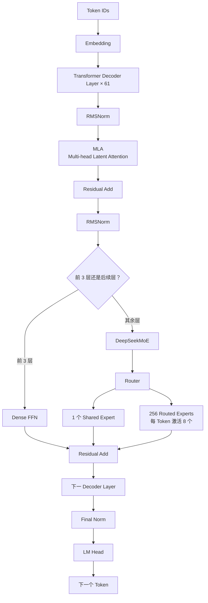

# DeepSeek-R1 模型结构详解：与 Qwen3 的联系和区别

> **定位**：本文面向 AI Infra / 大模型推理面试，重点讲清楚 DeepSeek-R1 的模型结构是什么、一次 Decoder Layer 内部怎么走，以及它和 Qwen3 在 Attention、FFN/MoE、推理方式上的联系与区别。
>
> **范围说明**：这里的 DeepSeek-R1 指完整的 DeepSeek-R1 671B，不是 `DeepSeek-R1-Distill-Qwen-*`。R1 的主体模型建立在 DeepSeek-V3 架构之上，因此理解 R1 的“模型结构”，本质上首先要理解 DeepSeek-V3 的 **MLA + DeepSeekMoE**。

---

# 1. 先给结论：DeepSeek-R1 到底是什么结构？

DeepSeek-R1 并不是重新发明了一种全新的神经网络结构。

从模型骨干看，它继承 DeepSeek-V3，是一个：

```text
Decoder-Only Transformer
        +
Multi-head Latent Attention（MLA）
        +
DeepSeekMoE
        +
Multi-Token Prediction（MTP）
```

完整模型约 **671B 总参数**，但因为使用 MoE，每个 Token 实际只激活约 **37B 参数**。

R1 最有代表性的创新其实不在“网络骨干”，而在**后训练方法**：它通过冷启动数据、强化学习等方式强化长链推理能力。

所以面试时不要回答：

> “DeepSeek-R1 最大特点就是提出了一个新的 Transformer 结构。”

更准确的说法是：

> **R1 的底层架构主要继承 DeepSeek-V3，架构侧最核心的是 MLA 和 DeepSeekMoE；R1 自身最突出的贡献则是通过大规模强化学习把这个强大的 Base Model 训练成了推理模型。**

---

# 2. DeepSeek-R1 的整体结构

从一个 Token 进入模型开始，可以把完整流程简化成：



DeepSeek-V3/R1 主干共有 **61 个 Transformer Layer**，hidden size 为 **7168**。

传统 Transformer Block 通常可以记成：

```text
Attention
   +
FFN
```

而 R1 更准确地是：

```text
MLA
   +
Dense FFN / DeepSeekMoE
```

---

# 3. 第一大核心：MLA 是什么？

MLA 全称：

> **Multi-head Latent Attention，多头潜变量注意力**

这是 DeepSeek 和 Qwen3 在模型结构上非常重要的区别之一。

## 3.1 Qwen3 怎么保存 KV Cache？

Qwen3 Dense 模型采用的是 **GQA（Grouped Query Attention）**。

基本形式仍然是：

```text
hidden_states
     ↓
Q projection
K projection
V projection
     ↓
Q × K
     ↓
Softmax
     ↓
Attention × V
```

Decode 时为了避免每生成一个 Token 都重新计算以前 Token 的 K/V，需要把历史：

```text
K Cache
V Cache
```

保存下来。

Qwen3 已经通过 GQA 减少了 KV Head 数量，因此比普通 MHA 节省 KV Cache。

---

## 3.2 DeepSeek 为什么还要设计 MLA？

DeepSeek 的想法进一步：

> 与其把每个历史 Token 完整的 K 和 V 都保存下来，能不能先把它们压缩成一个更小的潜变量？

于是 MLA 会先计算一个低维的：

```text
KV latent
```

可以简单理解为：

```text
hidden state
      ↓
Down Projection
      ↓
压缩后的 c_KV
      ↓
需要 Attention 时再通过 Up Projection
      ↓
恢复出参与 Attention 的 K / V 信息
```

因此 Decode 时主要 Cache 的不再是传统完整 K/V，而是更紧凑的潜变量以及与位置编码相关的部分。

核心目的：

> **减少 KV Cache 显存，从而提高长上下文和高并发推理能力。**

---

# 4. MLA 为什么还要“解耦 RoPE”？

传统 Attention 往往直接对 Q 和 K 应用 RoPE：

```text
Q → RoPE
K → RoPE
```

但是 DeepSeek 又希望 K/V 可以先进行低秩压缩。如果位置编码和内容表示完全混在一起，会让压缩和高效推理更困难。

因此 MLA 把 Key 大致拆成：

```text
内容相关部分
+
携带 RoPE 的位置相关部分
```

推理过程中主要缓存：

```text
压缩后的 KV latent
+
RoPE Key 部分
```

所以要注意：

> **MLA 不是“给 KV Cache 做量化”，而是从 Attention 结构本身改变 K/V 的表示方式，通过低秩潜变量减少需要长期保存的数据。**

---

# 5. 第二大核心：DeepSeekMoE

DeepSeek-R1 的另一个关键结构是 MoE。

MoE 全称：

> **Mixture of Experts，混合专家模型**

传统 Qwen3 Dense 的 MLP 是：

```text
hidden
  ↓
gate_proj / up_proj
  ↓
SwiGLU
  ↓
down_proj
  ↓
hidden
```

所有 Token 都经过同一套 FFN 参数。

DeepSeekMoE 会把 FFN 拆成很多小专家：

```text
Token
 ↓
Router
 ↓
选择少数专家
 ↓
Expert FFN
 ↓
加权合并
```

DeepSeek-V3/R1 中，除前 3 层之外，其余 FFN 基本换成 MoE。

每个 MoE Layer 包含：

```text
1 个 Shared Expert
256 个 Routed Experts
每个 Token 选择 8 个 Routed Experts
```

---

# 6. Shared Expert 和 Routed Expert

## Shared Expert

Shared Expert 可以理解成：

> **所有 Token 都会经过的公共专家。**

它负责学习比较通用、多个 Token 都需要的能力。

## Routed Expert

Routed Expert 则由 Router 根据当前 Token 动态选择。

例如：

```text
Token A → Expert 3、17、28、...
Token B → Expert 6、20、91、...
```

虽然模型拥有 256 个 Routed Experts，但一个 Token 只使用其中 8 个。

所以模型可以拥有巨大的**总参数容量**，同时避免每生成一个 Token 都计算全部参数。

这就是：

```text
总参数：671B
实际激活：约 37B
```

背后的基本原因。

---

# 7. Qwen3 也有 MoE：不能简单说“DeepSeek 是 MoE，Qwen 是 Dense”

Qwen3 是一个**模型家族**，同时包含：

```text
Qwen3 Dense
+
Qwen3 MoE
```

例如：

```text
Qwen3-32B        → Dense
Qwen3-30B-A3B    → MoE
Qwen3-235B-A22B  → MoE
```

其中 Qwen3-235B-A22B 总参数约 235B，每 Token 激活约 22B。

Qwen3-MoE 共有：

```text
128 个 Experts
每 Token 激活 8 个
```

所以如果面试官问：

> DeepSeek-R1 和 Qwen3 最大结构区别是不是一个 MoE、一个 Dense？

不能直接说“是”。

更准确的回答是：

> **Qwen3 同时有 Dense 和 MoE 版本。若拿 R1 和 Qwen3-32B 比，确实是 MoE 对 Dense；但若拿 R1 和 Qwen3-235B-A22B 比，两者都是 MoE，只是专家设计和 Attention 结构不同。**

---

# 8. DeepSeekMoE 和 Qwen3-MoE 的区别

两者共同点都是：

```text
Router
 ↓
从多个 Expert 中选少量 Expert
 ↓
只计算激活专家
```

但设计不同。

### DeepSeek-R1 / DeepSeek-V3

```text
256 Routed Experts
每 Token 激活 8 个
+
1 个 Shared Expert
```

### Qwen3-MoE

```text
128 Experts
每 Token 激活 8 个
不使用 Shared Expert
```

Qwen3 同样采用细粒度专家划分思路，但专家数量和共享专家设计不同。

二者的共同目标是：

> **用稀疏激活换取“大参数容量 + 相对较低的单 Token 计算量”。**

---

# 9. Attention：MLA 与 GQA 是最值得记住的结构区别

如果面试官只让你说一个模型结构层面的最大区别，优先回答：

> **DeepSeek-R1 使用 MLA，而经典 Qwen3 使用 GQA。**

| 项目 | DeepSeek-R1 | Qwen3 |
|---|---|---|
| 基础结构 | Decoder-only Transformer | Decoder-only Transformer |
| Attention | **MLA** | **GQA** |
| KV Cache 思路 | 缓存压缩后的 KV latent 等信息 | 缓存较少 KV Heads 的 K/V |
| FFN | 前几层 Dense，随后 DeepSeekMoE | Dense 版 SwiGLU；MoE 版专家 FFN |
| MoE 专家 | 256 Routed + 1 Shared，Top-8 | 128 Experts，Top-8，无 Shared Expert |
| Norm | RMSNorm | RMSNorm |
| 位置编码 | RoPE，MLA 内有解耦设计 | RoPE |
| 推理能力 | R1 后训练强化长链推理 | Thinking / Non-thinking 融合 |

两者目标其实相近：

```text
DeepSeek：
MLA → 重点减少 KV Cache
MoE → 减少每 Token 实际计算

Qwen3：
GQA → 减少 KV Cache
MoE → 减少每 Token 实际计算
```

只是 DeepSeek 在 Attention 上进一步引入低秩 latent 压缩。

---

# 10. MTP：DeepSeek 架构里的另一个重要点

DeepSeek-V3 还引入：

> **MTP，Multi-Token Prediction**

传统语言模型训练：

```text
当前状态
 ↓
预测下一个 Token
```

MTP 会额外预测更后面的 Token。DeepSeek-V3 的 MTP depth 为 1，即在标准 next-token 目标之外，再增加一个未来 Token 的预测目标。

它有两个意义：

1. **训练阶段**：提供更密集的训练信号；
2. **推理阶段**：可以进一步用于 speculative decoding 一类推理加速。

因此 MTP 也是 DeepSeek-V3/R1 架构中很值得面试时提到的一点。

---

# 11. “思考模型”层面，R1 和 Qwen3 又有什么区别？

这里一定要区分：

```text
模型架构
```

和：

```text
后训练方法
```

R1 的强推理能力并不是因为 MLA 天生会“思考”。

MLA 主要解决：

```text
KV Cache / 推理效率
```

MoE 主要解决：

```text
参数容量 / 计算效率
```

R1 的长链推理能力主要来自后训练，尤其是强化学习。

R1-Zero 展示了通过大规模强化学习可以出现自我反思、验证、长链推理等行为；正式 R1 又加入冷启动数据和多阶段训练，改善可读性和通用能力。

Qwen3 的思路则更强调把：

```text
Thinking Mode
+
Non-Thinking Mode
```

融合到同一个模型里。

用户可以根据任务决定：

```text
复杂数学/代码 → Thinking
简单问答       → Non-Thinking
```

并通过 Thinking Budget 控制推理长度和计算量。

因此可以简单理解：

> **R1 更强调“通过强化学习训练出强推理模型”，而 Qwen3 更强调“同一个模型同时兼顾深度思考和快速回答”。**

---

# 12. 为什么 DeepSeek-R1 对 AI Infra 更有挑战？

从推理框架角度，R1 比普通 Dense Qwen 模型复杂得多。

## 12.1 MLA

推理框架不能完全照搬普通：

```text
K Cache + V Cache
```

的数据组织，而需要针对 MLA latent 做专门的 Attention 和 Cache 优化。

## 12.2 MoE

专家通常分散在多张 GPU 上。Token 经过 Router 后可能要被发送到另一张卡上的专家：

```text
Token
 ↓
Router
 ↓
跨卡 Dispatch
 ↓
Expert 计算
 ↓
跨卡 Combine
```

因此会出现大量：

```text
Expert Parallel
All-to-All
Dispatch
Combine
```

通信。

这和普通 TP 中大量使用 All-Reduce 的通信模式不同。

## 12.3 长 CoT

R1 常生成较长思考序列。

生成 Token 越多：

```text
Decode 时间越长
Cache 占用越高
调度器长期维护请求
```

所以 Continuous Batching、Prefix Cache、PD 分离、投机解码、专家并行和通信优化，对 R1 服务都更加重要。

---

# 13. 最后把两者联系起来

从最高层看，DeepSeek-R1 和 Qwen3 是同一时代两条相近的技术路线。

共同点：

```text
Decoder-only Transformer
RMSNorm
RoPE
SwiGLU/FFN
自回归生成
支持 MoE
通过后训练强化推理
重视推理效率
```

区别可以浓缩成：

```text
DeepSeek-R1
│
├── Attention：MLA
│       └── latent compression 降低 KV Cache
│
├── FFN：DeepSeekMoE
│       └── 256 Routed + Shared Expert
│
├── MTP
│
└── 后训练：重点依靠 RL 激发长链推理


Qwen3
│
├── Attention：GQA
│       └── 减少 KV Heads 降低 KV Cache
│
├── Dense + MoE 两个系列
│       └── MoE 为 128 Experts、Top-8
│
└── 后训练
        └── Thinking + Non-Thinking 融合
            + Thinking Budget
```

---

# 14. 面试时的一段完整回答

> DeepSeek-R1 如果从模型结构看，本质上继承的是 DeepSeek-V3，它仍然属于 Decoder-only Transformer，但和普通 Qwen3 相比有两个特别核心的变化。第一个是 Attention 使用 MLA，而 Qwen3 主要使用 GQA。GQA 是减少 KV Head 数量来降低 KV Cache，而 MLA 更进一步，把 K、V 压到一个低维 latent 中，推理时主要缓存压缩后的表示，所以在长上下文场景下更节省 KV Cache。第二个是 FFN，R1 大部分层使用 DeepSeekMoE，有 256 个 Routed Expert，每个 Token 只激活 8 个，同时还有 Shared Expert，所以虽然总参数达到 671B，但每个 Token 实际只激活大约 37B。Qwen3 其实也有 MoE 版本，比如 235B-A22B，所以不能简单说 DeepSeek 是 MoE、Qwen 是 Dense；真正明显的架构区别还是 MLA 和 GQA，以及两家的专家设计不同。另外 R1 的强推理能力主要不是来自 MLA 或 MoE，而是来自后训练阶段的大规模强化学习；Qwen3 则把 Thinking 和 Non-Thinking 两种模式统一进了一个模型。这几个点是我理解两者最核心的联系和区别。

---

# 15. 面试最应该记住的 6 个结论

1. **DeepSeek-R1 的骨干主要继承 DeepSeek-V3，不要把 R1 的 RL 创新和模型结构创新混为一谈。**
2. **R1 = Decoder Transformer + MLA + DeepSeekMoE + MTP。**
3. **R1 与经典 Qwen3 最重要的 Attention 区别是 MLA vs GQA。**
4. **MLA 与 GQA 都想降低 KV Cache，但 MLA 使用低秩 latent 压缩，结构改动更深入。**
5. **Qwen3 也有 MoE，不能说“DeepSeek 是 MoE、Qwen3 是 Dense”。**
6. **R1 的推理能力主要来自强化学习；Qwen3 则融合 Thinking / Non-Thinking，并提供 Thinking Budget。**

---

# 参考资料

本文结构参数与训练机制主要依据：

1. **DeepSeek-R1: Incentivizing Reasoning Capability in LLMs via Reinforcement Learning**
2. **DeepSeek-V3 Technical Report**
3. **DeepSeek-V3 官方开源仓库**
4. **Qwen3 Technical Report**
5. **Qwen3: Think Deeper, Act Faster**


%% 项目关联导航：开始 %%
## 项目关联导航

- 所属模块：[[outputs/项目整理/模块-nanovllm项目面试准备|模块-nanovllm项目面试准备]]

%% 项目关联导航：结束 %%
