# 从 Qwen3 Dense 到 Qwen3.5 Hybrid：nano-vLLM 项目模型结构全链路学习文档

> **适用对象**：准备 AI Infra、推理框架、大模型系统或算子方向面试，希望真正理解本项目中 Qwen3 与 Qwen3.5 模型结构的人。  
> **核心目标**：不仅能背出模型结构，还能解释一次 Forward 如何执行、Prefill 与 Decode 如何分工、KV Cache 与 GDN State 为什么不同，以及模型结构变化为什么会牵动 Scheduler、ModelRunner、Context 和 CUDA Graph。  
> **项目范围**：`Dtone-1/nano-vllm-qwen3.6` 仓库的 `feat/qwen36-kv-compression` 分支。仓库中 Qwen3.5/Qwen3.6 Hybrid 主干统一由 `nanovllm/models/qwen3_5.py` 承载。

---

# 0. 阅读前必须先看：本文如何区分“官方设计”和“项目实现”

本文使用三类标签，避免把官方模型能力、项目适配代码和解释性推导混在一起。

- **【官方设计】**：来自官方 Checkpoint 配置或主流官方实现文档，描述模型理论上采用的架构。
- **【项目实现】**：能够直接在本仓库源码中找到对应代码，描述本项目实际做了什么。
- **【理解模型】**：为了帮助理解而给出的简化例子、类比或推导，不等于源码逐行翻译。

必须先记住以下边界：

1. **官方 Qwen3.5 是原生多模态模型族**，官方实现可以支持文本、图像和视频；  
   **本项目目前完整打通的是图片输入链路**，不能因为视觉 Patch 有时间维就声称已经实现完整视频输入协议。

2. **官方 Qwen3.5 Dense 通常采用 3 个 Gated DeltaNet 层配 1 个 Full Attention 层的 Hybrid 堆叠**；  
   **本项目没有在代码中写死 3:1**，而是逐层读取 Checkpoint 配置中的 `layer_types`。因此项目实际层序列由所加载配置决定。

3. **官方实现通常可以调用优化过的 causal-conv1d 和线性注意力 Kernel**；  
   **本项目的 GDN 核心是 PyTorch 参考实现**，包含 Python 循环和显式状态更新，重点是结构适配和正确性，不应宣称已经达到官方高性能 Kernel 水平。

4. **MTP、视觉塔和 KV Cache 压缩都挂在本项目的 Qwen3.5 推理框架周围**；  
   它们不是每次普通文本 Forward 的必经结构，也不能与 Qwen3.5 语言主干本身混为一谈。

5. **项目中的 Qwen3.6 Checkpoint 复用 Qwen3.5 架构与 `model_type`**；  
   因而仓库类名仍是 `Qwen3_5*`。本文重点讲 Qwen3 与 Qwen3.5 Hybrid，提到 Qwen3.6 时仅表示该仓库用同一架构承载的 Checkpoint。

---

# 1. 先建立一张总地图

## 1.1 Qwen3 Dense

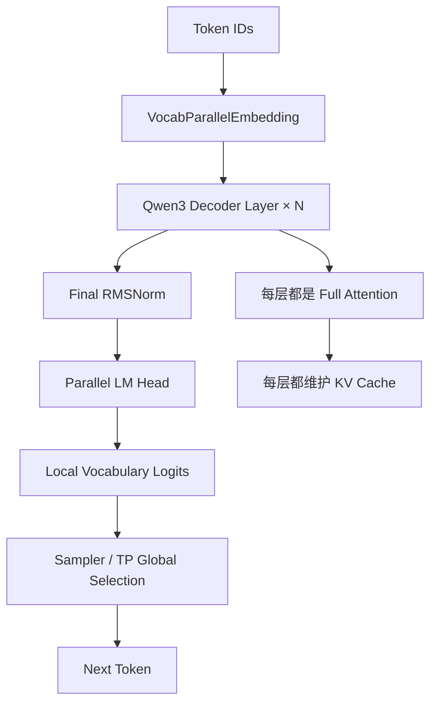

一句话概括：

> Qwen3 Dense 是 Decoder-only Causal LM，每层都用 Full Attention 和 SwiGLU MLP，推理时所有层都依赖随上下文增长的 KV Cache。

## 1.2 Qwen3.5 Hybrid

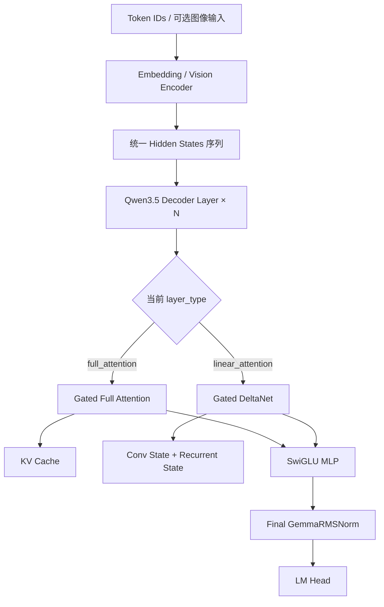

一句话概括：

> Qwen3.5 保留 Decoder-only 外壳，但把 Token Mixing 改成 Full Attention 与 Gated DeltaNet 的逐层混合，并同时管理 KV Cache 与固定形状递推状态。

## 1.3 本项目真正解决的问题

```text
模型层变成 Hybrid
  ↓
不是所有层都使用 KV Cache
  ↓
GDN 层需要 Conv/Recurrent State
  ↓
每个请求必须拥有独立 State Slot
  ↓
Scheduler、Sequence、Context、ModelRunner 都要理解 State Slot
  ↓
Prefill、Decode、Chunked Prefill、抢占和 CUDA Graph 都要维持双状态一致
```

这条链是全文最重要的主线。

---

# 2. 学习模型结构前必须掌握的基础概念

## 2.1 Token ID、Embedding、Hidden State、Logits

假设一句文本经过 Tokenizer 后变成：

```text
[101, 205, 330, 417]
```

这些整数是 Token ID，不是模型真正计算的浮点特征。

Embedding 层根据 Token ID 查表：

```text
Token ID 205
  ↓ 查 Embedding 矩阵第 205 行
一个长度为 hidden_size 的向量
```

如果 `hidden_size = H`，4 个 Token 经 Embedding 后得到：

```text
Hidden States shape = [4, H]
```

经过所有 Decoder Layer 与 Final Norm 后，Hidden State 仍是 `[4, H]`，但每个位置已经融合了前文信息。

LM Head 再把 Hidden State 映射到词表：

```text
[H] → [Vocab Size]
```

输出的每个数是一个候选 Token 的 Logit。Sampler 根据这些 Logits 选出下一 Token ID。

## 2.2 Decoder-only

Decoder-only 表示模型没有独立 Encoder。Prompt 与生成 Token 都在同一条序列中：

```text
用户 Prompt Token 0, 1, 2, ...
助手生成 Token ...
```

每个位置只能看当前位置及其之前的 Token，因此适合自回归生成。

## 2.3 Causal

Causal 表示禁止看到未来 Token。训练或 Prefill 处理多个 Token 时，位置 3 只能关注 0～3，不能关注 4、5。

简化 Mask：

```text
       K0 K1 K2 K3
Q0     ✓  ×  ×  ×
Q1     ✓  ✓  ×  ×
Q2     ✓  ✓  ✓  ×
Q3     ✓  ✓  ✓  ✓
```

Decode 每次只有一个新 Query，历史 KV 都是过去，因此天然符合因果关系。

## 2.4 Dense 不等于 Decoder-only

- Decoder-only：模型拓扑。
- Dense：每个 Token 使用同一套普通 MLP 参数，不做 MoE 专家路由。
- Hybrid：在本项目中表示不同 Decoder Layer 使用不同 Token Mixing 模块。

所以一个模型可以同时是：

```text
Decoder-only + Causal LM + Dense MLP + Hybrid Token Mixing
```

## 2.5 Residual 与 Pre-Norm

标准 Pre-Norm 子层可理解为：

```text
y = x + Sublayer(Norm(x))
```

nano-vLLM 为减少中间张量和 Kernel，会把某些 Residual Add 与 RMSNorm 合并执行。源码中 `hidden_states` 和 `residual` 分开传递，看起来和教科书不同，但语义仍是残差主干。

## 2.6 Prefill 与 Decode

Prefill：

```text
一次处理 Prompt 的多个 Token
主要建立历史状态
计算量较大，影响 TTFT
```

Decode：

```text
每个请求每轮通常只处理 1 个最新 Token
反复读取历史状态
影响 TPOT 与 Decode Throughput
```

---

# 3. Qwen3 Dense：官方架构与项目实现

## 3.1 【官方设计】Qwen3 Dense 的核心组成

从官方 Dense Checkpoint 配置可以确认：

- 模型类型是 `Qwen3ForCausalLM`；
- 使用 Decoder-only Causal LM；
- 使用多层 Attention + MLP；
- `num_attention_heads` 与 `num_key_value_heads` 可以不同，即 GQA；
- 激活函数为 SiLU，对应 SwiGLU MLP；
- 使用 RMSNorm；
- 使用 RoPE；
- `use_cache = true`，推理时使用 KV Cache。

不同规模模型的层数、Hidden Size、Head 数、是否 Tie Embedding 会变化。不要把某一个模型的数值参数背成所有 Qwen3 的共同常量。

## 3.2 【项目实现】Qwen3 文件结构

核心文件：

```text
nanovllm/models/qwen3.py
```

结构：

```text
Qwen3ForCausalLM
├── Qwen3Model
│   ├── VocabParallelEmbedding
│   ├── Qwen3DecoderLayer × num_hidden_layers
│   └── Final RMSNorm
└── ParallelLMHead
```

每个 Decoder Layer：

```text
Qwen3DecoderLayer
├── input_layernorm
├── Qwen3Attention
├── post_attention_layernorm
└── Qwen3MLP
```

项目中的主模型 `forward()` 只返回 Hidden States，Logits 由单独的 `compute_logits()` 产生。这让推理引擎可以在 Prefill 时只为每个请求最后一个有效位置计算词表 Logits。

---

# 4. Qwen3 一次请求从 Scheduler 到 Token 的完整链路

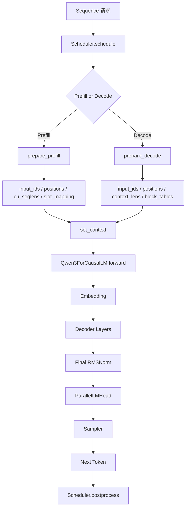

## 4.1 Engine/Runner 层做什么

ModelRunner 负责把“请求对象”转换成“模型能计算的 Tensor”：

- `input_ids`：这次要计算哪些 Token；
- `positions`：这些 Token 的位置；
- `cu_seqlens`：Prefill 中不同请求的边界；
- `slot_mapping`：新 K/V 写到物理 Cache 哪个 Slot；
- `block_tables`：每个请求的逻辑 Block 映射到哪些物理 Block；
- `context_lens`：Decode 时每个请求可读取多少历史 KV。

## 4.2 Model 层做什么

模型层不负责排队和显存分配，只执行：

```text
Token IDs
→ Embedding
→ 多层 Decoder
→ Final Norm
→ Hidden States
```

## 4.3 Layer 层做什么

`attention.py` 读取全局 Context：

- Prefill：走 Varlen FlashAttention；
- Decode：走 KV Cache Attention；
- 两阶段都按 `slot_mapping` 写入当前 Token 的 K/V。

---

# 5. Qwen3 单个 Decoder Layer：从输入到输出

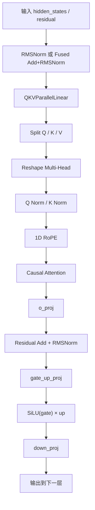

## 5.1 QKV Projection

概念上：

```text
Q = XWq
K = XWk
V = XWv
```

【项目实现】将三个投影打包到 `QKVParallelLinear`：

```text
X
  ↓ 一次大矩阵乘
[Q | K | V]
  ↓ split
Q, K, V
```

这样减少独立 Linear 调用，也方便 Tensor Parallel。

## 5.2 GQA

假设：

```text
Query Heads = 8
KV Heads = 2
```

则多个 Query Head 共享较少 K/V Head。

KV Cache 每个 Token 保存的数据大致与：

```text
KV Heads × Head Dim × 2
```

成正比，而不是与 Query Head 数直接成正比。

因此 GQA 的主要推理价值是：

- 降低 KV Cache；
- 减少 Decode 读取带宽；
- 保留更多 Query Head。

## 5.3 Q/K Norm

Q 与 K 的点积决定 Attention Logit：

```text
score ∝ Q · K
```

如果 Q/K 尺度不稳定，Softmax 可能过尖或过平。Q/K Norm 用于稳定每个 Head 的尺度。

## 5.4 RoPE

RoPE 作用在 Q/K，而不是 V。

简化理解：

```text
原始 Q/K 表示“内容”
旋转后的 Q/K 同时带有“内容 + 位置关系”
```

Qwen3 项目实现使用普通一维位置：

```text
positions shape = [N]
```

## 5.5 Attention 与 KV Cache

Prefill 时：

```text
Prompt 的所有新 K/V
  ↓
写入 KV Cache
  ↓
当前 Prompt 内做 Causal Attention
```

Decode 时：

```text
当前 Token 产生一个 Q/K/V
K/V 写入新 Slot
Q 读取历史 KV Cache
得到当前输出
```

## 5.6 SwiGLU MLP

公式：

```text
MLP(x) = down_proj(SiLU(gate_proj(x)) × up_proj(x))
```

【项目实现】`gate_proj` 与 `up_proj` 被打包到 `gate_up_proj`，一次计算后再切分。

---

# 6. 一个极简 Shape 示例：Qwen3 Attention

【理解模型】假设：

```text
当前 Token 数 T = 3
hidden_size H = 16
Query Heads = 4
KV Heads = 2
head_dim D = 4
```

输入：

```text
hidden_states: [3, 16]
```

投影后：

```text
Q: [3, 4, 4]
K: [3, 2, 4]
V: [3, 2, 4]
```

Attention 输出：

```text
O: [3, 4, 4]
```

展平：

```text
[3, 16]
```

经过 `o_proj` 后仍为：

```text
[3, 16]
```

Decoder Layer 的输入输出 Hidden Size 不变，因此多个 Layer 可以连续堆叠。

---

# 7. Qwen3 Prefill 与 Decode 的根本区别

## 7.1 Prefill

输入可能是多个请求拼接的一维 Token 流：

```text
请求 A: 4 Tokens
请求 B: 2 Tokens

input_ids = [A0,A1,A2,A3,B0,B1]
cu_seqlens = [0,4,6]
```

FlashAttention 用 `cu_seqlens` 恢复请求边界，避免不同请求互相 Attention。

Prefill 的主要任务：

1. 为每层计算 Prompt K/V；
2. 写入 KV Cache；
3. 让 Prompt Token 建立上下文；
4. 取每个请求最后一个位置的 Hidden 计算下一 Token。

## 7.2 Decode

两个请求时：

```text
input_ids = [A_last, B_last]
positions = [A_pos, B_pos]
```

每行只代表一个请求的新 Token。

Decode 的主要任务：

1. 计算当前 Token 的 Q/K/V；
2. 将当前 K/V 写入 Cache；
3. 用 Q 读取历史 Cache；
4. 生成下一 Token。

## 7.3 为什么 Decode 不能直接重算完整历史

若每生成一个 Token 都重算整个 Prompt：

```text
第 1 步算 L
第 2 步算 L+1
第 3 步算 L+2
...
```

会重复计算大量历史 K/V。KV Cache 用显存换计算，避免这种重复。

---

# 8. Qwen3 的 Tensor Parallel 如何贯穿模型结构

## 8.1 Column Parallel

按输出维度切分权重。

例如 Q Projection 输出 8 个 Head，TP=2：

```text
Rank 0 计算 Head 0～3
Rank 1 计算 Head 4～7
```

适合：

- QKV Projection；
- MLP Gate/Up Projection。

## 8.2 Row Parallel

按输入维度切分权重，每张卡得到局部输出，最后 All-Reduce。

适合：

- Attention `o_proj`；
- MLP `down_proj`。

## 8.3 Vocab Parallel

Embedding 和 LM Head 按词表切分。

Embedding：

```text
拥有该 Token 的 Rank 查表
其他 Rank 输出 0
All-Reduce 后所有 Rank 得到同一 Embedding
```

LM Head：

```text
每个 Rank 只算本地词表 Logits
再由 Runner 进行全局 Token 选择
```

## 8.4 Prefill 的 LM Head 优化

【项目实现】`ParallelLMHead` 在 Prefill 中只取每个请求最后一个有效 Hidden：

```text
完整 Prompt 都经过模型主干
只有最后位置进入词表投影
```

因为自回归推理只需要 Prompt 后面的下一 Token，不需要输出 Prompt 每个位置的 Logits。

---

# 9. Qwen3.5 Hybrid：先从官方大图理解

## 9.1 【官方设计】核心特征

Qwen3.5 Dense 的文本主干是 Hybrid Decoder：

- 多数层是 Gated DeltaNet/Linear Attention；
- 周期性插入 Full Attention；
- 官方常见配置是 3 个 Linear Attention 层后接 1 个 Full Attention 层；
- Full Attention 带 Output Gate；
- 使用多模态 RoPE；
- 模型族原生支持图文/视频交错输入。

示意：

```text
Layer 0: GDN
Layer 1: GDN
Layer 2: GDN
Layer 3: Full Attention
Layer 4: GDN
Layer 5: GDN
Layer 6: GDN
Layer 7: Full Attention
...
```

## 9.2 【项目实现】不写死 3:1

仓库逐层读取：

```text
config.layer_types[layer_idx]
```

逻辑：

```text
如果 == "full_attention"
    创建 Qwen3_5Attention
否则
    创建 GatedDeltaNet
```

因此：

- 官方 Checkpoint 给出 3:1 时，项目按 3:1 创建；
- 项目代码自身并未硬编码“每第四层必为 Full Attention”；
- 项目假设非 `full_attention` 的类型就是 GDN 路径。

这一区分非常重要：**3:1 是 Checkpoint 配置特征，不是项目调度器临时决定的。**

---

# 10. Qwen3.5 整体模型外壳

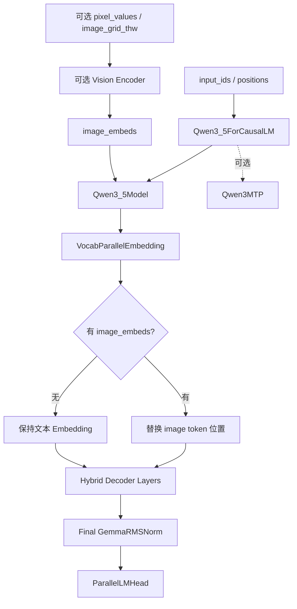

模型外壳包含：

```text
必须：
- 语言模型主干
- LM Head

可选：
- Vision Encoder
- MTP
```

注意：

- Vision Encoder 只在有图像输入且已启用时执行；
- MTP 不在普通 `forward()` 中自动执行，由 Runner 的专用原型路径调用；
- KV Cache 压缩是 Attention 运行时扩展，不是语言模型结构中的新 Layer。

---

# 11. Qwen3.5 单层如何组合 Full Attention 与 GDN

每个 Layer 的外壳相同：

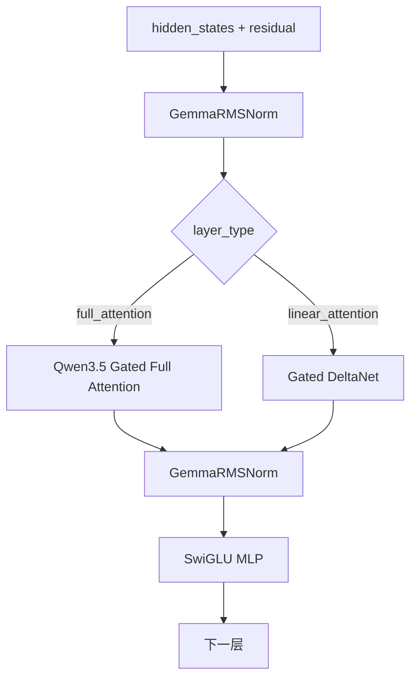

共同点：

- 都是 Pre-Norm；
- 都保留 Residual；
- Token Mixing 后都接同一种 Qwen3.5 MLP；
- Layer 输入输出仍是 `[Tokens, hidden_size]`。

不同点：

| 维度 | Full Attention Layer | GDN Layer |
|---|---|---|
| 历史表示 | 每 Token 的 K/V | 压缩递推状态 |
| 状态随长度 | 线性增长 | 固定形状 |
| 位置编码 | 使用 MRoPE | 不走 Attention MRoPE |
| 核心计算 | QK Softmax V | Conv + Gated Delta Rule |
| 项目状态 | KV Cache Blocks | State Slot 中 Conv/Recurrent State |

---

# 12. Qwen3.5 Full Attention：逐步拆解

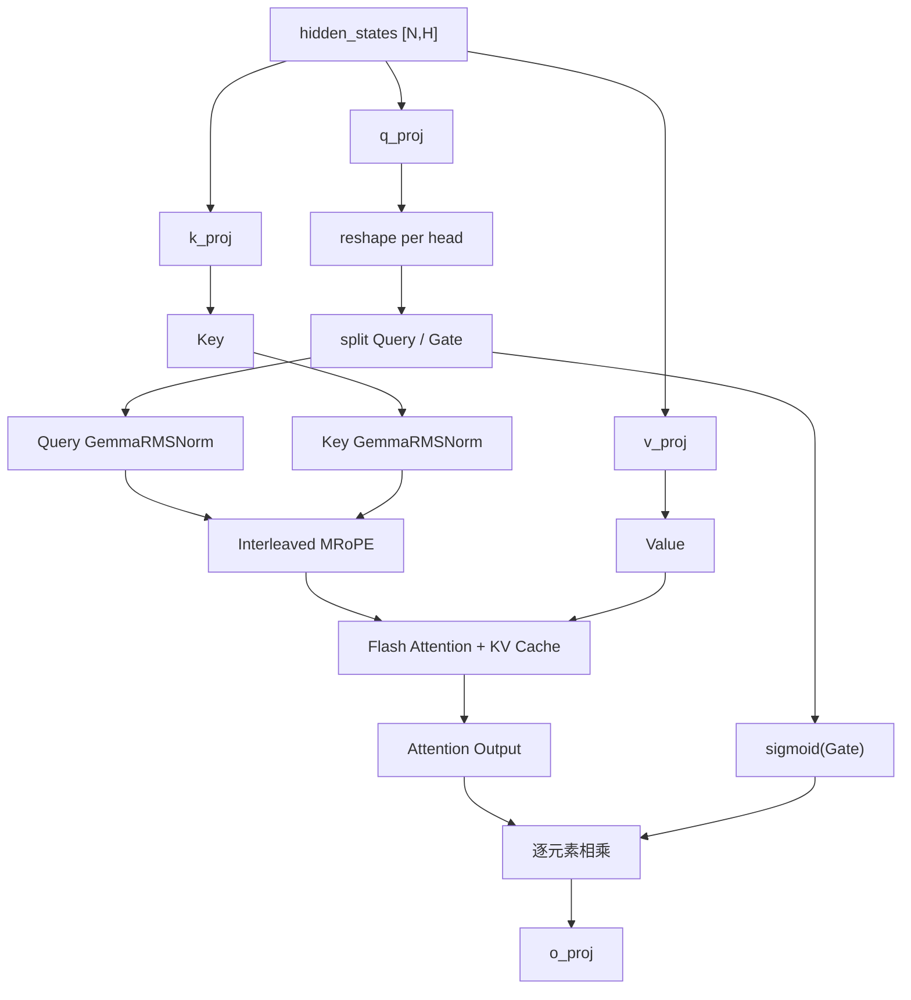

## 12.1 为什么 q/k/v 分开

Qwen3 的 Q 分支只产生 Query，可以与 K/V 打包。

Qwen3.5 的 q_proj 同时产生：

```text
Query + Gate
```

它的输出维度是普通 Query 的两倍，语义和 K/V 不对称，因此项目使用独立的 q_proj、k_proj、v_proj。

## 12.2 Query 与 Gate 的 Shape

【理解模型】仍假设：

```text
T=3, H=16, Query Heads=4, KV Heads=2, D=4
```

q_proj 输出：

```text
[3, 2 × 4 × 4] = [3, 32]
```

reshape：

```text
[3, 4, 8]
```

切分：

```text
Query: [3, 4, 4]
Gate:  [3, 4, 4]
```

k/v：

```text
Key:   [3, 2, 4]
Value: [3, 2, 4]
```

## 12.3 Gate 不参与 Attention Score

错误理解：

```text
Gate 和 Query 一起计算 QK
```

正确流程：

```text
Query/Key → Attention Score
Value → Attention 聚合
聚合结果 × sigmoid(Gate)
```

公式化：

```text
O = Attention(Q, K, V)
Y = o_proj(O × sigmoid(Gate))
```

## 12.4 Output Gate 的作用

普通 Attention：

```text
从历史取回信息 → 直接输出
```

Qwen3.5：

```text
从历史取回信息
  ↓
当前 Token 自己生成 Gate
  ↓
按 Head、按通道控制信息通过量
```

Gate 是当前 Token 的动态控制信号。

---

# 13. GemmaRMSNorm 与普通 RMSNorm

普通 RMSNorm：

```text
norm(x) × weight
```

GemmaRMSNorm：

```text
norm(x) × (1 + weight)
```

【项目实现】：

- 普通 RMSNorm 的权重初始化为 1；
- GemmaRMSNorm 的权重初始化为 0，再使用 `1 + weight`；
- 两者都以 FP32 计算方差，再转回输入 DType；
- 都支持 Fused Residual Add + Norm 路径。

为什么不能混用：

```text
Checkpoint 中 weight 的含义不同
```

即使 Shape 一样，错误公式也会造成持续数值偏差。

Qwen3.5 中 GemmaRMSNorm 用于：

- Decoder Layer 的 Pre/Post Norm；
- Final Norm；
- Full Attention 的 Q/K Norm；
- MTP 分支中的 Norm。

GDN 内部还使用另一种 `RMSNormGated`，不要把它和 Full Attention Output Gate 混淆。

---

# 14. Interleaved MRoPE：文本位置和图像位置如何统一

## 14.1 普通 Qwen3 RoPE

输入位置：

```text
positions: [N]
```

每个 Token 只有一个序列位置。

## 14.2 Qwen3.5 MRoPE

支持两种输入：

```text
纯文本：positions [N]
多模态：positions [3, N]
```

三行分别是：

```text
Temporal
Height
Width
```

## 14.3 Partial RoPE

并非整个 Head Dim 都参与旋转。

```text
rotary_dim = head_dim × partial_rotary_factor
```

其余维度原样通过。

【理解模型】若：

```text
head_dim = 256
partial_rotary_factor = 0.25
```

则：

```text
64 维参与 RoPE
192 维不旋转
```

实际值应以 Checkpoint 配置为准。

## 14.4 Interleaved 的含义

参与 RoPE 的频率槽被分成 T/H/W 三类，并交错放置，而不是简单连续拼成：

```text
[T 全部][H 全部][W 全部]
```

简化示意：

```text
频率槽：T H W T H W T H W ...
```

项目通过 `mrope_section` 控制三个维度使用多少频率对。

## 14.5 纯文本为什么也能走 MRoPE

当 `positions` 是一维时，项目直接读取普通位置 Cache，等效于一维 RoPE 路径。MRoPE 是统一实现，不代表纯文本也具有真实的图片 H/W 坐标。

---

# 15. Gated DeltaNet：先用一句话理解

> GDN 不保存每个历史 Token 的完整 K/V，而是通过因果卷积保存短期局部历史，并通过 Gated Delta Rule 把长期历史压缩进一个固定形状的 Recurrent State。

它在 Decoder Layer 中扮演的角色是：

```text
替代 Full Attention 的 Token Mixing
```

但它不会替代：

- Residual；
- Layer Norm；
- MLP；
- Final LM Head。

---

# 16. 本项目 GDN 的完整数据流

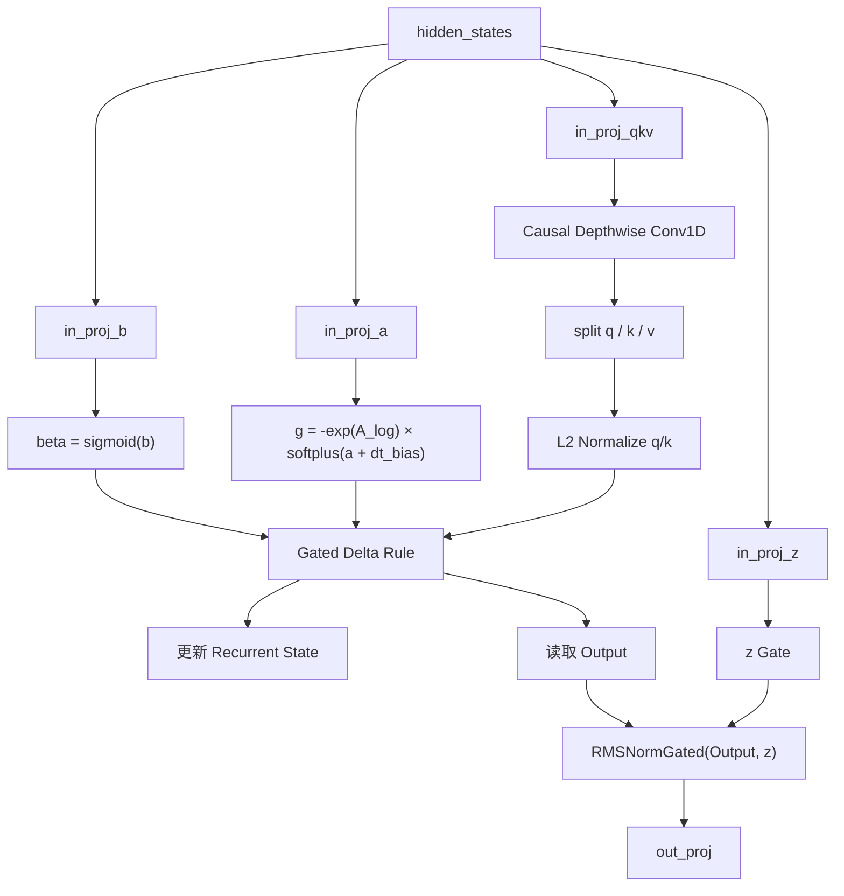

输入会产生四组控制量：

1. `q/k/v`：通过混合投影和因果卷积产生；
2. `z`：控制最终 GDN 输出；
3. `b`：产生 `beta`，控制记忆更新强度；
4. `a`：与 `A_log`、`dt_bias` 一起产生衰减量 `g`。

---

# 17. Conv State：保存短期局部历史

GDN 的 Q/K/V 混合特征先经过 Depthwise Causal Conv1D。

假设卷积 Kernel Size 为 4，计算当前 Token 需要：

```text
最近 3 个旧输入 + 当前输入
```

因此每个请求只需保存最近 `kernel_size - 1` 个特征。

项目中的 Shape：

```text
conv_states:
[num_state_slots, conv_dim, kernel_size - 1]
```

每个 GDN Layer 都有独立 State Pool。

Decode 更新过程可简化为：

```text
旧状态: [x(t-3), x(t-2), x(t-1)]
加入当前 x(t)
计算卷积输出
新状态: [x(t-2), x(t-1), x(t)]
```

这部分负责局部顺序模式，不需要保留无限历史。

---

# 18. Recurrent State：保存压缩长期记忆

项目中的 Shape：

```text
recurrent_states:
[num_state_slots, num_value_heads, key_head_dim, value_head_dim]
```

每个 Head 是一个 Key→Value 记忆矩阵。

## 18.1 简化 Delta Rule

【理解模型】忽略 Batch 和 Head，可近似理解为：

```text
旧记忆矩阵 S
当前 key k
当前 value v
```

先读取旧记忆对当前 Key 的预测：

```text
v_memory = kᵀS
```

计算误差：

```text
delta = (v - v_memory) × beta
```

更新：

```text
S = decay × S + k ⊗ delta
```

再用 Query 读取：

```text
output = qᵀS
```

直觉：

- 如果旧状态已经能正确回忆当前 Value，更新很小；
- 如果误差大，根据 `beta` 写入修正信息；
- `decay` 决定旧记忆保留多少。

实际项目实现比这个简化式多了多头、GQA、Chunk 计算和数值精度处理，但核心记忆逻辑一致。

## 18.2 beta

```text
beta = sigmoid(b)
```

范围在 0～1，控制当前 Token 修正记忆的强度。

## 18.3 g

```text
g = -exp(A_log) × softplus(a + dt_bias)
```

`g` 通常为非正值，取指数后形成衰减因子。它控制旧状态遗忘速度。

## 18.4 z

`z` 不参与 Recurrent State 的 Delta 更新，而是在输出端通过 `RMSNormGated` 调制 GDN 输出。

必须区分：

```text
Full Attention 的 Gate：
调制 Attention Output

GDN 的 beta：
调制记忆更新强度

GDN 的 g：
调制状态衰减

GDN 的 z：
调制归一化后的最终输出
```

---

# 19. GDN Prefill：一段 Prompt 如何形成最终状态

GDN `forward()` 先读取 Context：

```text
is_prefill == True
```

## 19.1 首次 Prefill

每个请求的一段 Token：

```text
x0, x1, x2, ..., xL-1
```

项目会：

1. 计算 Q/K/V、z、b、a；
2. 做 Causal Conv1D；
3. 使用 Chunk Gated Delta Rule 处理该段；
4. 得到每个 Token 的输出；
5. 将最终 Conv State 和 Recurrent State 写入该请求对应 Slot。

输出仍包含每个输入 Token 的 Hidden：

```text
[L, hidden_size]
```

以便继续进入 MLP 和后续 Layer。

## 19.2 Chunked Prefill 继续执行

若 Prompt 因 Token Budget 被分段：

```text
Chunk 1 → Chunk 2 → Chunk 3
```

后续 Chunk 必须从前一个 Chunk 的状态继续，不能从零开始。

逻辑要求：

```text
Chunk1 最终 State
= Chunk2 初始 State
```

否则分块 Prefill 与一次性 Prefill 不等价。

## 19.3 项目实现边界

项目 GDN Prefill 使用 PyTorch 函数和显式循环实现，目的主要是跑通语义和状态管理。不能把它描述成已经融合了官方 FLA 高性能 Kernel。

---

# 20. GDN Decode：每个新 Token 如何递推

Decode 时：

```text
is_prefill == False
```

每个请求只有一个新 Token。

项目步骤：

1. 根据 Batch 中每个请求的 `state_indices` 读取 Conv State；
2. 执行单 Token Causal Conv；
3. 写回新 Conv State；
4. 读取 Recurrent State；
5. 执行 Recurrent Gated Delta Rule；
6. 原地更新 Recurrent State；
7. 用 `z` 做 Gated Norm；
8. `out_proj` 回到 Hidden Size。

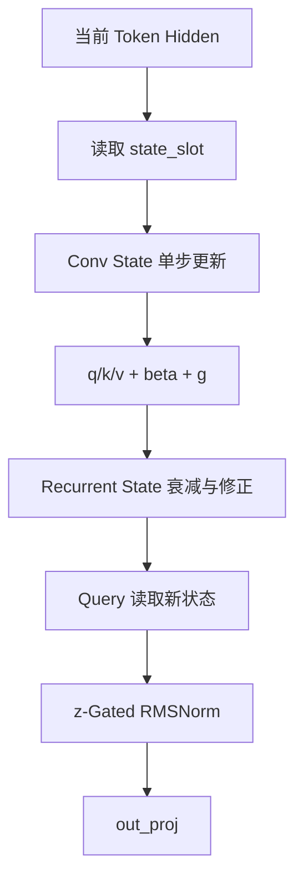

Decode 的核心特征：

```text
输入长度始终为 1
但 State 已压缩了整个历史
```

---

# 21. Full Attention 与 GDN 如何在同一模型中交替工作

假设一个简化 8 层模型：

```text
L0 GDN
L1 GDN
L2 GDN
L3 Full Attention
L4 GDN
L5 GDN
L6 GDN
L7 Full Attention
```

一个 Token 在同一轮 Forward 中依次经历：

```text
Embedding
  ↓
L0：读取/更新 GDN0 State
  ↓
L1：读取/更新 GDN1 State
  ↓
L2：读取/更新 GDN2 State
  ↓
L3：读取/写入 Attention3 KV Cache
  ↓
L4：读取/更新 GDN4 State
  ↓
...
```

注意：

- 每个 GDN Layer 有自己的 State；
- 每个 Full Attention Layer 有自己的 KV Cache；
- 一个请求的 `state_slot_id` 在所有 GDN Layer 中使用相同“行号”，但每层 State Tensor 独立；
- KV Block Table 在所有 Full Attention Layer 中共享逻辑 Block 映射，但每层物理 K/V Tensor 独立。

---

# 22. 为什么 Hybrid 模型需要“动态 State Slot”

KV Cache 使用 Block 管理，因为它随 Token 长度增长。

GDN State 是固定大小，不适合按 Token Block 管理，因此项目为每个活跃请求分配一个 Slot：

```text
请求 A → state_slot_id = 0
请求 B → state_slot_id = 1
请求 C → state_slot_id = 2
```

所有 GDN Layer 中：

```text
layer.conv_states[0]
layer.recurrent_states[0]
```

都属于请求 A。

## 22.1 State Slot 数量如何决定

【项目实现】ModelRunner：

1. 找到所有 GDN Layer；
2. 计算一个 Slot 在所有 GDN Layer 上的 Conv + Recurrent State 字节数；
3. 读取剩余显存；
4. 最多使用剩余显存的一定比例；
5. 同时不超过 `max_num_seqs`；
6. 得到 `max_state_slots`。

所以 State Slot 数量不是模型结构中的可学习参数，而是运行时显存容量决定的并发资源上限。

## 22.2 为什么 Recurrent State 用 FP32

项目将 Recurrent State 分配为 FP32，而 Conv State 使用模型 DType。

这是项目为递推数值稳定性做的实现选择。递推状态会长期累积误差，FP32 更稳，但显存占用更大。

---

# 23. Scheduler 如何管理 GDN State 生命周期

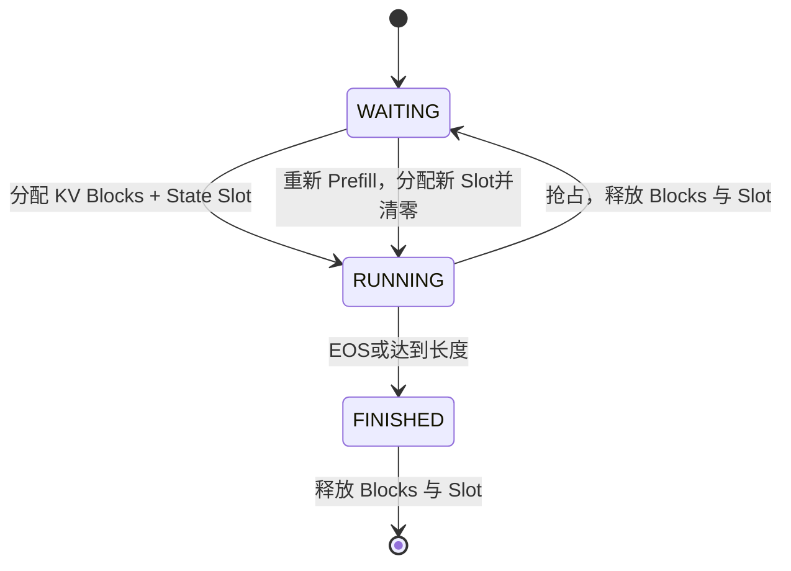

## 23.1 首次调度

若 Hybrid 请求尚无 Slot：

```text
state_slot_id == -1
```

Scheduler 检查空闲 Slot，并分配一个。

同时标记：

```text
state_slot_needs_reset = True
```

ModelRunner 在 Prefill 前将对应行清零，防止复用到上一个请求残留状态。

## 23.2 抢占

项目当前策略：

```text
抢占请求
→ 释放 KV Blocks
→ 释放 State Slot
→ 请求回到 WAITING
```

重新调度后通过 Re-Prefill 重算状态。

## 23.3 请求结束

同时释放：

- KV Blocks；
- GDN State Slot。

---

# 24. Context：Attention 与 GDN 共用的运行时桥梁

项目的 `Context` 同时保存：

```text
Attention 需要：
- is_prefill
- cu_seqlens_q / cu_seqlens_k
- slot_mapping
- context_lens
- block_tables

GDN 需要：
- is_prefill
- cu_seqlens_q
- state_indices
```

这样模型层调用保持简洁：

```text
Full Attention 从 Context 找 KV 元数据
GDN 从 Context 找 State Slot
```

`state_indices` 的 Batch 顺序必须与 `input_ids` 的请求顺序一致。

例如：

```text
Batch 行 0：请求 A，slot 7
Batch 行 1：请求 B，slot 2

state_indices = [7, 2]
```

GDN Decode 才能正确读写：

```text
A → state[7]
B → state[2]
```

---

# 25. Hybrid 与 CUDA Graph

CUDA Graph 要求执行形状和内存地址尽量固定。

Qwen3 Dense Decode Graph 需要固定 Buffer：

- input_ids；
- positions；
- slot_mapping；
- context_lens；
- block_tables。

Qwen3.5 还必须加入：

```text
state_indices
```

Replay 前将当前 Batch 的 State Slot ID 拷贝到静态 Buffer。

若漏掉 State Index：

```text
Token 正确
KV Block 正确
但 GDN 可能读写错误请求的状态
```

这种错误可能不立即崩溃，却会产生隐蔽的结果污染。

---

# 26. Hybrid 与 Chunked Prefill

Chunked Prefill 把长 Prompt 分成多个调度 Step。

Qwen3 Dense 只需保证：

```text
前一 Chunk 写入的 KV
下一 Chunk 可以正确读取
```

Qwen3.5 需要同时保证：

```text
Full Attention KV 连续
GDN Conv State 连续
GDN Recurrent State 连续
Token Position 连续
```

因此“一次性 Prefill”和“分块 Prefill”应满足：

```text
最终 Hidden/Logits 接近
最终 KV 状态一致
最终 GDN 状态一致
```

如果只比较生成文本，可能掩盖小的状态偏差。更严格的测试应比较 Logits 和状态恢复结果。

---

# 27. 多模态：图片如何进入 Qwen3.5 Hybrid

## 27.1 项目输入链路

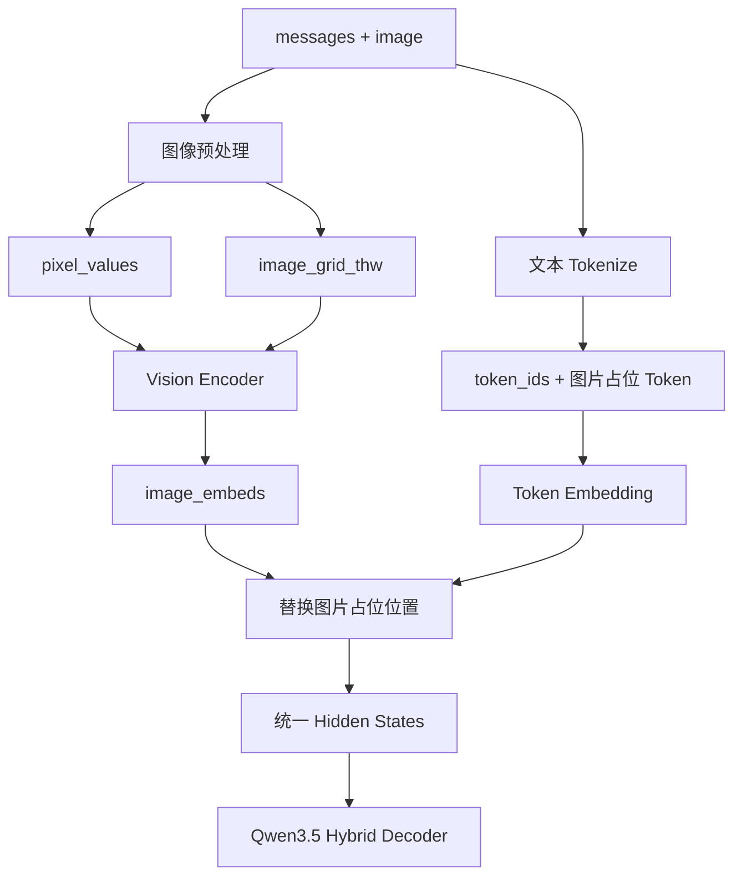

## 27.2 Vision Encoder 结构

【项目实现】：

```text
Flattened Pixel Patches
  ↓
3D Conv Patch Embedding
  ↓
视觉位置 Embedding
  ↓
Vision Transformer Blocks
  ↓
Patch Merger
  ↓
语言模型 Hidden Size 的 Image Embeddings
```

视觉 Attention 是非因果的，因为同一张图片内部 Patch 应相互可见。

## 27.3 占位数量必须对齐

```text
图片占位 Token 数
=
Vision Encoder 最终 Image Embedding 行数
```

否则无法正确替换 Hidden States。

## 27.4 进入主干后的状态

首次 Prefill 后，图像信息已经影响：

- Full Attention 层 KV Cache；
- GDN 层 Conv/Recurrent State。

后续 Decode 不应重复运行 Vision Encoder。

## 27.5 官方与项目边界

【官方设计】支持图像和视频的原生多模态序列。

【项目实现】当前请求处理和测试重点是静态图片。虽然视觉 Patch Embed 使用 Temporal Patch Size，`grid_thw` 也保留 T，但这不等于完整实现了视频文件读取、抽帧、采样和协议兼容。

---

# 28. 可选 MTP 分支与模型主干的关系

项目可按配置创建 `Qwen3MTP`。

结构简化为：

```text
当前 Token Embedding
主模型 Hidden
  ↓ 分别 GemmaRMSNorm
Concat [2H]
  ↓ Linear 2H→H
少量 Full Attention Decoder Layer
  ↓
MTP Hidden
  ↓ 复用 LM Head
Draft Logits
```

关键边界：

- MTP 不是普通 Qwen3.5 `forward()` 的必经路径；
- MTP Decoder Layer 使用 Full Attention 结构，不按主干 `layer_types` 切换 GDN；
- 完整 Draft/Verify/Accept/Reject 由 ModelRunner 和实验控制路径组织；
- MTP 是项目扩展，不是理解 Hybrid 主干的前置条件。

---

# 29. KV Cache 压缩与模型结构的关系

项目的 KV Cache 压缩只作用于：

```text
Full Attention Layers
```

原因：

```text
只有 Full Attention 层存在逐 Token K/V
```

GDN 层没有可按 Token 选择和丢弃的普通 KV Cache，其状态是 Conv/Recurrent State。

因此不能说：

```text
“项目压缩了 Qwen3.5 所有层的历史状态”
```

准确说法是：

> 项目在 Qwen3.5 的 Full Attention 层上实现动态 KV Cache 压缩；GDN State 仍按固定形状状态池独立维护。

此外，KV 压缩是本项目推理策略，不是 Qwen3.5 官方模型结构本身。

---

# 30. Qwen3 与 Qwen3.5 的完整对照

| 项目 | Qwen3 Dense | Qwen3.5 Hybrid |
|---|---|---|
| 总体拓扑 | Decoder-only Causal LM | Decoder-only Causal LM |
| MLP | Dense SwiGLU | Dense SwiGLU |
| Token Mixing | 每层 Full Attention | GDN 与 Full Attention 混合 |
| 层序列来源 | 每层统一 Attention | `config.layer_types` |
| QKV 投影 | 项目中打包 QKV | Full Attention 中 q/k/v 分开 |
| Q 分支 | Query | Query + Output Gate |
| Output Gating | 无该结构 | Attention Output × sigmoid(Gate) |
| 主 Norm | RMSNorm | GemmaRMSNorm |
| 位置编码 | 1D RoPE | Partial Interleaved MRoPE |
| 纯文本位置 | 1D | 1D |
| 图像位置 | 原项目 Qwen3 无 | T/H/W 3D |
| Full Attention 状态 | 每层 KV Cache | 仅 Full Attention 层 KV Cache |
| 线性层状态 | 无 | Conv State + Recurrent State |
| 状态随上下文增长 | 所有层线性增长 KV | 仅 Full Attention KV 增长 |
| Scheduler 资源 | KV Blocks | KV Blocks + State Slots |
| Sequence 元数据 | Block Table | Block Table + State Slot ID |
| CUDA Graph 输入 | KV 元数据 | KV 元数据 + State Indices |
| 多模态外壳 | 无 | 可选 Vision Encoder |
| MTP 外壳 | 无 | 可选 MTP |

---

# 31. “官方设计”和“项目适配”逐项边界表

| 主题 | 官方模型层面 | 本项目实际实现 |
|---|---|---|
| Hybrid 比例 | 常见 Dense 配置 3 GDN : 1 Full Attention | 不写死，读取 `layer_types` |
| GDN Kernel | 官方生态可使用优化 Kernel | PyTorch 参考实现与显式循环 |
| 多模态 | 原生文本、图片、视频 | 重点打通图片输入；视频协议未完整实现 |
| MRoPE | T/H/W 多维 RoPE | 支持 1D 与 `[3,N]` 位置，使用项目实现的 Interleaving |
| KV Cache | Full Attention 使用 | 仅实际 Attention 模块分配 KV |
| GDN State | 递推状态 | 每层 State Pool + 请求 State Slot |
| Prefix Cache | 架构本身不必禁止 | 项目对 Hybrid 默认关闭 Prefix Cache |
| CUDA Graph | 实现相关 | 项目显式传递 State Indices |
| MTP | 模型族可含相关权重/能力 | 可选原型路径，不属于普通 Forward |
| FP8 | Checkpoint 量化格式 | 项目主要做兼容加载/反量化路径，不等同自研 FP8 GEMM |
| KV 压缩 | 非模型固定结构 | 项目只压缩 Full Attention KV |

---

# 32. 最容易混淆的四组“Gate”

## 32.1 SwiGLU Gate

```text
SiLU(gate_proj(x)) × up_proj(x)
```

位置：MLP。

## 32.2 Full Attention Output Gate

```text
Attention(Q,K,V) × sigmoid(gate)
```

位置：Attention 输出后。

## 32.3 GDN beta / g

```text
beta：更新强度
g：状态衰减
```

位置：Recurrent State 更新。

## 32.4 GDN z Gate

```text
RMSNorm(output) × SiLU(z)
```

位置：GDN 输出投影前。

它们虽然都叫 Gate，但来源、公式和作用位置完全不同。

---

# 33. 从源码角度推荐的阅读顺序

## 第一阶段：Qwen3 基线

1. `nanovllm/models/qwen3.py`  
   看清模型外壳、Decoder Layer、Attention、MLP。

2. `nanovllm/layers/layernorm.py`  
   理解 Residual Add + RMSNorm。

3. `nanovllm/layers/linear.py`  
   理解 Column/Row/QKV/Merged Parallel Linear。

4. `nanovllm/layers/rotary_embedding.py`  
   先看普通 `RotaryEmbedding`。

5. `nanovllm/layers/attention.py`  
   串起 KV Cache、Prefill 和 Decode。

6. `nanovllm/layers/embed_head.py`  
   看 Embedding、LM Head、Prefill 最后位置优化。

## 第二阶段：Qwen3.5 结构变化

7. `nanovllm/models/qwen3_5.py`  
   对比 `qwen3.py`，重点看：
   - `layer_types`；
   - q/k/v 分离；
   - Query/Gate；
   - GemmaRMSNorm；
   - MRoPE；
   - Vision/MTP 可选挂载。

8. `nanovllm/layers/gated_delta_net.py`  
   按以下顺序读：
   - State Tensor Shape；
   - Conv Prefill/Decode；
   - Recurrent Delta Rule；
   - `_forward_prefill`；
   - `_forward_decode`。

9. 再回到 `rotary_embedding.py`  
   阅读 `InterleavedMRoPE`。

## 第三阶段：运行时状态

10. `nanovllm/config.py`  
    看 Hybrid 检测、Full Attention 层数、Prefix Cache 策略。

11. `nanovllm/engine/sequence.py`  
    看 `state_slot_id`、逻辑 Token 与物理 KV 长度。

12. `nanovllm/engine/scheduler.py`  
    看 State Slot 分配、抢占、释放。

13. `nanovllm/utils/context.py`  
    看 `state_indices` 如何传递。

14. `nanovllm/engine/model_runner.py`  
    看 KV Cache/GDN State 分配、Prefill/Decode 准备和 CUDA Graph。

## 第四阶段：可选扩展

15. `nanovllm/models/vision_encoder.py`
16. `nanovllm/models/qwen3_mtp.py`
17. `nanovllm/kv_compression/*`

---

# 34. 检查自己是否真正理解：20 个问题

1. Dense、Decoder-only、Causal LM、GQA 分别描述什么？
2. 为什么 Qwen3 `forward()` 返回 Hidden 而不直接返回 Logits？
3. Prefill 为什么只需为最后有效 Token 计算 LM Head？
4. Q/K 为什么需要 Norm，RoPE 为什么不作用于 V？
5. GQA 为什么可以减少 KV Cache？
6. `slot_mapping` 和 `block_tables` 分别解决什么问题？
7. Qwen3.5 为什么不能继续简单复用原 QKV 打包？
8. Query Gate 在 Attention 的哪个位置生效？
9. GemmaRMSNorm 与普通 RMSNorm 的 Weight 语义有何不同？
10. Partial MRoPE 是什么意思？
11. 纯文本为什么也能走 Interleaved MRoPE？
12. GDN 在 Decoder Layer 中替换了哪个模块？
13. Conv State 与 Recurrent State 分别保存什么？
14. beta、g、z 三者的作用是什么？
15. 为什么 GDN State 大小不随上下文线性增长？
16. 为什么每个请求需要独立 State Slot？
17. 抢占时为什么项目选择释放 State Slot并重新 Prefill？
18. Chunked Prefill 为什么必须同时连续维护 KV 和 GDN State？
19. 图片 Embedding 为什么要替换占位 Token，而不是直接拼到模型外部？
20. 为什么 KV Cache 压缩只作用于 Full Attention 层？

若这些问题都能不用背稿解释清楚，才算真正建立了模型与系统的统一理解。

---

# 35. 面试时可直接使用的三分钟回答

> Qwen3 Dense 是标准的 Decoder-only Causal LM，整体由 Token Embedding、多层 Full Attention 加 SwiGLU MLP、Final RMSNorm 和 LM Head 构成。每层 Attention 使用 GQA，Query Head 多于 K/V Head，因此在保留表达能力的同时减少 KV Cache。Prefill 会一次处理多个 Prompt Token并为所有层建立 KV Cache，Decode 每轮通常只处理一个新 Token，从 Cache 中读取历史 K/V。
>
> Qwen3.5 保留 Decoder-only 外壳，但把每层固定 Full Attention 改成 Gated DeltaNet 与 Full Attention 的 Hybrid 堆叠。官方常见配置是三个 GDN 层配一个 Full Attention 层，但我的项目不写死比例，而是逐层读取 Checkpoint 的 `layer_types`。Full Attention 本身也改成 q/k/v 独立投影，其中 q_proj 同时产生 Query 和 Gate；Attention 输出乘 `sigmoid(Gate)` 后再经过 o_proj。Q/K 和主干使用 GemmaRMSNorm，位置编码升级为支持文本一维和图像 T/H/W 三维位置的 Interleaved MRoPE。
>
> GDN 不保存每个历史 Token 的 K/V，而是通过因果卷积维护短期 Conv State，并通过 Gated Delta Rule 把长期历史压缩到 Recurrent State。因此 Hybrid 推理必须同时管理两套状态：Full Attention 的 KV Cache 和 GDN 的 Conv/Recurrent State。项目中只给 Full Attention 层分配 KV Cache，同时为每个活跃请求分配一个 GDN State Slot；Sequence 记录 Slot ID，Scheduler 管理分配与回收，ModelRunner 通过 Context 把 State Indices 传给各 GDN Layer，并保证 Prefill、Decode、Chunked Prefill、抢占重算和 CUDA Graph 下状态一致。
>
> 多模态时，图片先经过 Vision Encoder 变成与语言模型 Hidden Size 对齐的 Image Embeddings，再替换文本序列中图片占位 Token 的普通 Embedding，之后与文本一起进入同一个 Hybrid Decoder。当前项目重点支持图片链路，不能扩大成完整视频协议；MTP 和 KV Cache 压缩也是建立在 Hybrid 主干正确运行后的可选扩展，而不是 Qwen3.5 普通 Forward 的必经部分。

---

# 36. 最终心智模型

不要分别死记几十个类名，只记住以下四层：

```text
第一层：模型拓扑
Qwen3：全层 Full Attention
Qwen3.5：GDN / Full Attention Hybrid

第二层：单层计算
Full Attention：Q/K/V + RoPE + KV Cache
GDN：Conv + Delta Rule + Fixed State
两者后面都接 SwiGLU MLP

第三层：请求历史
Qwen3：只有 KV Cache
Qwen3.5：KV Cache + Conv/Recurrent State

第四层：推理引擎
Scheduler 分配资源
Sequence 记录资源身份
Context 传递运行时索引
ModelRunner 准备 Tensor、执行模型和维护 CUDA Graph
```

最终可以用一句话概括本项目的架构价值：

> **本项目把 nano-vLLM 从“只会管理全层 KV Cache 的 Qwen3 Dense 推理”，扩展成“能够按层执行 Full Attention/Gated DeltaNet，并为请求同步管理 KV Cache 与 Conv/Recurrent State 的 Qwen3.5 Hybrid 推理引擎”。**

---

# 37. 本文依据的源码与资料

## 项目源码

```text
nanovllm/models/qwen3.py
nanovllm/models/qwen3_5.py
nanovllm/models/vision_encoder.py
nanovllm/models/qwen3_mtp.py
nanovllm/layers/attention.py
nanovllm/layers/gated_delta_net.py
nanovllm/layers/layernorm.py
nanovllm/layers/rotary_embedding.py
nanovllm/layers/embed_head.py
nanovllm/config.py
nanovllm/engine/model_runner.py
nanovllm/engine/scheduler.py
nanovllm/engine/sequence.py
nanovllm/utils/context.py
```

## 学习材料

```text
7-Qwen3_DecoderOnly架构与nano-vLLM模型代码对应总览
13-qwen3.6_完整模型架构与关键改动分析
```

## 官方资料类型

```text
Qwen3 官方 Dense Checkpoint 配置
Qwen3.5 / Qwen3.6 官方 Checkpoint 配置
Transformers Qwen3.5 模型文档
```

文中涉及的具体层数、Hidden Size、Head 数和 MRoPE 参数，最终都应以实际加载 Checkpoint 的配置为准。


%% 项目关联导航：开始 %%
## 项目关联导航

- 所属模块：[[outputs/项目整理/模块-nanovllm项目面试准备|模块-nanovllm项目面试准备]]

%% 项目关联导航：结束 %%
