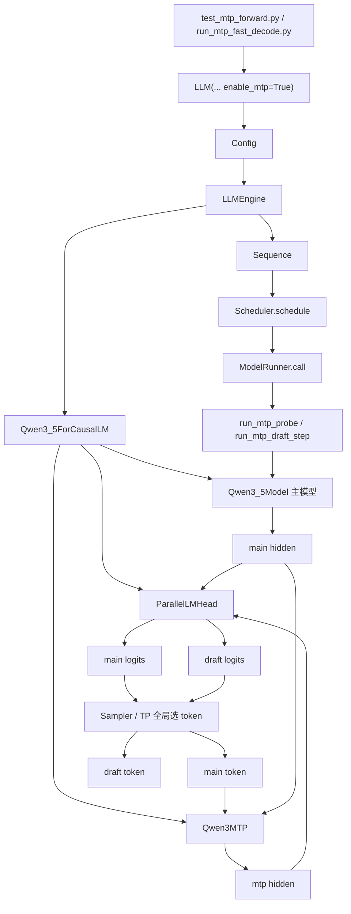
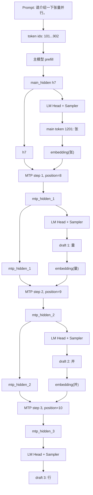
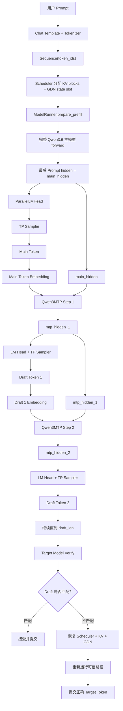

# nano-vLLM-qwen3.6：从 Prompt 到 Main Token，再到 MTP Draft Token 的完整数据流

> 学习目标：不从术语定义出发，而是沿着一次真实请求的执行顺序，理解本项目如何先由 Qwen3.6 主模型生成 `main token`，再利用 `Qwen3MTP` 逐步生成一个或多个 `draft token`。
>
> 分析依据：
>
> - `nanovllm/models/qwen3_mtp.py`
> - `nanovllm/models/qwen3_5.py`
> - `nanovllm/engine/model_runner.py`
> - `nanovllm/engine/llm_engine.py`
> - `nanovllm/engine/scheduler.py`
> - `nanovllm/layers/embed_head.py`
> - `nanovllm/layers/sampler.py`
> - `test_mtp_forward.py`
> - `test_mtp_spec_decode.py`
> - `run_mtp_fast_decode.py`
> - 学习文件《qwen3.6_qwen3_mtp.py_分析》
>
> 文中的 token id 和文字对应关系是为了说明流程而构造的示例，不代表 Qwen3.6 tokenizer 的真实编码结果。

---

# 1. 先记住最终结论

当前项目中的 MTP draft 生成，不是：

```text
输入一个 prompt
  ↓
一次 MTP forward
  ↓
同时吐出 4 个 draft token
```

实际过程是：

```text
输入 prompt
  ↓
完整主模型做一次 prefill
  ↓
主模型生成 1 个 main token
  ↓
MTP forward 第 1 次，生成 draft token 1
  ↓
MTP forward 第 2 次，生成 draft token 2
  ↓
MTP forward 第 3 次，生成 draft token 3
  ↓
……
```

也就是说，虽然名字叫 Multi-Token Prediction，但当前代码是通过循环多次调用 MTP，逐个递推产生多个 draft token。

最核心的数据递推关系是：

```text
主模型最后一个 hidden + main token embedding
  ↓
MTP
  ↓
draft hidden 1 + draft token 1

draft hidden 1 + draft token 1 embedding
  ↓
MTP
  ↓
draft hidden 2 + draft token 2

draft hidden 2 + draft token 2 embedding
  ↓
MTP
  ↓
draft hidden 3 + draft token 3
```

因此，理解本项目 MTP 的关键不是“一个 head 输出多个 token”，而是：

```text
主模型提供第一次上下文状态，
MTP 用 hidden state 和刚生成的 token 进行递推。
```

---

# 2. 一次请求中有哪些 token

假设用户输入：

```text
请介绍一下张量并行。
```

为了便于理解，假设经过 chat template 和 tokenizer 后得到：

```text
prompt token ids =
[101, 205, 330, 417, 582, 690, 777, 902]
```

这里假设最后一个 prompt token 的位置是：

```text
position = 7
```

主模型完成 prefill 后，预测出的下一个 token 是：

```text
main token:
token_id = 1201
text = "张"
```

然后 MTP 继续预测：

```text
draft token 1:
token_id = 1202
text = "量"

draft token 2:
token_id = 1203
text = "并"

draft token 3:
token_id = 1204
text = "行"
```

因此当前这一轮的预览结果是：

```text
主模型正式预测：张
MTP 候选预测：量 并 行
```

但要特别注意：

```text
“张”来自目标主模型，可以作为 main token 提交；
“量、并、行”只是 MTP 猜测，必须经过目标模型 verify 才能最终接受。
```

---

# 3. Main token 和 Draft token 的本质区别

## 3.1 Main token

main token 是完整 Qwen3.6 主模型根据当前真实上下文计算出的下一个 token。

它经过：

```text
完整 Embedding
  ↓
全部 Qwen3_5DecoderLayer
  ↓
full attention / GDN hybrid 状态更新
  ↓
Final Norm
  ↓
LM Head
  ↓
Sampler
```

所以 main token 是当前一轮中目标模型真正给出的结果。

## 3.2 Draft token

draft token 不是完整主模型再次跑一遍得到的，而是较轻的 `Qwen3MTP` 辅助分支预测出来的候选。

它经过：

```text
当前 token embedding
主模型或上一步 MTP hidden
  ↓
Qwen3MTP
  ↓
共享 LM Head
  ↓
Sampler
```

MTP 的计算成本通常应比完整主模型低，但预测可能不正确，因此只能作为候选。

## 3.3 二者的关系

可以把它们理解成：

```text
主模型：
    我确认下一个 token 是“张”。

MTP：
    根据“张”和主模型上下文，我猜后面可能是“量、并、行”。

目标模型 verify：
    我再检查“量、并、行”是否真的是我自己会生成的结果。
```

---

# 4. 完整文件调用关系



各文件分工如下：

| 文件 | 作用 |
|---|---|
| `test_mtp_forward.py` | 创建真实测试请求，调用 `run_mtp_probe` 并打印结果 |
| `run_mtp_fast_decode.py` | 在完整 MTP speculative decode 原型中调用 draft fast path |
| `llm_engine.py` | 将 prompt 编码成 token ids，创建 Sequence |
| `scheduler.py` | 给请求分配 KV blocks、GDN state slot，并决定这是 prefill 还是 decode |
| `qwen3_5.py` | 定义主模型，并在 `enable_mtp=True` 时挂载 `Qwen3MTP` |
| `qwen3_mtp.py` | 定义 MTP 内部结构 |
| `model_runner.py` | 真正执行主模型、采样 main token、循环执行 MTP 并采样 draft token |
| `embed_head.py` | 将 main hidden 或 mtp hidden 映射成 local vocab logits |
| `sampler.py` | 从 logits 中选 token，并在 TP 下提供可比较 score |
| `test_mtp_spec_decode.py` | 在 draft 生成后执行 verify、accept/reject 和 rollback |

---

# 5. 第一步：测试脚本构造 Prompt

`test_mtp_forward.py` 先使用 tokenizer 的 chat template：

```python
prompt = tokenizer.apply_chat_template(
    [{"role": "user", "content": prompt_text}],
    tokenize=False,
    add_generation_prompt=True,
    enable_thinking=False,
)
```

例如原始文本：

```text
请介绍一下张量并行。
```

会被整理成模型习惯的对话格式，大致类似：

```text
<|im_start|>user
请介绍一下张量并行。<|im_end|>
<|im_start|>assistant
```

然后调用：

```python
llm.add_request(
    prompt,
    SamplingParams(temperature=0.0, max_tokens=1),
)
```

这里 `temperature=0.0` 表示测试使用 greedy，即每次直接选择 logits 最大的 token。

---

# 6. 第二步：LLMEngine 将 Prompt 变成 Sequence

`LLMEngine.add_request()` 收到字符串 prompt 后执行：

```text
prompt 字符串
  ↓
tokenizer.encode(prompt)
  ↓
token_ids
  ↓
Sequence(token_ids, sampling_params)
  ↓
scheduler.add(seq)
```

使用前面的示例：

```text
token_ids =
[101, 205, 330, 417, 582, 690, 777, 902]
```

Sequence 此时保存：

```text
seq.token_ids
seq.num_tokens = 8
seq.last_token = 902
seq.block_table = []
seq.state_slot_id = -1
seq.status = WAITING
```

此时还没有运行模型，也没有 main token 或 draft token。

---

# 7. 第三步：Scheduler 调度 Prefill

测试脚本调用：

```python
seqs, is_prefill = llm.scheduler.schedule()
```

这是请求第一次进入模型，所以：

```text
is_prefill = True
```

Scheduler 会做两类资源分配。

## 7.1 KV Cache block

对 full attention 层，Scheduler 通过 `BlockManager` 给请求分配 KV blocks。

## 7.2 GDN state slot

Qwen3.5/Qwen3.6 是 hybrid 模型，包含 GatedDeltaNet 层，因此还会分配：

```text
seq.state_slot_id
```

例如：

```text
seq.block_table = [3]
seq.state_slot_id = 0
```

这表示：

```text
full attention 层的历史信息写入 KV block 3；
GDN 层的 conv/recurrent state 使用 state slot 0。
```

然后请求从 waiting 进入 running。

---

# 8. 第四步：ModelRunner 同时在所有 TP Rank 上执行

测试脚本调用：

```python
result = llm.model_runner.call(
    "run_mtp_probe",
    seqs,
    top_k,
)
```

`ModelRunner.call()` 不只是普通 Python 函数调用。

Tensor Parallel 场景下，rank0 会通知其他 worker rank：

```text
所有 rank：
    同时执行 run_mtp_probe
    同时运行各自的模型 shard
    同时参与 all_reduce / all_gather / broadcast
```

如果 TP=4，可以理解为：

```text
rank0：持有第 0 份模型参数
rank1：持有第 1 份模型参数
rank2：持有第 2 份模型参数
rank3：持有第 3 份模型参数
```

所有 rank 必须按照完全相同的顺序进入分布式通信，否则会发生 collective 死锁。

---

# 9. 第五步：`run_mtp_probe` 进入 `_run_mtp_draft`

`run_mtp_probe()` 实际只是：

```python
return self._run_mtp_draft(
    seqs,
    is_prefill=True,
    top_k=top_k,
)
```

默认：

```text
draft_len = 1
```

如果使用 `run_mtp_draft_step(..., draft_len=3)`，则会循环生成 3 个 draft token。

因此真正需要理解的是：

```text
ModelRunner._run_mtp_draft()
```

它分成两个阶段：

```text
阶段 A：完整主模型产生 main token
阶段 B：Qwen3MTP 循环产生 draft token
```

---

# 10. 阶段 A：准备 Prefill 输入

由于 `is_prefill=True`，首先调用：

```python
input_ids, positions, ... = self.prepare_prefill(seqs)
```

示例：

```text
input_ids =
[101, 205, 330, 417, 582, 690, 777, 902]

positions =
[0, 1, 2, 3, 4, 5, 6, 7]
```

`prepare_prefill()` 还会建立：

```text
cu_seqlens_q
cu_seqlens_k
slot_mapping
block_tables
state_indices
```

它们告诉模型：

```text
哪些 token 属于哪个请求；
每个 token 的 K/V 应该写到哪个 KV slot；
GDN 层应该读写哪个 state slot。
```

这一步是正常主模型 prefill，所以会真实更新该请求的：

```text
KV Cache
GDN conv_state
GDN recurrent_state
```

---

# 11. 阶段 A：完整主模型 Forward

代码执行：

```python
hidden_states = self.model(
    input_ids,
    positions,
    pixel_values=None,
    image_grid_thw=None,
    image_token_mask=None,
)
```

这里的 `self.model` 是：

```text
Qwen3_5ForCausalLM
```

它内部调用：

```text
Embedding
  ↓
Qwen3_5Model
  ↓
Qwen3_5DecoderLayer × N
  ↓
Final GemmaRMSNorm
```

输出形状假设为：

```text
hidden_states.shape = [8, H]
```

其中：

```text
hidden_states[0]：第一个 prompt token 的 hidden
……
hidden_states[7]：最后一个 prompt token 的 hidden
```

每个 hidden 都已经包含模型对当前位置及之前上下文的理解。

---

# 12. 为什么只取最后一个 Prompt Token 的 Hidden

主模型要预测的是 prompt 后面的下一个 token，所以最重要的是最后一个 prompt 位置的 hidden。

代码计算：

```python
last_indices = context.cu_seqlens_q[1:] - 1
main_hidden = hidden_states[last_indices]
```

单请求示例中：

```text
cu_seqlens_q = [0, 8]
last_indices = [7]
```

因此：

```text
main_hidden = hidden_states[7]
main_hidden.shape = [1, H]
```

可以把 `main_hidden` 理解为：

```text
主模型读完整个 prompt 后形成的最终上下文状态。
```

同时计算第一个 MTP 位置：

```python
mtp_positions = positions[last_indices] + 1
```

即：

```text
最后 prompt position = 7
第一个 MTP position = 8
```

因为 MTP 接下来要预测的是主模型 main token 之后的位置。

---

# 13. 阶段 A：Main Hidden 变成 Main Token

代码执行：

```python
logits = self.model.compute_logits(hidden_states)
```

`compute_logits()` 调用 `ParallelLMHead`。

在 prefill 模式下，`ParallelLMHead` 自己也会只取每个请求最后一个 hidden，因此虽然传入的是 `[8,H]`，最终只计算：

```text
main logits shape = [1, V_local]
```

这里：

```text
V_local = vocab_size / tensor_parallel_size
```

每个 rank 只计算自己词表 shard 的 logits。

随后：

```python
main_token_ids = self.sample(
    logits,
    temperatures=None,
    greedy=True,
)
```

每个 rank 先找本地最大 token 和 score，再通过 `all_gather` 比较，rank0 选出完整词表中的全局 token。

示例：

```text
global main token id = 1201
text = "张"
```

这一步完成后：

```text
main_hidden = 主模型对 prompt 的最终上下文表示
main_token = 主模型确认的下一个 token
```

---

# 14. 为什么 Main Token 要 Broadcast 回所有 Rank

`ModelRunner.sample()` 最终由 rank0 得到全局 token。

但是后续每个 rank 都必须执行：

```python
self.model.model.embed_tokens(current_token_tensor)
```

所以代码创建：

```text
main_token_tensor = [1201]
```

再执行：

```python
dist.broadcast(main_token_tensor, src=0)
```

于是所有 TP rank 都知道：

```text
当前全局 main token 是 1201。
```

否则 rank1、rank2、rank3 无法继续执行完全一致的 MTP forward。

---

# 15. 阶段 B：为第一次 MTP Forward 准备三个输入

第一次 MTP forward 的三个输入是：

```text
current_hidden = main_hidden
current_token = main token
current_positions = 最后 prompt position + 1
```

示例：

```text
current_hidden.shape = [1,H]
current_token = [1201]  # “张”
current_positions = [8]
```

然后通过主模型的 embedding table：

```python
inputs_embeds = self.model.model.embed_tokens(
    current_token_tensor
)
```

得到：

```text
inputs_embeds.shape = [1,H]
```

这一步的语义是：

```text
main_hidden：
    模型读完整个 prompt 后的上下文理解。

inputs_embeds：
    明确告诉 MTP，主模型刚刚生成了 token“张”。

position=8：
    告诉 MTP，现在要推演的是 main token 所处的位置。
```

---

# 16. 为什么 MTP 同时需要 Hidden 和 Token Embedding

如果只给 MTP `main_hidden`：

```text
MTP 知道上下文的大致语义，
但没有一个独立输入明确强调刚生成的 token。
```

如果只给 token embedding：

```text
MTP 知道当前 token 是什么，
但不知道前面的完整 prompt 上下文。
```

所以 MTP 将二者分别归一化后拼接：

```text
normalized token embedding [H]
normalized hidden state [H]
  ↓ concat
[2H]
  ↓ fc
[H]
```

它融合的是：

```text
“前文说了什么”
+
“刚刚生成了什么”
```

---

# 17. `Qwen3MTP.forward()` 内部发生什么

## 17.1 两个分支分别归一化

```python
inputs_embeds = self.pre_fc_norm_embedding(inputs_embeds)
hidden_states = self.pre_fc_norm_hidden(hidden_states)
```

因为 embedding 和主模型 hidden 来自不同模块，数值分布可能不同，所以先分别做 GemmaRMSNorm。

## 17.2 拼接并压回 Hidden Size

```python
torch.cat([inputs_embeds, hidden_states], dim=-1)
```

形状：

```text
[1,H] + [1,H] → [1,2H]
```

随后：

```python
self.fc(...)
```

使用 `ReplicatedLinear(2H→H)`：

```text
[1,2H] → [1,H]
```

## 17.3 经过 MTP Decoder Layer

每个 `Qwen3MTPDecoderLayer` 包含：

```text
GemmaRMSNorm
  ↓
Qwen3_5Attention
  ↓
GemmaRMSNorm
  ↓
Qwen3_5MLP
```

与主模型 hybrid layer 不同，MTP layer 固定使用 full attention，不根据 `layer_types` 切换到 GDN。

## 17.4 Final Norm

所有 MTP layer 后再做一次：

```text
Final GemmaRMSNorm
```

输出：

```text
mtp_hidden.shape = [1,H]
```

注意，`Qwen3MTP` 输出的不是 token，也不是 logits，而是一个新的 hidden representation。

---

# 18. 一个容易忽略的关键点：MTP Attention 没有读取主模型 KV Cache

在每一次 draft step 前，`ModelRunner` 会建立临时 Context：

```text
is_prefill = True
cu_seqlens = [0,1]
max_seqlen = 1
slot_mapping = [-1]
block_tables = None
state_indices = None
```

这意味着当前 batch size=1 时，MTP Attention 看到的是一个长度为 1 的临时序列。

更重要的是：

```text
slot_mapping = -1
```

`Attention.store_kvcache()` 遇到 `-1` 会跳过写入，因此 MTP 不会污染真实主模型 KV Cache。

同时：

```text
block_tables = None
```

表示 MTP Attention 不会读取主模型已有 KV blocks。

并且：

```text
state_indices = None
```

表示 MTP 不会使用或更新主模型 GDN recurrent/conv state。

所以当前 MTP draft 的上下文来源主要是：

```text
current_hidden 中已经压缩的上下文信息
+
current token embedding
```

而不是：

```text
MTP 自己重新读取完整 prompt KV Cache。
```

这也是当前实现非常重要的简化。

---

# 19. 第一次 Draft Hidden 如何变成 Draft Token

MTP 返回：

```text
mtp_hidden_1.shape = [1,H]
```

随后复用主模型 LM Head：

```python
draft_logits = self.model.compute_logits(mtp_hidden)
```

得到每个 rank 的：

```text
draft_logits.shape = [1,V_local]
```

再通过同一套 TP sampler：

```python
next_token_ids = self.sample(
    draft_logits,
    temperatures=None,
    greedy=True,
)
```

示例结果：

```text
draft token 1:
token_id = 1202
text = “量”
```

rank0 再把 token 1202 broadcast 给其他 rank。

至此第一次 MTP forward 完成：

```text
输入：
    main_hidden
    embedding(“张”)
    position 8

输出：
    mtp_hidden_1
    draft token “量”
```

---

# 20. 第二、第三个 Draft Token 如何继续生成

第一次 draft 后，代码更新：

```python
current_hidden = mtp_hidden
current_positions = current_positions + 1
current_token_tensor = next_token_tensor
```

因此第二步输入变成：

```text
current_hidden = mtp_hidden_1
current_token = “量”
current_position = 9
```

第二次 MTP：

```text
mtp_hidden_1 + embedding(“量”) + position 9
  ↓
mtp_hidden_2
  ↓
draft token 2 = “并”
```

第三次：

```text
mtp_hidden_2 + embedding(“并”) + position 10
  ↓
mtp_hidden_3
  ↓
draft token 3 = “行”
```

完整示例：



---

# 21. 整个过程中张量形状如何变化

假设：

```text
prompt_len = 8
hidden_size = H
local_vocab_size = V_local
batch_size = 1
draft_len = 3
```

则主要张量如下：

| 阶段 | 张量 | 形状 |
|---|---|---|
| Prompt 输入 | `input_ids` | `[8]` |
| Prompt 位置 | `positions` | `[8]` |
| 主模型输出 | `hidden_states` | `[8,H]` |
| 最后位置 hidden | `main_hidden` | `[1,H]` |
| 主模型 local logits | `main_logits` | `[1,V_local]` |
| Main token | `main_token_tensor` | `[1]` |
| Main token embedding | `inputs_embeds` | `[1,H]` |
| MTP concat | `[embed, hidden]` | `[1,2H]` |
| MTP FC 输出 | fused hidden | `[1,H]` |
| MTP 输出 | `mtp_hidden` | `[1,H]` |
| Draft local logits | `draft_logits` | `[1,V_local]` |
| Draft token | `next_token_tensor` | `[1]` |

后续每个 draft step 的 shape 不变，只是内容和 position 不断更新。

---

# 22. Main Token 和 Draft Token 什么时候写入 Sequence

`_run_mtp_draft()` 只返回：

```text
main_token_ids
draft_token_ids
```

它本身不会把 draft 直接永久追加到 Sequence。

在 `test_mtp_forward.py` 中，它只是打印结果，然后清理请求，所以 main 和 draft 都主要用于 smoke test。

在 `test_mtp_spec_decode.py` 或 `run_mtp_fast_decode.py` 中：

```text
main token：
    先通过 scheduler.postprocess 正式提交。

draft tokens：
    先保存起来；
    等目标模型 verify 后，
    只提交被接受的部分。
```

这说明：

```text
draft 生成阶段和 token 提交阶段是分开的。
```

---

# 23. Draft 生成之后如何 Verify

假设当前已提交 main token“张”，MTP 候选为：

```text
[量, 并, 行]
```

verify 输入会构造成：

```text
[张, 量, 并]
```

主模型依次预测：

```text
输入 张 → 目标 token 量
输入 量 → 目标 token 并
输入 并 → 目标 token 化
```

于是：

```text
draft = [量, 并, 行]
target = [量, 并, 化]
```

前两个匹配，第三个不匹配：

```text
accept_len = 2
```

最终提交：

```text
张、量、并、化
```

其中：

```text
张：
    main token，来自主模型。

量、并：
    MTP draft，但被主模型验证通过。

化：
    第一个错误位置上，主模型给出的正确 token。
```

---

# 24. 为什么 Reject 时必须 Rollback

目标模型 verify 会真实写入：

```text
KV Cache
GDN conv state
GDN recurrent state
```

如果第三个 draft“行”错误，但 verify 已经继续计算了后续状态，那么这些状态已经被错误路径污染。

因此 reject 时需要同时恢复：

## 控制面

```text
Sequence.token_ids
Sequence 计数器
Scheduler waiting/running
BlockManager block_table/hash/ref_count
StateSlotManager
```

## 数据面

```text
KV Cache slots
GDN conv_states
GDN recurrent_states
```

恢复后，再从正确位置重新运行：

```text
last token + 已接受 draft 前缀
```

最后提交正确 target token。

---

# 25. 当前项目已经实现的 MTP 能力

当前仓库已经实现：

1. **MTP 模型结构**  
   `Qwen3MTP` 融合 token embedding 和 hidden state。

2. **MTP 权重加载与检查**  
   能统计 `mtp.*` loaded/skipped 参数。

3. **Main token 生成**  
   完整主模型 prefill/decode 后通过 LM Head 和 Sampler 得到 main token。

4. **多个 Draft token 递推**  
   `draft_len` 次 MTP forward，逐个产生候选。

5. **Tensor Parallel 支持**  
   各 rank 计算 local logits，rank0 选全局 token，再 broadcast 给所有 rank。

6. **MTP probe**  
   可以输出 main token、draft token、top-k、hidden/logits shape。

7. **多种 Verify 路径**  
   支持 eager、CUDA Graph 和实验性 chunk verify。

8. **状态保存恢复**  
   支持 KV Cache、GDN state 和 Scheduler 控制状态 rollback。

9. **正确性测试**  
   可以和 greedy baseline 比较最终 token 序列。

10. **性能指标**  
    可以统计 accept rate、target forward/token、MTP forward/token、reject reruns 和 tok/s。

---

# 26. 当前项目尚未完整实现的部分

## 26.1 没有接入默认 Engine 生成主循环

普通：

```python
llm.generate()
```

仍主要走：

```text
scheduler.schedule
  ↓
model_runner.run
  ↓
scheduler.postprocess
```

MTP speculative decoding 主要由根目录脚本手动组织，并非默认 Engine 策略。

## 26.2 主要支持单请求

很多 MTP/verify 函数明确限制：

```text
batch size = 1
```

还没有完整解决 continuous batching 中，不同请求具有不同 draft_len、accept_len 和 reject 位置的问题。

## 26.3 MTP 路径是 Text-only

MTP probe 和 fast path会检查：

```text
pixel_values is None
image_grid_thw is None
positions 是 1D
```

所以当前没有实现多模态 prompt 的 MTP speculative decoding。

## 26.4 当前主要是 Greedy 验证

代码中的 MTP draft 和 target verify 主要调用：

```text
greedy=True
```

还没有完整实现带温度采样时严格的 speculative acceptance probability。

## 26.5 Draft 不是一次 Forward 并行生成

当前生成 `N` 个 draft，需要：

```text
N 次 MTP forward
```

并非一次 MTP forward 直接输出 N 个位置的 logits。

## 26.6 没有持久化 MTP KV Cache

每一步 MTP 使用长度 1 的临时 Context：

```text
不读取真实 block table
不写真实 KV Cache
```

MTP 依靠 `current_hidden` 递推，不维护自己的长期 KV Cache。

## 26.7 Chunk Verify 仍是实验路径

由于 hybrid 模型有 GDN 递推状态，chunk verify 是否与逐 token decode 完全等价，需要用 trusted eager/graph 结果对比。

## 26.8 尚未证明一定加速

实现 draft 和 verify 不等于性能必然提升。仍要综合比较：

```text
accept_rate
平均 accept_len
MTP forward 成本
verify 成本
TP 通信
snapshot 成本
reject rerun 成本
最终 decode tok/s
```

---

# 27. 从源码学习时最容易产生的四个误解

## 误解一：MTP 一次就输出多个 token

当前代码不是一次 forward 输出多个位置，而是循环多次调用 MTP。

## 误解二：MTP draft 已经写进 KV Cache

MTP 临时 Context 使用 `slot_mapping=-1`，不会写真实 KV Cache。

## 误解三：Draft token 可以直接输出给用户

draft 必须经过 target verify，只有接受的 token 才能提交。

## 误解四：`qwen3_mtp.py` 就是完整 speculative decoding

`qwen3_mtp.py` 只定义模型结构。完整投机解码还依赖 `ModelRunner`、Scheduler、状态回滚和根目录控制脚本。

---

# 28. 最适合记忆的一张总图



---

# 29. 用一句话口述完整 Draft 生成过程

可以这样概括：

> 用户 prompt 先经过 tokenizer 形成 token ids，并由 Scheduler 分配 KV Cache block 和 GDN state slot。`ModelRunner` 在 prefill 阶段运行完整 Qwen3.6 hybrid 主模型，取最后一个 prompt token 的 hidden state 作为 `main_hidden`，再通过共享 LM Head 和 TP sampler 得到主模型确认的 `main token`。随后把 main token 广播到所有 TP rank，并查出它的 embedding；`Qwen3MTP` 将这个 embedding 和 `main_hidden` 分别归一化、拼接并投影，再经过 MTP decoder layer 得到 `mtp_hidden`，通过同一个 LM Head 采样出第一个 draft token。下一步再使用上一步 `mtp_hidden` 和第一个 draft token 的 embedding 继续调用 MTP，以此递推生成多个 draft。MTP 的临时 Context 不读写主模型真实 KV/GDN state，所以 draft 只是候选；后续必须由目标模型 verify，接受匹配 token，拒绝时恢复 Scheduler、KV Cache 和 GDN state。

---

# 30. 最终总结

本项目 MTP draft 生成的真正主线是：

```text
Prompt
  ↓
主模型 Prefill
  ↓
最后 Prompt Hidden
  ↓
Main Token
  ↓
Main Token Embedding + Main Hidden
  ↓
MTP Hidden 1
  ↓
Draft Token 1
  ↓
Draft 1 Embedding + MTP Hidden 1
  ↓
MTP Hidden 2
  ↓
Draft Token 2
  ↓
……
```

其中最关键的三个认识是：

1. **Main token 和 draft token 来源不同**  
   main token 来自完整目标模型；draft token 来自轻量 MTP 分支。

2. **多个 draft 是递推生成的**  
   每个 draft 都需要一次新的 MTP forward，上一步 `mtp_hidden` 会传给下一步。

3. **Draft 只是候选**  
   MTP 临时 forward 不提交真实 KV/GDN state，后续必须通过 target verify；若拒绝，还要恢复控制面和数据面状态。

因此，`qwen3_mtp.py` 解决的是：

```text
“如何根据主模型上下文和当前 token，预测下一个候选 hidden。”
```

而完整 speculative decoding 解决的是：

```text
“如何生成候选、验证候选、提交正确 token，并在错误时恢复状态。”
```

两者结合起来，才构成当前项目中的 MTP draft 与投机解码实验链路。


%% 项目关联导航：开始 %%
## 项目关联导航

- 所属模块：[[outputs/项目整理/模块-nanovllm项目面试准备|模块-nanovllm项目面试准备]]

%% 项目关联导航：结束 %%
