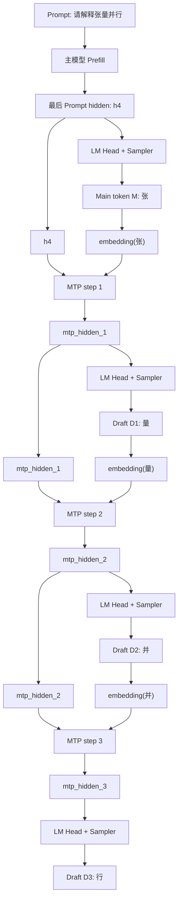
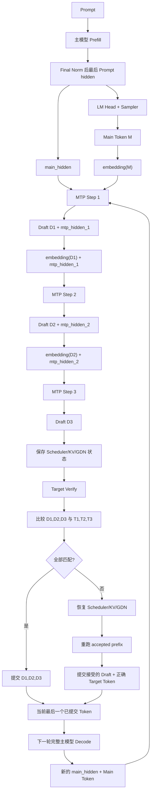

# nano-vLLM-qwen3.6：MTP 流程纠正、`main_hidden` 与 Token Embedding，以及加速原理

> 本文针对以下三个问题展开：
>
> 1. 纠正并重新组织“主模型生成 main token，MTP 生成 3 个 draft token，再由主模型验证”的整体理解。
> 2. 解释 `main_hidden` 和 token embedding 到底是什么、分别来自哪里。
> 3. 分析为什么验证阶段仍然需要主模型 forward，以及 MTP 理论上的节省体现在哪里；同时明确当前项目哪些路径真正具备潜在加速条件，哪些只是正确性原型。
>
> 分析依据包括：
>
> - `nanovllm/models/qwen3_mtp.py`
> - `nanovllm/models/qwen3_5.py`
> - `nanovllm/engine/model_runner.py`
> - `run_mtp_fast_decode.py`
> - 《qwen3.6_qwen3_mtp.py_分析》

---

# 1. 先纠正你当前的整体理解

你目前的理解大体抓住了：

```text
主模型产生 main token
  ↓
MTP 产生多个 draft token
  ↓
主模型验证 draft
  ↓
接受正确的前缀
```

这条主线是对的，但有四处需要修正。

## 1.1 修正一：Prefill 本身不是“直接生成 token”

更准确的过程是：

```text
Prompt token ids
  ↓
主模型 Prefill
  ↓
得到每个 Prompt 位置的 hidden states
  ↓
取最后一个 Prompt 位置的 hidden
  ↓
LM Head
  ↓
logits
  ↓
Sampler
  ↓
第一个生成 token，也就是 main token
```

因此应当说：

> 主模型先对完整 Prompt 做 prefill，建立 KV Cache 和 GDN state，并产生最后一个 Prompt 位置的隐藏状态；该隐藏状态经过 LM Head 和 Sampler 后，才得到第一个生成 token。

## 1.2 修正二：MTP 模块不是“只有 Attention 层”

`Qwen3MTPDecoderLayer` 固定使用 full attention，但它并不是只有 Attention。

单个 MTP decoder layer 包含：

```text
GemmaRMSNorm
  ↓
Qwen3_5Attention
  ↓
GemmaRMSNorm
  ↓
Qwen3_5MLP
```

因此更准确的说法是：

> MTP 分支使用一个或多个精简的 full-attention Transformer decoder layer。它复用了 Qwen3.5/Qwen3.6 的 Attention、MLP 和 GemmaRMSNorm，但不采用主模型的 full-attention/GDN hybrid 层选择。

区别如下：

| 模块 | 层结构 |
|---|---|
| 主模型 `Qwen3_5DecoderLayer` | 根据 `layer_types` 选择 full attention 或 GatedDeltaNet，然后接 MLP |
| MTP `Qwen3MTPDecoderLayer` | 固定使用 full attention，然后接 MLP |
| MTP 是否等于完整主模型 | 不是，只是层数更少的辅助预测分支 |

所以不能说 MTP 是完整 Qwen3 模型，也不能说 MTP 只有 Attention、没有 MLP。

## 1.3 修正三：3 个 Draft Token 是 3 次 MTP Forward 递推生成的

假设：

```text
draft_len = 3
```

当前项目并不是一次 MTP forward 同时输出 3 个位置，而是：

```text
MTP forward 1 → draft token 1
MTP forward 2 → draft token 2
MTP forward 3 → draft token 3
```

递推关系是：

```text
main_hidden + embedding(main token)
  ↓
MTP
  ↓
mtp_hidden_1 + draft token 1

mtp_hidden_1 + embedding(draft token 1)
  ↓
MTP
  ↓
mtp_hidden_2 + draft token 2

mtp_hidden_2 + embedding(draft token 2)
  ↓
MTP
  ↓
mtp_hidden_3 + draft token 3
```

所以“多 token 预测”在当前实现中，表现为使用较小的 MTP 模块连续预测多个 token，而不是一次 forward 直接输出 3 个 token。

## 1.4 修正四：接受 Draft 后，不是直接继续旧的 MTP 链

你原来的表述是：

> 验证几个成功就接受几个，之后采用最后一个成功的 token 继续进行 MTP 预测。

这句话少了一个关键步骤：**下一轮必须先重新经过一次完整主模型 decode。**

正确过程是：

```text
接受若干 draft token
  ↓
这些 token 被提交进 Sequence
  ↓
下一轮取当前最后一个已提交 token
  ↓
完整主模型做一次 decode forward
  ↓
得到新的 main_hidden 和新的 main token
  ↓
再从新的 main token 开始生成下一批 draft
```

因此不是：

```text
最后一个成功 draft
  ↓
直接沿用旧 mtp_hidden 继续无限预测
```

而是：

```text
最后一个已提交 token
  ↓
完整主模型重新校准
  ↓
产生新的 main token/main_hidden
  ↓
再启动新一轮 MTP draft
```

---

# 2. 重新组织后的完整回答

可以把本项目 MTP 流程表述为：

> 一次请求首先由主模型对 Prompt 做 prefill。Prefill 会处理所有 Prompt token，并为 full-attention 层建立 KV Cache，为 GatedDeltaNet 层更新 conv state 和 recurrent state。主模型输出所有 Prompt 位置经过最终 GemmaRMSNorm 后的 hidden states，系统取最后一个 Prompt 位置的 hidden，经过共享 LM Head 和 greedy sampler 得到第一个生成 token，即 main token。
>
> 随后进入 MTP draft 阶段。系统将 `main_hidden` 与 main token 在主模型 embedding 表中查出的 token embedding 一起输入 `Qwen3MTP`。MTP 先分别归一化二者，再拼接并通过 `2H→H` 的融合线性层，然后经过一个或多个由 full attention、MLP 和 GemmaRMSNorm 组成的 MTP decoder layer，输出 `mtp_hidden`。`mtp_hidden` 再经过共享 LM Head 和 Sampler 得到第一个 draft token。
>
> 若配置 `draft_len=3`，项目会重复调用三次 MTP：上一步的 `mtp_hidden` 作为下一步 hidden，上一步 draft token 的 embedding 作为下一步 token 输入，从而递推得到三个 draft token。
>
> Draft token 只是候选，不能直接提交。目标主模型随后验证这些候选。Eager 路径会逐 token 运行完整主模型；Graph 路径把多个顺序 decode step 捕获到一个 CUDA Graph 中；Chunk 路径尝试用一次 prefill-style forward 验证多个 token，但由于主模型含 GDN 递推状态，目前仍属于实验路径。
>
> 验证时从第一个 draft 开始比较，连续匹配的 draft 被接受。一旦遇到第一个不匹配 token，后面的 draft 全部丢弃，并恢复 Scheduler、KV Cache 与 GDN state，再重新运行已接受前缀，提交目标模型给出的正确 token。下一轮从当前最后一个已提交 token 开始，先运行完整主模型得到新的 main token，再启动新一轮 MTP。

---

# 3. 使用具体 Token 示例理解完整过程

假设 Prompt 是：

```text
请解释张量并行。
```

为了便于说明，假设 tokenizer 得到：

```text
Prompt tokens:
[P0, P1, P2, P3, P4]
```

主模型 prefill 后预测：

```text
main token M = “张”
```

MTP 设置：

```text
draft_len = 3
```

依次预测：

```text
D1 = “量”
D2 = “并”
D3 = “行”
```

## 3.1 主模型 Prefill

```text
[P0, P1, P2, P3, P4]
  ↓
完整 Qwen3.6 Hybrid 主模型
  ↓
[h0, h1, h2, h3, h4]
```

取：

```text
main_hidden = h4
```

然后：

```text
h4
  ↓
LM Head
  ↓
logits
  ↓
Sampler
  ↓
M = “张”
```

## 3.2 MTP 预测第一个 Draft

```text
main_hidden h4
+
embedding(“张”)
+
position 5
  ↓
Qwen3MTP
  ↓
mtp_hidden_1
  ↓
LM Head + Sampler
  ↓
D1 = “量”
```

## 3.3 MTP 预测第二个 Draft

```text
mtp_hidden_1
+
embedding(“量”)
+
position 6
  ↓
Qwen3MTP
  ↓
mtp_hidden_2
  ↓
LM Head + Sampler
  ↓
D2 = “并”
```

## 3.4 MTP 预测第三个 Draft

```text
mtp_hidden_2
+
embedding(“并”)
+
position 7
  ↓
Qwen3MTP
  ↓
mtp_hidden_3
  ↓
LM Head + Sampler
  ↓
D3 = “行”
```

## 3.5 Draft 生成总图



---

# 4. `main_hidden` 到底是什么

你的理解基本正确：

> `main_hidden` 是主模型最后一个有效输入位置经过全部 Decoder Layer 和模型最终 GemmaRMSNorm 后、尚未进入 LM Head 的隐藏向量。

在 prefill 阶段：

```text
Prompt 所有 token
  ↓
Embedding
  ↓
全部 Qwen3_5DecoderLayer
  ↓
Final GemmaRMSNorm
  ↓
hidden_states [prompt_len, hidden_size]
```

系统取最后一个 Prompt token 对应的：

```text
hidden_states[-1]
```

作为：

```text
main_hidden
```

它位于：

```text
Final Norm 之后
LM Head 之前
```

之所以叫 `main_hidden`，是因为它来自完整目标主模型，而不是 MTP 分支。

可以区分：

```text
main_hidden:
    完整主模型输出的 hidden

mtp_hidden:
    Qwen3MTP 输出的 hidden
```

二者都可以送入共享 LM Head：

```text
main_hidden → main logits → main token
mtp_hidden  → draft logits → draft token
```

后续 decode 阶段，`main_hidden` 是当前最后一个已提交 token 经过完整主模型和 final norm 后、LM Head 前的 hidden。

---

# 5. Token Embedding 到底是什么

Token 本身首先是一个整数 ID，例如：

```text
token_id = 1201
```

模型中有一个 embedding 权重表：

```text
Embedding Table:
[vocab_size, hidden_size]
```

通过：

```python
embed_tokens(token_id)
```

查出该 token 对应的一行：

```text
token_id 1201
  ↓
Embedding Table
  ↓
embedding vector [hidden_size]
```

所以 token embedding 是：

```text
刚生成 token 对应的稠密向量表示
```

而不是 token id 本身。

例如：

```text
Main token = “张”
Main token id = 1201
Main token embedding = EmbeddingTable[1201]
```

MTP 输入的不是字符串“张”，也不是整数 1201，而是查表得到的 hidden-size 向量。

## 5.1 Main Hidden 和 Token Embedding 的区别

| 对比项 | `main_hidden` | token embedding |
|---|---|---|
| 来源 | 完整主模型输出 | Embedding table 查表 |
| 是否包含完整上下文 | 是 | 否 |
| 是否经过所有 Decoder Layer | 是 | 否 |
| 表示什么 | 当前上下文经过深层计算后的语义状态 | 某个 token 自身的初始向量表示 |
| 在 MTP 中的作用 | 提供上下文与主模型知识 | 明确告诉 MTP 刚生成了哪个 token |

可以把它们理解成：

```text
main_hidden:
    “结合整段前文后，我现在理解到了什么。”

token embedding:
    “刚刚生成的这个 token 本身是什么。”
```

---

# 6. 为什么是 `main_hidden + main token embedding`

这里存在一个时间上的错位关系。

`main_hidden` 来自最后一个 Prompt 位置，它负责预测 main token：

```text
main_hidden_t
  ↓ LM Head
main token x_(t+1)
```

当 main token 选出来后，MTP 要继续预测 main token 后面的 token，于是输入：

```text
main_hidden_t
+
embedding(x_(t+1))
+
position t+1
  ↓
MTP
  ↓
mtp_hidden_(t+1)
  ↓ LM Head
draft token x_(t+2)
```

因此：

```text
main_hidden 不是 main token 已经经过主模型后的 hidden；
它是用于预测 main token 的上一个位置 hidden。
```

MTP 结合“上一个位置的上下文状态”和“刚生成的 token 内容”，近似推演下一位置 hidden。

---

# 7. MTP Decoder Layer 是否等于完整 Qwen3.6

不是。

主模型可能有很多层，每层根据 `layer_types` 选择：

```text
full attention
或
GatedDeltaNet
```

MTP 则只包含配置指定的少量 MTP layer，每个 layer 固定为：

```text
Full Attention + MLP
```

MTP 更轻的主要原因是：

```text
层数远少于完整主模型
```

而不是完全不做 Attention，也不是只有一个简单线性层。

---

# 8. 主模型验证时是否仍要多次 Forward

## 8.1 当前 Eager Verify：是的

你的质疑完全正确。

当前 eager verify 内部是：

```text
for 每个 verify input token:
    prepare_decode
    完整主模型 forward
    得到 target token
```

假设有 3 个 draft：

```text
[D1,D2,D3]
```

验证输入是：

```text
[Main,D1,D2]
```

会执行 3 次完整主模型 decode forward，分别得到：

```text
[T1,T2,T3]
```

然后比较：

```text
D1 ?= T1
D2 ?= T2
D3 ?= T3
```

因此 eager verify 从目标模型计算量看，并没有减少 forward 次数。它主要是正确性基线，而不是最终加速路径。

## 8.2 为什么验证输入不是 `[D1,D2,D3]`

自回归模型的逻辑是：

```text
输入当前位置 token
预测下一个 token
```

所以：

```text
输入 Main → 预测 D1 是否正确
输入 D1   → 预测 D2 是否正确
输入 D2   → 预测 D3 是否正确
```

因此 verify 输入为：

```text
[Main,D1,D2]
```

输出 target 为：

```text
[T1,T2,T3]
```

再与 draft `[D1,D2,D3]` 比较。这就是 one-token shift。

---

# 9. MTP 理论上的节省体现在哪里

真正的 speculative decoding 关键不是只让小模型猜 token，而是：

```text
目标模型能在一次多-token forward 中验证多个候选。
```

对于纯 Transformer，可以将：

```text
[Main,D1,D2]
```

作为一个长度为 3 的 causal chunk 输入目标模型。

由于 causal mask：

```text
Main 位置只看过去；
D1 位置能看 Main；
D2 位置能看 Main 和 D1。
```

目标模型可以在一次 forward 中同时输出：

```text
预测 D1 的 logits
预测 D2 的 logits
预测 D3 的 logits
```

这样原本 3 次 target decode forward，理论上可变成 1 次 multi-token target forward。

GPU 对单 token decode 的利用率常常较低，而 multi-token forward 的矩阵更大、并行度更高、kernel launch 更少，因此平均每个被接受 token 的成本可能降低。

同时，MTP 比主模型浅。假设主模型 40 层，MTP 只有 1 层，那么 3 次 MTP forward 通常比 3 次 40 层主模型 forward 便宜得多。

---

# 10. 当前项目三种 Verify 路径分别节省什么

## 10.1 Eager Verify

```text
3 个 draft
  ↓
3 次完整主模型 decode forward
```

它不节省目标模型计算，主要用于验证正确性。

## 10.2 Graph Verify

Graph 路径把多个顺序 decode step 捕获在一个 CUDA Graph 中：

```text
一次 graph replay
  ↓
内部仍顺序执行多个主模型 decode step
```

它主要节省：

```text
Python 调度
CPU→GPU kernel launch
部分固定输入准备
```

但没有减少目标模型逻辑 step 数和主体 FLOPs。

## 10.3 Chunk Verify

Chunk 路径尝试：

```text
[Main,D1,D2]
  ↓
一次 prefill-style 主模型 forward
  ↓
同时得到 T1,T2,T3
```

这最接近理论上的批量验证。

但当前主模型是 hybrid：

```text
Full Attention 层使用 KV Cache
GDN 层使用 recurrent/conv state
```

Attention 可以借助 causal mask一次处理多个 token，但 GDN state 必须严格递推更新。如何保证 chunk 后的 GDN state 与逐 token decode 完全一致，是难点。

因此当前项目会：

```text
先执行 chunk verify
  ↓
恢复状态
  ↓
再执行 trusted eager/graph verify
  ↓
比较 token 是否一致
```

这说明 chunk 路径仍属于实验验证阶段。

---

# 11. 为什么当前实现未必加速，甚至可能更慢

假设要得到：

```text
Main + 3 个后续 token
```

普通自回归需要：

```text
4 次完整主模型 forward
```

当前 eager MTP 原型需要：

```text
1 次主模型 forward → Main
3 次 MTP forward → 3 个 Draft
3 次主模型 forward → 逐个 Verify
```

总计仍是：

```text
4 次完整主模型 forward
+
3 次 MTP forward
+
状态保存与通信
```

所以 eager 模式没有减少目标模型 forward，反而增加额外开销，可能更慢。

理想 speculative decoding 则是：

```text
1 次主模型 forward → Main
3 次小 MTP forward → 3 个 Draft
1 次主模型 chunk forward → 同时验证 3 个 Draft
```

若 3 个 draft 全部接受，则目标模型调用从 4 次降到约 2 次，这才是理论收益来源。

---

# 12. 真正加速需要满足的条件

1. **MTP 足够轻**  
   MTP forward 成本要远低于完整主模型。

2. **Draft 接受率足够高**  
   否则大量 draft 计算会被浪费。

3. **目标模型能够批量验证**  
   不能仍然逐 token 完整 forward。

4. **Rollback 成本可控**  
   Reject 频繁时，恢复 KV/GDN state 和 rerun 会抵消收益。

5. **工程开销足够低**  
   包括 TP 通信、snapshot clone、CUDA Graph 输入复制和 Scheduler 提交。

因此必须综合看：

```text
accept_rate
average accept_len
target_forwards_per_token
mtp_forwards_per_token
reject_reruns
decode_tok_s
greedy_match
```

只看“生成了多个 draft”不能证明加速。

---

# 13. 接受后下一轮从哪里开始

假设：

```text
Main = 张
Draft = [量,并,行]
Target = [量,并,化]
```

最终提交：

```text
张、量、并、化
```

当前 Sequence 最后 token 是：

```text
化
```

下一轮不是直接使用旧 `mtp_hidden` 继续预测，而是：

```text
完整主模型输入“化”
  ↓
结合已有 KV Cache/GDN state 做 decode
  ↓
得到新的 main_hidden
  ↓
生成新的 main token
  ↓
再用新的 main_hidden + 新 main token embedding 启动 MTP
```

这样每一轮都由目标模型重新校准候选链。

---

# 14. 完整正确流程图



---

# 15. 当前项目已经实现和尚未完整实现的边界

## 已经实现

```text
主模型 Prefill/Decode
main_hidden 提取
main token 采样
多次 MTP 递推生成 Draft
TP 下 token/score 汇聚与 broadcast
Eager/Graph/Chunk verify
最长接受前缀
KV Cache 与 GDN state 保存恢复
Scheduler 状态恢复
Greedy baseline 对齐
性能指标统计
```

## 尚未完整实现

```text
默认 LLMEngine.step 内置 MTP 调度
多请求 continuous batching 下的完整 MTP
多模态 MTP
随机采样下标准 acceptance probability
一次 MTP forward 并行产出多个位置
成熟且无需 trusted rerun 的 hybrid chunk verify
已被实验证明的稳定加速
生产级 speculative decoding serving
```

---

# 16. 三个问题的直接回答

## 问题一：你的流程如何改正

> 主模型对 Prompt 做 prefill，取最后 Prompt 位置 final norm 后、LM Head 前的 hidden 作为 `main_hidden`；`main_hidden` 经 LM Head 和 Sampler 得到 main token。MTP 使用 `main_hidden + main token embedding` 产生第一个 `mtp_hidden` 和 draft token；后续使用“上一步 `mtp_hidden` + 上一步 draft token embedding”递推产生更多 draft。MTP decoder layer 不是只有 Attention，而是 full attention、MLP 和 GemmaRMSNorm 的精简 Transformer 层。Draft 经目标模型验证后只接受最长连续正确前缀；若出现错误则恢复状态并提交正确 target token。下一轮必须先由完整主模型处理最后一个已提交 token，得到新的 main token/main_hidden，再启动下一轮 MTP。

## 问题二：`main_hidden` 和 token embedding 是什么

```text
main_hidden:
    完整主模型经过所有 Decoder Layer 和最终 GemmaRMSNorm 后，
    尚未进入 LM Head 的隐藏向量。
```

```text
token embedding:
    用刚生成的 token id 在 Embedding Table 中查出的 hidden-size 向量。
```

它不是 token id，也不是 LM Head 输出。

## 问题三：验证仍多次 Forward，节省在哪里

对当前 eager verify 而言，你的质疑是正确的：

```text
每个 draft 仍执行一次完整目标模型 forward，
因此没有减少目标模型 forward 数，
该路径主要用于正确性验证。
```

Graph verify 主要减少 kernel launch 和 Python 调度开销，但仍执行多个顺序 decode step。

真正理论收益来自 chunk verify：

```text
目标模型一次 multi-token forward
同时验证多个 draft token。
```

再配合较小的 MTP 模块和较高接受率，才可能降低平均每个已接受 token 的目标模型成本。

当前项目已搭建该原型，但 hybrid GDN 状态一致性使 chunk verify 仍需可信路径复核，因此尚不能宣称已经获得明确加速。

---

# 17. 最终记忆版本

```text
Prompt
  ↓
完整主模型
  ↓
main_hidden
  ↓ LM Head
main token
  ↓
main_hidden + embedding(main token)
  ↓
MTP
  ↓
draft token 1
  ↓
mtp_hidden_1 + embedding(draft token 1)
  ↓
MTP
  ↓
draft token 2
  ↓
……
  ↓
目标模型批量或逐步验证
  ↓
接受最长正确前缀
  ↓
错误时回滚
  ↓
从最后已提交 token 重新进入完整主模型
```

MTP 真正想节省的不是完全不再运行主模型，而是：

```text
用较小模块低成本猜多个 token，
再让目标模型用一次高效的多 token forward 验证它们，
从而降低平均每个已接受 token 的目标模型执行成本。
```

当前项目的 eager 路径主要验证正确性，graph 路径主要降低调度开销，chunk 路径才最接近理论加速方向，但仍处于实验验证阶段。


%% 项目关联导航：开始 %%
## 项目关联导航

- 所属模块：[[outputs/项目整理/模块-nanovllm项目面试准备|模块-nanovllm项目面试准备]]

%% 项目关联导航：结束 %%
